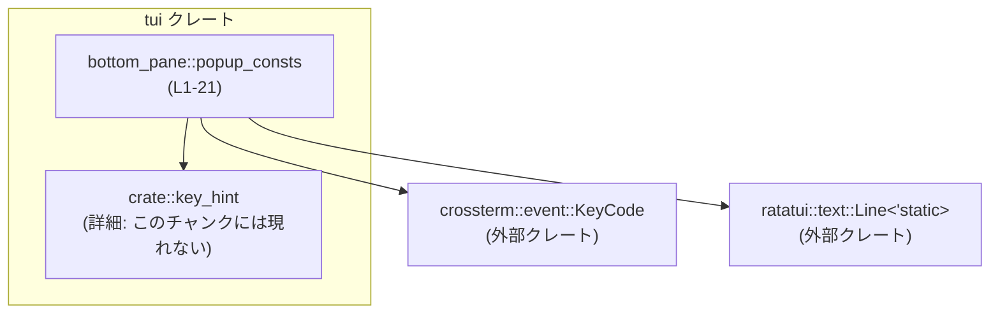
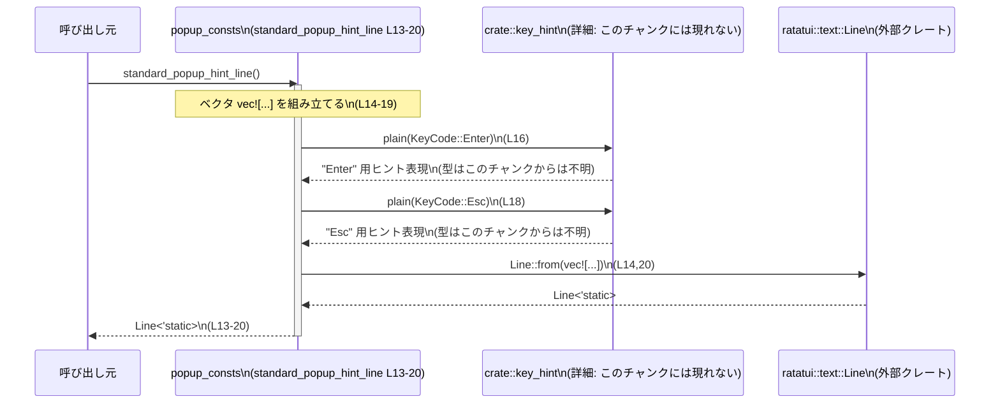

# tui/src/bottom_pane/popup_consts.rs コード解説

## 0. ざっくり一言

bottom pane のポップアップで共通利用する「行数上限」と「フッターのキーヒント行」を提供する、小さなユーティリティモジュールです（`tui/src/bottom_pane/popup_consts.rs:L1-1,8-20`）。

---

## 1. このモジュールの役割

### 1.1 概要

- bottom pane に表示される各種ポップアップに対して、
  - 表示行数の上限（`MAX_POPUP_ROWS`）をひとつにまとめる（`L8-10`）。
  - 「Enterで確定、Escで戻る」という標準的なフッターヒント行を生成する関数を提供する（`L12-20`）。
- これにより、UI の一貫性（行数・キーヒント表現）を保ちやすくしています。

### 1.2 アーキテクチャ内での位置づけ

このモジュール自体は状態を持たず、他の UI コンポーネントから呼び出される「定数・ヘルパー提供モジュール」という位置づけです。

依存関係は次の通りです（このチャンク 1/1 に含まれる情報のみ）:

- 依存先:
  - `crate::key_hint` モジュール（`L6,16,18`）
  - 外部クレート `crossterm::event::KeyCode`（`L3,16,18`）
  - 外部クレート `ratatui::text::Line`（`L4,13-20`）



### 1.3 設計上のポイント

- **責務の分割**
  - 「ポップアップ共通の UI 設定」をこのモジュールに集約しています。
    - 行数上限: `MAX_POPUP_ROWS`（`L8-10`）
    - 標準フッターヒント: `standard_popup_hint_line`（`L12-20`）
- **公開範囲**
  - いずれも `pub(crate)` であり、クレート内限定の API です（`L10,13`）。
- **状態・副作用**
  - グローバルな可変状態はなく、関数は純粋に `Line<'static>` を組み立てて返すだけです（`L13-20`）。
  - I/O やログ出力などの副作用はありません。
- **エラーハンドリング**
  - `Result` や `Option` は使われておらず、パニックを起こしそうな箇所もありません（単純な定数とオブジェクト構築のみ、`L10,13-20`）。
- **並行性**
  - 共有可変状態や `static mut` が無いため、複数スレッドから同時に利用してもデータ競合を起こさない構造になっています（`L1-21` 全体）。
- **キー表示の委譲**
  - キー名（Enter / Esc）の表示形式は `crate::key_hint::plain` に委譲しており、一箇所でスタイルを統一できる設計です（`L16,18`）。

---

## 2. 主要な機能一覧（コンポーネントインベントリー）

このファイル内で定義されるコンポーネントを一覧します。

| 名前 | 種別 | 説明 | 行番号 |
|------|------|------|--------|
| `MAX_POPUP_ROWS` | 定数 (`usize`) | すべてのポップアップで使用する表示行数上限。UI の一貫性維持が目的。 | `tui/src/bottom_pane/popup_consts.rs:L8-10` |
| `standard_popup_hint_line` | 関数 | 「Press Enter to confirm or Esc to go back」という標準フッターヒントを表す `Line<'static>` を生成する。 | `tui/src/bottom_pane/popup_consts.rs:L12-20` |

---

## 3. 公開 API と詳細解説

### 3.1 型一覧（このモジュールで利用する主な型）

このファイル自身は新しい構造体・列挙体を定義していません。ここでは、利用している外部型を整理します。

| 名前 | 種別 | 役割 / 用途 | 定義元 | 使用行 |
|------|------|-------------|--------|--------|
| `KeyCode` | 列挙体 | キーボード入力のキーコードを表す。ここでは `Enter` と `Esc` の表現に利用。 | `crossterm::event::KeyCode`（外部クレート） | `L3,16,18` |
| `Line<'static>` | 構造体 | ratatui の 1 行分のテキスト（スタイル付きスパンの列）を表す。ここではフッター用のヒント行として使用。 | `ratatui::text::Line`（外部クレート） | `L4,13-20` |

> `Line<'static>` の `'static` ライフタイムは、「この行がプログラム全体のライフタイムにわたって有効なデータから構成されている」ことを意味します。呼び出し側はライフタイム管理を意識せずに値を保持できます。

### 3.2 関数詳細

#### `standard_popup_hint_line() -> Line<'static>`

**概要**

- ポップアップで共通使用されるフッターのヒント行を構築して返します（`L12-20`）。
- 具体的なテキストは英語で「Press Enter to confirm or Esc to go back」です（`L14-19`）。

**引数**

- 引数はありません。

**戻り値**

- 型: `Line<'static>`（`L13`）
- 内容:
  - 5 要素からなるテキストスパンの列を 1 行としてまとめたものです（`L14-20`）。
    1. `"Press "`（`L15`）
    2. `key_hint::plain(KeyCode::Enter)` の結果（`L16`）
    3. `" to confirm or "`（`L17`）
    4. `key_hint::plain(KeyCode::Esc)` の結果（`L18`）
    5. `" to go back"`（`L19`）

**内部処理の流れ（アルゴリズム）**

コード: `tui/src/bottom_pane/popup_consts.rs:L13-20`

1. ベクタ `vec![ ... ]` で 5 つの要素からなるリストを作成します（`L14-19`）。
   - 各 `"..."` は `&'static str` としてリテラルから生成され、`.into()` によって `Line::from` が受け付ける型（おそらく `Span` または `Cow<'static, str>` 系）に変換されます（`L15,17,19`）。
2. Enter キー用の表示:
   - `key_hint::plain(KeyCode::Enter)` を呼び出し、Enter キーを表す表示用オブジェクトを取得し（`L16`）、
   - `.into()` で同じく `Line::from` が受け付ける型に変換します（`L16`）。
3. Esc キー用の表示:
   - `key_hint::plain(KeyCode::Esc)` を呼び出し、Escape キー用の表示オブジェクトを取得し（`L18`）、
   - `.into()` で変換します（`L18`）。
4. `Line::from(vec![ ... ])` を呼び出し、上記 5 要素を 1 行の `Line<'static>` に変換します（`L14,20`）。
5. 生成した `Line<'static>` をそのまま呼び出し元に返します（`L13-20`）。

**Rust 的な安全性・並行性の観点**

- **所有権 / ライフタイム**
  - 返り値は `Line<'static>` であり、関数内部で生成された `'static` なデータから構成されます（`L13-20`）。
  - ライフタイム引数は `'static` 固定のため、呼び出し側は「いつまで保持してよいか」を意識せずに、そのまま構造体内に保持できます。
- **エラー**
  - 関数は例外的な状況に応じたエラー型を返さず、パニックを起こすような処理（`unwrap`・インデックスアクセスなど）も含んでいません（`L13-20`）。
  - `Line::from` や `.into()` は通常パニックを起こさない純粋な変換処理です。
- **並行性**
  - グローバルな可変状態を扱わない、純粋関数です（`L13-20`）。
  - 同じ関数を複数スレッドから同時に呼び出しても、競合状態は発生しません。

**Examples（使用例）**

以下は、ratatui を用いてポップアップのフッターを描画する例です。  
モジュールパスは、このファイルパスから推測される標準的なもの（`crate::bottom_pane::popup_consts`）を使用しています。

```rust
use ratatui::{
    backend::Backend,                                        // バックエンド（端末出力の実装）
    layout::{Constraint, Direction, Layout, Rect},           // レイアウト関連
    widgets::{Block, Borders, Paragraph},                    // ウィジェット
    Frame,                                                   // フレーム
};
use crate::bottom_pane::popup_consts::{                     // このモジュールの API をインポート
    MAX_POPUP_ROWS,                                         // 行数上限（L8-10）
    standard_popup_hint_line,                               // フッターヒント生成関数（L12-20）
};

fn render_popup<B: Backend>(f: &mut Frame<B>, area: Rect) {  // ポップアップ描画関数の例
    // ポップアップ全体のレイアウトを決める（上部コンテンツ + フッター）
    let chunks = Layout::default()
        .direction(Direction::Vertical)
        .constraints([
            Constraint::Length(MAX_POPUP_ROWS as u16),       // 行数上限をここで使用（L8-10）
            Constraint::Length(1),                           // フッターは 1 行
        ])
        .split(area);

    // フッター用のヒント行を取得（L13-20）
    let footer_line = standard_popup_hint_line();

    // フッターを Paragraph に包んで描画
    let footer = Paragraph::new(footer_line)
        .block(Block::default().borders(Borders::TOP));      // 上側に罫線を引く例

    f.render_widget(footer, chunks[1]);                      // 下側チャンクにフッターを描画
}
```

> この例は、`MAX_POPUP_ROWS` と `standard_popup_hint_line` の典型的な利用イメージを示すためのものであり、実際のクレート構成や UI 実装はこのチャンクからは分かりません。

**Errors / Panics**

- この関数はエラーを返さず、実装上の明確なパニック要因もありません（`L13-20`）。
- パニックが起こり得るとすれば、外部依存ライブラリ `ratatui` や `crate::key_hint` 内部の仕様変更によるものですが、その詳細はこのチャンクでは分かりません。

**Edge cases（エッジケース）**

- 引数が無いため、入力に関するエッジケースは存在しません。
- 生成されるテキストは常に同一であり、環境や状態によって変化しません（`L14-19`）。
- ロケールや言語設定に応じた切り替えは行っていません（英語固定の文字列のみ、`L15,17,19`）。

**使用上の注意点**

- **キー動作との整合性**
  - 文言は「Enter で確定、Esc で戻る」を意味しています（`L15-19`）。
  - 実際のキーイベント処理が `Enter` / `Esc` に紐づいていない場合、表示内容と挙動が食い違う可能性があります。
- **再利用性**
  - 毎回新しい `Line<'static>` を生成しますが、とても軽量な処理です（小さなベクタ生成のみ、`L14-20`）。
  - 性能要求が極端に厳しくない限り、キャッシュ等は不要と考えられます。
- **表示スタイルの統一**
  - キーの見せ方（例えば `[Enter]` / `<Enter>` / `ENTER` など）は `key_hint::plain` に委譲されています（`L16,18`）。
  - キー表示のスタイルを変更したい場合は `crate::key_hint` 側を変更するのが自然です。

### 3.3 定数一覧

このモジュールで定義される定数について整理します。

| 名前 | 型 | 値 | 役割 / 用途 | 行番号 |
|------|----|----|-------------|--------|
| `MAX_POPUP_ROWS` | `usize` | `8` | どのポップアップでも共通に用いる「最大行数」。コメントに「全ポップアップでこれを使い、統一感を保つ」と明記されている。 | `tui/src/bottom_pane/popup_consts.rs:L8-10` |

**契約（Contract）的な意味**

- コメントより:
  - 「Maximum number of rows any popup should attempt to display.」（`L8`）
  - 「Keep this consistent across all popups for a uniform feel.」（`L9`）
- これにより、「ポップアップを実装する側は、この定数を使うことが期待されている」と解釈できます。
  - 別の値をハードコードすると、UI の一貫性が損なわれる可能性があります。

---

## 4. データフロー

ここでは、`standard_popup_hint_line` を呼び出す際のデータフローと呼び出し関係を示します。

### 4.1 関数呼び出しのシーケンス

次のシーケンス図は、`standard_popup_hint_line`（`L13-20`）の呼び出し関係を表します。



### 4.2 `MAX_POPUP_ROWS` の利用イメージ

- この定数自体は他のモジュールから単に読み出されるだけであり、モジュール内での「データフロー」は存在しません（`L10`）。
- 典型的には、ポップアップのレイアウトを決める際に `Constraint::Length(MAX_POPUP_ROWS as u16)` のような形で利用されると考えられますが、実際の利用コードはこのチャンクには現れません。

---

## 5. 使い方（How to Use）

### 5.1 基本的な使用方法

ポップアップを描画するコードから、行数上限とフッターヒントを利用する基本的な流れの例です。

```rust
use ratatui::{
    backend::Backend,                                   // 端末描画バックエンド
    layout::{Constraint, Direction, Layout, Rect},      // レイアウトユーティリティ
    widgets::{Block, Borders, Paragraph},               // ウィジェット
    Frame,
};
use crate::bottom_pane::popup_consts::{                // 本モジュールの API
    MAX_POPUP_ROWS,                                    // 行数上限（L8-10）
    standard_popup_hint_line,                          // フッターヒント生成（L12-20）
};

fn render_bottom_popup<B: Backend>(f: &mut Frame<B>, area: Rect) {
    // 上部コンテンツとフッターの 2 分割レイアウト
    let layout = Layout::default()
        .direction(Direction::Vertical)
        .constraints([
            Constraint::Length(MAX_POPUP_ROWS as u16),  // コンテンツ部の高さ上限に使用
            Constraint::Length(1),                      // フッターは 1 行
        ])
        .split(area);

    // フッターのキーヒント行を生成
    let footer_line = standard_popup_hint_line();       // Line<'static> を取得（L13-20）

    // フッターを Paragraph にして描画
    let footer = Paragraph::new(footer_line)
        .block(Block::default().borders(Borders::TOP));

    f.render_widget(footer, layout[1]);                 // 下側領域に描画
}
```

### 5.2 よくある使用パターン

1. **全ポップアップで同じフッターを使う**
   - ほとんどのポップアップで同じ「Enter: 確定 / Esc: 戻る」挙動を持つ場合、`standard_popup_hint_line` をそのまま使うことで UI を統一できます（`L12-20`）。

2. **行数上限のみを利用し、フッターは別途定義する**
   - ポップアップの内容により、フッター文言を変えたい場合でも、行数上限として `MAX_POPUP_ROWS` だけは共通で使う、という使い方も考えられます（`L8-10`）。

### 5.3 よくある間違い（起こり得る誤用例）

このモジュールのコメントから推測される「意図と異なるであろう使い方」を示します。

```rust
use crate::bottom_pane::popup_consts::MAX_POPUP_ROWS;

// 誤用例: 行数上限をハードコードしてしまう
let max_rows = 10;  // 「8」と異なる値を直接書いている

// 正しい例: 共通定数を参照する
let max_rows = MAX_POPUP_ROWS;
```

- コメントでは、「Keep this consistent across all popups for a uniform feel.」とあり（`L9`）、すべてのポップアップが同じ上限値を使うことが期待されています。
- 異なる値をバラバラにハードコードすると、ポップアップ間でサイズ感が揃わなくなる可能性があります。

```rust
use crate::bottom_pane::popup_consts::standard_popup_hint_line;

// 誤用例: 同じ文言を別の場所で文字列として複製
let footer = "Press Enter to confirm or Esc to go back"; // ベタ書き

// 正しい例: 共通関数で Line<'static> を生成
let footer_line = standard_popup_hint_line();
```

- 文言を複製すると、将来の変更時に片方だけが更新されて不整合が生じるおそれがあります。

### 5.4 使用上の注意点（まとめ）

- **UI 一貫性のための共通ポイント**
  - ポップアップの高さ: `MAX_POPUP_ROWS` を用いることで統一性を保てます（`L8-10`）。
  - フッターヒント: `standard_popup_hint_line` によって、一箇所で文言を管理できます（`L12-20`）。
- **キー処理との整合性**
  - 実際のキーイベントハンドリングが Enter で確定・Esc で戻る、という仕様になっていることを前提とした文言です（`L15-19`）。
- **国際化 / 多言語対応**
  - 現状、英語固定の文字列だけが定義されています（`L15,17,19`）。
  - 多言語化が必要な場合は、この関数を直接書き換えるか、別のレイヤで文言を差し替える仕組みが必要になります。

---

## 6. 変更の仕方（How to Modify）

### 6.1 新しい機能を追加する場合

1. **ポップアップ共通の新しい定数を追加する**
   - 例: ポップアップの横幅上限、マージン、共通タイトルなど。
   - このモジュールに `pub(crate) const` を追加することで、bottom pane 全体から共通利用できます。

2. **新しい種類のフッターヒントを追加する**
   - 例: 「左右キーで選択、Enter で決定」など別パターンのフッター。
   - `standard_popup_hint_line` に影響を与えずに別関数として追加する方が、既存コードへの影響を局所化しやすいです。
   - 例: `fn selection_popup_hint_line() -> Line<'static>` のような関数を定義するイメージです（命名や実装詳細はこのチャンクからは不明）。

### 6.2 既存の機能を変更する場合

- **`MAX_POPUP_ROWS` の値を変える**
  - 影響範囲:
    - この定数を参照するすべてのポップアップの高さが変わります。
  - 注意点:
    - 実際のレイアウトやスクロール実装が、8 行を前提にしていないか確認する必要があります（これは他ファイルに依存し、このチャンクからは分かりません）。
- **`standard_popup_hint_line` の文言やキーを変える**
  - 文言だけを変える場合:
    - 表示テキストの変更のみで、キーイベント処理ロジックとの整合性を確認する必要があります。
  - キー自体を変更する場合（例: `KeyCode::Enter` → `KeyCode::Char('y')` など）:
    - 表示だけでなく、実際のキー入力処理（このチャンクには現れない）を同じキーに合わせて変更しなければ、ユーザー体験として混乱を招く可能性があります。
- **並行性・安全性の観点**
  - 新しく追加する API も、できる限り現在と同様の「状態を持たない・副作用のない」構造にしておくと、他スレッドからも安全に呼び出せます。

---

## 7. 関連ファイル

このモジュールと密接に関係すると思われるモジュール・外部クレートを整理します。

| パス / モジュール名 | 種別 | 役割 / 関係 | 根拠 |
|---------------------|------|-------------|------|
| `crate::key_hint` | クレート内モジュール | `key_hint::plain(KeyCode)` を通してキー表示スタイルを提供する。`standard_popup_hint_line` が依存している。ファイルパス自体はこのチャンクからは分かりません。 | `tui/src/bottom_pane/popup_consts.rs:L6,16,18` |
| `crossterm::event::KeyCode` | 外部クレート型 | キーボード入力のキーを表す列挙体。Enter / Esc の識別に使用。 | `tui/src/bottom_pane/popup_consts.rs:L3,16,18` |
| `ratatui::text::Line` | 外部クレート型 | 1 行分のテキスト（スパン列）を表す構造体。ポップアップフッターの表示行として使用。 | `tui/src/bottom_pane/popup_consts.rs:L4,13-20` |
| `bottom_pane` 配下の各ポップアップ描画モジュール | クレート内モジュール群 | 実際に `MAX_POPUP_ROWS` と `standard_popup_hint_line` を利用してポップアップを描画すると考えられるが、具体的なファイル名・構造はこのチャンクには現れません。 | ディレクトリ構造とコメントからの推測（`L1,8-9`） |

---

### Bugs / Security（このモジュールに関する注意）

- **バグの可能性**
  - 現時点のコードから明確なバグは読み取れません（単純な定数と固定文言の生成のみ、`L8-20`）。
  - 唯一懸念し得る点は、「表示されているキーと実際の操作キーが食い違う」論理的不整合ですが、これはこのモジュール単体ではなく、キー入力処理側の実装との整合性の問題です。
- **セキュリティ**
  - ユーザー入力や外部データを扱わず、固定文字列のみを扱うため、このモジュール単体でのセキュリティリスク（インジェクション等）はほぼありません。

### Tests / Observability

- このチャンクにはテストコードやログ出力処理は含まれていません（`L1-21`）。  
  テストがどこに置かれているか、あるいは存在するかどうかは、このチャンクからは分かりません。
