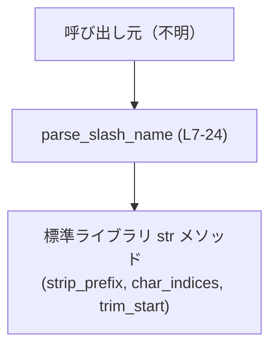
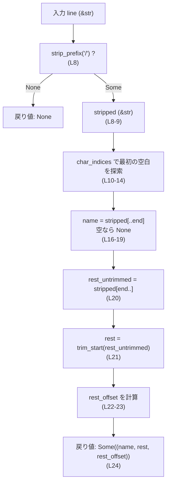
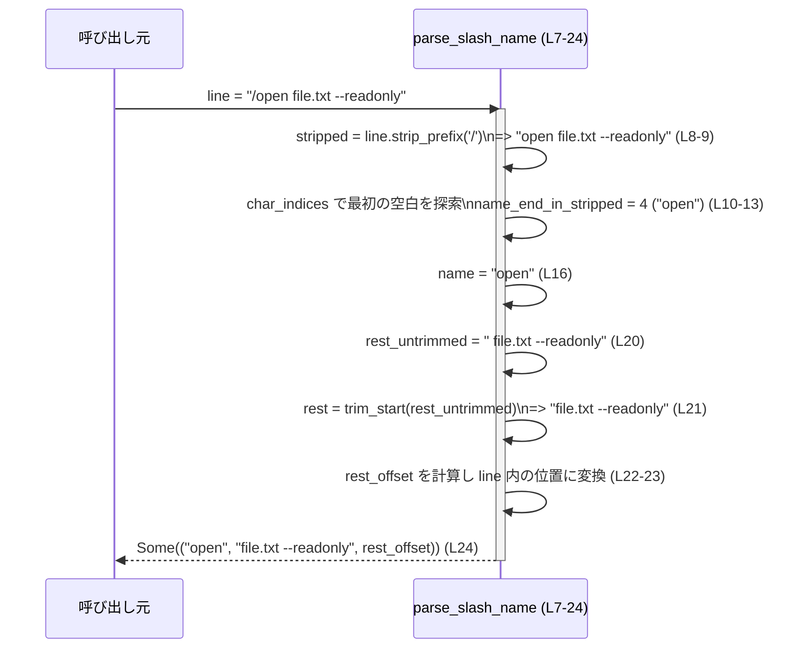

# tui/src/bottom_pane/prompt_args.rs コード解説

## 0. ざっくり一言

スラッシュで始まる1行入力（`/name <rest>`）から、先頭のコマンド名と残りの文字列、および残りの開始位置（バイトオフセット）を取り出すユーティリティ関数を提供するファイルです（`prompt_args.rs:L1-25`）。

---

## 1. このモジュールの役割

### 1.1 概要

- このモジュールは、`/name <rest>` 形式の「スラッシュコマンド」1行を解析し、  
  - コマンド名 `name`
  - コマンド名以降の残りの文字列 `rest_after_name`
  - 元の行に対する `rest_after_name` のバイトオフセット `rest_offset`  
  を返す機能を提供します（`prompt_args.rs:L1-6, L7`）。
- `/` で始まらない行や、コマンド名が空の場合は `None` を返します（`prompt_args.rs:L2-3, L16-19`）。

### 1.2 アーキテクチャ内での位置づけ

このファイルには呼び出し元や他モジュールとの関係は現れていません。  
パスから、この関数は TUI（テキスト UI）の `bottom_pane` に関連するコードの一部であることだけが分かります。

依存関係（このチャンクから分かる範囲）を簡略化して図示します。



### 1.3 設計上のポイント

- **純粋関数**  
  - 引数は `&str`、戻り値は `Option<(&str, &str, usize)>` であり、外部状態を持たない純粋な関数です（`prompt_args.rs:L7`）。
- **ゼロコピー設計**  
  - 戻り値の `&str` は、すべて引数 `line` へのスライスであり、新しい文字列を割り当てません（`prompt_args.rs:L16, L20-21, L24`）。
- **安全なインデックス計算**  
  - 文字単位の走査に `char_indices` を使い、スライスは必ず UTF-8 文字境界で行われるため、インデックス演算によるパニックを避けています（`prompt_args.rs:L10-13, L16, L20, L22-23`）。
- **明確な契約**  
  - ドキュメンテーションコメントで `rest_offset` の意味を明示しており、`line[rest_offset..] == rest_after_name` となることが契約として記述されています（`prompt_args.rs:L5-6`）。

---

## 2. 主要な機能一覧

### 2.1 コンポーネントインベントリー（このチャンク）

| 名前               | 種別   | シグネチャ                                      | 説明                                         | 定義位置 |
|--------------------|--------|-------------------------------------------------|----------------------------------------------|----------|
| `parse_slash_name` | 関数   | `pub fn parse_slash_name(line: &str) -> Option<(&str, &str, usize)>` | 1行のスラッシュコマンドを解析し、コマンド名・残り・残りの開始バイト位置を返す | `prompt_args.rs:L7-24` |

※ このファイルには構造体や列挙体などの型定義はありません（`prompt_args.rs:L1-25`）。

### 2.2 機能一覧（概要）

- `parse_slash_name`:  
  スラッシュで始まる1行入力を `/name <rest>` とみなして分解し、`(name, rest, rest_offset)` の形で返す。条件に合わない場合は `None` を返す。

---

## 3. 公開 API と詳細解説

### 3.1 型一覧（構造体・列挙体など）

このファイルには公開されている構造体・列挙体などの型は定義されていません（`prompt_args.rs:L1-25`）。

### 3.2 関数詳細

#### `parse_slash_name(line: &str) -> Option<(&str, &str, usize)>`

**概要**

- 先頭が `/` の文字列 `line` を解析し、`/name <rest>` 形式であれば
  - `name`: `/` の直後から、最初の空白文字（スペース、タブなど）直前まで
  - `rest`: `name` の後ろの空白類をスキップした残りの部分
  - `rest_offset`: 元の `line` に対する `rest` の開始バイト位置（`line[rest_offset..] == rest`）
  を返します（`prompt_args.rs:L1-6, L16, L20-24`）。
- `/` で始まらない、もしくは `name` が空の場合は `None` を返します（`prompt_args.rs:L2-3, L17-19`）。

**引数**

| 引数名 | 型     | 説明 |
|--------|--------|------|
| `line` | `&str` | 解析対象の1行文字列。UTF-8 文字列で、スラッシュコマンド行であることが期待されます（`prompt_args.rs:L7`）。 |

**戻り値**

- 戻り値の型: `Option<(&str, &str, usize)>`（`prompt_args.rs:L7`）
  - `Some((name, rest, rest_offset))`
    - `name`: `/` の直後から、最初の空白文字までの部分文字列（`prompt_args.rs:L16`）
    - `rest`: `name` の後ろの空白類をすべて飛ばした残りの部分文字列（空文字列の場合もあり得ます）（`prompt_args.rs:L20-21`）
    - `rest_offset`: 元の `line` における `rest` の開始バイト位置で、`line[rest_offset..] == rest` が成り立ちます（`prompt_args.rs:L5-6, L22-23`）
  - `None`
    - `line` が `/` で始まらない場合（`strip_prefix('/')?` による早期 `None`）（`prompt_args.rs:L8`）
    - `/` の直後に有効な名前（非空、非空白列）が存在しない場合（`name.is_empty()`）（`prompt_args.rs:L16-19`）

**内部処理の流れ（アルゴリズム）**

1. **先頭の `/` を除去**  
   - `line.strip_prefix('/')?` を呼び出し、先頭が `/` ならそれを除いたスライス `stripped` を取得し、そうでなければ `None` を返します（`prompt_args.rs:L8`）。
2. **名前部分の終端位置を探索**  
   - `name_end_in_stripped` を `stripped.len()`（全体長）で初期化します（`prompt_args.rs:L9`）。
   - `stripped.char_indices()` で文字とそのバイトオフセットを順に走査し、最初の空白文字（`ch.is_whitespace()` が true）の位置 `idx` を `name_end_in_stripped` に記録してループを抜けます（`prompt_args.rs:L10-14`）。
   - 空白が1つも無い場合は、名前は `stripped` 全体とみなされます。
3. **名前スライスの切り出しと空チェック**  
   - `name = &stripped[..name_end_in_stripped]` で先頭から `name_end_in_stripped` までを `name` として取得します（`prompt_args.rs:L16`）。
   - `name.is_empty()` が true（`name_end_in_stripped == 0`）の場合は `None` を返します（`prompt_args.rs:L16-19`）。
4. **残り部分の算出とトリム**  
   - `rest_untrimmed = &stripped[name_end_in_stripped..]` として、`name` の直後から行末までを取得します（`prompt_args.rs:L20`）。
   - `rest = rest_untrimmed.trim_start()` で、先頭の空白類を取り除いた残り部分を取得します（`prompt_args.rs:L21`）。
5. **`rest_offset` の計算**  
   - `rest_untrimmed.len() - rest.len()` は、`name` の直後から `rest` の先頭までに存在する空白類のバイト数です（`prompt_args.rs:L22`）。
   - `rest_start_in_stripped = name_end_in_stripped + (rest_untrimmed.len() - rest.len())` として、`stripped` 内での `rest` の開始位置（バイト）を求めます（`prompt_args.rs:L22`）。
   - 元の `line` の先頭バイトには `/` が1バイト分あるため、`rest_offset = rest_start_in_stripped + 1` として、`line` 内での `rest` の開始位置を算出します（`prompt_args.rs:L23`）。
6. **結果を返す**  
   - `Some((name, rest, rest_offset))` を返します（`prompt_args.rs:L24`）。

このアルゴリズムにより、`line[rest_offset..]` が `rest` と等しくなるように設計されています（`prompt_args.rs:L5-6, L22-24`）。

**内部フロー図（簡略）**



**Examples（使用例）**

1. **典型的なコマンドと引数**

```rust
// スラッシュコマンド風の入力行を用意する
let line = "/open   file.txt  --readonly"; // コマンド名と、空白を含んだ残り

// parse_slash_name を呼び出す
if let Some((name, rest, offset)) = parse_slash_name(line) {
    // name は先頭のコマンド名
    assert_eq!(name, "open");

    // rest はコマンド名の後の空白を飛ばした残り
    assert_eq!(rest, "file.txt  --readonly");

    // rest_offset は元の line での rest の開始バイト位置
    assert_eq!(&line[offset..], rest);
} else {
    // `/` で始まらないか、名前が空の場合はここに来る
    unreachable!("この例では Some になる想定です");
}
```

1. **引数なしのコマンド**

```rust
let line = "/quit"; // 引数のないコマンド

let (name, rest, offset) = parse_slash_name(line).expect("有効なスラッシュコマンド");

// name は "quit"
assert_eq!(name, "quit");

// rest は空文字列（引数なし）
assert_eq!(rest, "");

// offset は line の長さと一致する（行末を指す）
assert_eq!(offset, line.len());
assert_eq!(&line[offset..], rest); // line[offset..] == ""
```

1. **スラッシュで始まらない行**

```rust
let line = "quit"; // 先頭に `/` がない場合
assert!(parse_slash_name(line).is_none()); // None が返る
```

**Errors / Panics**

- **エラー（`None` が返る条件）**
  - `line` が `/` で始まらない場合（`strip_prefix('/')` が `None`）（`prompt_args.rs:L8`）。
  - `/` の直後から最初の空白までに1文字もない場合（名前が空、例: `"/"`, `"/   "`）（`prompt_args.rs:L16-19`）。
- **パニック**
  - コード上、明示的に `panic!` を呼び出している箇所はありません（`prompt_args.rs:L1-25`）。
  - 文字列スライス（`&str[..]`）が不正なバイト境界で行われるとパニックの可能性がありますが、
    - インデックスは `char_indices` から得られるバイト位置（必ず文字境界）（`prompt_args.rs:L10-13`）
    - `trim_start` によるスライスも UTF-8 境界を守る仕様
    を利用しており、`&str` が Rust の前提どおり正しい UTF-8 であれば、パニックは発生しない構造です（`prompt_args.rs:L16, L20-22`）。

**Edge cases（エッジケース）**

- `/` で始まらない文字列  
  - 例: `"help"`, `" open file"`  
  - `strip_prefix('/')?` により即座に `None` を返します（`prompt_args.rs:L8`）。
- `/` のみ、もしくは `/` に続くのが空白だけ  
  - 例: `"/"`, `"/   "`, `"/\t\t"`  
  - `stripped` が空または空白のみになり、`name` は空文字列となります。`name.is_empty()` により `None` を返します（`prompt_args.rs:L16-19`）。
- 名前のみで引数がない  
  - 例: `"/quit"`, `"/open "`  
  - `name` は `"quit"`, `"open"`。`rest_untrimmed` は空もしくは空白のみで、`rest` は空文字列となります（`prompt_args.rs:L20-21`）。
  - `rest_offset` は `line.len()` またはそれに近い値となり、`&line[rest_offset..]` は空文字列です（`prompt_args.rs:L22-24`）。
- 連続する空白を含む引数  
  - 例: `"/cmd    arg1  arg2"`  
  - `name` は `"cmd"`。`rest` は `"arg1  arg2"`（`name` 直後の空白はすべて除去されるが、`rest` 内部の空白はそのまま）となります（`prompt_args.rs:L20-21`）。
- Unicode 文字を含む名前・引数  
  - `char_indices` を用いているため、マルチバイト文字を途中で分割することなく、文字境界に沿ってスライスされます（`prompt_args.rs:L10-13, L16`）。
  - `rest_offset` などのオフセットは **バイト数** であり、文字数ではありません。

**使用上の注意点**

- **`rest_offset` はバイト単位**  
  - `rest_offset` はバイトオフセットであり、文字数インデックスではありません。`line[rest_offset..]` のように `&str` のスライスに使うことを前提としています（`prompt_args.rs:L5-6, L22-23`）。
- **ライフタイム（所有権）**  
  - 戻り値の `&str` はすべて元の `line` を参照するスライスです。`line` が有効なスコープを抜けるまでのみ有効です。
- **入力の前提**  
  - ドキュメントコメントは「first-line slash command」と記述していますが、どの部分が「first-line」とみなされるかは呼び出し側の責任です（`prompt_args.rs:L1`）。
  - スラッシュコマンドの形式や禁止文字などの詳細な制約は、このチャンクからは分かりません。
- **並行性**  
  - 関数は引数のみを読み取り、外部状態を持たないため、複数スレッドから同時に呼び出しても問題ない純粋関数です（`prompt_args.rs:L7-24`）。

**Bugs / Security（このチャンクから読み取れる範囲）**

- インデックス計算は UTF-8 境界に沿って行われており、Rust の `&str` 前提が守られている限り、バッファオーバーランなどのメモリ安全性問題は見当たりません（`prompt_args.rs:L10-13, L16, L20-23`）。
- 入力検証の観点では、関数の責務は行の構造を分解することに限定されており、どのコマンド名や引数を許可するかは上位の呼び出し側で扱うべき範囲です。このチャンクからはそれ以上のセキュリティ要件は読み取れません。

### 3.3 その他の関数

このファイルには、`parse_slash_name` 以外の関数は定義されていません（`prompt_args.rs:L1-25`）。

---

## 4. データフロー

ここでは、入力 `"/open   file.txt  --readonly"` を例に、`parse_slash_name` 内のデータの流れを示します。

1. 呼び出し元が `line` を渡す。
2. `parse_slash_name` が先頭の `/` を除いた `stripped` を作る。
3. `stripped` 内で最初の空白までを `name` として切り出す。
4. `name` の後ろの部分から先頭空白を削除したものを `rest` とする。
5. `line` に対する `rest` の開始バイト位置 `rest_offset` を計算する。
6. `(name, rest, rest_offset)` を呼び出し元に返す。



---

## 5. 使い方（How to Use）

### 5.1 基本的な使用方法

スラッシュで始まるユーザー入力をコマンド名と引数に分割する、典型的な使用例です。

```rust
// ユーザーからの入力行を仮定する
let line = "/search   rust language  book"; // スラッシュコマンド形式の1行

// スラッシュコマンドとして解析する
if let Some((name, rest, rest_offset)) = parse_slash_name(line) {
    // name: コマンド名（ここでは "search"）
    println!("command name: {}", name);

    // rest: コマンド名以降の文字列（ここでは "rust language  book"）
    println!("arguments: {}", rest);

    // rest_offset: line に対する rest の開始バイト位置
    println!("rest_offset: {}", rest_offset);
    assert_eq!(&line[rest_offset..], rest);

    // 例えば、引数を空白区切りでさらに分解することもできる
    let args: Vec<&str> = rest.split_whitespace().collect();
    println!("args: {:?}", args); // ["rust", "language", "book"]
} else {
    // `/` で始まらない行や、名前が空の場合はこちらに入る
    println!("not a slash command: {}", line);
}
```

### 5.2 よくある使用パターン

1. **入力がスラッシュコマンドかどうかの判定**

```rust
let line = get_user_input(); // 何らかの方法で1行入力を取得する

match parse_slash_name(&line) {
    Some((name, rest, _offset)) => {
        // スラッシュコマンドとして扱う
        handle_command(name, rest); // この関数はこのチャンクには現れません
    }
    None => {
        // 通常のテキスト入力として扱う
        handle_plain_input(&line); // この関数もこのチャンクには現れません
    }
}
```

1. **`rest_offset` を使って元の行から再スライス**

```rust
let line = "/tag  important  project-x";

if let Some((_name, rest, offset)) = parse_slash_name(line) {
    // rest は line[offset..] と等しい
    assert_eq!(rest, &line[offset..]);

    // 必要に応じて、先頭の `/` を含めた元の行も保持しつつ、
    // 引数部分だけを別処理に渡すことができる
    process_arguments(&line[offset..]); // この関数はこのチャンクには現れません
}
```

### 5.3 よくある間違い

```rust
// 間違い例: `/` で始まらない行もそのままコマンドとして解釈してしまう
let line = "open file.txt";
if let Some((name, rest, _)) = parse_slash_name(&line) {
    // ここには来ない（None）ため、意図しない挙動の可能性は低いが、
    // スラッシュコマンド前提で処理を書いてしまうとロジックが分かりにくくなる
}

// 正しい例: None を明示的に通常入力扱いにする
match parse_slash_name(&line) {
    Some((name, rest, _)) => {
        handle_command(name, rest);
    }
    None => {
        handle_plain_input(&line);
    }
}
```

```rust
// 間違い例: rest_offset を文字数インデックスとみなして別の文字列に適用する
let line = "/日本語 test";
let (_name, rest, offset) = parse_slash_name(line).unwrap();

// offset はバイト数であるため、別の文字列に適用するのは不正
// let s = "別の文字列";
// let slice = &s[offset..]; // 不適切: offset は s に対するものではない

// 正しい例: offset は必ず同じ line に対してのみ使う
let slice = &line[offset..];
assert_eq!(slice, rest);
```

### 5.4 使用上の注意点（まとめ）

- `parse_slash_name` は「スラッシュコマンド形式かどうか」を識別しつつ、コマンド名と残りを分解する関数であり、  
  「コマンドの正当性の検証」や「引数の構文チェック」は行いません。
- `rest_offset` は、
  - **バイト単位のオフセット**
  - **元の `line` に対してのみ有効**
  である点を前提として利用する必要があります。
- 関数は純粋であり、副作用や I/O は行わないため、並行呼び出しも安全です。

---

## 6. 変更の仕方（How to Modify）

### 6.1 新しい機能を追加する場合

このファイルには `parse_slash_name` のみが存在するため、追加の機能も同じファイルに配置するのが自然と考えられます（ただし、このチャンク以外の構成は不明です）。

新しい機能を追加する際の典型的なステップ:

1. **要件の整理**
   - 例: `rest` をさらに引数リスト（`Vec<&str>`）に分解するヘルパー関数を追加する、など。
   - このチャンクからは具体的な要件は読み取れないため、既存の呼び出し側（別ファイル）を確認する必要があります。
2. **既存の契約の確認**
   - `parse_slash_name` が `line[rest_offset..] == rest` を保証していることを前提として新機能を設計します（`prompt_args.rs:L5-6, L22-24`）。
3. **新関数の設計**
   - 例えば `fn parse_slash_args(line: &str) -> Option<(&str, Vec<&str>)>` のように、既存の `parse_slash_name` を内部で利用する形も考えられます（この関数は実際には存在しません）。
4. **テストケースの設計**
   - `/` で始まらない行、空名、Unicode を含む行など、既存関数と同様のエッジケースを網羅するテストを追加するのが望ましいです。

### 6.2 既存の機能を変更する場合

`parse_slash_name` の仕様を変更する場合の注意点:

- **影響範囲の確認**
  - このチャンクには呼び出し元が現れていないため、プロジェクト全体での `parse_slash_name` の使用箇所（`grep` など）を確認する必要があります。
- **契約の維持**
  - 既存のドキュメントコメントが示す契約  
    - `/name <rest>` 形式のパース
    - `rest_offset` に対して `line[rest_offset..] == rest`
    を維持するか、変更する場合はドキュメントを更新し、呼び出し側の対応が必要です（`prompt_args.rs:L1-6`）。
- **Edge case の再確認**
  - `/` のみ、`/`、Unicode の組み合わせなど、エッジケースでの挙動が変わらないか、あるいは意図どおりに変わるかを確認します。
- **テストの更新**
  - 仕様変更に応じて、既存テスト（あれば）を更新または追加する必要があります。このチャンクにはテストコードは現れていません。

---

## 7. 関連ファイル

このチャンクには、他ファイルとの関係やモジュール構成に関する情報は現れていません。そのため、実際にどのファイルから `parse_slash_name` が呼ばれているか、あるいはどのモジュールに再エクスポートされているかは不明です。

| パス | 役割 / 関係 |
|------|------------|
| （不明） | このチャンクには関連ファイルに関する情報が現れないため、特定できません。 |

---

### 参考: テスト観点（この関数向け）

テストコードはこのチャンクには含まれていませんが、次のような入力を網羅するテストが考えられます。

- 正常系
  - `"/cmd arg1 arg2"` → `Some(("cmd", "arg1 arg2", offset))`
  - `"/cmd"` → `Some(("cmd", "", offset == line.len()))`
  - `"/cmd   arg"` → 連続空白の扱い
  - Unicode を含む `"/コマンド 引数"` → 文字境界の扱い
- 異常系
  - `"cmd arg"` → `None`
  - `"/"` → `None`
  - `"/   "` → `None`

これらにより、契約どおり `line[rest_offset..] == rest` が常に成り立つことを確認できます。
