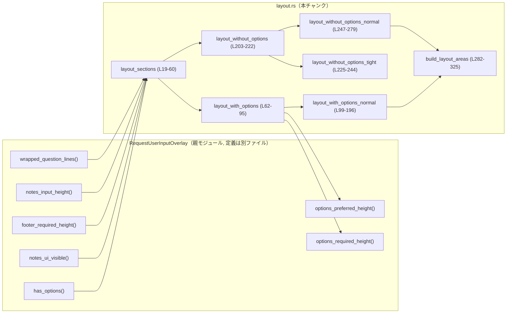
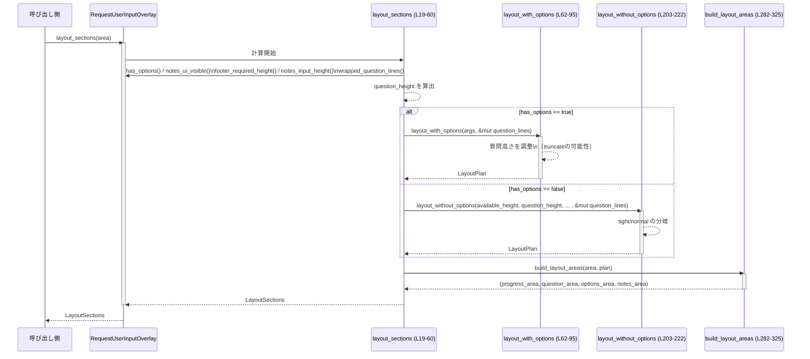

# tui/src/bottom_pane/request_user_input/layout.rs

## 0. ざっくり一言

ユーザー入力オーバーレイ（`RequestUserInputOverlay`）のために、進捗・質問文・選択肢・ノート入力欄・フッター（行数のみ）の縦方向レイアウトを計算するモジュールです。（根拠: `layout_sections` と `LayoutSections` のフィールド構成  
tui/src/bottom_pane/request_user_input/layout.rs:L6-15, L19-59）

---

## 1. このモジュールの役割

### 1.1 概要

- このモジュールは、ユーザー入力オーバーレイの **縦方向の高さ配分** を計算するために存在し、`ratatui::layout::Rect` を用いて各セクションの描画領域を決定します。（L1, L6-15, L281-325）
- 画面幅・高さと、選択肢の有無やノート表示フラグなどをもとに、質問テキスト行の数を調整しつつ、進捗バー・質問・選択肢・ノート・フッター行数のバランスをとります。（L19-27, L62-75, L198-221）

### 1.2 アーキテクチャ内での位置づけ

- `RequestUserInputOverlay` 型（親モジュールで定義）に対するレイアウト計算ロジックを提供する「サブモジュール」の位置づけです。（`use super::RequestUserInputOverlay;`  
  L4, L17）
- 親モジュール側で実装されている以下のメソッド・定数に依存します（実体はこのチャンクには現れません）:
  - `has_options()`（L20）
  - `notes_ui_visible()`（L21）
  - `footer_required_height(width: u16)`（L22）
  - `notes_input_height(width: u16)`（L23）
  - `wrapped_question_lines(width: u16) -> Vec<String>`（L24）
  - `options_preferred_height(width: u16)`（L91）
  - `options_required_height(width: u16)`（L92）
  - 定数 `DESIRED_SPACERS_BETWEEN_SECTIONS`（L3, L120-128）

依存関係の概略を Mermaid 図で示します（関数名の後ろの `Lx-y` は定義行範囲です）。



### 1.3 設計上のポイント

- **責務分割**
  - 公開エントリポイント（モジュール内の対外 API）は `layout_sections` のみで、内部で「選択肢あり」「選択肢なし」「タイト／通常」などの細かいレイアウト分岐を呼び分けています。（L19-47, L62-95, L198-222）
- **状態管理**
  - 構造体は `LayoutSections`（結果）と内部用の `LayoutPlan`・引数構造体のみで、いずれも単なるデータ保持用です。外部状態は `&self`（`RequestUserInputOverlay`）に集約されています。（L6-15, L329-337, L340-363）
- **エラーハンドリング・安全性**
  - すべて `u16` を使い、`saturating_sub` や `min`/`max` を用いて高さ計算でのオーバーフロー・アンダーフローを避けています。（L77, L111, L117-118, L129-131, L133-138, L211, L255-256, L268, など）
  - `panic!` や `unwrap` は使用されておらず、レイアウト結果がゼロ高さになることで「表示できない」状況を安全に表現しています。
- **並行性**
  - いずれの関数も同期的な純粋計算であり、スレッドや async/await は使われていません。このモジュール自体はスレッドセーフ性や共有状態を直接扱いません。

---

## 2. 主要な機能一覧

このモジュールが提供する主な機能（関数）を列挙します。

- `layout_sections`: オーバーレイ全体の描画領域（進捗・質問・選択肢・ノート・フッター行数）を一括で計算するエントリポイント。（L19-59）
- `layout_with_options`: 選択肢が存在する場合の高さ計算。質問の高さを必要に応じて切り詰め、内部の通常レイアウトに委譲。（L62-95）
- `layout_with_options_normal`: 選択肢ありの通常レイアウト。質問・選択肢・ノート・フッター・進捗・スペーサのバランスをとる中核ロジック。（L99-196）
- `layout_without_options`: 選択肢が無い場合に、タイトレイアウトか通常レイアウトかを選択するラッパ。（L203-222）
- `layout_without_options_tight`: 質問だけで利用可能高さを超える場合に、質問行を切り詰めて他要素を完全に省略するタイトレイアウト。（L225-244）
- `layout_without_options_normal`: 選択肢無しで空間に余裕がある場合のレイアウト計算。ノート・フッター・進捗を優先的に配置。（L247-279）
- `build_layout_areas`: 計算済みの高さ（`LayoutPlan`）をもとに、実際の `Rect`（座標付きの領域）に変換する関数。（L281-325）

---

## 3. 公開 API と詳細解説

### 3.1 型一覧（構造体・列挙体など）

| 名前 | 種別 | 可視性 | 役割 / 用途 | 定義位置 |
|------|------|--------|-------------|----------|
| `LayoutSections` | 構造体 | `pub(super)` | 呼び出し側に返す完成済みレイアウト結果。進捗・質問・選択肢・ノートの各 `Rect` とフッター行数、質問の折り返し行を保持します。 | layout.rs:L6-15 |
| `LayoutPlan` | 構造体 | モジュール内 (`struct`) | 内部計算用の高さ情報（進捗高さ・質問高さ・スペーサ・選択肢高さ・ノート高さ・フッター行数）をまとめた中間表現です。座標はまだ含みません。 | layout.rs:L329-337 |
| `OptionsLayoutArgs` | 構造体 | モジュール内 | 選択肢ありレイアウト計算の入力パラメータ（利用可能高さ・幅・質問高さ・ノート希望高さ・フッター希望行数・ノート可視フラグ）をまとめた引数型です。 | layout.rs:L340-348 |
| `OptionsNormalArgs` | 構造体 | モジュール内 | `layout_with_options_normal` 用の引数型。`OptionsLayoutArgs` から幅を除いたサブセットです。 | layout.rs:L350-357 |
| `OptionsHeights` | 構造体 | モジュール内 | 選択肢ウィンドウの「望ましい高さ」と「コンテンツ全体を表示するための高さ」を表します。 | layout.rs:L359-363 |
| `RequestUserInputOverlay` | 構造体（推定） | 親モジュール (`super`) | ユーザー入力オーバーレイ全体を表す型。本チャンクではレイアウト計算のメソッドレシーバとしてのみ現れ、定義は他ファイルです。 | このチャンクには定義なし（`use super::RequestUserInputOverlay;` L4, `impl` 開始 L17） |

### 3.2 関数詳細（重点 5 件）

#### `layout_sections(&self, area: Rect) -> LayoutSections`

**概要**

- ユーザー入力オーバーレイの各セクション（進捗・質問・選択肢・ノート）の描画領域とフッター行数を計算し、`LayoutSections` として返すエントリポイントです。（L19-59）
- 選択肢の有無やノートの表示可否、画面サイズに応じて、質問文を行単位で折り返しつつ高さを調整します。

**引数**

| 引数名 | 型 | 説明 |
|--------|----|------|
| `self` | `&RequestUserInputOverlay` | 呼び出し元のオーバーレイ。選択肢やノート設定、各種高さのプリファレンスを提供します。（L20-24） |
| `area` | `Rect` | このオーバーレイに割り当てられた描画領域（位置と幅・高さ）。`area.width`/`area.height` を用いてレイアウトを決定します。（L19, L22-23, L30-31, L41） |

**戻り値**

- `LayoutSections`: 計算された進捗・質問・選択肢・ノート用の `Rect` と、折り返し済みの質問行、フッター行数を含む構造体です。（L52-59）

**内部処理の流れ**

1. 内部状態から選択肢の有無（`has_options()`）とノートの表示可否（`notes_ui_visible()`）を取得します。（L20-21）
2. フッターとノート入力欄の「希望高さ」を、画面幅に基づいて取得します。（`footer_required_height`, `notes_input_height`）（L22-23）
3. 質問テキストを幅に合わせて折り返し、行数から `question_height` を求めます。（L24-25）
4. 選択肢があれば `layout_with_options` を、無ければ `layout_without_options` を呼び、`LayoutPlan` を得ます。（L27-47）
5. `build_layout_areas` により、`LayoutPlan` と `area` から各セクションの `Rect` を構築します。（L49-50, L281-325）
6. 最後に出来上がった `Rect` と質問行、フッター行数を `LayoutSections` として返します。（L52-59）

**Examples（使用例）**

この関数は通常、描画処理の前に呼び出して、各セクションの位置を決定する用途で使われます。

```rust
// 仮想的な描画コード例
use ratatui::layout::Rect;

// `overlay` は RequestUserInputOverlay 型のインスタンスと仮定
fn render_overlay(overlay: &RequestUserInputOverlay, area: Rect) {
    // レイアウトを計算する（L19-59）
    let sections = overlay.layout_sections(area);

    // sections.progress_area を使って進捗バーを描画する
    // sections.question_area / question_lines を使って質問テキストを描画する
    // sections.options_area を使って選択肢リストを描画する
    // sections.notes_area を使ってノート入力欄を描画する
    // sections.footer_lines に応じてフッター（ステータスやヒント）を描画する
}
```

**Errors / Panics**

- `Result` ではなく値を直接返す関数のため、エラーは返しません。
- 内部で `saturating_sub` などを用いており、`u16` のオーバーフロー・アンダーフローを避けています。（L77, L111, L117-118, L129-131, L133-138 など）
- `panic!` や `unwrap` は使用していません。

**Edge cases（エッジケース）**

- `area.height == 0` の場合  
  - 下位関数で `saturating_sub` を使っているため、最終的にすべての高さが 0 となり、全セクションが高さ 0 の `Rect` になります。（`layout_with_options_normal`, `layout_without_options_tight` などの挙動より）
- 質問テキストが非常に長い場合  
  - 折り返し後の行数が利用可能高さを超えると、`layout_with_options` や `layout_without_options_tight` によって質問行が `truncate` されます。（L79-81, L231-233）
- フッター希望高さが大きい場合  
  - 高さが不足すると、選択肢領域やノート領域が縮小またはゼロとなり、フッター行数も `footer_pref.min(remaining)` によって減少します。（L129-153, L259-260）

**使用上の注意点**

- この関数は純粋な計算であり、副作用（I/O やグローバル状態変更）はありません。
- 戻り値の `footer_lines` は単なる行数であり、実際のフッター描画領域 `Rect` は本ファイルでは計算していません。フッターは別レイアウトや別領域で描画される前提と考えられます（コードからの推測; 根拠: `LayoutSections` にフッター用 `Rect` が存在しない  
  L6-15）。
- `area` の座標 (`x`, `y`) はそのまま各セクションに伝播するため、オーバーレイ全体の配置は呼び出し側で適切に決定する必要があります。（L293-323）

---

#### `layout_with_options(&self, args: OptionsLayoutArgs, question_lines: &mut Vec<String>) -> LayoutPlan`

**概要**

- 選択肢が存在する場合のレイアウト計算を行い、質問高さを必要に応じて切り詰めた上で、通常レイアウト（`layout_with_options_normal`）に委譲します。（L62-95）
- 最低 1 行の選択肢表示を確保するために、質問高さの上限を調整します。

**引数**

| 引数名 | 型 | 説明 |
|--------|----|------|
| `self` | `&RequestUserInputOverlay` | オーバーレイ本体。選択肢の高さプリファレンス取得に使用します。（L91-92） |
| `args` | `OptionsLayoutArgs` | 利用可能高さ、幅、質問高さ、ノート希望高さ、フッター希望行数、ノート可視フラグを含む引数構造体です。（L68-75） |
| `question_lines` | `&mut Vec<String>` | 折り返し済みの質問テキスト行。高さ調整のために、この関数内で末尾を `truncate` される可能性があります。（L66, L79-81） |

**戻り値**

- `LayoutPlan`: 質問・選択肢・ノート・進捗・フッター行数など、すべての高さ配置が決まった中間表現です。（L82-94）

**内部処理の流れ**

1. `OptionsLayoutArgs` をフィールドごとに分解します。（L68-75）
2. 最小の選択肢高さを `available_height.min(1)` として求め（少なくとも 1 行確保する意図）、質問に使える最大高さを `available_height - min_options_height`（飽和減算）から算出します。（L76-77）
3. 現在の `question_height` がその上限を超える場合、`question_height` を上限に切り詰め、`question_lines.truncate(question_height as usize)` で行数を削減します。（L78-81）
4. 質問高さとオプション高さのプリファレンス (`options_preferred_height`, `options_required_height`) を使い、`layout_with_options_normal` に処理を委譲して `LayoutPlan` を取得します。（L82-94）

**Examples（使用例）**

この関数は外部から直接呼ばれることは想定されておらず、`layout_sections` からのみ使用されます。擬似的な内部利用イメージ:

```rust
fn example_with_options(overlay: &RequestUserInputOverlay, area: Rect, mut question_lines: Vec<String>) {
    let args = OptionsLayoutArgs {
        available_height: area.height,
        width: area.width,
        question_height: question_lines.len() as u16,
        notes_pref_height: overlay.notes_input_height(area.width),
        footer_pref: overlay.footer_required_height(area.width),
        notes_visible: overlay.notes_ui_visible(),
    };

    let plan = overlay.layout_with_options(args, &mut question_lines);
    // plan を build_layout_areas に渡して Rect を得る、という流れになります。
}
```

**Errors / Panics**

- `question_lines.truncate` は範囲外でも安全に動作するため、パニックは発生しません。（L79-81）
- `saturating_sub` を用いており、`u16` のアンダーフローを防いでいます。（L77）

**Edge cases（エッジケース）**

- `available_height == 0`  
  - `min_options_height = 0` となり、`max_question_height` も 0 です。その場合、`question_height` は 0 に切り詰められ、質問行は空になります。最終的に全セクション高さ 0 のレイアウトになります。（L76-81, L111-118）
- `question_height == 0` かつ `available_height > 0`  
  - 質問が空でも最低 1 行の選択肢高さが与えられるように計算されます。（L76-77, 後続の `min_options_height` 使用）

**使用上の注意点**

- `question_lines` は可変参照で渡されるため、この関数呼び出し後には行数が減っている可能性があります。呼び出し側は戻り値の `LayoutPlan` ではなく、更新後の `question_lines` と合わせて利用する必要があります。（L66, L79-81）
- この関数は `pub(super)` ではなく `fn`（モジュール内可視）であり、通常は `layout_sections` 経由でのみ利用されます。（L62）

---

#### `layout_with_options_normal(&self, args: OptionsNormalArgs, options: OptionsHeights) -> LayoutPlan`

**概要**

- 選択肢が存在するケースの「通常」レイアウトを計算します。（L99-196）
- 利用可能高さを質問・選択肢・ノート・フッター・進捗バー・スペーサに配分し、ノートが非表示の場合には選択肢高さを縮めてでも進捗やフッターのスペースを確保する戦略を取ります。

**引数**

| 引数名 | 型 | 説明 |
|--------|----|------|
| `self` | `&RequestUserInputOverlay` | オーバーレイ本体。ここでは `self` を直接は利用していませんが、メソッドシグネチャ上レシーバが必要です。（L99-103, L104-110） |
| `args` | `OptionsNormalArgs` | 利用可能高さ、質問高さ、ノート希望高さ、フッター希望行数、ノート表示フラグを含む構造体です。（L104-110） |
| `options` | `OptionsHeights` | 選択肢領域についての「望ましい高さ」と「コンテンツ全表示に必要な高さ」を含みます。（L102-103, L113-116, L159-160） |

**戻り値**

- `LayoutPlan`: 質問・選択肢・ノート・進捗・スペーサ・フッターの高さがすべて決まったレイアウトプランです。（L161-169, L187-195）

**内部処理の流れ**

1. `OptionsNormalArgs` を分解し、利用可能高さと質問高さなどを取り出します。（L104-110）
2. 質問高さを差し引いた残り高さから、選択肢高さの最大値 (`max_options_height`) と最小値（1 行）を求め、希望高さ (`options.preferred`) をそれにクランプして `options_height` を初期化します。（L111-117）
3. 質問 + 選択肢で使用済み高さを算出し、残り高さ (`remaining`) を求めます。（L117-118）
4. **ノート非表示の場合**は、進捗・フッター・スペーサのために必要な高さ (`required_extra`) を計算し、足りない場合には選択肢高さを縮めて `remaining` を増やします。（L120-138）
5. `remaining > 0` なら進捗高さを 1 行確保します。（L140-144）
6. `notes_visible` が `false` の場合:
   - 余りがフッター希望行数より大きければ、選択肢とフッターの間に 1 行のスペーサを置きます。（L147-151）
   - フッター行数を `footer_pref.min(remaining)` で決定し、再度 `remaining` を更新します。（L152-153）
   - 残りがあれば質問と選択肢の間に 1 行のスペーサを置きます。（L154-157）
   - なお残りの高さは選択肢に割り当て、選択肢高さを `options.full` の範囲で最大化します。（L159-160）
   - これらをまとめて `LayoutPlan` を返します。（L161-169）
7. `notes_visible` が `true` の場合:
   - まずフッター行数を `footer_pref.min(remaining)` で確保します。（L172-173）
   - 残りがあれば質問と選択肢の間に 1 行のスペーサを置きます。（L175-180）
   - 選択肢とノートの間のスペーサは 0 に固定します。（L181）
   - ノート高さを `notes_pref_height` と `remaining` の小さい方で初期化し、残り高さをノートに加算して最大限広げます。（L182-183, L185）
   - 最後に `LayoutPlan` を構築して返します。（L187-195）

**Examples（使用例）**

内部用関数のため簡易イメージのみ示します。

```rust
fn compute_plan_with_options(
    overlay: &RequestUserInputOverlay,
    available_height: u16,
    question_height: u16,
    notes_pref_height: u16,
    footer_pref: u16,
    notes_visible: bool,
    preferred_opts: u16,
    full_opts: u16,
) -> LayoutPlan {
    let args = OptionsNormalArgs {
        available_height,
        question_height,
        notes_pref_height,
        footer_pref,
        notes_visible,
    };
    let opts = OptionsHeights {
        preferred: preferred_opts,
        full: full_opts,
    };
    overlay.layout_with_options_normal(args, opts)
}
```

**Errors / Panics**

- `saturating_sub` と `min`/`max` のみを利用した計算であり、パニック要因となる演算はありません。（L111-118, L129-138, L173, L176-180, L182-183, L185）
- 分岐条件はすべて `bool` と `u16` の比較だけです。

**Edge cases（エッジケース）**

- ノート非表示 (`notes_visible == false`) の場合  
  - 進捗・フッター・スペーサ分の高さが足りないとき、選択肢窓を縮めますが、`min_options_height` までしか縮めません。そのため選択肢領域は最低 1 行（あるいは 0 行: `available_height == question_height` の場合）を保ちます。（L111-117, L129-138, L112）
- 利用可能高さが非常に小さい場合  
  - 進捗行やフッター行が確保できないことがあります。この場合 `progress_height` や `footer_lines` が 0 になり、表示が省略されます。（L140-144, L152-153, L172-173）
- ノート表示 (`notes_visible == true`) かつ高さがギリギリの場合  
  - フッター行数を優先的に確保した上で、質問と選択肢のスペーサ、ノート高さを調整します。残りの高さはすべてノートに加算されます。（L172-173, L175-180, L182-185）

**使用上の注意点**

- 引数 `options.full` は「コンテンツ全体を表示する高さ」であり、実際の選択肢高さは利用可能高さに制約されます。`options.full` が大きくても、高さが足りなければスクロールなど別の表現が必要になります。（L159-160）
- この関数は `notes_visible` を前提として設計されているため、「選択肢ありかつノート無し」のケースでスペーサの挙動が変わる点に留意する必要があります。（L120-128, L146-170, L175-185）

---

#### `layout_without_options(&self, available_height: u16, question_height: u16, notes_pref_height: u16, footer_pref: u16, question_lines: &mut Vec<String>) -> LayoutPlan`

**概要**

- 選択肢が存在しない場合のレイアウト計算を行い、「質問だけで高さを使い切るタイトレイアウト」と「ノート・フッター・進捗を含める通常レイアウト」を切り替えるラッパ関数です。（L203-222）

**引数**

| 引数名 | 型 | 説明 |
|--------|----|------|
| `self` | `&RequestUserInputOverlay` | レシーバ。ここでは直接使われませんが、メソッドとして定義されています。（L203-210） |
| `available_height` | `u16` | 利用可能な縦方向の高さ（行数）。（L205） |
| `question_height` | `u16` | 折り返し後の質問行数。（L206） |
| `notes_pref_height` | `u16` | ノート入力欄の希望高さ。（L207） |
| `footer_pref` | `u16` | フッターの希望行数。（L208） |
| `question_lines` | `&mut Vec<String>` | 実際の質問行。タイトレイアウトの場合に `truncate` されます。（L209, L231-233） |

**戻り値**

- `LayoutPlan`: 選択肢なしの前提で、質問・ノート・フッター・進捗の高さを含むレイアウトプランです。（L210-221）

**内部処理の流れ**

1. `required = question_height` として、質問に必要な高さを計算します。（L211）
2. `required > available_height` なら、利用可能高さに合わせて質問行を切り詰めるタイトレイアウト (`layout_without_options_tight`) を選択します。（L212-213）
3. そうでなければ、ノート・フッター・進捗も含める通常レイアウト (`layout_without_options_normal`) を実行します。（L215-220）

**Examples（使用例）**

擬似的な内部利用例:

```rust
fn example_without_options(
    overlay: &RequestUserInputOverlay,
    height: u16,
    width: u16,
    mut question_lines: Vec<String>,
) -> LayoutPlan {
    let question_height = question_lines.len() as u16;
    let notes_pref = overlay.notes_input_height(width);
    let footer_pref = overlay.footer_required_height(width);

    overlay.layout_without_options(
        height,
        question_height,
        notes_pref,
        footer_pref,
        &mut question_lines,
    )
}
```

**Errors / Panics**

- `layout_without_options_tight` 内で `truncate` を行いますが、行数を超えても安全に動作します。（L231-233）
- その他は `saturating_sub` による安全な算術演算のみで、パニック要因はありません。（L254-268）

**Edge cases（エッジケース）**

- 質問行数が高さを超える場合  
  - タイトレイアウトに切り替わり、質問以外（ノート・フッター・進捗）はすべて高さ 0 になります。（L212-213, L235-243）
- `available_height == question_height` の場合  
  - `required > available_height` ではないので、通常レイアウトが選ばれますが、結果としてノートやフッター・進捗に割り当てられる高さは 0 になります。（L254-268）

**使用上の注意点**

- `question_lines` はこの関数で変更される可能性があるため、呼び出し後は短くなっていることを前提に描画する必要があります。（L209, L231-233）
- 選択肢無し前提のロジックなので、ここで返される `LayoutPlan` の `options_height` は必ず 0 です。（L235-242, L270-277）

---

#### `layout_without_options_tight(&self, available_height: u16, question_height: u16, question_lines: &mut Vec<String>) -> LayoutPlan`

**概要**

- 選択肢がなく、質問だけで高さを使い切る必要がある場合のタイトレイアウトです。（L225-244）
- 利用可能高さに合わせて質問行を切り詰め、他の要素（進捗・ノート・フッター）はすべて高さ 0 にします。

**引数**

| 引数名 | 型 | 説明 |
|--------|----|------|
| `available_height` | `u16` | 利用可能な高さ。質問高さの上限として使われます。（L227, L231-232） |
| `question_height` | `u16` | 元の質問行数。（L228） |
| `question_lines` | `&mut Vec<String>` | 実際の質問行。`available_height` に合わせて `truncate` されます。（L229, L231-233） |

**戻り値**

- `LayoutPlan`: 質問高さのみを持ち、他の高さはすべて 0 のレイアウトプランです。（L235-243）

**内部処理の流れ**

1. `max_question_height` を `available_height` として設定します。（L231）
2. `adjusted_question_height` を `question_height.min(max_question_height)` で計算します。（L232）
3. `question_lines.truncate(adjusted_question_height as usize)` により、質問行を利用可能高さに合わせて切り詰めます。（L233）
4. `LayoutPlan` を構築し、`question_height` に `adjusted_question_height` をセット、その他の高さは 0 として返します。（L235-243）

**Errors / Panics**

- `truncate` は安全であり、パニックを起こしません。（L233）
- 他に例外的な処理はありません。

**Edge cases（エッジケース）**

- `available_height == 0`  
  - `adjusted_question_height` は 0 となり、質問行は空になります。（L231-233）
- `question_height <= available_height`  
  - 結果として質問行は変更されませんが、それでも他の領域は 0 です。（L232-243）

**使用上の注意点**

- この関数が返すプランでは、進捗・ノート・フッターはすべて高さ 0 であるため、呼び出し側はそれらの表示を行わない前提で扱う必要があります。（L235-243）

---

#### `build_layout_areas(&self, area: Rect, heights: LayoutPlan) -> (Rect, Rect, Rect, Rect)`

**概要**

- 計算済みの高さ情報（`LayoutPlan`）と全体領域 `area` をもとに、進捗・質問・選択肢・ノートの各 `Rect`（位置＋サイズ）を生成します。（L281-325）

**引数**

| 引数名 | 型 | 説明 |
|--------|----|------|
| `area` | `Rect` | オーバーレイに割り当てられた全体領域。`x`, `y`, `width`, `height` を基準に各セクションが積み上がります。（L284-285, L293-297） |
| `heights` | `LayoutPlan` | 進捗・質問・スペーサ・選択肢・ノートの高さ情報。フッター行数はここでは使われません。（L285-286, L329-337） |

**戻り値**

- `(Rect, Rect, Rect, Rect)`  
  それぞれ順に `(progress_area, question_area, options_area, notes_area)` を返します。（L287-291, L325）

**内部処理の流れ**

1. `cursor_y` を `area.y` で初期化します。（L292）
2. `progress_height` 分の `Rect` を `progress_area` として生成し、`cursor_y` をその分だけ進めます。（L293-299）
3. 次に `question_height` 分の `question_area` を作成し、再度 `cursor_y` を進めます。（L300-306）
4. `spacer_after_question` を `cursor_y` に加算し、質問と選択肢の間のスペーサを反映します。（L307）
5. 同様に `options_height` 分の `options_area` を作成し、`cursor_y` を更新します。（L309-315）
6. `spacer_after_options` を `cursor_y` に加算し、選択肢とノートの間のスペーサを反映します。（L316）
7. 残りの `notes_height` 分の `notes_area` を生成し、結果のタプルとして返します。（L318-325）

**Examples（使用例）**

```rust
fn render_with_plan(
    overlay: &RequestUserInputOverlay,
    area: Rect,
    plan: LayoutPlan,
) {
    // 高さ情報からRectを構築（L281-325）
    let (progress_area, question_area, options_area, notes_area) =
        overlay.build_layout_areas(area, plan);

    // それぞれのRectを使って描画を行う
}
```

**Errors / Panics**

- `saturating_add` を用いており、`u16` のオーバーフローを防いでいます。（L299, L306-307, L315-316）
- 高さが 0 の場合でも `Rect` は生成されますが、単に高さ 0 の領域になるだけで、パニックは発生しません。

**Edge cases（エッジケース）**

- 特定の高さが 0 の場合  
  - 対応する `Rect.height` は 0 になりますが、`cursor_y` はその分進まないため、後続の領域が前の領域と同じ `y` 座標に配置されることになります。これは高さ 0 の領域の上に次の領域が配置される挙動として自然です。（L293-323）
- `heights` の総和が `area.height` を超えている場合  
  - `build_layout_areas` 自体は高さの合計を検証しないため、領域が `area` の外にはみ出す可能性があります。ただし、その前段階で高さ計算が行われており、そのロジック側で制約がかかっている前提です。（前述の高さ計算ロジック全般）

**使用上の注意点**

- 戻り値にはフッター用の `Rect` は含まれていません。フッターの描画領域は別のレイアウトロジックで計算する必要があると考えられます（コードからの推測; 根拠: `LayoutPlan.footer_lines` はここでは使われない  
  L329-337, L285-325）。

---

### 3.3 その他の関数

残り 2 つの関数を簡単に整理します。

| 関数名 | 役割（1 行） | 定義位置 |
|--------|--------------|----------|
| `layout_without_options_normal` | 選択肢無しで余裕がある場合に、質問→ノート→フッター→進捗の順に高さを割り当てる通常レイアウトを計算します。 | layout.rs:L247-279 |
| `layout_with_options_normal`（詳細は上記） | すでに詳細解説済み。 | layout.rs:L99-196 |

`layout_without_options_normal` のロジック概要（根拠: L247-279）:

- `remaining = available_height - question_height` を計算し、まずノート高さを `notes_pref_height.min(remaining)` で決定。
- 次にフッター行数を `footer_pref.min(remaining)` で確保。
- まだ高さに余裕があれば進捗を 1 行確保。
- 最後に残りすべてをノート高さに加算してノート領域を最大化。

---

## 4. データフロー

ここでは `layout_sections` を起点とした典型的な処理の流れを示します。

1. 呼び出し側が `RequestUserInputOverlay::layout_sections(area)` を呼び出す。（L19-24）
2. `layout_sections` がオーバーレイ内部から各種高さプリファレンス（フッター・ノート・選択肢など）と質問テキスト行を取得。（L20-25）
3. 選択肢の有無に応じて `layout_with_options` または `layout_without_options` を呼び出し、`LayoutPlan` を取得。（L27-47, L62-95, L203-222）
4. `build_layout_areas` が `LayoutPlan` と `area` をもとに `Rect` を生成し、`LayoutSections` として返却。（L49-59, L281-325）

Mermaid のシーケンス図（関数名に行範囲を付記）:



このデータフローにより、レイアウト計算と実際の描画（本モジュール外）が分離されています。

---

## 5. 使い方（How to Use）

### 5.1 基本的な使用方法

`layout_sections` は、描画処理の直前に呼び出され、各セクションの `Rect` を得るために利用されます。

```rust
use ratatui::layout::Rect;

// 仮のフレームとオーバーレイ
fn draw_request_overlay(
    f: &mut ratatui::Frame<'_>,
    overlay: &RequestUserInputOverlay,
    area: Rect,
) {
    // 1. レイアウト情報を取得（L19-59）
    let layout = overlay.layout_sections(area);

    // 2. 進捗バーを描画（高さ0の場合はスキップ）
    if layout.progress_area.height > 0 {
        // draw_progress(f, overlay, layout.progress_area);
    }

    // 3. 質問テキストを描画
    // layout.question_lines と layout.question_area を合わせて利用
    // draw_question(f, &layout.question_lines, layout.question_area);

    // 4. 選択肢リストを描画（has_options は overlay 側の状態から判断）
    if layout.options_area.height > 0 {
        // draw_options(f, overlay, layout.options_area);
    }

    // 5. ノート入力欄を描画
    if layout.notes_area.height > 0 {
        // draw_notes(f, overlay, layout.notes_area);
    }

    // 6. フッター（ステータス + ヒント）は layout.footer_lines 行分だけ別途レイアウトして描画
    // draw_footer(f, overlay, layout.footer_lines);
}
```

### 5.2 よくある使用パターン

- **選択肢ありダイアログ**
  - `has_options() == true` の状態で `layout_sections` を呼び出し、`options_area` をリスト描画に使用。
  - ノート入力は `notes_ui_visible()` によって表示有無が決まり、その結果は高さ計算の中に組み込まれます。（L20-21, L68-75, L104-110）

- **確認メッセージのみ（選択肢なし）**
  - `has_options() == false` の場合、選択肢領域は常に高さ 0 になります。
  - 高さが十分なら質問の下にノート欄・フッター・進捗が順に配置されます。（L198-222, L247-279）

### 5.3 よくある間違い

コードから推測される、起こり得る誤用例と正しい使い方を示します。

```rust
// 誤り例: question_lines を layout_sections 呼び出し前に保持して再利用する
let mut question_lines = overlay.wrapped_question_lines(area.width);
// ...
let sections = overlay.layout_sections(area);
// ここで question_lines はレイアウト計算で truncate された結果と一致しない可能性がある

// 正しい例: layout_sections の返り値から question_lines を取得して使用する
let sections = overlay.layout_sections(area);
let question_lines = &sections.question_lines; // これが実際に描画すべき行
```

理由:

- `layout_with_options` や `layout_without_options_tight` が質問行を `truncate` するため、レイアウト後の行数は元の `wrapped_question_lines` と異なる場合があります。（L79-81, L231-233）

### 5.4 使用上の注意点（まとめ）

- **前提条件**
  - `area` の幅・高さは `u16` 範囲内であり、負値は取れません。値が 0 でもパニックにはなりませんが、その場合すべての高さが 0 になります。（算術に飽和演算を使用; L77, L111, L117-118, L255-268）
- **エラー・パニック**
  - 本モジュール内で `panic!` は使用されておらず、Rust の安全な標準ライブラリ演算のみで構成されています。
- **並行性**
  - レイアウト計算は副作用のない純粋関数であり、`&self` を介して読み取り専用の情報のみを参照します。複数スレッドから同じ `RequestUserInputOverlay` を `&` で共有する限り、この関数はデータ競合を引き起こしません（一般的な Rust の所有権規則による）。

---

## 6. 変更の仕方（How to Modify）

### 6.1 新しい機能を追加する場合

例: 新たなセクション（例: 「ヘルプ」エリア）を追加したい場合。

1. **データ構造の拡張**
   - `LayoutPlan` に新しい高さフィールド（例: `help_height: u16`）を追加します。（L329-337 を拡張）
   - `LayoutSections` に `help_area: Rect` を追加し、呼び出し側で利用できるようにします。（L6-15 を拡張）

2. **高さ計算ロジックの更新**
   - `layout_with_options_normal` / `layout_without_options_normal` で、新しいセクション高さをどのタイミングで確保するかを決め、`remaining` の計算に組み込みます。（L104-118, L255-268 付近のロジックを拡張）

3. **領域構築ロジックの更新**
   - `build_layout_areas` で `cursor_y` の進め方に新しいセクションを挿入し、追加の `Rect` を返すよう戻り値のタプル・シグネチャを変更します。（L281-325）

4. **呼び出し側の更新**
   - 新しい `Rect` を用いた描画処理を追加します。

### 6.2 既存の機能を変更する場合

- **影響範囲の確認**
  - 高さ配分ロジックを変更する場合は、必ず `LayoutPlan` のフィールドがどこで使われているか（特に `build_layout_areas` と呼び出し側の描画コード）を確認します。（L281-325, L6-15）
- **契約（前提条件・返り値の意味）**
  - `options_height == 0` で「選択肢が描画されない」ことを前提にしたコードがある可能性があります。高さ 0 を返す条件を変えると、その契約が崩れるため注意が必要です。
  - `footer_lines` は行数のみであり、レイアウト内に `Rect` がないという前提も、変更時には考慮する必要があります。（L329-337, L52-59）
- **テストと使用箇所**
  - 本チャンクにはテストコードが含まれていません（テストの有無は他ファイルに依存します）。変更時には、UI のスクリーンショットテストやスナップショットテストなどが存在するかどうかを別ファイルで確認する必要があります（このチャンクからは不明）。

---

## 7. 関連ファイル

このモジュールと密接に関係するファイル・ディレクトリ（推測を含む）:

| パス | 役割 / 関係 |
|------|------------|
| `tui/src/bottom_pane/request_user_input/(mod.rs または同モジュール本体)` | `super::RequestUserInputOverlay` と `DESIRED_SPACERS_BETWEEN_SECTIONS` の定義元。`layout_sections` 以外のオーバーレイ機能を提供します。（根拠: `use super::...` L3-4, `impl RequestUserInputOverlay` L17） |
| `ratatui` クレート | `Rect` 型の提供元。ターミナル UI のレイアウト・描画に利用されます。（L1） |

これ以外の関連ファイル（描画処理やイベント処理など）は、このチャンクには現れないため不明です。
