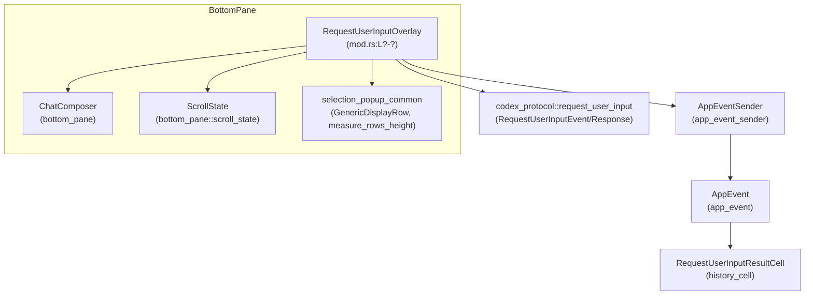

# tui/src/bottom_pane/request_user_input/mod.rs コード解説

## 0. ざっくり一言

`RequestUserInputOverlay` は、Codex コアからの `RequestUserInputEvent` に応じて **質問と回答用のオーバーレイ UI** を管理する状態機械です。  
選択式の質問＋任意のノート入力／自由記述質問を扱い、キーボード入力から回答を組み立てて `AppEventSender` 経由でコアへ送信します。

> 行番号について  
> このチャンクには行番号情報が含まれていないため、以下では場所指定を `mod.rs:L?-?` のように記載します。`L?-?` は「本ファイル内のどこか」という意味であり、厳密な行番号は不明です。

---

## 1. このモジュールの役割

### 1.1 概要

このモジュールは **ユーザーへの追加入力要求 (`RequestUserInputEvent`) に対する TUI オーバーレイ**を実装します（`RequestUserInputOverlay` 構造体, `mod.rs:L?-?`）。

- 各質問ごとに
  - 1つの選択肢（ラジオボタン的）と
  - 任意のノート（自由記述）
  を受け付けます。
- 自由記述のみの質問も扱います。
- Enter で「現在の質問の回答を確定→次の質問へ進む」、最後の質問では回答全体を送信します。
- 未回答の質問が残っている場合、送信前に確認ダイアログを表示します。
- 複数の `RequestUserInputEvent` をキューイングし、現在のリクエスト完了後に順に処理します。

### 1.2 アーキテクチャ内での位置づけ

主な依存関係は次の通りです。

- **外部プロトコル**
  - `codex_protocol::request_user_input::{RequestUserInputEvent, RequestUserInputAnswer, RequestUserInputResponse}`  
    → 質問定義と回答ペイロードの型。
- **アプリケーション側**
  - `AppEventSender`（`crate::app_event_sender::AppEventSender`）  
    → 回答 (`UserInputAnswer`) や割り込み (`Interrupt`) をコアに送るためのチャネルラッパー。
  - `AppEvent`（`crate::app_event::AppEvent`）  
    → Codex コアに送るイベント・履歴セル挿入など。
  - `history_cell::RequestUserInputResultCell`  
    → 回答結果を履歴ビューに表示するためのセル。
- **UI コンポーネント**
  - `ChatComposer`（`crate::bottom_pane::ChatComposer`）  
    → ノート／自由記述入力用の共通コンポーザ。
  - `ScrollState`（`crate::bottom_pane::scroll_state::ScrollState`）  
    → 選択肢のスクロールと選択インデックス管理。
  - `GenericDisplayRow` & `measure_rows_height`（`crate::bottom_pane::selection_popup_common`）  
    → 選択肢や確認ダイアログを描画するための行情報と高さ計算。
  - `BottomPaneView`（`crate::bottom_pane::bottom_pane_view::BottomPaneView`）  
    → ボトムペインから呼び出されるビューの共通インターフェース。  
    `RequestUserInputOverlay` はこれを実装します（`impl BottomPaneView for RequestUserInputOverlay`, `mod.rs:L?-?`）。
  - `layout` / `render` サブモジュール  
    → レイアウト計算 (`layout_sections`, `desired_height`) と描画 (`Renderable` 実装)。  
      これらの実装はこのチャンクには含まれていません。

これを依存関係図で表すと次のようになります。



### 1.3 設計上のポイント

コードから読み取れる設計上の特徴を整理します。

- **状態機械的な構造**
  - 質問ごとに `AnswerState`（選択状態＋ノートドラフト＋フラグ）を保持します（`mod.rs:L?-?`）。
  - オーバーレイ全体の状態は `RequestUserInputOverlay` が一元管理し、
    - 現在の質問インデックス `current_idx`
    - フォーカスモード `Focus::{Options, Notes}`
    - 未回答確認ダイアログの状態 `confirm_unanswered: Option<ScrollState>`
    - キューされた後続リクエスト `queue: VecDeque<_>`
    などを持ちます。

- **「確定済み(answer_committed)」と「ドラフト」の分離**
  - `answer_committed` フラグで「ユーザーが Enter などで明示的に回答を確定したか」を管理します（`AnswerState`, `mod.rs:L?-?`）。
  - ノートや自由記述は `ComposerDraft` に保存され、確定済みかどうかにより送信する／しないを切り分けます（`submit_answers`, `mod.rs:L?-?`）。
  - 自由記述質問は **テキストがあっても Enter を押さない限り未回答扱い** になります（`freeform_draft_is_not_submitted_without_enter` テスト, `mod.rs:L?-?`）。

- **選択肢 UI とノート UI の切り替え**
  - `Focus` 列挙体（`Options` / `Notes`）で、キー入力の解釈モードを切り替えます（`mod.rs:L?-?`）。
  - 質問によって
    - 選択肢あり → 初期フォーカスは `Options`
    - 選択肢なし（自由記述のみ） → 初期フォーカスは `Notes`
    となるよう `ensure_focus_available` / `reset_for_request` で調整しています。

- **安全性（Rust 言語的）**
  - このファイル内では `unsafe` は使用されていません。
  - インデックスアクセスは
    - 質問配列：`iter().enumerate()`＋`self.answers[idx]`（`reset_for_request` 経由で長さを揃える前提, `mod.rs:L?-?`）
    - 現在の質問：`get(self.current_index())` で `Option` として扱う（`current_question`, `mod.rs:L?-?`）
    といった形で境界チェックを行っています。
  - `Option` / `Result` を活用し、パニックを起こすような unwrap は使われていません（テスト側の補助コードを除く）。

- **エラーハンドリング方針**
  - ユーザー入力に対する「エラー」は UI ロジックで吸収し、関数の戻り値として `Result` 型のエラーを返すことはしていません。
  - 想定外の入力（例: 選択肢がないのにオプション関連の処理）は早期 return で無視します（`has_options` ガード, `mod.rs:L?-?`）。

- **並行性**
  - `AppEventSender` は `tokio::sync::mpsc::UnboundedSender` をラップしているとテストから推測できますが（`test_sender`, `mod.rs:L?-?`）、  
    `RequestUserInputOverlay` 自体は同期コードであり、単一スレッドのイベントループから操作される前提の設計になっています。

---

## 2. 主要な機能一覧

このモジュールが提供する主な機能を列挙します。

- **質問オーバーレイの生成**
  - `RequestUserInputOverlay::new` で `RequestUserInputEvent` からオーバーレイを初期化。

- **質問ごとの状態管理**
  - `AnswerState` による選択肢スクロール／選択状態、ノートドラフト、確定フラグの管理。

- **オプション選択 UI**
  - 上下キー／`j`/`k`／数字キーでの選択肢移動・選択（`handle_key_event`, `mod.rs:L?-?`）。
  - 「None of the above」オプション（`is_other` が true のとき）を追加する機能。

- **ノート／自由記述入力**
  - `ChatComposer` を再利用したテキスト入力（画像添付等は無効化）。
  - 質問ごとのノートドラフト保存・復元（`capture_composer_draft`, `save_current_draft`, `restore_current_draft`）。

- **回答の確定と送信**
  - Enter による回答確定と次の質問への遷移／回答全体の送信（`go_next_or_submit`, `submit_answers`）。
  - `RequestUserInputResponse` の構築と `AppEventSender::user_input_answer` での送信。
  - 履歴セルの挿入（`AppEvent::InsertHistoryCell`）。

- **未回答警告ダイアログ**
  - 未回答質問がある場合、送信前に「Proceed / Go back」を選択する確認ダイアログの表示・操作。

- **複数リクエストのキューイング**
  - `try_consume_user_input_request` と `queue: VecDeque<_>` による FIFO 処理（`queued_requests_are_fifo` テスト）。

- **キャンセル／割り込み**
  - `Esc` / `Ctrl-C` による入力の中断と `Op::Interrupt` の送信（`on_ctrl_c`, `handle_key_event`, `mod.rs:L?-?`）。

- **レイアウト・描画ヘルパ**
  - 質問文・選択肢・フッターチップの必要高さ計算（`wrapped_question_lines`, `options_required_height`, `footer_required_height`）。
  - `FooterTip` と `wrap_footer_tips` によるフッターヒントの折り返し。

---

## 3. 公開 API と詳細解説

### 3.1 型一覧（構造体・列挙体など）

主要な公開／内部型をまとめます。

| 名前 | 種別 | 可視性 | 役割 / 用途 | 定義位置 |
|------|------|--------|-------------|----------|
| `Focus` | `enum` | `pub` ではない（モジュール内） | フォーカスモードを表す。`Options` は選択肢リスト、`Notes` はノート入力にフォーカス。 | `mod.rs:L?-?` |
| `ComposerDraft` | `struct` | モジュール内 | `ChatComposer` のテキスト・テキスト要素・ローカル画像パス・ペンディングペーストをまとめたスナップショット。質問ごとのノートドラフトとして利用。 | `mod.rs:L?-?` |
| `AnswerState` | `struct` | モジュール内 | 各質問の状態。選択肢のスクロール状態 (`ScrollState`)、ノートドラフト (`ComposerDraft`)、回答確定フラグ、ノート UI 表示フラグを保持。 | `mod.rs:L?-?` |
| `FooterTip` | `struct` | `pub(super)` | フッターに表示するヒントテキストとハイライトフラグ。レイアウトのためのラッパ。 | `mod.rs:L?-?` |
| `RequestUserInputOverlay` | `struct` | `pub(crate)` | このモジュールの中核。`BottomPaneView` を実装し、`RequestUserInputEvent` に応じたオーバーレイ状態と振る舞いを提供。 | `mod.rs:L?-?` |
| `TIP_SEPARATOR` | `&'static str` | `pub(super)` | フッターチップの区切り文字列 `" | "`。 | `mod.rs:L?-?` |
| `DESIRED_SPACERS_BETWEEN_SECTIONS` | `u16` | `pub(super)` | レイアウト時にセクション間に挿入したい空行数（推奨値）。 | `mod.rs:L?-?` |

> `layout` / `render` モジュールの型・関数定義はこのチャンクには含まれていないため、詳細は不明です。

### 3.2 関数詳細（主要 7 件）

#### 1. `RequestUserInputOverlay::new(...) -> Self`

```rust
pub(crate) fn new(
    request: RequestUserInputEvent,
    app_event_tx: AppEventSender,
    has_input_focus: bool,
    enhanced_keys_supported: bool,
    disable_paste_burst: bool,
) -> Self
```

**概要**

- 新しい `RequestUserInputOverlay` を生成し、最初の `RequestUserInputEvent` をロードします（`mod.rs:L?-?`）。
- `ChatComposer` を「ノート／自由記述用」にカスタマイズして利用し、質問ごとの `AnswerState` を初期化します。

**引数**

| 引数名 | 型 | 説明 |
|--------|----|------|
| `request` | `RequestUserInputEvent` | 現在処理するべき質問群（ID, header, question, options などを含む）。 |
| `app_event_tx` | `AppEventSender` | コアへ回答や割り込みを送るための送信チャネル。クローンして内部に保持します。 |
| `has_input_focus` | `bool` | 初期状態で入力フォーカスを持つかどうか。`ChatComposer::new_with_config` に渡されます。 |
| `enhanced_keys_supported` | `bool` | 端末が拡張キー（修飾キー付きなど）をサポートしているかどうか。`ChatComposer` 用。 |
| `disable_paste_burst` | `bool` | 大量ペーストのバースト制御を無効化するかどうか。 |

**戻り値**

- 初期化済みの `RequestUserInputOverlay` インスタンス。
  - `answers` は `request.questions` と同じ長さの `AnswerState` ベクタ。
  - 現在の質問インデックスは 0。
  - フォーカスは質問内容に応じて `Options` または `Notes` に設定されます（`reset_for_request` + `ensure_focus_available`）。

**内部処理の流れ**

1. `ChatComposer::new_with_config` を用いてコンポーザを生成し、プレーンテキスト専用設定 (`ChatComposerConfig::plain_text()`) を適用。
   - プレースホルダ文字列には `ANSWER_PLACEHOLDER` を使用。
   - フッターヒントはオーバーレイ側で描画するため、`set_footer_hint_override(Some(Vec::new()))` で空に設定。
2. 構造体フィールドを初期化し、`answers` を空ベクタにしておく。
3. `reset_for_request()` を呼び出して、`request.questions` から `answers: Vec<AnswerState>` を構築。
4. `ensure_focus_available()` で、質問内容（選択肢有無）に応じて `focus` と `notes_visible` を調整。
5. `restore_current_draft()` で、現在の質問のノートドラフト（初期は空）を `ChatComposer` に反映。
6. 完成したオーバーレイを返す。

**Examples（使用例）**

```rust
// AppEventSender を事前に用意（詳細はアプリ側コード）
let app_event_tx: AppEventSender = /* ... */;

// Codex コアから受け取った RequestUserInputEvent
let event: RequestUserInputEvent = /* ... */;

// オーバーレイを生成する
let overlay = RequestUserInputOverlay::new(
    event,
    app_event_tx,
    /*has_input_focus*/ true,
    /*enhanced_keys_supported*/ false,
    /*disable_paste_burst*/ false,
);
```

**Errors / Panics**

- この関数自体は `Result` を返さず、パニックを起こすコードも見当たりません。
- 内部で利用する `ChatComposer::new_with_config` などがパニックする条件はこのチャンクからは分かりません。

**Edge cases（エッジケース）**

- 質問リストが空 (`request.questions.is_empty()`) の場合でも、`reset_for_request` は空の `answers` を生成し、`ensure_focus_available` は早期 return するためパニックにはなりません。
- `has_input_focus` を `false` にしても、オーバーレイは生成されますが、初期フォーカスの扱いは `ChatComposer` の実装依存です（本チャンク外）。

**使用上の注意点**

- このコンストラクタは **1 つの `RequestUserInputEvent` についてのみ初期化**します。後続のリクエストは `try_consume_user_input_request` を通じてキューに積まれます。
- 生成後は、イベントループから `BottomPaneView` の各メソッド（特に `handle_key_event`, `on_ctrl_c`, `handle_paste`）を呼び出して駆動する前提です。

---

#### 2. `RequestUserInputOverlay::handle_key_event(&mut self, key_event: KeyEvent)`

```rust
impl BottomPaneView for RequestUserInputOverlay {
    fn handle_key_event(&mut self, key_event: KeyEvent) { /* ... */ }
}
```

**概要**

- ボトムペインから渡されるキーボードイベントを処理し、オーバーレイの状態を更新します（`mod.rs:L?-?`）。
- ESC による割り込み・質問ナビゲーション・選択肢操作・ノート編集・回答送信など、ほぼすべてのユーザー操作のエントリーポイントです。

**引数**

| 引数名 | 型 | 説明 |
|--------|----|------|
| `key_event` | `crossterm::event::KeyEvent` | 押下されたキー情報。キーコード (`KeyCode`) と修飾キー (`KeyModifiers`) を含む。 |

**戻り値**

- 戻り値はありませんが、副作用として内部状態を変更し、必要に応じて `AppEventSender` を通じてイベントを送信します。

**内部処理の流れ（要約）**

1. **キーリリースの無視**
   - `KeyEventKind::Release` の場合は何もせず return（`mod.rs:L?-?`）。

2. **未回答確認ダイアログの処理**
   - `confirm_unanswered_active()` が true の場合、`handle_confirm_unanswered_key_event(key_event)` に委譲して return。  
     → この間は通常の質問／ノート操作は無効。

3. **Esc の処理**
   - `KeyCode::Esc` の場合:
     - オプション付き質問でノート UI が表示されているなら、`clear_notes_and_focus_options()` を呼び出してノートをクリアし、フォーカスをオプションに戻す。
     - それ以外（自由記述のみの質問、またはノート UI 非表示）の場合は
       - `app_event_tx.interrupt()` を送信
       - `done = true` にしてオーバーレイを終了
       - return

4. **質問ナビゲーション（常に有効）**
   - `Ctrl+P` / `PageUp` → `move_question(false)` で前の質問へ。
   - `Ctrl+N` / `PageDown` → `move_question(true)` で次の質問へ。
   - オプションフォーカス中 (`Focus::Options`) かつ選択肢がある場合のみ:
     - `'h'` / ← → `move_question(false)`
     - `'l'` / → → `move_question(true)`

5. **フォーカス別のキー処理**
   - `match self.focus` によって `Options` / `Notes` で処理を分岐。

   **a. フォーカス = `Focus::Options`**

   - 上下／`j`/`k`:
     - `options_state.move_up_wrap` / `move_down_wrap` で選択肢を移動し、`answer_committed = false` に戻す。
   - Space:
     - `select_current_option(committed = true)` で現在の選択肢を確定。
   - Backspace / Delete:
     - `clear_selection()` で選択解除＋ノート削除。
   - Tab:
     - 選択肢が選択されていれば `focus = Focus::Notes` に変更し、`ensure_selected_for_notes()` でノート UI を開く。
   - Enter:
     - 選択肢が選択されていれば `select_current_option(committed = true)`。
     - `go_next_or_submit()` で次の質問へ移動または回答全体を送信。
   - 数字キー ('1'〜'9'):
     - `option_index_for_digit` でインデックスに変換し、`selected_idx` に設定。
     - `select_current_option(committed = true)` → `go_next_or_submit()`。

   **b. フォーカス = `Focus::Notes`**

   - ノート内容が空かどうかを `notes_empty` で判定。
   - オプション質問＋Tab:
     - `clear_notes_and_focus_options()` でノートをクリアし、オプションにフォーカスを戻す。
   - オプション質問＋Backspace＋ノート空:
     - `save_current_draft()` でドラフト保存後、`notes_visible = false`、`focus = Focus::Options` に戻す。
   - Enter:
     - `ensure_selected_for_notes()` でノート UI を開いていることを保証。
     - 現在のドラフトを `pending_submission_draft` に保存。
     - `ChatComposer::handle_key_event` を呼び、返ってきた `InputResult` を `handle_composer_input_result` へ渡す。
       - `handle_composer_input_result` が `false`（送信されなかった）場合:
         - `pending_submission_draft = None` に戻す。
         - オプション質問なら `select_current_option(committed = true)` を呼んだ上で `go_next_or_submit()`。
   - オプション質問＋上下キー:
     - オプションフォーカス同様に `options_state.move_up_wrap/down_wrap` と `answer_committed = false`。
   - その他のキー:
     - `ensure_selected_for_notes()` でノート UI を開く。
     - 文字 or Backspace/Delete が押された場合、`answer_committed = false` に戻す。
     - `ChatComposer::handle_key_event` を呼び、`InputResult` を `handle_composer_input_result` へ渡す。
     - 送信されなかった場合、ドラフトの before/after を比較し、変化があれば `answer_committed = false`。

**Examples（使用例）**

UI イベントループ側からの呼び出しイメージです。

```rust
fn handle_tui_event(overlay: &mut RequestUserInputOverlay, ev: crossterm::event::Event) {
    if let crossterm::event::Event::Key(key) = ev {
        overlay.handle_key_event(key);
    }

    if overlay.is_complete() {
        // オーバーレイ終了後の遷移処理
    }
}
```

**Errors / Panics**

- 関数自体はエラー型を返さず、パニックを起こすコードも含まれていません。
- `self.current_answer_mut()` などは `Option` で扱い、`None` の場合は早期 return するパターンになっています。

**Edge cases（エッジケース）**

- **ESC の挙動**
  - オプション＋ノート表示中: ESC → ノートだけクリアしてオプションに戻る（`esc_in_notes_mode_clears_notes_and_hides_ui` テスト）。
  - 自由記述のみ or オプションのみ: ESC → 即座に `Interrupt` を送信し、オーバーレイ終了（`esc_in_notes_mode_without_options_interrupts`, `esc_in_options_mode_interrupts`）。
- **未回答確認ダイアログ中**
  - 通常のキーイベント処理ではなく `handle_confirm_unanswered_key_event` にすべて委譲されます。
- **タイプ入力 vs 数字キー**
  - モジュールコメントには「Typing while focused on options jumps into notes」とありますが、実装上は
    - オプションフォーカス中の `KeyCode::Char(ch)` は「数字キーの場合だけ」選択＋送信に使われ、
    - それ以外の文字は無視されます（`typing_in_options_does_not_open_notes` テスト）。
- **質問数 0 の場合**
  - `move_question` は `len == 0` で早期 return し、何も起こりません。

**使用上の注意点**

- `handle_key_event` を呼ぶ前に `prefer_esc_to_handle_key_event` を確認しているのはボトムペイン側の責務です（このモジュールでは常に `true` を返します）。
- Enter キーの意味はフォーカス・質問種別によって変わります：
  - オプションのみ：選択肢の確定＋次の質問へ。
  - ノートあり：`ChatComposer` が送信とみなした場合に回答確定。
- ユーザーが自由記述でテキストを入力しても、Enter で確定しない限り送信されません（`freeform_draft_is_not_submitted_without_enter` テスト）。

---

#### 3. `RequestUserInputOverlay::submit_answers(&mut self)`

```rust
fn submit_answers(&mut self)
```

**概要**

- 現在の質問セットに対する回答を集約し、`RequestUserInputResponse` を構築してアプリケーションに送信します（`mod.rs:L?-?`）。
- 送信後、キューに溜まっている次の `RequestUserInputEvent` があればそれをロードし、なければオーバーレイを終了します。

**引数**

- なし（`&mut self` のメソッド）。

**戻り値**

- なし。ただし副作用として以下を行います。
  - `AppEventSender::user_input_answer` の呼び出し。
  - `AppEvent::InsertHistoryCell` の送信。
  - 後続リクエストのロード or `done = true` セット。

**内部処理の流れ**

1. 未回答確認状態を解除:
   - `self.confirm_unanswered = None;`
2. カレント質問のドラフトを保存:
   - `self.save_current_draft();`
3. 回答マップ `answers: HashMap<String, RequestUserInputAnswer>` を構築:
   - `self.request.questions.iter().enumerate()` で質問とインデックスを取得し、同じインデックスで `self.answers[idx]` にアクセス。
   - オプションあり質問:
     - `options` が `Some` かつ非空、かつ `answer_state.answer_committed` が true の場合だけ `selected_idx` を採用。
     - そうでない場合は `selected_idx = None`（選択なし）。
   - ノート／自由記述:
     - `answer_state.answer_committed` が true の場合のみ `draft.text_with_pending().trim().to_string()` を取得。
     - それ以外は空文字列。
   - `selected_label`:
     - `option_label_for_index(question, selected_idx)` でラベルを取得（「None of the above」を含む）。
   - `answer_list: Vec<String>`:
     - 選択肢ラベルがあれば先頭要素として追加。
     - ノートが空でなければ `"user_note: {notes}"` という形で末尾に追加。
   - `answers.insert(question.id.clone(), RequestUserInputAnswer { answers: answer_list });`
4. 回答イベントの送信:
   - `app_event_tx.user_input_answer(self.request.turn_id.clone(), RequestUserInputResponse { answers: answers.clone() });`
5. 履歴セルの挿入:
   - `AppEvent::InsertHistoryCell(Box::new(history_cell::RequestUserInputResultCell { questions: self.request.questions.clone(), answers, interrupted: false }))` を送信。
6. 後続リクエストの処理:
   - `self.queue.pop_front()` が `Some(next)` であれば
     - `self.request = next;`
     - `reset_for_request();`
     - `ensure_focus_available();`
     - `restore_current_draft();`
   - そうでなければ `self.done = true;`

**Examples（使用例）**

テストの `options_can_submit_empty_when_unanswered` を簡略化すると:

```rust
let (tx, mut rx) = test_sender();
let mut overlay = RequestUserInputOverlay::new(
    request_event("turn-1", vec![question_with_options("q1", "Pick one")]),
    tx,
    true, false, false,
);

// 何も選択せずに明示的に送信
overlay.submit_answers();

let event = rx.try_recv().unwrap();
if let AppEvent::CodexOp(Op::UserInputAnswer { response, .. }) = event {
    let answer = response.answers.get("q1").unwrap();
    assert!(answer.answers.is_empty()); // 空回答が送られる
}
```

**Errors / Panics**

- `self.answers[idx]` アクセスは `reset_for_request` が `self.request.questions` と同じ長さで `answers` を初期化している前提に依存します。
  - 現在のコードでは `self.request` は `submit_answers` の中で変更されないため、この前提は保たれています。
- `HashMap::insert`, `clone()` など、標準ライブラリの操作でパニック条件は通常ありません。

**Edge cases（エッジケース）**

- **未回答のオプション質問**
  - `answer_committed = false` のまま `submit_answers` すると、選択肢ラベルもノートも存在しないため `answers: Vec<String>` は空になります（`options_can_submit_empty_when_unanswered` テスト）。
- **自由記述のみでテキスト未確定**
  - ユーザーがドラフトを書いても Enter で確定していない場合、`answer_committed = false` のためテキストは送信されません（`freeform_draft_is_not_submitted_without_enter`）。
- **自由記述が空で Enter**
  - `answer_committed` が false のままなので空回答として扱われます（`freeform_enter_with_empty_text_is_unanswered`）。
- **「None of the above」**
  - `is_other` が true の質問では、最後のオプションとして `"None of the above"` が追加され、そのラベルが回答に含まれます（`is_other_adds_none_of_the_above_and_submits_it`）。

**使用上の注意点**

- オーバーレイ外から `submit_answers` を直接呼ぶと、未回答確認ダイアログを経由せずに送信されます。通常は `go_next_or_submit` → ユーザー操作 → `submit_answers` という経路を前提にしています。
- 割り込み（Esc / Ctrl-C）時には `submit_answers` は呼ばれず、部分的な回答も送信されません（`esc_drops_committed_answers` テスト）  
  → 部分回答を保存したい場合は、将来的に TODO コメントにあるようなコア側対応が必要です。

---

#### 4. `RequestUserInputOverlay::handle_composer_input_result(&mut self, result: InputResult) -> bool`

```rust
fn handle_composer_input_result(&mut self, result: InputResult) -> bool
```

**概要**

- `ChatComposer::handle_key_event` の結果 (`InputResult`) を解釈し、ノート／自由記述の回答確定を行うヘルパです（`mod.rs:L?-?`）。
- テキストとテキスト要素を `ComposerDraft` と `ChatComposer` に反映し、必要なら次の質問へ進みます。

**引数**

| 引数名 | 型 | 説明 |
|--------|----|------|
| `result` | `InputResult` | `ChatComposer` から返された入力結果。`Submitted` / `Queued` / その他のバリアントがあり得ます。 |

**戻り値**

- `bool`:
  - `true` … `InputResult::Submitted` または `InputResult::Queued` を処理し、回答確定＋質問遷移まで行った。
  - `false` … 送信イベントではなかった（その他のバリアント）ため、何も送信していない。

**内部処理の流れ**

1. `match result` でパターン分岐。
2. `InputResult::Submitted { text, text_elements }` または `InputResult::Queued { text, text_elements }` の場合:
   - オプション質問＋ノートフォーカス＋テキスト非空のとき:
     - `options_len` を取得し、`answer.options_state.clamp_selection(options_len)` で選択インデックスを有効範囲に収める。
   - `answer.answer_committed` の更新:
     - オプション質問: 常に `true`。
     - 自由記述質問: `text.trim().is_empty()` の場合は `false`、そうでなければ `true`。
   - `pending_submission_draft` が `Some(draft)` であれば:
     - `apply_submission_draft(draft)` で、ペンディングペースト情報を保ったドラフトを適用。
   - それ以外:
     - `apply_submission_to_draft(text, text_elements)` で、エクスパンド後のテキスト／要素をそのままドラフト＆コンポーザに反映。
   - 最後に `go_next_or_submit()` を呼び出して次の質問へ進む／回答全体を送信。
   - `true` を返す。
3. その他の `InputResult` バリアントでは `false` を返す。

**Examples（使用例）**

`handle_key_event` の中での利用例（抜粋）:

```rust
if matches!(key_event.code, KeyCode::Enter) {
    self.ensure_selected_for_notes();
    self.pending_submission_draft = Some(self.capture_composer_draft());
    let (result, _) = self.composer.handle_key_event(key_event);
    if !self.handle_composer_input_result(result) {
        self.pending_submission_draft = None;
        if self.has_options() {
            self.select_current_option(/*committed*/ true);
        }
        self.go_next_or_submit();
    }
    return;
}
```

**Errors / Panics**

- `self.current_answer_mut()` が `None` となるケースは、質問数と `answers` 長さが一致していない場合に限られますが、`reset_for_request` の前提により通常は発生しません。
- `text_elements` と `pending_pastes` の整合性は `ChatComposer` 側の責務です。`ComposerDraft::text_with_pending` には `debug_assert!(!self.text_elements.is_empty())` があるため、デバッグビルドで不整合が検出されます。

**Edge cases（エッジケース）**

- **自由記述テキストが空**
  - `answer_committed` は false となり、未回答扱いになります（`freeform_enter_with_empty_text_is_unanswered` テスト）。
- **オプション質問で Enter in Notes**
  - ノート入力から Enter を押すと、選択肢のインデックスが有効範囲にクランプされ、`answer_committed = true` になった上で次の質問へ進みます（`notes_submission_commits_selected_option` テスト）。
- **ペンディングペースト**
  - 大きなペーストについては、`pending_submission_draft` から復元することで、プレースホルダ＋`pending_pastes` を保持したままドラフトを保存できます（`pending_paste_placeholder_survives_submission_and_back_navigation`）。

**使用上の注意点**

- 通常このメソッドを直接呼ぶ必要はなく、`handle_key_event` 経由で `ChatComposer` の結果を処理します。
- `InputResult::Queued` を `Submitted` と同等に扱っているため、キューイングと送信の違いはこのレイヤでは意識されません。

---

#### 5. `RequestUserInputOverlay::unanswered_count(&self) -> usize`

```rust
fn unanswered_count(&self) -> usize
```

**概要**

- 現在の質問集合に対して、**「空の回答リストとして送信されることになる質問」の数**を数えます（`mod.rs:L?-?`）。
- 未回答確認ダイアログの表示判定やメッセージ内容に利用されます。

**引数**

- なし（`&self` メソッド）。

**戻り値**

- `usize`: 未回答とみなされる質問の数。

**内部処理の流れ**

1. 現在のコンポーザテキスト `current_text` を取得（`self.composer.current_text()`）。  
   ※ `is_question_answered` では `_current_text` 引数は未使用ですが、将来の拡張用と思われます。
2. `self.request.questions.iter().enumerate()` で全質問を走査。
3. `!self.is_question_answered(idx, &current_text)` のものだけをカウントして返す。

`is_question_answered` の仕様（`mod.rs:L?-?`）:

- 質問 or 回答が存在しなければ `false`（安全側）。
- オプション質問: `options_state.selected_idx.is_some() && answer_committed` のときだけ true。
- 自由記述質問: `answer_committed` が true のときだけ true（テキスト内容は見ない）。

**Examples（使用例）**

```rust
let count = overlay.unanswered_count();
if count > 0 {
    // 「未回答があります」のダイアログを出す
}
```

テスト例:

```rust
let overlay = RequestUserInputOverlay::new(
    request_event("turn-1", vec![question_with_options("q1", "Pick one")]),
    tx, true, false, false,
);
assert_eq!(overlay.unanswered_count(), 1); // スキップされたオプション質問は未回答
```

**Errors / Panics**

- `is_question_answered` 内で `self.request.questions.get(idx)` / `self.answers.get(idx)` を `Option` として扱っており、存在しない場合は false を返すだけです。

**Edge cases（エッジケース）**

- **オプションだけ強調されている場合**
  - `options_state.selected_idx` が `Some` でも `answer_committed = false` の間は未回答扱いです（`highlighted_option_questions_are_unanswered`）。
- **自由記述のドラフトのみ**
  - テキストが入力されていても、Enter を押して `answer_committed = true` にしない限り未回答扱いです（`freeform_draft_is_not_submitted_without_enter`）。

**使用上の注意点**

- 「未回答かどうか」の判定はユーザーの明示的な確定操作に依存します。ドラフトテキストを見ることはありません。
- この関数の値に基づいて未回答確認ダイアログが開かれます（`go_next_or_submit` 内）。

---

#### 6. `RequestUserInputOverlay::handle_confirm_unanswered_key_event(&mut self, key_event: KeyEvent)`

```rust
fn handle_confirm_unanswered_key_event(&mut self, key_event: KeyEvent)
```

**概要**

- 未回答確認ダイアログが表示されている間のキーイベントを処理します（`mod.rs:L?-?`）。
- 「Proceed（送信を続行）」と「Go back（未回答の最初の質問に戻る）」の二つの選択肢を上下キー・数字キー・Enter で操作します。

**引数**

| 引数名 | 型 | 説明 |
|--------|----|------|
| `key_event` | `KeyEvent` | ダイアログに対して押されたキー。 |

**戻り値**

- なし。副作用として
  - `confirm_unanswered` 内の `ScrollState` を更新
  - `submit_answers` を呼び出す
  - 最初の未回答質問にジャンプする  
  といった処理を行います。

**内部処理の流れ**

1. キーリリースは無視（`KeyEventKind::Release`）。
2. `self.confirm_unanswered.as_mut()` が `None` なら何もしないで return。
3. `match key_event.code`:
   - `Esc` / `Backspace`:
     - `close_unanswered_confirmation()` でダイアログを閉じる。
     - `first_unanswered_index()` が `Some(idx)` なら `jump_to_question(idx)` で最初の未回答質問へ移動。
   - `Up` / `'k'`:
     - `state.move_up_wrap(2)` でメニューを上に移動（2行固定）。
   - `Down` / `'j'`:
     - `state.move_down_wrap(2)`。
   - `Enter`:
     - `selected = state.selected_idx.unwrap_or(0);`
     - ダイアログを閉じる。
     - `selected == 0`（先頭行: Proceed）なら `submit_answers()`。
     - それ以外（Go back）なら `first_unanswered_index()` へジャンプ。
   - `'1'` / `'2'`:
     - それぞれインデックス 0 / 1 に対応し、`selected_idx` をセット。
   - その他:
     - 何もしない。

**Edge cases（エッジケース）**

- `state.selected_idx` が `None` のまま Enter → `unwrap_or(0)` で先頭行（Proceed）を選んだ扱いになります。
- `first_unanswered_index()` が `None`（すべて回答済み）でも Go back を選んだ場合、何も起こらずダイアログだけ閉じます。

**使用上の注意点**

- この関数は `handle_key_event` の中から、`confirm_unanswered_active()` が true のときだけ呼ばれます。
- ダイアログ中は通常の質問・ノート操作が無効になるため、UI 側でダイアログと本体をきちんと描き分ける必要があります（描画ロジックは `render` モジュール側で定義）。

---

#### 7. `RequestUserInputOverlay::handle_paste(&mut self, pasted: String) -> bool`

```rust
fn handle_paste(&mut self, pasted: String) -> bool
```

**概要**

- ペーストイベント（大量テキストなど）を処理し、必要に応じてフォーカスをノート入力に切り替えた上で `ChatComposer` に委譲します（`mod.rs:L?-?`）。

**引数**

| 引数名 | 型 | 説明 |
|--------|----|------|
| `pasted` | `String` | ペーストされたテキスト全体。空文字列もあり得ます。 |

**戻り値**

- `bool`: 内部の `ChatComposer::handle_paste` の戻り値（ペーストを消費したかどうか）をそのまま返します。
  - `pasted` が空 (`""`) の場合は常に `false` を返します。

**内部処理の流れ**

1. `pasted.is_empty()` なら `false` を返す。
2. 現在のフォーカスが `Focus::Options` なら:
   - 「入力をノート扱いにする」という設計に従い、`self.focus = Focus::Notes` に変更。
3. `ensure_selected_for_notes()` でノート UI を開いておく。
4. `current_answer_mut` が存在する場合は `answer.answer_committed = false` に戻す。
5. `self.composer.handle_paste(pasted)` を呼び、その結果を返す。
6. `ComposerDraft` のペンディングペースト情報は `capture_composer_draft` / `save_current_draft` を通じて質問間移動時に保持されます（`large_paste_is_preserved_when_switching_questions` テスト）。

**Examples（使用例）**

```rust
fn handle_clipboard_paste(overlay: &mut RequestUserInputOverlay, s: String) {
    if overlay.handle_paste(s) {
        // ペーストがノートに反映された
    }
}
```

**Edge cases（エッジケース）**

- **空文字列のペースト**
  - 何もせず `false` を返す。
- **オプションフォーカス中のペースト**
  - タイプ入力ではノートに切り替わりませんが、ペーストはノート入力にフォーカスを切り替えます（`handle_paste` の仕様）。
- **非常に長いテキスト**
  - `large_paste_is_preserved_when_switching_questions` テストで、1,500 文字程度のペーストが質問移動を跨いでも保持されることが確認されています。

**使用上の注意点**

- 貼り付けイベントは通常 `BottomPaneView::handle_paste` 経由で呼ばれます。
- `flush_paste_burst_if_due` / `is_in_paste_burst` を併用することで、連続ペースト時のバースト制御が可能です（内部的には `ChatComposer` 依存）。

---

### 3.3 その他の関数（グループ一覧）

数が多いため、役割ごとに主なメソッドをまとめます。いずれも `RequestUserInputOverlay` のメソッドであり、定義場所は `mod.rs:L?-?` です。

| グループ | 関数名 | 役割（1 行） |
|---------|--------|--------------|
| 質問取得系 | `current_index`, `current_question`, `current_answer`, `current_answer_mut`, `question_count` | 現在の質問インデックスと質問／回答状態へのアクセス。 |
| オプション判定・情報 | `has_options`, `options_len`, `options_len_for_question`, `other_option_enabled_for_question`, `option_index_for_digit`, `selected_option_index`, `option_label_for_index` | 質問に選択肢があるか、何個あるか、数字キーからインデックスを求める等のヘルパ。 |
| ノート UI 関連 | `notes_has_content`, `notes_ui_visible`, `notes_placeholder`, `sync_composer_placeholder`, `clear_notes_draft`, `ensure_selected_for_notes`, `notes_input_height`, `apply_submission_to_draft`, `apply_submission_draft`, `capture_composer_draft`, `save_current_draft`, `restore_current_draft` | ノートの表示・非表示、プレースホルダ文言、ドラフトの保存・復元などを扱う。 |
| フッターヒント | `footer_tips`, `footer_tip_lines`, `footer_tip_lines_with_prefix`, `wrap_footer_tips`, `footer_required_height` | `FooterTip` のリストを構築し、幅に収まるように行ごとに折り返す。 |
| フォーカス制御 | `focus_is_notes`, `ensure_focus_available`, `clear_selection`, `clear_notes_and_focus_options` | `Focus` を `Options` / `Notes` に切り替え、無効な状態にならないように調整。 |
| 質問ナビゲーション | `move_question`, `jump_to_question`, `go_next_or_submit` | 前後の質問への移動や最後の質問での送信処理へ分岐。 |
| 回答状態 | `select_current_option`, `is_question_answered`, `unanswered_question_count`, `unanswered_submit_description`, `first_unanswered_index`, `unanswered_confirmation_rows` | 選択肢の確定、回答済み判定、未回答数カウント、未回答確認ダイアログ内容生成。 |
| 未回答確認状態 | `confirm_unanswered_active`, `open_unanswered_confirmation`, `close_unanswered_confirmation` | 未回答確認ダイアログの表示・非表示を管理。 |
| BottomPaneView 実装 | `prefer_esc_to_handle_key_event`, `on_ctrl_c`, `is_complete`, `flush_paste_burst_if_due`, `is_in_paste_burst`, `try_consume_user_input_request` | ビューの標準インターフェース。ESC 優先設定、Ctrl-C ハンドリング、完了判定、ペーストキュー制御、リクエストのキューイングなど。 |

テストモジュール (`mod tests`) 内のヘルパ関数（`test_sender`, `question_with_options` など）と多数の `#[test]` 関数も `mod.rs:L?-?` に含まれますが、ここでは省略します。

---

## 4. データフロー

ここでは代表的な処理シナリオとして、「オプション付き質問でノートを入力して Enter で進む」ケースのデータフローを説明します。

### 4.1 処理の要点（文章）

1. ユーザーはオーバーレイに表示されたオプションリストから選択肢を選び、`Tab` でノート入力に移動します（`handle_key_event`, `Focus::Options` → `Focus::Notes`）。
2. ユーザーがノートを入力し、`Enter` を押すと `handle_key_event` が `ChatComposer::handle_key_event` を呼び出します。
3. `ChatComposer` は `InputResult::Submitted { text, text_elements }` を返し、これを `handle_composer_input_result` が処理します。
4. `handle_composer_input_result` は
   - 選択肢インデックスをクランプし
   - `answer_committed = true` に設定し
   - `ComposerDraft` と `ChatComposer` の内容を同期
   - `go_next_or_submit` を呼びます。
5. 最後の質問であれば `submit_answers` に到達し、`RequestUserInputResponse` が組み立てられて `AppEventSender` からコアへ送信されます。

### 4.2 シーケンス図（Mermaid）

```mermaid
sequenceDiagram
    participant User
    participant Overlay as "RequestUserInputOverlay\n(mod.rs:L?-?)"
    participant Composer as "ChatComposer"
    participant AppTx as "AppEventSender"
    participant Core as "Codex core"

    User->>Overlay: KeyEvent(Tab)\n(Options → Notes)
    Overlay->>Overlay: focus = Notes;\nensure_selected_for_notes()

    User->>Overlay: KeyEvent(Enter)\n(ノート確定)
    Overlay->>Overlay: pending_submission_draft = capture_composer_draft()
    Overlay->>Composer: handle_key_event(Enter)
    Composer-->>Overlay: (InputResult::Submitted{text, elems}, ..)

    Overlay->>Overlay: handle_composer_input_result(result)
    Overlay->>Overlay: answer_committed = true;\napply_submission_*()
    alt 最後の質問
        Overlay->>Overlay: submit_answers()
        Overlay->>AppTx: user_input_answer(turn_id, response)
        AppTx->>Core: CodexOp::UserInputAnswer
        Overlay->>AppTx: AppEvent::InsertHistoryCell
    else 途中の質問
        Overlay->>Overlay: move_question(next = true)
        Overlay->>Overlay: restore_current_draft()
    end
```

### 4.3 キューされたリクエストのフロー

複数の `RequestUserInputEvent` が `try_consume_user_input_request` に与えられた場合:

1. `Overlay` は `queue: VecDeque<RequestUserInputEvent>` に `push_back` するだけで、その場では切り替えません。
2. 現在のリクエストが `submit_answers` で完了したとき、`queue.pop_front()` をチェックし、
   - 取得できれば新しい `self.request` として設定し `reset_for_request()`。
   - 取得できなければ `self.done = true`。

テスト `queued_requests_are_fifo` で FIFO 順に処理されることが確認されています。

---

## 5. 使い方（How to Use）

### 5.1 基本的な使用方法

以下は、TUI アプリケーションのボトムペインで `RequestUserInputOverlay` を利用する典型的な流れのイメージです。

```rust
use tui::bottom_pane::request_user_input::RequestUserInputOverlay;
use crate::app_event_sender::AppEventSender;
use codex_protocol::request_user_input::RequestUserInputEvent;
use crossterm::event::{Event, KeyEvent};

fn run_user_input_overlay(
    app_event_tx: AppEventSender,
    initial_request: RequestUserInputEvent,
) {
    // 1. オーバーレイを初期化する
    let mut overlay = RequestUserInputOverlay::new(
        initial_request,
        app_event_tx,
        /*has_input_focus*/ true,
        /*enhanced_keys_supported*/ false,
        /*disable_paste_burst*/ false,
    );

    // 2. イベントループでキーボード／ペーストを処理する
    loop {
        // ここはアプリ共通のイベント取得部分
        let ev = crossterm::event::read().unwrap();

        match ev {
            Event::Key(k) => overlay.handle_key_event(k),
            Event::Paste(s) => {
                overlay.handle_paste(s);
            }
            _ => {}
        }

        // 3. 描画（layout/render モジュール経由）
        // let area = /* ... */;
        // overlay.render(area, &mut buffer);

        // 4. 完了チェック
        if overlay.is_complete() {
            break;
        }
    }

    // この時点で、回答は AppEventSender 経由で送信済み。
}
```

### 5.2 よくある使用パターン

1. **オプションのみの単一質問**

   - `RequestUserInputEvent` に 1 問＋オプション複数。
   - `Enter` 1 回でデフォルト選択肢（最初のオプション）を送信することができます（`enter_commits_default_selection_on_last_option_question` テスト）。

2. **複数質問（オプション＋自由記述）**

   - 最初の質問でオプションを選択し Enter → 2 問目の自由記述にフォーカス。
   - 2 問目の自由記述で Enter → 未回答があれば確認ダイアログ、それ以外は送信（`switching_from_freeform_with_text_resets_focus_and_keeps_last_option_empty` テスト）。

3. **自由記述のみ**

   - 質問に `options: None` を設定。
   - `Focus::Notes` から開始し、Ctrl+P / Ctrl+N で質問を移動。
   - Enter で 「非空テキストなら回答確定／空なら未回答のまま」（`freeform_enter_with_empty_text_is_unanswered`）。

4. **大きなペースト**

   - ノートに大量テキスト（1,000 行など）をペースト。
   - 質問移動してもペースト内容（`pending_pastes`）が保持され、`text_with_pending()` で完全復元可能（`large_paste_is_preserved_when_switching_questions` テスト）。

### 5.3 よくある間違い

```rust
// 間違い例: 自由記述のドラフトを書いただけで送信されると期待している
overlay.composer.set_text_content("Draft text".to_string(), Vec::new(), Vec::new());
// ...
overlay.submit_answers(); // ← Enter で確定していないので送信されない
```

```rust
// 正しい例: Enter で自由記述を確定してから submit する
overlay.composer.set_text_content("Final text".to_string(), Vec::new(), Vec::new());
overlay.composer.move_cursor_to_end();
overlay.handle_key_event(KeyEvent::from(KeyCode::Enter)); // answer_committed = true

overlay.submit_answers(); // この後 AppEventSender に回答が送信される
```

```rust
// 間違い例: ESC を「ノートだけクリアして続行」と誤解している（自由記述のみの質問）
overlay.handle_key_event(KeyEvent::from(KeyCode::Esc));
// → Op::Interrupt が送信され、オーバーレイは終了する
```

```rust
// 正しい例: オプション質問でノートだけ消したいときは Esc or Tab を Notes フォーカス中に使う
// 1. オプションを選択 → Tab で Notes フォーカスへ
overlay.handle_key_event(KeyEvent::from(KeyCode::Tab));
// 2. ノートを入力
overlay.handle_paste("Some note".to_string());
// 3. Esc でノートをクリアし、選択肢は維持
overlay.handle_key_event(KeyEvent::from(KeyCode::Esc));
```

### 5.4 使用上の注意点（まとめ）

- **前提条件**
  - `RequestUserInputOverlay` は、`request.questions` の長さと `answers` ベクタの長さが常に一致している前提で実装されています（`reset_for_request` で整合性を確保）。
  - 質問リストを外部から変更するような操作は想定されていません。

- **割り込み・キャンセル**
  - ESC / Ctrl-C は、状況に応じて
    - ノートだけをクリアするか
    - 全体を中断 (`Op::Interrupt`) します。
  - 中断時には部分的な回答は送信されません（テスト `esc_drops_committed_answers`）。

- **未回答の扱い**
  - 「回答済み」とみなされるのは、ユーザーが明示的に Enter で確定した場合のみです。
  - 選択肢がハイライトされているだけ、または自由記述にドラフトがあるだけでは回答済み扱いになりません。

- **性能・スケーラビリティ**
  - 各キー入力に対する処理は、基本的に現在の質問／回答のみを対象とした O(1) 操作が中心です。
  - `submit_answers` は質問数 N に対して O(N) で回答マップを構築しますが、通常の対話では N は小さく（数件〜十数件程度）想定されています。

- **安全性**
  - このファイル内に `unsafe` は存在せず、インデックスアクセスの前に境界チェックが行われています。
  - 文字列処理は標準ライブラリと `unicode_width` に依存しており、OS や端末依存の危険な操作は行っていません。

---

## 6. 変更の仕方（How to Modify）

### 6.1 新しい機能を追加する場合

ここでは例として「未回答確認ダイアログに 3 番目の選択肢（例: 'Always submit unanswered'）」を追加する場合を考えます。

1. **状態の拡張**
   - `unanswered_confirmation_rows` で扱うエントリ配列を 3 件に拡張します（`mod.rs:L?-?`）。
   - `handle_confirm_unanswered_key_event` 内の `move_up_wrap` / `move_down_wrap` の `len` を 3 に変更します。

2. **入力ハンドリングの拡張**
   - `KeyCode::Char('3')` を新しい選択肢に対応させるロジックを `handle_confirm_unanswered_key_event` に追加します。

3. **挙動の実装**
   - Enter 押下時に `selected == 2` のときの挙動（例: 「以降は未回答確認を表示しない」設定をセット）を追加します。

4. **テストの追加・更新**
   - 既存の `request_user_input_unanswered_confirmation_snapshot` などを更新／追加して、新しい選択肢が表示されることを確認します。

変更の入口としては、主に以下のメソッドを見るとよいです。

- `unanswered_confirmation_rows`
- `handle_confirm_unanswered_key_event`
- `unanswered_submit_description`（表示テキストの変更が必要な場合）

### 6.2 既存の機能を変更する場合

代表的な変更パターンと注意点です。

- **Enter キーの挙動を変える**
  - `handle_key_event` の `Focus::Options` / `Focus::Notes` 内の Enter ハンドリングを編集します。
  - 影響範囲:
    - 回答確定タイミング（`answer_committed`）
    - 未回答数 (`unanswered_count`)
    - `submit_answers` の結果
  - 対応するテスト: `enter_commits_default_selection_on_last_option_question`, `freeform_enter_with_empty_text_is_unanswered` など。

- **未回答の定義を変える**
  - `is_question_answered` のロジックを変更します（例: 自由記述でドラフトがあれば回答済み扱いにする）。
  - 影響範囲:
    - `unanswered_count`
    - 未回答確認ダイアログの表示条件
    - ユーザー体験（「ドラフトだけでも送信されるか」など）
  - 変更時には `freeform_draft_is_not_submitted_without_enter` 等のテストを更新する必要があります。

- **「None of the above」のラベルや挙動を変更**
  - 定数 `OTHER_OPTION_LABEL`, `OTHER_OPTION_DESCRIPTION` を変更すると表示文言が変わります。
  - `options_len_for_question`, `option_label_for_index` にも影響するため、回答に含まれる文字列も変わります。
  - `is_other_adds_none_of_the_above_and_submits_it` テスト要修正。

- **ESC / Ctrl-C の挙動を変える**
  - `handle_key_event`（ESC）と `on_ctrl_c` を調整します。
  - 部分回答を送信したい場合は、TODO コメントに従い `submit_answers` を呼ぶか、別のイベントを定義する必要があります。
  - テスト: `esc_in_notes_mode_clears_notes_and_hides_ui`, `esc_drops_committed_answers`, `interrupt_discards_queued_requests_and_emits_interrupt` など。

変更時には、以下を確認するのが安全です。

- `answers.len() == request.questions.len()` の不変条件が崩れていないか。
- `has_options()` の条件を変更した場合、`ensure_focus_available`, `notes_placeholder`, `notes_ui_visible` 等の仕様が整合しているか。
- 既存のスナップショットテスト（`insta::assert_snapshot!`）がどこまで UI 変更の影響を受けるか。

---

## 7. 関連ファイル

このモジュールと密接に関係するファイル・ディレクトリをまとめます（実際の中身はこのチャンクには含まれていないものもあります）。

| パス | 役割 / 関係 |
|------|------------|
| `tui/src/bottom_pane/request_user_input/layout.rs` | オーバーレイのレイアウト計算を提供するモジュール。`layout_sections`, `desired_height` などが定義されていると推測されます（テストから）。 |
| `tui/src/bottom_pane/request_user_input/render.rs` | `RequestUserInputOverlay` の描画ロジックを提供し、`Renderable` トレイト実装を含むとみられます。 |
| `tui/src/bottom_pane/bottom_pane_view.rs` | `BottomPaneView` トレイトの定義。`handle_key_event`, `on_ctrl_c`, `handle_paste`, `is_complete` などのインターフェースを規定。 |
| `tui/src/bottom_pane/selection_popup_common.rs` | `GenericDisplayRow`, `measure_rows_height`, `menu_surface_inset` など、選択肢リストの表示・高さ計算に関する共通ユーティリティ。 |
| `tui/src/bottom_pane/scroll_state.rs` | スクロール位置・選択インデックスを管理する `ScrollState` 型を提供。オプション一覧や未回答確認ダイアログで使用。 |
| `tui/src/bottom_pane/chat_composer.rs`（名称は推定） | `ChatComposer` と `ChatComposerConfig` の実装。メイン入力エリアとノート入力エリアで共有されるコンポーザ。 |
| `tui/src/app_event.rs` | `AppEvent` 列挙体の定義。`CodexOp` や `InsertHistoryCell` などが含まれる。 |
| `tui/src/app_event_sender.rs` | `AppEventSender` の実装。`tokio::sync::mpsc::UnboundedSender<AppEvent>` をラップしていることがテストから分かります。 |
| `tui/src/history_cell.rs` | `RequestUserInputResultCell` など履歴表示用セルの型定義。回答結果を UI に表示する際に使用。 |

---

### 補足: バグ / セキュリティ / テスト / パフォーマンス観点のまとめ

- **バグの可能性**
  - モジュールコメントの「Typing while focused on options jumps into notes」という説明と、実装（オプションフォーカス中の文字入力は数字以外無視）は乖離がありますが、これは仕様変更後にコメントが更新されていない可能性があり、挙動としてはテストにより一貫しています。
  - `is_question_answered` の `_current_text` 引数は現在未使用ですが、将来の拡張用と考えられます。

- **セキュリティ**
  - このモジュールはユーザー入力を文字列として扱い、コマンド実行やファイル操作は行いません。
  - 回答は `RequestUserInputResponse` としてコアに渡され、その後の扱いはコア側の責務です。

- **テスト**
  - 多数の単体テストがあり、主に次の観点がカバーされています。
    - キュー処理（FIFO）、割り込み時の挙動。
    - オプション／自由記述の回答確定条件。
    - ESC / Ctrl-C / Tab / Backspace など各種キー操作。
    - 未回答確認ダイアログの動作。
    - レイアウト・描画のスナップショット（`insta::assert_snapshot!`）。
    - ペーストとペンディングプレースホルダの保持。

- **パフォーマンス / スケーラビリティ**
  - 質問数／選択肢数が大きくなっても、各操作のコストはおおむね線形（`submit_answers`）〜定数時間（キー入力処理）であり、通常の対話的利用において問題となる規模ではありません。

以上が、このモジュールの公開 API とコアロジック、データフロー、およびエッジケース・テスト観点を含めた解説です。
