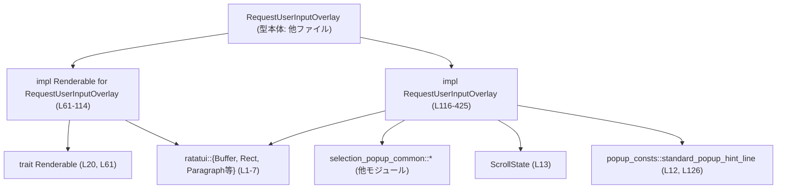
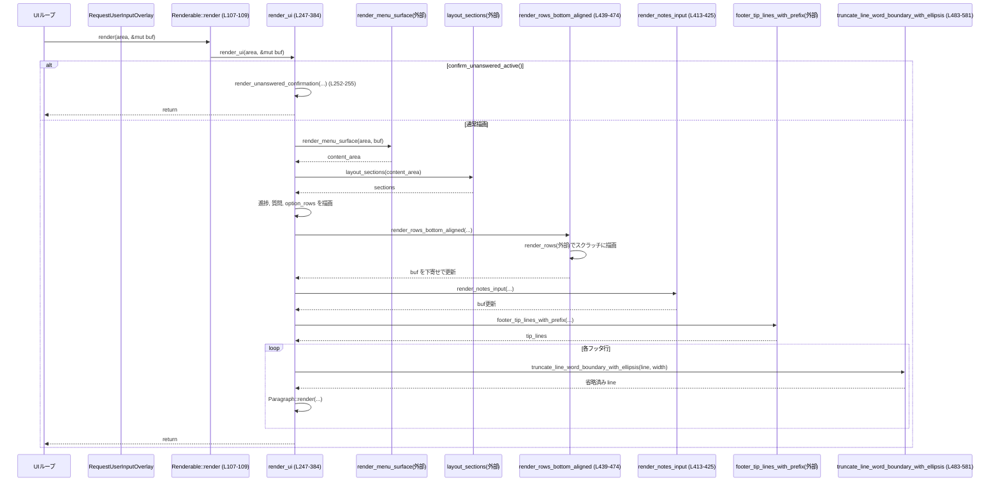

tui/src/bottom_pane/request_user_input/render.rs

---

## 0. ざっくり一言

- ユーザー入力用のボトムオーバーレイ（質問＋選択肢＋ノート入力＋フッターヒント）と、「未回答が残っている場合の確認ダイアログ」を ratatui 上に描画するモジュールです（render.rs:L61-115, L247-425）。
- 行の折り返し・選択肢リストのスクロール・フッターヒントの省略表示など、レイアウトまわりの細かい UI ロジックをここで実装しています（render.rs:L132-169, L247-384, L483-581）。

---

## 1. このモジュールの役割

### 1.1 概要

- このモジュールは **RequestUserInputOverlay の描画処理**を提供します。  
  - 通常時: 質問・選択肢・ノート入力・フッターヒントをボトムペインに描画（render.rs:L247-384）。
  - 未回答確認時: 「X unanswered questions」ダイアログを描画（render.rs:L117-169, L171-245）。
- さらに、フッターヒントの行を幅に合わせて省略（…）するユーティリティや、選択肢リストを下寄せで描画するユーティリティを提供します（render.rs:L439-474, L483-581）。

### 1.2 アーキテクチャ内での位置づけ

このモジュールは RequestUserInputOverlay の UI レイヤで、他のボトムペイン共通部品を利用して描画しています。



- `selection_popup_common` 由来の関数で、メニュー枠描画・行レンダリング・折り返し計測などを担当しています（render.rs:L14-19, L66-68, L155-161, L171-177, L217-224, L262, L400）。
- `Renderable` トレイトの実装により、外部からは「Renderable なオーバーレイ」として扱われます（render.rs:L20, L61-114）。

### 1.3 設計上のポイント

- **状態は受け取るだけで保持しない**  
  このファイル内にはフィールドを持つ構造体定義はありますが、メイン状態は `RequestUserInputOverlay` 側にあり、ここは描画ロジックのみを担います（render.rs:L31-44, L116-425）。  
- **サイズ計算と描画が分離**  
  高さ計算（`desired_height`, `unanswered_confirmation_height`）と具体的描画（`render_ui`, `render_unanswered_confirmation`）を分けています（render.rs:L62-105, L151-169, L171-245, L247-384）。
- **安全な数値演算・領域チェック**  
  - `saturating_add`・`saturating_sub` でオーバーフロー／アンダーフローを防いでいます（render.rs:L97-104, L193, L197-203, L226-229, L286-287, L334-337, L368, L375-380, L468-469, L500-501, L518, L521）。
  - `area.width == 0 || area.height == 0` チェックで、ゼロサイズ領域への描画を早期リターンします（render.rs:L249-251, L259-261, L173-175, L247-251, L413-416, L447-449）。
- **エラーを Result ではなくレイアウト制御で扱う**  
  入力値が不足している・領域が狭いなどのケースは、返り値の `Result` ではなく UI 上の表示（"No options", "No choices" など）で扱っています（render.rs:L217-224, L324-325, L277-278）。
- **並行性要素はなし**  
  スレッド生成や共有可変状態はなく、`&self` と `&mut Buffer` を受ける純粋な描画処理です（render.rs:L61-114, L247-425, L439-474, L483-581）。

---

## 2. 主要な機能一覧

- リクエスト入力オーバーレイの高さ計算: `desired_height`（通常）と `unanswered_confirmation_height`（未回答確認）（render.rs:L62-105, L151-169）。
- 未回答確認ダイアログのデータ構築とレイアウト計算: `unanswered_confirmation_data`, `unanswered_confirmation_layout`（render.rs:L117-149）。
- 未回答確認ダイアログの描画: `render_unanswered_confirmation`（render.rs:L171-245）。
- 通常のリクエスト入力オーバーレイ描画: `render_ui`（進捗ヘッダ・質問・選択肢・メモ入力・フッターヒント）（render.rs:L247-384）。
- ノート入力エリアのカーソル位置計算: `cursor_pos_impl`（render.rs:L387-410）。
- ノート入力の描画（シークレット用マスク対応）: `render_notes_input`（render.rs:L413-425）。
- 選択肢リストを下寄せで描画するヘルパ: `render_rows_bottom_aligned`（render.rs:L439-474）。
- スタイル付き行の幅計測と、省略（…）付きトランケーション: `line_width`, `truncate_line_word_boundary_with_ellipsis`（render.rs:L428-432, L483-581）。

---

## 3. 公開 API と詳細解説

### 3.1 型一覧（構造体など）

| 名前 | 種別 | 役割 / 用途 | 定義位置 |
|------|------|-------------|----------|
| `UnansweredConfirmationData` | 構造体（内部） | 未回答確認ダイアログの文言・行リスト・スクロール状態を保持 | render.rs:L31-37 |
| `UnansweredConfirmationLayout` | 構造体（内部） | 折り返し済みのヘッダ行・ヒント行と、行リスト・スクロール状態をまとめたレイアウト情報 | render.rs:L39-44 |

これらは `RequestUserInputOverlay` 内部でのみ使われる補助的なデータ構造です（render.rs:L117-149, L171-245）。

### 3.2 関数詳細（主要 7 件）

#### 1. `desired_height(&self, width: u16) -> u16`

**概要**

- `Renderable` トレイトの一部として、通常モードのオーバーレイに必要な高さを計算します（未回答確認中はそちらの高さを委譲）（render.rs:L62-65）。

**引数**

| 引数名 | 型 | 説明 |
|--------|----|------|
| `width` | `u16` | 親から与えられる利用可能な幅（セル数） |

**戻り値**

- このオーバーレイに必要な高さ（セル数、`u16`）。`MIN_OVERLAY_HEIGHT` 以上に切り上げられます（render.rs:L26, L104-105）。

**内部処理の流れ**

1. 未回答確認モードなら `unanswered_confirmation_height(width)` に委譲し、その結果を返す（render.rs:L62-65）。
2. 通常モードでは仮想的な `Rect::new(0, 0, width, u16::MAX)` から、共通メニューインセット領域 `inner` を計算し、内側の幅 `inner_width` を求める（render.rs:L66-68）。
3. 質問テキストの折り返し行数 `question_height` を `wrapped_question_lines(inner_width).len()` で取得（render.rs:L69-70）。
4. 選択肢がある場合は `options_preferred_height(inner_width)` を、それ以外は 0 を `options_height` とする（render.rs:L71-75）。
5. ノート UI を表示するかを判定し、表示する場合は `notes_input_height(inner_width)` を `notes_height` とする（render.rs:L76-81）。
6. 選択肢とノート表示状況に応じて、セクション間のスペーサ行数 `spacer_rows` を決定（render.rs:L82-92）。
7. フッタの必要高さ `footer_required_height(inner_width)` を取得（render.rs:L93）。
8. これらを `saturating_add` で合計し、進捗行・パディング・最小高さを考慮して最終的な高さを返す（render.rs:L95-105）。

**Errors / Panics**

- 明示的な `Result` や `panic!` はありません。
- 数値演算はすべて `saturating_add` を用いているため、オーバーフローで panic することはありません（render.rs:L97-104）。

**Edge cases**

- `width == 0` の場合でも、内部で `inner.width.max(1)` を使うため、幅 1 を前提として高さが計算されます（render.rs:L68）。  
- 質問・選択肢・ノート・フッタのいずれかが 0 行でも、その分は 0 として加算されます。  
- `menu_surface_padding_height()` の戻り値が 0 の場合でも問題なく動作します（render.rs:L103）。

**使用上の注意点**

- この関数は「計算だけ」であり、`layout_sections` など他のレイアウト計算の前提と整合している必要がありますが、その整合性はこのチャンクでは確認できません（layout_sections はこのチャンクに定義がありません）。

---

#### 2. `unanswered_confirmation_height(&self, width: u16) -> u16`

**概要**

- 未回答確認ダイアログ表示時のオーバーレイ高さを計算します（render.rs:L151-169）。

**引数 / 戻り値**

- `width`: 利用可能な幅。`desired_height` と同様に仮想 Rect から内側幅を求めます（render.rs:L152-154）。
- 戻り値: 未回答確認ダイアログの必要高さ。`MIN_OVERLAY_HEIGHT` 以上に調整されます（render.rs:L162-169）。

**内部処理の流れ**

1. `Rect::new(0, 0, width, u16::MAX)` から `menu_surface_inset` で内側領域を取得し、`inner_width` を計算（render.rs:L152-154）。
2. `unanswered_confirmation_layout(inner_width)` で、折り返し済みヘッダ行・行リスト・ヒント行を取得（render.rs:L155）。
3. `measure_rows_height` に `layout.rows` と `layout.state`、最大表示行数 `layout.rows.len().max(1)`、幅 `inner_width` を渡して、選択肢部分の高さを計測（render.rs:L156-161）。
4. ヘッダ・空行・行部分・空行・ヒント行・パディングを合計し、最小高さ以上にして返す（render.rs:L162-169）。

**Errors / Panics**

- 数値演算は単純加算で `saturating_*` は使っていませんが、`u16` 同士で、現実的な UI 高さではオーバーフローは起きにくい想定です（render.rs:L162-168）。
- `measure_rows_height` 内部の挙動（エラーの有無）はこのチャンクには現れません。

**Edge cases**

- 選択肢行が 0 件の場合でも、`layout.rows.len().max(1)` により 1 行分として扱われます（render.rs:L156-160）。  
- ヘッダやヒント行が多くて高さが大きくなっても、そのまま加算されます。

**使用上の注意点**

- `unanswered_confirmation_layout` が返す `rows` と `state` が `measure_rows_height` の契約に従っている必要があります。詳細は別モジュール側の実装に依存します（このチャンクには現れません）。

---

#### 3. `render_unanswered_confirmation(&self, area: Rect, buf: &mut Buffer)`

**概要**

- 未回答確認ダイアログを指定領域に描画します（render.rs:L171-245）。

**引数**

| 引数名 | 型 | 説明 |
|--------|----|------|
| `area` | `Rect` | 画面上での描画領域 |
| `buf` | `&mut Buffer` | ratatui の描画バッファ |

**戻り値**

- ありません（副作用として `buf` を更新）。

**内部処理の流れ**

1. `render_menu_surface(area, buf)` で共通のメニュー枠を描画し、その内側 `content_area` を取得（render.rs:L172）。
2. `content_area` がゼロサイズなら即 return（render.rs:L173-175）。
3. `unanswered_confirmation_layout(width)` でレイアウト情報を取得（render.rs:L176-177）。
4. ヘッダ行を上から順に描画し、領域末尾を超えると return（render.rs:L179-194）。
5. ヘッダの後に 1 行のスペーサを挿入（まだ領域に余裕がある場合）（render.rs:L196-198）。
6. 残り高さ `remaining` を計算し、0 なら return（render.rs:L200-205）。
7. ヒント行の高さと `remaining` の比較から、ヒント前のスペーサ行数（0 または 1）と選択肢行の高さ `rows_height` を決定（render.rs:L207-210）。
8. `rows_area` を構築し、`render_rows` で選択肢を描画（render.rs:L211-224）。
9. 行部分の後に必要に応じて 1 行スペーサを挿入し（render.rs:L226-229）、ヒント行を表示可能な範囲まで描画（render.rs:L230-244）。

**Errors / Panics**

- `render_rows` 内部の挙動は不明ですが、この関数自体はゼロサイズチェックと高さ計算に `saturating_*` を使っており、算術による panic を避けています（render.rs:L200-203, L207-210, L226-229）。

**Edge cases**

- 非常に高さの小さい `content_area` では、ヘッダだけで終わる、あるいはヘッダ＋選択肢のみでヒントが表示されない場合があります（render.rs:L181-183, L200-210, L230-243）。
- `layout.rows` が空のときには `"No choices"` というメッセージが `render_rows` に渡されます（render.rs:L217-224）。

**使用上の注意点**

- `area` と `buf` の整合性（`area` が `buf` の有効範囲内であること）は呼び出し側の `ratatui` レイアウトに依存します。
- 未回答確認中かどうかの判定自体はこの関数の外（`render_ui` や `desired_height`）で行われます（render.rs:L62-65, L252-255）。

---

#### 4. `render_ui(&self, area: Rect, buf: &mut Buffer)`

**概要**

- 通常モードの「リクエストユーザー入力」オーバーレイ全体（進捗・質問・選択肢・ノート入力・フッターヒント）を描画します（render.rs:L247-384）。

**引数**

| 引数名 | 型 | 説明 |
|--------|----|------|
| `area` | `Rect` | ボトムオーバーレイの描画領域 |
| `buf` | `&mut Buffer` | ratatui のバッファ |

**戻り値**

- ありません（`buf` に描画）。

**内部処理の流れ（ざっくり）**

1. `area` がゼロサイズなら何も描画せず return（render.rs:L249-251）。
2. 未回答確認中なら `render_unanswered_confirmation` に丸投げして return（render.rs:L252-255）。
3. `render_menu_surface` で背景のメニュー枠を描画し、`content_area` を取得（render.rs:L258-259）。
4. `layout_sections(content_area)` で進捗・質問・選択肢・ノート・フッタなどの領域と質問テキスト行配列を取得（render.rs:L262）。
5. ノート表示フラグと未回答数を取得（render.rs:L263-264）。
6. **進捗ヘッダ**  
   - 質問数 > 0 のとき `"Question idx/total"` をベースに、未回答があれば `"(... unanswered)"` を付加して dim スタイルで描画（render.rs:L266-276, L279）。
   - 質問がない場合は `"No questions"` を dim スタイルで描画（render.rs:L277-278）。
7. **質問テキスト**  
   - `sections.question_lines` を行ごとに描画。現在の質問が回答済みかどうかを `is_question_answered` で判定し、未回答なら行全体を cyan で強調（render.rs:L282-305）。
8. **選択肢（オプション）**  
   - `option_rows()` で行データを取得（render.rs:L307-309）。
   - 選択肢がある場合、`current_answer().map(|a| a.options_state).unwrap_or_default()` からスクロール状態を取得し、高さがあれば `ensure_visible` で選択中の項目が可視範囲に入るよう調整（render.rs:L310-318）。
   - `render_rows_bottom_aligned` で選択肢を領域の下端に揃えて描画（render.rs:L319-326）。
9. **ノート入力**  
   - ノート UI を表示し、かつノート領域に高さがある場合は `render_notes_input` で描画（render.rs:L330-332）。
10. **フッターヒント**  
    - ノート領域の直下から `footer_area` を構成し、高さが 0 なら return（render.rs:L334-345）。
    - 選択肢が領域に収まりきらない場合には `"option X/Y"` のフッターチップを追加するための `FooterTip` を構築（render.rs:L347-355）。
    - `footer_tip_lines_with_prefix` でヒント行の行・列構成を取得し、行ごとに:
      - 各チップの区切りに `TIP_SEPARATOR` を挿入し、`highlight` フラグに応じて cyan/bold/not_dim を適用（render.rs:L357-373）。
      - 全体を dim し、`truncate_line_word_boundary_with_ellipsis` で幅に合わせて省略（render.rs:L374-375）。
      - `Paragraph::new(line).render(row_area, buf)` で描画（render.rs:L376-382）。

**Errors / Panics**

- ゼロサイズ領域チェックにより、無効な描画領域での処理を避けています（render.rs:L249-251, L259-261）。
- `selected_option_index().unwrap_or(0)` を使っており、`None` の場合は 0 ベースで扱うため panic しません（render.rs:L351）。
- 数値演算には `saturating_add`, `saturating_sub` を多用しており、負の値やオーバーフローによる panic を避けています（render.rs:L286-287, L334-337, L347-349, L368, L375-380）。

**Edge cases**

- 質問数が 0 の場合は `"No questions"` とだけ表示され、それ以外のセクション（選択肢やノートなど）の扱いは `layout_sections` の実装次第です（render.rs:L266-278。`layout_sections` はこのチャンクには現れません）。
- 選択肢が存在しても `sections.options_area.height == 0` の場合は描画されません（render.rs:L315-327）。
- 選択肢が `footer_area` の上に収まりきらない場合、フッターヒントに `"option X/Y"` の追加情報が表示されます（render.rs:L347-355）。
- フッターヒントが横幅に収まらない場合、単語境界を優先して `…` で省略されます（render.rs:L374-375, L483-581）。

**使用上の注意点**

- `layout_sections`, `option_rows`, `current_answer`, `options_required_height`, `footer_tip_lines_with_prefix` など、多数のメソッド・関数に依存しており、それらの契約が崩れると描画の整合性が失われます（これらの定義はこのチャンクには現れません）。
- `area` と `buf` の整合性（領域がバッファ内に収まること）は ratatui 側のレイアウトに依存します。
- 並行性: `&mut Buffer` に単一スレッドから描画する前提であり、このファイル内には同期化処理はありません。

---

#### 5. `cursor_pos_impl(&self, area: Rect) -> Option<(u16, u16)>`

**概要**

- ノート入力エリアを編集しているときのカーソル位置を計算します（render.rs:L387-410）。

**引数 / 戻り値**

- `area`: オーバーレイ全体の領域。
- 戻り値: `Some((x, y))` ならカーソル位置、編集対象がない／可視でない場合は `None`。

**内部処理の流れ**

1. 未回答確認中なら常に `None`（render.rs:L388-390）。
2. 選択肢の有無とノート UI の表示フラグを取得（render.rs:L391-392）。
3. フォーカスがノートにない場合は `None`（`focus_is_notes()`） （render.rs:L394-396）。
4. 選択肢があり、かつノートが非表示なら `None`（render.rs:L397-399）。
5. `menu_surface_inset(area)` で内側領域 `content_area` を求め、ゼロサイズなら `None`（render.rs:L400-402）。
6. `layout_sections(content_area)` から `notes_area` を取得し、ゼロサイズなら `None`（render.rs:L404-407）。
7. 最後に `self.composer.cursor_pos(input_area)` を返す（render.rs:L409）。

**Errors / Panics**

- `Option` を適切に使い、条件ごとに早期リターンしているため、panic する可能性は特にありません。

**Edge cases**

- ノート入力が画面外にスクロールしている場合、`layout_sections` が `notes_area.height == 0` を返す想定で、その場合は `None` となります（render.rs:L404-407）。
- フォーカスの概念や `focus_is_notes` の詳細な挙動はこのチャンクには現れません。

**使用上の注意点**

- UI フレームワーク側で、この戻り値をそのままカーソル位置として使用する前提です。
- `composer.cursor_pos` は `input_area` を前提としており、その座標系が `render_ui` でノートを描画した位置と完全に一致している必要があります（render.rs:L330-332）。

---

#### 6. `render_rows_bottom_aligned(...)`

```rust
fn render_rows_bottom_aligned(
    area: Rect,
    buf: &mut Buffer,
    rows: &[GenericDisplayRow],
    state: &ScrollState,
    max_results: usize,
    empty_message: &str,
)
```

**概要**

- 選択肢行を指定領域の下端に揃えて描画するヘルパ関数です。描画結果を一度スクラッチバッファに描き、その内容を下寄せで元のバッファにコピーします（render.rs:L439-474）。

**引数**

| 引数名 | 型 | 説明 |
|--------|----|------|
| `area` | `Rect` | 描画対象領域 |
| `buf` | `&mut Buffer` | 元の描画バッファ |
| `rows` | `&[GenericDisplayRow]` | 表示する行データ |
| `state` | `&ScrollState` | スクロール状態（先頭インデックスなど） |
| `max_results` | `usize` | `render_rows` に渡す最大行数 |
| `empty_message` | `&str` | 行が空のときに表示するメッセージ |

**戻り値**

- なし（`buf` を更新）。

**内部処理の流れ**

1. `area` がゼロサイズなら即 return（render.rs:L447-449）。
2. `scratch_area = Rect::new(0, 0, area.width, area.height)` を作り、空の `Buffer::empty(scratch_area)` を生成（render.rs:L451-452）。
3. 元の `buf` の `area` 部分をスクラッチにコピー（render.rs:L453-457）。
4. `render_rows(scratch_area, &mut scratch, rows, state, max_results, empty_message)` で選択肢行をスクラッチに描画し、高さ `rendered_height` を取得（render.rs:L458-465）。
5. `visible_height = rendered_height.min(area.height)` と `y_offset = area.height - visible_height` を計算（render.rs:L467-469）。
6. 上から `visible_height` 行分のスクラッチを、`buf` の `area` 内の下端側にコピー（render.rs:L469-473）。

**Errors / Panics**

- `render_rows` の内部実装による可能性は不明ですが、この関数自体では境界チェックを `area` だけに依存しており、`buf` のサイズに対する追加チェックはありません。
  - `buf[(area.x + x, area.y + y)]` へのアクセスが安全であることを前提としています（render.rs:L455-456, L471-472）。
- `area` が `buf` の範囲からはみ出さないことは呼び出し側の責任になります。

**Edge cases**

- `rendered_height == 0` の場合、`visible_height` も 0 となり、コピーは行われません。背景だけが残ります（render.rs:L467-473）。
- `rendered_height > area.height` の場合でも、上位 `visible_height` 行だけが描画されます（render.rs:L467-473）。

**使用上の注意点**

- `area` と `buf` の整合性が非常に重要です。`render_ui` 内では `sections.options_area` を渡しており、その計算が正しいことが前提です（render.rs:L319-326）。
- サイズの大きな領域に対して毎フレームコピーを行うため、パフォーマンスに敏感な場面では注意が必要です。

---

#### 7. `truncate_line_word_boundary_with_ellipsis(line, max_width) -> Line<'static>`

**概要**

- スタイル付き `Line<'static>` を `max_width` に収まるようにトランケートし、可能なら単語境界（空白）で切って末尾に `…` を付加する関数です。複数スパンを考慮し、日本語など全角文字の幅も `unicode_width` で計算しています（render.rs:L483-582）。

**引数**

| 引数名 | 型 | 説明 |
|--------|----|------|
| `line` | `Line<'static>` | 対象のスタイル付き行 |
| `max_width` | `usize` | 許容される最大表示幅（セル単位） |

**戻り値**

- トランケート済みの `Line<'static>`。必要に応じて末尾に `…` が付きます。

**内部処理の流れ（要約）**

1. `max_width == 0` のときは空の `Line` を返す（render.rs:L487-489）。
2. 行幅がすでに `max_width` 以下なら元の行をそのまま返す（render.rs:L491-493）。
3. `ellipsis = "…"` の幅を計算し、`ellipsis_width >= max_width` の場合は `…` だけの行を返す（render.rs:L495-499）。
4. `limit = max_width - ellipsis_width` を計算し、そこまでの範囲で `line.spans` を順に走査（render.rs:L500-501, L514-531）。
   - 各文字の幅を `UnicodeWidthChar::width` で計算し、`used + ch_width > limit` になった時点でループ終了（render.rs:L517-521）。
   - 走査中に「最後に収まった位置 (`last_fit`)」と「最後の空白位置 (`last_word_break`)」を `BreakPoint` として記録（render.rs:L523-530）。
5. オーバーフローしなかった場合は元の行を返す（render.rs:L534-536）。
6. オーバーフローした場合、`last_word_break.or(last_fit)` で切り位置を選択。どちらもない場合は `…` だけの行を返す（render.rs:L539-543）。
7. 選択されたスパンとバイト位置までを使って新しい `spans_out` を構築（render.rs:L545-560）。
   - 切り位置より前のスパンはそのまま。
   - 切り位置のスパンは先頭から `byte_end` までを切り出す。
8. `spans_out` の末尾から、末尾のホワイトスペースを削除。空になったスパンは落とす（render.rs:L562-572）。
9. 最後に、末尾スパンのスタイル（または行スタイル）を引き継いだ `…` のスパンを追加し、行スタイルを維持したまま返す（render.rs:L575-581）。

**Errors / Panics**

- `text[..chosen_break.byte_end]` は `char_indices` から取得したバイトオフセットを使っているため、UTF-8 の文字境界に沿っており、スライスで panic することはありません（render.rs:L515-516, L553-555）。
- `UnicodeWidthChar::width(ch).unwrap_or(0)` は未定義幅の文字に対して 0 を返すため、panic しません（render.rs:L517-518）。

**Edge cases**

- `max_width == 0` → 空行（スタイルなし）を返す（render.rs:L487-489）。
- `ellipsis_width >= max_width` → `…` だけの行（スタイルはデフォルト）を返す（render.rs:L495-499）。
- 行が `limit` 内に収まる → 元の行を返す（render.rs:L491-493, L534-536）。
- 行頭からすぐに `limit` を超える場合、`last_fit` が存在しないため `…` だけになります（render.rs:L539-543）。
- 末尾が空白の場合、その空白は削除されてから `…` が付加されます（render.rs:L562-572）。

**使用上の注意点**

- 引数 `line` は `Line<'static>` に所有権を移すため、呼び出し側で再利用できません（所有権移動）。  
- 行スタイルは最後まで維持されますが、`ellipsis_width >= max_width` で `…` だけ返す場合は元のスタイルが失われる点に注意が必要です（render.rs:L495-499, L575-581）。

---

### 3.3 その他の関数・メソッド一覧（コンポーネントインベントリ）

| 名前 | 種別 | 役割（1 行） | 定義位置 |
|------|------|--------------|----------|
| `line_to_owned` | 関数 | `Line<'_>` の内容を `Line<'static>` にコピー（Span のテキストを `Cow::Owned` に変換） | render.rs:L46-59 |
| `unanswered_confirmation_data` | メソッド | 未回答確認用タイトル・サブタイトル・ヒント・行・スクロール状態をまとめて構築 | render.rs:L117-130 |
| `unanswered_confirmation_layout` | メソッド | タイトル・サブタイトル・ヒントを折り返してレイアウト用行ベクタに変換 | render.rs:L132-149 |
| `render` | メソッド（Renderable） | `render_ui` への薄いラッパ | render.rs:L107-109 |
| `cursor_pos` | メソッド（Renderable） | `cursor_pos_impl` への薄いラッパ | render.rs:L111-113 |
| `render_notes_input` | メソッド | ノート入力欄を描画。シークレット質問のときは `*` でマスク | render.rs:L413-425 |
| `line_width` | 関数 | `Line` 内の全 Span の文字幅合計を `unicode_width` で計算 | render.rs:L428-432 |

---

## 4. データフロー

代表的なシナリオ: 通常状態で `RequestUserInputOverlay` が描画されるときの流れです。

1. 上位 UI から `Renderable::render(&overlay, area, &mut buf)` が呼ばれます（render.rs:L61-114）。
2. `render` メソッドが `render_ui` に委譲（render.rs:L107-109, L247-384）。
3. `render_ui` が:
   - `render_menu_surface` で背景を描画。
   - `layout_sections` で各セクションの `Rect` を計算。
   - `option_rows` や `current_answer` から選択肢＋スクロール状態を取得。
   - `render_rows_bottom_aligned` ですべての選択肢を表示。
   - `render_notes_input` でノート欄を描画。
   - `footer_tip_lines_with_prefix` → `truncate_line_word_boundary_with_ellipsis` でフッターヒントを描画。



---

## 5. 使い方（How to Use）

### 5.1 基本的な使用方法

`RequestUserInputOverlay` 型自体の定義はこのチャンクにはありませんが、`Renderable` として利用する典型パターンは以下のようになります。

```rust
use ratatui::{Terminal, backend::CrosstermBackend};
use ratatui::layout::Rect;
use tui::bottom_pane::request_user_input::RequestUserInputOverlay;
use tui::render::renderable::Renderable;

// ... 端末とフレームワークの初期化 ...

fn draw_request_overlay(
    overlay: &RequestUserInputOverlay,       // 既に状態を持っているとする
    term: &mut Terminal<CrosstermBackend<std::io::Stdout>>,
) -> std::io::Result<()> {
    term.draw(|frame| {
        let size = frame.size();             // 画面全体の Rect を取得
        let height = overlay.desired_height(size.width);   // 必要高さを計算 (L62-105)
        let area = Rect {
            x: 0,
            y: size.height.saturating_sub(height),
            width: size.width,
            height,
        };

        // ratatui の Frame から Buffer を取得して描画する
        let buf = frame.buffer_mut();
        overlay.render(area, buf);           // Renderable::render → render_ui (L107-109, L247-384)
    })?;

    Ok(())
}
```

- 上記は概念的な例であり、実際のクレート構成やモジュールパスはプロジェクト全体に依存します。

### 5.2 よくある使用パターン

1. **未回答確認ダイアログの表示**
   - オーバーレイの状態 `confirm_unanswered` を `Some(...)` に変更することで、`confirm_unanswered_active()` が `true` となり、`render_ui` / `desired_height` が確認ダイアログモードになります（render.rs:L62-65, L252-255, L117-130, L171-245）。
   - 呼び出し側ではオーバーレイを再描画するだけで、通常モードとダイアログモードを切り替え可能です。

2. **ノート入力へのフォーカス**
   - フレームワーク側でキー入力に応じて `focus_is_notes()` が true になるよう状態を更新しておくと、`cursor_pos_impl` がノート領域の座標を返すため、その位置にカーソルを表示できます（render.rs:L387-410）。

### 5.3 よくある間違い（想定されるもの）

```rust
// 間違い例: layout_sections と描画の前提がずれているケース
let content_area = render_menu_surface(area, buf);
// layout_sections を使わずに、独自に notes_area を計算して cursor_pos_impl などを呼ぶ
let wrong_notes_area = /* ... */;
// → cursor_pos_impl は内部で layout_sections を使うため、位置が一致しない (L404-409)

// 正しい例: layout_sections による領域計算を一貫して使用する
let sections = overlay.layout_sections(content_area); // 定義は他ファイル
let cursor = overlay.cursor_pos_impl(area);           // 内部で layout_sections を再利用 (L400-409)
```

- `layout_sections` の定義がこのチャンクに存在しないため、実際の API 形状は不明ですが、少なくとも `render_ui` と `cursor_pos_impl` が同じ計算に依存している点は重要です（render.rs:L262, L404）。

### 5.4 使用上の注意点（まとめ）

- **前提条件**
  - `area` は `buf` の有効範囲に完全に収まっている必要があります（render.rs:L453-456, L471-472）。
  - `RequestUserInputOverlay` 内のメソッド（`layout_sections`, `option_rows`, `composer` など）の契約が満たされている前提で高さ計算・描画が行われます（render.rs:L262-265, L307-315, L417-423）。
- **エラー処理**
  - このモジュールは Result ベースのエラーは返さず、ゼロサイズチェックと UI 上のメッセージ（"No options", "No choices", "No questions"）で「扱えない状態」を表現します（render.rs:L173-175, L249-251, L259-261, L217-224, L324-325, L277-278）。
- **並行性**
  - スレッドや非同期処理は一切登場せず、描画関数はすべて同期的に `&mut Buffer` を更新します（render.rs:L61-114, L247-384, L439-474, L483-581）。
- **秘匿情報の扱い**
  - `current_question().is_some_and(|q| q.is_secret)` が true の場合、ノート入力は `*` でマスクされます（render.rs:L417-423）。  
    パスワードやシークレットを TUI 上に表示しないための基本的な保護になっています。

---

## 6. 変更の仕方（How to Modify）

### 6.1 新しい機能を追加する場合

例: フッターヒントに別種の情報（例: 残り時間）を追加したい場合。

1. **FooterTip 生成側の拡張**
   - `footer_tip_lines_with_prefix` の実装ファイル（このチャンクには現れません）で、新しい `FooterTip` を追加するロジックを加えるのが自然です（render.rs:L357-358）。
2. **render_ui でのプレフィックス追加**
   - 既存の `option_tip` と同様に、新しい情報を `FooterTip::new(...)` で生成し、`footer_tip_lines_with_prefix` に渡します（render.rs:L347-355）。
3. **表示スタイルの調整**
   - 強調したい場合は `tip.highlight` を true に設定すれば、`render_ui` 側で cyan/bold/not_dim が適用されます（render.rs:L363-371）。

### 6.2 既存の機能を変更する場合

- **高さの計算ロジックを変更したい場合**
  - `desired_height` と `render_ui` の両方に影響が出るため、
    - セクション追加・削除を行ったときは、高さ計算（質問・オプション・ノート・フッタ・パディング）の式を合わせて更新する必要があります（render.rs:L97-104, L334-343）。
- **選択肢の表示位置を変更したい場合（下寄せ → 上寄せなど）**
  - `render_rows_bottom_aligned` を修正するか、別関数として上寄せ版を定義し、`render_ui` からの呼び出しを切り替えます（render.rs:L319-326, L439-474）。
- **フッターヒントの省略挙動を変えたい場合**
  - `truncate_line_word_boundary_with_ellipsis` 内のロジックを調整します。  
    例えば「必ず単語境界で切る」などにしたい場合、`last_word_break` がないときのフォールバック挙動を変更することになります（render.rs:L539-543）。

変更時には、以下を確認するのが安全です。

- `layout_sections` の返す領域と、新しく追加・変更する描画処理の領域が整合しているか（render.rs:L262, L404）。
- `desired_height` が新しいレイアウト構造を反映しているか（render.rs:L95-104, L151-169）。
- ゼロサイズチェックや `saturating_*` の使用により、新しいケースでも panic が発生しないか。

---

## 7. 関連ファイル

このモジュールと密接に関係する（呼び出している）要素は、すべてこのチャンク外で定義されています。

| パス / シンボル | 役割 / 関係 |
|-----------------|------------|
| `crate::bottom_pane::selection_popup_common` | `render_menu_surface`, `menu_surface_inset`, `menu_surface_padding_height`, `render_rows`, `measure_rows_height`, `wrap_styled_line`, `GenericDisplayRow` を提供し、ボトムペイン共通の見た目と行レンダリングを担います（render.rs:L14-19, L35, L42, L66-68, L155-161, L171-177, L217-224, L451-452, L458-465）。 |
| `crate::bottom_pane::popup_consts::standard_popup_hint_line` | 未回答確認ダイアログのヒント行（例: キー操作ガイド）を構築する関数です（render.rs:L12, L126）。 |
| `crate::bottom_pane::scroll_state::ScrollState` | 行リストのスクロール状態（選択中インデックスやスクロール位置など）を管理する型です（render.rs:L13, L36-37, L43-44, L443-444）。 |
| `crate::render::renderable::Renderable` | このオーバーレイをフレームワーク全体に統一的な描画インターフェースとして公開するトレイトです（render.rs:L20, L61-114）。 |
| `RequestUserInputOverlay` （同ディレクトリの別ファイル） | このモジュールで描画されるオーバーレイ本体の型で、質問リスト・選択肢・ノート用 composer・未回答状態などのロジックを保持していると考えられますが、定義はこのチャンクには現れません（render.rs:L23, L61-114, L116-425）。 |

---

### Bugs / Security / 契約・エッジケース / テスト / パフォーマンス まとめ

- **潜在的なバグ候補（観測されるもの）**
  - `render_rows_bottom_aligned` は `buf` の bounds チェックを行わず、`area` が有効であることを前提にインデックスアクセスを行います（render.rs:L453-456, L471-472）。`area` が誤っているとバッファ外参照による panic の可能性があります。
- **セキュリティ**
  - シークレット質問時にノート入力を `*` でマスクする処理があり、平文を画面に表示しない設計になっています（render.rs:L417-423）。
- **契約 / エッジケース**
  - `width == 0` や `height == 0` の領域では処理をスキップする契約が明確です（render.rs:L173-175, L249-251, L259-261, L413-416, L447-449）。
  - 行省略の際に単語境界を優先し、なければ文字境界で切るロジックは、アプリケーション全体の文字列表示ポリシーと整合している必要があります（render.rs:L539-543）。
- **テスト**
  - このチャンク内にテストコード（`#[test]` など）は存在しません。挙動確認は別のテストモジュールまたは手動テストに依存していると考えられます。
- **パフォーマンス**
  - `render_rows_bottom_aligned` は `area` 全体をスクラッチバッファにコピーしてから描画し直すため、`width × height` に比例したコストがかかります（render.rs:L451-457, L469-473）。  
    ただし TUI の typical な領域サイズであれば問題になりにくいと考えられます。
  - `truncate_line_word_boundary_with_ellipsis` は文字単位で走査する O(n) 処理で、フッターヒント行程度の短い文字列に対しては十分です（render.rs:L514-531）。

以上が、このファイル単独から読み取れる範囲での構造と挙動の整理です。
