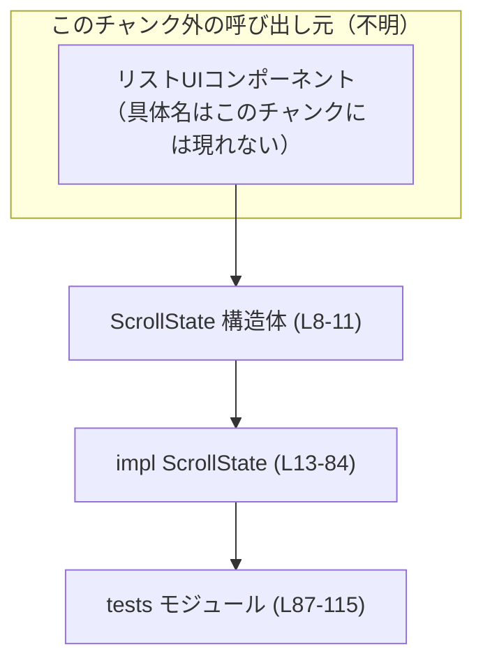
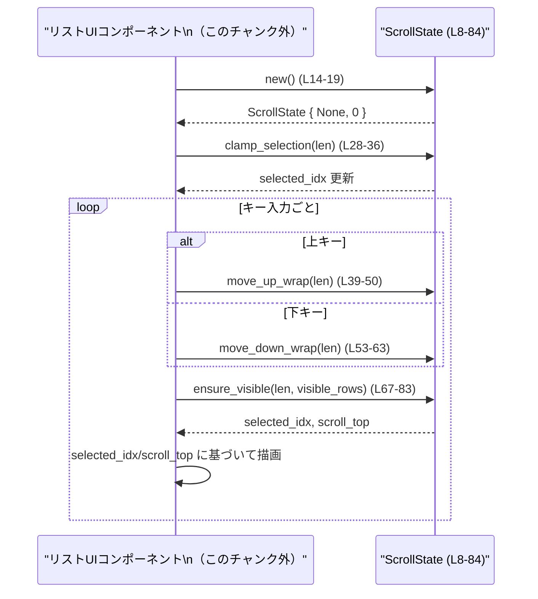

# tui/src/bottom_pane/scroll_state.rs

## 0. ざっくり一言

縦方向リストメニューのための、**選択位置とスクロール位置を一括管理する汎用状態構造体**です（選択のラップ移動と「選択行が常に表示領域内に入る」スクロール制御を行います）。  
（根拠: ファイル先頭コメント `Generic scroll/selection state for a vertical list menu.` `tui/src/bottom_pane/scroll_state.rs:L1-6`）

---

## 1. このモジュールの役割

### 1.1 概要

- このモジュールは、**縦方向の選択可能リスト**に対して共通する
  - 現在選択中インデックス（`selected_idx`）
  - 先頭表示行番号（`scroll_top`）
  を扱う状態をまとめた `ScrollState` を提供します。（L8-11）
- リスト長が変わる場合の選択インデックスのクランプ（範囲内制約）、上下キーによるラップ付き移動、選択行が表示窓内に入るようにするスクロール調整を行います。（L27-84）

### 1.2 アーキテクチャ内での位置づけ

このファイルからは、`ScrollState` がどのモジュールから具体的に利用されているかは分かりませんが、ファイルパスとコメントから、**`tui` クレート内の bottom_pane のリスト UI コンポーネントから利用される内部状態**であると解釈できます（ただし呼び出し元モジュール名はこのチャンクには現れません）。

依存関係（推測を含まない事実ベース）は次の通りです。

- 依存している型
  - `Option<usize>`: 選択インデックスの有無を表現（L9）
  - `usize`: インデックスおよびスクロール位置（L9-10, L28 等）
- 外部クレートや他モジュールへの依存は存在しません（原始型と標準ライブラリプリミティブのみ）。



### 1.3 設計上のポイント

- **状態を持つ構造体**  
  - `selected_idx: Option<usize>`: 選択行インデックス。リストが空の場合などは `None`（L9）。
  - `scroll_top: usize`: 画面に表示するリストの先頭行インデックス（L10）。
- **エラーハンドリング方針**
  - すべてのメソッドは `Result` を返さず、副作用として `self` のフィールドを更新するのみです（L14-84）。
  - `len == 0` や `visible_rows == 0` のケースは明示的に分岐して安全なデフォルト（選択なし・先頭表示）に戻しています（L29-35, L40-43, L54-57, L68-70, L81-83）。
- **ラップアラウンドナビゲーション**
  - 上移動で先頭からさらに上に行くと末尾へ、下移動で末尾からさらに下に行くと先頭へ戻るラップ動作を提供します（L45-49, L59-62）。
- **スクロール制御**
  - `ensure_visible` により、選択行が `scroll_top..(scroll_top + visible_rows - 1)` の範囲内に入るよう `scroll_top` を自動調整します（L65-79）。
- **可変参照による安全性**
  - すべての更新系メソッドは `&mut self` を取り、Rust の借用規則により同時に複数の可変参照が存在しないことがコンパイル時に保証されます（L22, L28, L39, L53, L67）。

---

## 2. 主要な機能一覧

- リスト状態の初期化: `ScrollState::new` で選択なし・スクロール先頭の状態を作成（L14-19）。
- 状態のリセット: `reset` で選択とスクロールを初期状態に戻す（L22-25）。
- 選択インデックスの範囲制約: `clamp_selection` で `0..len-1` に収める／空なら `None` にする（L28-36）。
- 上方向ラップ移動: `move_up_wrap` で 1 行上に移動し、先頭からさらに上なら末尾へラップ（L39-50）。
- 下方向ラップ移動: `move_down_wrap` で 1 行下に移動し、末尾からさらに下なら先頭へラップ（L53-63）。
- 選択行の可視化スクロール: `ensure_visible` で `scroll_top` を調整し、選択行が表示窓内に入るようにする（L67-83）。
- テスト: `wrap_navigation_and_visibility` テストでラップ動作と可視性ロジックを検証（L92-114）。

---

## 3. 公開 API と詳細解説

### 3.1 型一覧（構造体・列挙体など）

| 名前 | 種別 | 役割 / 用途 | 定義位置 |
|------|------|-------------|----------|
| `ScrollState` | 構造体 | 縦方向リストの選択インデックス (`selected_idx`) とスクロール先頭 (`scroll_top`) を保持する状態オブジェクト | `tui/src/bottom_pane/scroll_state.rs:L8-11` |

フィールド詳細:

- `selected_idx: Option<usize>`  
  - 現在選択中の行インデックス。`None` のときは「選択なし」を表します（L9）。
- `scroll_top: usize`  
  - 画面に表示しているリストの先頭行インデックスです（L10）。

### 3.1.1 コンポーネントインベントリー（関数・メソッド）

| 名前 | 種別 | 説明 | 定義位置 |
|------|------|------|----------|
| `ScrollState::new` | 関連関数 | 初期状態（選択なし・スクロール先頭）を生成 | L14-19 |
| `ScrollState::reset` | メソッド | 既存インスタンスの選択・スクロールを初期状態に戻す | L22-25 |
| `ScrollState::clamp_selection` | メソッド | 現在の `selected_idx` を `len` の範囲に収める／空リストなら `None` にする | L28-36 |
| `ScrollState::move_up_wrap` | メソッド | 1 行上へ移動し、先頭からさらに上なら末尾へラップ | L39-50 |
| `ScrollState::move_down_wrap` | メソッド | 1 行下へ移動し、末尾からさらに下なら先頭へラップ | L53-63 |
| `ScrollState::ensure_visible` | メソッド | 選択行が表示窓内に入るよう `scroll_top` を調整する | L67-83 |
| `wrap_navigation_and_visibility` | テスト関数 | ラップナビゲーションと可視性ロジックの基本ケースを検証 | L92-114 |

---

### 3.2 関数詳細（最大 7 件）

#### `ScrollState::new() -> ScrollState`

**概要**

- `selected_idx = None`、`scroll_top = 0` の初期状態を持つ `ScrollState` を生成します（L14-19）。

**引数**

なし。

**戻り値**

- `ScrollState`  
  - 選択が何もない状態の新しいインスタンスです。

**内部処理の流れ**

1. `Self { selected_idx: None, scroll_top: 0 }` を構築して返却します（L15-18）。

**Examples（使用例）**

```rust
use tui::bottom_pane::scroll_state::ScrollState; // モジュールパスは例示であり、このチャンクからは正確には不明

fn create_state() {
    let s = ScrollState::new();            // 初期状態を作成 (L14-19)
    assert_eq!(s.selected_idx, None);      // 選択なし
    assert_eq!(s.scroll_top, 0);           // 先頭表示
}
```

**Errors / Panics**

- エラーやパニック要因はありません（単純な構造体初期化のみ）。

**Edge cases（エッジケース）**

- 特になし（引数を取らず、一定の定数値を返すのみ）。

**使用上の注意点**

- 生成後、リスト長に応じた選択設定を行うには、`clamp_selection` を呼ぶと `len > 0` のときに自動的に `0` が選択されます（L28-32）。

---

#### `ScrollState::reset(&mut self)`

**概要**

- 既存の `ScrollState` インスタンスを、`new()` と同じ初期状態に戻します（L22-25）。

**引数**

| 引数名 | 型 | 説明 |
|--------|----|------|
| `&mut self` | `&mut ScrollState` | 対象の状態インスタンス |

**戻り値**

- なし（インプレース更新）。

**内部処理の流れ**

1. `self.selected_idx = None;`（L23）
2. `self.scroll_top = 0;`（L24）

**Examples（使用例）**

```rust
fn reuse_state(mut s: ScrollState) {
    // 何らかの操作で s が変更されたあと…
    s.reset();                           // 選択とスクロールを初期化 (L22-25)
    assert_eq!(s.selected_idx, None);
    assert_eq!(s.scroll_top, 0);
}
```

**Errors / Panics**

- ありません。

**Edge cases**

- すでに初期状態で呼び出した場合でも、副作用なく同じ状態が維持されます。

**使用上の注意点**

- 他のフィールド（将来追加される場合も含む）には影響しないことが前提の設計ですが、現時点ではフィールドは2つのみです（L9-10）。

---

#### `ScrollState::clamp_selection(&mut self, len: usize)`

**概要**

- 現在の `selected_idx` をリスト長 `len` の範囲に収めます（`0..len-1`）。  
- `len == 0` の場合は選択を `None` にし、スクロールも 0 に戻します（L28-36）。

**引数**

| 引数名 | 型 | 説明 |
|--------|----|------|
| `&mut self` | `&mut ScrollState` | 対象の状態 |
| `len` | `usize` | 現在のリスト要素数 |

**戻り値**

- なし（`self.selected_idx` と場合によっては `self.scroll_top` を更新）。

**内部処理の流れ**

1. `match len` で分岐（L29-32）:
   - `len == 0` の場合: `selected_idx` を `None` にする（L30）。
   - それ以外: 現在の `selected_idx.unwrap_or(0)`（`None` の場合は `0`）を `len - 1` で `min` を取り、`0..=len-1` に収めて `Some(...)` に格納（L31）。
2. さらに `if len == 0 { self.scroll_top = 0; }` でスクロール位置もリセット（L33-35）。

**Examples（使用例）**

```rust
fn clamp_example() {
    let mut s = ScrollState::new();
    let len = 10;

    s.clamp_selection(len);              // None だったので 0 にクランプされる (L28-32)
    assert_eq!(s.selected_idx, Some(0));

    // リスト長が短くなった場合
    s.selected_idx = Some(8);
    s.clamp_selection(5);                // 8 は len-1 (=4) にクランプ (L31)
    assert_eq!(s.selected_idx, Some(4));

    // リストが空になった場合
    s.clamp_selection(0);                // 選択なしに (L29-30, L33-35)
    assert_eq!(s.selected_idx, None);
    assert_eq!(s.scroll_top, 0);
}
```

**Errors / Panics**

- `unwrap_or(0)` を使っているため、`None` が渡されてもパニックは発生しません（L31）。
- `len > 0` のときにのみ `len - 1` を行っており、`len == 0` の場合は別分岐なのでアンダーフローも発生しません（L29-31）。

**Edge cases**

- `len == 0`:
  - `selected_idx = None`、`scroll_top = 0` になります（L29-35）。
- `selected_idx` が `None` のとき `len > 0`:
  - `selected_idx` は `Some(0)` になります（L31）。
- `selected_idx` が `Some(idx)` で `idx >= len` のとき:
  - `len - 1` にクランプされます（L31）。

**使用上の注意点**

- **契約**:
  - 呼び出し側は、リスト長が変化したタイミングで `clamp_selection` を呼び出すことで、`selected_idx` が常に有効なインデックスか `None` であることを前提にできます。
- `scroll_top` は `len == 0` の場合のみリセットされ、それ以外の場合には変更されません。このため、リスト長の変更後にスクロール位置も整合させたい場合は、別途 `ensure_visible` を組み合わせる必要があります（L33-35, L67-83）。

---

#### `ScrollState::move_up_wrap(&mut self, len: usize)`

**概要**

- 選択行を 1 行上に移動します。  
- リスト先頭からさらに上に移動しようとした場合は、末尾（`len - 1`）にラップします（L39-50）。  
- `len == 0` のときは選択を解除し、スクロールも 0 に戻します（L40-43）。

**引数**

| 引数名 | 型 | 説明 |
|--------|----|------|
| `&mut self` | `&mut ScrollState` | 対象状態 |
| `len` | `usize` | リスト長 |

**戻り値**

- なし（`selected_idx` と場合により `scroll_top` を更新）。

**内部処理の流れ**

1. `len == 0` の場合:
   - `selected_idx = None`、`scroll_top = 0` として return（L40-43）。
2. それ以外の場合（L45-49）:
   - `self.selected_idx` に対して `match`:
     - `Some(idx) if idx > 0`: `idx - 1` に移動（L46）。
     - `Some(_)`（つまり `idx == 0`）: 末尾 `len - 1` にラップ（L47）。
     - `None`: `0` を選択（L48）。

**Examples（使用例）**

```rust
fn up_navigation_example() {
    let mut s = ScrollState::new();
    let len = 3;

    s.clamp_selection(len);             // => Some(0)
    s.move_up_wrap(len);                // 先頭から上 => 末尾にラップ (L45-47)
    assert_eq!(s.selected_idx, Some(2));

    s.move_up_wrap(len);                // 2 -> 1
    assert_eq!(s.selected_idx, Some(1));
}
```

**Errors / Panics**

- `len == 0` の場合は早期 return しており、`len - 1` は評価されません（L40-43, L47）。
- `idx - 1` は `idx > 0` の場合にのみ行われるため、アンダーフローは発生しません（L46）。

**Edge cases**

- `len == 0`:
  - `selected_idx = None`、`scroll_top = 0`（L40-43）。
- `selected_idx == None` かつ `len > 0`:
  - `selected_idx` が `Some(0)` になります（L48）。
- `selected_idx == Some(0)`:
  - `len - 1` にラップ（L47）。

**使用上の注意点**

- `scroll_top` の調整は行わないため、移動後に選択行を必ず可視にしたい場合は、直後に `ensure_visible` を呼ぶ必要があります（テストでもそうしている: L102-103）。
- `len` は呼び出し時点のリスト長と一貫している必要があります。

---

#### `ScrollState::move_down_wrap(&mut self, len: usize)`

**概要**

- 選択行を 1 行下に移動し、末尾からさらに下に移動しようとした場合は先頭（`0`）にラップします（L53-63）。
- `len == 0` のときは選択を解除し、スクロールも 0 に戻します（L54-57）。

**引数**

| 引数名 | 型 | 説明 |
|--------|----|------|
| `&mut self` | `&mut ScrollState` | 対象状態 |
| `len` | `usize` | リスト長 |

**戻り値**

- なし。

**内部処理の流れ**

1. `len == 0`:
   - `selected_idx = None`、`scroll_top = 0` にして return（L54-57）。
2. それ以外（L59-62）:
   - `match self.selected_idx`:
     - `Some(idx) if idx + 1 < len`: `idx + 1` に移動（L60）。
     - それ以外（`Some(idx)` で `idx + 1 >= len`、または `None`）: `0` にラップ（L61）。

**Examples（使用例）**

```rust
fn down_navigation_example() {
    let mut s = ScrollState::new();
    let len = 3;

    s.clamp_selection(len);            // => Some(0)
    s.move_down_wrap(len);             // 0 -> 1
    assert_eq!(s.selected_idx, Some(1));

    s.move_down_wrap(len);             // 1 -> 2
    s.move_down_wrap(len);             // 2 -> 0 にラップ (L59-62)
    assert_eq!(s.selected_idx, Some(0));
}
```

**Errors / Panics**

- `len == 0` の場合には早期 return（L54-57）。
- `idx + 1 < len` の条件下でしか `idx + 1` が評価されないため、`idx + 1` が `usize` の最大値を超えるようなケースは、`idx < len` かつ `len` 自体が `usize::MAX` 近傍の場合にのみ考えられますが、`len` の上限は呼び出し側の設計に依存します。

**Edge cases**

- `len == 0`:
  - `selected_idx = None`、`scroll_top = 0`（L54-57）。
- `selected_idx == None` かつ `len > 0`:
  - 0 に移動（L61）。
- `selected_idx == Some(len - 1)`:
  - 0 にラップ（L60-61）。

**使用上の注意点**

- 上方向移動と同様、`scroll_top` の調整は行わないため、必要なら `ensure_visible` を組み合わせます（テスト参照: L110-111）。

---

#### `ScrollState::ensure_visible(&mut self, len: usize, visible_rows: usize)`

**概要**

- 現在の選択インデックス `selected_idx` が、表示可能行数 `visible_rows` で定まるウィンドウ  
  `scroll_top ..= scroll_top + visible_rows - 1` の範囲内に収まるように `scroll_top` を調整します（L65-79）。
- リストが空 (`len == 0`) または表示行数が 0 (`visible_rows == 0`) の場合は、`scroll_top` を 0 にリセットします（L68-70）。
- `selected_idx` が `None` のときも `scroll_top = 0` にします（L81-83）。

**引数**

| 引数名 | 型 | 説明 |
|--------|----|------|
| `&mut self` | `&mut ScrollState` | 対象状態 |
| `len` | `usize` | リスト長 |
| `visible_rows` | `usize` | 画面に一度に表示できる行数 |

**戻り値**

- なし（`scroll_top` を更新）。

**内部処理の流れ**

1. `if len == 0 || visible_rows == 0`:
   - `scroll_top = 0` にして return（L68-70）。
2. `if let Some(sel) = self.selected_idx`:
   - `sel < scroll_top` の場合: `scroll_top = sel`（選択行より下にスクロールしていたので上に戻す）（L72-74）。
   - そうでなければ:
     - `bottom = scroll_top + visible_rows - 1` を計算（L76）。
     - `sel > bottom` の場合: `scroll_top = sel + 1 - visible_rows`（選択行が下にはみ出しているので下にスクロール）（L77-79）。
3. `selected_idx` が `None` の場合:
   - `scroll_top = 0`（L81-83）。

**Examples（使用例）**

```rust
fn visibility_example() {
    let mut s = ScrollState::new();
    let len = 10;
    let vis = 5;

    s.clamp_selection(len);             // => Some(0)
    s.ensure_visible(len, vis);         // 0 は既に表示されているので scroll_top=0 (L67-83)
    assert_eq!(s.scroll_top, 0);

    // 下にスクロール
    s.selected_idx = Some(7);
    s.ensure_visible(len, vis);
    // vis=5 のとき、ウィンドウは [scroll_top, scroll_top+4]
    // sel=7 を含むよう scroll_top が調整される
    assert!(s.scroll_top <= 7);
    assert!(7 <= s.scroll_top + vis - 1);
}
```

**Errors / Panics**

- `len == 0` または `visible_rows == 0` の場合には即座にリターンするため、`bottom = scroll_top + visible_rows - 1` でのアンダーフローは起きません（`visible_rows > 0` が保証される）（L68-70, L76）。
- ただし、`scroll_top + visible_rows - 1` が `usize` の範囲を超えるような極端な値が `scroll_top` として与えられた場合、**デバッグビルドでは整数オーバーフローによりパニック**、リリースビルドではラップアラウンドが発生する可能性があります。  
  - `scroll_top` は `ScrollState` の公開フィールドであり、外部から任意の値をセットできるため、この危険性は呼び出し側の責務になります（L9-10, L65-79）。

**Edge cases**

- `len == 0` または `visible_rows == 0`:
  - `scroll_top = 0`、`selected_idx` は変更されません（L68-70）。
- `selected_idx == None`:
  - `scroll_top = 0`（L81-83）。
- `selected_idx` が現在のウィンドウより上にある場合 (`sel < scroll_top`):
  - `scroll_top = sel` に移動（L72-74）。
- `selected_idx` が現在のウィンドウより下にはみ出している場合 (`sel > bottom`):
  - `scroll_top = sel + 1 - visible_rows` に設定し、選択行がウィンドウの最下行に来るよう調整（L76-79）。
- 既にウィンドウ内にある場合:
  - `scroll_top` は変更されません。

**使用上の注意点**

- **契約**:
  - `len` と `visible_rows` は、実際のリストと表示領域の状態と一貫している必要があります。  
- 整数オーバーフローを避けるために、`scroll_top` や `visible_rows` に極端に大きな値を設定しない設計が望ましいです（特に外部から `scroll_top` を直接変更する場合）。
- `selected_idx` が `Some` でも、それが `len` の範囲内であることはこの関数だけでは保証しません。`clamp_selection` を組み合わせることで、`selected_idx` の妥当性も担保することができます。

---

### 3.3 その他の関数

補助的／テスト用の関数をまとめます。

| 関数名 | 役割（1 行） | 定義位置 |
|--------|--------------|----------|
| `wrap_navigation_and_visibility` | 上下ラップ移動と `ensure_visible` の組み合わせ動作を検証する単体テスト | `tui/src/bottom_pane/scroll_state.rs:L92-114` |

**テストの内容（概要）**

1. `ScrollState::new` で初期化（L93）。
2. `len = 10`, `vis = 5` を設定（L94-95）。
3. `clamp_selection` の後、`selected_idx == Some(0)` であることを確認（L97-98）。
4. `ensure_visible` の後、`scroll_top == 0` を確認（L99-100）。
5. `move_up_wrap` → `ensure_visible` により、`selected_idx == Some(len - 1)` になり、`scroll_top <= selected_idx` であることを確認（L102-107）。
6. `move_down_wrap` → `ensure_visible` で、`selected_idx == Some(0)`、`scroll_top == 0` に戻ることを確認（L110-113）。

---

## 4. データフロー

ここでは、代表的な操作シーケンス（リスト表示 → 上キー/下キー操作 → スクロール調整）のデータフローを示します。

- 呼び出し元（リスト UI コンポーネント）が、リスト長と表示行数を渡しつつ `ScrollState` のメソッドを連続呼び出しする形です。
- このチャンクには呼び出し元の具体的な型名は現れないため、図中では「Caller」として表現します。



**要点**

- リスト長 `len` と表示行数 `visible_rows` は一貫して呼び出し元が管理し、各メソッド呼び出し時に引数として渡されます。
- `ScrollState` は内部状態（`selected_idx`, `scroll_top`）のみを管理し、描画や入力イベント処理そのものは呼び出し元側の責務です（このチャンクには描画コードは存在しません）。

---

## 5. 使い方（How to Use）

### 5.1 基本的な使用方法

リスト UI での典型的な利用フローの例です（モジュールパスやイベント型は仮のものです）。

```rust
// 仮想的なパスと型名。実際のパス・型はこのチャンクからは不明です。
use tui::bottom_pane::scroll_state::ScrollState;

fn handle_list_ui(events: impl Iterator<Item = Event>, items: Vec<String>, visible_rows: usize) {
    let mut state = ScrollState::new();          // 状態初期化 (L14-19)

    let len = items.len();
    state.clamp_selection(len);                 // リスト長に応じて選択をクランプ (L28-36)
    state.ensure_visible(len, visible_rows);    // 初期表示で選択がウィンドウ内に入るよう調整 (L67-83)

    for ev in events {
        match ev {
            Event::Up => state.move_up_wrap(len),      // 上方向ラップ移動 (L39-50)
            Event::Down => state.move_down_wrap(len),  // 下方向ラップ移動 (L53-63)
            _ => {}
        }

        state.ensure_visible(len, visible_rows);       // 毎回スクロール位置を再調整 (L67-83)

        // state.selected_idx と state.scroll_top を用いて描画
        render_list(&items, state.selected_idx, state.scroll_top, visible_rows);
    }
}

fn render_list(
    items: &[String],
    selected: Option<usize>,
    scroll_top: usize,
    visible_rows: usize,
) {
    // この関数の実装はこのチャンクには現れません。
    // scroll_top..scroll_top+visible_rows の範囲を描画し、
    // selected が Some(idx) の行をハイライトするイメージです。
}
```

### 5.2 よくある使用パターン

1. **リスト長の変化に追従する**

   リストの内容が増減した際には:

   - `clamp_selection(new_len)`
   - `ensure_visible(new_len, visible_rows)`

   の 2 段階で呼び出し、選択の整合性とスクロール位置の整合性を保ちます。

2. **選択なし状態の扱い**

   - 明示的に選択を解除したい場合は `state.selected_idx = None;` とした上で `ensure_visible` を呼ぶと `scroll_top` が 0 にリセットされます（L81-83）。

3. **空リストの扱い**

   - 空リスト時 (`len == 0`) に上下移動が呼び出されても、`selected_idx = None`、`scroll_top = 0` となって安全側に倒れます（L40-43, L54-57, L68-70）。

### 5.3 よくある間違い

```rust
// 間違い例: リスト長が変わっても clamp_selection を呼ばない
fn on_items_changed_wrong(state: &mut ScrollState, items: Vec<String>) {
    let len = items.len();
    // state.selected_idx が len をはみ出している可能性がある
    // ensure_visible では selected_idx の妥当性は保証されない
    state.ensure_visible(len, 10);
}

// 正しい例: まず clamp_selection で選択を範囲内に収める
fn on_items_changed_correct(state: &mut ScrollState, items: Vec<String>) {
    let len = items.len();
    state.clamp_selection(len);          // 選択の整合性を確保 (L28-36)
    state.ensure_visible(len, 10);       // そのうえでスクロールを調整 (L67-83)
}
```

**誤用パターンと影響**

- `clamp_selection` を呼ばずに `selected_idx` を外部から任意に変更すると、`ensure_visible` ではその値が `len` の範囲内かどうかをチェックしないため、呼び出し元の描画コードでインデックス範囲外アクセスを引き起こす可能性があります（描画コードはこのチャンクには現れませんが、一般的なリスト描画パターンから推測されます）。

### 5.4 使用上の注意点（まとめ）

- **前提条件**
  - `len` は実際のリストの長さと一致させること。
  - `visible_rows` は 0 以上（0 の場合は強制的に `scroll_top = 0` になる）で、実際の描画行数と一致させること（L68-70）。
- **禁止または注意事項**
  - `scroll_top` は公開フィールドのため任意に書き換え可能ですが、極端に大きな値をセットすると `ensure_visible` 内の `scroll_top + visible_rows - 1` で整数オーバーフローが発生する可能性があります（L76）。
  - `selected_idx` を直接変更する場合は、`len` の範囲内に収める責任が呼び出し側にあります。安全に保つには `clamp_selection` を利用することが推奨されます（L28-32）。
- **エラー/パニック条件**
  - このモジュール内では明示的な `panic!` 呼び出しはありません（テストコード内の `panic!` は除く: L107）。
  - `usize` の加算・減算は、現在の条件分岐により一般的なケースではオーバー/アンダーフローを避けていますが、`scroll_top` への外部からの異常値設定によってはオーバーフローが起こり得ます。
- **並行性**
  - `ScrollState` は `Copy` + `Clone` + `Debug` + `Default` を実装しており（L7）、フィールドも `Option<usize>` と `usize` のみなので、スレッド間で値をコピーして使うこと自体は安全です。
  - ただし、同一インスタンスを複数スレッドで共有して更新する場合は、`&mut self` メソッド呼び出しのために `Mutex` などの同期プリミティブで保護する必要があります（並行性制御はこのチャンクには現れません）。

---

## 6. 変更の仕方（How to Modify）

### 6.1 新しい機能を追加する場合

例として「ページアップ／ページダウン」機能を追加する場合を考えます（実装案ではなく変更ポイントの整理です）。

1. **追加場所**
   - `impl ScrollState` ブロック（L13-84）の中に新しいメソッド（例: `page_up`, `page_down`）を追加するのが自然です。
2. **既存ロジックの再利用**
   - ページ単位の移動後には、`clamp_selection`（必要なら）や `ensure_visible` のロジックと整合が取れるように設計する必要があります。
3. **呼び出し元への影響**
   - 呼び出し元（このチャンク外のリスト UI コンポーネント）が、新しいメソッドをキーイベント（PgUp/PgDn）にバインドする想定です。  
     具体的な呼び出し元コードはこのチャンクには現れないため、「どこから呼び出すか」は外部の設計に依存します。
4. **テストの追加**
   - 既存の `wrap_navigation_and_visibility` テスト（L92-114）に似た形で、新しい挙動を検証するテスト関数を `#[cfg(test)] mod tests` 内に追加します（L87-115）。

### 6.2 既存の機能を変更する場合

たとえば「ラップせず端で停止させる」挙動に変更したい場合の注意点です。

- **影響範囲の確認**
  - 対象: `move_up_wrap`（L39-50）、`move_down_wrap`（L53-63）。
  - これらを利用している呼び出し元（UI コード）はこのチャンクには現れないため、IDE の参照検索等で利用箇所を確認する必要があります。
- **契約の見直し**
  - 現在は「先頭/末尾でラップする」ことを前提に書かれているテスト（`wrap_navigation_and_visibility`: L102-104, L110-113）があります。  
    挙動を変える場合はテストも合わせて修正する必要があります。
- **前提条件の維持**
  - `len == 0` のときの安全な挙動（選択なし・スクロール 0）や、`selected_idx` の範囲制約ロジックは、他のコードが依存している可能性が高いため、変更時には特に注意が必要です（L29-35, L40-43, L54-57, L68-70）。
- **整数演算の安全性**
  - `ensure_visible` 内の整数演算（L76-79）に対して、オーバーフローが発生しないことを維持するか、`saturating_add` などの利用を検討する場合があります。ただし、その場合も仕様変更となるためテストと呼び出し側の期待値を合わせる必要があります。

---

## 7. 関連ファイル

このチャンクから直接参照される他ファイルはありませんが、関係が推測される要素を整理します。

| パス / モジュール | 役割 / 関係 |
|-------------------|------------|
| `tui/src/bottom_pane/scroll_state.rs` | 本ファイル。`ScrollState` の定義とそのテストを含む（L8-84, L87-115）。 |
| （不明: リストUIコンポーネント） | `ScrollState` を利用して実際のリスト描画とキーイベントハンドリングを行うモジュールが存在すると考えられますが、このチャンクには現れません。 |
| （不明: テストハーネス） | `#[cfg(test)]` ブロックを実行するテストランナーや上位テストは、標準の Cargo テスト機構に依存しますが、具体的な設定ファイル等はこのチャンクには現れません。 |

---

以上が `tui/src/bottom_pane/scroll_state.rs` の公開 API、コアロジック、データフロー、および使用上の注意点を整理した解説です。
