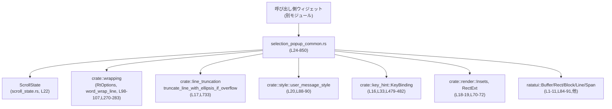
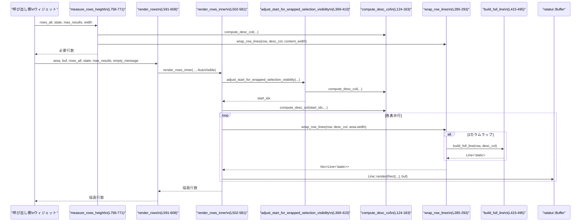

# tui/src/bottom_pane/selection_popup_common.rs

## 0. ざっくり一言

選択ポップアップ（/model など）の **1行分の表示モデル（`GenericDisplayRow`）と、そのラップ・スクロール・列幅計算・描画/高さ計測ロジック** をまとめた共通モジュールです（`tui/src/bottom_pane/selection_popup_common.rs:L24-850`）。

---

## 1. このモジュールの役割

### 1.1 概要

- このモジュールは、ボトムペイン上の「選択ポップアップ UI」を描画するための共通部品を提供します。
- 各行の見た目を表す `GenericDisplayRow` と、説明カラムの開始位置（列幅）・折り返し・選択状態ハイライト・無効行のスタイルなどを一元的に扱います（`L24-40`,`L124-183`,`L270-311`,`L498-581`）。
- レンダリングと高さ計測のペア API を揃えることで、**レイアウト計算 → 描画** の流れを崩さずに使えるようになっています（`L758-801`）。

### 1.2 アーキテクチャ内での位置づけ

このモジュールは「行の見た目＋描画ロジック」のみを担当し、外側のウィジェットは以下を渡します：

- どの行をどう表示したいか → `Vec<GenericDisplayRow>`
- スクロール・選択状態 → `ScrollState`（別モジュール）
- 描画領域 → `ratatui::layout::Rect`
- バッファ → `ratatui::buffer::Buffer`

依存関係（このチャンク内で参照される範囲）を Mermaid で表すと次のようになります。



- `ScrollState` 自体の定義はこのチャンクには現れません（`L22`）。フィールドとして `scroll_top` と `selected_idx` を使っていることだけ分かります（`L322-324`,`L689-699`）。

### 1.3 設計上のポイント

コードから読み取れる設計上の特徴を列挙します。

- **プレゼンテーション専用モデル**  
  - `GenericDisplayRow` はドメインモデルではなく、「レンダリング済みに近い」情報（文字列、`Span`、マッチ位置、タグなど）を持ちます（`L24-40`）。
- **列幅モードの切り替え**  
  - `ColumnWidthMode` により、説明カラムの開始位置を
    - 表示中行から算出（AutoVisible）
    - 全行から算出（スクロールしても列位置を固定：AutoAllRows）
    - 固定比率（30%/70%：Fixed）
    の 3 パターンで制御できます（`L42-55`,`L124-183`）。
- **折り返しの2系統**  
  - 「名前と説明を別カラムとしてラップする専用パス」と、「1本の行としてラップする標準パス」を条件に応じて切り替えています（`L198-208`,`L210-268`,`L270-283`,`L285-293`）。
- **スクロール位置と選択行の可視性**  
  - ラップによって行の高さが変わることを考慮し、「選択行がビューポートに収まるように `start_idx` を調整する」処理があります（`L369-410`）。
- **安全性とエラー耐性**  
  - 幅計算には `saturating_*` と `max(1)` を多用し、0幅やオーバーフローで panic しないようにしています（`L135-143`,`L215-217`,`L276-277`,`L815-816`）。
  - 非 `unsafe` Rust のみで書かれており、明示的な panic はありません。
- **非並行（シングルスレッド想定）**  
  - すべての関数は同期関数で、`&mut Buffer` への単純な書き込みのみを行います。スレッドや async は使用していません。

---

## 2. 主要な機能一覧

このモジュールが提供する主な機能です。

- **行モデル定義 (`GenericDisplayRow`)**: 各選択行のラベル・説明・キーバインド・タグ・無効理由などを保持（`L30-40`）。
- **列幅モード (`ColumnWidthMode`)**: 説明カラムの開始位置の算出方針を切り替える列挙体（`L42-55`）。
- **メニュー表面の描画・インセット**: 共通の背景スタイルを描画し、コンテンツ用の内側矩形を返す（`render_menu_surface`, `menu_surface_inset`, `L66-72`,`L79-92`）。
- **スタイル付き行のラップ (`wrap_styled_line`)**: `Line` をスタイルを保ったまま所定幅で折り返すユーティリティ（`L94-107`）。
- **説明カラム位置の計算 (`compute_desc_col`)**: 名前と説明のバランスを取りながら説明カラムの開始位置を決定（`L124-183`）。
- **行の折り返し (`wrap_row_lines`)**: 行ごとのラップ処理（2カラム／標準）を一元的に実行（`L285-293`）。
- **選択状態・無効状態のスタイリング (`apply_row_state_style`)**: 選択行のシアン+太字、無効行の dim 処理（`L296-311`）。
- **スクロールウィンドウ開始位置の計算 (`compute_item_window_start` 他)**: `ScrollState` と `max_items` から表示開始インデックスを計算し、ラップによる高さ変動にも対応（`L313-333`,`L336-410`）。
- **行の組み立て (`build_full_line`)**: 名前・説明・ショートカット・タグ・無効理由を1本の `Line` に組み立て、マッチ位置の太字・省略記号も処理（`L412-495`）。
- **行群の描画 (`render_rows*`)**: マルチラインラップ付き・単一行表示・列幅モード指定など複数の描画関数群（`L498-748`）。
- **高さ計測 (`measure_rows_height*`)**: 描画前に必要なターミナル行数を計算する関数群（`L750-850`）。

---

## 3. 公開 API と詳細解説

### 3.1 型一覧（構造体・列挙体など）

| 名前 | 種別 | 役割 / 用途 | 定義位置 |
|------|------|-------------|----------|
| `GenericDisplayRow` | 構造体 | 選択ポップアップの1行分の表示情報（名前・説明・キーバインド・タグ・無効状態・ラップインデント等）を保持します。 | `tui/src/bottom_pane/selection_popup_common.rs:L30-40` |
| `ColumnWidthMode` | 列挙体 | 名前と説明カラムの分割方法（AutoVisible/AutoAllRows/Fixed）を表現します。 | `tui/src/bottom_pane/selection_popup_common.rs:L42-55` |

#### `GenericDisplayRow` フィールド概要

- `name: String` – 行の主ラベル（`L31`）
- `name_prefix_spans: Vec<Span<'static>>` – 行頭に付与する装飾済み `Span` 群（番号・アイコン等）（`L32`）
- `display_shortcut: Option<KeyBinding>` – 行に対応するキーボードショートカット（`L33`）
- `match_indices: Option<Vec<usize>>` – `name` 内で太字表示する文字の「文字インデックス」のリスト（`L34`,`L435-452`）
- `description: Option<String>` – 名前の右側に表示する説明テキスト（`L35`）
- `category_tag: Option<String>` – 右端に薄色で表示するカテゴリタグ（`L36`,`L491-494`）
- `disabled_reason: Option<String>` – 無効理由のメッセージ（`L37`,`L416-421`,`L472-474`）
- `is_disabled: bool` – 行が選択不能かどうか（`L38`,`L555-559`）
- `wrap_indent: Option<usize>` – ラップ時のインデント幅（セル数）。`None` のときは説明カラム位置などから自動決定（`L39`,`L186-195`）

### 3.2 関数詳細（主要 7 件）

#### `render_menu_surface(area: Rect, buf: &mut Buffer) -> Rect`

**概要**

- 選択ポップアップの背景（「メニューサーフェス」）を描画し、コンテンツを配置すべき内側の矩形を返します（`L79-92`）。

**引数**

| 引数名 | 型 | 説明 |
|--------|----|------|
| `area` | `Rect` | メニュー全体を描画する領域。境界と背景スタイルが適用されます。 |
| `buf`  | `&mut Buffer` | `ratatui` の描画バッファ。背景ブロックがここに描画されます。 |

**戻り値**

- `Rect` – 内側のコンテンツ領域。上下 1 行・左右 2 列分が `menu_surface_inset` により削られています（`L63-72`,`L90-91`）。

**内部処理の流れ**

1. `area.is_empty()` の場合は何も描画せず `area` をそのまま返す（`L85-87`）。
2. `Block::default()` でデフォルトブロックを生成し、`user_message_style()` のスタイルを適用（`L88-90`）。
3. `Block::render(area, buf)` で背景と枠を描画（`L88-90`）。
4. `menu_surface_inset(area)` を呼び出し、パディングを差し引いた矩形を返す（`L91`）。

**Examples（使用例）**

```rust
use ratatui::{buffer::Buffer, layout::Rect};

// コンテンツ描画の前にメニューサーフェスを描画し、内側の領域を得る例
fn draw_popup(area: Rect, buf: &mut Buffer, rows: &[GenericDisplayRow], state: &ScrollState) {
    // 背景と枠を描画し、コンテンツ領域を取得する
    let content_area = render_menu_surface(area, buf); // L84-92

    let max_results = 10;
    let empty_message = "No matches";

    // 取得した content_area の中に行リストを描画する
    render_rows(content_area, buf, rows, state, max_results, empty_message); // L591-608
}
```

**Errors / Panics**

- `render_menu_surface` 自身には明示的な panic やエラー返却はありません。
- 内部で呼ぶ `Block::render` と `user_message_style` に依存しますが、通常の `ratatui` 使用範囲では panic しない前提のコードです。

**Edge cases（エッジケース）**

- `area` が空（幅または高さが 0）の場合は何も描画せず、元の `area` を返します（`L85-87`）。
- 非空でも、外側と内側の差分は `MENU_SURFACE_INSET_V/H` 定数で固定（上下 1, 左右 2）です（`L63-64`,`L70-72`）。

**使用上の注意点**

- 背景と枠は `area` 全体に描画されるため、**行リストなどのコンテンツは返り値の Rect 内に描画する必要があります**。
- 他のポップアップも同じ関数を使うことで、スタイル・パディングが揃います。

---

#### `wrap_styled_line<'a>(line: &'a Line<'a>, width: u16) -> Vec<Line<'a>>`

**概要**

- `ratatui::text::Line` を指定幅で折り返すユーティリティ関数です。
- スパンごとのスタイル（色や太字）を保ったまま、複数の `Line` に分割します（`L94-107`）。

**引数**

| 引数名 | 型 | 説明 |
|--------|----|------|
| `line` | `&Line<'a>` | 折り返し対象の行。内部に複数の `Span` を含む場合があります。 |
| `width` | `u16` | 折り返し幅（セル数）。0 が渡されても内部で 1 に補正されます。 |

**戻り値**

- `Vec<Line<'a>>` – 折り返した行のベクタ。1 行も表示できないケースでも、幅は最低 1 セルになるように補正されます（`L102-103`）。

**内部処理の流れ**

1. `width.max(1)` で幅を最低 1 に補正し、`usize` に変換（`L102`）。
2. `RtOptions::new(width)` で折り返しオプションを生成し、先頭行・継続行ともにインデントなしの設定を行う（`L103-105`）。
3. `word_wrap_line(line, opts)` を呼び、折り返した `Vec<Line<'a>>` を返す（`L106`）。

**Examples（使用例）**

```rust
use ratatui::text::{Line, Span};

// 単純なラベル行を 10 セル幅で折り返す例
let line = Line::from("This is a very long label");        // 折り返し対象
let wrapped = wrap_styled_line(&line, 10);                 // L98-107

for (i, l) in wrapped.iter().enumerate() {
    println!("line {}: {:?}", i, l.spans);
}
```

**Errors / Panics**

- この関数自身には panic を発生させるコードはありません。
- `word_wrap_line`（crate 内のラッパー）の実装次第ですが、ここでは 0 幅を避けるために `max(1)` で保護しています（`L102`）。

**Edge cases**

- `width == 0` の場合も内部で 1 に丸められ、1 セル幅で折り返されます（`L102`）。
- `line` が空であっても `word_wrap_line` の挙動に従います（このチャンクからは詳細不明）。

**使用上の注意点**

- この関数は **スタイルを維持したまま行だけを分割** する低レベルユーティリティで、本モジュール内では他の関数から直接は呼ばれていません（将来的または他モジュール向けの共通関数とみられます）。

---

#### `render_rows(...) -> u16`

```rust
pub(crate) fn render_rows(
    area: Rect,
    buf: &mut Buffer,
    rows_all: &[GenericDisplayRow],
    state: &ScrollState,
    max_results: usize,
    empty_message: &str,
) -> u16
```

**概要**

- 選択ポップアップの行リストを **ラップ付き・AutoVisible 列幅モード** で描画します（`L583-608`）。
- 可視行だけから説明カラム位置を決めるため、ビューポートにぴったり合う柔軟なレイアウトになります。

**引数**

| 引数名 | 型 | 説明 |
|--------|----|------|
| `area` | `Rect` | 行リストを描画する矩形。高さが描画できる最大行数になります。 |
| `buf`  | `&mut Buffer` | 描画先バッファ。 |
| `rows_all` | `&[GenericDisplayRow]` | 全候補行。選択状態・説明・タグなどを含みます。 |
| `state` | `&ScrollState` | スクロール位置と選択インデックスを保持する状態。`scroll_top`、`selected_idx` が使われます（`L322-324`）。 |
| `max_results` | `usize` | 最大表示件数。`rows_all.len()` より大きくても自動で切り詰められます（`L519-523`）。 |
| `empty_message` | `&str` | `rows_all` が空のときに表示するメッセージ（暗くイタリック表示）です（`L511-516`）。 |

**戻り値**

- `u16` – 実際に描画したターミナル行数。空メッセージを 1 行描画した場合も 1 を返します（`L500-501`,`L515-517`）。

**内部処理の流れ**

1. `render_rows_inner` を呼び出し、`ColumnWidthMode::AutoVisible` を指定（`L599-607`）。
2. `render_rows_inner` 内では:
   - `rows_all` が空なら `empty_message` を 1 行描画し、1 または 0 を返す（高さが 0 の場合は 0）（`L511-517`）。
   - `max_results` と `rows_all.len()` から `max_items` を決定（`L519-523`）。
   - ラップを考慮した選択行の可視性を保つため、`adjust_start_for_wrapped_selection_visibility` で `start_idx` を調整（`L525-535`）。
   - `compute_desc_col` で説明カラムの開始位置を決定（`L537-543`）。
   - `rows_all[start_idx..]` を `max_items` まで走査し、それぞれ `wrap_row_lines` でラップ（`L549-555`）。
   - `apply_row_state_style` で選択行をシアン太字・無効行を dim 化（`L555-559`）。
   - 各ラップ済み行を `Line::render` でバッファに描画し、高さが尽きたら打ち切る（`L561-577`）。

**Examples（使用例）**

```rust
fn render_selection_list(area: Rect, buf: &mut Buffer,
                         rows: &[GenericDisplayRow], state: &ScrollState) -> u16 {
    let max_results = 20;                         // 最大 20 件まで表示
    let empty_message = "No results";             // 空のときに表示するメッセージ

    render_rows(area, buf, rows, state, max_results, empty_message) // L591-608
}
```

**Errors / Panics**

- この関数経路に `unwrap` や添字アクセスはなく、`saturating_` 系演算と `min` によって範囲外アクセスを避けています（`L519-523`,`L525-535`,`L549-555`）。
- panic の可能性は、依存先（`ratatui` 描画、ラップロジック）に限定されますが、本モジュール内には明示的な panic はありません。

**Edge cases**

- `rows_all` が空 → `empty_message` を 1 行だけ描画（高さがあれば）（`L511-517`）。
- `max_results == 0` → 何も描画されず 0 を返す（`L519-522`）。
- `area.height == 0` → ループ直後の条件で即座に終了し、描画・カウントとも 0（`L549-552`,`L563-565`）。
- `state.selected_idx` が `rows_all.len()` 以上でも、`compute_item_window_start` のロジックで範囲外アクセスが起きないように `min` と `saturating_*` を使用（`L318-323`）。

**使用上の注意点**

- この関数とペアで高さを予約する場合は **`measure_rows_height` を使うのが前提** です（`L755-758`）。別モードの計測関数と組み合わせると列幅や折り返しがズレてクリッピングの危険があります。
- 同一の `ScrollState` を複数 UI で共有する場合、`scroll_top` や `selected_idx` の解釈が競合しないように設計する必要があります（並行性はないが、状態共有の問題として）。

---

#### `render_rows_single_line(...) -> u16`

```rust
pub(crate) fn render_rows_single_line(
    area: Rect,
    buf: &mut Buffer,
    rows_all: &[GenericDisplayRow],
    state: &ScrollState,
    max_results: usize,
    empty_message: &str,
) -> u16
```

**概要**

- 各行を **1 行に収めて描画し、はみ出た部分は省略記号で切り詰める** レンダラです（`L664-748`）。
- 列幅は可視行から自動算出（AutoVisible）。短い説明を持つ多くの項目をコンパクトに表示したい場合に適しています。

**引数・戻り値**

- 引数は `render_rows` と同様ですが、折り返しがなく、`visible_items` を `area.height` で制限する点が異なります（`L685-687`）。
- 戻り値は実際に描画した行数（`L709-747`）。

**内部処理の流れ**

1. `rows_all` が空なら `empty_message` の 1 行描画を行う（`L677-683`）。
2. `visible_items = min(max_results, rows_all.len(), area.height)` を計算（`L685-687`）。
3. `scroll_top`・`selected_idx` から `start_idx` を算出する簡易ロジック（ラップを考えない）（`L689-699`）。
4. `compute_desc_col` で説明カラム位置を決める（`L701-707`）。
5. `start_idx..start_idx+visible_items` の各行について:
   - `build_full_line(row, desc_col)` で 1 本の `Line` を組み立て（`L721`）。
   - 選択行ならシアン太字、無効行なら dim を適用（`L723-731`）。
   - `truncate_line_with_ellipsis_if_overflow` で横幅を制限し、省略記号を追加（`L733`）。
   - 1 行として `Line::render`（`L734-742`）。

**Examples（使用例）**

```rust
fn render_compact_list(area: Rect, buf: &mut Buffer,
                       rows: &[GenericDisplayRow], state: &ScrollState) -> u16 {
    let max_results = 50;                    // 高さ上限は area.height でさらに制限される
    let empty_message = "Empty list";

    render_rows_single_line(area, buf, rows, state, max_results, empty_message) // L669-748
}
```

**Errors / Panics**

- `truncate_line_with_ellipsis_if_overflow` の実装はこのチャンクでは不明ですが、行幅を超える場合のみ切り詰めを行うユーティリティと推測されます（`L17`,`L733`）。
- インデックス操作はすべて `enumerate().skip().take()` で行われており、範囲外アクセスは発生しません（`L711-716`）。

**Edge cases**

- `area.height == 0` の場合はループ冒頭で break し、0 行描画（`L717-718`）。
- `max_results == 0` の場合は `visible_items == 0` となり、描画ループに入らず 0 行が返ります（`L685-687`, ループ条件）。

**使用上の注意点**

- 複数行ラップは行われないため、**説明が長い行は積極的に省略されます**。情報量よりも一覧性を優先するケースに向いています。
- 高さ予約には、本関数専用の計測関数は用意されていません。単一行固定であることから、「行数 = 実際の表示件数」で十分という設計と考えられます。

---

#### `render_rows_with_col_width_mode(...) -> u16`

```rust
pub(crate) fn render_rows_with_col_width_mode(
    area: Rect,
    buf: &mut Buffer,
    rows_all: &[GenericDisplayRow],
    state: &ScrollState,
    max_results: usize,
    empty_message: &str,
    col_width_mode: ColumnWidthMode,
) -> u16
```

**概要**

- `render_rows_inner` に列幅モードをそのまま渡せる **低レベルな描画エントリポイント** です（`L638-662`）。
- AutoVisible / AutoAllRows / Fixed のいずれかを選べます。

**引数**

- `col_width_mode` – 説明カラムの配置戦略。`compute_desc_col` にそのまま渡されます（`L653-661`,`L124-183`）。

**戻り値**

- `render_rows` と同様、描画した行数（`L653-661`）。

**内部処理の流れ**

- すべての処理を `render_rows_inner` に委譲し、列幅モードだけをパラメータ化しています（`L653-661`）。

**Examples（使用例）**

```rust
let mode = ColumnWidthMode::AutoAllRows;           // スクロールしても列位置を固定
let lines = render_rows_with_col_width_mode(
    area, buf, &rows, &state, 30, "No matches", mode
);                                                 // L644-662
```

**使用上の注意点**

- 高さを予約する際は、**同じ `ColumnWidthMode` を取る `measure_rows_height_with_col_width_mode` を使う必要があります**（`L791-801`）。
- Fixed モードの場合は、左 30% / 右 70% の固定比（`FIXED_LEFT_COLUMN_*`）で列幅が決まる点に注意してください（`L58-61`,`L145-147`）。

---

#### `measure_rows_height(...) -> u16`

```rust
pub(crate) fn measure_rows_height(
    rows_all: &[GenericDisplayRow],
    state: &ScrollState,
    max_results: usize,
    width: u16,
) -> u16
```

**概要**

- `render_rows`（AutoVisible モード）で描画した場合に必要となる **縦方向の行数** を計算します（`L750-771`）。
- 説明カラム位置とラップ結果を考慮した合計行数を返します。

**引数**

| 引数名 | 型 | 説明 |
|--------|----|------|
| `rows_all` | `&[GenericDisplayRow]` | 描画対象の全行。 |
| `state` | `&ScrollState` | `scroll_top` と `selected_idx` に基づいて開始インデックスを決定します（`L817-828`）。 |
| `max_results` | `usize` | 最大表示件数。 |
| `width` | `u16` | 横幅。内部で `content_width = width.saturating_sub(1).max(1)` に変換されます（`L815-816`）。 |

**戻り値**

- `u16` – ラップ後の行数の合計。最低でも 1 行（プレースホルダ用）を返します（`L811-813`,`L849-850`）。

**内部処理の流れ**

1. `rows_all` が空なら 1（「no matches」相当のプレースホルダ行）を返す（`L811-813`）。
2. `content_width = width.saturating_sub(1).max(1)` で、実効的なコンテンツ幅を決定（`L815-816`）。
3. `visible_items = min(max_results, rows_all.len())` を計算（`L817`）。
4. `scroll_top` と `selected_idx` から `start_idx` を決定（`L818-828`）。`render_rows_single_line` と同系のロジックです。
5. `compute_desc_col` で説明カラム位置 `desc_col` を算出（`L830-836`）。
6. `start_idx..start_idx+visible_items` の各行について `wrap_row_lines(row, desc_col, content_width)` を呼び、`len()` を `total` に加算（`L838-847`）。
7. 最後に `total.max(1)` を返し、行がすべて 0 行になっても最低 1 行分は確保する（`L849-850`）。

**Examples（使用例）**

```rust
fn reserve_height_for_popup(rows: &[GenericDisplayRow], state: &ScrollState, width: u16) -> u16 {
    let max_results = 20;
    let required_lines = measure_rows_height(rows, state, max_results, width); // L758-771
    required_lines
}
```

**Errors / Panics**

- `width` が 0 の場合でも `content_width` は 1 になり、ラップ処理が 0 幅で動作しないよう保護されています（`L815-816`）。
- すべてのインデックス計算は `min` や `saturating_*` で保護されており、範囲外アクセスはありません（`L817-828`）。

**Edge cases**

- 1 行も候補がない場合でも 1 行分の高さを返すので、呼び出し側は「空メッセージ 1 行」を前提にレイアウトできます（`L811-813`）。
- `max_results == 0` の場合、`visible_items == 0` となり `total == 0` のままですが、`total.max(1)` により 1 が返ります（`L817`,`L849-850`）。

**使用上の注意点**

- `render_rows`（AutoVisible）と **必ずペアで使用** してください。`render_rows_stable_col_widths` や Fixed モードと組み合わせると、列幅やラップ結果が異なり、高さの過小/過大評価が発生します（`L755-758`）。

---

#### `measure_rows_height_with_col_width_mode(...) -> u16`

```rust
pub(crate) fn measure_rows_height_with_col_width_mode(
    rows_all: &[GenericDisplayRow],
    state: &ScrollState,
    max_results: usize,
    width: u16,
    col_width_mode: ColumnWidthMode,
) -> u16
```

**概要**

- `measure_rows_height_inner` に列幅モードを渡せる、低レベルな高さ計測エントリポイントです（`L791-801`）。
- `render_rows_with_col_width_mode` とペアで使うことを想定しています。

**引数・戻り値**

- 引数は `measure_rows_height` に `col_width_mode` が追加されたものです（`L795-800`）。
- 戻り値は同じく合計行数（`L801`）。

**内部処理の流れ**

- すべて `measure_rows_height_inner` に委譲し、列幅モードだけをパラメータ化（`L801`）。

**使用上の注意点**

- `render_rows_with_col_width_mode` に渡す `ColumnWidthMode` と **同じ値** をここにも渡す必要があります。異なるモードを混在させると、説明カラム位置と行の折り返しが変わり、高さ予測が外れます。

---

### 3.3 その他の関数（コンポーネントインベントリー）

すべての関数を一覧にします（詳細解説済みのものは備考欄に明記）。

| 関数名 | 役割（1 行） | 定義位置 | 備考 |
|--------|--------------|----------|------|
| `menu_surface_inset` | 共通メニューサーフェスの内側矩形を計算します。 | `selection_popup_common.rs:L70-72` | `render_menu_surface` から使用 |
| `menu_surface_padding_height` | 垂直方向のパディング合計（常に 2）を返します。 | `L75-77` | 他モジュールから高さ計算に利用される想定 |
| `render_menu_surface` | 背景ブロックを描画し、内側の矩形を返します。 | `L84-92` | §3.2 参照 |
| `wrap_styled_line` | `Line` をスタイル付きで折り返します。 | `L98-107` | §3.2 参照 |
| `line_to_owned` | `Line<'_>` の span 内容を `String` にコピーし、`Line<'static>` に変換します。 | `L109-122` | ラップ後の行を所有させる用途 |
| `compute_desc_col` | 名前・説明のバランスから説明カラム開始列を算出します。 | `L124-183` | AutoVisible/AutoAllRows/Fixed 全モード対応 |
| `wrap_indent` | 継続行のインデント幅（スペース数）を決定します。 | `L186-195` | 説明や無効理由がある行は通常 `desc_col` に揃える |
| `should_wrap_name_in_column` | 2 カラムラップパス（名前・説明別ラップ）を使うべきか判定します。 | `L198-208` | シンプルなラベル＋説明のみの行を対象 |
| `wrap_two_column_row` | 名前と説明を左右のカラムに分けてラップします。 | `L210-268` | 幅が狭すぎる場合は空ベクタでフォールバックさせる |
| `wrap_standard_row` | `build_full_line` で組み立てた行を 1 本としてラップします。 | `L270-283` | ラップ結果は `line_to_owned` で `'static` に変換 |
| `wrap_row_lines` | 行に対して 2 カラムラップ/標準ラップのいずれかを実行します。 | `L285-293` | `render_rows_inner` / `measure_rows_height_inner` から使用 |
| `apply_row_state_style` | 選択行をシアン太字、無効行を dim にスタイル変更します。 | `L296-311` | `render_rows_inner` から使用 |
| `compute_item_window_start` | `scroll_top` と `selected_idx` から item window の開始インデックスを計算します。 | `L313-333` | 行ラップを考慮しない単純ロジック |
| `is_selected_visible_in_wrapped_viewport` | ラップ後の行高を考慮して、選択行がビューポートに収まるか判定します。 | `L336-366` | `wrap_row_lines` を使って行数を測定 |
| `adjust_start_for_wrapped_selection_visibility` | 選択行がビュー内に見えるように `start_idx` を前進させます。 | `L369-410` | `render_rows_inner` から使用 |
| `build_full_line` | 名前・説明・ショートカット・タグ・無効状態を 1 本の `Line` に組み立てます。 | `L412-495` | マッチ位置の太字や省略記号も処理 |
| `render_rows_inner` | 列幅モードを含めた行描画の実装本体です。 | `L502-581` | `render_rows*` から呼び出される |
| `render_rows` | AutoVisible モードでのラップ付き描画関数です。 | `L591-608` | §3.2 参照 |
| `render_rows_stable_col_widths` | AutoAllRows（全行基準）列幅モードで描画します。 | `L619-636` | スクロールしても列幅を固定したい場合用 |
| `render_rows_with_col_width_mode` | 列幅モードを指定して描画する低レベル API です。 | `L644-662` | §3.2 参照 |
| `render_rows_single_line` | 行ごとに 1 行だけ描画し、横方向は省略記号で切り詰めます。 | `L669-748` | §3.2 参照 |
| `measure_rows_height` | AutoVisible モード用の高さ計測関数です。 | `L758-771` | §3.2 参照 |
| `measure_rows_height_stable_col_widths` | AutoAllRows モード用の高さ計測関数です。 | `L776-788` | `render_rows_stable_col_widths` とペア |
| `measure_rows_height_with_col_width_mode` | 列幅モード指定で高さを計測する低レベル API です。 | `L791-801` | §3.2 参照 |
| `measure_rows_height_inner` | 高さ計測ロジックの実装本体です。 | `L804-850` | 描画は行わず `wrap_row_lines` の行数合計を返す |

---

## 4. データフロー

### 4.1 代表的な処理シナリオ：ラップ付き行の描画

典型的な流れは以下の通りです。

1. 呼び出し側が `Vec<GenericDisplayRow>` と `ScrollState` を用意。
2. 高さを確保する場合、`measure_rows_height` で必要行数を計算。
3. 実際の描画時に `render_rows` を呼び出し。
4. 内部で `render_rows_inner` → `adjust_start_for_wrapped_selection_visibility` → `compute_desc_col` → `wrap_row_lines` → （必要に応じて）`wrap_two_column_row` / `wrap_standard_row` → `build_full_line` という順に処理され、最終的に `Buffer` に `Line::render` されます。

これを sequence diagram で示します。



- `measure_rows_height` と `render_rows` で **異なる start_idx 調整ロジック** を用いている点（`L817-828` vs `L378-408`）に注意が必要です。後者はラップによる高さの変動を考慮し、選択行を可視に保とうとします。

---

## 5. 使い方（How to Use）

### 5.1 基本的な使用方法

「共通のメニューサーフェス + ラップ付きの行リスト」を描画する基本的な流れです。

```rust
use ratatui::{buffer::Buffer, layout::Rect};
use tui::bottom_pane::selection_popup_common::{
    GenericDisplayRow, render_menu_surface, render_rows, measure_rows_height,
};
use super::scroll_state::ScrollState;

// rows_all と state の生成方法はこのチャンクにはないため、ここでは既に用意済みと仮定します。
fn draw_selection_popup(area: Rect, buf: &mut Buffer,
                        rows_all: &[GenericDisplayRow], state: &ScrollState) {
    // 1. メニューサーフェスを描画し、内側のコンテンツ領域を得る       // L84-92
    let content_area = render_menu_surface(area, buf);

    // 2. 必要な高さを計測（横幅には content_area.width を使用）      // L758-771
    let max_results = 20;
    let required_height =
        measure_rows_height(rows_all, state, max_results, content_area.width);

    // ここで required_height を使って、レイアウト上の高さ調整を行う   // （外側ウィジェット側の責任）

    // 3. 行リストを描画                                              // L591-608
    let empty_message = "No matches";
    let rendered_lines =
        render_rows(content_area, buf, rows_all, state, max_results, empty_message);

    // rendered_lines は実際に描画された行数                         // L500-501
}
```

### 5.2 よくある使用パターン

1. **スクロールしても列位置を固定したい場合**

```rust
use tui::bottom_pane::selection_popup_common::{
    render_rows_stable_col_widths, measure_rows_height_stable_col_widths,
};

let required_height = measure_rows_height_stable_col_widths(
    rows_all, state, max_results, content_area.width
);  // L776-788

let rendered_lines = render_rows_stable_col_widths(
    content_area, buf, rows_all, state, max_results, "No matches"
);  // L619-636
```

- `AutoAllRows` モードを内部で使用し、全行から列幅を決めるため、スクロールしても説明カラム位置が変化しません。

1. **コンパクトな一覧（単一行表示）**

```rust
use tui::bottom_pane::selection_popup_common::render_rows_single_line;

let rendered_lines = render_rows_single_line(
    content_area, buf, rows_all, state, max_results, "Empty"
); // L669-748
```

- 折り返しが不要で、項目数が多いリストに適しています。

1. **列幅モードを外側の設定から切り替える**

```rust
use tui::bottom_pane::selection_popup_common::{
    render_rows_with_col_width_mode, measure_rows_height_with_col_width_mode,
    ColumnWidthMode,
};

let mode = ColumnWidthMode::Fixed; // 30% / 70% 固定分割            // L48-55, L58-61

let height = measure_rows_height_with_col_width_mode(
    rows_all, state, max_results, content_area.width, mode
); // L791-801

let rendered = render_rows_with_col_width_mode(
    content_area, buf, rows_all, state, max_results, "No matches", mode
); // L644-662
```

### 5.3 よくある間違い

```rust
// 誤り例: AutoVisible 用の計測関数と AutoAllRows 用の描画関数を混在させている
let h = measure_rows_height(rows_all, state, max_results, content_area.width); // AutoVisible
let lines = render_rows_stable_col_widths(
    content_area, buf, rows_all, state, max_results, "No matches"
); // AutoAllRows

// → 列幅（desc_col）の計算が異なり、ラップ行数が変わるため、
//   h 行分予約しても実際の描画で切り詰めや余りが発生しうる（L124-183,L537-543 vs L830-836）。

// 正しい例: 計測と描画で同じ ColumnWidthMode を使う
let h = measure_rows_height_stable_col_widths(
    rows_all, state, max_results, content_area.width
);  // L776-788
let lines = render_rows_stable_col_widths(
    content_area, buf, rows_all, state, max_results, "No matches"
);  // L619-636
```

他に想定される誤用：

- `max_results` を 0 にしてしまい、描画や計測が常に 0/1 行になる。
- `ScrollState` の `selected_idx` が `rows_all.len()` を大きく超えている場合でも、ロジックは安全に動作しますが、期待どおりのスクロール位置にならない可能性があります（`L318-333`,`L817-828`）。

### 5.4 使用上の注意点（まとめ）

- **計測と描画のモード整合性**  
  - `render_rows` ↔ `measure_rows_height`  
  - `render_rows_stable_col_widths` ↔ `measure_rows_height_stable_col_widths`  
  - `render_rows_with_col_width_mode` ↔ `measure_rows_height_with_col_width_mode`  
  というペアを守ることが重要です（`L755-758`,`L773-776`,`L791-801`）。
- **幅 0/1 の扱い**  
  - すべてのラップ関数は幅 0 を避けるため `max(1)` を使っていますが（`L102`,`L215-217`,`L276-277`,`L815-816`）、1 セル幅だと名前や説明が強く切り詰められ、「…」だけになることもあります（`L423-429`,`L466-470`）。
- **安全性（Rust 的観点）**  
  - `unsafe` は使われておらず、所有権・借用関係も単純です：呼び出し側が所有する `rows_all` と `ScrollState` を借用し、`Buffer` に対する可変参照を一時的に借用するだけです（`L502-510`）。
  - インデックス演算は `iter().enumerate().skip().take()` と `saturating_*/min/max` によって保護されています。
- **エラーハンドリング**  
  - `Result` や `Option` を返す関数は無く、エラーは「何も描画しない」「0/1 行を返す」といった穏当な挙動にフォールバックする方針になっています（例：空の `rows_all` の扱い, `L511-517`,`L811-813`）。
- **並行性**  
  - 並行処理・非同期処理は一切行っておらず、このモジュール自体はスレッドセーフ/スレッドアンセーフについて特別な前提を持ちません。呼び出し側が `Buffer` や `ScrollState` を同時に複数スレッドから操作しない限り、安全に利用できます。

---

## 6. 変更の仕方（How to Modify）

### 6.1 新しい機能を追加する場合

1. **行ごとに追加情報を表示したい場合**
   - 例: 「バッジ」や「サブタグ」を追加したい。
   - 追加フィールドは `GenericDisplayRow` に定義します（`L30-40`）。
   - 表示位置・スタイルを変更するには `build_full_line` 内で `full_spans` に新しい `Span` を追加します（`L476-495`）。
   - 必要なら 2 カラムラップでも考慮するために、`wrap_two_column_row` のロジックに新要素分のセル幅を含める検討が必要です（`L240-262`）。

2. **列幅モードを追加したい場合**
   - `ColumnWidthMode` に新しいバリアントを追加（`L48-55`）。
   - `compute_desc_col` の `match col_width_mode { ... }` に新しい分岐を追加し、そのモード用の列幅計算を実装します（`L144-182`）。
   - 低レベル API `render_rows_with_col_width_mode` / `measure_rows_height_with_col_width_mode` はそのまま新モードを扱えるため、新しいラッパー関数は必要に応じて追加します。

3. **選択行のスタイルを変えたい場合**
   - `apply_row_state_style` と `render_rows_single_line` の選択行スタイル設定部分を変更します（`L296-301`,`L721-725`）。
   - 例えば背景色を変える場合は `Style::default().bg(Color::Xxx)` などに置き換えます。

### 6.2 既存の機能を変更する場合

- **スクロール挙動・選択行の可視性を変える**
  - 範囲:
    - `compute_item_window_start`（基本的な item window の計算, `L313-333`）
    - `adjust_start_for_wrapped_selection_visibility` とそれに付随する `is_selected_visible_in_wrapped_viewport`（ラップ高考慮, `L336-410`）
  - 契約:
    - 「選択行は可能な限りビューポート内に含める」「最初の行は高さが足りなくても常に描画する」というコメントに書かれた前提を保つ必要があります（`L353-355`）。
  - 変更後は `render_rows_inner` と `measure_rows_height_inner` の両方の挙動を確認し、スクロールと高さ計測が破綻していないかテストする必要があります。

- **ラップアルゴリズムを変更する**
  - 範囲:
    - `wrap_two_column_row` / `wrap_standard_row` / `wrap_row_lines`（`L210-293`）
    - `wrap_indent`（`L186-195`）
  - 契約:
    - `wrap_row_lines` は **少なくとも 1 行の `Line` を返す** ことが暗黙の前提になっています（`measure_rows_height_inner` が `len()` をそのまま加算し、最後に `max(1)` で全体として 1 行は確保するため, `L838-850`）。
  - フォント幅（半角/全角）の扱いは `UnicodeWidthStr` / `UnicodeWidthChar` を通して行われているため、この性質を保つことが重要です（`L249-252`,`L438-456`）。

- **テストの追加**
  - 現在のテストは「幅 1、2 カラムラップで panic しないこと」のみを保証しています（`L857-867`）。
  - ラップや列幅計算を変更した場合は、代表的なケース（短/長い名前と説明、全角文字、無効行、タグ付きなど）を含むテストを追加することが望ましいです。

---

## 7. 関連ファイル

このモジュールと密接に関係する他ファイル・外部クレートです。

| パス / クレート | 役割 / 関係 |
|-----------------|------------|
| `tui/src/bottom_pane/scroll_state.rs`（推定） | `ScrollState` 型を定義し、`scroll_top` と `selected_idx` を提供します（`L22`,`L322-324`,`L689-699`）。定義自体はこのチャンクには現れません。 |
| `crate::key_hint::KeyBinding` | 行に表示するショートカット表記用の型です（`L16`,`L33`,`L479-482`）。 |
| `crate::line_truncation::truncate_line_with_ellipsis_if_overflow` | 単一行表示モードで行幅を超えた部分を「…」で切り詰めるユーティリティです（`L17`,`L733`）。 |
| `crate::render::Insets` と `RectExt` | `Rect` に対して `inset` メソッドを提供し、メニューサーフェス内側の矩形を計算します（`L18-19`,`L70-72`）。 |
| `crate::style::user_message_style` | メニューサーフェスの背景スタイルを返します（`L20`,`L88-90`）。 |
| `crate::wrapping::{RtOptions, word_wrap_line}` | スタイル付きテキストのラップ処理を行うラッパーです（`L98-107`,`L270-283`）。 |
| `ratatui::buffer::Buffer` | 画面描画のためのオフスクリーンバッファで、行描画やブロック描画のターゲットとなります（`L1`,`L84-91`,`L566-574` 等）。 |
| `ratatui::text::{Line, Span}` | 行とスタイル付きテキスト片を表現し、本モジュールのラップ・描画ロジックの基礎となる型です（`L8-9`,`L415-495`）。 |
| `textwrap` クレート | 2 カラムラップ用にプレーンテキストのラップを行います（`L232-238`）。 |

---

以上が `tui/src/bottom_pane/selection_popup_common.rs` の構造と挙動の整理です。この情報をもとに、選択ポップアップの描画・レイアウト・スタイルを安全に利用・変更できるようになっています。
