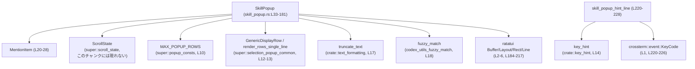
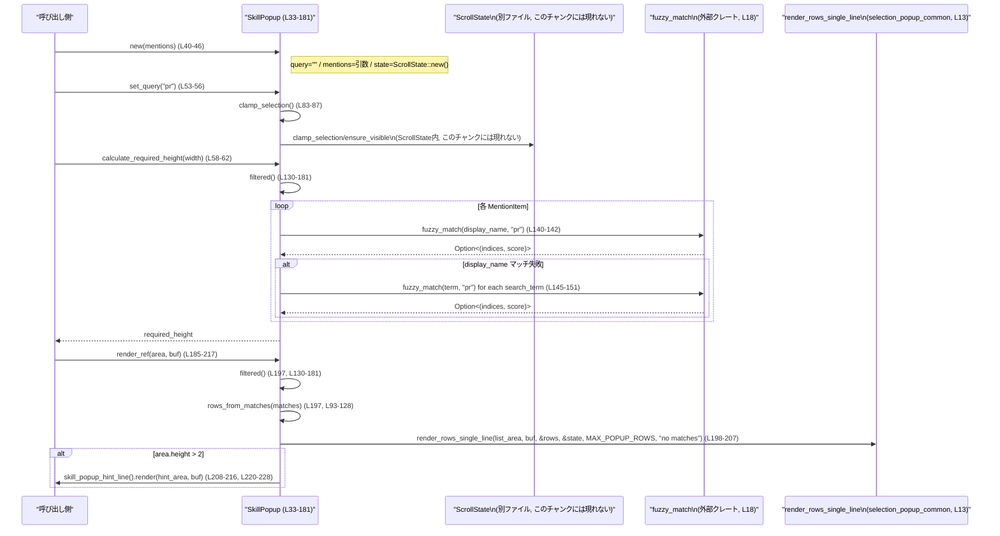

# tui/src/bottom_pane/skill_popup.rs

## 0. ざっくり一言

スキル／プラグインなどの「メンション候補」を、あいまい検索で絞り込みつつスクロール表示するための TUI ポップアップコンポーネントです（ratatui の `WidgetRef` として描画されます）。  
`SkillPopup` が状態（検索クエリ・候補リスト・スクロール位置）を持ち、あいまい一致とソートを行います。

---

## 1. このモジュールの役割

### 1.1 概要

- このモジュールは **メンション候補リストを検索・表示するポップアップ UI** を提供します。
- `MentionItem` で 1 行分の候補情報を表現し、`SkillPopup` が
  - クエリ文字列に対するあいまいマッチ（`fuzzy_match`）  
  - 結果の並び替え（マッチ種別・スコア・rank・名前）  
  - スクロール状態の管理（`ScrollState`）  
  - ratatui バッファへの描画  
  をまとめて行います（`SkillPopup` 本体: `skill_popup.rs:L33-181`, `render_ref`: `L184-217`）。

### 1.2 アーキテクチャ内での位置づけ

主な依存関係は次の通りです。

- 上位 UI から `SkillPopup` が作られ、クエリや候補をセットされる（`SkillPopup::new`, `set_query`, `set_mentions` `L40-56`）。
- フィルタリング／ソートは `codex_utils_fuzzy_match::fuzzy_match` に委譲（`L140-151`）。
- スクロール位置は `ScrollState` で管理（`L36`, `L64-67`, `L70-73`, `L83-87`）。
- 描画は `render_rows_single_line`（1 行表示ヘルパー）に任せる（`L198-207`）。
- ヒント行のテキストは `skill_popup_hint_line` が組み立て（`L220-228`）。

依存関係を簡略化すると次のようになります。



### 1.3 設計上のポイント

- **状態管理**
  - `SkillPopup` は検索クエリ `query`、候補一覧 `mentions`、スクロール状態 `state` を内部に保持します（`L33-36`）。
  - フィルタ結果は都度計算し、キャッシュはしません（`filtered`, `filtered_items`, `L89-91`, `L130-181`）。

- **あいまい検索とソート戦略**
  - まず `display_name` に対して `fuzzy_match` を試し、それが失敗した場合に `search_terms` をスキャンします（`L140-151`）。
  - display_name に直接マッチしたもの（`match_indices` が `Some`）を優先し、その後スコア・`sort_rank`・名前でソートします（`L158-177`）。
  - フィルタが空文字列の場合はスコア計算をせず `sort_rank` と名前でソートします（`L135-137`, `L158-163`）。

- **スクロールと選択**
  - 移動は `ScrollState::move_up_wrap` / `move_down_wrap` を通して行われ、行数に応じて選択位置をラップしています（`L64-73`）。
  - クエリや候補一覧が変わるたびに `clamp_selection` を呼び、選択位置と表示ウィンドウを整合させています（`L48-50`, `L53-56`, `L83-87`）。

- **安全性とエラーハンドリング**
  - このファイル内に `unsafe` ブロックや明示的なスレッド生成はありません（`skill_popup.rs:L1-389`）。
  - インデックスアクセスでパニックが起こりうる箇所は `rows_from_matches` の `self.mentions[idx]`（`L100`）のみですが、引数 `matches` は内部の `filtered()` からのみ生成されるため、現状の呼び出し経路では境界チェック上安全です（`L59`, `L197` で `self.filtered()` を直後に渡しています）。
  - 選択中の要素取得は `Option` でラップされ、選択が無効または結果が空でも `None` を返すだけです（`selected_mention`, `L76-81`）。

- **並行性**
  - すべてのメソッドは `&self` / `&mut self` を前提とした同期 API であり、非同期処理やスレッド間共有に関するコードはこのチャンクには現れません。
  - `SkillPopup` が `Send` / `Sync` かどうかはここからは分かりません（`ScrollState` や他依存型が別ファイルのため）。

---

## 2. 主要な機能一覧

- メンション候補アイテムの表現: `MentionItem` 構造体で、表示名・説明・挿入テキスト・検索用語・カテゴリ・ソート順位を保持します（`skill_popup.rs:L20-28`）。
- ポップアップ状態管理: `SkillPopup` 構造体で、クエリ文字列・候補リスト・スクロール状態を管理します（`L33-37`）。
- あいまい検索によるフィルタリングとソート: `SkillPopup::filtered` で、`fuzzy_match` によるマッチとスコアに応じた並び替えを行います（`L130-181`）。
- スクロールと選択移動: `SkillPopup::move_up` / `move_down` / `clamp_selection` で、`ScrollState` を介して選択位置と表示ウィンドウを制御します（`L64-73`, `L83-87`）。
- 描画ロジック（リスト本体＋ヒント行）: `WidgetRef for SkillPopup::render_ref` と `skill_popup_hint_line` が、候補行と下部ヒントを ratatui バッファに描画します（`L184-217`, `L220-228`）。
- 必要高さの計算: `calculate_required_height` で、フィルタ結果件数と `MAX_POPUP_ROWS` からポップアップの必要高さを決定します（`L58-62`）。

---

## 3. 公開 API と詳細解説

### 3.1 型一覧（構造体など）

| 名前 | 種別 | 役割 / 用途 | 定義位置 |
|------|------|-------------|----------|
| `MentionItem` | 構造体 | 1 件のメンション候補（表示名・説明・挿入テキスト・検索用語・カテゴリ・ソート順位）を表すデータコンテナです。 | `skill_popup.rs:L20-28` |
| `SkillPopup` | 構造体 | メンションポップアップの状態（クエリ・候補リスト・スクロール状態）を保持し、フィルタリング・並び替え・描画を行うコンポーネントです。 | `skill_popup.rs:L33-37` |

※ いずれも `pub(crate)` で、クレート内から利用可能です（`L20`, `L33`）。

### 3.2 関数詳細（最大 7 件）

#### `SkillPopup::new(mentions: Vec<MentionItem>) -> SkillPopup`

**概要**

- 初期候補リストを受け取り、検索クエリ空・初期スクロール状態で `SkillPopup` を生成します（`skill_popup.rs:L40-46`）。

**引数**

| 引数名 | 型 | 説明 |
|--------|----|------|
| `mentions` | `Vec<MentionItem>` | 初期表示するメンション候補一覧。所有権は `SkillPopup` に移動します（`L40-44`）。 |

**戻り値**

- `SkillPopup`: 初期化されたポップアップインスタンス。  
  - `query` は空文字列（`String::new()`）で初期化されます（`L42`）。
  - `state` は `ScrollState::new()` の結果です（`L44`）。

**内部処理の流れ**

1. `Self { ... }` で構造体初期化（`L41-45`）。
2. `query` に `String::new()` を設定。
3. `mentions` フィールドに引数 `mentions` をそのまま移動。
4. `state` に `ScrollState::new()` の結果を設定。

**Examples（使用例）**

```rust
// 同一モジュール内、または適切なuseを行っていると仮定した例です。
let mentions: Vec<MentionItem> = vec![
    MentionItem {
        display_name: "PR Babysitter".to_string(),
        description: Some("Review helper".to_string()),
        insert_text: "$pr-babysitter".to_string(),
        search_terms: vec!["pr babysitter".to_string(), "pr".to_string()],
        path: None,
        category_tag: Some("[Skill]".to_string()),
        sort_rank: 1,
    },
];
let popup = SkillPopup::new(mentions); // 初期状態のポップアップを作成
```

**Errors / Panics**

- この関数自体は `Result` を返さず、`panic` を起こす処理も含んでいません（単純な構造体初期化のみ、`L40-45`）。

**Edge cases（エッジケース）**

- `mentions` が空ベクタでもそのまま受け入れられます。  
  その場合、後続の `filtered()` は空の結果を返します（`L134-156`）。

**使用上の注意点**

- `mentions` の所有権は `SkillPopup` に移るため、呼び出し側では同じベクタを再利用できません（Rust の所有権ルール）。
- `ScrollState::new()` の具体的な初期選択状態は、このチャンクには現れません（`scroll_state.rs` 側の実装に依存）。

---

#### `SkillPopup::calculate_required_height(&self, _width: u16) -> u16`

**概要**

- 現在の検索クエリと候補リストに基づき、ポップアップに必要な行数（高さ）を計算します（`skill_popup.rs:L58-62`）。

**引数**

| 引数名 | 型 | 説明 |
|--------|----|------|
| `_width` | `u16` | 横幅。現状では使われていません（名前が `_width` で未使用、`L58`）。 |

**戻り値**

- `u16`: 必要な高さ（行数）。  
  - 描画する行数（少なくとも1行、多くても `MAX_POPUP_ROWS`）に上下の余白 2 行を加えた値です（`L59-62`）。

**内部処理の流れ**

1. `self.filtered()` で現在のクエリにマッチする候補を取得（`L59`, `L130-181`）。
2. `rows_from_matches` で表示用 `GenericDisplayRow` に変換（`L59`, `L93-128`）。
3. `rows.len()` を `1..=MAX_POPUP_ROWS` の範囲にクランプし、少なくとも 1 行、最大 `MAX_POPUP_ROWS` 行とする（`L60`）。
4. その値に 2 を saturating add して返す（`L61`）。  
   - `saturating_add` によって `u16` のオーバーフローが防止されます。

**Examples（使用例）**

```rust
let popup = SkillPopup::new(vec![]);          // 候補が空のポップアップ
let height = popup.calculate_required_height(72);
// height は少なくとも 3 (1行 + 余白2行) になります。
```

**Errors / Panics**

- `filtered` と `rows_from_matches` の組み合わせのみを使っており、パニックを起こしうるインデックスアクセスなどは含みません（`L58-62`）。
- `saturating_add` を使用しているため、理論上の最大値を超えてもオーバーフローしません（`L61`）。

**Edge cases（エッジケース）**

- 候補 0 件のときも高さは `1（最低表示行） + 2 = 3` になります（`L60-61`）。
- 候補件数が `MAX_POPUP_ROWS` を超えても、表示行は `MAX_POPUP_ROWS` にクランプされます（`L60`）。

**使用上の注意点**

- `_width` は未使用であるため、幅が変わっても高さは変わりません。  
  将来的に折り返し表示を導入する際に利用される可能性がありますが、このチャンクからは分かりません。
- レイアウト側で `Rect::new` の高さにこの戻り値を用いているテストが存在します（`render_popup`, `skill_popup.rs:L299-303`）。

---

#### `SkillPopup::move_down(&mut self)`

（`move_up` も類似の動作なので合わせて説明します。）

**概要**

- フィルタ後の候補リストの中で選択行を一つ下（または上）に移動し、スクロールウィンドウから外れないように調整します（`move_down`: `L70-73`, `move_up`: `L64-67`）。

**引数**

| 関数 | 引数名 | 型 | 説明 |
|------|--------|----|------|
| `move_down` | `&mut self` | `SkillPopup` 自身 | 選択位置とスクロール状態を書き換えます（`L70-73`）。 |
| `move_up` | `&mut self` | 同上 | 上方向への移動（`L64-67`）。 |

**戻り値**

- いずれも戻り値は `()` です。

**内部処理の流れ**

（`move_down` の場合）

1. `self.filtered_items().len()` で、現在のフィルタ結果件数を計算（`L71`, `L89-91`）。
2. `self.state.move_down_wrap(len)` を呼び出し、件数 `len` に対してラップする形で選択インデックスを更新（`L72`）。
3. `self.state.ensure_visible(len, MAX_POPUP_ROWS.min(len))` で、表示ウィンドウから選択行が外れないようスクロール位置を調整（`L73`）。

`move_up` も同様の流れで `move_up_wrap` を呼びます（`L64-67`）。

**Examples（使用例）**

```rust
let mut popup = SkillPopup::new(/* mentions */);
popup.move_down(); // 1行下に移動（wrap動作は ScrollState 実装に依存）
popup.move_up();   // 1行上に移動
```

**Errors / Panics**

- `len` が 0 のときの `move_up_wrap` / `move_down_wrap` の挙動や安全性は `ScrollState` 実装に依存し、このチャンクには現れません。
- 本関数内にはインデックスアクセスがなく、直接的な `panic` の可能性は見えません（`L70-73`）。

**Edge cases（エッジケース）**

- フィルタ結果が 0 件の場合
  - `len == 0` となるため、`ScrollState` 内での処理がどうなるかは不明です（`L71-72`）。
  - ただし `selected_mention` 側で `selected_idx?` を通して `Option` として扱っているため、無効な選択は `None` へフォールバックします（`L76-81`）。
- `len < MAX_POPUP_ROWS` のとき
  - `ensure_visible(len, MAX_POPUP_ROWS.min(len))` により、表示高さに `len` が使われます（`L67`, `L73`）。

**使用上の注意点**

- クエリや候補リストを更新した場合は、`set_query` / `set_mentions` を経由して `clamp_selection` を呼び出す前提になっています（`L48-50`, `L53-56`, `L83-87`）。  
  直接 `state` を操作する API は公開されていません。
- 大量の候補があり、キー入力ごとに `move_*` を頻繁に呼ぶ場合、内部で毎回 `filtered_items()` を計算するため、候補数に比例したコストが発生します（`L65`, `L71`, `L89-91`）。

---

#### `SkillPopup::selected_mention(&self) -> Option<&MentionItem>`

**概要**

- 現在の選択インデックスに対応する `MentionItem` を返します。選択が無効・結果が空などの場合は `None` を返します（`skill_popup.rs:L76-81`）。

**引数**

| 引数名 | 型 | 説明 |
|--------|----|------|
| `&self` | `&SkillPopup` | 読み取り専用参照です。 |

**戻り値**

- `Option<&MentionItem>`:  
  - `Some(&MentionItem)` … フィルタ済みリスト内の選択中のアイテム。  
  - `None` … 選択インデックスが存在しない／範囲外／元の `mentions` から取得できない場合。

**内部処理の流れ**

1. `let matches = self.filtered_items();` で、フィルタ済みインデックス一覧を取得（`L77`, `L89-91`）。
2. `let idx = self.state.selected_idx?;` で、選択インデックスを `Option` として取得し、`None` であればそのまま `None` を返す（`?` 演算子, `L78`）。
3. `let mention_idx = matches.get(idx)?;` で、フィルタ済みインデックス配列から `idx` 番目の要素を取得。範囲外なら `None` を返す（`L79`）。
4. `self.mentions.get(*mention_idx)` で、元の `mentions` ベクタからインデックス参照し、その結果（`Option<&MentionItem>`）を返す（`L80`）。

**Examples（使用例）**

```rust
let mut popup = SkillPopup::new(/* mentions */);
// クエリや移動操作で選択状態を作った後
if let Some(item) = popup.selected_mention() {
    // item.insert_text などを利用してエディタに挿入するといった用途を想定できます。
}
```

**Errors / Panics**

- すべてのアクセスに `Option` を使っており、`get` しか呼んでいないため、この関数が直接 `panic` することはありません（`L78-80`）。
- 戻り値が `Option` であるため、呼び出し側で `unwrap()` すると `None` の場合にパニックになる点には注意が必要です（Rust 全般の注意点）。

**Edge cases（エッジケース）**

- フィルタ結果 0 件、または `ScrollState` が選択インデックスを持っていない場合  
  → `selected_idx` が `None` となり、`selected_mention` も `None` を返します（`L78`）。
- フィルタ結果が変わって選択インデックスが範囲外になった場合  
  → `matches.get(idx)` が `None` となり、それ以降の `get` は呼ばれず `None` が返ります（`L79`）。

**使用上の注意点**

- 呼び出し時に必ずしも選択候補が存在するとは限らないため、`Option` のまま安全に扱う（`if let` / `match`）ことが前提になります。
- フィルタ条件や候補リスト内容が頻繁に変化する場合、選択インデックスが古い状態に対応している可能性がありますが、`set_query` / `set_mentions` で `clamp_selection` を呼ぶ前提で整合性を取っています（`L48-50`, `L53-56`, `L83-87`）。

---

#### `SkillPopup::rows_from_matches(&self, matches: Vec<(usize, Option<Vec<usize>>, i32)>) -> Vec<GenericDisplayRow>`

**概要**

- `filtered()` の結果（インデックス＋マッチインデックス＋スコア）から、描画用の `GenericDisplayRow` ベクタへ変換します（`skill_popup.rs:L93-128`）。

**引数**

| 引数名 | 型 | 説明 |
|--------|----|------|
| `matches` | `Vec<(usize, Option<Vec<usize>>, i32)>` | `(mentions内インデックス, display_nameのマッチ位置, スコア)` のタプル列。通常 `filtered()` から得られる値を渡します（`L94-96`, `L130-181`）。 |

**戻り値**

- `Vec<GenericDisplayRow>`: 1 行ごとの表示情報。  
  - `name` … `display_name` を `truncate_text` で切り詰めたもの（`L101`）。  
  - `match_indices` … display_name 上のマッチインデックス。`None` の場合は display_name マッチなし（検索語が search_terms にのみマッチしたケース）（`L99`, `L118`）。  
  - `description` … `category_tag` と `description` の内容に応じて組み立て（`L102-114`, `L120`）。

**内部処理の流れ**

1. `matches.into_iter()` でタプルのイテレータを得る（`L97-99`）。
2. 各 `(idx, indices, _score)` について:
   1. `let mention = &self.mentions[idx];` で元の候補を参照（`L100`）。
   2. `truncate_text(&mention.display_name, MENTION_NAME_TRUNCATE_LEN)` で名前を最大 24 文字に切り詰め（`L101`, `L31`）。
   3. `(category_tag, description)` の組み合わせに応じて説明文を決定（`L102-114`）。
   4. `GenericDisplayRow` を構築し、`match_indices` に `indices` を設定（`L115-125`）。
3. すべてを `collect()` して `Vec<GenericDisplayRow>` として返却（`L126-127`）。

**Examples（使用例）**

※ 通常は直接呼び出さず、`calculate_required_height` / `render_ref` 内部で使用されます（`L59`, `L197`）。

```rust
let matches = popup.filtered(); // Vec<(usize, Option<Vec<usize>>, i32)>
let rows: Vec<GenericDisplayRow> = popup.rows_from_matches(matches);
// rowsを使って任意の描画処理を行う、といった利用が想定できます。
```

**Errors / Panics**

- `self.mentions[idx]` で境界外アクセスになるとパニックが発生します（`L100`）。  
  ただし、現状の呼び出し元 `calculate_required_height`（`L59`）と `render_ref`（`L197`）は、いずれも `self.filtered()` の結果をそのまま渡しており、`filtered` が `self.mentions.iter().enumerate()` に基づいてタプルを生成しているため、インデックスは常に有効です（`L134-155`）。

**Edge cases（エッジケース）**

- `category_tag` のみ、または `description` のみが存在する場合の説明文生成:
  - 両方あり & `description` が空でない → `"{tag} {description}"`（`L106-107`）。
  - `category_tag` のみ → `tag` だけを使う（`L109`）。
  - `description` のみ & 非空 → `description` をそのまま使う（`L110-112`）。
  - 両方なしまたは `description` が空 → `None`（`L113-114`）。
- `match_indices` が `None` の場合でも `name` は必ず設定されます（`L115-118`）。

**使用上の注意点**

- 外部から `rows_from_matches` を呼ぶ場合、`matches` 内のインデックスは必ず `self.mentions` の範囲内である必要があります。  
  通常は `filtered()` の結果をそのまま渡すことが前提の設計です。
- `GenericDisplayRow` の他のフィールド（`display_shortcut`, `category_tag`, `is_disabled` 等）はこのモジュールでは固定値（`None` / `false`）にしており、別機能のための拡張余地が残されています（`L119-124`）。

---

#### `SkillPopup::filtered(&self) -> Vec<(usize, Option<Vec<usize>>, i32)>`

**概要**

- 現在のクエリ文字列 `query` に対して、`MentionItem` 一覧をあいまい検索し、  
  「元インデックス」「display_name 上のマッチ位置（あれば）」「スコア」のタプルをソート済みベクタで返します（`skill_popup.rs:L130-181`）。

**引数**

| 引数名 | 型 | 説明 |
|--------|----|------|
| `&self` | `&SkillPopup` | 読み取り専用。`query`・`mentions` を参照します（`L131-135`）。 |

**戻り値**

- `Vec<(usize, Option<Vec<usize>>, i32)>`:
  - `usize` … `mentions` 内のインデックス。
  - `Option<Vec<usize>>` … display_name 上のマッチインデックス。`Some` なら display_name 直接マッチ、`None` なら search_termsのみマッチ、またはフィルタ空の場合（`L140-151`, `L135-137`）。
  - `i32` … あいまいマッチスコア。小さいほど良いと見なして `min` と `cmp` を使っています（`L148-150`, `L166`）。

**内部処理の流れ**

1. `let filter = self.query.trim();` でクエリ文字列から前後空白を除去（`L131`）。
2. 空クエリの場合:
   - すべての `mentions` に対して `(idx, None, 0)` を `out` に push し（`L134-137`）、ループ続行（`L138`）。
3. 非空クエリの場合:
   1. 各 `mention` ごとに、まず `fuzzy_match(&mention.display_name, filter)` を試す（`L140-142`）。
   2. 成功した場合: `(Some(indices), score)` を `best_match` とする（`L140-142`）。
   3. 失敗した場合:
      - `mention.search_terms` を反復し、`display_name` と同一の term は除外（`L145-147`）。
      - 各 term に対して `fuzzy_match(term, filter)` を試し、スコアのみを取り出す（`L148`）。
      - 全 term の中で最小のスコア（最良マッチ）を `Some(score)` として得る（`L148-150`）。
      - それを `(None, score)` に変換して `best_match` とする（`L150-151`）。
   4. `best_match` が `Some` であれば、`(idx, indices, score)` を `out` に push（`L153-155`）。
4. ループ終了後、`out.sort_by(...)` でソートを行う（`L158-178`）:
   - クエリ空の場合: `sort_rank` → `display_name` の順（`L159-163`, `L173-177`）。
   - クエリ非空の場合:
     1. `a.1.is_none().cmp(&b.1.is_none())`  
        → display_name マッチ (`Some`) を search_terms のみマッチ (`None`) より優先（`L164-166`）。
     2. `then_with(|| a.2.cmp(&b.2))`  
        → スコアの良さ（`i32` の昇順）で比較（`L166`）。
     3. `then_with(|| self.mentions[a.0].sort_rank.cmp(...))`  
        → `sort_rank` の昇順（`L167-171`）。
     4. 最後に display_name の文字列比較で安定化（`L173-177`）。
5. ソート済みの `out` を返却（`L180`）。

**Examples（使用例）**

```rust
let mut popup = SkillPopup::new(vec![
    // 例: [Skill] と [Plugin] の混在
    // 実データの構造は tests モジュールの helper と同様です（L237-275）。
]);
popup.set_query("pr");
let matches = popup.filtered();           // ソート済みのマッチリスト
let indices: Vec<usize> = matches.into_iter().map(|(idx, _, _)| idx).collect();
```

**Errors / Panics**

- 内部では `self.mentions[a.0]` と `self.mentions[b.0]` へのインデックスアクセスを行いますが（`L160-162`, `L168-170`, `L174-175`）、`a.0` と `b.0` はすべて `0..self.mentions.len()` の範囲から生成されているため（`L134`, `L153-155`）、この関数内に限れば境界外アクセスは生じません。
- `fuzzy_match` の内部動作（エラー条件など）はこのチャンクには現れませんが、戻り値が `Option` であるため、エラーは `None` として扱っていると推測できます（`L140-151`）。ただしライブラリの内部仕様までは断定できません。

**Edge cases（エッジケース）**

- クエリが空文字列、または空白のみ（`"   "`）:
  - `trim()` により空文字列となり、すべての候補が `(idx, None, 0)` として結果に含まれます（`L131`, `L135-137`）。
  - ソートは `sort_rank` → `display_name` のみで行われます（`L158-163`, `L173-177`）。
- display_name と `search_terms` に同じ文字列が含まれる場合:
  - `search_terms` 側では `filter(|term| *term != &mention.display_name)` で除外されるため、display_name と同一の term には二重でマッチしません（`L145-147`）。
- どの term にもマッチしない場合:
  - `best_match` が `None` のままとなり、該当候補は結果に含まれません（`L153-155`）。

**使用上の注意点**

- スコアは `i32` で、小さいほど良い前提で `.min()` および `.cmp()` を使用しています（`L148-150`, `L166`）。  
  この前提は `fuzzy_match` の仕様に依存します。
- クエリごとに `filtered()` が新しいベクタを確保するため、大量の候補や高頻度の更新ではコストが増加します。  
  テストで典型件数は `MAX_POPUP_ROWS + 2` 程度ですが（`L278-280`, `L308-308`）、実運用値はこのチャンクには現れません。

---

#### `impl WidgetRef for SkillPopup { fn render_ref(&self, area: Rect, buf: &mut Buffer) }`

**概要**

- `SkillPopup` を ratatui の `WidgetRef` として描画するメソッドです。  
  上部に候補リスト、下部に操作ヒントを描画します（`skill_popup.rs:L184-217`）。

**引数**

| 引数名 | 型 | 説明 |
|--------|----|------|
| `area` | `Rect` | 描画領域。高さに応じてリスト部とヒント部に分割されます（`L185-196`）。 |
| `buf`  | `&mut Buffer` | ratatui の描画バッファ。リストとヒントの内容を書き込みます（`L185`, `L199-207`, `L215`）。 |

**戻り値**

- なし（`()`）。`WidgetRef` の `render_ref` 実装です。

**内部処理の流れ**

1. `if area.height > 2 { ... } else { ... }` で、ヒント行を描画するだけの高さがあるかを判定（`L186-195`）。
   - 高さ > 2 のとき:
     - `Layout::vertical([...]).areas(area)` で `[list_area, _spacer_area, hint_area]` を生成（`L187-192`）。
     - `list_area` と `hint_area` を使用（`L193`）。
   - 高さ ≦ 2 のとき:
     - 全体を `list_area` とし、ヒントは描画しません（`L194-196`）。
2. `self.rows_from_matches(self.filtered())` で表示用行ベクタを作成（`L197`, `L93-128`, `L130-181`）。
3. `render_rows_single_line` を呼び出し、リスト部を描画（`L198-207`）。
   - `list_area.inset(Insets::tlbr(0, 2, 0, 0))` で左右のインセットを適用（左 2 文字分の余白, `L199-201`）。
   - 最大表示行数 `MAX_POPUP_ROWS`、空の場合のメッセージ `"no matches"` を指定（`L205-206`）。
4. `if let Some(hint_area) = hint_area { ... }` でヒント領域がある場合:
   - `Rect` を x方向に +2 ずらし、幅を 2 縮めて左右余白を確保（`L209-213`）。
   - `skill_popup_hint_line().render(hint_area, buf);` でヒント行を描画（`L215`）。

**Examples（使用例）**

```rust
// ratatui の描画ループ内での利用例（パスは実際のモジュール構成に応じて調整が必要です）。
fn ui<B: ratatui::backend::Backend>(f: &mut ratatui::Frame<B>, popup: &SkillPopup) {
    let area = f.size(); // 画面全体
    popup.render_ref(area, f.buffer_mut()); // SkillPopup を描画
}
```

**Errors / Panics**

- `rows_from_matches` 内のインデックスアクセス以外に `panic` の可能性は見当たりません（`L100`）。  
  その安全性については前述の通り、`filtered()` の結果に依存します。
- `Layout::vertical([...]).areas(area)` は ratatui ライブラリの挙動に従い、ここではエラー処理は不要です（`L187-192`）。

**Edge cases（エッジケース）**

- `area.height <= 2` の場合:
  - ヒント行は描画されず、候補リストのみが `area` 全体に描かれます（`L194-196`, `L208-216`）。
- フィルタ結果 0 件の場合:
  - `rows` が空でも `render_rows_single_line` に `"no matches"` 文字列を渡しているため、適切な「ヒットなし」表示が想定されます（`L197-207`）。  
    実際の表示内容は `render_rows_single_line` の実装に依存します（このチャンクには現れません）。

**使用上の注意点**

- `calculate_required_height` を使って適切な高さの `Rect` を用意することが前提です。テスト `render_popup` ではこのように利用しています（`L299-303`）。
- `WidgetRef` を実装しているため、ratatui のウィジェットシステムと統合しやすくなっています（`L184-217`）。

---

### 3.3 その他の関数

| 関数名 | 役割（1 行） | 定義位置 |
|--------|--------------|----------|
| `SkillPopup::set_mentions(&mut self, mentions: Vec<MentionItem>)` | 候補リストを差し替え、選択状態をリスト長に合わせてクランプします。 | `skill_popup.rs:L48-51` |
| `SkillPopup::set_query(&mut self, query: &str)` | 検索クエリ文字列を更新し、それに応じて選択状態とスクロール位置をクランプします。 | `skill_popup.rs:L53-56` |
| `SkillPopup::move_up(&mut self)` | 選択行を 1 行上に移動し、必要に応じてスクロールします。 | `skill_popup.rs:L64-67` |
| `SkillPopup::clamp_selection(&mut self)` | 現在のフィルタ結果に基づき、選択インデックスと表示ウィンドウを範囲内に収めます。 | `skill_popup.rs:L83-87` |
| `SkillPopup::filtered_items(&self) -> Vec<usize>` | `filtered()` の結果からインデックスだけを取り出したショートカット関数です。 | `skill_popup.rs:L89-91` |
| `skill_popup_hint_line() -> Line<'static>` | 「Press Enter to insert / Esc to close」の操作ヒントを組み立てます。 | `skill_popup.rs:L220-228` |
| `tests::mention_item(index: usize) -> MentionItem` | テスト用の `MentionItem` 生成ヘルパー（display_name などに index を埋め込み）です。 | `skill_popup.rs:L237-247` |
| `tests::ranked_mention_item(...) -> MentionItem` | `sort_rank`・category_tag を指定可能なテスト用ヘルパーです。 | `skill_popup.rs:L249-266` |
| `tests::named_mention_item(...) -> MentionItem` | category_tag を `[Skill]`、sort_rank を 1 として固定したテスト用ヘルパーです。 | `skill_popup.rs:L269-271` |
| `tests::plugin_mention_item(...) -> MentionItem` | category_tag を `[Plugin]`、sort_rank を 0 として固定したテスト用ヘルパーです。 | `skill_popup.rs:L273-275` |
| `tests::render_popup(popup: &SkillPopup, width: u16) -> String` | テスト用に popup をバッファに描画し、デバッグ文字列として返します。 | `skill_popup.rs:L299-303` |

---

## 4. データフロー

このモジュールにおける代表的なデータフローは、「呼び出し側がクエリと候補を与え、ポップアップを描画する」流れです。

1. 呼び出し側が `SkillPopup::new` でインスタンスを作り、候補 `mentions` を渡す（`L40-46`）。
2. 検索クエリ変更時に `set_query` を呼び、内部の `query` と選択状態を更新（`L53-56`, `L83-87`）。
3. レイアウト計算時に `calculate_required_height` を使って描画領域の高さを決定（`L58-62`）。
4. 描画フェーズで `render_ref` が呼ばれ、内部で `filtered` → `rows_from_matches` → `render_rows_single_line` → `skill_popup_hint_line` という順番で描画処理が進みます（`L185-217`, `L130-181`, `L93-128`, `L198-207`, `L220-228`）。

これを sequence diagram で表すと次のようになります。



---

## 5. 使い方（How to Use）

### 5.1 基本的な使用方法

以下は、エディタのメンションポップアップとして `SkillPopup` を利用する際の典型的なフロー例です（モジュールパスは実際の構成に応じて調整が必要です）。

```rust
// パスは実際のプロジェクト構成に合わせて変更してください。
use crate::bottom_pane::skill_popup::{SkillPopup, MentionItem};

fn build_mentions() -> Vec<MentionItem> {
    vec![
        MentionItem {
            display_name: "PR Babysitter".to_string(),
            description: Some("Review helper".to_string()),
            insert_text: "$pr-babysitter".to_string(),
            search_terms: vec!["pr babysitter".to_string(), "pr".to_string()],
            path: None,
            category_tag: Some("[Skill]".to_string()),
            sort_rank: 1,
        },
        // ... 他の候補
    ]
}

// 初期化
let mut popup = SkillPopup::new(build_mentions()); // L40-46

// クエリ更新（キーイベントハンドラ内など）
popup.set_query("pr"); // L53-56

// レイアウト計算
let width: u16 = 72;
let height = popup.calculate_required_height(width); // L58-62
let area = ratatui::layout::Rect::new(0, 0, width, height);

// 描画（ratatui のフレームからバッファを取得していると仮定）
let mut buf = ratatui::buffer::Buffer::empty(area);
popup.render_ref(area, &mut buf); // L185-217

// Enter が押された場合の挿入処理例
if let Some(item) = popup.selected_mention() { // L76-81
    // item.insert_text をエディタに挿入するなどの処理
}
```

### 5.2 よくある使用パターン

- **クエリに応じたリアルタイムフィルタリング**

  キー入力ごとに `set_query` を呼び出し、その後描画するだけで、クエリに応じた候補ソートが自動で行われます。

  ```rust
  match key.code {
      crossterm::event::KeyCode::Char(ch) => {
          query.push(ch);                // アプリ側のクエリ文字列
          popup.set_query(&query);       // L53-56
      }
      crossterm::event::KeyCode::Backspace => {
          query.pop();
          popup.set_query(&query);
      }
      _ => {}
  }
  ```

- **カーソル移動（↑/↓）**

  矢印キーに対して `move_up` / `move_down` を対応づけます（`L64-73`）。

  ```rust
  match key.code {
      crossterm::event::KeyCode::Up => popup.move_up(),
      crossterm::event::KeyCode::Down => popup.move_down(),
      _ => {}
  }
  ```

- **挿入テキストの取得**

  Enter キーで `selected_mention` から `insert_text` を利用するパターンです（`L76-81`, `L220-226`）。

  ```rust
  match key.code {
      crossterm::event::KeyCode::Enter => {
          if let Some(item) = popup.selected_mention() {
              // item.insert_text を利用してエディタへの挿入などを行う
          }
      }
      _ => {}
  }
  ```

### 5.3 よくある間違い

このチャンクから推測できる、起こりやすそうな誤用と対策を挙げます。

```rust
// 誤り例: クエリ変更後に set_query を呼ばずに描画している
query.push('p');
// popup.query フィールドは更新されていないため、filtered() の内容が変わらない
popup.render_ref(area, buf); // 古いクエリの結果で描画される

// 正しい例:
query.push('p');
popup.set_query(&query);     // queryフィールドとスクロール状態が更新される (L53-56, L83-87)
popup.render_ref(area, buf);
```

```rust
// 誤り例: selected_mention の結果を無条件に unwrap している
let item = popup.selected_mention().unwrap(); // フィルタ結果0件時にpanicしうる

// 正しい例:
if let Some(item) = popup.selected_mention() {
    // 安全に利用
}
```

### 5.4 使用上の注意点（まとめ）

- **前提条件／契約**
  - 候補リストの更新は `set_mentions` を通じて行う前提です（`L48-51`）。  
    `mentions` フィールドは `pub(crate)` ではなく、直接書き換えられません。
  - クエリ変更時には必ず `set_query` を呼び、内部状態とクエリを同期させる必要があります（`L53-56`）。
  - `rows_from_matches` に渡す `matches` は `filtered()` の結果を想定しており、任意のインデックス値を渡すとパニックの可能性があります（`L93-100`）。

- **安全性（Rust固有）**
  - このファイルには `unsafe` ブロックがなく、すべて安全な Rust で実装されています（`skill_popup.rs:L1-389`）。
  - インデックスアクセスは `filtered()` の生成ロジックと一貫しており、現状の内部呼び出し経路では out-of-bounds による `panic` は起きない構造です（`L134-155`, `L100`, `L160-162` など）。
  - 選択中アイテム取得は `Option` を通じて安全に表現されています（`L76-81`）。

- **エラー／パニック条件**
  - 主な潜在的パニック箇所: `rows_from_matches` 内の `self.mentions[idx]` と `filtered` 内の `self.mentions[a.0]` 等のインデックスアクセス（`L100`, `L160-162`, `L168-170`, `L174-175`）。  
    いずれも内部ロジック上安全ですが、今後 `filtered` の仕様を変える場合は注意が必要です。
  - 呼び出し側で `selected_mention().unwrap()` などを行うと、結果が `None` の場合にパニックします。  
    これは Rust 全般の `Option` の使い方に関する注意です。

- **並行性**
  - このモジュールにはスレッド生成、ロック、`async/await` などの並行処理は登場しません（`skill_popup.rs:L1-389`）。  
    `SkillPopup` を複数スレッドから共有する場合は、上位コード側で適切な同期（`Arc<Mutex<_>>` 等）を行う必要がありますが、そのような利用法はこのチャンクには現れません。
  
- **パフォーマンス上のポイント**
  - `filtered` および `filtered_items` は呼び出しごとに新しい `Vec` を生成し、すべての `mentions` を走査します（`L89-91`, `L130-156`）。  
    候補数が非常に多い場合は、キー入力ごとの再計算がボトルネックになりうる点に留意が必要です。
  - ソートは `sort_by` による全件ソートで、`O(n log n)` の計算量です（`L158-178`）。

- **潜在的な不具合につながりうるポイント**
  - 将来 `SkillPopup` の外部から `rows_from_matches` に任意の `matches` を渡す API などを追加した場合、`idx` の妥当性を保証しないとパニックの原因になる可能性があります（`L93-100`）。
  - `ScrollState` の実装はこのチャンクには現れないため、`len == 0` のときの `move_up_wrap` / `move_down_wrap` / `ensure_visible` の挙動を変更する際は、`SkillPopup` の前提とずれないよう注意が必要です（`L64-67`, `L70-73`, `L83-87`）。

- **セキュリティ観点**
  - このモジュールは TUI 表示と検索のみを扱い、外部プロセスやファイル I/O、ネットワークアクセスは行いません（`skill_popup.rs:L1-389`）。  
  - ユーザー入力（クエリ文字列）は `fuzzy_match` と ratatui レンダラに渡されますが、任意コード実行や OS コマンド実行といった危険な操作は含まれていません。

### 5.5 テスト（概要）

テストコードは同一ファイル内の `mod tests` にあります（`skill_popup.rs:L230-389`）。

- `filtered_mentions_preserve_results_beyond_popup_height`（`L277-297`）
  - `MAX_POPUP_ROWS + 2` 件の候補を与え、`filtered_items` が全件を保持していること、および `calculate_required_height` が `MAX_POPUP_ROWS + 2` に対応した高さを返すことを確認します。
- `scrolling_mentions_shifts_rendered_window_snapshot`（`L306-315`）
  - `move_down` を複数回呼び出した後の描画結果を snapshot テストで検証します（`insta::assert_snapshot`）。
- `display_name_match_sorting_beats_worse_secondary_search_term_matches`（`L317-347`）
  - display_name マッチと search_terms マッチが混在するケースで、display_name マッチが優先されていることを検証します。
- `query_match_score_sorts_before_plugin_rank_bias`（`L349-388`）
  - `[Plugin]` と `[Skill]` の混在時に、`sort_rank`（プラグインバイアス）よりもマッチスコアが優先されるソート順になっていることを検証します。

これらのテストにより、主に **フィルタリング／ソートロジック** と **スクロール＋描画結果** の挙動がチェックされています。

---

## 6. 変更の仕方（How to Modify）

### 6.1 新しい機能を追加する場合

- **表示情報を増やしたい場合**
  1. `MentionItem` に必要なフィールドを追加します（例: アイコン種別など）（`L20-28`）。
  2. `rows_from_matches` で `GenericDisplayRow` にフィールドをマッピングします（`L93-128`）。
  3. 既存の `render_rows_single_line` がそのフィールドを描画しない場合は、`selection_popup_common` 側の変更が必要です（このチャンクには現れません）。

- **ソート基準を追加／変更したい場合**
  1. `SkillPopup::filtered` 内の `sort_by` ロジックを修正します（`L158-178`）。
  2. display_name へのマッチ優先ロジックや `sort_rank` の扱いはテストで明示されているため（`L317-347`, `L349-388`）、テストケースの見直し・追加も必要になります。

- **キーバインドを変えたい場合（ヒント表示）**
  1. `skill_popup_hint_line` を修正し、`KeyCode` と文言を変更します（`L220-226`）。
  2. 実際のキーイベントハンドリングはこのファイルにはないため、上位の入力処理コードも合わせて変更する必要があります（このチャンクには現れません）。

### 6.2 既存の機能を変更する場合

- **フィルタリングロジックを変更する場合**
  - 影響範囲:
    - `filtered` 本体（`L130-181`）
    - それを利用する `filtered_items`, `calculate_required_height`, `move_up/down`, `clamp_selection`, `render_ref`（`L58-91`, `L185-217`）
    - テスト `display_name_match_sorting_*`, `query_match_score_*`（`L317-388`）
  - 注意点:
    - `filtered` の返すタプル形式を変えると、`rows_from_matches` や他メソッドもすべて更新が必要です（`L93-100`）。
    - display_name マッチ vs search_terms マッチの優先順位はテストにより前提化されているため、挙動変更時にはテストの期待値も更新する必要があります。

- **スクロール挙動を変えたい場合**
  - 影響範囲:
    - `move_up`, `move_down`, `clamp_selection`（`L64-87`）
    - `ScrollState` 実装（別ファイル、このチャンクには現れません）
    - snapshot テスト `scrolling_mentions_shifts_rendered_window_snapshot`（`L306-315`）
  - 注意点:
    - `len == 0` のときの挙動など、エッジケースを意識して `ScrollState` と整合を取る必要があります。
    - 選択インデックスが常に `0..len` の範囲にある、という不変条件が崩れないようにする必要があります（`selected_mention`, `L76-81`）。

- **描画スタイルを変えたい場合**
  - 主に `render_ref` と `skill_popup_hint_line` を修正します（`L184-217`, `L220-228`）。
  - 行ごとの描画は `render_rows_single_line` に委譲されているため、詳細なレイアウトや色付けを変更したい場合は、そちらのモジュールも確認が必要です（`L198-207`）。

---

## 7. 関連ファイル

このモジュールと密接に関係するファイル・モジュールは次の通りです。

| パス / モジュール | 役割 / 関係 |
|-------------------|------------|
| `super::popup_consts` | `MAX_POPUP_ROWS` を提供し、ポップアップの最大表示行数を決めます（`skill_popup.rs:L10`, `L60`, `L67`, `L73`, `L205`）。 |
| `super::scroll_state` | `ScrollState` 型を提供し、選択インデックスとスクロールウィンドウの管理を行います（`skill_popup.rs:L11`, `L36`, `L64-67`, `L70-73`, `L83-87`）。このチャンクには実装が現れません。 |
| `super::selection_popup_common` | `GenericDisplayRow` と `render_rows_single_line` を提供し、候補行の共通表示ロジックを担当します（`skill_popup.rs:L12-13`, `L93-128`, `L198-207`）。 |
| `crate::render` | `Insets` と `RectExt` を提供し、描画領域のインセット（余白）処理に使用されます（`skill_popup.rs:L15-16`, `L199-201`）。 |
| `crate::text_formatting` | `truncate_text` 関数を提供し、長い display_name を切り詰めるために使用されます（`skill_popup.rs:L17`, `L101`）。 |
| `crate::key_hint` | キーバインドのヒント（`Enter`, `Esc`）を `Line` に埋め込むために使用されます（`skill_popup.rs:L14`, `L220-226`）。 |
| `codex_utils_fuzzy_match` | `fuzzy_match` 関数を提供し、クエリと display_name / search_terms とのあいまいマッチングを行います（`skill_popup.rs:L18`, `L140-151`）。 |
| `ratatui` | バッファ・レイアウト・矩形・テキスト・ウィジェットインターフェースを提供し、このモジュールの描画処理の基盤となります（`skill_popup.rs:L2-7`, `L184-217`）。 |
| `crossterm::event::KeyCode` | ヒント行で利用するキー表現（Enter,Ecs）に使用されています（`skill_popup.rs:L1`, `L220-226`）。 |

テスト関連:

| パス / モジュール | 役割 / 関係 |
|-------------------|------------|
| `mod tests` (このファイル内) | ソートロジック、スクロール挙動、必要高さ計算、描画スナップショットを検証するユニットテストおよび snapshot テストを含みます（`skill_popup.rs:L230-389`）。 |
| `pretty_assertions` / `insta` | テストにおける見やすい差分表示および snapshot テストに使用されています（`skill_popup.rs:L233`, `L314`）。 |

以上の情報により、このファイル単体だけでなく、関連コンポーネントとの関係も含めて `SkillPopup` の役割と挙動を把握できるようになっています。
