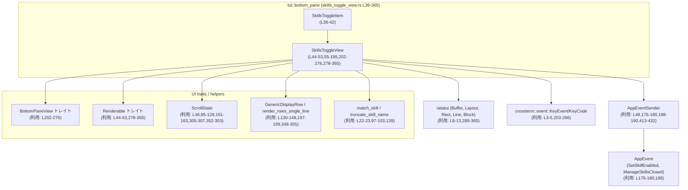
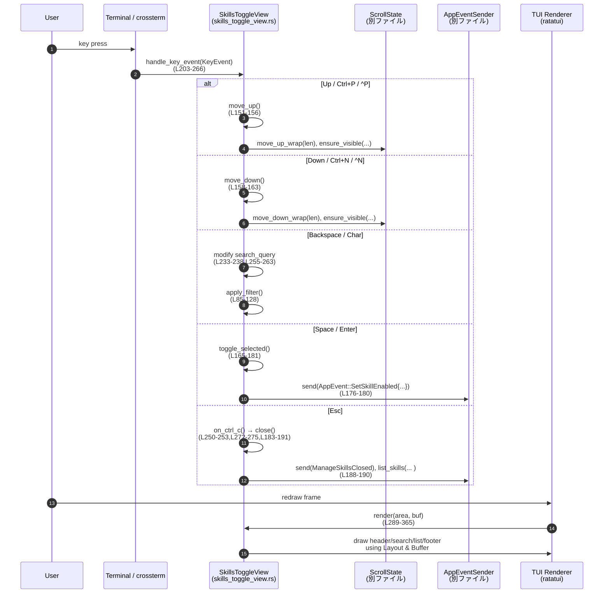

# tui/src/bottom_pane/skills_toggle_view.rs

## 0. ざっくり一言

スキル一覧をポップアップ形式で表示し、キーボード操作で検索・スクロールしながらスキルの有効/無効を切り替える TUI ビューの実装です（`skills_toggle_view.rs:L36-365`）。

---

## 1. このモジュールの役割

### 1.1 概要

- このモジュールは、**スキル設定ファイル一覧を対話的にオン/オフ切り替えする UI** を提供します（`SkillsToggleView`）。
- ユーザーのキー入力を受け取り、検索クエリによるフィルタリング、カーソル移動、選択項目の有効/無効切り替え、ビューのクローズを行います（`skills_toggle_view.rs:L55-276`）。
- レイアウトや描画には ratatui を使い、行のレンダリングには共通コンポーネント `GenericDisplayRow` / `render_rows_single_line` を利用しています（`skills_toggle_view.rs:L130-149,L289-365`）。
- スキルの有効状態変更やダイアログクローズは `AppEventSender` を通じてアプリケーションへイベントとして通知されます（`skills_toggle_view.rs:L176-180,L188-190`）。

### 1.2 アーキテクチャ内での位置づけ

`SkillsToggleView` は「ボトムペイン」の 1 つのビューとして、入力イベントと描画の間に位置します。



※ 他モジュール（`ScrollState`, `BottomPaneView` など）の定義はこのチャンクには現れません。

### 1.3 設計上のポイント

- **状態管理**  
  - `items`（全スキル）、`filtered_indices`（フィルタ適用後のインデックス列）、`ScrollState`（選択行とスクロール位置）を分離して管理しています（`skills_toggle_view.rs:L44-52,L85-128`）。
- **フィルタ＆ソート**  
  - 検索文字列に応じて `match_skill` でマッチ判定とスコア算出を行い、スコア→名前順にソートした結果から `filtered_indices` を構成します（`skills_toggle_view.rs:L92-114`）。
  - フィルタ変更時に可能ならば「実際のアイテムインデックス」を基準に選択位置を復元し、操作感を維持しています（`skills_toggle_view.rs:L86-91,L116-123`）。
- **安全なインデックスアクセス**  
  - アイテムアクセスはすべて `.get()` / `.get_mut()` と `Option` パターンマッチで行い、パニックの原因となる範囲外インデックスを避けています（`skills_toggle_view.rs:L135-146,L165-174`）。
- **描画サイズの安全性**  
  - `saturating_sub` / `saturating_add` と `clamp` でレイアウト計算によるオーバーフローを避けています（`skills_toggle_view.rs:L193-195,L279-286,L343-346`）。
  - 行数を `MAX_POPUP_ROWS` にクランプし、`usize -> u16` 変換は `try_into().unwrap_or(1)` で安全にフォールバックします（`skills_toggle_view.rs:L197-199`）。
- **エラーハンドリング方針**  
  - このモジュール内では `Result` 型や `panic!` は使われておらず、異常系は早期 `return` やデフォルト値で吸収しています。
  - イベント送信 (`AppEventSender::send` / `list_skills`) の戻り値は無視されており、失敗時の挙動はこのチャンクからは分かりません（`skills_toggle_view.rs:L176-180,L188-190`）。

---

## 2. 主要な機能一覧

- スキル一覧の保持: `SkillsToggleItem` と `items: Vec<SkillsToggleItem>` により、名前・説明・有効状態・設定ファイルパスを保持（`skills_toggle_view.rs:L36-42,L44-45`）。
- 検索フィルタリング: `search_query` と `apply_filter` により、入力文字列に応じてスキル一覧をフィルタ＆ソート（`skills_toggle_view.rs:L51,L85-128,L203-263`）。
- スクロール＆選択: `ScrollState` と `move_up` / `move_down` / `build_rows` で、カーソル移動と表示範囲を管理（`skills_toggle_view.rs:L46,L130-149,L151-163`）。
- 有効/無効切り替え: `toggle_selected` で現在選択されているスキルの `enabled` を反転し、`AppEvent::SetSkillEnabled` を送信（`skills_toggle_view.rs:L165-181`）。
- ビューのクローズ: `close` および `on_ctrl_c` により、重複クローズ防止・`AppEvent::ManageSkillsClosed` 送信・スキル一覧のリロード指示（`skills_toggle_view.rs:L183-191,L272-275`）。
- 描画: `Renderable` 実装の `desired_height` / `render` により、ヘッダ・検索プロンプト・リスト・フッタヒント行をレイアウトして描画（`skills_toggle_view.rs:L278-287,L289-365`）。
- キーボード操作: `BottomPaneView::handle_key_event` で Up/Down/Ctrl+P/Ctrl+N/Backspace/文字入力/Space/Enter/Esc を処理（`skills_toggle_view.rs:L203-266`）。

---

## 3. 公開 API と詳細解説

### 3.1 型一覧（構造体など）

| 名前 | 種別 | 行範囲 | 役割 / 用途 |
|------|------|--------|-------------|
| `SkillsToggleItem` | 構造体 | `skills_toggle_view.rs:L36-42` | 一つのスキルを表現します。表示名 `name`、内部名 `skill_name`、説明 `description`、有効フラグ `enabled`、設定ファイルパス `path` を保持します。 |
| `SkillsToggleView` | 構造体 | `skills_toggle_view.rs:L44-53` | スキル切り替えポップアップのビュー実装です。フィルタ状態・スクロール状態・ヘッダ/フッタ表示・`AppEventSender` など UI に必要な状態を保持します。 |

内部フィールドの主な役割（`SkillsToggleView`）:

- `items: Vec<SkillsToggleItem>`: 全スキルの一覧（`skills_toggle_view.rs:L44-45`）。
- `state: ScrollState`: 選択インデックス・スクロール位置などの状態（`skills_toggle_view.rs:L46`）。
- `complete: bool`: ビューがクローズ済みかどうか（`skills_toggle_view.rs:L47`）。
- `app_event_tx: AppEventSender`: アプリ全体へのイベント送信チャネル（`skills_toggle_view.rs:L48`）。
- `header: Box<dyn Renderable>`: ヘッダ部（タイトルと説明）の描画用コンポーネント（`skills_toggle_view.rs:L49,57-61`）。
- `footer_hint: Line<'static>`: フッタに表示するキーヒント行（`skills_toggle_view.rs:L50,69,368-378`）。
- `search_query: String`: 現在の検索文字列（`skills_toggle_view.rs:L51`）。
- `filtered_indices: Vec<usize>`: フィルタ適用後に表示対象となる `items` のインデックス（`skills_toggle_view.rs:L52,L92-114`）。

---

### 3.2 関数詳細（主要 7 件）

#### `SkillsToggleView::new(items: Vec<SkillsToggleItem>, app_event_tx: AppEventSender) -> Self`  

**行範囲:** `skills_toggle_view.rs:L56-75`

**概要**

- スキル一覧とイベント送信チャネルを受け取り、`SkillsToggleView` を初期化します。
- ヘッダ文言とフッタのキーヒントを組み立てた上で、初回のフィルタリング（全件表示）を行います。

**引数**

| 引数名 | 型 | 説明 |
|--------|----|------|
| `items` | `Vec<SkillsToggleItem>` | 初期表示されるスキル一覧です。 |
| `app_event_tx` | `AppEventSender` | スキル有効化/無効化やクローズイベントをアプリへ通知する送信チャネルです。 |

**戻り値**

- 初期化された `SkillsToggleView` インスタンス。`complete` は `false`、`search_query` は空文字列、`filtered_indices` は `items` 全件で初期化されます（`skills_toggle_view.rs:L63-73`）。

**内部処理の流れ**

1. `ColumnRenderable::new()` でヘッダ用コンポーネントを生成（`skills_toggle_view.rs:L57`）。
2. タイトル行「Enable/Disable Skills」を太字で追加（`bold()`）（`skills_toggle_view.rs:L58`）。
3. 説明行「Turn skills on or off...」を淡色（`.dim()`）で追加（`skills_toggle_view.rs:L59-61`）。
4. 構造体フィールドを初期化し、`skills_toggle_hint_line()` でフッタヒント行を構築（`skills_toggle_view.rs:L63-71`）。
5. `view.apply_filter()` を呼び出し、`filtered_indices` と `state` を初期化（`skills_toggle_view.rs:L73`）。

**Examples（使用例）**

テストコードをもとにした典型的な初期化例です（`skills_toggle_view.rs:L413-432`）。

```rust
use std::path::PathBuf;
use tokio::sync::mpsc::unbounded_channel;
use crate::app_event::AppEvent;
use crate::app_event_sender::AppEventSender;
use crate::bottom_pane::skills_toggle_view::{SkillsToggleItem, SkillsToggleView};

// AppEventSender を準備する
let (tx_raw, _rx) = unbounded_channel::<AppEvent>();         // 非同期チャネルを作成
let app_event_tx = AppEventSender::new(tx_raw);              // ラッパ型に包む

// スキル一覧を用意する
let items = vec![
    SkillsToggleItem {
        name: "Repo Scout".to_string(),
        skill_name: "repo_scout".to_string(),
        description: "Summarize the repo layout".to_string(),
        enabled: true,
        path: PathBuf::from("/tmp/skills/repo_scout.toml"),
    },
    SkillsToggleItem {
        name: "Changelog Writer".to_string(),
        skill_name: "changelog_writer".to_string(),
        description: "Draft release notes".to_string(),
        enabled: false,
        path: PathBuf::from("/tmp/skills/changelog_writer.toml"),
    },
];

// ビューを生成する
let mut view = SkillsToggleView::new(items, app_event_tx);
```

**Errors / Panics**

- この関数内で `Result` や `panic!` は使用していません。
- `skills_toggle_hint_line()` も `Line` を構築するだけで、パニック要因は見当たりません（`skills_toggle_view.rs:L368-378`）。

**Edge cases（エッジケース）**

- `items` が空でも `apply_filter` が `(0..0)` の範囲から `filtered_indices` を生成し、`state.selected_idx` は `None` のままになります（`skills_toggle_view.rs:L92-96,L116-123`）。
- `app_event_tx` が無効なチャネルを内包している場合の挙動（イベント送信失敗）は、このチャンクからは分かりません。

**使用上の注意点**

- `items` の内容は `SkillsToggleView` 内部で直接参照・更新されるため、外部で同じ `SkillsToggleItem` を共有して書き換えるパターンは想定されていません（フィールドはすべて所有権を持つ `String` / `PathBuf` です）。
- 初期化後に `items` を差し替えるメソッドは提供されていないため、新しい一覧を表示したい場合は `SkillsToggleView` を作り直す設計が前提と考えられます（コードからの推測であり、このチャンクだけでは断定できません）。

---

#### `SkillsToggleView::apply_filter(&mut self)`  

**行範囲:** `skills_toggle_view.rs:L85-128`

**概要**

- 現在の検索クエリ `search_query` に基づいて `items` をフィルタし、`filtered_indices` と選択状態（`ScrollState`）を更新します。
- 可能な限り、フィルタ前に選択していた「実際のアイテム」を再選択するよう試みます。

**引数**

- なし（`&mut self` のみ）。

**戻り値**

- なし。`self.filtered_indices` と `self.state` を更新します。

**内部処理の流れ**

1. 直前の選択状態を保存  
   - `state.selected_idx`（表示インデックス）から `filtered_indices` をたどり、「実際のアイテムインデックス」を `previously_selected` として保持します（`skills_toggle_view.rs:L87-91`）。
2. 検索文字列をトリムして空白を除去（`skills_toggle_view.rs:L92`）。
3. フィルタリング:
   - クエリが空文字列なら `filtered_indices = 0..items.len()`（全件表示）（`skills_toggle_view.rs:L93-95`）。
   - それ以外なら、`match_skill(filter, display_name, &item.skill_name)` が `Some((_indices, score))` を返したアイテムだけを候補にし、`(index, score)` を `matches` に積みます（`skills_toggle_view.rs:L96-103`）。
4. ソート:
   - `score` の昇順 → 同点なら `name` の辞書順で `matches` をソート（`skills_toggle_view.rs:L105-111`）。
   - ソート後、`matches` からインデックスだけを抜き出し `filtered_indices` を更新（`skills_toggle_view.rs:L113`）。
5. 選択状態の復元:
   - `previously_selected`（実インデックス）を、新しい `filtered_indices` 内で検索し、見つかればその位置を `state.selected_idx` に設定（`skills_toggle_view.rs:L116-123`）。
   - 見つからず、フィルタ後に要素が 1 件以上あれば 0 を選択（先頭選択）（`skills_toggle_view.rs:L123`）。
6. スクロール状態の調整:
   - `len = filtered_indices.len()`、`visible = max_visible_rows(len)` を計算（`skills_toggle_view.rs:L125`）。
   - `state.clamp_selection(len)` と `state.ensure_visible(len, visible)` で、選択インデックスと表示範囲を正規化（`skills_toggle_view.rs:L126-127`）。

**Examples（使用例）**

`handle_key_event` からの利用例（`Backspace`/文字入力時）:

```rust
// バックスペースで1文字削除して再フィルタ（skills_toggle_view.rs:L233-238）
self.search_query.pop();
self.apply_filter();

// 文字入力でクエリに追加して再フィルタ（skills_toggle_view.rs:L255-263）
self.search_query.push(c);
self.apply_filter();
```

**Errors / Panics**

- インデックスアクセスは `self.items.iter().enumerate()` と `matches.into_iter()` のみで行われており、直接の `[]` インデックスは使用していません（`skills_toggle_view.rs:L97-103,L113`）。
- `state` 側のメソッド（`clamp_selection`, `ensure_visible`）の実装はこのチャンクにはないため、その内部でのパニック可能性は不明です。

**Edge cases（エッジケース）**

- **空クエリ**: `search_query` が空または空白のみの場合、フィルタは解除され、全ての `items` が表示対象になります（`skills_toggle_view.rs:L92-95`）。
- **一致するスキルなし**: `matches` が空のままになると `filtered_indices` も空となり、`len = 0` です。  
  - `state.selected_idx` は `None` になり、`rows_height` は最低 1 行を返すため（`clamp(1, MAX_POPUP_ROWS)`）、UI 上は `render_rows_single_line` の `empty_text`（"no matches"）が表示される想定です（`skills_toggle_view.rs:L197-199,L348-355`）。
- **前回選択アイテムがフィルタ後に消える場合**: 新しい `filtered_indices` に前回の実インデックスが含まれないため、`state.selected_idx` は 0（先頭）になります（`skills_toggle_view.rs:L116-123`）。

**使用上の注意点**

- `apply_filter` は `search_query` と `items` の両方に依存するため、もし `items` を増減するメソッドを追加する場合は、**変更後に必ず `apply_filter` を呼ぶ契約**にしておくと一貫性を保ちやすくなります。
- `match_skill` の具体的なマッチングロジック（あいまい検索か、完全一致かなど）はこのチャンクに現れないため、フィルタの挙動を変更したい場合はそちらの実装を見る必要があります（`skills_toggle_view.rs:L22,L97-103`）。

---

#### `SkillsToggleView::build_rows(&self) -> Vec<GenericDisplayRow>`  

**行範囲:** `skills_toggle_view.rs:L130-149`

**概要**

- 現在のフィルタ済みインデックス列と `ScrollState` に基づき、描画用の `GenericDisplayRow` のリストを構築します。
- 選択行・有効状態を文字プレフィックス（`›`, `[x]` など）で表現します。

**引数**

- なし（`&self` のみ）。

**戻り値**

- `Vec<GenericDisplayRow>`: 描画に使用する行データのベクタです。  
  各行の `name` には `"› [x] Skill Name"` のような文字列が入り、`description` に `item.description` が入ります（`skills_toggle_view.rs:L141-144`）。

**内部処理の流れ**

1. `filtered_indices` を `enumerate()` して、表示インデックス `visible_idx` と実インデックス `actual_idx` を取得（`skills_toggle_view.rs:L131-134`）。
2. `self.items.get(*actual_idx)` でアイテムを取得し、存在しない場合は `filter_map` によりスキップ（安全なアクセス）（`skills_toggle_view.rs:L135`）。
3. 選択状態を確認し、選択されていれば `'›'`、そうでなければ空白 `' '` を `prefix` としてセット（`skills_toggle_view.rs:L136-137`）。
4. 有効状態 `enabled` に応じて `marker` を `'x'` または空白 `' '` に設定（`skills_toggle_view.rs:L138`）。
5. `truncate_skill_name(&item.name)` で表示名を適切な長さに切り詰め（`skills_toggle_view.rs:L139`）。
6. 上記から `"{} [{}] {}"` 形式の `name` を構築し、`GenericDisplayRow` にセット（`skills_toggle_view.rs:L140-145`）。
7. すべての行を `collect()` してベクタとして返す（`skills_toggle_view.rs:L148`）。

**Examples（使用例）**

`render` の中での利用（`skills_toggle_view.rs:L279-281,L305-307`）:

```rust
let rows = self.build_rows();                          // 現在状態から行データを構築
let rows_height = self.rows_height(&rows);             // 表示高さを計算
// ...
render_rows_single_line(
    render_area,
    buf,
    &rows,
    &self.state,
    render_area.height as usize,
    "no matches",
);
```

**Errors / Panics**

- `get` / `filter_map` パターンのため、範囲外インデックスによるパニックは発生しません。
- `truncate_skill_name` の実装はこのチャンクにはありませんが、関数名からは単純な文字列処理と推測され、ここでの使用は安全です（`skills_toggle_view.rs:L23,L139`）。

**Edge cases（エッジケース）**

- `filtered_indices` が空の場合、戻り値ベクタも空となります。この場合 `rows_height` は 1 行を返し（`clamp(1, MAX_POPUP_ROWS)`）、`render_rows_single_line` の `empty_text` 表示ロジックに任されます（`skills_toggle_view.rs:L197-199,L348-355`）。
- `item.description` が空文字列でも `Some(String::new())` として設定されます。`GenericDisplayRow` 側での扱いはこのチャンクには現れません。

**使用上の注意点**

- プレフィックス文字（`'›'`, `'x'`）やフォーマットはここで決め打ちされているため、表示を変えたい場合はこの関数を変更する必要があります。
- 行の見た目の幅調整（トリミング）は `truncate_skill_name` だけで行われており、`description` のほうは切り詰めていません。長い説明の扱いは `render_rows_single_line` の実装に依存します。

---

#### `SkillsToggleView::toggle_selected(&mut self)`  

**行範囲:** `skills_toggle_view.rs:L165-181`

**概要**

- 現在選択されているスキルの `enabled` 状態を反転させ、その変更を `AppEvent::SetSkillEnabled` としてアプリケーションへ通知します。

**引数**

- なし（`&mut self` のみ）。

**戻り値**

- なし。副作用として `items` の状態が変わり、イベントが送信されます。

**内部処理の流れ**

1. 現在の選択インデックス `state.selected_idx` を取得し、`None` の場合は何もせず終了（`skills_toggle_view.rs:L166-168`）。
2. `filtered_indices.get(idx)` から実インデックス `actual_idx` を取得し、`None` の場合も何もせず終了（`skills_toggle_view.rs:L169-171`）。
3. `self.items.get_mut(actual_idx)` で対象アイテムを可変参照で取得し、存在しなければ終了（`skills_toggle_view.rs:L172-174`）。
4. `item.enabled = !item.enabled` で有効状態をトグル（`skills_toggle_view.rs:L176`）。
5. `AppEvent::SetSkillEnabled { path: item.path.clone(), enabled: item.enabled }` を `app_event_tx.send` で送信（`skills_toggle_view.rs:L177-180`）。

**Examples（使用例）**

`handle_key_event` からの利用（スペース/Enter）:

```rust
KeyEvent {
    code: KeyCode::Char(' '),
    modifiers: KeyModifiers::NONE,
    ..
}
| KeyEvent {
    code: KeyCode::Enter,
    modifiers: KeyModifiers::NONE,
    ..
} => self.toggle_selected(),                           // skills_toggle_view.rs:L240-248
```

**Errors / Panics**

- インデックスアクセスはすべて `Option` 経由で行われ、いずれかが `None` の場合は早期 `return` するため、範囲外インデックスによるパニックはありません（`skills_toggle_view.rs:L166-174`）。
- `app_event_tx.send(...)` の戻り値は無視されているため、送信失敗時の挙動はこのチャンクからは不明です（`skills_toggle_view.rs:L177-180`）。

**Edge cases（エッジケース）**

- **何も選択されていない場合**: `state.selected_idx` が `None` であれば何も行われません（`skills_toggle_view.rs:L166-168`）。
- **フィルタ後に `filtered_indices` が空の場合**: `get(idx)` が `None` となり、やはり何も行われません（`skills_toggle_view.rs:L169-171`）。
- **`items` が外部で減少し、`filtered_indices` に古いインデックスが残っている場合**: `get_mut(actual_idx)` が `None` となり、副作用なしで終了します（`skills_toggle_view.rs:L172-174`）。

**使用上の注意点**

- `on/off` 状態の永続化はこのビューでは扱わず、すべて `AppEvent::SetSkillEnabled` を通じて上位層に委ねられています。永続化やエラーダイアログ表示は `AppEvent` を受け取る側の責務です。
- 連打に対する防御は特に行っていないため、ユーザーが同じ項目で高速にトグルした場合、連続したイベントが飛びます。上位側でデバウンス/スロットリングが必要であれば、そちらで実装する前提と考えられます。

---

#### `SkillsToggleView::close(&mut self)`  

**行範囲:** `skills_toggle_view.rs:L183-191`

**概要**

- ビューをクローズ済みとしてマークし、クローズイベントとスキル一覧のリロード要求を `AppEventSender` へ送ります。
- 二重クローズを避けるために `complete` フラグでガードします。

**引数**

- なし（`&mut self` のみ）。

**戻り値**

- なし。副作用として `complete` が `true` に設定され、イベントが 2 つ送信されます。

**内部処理の流れ**

1. すでに `complete == true` なら、そのまま何もせず終了（`skills_toggle_view.rs:L184-186`）。
2. `complete = true` に設定（`skills_toggle_view.rs:L187`）。
3. `AppEvent::ManageSkillsClosed` を送信（`skills_toggle_view.rs:L188`）。
4. `list_skills(Vec::new(), /*force_reload*/ true)` を呼び出し、スキル一覧の再読み込みを要求（`skills_toggle_view.rs:L189-190`）。

**Examples（使用例）**

- `BottomPaneView::on_ctrl_c` からの利用:

```rust
fn on_ctrl_c(&mut self) -> CancellationEvent {
    self.close();                                        // skills_toggle_view.rs:L273
    CancellationEvent::Handled                           // 呼び出し元に「処理済み」と通知
}
```

- Esc キーによるクローズ（`handle_key_event` 内）:

```rust
KeyEvent {
    code: KeyCode::Esc, ..
} => {
    self.on_ctrl_c();                                    // 間接的に close() を呼ぶ
}
```

**Errors / Panics**

- `complete` フラグの書き換えと `AppEventSender` の呼び出しのみであり、明示的なパニック要因はありません。
- `list_skills` の戻り値や内部でのエラー処理はこのチャンクからは分かりません。

**Edge cases（エッジケース）**

- `close` が複数回呼び出されても、最初の 1 回以外は早期リターンするため、`ManageSkillsClosed` および `list_skills` が重複して呼ばれることはありません（`skills_toggle_view.rs:L184-191`）。
- `AppEventSender` が既にクローズされている場合の挙動（送信失敗）は不明です。

**使用上の注意点**

- `is_complete()` は単に `complete` を返すだけなので、ビュー管理側で `is_complete()` を見てビューを外す設計が想定されます（`skills_toggle_view.rs:L268-270`）。
- Esc キーや Ctrl-C 以外から `close()` を呼びたい場合は、新しいキー割り当てを `handle_key_event` に追加する必要があります。

---

#### `impl BottomPaneView for SkillsToggleView::handle_key_event(&mut self, key_event: KeyEvent)`  

**行範囲:** `skills_toggle_view.rs:L203-266`

**概要**

- crossterm の `KeyEvent` を解釈し、スクロール、検索クエリの編集、トグル、クローズなど、ユーザー操作に応じた状態遷移を行います。

**引数**

| 引数名 | 型 | 説明 |
|--------|----|------|
| `key_event` | `crossterm::event::KeyEvent` | キーボードイベント。コードと修飾キーから操作内容を判定します。 |

**戻り値**

- なし。副作用として `self.state`, `self.search_query`, `items` などが更新されます。

**内部処理の流れ（主な分岐）**

1. **カーソル上移動**（`Up`, `Ctrl+P`, `^P`）  
   - 上記いずれかのキーにマッチした場合、`self.move_up()` を呼び出し、`ScrollState` を更新（`skills_toggle_view.rs:L205-217,L151-156`）。
2. **カーソル下移動**（`Down`, `Ctrl+N`, `^N`）  
   - 対応キーで `self.move_down()` を呼びます（`skills_toggle_view.rs:L219-231,L158-163`）。
3. **検索文字列削除**（`Backspace`）  
   - `search_query.pop()` で末尾 1 文字を削除し、`apply_filter()` で再フィルタ（`skills_toggle_view.rs:L233-238`）。
4. **トグル**（スペース or Enter）  
   - `KeyCode::Char(' ')` あるいは `KeyCode::Enter`（修飾キーなし）で `toggle_selected()` を呼ぶ（`skills_toggle_view.rs:L240-248`）。
5. **キャンセル/クローズ**（`Esc`）  
   - `on_ctrl_c()` を呼び、`close()` と `CancellationEvent::Handled` を返す（`skills_toggle_view.rs:L250-253,L272-275`）。
6. **検索文字列追加**（通常の文字）  
   - `KeyCode::Char(c)` かつ Ctrl と Alt が押されていない場合に、`search_query.push(c)` し `apply_filter()` を呼ぶ（`skills_toggle_view.rs:L255-263`）。
7. その他のキーは無視（`_ => {}`）（`skills_toggle_view.rs:L264`）。

**Examples（使用例）**

イベントループでの利用イメージ:

```rust
fn on_key(view: &mut SkillsToggleView, key: KeyEvent) {
    view.handle_key_event(key);                         // 状態を更新
    // その後、全体の描画フレームで view.render(...) が呼ばれる想定
}
```

**Errors / Panics**

- `search_query.pop()` は空文字列でも `None` を返して終了するだけなのでパニックしません（`skills_toggle_view.rs:L236`）。
- `toggle_selected`, `move_up`, `move_down`, `apply_filter`, `on_ctrl_c` はそれぞれ内部で安全なインデックス処理やガードを行っています（上記各関数を参照）。

**Edge cases（エッジケース）**

- **Ctrl/Alt 修飾付き文字**: `KeyCode::Char(c)` であっても Ctrl または Alt が含まれる場合は検索入力として扱われず、無視されます（`skills_toggle_view.rs:L255-260`）。
- **Backspace 連打**: `search_query` が空の状態で Backspace を押しても `pop()` が `None` を返すだけで、`apply_filter()` が呼ばれるため、常に「全件表示状態」へ戻ります（`skills_toggle_view.rs:L233-238`）。
- **選択なしでトグル**: フィルタ結果が空の時にスペースや Enter を押しても `toggle_selected()` 内のガードにより何も起きません（`skills_toggle_view.rs:L165-174,240-248`）。

**使用上の注意点**

- この関数はキーイベントを「消費する/しない」の情報を返さないため、呼び出し側が別の処理に同じキーを渡すかどうかは設計次第になります。`BottomPaneView` トレイトの他の実装と合わせて扱う必要があります（トレイト定義はこのチャンクにはありません）。
- Esc キーは `on_ctrl_c()` にマップされており、「キャンセル」操作と同等に扱われます。

---

#### `impl Renderable for SkillsToggleView::render(&self, area: Rect, buf: &mut Buffer)`  

**行範囲:** `skills_toggle_view.rs:L289-365`

**概要**

- 指定された矩形領域に、ヘッダ、検索プロンプト、スキル一覧、フッタのキーヒント行を描画します。
- `ratatui` の `Layout` を用いて縦方向の領域を分割し、共通行レンダラー `render_rows_single_line` で一覧を描画します。

**引数**

| 引数名 | 型 | 説明 |
|--------|----|------|
| `area` | `ratatui::layout::Rect` | このビューに割り当てられた描画領域です。 |
| `buf` | `&mut ratatui::buffer::Buffer` | 実際に描画するバッファです。 |

**戻り値**

- なし。`buf` に描画結果を書き込みます。

**内部処理の流れ（概要）**

1. **領域チェック**  
   - `area.height == 0` または `area.width == 0` の場合は、何も描画せずに戻ります（`skills_toggle_view.rs:L289-292`）。
2. **全体レイアウト分割**  
   - `Layout::vertical([Constraint::Fill(1), Constraint::Length(1)])` で `content_area`（本体）と `footer_area`（キーヒント行）を分割（`skills_toggle_view.rs:L295-296`）。
3. **背景ブロック描画**  
   - `Block::default().style(user_message_style()).render(content_area, buf)` で背景とスタイルを適用（`skills_toggle_view.rs:L298-300`）。
4. **ヘッダとリスト用レイアウト**  
   - ヘッダ高さを計算 (`header.desired_height`)（`skills_toggle_view.rs:L302-304`）。
   - `build_rows`, `rows_width`, `rows_height` で一覧描画のパラメータを計算（`skills_toggle_view.rs:L305-307`）。
   - `content_area.inset(Insets::vh(1, 2))` で内側に 1 行・左右 2 列の余白を設けた上で、ヘッダ・空行・検索エリア（2 行固定）・リストエリア（`rows_height` 行）に分割（`skills_toggle_view.rs:L308-315`）。
5. **ヘッダ描画**  
   - ヘッダコンポーネントに `header_area` と `buf` を渡して描画（`skills_toggle_view.rs:L316`）。
6. **検索プロンプト描画**  
   - 高さが 2 行以上なら、プレースホルダー行と入力行の 2 行構成で描画（`skills_toggle_view.rs:L319-331`）。
   - 1 行しかない場合は、クエリが空ならプレースホルダー、それ以外ならクエリを単一行で表示（`skills_toggle_view.rs:L332-338`）。
7. **一覧描画**  
   - `list_area.height > 0` の場合、X 座標を 2 文字左にずらし (`saturating_sub(2)`)、幅を `rows_width.max(1)` にした `render_area` を作成（`skills_toggle_view.rs:L341-347`）。
   - `render_rows_single_line` に `rows` と `self.state` を渡し、`"no matches"` を空時の表示文字列として描画（`skills_toggle_view.rs:L348-355`）。
8. **フッタヒント描画**  
   - `footer_area` から左右に少し余白を取った `hint_area` に、`footer_hint.clone().dim()` を描画（`skills_toggle_view.rs:L358-364`）。

**Examples（使用例）**

テストヘルパー `render_lines` ではこの関数を使ってテキスト化されたレンダリング結果を取得しています（`skills_toggle_view.rs:L388-409`）。

```rust
fn render_lines(view: &SkillsToggleView, width: u16) -> String {
    let height = view.desired_height(width);
    let area = Rect::new(0, 0, width, height);
    let mut buf = Buffer::empty(area);
    view.render(area, &mut buf);                        // ここで描画

    // バッファから文字だけを取り出して行ごとに連結
    // ...
}
```

**Errors / Panics**

- `rows_height` は `rows.len().clamp(1, MAX_POPUP_ROWS).try_into().unwrap_or(1)` で計算されるため、`usize -> u16` への変換失敗時にも 1 にフォールバックし、パニックしません（`skills_toggle_view.rs:L197-199`）。
- `saturating_sub` / `saturating_add` により、負の値やオーバーフローの心配がない形で矩形を計算しています（`skills_toggle_view.rs:L279-286,L343-346,L359-361`）。

**Edge cases（エッジケース）**

- **小さすぎるエリア**: `area.height == 0` または `area.width == 0` の場合は何も描画されません（`skills_toggle_view.rs:L289-292`）。
- **高さが 1 行しかない場合**: `search_area.height > 0 && < 2` の場合はプレースホルダーまたはクエリだけが一行で表示されます（`skills_toggle_view.rs:L332-338`）。
- **マッチするスキルなし**: `rows` が空でも `rows_height` は 1 行を返し、`render_rows_single_line` が `"no matches"` を表示する想定です（`skills_toggle_view.rs:L197-199,L348-355`）。

**使用上の注意点**

- 呼び出し側は通常、`desired_height(width)` を使って高さを決めてから `render` を呼ぶのが前提となっています（テストの利用方法を参照、`skills_toggle_view.rs:L388-392`）。
- `Renderable` トレイトの他実装との一貫性を保つため、レイアウトポリシー（左右の余白、ヘッダ高さの扱いなど）を変更する際は、他ビューとの整合性を確認する必要があります。

---

#### `SkillsToggleView::desired_height(&self, width: u16) -> u16`  

**行範囲:** `skills_toggle_view.rs:L279-287`

**概要**

- 指定幅における、このビュー全体の「望ましい高さ」を計算します。
- ヘッダ高さと行数（最大 `MAX_POPUP_ROWS`）に加え、検索エリアや余白を考慮しています。

**引数**

| 引数名 | 型 | 説明 |
|--------|----|------|
| `width` | `u16` | 想定される描画領域の幅です。 |

**戻り値**

- `u16`: ビューの望ましい高さ。上位レイアウトが実際に使うかどうかは設計次第です。

**内部処理の流れ**

1. `build_rows()` で行データを生成（`skills_toggle_view.rs:L280`）。
2. `rows_height(&rows)` で行数に応じた高さ（最大 `MAX_POPUP_ROWS`）を算出（`skills_toggle_view.rs:L281`）。
3. ヘッダ高さを `header.desired_height(width.saturating_sub(4))` で取得（左右の余白を考慮）（`skills_toggle_view.rs:L283`）。
4. `height += rows_height + 3`（ヘッダとリスト間・検索エリアなどの余白を含む）（`skills_toggle_view.rs:L284`）。
5. `height += 2`（検索エリアなど）（`skills_toggle_view.rs:L285`）。
6. 最後に `+1` して返す（フッタ行などを含む）（`skills_toggle_view.rs:L286`）。

**使用上の注意点**

- 正確な「レイアウト構造」と高さ計算の対応は、`render` のレイアウトと合わせて読むと理解しやすくなります。
- 狭い幅で `build_rows` の結果が変わることはありません（幅はヘッダの高さ計算のみに影響し、`build_rows` 自体は幅を参照しません）。

---

### 3.3 その他の関数（インベントリー）

#### メソッド・関数一覧

| 関数名 | 所属 | 行範囲 | 役割（1 行） |
|--------|------|--------|--------------|
| `visible_len(&self) -> usize` | `SkillsToggleView` | `skills_toggle_view.rs:L77-79` | 現在のフィルタ結果 (`filtered_indices.len()`) を返します。 |
| `max_visible_rows(len: usize) -> usize` | `SkillsToggleView` | `skills_toggle_view.rs:L81-83` | 行数 `len` と `MAX_POPUP_ROWS` から、表示する最大行数を決定します（最低 1 行）。 |
| `move_up(&mut self)` | `SkillsToggleView` | `skills_toggle_view.rs:L151-156` | `ScrollState` に対して 1 行上にカーソルを移動（ラップ付き）し、表示範囲を調整します。 |
| `move_down(&mut self)` | `SkillsToggleView` | `skills_toggle_view.rs:L158-163` | `ScrollState` に対して 1 行下にカーソルを移動（ラップ付き）し、表示範囲を調整します。 |
| `rows_width(total_width: u16) -> u16` | `SkillsToggleView` | `skills_toggle_view.rs:L193-195` | リスト部分の幅を、全体幅から 2 文字分減じた値として計算します。 |
| `rows_height(&self, rows: &[GenericDisplayRow]) -> u16` | `SkillsToggleView` | `skills_toggle_view.rs:L197-199` | 行数に基づき、1〜`MAX_POPUP_ROWS` の範囲で高さを返し、`u16` に変換します。 |
| `is_complete(&self) -> bool` | `BottomPaneView for SkillsToggleView` | `skills_toggle_view.rs:L268-270` | ビューがクローズ済みか (`complete`) を返します。 |
| `on_ctrl_c(&mut self) -> CancellationEvent` | `BottomPaneView for SkillsToggleView` | `skills_toggle_view.rs:L272-275` | `close()` を呼び出し、`CancellationEvent::Handled` を返します。 |
| `skills_toggle_hint_line() -> Line<'static>` | モジュール内関数 | `skills_toggle_view.rs:L368-378` | フッタに表示する「スペース/Enterでトグル、Escで閉じる」というヒント行を組み立てます。 |
| `render_lines(view: &SkillsToggleView, width: u16) -> String` | テストヘルパー (`mod tests`) | `skills_toggle_view.rs:L388-409` | 指定幅でビューを描画し、テキストとして連結したものを返します（スナップショット用）。 |
| `renders_basic_popup()` | テスト | `skills_toggle_view.rs:L411-433` | 2 つのスキル項目を用意し、レンダリング結果を `insta` スナップショットで検証します。 |

---

## 4. データフロー

ここでは、ユーザーがキー入力でスキルをトグルし、画面に結果が反映される一連の流れを示します。

1. ユーザーがターミナル上でキーを押すと、`crossterm` が `KeyEvent` を生成します。
2. 上位のイベントループがこの `KeyEvent` を `SkillsToggleView::handle_key_event` に渡します（`skills_toggle_view.rs:L203-266`）。
3. `handle_key_event` はキー種別に応じて、`move_up` / `move_down` / `apply_filter` / `toggle_selected` / `on_ctrl_c` のいずれかを呼び、状態を更新します。
4. `toggle_selected` や `close` は `AppEventSender` を通じて `AppEvent` を送信します（`skills_toggle_view.rs:L176-180,L188-190`）。
5. 次の描画フレームで上位が `render(area, buf)` を呼び、内部状態 (`items`, `state`, `search_query` など) に基づいて UI が更新されます（`skills_toggle_view.rs:L289-365`）。



この図は `skills_toggle_view.rs:L85-191,L203-266,L279-365` に基づいています。

---

## 5. 使い方（How to Use）

### 5.1 基本的な使用方法

テストコードに近い形で、`SkillsToggleView` をアプリケーションに組み込む基本フローは次の通りです。

```rust
use std::path::PathBuf;
use tokio::sync::mpsc::unbounded_channel;
use crossterm::event::KeyEvent;
use ratatui::{buffer::Buffer, layout::Rect};
use crate::app_event::AppEvent;
use crate::app_event_sender::AppEventSender;
use crate::bottom_pane::skills_toggle_view::{SkillsToggleItem, SkillsToggleView};

// 1. AppEventSender を用意する（skills_toggle_view.rs:L413-415）
let (app_tx_raw, mut app_rx) = unbounded_channel::<AppEvent>();
let app_event_tx = AppEventSender::new(app_tx_raw);

// 2. スキル一覧を構築する（skills_toggle_view.rs:L415-430 と同様）
let items = vec![
    SkillsToggleItem {
        name: "Repo Scout".to_string(),
        skill_name: "repo_scout".to_string(),
        description: "Summarize the repo layout".to_string(),
        enabled: true,
        path: PathBuf::from("/tmp/skills/repo_scout.toml"),
    },
    // ... 必要なだけ追加
];

// 3. ビューを生成する
let mut view = SkillsToggleView::new(items, app_event_tx);

// 4. キー入力ループ内で handle_key_event を呼ぶ
fn on_key(view: &mut SkillsToggleView, key: KeyEvent) {
    view.handle_key_event(key);                        // 内部状態を更新
}

// 5. 描画ループで desired_height と render を使用
fn draw(view: &SkillsToggleView, width: u16, buf: &mut Buffer) {
    let height = view.desired_height(width);
    let area = Rect::new(0, 0, width, height);
    view.render(area, buf);                            // 画面に描画
}

// 6. AppEvent を受け取って永続化・他 UI 更新を行う
while let Some(event) = app_rx.recv().await {
    match event {
        AppEvent::SetSkillEnabled { path, enabled } => { /* 設定保存など */ }
        AppEvent::ManageSkillsClosed => { /* ビューを閉じる処理 */ }
        _ => {}
    }
}
```

### 5.2 よくある使用パターン

- **検索による絞り込み**  
  - 「通常文字キー入力」を `handle_key_event` に渡すだけで、`search_query` に文字が追加され、`apply_filter` が自動的に呼ばれます（`skills_toggle_view.rs:L255-263`）。
  - Backspace で 1 文字ずつ削除され、検索クエリが空になると全件表示に戻ります（`skills_toggle_view.rs:L233-238,L92-95`）。

- **Vim/Emacs 風のナビゲーション**  
  - 上下キーに加え、`Ctrl+P`（`KeyCode::Char('p')` + Ctrl）と `Ctrl+N` がサポートされており、キーバインドに慣れたユーザー向けの操作が可能です（`skills_toggle_view.rs:L209-211,L223-225`）。

- **Esc / Ctrl-C によるキャンセル**  
  - Esc キーで `on_ctrl_c()` が呼ばれ、`close()` → `ManageSkillsClosed` イベント → `list_skills` という一連の処理が走ります（`skills_toggle_view.rs:L250-253,L183-191`）。
  - `BottomPaneView` の他実装と同様に「キャンセルされた」ことを上位へ伝える契約になっていると考えられます。

### 5.3 よくある間違い

コードから推測される「起こり得る誤用例」と「正しい使い方」は次の通りです。

```rust
// 間違い例: view 内部のフィールドを直接変更してフィルタを更新しない
// （実際には items, search_query, filtered_indices はすべて private です）
// view.search_query = "repo".to_string();
// // apply_filter を呼び忘れているため、表示は更新されない

// 正しい例: キーイベント経由、またはメソッドで一貫した更新を行う
for c in "repo".chars() {
    view.handle_key_event(KeyEvent::from(c));          // 実際の KeyEvent 作成は別途必要
}
// または、メソッドを追加する場合は内部で apply_filter を呼ぶ設計にする
```

```rust
// 間違い例: render を高さ 0 の領域で呼ぶ
let area = Rect::new(0, 0, 80, 0);
view.render(area, &mut buf);                           // 何も描画されない

// 正しい例: desired_height から高さを計算して領域を確保する
let height = view.desired_height(80);
let area = Rect::new(0, 0, 80, height);
view.render(area, &mut buf);
```

### 5.4 使用上の注意点（まとめ）

- **前提条件**
  - `render` を呼ぶときは、幅・高さとも 0 でない `Rect` を渡すときにのみ描画が行われます（`skills_toggle_view.rs:L289-292`）。
  - イベントループ側は `handle_key_event` をすべてのキー入力に対して呼び、処理されなかったキーは上位で別途処理するか無視するという設計が必要です。

- **エラー処理**
  - このビューは `AppEventSender` のエラーを明示的に扱っていないため、送信エラーのログやリトライなどが必要な場合は、`AppEventSender` 側または受信側で対応する必要があります。

- **並行性**
  - このファイル内にはスレッド生成や `async`/`await` は存在せず、`SkillsToggleView` 自体は単一スレッドでの使用を前提とした状態フルなオブジェクトとして実装されています。
  - `AppEventSender` がスレッドセーフかどうか（`Send`/`Sync` 実装等）はこのチャンクからは判断できません。

---

## 6. 変更の仕方（How to Modify）

### 6.1 新しい機能を追加する場合

- **キー割り当てを追加したい場合**
  1. `handle_key_event` の `match key_event` 内に新しいパターンを追加します（`skills_toggle_view.rs:L203-265`）。
  2. 必要なら `SkillsToggleView` に新しいメソッド（例: `page_up`, `page_down`）を追加し、`ScrollState` の API (`scroll_state.rs`) を利用して実装します。
  3. テストモジュールにスナップショットテストを追加して、レンダリング結果の変化を検証します（`skills_toggle_view.rs:L381-433`）。

- **行表示内容を拡張したい場合**
  1. `SkillsToggleItem` に新しいフィールドを追加（`skills_toggle_view.rs:L36-42`）。
  2. `build_rows` 内で `GenericDisplayRow` にその情報を反映するようにします（`skills_toggle_view.rs:L130-149`）。
  3. 必要に応じて `truncate_skill_name` や `render_rows_single_line` 側の実装も確認します（`selection_popup_common` モジュールはこのチャンクには現れません）。

### 6.2 既存の機能を変更する場合

- **フィルタロジックを変えたい場合**
  - 影響範囲:
    - `apply_filter`（`skills_toggle_view.rs:L85-128`）
    - `match_skill`（別モジュール）
  - 注意点:
    - `filtered_indices` の要素は必ず `items` のインデックス範囲内である必要があります。
    - `previously_selected` の復元ロジック（実インデックスベース）を壊さないようにすることが推奨されます。

- **行数やレイアウトを変えたい場合**
  - `MAX_POPUP_ROWS`（別モジュール `popup_consts`）や `rows_height` / `rows_width` / `desired_height` / `render` が関係します（`skills_toggle_view.rs:L28,L193-199,L279-287,L289-365`）。
  - レイアウト変更はテストのスナップショット（`skills_toggle_basic`）にも影響するため、`insta` のスナップショットを更新する必要があります（`skills_toggle_view.rs:L411-433`）。

- **契約（前提条件・返り値の意味）に関する注意**
  - `is_complete()` は上位のビュー管理ロジックにとって重要な契約であり、`close()` と整合する必要があります（`skills_toggle_view.rs:L183-191,L268-270`）。
  - `on_ctrl_c()` は「キャンセル操作として扱う」という契約を暗黙に持っていると考えられるため、別の用途に変える場合は `BottomPaneView` 全体での整合性を確認する必要があります。

---

## 7. 関連ファイル

このモジュールと強く関連する他ファイル（名前は import から推定、内容はこのチャンクには現れません）:

| パス（推定） | 役割 / 関係 |
|--------------|------------|
| `crate::app_event` | `AppEvent` 列挙体を定義し、`SetSkillEnabled` や `ManageSkillsClosed` などのアプリ内イベントを表現します（`skills_toggle_view.rs:L15,L176-180,L188`）。 |
| `crate::app_event_sender` | `AppEventSender` 型を提供し、ビューからアプリケーションロジックへイベントを送信するインターフェースです（`skills_toggle_view.rs:L16,L48,L176-180,L188-190,L413-415`）。 |
| `crate::skills_helpers` | `match_skill` と `truncate_skill_name` を提供し、スキル名のマッチングと表示用トリミングを行います（`skills_toggle_view.rs:L22-23,L97-103,L139`）。 |
| `crate::render::renderable` | `Renderable` トレイトと `ColumnRenderable` 型を定義し、ビューの描画 API とヘッダのレイアウトを提供します（`skills_toggle_view.rs:L20-21,L57-61,L278-287,L289-365`）。 |
| `crate::render::Insets` / `RectExt` | 描画領域のインセットや拡張メソッドを提供し、`content_area.inset(Insets::vh(...))` で余白を設定するために使用されます（`skills_toggle_view.rs:L18-19,L314`）。 |
| `tui::bottom_pane::bottom_pane_view` | `BottomPaneView` トレイトを定義し、ボトムペインビューが持つべきインターフェース（`handle_key_event`, `is_complete`, `on_ctrl_c` など）を規定します（`skills_toggle_view.rs:L27,L202-276`）。 |
| `tui::bottom_pane::scroll_state` | `ScrollState` 型を提供し、選択インデックスとスクロール位置の管理（`move_up_wrap`, `move_down_wrap`, `clamp_selection`, `ensure_visible`）を行います（`skills_toggle_view.rs:L29,L46,L85-128,L151-163,L352-353`）。 |
| `tui::bottom_pane::selection_popup_common` | `GenericDisplayRow` 構造体と `render_rows_single_line` 関数を提供し、共通のポップアップ行レンダリング機能を実装します（`skills_toggle_view.rs:L30-31,L130-149,L197-199,L348-355`）。 |
| `tui::bottom_pane::popup_consts` | `MAX_POPUP_ROWS` 定数を定義し、ポップアップ内で表示する最大行数の制限を提供します（`skills_toggle_view.rs:L28,L81-83,L197-199,L307-312`）。 |
| `crate::style::user_message_style` / `crate::key_hint` | メッセージ枠およびキーヒント表示のスタイル設定・整形関数を提供します（`skills_toggle_view.rs:L24,L298-300,L368-378`）。 |

---

### Bugs / Security / Performance 補足（このファイルに基づく範囲）

- **明示的なバグ要因**はコードからは確認できません。インデックス操作はすべて安全な形で行われています。
- **セキュリティ上の懸念**  
  - このモジュールは TUI 表示とキー入力処理に限定されており、外部入力のパースやファイル操作は行っていません。パスは `SkillsToggleItem` として受け取るだけです（`skills_toggle_view.rs:L36-42`）。
- **パフォーマンス**  
  - フィルタリングは `apply_filter` の呼び出しごとに `items` 全体を走査し、`matches` をソートします（`skills_toggle_view.rs:L96-113`）。それほど大きくないスキル数を前提とした設計と考えられます。
  - レンダリングは行ごとに文字列を生成しますが、行数は `MAX_POPUP_ROWS` で制限されているため（`skills_toggle_view.rs:L81-83,L197-199,L307-312`）、極端な負荷にはならない構造です。
