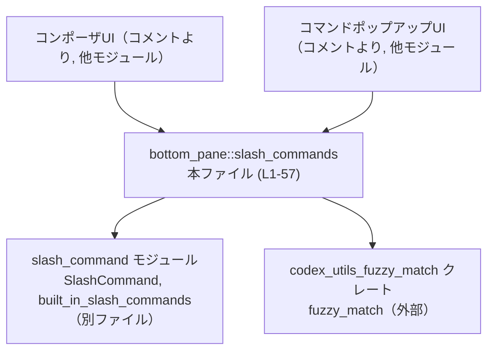
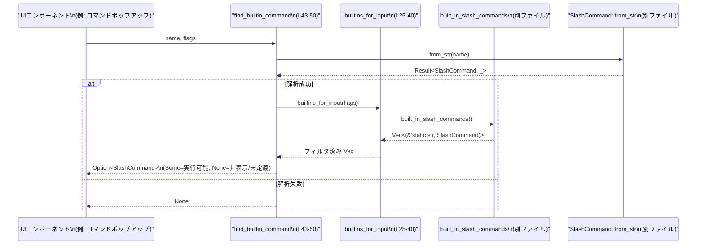

# tui/src/bottom_pane/slash_commands.rs コード解説

## 0. ざっくり一言

- 組み込みスラッシュコマンド群に対して、「どの機能が有効か」「どのコマンドを見せるか／使わせるか」を一元的に判定し、名前・プレフィックスからコマンドを解決するヘルパー群のモジュールです（`tui/src/bottom_pane/slash_commands.rs:L1-5, L25-57`）。

---

## 1. このモジュールの役割

### 1.1 概要

- このモジュールは、**組み込みスラッシュコマンドの一覧**に対して、**機能フラグに基づくゲーティング（表示／非表示の制御）**と、**名前／プレフィックスからのコマンド検索**を提供します（`L13-23, L25-57`）。
- composer と command popup という 2 つの呼び出し元で同じゲーティングルールを使うために、ロジックをここに集約していることがコメントから分かります（`L1-5`）。

### 1.2 アーキテクチャ内での位置づけ

- 依存関係としてこのモジュールは:
  - `crate::slash_command` モジュールの `SlashCommand` 型と `built_in_slash_commands` 関数に依存します（`L10-11, L25-27`）。
  - 外部クレート `codex_utils_fuzzy_match` の `fuzzy_match` 関数に依存します（`L8, L53-57`）。
- モジュールコメントから、このヘルパーは **composer** と **command popup**（具体的なモジュールパスはこのチャンクには現れません）が利用することが分かります（`L1-5`）。



### 1.3 設計上のポイント

- **ゲーティング条件の集中管理**  
  - どのコマンドを表示／使用可能とするかは、`BuiltinCommandFlags` と `builtins_for_input` の filter チェーンに集約されています（`L13-23, L25-40`）。
  - 検索系の関数（`find_builtin_command`, `has_builtin_prefix`）は必ず `builtins_for_input` を使い、同じゲーティングルールを共有します（`L44-50, L53-57`）。
- **状態を持たない純粋関数的な構造**  
  - このファイル内で定義されている関数は、いずれも引数のみを入力とし、グローバルな可変状態を書き換えていません（`L25-57`）。  
    （`built_in_slash_commands` の内部実装はこのチャンクには現れないため、その内部での状態管理は不明です。）
- **エラーハンドリング方針**  
  - 名前 → コマンドの変換に `SlashCommand::from_str` を用い、その失敗は `Option::None` として扱います（`L44-46`）。
  - パニックを起こすような `unwrap` などは使われておらず、すべてが戻り値（`Option` / `bool`）で安全に表現されています（`L25-57`）。
- **スレッド安全性（このファイルの範囲で観察できる範囲）**  
  - ここで定義される関数はすべて引数から結果を計算するだけで、`unsafe` や同期プリミティブは使っていません（`L13-57`）。
  - 従って、このファイル内のロジックに限れば、同じ `BuiltinCommandFlags` を複数スレッドから同時に使ってもデータ競合を起こす要素は見当たりません。

---

## 2. 主要な機能一覧（コンポーネントインベントリー）

### 2.1 ランタイムコンポーネント

| 名前 | 種別 | 役割 / 説明 | 定義位置 |
|------|------|-------------|----------|
| `BuiltinCommandFlags` | 構造体 | 組み込みスラッシュコマンドの表示・利用可否を制御するブーリアンフラグの集合 | `tui/src/bottom_pane/slash_commands.rs:L13-23` |
| `builtins_for_input` | 関数 | `BuiltinCommandFlags` に基づいて、現在有効な組み込みコマンドの一覧を返す | `L25-40` |
| `find_builtin_command` | 関数 | 文字列名を `SlashCommand` にパースし、ゲーティング条件を満たす場合のみ `Some` として返す | `L43-50` |
| `has_builtin_prefix` | 関数 | ゲーティング後のコマンド名に対して、与えられた文字列が曖昧マッチするものがあるか判定する | `L52-57` |

### 2.2 テスト用コンポーネント

| 名前 | 種別 | 役割 / 説明 | 定義位置 |
|------|------|-------------|----------|
| `all_enabled_flags` | 関数 | すべての機能フラグを `true` にした `BuiltinCommandFlags` を返すテスト用ヘルパー | `L64-75` |
| `debug_command_still_resolves_for_dispatch` | テスト関数 | `"debug-config"` が `SlashCommand::DebugConfig` に解決されることを検証 | `L77-81` |
| `clear_command_resolves_for_dispatch` | テスト関数 | `"clear"` が `SlashCommand::Clear` に解決されることを検証 | `L83-88` |
| `stop_command_resolves_for_dispatch` | テスト関数 | `"stop"` が `SlashCommand::Stop` に解決されることを検証 | `L91-97` |
| `clean_command_alias_resolves_for_dispatch` | テスト関数 | `"clean"` という名前が `SlashCommand::Stop`（エイリアス）に解決されることを検証 | `L99-105` |
| `fast_command_is_hidden_when_disabled` | テスト関数 | `fast_command_enabled = false` のとき `"fast"` が見えなくなることを検証 | `L107-112` |
| `realtime_command_is_hidden_when_realtime_is_disabled` | テスト関数 | `realtime_conversation_enabled = false` のとき `"realtime"` が見えなくなることを検証 | `L114-119` |
| `settings_command_is_hidden_when_realtime_is_disabled` | テスト関数 | `realtime` と `audio_device_selection` を共に無効にしたとき `"settings"` が見えなくなることを検証 | `L121-127` |
| `settings_command_is_hidden_when_audio_device_selection_is_disabled` | テスト関数 | `audio_device_selection_enabled = false` のとき `"settings"` が見えなくなることを検証 | `L129-134` |

---

## 3. 公開 API と詳細解説

### 3.1 型一覧（構造体）

| 名前 | 種別 | 役割 / 用途 | 主なフィールド | 定義位置 |
|------|------|-------------|----------------|----------|
| `BuiltinCommandFlags` | 構造体（`Clone`, `Copy`, `Debug`, `Default` 派生） | 各種機能の有効／無効を示すフラグをまとめ、組み込みスラッシュコマンドのゲーティングに使用する | `collaboration_modes_enabled`, `connectors_enabled`, `plugins_command_enabled`, `fast_command_enabled`, `personality_command_enabled`, `realtime_conversation_enabled`, `audio_device_selection_enabled`, `allow_elevate_sandbox`（すべて `bool`） | `L13-23` |

- 各フィールドは `pub(crate)` であり、同一クレート内から直接設定できます（`L14-22`）。
- `Default` が実装されているので、`BuiltinCommandFlags::default()` で全フィールドが `false` のインスタンスを作成できます（`L13`）。

### 3.2 関数詳細

#### `builtins_for_input(flags: BuiltinCommandFlags) -> Vec<(&'static str, SlashCommand)>`（L25-40）

**概要**

- 全ての組み込みスラッシュコマンド（`built_in_slash_commands()`）から始めて、`flags` に基づいて使用可能なコマンドだけをフィルタリングし、`(コマンド名, SlashCommand)` のリストを返します（`L25-40`）。

**引数**

| 引数名 | 型 | 説明 |
|--------|----|------|
| `flags` | `BuiltinCommandFlags` | 各種コマンドカテゴリの有効・無効を表すフラグ集（`L13-23`） |

**戻り値**

- `Vec<(&'static str, SlashCommand)>`  
  - 各要素は `(name, command)` というタプルで、`name` は `'static` な文字列スライス、`command` は `SlashCommand` 列挙体です（`L25-27, L29-39`）。
  - ゲーティング条件を満たすコマンドのみが含まれます。

**内部処理の流れ**

1. `built_in_slash_commands()` を呼び出して、全組み込みコマンドのベクタを取得します（`L27`）。
2. `into_iter()` で所有権付きイテレータに変換します（`L28`）。
3. 以下の順に `.filter` を重ねて、条件に応じてコマンドを除外します（`L29-39`）:
   - `allow_elevate_sandbox` が `false` の場合、`SlashCommand::ElevateSandbox` を除外（`L29`）。
   - `collaboration_modes_enabled` が `false` の場合、`SlashCommand::Collab` と `SlashCommand::Plan` を除外（`L31-33`）。
   - `connectors_enabled` が `false` の場合、`SlashCommand::Apps` を除外（`L34`）。
   - `plugins_command_enabled` が `false` の場合、`SlashCommand::Plugins` を除外（`L35`）。
   - `fast_command_enabled` が `false` の場合、`SlashCommand::Fast` を除外（`L36`）。
   - `personality_command_enabled` が `false` の場合、`SlashCommand::Personality` を除外（`L37`）。
   - `realtime_conversation_enabled` が `false` の場合、`SlashCommand::Realtime` を除外（`L38`）。
   - `audio_device_selection_enabled` が `false` の場合、`SlashCommand::Settings` を除外（`L39`）。
4. 最後に `.collect()` して `Vec<(&'static str, SlashCommand)>` にして返します（`L40`）。

**Examples（使用例）**

以下は、このモジュールが `crate::bottom_pane::slash_commands` として利用できる構成を想定した例です（実際のモジュールパスはプロジェクト構成に依存します）。

```rust
use crate::bottom_pane::slash_commands::{BuiltinCommandFlags, builtins_for_input}; // 同一クレート内から利用する想定

fn list_visible_commands() {
    // すべての機能を有効にしたフラグを作る
    let flags = BuiltinCommandFlags {
        collaboration_modes_enabled: true,        // コラボ系コマンドを有効
        connectors_enabled: true,                 // コネクタ系コマンドを有効
        plugins_command_enabled: true,            // /plugins コマンドを有効
        fast_command_enabled: true,               // /fast コマンドを有効
        personality_command_enabled: true,        // /personality コマンドを有効
        realtime_conversation_enabled: true,      // /realtime コマンドを有効
        audio_device_selection_enabled: true,     // /settings コマンドを有効
        allow_elevate_sandbox: false,             // /elevate-sandbox は非表示にする
    };

    // 現在有効なすべての組み込みコマンドを取得
    let commands = builtins_for_input(flags);     // Vec<(&'static str, SlashCommand)> を取得

    // UI などに名前と種別を表示する例
    for (name, cmd) in &commands {
        println!("command: {name}, variant: {:?}", cmd);
    }
}
```

**Errors / Panics**

- この関数本体には `?` 演算子や `unwrap` などは使われておらず、明示的なエラーも返していません（`L25-40`）。
- したがって、この関数自身が直接 `panic!` を起こすコードは含まれていません。  
  `built_in_slash_commands` の内部実装はこのチャンクには現れないため、そちらでのエラー／panic の可能性は不明です。

**Edge cases（エッジケース）**

- `flags` のすべてのフィールドが `false` の場合  
  → フィルタ条件に出てこないコマンド（例: テストで確認されている `DebugConfig`, `Clear`, `Stop` など）はそのまま残り、対象のフラグに紐づくコマンドのみが除外されます（`L31-39, L77-105`）。
- `built_in_slash_commands()` が空のベクタを返す場合  
  → filter 前に要素がないため、結果も空の `Vec` が返ります（`L27-40`）。
- 新しい `SlashCommand` バリアントが追加されても、ここに filter 条件を追加しない限りは常に表示されます。

**使用上の注意点**

- 新しい機能フラグや新コマンドのゲーティングを追加するときは、`BuiltinCommandFlags` のフィールド追加とともに、この filter チェーンに条件を足す必要があります（`L13-23, L29-39`）。
- UI から見えるコマンド一覧を作る場合は、個別に条件分岐を書くのではなく、この関数の結果を使うことで composer と command popup の表示を同期させる意図がコメントから読み取れます（`L1-5, L25-40`）。
- 毎回 `Vec` を生成し全コマンドを filter するため、呼び出しコストは組み込みコマンド数に線形に比例します。組み込みコマンドが極端に増えた場合はキャッシュなどを検討する余地がありますが、コマンド数自体はこのチャンクからは不明です。

---

#### `find_builtin_command(name: &str, flags: BuiltinCommandFlags) -> Option<SlashCommand>`（L43-50）

**概要**

- 文字列 `name` を `SlashCommand` にパースし、そのコマンドが現在のフラグで「見える」状態であれば `Some(SlashCommand)` を返し、そうでなければ `None` を返します（`L43-50`）。

**引数**

| 引数名 | 型 | 説明 |
|--------|----|------|
| `name` | `&str` | コマンド名文字列。`SlashCommand::from_str` が解釈する形式である必要があります（`L44-46`）。 |
| `flags` | `BuiltinCommandFlags` | ゲーティングに使用する各種フラグ集（`L44`）。 |

**戻り値**

- `Option<SlashCommand>`  
  - `Some(cmd)` : `name` が `SlashCommand` にパース可能で、かつ `builtins_for_input(flags)` の中にその `cmd` が含まれている場合（`L45-49`）。
  - `None` : `name` が未知のコマンド名（`from_str` が失敗）か、またはフラグにより非表示にされているコマンドの場合（`L45-49`）。

**内部処理の流れ**

1. `SlashCommand::from_str(name)` を呼び出し、結果を `cmd` に格納しようとします（`L45`）。
2. `ok()?` により、`Result<SlashCommand, _>` を `Option<SlashCommand>` に変換し、エラーの場合は早期に `None` を返します（`L45`）。
3. `builtins_for_input(flags)` で現在有効なコマンド一覧を取得します（`L46`）。
4. その一覧の中に `cmd` と等しい `SlashCommand` が存在するか `any(|(_, visible_cmd)| visible_cmd == cmd)` で調べます（`L47-48`）。
5. `any` が `true` の場合に限り `.then_some(cmd)` により `Some(cmd)` を返し、そうでなければ `None` を返します（`L49`）。

**Examples（使用例）**

テストで使われているパターンを簡略化します（`L64-75, L77-105`）。

```rust
use crate::bottom_pane::slash_commands::{BuiltinCommandFlags, find_builtin_command};

fn all_enabled_flags() -> BuiltinCommandFlags {
    // 本ファイルのテストと同じく、全フラグ true のヘルパー（L64-75）
    BuiltinCommandFlags {
        collaboration_modes_enabled: true,
        connectors_enabled: true,
        plugins_command_enabled: true,
        fast_command_enabled: true,
        personality_command_enabled: true,
        realtime_conversation_enabled: true,
        audio_device_selection_enabled: true,
        allow_elevate_sandbox: true,
    }
}

fn example() {
    let flags = all_enabled_flags();

    // 正常に解決される例: "clear" → SlashCommand::Clear（L83-88）
    if let Some(cmd) = find_builtin_command("clear", flags) {
        println!("resolved command: {:?}", cmd);
    }

    // エイリアスの例: "clean" → SlashCommand::Stop（L99-105）
    if let Some(cmd) = find_builtin_command("clean", flags) {
        println!("alias resolved to: {:?}", cmd); // ここでは Stop になるテストがあります
    }

    // 無効化フラグを試す例: fast を無効にする（L107-112）
    let mut flags2 = flags;
    flags2.fast_command_enabled = false;
    assert!(find_builtin_command("fast", flags2).is_none());
}
```

**Errors / Panics**

- `SlashCommand::from_str(name)` が `Err` を返した場合、`ok()?` により自動的に `None` が返ります（`L45`）。
- この関数自体は `panic` を起こすコードを含んでおらず、`Result` や `panic!` は使っていません（`L43-50`）。
- `SlashCommand::from_str` の詳細な挙動（大文字・小文字の扱いなど）は、このチャンクには現れません。

**Edge cases（エッジケース）**

- 未知のコマンド名  
  → `SlashCommand::from_str` が失敗し、`None` を返します（`L45`）。
- 有効なコマンドだがフラグで無効化されている場合  
  → `builtins_for_input(flags)` には含まれないため `any` が `false` となり、`None` を返します。  
    テストでは、`fast_command_enabled = false` のとき `"fast"` が `None` になることが確認されています（`L107-112`）。
- エイリアス  
  → `"clean"` が `SlashCommand::Stop` に解決されるテストから、`SlashCommand::from_str` がエイリアス文字列を本体のバリアントにマッピングしていることが分かります（`L99-105`）。  
    ゲーティングは `SlashCommand` バリアントに対して行われるため、エイリアスも本体と同じ扱いになります。

**使用上の注意点**

- コマンドの実行側で直接 `SlashCommand::from_str` を使うのではなく、この関数を経由することで「現在のフラグで実際に許可されるか」まで含めてチェックできます（`L43-50`）。
- `None` の意味は「**不明なコマンド名**または**現状無効化されているコマンド**」であり、両者を区別する情報はこの関数の戻り値には含まれません。その区別が必要な場合は、別途ロジックを追加する必要があります。
- セキュリティ的に重要なコマンド（例: `ElevateSandbox`）の許可・不許可もこのルートに依存するため、`flags.allow_elevate_sandbox` の管理は慎重に行う必要があります（`L29`）。ただし `ElevateSandbox` の具体的な動作はこのチャンクには現れません。

---

#### `has_builtin_prefix(name: &str, flags: BuiltinCommandFlags) -> bool`（L52-57）

**概要**

- 現在のフラグで「見えている」組み込みコマンド名の中に、文字列 `name` と曖昧マッチするものが少なくとも 1 つ存在するかを `bool` で返します（`L52-57`）。

**引数**

| 引数名 | 型 | 説明 |
|--------|----|------|
| `name` | `&str` | 入力中のプレフィックスやクエリ文字列を想定した名前（`L52-56`）。 |
| `flags` | `BuiltinCommandFlags` | ゲーティングに用いる各種フラグ集（`L52-56`）。 |

**戻り値**

- `bool`  
  - `true`: `builtins_for_input(flags)` が返すいずれかのコマンド名と `fuzzy_match` が `Some(..)` を返した場合（`L53-57`）。
  - `false`: いずれのコマンド名でも `fuzzy_match` が `None` を返した場合。

**内部処理の流れ**

1. `builtins_for_input(flags)` を呼び、現在有効なコマンド名と `SlashCommand` の一覧を取得します（`L53`）。
2. `.into_iter()` でイテレータに変換します（`L54`）。
3. 各要素に対し `fuzzy_match(command_name, name)` を呼び出し、その結果が `Some(..)` であるかどうかを `any` で調べます（`L55-56`）。
4. ひとつでも `Some(..)` があれば `true`、そうでなければ `false` を返します（`L55-57`）。

**Examples（使用例）**

```rust
use crate::bottom_pane::slash_commands::{BuiltinCommandFlags, has_builtin_prefix};

fn has_any_matching_builtin(input: &str) -> bool {
    let flags = BuiltinCommandFlags {
        collaboration_modes_enabled: true,
        connectors_enabled: true,
        plugins_command_enabled: true,
        fast_command_enabled: true,
        personality_command_enabled: true,
        realtime_conversation_enabled: true,
        audio_device_selection_enabled: true,
        allow_elevate_sandbox: false,
    };

    // 入力文字列に「曖昧に」合致するビルトインがあるかをチェック（L52-57）
    has_builtin_prefix(input, flags)
}
```

**Errors / Panics**

- `builtins_for_input` と同様に、`panic!` や `Result` を用いたエラー伝播はなく、戻り値 `bool` のみで表現されています（`L52-57`）。
- `fuzzy_match` の内部実装（スコアリングや大文字小文字の扱い）はこのチャンクには現れませんが、戻り値が `Option<_>` であることと、`Some(..)` を「マッチあり」として扱っていることはコードから分かります（`L55-56`）。

**Edge cases（エッジケース）**

- `name` が空文字列のときの挙動  
  → `fuzzy_match` の仕様に依存します。このチャンクにはその仕様が現れないため、空文字に対して `Some(..)` が返るかどうかは不明です（`L55-56`）。
- `flags` ですべてのコマンドが非表示になっている場合  
  → `builtins_for_input(flags)` が空になり、`any` が即座に `false` を返します（`L25-40, L53-57`）。
- 特定のカテゴリのコマンドを無効化すると、それらはそもそも `fuzzy_match` の対象になりません（`L29-39, L53-57`）。

**使用上の注意点**

- この関数はあくまで「マッチが存在するか」だけを返し、**どのコマンドがマッチしたか** は返しません。候補リストが必要な場合は、別途 `builtins_for_input` の結果を `fuzzy_match` でフィルタする必要があります。
- 入力に対するリアルタイムサジェストなどで頻繁に呼び出す場合、`builtins_for_input` の再計算コストがボトルネックになる可能性があります。必要であれば、フラグが変わらない間はコマンド一覧をキャッシュするなどの工夫が考えられます。

---

### 3.3 その他の関数（テスト・ヘルパー）

| 関数名 | 役割（1 行） | 定義位置 |
|--------|--------------|----------|
| `all_enabled_flags` | すべてのフラグを `true` に設定した `BuiltinCommandFlags` を返すテスト用ヘルパー | `L64-75` |
| `debug_command_still_resolves_for_dispatch` | `"debug-config"` が `DebugConfig` に解決されることを確認 | `L77-81` |
| `clear_command_resolves_for_dispatch` | `"clear"` が `Clear` に解決されることを確認 | `L83-88` |
| `stop_command_resolves_for_dispatch` | `"stop"` が `Stop` に解決されることを確認 | `L91-97` |
| `clean_command_alias_resolves_for_dispatch` | `"clean"` というエイリアスが `Stop` に解決されることを確認 | `L99-105` |
| `fast_command_is_hidden_when_disabled` | `fast_command_enabled = false` のとき `"fast"` が非表示になることを確認 | `L107-112` |
| `realtime_command_is_hidden_when_realtime_is_disabled` | `realtime_conversation_enabled = false` のとき `"realtime"` が非表示になることを確認 | `L114-119` |
| `settings_command_is_hidden_when_realtime_is_disabled` | `realtime` と `audio_device_selection` を無効にすると `"settings"` が非表示になることを確認 | `L121-127` |
| `settings_command_is_hidden_when_audio_device_selection_is_disabled` | `audio_device_selection_enabled = false` のとき `"settings"` が非表示になることを確認 | `L129-134` |

---

## 4. データフロー

ここでは、「ユーザーが入力したスラッシュコマンド文字列から、実際に実行可能な `SlashCommand` を解決する」流れを例に、データフローを説明します。

1. UI（composer や command popup）が、ユーザー入力を文字列 `name` として `find_builtin_command(name, flags)` に渡します（コメントより、`L1-5, L43-50`）。
2. `find_builtin_command` は `SlashCommand::from_str(name)` により、文字列を `SlashCommand` に変換しようとします（`L45`）。
3. パースに成功した場合のみ、`builtins_for_input(flags)` を呼び出して現在有効なコマンド一覧を取得します（`L46, L25-40`）。
4. 一覧中にその `SlashCommand` が存在するか確認し、存在すれば `Some(cmd)`、存在しなければ `None` を返します（`L47-49`）。
5. UI 側は `Some` であればそのコマンドを実行、`None` であればエラー表示や候補提示などを行うことが想定されます（UI 側の実装はこのチャンクには現れません）。



- `has_builtin_prefix` は同様に `builtins_for_input` の結果をもとに `fuzzy_match` をかけるだけであり、外部から見たデータフローは類似しています（`L52-57`）。

---

## 5. 使い方（How to Use）

### 5.1 基本的な使用方法

典型的なフローは、「フラグを構築 → 表示すべきコマンド一覧を作成 → 入力されたコマンドを解決」です。

```rust
use crate::bottom_pane::slash_commands::{
    BuiltinCommandFlags, builtins_for_input, find_builtin_command, has_builtin_prefix,
}; // 本ファイルの関数を利用（L13-23, L25-57）

fn handle_slash_input(input: &str) {
    // アプリケーション状態から、適切なフラグを構築する例
    let flags = BuiltinCommandFlags {
        collaboration_modes_enabled: true,
        connectors_enabled: true,
        plugins_command_enabled: true,
        fast_command_enabled: false,              // /fast は無効化したいケース
        personality_command_enabled: true,
        realtime_conversation_enabled: false,
        audio_device_selection_enabled: false,
        allow_elevate_sandbox: false,
    };

    // 1. 現在有効なコマンド一覧を取得（L25-40）
    let visible_commands = builtins_for_input(flags);

    // 2. コマンド名から実行可能な SlashCommand を解決（L43-50）
    if let Some(cmd) = find_builtin_command(input, flags) {
        println!("Executing command: {:?}", cmd);
        // ここで cmd に応じた処理を行う（実装はこのチャンクには現れません）
    } else {
        println!("Unknown or disabled slash command: {input}");
    }

    // 3. プレフィックスとして何かマッチするかだけ確認したいケース（L52-57）
    if has_builtin_prefix(input, flags) {
        println!("There exists at least one matching builtin command");
    }
}
```

### 5.2 よくある使用パターン

- **UI の候補一覧表示用**  
  - `builtins_for_input(flags)` の結果から `(name, SlashCommand)` を元にリスト表示を行う。
  - ユーザーが入力を変更するたびに、このリストを `fuzzy_match` などで絞り込む。
- **実行時のバリデーション／ディスパッチ用**  
  - 実行直前に `find_builtin_command(input, flags)` を呼び、`Some(cmd)` の場合のみディスパッチすることで、UI 表示と実際の実行条件を一致させる。
- **存在確認のみに用いる軽量なチェック**  
  - 「候補は表示しないが、入力が既存コマンドにマッチしそうか」をチェックする用途で `has_builtin_prefix` を使う。

### 5.3 よくある間違い（起こりうる誤用）

このモジュールの意図（コメント, `L1-5`）から考えられる誤用例と、その是正例です。

```rust
// 誤り例: SlashCommand::from_str を直接呼び出し、フラグを無視している
// これでは UI で非表示としているコマンドも実行されてしまう可能性がある
// let cmd = SlashCommand::from_str(input).unwrap();
// dispatch(cmd);

// 正しい例: 必ず find_builtin_command を経由して、フラグに応じた許可状態を確認する（L43-50）
if let Some(cmd) = find_builtin_command(input, flags) {
    // flags によるゲーティングを満たしているので実行してよい
    dispatch(cmd);
} else {
    // 未定義または無効化されたコマンド
}
```

### 5.4 使用上の注意点（まとめ）

- **フラグの意味合い**  
  - 各ブーリアンは特定カテゴリのコマンドをまとめて制御します（`L29-39`）。例:
    - `fast_command_enabled`: `SlashCommand::Fast` の表示／非表示（`L36, L107-112`）。
    - `realtime_conversation_enabled`: `SlashCommand::Realtime` の表示／非表示（`L38, L114-119`）。
    - `audio_device_selection_enabled`: `SlashCommand::Settings` の表示／非表示（`L39, L121-134`）。
    - `allow_elevate_sandbox`: `SlashCommand::ElevateSandbox` の表示／非表示（`L29`）。
- **セキュリティ的な注意（このチャンクから読み取れる範囲）**  
  - `ElevateSandbox` という名前のコマンドのみ `allow_elevate_sandbox` で特別扱いされており（`L29`）、サンドボックス関連の重要な権限を持つ可能性があります。  
    このフラグはデフォルト `false`（`Default` 実装とフィールド定義から推測できますが、`Default` の具体的な初期値はこのチャンクには明示されていません）で運用し、必要な場面でのみ `true` にすべき設計意図が想定されます。
- **パフォーマンス面**  
  - `builtins_for_input` は呼び出し毎にベクタを生成し、コマンド数に比例した filter を行います（`L25-40`）。  
    組み込みコマンドの数が増えすぎると、頻繁な呼び出しで負荷となりうる点に留意が必要です。
- **観測性（ロギングなど）**  
  - このモジュール内にはログ出力やメトリクス送信はなく、挙動の検証は主にテストで行われています（`L59-134`）。  
    実運用で問題が発生した際には、呼び出し側でログを追加する必要があります。

---

## 6. 変更の仕方（How to Modify）

### 6.1 新しい機能を追加する場合（新しいゲーティングフラグ／コマンド）

1. **新しいフラグフィールドを追加**  
   - 例: 新しいコマンドカテゴリ `Foo` を制御する場合、`BuiltinCommandFlags` に `pub(crate) foo_command_enabled: bool,` を追加します（`L13-23` に倣う）。
2. **filter チェーンに条件を追加**  
   - `builtins_for_input` に `foo_command_enabled` と `SlashCommand::Foo` の対応を表す `filter` を追加します（`L29-39` のパターンを踏襲）。
3. **テストを追加／更新**  
   - `tests` モジュール内に、既存のテストと同様のスタイルで「フラグを false にしたときにコマンドが見えなくなる」テストを追加します（`L107-134` を参考）。
4. **UI 側での利用確認**  
   - composer や command popup など、呼び出し側が `BuiltinCommandFlags` をどう設定しているかを確認し、新しいフラグを適切に設定するように変更します（呼び出し側のコードはこのチャンクには現れません）。

### 6.2 既存の機能を変更する場合

- **ゲーティング条件の変更**
  - 例: `Settings` を `realtime_conversation_enabled` でも制御したい、などの場合:
    - `builtins_for_input` の filter 条件を変更し、誤って他のコマンドが影響を受けないよう注意します（`L29-39`）。
    - 関連テスト（`settings_command_is_hidden_when_*`）が期待通りかを確認・更新します（`L121-134`）。
- **SlashCommand 名やエイリアスの変更**
  - `SlashCommand::from_str` と `built_in_slash_commands` の実装が別ファイルのため、そちらの変更が必要です。
  - 変更後は、`find_builtin_command` のテスト（`L77-105`）を更新し、名前／エイリアスが正しく解決されることを確認します。
- **契約（コントラクト）の維持**
  - `find_builtin_command` の「`Some` であれば現在のフラグで可視かつ有効」という契約を崩さないようにする必要があります（`L43-50`）。
  - 同じく、`has_builtin_prefix` は「現在可視なコマンドに対する曖昧マッチ」である点を維持することが重要です（`L52-57`）。

---

## 7. 関連ファイル

このモジュールと密接に関係するコンポーネント（このチャンクから分かる範囲）は次のとおりです。

| パス / クレート | 役割 / 関係 |
|-----------------|------------|
| `crate::slash_command`（具体的なファイルは `slash_command.rs` または `slash_command/mod.rs` が想定されますが、このチャンクには現れません） | `SlashCommand` 列挙体と `built_in_slash_commands()` を提供し、本モジュールのコアデータソースになっています（`L10-11, L25-27`）。 |
| `codex_utils_fuzzy_match` クレート | `fuzzy_match` 関数により、コマンド名と入力文字列の曖昧マッチングを提供します（`L8, L53-57`）。 |
| `pretty_assertions` クレート | テストにおける `assert_eq!` の改善された出力を提供し、テスト失敗時のデバッグに利用されています（`L62`）。 |
| `tui/src/bottom_pane/slash_commands.rs` 内 `mod tests` | このモジュールの振る舞い（パースとゲーティング）が仕様通りであることを確認する単体テストを含みます（`L59-134`）。 |
| composer / command popup 関連モジュール（モジュールパスはこのチャンクには現れません） | モジュールコメントから、このヘルパーを利用してスラッシュコマンドの表示と解決を行う呼び出し元であることが分かります（`L1-5`）。 |

このチャンクに現れないファイルの詳細実装（特に `SlashCommand`, `built_in_slash_commands`, `fuzzy_match`）に依存する挙動については、該当ファイル／クレートを参照する必要があります。
