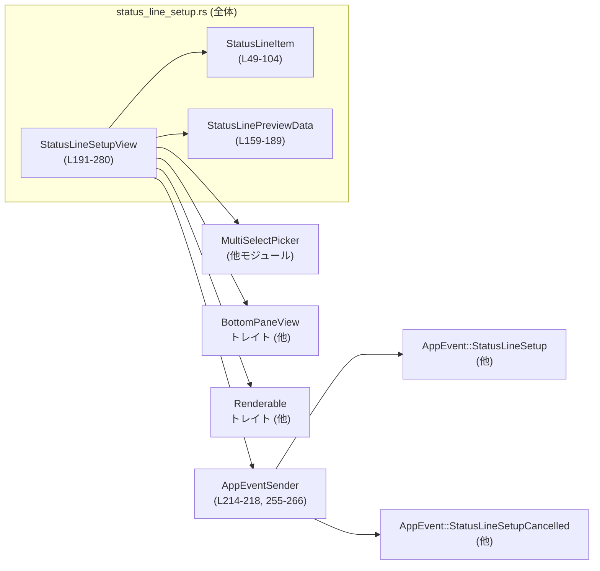

tui/src/bottom_pane/status_line_setup.rs コード解説
---

## 0. ざっくり一言

TUI 画面下部のステータスラインに「何を・どの順番で」表示するかを設定するための、インタラクティブな設定ビューと、そのプレビュー用データ構造を提供するモジュールです（`tui/src/bottom_pane/status_line_setup.rs:L1-18`）。

---

## 1. このモジュールの役割

### 1.1 概要

- このモジュールは **ステータスラインの構成（項目の選択と順序）をユーザーが対話的に変更する問題** を解決するために存在し、以下の機能を提供します。
  - ステータスラインに表示可能な項目の列挙（`StatusLineItem`）（`L49-104`）
  - ランタイム情報を使ったプレビュー生成（`StatusLinePreviewData`）（`L159-189`）
  - マルチセレクト UI を用いた設定画面ビュー（`StatusLineSetupView`）（`L191-280`）
  - 設定確定/キャンセル時の `AppEvent` 送出（`L255-266`）

### 1.2 アーキテクチャ内での位置づけ

このモジュールは、既存の UI インフラ（`MultiSelectPicker`, `BottomPaneView`, `Renderable`）の上に「ステータスライン設定」という用途特化のビューを構築するアダプタのような位置づけです。



- `StatusLineSetupView` は `BottomPaneView` と `Renderable` を実装し、下部ペインの 1 つとして扱われます（`L282-305`）。
- 実際の入力処理・描画処理は `MultiSelectPicker` に委譲されます（`L199-201`, `L283-285`, `L298-304`）。
- 確定/キャンセル時には `AppEventSender` 経由で `AppEvent` が発火され、他コンポーネントに設定変更が伝達されます（`L255-266`）。

### 1.3 設計上のポイント

- **列挙体による項目 ID の型安全な管理**  
  - `StatusLineItem` は `EnumIter`, `EnumString`, `Display` を派生しており、文字列 ID ↔ enum 変換を型安全に行います（`L47-48`）。
  - 文字列は kebab-case に統一され、設定ファイル等と整合します（`L48`）。

- **プレビューの純粋関数化**  
  - `StatusLinePreviewData::line_for_items` は副作用を持たず、与えられたアイテム一覧と保持中の値から `Line` を生成するだけの純粋関数です（`L175-188`）。

- **UI 部品のラップとイベントフック**  
  - `MultiSelectPicker` の builder パターンに対し、ステータスライン用の文言／項目／プレビュー・コールバック／確定・キャンセルハンドラを差し込んでいます（`L244-267`）。

- **エラー安全性を優先したパース処理**  
  - 文字列 ID → `StatusLineItem` 変換で失敗した場合は項目を無視する、もしくは空のリストにフォールバックする設計になっています（`L224-226`, `L257-262`）。

- **並行性との関わり**  
  - イベント送信には `AppEventSender` が使われ、テストでは `tokio::sync::mpsc::unbounded_channel` を用いていますが、このモジュール内ではスレッド生成・非同期処理の開始などは行っていません（`L315`, `L417-434`）。

---

## 2. 主要な機能一覧

- ステータスライン項目の定義: `StatusLineItem` で表示可能な項目を列挙（`L49-104`）
- 項目の説明テキスト提供: `StatusLineItem::description` で UI 上に表示する説明を返す（`L106-137`）
- 選択可能な項目集合: `SELECTABLE_STATUS_LINE_ITEMS` で UI に出す候補一覧を定義（`L140-157`）
- プレビュー用データ構造: `StatusLinePreviewData` が `StatusLineItem` → 表示文字列のマップを保持（`L159-163`）
- プレビュー行生成: `StatusLinePreviewData::line_for_items` が現在の選択と値から 1 行の `Line` を生成（`L175-188`）
- ステータスライン設定 UI の構築: `StatusLineSetupView::new` が初期選択・プレビュー・イベント連携込みでビューを生成（`L214-269`）
- 下部ペインインターフェース実装: `BottomPaneView` / `Renderable` を実装して下部ペインとして利用可能にする（`L282-305`）
- 動作検証テスト: 文字列 ID の互換性、プレビュー表示、スナップショットテストで挙動を検証（`L319-437`）

---

## 3. 公開 API と詳細解説

### 3.1 型一覧（構造体・列挙体など）

| 名前 | 種別 | 役割 / 用途 | 定義位置 |
|------|------|-------------|----------|
| `StatusLineItem` | 列挙体 | ステータスラインに表示可能な項目の種類（モデル名、Git ブランチなど）を表す ID | `tui/src/bottom_pane/status_line_setup.rs:L49-104` |
| `StatusLinePreviewData` | 構造体 | 各 `StatusLineItem` に対するランタイムの表示文字列を保持し、プレビュー行を生成する | `tui/src/bottom_pane/status_line_setup.rs:L159-163` |
| `StatusLineSetupView` | 構造体 | ステータスライン項目の選択・並べ替え・プレビューを行う設定ビュー。内部で `MultiSelectPicker` を保持 | `tui/src/bottom_pane/status_line_setup.rs:L191-201` |

#### 列挙値一覧: `StatusLineItem`

| Variant | 説明（description の内容を要約） | 根拠 |
|---------|----------------------------------|------|
| `ModelName` | 現在のモデル名 | `L50-51`, `L110` |
| `ModelWithReasoning` | モデル名 + 推論レベル | `L53-54`, `L111` |
| `CurrentDir` | カレントディレクトリ | `L56-57`, `L112` |
| `ProjectRoot` | プロジェクトルート（なければ省略） | `L59-60`, `L113` |
| `GitBranch` | 現在の Git ブランチ（なければ省略） | `L62-63`, `L114` |
| `ContextUsage` | コンテキストウィンドウ使用量のメーター（不明な場合は省略）＋ legacy ID を受け入れ | `L65-73`, `L115-117` |
| `FiveHourLimit` | 5 時間制限の残り使用量（なければ省略） | `L75-76`, `L118-120` |
| `WeeklyLimit` | 週次制限の残り使用量（なければ省略） | `L78-79`, `L121-123` |
| `CodexVersion` | アプリケーションバージョン | `L81-82`, `L124` |
| `ContextWindowSize` | コンテキストウィンドウの総トークン数（不明なら省略） | `L84-85`, `L125-127` |
| `UsedTokens` | セッションで使用した総トークン数（0 なら省略） | `L87-88`, `L128` |
| `TotalInputTokens` | セッションで消費した入力トークン総数 | `L90-91`, `L129` |
| `TotalOutputTokens` | セッションで生成した出力トークン総数 | `L93-94`, `L130` |
| `SessionId` | セッション ID（開始前は省略） | `L96-97`, `L131-133` |
| `FastMode` | Fast モードが有効かどうか | `L99-100`, `L134` |
| `ThreadTitle` | ユーザーが変更したスレッドタイトル（変更されていない場合は省略） | `L102-103`, `L135` |

### 3.2 関数詳細（主要 7 件）

#### `StatusLineItem::description(&self) -> &'static str`

**概要**

- 各ステータスライン項目に対応する、人間向けの説明文（英語）を返します（`tui/src/bottom_pane/status_line_setup.rs:L106-137`）。
- ポップアップ UI 内の説明欄に表示されます（`StatusLineSetupView::status_line_select_item` で利用、`L271-277`）。

**引数**

| 引数名 | 型 | 説明 |
|--------|----|------|
| `&self` | `&StatusLineItem` | 説明を取得したい列挙値 |

**戻り値**

- `&'static str`  
  列挙値に対応する固定の説明文字列です。ライフタイム `'static` なのでヒープ確保は発生しません。

**内部処理の流れ**

1. `match self` で全ての列挙値を網羅的に分岐します（`L109-136`）。
2. 各分岐でリテラルの文字列スライスを返します。

**Examples（使用例）**

```rust
// ステータスライン項目の説明を取得する例
let item = StatusLineItem::GitBranch;                        // Git ブランチ項目を選択
let desc = item.description();                               // 説明文を取得
assert_eq!(desc, "Current Git branch (omitted when unavailable)");
```

**Errors / Panics**

- パニックしません。全ての列挙値を `match` で網羅しているため、未処理分岐もありません（`L109-136`）。

**Edge cases（エッジケース）**

- 特定のエッジケースはありません。列挙値が追加された場合に `match` がコンパイルエラーになるので、説明の書き忘れはコンパイル時に検出されます。

**使用上の注意点**

- 返り値は英語固定です。本モジュールからはローカライズは行われません。
- 返却型が `&'static str` であり、メモリ所有権の心配は不要ですが、呼び出し側で `String` にしたい場合は `.to_string()` でコピーが発生します。

---

#### `StatusLinePreviewData::from_iter<I>(values: I) -> StatusLinePreviewData`

**概要**

- `(StatusLineItem, String)` のイテレータから `StatusLinePreviewData` を構築します（`L166-173`）。
- ランタイムプレビュー用の値（モデル名やディレクトリパスなど）をまとめて登録するためのユーティリティです。

**引数**

| 引数名 | 型 | 説明 |
|--------|----|------|
| `values` | `I` (where `I: IntoIterator<Item = (StatusLineItem, String)>`) | 各ステータスライン項目に対応する表示文字列のペア列 |

**戻り値**

- `StatusLinePreviewData`  
  内部に `BTreeMap<StatusLineItem, String>` を持つ構造体が返されます（`L159-163`, `L171-172`）。

**内部処理の流れ**

1. `values.into_iter()` でイテレータに変換します（`L171`）。
2. `.collect()` により `BTreeMap<StatusLineItem, String>` に収集します（`L171-172`）。
3. そのマップを `values` フィールドに格納した `StatusLinePreviewData` を返します（`L170-172`）。

**Examples（使用例）**

```rust
// プレビュー用のランタイム値を構築する例
let preview_data = StatusLinePreviewData::from_iter([
    (StatusLineItem::ModelName, "gpt-5".to_string()),       // モデル名
    (StatusLineItem::CurrentDir, "/repo".to_string()),      // カレントディレクトリ
]);
```

**Errors / Panics**

- パニックしません。`collect()` はメモリ確保に失敗しない限りエラーを返さないため、この関数シグネチャ上はエラーを返しません。

**Edge cases（エッジケース）**

- 同じ `StatusLineItem` が複数回出現した場合、`BTreeMap` の仕様上、後から挿入された値が保持されます（`collect()` + `BTreeMap` の一般的挙動）。この挙動自体はコードから直接は書かれていませんが、`BTreeMap` の仕様に基づくものです。
- 空のイテレータを渡した場合、`values` が空の `StatusLinePreviewData` が生成され、すべての項目はプレビューに表示されません（`L171-172`）。

**使用上の注意点**

- この関数はプレビュー表示用の値に限定されており、実際のステータスラインの本番表示ロジックとは独立しています。
- 文字列は `String` として所有されるため、大きな文字列を多数登録するとメモリ消費が増加します。

---

#### `StatusLinePreviewData::line_for_items(&self, items: &[MultiSelectItem]) -> Option<Line<'static>>`

**概要**

- 現在の `MultiSelectItem` の一覧と `StatusLinePreviewData` 内の値を用いて、ステータスラインのプレビュー表示用 `Line` を生成します（`L175-188`）。
- 有効 (`enabled == true`) な項目のうち、`values` に存在するものだけを `" · "` 区切りで連結します。

**引数**

| 引数名 | 型 | 説明 |
|--------|----|------|
| `&self` | `&StatusLinePreviewData` | プレビュー用の値マップを保持するインスタンス |
| `items` | `&[MultiSelectItem]` | マルチセレクト UI 上の項目一覧（ID/有効フラグを含む） |

**戻り値**

- `Option<Line<'static>>`  
  - 有効な項目のプレビュー内容が 1 つ以上ある場合は `Some(Line)`（`L185-187`）。
  - すべての有効項目に対応する値が無い場合や、有効項目自体が無い場合は `None`（`L183-184`）。

**内部処理の流れ**

1. `items.iter()` で全項目を走査（`L177`）。
2. `.filter(|item| item.enabled)` で有効な項目だけを残す（`L178`）。
3. `.filter_map(|item| item.id.parse::<StatusLineItem>().ok())`  
   - `MultiSelectItem.id`（文字列）を `StatusLineItem` にパース（`L179`）。
   - 失敗した場合は無視（`ok()`→`Option`）し、プレビューから除外します。
4. `.filter_map(|item| self.values.get(&item).cloned())`  
   - 対応する値が `values` に存在する場合のみ `String` を取得し、それ以外は除外（`L180`）。
5. `.collect::<Vec<_>>()` で `Vec<String>` に集約（`L181`）。
6. `.join(" · ")` で `" · "` 区切りの 1 つの `String` に連結（`L182`）。
7. 連結結果が空文字列なら `None`、そうでなければ `Line::from(preview)` の `Some` を返す（`L183-187`）。

**Examples（使用例）**

テストコードでの利用例（`L337-361`）を簡略化します。

```rust
// プレビュー用データを用意
let preview_data = StatusLinePreviewData::from_iter([
    (StatusLineItem::ModelName, "gpt-5".to_string()),
    (StatusLineItem::CurrentDir, "/repo".to_string()),
]);

// MultiSelectItem を 2 つ定義（どちらも有効）
let items = vec![
    MultiSelectItem {
        id: StatusLineItem::ModelName.to_string(),
        name: String::new(),
        description: None,
        enabled: true,
    },
    MultiSelectItem {
        id: StatusLineItem::CurrentDir.to_string(),
        name: String::new(),
        description: None,
        enabled: true,
    },
];

// プレビュー行を生成
let line = preview_data.line_for_items(&items);
assert_eq!(line, Some(Line::from("gpt-5 · /repo")));      // "gpt-5 · /repo" が表示される
```

**Errors / Panics**

- パニックしません。
  - 文字列 → `StatusLineItem` 変換は `.ok()` で失敗を無視しています（`L179`）。
  - `values.get(&item)` の結果が `None` の場合も単にスキップされるだけです（`L180`）。

**Edge cases（エッジケース）**

- **無効項目のみ**  
  - `enabled == false` の項目はすべて除外されるため、`preview` は空になり `None` が返されます（`L178`, `L183-184`）。
- **値が未登録の項目**  
  - `values` に登録されていない `StatusLineItem` はプレビューに表示されません（`L180`）。
- **ID 文字列が不正**  
  - `item.id.parse::<StatusLineItem>()` に失敗した場合、その項目はプレビューから完全に無視されます（`L179`）。
- **全ての項目が表示対象外**  
  - 有効な項目が 0 または値が全く取得できない場合、`None` を返し、プレビュー領域は空になります（`L183-184`）。

**使用上の注意点**

- この関数は `StatusLineSetupView` のプレビュー用コールバックとして利用されます（`.on_preview`、`L255`）。
- `Line<'static>` を返すため、内部で生成される `String` は `'static` に昇格されますが、ここでは `Line::from(String)` を経由しているだけで、通常の所有権に従った文字列生成です。
- プレビューに表示したい項目には、必ず `StatusLinePreviewData` 側で値を登録しておく必要があります。

---

#### `StatusLineSetupView::new(status_line_items: Option<&[String]>, preview_data: StatusLinePreviewData, app_event_tx: AppEventSender) -> StatusLineSetupView`

**概要**

- ステータスライン設定ビューを新規構築します（`L214-269`）。
- 初期状態として「既存設定の項目を有効化 + 残りの項目を無効で追加」し、プレビュー用データとイベント送信機構を組み合わせた `MultiSelectPicker` を内部に作ります。

**引数**

| 引数名 | 型 | 説明 |
|--------|----|------|
| `status_line_items` | `Option<&[String]>` | 既存のステータスライン設定を表す項目 ID の並び。`None` の場合はすべて無効状態から開始（`L215-217`, `L208-213`） |
| `preview_data` | `StatusLinePreviewData` | プレビュー表示に用いるランタイム値（`L216`） |
| `app_event_tx` | `AppEventSender` | 設定確定/キャンセル時の `AppEvent` を送信するための送信側（`L217`） |

**戻り値**

- `StatusLineSetupView`  
  内部に `MultiSelectPicker` を保持したビューインスタンスです（`L243-268`）。

**内部処理の流れ**

1. `used_ids`（`HashSet<String>`）と `items`（`Vec<MultiSelectItem>`）を初期化（`L219-220`）。
2. `status_line_items` が `Some` の場合:
   - スライスへの参照を `selected_items` として取り出す（`L222`）。
   - 各 `id` 文字列について:
     - `id.parse::<StatusLineItem>()` を試み、失敗した場合は `continue` で無視（`L224-226`）。
     - `item.to_string()` で正規化された ID 文字列を生成（`L227`）。
     - `used_ids.insert(item_id.clone())` を行い、重複していたら無視（`L228-230`）。
     - `status_line_select_item(item, true)` で有効化された `MultiSelectItem` を作り、`items` に push（`L231-232`）。
3. `SELECTABLE_STATUS_LINE_ITEMS` を走査し（`L235`）:
   - 既に `used_ids` に含まれる ID はスキップ（`L236-238`）。
   - 未使用のものは `status_line_select_item(item, false)` を呼び出して無効状態で `items` に追加（`L240-241`）。
4. `MultiSelectPicker::builder` を呼び出し、タイトルや説明、イベント送信者を設定（`L244-248`）。
5. 指示文（ナビゲーションキーなど）を `.instructions()` で設定（`L249-252`）。
6. `.items(items)` で先ほど構築した `MultiSelectItem` 一覧を渡す（`L253`）。
7. `.enable_ordering()` で左右キーによる順序変更を有効化（`L254`）。
8. `.on_preview(move |items| preview_data.line_for_items(items))` を設定し、選択状態が変化した際にプレビューを更新（`L255`）。
9. `.on_confirm(|ids, app_event| { ... })` で確定時のイベントハンドラを設定:
   - `ids`（選択された ID 文字列のスライス）を `StatusLineItem` にパースし `Vec<StatusLineItem>` に収集（`L257-261`）。
   - パースに失敗した場合は `unwrap_or_default()` により空のベクタにフォールバック（`L261`）。
   - `AppEvent::StatusLineSetup { items }` を `app_event.send()` で送信（`L262`）。
10. `.on_cancel(|app_event| { ... })` で ESC 等のキャンセル時に `AppEvent::StatusLineSetupCancelled` を送信するハンドラを登録（`L264-265`）。
11. `.build()` で `MultiSelectPicker` を構築し、`StatusLineSetupView { picker }` に格納して返却（`L267-268`）。

**Examples（使用例）**

テスト中の利用例（`L416-434`）を基にした例です。

```rust
// AppEventSender を作る（実際にはアプリケーションで用意されている想定）
use tokio::sync::mpsc::unbounded_channel;
use crate::app_event::AppEvent;
use crate::app_event_sender::AppEventSender;

let (tx_raw, _rx) = unbounded_channel::<AppEvent>();        // 非同期チャネルを作成
let app_event_tx = AppEventSender::new(tx_raw);             // ラッパー型を構築

// 既存のステータスライン設定（モデル名＋カレントディレクトリ＋Git ブランチ）
let initial_items = &[
    StatusLineItem::ModelName.to_string(),
    StatusLineItem::CurrentDir.to_string(),
    StatusLineItem::GitBranch.to_string(),
];

// プレビュー用ランタイム値
let preview_data = StatusLinePreviewData::from_iter([
    (StatusLineItem::ModelName, "gpt-5-codex".to_string()),
    (StatusLineItem::CurrentDir, "~/codex-rs".to_string()),
    (StatusLineItem::GitBranch, "main".to_string()),
]);

// ステータスライン設定ビューを構築
let mut view = StatusLineSetupView::new(
    Some(initial_items),
    preview_data,
    app_event_tx,
);
```

**Errors / Panics**

- 関数自体は `Result` を返さず、パニックも起こしません。
- ID 文字列 → `StatusLineItem` 変換に失敗した場合:
  - 初期選択読み込み時（`status_line_items`）: その項目は無視されます（`L224-226`）。
  - 確定時: `collect::<Result<Vec<_>, _>>()` が `Err` になり、`unwrap_or_default()` により「空の `Vec`」として扱われます（`L257-262`）。

**Edge cases（エッジケース）**

- **初期 ID に不正値が含まれる場合**  
  - その ID は無視され、`SELECTABLE_STATUS_LINE_ITEMS` 側で同名の正しい項目があれば「無効状態の項目」として一覧下部に追加されます（`L224-226`, `L235-241`）。
- **初期 ID に重複がある場合**  
  - 最初の 1 つだけが有効として追加され、2 回目以降は `used_ids` によりスキップされます（`L227-231`）。
- **確定時 ID に不正値が含まれる場合**  
  - パースが 1 つでも失敗すると `Result<Vec<_>, _>` 全体が `Err` になり、`items` は空ベクタになります（`L257-262`）。
    - その結果、`AppEvent::StatusLineSetup { items: vec![] }` が送信されます。
- **`status_line_items == None` の場合**  
  - 初期状態では全項目が「無効」で並び、順序は `SELECTABLE_STATUS_LINE_ITEMS` の定義順になります（`L235-241`）。

**使用上の注意点**

- `on_confirm` の `unwrap_or_default()` により「部分的に不正な ID が含まれる」ケースでも、成功した ID だけを残すのではなく、**すべての選択項目が捨てられて空リストになる**点に注意が必要です（`L257-262`）。
- `preview_data` は `move` クロージャにクローズされるため、この関数呼び出し後に呼び出し元からアクセスすることはできません（所有権がクロージャに移動します、`L255`）。
- `MultiSelectPicker` の性質上、このビューは同期的な TUI イベントループの中で利用される前提であり、本関数自体は非同期ではありません。

---

#### `StatusLineSetupView::status_line_select_item(item: StatusLineItem, enabled: bool) -> MultiSelectItem`

**概要**

- ステータスライン項目を、`MultiSelectPicker` 用の `MultiSelectItem` に変換するヘルパー関数です（`L271-279`）。
- ID, 表示名, 説明, 有効フラグを一括で設定します。

**引数**

| 引数名 | 型 | 説明 |
|--------|----|------|
| `item` | `StatusLineItem` | 対象のステータスライン項目 |
| `enabled` | `bool` | 初期状態で選択済み（true）かどうか |

**戻り値**

- `MultiSelectItem`  
  `id` と `name` に `item.to_string()` を割り当て、`description` に `item.description()` を入れた構造体です（`L272-277`）。

**内部処理の流れ**

1. `item.to_string()` により kebab-case の ID 文字列を生成し、`id` と `name` に同じ値をセット（`L274-275`）。
2. `item.description().to_string()` を `Some(...)` として `description` にセット（`L276`）。
3. `enabled` フラグをそのまま `enabled` フィールドにコピー（`L277`）。

**Examples（使用例）**

通常は `StatusLineSetupView::new` 内からしか呼ばれませんが、概念的には次のような変換を行います。

```rust
let item = StatusLineItem::WeeklyLimit;                      // 週次制限項目
let multi = StatusLineSetupView::status_line_select_item(
    item,
    true,                                                    // 初期状態で有効
);
assert_eq!(multi.id, "weekly-limit".to_string());            // kebab-case の ID
assert!(multi.enabled);
assert!(multi.description.unwrap().contains("weekly usage")); // 説明文が入る
```

**Errors / Panics**

- パニックしません。内部で fallible な処理は行っていません。

**Edge cases（エッジケース）**

- 特になし。`StatusLineItem` 側に新しい variant が追加された場合も、`Display`/`description()` 実装が追加されていれば問題なく機能します（`L47-48`, `L106-137`）。

**使用上の注意点**

- `MultiSelectItem.name` も ID と同じ文字列にしているため、UI 上のラベルと設定ファイル上の ID が一致します。この挙動を変えたい場合はここを変更することになります。

---

#### `impl BottomPaneView for StatusLineSetupView`

ここでは 3 メソッドのうち、特に制御フローに関わる 2 つを中心に説明します（`L282-295`）。

##### `handle_key_event(&mut self, key_event: crossterm::event::KeyEvent)`

**概要**

- 下部ペイン全体として、キーボードイベントを `MultiSelectPicker` に委譲します（`L283-285`）。

**引数**

| 引数名 | 型 | 説明 |
|--------|----|------|
| `&mut self` | `&mut StatusLineSetupView` | ビュー自体 |
| `key_event` | `crossterm::event::KeyEvent` | 受信したキーイベント |

**戻り値**

- なし（`()`）。副作用として内部状態を更新します。

**内部処理の流れ**

1. `self.picker.handle_key_event(key_event);` をそのまま呼び出します（`L284`）。
   - 実際のカーソル移動、選択トグル、確定/キャンセル検知などは `MultiSelectPicker` 側の責務です。

**Errors / Panics**

- このメソッド自体には panicking なコードはありませんが、`MultiSelectPicker::handle_key_event` の実装に依存します（このチャンクには現れません）。

**Edge cases / 使用上の注意点**

- `StatusLineSetupView` の状態遷移（完了フラグなど）は `MultiSelectPicker` によって管理されるため、キーイベント処理の仕様を変更したい場合は、`MultiSelectPicker` 側の実装を確認する必要があります。

##### `on_ctrl_c(&mut self) -> CancellationEvent`

**概要**

- Ctrl-C 押下時の振る舞いとして、内部の `MultiSelectPicker` を閉じ、キャンセルイベントが処理されたことを通知します（`L291-293`）。

**戻り値**

- `CancellationEvent::Handled`  
  Ctrl-C をこのビューが処理したことを表す値です（`L293`）。

**内部処理の流れ**

1. `self.picker.close();` を呼び出してピッカーを閉じる（`L292`）。
2. `CancellationEvent::Handled` を返す（`L293`）。

**Errors / Panics**

- パニックしません。`picker.close()` の実装に依存しますが、このチャンクには panicking なコードは見えません。

**使用上の注意点**

- Ctrl-C が「キャンセル」として扱われる設計であり、`AppEvent::StatusLineSetupCancelled` を送るのは ESC 等の通常キャンセル時のハンドラ（`on_cancel`）だけです（`L264-265`）。Ctrl-C では `AppEvent` は送信されません。

---

#### `impl Renderable for StatusLineSetupView`

2 つのメソッドはどちらも `MultiSelectPicker` に単純委譲しています（`L297-304`）。

##### `render(&self, area: Rect, buf: &mut Buffer)`

**概要**

- 指定された領域にステータスライン設定ビューを描画します（`L298-300`）。

**内部処理**

- `self.picker.render(area, buf)` に完全委譲（`L299`）。

##### `desired_height(&self, width: u16) -> u16`

**概要**

- 指定幅での表示に必要な高さを `MultiSelectPicker` に問い合わせて返します（`L302-304`）。

**内部処理**

- `self.picker.desired_height(width)` をそのまま返す（`L303`）。

**Errors / Panics / 注意点**

- どちらもこのモジュール内にはエラー処理はありません。`MultiSelectPicker` 側の実装依存です。

---

### 3.3 その他の関数

テストや補助的な関数をまとめます。

| 関数名 | 役割（1 行） | 定義位置 |
|--------|--------------|----------|
| `StatusLineItem::ContextUsage` の strum 属性 | `"context-usage"`, `"context-remaining"`, `"context-used"` の 3 種類の文字列を同一 variant にマッピングする | `tui/src/bottom_pane/status_line_setup.rs:L65-73` |
| `StatusLineItem::description` 以外の `impl StatusLineItem` | なし（本チャンクには他メソッドは現れません） | 不明 |
| `tests::context_usage_is_canonical_and_accepts_legacy_ids` | `ContextUsage` が canonical ID と legacy ID の両方をパースできることを検証 | `tui/src/bottom_pane/status_line_setup.rs:L319-334` |
| `tests::preview_uses_runtime_values` | `line_for_items` がランタイム値を使って `"gpt-5 · /repo"` を生成することを検証 | `tui/src/bottom_pane/status_line_setup.rs:L336-361` |
| `tests::preview_omits_items_without_runtime_values` | 値の無い項目（Git ブランチ）がプレビューから省略されることを検証 | `tui/src/bottom_pane/status_line_setup.rs:L363-385` |
| `tests::preview_includes_thread_title` | `ThreadTitle` がプレビューに含まれることを検証 | `tui/src/bottom_pane/status_line_setup.rs:L388-413` |
| `tests::setup_view_snapshot_uses_runtime_preview_values` | 実際のビュー描画結果がプレビュー値を反映していることをスナップショットで検証 | `tui/src/bottom_pane/status_line_setup.rs:L415-437` |
| `tests::render_lines` | `StatusLineSetupView` を描画し、`Buffer` からテキスト行を抽出する補助関数 | `tui/src/bottom_pane/status_line_setup.rs:L439-460` |
| `StatusLinePreviewData::default` | `#[derive(Default)]` による自動実装。空のマップを持つインスタンスを生成 | `tui/src/bottom_pane/status_line_setup.rs:L160` |

---

## 4. データフロー

ここでは「ユーザーがステータスライン設定を開き、項目を操作して確定する」までの代表的なデータフローを説明します。

1. アプリケーションは `StatusLineSetupView::new` を呼び出してビューを構築します（`L214-269`）。
2. イベントループからのキー入力が `StatusLineSetupView::handle_key_event` に渡され、`MultiSelectPicker` に委譲されます（`L283-285`）。
3. 項目の選択状態や順序が変わると、`MultiSelectPicker` から `on_preview` クロージャが呼ばれ、`StatusLinePreviewData::line_for_items` によってプレビュー用 `Line` が生成されます（`L255`, `L175-188`）。
4. ユーザーが Enter で確定すると、`on_confirm` クロージャが呼ばれ、選択された ID 群が `Vec<StatusLineItem>` に変換されて `AppEvent::StatusLineSetup` として送信されます（`L255-263`）。
5. ESC でキャンセルすると `on_cancel` クロージャが呼ばれ、`AppEvent::StatusLineSetupCancelled` が送信されます（`L264-265`）。
6. Ctrl-C は `on_ctrl_c` で処理され、`picker.close()` が呼ばれた後 `CancellationEvent::Handled` が返されます（`L291-293`）。

```mermaid
sequenceDiagram
    participant U as ユーザー
    participant BP as StatusLineSetupView<br/>(BottomPaneView; L282-295)
    participant MP as MultiSelectPicker<br/>(他モジュール; L199-201,244-268)
    participant PD as StatusLinePreviewData<br/>(L159-189)
    participant AE as AppEventSender<br/>(L214-218,255-266)
    participant APP as アプリ本体

    Note over APP,BP: ビュー構築: StatusLineSetupView::new (L214-269)

    U->>APP: ステータスライン設定を開く
    APP->>BP: new(...) でビューを構築
    BP->>MP: builder(...).build() で内部ピッカー生成

    loop キー入力 (handle_key_event; L283-285)
        U->>APP: キー押下
        APP->>BP: handle_key_event(key)
        BP->>MP: handle_key_event(key)
        alt 項目変化
            MP-->>BP: on_preview コールバック呼び出し (L255)
            BP->>PD: line_for_items(items) (L175-188)
            PD-->>BP: Option<Line>
            BP-->>MP: プレビュー描画用 Line
        end
    end

    alt Enter 確定
        MP-->>BP: on_confirm(ids, app_event) (L255-263)
        BP->>AE: send(AppEvent::StatusLineSetup { items }) (L262)
        AE-->>APP: AppEvent::StatusLineSetup
    else ESC キャンセル
        MP-->>BP: on_cancel(app_event) (L264-265)
        BP->>AE: send(AppEvent::StatusLineSetupCancelled)
        AE-->>APP: AppEvent::StatusLineSetupCancelled
    else Ctrl-C
        APP->>BP: on_ctrl_c() (L291-293)
        BP->>MP: close()
        BP-->>APP: CancellationEvent::Handled
    end
```

---

## 5. 使い方（How to Use）

### 5.1 基本的な使用方法

アプリケーション側からの典型的な利用フローは次のようになります。

1. `StatusLinePreviewData` を構築する。
2. 既存のステータスライン設定（ID の配列）を取得する。
3. `StatusLineSetupView::new` でビューを作成する。
4. イベントループ内で `BottomPaneView` としてキーイベント／描画処理を委譲する。
5. `AppEvent::StatusLineSetup` を受け取って設定を保存する。

```rust
use crate::bottom_pane::bottom_pane_view::BottomPaneView;
use crate::render::renderable::Renderable;
use crate::app_event::AppEvent;
use crate::app_event_sender::AppEventSender;
use tui::buffer::Buffer;
use tui::layout::Rect;

// 1. プレビュー用データを準備
let preview_data = StatusLinePreviewData::from_iter([
    (StatusLineItem::ModelName, "gpt-5-codex".to_string()),
    (StatusLineItem::CurrentDir, "/repo".to_string()),
]);

// 2. 既存設定（設定ファイルなどから読み込んだ ID リストを想定）
let configured_ids: Vec<String> = vec![
    "model-name".to_string(),
    "current-dir".to_string(),
];

// 3. AppEventSender を用意
let (tx_raw, mut rx) = tokio::sync::mpsc::unbounded_channel::<AppEvent>();
let app_event_tx = AppEventSender::new(tx_raw);

// 4. ビューを構築
let mut view = StatusLineSetupView::new(
    Some(&configured_ids),
    preview_data,
    app_event_tx,
);

// 5. イベントループの一例（疑似コード）
loop {
    // キーイベントを取得（crossterm など）
    let key_event = /* ... */;

    // ビューに渡す
    view.handle_key_event(key_event);

    // 描画
    let area = Rect::new(0, 0, 80, view.desired_height(80));
    let mut buf = Buffer::empty(area);
    view.render(area, &mut buf);

    // 完了したらループ終了
    if view.is_complete() {
        break;
    }
}

// 6. AppEvent を受信して設定を反映
while let Ok(event) = rx.try_recv() {
    match event {
        AppEvent::StatusLineSetup { items } => {
            // items: Vec<StatusLineItem> を設定として保存する
        }
        AppEvent::StatusLineSetupCancelled => {
            // キャンセルされた場合の処理
        }
        _ => {}
    }
}
```

※ イベントループや描画の詳細は他モジュール依存のため、このチャンクには現れません。

### 5.2 よくある使用パターン

1. **既存設定ありで開く**  
   - `status_line_items: Some(&ids)` として、現在の設定をそのまま初期状態に反映（`L222-232`）。
2. **初回起動などで空設定から始める**  
   - `status_line_items: None` として、すべての項目を無効状態で並べる（`L235-241`）。
3. **プレビュー項目を限定する**  
   - `StatusLinePreviewData` に一部の `StatusLineItem` しか登録しない場合、その項目だけがプレビューに表示されます（`L180-187`）。

### 5.3 よくある間違い

```rust
// 間違い例: 不正な ID 文字列を初期設定に含めてしまう
let initial_ids = vec![
    "model-name".to_string(),
    "unknown-item".to_string(), // StatusLineItem に存在しない
];

let view = StatusLineSetupView::new(
    Some(&initial_ids),
    preview_data,
    app_event_tx,
);
// "unknown-item" は完全に無視され、SELECTABLE_STATUS_LINE_ITEMS 側で
// 同名項目もないため、ユーザーには一切見えない

// 正しい例: StatusLineItem から to_string() した値を使う
let initial_ids = vec![
    StatusLineItem::ModelName.to_string(),        // 常に有効な ID
];
let view = StatusLineSetupView::new(
    Some(&initial_ids),
    preview_data,
    app_event_tx,
);
```

```rust
// 間違い例: プレビュー用データを渡し忘れる（値がすべて空になる）
let preview_data = StatusLinePreviewData::default();         // すべて空

// この状態で new すると、プレビューは常に None になり、
// ステータスラインのプレビュー行が表示されない
let view = StatusLineSetupView::new(Some(&ids), preview_data, app_event_tx);

// 正しい例: 表示したい項目には値を登録する
let preview_data = StatusLinePreviewData::from_iter([
    (StatusLineItem::ModelName, "gpt-5-codex".to_string()),
]);
```

### 5.4 使用上の注意点（まとめ）

- **ID の正当性**  
  - 設定ファイルなどから ID を復元する際は、`StatusLineItem` → `String` と同じ形式（kebab-case）を使う必要があります（`L48`, `L140-157`）。
- **不正な ID の扱い**  
  - 初期表示時は無視され、確定時には「空の選択」に化けることがあります（`L224-226`, `L257-262`）。
- **プレビュー値の網羅性**  
  - 登録されていない項目はプレビューに表示されず、「選択したのに何も見えない」という状態になり得ます（`L180-187`）。
- **Ctrl-C の扱い**  
  - Ctrl-C は `AppEvent::StatusLineSetupCancelled` を送信せず、単にビューを閉じて `CancellationEvent::Handled` を返すだけです（`L291-293`）。アプリ側でこれをどう扱うか決める必要があります。
- **並行性**  
  - イベント送信は `AppEventSender` を介して非同期チャネルに流されることが多いですが、このモジュール自体は非同期関数を持たず、内部でスレッドは起動していません（`L417-434`, `L315`）。

---

## 6. 変更の仕方（How to Modify）

### 6.1 新しいステータスライン項目を追加する場合

1. **列挙体に variant を追加**  
   - `StatusLineItem` に新しい variant を追加します（`L49-104`）。
2. **説明を追加**  
   - `StatusLineItem::description` の `match` に対応する分岐を追加します（`L109-136`）。
3. **選択可能リストに追加**  
   - `SELECTABLE_STATUS_LINE_ITEMS` に新しい項目を追加し、ユーザーが選べるようにします（`L140-157`）。
4. **プレビュー値の供給**  
   - 実際のアプリケーション側で `StatusLinePreviewData::from_iter` に新しい項目の値を渡すよう変更します（このチャンクには現れません）。
5. **テスト追加**  
   - 必要であればプレビューや ID パースに関するテストを追加します（`L337-413` を参考）。

### 6.2 既存の機能を変更する場合

- **ID 体系を変更したい場合**
  - `StatusLineItem` の `#[strum(serialize_all = "kebab_case")]` や個別の `#[strum(...)]` 属性（特に `ContextUsage`）に手を入れる必要があります（`L48`, `L68-72`）。
  - 既存設定との互換性（legacy ID）を維持するには、`serialize = "..."`
    を残しておく必要があります（`L68-72`, `L319-334`）。

- **確定時のエラー挙動を変えたい場合**
  - `on_confirm` 内の `unwrap_or_default()` を `unwrap_or_else` や `match` に変更し、「部分的に成功した ID を残す」などの挙動を実装できます（`L257-262`）。
  - 変更時には `AppEvent::StatusLineSetup` を受け取る側の期待仕様も確認する必要があります。

- **プレビュー表現を変えたい場合**
  - 区切り文字 `" · "` や表示順序（現在は `items` の順番そのまま）は `line_for_items` 内にハードコードされているため、ここを編集します（`L181-182`）。

- **影響範囲の確認**
  - `StatusLineSetupView` を利用している箇所はこのチャンクには現れませんが、`AppEvent::StatusLineSetup` および `StatusLineItem` を参照しているモジュールを検索すると影響範囲を把握しやすくなります。

---

## 7. 関連ファイル

| パス | 役割 / 関係 |
|------|------------|
| `tui/src/bottom_pane/multi_select_picker.rs`（推定） | `MultiSelectPicker` と `MultiSelectItem` の実装。キー操作、選択状態、描画ロジックの本体を持つ（本チャンクには中身は現れませんが、`L33-34`, `L199-201`, `L244-268` から依存が読み取れます）。 |
| `tui/src/bottom_pane/bottom_pane_view.rs`（推定） | `BottomPaneView` トレイトの定義。下部ペイン共通インターフェースを提供し、本モジュールはこれを実装します（`L32`, `L282-295`）。 |
| `tui/src/render/renderable.rs`（推定） | `Renderable` トレイトの定義。描画と高さ計算の共通インターフェースで、本モジュールはこれを実装します（`L35`, `L297-304`）。 |
| `tui/src/app_event.rs` | `AppEvent` 列挙体の定義。`StatusLineSetup` および `StatusLineSetupCancelled` variants を利用します（`L29`, `L262-265`, `L317`）。 |
| `tui/src/app_event_sender.rs` | `AppEventSender` 型の定義。内部で `tokio::sync::mpsc` 等をラップして `send` メソッドを提供していると推測されますが、詳細はこのチャンクには現れません（`L30`, `L216-217`, `L255-266`, `L310`, `L417-434`）。 |

---

### Bugs / Security / Contracts（補足）

- **潜在的な挙動上の注意点（Bug 的な挙動の可能性）**
  - `on_confirm` で部分的に不正な ID が含まれると、**全ての ID が捨てられて空リストになる** 点は、ユーザーから見ると意図しない動作に見える可能性があります（`L257-262`）。
  - ただし、通常は UI から選択された ID は常に `StatusLineItem` 由来であるため、この状況は主に外部操作による改変やバグ発生時に限られると考えられます。

- **セキュリティ観点**
  - このモジュールは外部入力を直接処理せず、ID 文字列も内部で定義されたもののみを用いる設計です（`L140-157`, `L222-232`）。そのため、入力バリデーションの観点では比較的安全な層に位置します。
  - `AppEvent` の送信先で外部 I/O などを行う場合は、そちら側での検証が必要です。

- **契約（Contracts）**
  - `StatusLineItem` の文字列表現 (`Display` / `EnumString`) は、設定ファイルやイベント間での ID としての契約にあたり、これを変更すると既存設定や他モジュールに影響します（`L47-48`, `L65-73`, `L319-334`）。
  - `StatusLinePreviewData::line_for_items` は「`MultiSelectItem.id` が `StatusLineItem` と互換である」という前提で動作します（`L179`）。この契約が崩れるとプレビューから項目が silently に消えます。
