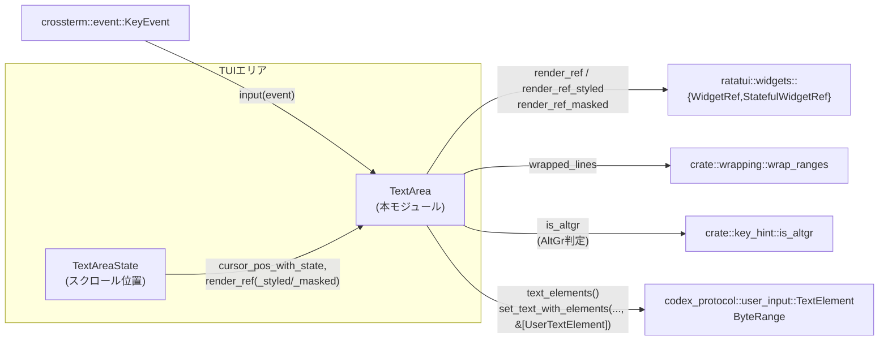

# tui/src/bottom_pane/textarea.rs コード解説

## 0. ざっくり一言

TUI の入力欄（composer）の背後にある **編集可能テキストバッファ**です。  
UTF-8 テキスト、本体と一体で動くプレースホルダ要素（atomic elements）、カーソル位置・折り返し状態、Emacs 風の kill/yank 用単一エントリ kill バッファを管理します。

> 行番号はこのインターフェイスからは取得できないため、  
> 「◯◯関数内」「テスト名 △△」といった形で根拠を記載します。

---

## 1. このモジュールの役割

### 1.1 概要

- このモジュールは **TUI の文章入力欄をエディタとして扱う**ために存在し、次の機能を提供します。
  - UTF-8 テキストの挿入・削除・置換
  - 単語単位・行単位・書記素（grapheme）単位のカーソル移動・削除
  - 「テキスト要素（TextElement）」として扱われる **原子的なプレースホルダ**の管理
  - Emacs ライクな `Ctrl+K` / `Ctrl+Y` に対応する **kill バッファ**（単一エントリ）の保持
  - 折り返し（ラップ）とスクロールを考慮したカーソル位置計算と描画

### 1.2 アーキテクチャ内での位置づけ

このファイルは UI 下部のコンポーザ用テキストエリアを担当し、周辺コンポーネントと次のように連携します。



- **入力側**: 上位のイベントループが `crossterm::event::KeyEvent` を受け取り、`TextArea::input` に渡します。
- **表示側**: Ratatui の `WidgetRef` / `StatefulWidgetRef` 実装により、`TextArea` が自分自身を描画します。
- **折り返し**: `crate::wrapping::wrap_ranges` を利用して行のラップ（折り返し）範囲を計算し、`WrapCache` にキャッシュします。
- **プレースホルダとの橋渡し**: 外部プロトコル `codex_protocol::user_input::TextElement` / `ByteRange` と内部の `TextElement` 構造体を変換します。

### 1.3 設計上のポイント

- **責務の分割**
  - `TextArea`: テキスト内容、カーソル位置、kill バッファ、テキスト要素の全体管理。
  - `TextAreaState`: 表示上のスクロール位置のみを保持（描画側の状態）。
  - 内部ヘルパ関数群（`prev_atomic_boundary`, `beginning_of_previous_word` など）が、削除・移動の粒度決定に使われます。

- **テキスト要素（atomic elements）**
  - `/plan` のようなプレースホルダを **通常テキストとは別の「要素」**として保持し、  
    その内部にカーソルが入ったり部分削除されないようにしています。
  - 要素を跨ぐ編集が発生した場合は、要素全体を含む範囲に編集を拡張します（`expand_range_to_element_boundaries`）。

- **kill バッファ**
  - Emacs 風の `kill` / `yank` を単一エントリの文字列で実装。
  - `set_text_*` によるバッファ全置換でも kill バッファを **クリアしません**（コメントおよび `kill_buffer_persists_across_set_text` テストより）。

- **Unicode / 安全性**
  - UTF-8 バイトオフセットを API で扱いますが、内部では必ず
    - `clamp_pos_to_char_boundary` により **文字境界（char boundary）に丸める**、
    - `unicode_segmentation::GraphemeCursor` と `UnicodeWidthStr::width` により **書記素単位・表示幅** を意識して動きます。
  - これにより、サロゲートペア、結合文字、絵文字、CJK などを含むテキストでも安全に削除・移動できます。

- **ラップ・スクロール**
  - 折り返し結果（wrapped lines）は `WrapCache` にキャッシュし、幅が変わったときだけ再計算します（`wrapped_lines`）。
  - スクロールは `TextAreaState.scroll` と `effective_scroll` で管理し、
    「カーソルは常に表示範囲内」という不変条件を保ちます。

- **並行性**
  - `TextArea` は `RefCell<Option<WrapCache>>` を含むため **`Sync` ではありません**（`RefCell` が !Sync）。
  - `Send` ではありますが、複数スレッドから共有して同時に描画・編集する前提ではありません。
  - `&self` メソッドから wrap キャッシュを書き換えるために `RefCell` を使う、**シングルスレッド前提の内部可変性**です。

- **エラーハンドリング・パニック条件**
  - ほぼすべて安全な Rust で実装されており、`Result` は使っていません。
  - 主なパニック要因:
    - `replace_range_raw` 冒頭の `assert!(range.start <= range.end)` に違反した範囲を渡した場合。
    - 各所で標準ライブラリの `String::replace_range` などを使っていますが、すべて事前に文字境界に丸めるため、その点でのパニックは避けています。
  - `GraphemeCursor::prev_boundary` / `next_boundary` がエラーを返す場合は、フォールバックとして 1 バイト前後に移動するようにしています。

---

## 2. 主要な機能一覧

- テキストバッファ管理: `set_text_*`, `insert_str[_at]`, `replace_range`, `text()`, `is_empty()`.
- カーソル位置管理: `cursor()`, `set_cursor()`, `move_cursor_*`, `cursor_pos`, `cursor_pos_with_state`.
- 単語単位編集・移動:
  - 削除: `delete_backward_word`, `delete_forward_word`.
  - ナビゲーション: `beginning_of_previous_word`, `end_of_next_word`.
- 行単位 kill/yank: `kill_to_beginning_of_line`, `kill_to_end_of_line`, `yank`.
- 書記素単位移動・削除: `delete_backward`, `delete_forward`, `move_cursor_left`, `move_cursor_right`.
- テキスト要素（atomic elements）の管理:
  - 取得: `text_elements`, `text_element_snapshots`, `element_payloads`, `element_id_for_exact_range`.
  - 挿入・変更: `insert_element`, `insert_named_element`（非 Linux）, `replace_element_payload`, `update_named_element_by_id`, `replace_element_by_id`.
  - 範囲付与・削除: `add_element_range`, `remove_element_range`, `named_element_range`.
- 描画:
  - 通常描画: `impl WidgetRef for &TextArea` → `render_ref`.
  - スクロール付き描画: `impl StatefulWidgetRef for &TextArea` → `render_ref`.
  - マスク描画（パスワード等）: `render_ref_masked`.
  - ベーススタイル上書き描画（Zellij 用）: `render_ref_styled`.
- 折り返し・スクロール補助: `desired_height`, `wrapped_lines`, `effective_scroll`.

---

## 3. 公開 API と詳細解説

### 3.1 型一覧（構造体・列挙体など）

| 名前 | 種別 | 可視性 | 役割 / 用途 |
|------|------|--------|-------------|
| `TextArea` | 構造体 | `pub(crate)` | TUI コンポーザの編集バッファ本体。テキスト、カーソル、折り返しキャッシュ、要素、kill バッファを保持。 |
| `TextAreaState` | 構造体 | `pub(crate)` | 折り返し後の描画に対するスクロール位置（最初の可視行インデックス）を保持。 |
| `TextElement` | 構造体 | private | 内部用の原子的テキスト要素。`id`, UTF-8 バイト範囲 `range`, 任意の名前 `name` を持つ。 |
| `TextElementSnapshot` | 構造体 | `pub(crate)` | テキスト要素のスナップショット（`id`, 範囲, 文字列）を外部へ渡すための読み取り専用ビュー。 |
| `WrapCache` | 構造体 | private | 一度計算した折り返し結果（幅 `width` と各行のバイト範囲 `lines`）をキャッシュする。 |

補助的な外部型（このファイルでは定義されないが重要）:

| 名前 | 種別 / モジュール | 役割 |
|------|------------------|------|
| `UserTextElement` | `codex_protocol::user_input::TextElement` | 上位レイヤが管理するテキスト要素表現。`TextArea` の `set_text_with_elements` / `text_elements` とで変換される。 |
| `ByteRange` | `codex_protocol::user_input::ByteRange` | バッファ内のバイト範囲を表す。`TextArea` 内部では文字境界にクランプされる。 |
| `Rect`, `Buffer`, `Style` | `ratatui` | 描画領域・バッファ・スタイル情報。`render_ref*` 系で使用。 |
| `KeyEvent`, `KeyCode`, `KeyModifiers` | `crossterm::event` | キー入力イベント。`input` で Emacs 風/標準ショートカットにマッピングされる。 |

### 3.1.1 公開メソッド・関数インベントリー

`TextArea` の公開・crate 公開メソッド（条件付きコンパイルを含む）を用途別に整理します。

#### テキスト内容・全体更新

| 関数名 | シグネチャ（概要） | 役割 |
|--------|--------------------|------|
| `new` | `pub fn new() -> Self` | 空のテキストエリアを生成。 |
| `set_text_clearing_elements` | `pub fn set_text_clearing_elements(&mut self, text: &str)` | テキストを指定文字列に置き換え、既存の要素を全削除。kill バッファは保持。 |
| `set_text_with_elements` | `pub fn set_text_with_elements(&mut self, text: &str, elements: &[UserTextElement])` | テキストと要素を一括再構築。kill バッファは保持。 |
| `text` | `pub fn text(&self) -> &str` | 現在のテキスト全体を取得。 |
| `is_empty` | `pub fn is_empty(&self) -> bool` | テキストが空かどうか。 |

#### 挿入・置換系

| 関数名 | 役割 |
|--------|------|
| `insert_str` | カーソル位置に文字列を挿入。位置は文字境界・要素境界にクランプされる。 |
| `insert_str_at` | 指定バイト位置に文字列を挿入。 |
| `replace_range` | 指定バイト範囲（要素を跨ぐ場合は拡張）を文字列で置換。 |

#### カーソル・座標系

| 関数名 | 役割 |
|--------|------|
| `cursor` | 現在のカーソルのバイト位置を返す。 |
| `set_cursor` | カーソルバイト位置を設定し、要素内部なら要素境界にスナップ。 |
| `move_cursor_left` / `move_cursor_right` | 書記素（grapheme）単位で左右に移動。要素や結合文字を飛び越える。 |
| `move_cursor_up` / `move_cursor_down` | 折り返し・スクロールを考慮して上下に移動。 |
| `move_cursor_to_beginning_of_line` | 行頭に移動（Emacs 風の「行頭でさらに押すと前行へ」も実装）。 |
| `move_cursor_to_end_of_line` | 行末に移動（Emacs 風「行末でさらに押すと次行末へ」も実装）。 |
| `cursor_pos` | `Rect` 内でのカーソル座標を計算（スクロールなし）。 |
| `cursor_pos_with_state` | スクロール状態（`TextAreaState`）を考慮したカーソル座標を計算。 |

#### 削除・kill / yank

| 関数名 | 役割 |
|--------|------|
| `delete_backward` / `delete_forward` | 書記素単位で n 個分削除（Backspace / Delete）。要素境界を尊重。 |
| `delete_backward_word` / `delete_forward_word` | 単語単位削除。単語境界は `WORD_SEPARATORS` と Unicode word-boundary から決定。 |
| `kill_to_end_of_line` | カーソルから行末まで（場合によっては改行も含め）削除し、kill バッファに保存。 |
| `kill_to_beginning_of_line` | 行頭まで削除し、kill バッファに保存。 |
| `yank` | kill バッファをカーソル位置に挿入。 |

#### 単語ナビゲーション（crate 公開）

| 関数名 | 役割 |
|--------|------|
| `beginning_of_previous_word` | カーソル位置から見た直前の単語の先頭バイト位置を返す。 |
| `end_of_next_word` | カーソル位置から見た次の単語の末尾バイト位置を返す。 |

#### テキスト要素（プレースホルダ）

| 関数名 | 役割 |
|--------|------|
| `element_payloads` | すべての要素内テキストの一覧 `Vec<String>`。 |
| `text_elements` | 外部プロトコル用 `Vec<UserTextElement>` を生成。 |
| `text_element_snapshots` | `Vec<TextElementSnapshot>` を返す（id・範囲・テキストのスナップショット）。 |
| `element_id_for_exact_range` | バイト範囲に一致する要素 id を返す。 |
| `insert_element` | テキストを挿入し、その範囲全体を要素としてマークして id を返す。 |
| `insert_named_element` *(非 Linux)* | 名前付き要素として挿入。 |
| `replace_element_by_id` *(非 Linux)* | 名前付き要素のテキストを置換し、要素自体は削除。 |
| `update_named_element_by_id` | 名前付き要素のテキストを更新し、同じ id で新範囲を再登録。 |
| `named_element_range` | 名前付き要素のバイト範囲を取得。 |
| `replace_element_payload` | 特定テキストを持つ要素を探し、その payload だけを置換し再配置。 |
| `add_element_range` | 既存テキストのバイト範囲を要素としてマーク（オーバーラップ・重複は無視）。 |
| `remove_element_range` | ちょうどその範囲を持つ要素を削除。 |

#### 描画・ラップ

| 関数名 / impl | 役割 |
|---------------|------|
| `desired_height` | 指定幅で折り返したときの行数を返す（高さの推定）。 |
| `impl WidgetRef for &TextArea::render_ref` | スクロール無しでテキストエリアを描画。 |
| `impl StatefulWidgetRef for &TextArea::render_ref` | スクロール状態を更新しつつ描画。 |
| `render_ref_masked` | 画面には `mask_char` だけを描画する（パスワード入力など）。 |
| `render_ref_styled` | ベーススタイルを指定して描画（Zellij 用）。 |

---

### 3.2 関数詳細（主要 7 件）

#### 1) `set_text_with_elements(&mut self, text: &str, elements: &[UserTextElement])`

**概要**

テキスト全体と、その上に乗るテキスト要素群を **一括で再構築**します。  
kill バッファは保持し、カーソル位置・折り返しキャッシュなど、テキストから派生する状態をリセットします。

**引数**

| 引数名 | 型 | 説明 |
|--------|----|------|
| `text` | `&str` | 新しいバッファ全文。UTF-8 文字列。 |
| `elements` | `&[UserTextElement]` | バイト範囲付きの外部テキスト要素。 |

**戻り値**

- なし（`()`）。内部状態（テキスト、要素、カーソル、ラップキャッシュなど）が更新されます。

**内部処理の流れ**

1. `set_text_inner` に `Some(elements)` を渡して実処理を委譲。
2. `set_text_inner` 内では:
   - `self.text = text.to_string()` でテキスト丸ごと置換。
   - 既存カーソル位置を `0..=text.len()` にクランプ。
   - `self.elements.clear()` で要素を全削除。
   - 渡された `UserTextElement` それぞれについて:
     - 範囲をテキスト長にクランプ（`min(self.text.len())`）。
     - `clamp_pos_to_char_boundary` で文字境界に丸める。
     - 開始 >= 終了のものは無視。
     - 新しい `TextElement` を `next_element_id()` で id を採番して追加。
   - 要素配列を開始位置でソート。
   - カーソル位置を `clamp_pos_to_nearest_boundary` で調整（要素内なら境界へ）。
   - `wrap_cache` を `None` にし、`preferred_col` もクリア。

**Examples（使用例）**

```rust
use codex_protocol::user_input::{ByteRange, TextElement as UserTextElement};
use tui::bottom_pane::textarea::TextArea;

fn setup_textarea_with_placeholders() -> TextArea {
    let mut ta = TextArea::new(); // 空のテキストエリアを作成
    let text = "Run /plan then /deploy"; // プレースホルダを含む文字列

    // "/plan" に対応する要素
    let plan = UserTextElement::new(
        ByteRange { start: 4, end: 9 },   // " /pl" の先頭から "/plan" の終わりまで (バイト)
        Some("/plan".to_string()),        // プレースホルダ表示テキスト
    );

    // "/deploy" に対応する要素
    let deploy_start = text.find("/deploy").unwrap();
    let deploy = UserTextElement::new(
        ByteRange {
            start: deploy_start,
            end: deploy_start + "/deploy".len(),
        },
        Some("/deploy".to_string()),
    );

    ta.set_text_with_elements(text, &[plan, deploy]); // テキストと要素を一括設定
    ta
}
```

**Errors / Panics**

- ユーザ側から直接呼ぶ場合のパニックはありません。
- 内部で `clamp_pos_to_char_boundary` と長さクランプを行っているため、`String::get(range)` や `replace_range` によるパニックは避けられています。

**Edge cases（エッジケース）**

- `elements` の範囲がテキスト長を超えている:
  - 自動的に `text.len()` にクランプされます。
- 範囲が文字境界に合っていない:
  - 近い文字境界まで丸められます（前後どちらに寄るかは距離で決定）。
- `start >= end` の要素:
  - 無視され、`self.elements` には追加されません。
- 既存 kill バッファ:
  - 変更されません（`kill_buffer_persists_across_set_text` テストより）。

**使用上の注意点**

- `ByteRange` は **バイトインデックス**で指定しますが、実際には文字境界に合わせて丸められるため、  
  「ちょうどこのコードポイント列だけを要素にしたい」といった厳密さは保証されません。
- 要素は重なっていても受け取りますが、その扱いはこの関数では特別な検査を行っていません。  
  要素のオーバーラップを禁止したい場合は、呼び出し側で検証する必要があります。
- kill バッファが残ることを前提に、`submit` 後などに `set_text_*` してから `yank` を呼ぶと、「直前の kill」が復元されます。  
  これを嫌う UI では、必要なら kill バッファを明示的にクリアする関数を追加する必要があります（現状その API はありません）。

---

#### 2) `insert_str_at(&mut self, pos: usize, text: &str)`

**概要**

指定したバイト位置に文字列を挿入します。  
実際には文字境界および要素境界に丸めてから挿入し、カーソル・要素範囲・折り返しキャッシュを更新します。

**引数**

| 引数名 | 型 | 説明 |
|--------|----|------|
| `pos` | `usize` | 挿入を試みる UTF-8 バイト位置。文字境界・要素境界に丸められる。 |
| `text` | `&str` | 挿入したいテキスト。 |

**戻り値**

- なし。`self.text` / `self.cursor_pos` / `self.elements` / `wrap_cache` が更新されます。

**内部処理の流れ**

1. `clamp_pos_for_insertion(pos)` で実際の挿入位置を決定:
   - 文字境界に丸める。
   - 要素内部なら **最も近い要素境界**（前 or 後）に移動。
2. `self.text.insert_str(pos, text)` で挿入。
3. `wrap_cache` を `None` にし、次回描画時にラップを再計算させる。
4. `pos <= self.cursor_pos` の場合のみ、`self.cursor_pos += text.len()` でカーソルを右へシフト。
5. `shift_elements(pos, /*removed*/ 0, text.len())` で要素範囲を更新。
6. `preferred_col` をクリア（縦方向移動の「好みの列」をリセット）。

**Examples（使用例）**

```rust
let mut ta = TextArea::new();
ta.insert_str_at(0, "hello");           // 先頭に "hello" を挿入
assert_eq!(ta.text(), "hello");

// マルチバイト文字の途中に指定しても、文字境界まで丸められる
ta.insert_str_at(1, "你");              // "h你ello" のように安全に挿入
```

**Errors / Panics**

- `pos` が文字境界でなくても、内部で `clamp_pos_to_char_boundary` を通るため、安全です。
- 要素内部に `pos` を指定しても、要素の前後いずれかの境界に移されるため、要素を壊しません。
- 挿入位置計算に問題がない限り、パニックは発生しません。

**Edge cases**

- `pos > self.text.len()`:
  - `clamp_pos_for_insertion` で `text.len()` にクランプされ、バッファ末尾に挿入されます。
- Unicode 絵文字や結合文字の途中を指定:
  - 直近の有効なバイト境界に丸められます。
- 要素の真ん中:
  - 要素の前後どちらかに挿入されます（近い方）。

**使用上の注意点**

- `text.len()` は `バイト数` である点に注意してください。  
  `pos` もバイト単位なので、「3文字目」ではなく「バイトのオフセット」で指定されます。
- 要素の内側に挿入したいケース（例えば要素を分割する）には対応していません。  
  そのような編集は、要素を一度削除した上でプレーンテキストとして扱うか、新しい API を追加する必要があります。

---

#### 3) `replace_range(&mut self, range: Range<usize>, text: &str)`

**概要**

指定されたバイト範囲を、文字列で置き換えます。  
範囲が既存の要素に部分的にかかる場合は、範囲を要素全体を含むように自動拡張し、要素の整合性を維持します。

**引数**

| 引数名 | 型 | 説明 |
|--------|----|------|
| `range` | `std::ops::Range<usize>` | 置換対象のバイト範囲（`start..end`）。 |
| `text` | `&str` | 置換後のテキスト。 |

**戻り値**

- なし。

**内部処理の流れ**

1. `expand_range_to_element_boundaries(range)` を呼び出し、  
   範囲が少しでも要素と重なっていれば、その要素を丸ごと含むよう `start` / `end` を拡張。
2. 内部関数 `replace_range_raw` に拡張後の範囲と挿入テキストを渡す。
3. `replace_range_raw` 内では:
   - `assert!(range.start <= range.end)` で前提条件をチェック。
   - 範囲をテキスト長にクランプ。
   - 削除と挿入の長さ差 `diff` を計算。
   - `self.text.replace_range(range, text)` でテキスト置換。
   - `wrap_cache` を無効化、`preferred_col` をクリア。
   - `update_elements_after_replace(start, end, inserted_len)` で要素範囲を更新。
   - カーソル位置を以下のように調整:
     - カーソル < `start`: シフトなし。
     - `start <= cursor <= end`: 挿入テキストの末尾 (`start + inserted_len`) へ移動。
     - `cursor > end`: `diff` だけ前後する。
   - 最後に `clamp_pos_to_nearest_boundary` で、要素内部に入っていないことを保証。

**Examples（使用例）**

```rust
let mut ta = TextArea::new();
ta.insert_str("hello world");
ta.set_cursor(6);                      // "world" の先頭

// "world" → "Rust" に置換
let start = 6;
let end = ta.text().len();
ta.replace_range(start..end, "Rust");

assert_eq!(ta.text(), "hello Rust");
assert_eq!(ta.cursor(), start + "Rust".len());
```

**Errors / Panics**

- **前提条件違反**: `range.start > range.end` を渡すと、`replace_range_raw` 冒頭の `assert!` でパニックします。
- それ以外は、文字境界へのクランプと要素境界へのスナップにより、`String::replace_range` でのパニックを避けています。

**Edge cases**

- 要素の一部だけを含む範囲を指定した場合:
  - `expand_range_to_element_boundaries` により、要素全体が置換対象になります（テスト `delete_forward_word_handles_atomic_elements` などで検証）。
- 範囲外のインデックス:
  - 自動的に `0..text.len()` にクランプ。
- 空の置換（削除のみ）:
  - `text.is_empty()` の場合、削除のみが行われます。
- 削除も挿入も空（`removed_len == 0 && inserted_len == 0`）:
  - 早期 return し、何も起こりません。

**使用上の注意点**

- 呼び出し側は **`range.start <= range.end` を必ず満たす**必要があります。
- 範囲が要素を跨ぐと、意図より広範囲が置換されることがあります（仕様としてそう設計されています）。  
  要素をまたがないようにしたい場合は、事前に `text_elements()` などで範囲を確認してください。
- バイト単位の範囲指定であることに注意が必要です（マルチバイト文字を跨ぐ指定はクランプされます）。

---

#### 4) `input(&mut self, event: KeyEvent)`

**概要**

`crossterm` の `KeyEvent` を受け取り、Emacs 風ショートカットや一般的なキー操作を `TextArea` の編集操作にマッピングします。  
Backspace/Delete、Ctrl/Alt 修飾、AltGr への対応など、端末差異も吸収します。

**引数**

| 引数名 | 型 | 説明 |
|--------|----|------|
| `event` | `KeyEvent` | crossterm から渡されるキーイベント。 |

**戻り値**

- なし。内部でテキストやカーソル位置が変更される可能性があります。

**内部処理の流れ**

1. `event.kind` が `Press` または `Repeat` 以外の場合（KeyUp など）は **無視して return**。  
   これにより、キーアップ時に修飾キーが離れて文字が挿入されるような事故を防ぎます。
2. `match event` で多くのパターンマッチ:
   - **制御文字 fallback**:
     - `^B` (`\u{0002}`) → `move_cursor_left`
     - `^F` (`\u{0006}`) → `move_cursor_right`
     - `^P` (`\u{0010}`) → `move_cursor_up`
     - `^N` (`\u{000e}`) → `move_cursor_down`
   - **通常文字入力**:
     - `KeyCode::Char(c)` かつ `modifiers` が `NONE | SHIFT`: `insert_str(&c.to_string())`。
     - ただし Alt 修飾は除外（Alt + char は単語移動などに使うため）。
   - **Enter / Ctrl+J / Ctrl+M**:
     - 改行 `"\n"` を挿入。
   - **Backspace / Delete / Ctrl+H / Alt 修飾**:
     - Alt+Backspace / Ctrl+Alt+H → `delete_backward_word`.
     - Alt+Delete / Alt+D → `delete_forward_word`.
     - Backspace / Ctrl+H → `delete_backward(1)`.
     - Delete / Ctrl+D → `delete_forward(1)`.
   - **単語移動**:
     - Alt+`b` / Ctrl+Left / Alt+Left → `set_cursor(beginning_of_previous_word())`.
     - Alt+`f` / Ctrl+Right / Alt+Right → `set_cursor(end_of_next_word())`.
   - **kill / yank**:
     - Ctrl+U → `kill_to_beginning_of_line`.
     - Ctrl+K → `kill_to_end_of_line`.
     - Ctrl+Y → `yank`.
   - **行頭・行末移動**:
     - Home, End それぞれ `move_cursor_to_beginning_of_line(false)` / `move_cursor_to_end_of_line(false)`。
     - Ctrl+A → `move_cursor_to_beginning_of_line(true)`（Emacs 風）。
     - Ctrl+E → `move_cursor_to_end_of_line(true)`。
   - **矢印キー**:
     - Left/Right/Up/Down → 対応する `move_cursor_*`。
   - **AltGr（Windows）**:
     - `is_altgr(modifiers)` が true の Ctrl+Alt+Char は、文字として挿入（AltGr キー対応）。

3. マッチしない場合は何もせず `_ => {}`。

**Examples（使用例）**

```rust
use crossterm::event::{KeyCode, KeyEvent, KeyModifiers};

let mut ta = TextArea::new();
ta.insert_str("hello world");
ta.set_cursor(ta.text().len());

// Alt+Backspace で直前の単語を削除
ta.input(KeyEvent::new(KeyCode::Backspace, KeyModifiers::ALT));
assert_eq!(ta.text(), "hello "); // "world" が削除される
```

**Errors / Panics**

- この関数自体は panic を起こしません。
- 内部で呼ばれる編集メソッドが前述の前提条件を満たしている限り安全です。

**Edge cases**

- KeyUp イベント:
  - `KeyEventKind::Release` などは無視されます。
- AltGr（Windows）:
  - Ctrl+Alt+Char の組み合わせは AltGr と見做し、**ショートカットではなく文字入力**として扱います（テスト `altgr_ctrl_alt_char_inserts_literal`）。
- 未対応のキー:
  - 無視され、バッファには影響しません。
- 修飾キーの組み合わせ:
  - コメントにある通り、一部の端末では Option/Meta キーが Alt にマップされるため、それを前提としたバインディングになっています。

**使用上の注意点**

- 新しいショートカットを追加したい場合は、この `match` にパターンを追加します。  
  既存のバインディングとの衝突に注意してください。
- `input` は「純粋なテキスト入力 API」ではなく、端末固有の挙動を吸収した **キーハンドラ**です。  
  ショートカットを無効化したい場合は、直接 `insert_str` / `delete_*` を使うか、ラッパを用意する必要があります。

---

#### 5) `beginning_of_previous_word(&self) -> usize`

**概要**

現在のカーソル位置から見て、「直前の単語」の先頭バイト位置を計算して返します。  
単語境界は Unicode の単語境界（`split_word_bound_indices`）と、追加の `WORD_SEPARATORS` による区切り記号リストで定義されます。

**引数**

- なし（`&self` のみ）。

**戻り値**

- `usize`: バッファ内の UTF-8 バイトオフセット。  
  要素内部にかかる場合は、要素境界にスナップされた位置が返ります。

**内部処理の流れ（簡略）**

1. `prefix = &self.text[..self.cursor_pos]` を取り、カーソルより左側だけを見る。
2. 後ろから `char_indices().rev()` で走査し、最初に出現する「非空白文字」の位置を見つける。  
   - 見つからなければ 0 を返す。
3. その位置からさらに左に遡って、直前の空白位置を探し、そこから **単語ラン** の開始位置 `run_start` を決める。
4. 単語ラン内を `split_word_pieces` で「単語／区切り記号」に分割し、  
   末尾側から順に見て「現在の単語」を決定。
   - 文字列がすべて区切り記号の場合は、それ以前の連続した区切り記号列も含める。
5. 最終的な開始位置 `start` を `adjust_pos_out_of_elements(start, true)` に通し、  
   要素内部であれば要素の開始位置にスナップして返す。

**Examples（使用例）**

```rust
let mut ta = TextArea::new();
ta.insert_str("path/to/file");
ta.set_cursor(ta.text().len()); // "file" の末尾

let prev = ta.beginning_of_previous_word();
assert_eq!(&ta.text()[prev..], "file"); // "file" の先頭に戻る
```

**Errors / Panics**

- スライス操作はすべて `cursor_pos` を基準にしており、常に `0..=len` の範囲なので panic はしません。
- Unicode の word-boundary 処理は `unicode_segmentation` に任せています。

**Edge cases**

- 先頭にいる場合:
  - 0 を返します。
- 直前が空白のみの場合:
  - 空白を飛ばし、さらにその前の単語を探します。
- 区切り記号のみ（例: `"foo/bar"` の末尾から）:
  - `WORD_SEPARATORS` の連続区間を単語として扱います（テスト `delete_backward_word_respects_word_separators` 参照）。
- CJK 文字:
  - CJK 文字列 `"你好世界"` のテストから、各文字が独立した「単語」として扱われます。

**使用上の注意点**

- 返り値はあくまでバイトオフセットです。カーソルを移動させるには `set_cursor` を使ってください。
- 要素を跨ぐ場合、要素の開始位置にスナップされます（`adjust_pos_out_of_elements`）。

---

#### 6) `move_cursor_up(&mut self)`

**概要**

カーソルを 1 行分、上の **視覚的な行**へ移動します。  
折り返し情報 (`WrapCache`) があればまずそれを使用し、なければ論理行（改行）ベースで移動します。

**引数**

- なし（`&mut self` のみ）。

**戻り値**

- なし。`self.cursor_pos` と `preferred_col` が更新されます。

**内部処理の流れ**

1. `wrap_cache` があれば、現在のカーソル位置が属する wrapped line のインデックスを求める（`wrapped_line_index_by_start`）。
2. その 1 つ前の wrapped line が存在する場合:
   - 現在行内での表示列（`UnicodeWidthStr::width`）を `target_col` にする。  
     まだ `preferred_col` が未設定ならここで保存。
   - 1 行上の wrapped line の `[line_start, line_end)` に対し、  
     `move_to_display_col_on_line(line_start, line_end, target_col)` を呼び、適切なバイト位置にカーソルを移動。
   - 要素境界にスナップしてから return。
3. wrapped line が存在せず、すでに最上段なら:
   - `self.cursor_pos = 0`（テキスト先頭）に移動して return。
4. `wrap_cache` が無い場合（まだ折り返し計算が行われていない場合）は、論理行ベースで移動:
   - 現在位置より左側で最後に出現する `'\n'` を見つけ、前の行の開始位置と終端位置を計算。
   - `current_display_col` または保存済みの `preferred_col` を用いて、
     前の論理行で同じ表示列に近い位置に移動（`move_to_display_col_on_line`）。

**Examples（使用例）**

```rust
let mut ta = TextArea::new();
ta.insert_str("short\nloooooong\nmid");
let second_start = "short\n".len();
ta.set_cursor(second_start + 5); // 2 行目の 5 列目

ta.move_cursor_up();
// 1 行目は "short" → 最大 5 列なので、同じ列に移動できる
assert_eq!(ta.cursor(), 5);
```

**Errors / Panics**

- 折り返しキャッシュの構造が壊れていない限り、パニックしません。
- 行インデックス計算等は安全な API (`saturating_*`, `unwrap_or`) を使っています。

**Edge cases**

- すでに先頭の視覚行／論理行にいる場合:
  - カーソルは 0 に移動します。
- 折り返しキャッシュが古い幅で作られている場合:
  - `wrapped_lines(width)` 呼び出し時に幅チェックが入り、必要であれば再計算されます。
- 要素が含まれる行:
  - `move_to_display_col_on_line` 内で `clamp_pos_to_nearest_boundary` を呼ぶため、要素内部にカーソルが止まりません。

**使用上の注意点**

- 連続して `move_cursor_up` / `move_cursor_down` を呼ぶと、`preferred_col` により「同じ表示列を維持する」動きになります。  
  別の方向に移動したり文字挿入・削除を行うと、`preferred_col` はクリアされます。
- 幅 `width` に応じて折り返し結果は変わるため、描画側で `move_cursor_up` を使うときは同じ `width` を `desired_height` / `cursor_pos*` にも使うのが自然です。

---

#### 7) `render_ref_styled(&self, area: Rect, buf: &mut Buffer, state: &mut TextAreaState, base_style: Style)`

**概要**

RatatuI 用の描画関数です。  
折り返しとスクロールを考慮してテキストを `Buffer` に描画し、各セルに `base_style` を適用した上で、要素部分だけ色（前景色）を上書きします。

**引数**

| 引数名 | 型 | 説明 |
|--------|----|------|
| `area` | `Rect` | 描画領域（左上 x/y, 幅, 高さ）。 |
| `buf` | `&mut Buffer` | 描画先バッファ。 |
| `state` | `&mut TextAreaState` | スクロール位置を含む状態。描画のたびに更新される。 |
| `base_style` | `Style` | 各セルに適用される基本スタイル（Zellij 用の上書きに使われる）。 |

**戻り値**

- なし。

**内部処理の流れ**

1. `wrapped_lines(area.width)` で現在の幅に対する折り返し行範囲リストを取得。
2. `effective_scroll(area.height, &lines, state.scroll)` でスクロール位置を再計算し、`state.scroll` を更新。
3. 表示すべき行インデックス範囲 `[start, end)` を決定:
   - `start = scroll as usize`
   - `end = (scroll + area.height).min(lines.len() as u16) as usize`
4. `render_lines(area, buf, &lines, start..end, base_style)` を呼び出す。
5. `render_lines` 内では、各行について:
   - `buf.set_style(Rect::new(area.x, y, area.width, 1), base_style)` で行全体に基底スタイルを適用。
   - テキスト範囲 `line_range = r.start..r.end - 1` を取り出し、`set_string` で描画。
   - 各要素について、その行と重なる部分を計算し、重なる部分のみ前景色を `Color::Cyan` にしたスタイルで上書き描画。

**Examples（使用例）**

```rust
use ratatui::{buffer::Buffer, layout::Rect, style::Style};

let mut ta = TextArea::new();
ta.insert_str("hello world");
let mut state = TextAreaState::default();

let area = Rect::new(0, 0, 20, 3);
let mut buf = Buffer::empty(area);

let base_style = Style::default().fg(ratatui::style::Color::White);

// スクロール状態付きで描画
ta.render_ref_styled(area, &mut buf, &mut state, base_style);
```

**Errors / Panics**

- `wrapped_lines` では `RefCell` を利用しますが、同時に二重借用しないようにスコープを分けているため、`borrow_mut` / `borrow` のランタイムパニックは発生しない設計です。
- 折り返し結果が空ベクタの場合は `render_lines` のループに入らないため、安全です。
- `line_range = r.start..r.end - 1` で `r.end > 0` であることが前提ですが、`wrap_ranges` の契約に依存しています（テスト `wrapping_and_cursor_positions` ほか fuzz テストで暗黙に検証）。

**Edge cases**

- テキストが空の場合:
  - `lines.len() == 0` となり、ループが 0 回で終了します（何も描画しない）。
- 描画領域の高さが 1 の場合:
  - `effective_scroll` によりスクロール位置が調整され、カーソルが必ずその 1 行内に入るようになります（`cursor_pos_with_state_basic_and_scroll_behaviors` テスト）。

**使用上の注意点**

- `WidgetRef` / `StatefulWidgetRef` の実装も、この関数と同様に `render_lines` を使って描画します。  
  通常はそれらの trait 経由で呼び出す想定ですが、Zellij のようにベーススタイルを差し替えたい場合に直接使います。
- `TextAreaState.scroll` は **呼び出し側が保持**し続ける必要があります。  
  再描画のたびに新しい `TextAreaState` を渡すと、スクロール位置がリセットされます。

---

### 3.3 その他の関数（概要）

主な公開メソッドの役割をまとめます（詳細は上記およびテストを参照）。

| 関数名 | 役割（1 行） |
|--------|--------------|
| `new` | 空のテキストエリアを構築し、kill バッファも空にする。 |
| `text` | 現在のバッファ内容を `&str` で返す。 |
| `insert_str` | 現在のカーソル位置にテキストを挿入。 |
| `cursor` / `set_cursor` | カーソル位置の取得・設定（要素内に入らないよう調整）。 |
| `desired_height` | 指定幅で折り返したときに必要な行数を返す。 |
| `cursor_pos` / `cursor_pos_with_state` | 画面上のカーソル座標を計算（スクロール有無）。 |
| `delete_backward` / `delete_forward` | 書記素単位で Backspace / Delete を実装。 |
| `delete_backward_word` / `delete_forward_word` | 単語単位削除。kill バッファに保存するのは word 系のみ。 |
| `kill_to_beginning_of_line` / `kill_to_end_of_line` | 行単位の kill。削除したテキストは kill バッファに保存。 |
| `yank` | kill バッファの内容をカーソル位置に挿入。 |
| `element_payloads` / `text_elements` | 要素の内容を一覧または `UserTextElement` として取得。 |
| `insert_element` | テキストを挿入し、その範囲全体を atomic element としてマーク。 |
| `replace_element_payload` | 要素の表示テキストを置換し、位置に応じて他要素もシフト。 |
| `add_element_range` / `remove_element_range` | 既存テキストの範囲を要素としてマーク / 削除。 |
| `text_element_snapshots` | `id`・範囲・テキストを含むスナップショットを返す。 |
| `element_id_for_exact_range` | 範囲が完全一致する要素の id を返す。 |

---

## 4. データフロー

ここでは、**Alt+Backspace で単語を削除し、その後 Yank で復元する**シナリオを例に、データの流れを示します。

### 処理の要点

1. 上位のイベントループが `KeyEvent` を受け取り、`TextArea::input` に渡す。
2. `input` がキー組み合わせを判定し、`delete_backward_word` を呼ぶ。
3. `delete_backward_word` が `beginning_of_previous_word` で範囲を計算し、`kill_range` を通じてテキスト削除 + kill バッファ更新を行う。
4. 後続の描画サイクルで `render_ref` / `render_ref_styled` が呼ばれ、更新済みテキスト・カーソル位置・要素情報をもとに描画される。
5. `Ctrl+Y` を押すと、再び `input` → `yank` → `insert_str` と進み、kill バッファが復元される。

### シーケンス図（概略）

```mermaid
sequenceDiagram
    participant Loop as イベントループ
    participant TA as TextArea
    participant Wrap as wrap_ranges
    participant Buf as ratatui::Buffer

    Note over TA: 構造体 TextArea\n(alt+Backspace ハンドリングなど)

    Loop->>TA: input(KeyEvent::Backspace+Alt)
    TA->>TA: delete_backward_word()
    TA->>TA: beginning_of_previous_word()
    TA->>TA: kill_range(start..cursor)
    TA->>TA: replace_range_raw(range, "")

    Loop->>TA: render_ref_styled(area, &mut Buf, &mut state, base_style)
    TA->>Wrap: wrap_ranges(&text, Options::new(width))
    Wrap-->>TA: Vec<Range<usize>>
    TA->>Buf: 描画 (render_lines)

    Loop->>TA: input(KeyEvent::Char('y')+Ctrl)
    TA->>TA: yank()
    TA->>TA: insert_str(&kill_buffer)
    Loop->>TA: 再描画 (render_ref_styled)
```

---

## 5. 使い方（How to Use）

### 5.1 基本的な使用方法

`TextArea` を Ratatui ベースのアプリケーションから利用する典型的なフローです。

```rust
use crossterm::event::{self, Event, KeyEvent};
use ratatui::{
    backend::CrosstermBackend,
    Terminal,
    widgets::StatefulWidgetRef,
    layout::Rect,
    buffer::Buffer,
    style::Style,
};
use tui::bottom_pane::textarea::{TextArea, TextAreaState};

fn main_loop() -> crossterm::Result<()> {
    let mut textarea = TextArea::new();                 // テキストエリア本体
    let mut state = TextAreaState::default();           // スクロール状態

    // 端末セットアップは省略
    let mut terminal = Terminal::new(CrosstermBackend::new(std::io::stdout()))?;

    loop {
        // 1. 描画
        terminal.draw(|frame| {
            let area = frame.size();                    // 全画面領域と仮定
            let mut buf = Buffer::empty(area);
            let base_style = Style::default();

            // StatefulWidgetRef 経由の描画
            StatefulWidgetRef::render_ref(&(&textarea), area, &mut buf, &mut state);
            frame.render_widget(buf, area);
        })?;

        // 2. 入力処理
        if event::poll(std::time::Duration::from_millis(50))? {
            if let Event::Key(key) = event::read()? {
                // Ctrl+C などの終了判定は適宜
                textarea.input(key);                   // ここで TextArea を編集
            }
        }
    }
}
```

### 5.2 よくある使用パターン

1. **プレーンテキストの初期化**

```rust
let mut ta = TextArea::new();
ta.set_text_clearing_elements("Hello, world!");
```

1. **プレースホルダ要素付きテキストの初期化**

```rust
use codex_protocol::user_input::{ByteRange, TextElement as UserTextElement};

let mut ta = TextArea::new();
let text = "/plan do something";
let elem = UserTextElement::new(
    ByteRange { start: 0, end: 5 },     // "/plan"
    Some("/plan".to_string()),
);
ta.set_text_with_elements(text, &[elem]);
```

1. **パスワード入力のようなマスク描画**

```rust
let mut state = TextAreaState::default();
let mask_char = '●';
let base_style = Style::default();

ta.render_ref_masked(area, &mut buf, &mut state, mask_char, base_style);
```

### 5.3 よくある間違い

```rust
// 間違い例: 要素の中間にカーソルを直接置く
let mut ta = TextArea::new();
let id = ta.insert_element("<placeholder>");
ta.set_cursor(3);                    // 要素の途中のバイト位置

// 実際には set_cursor 内で要素境界にスナップされる。
// element 内にカーソルを固定したい設計だと勘違いしていると驚く。
```

```rust
// 正しい例: カーソル位置を意識せず insert_element / delete_forward_word などの高レベル API を使う
let mut ta = TextArea::new();
ta.insert_str("prefix ");
let id = ta.insert_element("<placeholder>");
ta.insert_str(" tail");

// 単語削除などは要素を丸ごと対象にしてくれる
ta.set_cursor("prefix ".len());
ta.delete_forward_word();           // "<placeholder>" 全体が削除される
```

### 5.4 使用上の注意点（まとめ）

- **バイトオフセット API**
  - ほとんどのメソッドは「位置」や「範囲」をバイト単位で扱います。  
    文字数ではなくバイト数であることに注意してください。
- **文字境界・要素境界**
  - `set_cursor`, `insert_str_at`, `replace_range` 等は **必ず文字境界・要素境界にスナップ**します。  
    「内部の中途半端な位置」にカーソルや編集範囲が残らないように設計されています。
- **kill バッファの寿命**
  - `set_text_*` では kill バッファがクリアされません。  
    UI 上「送信後に Ctrl+Y すると送信前の kill 内容が復活する」挙動になります。
- **並行性**
  - `TextArea` は `RefCell` を含むため `Sync` ではありません。  
    複数スレッドから同時アクセスするのではなく、イベントループスレッドからのみ操作する前提です。
- **範囲の前提条件**
  - `replace_range_raw` のような内部関数は `start <= end` を前提として `assert!` を使っています。  
    公開 API を通している限り問題になりませんが、将来内部 API を直接使うような変更をする場合は注意が必要です。

---

## 6. 変更の仕方（How to Modify）

### 6.1 新しい機能を追加する場合

例: 新しいショートカット `Ctrl+W` で「行末まで削除」したい場合。

1. **編集ロジックを決める**
   - 既に `kill_to_end_of_line` があるため、それを再利用できます。
2. **`input` の `match` にバインディングを追加**
   - `KeyEvent { code: KeyCode::Char('w'), modifiers: KeyModifiers::CONTROL, .. } => { self.kill_to_end_of_line(); }`
3. **テストを追加**
   - `tests` モジュールに `#[test]` を追加し、既存テストを参考に挙動を検証します。
4. **必要ならヘルパを追加**
   - 同様のロジックが複数箇所に増えそうなら共通ヘルパを `impl TextArea` 内に追加します。

### 6.2 既存の機能を変更する場合

- **影響範囲の確認**
  - 対応するテストが多数あるため、まず `tests` モジュールで該当挙動を検索します（例: `delete_forward_word` 関連テスト）。
  - `fuzz_textarea_randomized` が広範なパターンで不変条件を検証しているため、これを壊さないように注意します。
- **契約（前提条件・返り値）**
  - カーソルは要素内部で止まらない、kill バッファは `set_text_*` ではクリアしない、といった暗黙契約があります。  
    コード中のコメントとテスト名から契約を読み取り、それを変更する場合はテストも更新する必要があります。
- **テスト実行**
  - すべての `#[test]` に加え、`fuzz_textarea_randomized` が有効な状態でテストを実行し、ランタイムパニックが発生しないことを確認します。

---

## 7. 関連ファイル

このモジュールと密接に関係するモジュール・外部クレートをまとめます。

| パス / モジュール | 役割 / 関係 |
|-------------------|------------|
| `crate::wrapping::wrap_ranges` | テキストを指定幅で折り返し、その結果を `Vec<Range<usize>>` として返すヘルパ。`wrapped_lines` から使用。 |
| `crate::key_hint::is_altgr` | Windows などで AltGr キーを判定するヘルパ。`input` で Ctrl+Alt+Char を文字入力として扱うかどうかを決める。 |
| `codex_protocol::user_input::TextElement` | 上位プロトコルレイヤのテキスト要素表現。`set_text_with_elements` / `text_elements` で相互変換する。 |
| `codex_protocol::user_input::ByteRange` | テキスト内のバイト範囲表現。`TextElement` とともに使われる。 |
| `ratatui::widgets::{WidgetRef, StatefulWidgetRef}` | TextArea を Ratatui のウィジェットとして描画するためのトレイト。 |
| `crossterm::event` | キー入力イベント。`input` でマッピングされる。 |
| `tests` モジュール（同ファイル内） | ほとんどの機能のユニットテストおよびランダムテストを含む。挙動の仕様を理解する上で重要。 |

---

## テストと安全性・エッジケースのカバー範囲（まとめ）

- **テストの主な内容**
  - 基本編集 (`insert_str`, `replace_range`, カーソル更新)。
  - Unicode 書記素（絵文字・CJK・結合文字・ZWJ シーケンス）を含む削除・移動。
  - 単語削除・単語ナビゲーション（ASCII, CJK, 混在、区切り記号）。
  - kill/yank の挙動と kill バッファの永続性。
  - 要素（atomic elements）の扱い（中にカーソルが入らない、範囲を跨ぐ編集の挙動）。
  - ラップとスクロール、カーソル位置計算（複数の wrap 幅・高さで検証）。
  - ランダム fuzz テストでの不変条件:
    - カーソルが常に `0..=text.len()` に収まる。
    - 要素内のテキストが常に元の payload と一致する。
    - カーソルが要素内部に入らない（端点のみ許可）。
    - `render_ref` / `cursor_pos*` が panic しない。

- **潜在的な不具合・注意点**
  - `replace_range_raw` の `assert!(range.start <= range.end)` に外部から不正範囲が渡ると panic しますが、公開 API はすべてこの前提を満たす設計になっています。
  - `render_lines` で `line_range = r.start..r.end - 1` としているため、`wrap_ranges` が `start == end` の行を返さないことが前提になっています（fuzz テストで間接的に検証）。
  - 並行アクセス（複数スレッドからの同時呼び出し）は想定されておらず、`RefCell` による内部可変性はシングルスレッド向けです。

- **パフォーマンス上の注意**
  - 折り返し計算はテキスト長に比例してコストがかかりますが、`WrapCache` により **幅が変わらない限り再計算しません**。
  - 書記素単位の移動・削除は `GraphemeCursor` と `grapheme_indices` を使うため、単純なバイト単位よりはコストが高いですが、その分 Unicode セーフです。  
    高頻度で長大なバッファを操作する場合は、パフォーマンス計測が必要になります。

このファイル単体で、TUI における **実用的なテキストエディタ機能**（単語編集、kill/yank、Unicode 対応、プレースホルダの原子的扱い、ラップとスクロール）がほぼ完結している構成になっています。
