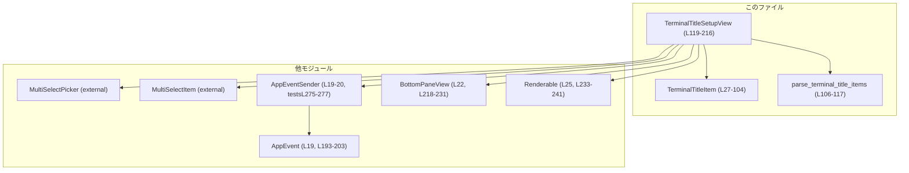
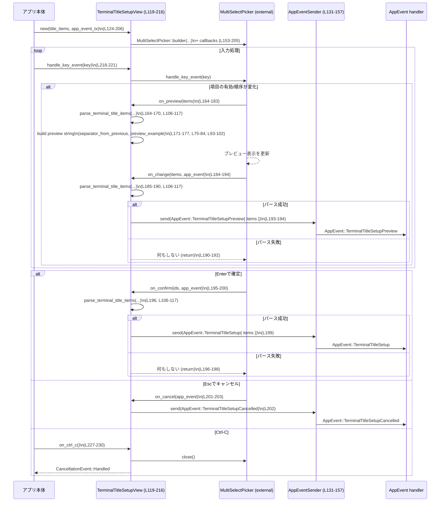

# tui/src/bottom_pane/title_setup.rs

## 0. ざっくり一言

ターミナルウィンドウ／タブのタイトルに表示する項目（アプリ名・プロジェクト名・スピナーなど）をユーザーが選択・並べ替えできるポップアップビューを実装したモジュールです。  
内部では `MultiSelectPicker` を用いて対話的な一覧を表示し、選択結果を `AppEvent` としてアプリ本体に通知します（`tui/src/bottom_pane/title_setup.rs:L119-205`）。

---

## 1. このモジュールの役割

### 1.1 概要

- このモジュールは **「ターミナルタイトルにどの情報をどの順序で表示するか」** をユーザーが GUI 的に設定できるようにするために存在します。
- タイトルに配置可能な項目を `TerminalTitleItem` 列挙体として定義し（`tui/src/bottom_pane/title_setup.rs:L27-51`）、それらを選択・並べ替え・プレビューできる `TerminalTitleSetupView` を提供します（`tui/src/bottom_pane/title_setup.rs:L119-216`）。
- 設定結果は `AppEvent::TerminalTitleSetup{ items }` 等のイベントとして送出され、実際のタイトルレンダリング側で利用されます（`tui/src/bottom_pane/title_setup.rs:L193-200`）。

### 1.2 アーキテクチャ内での位置づけ

このファイル内の主なコンポーネントと、他モジュールとの依存関係は次のようになります。



- `TerminalTitleItem` はタイトルに出せる項目の列挙と、その説明／プレビュー文字列／区切り文字ロジックを提供します（`tui/src/bottom_pane/title_setup.rs:L27-104`）。
- `TerminalTitleSetupView` は `MultiSelectPicker` をラップして、`BottomPaneView` ＆ `Renderable` としてボトムペインに統合されます（`tui/src/bottom_pane/title_setup.rs:L119-216, 218-241`）。
- ユーザーの操作に応じて、`AppEventSender` 経由で `AppEvent::*` が送出されます（`tui/src/bottom_pane/title_setup.rs:L184-203`）。

### 1.3 設計上のポイント

- **列挙体によるタイトル項目の定義**
  - `TerminalTitleItem` は `EnumIter`, `EnumString`, `Display` を実装しており、  
    - 列挙値から kebab-case 文字列への変換（`Display` + `#[strum(serialize_all = "kebab-case")]`）  
    - 文字列から列挙値へのパース（`EnumString`）  
    - 列挙値の全列挙（`EnumIter`）  
    を可能にしています（`tui/src/bottom_pane/title_setup.rs:L32-33`）。
- **設定ファイルとの互換性を重視**
  - 列挙値は kebab-case 文字列としてユーザー設定に保存されるため、**バリアント名の変更は設定の破壊的変更になる** と明記されています（`tui/src/bottom_pane/title_setup.rs:L27-31`）。
- **パースは「全件成功」前提**
  - `parse_terminal_title_items` は 1 つでも不正な ID が混ざると `None` を返し、部分的な成功は認めません（`tui/src/bottom_pane/title_setup.rs:L106-117`）。
  - これにより、アプリに渡されるタイトル構成は常に完全に解釈された `TerminalTitleItem` のみになります。
- **UI レベルでの安全性**
  - `on_change` / `on_confirm` いずれも `parse_terminal_title_items` による検証後にしか `AppEvent` を送出しないため、不正 ID を含む状態ではイベントが送出されません（`tui/src/bottom_pane/title_setup.rs:L184-200`）。
  - `Ctrl-C` はビュー内でクローズ扱いとして処理され、キャンセルイベントとして扱われる前提になっています（`tui/src/bottom_pane/title_setup.rs:L227-230`）。
- **並行性・エラー処理**
  - `AppEventSender` は `tokio::sync::mpsc::UnboundedSender` 上のラッパであることがテストから分かります（`tui/src/bottom_pane/title_setup.rs:L248, L275-277`）。
  - `send` の戻り値はこのモジュール内では無視されており、送信失敗時の扱いは `AppEventSender` 側に委ねられています（`tui/src/bottom_pane/title_setup.rs:L193-203`）。

---

## 2. 主要な機能一覧

- ターミナルタイトル項目の列挙: `TerminalTitleItem` による表示可能項目の定義と文字列表現／説明文／プレビュー用テキストの提供（`tui/src/bottom_pane/title_setup.rs:L27-86`）。
- タイトル項目 ID の一括パース: 文字列 ID の列から `TerminalTitleItem` のベクタに変換する `parse_terminal_title_items`（`tui/src/bottom_pane/title_setup.rs:L106-117`）。
- タイトル設定ビューの構築: 既存設定を反映した `TerminalTitleSetupView::new` による `MultiSelectPicker` の構築（`tui/src/bottom_pane/title_setup.rs:L124-205`）。
- プレビュー生成: 選択された項目からタイトルプレビュー文字列を組み立てる `on_preview` コールバック（`tui/src/bottom_pane/title_setup.rs:L164-183`）。
- 設定変更の通知: 選択の変更／確定／キャンセルを `AppEvent` として送出する `on_change` / `on_confirm` / `on_cancel` コールバック（`tui/src/bottom_pane/title_setup.rs:L184-203`）。
- ボトムペインビュー／レンダリング統合: `BottomPaneView` / `Renderable` 実装を通じたキー入力処理と描画処理の委譲（`tui/src/bottom_pane/title_setup.rs:L218-241`）。

---

## 3. 公開 API と詳細解説

### 3.1 型一覧（構造体・列挙体など）

| 名前 | 種別 | 役割 / 用途 | 主なフィールド / バリアント | 定義 |
|------|------|-------------|------------------------------|------|
| `TerminalTitleItem` | 列挙体 | ターミナルタイトルに表示可能な項目の集合。設定ファイル上の文字列 ID（kebab-case）と 1:1 対応します。 | `AppName`, `Project`, `Spinner`, `Status`, `Thread`, `GitBranch`, `Model`, `TaskProgress` | `tui/src/bottom_pane/title_setup.rs:L27-51` |
| `TerminalTitleSetupView` | 構造体 | ターミナルタイトル項目を選択・並べ替えするポップアップビュー。`BottomPaneView` + `Renderable` を実装し、内部に `MultiSelectPicker` を保持します。 | `picker: MultiSelectPicker` | `tui/src/bottom_pane/title_setup.rs:L119-122` |

### 3.1.1 コンポーネントインベントリー（関数・メソッド）

このチャンク内で定義されている主な関数・メソッドの一覧です。

| シンボル | 種別 | 概要 | 定義 |
|---------|------|------|------|
| `TerminalTitleItem::description` | メソッド | 各タイトル項目の説明文（英語）を返します。 | `tui/src/bottom_pane/title_setup.rs:L53-69` |
| `TerminalTitleItem::preview_example` | メソッド | プレビュー表示用のサンプル文字列を返します（実データではありません）。 | `tui/src/bottom_pane/title_setup.rs:L71-86` |
| `TerminalTitleItem::separator_from_previous` | メソッド | 前の項目との間に挿入する区切り文字列（空文字 / `" "` / `" | "`）を返します。 | `tui/src/bottom_pane/title_setup.rs:L88-103` |
| `parse_terminal_title_items` | 関数 | 文字列 ID のイテレータを `TerminalTitleItem` ベクタにパースします（全-or-無）。 | `tui/src/bottom_pane/title_setup.rs:L106-117` |
| `TerminalTitleSetupView::new` | 関数 | 既存設定と `AppEventSender` からターミナルタイトル設定ビューを構築します。 | `tui/src/bottom_pane/title_setup.rs:L124-206` |
| `TerminalTitleSetupView::title_select_item` | 関数 | 1 つの `TerminalTitleItem` を `MultiSelectItem` に変換します。 | `tui/src/bottom_pane/title_setup.rs:L208-215` |
| `BottomPaneView::handle_key_event` (for `TerminalTitleSetupView`) | メソッド | キーイベントを内部の `MultiSelectPicker` に委譲します。 | `tui/src/bottom_pane/title_setup.rs:L218-221` |
| `BottomPaneView::is_complete` | メソッド | ビューの完了状態（確定／キャンセル済みか）を返します。 | `tui/src/bottom_pane/title_setup.rs:L223-225` |
| `BottomPaneView::on_ctrl_c` | メソッド | Ctrl-C を受けた際にピッカーを閉じ、`CancellationEvent::Handled` を返します。 | `tui/src/bottom_pane/title_setup.rs:L227-230` |
| `Renderable::render` (for `TerminalTitleSetupView`) | メソッド | 指定領域にビューを描画します（`MultiSelectPicker` に委譲）。 | `tui/src/bottom_pane/title_setup.rs:L233-236` |
| `Renderable::desired_height` | メソッド | 与えられた幅に対する必要高さを返します。 | `tui/src/bottom_pane/title_setup.rs:L238-240` |
| `render_lines` (tests) | 関数 | テスト用にビューの描画結果を文字列として取得します。 | `tui/src/bottom_pane/title_setup.rs:L250-271` |

---

### 3.2 関数詳細（重要なもの）

#### `TerminalTitleItem::description(self) -> &'static str`

**概要**

各タイトル項目がユーザーにどう説明されるかを示す英語テキストを返します。UI 上の説明文に使用されます（`tui/src/bottom_pane/title_setup.rs:L53-69`）。

**引数**

| 引数名 | 型 | 説明 |
|--------|----|------|
| `self` | `TerminalTitleItem` | 説明を取得したいタイトル項目の列挙値です。値レシーバ（コピー型）です。 |

**戻り値**

- `&'static str`: 項目の意味を説明する英語の固定文字列です。

**内部処理の流れ**

- `match self` で全バリアントを網羅し、それぞれに対応する説明文字列を返します（`tui/src/bottom_pane/title_setup.rs:L55-67`）。
- 文字列はすべてリテラルで、動的生成やロケール差分はありません。

**Examples（使用例）**

```rust
// タイトル項目の説明文を UI に表示する例
let item = TerminalTitleItem::Project;              // プロジェクト名を表すバリアント
let description = item.description();               // "Project name (falls back to current directory name)"
println!("説明: {}", description);                  // 説明テキストを表示
```

**Errors / Panics**

- エラーやパニック要因はありません。`match` がすべてのバリアントを網羅しているため、未定義パターンもありません（`tui/src/bottom_pane/title_setup.rs:L55-67`）。

**Edge cases（エッジケース）**

- どのバリアントでも常に対応する固定文字列が返ります。空文字列はありません。

**使用上の注意点**

- ロケールに依存しない英語テキストであるため、多言語対応が必要な場合は別レイヤーで扱う必要があります。
- 設定 UI の文言を変えたい場合はここを変更することになります（`tui/src/bottom_pane/title_setup.rs:L53-69`）。

---

#### `TerminalTitleItem::preview_example(self) -> &'static str`

**概要**

タイトル設定ビューのプレビュー用に、各項目がどのような値として表示されるかを示すサンプル文字列を返します（実際のセッションデータではありません）（`tui/src/bottom_pane/title_setup.rs:L71-85`）。

**引数**

| 引数名 | 型 | 説明 |
|--------|----|------|
| `self` | `TerminalTitleItem` | プレビュー文字列を取得したいバリアントです。 |

**戻り値**

- `&'static str`: プレビュー用のサンプル値（例: `"my-project"`, `"feat/awesome-feature"`）。

**内部処理の流れ**

- `match self` で各バリアントに対し、例示的な値を返します（`tui/src/bottom_pane/title_setup.rs:L75-84`）。

**Examples（使用例）**

```rust
// プレビュー用タイトルを単純に結合する例
let items = [
    TerminalTitleItem::Project,
    TerminalTitleItem::Spinner,
    TerminalTitleItem::Status,
];

let preview = items
    .iter()
    .map(|item| item.preview_example())             // 各項目のサンプル値を取得
    .collect::<Vec<_>>()
    .join(" | ");                                   // 区切り文字はここでは単純に " | "

println!("プレビュー: {}", preview);                // "my-project | ⠋ | Working" のような文字列
```

**Errors / Panics**

- なし。すべてのバリアントに対し文字列リテラルが返ります（`tui/src/bottom_pane/title_setup.rs:L75-84`）。

**Edge cases**

- 戻り値が空文字列になるケースはありません。

**使用上の注意点**

- コメントにもある通り「Illustrative sample values, not live data」です（`tui/src/bottom_pane/title_setup.rs:L71-74`）。実データと混同しないように注意する必要があります。

---

#### `TerminalTitleItem::separator_from_previous(self, previous: Option<Self>) -> &'static str`

**概要**

タイトル文字列を構築するときに、直前の項目との間に挿入すべき区切り文字列を返します。スピナーだけは前後を単純なスペースで囲むなど、視認性を意識した挙動になっています（`tui/src/bottom_pane/title_setup.rs:L88-103`）。

**引数**

| 引数名 | 型 | 説明 |
|--------|----|------|
| `self` | `TerminalTitleItem` | 現在追加しようとしている項目です。 |
| `previous` | `Option<TerminalTitleItem>` | 直前に追加された項目。先頭項目の場合は `None`。 |

**戻り値**

- `&'static str`: `""`（先頭の場合）、`" "`（スピナー関連）、`" | "` のいずれか。

**内部処理の流れ**

1. `previous` が `None` の場合は、先頭項目とみなし空文字列 `""` を返します（`tui/src/bottom_pane/title_setup.rs:L94-95`）。
2. `Some(previous)` かつ  
   - `previous == Spinner` もしくは  
   - `self == Spinner`  
   の場合は、スペース `" "` を返します（`tui/src/bottom_pane/title_setup.rs:L96-100`）。
3. 上記以外の `Some(_)` の場合は `" | "` を返します（`tui/src/bottom_pane/title_setup.rs:L101`）。

**Examples（使用例）**

```rust
// 区切り文字ロジックを使ってプレビュータイトルを構築する例
let items = [
    TerminalTitleItem::Project,
    TerminalTitleItem::Spinner,
    TerminalTitleItem::Status,
];

let mut title = String::new();
let mut prev = None;

for item in items {
    title.push_str(item.separator_from_previous(prev));  // 区切り文字
    title.push_str(item.preview_example());              // サンプル値
    prev = Some(item);
}

assert_eq!(title, "my-project ⠋ Working");              // スピナー前後はスペースのみ
```

**Errors / Panics**

- なし。`match` が `Option<Self>` のすべてのパターンをカバーしており、外部要因によるエラーもありません（`tui/src/bottom_pane/title_setup.rs:L93-102`）。

**Edge cases**

- 項目が 1 つだけの場合: `previous` は常に `None` で、先頭に区切りは付きません。
- スピナーが連続する場合: 両方とも前後スペース扱いになり、 `" ⠋ ⠙"` のようになります。

**使用上の注意点**

- 区切りルールを変えたい場合（例: すべて `" | "` にするなど）は、このメソッドのみを変更すればよい構造になっています。

**根拠**

- ロジックはコメントと実装から読み取れます（`tui/src/bottom_pane/title_setup.rs:L88-103`）。

---

#### `fn parse_terminal_title_items<T>(ids: impl Iterator<Item = T>) -> Option<Vec<TerminalTitleItem>> where T: AsRef<str>`

**概要**

文字列 ID のイテレータから `TerminalTitleItem` ベクタを生成します。1 つでも不正な ID が含まれていれば `None` を返す、**全-or-無** のパース関数です（`tui/src/bottom_pane/title_setup.rs:L106-117`）。

**引数**

| 引数名 | 型 | 説明 |
|--------|----|------|
| `ids` | `impl Iterator<Item = T>` | 各要素がタイトル項目 ID を表す文字列（`T: AsRef<str>`）のイテレータです。 |

**戻り値**

- `Option<Vec<TerminalTitleItem>>`:
  - `Some(Vec<...>)`: すべての ID が正しくパースできた場合。
  - `None`: 1 つでも不正 ID が含まれていた場合。

**内部処理の流れ**

1. `ids.map(|id| id.as_ref().parse::<TerminalTitleItem>())` で、各 ID を `strum` の `EnumString` 実装により `Result<TerminalTitleItem, _>` に変換します（`tui/src/bottom_pane/title_setup.rs:L114`）。
2. `.collect::<Result<Vec<_>, _>>()` で `Result<Vec<TerminalTitleItem>, _>` にまとめます。1 つでも `Err` があれば全体が `Err` になります（`tui/src/bottom_pane/title_setup.rs:L115`）。
3. `.ok()` によって `Result` を `Option` に変換し、`Ok(...)` なら `Some(vec)`、`Err(_)` なら `None` を返します（`tui/src/bottom_pane/title_setup.rs:L116`）。

**Examples（使用例）**

```rust
// 設定ファイルから読み込んだ ID リストをパースする例
let ids = vec!["project".to_string(), "spinner".to_string()];
let parsed = parse_terminal_title_items(ids.iter());          // &String は AsRef<str> を満たす

match parsed {
    Some(items) => {
        // items == [TerminalTitleItem::Project, TerminalTitleItem::Spinner]
    }
    None => {
        // 1つでも不正IDがあればこちら
    }
}
```

**Errors / Panics**

- パースに失敗した場合もパニックはせず `None` を返します（`tui/src/bottom_pane/title_setup.rs:L114-117`）。
- `unwrap` / `expect` の使用はなく、外部エラーを返り値に反映させる設計です。

**Edge cases**

- 空イテレータの場合: `collect` により `Ok(Vec::new())` となり、結果は `Some(Vec::new())` です。
- ID が 1 つだけ不正な場合: 全体が `Err` になり、結果は `None` です（テストで確認されています、`tui/src/bottom_pane/title_setup.rs:L306-308`）。
- ID の順序はそのまま保持されることがテストで検証されています（`tui/src/bottom_pane/title_setup.rs:L291-303`）。

**使用上の注意点**

- 部分的な成功を認めないため、**不正 ID が 1 つでも混ざると全体が捨てられる** 点に注意が必要です。
- 呼び出し側では `None` の場合にどう扱うか（例: イベント送出をスキップするなど）を明確にする必要があります。  
  本モジュール内では `on_change` / `on_confirm` で `None` の場合はただ return しています（`tui/src/bottom_pane/title_setup.rs:L184-192, L195-199`）。

---

#### `pub(crate) fn TerminalTitleSetupView::new(title_items: Option<&[String]>, app_event_tx: AppEventSender) -> Self`

**概要**

既存のタイトル設定（文字列 ID のリスト）と `AppEventSender` を受け取り、`MultiSelectPicker` によるターミナルタイトル設定ビューを構築します（`tui/src/bottom_pane/title_setup.rs:L124-206`）。  
既存設定で指定された項目は選択済みかつ先頭に並び、未指定の項目はその後に非選択状態で並びます。

**引数**

| 引数名 | 型 | 説明 |
|--------|----|------|
| `title_items` | `Option<&[String]>` | 既存設定として保存されているタイトル項目 ID のリスト。`None` の場合は既定順のみ。 |
| `app_event_tx` | `AppEventSender` | 設定変更・プレビュー・キャンセル等のイベントを送るための送信オブジェクトです。 |

**戻り値**

- `Self`（`TerminalTitleSetupView`）: ボトムペインに貼り付けて利用できる設定ビュー。

**内部処理の流れ（アルゴリズム）**

1. **既存設定のパースと重複排除**  
   - `title_items.into_iter().flatten()` で `Option<&[String]>` を `Iterator<&String>` に変換（`tui/src/bottom_pane/title_setup.rs:L132-134`）。
   - 各 ID を `TerminalTitleItem` にパースし、失敗した ID は無視します（`filter_map(|id| id.parse::<TerminalTitleItem>().ok())`、`tui/src/bottom_pane/title_setup.rs:L135`）。
   - `.unique()` により重複を除去し、最初に現れた順序を保持します（`tui/src/bottom_pane/title_setup.rs:L136-137`）。
2. **選択済み集合の作成**  
   - `selected_items.iter().copied().collect::<HashSet<_>>()` で、選択済み項目の集合を作成します（`tui/src/bottom_pane/title_setup.rs:L138-141`）。
3. **`MultiSelectItem` の一覧構築**  
   - 既存設定に出現した項目については `enabled=true` の `MultiSelectItem` に変換します（`tui/src/bottom_pane/title_setup.rs:L142-145`）。
   - `TerminalTitleItem::iter()` で全バリアントを列挙し、`selected_set` に含まれないものだけを `enabled=false` で追加します（`tui/src/bottom_pane/title_setup.rs:L146-149`）。
4. **`MultiSelectPicker` の構築**  
   - タイトル・サブタイトル・説明文（instructions）を設定し、`items(items)` で上記項目一覧をセットします（`tui/src/bottom_pane/title_setup.rs:L153-163`）。
   - `.enable_ordering()` で並べ替え操作を有効にします（`tui/src/bottom_pane/title_setup.rs:L163`）。
5. **コールバック設定**
   - `on_preview`: 現在の有効項目からプレビュー行を生成し、`Line` として返します（`tui/src/bottom_pane/title_setup.rs:L164-183`）。
   - `on_change`: 有効項目のリストが変更されたら `parse_terminal_title_items` で検証し、成功時に `AppEvent::TerminalTitleSetupPreview { items }` を送出します（`tui/src/bottom_pane/title_setup.rs:L184-194`）。
   - `on_confirm`: 確定時に並び順を含む ID リストを `parse_terminal_title_items` で検証し、成功時に `AppEvent::TerminalTitleSetup { items }` を送出します（`tui/src/bottom_pane/title_setup.rs:L195-200`）。
   - `on_cancel`: キャンセル時に `AppEvent::TerminalTitleSetupCancelled` を送出します（`tui/src/bottom_pane/title_setup.rs:L201-203`）。
6. `.build()` で `MultiSelectPicker` インスタンスを確定し、`TerminalTitleSetupView { picker }` として返却します（`tui/src/bottom_pane/title_setup.rs:L204-205`）。

**Examples（使用例）**

```rust
// 既存設定とイベント送信を組み合わせてビューを作成する例
use crate::app_event::AppEvent;
use crate::app_event_sender::AppEventSender;
use tokio::sync::mpsc::unbounded_channel;

let (tx_raw, mut rx) = unbounded_channel::<AppEvent>();   // AppEvent の送信チャネル
let app_event_tx = AppEventSender::new(tx_raw);           // ラッパを作成（定義は別モジュール）

// 設定ファイルから読み込んだタイトル項目ID
let selected = vec![
    "project".to_string(),
    "spinner".to_string(),
    "status".to_string(),
    "thread".to_string(),
];

let mut view = TerminalTitleSetupView::new(Some(&selected), app_event_tx); // ビューを構築

// あとは BottomPaneView / Renderable 経由でイベント処理・描画に組み込む
```

**Errors / Panics**

- 不正な ID が `title_items` に含まれていてもパニックはせず、単に無視されます（`filter_map(... .ok())`、`tui/src/bottom_pane/title_setup.rs:L135`）。
- `AppEventSender::send` の戻り値は無視しており、送信失敗時の挙動はこのモジュールからは分かりません（`tui/src/bottom_pane/title_setup.rs:L193-203`）。
- `unwrap` / `expect` などの危険な呼び出しは使用していません。

**Edge cases**

- `title_items == None`: 既存設定がない場合、すべての `TerminalTitleItem` が `enabled=false` として列挙されます（`tui/src/bottom_pane/title_setup.rs:L132-137` の `into_iter().flatten()` 挙動から）。
- `title_items` に重複 ID が含まれる場合: `.unique()` により先に現れたものだけが使われ、後続の同じ ID は無視されます（`tui/src/bottom_pane/title_setup.rs:L136`）。
- `title_items` に不正 ID が含まれる場合: その要素だけが除外され、他の正しい ID はそのまま使用されます（`filter_map` が `ok()` だけを通過させるため、`tui/src/bottom_pane/title_setup.rs:L135`）。

**使用上の注意点**

- コメントにもある通り、**「不明な ID はここではスキップ」** され、TUI 本体側で警告される設計です（`tui/src/bottom_pane/title_setup.rs:L124-130`）。
- `AppEventSender` は `Clone` などの性質がこのファイルからは分かりませんが、`new` の引数では所有権をムーブする形になっています。複数ビューで同じ送信者を共有したい場合は、`AppEventSender` 側の API を確認する必要があります。

**根拠**

- 上記挙動は `new` の実装とコメント、およびテスト `renders_title_setup_popup` から読み取れます（`tui/src/bottom_pane/title_setup.rs:L124-205, L273-288`）。

---

#### `fn TerminalTitleSetupView::title_select_item(item: TerminalTitleItem, enabled: bool) -> MultiSelectItem`

**概要**

1 つの `TerminalTitleItem` から、`MultiSelectPicker` で利用する `MultiSelectItem` を構築します。  
ID と表示名にはどちらも `item.to_string()`（kebab-case）を使い、説明には `item.description()` を使用します（`tui/src/bottom_pane/title_setup.rs:L208-215`）。

**引数**

| 引数名 | 型 | 説明 |
|--------|----|------|
| `item` | `TerminalTitleItem` | 対象となるタイトル項目です。 |
| `enabled` | `bool` | 初期状態で選択されているかどうか。`true` なら選択済み。 |

**戻り値**

- `MultiSelectItem`: `MultiSelectPicker` に渡すためのアイテム構造体。

**内部処理の流れ**

1. `item.to_string()` を ID と表示名の両方にセットします（`tui/src/bottom_pane/title_setup.rs:L210-211`）。
2. `item.description().to_string()` を `description: Some(...)` にセットします（`tui/src/bottom_pane/title_setup.rs:L212`）。
3. `enabled` フラグをそのままフィールドにコピーします（`tui/src/bottom_pane/title_setup.rs:L213`）。

**Examples（使用例）**

```rust
// 1項目だけを MultiSelectItem に変換する例
let item = TerminalTitleItem::GitBranch;
let select_item = TerminalTitleSetupView::title_select_item(item, true);

// select_item.id == "git-branch"
// select_item.name == "git-branch"
// select_item.description == Some("Current Git branch (omitted when unavailable)".to_string())
// select_item.enabled == true
```

**Errors / Panics**

- なし。文字列変換とフィールド代入のみです（`tui/src/bottom_pane/title_setup.rs:L208-215`）。

**Edge cases**

- `enabled=false` でも `id` / `name` / `description` は設定されるため、UI 上では非選択状態で表示されます。

**使用上の注意点**

- `id` と `name` の両方に kebab-case 文字列を使っているため、表示名を人間向けにしたい場合は `name` の生成ロジック変更が必要です。

---

#### `impl BottomPaneView for TerminalTitleSetupView` のメソッド（まとめ）

ここでは 3 つのメソッドをまとめて扱います（`tui/src/bottom_pane/title_setup.rs:L218-231`）。

##### `fn handle_key_event(&mut self, key_event: crossterm::event::KeyEvent)`

**概要**

- 与えられたキーイベントをそのまま内部の `MultiSelectPicker` に転送します（`tui/src/bottom_pane/title_setup.rs:L219-221`）。

**Errors / Panics / Edge cases**

- エラー処理や戻り値はなく、`MultiSelectPicker::handle_key_event` 側の挙動に依存します。
- Ctrl-C など特定キーの扱いもピッカー側に委譲されます。

##### `fn is_complete(&self) -> bool`

**概要**

- 内部の `self.picker.complete` を返すラッパで、ユーザー操作が完了しているかどうかを示します（`tui/src/bottom_pane/title_setup.rs:L223-225`）。

##### `fn on_ctrl_c(&mut self) -> CancellationEvent`

**概要**

- Ctrl-C を受けた際に `self.picker.close()` を呼び、`CancellationEvent::Handled` を返します（`tui/src/bottom_pane/title_setup.rs:L227-230`）。
- これにより、Ctrl-C がアプリ全体の終了ではなく「このビューを閉じる」操作として扱われます。

**使用上の注意点**

- Ctrl-C を「キャンセル」操作（かつ、アプリ全体には伝播しない）として扱う前提になっています。他のビューとの一貫性を保つ必要があります。

---

#### `impl Renderable for TerminalTitleSetupView` のメソッド（まとめ）

##### `fn render(&self, area: Rect, buf: &mut Buffer)`

- 描画領域とバッファを受け取り、`self.picker.render(area, buf)` に委譲します（`tui/src/bottom_pane/title_setup.rs:L233-236`）。

##### `fn desired_height(&self, width: u16) -> u16`

- 与えられた幅に対して `self.picker.desired_height(width)` を返します（`tui/src/bottom_pane/title_setup.rs:L238-240`）。

いずれも UI 描画ロジックは `MultiSelectPicker` 側に集約されており、このモジュールはラッパに徹しています。

---

### 3.3 その他の関数

テストや単純なラッパ関数をまとめます。

| 関数名 | 役割（1 行） | 定義 |
|--------|--------------|------|
| `render_lines` | テスト用: ビューを描画し、内容を文字列として取得する。 | `tui/src/bottom_pane/title_setup.rs:L250-271` |
| `renders_title_setup_popup` | スナップショットによってビューの見た目を検証するテスト。 | `tui/src/bottom_pane/title_setup.rs:L273-288` |
| `parse_terminal_title_items_preserves_order` | パース時に並び順が維持されることを検証するテスト。 | `tui/src/bottom_pane/title_setup.rs:L290-303` |
| `parse_terminal_title_items_rejects_invalid_ids` | 不正 ID が含まれると `None` になることを検証するテスト。 | `tui/src/bottom_pane/title_setup.rs:L305-308` |
| `parse_terminal_title_items_accepts_kebab_case_variants` | kebab-case ID が正しくパースされることを検証するテスト。 | `tui/src/bottom_pane/title_setup.rs:L311-320` |

---

## 4. データフロー

### 4.1 代表的なシナリオの流れ

シナリオ: 「ユーザーがタイトル設定ビューを開き、項目を選択・並べ替えし、プレビューを確認しながら確定する」。

1. アプリは既存設定 `Option<&[String]>` と `AppEventSender` を用いて `TerminalTitleSetupView::new` を呼び出し、ビューを構築します（`tui/src/bottom_pane/title_setup.rs:L124-131`）。
2. ビューは `MultiSelectPicker` を内部に構築し、`on_preview` / `on_change` / `on_confirm` / `on_cancel` コールバックを登録します（`tui/src/bottom_pane/title_setup.rs:L153-205`）。
3. ユーザーのキー操作は `BottomPaneView::handle_key_event` を通して `MultiSelectPicker` に渡ります（`tui/src/bottom_pane/title_setup.rs:L218-221`）。
4. 選択状態が変化するたびに `on_preview` と `on_change` が呼び出され、  
   - `parse_terminal_title_items` で有効項目 ID を検証し（`tui/src/bottom_pane/title_setup.rs:L164-170, L185-190`）、  
   - `TerminalTitleItem::preview_example` と `separator_from_previous` によりプレビュー文字列が生成されます（`tui/src/bottom_pane/title_setup.rs:L171-177`）。
   - `on_change` では、パース成功時に `AppEvent::TerminalTitleSetupPreview { items }` が送出されます（`tui/src/bottom_pane/title_setup.rs:L193-194`）。
5. ユーザーが Enter で確定すると、`on_confirm` が呼ばれ、同様に ID をパースしたあと `AppEvent::TerminalTitleSetup { items }` が送出されます（`tui/src/bottom_pane/title_setup.rs:L195-200`）。
6. Esc またはキャンセル操作の場合は `on_cancel` が呼ばれ、`AppEvent::TerminalTitleSetupCancelled` が送出されます（`tui/src/bottom_pane/title_setup.rs:L201-203`）。
7. Ctrl-C が押された場合は `on_ctrl_c` でピッカーを閉じ、キャンセル処理が行われたとみなされます（`tui/src/bottom_pane/title_setup.rs:L227-230`）。

### 4.2 シーケンス図



---

## 5. 使い方（How to Use）

### 5.1 基本的な使用方法

ターミナルタイトル設定ビューをアプリに組み込む最小限の流れは次のようになります。

```rust
use tui::bottom_pane::title_setup::TerminalTitleSetupView; // このモジュール
use crate::app_event::AppEvent;                            // イベント定義
use crate::app_event_sender::AppEventSender;
use tokio::sync::mpsc::unbounded_channel;

// 1. AppEvent送信用チャネルを用意する
let (tx_raw, mut rx) = unbounded_channel::<AppEvent>();     // 非同期イベントチャネル
let app_event_tx = AppEventSender::new(tx_raw);             // ラッパ（別モジュール定義）

// 2. 設定ファイルから既存タイトル項目IDを読み込む（例）
let configured_ids: Vec<String> = vec![
    "project".into(),
    "spinner".into(),
    "status".into(),
];

// 3. ビューを構築する
let mut view = TerminalTitleSetupView::new(Some(&configured_ids), app_event_tx);

// 4. イベントループ内でキーイベントと描画を委譲する
// （擬似コード）
/*
loop {
    let key = read_key_event();
    view.handle_key_event(key);                     // BottomPaneView経由

    // レイアウト計算の一部として高さを取得
    let width = 80;
    let height = view.desired_height(width);
    let area = Rect::new(0, 0, width, height);
    view.render(area, &mut buffer);                // Renderable経由

    // AppEvent を受信し、タイトルレンダリングロジック等に反映
    while let Ok(event) = rx.try_recv() {
        match event {
            AppEvent::TerminalTitleSetup { items } => { /* 設定を保存 */ }
            AppEvent::TerminalTitleSetupPreview { items } => { /* プレビュー */ }
            AppEvent::TerminalTitleSetupCancelled => { /* キャンセル処理 */ }
            _ => {}
        }
    }

    if view.is_complete() {
        break;
    }
}
*/
```

このコードは概念的な例であり、`AppEventSender` や `BottomPaneView` をどう統合するかは他ファイルの設計に依存します。

### 5.2 よくある使用パターン

- **設定ファイルからの初期化**
  - `title_items: Option<&[String]>` に設定ファイルから読み込んだ ID リストを渡し、`TerminalTitleSetupView::new` でビューを構築します（`tui/src/bottom_pane/title_setup.rs:L131-137`）。
- **プレビューのリアルタイム反映**
  - `AppEvent::TerminalTitleSetupPreview { items }` を受け取った側で、まだ確定していないタイトルを一時的に適用することで、ユーザーが結果を確認しながら調整できるようにできます（`tui/src/bottom_pane/title_setup.rs:L193-194`）。
- **確定とキャンセルの区別**
  - `TerminalTitleSetup { items }` と `TerminalTitleSetupCancelled` を別々に処理し、確定時だけ設定ファイルを書き換えるなどの制御が可能です（`tui/src/bottom_pane/title_setup.rs:L195-203`）。

### 5.3 よくある間違い

```rust
// 間違い例: title_items に不正IDが混ざっていることを想定していない
let configured_ids = vec![
    "project".to_string(),
    "unknown-item".to_string(),  // ここは TerminalTitleItem には存在しない
];

let view = TerminalTitleSetupView::new(Some(&configured_ids), app_event_tx);
// → new 内では不正IDがサイレントに無視される (filter_map + .ok())
//   そのため、「unknown-item」が設定されていると思い込むと齟齬が生じる
```

```rust
// 正しい例: parse_terminal_title_items で事前検証しておく
let configured_ids = vec![
    "project".to_string(),
    "unknown-item".to_string(),
];

if parse_terminal_title_items(configured_ids.iter()).is_none() {
    // エラー: 設定ファイルの内容が不正であることをログ等で通知する
}

let view = TerminalTitleSetupView::new(Some(&configured_ids), app_event_tx);
// new内では不正IDが無視されるが、事前検証によりユーザーに警告できる
```

### 5.4 使用上の注意点（まとめ）

- **設定互換性**
  - `TerminalTitleItem` のバリアント名は設定ファイルの文字列 ID に直結しており、コメントでも「renaming or removing a variant is a breaking config change」と明記されています（`tui/src/bottom_pane/title_setup.rs:L27-31`）。
- **パースの全-or-無**
  - `parse_terminal_title_items` が 1 つでも不正 ID を含めば `None` を返すため、呼び出し側で `None` 時の扱いを明確にする必要があります（`tui/src/bottom_pane/title_setup.rs:L106-117`）。
- **イベント送信の失敗**
  - `AppEventSender::send` の戻り値は無視されているため、送信失敗時の扱いはここからは見えません。高信頼が必要な場合は `AppEventSender` 側の挙動確認が必要です（`tui/src/bottom_pane/title_setup.rs:L193-203`）。
- **並行性**
  - テストでは `tokio::sync::mpsc::unbounded_channel` が使われており（`tui/src/bottom_pane/title_setup.rs:L248, L275-277`）、イベントキューが無制限に伸びる可能性があります。大量のプレビューイベントを高頻度で送る場合は、受信側の処理能力とのバランスに注意が必要です。

---

## 6. 変更の仕方（How to Modify）

### 6.1 新しいタイトル項目を追加する場合

1. **列挙体にバリアントを追加**
   - `TerminalTitleItem` に新しいバリアント（例: `Workspace`）を追加します（`tui/src/bottom_pane/title_setup.rs:L34-50` 近辺）。
2. **説明とプレビューを追加**
   - `description` の `match` に新バリアントの説明文を追加します（`tui/src/bottom_pane/title_setup.rs:L53-69`）。
   - `preview_example` の `match` にプレビュー用サンプル文字列を追加します（`tui/src/bottom_pane/title_setup.rs:L75-84`）。
3. **区切りロジックの確認**
   - `separator_from_previous` では特別扱いしていない限り追加は不要ですが、スピナーのような特別な区切りが必要なら分岐を追加します（`tui/src/bottom_pane/title_setup.rs:L93-102`）。
4. **テストの追加・更新**
   - `parse_terminal_title_items_accepts_kebab_case_variants` などに新しい ID を加えるなど、パース系テストを更新します（`tui/src/bottom_pane/title_setup.rs:L311-320`）。
5. **設定ファイルとの互換性**
   - 新しいバリアントは後方互換で追加できますが、既存バリアントの名前変更や削除は設定ファイルを壊すため、注意が必要です（`tui/src/bottom_pane/title_setup.rs:L27-31`）。

### 6.2 既存の機能を変更する場合

- **パースポリシーを変えたい場合**
  - 部分的な成功を許したい場合、`parse_terminal_title_items` の戻り値を `Result<Vec<TerminalTitleItem>, ParseError>` などに変更し、呼び出し側 (`on_preview` / `on_change` / `on_confirm`) のハンドリングも合わせて変更する必要があります（`tui/src/bottom_pane/title_setup.rs:L164-200`）。
- **プレビュー表示のフォーマットを変更したい場合**
  - `on_preview` 内で `preview` を組み立てている部分（`separator_from_previous` と `preview_example` の利用）を変更することで、表示フォーマットをカスタマイズできます（`tui/src/bottom_pane/title_setup.rs:L171-177`）。
- **完了条件を変更したい場合**
  - ビューの完了条件は `self.picker.complete` に依存しているため、`MultiSelectPicker` 側の仕様を確認しつつ変更する必要があります（`tui/src/bottom_pane/title_setup.rs:L223-225`）。

---

## 7. 関連ファイル

このモジュールと密接に関係する他モジュールは `use` 句から次のように読み取れます。

| パス | 役割 / 関係 |
|------|------------|
| `crate::app_event::AppEvent` | ターミナルタイトル設定（プレビュー／確定／キャンセル）を通知するためのイベント型（`tui/src/bottom_pane/title_setup.rs:L19, L193-203`）。 |
| `crate::app_event_sender::AppEventSender` | `AppEvent` を送信するラッパ。`tokio::sync::mpsc::unbounded_channel` の送信側と組み合わせて使われています（`tui/src/bottom_pane/title_setup.rs:L20, L248, L275-277`）。 |
| `crate::bottom_pane::bottom_pane_view::BottomPaneView` | このビューをボトムペインとして扱うためのトレイトインターフェース（`tui/src/bottom_pane/title_setup.rs:L22, L218-231`）。 |
| `crate::bottom_pane::multi_select_picker::{MultiSelectPicker, MultiSelectItem}` | 対話的なマルチ選択＋並べ替え UI の実装。本モジュールはそのビルダーと項目構造体を利用しています（`tui/src/bottom_pane/title_setup.rs:L23-24, L142-150, L153-205, L218-221, L233-240`）。 |
| `crate::bottom_pane::CancellationEvent` | Ctrl-C 処理の結果を表す型。`on_ctrl_c` の戻り値に使用されています（`tui/src/bottom_pane/title_setup.rs:L21, L227-230`）。 |
| `crate::render::renderable::Renderable` | TUI 描画のための共通トレイト。本モジュールでは `render` と `desired_height` を実装しています（`tui/src/bottom_pane/title_setup.rs:L25, L233-241`）。 |

これらのモジュールの具体的な実装はこのチャンクには現れないため、詳細な挙動はここからは分かりません。
