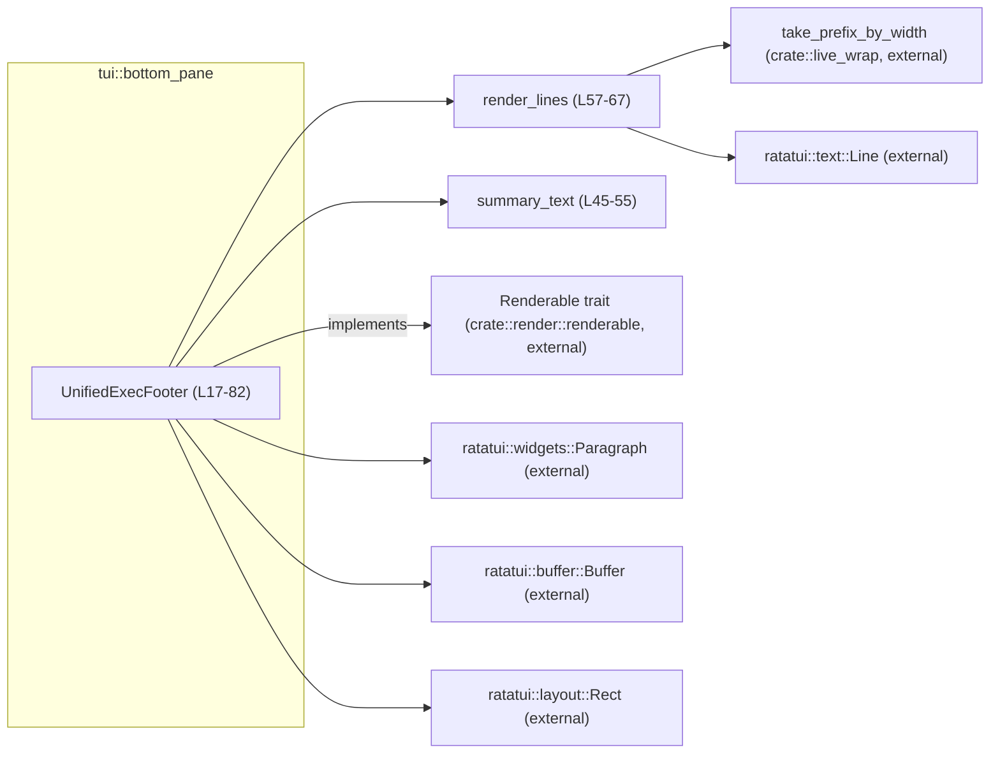
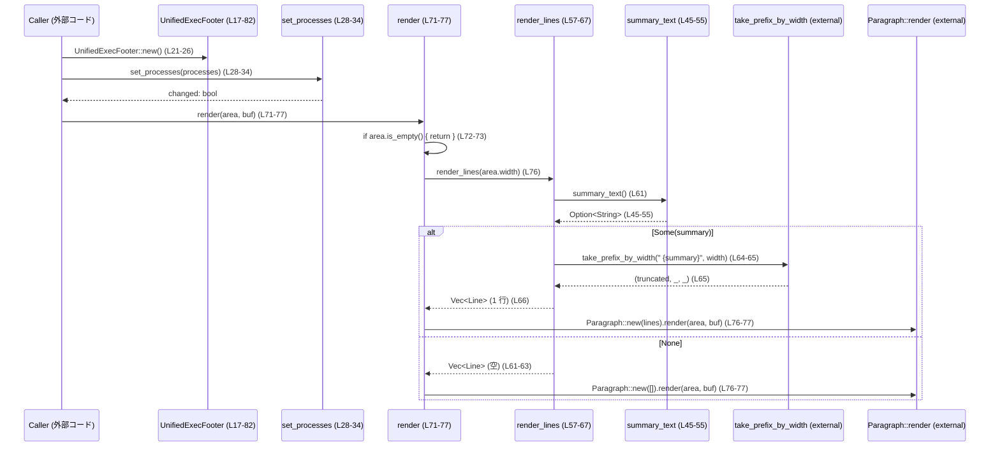

# tui/src/bottom_pane/unified_exec_footer.rs コード解説

## 0. ざっくり一言

unified-exec（バックグラウンド実行）セッションの件数を1行のサマリー文字列にまとめ、ボトムペイン用フッターとして描画する小さな状態付きコンポーネントです（`UnifiedExecFooter`）。  
同じサマリーテキストをフッター行・ステータス行の両方で再利用できるよう、文言生成ロジックを1か所に集約しています（`summary_text`）。  
（根拠: unified_exec_footer.rs:L1-5, L16-19, L40-55）

---

## 1. このモジュールの役割

### 1.1 概要

- unified-exec の「バックグラウンドで動作中の端末（terminal）の数」を数え、英語メッセージに整形します（`summary_text`）。  
- サマリーを「最大1行の dim(薄い) スタイルのテキスト」として描画するためのラッパーを提供します（`render_lines`, `render`, `desired_height`）。  
- 同じサマリーテキストをボトムペインの専用行やステータスバーなど、複数箇所で使い回せるよう、テキスト生成とレイアウト（インデントなど）を分離しています。  
（根拠: unified_exec_footer.rs:L16-19, L40-55, L57-67, L70-81）

### 1.2 アーキテクチャ内での位置づけ

このモジュールは TUI レンダリング層の一部として、以下のコンポーネントと連携しています。

- 外部依存
  - `ratatui::buffer::Buffer`, `ratatui::layout::Rect`, `ratatui::text::Line`, `ratatui::widgets::Paragraph`  
    … TUI バッファ・レイアウト・テキスト・ウィジェットの描画に使用（根拠: L7-11, L70-77）
  - `ratatui::style::Stylize`  
    … `.dim()` スタイル適用に使用（根拠: L9, L64-66）
  - `crate::live_wrap::take_prefix_by_width`  
    … 指定幅に収まるよう文字列を切り詰めるユーティリティ（詳細実装はこのチャンクには現れません）（根拠: L13, L64-66）
  - `crate::render::renderable::Renderable`  
    … 共通レンダリングインターフェース。`UnifiedExecFooter` はこれを実装しています（根拠: L14, L70-81）



### 1.3 設計上のポイント

- **シンプルな状態管理**  
  - 状態は「バックグラウンドプロセスのコマンド文字列の `Vec<String>`」のみです（`processes` フィールド）（根拠: L17-19）。
  - サマリーテキスト自体は都度 `summary_text` で生成し、キャッシュしません（根拠: L45-55）。

- **差分更新の検知**  
  - `set_processes` は新旧 `Vec<String>` の等値比較を行い、内容が変化したときだけ `true` を返します。これにより呼び出し側で「再描画や再計算が必要か」を判定できます（根拠: L28-34）。

- **表示有無の明確な契約**  
  - `summary_text` は「表示すべき内容がない場合は `None`」を返し、`render_lines` も空 `Vec` を返します（根拠: L45-48, L57-63）。
  - `desired_height` は `render_lines(width).len()` に等しく、最大 1 行であることが保証されます（根拠: L57-67, L79-81）。

- **レイアウトと文言の分離**  
  - `summary_text` はサマリーの文言のみ（先頭スペースや区切りなし）を返し、`render_lines` でフッター表示用のインデント `"  "` を付加します（根拠: L40-45, L64）。

- **安全性・エラーハンドリング**  
  - このファイル内には `unsafe` や明示的な `panic!` 呼び出しはなく、すべての公開メソッドはパニックを明示的には起こしません（根拠: 全文確認）。
  - エラー条件は `Option`（`summary_text`）と、戻り値 `bool`（`set_processes`）・`u16`（`desired_height`）による表現に留まっています。

- **並行性**  
  - このモジュール内にはスレッド生成・ロックなどの並行処理は登場しません。`&mut self` を通じてのみ内部状態を書き換えます（根拠: L21-38, L70-81）。

---

## 2. 主要な機能一覧（コンポーネントインベントリー）

### 2.1 型・メソッド・テストの一覧

| 種別 | 名前 | 役割 / 概要 | 定義位置 |
|------|------|------------|----------|
| struct | `UnifiedExecFooter` | バックグラウンド unified-exec プロセス群を追跡し、サマリーテキストを描画する状態付きコンポーネント | unified_exec_footer.rs:L17-19 |
| impl メソッド | `new()` | 空の `processes` を持つフッターを生成 | L21-26 |
| impl メソッド | `set_processes(&mut self, processes: Vec<String>) -> bool` | プロセス一覧を更新し、内容に変化があれば `true` を返す | L28-34 |
| impl メソッド | `is_empty(&self) -> bool` | バックグラウンドプロセスが 1 件もないかどうかを判定 | L36-38 |
| impl メソッド | `summary_text(&self) -> Option<String>` | 件数に応じたサマリーメッセージ（インデントなし）を生成。プロセスが無ければ `None` | L40-55 |
| impl メソッド（内部） | `render_lines(&self, width: u16) -> Vec<Line<'static>>` | 指定幅に収まる 1 行の `Line` を生成（なければ空） | L57-67 |
| trait impl | `render(&self, area: Rect, buf: &mut Buffer)` | `Renderable` トレイト実装。与えられた領域にフッターを描画 | L70-77 |
| trait impl | `desired_height(&self, width: u16) -> u16` | 指定幅で必要となる行数（0 または 1）を返す | L79-81 |
| テスト | `desired_height_empty` | プロセス 0 件で `desired_height` が 0 になることを確認 | L90-94 |
| テスト | `render_more_sessions` | プロセス 1 件時の描画結果スナップショットテスト | L96-105 |
| テスト | `render_many_sessions` | プロセス多数（123 件）時の描画結果スナップショットテスト | L107-116 |

### 2.2 提供機能（箇条書き）

- バックグラウンド unified-exec プロセス数の追跡と更新（`processes`, `set_processes`）  
- 「n background terminal(s) running · /ps to view · /stop to close」という固定フォーマットのサマリーテキスト生成（`summary_text`）  
- 指定幅に収まるようサマリーテキストを切り詰めた 1 行の描画（`render_lines` + `Paragraph::new`）  
- `Renderable` トレイトを通じた TUI レイアウトシステムへの統合（`render`, `desired_height`）

---

## 3. 公開 API と詳細解説

### 3.1 型一覧

| 名前 | 種別 | フィールド | 役割 / 用途 | 定義位置 |
|------|------|-----------|------------|----------|
| `UnifiedExecFooter` | 構造体 | `processes: Vec<String>` | バックグラウンド unified-exec プロセスのコマンド文字列一覧を保持し、サマリーテキストと描画処理を提供します。 | unified_exec_footer.rs:L17-19 |

---

### 3.2 関数詳細（7 件）

#### `pub(crate) fn new() -> Self`

**概要**

- 空の `processes` を持つ `UnifiedExecFooter` を生成します。初期状態ではサマリーテキストは何も表示されません。  
  （根拠: unified_exec_footer.rs:L21-26）

**引数**

なし。

**戻り値**

- `UnifiedExecFooter` … `processes` が空ベクタの新しいインスタンス。

**内部処理の流れ**

1. `Self { processes: Vec::new() }` でフィールドを初期化して返します（L23-25）。

**Examples（使用例）**

```rust
// unified_exec_footer.rs を利用するコード側の例

use tui::bottom_pane::unified_exec_footer::UnifiedExecFooter; // モジュールパスはプロジェクト構成に依存

fn create_footer() -> UnifiedExecFooter {
    // 空のフッターを生成する（バックグラウンドプロセス 0 件）
    UnifiedExecFooter::new()
}
```

**Errors / Panics**

- この関数内でパニックを起こしうる操作はありません（`Vec::new` は常に成功します）。

**Edge cases（エッジケース）**

- 特になし（常に同じ状態で生成されます）。

**使用上の注意点**

- 生成直後は `is_empty()` が `true` になり、`summary_text()` は `None` を返します（根拠: L36-38, L45-48）。  
  表示させるには後続で `set_processes` を呼び出す必要があります。

---

#### `pub(crate) fn set_processes(&mut self, processes: Vec<String>) -> bool`

**概要**

- 内部の `processes` を引数で渡された新しい一覧に置き換え、旧値と異なっていた場合に `true` を返します。  
  差分検知により、呼び出し側は「再描画が必要か」を判定できます。  
  （根拠: unified_exec_footer.rs:L28-34）

**引数**

| 引数名 | 型 | 説明 |
|--------|----|------|
| `processes` | `Vec<String>` | 現在アクティブな unified-exec プロセスのコマンド文字列一覧。順序も比較対象になります。 |

**戻り値**

- `bool` … 内部状態が更新された場合は `true`、新旧ベクタが等値（要素・順序とも同じ）の場合は `false`。

**内部処理の流れ**

1. `if self.processes == processes { return false; }` で新旧ベクタの等値比較を行います（L29-31）。  
2. 異なる場合は `self.processes = processes;` で置き換え、`true` を返します（L32-33）。

**Examples（使用例）**

```rust
fn update_footer_processes(footer: &mut UnifiedExecFooter) {
    // バックグラウンドで動作中のコマンド一覧を収集したと仮定
    let processes = vec![
        "rg \"foo\" src".to_string(),
        "cargo test".to_string(),
    ];

    // 状態に変化があれば true が返る
    let changed = footer.set_processes(processes);

    if changed {
        // ここで TUI の再描画をトリガーするなどの処理を行える
    }
}
```

**Errors / Panics**

- ベクタの比較・代入は通常パニックしません。  
- この関数内で `unwrap` やインデックスアクセスなどは行っていません（根拠: L28-34）。

**Edge cases（エッジケース）**

- 新旧で要素は同じだが「順序だけが異なる」場合も、`Vec` の等値比較は `false` となるため `changed == true` になります。
- 非常に大きなベクタを頻繁に渡すと、比較コストが増えます（O(n)）。

**使用上の注意点**

- 「同じプロセス集合だが順序が違う」という状況でも再描画を促したい場合はこの実装で問題ありませんが、  
  「順序の違いは無視して差分検知したい」場合は、呼び出し側でソートするか、別の差分ロジックが必要になります（`Vec` の等値比較が順序も見るため）。  
- 引数は所有権をムーブする形（`Vec<String>`）になっているため、呼び出し後に同じベクタを他で使うことはできません。

---

#### `pub(crate) fn is_empty(&self) -> bool`

**概要**

- 現在バックグラウンド unified-exec プロセスが 1 件もないかどうかをチェックします。  
  （根拠: unified_exec_footer.rs:L36-38）

**引数**

| 引数名 | 型 | 説明 |
|--------|----|------|
| `self` | `&self` | フッターインスタンスの不変参照。 |

**戻り値**

- `bool` … `processes` が空なら `true`、1 件以上あれば `false`。

**内部処理の流れ**

1. `self.processes.is_empty()` の結果をそのまま返します（L37）。

**Examples（使用例）**

```rust
fn should_show_footer(footer: &UnifiedExecFooter) -> bool {
    // バックグラウンドプロセスがあるときだけフッター行を表示する
    !footer.is_empty()
}
```

**Errors / Panics**

- パニック要因はありません。

**Edge cases（エッジケース）**

- `set_processes(vec![])` を呼んだ場合も `is_empty()` は `true` になります。

**使用上の注意点**

- `summary_text()` は内部で `is_empty()` と同等のチェックを行っているため、  
  単に「サマリーテキストが必要か」を知りたいだけなら `summary_text().is_some()` でも代用可能です（根拠: L45-48）。

---

#### `pub(crate) fn summary_text(&self) -> Option<String>`

**概要**

- バックグラウンド unified-exec 端末の件数に応じた英文サマリーテキストを生成します。  
- サマリーが不要な場合（プロセス 0 件）は `None` を返します。  
- 先頭の空白や行頭インデントなどは付けません（レイアウトは呼び出し側に委ねる設計）。  
  （根拠: unified_exec_footer.rs:L40-55）

**引数**

| 引数名 | 型 | 説明 |
|--------|----|------|
| `self` | `&self` | フッターインスタンスの不変参照。 |

**戻り値**

- `Option<String>`  
  - `Some(text)` … `"{count} background terminal{plural} running · /ps to view · /stop to close"` 形式のメッセージ。  
  - `None` … `processes` が空の場合（サマリー表示なし）。

**内部処理の流れ**

1. `self.processes.is_empty()` なら `None` を返す（L46-48）。  
2. `count = self.processes.len()` を取得し（L50）、  
3. `plural` を `count == 1` なら `""`、それ以外なら `"s"` と決定（単数/複数形のため）（L51）。  
4. `format!` でテンプレート文字列を生成し `Some(...)` で包んで返す（L52-54）。

**Examples（使用例）**

```rust
fn render_status_bar(footer: &UnifiedExecFooter) -> String {
    // ステータスバーの右側にサマリーをインライン表示したいケース
    let mut status = String::from("NORMAL"); // 例: 現在モードなど

    if let Some(summary) = footer.summary_text() {
        // 区切り記号やインデントは呼び出し側で付ける
        status.push_str(" | ");
        status.push_str(&summary);
    }

    status
}
```

**Errors / Panics**

- `format!` は通常パニックしません（フォーマット指定子に矛盾がないため）。  
- 外部入力を埋め込んでおらず、定型文と整数のみです。

**Edge cases（エッジケース）**

- `count == 0` のときは分岐 1 で `None` を返すため、メッセージは生成されません。  
- `count == 1` のとき `"1 background terminal running ..."`,  
  `count > 1` のとき `"N background terminals running ..."` という文言になります（L50-54）。

**使用上の注意点**

- この関数はインデントや前後の区切り記号（`" | "` など）を一切付けません。  
  レイアウトごとに別の余白・区切りを付けたい場合は、呼び出し側で前後に文字列を追加する前提の設計です（L40-44）。

---

#### `fn render_lines(&self, width: u16) -> Vec<Line<'static>>`

**概要**

- 指定された描画幅に収まるようサマリーテキスト（先頭に 2 つのスペースを付加）を整形し、`ratatui::text::Line` のベクタ（最大 1 行）として返します。  
- 表示対象がない、または領域が狭すぎる場合は空ベクタを返します。  
  （根拠: unified_exec_footer.rs:L57-67）

**引数**

| 引数名 | 型 | 説明 |
|--------|----|------|
| `width` | `u16` | 描画可能な横幅（セル数）。 |

**戻り値**

- `Vec<Line<'static>>` … 実際に描画する1行分のテキスト。条件により要素数 0 または 1。

**内部処理の流れ**

1. `width < 4` の場合、何も表示できないとみなして空ベクタを返す（L58-60）。  
2. `summary_text()` を呼び出し、`None` の場合も空ベクタを返す（L61-63）。  
3. `format!("  {summary}")` で先頭に 2 つのスペースを付与した文字列 `message` を作成（L64）。  
4. `take_prefix_by_width(&message, width as usize)` を呼び出し、表示幅に収まるプレフィックスを取得（L65）。  
5. 得られた `truncated` を `.dim()` スタイルで弱い表示にし、`Line::from(...)` で `Line<'static>` に変換して `vec![...]` で返す（L65-66）。

**Examples（使用例）**

> 注: このメソッドは `pub(crate)` ではなくプライベートですが、内部処理のイメージとしての例です。

```rust
fn debug_render_lines(footer: &UnifiedExecFooter) {
    let lines = footer.render_lines(40); // 幅40で描画行を生成
    // lines.len() は 0 または 1
    for line in lines {
        // ratatui の Text / Buffer を使わずにデバッグ表示することも可能
        println!("{:?}", line);
    }
}
```

**Errors / Panics**

- この関数内に `unwrap` 等はなく、`take_prefix_by_width` がパニックしない限り安全です。  
- `take_prefix_by_width` の実装はこのチャンクには現れないため、その内部の安全性は不明です（根拠: L13, L64-66）。

**Edge cases（エッジケース）**

- `width < 4` のときは、サマリーがあっても強制的に表示しません（L58-60）。  
- `summary_text()` が `None` のとき（プロセス 0 件）は空ベクタを返します（L61-63）。  
- 非常に長いサマリーテキストでも `take_prefix_by_width` により適切に切り詰められる前提です。

**使用上の注意点**

- `desired_height(width)` はこの関数の `Vec` 長さに依存しているため、  
  この関数の仕様（返す行数）を変更する場合は `desired_height` の挙動との整合性を保つ必要があります（根拠: L79-81）。  
- サマリーを複数行にしたい場合は、この関数を拡張して複数の `Line` を返す必要があります。その場合、呼び出し側のレイアウト計算も変更が必要です。

---

#### `fn render(&self, area: Rect, buf: &mut Buffer)`

（`Renderable` トレイト実装の一部）

**概要**

- 指定された `Rect` 領域と `Buffer` に対し、`render_lines` が返す 1 行のサマリーテキストを `Paragraph` ウィジェットとして描画します。  
  （根拠: unified_exec_footer.rs:L70-77）

**引数**

| 引数名 | 型 | 説明 |
|--------|----|------|
| `area` | `Rect` | 描画対象領域（位置と幅・高さ）。 |
| `buf` | `&mut Buffer` | 描画先のバッファ。 |

**戻り値**

- なし（副作用として `buf` に描画します）。

**内部処理の流れ**

1. `if area.is_empty() { return; }` で幅・高さが 0 の領域への描画をスキップ（L72-73）。  
2. `self.render_lines(area.width)` で行を生成し（L76）、  
3. `Paragraph::new(...)` で `Paragraph` ウィジェットに包み、`render(area, buf)` を呼び出してバッファに描画します（L76-77）。

**Examples（使用例）**

```rust
fn draw_footer(footer: &UnifiedExecFooter, area: Rect, buf: &mut Buffer) {
    // レンダリングループの中で呼び出されることを想定した例
    footer.render(area, buf);
}
```

**Errors / Panics**

- この関数内には `unwrap` などはありません。  
- `Paragraph::render` や `Rect::is_empty` の内部実装によるパニック可能性は、このチャンクからは不明です。

**Edge cases（エッジケース）**

- `area.is_empty()` が `true` の場合は完全に何も描画しません（L72-73）。  
- `render_lines(area.width)` が空ベクタを返した場合も、`Paragraph` は空テキストを描画する形になります。

**使用上の注意点**

- `area` の高さは `desired_height(area.width)` が返す値に合わせて確保するのが自然です。  
  高さを 0 にした場合 `Rect::is_empty()` の判定次第で描画がスキップされる可能性があります。  
- 他の UI コンポーネントと同じ `Buffer` を共有するため、`area` が重複しないようにする必要があります（一般的な ratatui の制約）。

---

#### `fn desired_height(&self, width: u16) -> u16`

（`Renderable` トレイト実装の一部）

**概要**

- 指定した幅でフッターを描画する場合に必要な行数を返します。  
- 現在の実装では 0 または 1 のみ（最大 1 行）となります。  
  （根拠: unified_exec_footer.rs:L79-81, L57-67）

**引数**

| 引数名 | 型 | 説明 |
|--------|----|------|
| `width` | `u16` | 想定描画幅。 |

**戻り値**

- `u16` … `render_lines(width).len()` を `u16` にキャストした値。0 または 1。

**内部処理の流れ**

1. `self.render_lines(width)` を呼び出し（L79-81）、  
2. その `len()` を `u16` にキャストして返します（L80-81）。  
   - 現行の `render_lines` が最大 1 行しか返さないため、結果は 0 か 1 になります。

**Examples（使用例）**

```rust
fn alloc_footer_area(footer: &UnifiedExecFooter, full_width: u16) -> u16 {
    // レイアウト計算時に、フッターに必要な高さを問い合わせる
    footer.desired_height(full_width)
}
```

**Errors / Panics**

- パニック要因はありません（`Vec::len()` と `u16` へのキャストのみ）。

**Edge cases（エッジケース）**

- `width < 4` の場合 `render_lines` が空ベクタを返すため、高さは 0 になります（L58-60, L79-81）。  
- プロセス 0 件の場合も `summary_text` が `None` となり、高さは 0 です（L45-48）。

**使用上の注意点**

- レイアウト設計側では、この関数の結果をそのまま `Rect` の `height` に使うことで、  
  実際の描画結果と矛盾しない高さを確保できます。  
- 将来 `render_lines` が複数行を返すように拡張された場合、`desired_height` の計算はそのまま追従します。

---

### 3.3 その他の関数

- このファイルには、上記以外の補助的な関数は定義されていません。

---

## 4. データフロー

ここでは、典型的な描画シナリオ「バックグラウンドプロセス一覧を更新し、フッターを描画する」際のデータの流れを示します。

### 4.1 処理の流れ（概要）

1. 外部コンポーネントが現在の unified-exec プロセス一覧を組み立て、`set_processes` に渡す。  
2. `set_processes` は旧状態と比較し、変化があった場合のみ `true` を返す。  
3. レンダリングフェーズで `render(area, buf)` が呼ばれる。  
4. `render` は `render_lines(area.width)` を通じて、`summary_text` と `take_prefix_by_width` を利用し、描画用 1 行を生成する。  
5. 生成された `Line` を `Paragraph::new` に渡し、`Buffer` に描画する。  

### 4.2 シーケンス図



- `desired_height(width)` は描画前のレイアウト計算フェーズで `render_lines(width).len()` を通じて呼び出される想定です（L79-81）。

---

## 5. 使い方（How to Use）

### 5.1 基本的な使用方法

以下は、TUI アプリケーションのレイアウトの中で `UnifiedExecFooter` を利用する典型的なコードフローの例です。

```rust
use ratatui::buffer::Buffer;                 // 描画バッファ
use ratatui::layout::Rect;                  // レイアウト矩形
use tui::bottom_pane::unified_exec_footer::UnifiedExecFooter; // フッター型（モジュールパスはプロジェクト依存）

fn draw_ui(buf: &mut Buffer, full_area: Rect) {
    // 1. フッターの初期化
    let mut footer = UnifiedExecFooter::new(); // processes は空 (L21-26)

    // 2. バックグラウンド unified-exec プロセス一覧を更新
    let processes = vec![
        "rg \"foo\" src".to_string(),
        "cargo test".to_string(),
    ];
    let _changed = footer.set_processes(processes); // 状態を更新 (L28-34)

    // 3. 必要な高さを問い合わせる
    let footer_height = footer.desired_height(full_area.width); // 0 または 1 (L79-81)

    if footer_height > 0 {
        // 4. フッター用の Rect を計算
        let footer_area = Rect::new(
            full_area.x,
            full_area.y + full_area.height - footer_height,
            full_area.width,
            footer_height,
        );

        // 5. フッターを描画
        footer.render(footer_area, buf); // L71-77
    }
}
```

### 5.2 よくある使用パターン

1. **ステータスバーと共有して使う**

   - ステータスバーの一部として `summary_text()` をインライン表示しつつ、  
     ボトムペインに別のレイアウトで同じ情報を表示したい場合に利用できます（L40-45）。

2. **差分検知による再描画制御**

   - `set_processes` の戻り値（`bool`）を利用して、「プロセス一覧に変化があったときだけ再描画キューに乗せる」といった最適化が可能です（L28-34）。

### 5.3 よくある間違い

```rust
// 間違い例: desired_height を無視して高さ 0 の領域に描画してしまう
fn wrong_usage(footer: &UnifiedExecFooter, area: Rect, buf: &mut Buffer) {
    let zero_height_area = Rect::new(area.x, area.y, area.width, 0);
    footer.render(zero_height_area, buf); // area.is_empty() で即 return し、何も描画されない (L72-73)
}

// 正しい例: desired_height を使って適切な高さを確保する
fn correct_usage(footer: &UnifiedExecFooter, area: Rect, buf: &mut Buffer) {
    let h = footer.desired_height(area.width); // L79-81
    if h > 0 {
        let footer_area = Rect::new(area.x, area.y, area.width, h);
        footer.render(footer_area, buf); // 実際に描画される
    }
}
```

### 5.4 使用上の注意点（まとめ）

- **前提条件**
  - `render` を呼び出す前に、必要であれば `set_processes` で最新状態に更新しておく必要があります。  
  - `area` の `width` は 4 以上でないと、`render_lines` は何も表示しません（L58-60）。

- **禁止事項（に近い注意）**
  - 同じ `UnifiedExecFooter` を複数スレッドから同時に `set_processes` で書き換えるような用途は、このコードからだけでは安全性を判断できません（並行制御は別途必要です）。

- **エラー・パニック条件**
  - このファイル内に明示的なパニック要因はなく、エラーは `Option` や戻り値で表現されています。  
  - `take_prefix_by_width` や `Paragraph::render` の内部挙動はこのチャンクには現れないため、そこでのパニック可能性は不明です（L13, L65-66, L76-77）。

- **パフォーマンス**
  - 主な処理は `Vec<String>` の比較と長さ取得・文字列フォーマットのみであり、CPU・メモリ負荷は小さい実装になっています。  
  - 非常に多くのプロセスを頻繁に `set_processes` に渡す場合は、`Vec` の比較コスト（O(n)）が積み重なる点に注意が必要です（L28-34）。

- **観測性（Observability）**
  - このモジュールはログ出力やメトリクス収集を行いません。  
    描画結果の確認には、テストにあるような `format!("{buf:?}")` などのデバッグ出力やスナップショットテストが使われています（L96-105, L107-116）。

---

## 6. 変更の仕方（How to Modify）

### 6.1 新しい機能を追加する場合

1. **サマリー文言を拡張したい場合**

   - 例: 実行中のコマンド名の一部をサマリーに含めたい場合など。  
   - 変更箇所: `summary_text`（L45-55）。  
     - 現在は件数と固定文言のみなので、`self.processes` から一部を選んで `format!` に追加するなどの変更になります。  
   - その際、`render_lines`（L57-67）は加工済みの文字列を受け取るだけなので、通常は変更不要です。

2. **複数行のフッター表示にしたい場合**

   - 変更箇所: `render_lines`（L57-67）  
     - 現在は `Vec` に `Line` を 1 つだけ入れて返していますが、複数の `Line` を返すよう拡張できます。  
   - 併せて: `desired_height`（L79-81）  
     - `render_lines(width).len()` をそのまま使っているため、複数行にも自動対応しますが、レイアウト設計側の利用方法も見直す必要があります。

3. **幅が狭い場合の挙動を調整したい場合**

   - 変更箇所: `render_lines` の `if width < 4 { ... }`（L58-60）。  
   - 例えば「幅 3 でもサマリーを短くして表示したい」などの要件があれば、この条件と `take_prefix_by_width` の使い方を調整します。

### 6.2 既存の機能を変更する場合の注意点

- **`set_processes` の契約**

  - 「新旧 `Vec` が完全一致したときのみ `false`」という契約を変更すると、これに依存する呼び出し側のロジック（差分検知）が影響を受けます（L28-34）。  
  - 変更前に、この戻り値を利用している箇所を全て調査する必要があります。

- **`summary_text` のフォーマット**

  - 文字列を変更すると、`insta::assert_snapshot!` によるスナップショットテストが失敗します（L96-105, L107-116）。  
  - 文言変更後はスナップショットの更新が必要になります。

- **`render_lines` と `desired_height` の整合性**

  - `render_lines` が返す行数を増減させた場合、`desired_height` の仕様も暗黙に変化します（L57-67, L79-81）。  
  - レイアウト側が「0 または 1 行前提」で実装されている場合は、その前提も含めて見直す必要があります。

---

## 7. 関連ファイル

| パス / モジュール | 役割 / 関係 |
|-------------------|------------|
| `crate::live_wrap::take_prefix_by_width` | 文字列を表示幅に収まるよう切り詰めるユーティリティ関数。`render_lines` 内で使用されています（L13, L64-66）。実装詳細はこのチャンクには現れません。 |
| `crate::render::renderable::Renderable` | TUI コンポーネント共通のレンダリングインターフェース。`UnifiedExecFooter` がこれを実装することで、他の描画コンポーネントと同じフレームワークで扱えるようになっています（L14, L70-81）。 |
| `ratatui::buffer::Buffer`, `ratatui::layout::Rect`, `ratatui::text::Line`, `ratatui::widgets::Paragraph` | TUI 描画の基盤となる型群。`render` と `render_lines` がこれらを利用してフッターを描画します（L7-11, L57-67, L70-77）。 |
| `tests` モジュール（本ファイル内） | `UnifiedExecFooter` の期待される描画結果・高さ計算を検証するユニットテストおよびスナップショットテストを含みます（L84-116）。 |

このファイル単体からは、unified-exec 機能全体の実装（プロセス起動・停止など）や他の UI コンポーネントとの関係は分かりませんが、  
フッター表示用の API とその契約（高さ計算・サマリーテキスト生成・描画処理）は明確に読み取れる構造になっています。
