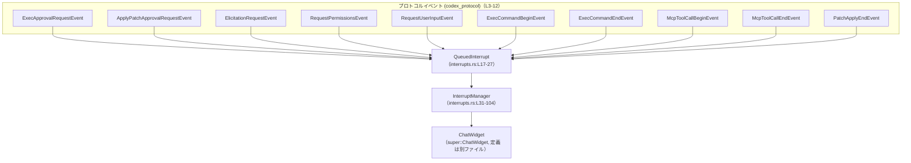
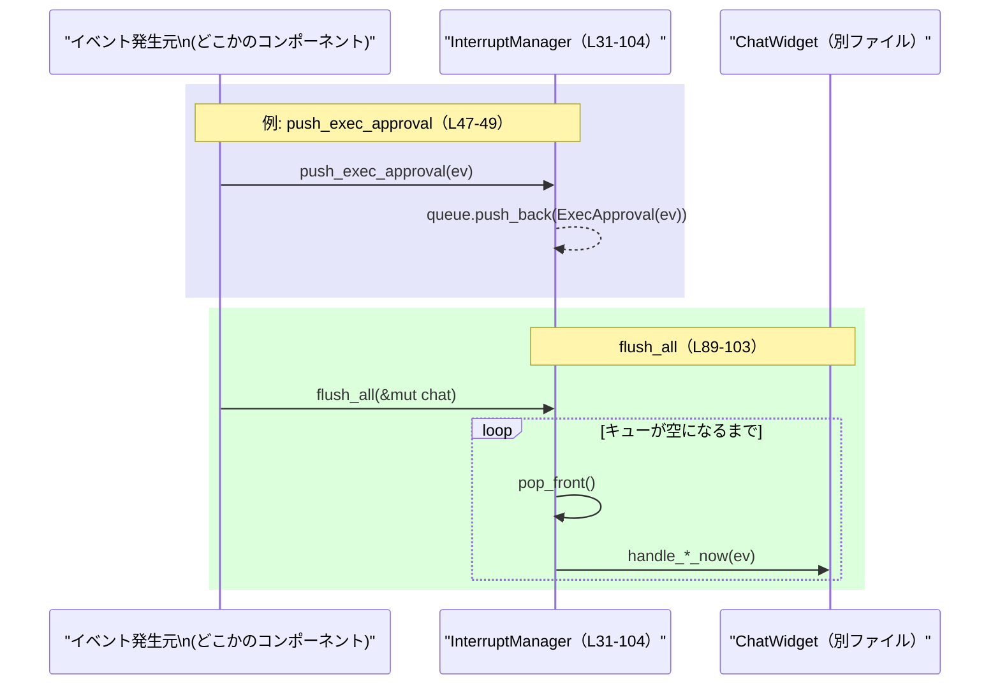
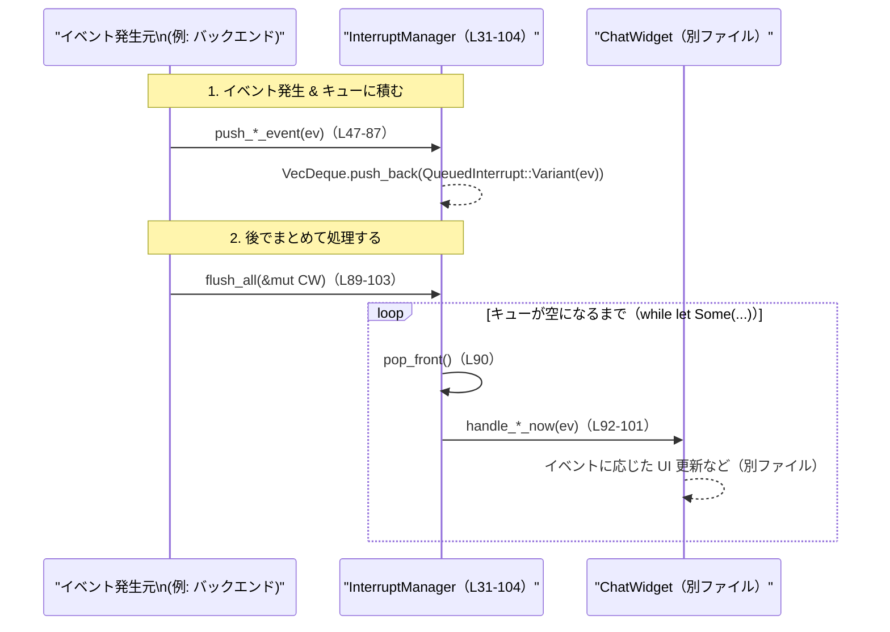

# tui/src/chatwidget/interrupts.rs

## 0. ざっくり一言

`InterruptManager` が、各種「割り込みイベント」（承認要求・権限要求・ツール呼び出しなど）を FIFO キューに貯めておき、後で `ChatWidget` にまとめて処理させるための小さなキュー管理モジュールです（`interrupts.rs:L31-33, L89-103`）。

---

## 1. このモジュールの役割

### 1.1 概要

- このモジュールは、TUI のチャット画面 (`ChatWidget`) に届く複数種類のプロトコルイベントを **一旦キューに積み、後から順に処理する** ために存在します（`interrupts.rs:L17-27, L31-33`）。
- イベントは `QueuedInterrupt` 列挙体に型安全にラップされ、`InterruptManager` 内部の `VecDeque` キューで FIFO で管理されます（`interrupts.rs:L17-27, L31-33`）。
- `flush_all` を呼び出すことで、溜まっている全イベントが `ChatWidget` の `handle_*_now` 系メソッドに対して順次ディスパッチされます（`interrupts.rs:L89-102`）。

### 1.2 アーキテクチャ内での位置づけ

このファイルから読み取れる範囲での関係を図にすると、次のようになります。



- 各種 `*Event` 型は `codex_protocol` クレートからインポートされます（`interrupts.rs:L3-12`）。
- `QueuedInterrupt` はこれらイベント型を 1 つの enum にまとめるアダプタです（`interrupts.rs:L17-27`）。
- `InterruptManager` は `VecDeque<QueuedInterrupt>` を使ってキューを管理します（`interrupts.rs:L31-33`）。
- 実際の処理は `ChatWidget` の `handle_*_now` メソッドに委譲されますが、その定義はこのチャンクには現れません（`interrupts.rs:L14, L92-101`）。

### 1.3 設計上のポイント

コードから読み取れる特徴をまとめます。

- **責務の分割**
  - このモジュールは「イベントの順序付きバッファリングとディスパッチ」に専念し、UI 更新やビジネスロジックは `ChatWidget` に委譲しています（`interrupts.rs:L31-33, L89-102`）。
- **状態管理**
  - 状態としては `VecDeque<QueuedInterrupt>` のみを保持し、その他のフラグやメタ情報は持ちません（`interrupts.rs:L31-33`）。
- **型安全なイベント分類**
  - プロトコルイベントごとに別々の列挙子を持つ `QueuedInterrupt` を使い、`match` により全種類を網羅的に処理します（`interrupts.rs:L17-27, L91-101`）。
- **エラーハンドリング方針**
  - キュー操作は標準ライブラリの `VecDeque` のみを利用し、いずれも失敗しない API のみを呼び出しています（`push_back`, `pop_front`；`interrupts.rs:L48-48, L52-53, L57, L61-62, L66, L70, L74, L78, L82, L86, L90`）。
  - 戻り値に `Result` や `Option` を返す公開メソッドは `is_empty` 以外にはなく、エラーはこの層では扱っていません（`interrupts.rs:L35-104`）。
- **並行性**
  - すべての「書き込み系」メソッドは `&mut self` を受け取り、同時に複数スレッドからの可変アクセスができないようになっています（`interrupts.rs:L47, L51, L56, L60, L65, L69, L73, L77, L81, L85, L89`）。
  - `unsafe` ブロックは一切使われておらず、Rust の所有権と借用のルールに従った安全な実装です（`interrupts.rs:全体`）。

---

## 2. 主要な機能一覧

このモジュールが提供する機能を箇条書きにします。

- 割り込みイベントの列挙体 `QueuedInterrupt` による型安全なラップ（`interrupts.rs:L17-27`）
- `InterruptManager::new` による空キューの生成（`interrupts.rs:L35-40`）
- キューが空かどうかを確認する `InterruptManager::is_empty`（`interrupts.rs:L42-45`）
- 各種イベントをキュー末尾に追加する `push_*` メソッド群（`interrupts.rs:L47-87`）
- 溜まったイベントを FIFO 順にすべて取り出して `ChatWidget` に処理させる `flush_all`（`interrupts.rs:L89-103`）

---

## 3. 公開 API と詳細解説

### 3.1 型一覧（構造体・列挙体など）

#### 3.1.1 このモジュール内で定義される主な型

| 名前              | 種別   | 役割 / 用途                                                                 | 定義箇所                         |
|-------------------|--------|------------------------------------------------------------------------------|----------------------------------|
| `QueuedInterrupt` | enum   | 各種プロトコルイベントを 1 つの列挙体にまとめたもの。キュー要素の型。      | `interrupts.rs:L17-27`          |
| `InterruptManager`| struct | `VecDeque<QueuedInterrupt>` を内部に持つキュー管理構造体。push/flush を提供 | `interrupts.rs:L31-33`          |

#### 3.1.2 このモジュールが依存する主な外部型（定義はこのチャンクには現れない）

| 名前                         | 所属モジュール                         | 用途 / 関係                                                  | インポート箇所                  |
|------------------------------|----------------------------------------|-------------------------------------------------------------|----------------------------------|
| `ChatWidget`                 | `super`                                | 割り込みイベントを最終的に処理する UI コンポーネント        | `interrupts.rs:L14`             |
| `ExecApprovalRequestEvent`   | `codex_protocol::protocol`             | 実行承認要求イベント                                         | `interrupts.rs:L5`              |
| `ApplyPatchApprovalRequestEvent` | `codex_protocol::protocol`         | パッチ適用承認要求イベント                                   | `interrupts.rs:L4`              |
| `ElicitationRequestEvent`    | `codex_protocol::approvals`            | 追加情報の引き出し要求イベント                               | `interrupts.rs:L3`              |
| `RequestPermissionsEvent`    | `codex_protocol::request_permissions`  | 権限要求イベント                                            | `interrupts.rs:L11`             |
| `RequestUserInputEvent`      | `codex_protocol::request_user_input`   | ユーザー入力要求イベント                                    | `interrupts.rs:L12`             |
| `ExecCommandBeginEvent`      | `codex_protocol::protocol`             | コマンド実行開始イベント                                    | `interrupts.rs:L6`              |
| `ExecCommandEndEvent`        | `codex_protocol::protocol`             | コマンド実行終了イベント                                    | `interrupts.rs:L7`              |
| `McpToolCallBeginEvent`      | `codex_protocol::protocol`             | MCP ツール呼び出し開始イベント                              | `interrupts.rs:L8`              |
| `McpToolCallEndEvent`        | `codex_protocol::protocol`             | MCP ツール呼び出し終了イベント                              | `interrupts.rs:L9`              |
| `PatchApplyEndEvent`         | `codex_protocol::protocol`             | パッチ適用終了イベント                                      | `interrupts.rs:L10`             |

### 3.2 関数詳細（代表的なもの）

#### `InterruptManager::new() -> Self` （interrupts.rs:L35-40）

**概要**

- 空の割り込みキューを持つ `InterruptManager` インスタンスを生成します（`interrupts.rs:L37-39`）。

**引数**

- なし。

**戻り値**

- `InterruptManager`：内部キューが空の新しいインスタンス（`queue: VecDeque::new()`）。

**内部処理の流れ**

1. `Self { queue: VecDeque::new() }` で内部キューを空の `VecDeque` で初期化します（`interrupts.rs:L37-39`）。
2. 生成した `Self` をそのまま返します。

**Examples（使用例）**

```rust
use std::collections::VecDeque;
use crate::tui::chatwidget::interrupts::InterruptManager; // パスはプロジェクト構成に合わせて調整する

fn create_manager() {
    let manager = InterruptManager::new(); // 空のキューを持つ InterruptManager を生成
    assert!(manager.is_empty());           // 生成直後なので true になるはず
}
```

**Errors / Panics**

- この関数内ではパニックやエラーを起こす可能性のある処理はありません。
  - `VecDeque::new()` は確保に失敗してもパニックしない API です。

**Edge cases（エッジケース）**

- 特筆すべきエッジケースはありません。常に空キューを持つインスタンスが返ります。

**使用上の注意点**

- 大きな前提条件はありません。`InterruptManager` を利用する前に必ず `new` で初期化する、という程度です。

---

#### `InterruptManager::is_empty(&self) -> bool` （interrupts.rs:L42-45）

**概要**

- 内部キューが空かどうかを返します（`interrupts.rs:L44`）。

**引数**

| 引数名 | 型              | 説明                           |
|--------|-----------------|--------------------------------|
| `self` | `&self`（参照） | `InterruptManager` への参照   |

**戻り値**

- `bool`：
  - `true`：キューに一つもイベントがない場合。
  - `false`：少なくとも1つのイベントがキューに残っている場合。

**内部処理の流れ**

1. `self.queue.is_empty()` を呼び出し、その結果をそのまま返します（`interrupts.rs:L44`）。

**Examples（使用例）**

```rust
use crate::tui::chatwidget::interrupts::InterruptManager;

fn check_empty() {
    let mut manager = InterruptManager::new(); // 生成 (キューは空)
    assert!(manager.is_empty());              // true

    // ここでイベントを push すると false になる（push_* は後述）
    // manager.push_exec_approval(ev);
    // assert!(!manager.is_empty());
}
```

**Errors / Panics**

- `VecDeque::is_empty` は安全なメソッドであり、パニックする条件はありません。
- `is_empty` 自体もパニックしません。

**Edge cases**

- キューが非常に大きい場合でも、`is_empty` は単に長さが 0 かどうかを確認するだけなので、コストは一定です。

**使用上の注意点**

- 読み取り専用のメソッドであり、内部状態を変更しません。
- 並行性の観点では、`&self` を取るため、複数スレッドから読み取り専用に呼び出すことは所有権ルール上可能ですが、実際に `InterruptManager` が `Sync` を実装しているかは、このファイルからは分かりません。

---

#### `InterruptManager::push_exec_approval(&mut self, ev: ExecApprovalRequestEvent)` （interrupts.rs:L47-49）

※ 他の `push_*` メソッドも同様のパターンで、扱うイベント型だけが異なります。

**概要**

- 実行承認要求イベントを `QueuedInterrupt::ExecApproval` にラップし、キュー末尾に追加します（`interrupts.rs:L47-48`）。

**引数**

| 引数名 | 型                          | 説明                                               |
|--------|-----------------------------|----------------------------------------------------|
| `self` | `&mut self`                | `InterruptManager` への可変参照                   |
| `ev`   | `ExecApprovalRequestEvent` | キューに積みたい実行承認要求イベント本体         |

**戻り値**

- なし（`()`）。

**内部処理の流れ**

1. `QueuedInterrupt::ExecApproval(ev)` でイベント値 `ev` を列挙体の対応するバリアントに包みます（`interrupts.rs:L48`）。
2. `self.queue.push_back(...)` でキュー末尾に追加します（`interrupts.rs:L48`）。

**Examples（使用例）**

```rust
use crate::tui::chatwidget::interrupts::InterruptManager;
use codex_protocol::protocol::ExecApprovalRequestEvent;

fn queue_exec_approval(manager: &mut InterruptManager, ev: ExecApprovalRequestEvent) {
    manager.push_exec_approval(ev); // 実行承認要求を FIFO キューに積む
    // 以後 flush_all 呼び出し時に ChatWidget に処理される
}
```

**Errors / Panics**

- 標準ライブラリの `VecDeque::push_back` がパニックするケースは通常ありません。
- このメソッド自体はエラーもパニックも発生させません。

**Edge cases**

- キューが非常に大きい場合、メモリ確保のために `VecDeque` の内部容量が拡張されることがありますが、これは標準的な動作であり、特別なエラー処理は行っていません。
- `ev` の中身がどのような値であっても、この層では検証を行わず、そのまま保存します。妥当性チェックは `ChatWidget` 側に委ねられていると考えられますが、このチャンクには現れません。

**使用上の注意点**

- `&mut self` を取るため、同じ `InterruptManager` インスタンスに対して並行して `push_*` を呼ぶことはコンパイル時に禁止されます（Rust の可変借用ルール）。
- `push_exec_approval` の他に、イベント種別ごとに対応する `push_*` メソッドが存在します（`interrupts.rs:L51-53, L56-57, L60-62, L65-66, L69-70, L73-74, L77-78, L81-82, L85-86`）。

---

#### `InterruptManager::flush_all(&mut self, chat: &mut ChatWidget)` （interrupts.rs:L89-103）

**概要**

- キューに溜まっている全ての `QueuedInterrupt` を FIFO 順に取り出し、それぞれに対応する `ChatWidget::handle_*_now` メソッドを即時呼び出しするメイン処理です（`interrupts.rs:L90-101`）。

**引数**

| 引数名 | 型                    | 説明                                                                |
|--------|-----------------------|---------------------------------------------------------------------|
| `self` | `&mut self`          | キューを消費するための可変な `InterruptManager` への参照           |
| `chat` | `&mut ChatWidget`    | 各イベントを処理する対象のチャットウィジェット                      |

**戻り値**

- なし（`()`）。

**内部処理の流れ（アルゴリズム）**

1. `while let Some(q) = self.queue.pop_front()` で、キュー先頭から要素を 1 件ずつ取り出すループを開始します（`interrupts.rs:L90`）。
   - キューが空になると `pop_front` が `None` を返し、ループを終了します。
2. 取り出した `QueuedInterrupt` `q` に対して `match` 式を使い、バリアントごとに分岐します（`interrupts.rs:L91-101`）。
3. それぞれのバリアントごとに、対応する `ChatWidget` のハンドラメソッドを呼び出します。例えば:
   - `QueuedInterrupt::ExecApproval(ev)` → `chat.handle_exec_approval_now(ev)`（`interrupts.rs:L92`）
   - `QueuedInterrupt::ApplyPatchApproval(ev)` → `chat.handle_apply_patch_approval_now(ev)`（`interrupts.rs:L93`）
   - …以下同様に、全バリアントに対応する `handle_*_now` が呼ばれます（`interrupts.rs:L94-101`）。
4. キューが空になるまでこの処理を繰り返します。

この処理の流れをシーケンス図で表すと次のようになります（flush_all 本体は `interrupts.rs:L89-103`）。



**Examples（使用例）**

実際の `ChatWidget` の生成方法はこのチャンクには現れないため擬似的な例になります。

```rust
use crate::tui::chatwidget::interrupts::InterruptManager;
use codex_protocol::protocol::ExecApprovalRequestEvent;
// ChatWidget 型は別ファイルで定義されている前提

fn process_interrupts(chat: &mut ChatWidget,
                      manager: &mut InterruptManager,
                      ev: ExecApprovalRequestEvent) {
    // 新しいイベントをキューに積む                                  // まだ UI に即時反映しない
    manager.push_exec_approval(ev);

    // どこかのタイミングで溜まったイベントを全て処理する              // FIFO 順に handle_*_now が呼ばれる
    manager.flush_all(chat);
}
```

**Errors / Panics**

- `VecDeque::pop_front` はパニックしません（`interrupts.rs:L90`）。
- `match` 式は `QueuedInterrupt` の全バリアントを網羅しており、未処理のバリアントが残ることはありません（`interrupts.rs:L17-27, L91-101`）。
- このファイルの範囲では、`ChatWidget::handle_*_now` がパニックするかどうかは分かりません。
  - したがって、`flush_all` が内部でパニックを起こす可能性があるかどうかは、このチャンクだけからは断定できません。

**Edge cases（エッジケース）**

- **キューが空の場合**
  - `while let Some(..)` が即座に終了するため、何も行わずに戻ります（`interrupts.rs:L90`）。
- **大量のイベントが溜まっている場合**
  - 全イベントがループ 1 回ごとに 1 つずつ処理されるため、`flush_all` の実行時間はイベント数に比例します。
  - イベント毎の処理自体は `ChatWidget` 側に依存します。
- **処理中にキューへ再度 push される場合**
  - このファイルからは、`ChatWidget` が `InterruptManager` にアクセスできるかどうかは分かりません。
  - 少なくとも、`flush_all` 内では `self` を `&mut self` として独占的に借用しているため、同時に別スレッドから `push_*` を呼ぶことはコンパイル時に禁止されます（`interrupts.rs:L89`）。

**使用上の注意点**

- `&mut self` と `&mut ChatWidget` の 2 つの可変参照を同時に持つため、このメソッドを呼ぶ間は両方のオブジェクトに対して他からの可変アクセスはできません。
- 多数のイベントを一度に処理すると UI 更新が一気に発生する可能性がありますが、その詳細は `ChatWidget` の実装に依存するため、このチャンクには現れません。
- `flush_all` 呼び出し後、キューは空の状態になります（再度 `is_empty` を呼べば `true` が返るはずです；`interrupts.rs:L90-103`）。

---

### 3.3 その他の関数（インベントリ）

`InterruptManager` のすべてのメソッドとその役割を一覧にします。

| 関数名                                      | シグネチャ                                                                                   | 役割（1 行）                                                     | 定義箇所                     |
|---------------------------------------------|----------------------------------------------------------------------------------------------|------------------------------------------------------------------|------------------------------|
| `new`                                       | `pub(crate) fn new() -> Self`                                                                | 空のキューを持つ `InterruptManager` を生成する                  | `interrupts.rs:L35-40`      |
| `is_empty`                                  | `pub(crate) fn is_empty(&self) -> bool`                                                      | キューにイベントが無いかどうかを返す                            | `interrupts.rs:L42-45`      |
| `push_exec_approval`                        | `pub(crate) fn push_exec_approval(&mut self, ev: ExecApprovalRequestEvent)`                  | 実行承認要求イベントをキュー末尾に追加する                      | `interrupts.rs:L47-49`      |
| `push_apply_patch_approval`                 | `pub(crate) fn push_apply_patch_approval(&mut self, ev: ApplyPatchApprovalRequestEvent)`     | パッチ適用承認要求イベントをキュー末尾に追加する                | `interrupts.rs:L51-53`      |
| `push_elicitation`                          | `pub(crate) fn push_elicitation(&mut self, ev: ElicitationRequestEvent)`                     | Elicitation（追加情報要求）イベントをキュー末尾に追加する       | `interrupts.rs:L56-57`      |
| `push_request_permissions`                  | `pub(crate) fn push_request_permissions(&mut self, ev: RequestPermissionsEvent)`             | 権限要求イベントをキュー末尾に追加する                          | `interrupts.rs:L60-62`      |
| `push_user_input`                           | `pub(crate) fn push_user_input(&mut self, ev: RequestUserInputEvent)`                        | ユーザー入力要求イベントをキュー末尾に追加する                  | `interrupts.rs:L65-66`      |
| `push_exec_begin`                           | `pub(crate) fn push_exec_begin(&mut self, ev: ExecCommandBeginEvent)`                        | コマンド実行開始イベントをキュー末尾に追加する                  | `interrupts.rs:L69-70`      |
| `push_exec_end`                             | `pub(crate) fn push_exec_end(&mut self, ev: ExecCommandEndEvent)`                            | コマンド実行終了イベントをキュー末尾に追加する                  | `interrupts.rs:L73-74`      |
| `push_mcp_begin`                            | `pub(crate) fn push_mcp_begin(&mut self, ev: McpToolCallBeginEvent)`                         | MCP ツール呼び出し開始イベントをキュー末尾に追加する            | `interrupts.rs:L77-78`      |
| `push_mcp_end`                              | `pub(crate) fn push_mcp_end(&mut self, ev: McpToolCallEndEvent)`                             | MCP ツール呼び出し終了イベントをキュー末尾に追加する            | `interrupts.rs:L81-82`      |
| `push_patch_end`                            | `pub(crate) fn push_patch_end(&mut self, ev: PatchApplyEndEvent)`                            | パッチ適用終了イベントをキュー末尾に追加する                    | `interrupts.rs:L85-86`      |
| `flush_all`                                 | `pub(crate) fn flush_all(&mut self, chat: &mut ChatWidget)`                                  | キュー内の全イベントを `ChatWidget` に即時処理させる            | `interrupts.rs:L89-103`     |

---

## 4. データフロー

### 4.1 代表的な処理シナリオ

最も典型的なフローは、「プロトコルイベントが発生してから、UI がそれを処理するまで」です。

1. どこかのコンポーネントが `ExecApprovalRequestEvent` などのイベントを受け取る。
2. そのコンポーネントが `InterruptManager::push_*` を呼び、イベントをキューに追加する（`interrupts.rs:L47-87`）。
3. あるタイミングで `InterruptManager::flush_all(&mut chat)` が呼ばれ、キュー内のイベントが `ChatWidget` に順次ディスパッチされる（`interrupts.rs:L89-101`）。
4. 各イベントごとに `ChatWidget::handle_*_now` が呼び出され、UI などの更新が行われる（`interrupts.rs:L92-101`。ただし実装はこのチャンクには現れません）。

この流れをシーケンス図で表すと次のようになります。



---

## 5. 使い方（How to Use）

### 5.1 基本的な使用方法

典型的なコードフローは次のようになります。

```rust
use crate::tui::chatwidget::interrupts::InterruptManager;
use codex_protocol::protocol::ExecApprovalRequestEvent;
// ChatWidget は別モジュールで定義されていると仮定

fn main_loop(chat: &mut ChatWidget) {
    let mut interrupts = InterruptManager::new();      // 1. キュー管理構造体を生成

    // 2. どこかから ExecApprovalRequestEvent を受け取ったと仮定
    let ev: ExecApprovalRequestEvent = /* ... */;      // 実際の生成方法は別のモジュール依存

    interrupts.push_exec_approval(ev);                 // 3. イベントをキューに積む

    // 4. 適切なタイミングでまとめて処理
    if !interrupts.is_empty() {                        // キューに何かあるか確認
        interrupts.flush_all(chat);                    // ChatWidget による即時処理
    }
}
```

- この例では、イベントを即時に UI に反映するのではなく、一度キューに積んでから `flush_all` でまとめて処理しています。
- イベントの発生タイミングと UI 更新のタイミングを分離できる点が特徴です。

### 5.2 よくある使用パターン

1. **複数種類のイベントを順序通り処理したい場合**

   ```rust
   fn handle_many(chat: &mut ChatWidget,
                  interrupts: &mut InterruptManager,
                  perms_ev: RequestPermissionsEvent,
                  input_ev: RequestUserInputEvent) {
       interrupts.push_request_permissions(perms_ev); // 先に権限要求
       interrupts.push_user_input(input_ev);          // 次にユーザー入力要求

       // flush_all では push の順番通りに処理される
       interrupts.flush_all(chat);                    // 権限要求 → 入力要求 の順で handle_*_now が呼ばれる
   }
   ```

2. **非同期的にイベントが溜まり、描画タイミングでまとめて反映する場合**

   - イベント受信スレッド／タスク側で `push_*` のみ行い、UI スレッド側のループで `flush_all` を呼ぶ、といった利用が想定できます。
   - ただし、実際にスレッドを跨いで `InterruptManager` を共有できるかどうか（`Send`/`Sync` 実装の有無）は、このファイルからは分かりません。

### 5.3 よくある間違い（推測されるもの）

コードから推測できる、起こり得そうな誤用と、その修正版を示します。

```rust
use crate::tui::chatwidget::interrupts::InterruptManager;

// 誤り例: キューに積んだだけで処理されたと期待する
fn wrong_usage(chat: &mut ChatWidget, manager: &mut InterruptManager,
               ev: ExecCommandBeginEvent) {
    manager.push_exec_begin(ev);          // キューに積むだけ
    // flush_all を呼んでいないので ChatWidget::handle_exec_begin_now は呼ばれない
}

// 正しい例: push_* の後、どこかで flush_all を呼ぶ
fn correct_usage(chat: &mut ChatWidget, manager: &mut InterruptManager,
                 ev: ExecCommandBeginEvent) {
    manager.push_exec_begin(ev);          // まずキューに積む
    manager.flush_all(chat);              // ここで実際にイベントを処理
}
```

### 5.4 使用上の注意点（まとめ）

- **前提条件**
  - `flush_all` を呼ぶ際には、`ChatWidget` が適切に初期化されており、`handle_*_now` メソッド群が期待どおりの動作をすることが前提です（`interrupts.rs:L92-101`）。
- **禁止事項 / 注意**
  - `push_*` と `flush_all` はいずれも `&mut self` を要求するため、同じ `InterruptManager` を複数スレッドから同時に扱うことは Rust の借用ルール上できません。
  - `flush_all` の途中で再入（再度 `flush_all` を呼ぶ）するといった使い方は、借用制約によりコンパイルエラーになるはずです。
- **パフォーマンス**
  - `flush_all` はキューの全要素を処理するため、イベント数が多いと処理時間が長くなります（`interrupts.rs:L90-101`）。
  - 個々のイベント処理コストは `ChatWidget` の実装に依存します。
- **エラーハンドリング**
  - この層では一切のエラーを扱っていないため、必要に応じて `ChatWidget` 側でエラー処理／ログ出力を行う必要があります。

---

## 6. 変更の仕方（How to Modify）

### 6.1 新しいイベント種別を追加する場合

新しいプロトコルイベント種別（例: `NewEvent`）を support したい場合の手順を、このファイルから読み取れる範囲で整理します。

1. **新バリアントの追加**
   - `QueuedInterrupt` に新しい列挙子を追加します（`interrupts.rs:L17-27`）。

   ```rust
   pub(crate) enum QueuedInterrupt {
       // 既存...
       NewEventVariant(NewEvent), // 新しいイベント型
   }
   ```

2. **push_* メソッドの追加**
   - `InterruptManager` に対応する `push_new_event` メソッドを追加し、キュー末尾に積む実装を行います（既存 `push_*` のパターンに倣う；`interrupts.rs:L47-87`）。

3. **flush_all の `match` に処理分岐を追加**
   - `flush_all` 内の `match q` に新しいバリアントの分岐を追加し、`ChatWidget` の適切なハンドラメソッドを呼び出します（`interrupts.rs:L91-101`）。

4. **`ChatWidget` 側の対応**
   - `ChatWidget` に対応する `handle_new_event_now`（仮）メソッドを追加・実装します。
   - この部分は別ファイルであり、このチャンクには現れません。

### 6.2 既存の機能を変更する場合

既存の挙動を変更する際に注意すべき点を整理します。

- **影響範囲の確認**
  - `InterruptManager` は crate 内（`pub(crate)`）の他モジュールから利用されている可能性があります。
    - 呼び出し元を検索し、`push_*` と `flush_all` がどこで使われているかを確認することが推奨されます（このチャンクには呼び出し側は現れません）。
- **契約の維持**
  - FIFO 処理の前提：現在は `VecDeque` + `push_back` + `pop_front` により、イベントは追加順に処理されています（`interrupts.rs:L31-33, L48, L52-53, L57, L61-62, L66, L70, L74, L78, L82, L86, L90`）。
    - 処理順を変える場合、その前提に依存する呼び出し元がないか要確認です。
  - `flush_all` 呼び出し後にキューが空になる、という事実に依存するコードがないか確認します（`interrupts.rs:L89-103`）。
- **テスト・確認**
  - イベントの処理順序、`flush_all` の再実行時の挙動（キューが空であれば何も起きない）などをテストで確認すると変更の安全性が高まります。
  - このチャンクにはテストコードは含まれていません（テストの有無は他ファイルを参照する必要があります）。

---

## 7. 関連ファイル

このモジュールと密接に関係するコンポーネント（このチャンクから読み取れる範囲）を列挙します。

| パス / モジュール                              | 役割 / 関係                                                                 |
|-----------------------------------------------|----------------------------------------------------------------------------|
| `tui/src/chatwidget/mod.rs` など（推測）       | `ChatWidget` 本体の定義があると推測される場所。このファイルからは正確なパスは分かりません。 |
| `codex_protocol::approvals`                   | `ElicitationRequestEvent` の定義元                                         |
| `codex_protocol::protocol`                    | `Exec*`, `Mcp*`, `ApplyPatch*` 系イベントの定義元                          |
| `codex_protocol::request_permissions`         | `RequestPermissionsEvent` の定義元                                         |
| `codex_protocol::request_user_input`          | `RequestUserInputEvent` の定義元                                           |

※ `ChatWidget` や各イベント型の具体的なフィールド・挙動は、このチャンクには現れません。そのため詳細は各モジュールの実装を参照する必要があります。

---

## Bugs / Security / Contracts / Edge Cases / Tests / Performance / Observability（まとめ）

このファイルに現れる情報に限定して、補足的に整理します。

- **Bugs（潜在的な不具合）**
  - このファイルだけを見る限り、明らかなロジックエラー（例: 取り出し忘れ、未処理バリアント）は見当たりません。
    - `QueuedInterrupt` の全バリアントが `flush_all` の `match` で処理されています（`interrupts.rs:L17-27, L91-101`）。
- **Security**
  - ここで扱うのはイベントのバッファリングとディスパッチのみであり、ユーザー入力の検証やパーミッションチェックは `ChatWidget` または他層で行われると考えられますが、このチャンクには現れません。
  - セキュリティ上の重大な懸念（ファイル操作、ネットワークアクセスなど）は、このファイル内にはありません。
- **Contracts / Edge Cases**
  - 契約（暗黙の前提）
    - キューは FIFO で処理される（`push_back` + `pop_front`; `interrupts.rs:L48, L52-53, L57, L61-62, L66, L70, L74, L78, L82, L86, L90`）。
    - `flush_all` 後はキューが空である（`interrupts.rs:L89-103`）。
  - エッジケース
    - キューが空のとき `flush_all` を呼んでも何も起きない（`interrupts.rs:L90`）。
- **Tests**
  - このファイルにはテストコードは含まれていません。テストの有無は他ファイルを参照する必要があります。
- **Performance / Scalability**
  - キュー操作は `VecDeque` による O(1) 追加／削除（平均）です（`interrupts.rs:L31-33, L48, L52-53, L57, L61-62, L66, L70, L74, L78, L82, L86, L90`）。
  - `flush_all` の時間はイベント数に比例します（線形）。イベント数が非常に多い場合には、呼び出しタイミングを調整する設計が必要になる可能性がありますが、ここでは制御していません。
- **Observability**
  - ログ出力やメトリクス送信などの処理は一切含まれていません（`interrupts.rs:全体`）。
  - イベントの処理結果を観測したい場合は、`ChatWidget::handle_*_now` の内部やその呼び出し元でログを仕込むのが自然と考えられますが、このチャンクには現れません。
