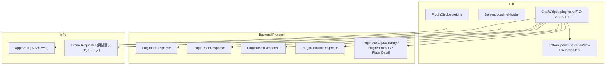
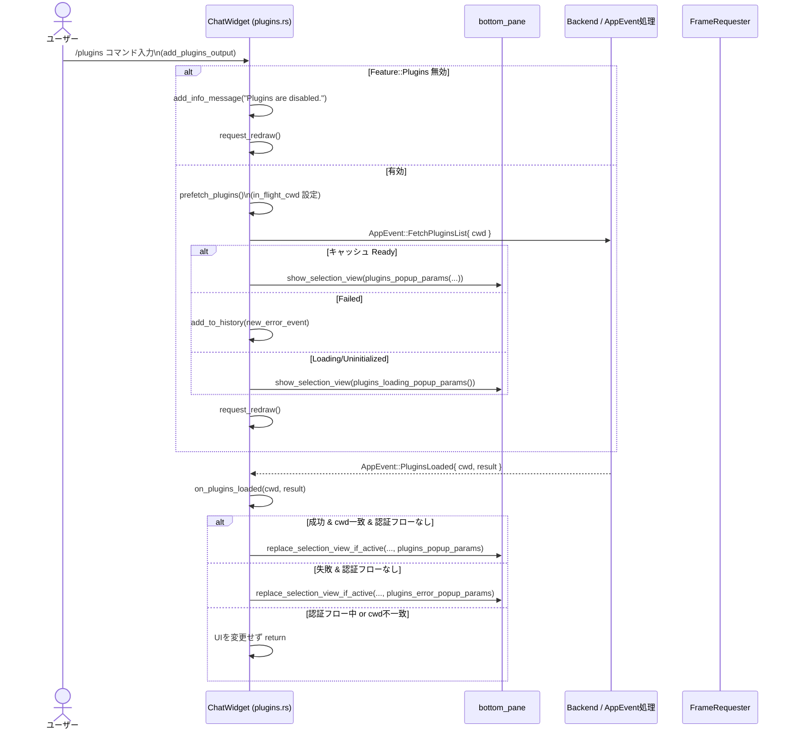
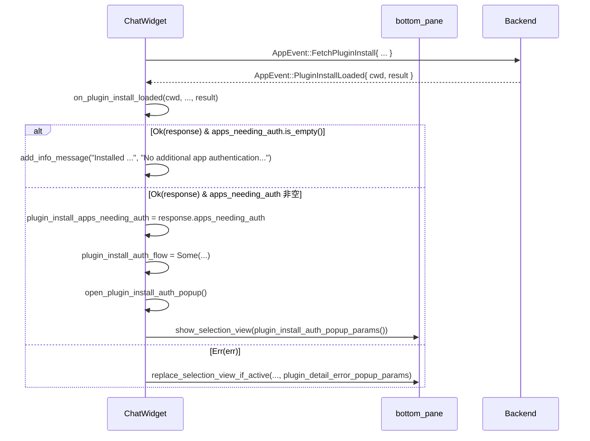

`tui/src/chatwidget/plugins.rs` コード解説
---

> 注: 提示されたコード断片には行番号情報が含まれていないため、  
> 「根拠」欄では **ファイル名＋「該当定義付近」** までを示し、具体的な行番号は付与していません。  
> 行番号が必要な場合は、実リポジトリ側で確認する前提になります。

---

## 0. ざっくり一言

Chat ウィジェット内で **プラグイン一覧・詳細・インストール/アンインストール・認証フォローアップ** を表示・操作するための TUI（テキスト UI）コンポーネント群を定義しているモジュールです。

---

## 1. このモジュールの役割

### 1.1 概要

- このモジュールは **ChatGPT プラグイン（Apps）を TUI 上で管理する** ために存在し、  
  以下の機能を提供します。
  - プラグイン一覧ポップアップの表示・検索
  - 各プラグインの詳細表示
  - インストール・アンインストールの実行と進捗表示
  - インストール後に必要な「アプリ認証フロー」の案内・制御
  - ローディング状態・エラー状態の表示

### 1.2 アーキテクチャ内での位置づけ

ChatWidget を中心とした依存関係は、おおむね次のようになっています。



- ChatWidget（別ファイルで定義）のメソッドとして、プラグイン管理 UI のロジックが実装されています。
- 実際のプラグイン情報や操作は `codex_app_server_protocol` で定義された型・RPC 経由で行われ、ここでは **AppEvent 経由の非同期メッセージ** として送受信しています。
- 描画は `ratatui` の `Widget`/`Buffer`/`Rect` 等の型と、ローカルな `Renderable` トレイトを通じて行われます。

### 1.3 設計上のポイント

- **状態管理**
  - プラグイン一覧のキャッシュ状態を `PluginsCacheState` enum で管理（未初期化／読み込み中／成功／失敗）。
  - `plugins_fetch_state` フィールド（他ファイルで定義）で「どの cwd について何が in-flight か」を管理し、古いレスポンスを無視します（`on_plugins_loaded` / `on_plugin_*_loaded` 内の cwd チェック）。
- **メッセージ駆動の非同期**
  - 実際の I/O は行わず、すべて `AppEvent` を `app_event_tx` に送信することでバックエンドに委譲します（`prefetch_plugins`, 各 SelectionItem の `actions`）。
- **UI コンポーネント分割**
  - ローディングヘッダ（`DelayedLoadingHeader`）と開示文行（`PluginDisclosureLine`）を `Renderable` 実装として分離し、複数のポップアップで再利用可能にしています。
- **安全性・エラー処理**
  - バックエンド結果は `Result<..., String>` で受け取り、成功時・失敗時に分けて UI を更新。
  - インデックスアクセスなどは `get` / `Option` で安全に扱い、`unwrap` は `u16::MAX` のフォールバックのみ（描画高さの上限）に限定されています。
- **並行性の前提**
  - メソッドはすべて `&mut self` を受け取る同期 API で、UI スレッド上で直列に呼ばれることを前提としており、内部に `Arc<Mutex<...>>` などの共有可変状態はありません。
  - 非同期性は AppEvent キューと `FrameRequester` による再描画スケジューリングにより表現されています。

---

## 2. 主要な機能一覧

このモジュールが提供する主な機能は次の通りです。

- プラグイン一覧表示: `/plugins` コマンドから呼び出される一覧ポップアップの表示 (`add_plugins_output`, `plugins_popup_params`)
- プラグイン一覧のプリフェッチとキャッシュ: cwd ごとに一覧を取得し、状態をキャッシュ (`prefetch_plugins`, `plugins_cache_for_current_cwd`, `PluginsCacheState`)
- ローディング・エラー UI:
  - 一覧ロード中のポップアップ (`plugins_loading_popup_params`)
  - 詳細ロード中 (`plugin_detail_loading_popup_params`)
  - インストール/アンインストール中 (`plugin_install_loading_popup_params`, `plugin_uninstall_loading_popup_params`)
  - 一覧・詳細取得失敗時のエラーポップアップ (`plugins_error_popup_params`, `plugin_detail_error_popup_params`)
- プラグイン詳細表示と操作:
  - 詳細情報読み込み完了時の処理 (`on_plugin_detail_loaded`)
  - 詳細ポップアップ構築 (`plugin_detail_popup_params`)
  - インストール／アンインストールのトリガー用 SelectionItem 生成
- インストール結果処理と認証フロー:
  - インストール完了／失敗時の処理 (`on_plugin_install_loaded`)
  - アンインストール完了／失敗時の処理 (`on_plugin_uninstall_loaded`)
  - アプリ認証フォローアップフローの進行・中断 (`advance_plugin_install_auth_flow`, `abandon_plugin_install_auth_flow`, `open_plugin_install_auth_popup`, `plugin_install_auth_popup_params`, `finish_plugin_install_auth_flow`)
- 表示用ヘルパー:
  - Marketplace／プラグイン表示名・説明・ステータスラベル (`marketplace_display_name`, `plugin_display_name`, `plugin_brief_description`, `plugin_status_label`, `plugin_description`, `plugin_detail_description`)
  - スキル／Apps／MCP サーバーの要約 (`plugin_skill_summary`, `plugin_app_summary`, `plugin_mcp_summary`)
  - フッターヒント (`plugins_popup_hint_line`)

---

## 3. 公開 API と詳細解説

### 3.1 型一覧（構造体・列挙体など）

| 名前 | 種別 | 可視性 | 役割 / 用途 | 根拠 |
|------|------|--------|-------------|------|
| `DelayedLoadingHeader` | 構造体 | モジュール内 (非 pub) | 「Plugins」ヘッダにローディングテキストとアニメーションを表示するためのレンダラ。一定時間後にアニメーションに切り替え、`FrameRequester` で再描画をスケジュールします。 | `plugins.rs` 該当定義付近 |
| `PluginDisclosureLine` | 構造体 | モジュール内 (非 pub) | プラグイン詳細画面における「データ共有と利用規約・プライバシーポリシーに関する開示文」を 1 行で描画し、ヘルプ記事 URL をハイパーリンクとしてマーキングします。 | 同上 |
| `PluginsCacheState` | `enum` | `pub(super)` | プラグイン一覧のキャッシュ状態を表現する。`Uninitialized` / `Loading` / `Ready(PluginListResponse)` / `Failed(String)` の 4 状態を持ちます。 | 同上 |

> `ChatWidget` 自体は `super` からインポートされており、このファイルではメソッド実装のみが追加されています。

### 3.2 関数詳細（重要なメソッド 7 件）

ここでは、外部（同 crate 内）から呼ばれる可能性の高いメソッド・コアロジックを 7 つ選んで詳細に説明します。

---

#### `ChatWidget::add_plugins_output(&mut self)`

**概要**

- `/plugins` コマンドなどから呼び出されるエントリポイントで、  
  プラグイン機能の有効化チェック・一覧のプリフェッチ・対応するポップアップ表示を行います。

**引数**

| 引数名 | 型 | 説明 |
|--------|----|------|
| `&mut self` | `ChatWidget` | Chat ウィジェットの状態全体に対する可変参照 |

**戻り値**

- `()`（戻り値なし）。UI 状態（履歴、ボトムペイン、内部キャッシュ）を副作用として変更します。

**内部処理の流れ**

1. `self.config.features.enabled(Feature::Plugins)` でプラグイン機能が有効かを判定。無効な場合:
   - `add_info_message` で「Plugins are disabled.」等のメッセージを履歴に追加し、終了。
2. `prefetch_plugins()` を呼び出し、現在の cwd に対するプラグイン一覧フェッチを開始（`AppEvent::FetchPluginsList` を送信）。
3. `plugins_cache_for_current_cwd()` で現在の cwd に対するキャッシュ状態を取得し、分岐:
   - `Ready(response)` → `open_plugins_popup(&response)` で通常の一覧ポップアップを表示。
   - `Failed(err)` → エラーイベントを履歴に追加。
   - `Loading` / `Uninitialized` → `open_plugins_loading_popup()` でローディングポップアップを表示。
4. 最後に `request_redraw()` を呼び、画面の再描画を要求。

**Errors / Panics**

- 明示的なエラー型は返しません。
- 内部で `unwrap` は使用していません（この関数内）。

**Edge cases（エッジケース）**

- プラグイン機能が無効 (`Feature::Plugins` 未有効化) の場合、**AppEvent を送らず**、単に情報メッセージを追加して終了します。
- キャッシュが別 cwd 用のものだけ存在している場合、`plugins_cache_for_current_cwd` は `Uninitialized` を返し、必ずローディングポップアップを表示します。

**使用上の注意点**

- このメソッドは UI スレッドから呼ぶ前提で設計されています。
- 実際のフェッチは非同期に行われるため、一覧がすぐに表示されるとは限りません。  
  完了時に `on_plugins_loaded` が呼ばれることが前提です。

---

#### `ChatWidget::on_plugins_loaded(&mut self, cwd: PathBuf, result: Result<PluginListResponse, String>)`

**概要**

- バックエンドからの「プラグイン一覧取得完了」イベントに対応するハンドラです。
- キャッシュや in-flight 状態を更新し、必要に応じてポップアップをリフレッシュします。

**引数**

| 引数名 | 型 | 説明 |
|--------|----|------|
| `&mut self` | `ChatWidget` | UI 状態への可変参照 |
| `cwd` | `PathBuf` | フェッチ要求時のカレントディレクトリ |
| `result` | `Result<PluginListResponse, String>` | 成功時は一覧レスポンス、失敗時はエラーメッセージ |

**戻り値**

- `()`（戻り値なし）。

**内部処理の流れ**

1. `self.plugins_fetch_state.in_flight_cwd` が `cwd` と一致していれば `None` にクリアし、  
   この cwd 用のフェッチが完了したことを示す。
2. `self.config.cwd` と `cwd` が一致しない場合は、**古いリクエストの結果**とみなして早期リターン（UI を更新しない）。
3. `auth_flow_active = self.plugin_install_auth_flow.is_some()` で、インストール後の認証フロー中かどうかを取得。
4. `result` を `match` で分岐:
   - `Ok(response)`:
     - `plugins_fetch_state.cache_cwd = Some(cwd)` に設定。
     - `plugins_cache = PluginsCacheState::Ready(response.clone())` でキャッシュ更新。
     - 認証フローが **アクティブでない** 場合のみ、`refresh_plugins_popup_if_open(&response)` を呼び、表示中のポップアップを一覧表示に差し替え。
   - `Err(err)`:
     - 認証フローがアクティブでない場合のみ:
       - `plugins_fetch_state.cache_cwd = None` に戻す。
       - `plugins_cache = PluginsCacheState::Failed(err.clone())`。
       - `bottom_pane.replace_selection_view_if_active` で、プラグインエラーポップアップに差し替え。

**Errors / Panics**

- パニックを起こしうる操作はありません（`clone`, 代入, `replace_selection_view_if_active` 結果を `let _ =` で捨てているのみ）。
- 古いレスポンスが来た場合は、**静かに破棄**されるため、UI 上での不整合は発生しづらい設計になっています。

**Edge cases**

- フェッチ完了後にユーザーが cwd を変更していた場合:
  - `config.cwd != cwd` のため、この結果は無視されます。
- 認証フロー中 (`plugin_install_auth_flow.is_some() == true`) の場合:
  - 成功・失敗に関わらず、**ポップアップの差し替えは行われず**、現在の認証ポップアップ表示を優先します。

**使用上の注意点**

- AppEvent 側で `cwd` を正しく引き回すことが前提条件です。
- `result` のエラー文字列はそのままユーザーに見せるため、バックエンド側でユーザー向けの文面になっている必要があります。

---

#### `ChatWidget::on_plugin_detail_loaded(&mut self, cwd: PathBuf, result: Result<PluginReadResponse, String>)`

**概要**

- 特定プラグインの詳細情報取得が完了したときに呼ばれるハンドラです。
- 成功時は詳細ポップアップに切り替え、失敗時はエラーポップアップを表示します。

**引数**

| 引数名 | 型 | 説明 |
|--------|----|------|
| `cwd` | `PathBuf` | リクエスト時の cwd |
| `result` | `Result<PluginReadResponse, String>` | 詳細レスポンスまたはエラー文字列 |

**戻り値**

- `()`。

**内部処理の流れ**

1. `self.config.cwd` と `cwd` が異なる場合は、古い結果とみなし早期リターン。
2. `plugins_response` に、現在の cwd 用の `PluginListResponse` を `plugins_cache_for_current_cwd` 経由で取得（あれば `Some`、なければ `None`）。
3. `result` を `match` で分岐:
   - `Ok(response)`:
     - `plugins_response` が `Some` なら、`plugin_detail_popup_params(&plugins_response, &response.plugin)` で詳細ポップアップを構築し、`replace_selection_view_if_active` で現在のポップアップを差し替え。
   - `Err(err)`:
     - `plugin_detail_error_popup_params(&err, plugins_response.as_ref())` でエラーポップアップ用パラメータを生成し、差し替え。

**Errors / Panics**

- `plugins_response` が `None` の場合でも問題なく動作し、エラーポップアップには「Back to plugins」項目が出ないだけです。
- パニックを起こすような処理はありません。

**Edge cases**

- 詳細取得完了時にキャッシュがまだ Ready になっていない（`plugins_response == None`）場合:
  - エラーポップアップでは「戻る」項目が出ません。
  - 成功時でも、キャッシュがない場合は詳細ポップアップへの遷移がスキップされます（`if let Some(plugins_response)`）。

**使用上の注意点**

- 詳細表示画面から「Back to plugins」を実現するために、`plugins_response` を clone して `AppEvent::PluginsLoaded` に再利用しています。  
  バックエンドではなく **UI 側でキャッシュを用いて再描画** している点に注意が必要です。

---

#### `ChatWidget::on_plugin_install_loaded(&mut self, cwd: PathBuf, _marketplace_path: AbsolutePathBuf, _plugin_name: String, plugin_display_name: String, result: Result<PluginInstallResponse, String>) -> bool`

**概要**

- プラグインインストール処理の完了通知を受け取り、必要なメッセージ表示・認証フロー開始・ポップアップ更新などを行います。
- 戻り値の `bool` は「この時点でフローが完了したかどうか」を呼び出し側に知らせるフラグと思われます（コードからのみの推測）。

**引数**

| 引数名 | 型 | 説明 |
|--------|----|------|
| `cwd` | `PathBuf` | リクエスト時の cwd |
| `_marketplace_path` | `AbsolutePathBuf` | Marketplace パス（ここでは未使用） |
| `_plugin_name` | `String` | プラグイン内部名（ここでは未使用） |
| `plugin_display_name` | `String` | UI 表示用のプラグイン名 |
| `result` | `Result<PluginInstallResponse, String>` | インストール結果 |

**戻り値**

- `bool`:
  - `true`: インストールフローが完了し、追加の認証フローは不要またはエラーで終了した。
  - `false`: 追加のアプリ認証フローが開始され、このフローはまだ継続中。

**内部処理の流れ**

1. `self.config.cwd` と `cwd` が異なる場合は、古い結果として `true` を返して終了（呼び出し側には「完了扱い」と伝える）。
2. `result` を `match`:
   - `Ok(response)`:
     1. `self.plugin_install_apps_needing_auth = response.apps_needing_auth` にセット。
     2. `self.plugin_install_auth_flow = None` に初期化。
     3. `apps_needing_auth` が空かどうかで分岐:
        - 空: 「Installed {name} plugin.」「No additional app authentication is required.」という info メッセージを追加し、`true` を返す。
        - 非空:
          - 必要な app 名リストを `"app1, app2, ..."` 形式で結合し、「X app(s) still need authentication: ...」メッセージを表示。
          - `plugin_install_auth_flow` を `Some(PluginInstallAuthFlowState { plugin_display_name, next_app_index: 0 })` に設定。
          - `open_plugin_install_auth_popup()` を呼び、認証フロー UI を開く。
          - `false` を返す。
   - `Err(err)`:
     1. `plugin_install_apps_needing_auth.clear()` と `plugin_install_auth_flow = None` で状態をクリア。
     2. 現在のプラグイン一覧キャッシュを `plugins_cache_for_current_cwd` から取得（あれば `Some`）。
     3. `plugin_detail_error_popup_params(&err, plugins_response.as_ref())` でエラーポップアップを作り、差し替え。
     4. `true` を返す。

**Errors / Panics**

- パニックを起こす処理はありません。
- 認証必須アプリが多数でも、`Vec` の `iter` と `join` のみで、境界チェックは `len` により安全に行われています。

**Edge cases**

- `apps_needing_auth` が空でも `PluginInstallAuthFlowState` を作ることはなく、認証フローは開始されません。
- `cwd` 不一致により「何もしない」場合でも `true` を返すため、呼び出し側はこの戻り値だけでは「処理が UI に反映されたか」を判断できません（ここは設計上の仕様）。

**使用上の注意点**

- 呼び出し側は戻り値 `bool` の意味を理解して扱う必要があります（続く処理やポップアップ閉鎖を制御するなど）。
- エラー文字列はそのままユーザーに表示されるため、バックエンド側でメッセージ整形を行っておくことが望ましいです。

---

#### `ChatWidget::on_plugin_uninstall_loaded(&mut self, cwd: PathBuf, plugin_display_name: String, result: Result<PluginUninstallResponse, String>)`

**概要**

- プラグインのアンインストール処理完了時に呼ばれ、成功・失敗に応じて UI を更新します。

**引数**

| 引数名 | 型 | 説明 |
|--------|----|------|
| `cwd` | `PathBuf` | リクエスト時の cwd |
| `plugin_display_name` | `String` | UI 表示用プラグイン名 |
| `result` | `Result<PluginUninstallResponse, String>` | アンインストール結果 |

**戻り値**

- `()`。

**内部処理の流れ**

1. `config.cwd` と `cwd` が異なれば早期 return（古い結果）。
2. `result` を `match`:
   - `Ok(_)`:
     - `plugin_install_apps_needing_auth.clear()` と `plugin_install_auth_flow = None` を実行。
     - 「Uninstalled {name} plugin.」「Bundled apps remain installed.」という info メッセージを追加。
   - `Err(err)`:
     - `plugins_cache_for_current_cwd` から一覧キャッシュを取得（あれば `Some`）。
     - `plugin_detail_error_popup_params(&err, plugins_response.as_ref())` でエラーポップアップを表示。

**Edge cases**

- アンインストールに失敗しても、`plugin_install_apps_needing_auth` などはクリアされません（成功時のみクリア）。

---

#### `ChatWidget::advance_plugin_install_auth_flow(&mut self)`

**概要**

- プラグインインストール後の「必要アプリの認証」フローで、現在のアプリが完了したあとに呼び出されるメソッドです。
- 進行するか、フローを終了するかを決定します。

**引数 / 戻り値**

- 引数: `&mut self` のみ。
- 戻り値: `()`。

**内部処理の流れ**

1. `self.plugin_install_auth_flow.as_mut()` を取り出し、`None` の場合は何もせず return。
2. `flow.next_app_index += 1` で次のアプリに進める。
3. `should_finish = flow.next_app_index >= self.plugin_install_apps_needing_auth.len()` を計算。
4. `should_finish` が `true` なら:
   - `finish_plugin_install_auth_flow(abandoned = false)` を呼び出し、フローを完了。
   - return。
5. `should_finish` が `false` なら:
   - `open_plugin_install_auth_popup()` を呼び出し、次のアプリ用ポップアップを表示。

**安全性・エッジケース**

- 配列アクセスは `plugin_install_auth_popup_params` 側で `get(index)` を使用しているため、index overflow によるパニックは発生しません。
- `plugin_install_apps_needing_auth.len() == 0` かつ `plugin_install_auth_flow` が存在するような矛盾状態でも、最初の `advance` 呼び出しで即座に `finish_plugin_install_auth_flow` が呼ばれ、後始末されます。

---

#### `ChatWidget::plugin_install_auth_popup_params(&self) -> Option<SelectionViewParams>`

**概要**

- 現在の認証フロー状態 (`plugin_install_auth_flow` と `plugin_install_apps_needing_auth`) に基づき、  
  「ChatGPT アプリのインストール／管理」ポップアップの内容を構築します。

**引数 / 戻り値**

- 引数: `&self`。
- 戻り値: `Option<SelectionViewParams>`:
  - `Some(...)` : 正常にパラメータを構築できた場合。
  - `None` : フロー状態とアプリリストが矛盾しているなど、表示すべき内容がない場合。

**内部処理の流れ**

1. `flow = self.plugin_install_auth_flow.as_ref()?` でフロー状態を取得（なければ `None` 返却）。
2. `app = self.plugin_install_apps_needing_auth.get(flow.next_app_index)?` で現在対象の app を取得（範囲外なら `None`）。
3. `total` と `current`（1-based index）を計算。
4. `is_installed = plugin_install_auth_app_is_installed(app.id.as_str())` で、すでにこのセッションで app が利用可能かを判定。
5. `status_label` を `is_installed` に応じて切り替え。
6. `header` を `ColumnRenderable` で構成:
   - `"Plugins"` タイトル
   - `"{plugin_display_name} plugin installed."`
   - `"App setup {current}/{total}: {app.name}"`
   - 上記 `status_label`
7. `items` ベクタを構築:
   - App の `install_url` が存在する場合:
     - `"Install on ChatGPT"` または `"Manage on ChatGPT"`（`is_installed` に応じて）エントリを追加し、`AppEvent::OpenUrlInBrowser{ url }` をアクションとして設定。
   - `install_url` がない場合:
     - `"ChatGPT apps link unavailable"` の disabled 項目を追加。
   - `is_installed` の場合:
     - `"Continue"` 項目: `AppEvent::PluginInstallAuthAdvance { refresh_connectors: false }` を送信。
   - `is_installed` でない場合:
     - `"I've installed it"` 項目: `refresh_connectors: true` で `PluginInstallAuthAdvance` を送信。
   - 共通で `"Skip remaining app setup"` 項目を追加し、`AppEvent::PluginInstallAuthAbandon` を送信するアクションを付与。
8. `SelectionViewParams` を構築し、`view_id`, `header`, `footer_hint`, `items`, `col_width_mode` をセットして `Some(params)` を返す。

**Errors / Panics**

- `get` と `Option` チェーンを使っているため、インデックス範囲外でも `None` を返すだけでパニックになりません。
- `install_url.clone()` をクロージャに move しているが、`String`/`Url` 相当の型が `Clone` であることが前提です（プロトコル定義に依存）。

**Edge cases**

- `plugin_install_auth_flow` があるにもかかわらず `plugin_install_apps_needing_auth` が空、または `next_app_index` が範囲外の状態になっていた場合:
  - `None` を返し、呼び出し側（`open_plugin_install_auth_popup`）でフロー終了にフォールバックします。
- `install_url` がない app の場合:
  - ユーザーはブラウザ遷移によるセットアップができず、情報表示のみになります。

---

#### `ChatWidget::plugins_popup_params(&self, response: &PluginListResponse) -> SelectionViewParams`

**概要**

- プラグイン一覧ポップアップの表示内容（ヘッダ・アイテムリスト・検索設定）を構築する関数です。
- Marketplace ごとのプラグインを集約し、ソートと説明生成を行います。

**引数**

| 引数名 | 型 | 説明 |
|--------|----|------|
| `response` | `&PluginListResponse` | バックエンドから取得したマーケットプレイス一覧とプラグイン一覧 |

**戻り値**

- `SelectionViewParams`:
  - `header`: タイトルと統計情報を含むヘッダ。
  - `items`: 各プラグインを表す `SelectionItem` のリスト。
  - `is_searchable`: `true` に設定され、検索バーが有効。
  - その他、列幅モードやフッターヒントなど。

**内部処理の流れ（要約）**

1. `response.marketplaces` を `Vec<&PluginMarketplaceEntry>` に集約。
2. 全プラグイン数 `total` と、`installed` 数を計算。
3. `header` を構築:
   - `"Plugins"` タイトル
   - `"Browse plugins from available marketplaces."`
   - `"Installed {installed} of {total} available plugins."`
   - `remote_sync_error` があれば `"Using cached marketplace data: ..."` 行を追加。
4. `plugin_entries` ベクタを構築:
   - 各 marketplace から `(&marketplace, plugin, plugin_display_name(plugin))` のタプルを生成。
5. ソート:
   - `installed` が `true` のものを先頭側に（降順）。
   - 次に `display_name.to_ascii_lowercase()` でアルファベット順。
   - さらに display_name、`plugin.name`, `plugin.id` を tie-breaker に使用。
6. `status_label_width` を、すべてのプラグインの `plugin_status_label(plugin).chars().count()` の最大値から算出。
7. 各プラグインごとに `SelectionItem` を作成:
   - `name`: display_name。
   - `description`: `plugin_brief_description(plugin, &marketplace_label, status_label_width)` から生成。
   - `selected_description`: `"STATUS_LABEL   Press Enter to view plugin details."`。
   - `search_value`: `"display_name id name marketplace_label"` の連結文字列。
   - `actions`: `AppEvent::OpenPluginDetailLoading` と `AppEvent::FetchPluginDetail` を送信するクロージャ。
8. プラグインが 1 つもない場合:
   - `"No marketplace plugins available"` の disabled 項目を 1 つだけ追加。
9. 最終的な `SelectionViewParams` を返却（検索可能フラグ `is_searchable = true`, `search_placeholder` も設定）。

**Errors / Panics**

- ソートや文字列生成のみであり、パニックを起こしうる箇所はほぼありません。
- `status_label_width` が 0 の場合でも `format!("{status_label:<status_label_width$}")` は空のパディングになるだけです。

**Edge cases**

- `response.marketplaces` が空、または全 Marketplace が `plugins.is_empty()` の場合:
  - 「No marketplace plugins available」項目が表示されます。
- `remote_sync_error` が存在する場合:
  - 「Using cached marketplace data: ...」という行がヘッダに追加され、ユーザーにローカルキャッシュ利用中であることを知らせます。

---

### 3.3 その他の関数・メソッド一覧

上記で詳細説明しなかった関数の簡単な一覧です。

| 名前 | 種別 | 役割（1 行） | 根拠 |
|------|------|--------------|------|
| `ChatWidget::prefetch_plugins` | メソッド | `in_flight_cwd` を管理しつつ `AppEvent::FetchPluginsList` を送信して一覧取得を開始する。 | `plugins.rs` 該当定義 |
| `ChatWidget::plugins_cache_for_current_cwd` | メソッド | 現在の `config.cwd` 向けの `PluginsCacheState` を返す（別 cwd のキャッシュは無視）。 | 同上 |
| `ChatWidget::open_plugins_loading_popup` | メソッド | ローディングポップアップを表示する。既に plugins ビューがアクティブなら差し替え。 | 同上 |
| `ChatWidget::open_plugins_popup` | メソッド | プラグイン一覧ポップアップを表示する。 | 同上 |
| `ChatWidget::open_plugin_detail_loading_popup` | メソッド | プラグイン詳細ロード中のポップアップに差し替える。 | 同上 |
| `ChatWidget::open_plugin_install_loading_popup` | メソッド | プラグインインストールロード中ポップアップに差し替える。 | 同上 |
| `ChatWidget::open_plugin_uninstall_loading_popup` | メソッド | プラグインアンインストール中ポップアップに差し替える。 | 同上 |
| `ChatWidget::abandon_plugin_install_auth_flow` | メソッド | 認証フローを「キャンセル（abandoned = true）」として終了する。 | 同上 |
| `ChatWidget::open_plugin_install_auth_popup` | メソッド | `plugin_install_auth_popup_params` からパラメータを生成し、適宜フロー終了またはポップアップ表示を行う。 | 同上 |
| `ChatWidget::plugin_install_auth_app_is_installed` | メソッド | `connectors_for_mentions()` の結果から指定 app_id がアクセス可能かを判定。 | 同上 |
| `ChatWidget::finish_plugin_install_auth_flow` | メソッド | 認証フロー終了時の状態クリアと info メッセージ表示、一覧ポップアップへの復帰を行う。 | 同上 |
| `ChatWidget::refresh_plugins_popup_if_open` | メソッド | plugins ビューがアクティブなら一覧ポップアップに差し替える。 | 同上 |
| `ChatWidget::plugins_loading_popup_params` | メソッド | 一覧ローディングポップアップの `SelectionViewParams` を生成。 | 同上 |
| `ChatWidget::plugin_detail_loading_popup_params` | メソッド | 詳細ローディングポップアップのパラメータ生成。 | 同上 |
| `ChatWidget::plugin_install_loading_popup_params` | メソッド | インストール中ポップアップのパラメータ生成。 | 同上 |
| `ChatWidget::plugin_uninstall_loading_popup_params` | メソッド | アンインストール中ポップアップのパラメータ生成。 | 同上 |
| `ChatWidget::plugins_error_popup_params` | メソッド | 一覧ロード失敗時のエラーポップアップパラメータを生成。 | 同上 |
| `ChatWidget::plugin_detail_error_popup_params` | メソッド | 詳細ロード失敗時のエラーポップアップパラメータを生成（「Back to plugins」項目を含む）。 | 同上 |
| `ChatWidget::plugin_detail_popup_params` | メソッド | 個別プラグイン詳細ポップアップのパラメータを生成。 | 同上 |
| `plugins_popup_hint_line` | 関数 | `"Press esc to close."` というフッターヒント行を生成。 | 同上 |
| `marketplace_display_name` | 関数 | Marketplace の interface.display_name または name から表示名を決定。 | 同上 |
| `plugin_display_name` | 関数 | Plugin の interface.display_name または name から表示名を決定。 | 同上 |
| `plugin_brief_description` | 関数 | ステータスラベル＋マーケット名＋短い説明を 1 行に組み立て。 | 同上 |
| `plugin_status_label` | 関数 | `installed` / `enabled` / `install_policy` に基づいて `'Installed'` 等のラベルを決定。 | 同上 |
| `plugin_description` | 関数 | PluginSummary から short/long description を抽出し、trim & 空判定。 | 同上 |
| `plugin_detail_description` | 関数 | PluginDetail から詳細説明を決定（詳細→長文→短文の順でフォールバック）。 | 同上 |
| `plugin_skill_summary` | 関数 | `plugin.skills` を `"name1, name2"` 形式の文字列に変換。 | 同上 |
| `plugin_app_summary` | 関数 | `plugin.apps` の名前を `"name1, name2"` 形式に変換。 | 同上 |
| `plugin_mcp_summary` | 関数 | `plugin.mcp_servers` を `", "` で結合。空なら `"No plugin MCP servers."`。 | 同上 |

---

## 4. データフロー

### 4.1 代表的シナリオ: `/plugins` → 一覧表示

プラグイン一覧表示の典型的なフローは以下のようになります。



要点:

- UI 側は `AppEvent` を送るだけで、I/O はバックエンドに任せています。
- レスポンスには `cwd` が必ず含まれており、UI 側で **古いリクエスト結果を無視** します。
- 認証フロー中は一覧ポップアップの差し替えを抑制し、ユーザーの現在のコンテキストを優先します。

### 4.2 プラグインインストール → 認証フロー



認証フロー中は:

- `"Install on ChatGPT"` or `"Manage on ChatGPT"` 項目がブラウザを開く。
- `"I've installed it"` / `"Continue"` / `"Skip remaining..."` が `AppEvent` を通してフロー制御を行います。

---

## 5. 使い方（How to Use）

### 5.1 基本的な使用方法（イベント駆動）

このモジュールは **直接 new する型** はなく、`ChatWidget` にメソッドを追加する形です。  
典型的なフローは次のようになります。

```rust
// （疑似コード）イベントループの一部

fn handle_user_command(widget: &mut ChatWidget, command: &str) {
    if command == "/plugins" {
        // プラグイン一覧 UI を開く
        widget.add_plugins_output();
    }
}

fn handle_app_event(widget: &mut ChatWidget, event: AppEvent) {
    match event {
        AppEvent::PluginsLoaded { cwd, result } => {
            widget.on_plugins_loaded(cwd, result);
        }
        AppEvent::PluginDetailLoaded { cwd, result } => {
            widget.on_plugin_detail_loaded(cwd, result);
        }
        AppEvent::PluginInstallLoaded {
            cwd,
            marketplace_path,
            plugin_name,
            plugin_display_name,
            result,
        } => {
            let _flow_finished = widget.on_plugin_install_loaded(
                cwd,
                marketplace_path,
                plugin_name,
                plugin_display_name,
                result,
            );
            // flow_finished に応じて、必要ならポップアップを閉じる など
        }
        AppEvent::PluginUninstallLoaded {
            cwd,
            plugin_display_name,
            result,
        } => {
            widget.on_plugin_uninstall_loaded(cwd, plugin_display_name, result);
        }
        AppEvent::PluginInstallAuthAdvance { .. } => {
            widget.advance_plugin_install_auth_flow();
        }
        AppEvent::PluginInstallAuthAbandon => {
            widget.abandon_plugin_install_auth_flow();
        }
        _ => {}
    }
}
```

- 実際の `AppEvent` のバリアント名・フィールドは、このファイル内の `tx.send(AppEvent::...)` 呼び出しを参照する必要があります。
- 認証フロー用 `Advance`/`Abandon` イベントは、このファイルの SelectionItem の `actions` から送信されます。

### 5.2 よくある使用パターン

1. **単に一覧を開きたい場合**
   - `/plugins` 相当のコマンドから `add_plugins_output()` を呼ぶだけで、ローディング→一覧表示まで一連の UI が機能します。
2. **プラグインの詳細を開く**
   - ユーザーが plugins ポップアップでプラグインを選択して Enter → `AppEvent::FetchPluginDetail` が送信され、  
     バックエンドが `PluginDetailLoaded` を返す → `on_plugin_detail_loaded` が呼ばれて詳細画面に遷移します。
3. **インストール後に認証フローを走らせる**
   - `on_plugin_install_loaded` 内の `apps_needing_auth` が非空の場合、自動的に認証用ポップアップが表示されます。  
   - UI 側では `"Install on ChatGPT"` / `"I've installed it"` / `"Skip remaining..."` を選択するだけで適切な `AppEvent` が送信されます。

### 5.3 よくある間違い

```rust
// 誤り例: バックエンド結果の cwd を無視してハンドラを呼ぶ
fn handle_backend_response(widget: &mut ChatWidget, resp: PluginListResponse) {
    let cwd = PathBuf::from("/some/old/path"); // 実際と異なる cwd を渡してしまう
    widget.on_plugins_loaded(cwd, Ok(resp));
}

// 正しい例: フェッチ要求時の cwd をそのまま引き回す
fn handle_backend_response(widget: &mut ChatWidget, cwd: PathBuf, resp: PluginListResponse) {
    widget.on_plugins_loaded(cwd, Ok(resp));
}
```

- `on_*_loaded` 系は、**cwd が一致しない場合に結果を無視する設計** のため、  
  間違った cwd を渡すと UI が更新されません。

### 5.4 使用上の注意点（まとめ）

- **前提条件**
  - `ChatWidget` には、`plugins_fetch_state`, `plugins_cache`, `plugin_install_auth_flow`, `plugin_install_apps_needing_auth`, `bottom_pane`, `app_event_tx` 等のフィールドが正しく初期化されている必要があります（定義は他ファイル）。
  - 通信はすべて `AppEvent` 経由で行われる前提であり、ここで直接 I/O を行っていません。
- **禁止事項 / 注意**
  - `on_*_loaded` 系メソッドを **手動で** 呼ぶ際に、`cwd` を適当に作ることは避けるべきです。
  - 認証フロー中に外側から `plugin_install_auth_flow` を直接書き換えると、`plugin_install_auth_popup_params` で `None` が返ってしまう可能性があります。
- **パフォーマンス上の注意**
  - プラグイン一覧生成 (`plugins_popup_params`) は、Marketplace × Plugin の全組み合わせをソート・文字列生成します。  
    プラグイン数が非常に多い場合は、この処理が重くなる可能性がありますが、UI 操作としては通常許容範囲と考えられる規模です。

---

## 6. 変更の仕方（How to Modify）

### 6.1 新しい機能を追加する場合（例: プラグインの有効/無効切り替え）

1. **バックエンド側の準備**
   - `codex_app_server_protocol` に有効/無効切り替え用 RPC と `AppEvent` バリアントを追加。
2. **UI アクションの追加**
   - `plugin_detail_popup_params` 内の `SelectionItem` に、  
     `"Disable plugin"` / `"Enable plugin"` のような項目を追加し、新しい `AppEvent` を送信するアクションを付与。
3. **結果ハンドラ**
   - 新しい `AppEvent::PluginEnableLoaded` などに対応する `ChatWidget::on_plugin_enable_loaded` 相当メソッドを `impl ChatWidget` に追加。
   - 他の `on_plugin_*_loaded` と同様、`cwd` チェックとポップアップ更新ロジックを実装。
4. **一覧更新**
   - 状態変更後に、必要であれば `prefetch_plugins` → `on_plugins_loaded` を再利用する、  
     または `plugins_cache` を直接更新して `refresh_plugins_popup_if_open` を呼ぶなどの方法で UI を再描画。

### 6.2 既存の機能を変更する場合

- **影響範囲の確認**
  - 対象のメソッドが発行している `AppEvent` を確認し、そのバリアントがどこで処理されているかを検索する必要があります。
  - `PluginListResponse` / `PluginDetail` のフィールドを変更する場合は、  
    `plugins_popup_params`, `plugin_detail_popup_params`, 各種サマリ関数が影響を受けます。
- **契約（前提条件・返り値の意味）**
  - `on_plugin_install_loaded` の戻り値 `bool` の意味を変える場合、呼び出し側のロジックも同時に更新する必要があります。
  - `PluginsCacheState` のバリアントを増減させる場合、`plugins_cache_for_current_cwd`, `on_plugins_loaded` などの `match` が網羅的であることを再確認する必要があります。
- **テスト・確認**
  - このファイルにはテストコードは含まれていません（このチャンクにはテストが現れません）。  
    挙動確認には、統合テストか手動操作による確認が必要になります。
  - 特に cwd 変更や認証フロー中などの状態遷移を重点的に確認することが推奨されます。

---

## 7. 関連ファイル

このモジュールと密接に関係しそうなファイル（名前はコードから推測可能な範囲です）。

| パス（推定） | 役割 / 関係 |
|--------------|------------|
| `tui/src/chatwidget/mod.rs` または `tui/src/chatwidget.rs` | `ChatWidget` 構造体本体と、ここで利用されているフィールド（`plugins_fetch_state`, `plugins_cache`, `plugin_install_auth_flow` など）が定義されていると考えられます。 |
| `tui/src/app_event.rs` | `AppEvent` enum の定義。プラグイン一覧・詳細・インストール/アンインストール・認証フローに対応するバリアントが存在します。 |
| `tui/src/bottom_pane.rs` | `SelectionViewParams`, `SelectionItem`, `ColumnWidthMode` の定義と、`show_selection_view`, `replace_selection_view_if_active` の実装。プラグイン UI の土台となるコンポーネントです。 |
| `tui/src/render/renderable.rs` | `Renderable`, `ColumnRenderable` などの描画用トレイト/ヘルパーが定義されていると考えられます。`DelayedLoadingHeader`, `PluginDisclosureLine` がこれを実装しています。 |
| `tui/src/onboarding.rs` | `mark_url_hyperlink` の定義。テキスト中の URL を ratatui のバッファ上でハイパーリンクとしてマーキングする処理を提供します。 |
| `codex_app_server_protocol` crate | `PluginListResponse`, `PluginDetail`, `PluginSummary`, `PluginMarketplaceEntry`, `PluginInstallResponse`, `PluginUninstallResponse`, `PluginInstallPolicy` などのプロトコル型。 |
| `codex_features` crate | `Feature::Plugins` などの機能フラグ定義。 |
| `codex_utils_absolute_path` crate | `AbsolutePathBuf` 型。Marketplace パス表現に使われています。 |

以上が、このファイルに基づいて読み取れる範囲での構造・データフロー・利用方法の整理になります。
