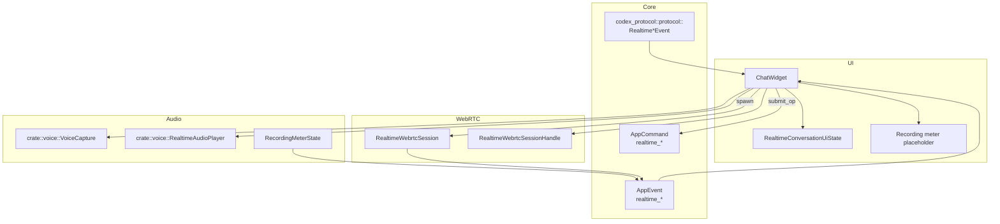
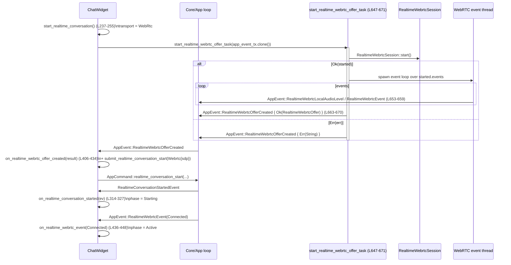

tui/src/chatwidget/realtime.rs の解説です。

# tui/src/chatwidget/realtime.rs

## 0. ざっくり一言

このファイルは、チャット UI (`ChatWidget`) における「リアルタイム音声モード（realtime voice）」の UI 状態管理・音声入出力制御・WebRTC 連携を行うモジュールです。[`RealtimeConversationUiState`] とその周辺メソッドで、開始〜動作中〜終了までのライフサイクルを扱います（`realtime.rs:L18-L45`, `realtime.rs:L83-L645`）。

---

## 1. このモジュールの役割

### 1.1 概要

- このモジュールは **リアルタイム音声会話モード** の UI 側の状態管理を行い、  
  - 会話の開始・停止  
  - 音声キャプチャ（マイク）と再生（スピーカー）  
  - WebSocket / WebRTC ベースのリアルタイムプロトコルイベント処理  
  - 音声レベルメーター UI 更新  
  を提供します（`realtime.rs:L18-L45`, `realtime.rs:L237-L305`, `realtime.rs:L532-L579`, `realtime.rs:L647-L698`）。

- コア側（AppCommand / AppEvent / codex_protocol / codex_realtime_webrtc など）と UI の橋渡しを行う「アダプタ」の役割を持ちます（`realtime.rs:L2-L12`, `realtime.rs:L261-L268`, `realtime.rs:L647-L671`）。

### 1.2 アーキテクチャ内での位置づけ

このファイルに現れる主なコンポーネント間の関係を示します。



- `ChatWidget` はフィールドとして `RealtimeConversationUiState` を保持し、各メソッドから状態を更新します（`realtime.rs:L27-L41`, `realtime.rs:L83-L645`）。
- コアとの通信は `AppCommand`（送信）と `AppEventSender/AppEvent`（受信）を通じて行われます（`realtime.rs:L261-L268`, `realtime.rs:L647-L671`）。
- 音声入出力は `crate::voice::VoiceCapture` と `crate::voice::RealtimeAudioPlayer` に委譲され、音声レベル表示は `RecordingMeterState`＋AppEvent 経由で UI に反映されます（`realtime.rs:L37-L41`, `realtime.rs:L532-L559`, `realtime.rs:L573-L579`, `realtime.rs:L681-L696`）。
- WebRTC 通信は `RealtimeWebrtcSession` と `RealtimeWebrtcSessionHandle` を通じて行われます（`realtime.rs:L11-L12`, `realtime.rs:L243-L252`, `realtime.rs:L647-L667`）。

### 1.3 設計上のポイント

- **明示的なフェーズ管理**  
  - `RealtimeConversationPhase` で Inactive / Starting / Active / Stopping を管理し（`realtime.rs:L18-L25`）、メソッド内でフェーズに応じたガードを行います（例: `is_live`, `is_active` / `realtime.rs:L54-L66`, 開始・停止メソッド内の条件分岐）。
- **トランスポート抽象化**  
  - WebSocket と WebRTC を `RealtimeConversationUiTransport` で抽象化し（`realtime.rs:L44-L51`）、共通の UI ロジックから利用します（`realtime.rs:L243-L252`, `realtime.rs:L486-L490`）。
- **スレッドとアトミックによる非同期処理**  
  - WebRTC オファー生成やメーター更新を `std::thread::spawn` でバックグラウンド実行し（`realtime.rs:L647-L671`, `realtime.rs:L681-L696`）、`Arc<AtomicBool>` と `Arc<AtomicU16>` で停止フラグ・音声レベルを共有します（`realtime.rs:L37-L41`, `realtime.rs:L567-L569`, `realtime.rs:L652-L657`）。
- **プラットフォーム依存コードの分離**  
  - Linux では音声関連の機能が無効化されており、`#[cfg(target_os = "linux")]` / `#[cfg(not(target_os = "linux"))]` で分岐しています（`realtime.rs:L13-L16`, `realtime.rs:L521-L529`, `realtime.rs:L531-L583`, `realtime.rs:L585-L624`, `realtime.rs:L674-L680`）。
- **エラーハンドリング方針**  
  - 音声や WebRTC の起動に失敗した場合は `fail_realtime_conversation` に集約し、エラーメッセージ表示と状態リセット／停止要求を行います（`realtime.rs:L304-L312`, `realtime.rs:L541-L547`, `realtime.rs:L422-L423`, `realtime.rs:L455-L456`）。

---

## 2. 主要な機能一覧

このモジュールが提供する主な機能です。

- リアルタイム会話フェーズ管理（開始・アクティブ・停止・リセット）  
  （`RealtimeConversationUiState`, `start_realtime_conversation`, `request_realtime_conversation_close`, `reset_realtime_conversation_state` / `realtime.rs:L27-L41`, `realtime.rs:L237-L255`, `realtime.rs:L271-L291`, `realtime.rs:L293-L302`）
- UI からのリアルタイムモード開始・終了操作（/realtime ヒント含む）  
  （`start_realtime_conversation`, `stop_realtime_conversation_from_ui`, フッターヒント生成 / `realtime.rs:L216-L222`, `realtime.rs:L237-L255`）
- 通常メッセージ送信とリアルタイムモードの調停  
  （`maybe_defer_user_message_for_realtime` / `realtime.rs:L194-L213`）
- ユーザーメッセージイベントのレンダリング用変換と比較キー生成  
  （`RenderedUserMessageEvent`, `PendingSteerCompareKey`, 関連関数 / `realtime.rs:L69-L81`, `realtime.rs:L83-L180`）
- Realtime プロトコルイベント処理  
  （`on_realtime_conversation_started`, `on_realtime_conversation_realtime`, `on_realtime_conversation_closed`, `on_realtime_conversation_sdp` / `realtime.rs:L314-L404`）
- WebRTC スタート〜接続〜クローズイベント処理  
  （`start_realtime_webrtc_offer_task`, `on_realtime_webrtc_offer_created`, `on_realtime_webrtc_event`, `on_realtime_webrtc_local_audio_level` / `realtime.rs:L243-L252`, `realtime.rs:L406-L459`, `realtime.rs:L461-L483`, `realtime.rs:L647-L671`）
- ローカル音声キャプチャ／再生とメーター UI の制御  
  （`start_realtime_local_audio`, `stop_realtime_local_audio`, `restart_realtime_audio_device`, `start_realtime_meter`, `start_realtime_meter_task` / `realtime.rs:L531-L559`, `realtime.rs:L585-L610`, `realtime.rs:L617-L637`, `realtime.rs:L573-L579`, `realtime.rs:L675-L696`）

---

## 3. 公開 API と詳細解説

### 3.1 型一覧（構造体・列挙体など）

| 名前 | 種別 | 役割 / 用途 | 定義位置 |
|------|------|-------------|----------|
| `RealtimeConversationPhase` | 列挙体 | リアルタイム会話のフェーズ（Inactive / Starting / Active / Stopping）を表現します | `realtime.rs:L18-L25` |
| `RealtimeConversationUiState` | 構造体 | UI 側で保持するリアルタイム会話の状態。フェーズ・セッション ID・トランスポート・音声デバイス関連ハンドルなどを含みます | `realtime.rs:L27-L41` |
| `RealtimeConversationUiTransport` | 列挙体（内部） | WebSocket / WebRTC どちらのトランスポートを使用中かを表します。WebRTC の場合はセッションハンドルを保持します | `realtime.rs:L44-L51` |
| `RenderedUserMessageEvent` | 構造体 | ユーザーメッセージを UI レンダリング用にまとめた型（本文テキスト・リモート画像 URL・ローカル画像パス・テキスト要素） | `realtime.rs:L69-L75` |
| `PendingSteerCompareKey` | 構造体 | ペンディング中の「steer」メッセージを既にコミット済みのものと比較するためのキー（flatten 済みテキストと画像枚数） | `realtime.rs:L77-L81` |

補足として、`RealtimeConversationUiState` には状態問い合わせメソッド `is_live` / `is_active` が実装されています（`realtime.rs:L53-L66`）。

### 3.2 関数詳細（重要 7 件）

以下では、特に中核となる 7 関数について詳しく解説します。

---

#### `start_realtime_conversation(&mut self)`

**概要**

リアルタイム音声会話モードを UI から開始するエントリポイントです。内部状態を初期化し、設定されたトランスポート（WebSocket / WebRTC）に応じて開始処理を分岐します（`realtime.rs:L237-L255`）。

**引数**

| 引数名 | 型 | 説明 |
|--------|----|------|
| `self` | `&mut ChatWidget` | `ChatWidget` のミュータブル参照。内部の `realtime_conversation` 状態などを更新します |

**戻り値**

- なし。副作用として `self.realtime_conversation` のフェーズ・フラグ・トランスポートを更新し、AppCommand を発行したりスレッドを起動します。

**内部処理の流れ**

1. フェーズを `Starting` に設定し、`requested_close` を false、`session_id` を `None`、`warned_audio_only_submission` を false にリセットします（`realtime.rs:L238-L242`）。
2. フッターヒントを `/realtime` の操作説明に差し替えます（`realtime.rs:L242-L243`, `realtime.rs:L216-L218`）。
3. 設定 `self.config.realtime.transport` に応じて分岐します（`realtime.rs:L243-L253`）。  
   - **WebSocket** の場合  
     - `transport` を `Websocket` に設定し、`submit_realtime_conversation_start(None)` で会話開始コマンドを送信します（`realtime.rs:L244-L247`）。  
   - **WebRtc** の場合  
     - `transport` を `Webrtc { handle: None }` に設定し、`start_realtime_webrtc_offer_task(self.app_event_tx.clone())` で WebRTC オファー生成スレッドを起動します（`realtime.rs:L248-L252`）。
4. 画面の再描画を要求します（`realtime.rs:L254-L255`）。

**Examples（使用例）**

```rust
// ChatWidget インスタンスがあり、リアルタイム機能が有効になっている前提
fn on_user_command_realtime(widget: &mut ChatWidget) {
    // /realtime コマンドに応じて会話を開始する
    widget.start_realtime_conversation();  // フェーズが Starting になり、トランスポート別の開始処理が動く
}
```

**Errors / Panics**

- この関数自身は `Result` を返さず、エラーは後続の処理で検出されます。
  - WebRTC セッション開始エラーは `start_realtime_webrtc_offer_task` 内で `AppEvent::RealtimeWebrtcOfferCreated` の `Err` として通知され、その後 `on_realtime_webrtc_offer_created` で `fail_realtime_conversation` によって処理されます（`realtime.rs:L647-L671`, `realtime.rs:L419-L425`）。
  - マイクキャプチャやスピーカー起動エラーも別関数で `fail_realtime_conversation` に委ねられます（`realtime.rs:L541-L547`, `realtime.rs:L597-L605`）。

**Edge cases（エッジケース）**

- リアルタイム会話がすでにアクティブでも、この関数はフェーズなどを上書きします。フェーズの事前チェックは実装されていません（`realtime.rs:L237-L242`）。
- WebRTC トランスポートの場合、`start_realtime_conversation` 呼び出し時点では `RealtimeWebrtcSessionHandle` はまだ存在せず、オファー生成完了イベントを待ちます（`realtime.rs:L248-L252`, `realtime.rs:L406-L434`）。

**使用上の注意点**

- 会話の開始は、コア側から `RealtimeConversationStartedEvent` が返ってきて初めて `Active` フェーズになることに注意が必要です（`realtime.rs:L314-L332`）。
- WebRTC 使用時は、さらに `RealtimeWebrtcEvent::Connected` を受け取るまで `Active` には遷移しません（`realtime.rs:L441-L448`）。

---

#### `request_realtime_conversation_close(&mut self, info_message: Option<String>)`

**概要**

リアルタイム音声会話のクローズを UI 側から要求する関数です。必要であればコアにクローズコマンドを送信し、ローカル音声デバイスや WebRTC トランスポートを停止します（`realtime.rs:L271-L291`）。

**引数**

| 引数名 | 型 | 説明 |
|--------|----|------|
| `self` | `&mut ChatWidget` | UI 状態およびデバイスを更新します |
| `info_message` | `Option<String>` | クローズ後にユーザーへ表示する情報メッセージ（任意） |

**戻り値**

- なし。内部状態の更新と UI メッセージ追加、副作用的な停止処理を行います。

**内部処理の流れ**

1. 会話が live でない (`is_live == false`) 場合  
   - `info_message` があれば `add_info_message` で表示し、そのまま return します（`realtime.rs:L271-L276`）。
2. live な場合  
   - `requested_close` を true にし、フェーズを `Stopping` に設定します（`realtime.rs:L279-L280`）。
   - `AppCommand::realtime_conversation_close()` を `submit_op` で送信します（`realtime.rs:L281-L281`）。
   - ローカル音声 (`stop_realtime_local_audio`) と WebRTC トランスポート (`close_realtime_webrtc_transport`) を停止し、フッターヒントを解除します（`realtime.rs:L282-L284`）。
   - `info_message` が Some なら情報メッセージを表示、None なら再描画を要求して終了します（`realtime.rs:L286-L290`）。

**Examples（使用例）**

```rust
fn on_user_command_realtime_stop(widget: &mut ChatWidget) {
    // ユーザーが /realtime を再入力した場合などに停止
    widget.request_realtime_conversation_close(Some(
        "Realtime voice mode stopped by user.".to_string(),
    ));
}
```

**Errors / Panics**

- エラーは返しません。トランスポートやデバイス停止処理での失敗はこの関数内では特に検出していません。
- すでに停止済みのデバイスに対する stop 呼び出しも安全に無視される設計になっています（`Option` を `take()` してから操作 / `realtime.rs:L627-L637`, `realtime.rs:L640-L643`）。

**Edge cases**

- `is_live == false` のときに呼んでも、コアへのクローズコマンドは送信されず、`info_message` の表示のみが行われます（`realtime.rs:L271-L277`）。
- `requested_close` フラグは `on_realtime_conversation_closed` で利用され、サーバー側からの自発的なクローズかどうかを区別します（`realtime.rs:L378-L383`）。

**使用上の注意点**

- UI 上で「ユーザー操作によるクローズかどうか」を区別する設計になっているため、ユーザー意図によるクローズ時にはこのメソッドを通す前提になっています（`requested_close` を利用 / `realtime.rs:L378-L383`）。

---

#### `on_realtime_conversation_started(&mut self, ev: RealtimeConversationStartedEvent)`

**概要**

コアからの `RealtimeConversationStartedEvent` を処理し、セッション ID の保存・フェーズ遷移・ローカル音声開始などを行います（`realtime.rs:L314-L332`）。

**引数**

| 引数名 | 型 | 説明 |
|--------|----|------|
| `self` | `&mut ChatWidget` | UI 状態の更新 |
| `ev` | `RealtimeConversationStartedEvent` | セッション開始イベント（session_id を含む） |

**戻り値**

- なし。

**内部処理の流れ**

1. `realtime_conversation_enabled()` が false の場合、`request_realtime_conversation_close(None)` を呼んで終了します（`realtime.rs:L318-L321`）。
2. セッション ID を保存し、音声のみ警告フラグを false に戻します（`realtime.rs:L322-L323`）。
3. フッターヒントを `/realtime` の案内に設定します（`realtime.rs:L324-L324`）。
4. トランスポート種別によって処理を分岐します（`realtime.rs:L325-L330`）。
   - WebRTC 使用中 (`realtime_conversation_uses_webrtc() == true`)  
     - フェーズを `Starting` に設定（接続確立を待機）。  
   - それ以外（WebSocket）  
     - フェーズを `Active` に設定し、ローカル音声を開始します（`start_realtime_local_audio`）。
5. 最後に再描画を要求します（`realtime.rs:L331-L331`）。

**Examples（使用例）**

```rust
fn on_app_event(widget: &mut ChatWidget, event: AppEvent) {
    if let AppEvent::RealtimeConversationStarted(ev) = event {
        widget.on_realtime_conversation_started(ev);
    }
}
```

**Errors / Panics**

- この関数内ではエラーを返しません。
- `start_realtime_local_audio` の中でマイクキャプチャ開始に失敗した場合は、`fail_realtime_conversation` により会話全体が失敗状態として扱われます（`realtime.rs:L537-L547`）。

**Edge cases**

- リアルタイム機能が無効 (`realtime_conversation_enabled() == false`) の場合、開始イベントを受け取っても即座にクローズ要求を送ります（`realtime.rs:L318-L321`）。

**使用上の注意点**

- WebRTC 使用時には、フェーズが `Active` になるのは `RealtimeWebrtcEvent::Connected` を受け取ったタイミングであり、この関数では `Starting` のままです（`realtime.rs:L441-L448`）。

---

#### `on_realtime_conversation_realtime(&mut self, ev: RealtimeConversationRealtimeEvent)`

**概要**

プロトコル層から通知される `RealtimeConversationRealtimeEvent`（`RealtimeEvent` でラップされたイベント）の処理を行います。セッション更新、音声再生、音声再生の中断、エラーハンドリングなどを担当します（`realtime.rs:L334-L367`）。

**引数**

| 引数名 | 型 | 説明 |
|--------|----|------|
| `self` | `&mut ChatWidget` | UI 状態の更新とデバイス操作 |
| `ev` | `RealtimeConversationRealtimeEvent` | Realtime プロトコルイベント（`payload: RealtimeEvent` を含む） |

**戻り値**

- なし。

**内部処理の流れ**

1. WebRTC 使用中で、`ev.payload` が音声関連／レスポンス関係のイベントのいずれか（`AudioOut` / `InputAudioSpeechStarted` / `ResponseCreated` / `ResponseCancelled` / `ResponseDone`）なら、そのイベントは無視して return します（`realtime.rs:L338-L347`）。
2. それ以外の場合、`ev.payload` を `match` で分岐します（`realtime.rs:L350-L367`）。  
   - `SessionUpdated { session_id, .. }`  
     - `self.realtime_conversation.session_id = Some(session_id)`（更新）  
   - `InputAudioSpeechStarted(_)`  
     - `interrupt_realtime_audio_playback()` を呼び、再生中の音声を中断します。  
   - `AudioOut(frame)`  
     - `enqueue_realtime_audio_out(&frame)` を呼び、音声フレームをスピーカー出力キューに追加します。  
   - `ResponseCancelled(_)`  
     - `interrupt_realtime_audio_playback()` で音声を中断します。  
   - `Error(message)`  
     - `fail_realtime_conversation` を呼び、「Realtime voice error: {message}」というエラーメッセージとともに会話を失敗状態にします。  
   - その他 (`InputTranscriptDelta`, `OutputTranscriptDelta`, `ResponseCreated`, `ResponseDone`, `ConversationItemAdded`, `ConversationItemDone`, `HandoffRequested`)  
     - 現状では何も行いません。

**Examples（使用例）**

```rust
fn on_app_event(widget: &mut ChatWidget, event: AppEvent) {
    if let AppEvent::RealtimeConversationRealtime(ev) = event {
        widget.on_realtime_conversation_realtime(ev);
    }
}
```

**Errors / Panics**

- この関数自体はエラーを返しません。
- プロトコルエラー (`RealtimeEvent::Error`) を受け取ると `fail_realtime_conversation` を通じて会話が停止されます（`realtime.rs:L364-L366`, `realtime.rs:L304-L312`）。

**Edge cases**

- WebRTC 使用時に音声関連イベントを無視する分岐により、WebRTC 経由の音声処理と WebSocket 経由の音声イベントが二重に扱われることを避けています（`realtime.rs:L338-L347`）。
- `SessionUpdated` でセッション ID が後から変わるケースも想定されています（`realtime.rs:L351-L353`）。

**使用上の注意点**

- 新しい `RealtimeEvent` バリアントを追加する場合、この `match` 式に分岐を追加する必要があります。追加しない場合は暗黙に無視されます。

---

#### `maybe_defer_user_message_for_realtime(&mut self, user_message: UserMessage) -> Option<UserMessage>`

**概要**

チャット入力メッセージが送信される直前に、リアルタイム音声モード中であるかをチェックし、必要に応じてテキストメッセージの送信を保留（Composer に戻す）する関数です（`realtime.rs:L194-L213`）。

**引数**

| 引数名 | 型 | 説明 |
|--------|----|------|
| `self` | `&mut ChatWidget` | UI 状態やメッセージリストを変更します |
| `user_message` | `UserMessage` | 送信予定のユーザーメッセージ |

**戻り値**

- `Some(user_message)`  
  - リアルタイムモードでないため、そのまま送信してよいことを示します。  
- `None`  
  - リアルタイムモード中のため、メッセージを Composer に戻して送信を行わないことを示します。

**内部処理の流れ**

1. `self.realtime_conversation.is_live()` が false の場合、そのまま `Some(user_message)` を返します（`realtime.rs:L198-L200`）。
2. live の場合  
   - `restore_user_message_to_composer(user_message)` でメッセージを入力欄に戻します（`realtime.rs:L202-L202`）。
   - `warned_audio_only_submission` が false なら  
     - true にセットし、  
     - 「Realtime voice mode is audio-only. Use /realtime to stop.」という情報メッセージを追加します（`realtime.rs:L203-L208`）。  
   - すでに警告済みなら、単に再描画を要求します（`realtime.rs:L209-L211`）。
   - 最後に `None` を返します（`realtime.rs:L213-L213`）。

**Examples（使用例）**

```rust
fn on_send_button_pressed(widget: &mut ChatWidget, msg: UserMessage) {
    if let Some(msg) = widget.maybe_defer_user_message_for_realtime(msg) {
        // Realtime でないので通常送信
        widget.submit_user_message(msg);
    } else {
        // Realtime voice mode のため送信を見送り（警告が表示される）
    }
}
```

**Errors / Panics**

- エラーは返しません。
- `restore_user_message_to_composer` や `add_info_message` の内部挙動はこのチャンクには現れませんが、ここではそれらの成功を前提とした制御になっています。

**Edge cases**

- リアルタイムモードが `Stopping` フェーズでも `is_live()` は true を返すため、この関数は送信を抑止します（`is_live` の実装参照 / `realtime.rs:L54-L60`）。
- 一度警告を表示した後は、同じセッション中は再度警告を出さず、再描画のみ行います（`realtime.rs:L203-L211`）。

**使用上の注意点**

- この関数は所有権をムーブした `UserMessage` を `Option` 経由で返すため、呼び出し側では必ず戻り値の `Option` をチェックする必要があります。

---

#### `start_realtime_local_audio(&mut self)`（非 Linux）

**概要**

ローカルのマイクキャプチャと音声レベルメーター、およびスピーカー出力を初期化します。非 Linux 環境でのみ有効です（`realtime.rs:L531-L559`）。

**引数**

| 引数名 | 型 | 説明 |
|--------|----|------|
| `self` | `&mut ChatWidget` | 音声キャプチャ・プレイヤー・メーター関連状態を更新します |

**戻り値**

- なし。

**内部処理の流れ**

1. すでに `capture_stop_flag` が Some なら、マイクキャプチャが動作中とみなし、何もせず return します（`realtime.rs:L533-L535`）。
2. `VoiceCapture::start_realtime(&self.config, self.app_event_tx.clone())` を呼び出します（`realtime.rs:L537-L540`）。
   - 成功 (`Ok(capture)`) なら続行。  
   - 失敗 (`Err(err)`) なら `fail_realtime_conversation("Failed to start microphone capture: {err}")` を呼び出して終了します（`realtime.rs:L541-L547`）。
3. `capture.stopped_flag()` から停止フラグの `Arc<AtomicBool>` を取得し、`capture.last_peak_arc()` から音声ピークの `Arc<AtomicU16>` を取得します（`realtime.rs:L550-L551`）。
4. `start_realtime_meter(stop_flag.clone(), peak)` を呼び出し、メーター UI 更新スレッドを起動します（`realtime.rs:L552-L552`, `realtime.rs:L573-L579`）。
5. `capture_stop_flag` と `capture` フィールドに取得した値を保存します（`realtime.rs:L553-L554`）。
6. スピーカー再生用 `audio_player` が未初期化であれば、`RealtimeAudioPlayer::start(&self.config).ok()` で起動し、Ok の場合に保存します（`realtime.rs:L555-L558`）。

**Examples（使用例）**

この関数は通常、会話開始時やデバイス再起動時に内部から呼び出されます。

```rust
fn on_conversation_started(widget: &mut ChatWidget, ev: RealtimeConversationStartedEvent) {
    widget.on_realtime_conversation_started(ev); // WebSocket の場合はこの中で start_realtime_local_audio が呼ばれる
}
```

**Errors / Panics**

- `VoiceCapture::start_realtime` がエラーを返した場合、会話は `fail_realtime_conversation` によって停止されます（`realtime.rs:L541-L547`, `realtime.rs:L304-L312`）。
- `RealtimeAudioPlayer::start` の失敗はここでは無視して `ok()` にしており、再生できない状態になる可能性があります（`realtime.rs:L555-L558`）。この挙動は仕様として読み取れますが、明示的なエラー表示はしません。

**Edge cases**

- `capture_stop_flag` がすでにセットされている場合はキャプチャを再起動しません。そのため、再起動が必要な場合は事前に `stop_realtime_microphone` を呼ぶ必要があります（`realtime.rs:L533-L535`, `realtime.rs:L627-L637`）。

**使用上の注意点**

- この関数は非 Linux 環境でのみコンパイルされます。Linux 版では空実装の `start_realtime_local_audio` があり、実際の音声キャプチャは行われません（`realtime.rs:L581-L582`）。

---

#### `start_realtime_webrtc_offer_task(app_event_tx: AppEventSender)`

**概要**

バックグラウンドスレッドで WebRTC セッションを開始し、オファー SDP とイベントストリームをセットアップする関数です（`realtime.rs:L647-L671`）。`AppEvent` を通じて UI へ結果を通知します。

**引数**

| 引数名 | 型 | 説明 |
|--------|----|------|
| `app_event_tx` | `AppEventSender` | コア／UI イベントループに `AppEvent` を送信するための送信側ハンドル |

**戻り値**

- なし。スレッドを起動するのみで、結果は `AppEvent` 経由で非同期に通知されます。

**内部処理の流れ**

1. `std::thread::spawn` で新しいスレッドを起動します（`realtime.rs:L647-L671`）。
2. スレッド内で `RealtimeWebrtcSession::start()` を呼び出します（`realtime.rs:L649-L649`）。
   - 成功 (`Ok(started)`) の場合：  
     1. `event_tx = app_event_tx.clone()` を取得します（`realtime.rs:L651-L652`）。  
     2. `local_audio_peak = started.handle.local_audio_peak()` を取得します（`realtime.rs:L652-L652`）。  
     3. 別スレッドを `std::thread::spawn` で起動し、`started.events` をループ処理します（`realtime.rs:L653-L662`）。  
        - 各イベントが `RealtimeWebrtcEvent::LocalAudioLevel(peak)` なら  
          - `local_audio_peak.store(peak, Ordering::Relaxed)` でアトミック値を更新し、  
          - `event_tx.send(AppEvent::RealtimeWebrtcLocalAudioLevel(peak))` を送信します（`realtime.rs:L655-L657`）。  
        - それ以外のイベントは `AppEvent::RealtimeWebrtcEvent(event)` として送信します（`realtime.rs:L658-L659`）。  
     4. `Ok(RealtimeWebrtcOffer { offer_sdp, handle })` を `result` として構築します（`realtime.rs:L663-L666`）。  
   - 失敗 (`Err(err)`) の場合：  
     - `Err(err.to_string())` を `result` にします（`realtime.rs:L668-L668`）。
3. 最後に `AppEvent::RealtimeWebrtcOfferCreated { result }` を送信します（`realtime.rs:L670-L670`）。

**Examples（使用例）**

この関数は `ChatWidget::start_realtime_conversation` から呼ばれます。

```rust
fn start_webrtc_from_ui(widget: &mut ChatWidget) {
    // WebRTC モードの設定になっている前提
    widget.start_realtime_conversation(); // 内部で start_realtime_webrtc_offer_task が呼び出される
}
```

**Errors / Panics**

- `RealtimeWebrtcSession::start` の内部エラーは文字列に変換されて `Err(String)` として UI 側に届きます（`realtime.rs:L668-L670`）。
- チャネル `AppEventSender::send` の戻り値は無視されています。送信に失敗した場合の挙動はこのチャンクからは分かりません。

**Edge cases**

- WebRTC イベントループ用スレッドは `started.events` ストリームが終わるまで継続します（`realtime.rs:L653-L662`）。
- `local_audio_peak` は `Arc<AtomicU16>` と推測されますが、型定義はこのチャンクには現れません。ただし `store(Ordering::Relaxed)` によりメーター更新スレッドと共有されます（`realtime.rs:L652-L657`）。

**使用上の注意点**

- この関数は UI スレッドから呼び出され、長時間ブロックしないように新しいスレッド上でセッション開始を行っています。そのため、呼び出し元は結果を `AppEvent::RealtimeWebrtcOfferCreated` 経由で非同期に受け取る前提となります（`realtime.rs:L406-L434`）。

---

### 3.3 その他の関数（概要一覧）

メソッドおよび補助関数の一覧です（テスト用を含む）。行番号は定義範囲を示します。

| 関数名 / メソッド名 | 役割（1 行） | 定義位置 |
|---------------------|--------------|----------|
| `RealtimeConversationUiState::is_live(&self) -> bool` | Starting / Active / Stopping のいずれかかを判定 | `realtime.rs:L53-L61` |
| `RealtimeConversationUiState::is_active(&self) -> bool` *(非 Linux)* | フェーズが Active かどうかを判定 | `realtime.rs:L63-L66` |
| `rendered_user_message_event_from_parts` | メッセージテキスト・画像等から `RenderedUserMessageEvent` を構築 | `realtime.rs:L83-L96` |
| `rendered_user_message_event_from_event` | `UserMessageEvent` から `RenderedUserMessageEvent` に変換 | `realtime.rs:L98-L107` |
| `pending_steer_compare_key_from_items` | `UserInput` の列から比較用キー（テキスト＋画像枚数）を生成 | `realtime.rs:L114-L133` |
| `pending_steer_compare_key_from_item` *(テスト用)* | `UserMessageItem` から上記キーを生成 | `realtime.rs:L135-L140` |
| `rendered_user_message_event_from_inputs` *(テスト用)* | `UserInput` 列から `RenderedUserMessageEvent` を生成 | `realtime.rs:L142-L180` |
| `should_render_realtime_user_message_event` *(テスト用)* | live 状態かつ直近と異なるイベントのみ描画するか判定 | `realtime.rs:L182-L192` |
| `realtime_footer_hint_items` | フッターヒントに表示する `/realtime` コマンド案内を生成 | `realtime.rs:L216-L218` |
| `stop_realtime_conversation_from_ui` | UI 起点でクローズを要求するラッパー | `realtime.rs:L220-L222` |
| `stop_realtime_conversation_for_deleted_meter` *(非 Linux)* | メーターが消されたことに連動して会話を停止 | `realtime.rs:L224-L235` |
| `submit_realtime_conversation_start` | `AppCommand::realtime_conversation_start` を組み立てて送信 | `realtime.rs:L257-L269` |
| `reset_realtime_conversation_state` | 会話状態とデバイスを完全にリセット | `realtime.rs:L293-L302` |
| `fail_realtime_conversation` | エラー表示と会話停止／リセットを共通処理として実装 | `realtime.rs:L304-L312` |
| `on_realtime_conversation_closed` | クローズイベントを処理し、必要なら情報メッセージを表示 | `realtime.rs:L370-L390` |
| `on_realtime_conversation_sdp` | WebRTC の answer SDP をハンドルに適用 | `realtime.rs:L393-L403` |
| `on_realtime_webrtc_offer_created` | WebRTC オファー生成結果を受け取り、トランスポートを更新 | `realtime.rs:L406-L434` |
| `on_realtime_webrtc_event` | WebRTC 接続／クローズ／エラーイベントを処理 | `realtime.rs:L436-L458` |
| `on_realtime_webrtc_local_audio_level` | ローカル音声レベルイベントからメーター表示を開始 | `realtime.rs:L461-L483` |
| `realtime_conversation_uses_webrtc` | 現在のトランスポートが WebRTC かどうかを判定 | `realtime.rs:L486-L490` |
| `close_realtime_webrtc_transport` | WebRTC ハンドルがあれば close する | `realtime.rs:L493-L499` |
| `enqueue_realtime_audio_out` | `RealtimeAudioFrame` をプレイヤーにキューイング | `realtime.rs:L502-L518` |
| `interrupt_realtime_audio_playback` *(非 Linux)* | プレイヤーキューをクリアして再生を中断 | `realtime.rs:L521-L525` |
| `interrupt_realtime_audio_playback` *(Linux)* | Linux 版の no-op 実装 | `realtime.rs:L528-L529` |
| `start_realtime_webrtc_meter` *(非 Linux)* | WebRTC のピーク値を元にメーター更新を開始 | `realtime.rs:L561-L569` |
| `start_realtime_meter` *(非 Linux)* | メーター用プレースホルダを作成し更新スレッドを起動 | `realtime.rs:L573-L579` |
| `restart_realtime_audio_device` *(非 Linux)* | マイク／スピーカーのデバイスを再起動 | `realtime.rs:L585-L610` |
| `restart_realtime_audio_device` *(Linux)* | Linux 版の no-op 実装 | `realtime.rs:L612-L615` |
| `stop_realtime_local_audio` *(非 Linux)* | マイクとスピーカーを両方停止 | `realtime.rs:L617-L621` |
| `stop_realtime_local_audio` *(Linux)* | Linux 版の no-op 実装 | `realtime.rs:L623-L624` |
| `stop_realtime_microphone` *(非 Linux)* | キャプチャ停止フラグ＋キャプチャ停止＋メーター UI 削除 | `realtime.rs:L627-L637` |
| `stop_realtime_speaker` *(非 Linux)* | プレイヤーキューをクリアし解放 | `realtime.rs:L639-L643` |
| `start_realtime_meter_task` *(非 Linux)* | メーター UI を 60ms 間隔で更新するバックグラウンドスレッド | `realtime.rs:L675-L697` |

---

## 4. データフロー

ここでは、WebRTC トランスポートを用いたリアルタイム会話の開始〜接続までの典型的なデータフローを示します。

1. UI が `start_realtime_conversation` を呼ぶと、`RealtimeTransport::WebRtc` に応じて `start_realtime_webrtc_offer_task` が起動します（`realtime.rs:L237-L255`）。
2. `start_realtime_webrtc_offer_task` 内で `RealtimeWebrtcSession::start` が実行され、成功すると  
   - WebRTC イベント処理用スレッドが起動し、音声レベルや接続イベントを `AppEvent` 経由で UI に返します（`realtime.rs:L649-L662`）。  
   - SDP オファーとハンドルを含む `RealtimeWebrtcOffer` が `AppEvent::RealtimeWebrtcOfferCreated` として通知されます（`realtime.rs:L663-L670`）。
3. UI は `on_realtime_webrtc_offer_created` でオファーを受け取り、トランスポートにハンドルを保存しつつ `submit_realtime_conversation_start` で WebRTC トランスポート付き会話開始コマンドを送ります（`realtime.rs:L406-L434`）。
4. コア側から `RealtimeConversationStartedEvent` が届くと `on_realtime_conversation_started` が呼ばれ、WebRTC 使用中なのでフェーズを `Starting` に維持します（`realtime.rs:L314-L327`）。
5. WebRTC 接続が確立すると `RealtimeWebrtcEvent::Connected` が `AppEvent::RealtimeWebrtcEvent` 経由で UI に届き、`on_realtime_webrtc_event` 内でフェーズを `Active` にし、必要なら音声系を準備します（`realtime.rs:L436-L448`）。
6. ローカル音声レベルイベント (`RealtimeWebrtcEvent::LocalAudioLevel`) は `on_realtime_webrtc_local_audio_level` によって処理され、メーター表示が開始されます（`realtime.rs:L461-L483`, `realtime.rs:L561-L579`）。



この図は、本ファイルの WebRTC 開始関連の関数群（`L237-255`, `L406-434`, `L436-448`, `L647-671`）の関係を示しています。

---

## 5. 使い方（How to Use）

### 5.1 基本的な使用方法

このモジュールのメソッドは直接 `ChatWidget` から呼び出されます。全体の典型的なフローは次のようになります。

```rust
fn handle_user_command(widget: &mut ChatWidget, cmd: &str) {
    match cmd {
        "/realtime" => {
            // Realtime voice モード開始
            widget.start_realtime_conversation();          // L237-255
        }
        "/realtime-stop" => {
            // 明示的な停止（実際のコマンド文字列は UI 側の設計次第）
            widget.stop_realtime_conversation_from_ui();   // L220-222
        }
        _ => { /* その他のコマンド */ }
    }
}

fn handle_send(widget: &mut ChatWidget, msg: UserMessage) {
    // Realtime 中なら送信を保留して Composer に戻す
    if let Some(msg) = widget.maybe_defer_user_message_for_realtime(msg) {   // L194-213
        // 通常送信用のパスへ
        widget.submit_user_message(msg);
    }
}

fn handle_app_event(widget: &mut ChatWidget, event: AppEvent) {
    match event {
        AppEvent::RealtimeConversationStarted(ev) => {
            widget.on_realtime_conversation_started(ev);       // L314-332
        }
        AppEvent::RealtimeConversationRealtime(ev) => {
            widget.on_realtime_conversation_realtime(ev);      // L334-367
        }
        AppEvent::RealtimeConversationClosed(ev) => {
            widget.on_realtime_conversation_closed(ev);        // L370-390
        }
        AppEvent::RealtimeConversationSdp(sdp) => {
            widget.on_realtime_conversation_sdp(sdp);          // L393-403
        }
        AppEvent::RealtimeWebrtcOfferCreated { result } => {
            widget.on_realtime_webrtc_offer_created(result);   // L406-434
        }
        AppEvent::RealtimeWebrtcEvent(ev) => {
            widget.on_realtime_webrtc_event(ev);               // L436-458
        }
        AppEvent::RealtimeWebrtcLocalAudioLevel(peak) => {
            widget.on_realtime_webrtc_local_audio_level(peak); // L461-483
        }
        AppEvent::UpdateRecordingMeter { id, text } => {
            // これは別 UI モジュールで処理されると想定されます
        }
        _ => {}
    }
}
```

### 5.2 よくある使用パターン

- **WebSocket モードでの使用**  
  - 設定で `RealtimeTransport::Websocket` の場合、`start_realtime_conversation` 呼び出し時にすぐに `submit_realtime_conversation_start(None)` が実行されます（`realtime.rs:L243-L247`）。  
  - 会話開始イベント (`RealtimeConversationStartedEvent`) を受けると `start_realtime_local_audio` が呼ばれ、マイク＋スピーカー＋メーターが起動します（`realtime.rs:L328-L330`, `realtime.rs:L531-L559`）。

- **WebRTC モードでの使用**  
  - `start_realtime_conversation` が `start_realtime_webrtc_offer_task` を起動し、AppEvent 経由で SDP オファーとハンドルを受け取る流れになります（`realtime.rs:L248-L252`, `realtime.rs:L647-L671`）。  
  - 接続確立まではフェーズ `Starting` を維持し、`RealtimeWebrtcEvent::Connected` を受けたタイミングで `Active` に遷移します（`realtime.rs:L441-L448`）。

### 5.3 よくある間違い

```rust
// 間違い例: Realtime 中でも常にメッセージを送信してしまう
fn on_send_wrong(widget: &mut ChatWidget, msg: UserMessage) {
    widget.submit_user_message(msg); // Realtime voice mode 中のテキスト送信を抑止していない
}

// 正しい例: maybe_defer_user_message_for_realtime を必ず通す
fn on_send_correct(widget: &mut ChatWidget, msg: UserMessage) {
    if let Some(msg) = widget.maybe_defer_user_message_for_realtime(msg) {
        widget.submit_user_message(msg);
    }
}
```

- また、デバイス再起動を行う際に、フェーズが `Active` でない状態で `restart_realtime_audio_device` を呼んでも何も起こらない（return する）点に注意が必要です（`realtime.rs:L585-L588`）。

### 5.4 使用上の注意点（まとめ）

- 会話ライフサイクル  
  - `start_realtime_conversation` → `on_realtime_conversation_started` → `on_realtime_conversation_closed` / `fail_realtime_conversation` が基本パターンです。途中で `request_realtime_conversation_close` による明示的停止もあります。
- 音声デバイス  
  - マイク／スピーカーは `start_realtime_local_audio` / `stop_realtime_local_audio` / `restart_realtime_audio_device` からのみ操作される前提です。直接 `VoiceCapture` や `RealtimeAudioPlayer` を触るコードはこのモジュール内には存在しません（`realtime.rs:L37-L41`, `realtime.rs:L531-L559`, `realtime.rs:L585-L610`）。
- スレッド安全性  
  - 停止フラグ・メーター用ピーク値は `Arc<AtomicBool>` / `Arc<AtomicU16>` で共有され、`Ordering::Relaxed` でアクセスされています。これはメーター表示や停止判定に強い順序保証が不要である前提の設計と解釈できます（`realtime.rs:L37-L41`, `realtime.rs:L567-L569`, `realtime.rs:L652-L657`, `realtime.rs:L685-L690`）。

---

## 6. 変更の仕方（How to Modify）

### 6.1 新しい機能を追加する場合

例: 新しい `RealtimeEvent` バリアントを UI で処理したい場合。

1. プロトコル側で `RealtimeEvent` に新バリアントが追加されたと仮定します（このチャンクには定義はありません）。
2. 本ファイルでは `on_realtime_conversation_realtime` の `match ev.payload` に分岐を追加します（`realtime.rs:L350-L367`）。
3. 必要なら `RealtimeConversationUiState` に状態フィールドを追加し、その更新ロジックを同メソッド内に実装します（`realtime.rs:L27-L41`）。
4. UI 側表示に反映したい場合は、適切な `add_info_message` / `add_error_message` 等の呼び出しを追加します（`realtime.rs:L304-L305`, `realtime.rs:L385-L388`）。

WebRTC 関連機能を拡張したい場合は、以下の入口が主になります。

- オファー／アンサー処理: `on_realtime_conversation_sdp`, `on_realtime_webrtc_offer_created`（`realtime.rs:L393-L403`, `realtime.rs:L406-L434`）
- 接続状態・エラー: `on_realtime_webrtc_event`（`realtime.rs:L436-L458`）
- ローカル音声レベル: `on_realtime_webrtc_local_audio_level`, `start_realtime_webrtc_meter`（`realtime.rs:L461-L483`, `realtime.rs:L561-L569`）

### 6.2 既存の機能を変更する場合

- **状態遷移を変更する場合**  
  - `RealtimeConversationPhase` の使われ方を、開始・終了処理・イベントハンドラ全体で見直す必要があります。関係箇所は `start_realtime_conversation`, `request_realtime_conversation_close`, `reset_realtime_conversation_state`, `on_realtime_conversation_started`, `on_realtime_webrtc_event` などです（`realtime.rs:L237-L255`, `realtime.rs:L271-L291`, `realtime.rs:L293-L302`, `realtime.rs:L314-L332`, `realtime.rs:L436-L448`）。
- **メーター更新間隔や挙動を変更する場合**  
  - `start_realtime_meter_task` 内の sleep 間隔 (`Duration::from_millis(60)`) や `RecordingMeterState::next_text` の使い方が対象となります（`realtime.rs:L681-L696`）。
- **デバイスエラー時の挙動を変えたい場合**  
  - マイク／スピーカー起動・再起動部分で `fail_realtime_conversation` を呼んでいる箇所を確認し、エラーを無視するか、UI へのメッセージを変えるなどの調整を行います（`realtime.rs:L541-L547`, `realtime.rs:L597-L605`）。

変更時には、関連する `#[cfg(test)]` のヘルパー関数の挙動（`pending_steer_compare_key_from_item` 等）も合わせて確認するとテストが追従しやすくなります（`realtime.rs:L135-L140`, `realtime.rs:L142-L192`）。

---

## 7. 関連ファイル

このモジュールと密接に関係するモジュール・型（ファイルパスはこのチャンクからは読み取れないため、モジュール名のみ記載します）。

| パス / モジュール | 役割 / 関係 |
|-------------------|------------|
| `super::*`（例: `ChatWidget`, `UserMessage`, `UserInput`, `UserMessageEvent`, `AppCommand`, `AppEventSender`, `AppEvent` など） | 本モジュールがメソッド実装を提供している対象 (`ChatWidget`) や、コマンド／イベントの送受信に使用する型が定義されていると推測されます（このチャンクには定義なし）。 |
| `codex_config::config_toml::RealtimeTransport` | リアルタイムトランスポートの種別（Websocket / WebRtc）設定を提供します（`realtime.rs:L2-L2`）。 |
| `codex_protocol::protocol::*` (`ConversationStartParams`, `ConversationStartTransport`, `Realtime*Event`, `RealtimeAudioFrame`) | コアとの Realtime プロトコルで使用される型群です（`realtime.rs:L3-L9`, `realtime.rs:L350-L367`）。 |
| `codex_realtime_webrtc::{RealtimeWebrtcSession, RealtimeWebrtcSessionHandle, RealtimeWebrtcEvent}` | WebRTC セッションの開始・ハンドル・イベントを表す型で、WebRTC 経路の実装に使用されます（`realtime.rs:L10-L12`, `realtime.rs:L436-L458`, `realtime.rs:L647-L667`）。 |
| `crate::voice::{VoiceCapture, RealtimeAudioPlayer, RecordingMeterState}` | マイクキャプチャ、音声再生、およびメーター描画ロジックを提供するモジュール群です（`realtime.rs:L37-L41`, `realtime.rs:L532-L559`, `realtime.rs:L681-L683`）。 |
| `AppEvent::UpdateRecordingMeter` | メーター表示の更新を UI 側に伝えるイベントです（`realtime.rs:L690-L693`）。 |

---

### Bugs / Security（観察）

- **送信エラーの無視**  
  - `AppEventSender::send` の戻り値が常に無視されており、送信失敗時の挙動はこのチャンクからは分かりません（`realtime.rs:L657-L660`, `realtime.rs:L670-L670`, `realtime.rs:L690-L693`）。  
    これは UI の一時的な通知喪失につながる可能性がありますが、致命的な安全性問題とは限りません。
- **Security**  
  - 本モジュールは WebRTC / WebSocket のプロトコル詳細には関与せず、受け取ったメッセージやエラーを比較的そのまま UI に表示します（`realtime.rs:L364-L366`, `realtime.rs:L385-L388`）。  
    表示するメッセージ文字列の妥当性チェックやサニタイズは別レイヤーの責務と考えられますが、このチャンクだけからは詳細は不明です。

### Contracts / Edge Cases（まとめ的な観点）

- `is_live` は `Starting` / `Active` / `Stopping` を全て true とするため、停止中フェーズでも「live」と見なされます（`realtime.rs:L54-L60`）。この仕様はメッセージ送信抑止などの判定に影響します（`realtime.rs:L198-L200`）。
- WebRTC 使用時に、サーバー側から `reason == "transport_closed"` でクローズされた場合は `on_realtime_conversation_closed` で即 return して状態をリセットしないため、その後の WebRTC イベントでクローズが処理される前提になっています（`realtime.rs:L370-L376`）。

### Tests（観察）

- 本ファイルにはユニットテストそのものはありませんが、テスト用ヘルパーとして  
  - `pending_steer_compare_key_from_item`  
  - `rendered_user_message_event_from_inputs`  
  - `should_render_realtime_user_message_event`  
  が `#[cfg(test)]` で定義されています（`realtime.rs:L135-L192`）。
- これらは、ペンディング steer の比較キーやユーザーメッセージレンダリングロジックが期待通りかどうかを検証するための補助関数と解釈できます。

### パフォーマンス・スケーラビリティ（簡潔な観点）

- メーター更新は 60ms 間隔で行われ、軽量な `AtomicU16` 読み取りとテキスト更新のみです（`realtime.rs:L681-L696`）。CPU 負荷は限定的と見込まれます。
- WebRTC 関連で 2 本のスレッドを起動します（オファー生成スレッドとイベントループスレッド）。大量のセッションを同時に扱う場合はスレッド数に留意する必要がありますが、このモジュール単体からはセッション数の上限などは分かりません。

### 観測性（ログ・UI メッセージ）

- エラーパスでは `fail_realtime_conversation` によるエラーメッセージ表示が行われます（`realtime.rs:L304-L305`）。メッセージ内容は比較的具体的（例: 「Failed to start microphone capture: {err}」）です（`realtime.rs:L541-L547`, `realtime.rs:L422-L423`, `realtime.rs:L455-L456`）。
- 音声再生エラーは `warn!("failed to play realtime audio: {err}")` ログにとどまり、UI には通知されません（`realtime.rs:L510-L513`）。

このように、本ファイルはリアルタイム音声モードに関する UI 側の状態管理とデバイス・プロトコルとの接続点を集約したモジュールになっています。
