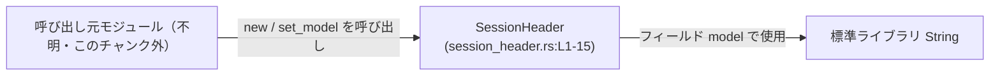
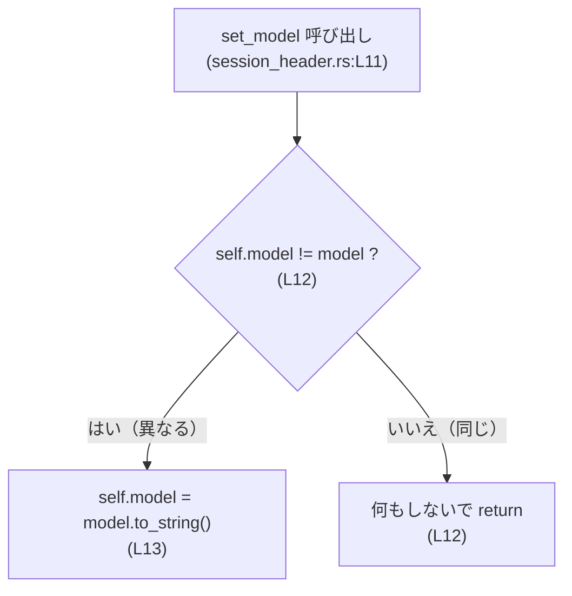
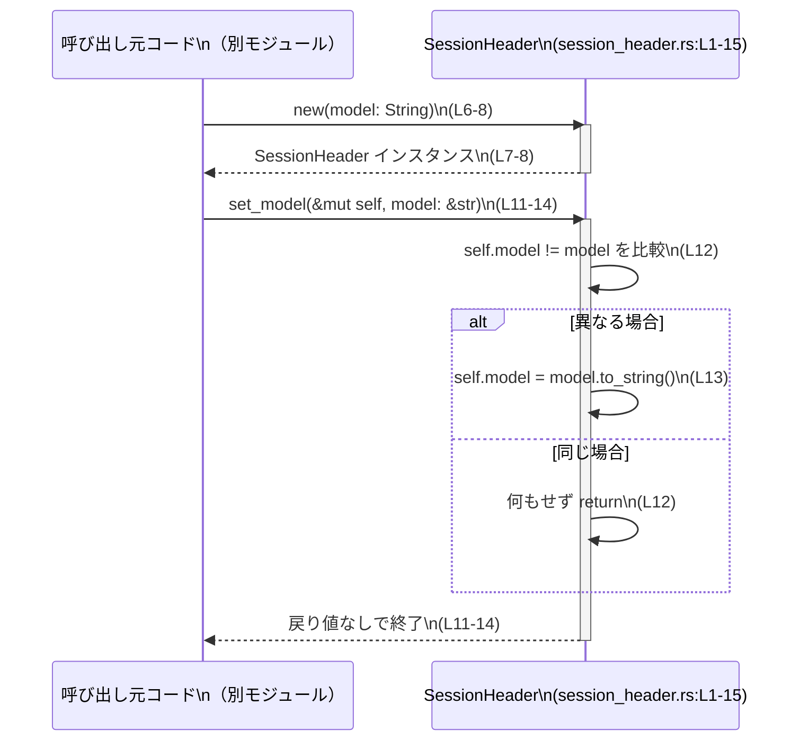

# tui/src/chatwidget/session_header.rs コード解説

## 0. ざっくり一言

- チャットセッションのヘッダーに表示する「モデル名」のテキストを保持し、値が変わったときだけ更新するための小さなヘルパー構造体です（`SessionHeader`、`session_header.rs:L1-3, L5-15`）。

---

## 1. このモジュールの役割

### 1.1 概要

- このモジュールは、セッションヘッダーの「モデル名」文字列を管理するために存在し、  
  - 初期化時にモデル名を受け取って保持する（`new`、`session_header.rs:L6-8`）
  - 後からモデル名を変更するが、内容が変化したときだけ実際に書き換える（`set_model`、`session_header.rs:L11-14`）  
  という機能を提供します。

### 1.2 アーキテクチャ内での位置づけ

- このファイル単体からは、具体的にどのモジュールから呼ばれているかは分かりません（呼び出し側はこのチャンクには現れません）。
- 依存しているのは標準ライブラリの `String` 型のみです（`model: String`、`session_header.rs:L1-2`）。

この範囲で表せる依存関係図は次のようになります。



※「Caller」は本チャンクには登場せず、一般的な呼び出し元を抽象的に表しています。

### 1.3 設計上のポイント

コードから読み取れる設計上の特徴を挙げます。

- **責務の分割**
  - `SessionHeader` はモデル名文字列 `model` のみを管理するシンプルな状態保持オブジェクトです（`session_header.rs:L1-3`）。
- **状態管理**
  - 内部状態として `String` を 1 つだけ持ち、コンストラクタとセッターで更新されます（`session_header.rs:L6-8, L11-14`）。
- **エラーハンドリング**
  - 例外的な状況や I/O を扱わないため、`Result` や `Option` は使われておらず、エラーは発生しない設計になっています（全行確認 `session_header.rs:L1-15`）。
- **更新の最適化**
  - `set_model` は現在の値と新しい文字列を比較し、内容が異なるときだけ `String` を再生成します（`if self.model != model { ... }`、`session_header.rs:L12-13`）。  
    これにより、同じ値を何度も設定したときの不要な割り当てが避けられます。
- **安全性・並行性**
  - `unsafe` ブロックは一切なく、すべて安全な Rust で書かれています（`session_header.rs:L1-15`）。
  - `SessionHeader` は `String` を 1 つだけ持つため、型としては `Send`/`Sync` です。ただし `set_model` は `&mut self` を要求するので、同時に複数スレッドから更新する場合は外側で適切な同期が必要になります（`session_header.rs:L11`）。

---

## 2. 主要な機能一覧（コンポーネントインベントリー）

このファイル内の主なコンポーネント（型・関数）と役割です。

| 名前 | 種別 | 公開範囲 | 行番号 | 役割 / 機能 |
|------|------|----------|--------|------------|
| `SessionHeader` | 構造体 | `pub(crate)` | `session_header.rs:L1-3` | セッションヘッダー用のモデル名文字列を保持する内部状態オブジェクト |
| `SessionHeader::new` | 関数（関連関数） | `pub(crate)` | `session_header.rs:L6-8` | モデル名 `String` を受け取り、`SessionHeader` を初期化する |
| `SessionHeader::set_model` | メソッド | `pub(crate)` | `session_header.rs:L11-14` | `&str` で渡された新しいモデル名が現在と異なるときだけ内部の `String` を更新する |

---

## 3. 公開 API と詳細解説

### 3.1 型一覧（構造体・列挙体など）

| 名前 | 種別 | 公開範囲 | フィールド | 役割 / 用途 | 行番号 |
|------|------|----------|-----------|-------------|--------|
| `SessionHeader` | 構造体 | `pub(crate)` | `model: String` | セッションヘッダーに表示するモデル名を保持する | `session_header.rs:L1-3` |

- フィールド `model` は `pub` が付いていないため、このモジュール外からは直接アクセスできません（`session_header.rs:L1-3`）。
- モジュール外からは、`new` と `set_model` 経由でこの状態を操作する設計になっています（`session_header.rs:L6-8, L11-14`）。

### 3.2 関数詳細

#### `SessionHeader::new(model: String) -> SessionHeader`

**概要**

- モデル名文字列を所有権ごと受け取り、その値を内部フィールド `model` に保持した `SessionHeader` を生成します（`session_header.rs:L6-8`）。

**引数**

| 引数名 | 型 | 説明 |
|--------|----|------|
| `model` | `String` | 初期状態としてヘッダーに設定するモデル名。所有権は `SessionHeader` に移動します（`session_header.rs:L6`）。 |

**戻り値**

- `SessionHeader`  
  受け取った `model` を内部に保持した新しいインスタンスを返します（`Self { model }`、`session_header.rs:L7`）。

**内部処理の流れ**

1. `model` 引数として `String` の所有権を受け取ります（`session_header.rs:L6`）。
2. `Self { model }` でフィールド `model` にそのまま代入し、新しい `SessionHeader` を構築します（`session_header.rs:L7`）。
3. 構築したインスタンスを返します（`session_header.rs:L7-8`）。

**Examples（使用例）**

`SessionHeader` を新しく作成する基本的な例です。

```rust
// SessionHeader 型をこのモジュールからインポートする
use crate::tui::chatwidget::session_header::SessionHeader; // 実際のパスはプロジェクト構成によって異なる（このチャンクでは不明）

fn create_header() {
    // モデル名の String を作成する
    let model_name = String::from("gpt-4");                // 所有権を new に渡す文字列

    // SessionHeader を初期化する（モデル名の所有権が move する）
    let header = SessionHeader::new(model_name);           // model_name はここで move して以降は使えない

    // header は以後、ヘッダー表示用の状態として利用できる
    // （このチャンクには getter がないため、値の取得方法は不明）
    let _ = header;                                        // コンパイル警告を避けるためのダミー使用
}
```

**Errors / Panics**

- エラーを返しません。
- `panic!` を起こすような処理も含まれていません（`session_header.rs:L6-8`）。

**Edge cases（エッジケース）**

- 空文字列 `""` が渡された場合もそのまま保持します。特別な分岐はありません（`session_header.rs:L6-8`）。
- 非 ASCII 文字や長い文字列も、そのまま `String` として保持するだけです（`String` の通常の挙動に従います）。

**使用上の注意点**

- `model` の所有権は `new` に move するため、呼び出し側で同じ `String` を引き続き使いたい場合は `.clone()` する必要があります。
- `SessionHeader` 自体は `pub(crate)` なので、クレート外からは使用できません（`session_header.rs:L1`）。

---

#### `SessionHeader::set_model(&mut self, model: &str)`

**概要**

- 新しいモデル名文字列を `&str` で受け取り、現在の `model` と内容が異なるときだけ内部の `String` を差し替えます（`session_header.rs:L11-14`）。

**引数**

| 引数名 | 型 | 説明 |
|--------|----|------|
| `&mut self` | `&mut SessionHeader` | 内部フィールド `model` を更新するための可変参照（`session_header.rs:L11`）。 |
| `model` | `&str` | 新しく設定したいモデル名。呼び出し側が所有したまま借用として渡します（`session_header.rs:L11`）。 |

**戻り値**

- ありません（戻り値型は `()` です。戻り値の記述は省略されていますが、Rust の規則により単位型になります）。

**内部処理の流れ**

1. `self.model != model` で、現在保持している `String` と引数の `&str` を内容で比較します（`session_header.rs:L12`）。
2. 異なる場合のみブロック内を実行します（`if` 条件式、`session_header.rs:L12`）。
3. `model.to_string()` で `&str` から新しい `String` を生成し、`self.model` に代入します（`session_header.rs:L13`）。
4. 同じ内容の場合は何もせずに終了します（`session_header.rs:L12`）。

処理の概要フローは次のようになります。



**Examples（使用例）**

基本的な更新パターンの例です。

```rust
use crate::tui::chatwidget::session_header::SessionHeader; // 実際のパスはこのチャンクでは不明

fn update_header() {
    // まず SessionHeader を作る
    let mut header = SessionHeader::new(String::from("gpt-3.5")); // 初期モデル名

    // モデル名が変わったときに更新する
    header.set_model("gpt-4");                                   // &str を渡す。内部で String に変換される

    // 同じ値を設定しても内部では何も起こらない
    header.set_model("gpt-4");                                   // self.model != model が false になり、再割り当てされない
}
```

**Errors / Panics**

- エラーを返しません。
- `panic!` を起こしうる操作（インデックスアクセスや `unwrap` 等）は含まれていません（`session_header.rs:L11-14`）。

**Edge cases（エッジケース）**

- **同じ文字列を渡した場合**  
  - `self.model != model` が `false` となり、`self.model` は変更されません（`session_header.rs:L12`）。
- **空文字列 `""` を渡した場合**  
  - もし以前の `model` が空でなければ、空の `String` に更新されます（`session_header.rs:L12-13`）。
- **非常に長い文字列**  
  - 常に `to_string()` で新しく `String` を割り当てるため、長さに比例したメモリアロケーションが発生します（`session_header.rs:L13`）。

**使用上の注意点**

- `&mut self` を要求するため、同じ `SessionHeader` インスタンスに対して同時に複数の `set_model` 呼び出しを行うことはコンパイル時に禁止されます。  
  これは Rust の可変借用ルールによるメモリ安全性の確保です（`session_header.rs:L11`）。
- マルチスレッドで同じ `SessionHeader` を共有して更新する場合は、`Arc<Mutex<SessionHeader>>` などの同期プリミティブを用いる必要があります。  
  この型自身には並行アクセス制御は含まれていません（全体構造 `session_header.rs:L1-15`）。
- 更新が行われたかどうかは戻り値からは分かりません。必要であれば拡張として `bool` を返す API に変更することが考えられます（現状コードにはそのような機能はありません）。

### 3.3 その他の関数

- このファイルには、補助的な関数や他のメソッドは存在しません（`session_header.rs:L1-15` 全体を確認）。

---

## 4. データフロー

代表的なシナリオとして、「ヘッダーを初期化し、その後条件に応じてモデル名を更新する」流れを示します。



要点:

- モデル名の所有権は初期化時に `String` で `SessionHeader` に移動します（`session_header.rs:L6-7`）。
- 以降の更新では `&str` を借用として受け取り、必要なときだけ `String` を再割り当てします（`session_header.rs:L11-13`）。

---

## 5. 使い方（How to Use）

### 5.1 基本的な使用方法

`SessionHeader` を初期化し、その後モデル名を更新する最小限の例です。

```rust
// 実際のモジュールパスはプロジェクト構成に依存するため、この例では仮のパスを使う
use crate::tui::chatwidget::session_header::SessionHeader; // このファイルに定義された型を利用

fn main() {
    // 1. 初期モデル名を決める
    let initial_model = String::from("gpt-3.5");           // 所有権を new に渡すための String

    // 2. SessionHeader を初期化する
    let mut header = SessionHeader::new(initial_model);    // initial_model はここで move する

    // 3. 必要に応じてモデル名を更新する
    header.set_model("gpt-4");                             // &str で渡す。内容が異なるので内部で更新される

    // 4. 以後、header は UI レイヤーなどから参照されてヘッダー表示に使われる想定
    // （このチャンクには getter が定義されていないため、具体的な参照方法は不明）
}
```

### 5.2 よくある使用パターン

1. **同じインスタンスを長く持ち回す**

   - UI コンポーネントやセッション管理構造体のフィールドとして `SessionHeader` を保持し、モデル変更時にのみ `set_model` を呼ぶ、という使い方が想定されます（ただしこれはパス名からの推測であり、このチャンクのコードからは断定できません）。

2. **設定値やイベントに応じて更新**

   - 設定ファイルやユーザー操作により選択されたモデル名を `&str` または `String` から `&str` に変換して `set_model` に渡すだけでよく、所有権の移動を伴わないため呼び出し側の負担が小さくなっています（`session_header.rs:L11-13`）。

### 5.3 よくある間違いと正しい例

**誤用例: 可変参照を取得せずに `set_model` を呼び出そうとする**

```rust
let header = SessionHeader::new(String::from("gpt-3.5"));
// header.set_model("gpt-4"); // コンパイルエラー: `header` が可変ではない
```

**正しい例: `mut` を付けて可変にする**

```rust
let mut header = SessionHeader::new(String::from("gpt-3.5")); // mut を付ける
header.set_model("gpt-4");                                   // &mut self で問題なく更新できる
```

**誤用例: `String` の所有権を残したいのに move してしまう**

```rust
let model = String::from("gpt-4");
let header = SessionHeader::new(model);   // model が move する
// println!("{}", model);                 // コンパイルエラー: model は move 済み
```

**正しい例: クローンして両方で使う**

```rust
let model = String::from("gpt-4");
let header = SessionHeader::new(model.clone()); // header には clone を渡す
println!("{}", model);                          // 元の model も引き続き利用できる
```

### 5.4 使用上の注意点（まとめ）

- `SessionHeader` は値を「保持するだけ」であり、このファイルには値を外部に公開する getter が存在しません（`session_header.rs:L1-15`）。  
  ヘッダーの描画などで値を参照する仕組みは、別ファイルまたは本チャンク外に存在すると考えられます。
- `set_model` は戻り値を持たないため、「更新されたかどうか」を知りたい場合は別途仕組みが必要です（イベント発行や bool 戻り値を追加する等の拡張が考えられます）。
- どちらのメソッドも I/O やブロッキング処理を含まないため、高頻度で呼び出してもスレッドブロッキングの心配はいりません（`session_header.rs:L6-14`）。

---

## 6. 変更の仕方（How to Modify）

### 6.1 新しい機能を追加する場合

1. **モデル名を取得する getter を追加したい場合**

   - 同じ `impl SessionHeader` ブロック内（`session_header.rs:L5-15`）に、例えば次のようなメソッドを追加するのが自然です。

   ```rust
   impl SessionHeader {
       pub(crate) fn model(&self) -> &str {          // &self で借用し、&str を返す
           &self.model                               // 内部 String への参照を返す
       }
   }
   ```

   - これにより、描画側などで現在のモデル名を読み出せるようになります。

2. **更新されたかどうかを知りたい場合**

   - `set_model` のシグネチャを `pub(crate) fn set_model(&mut self, model: &str) -> bool` のように変更し、値が変化したときには `true` を返すようにする変更が考えられます。  
     ただし、この変更は既存の呼び出し側すべてに影響するため、影響範囲の調査が必要です（呼び出し側はこのチャンクには現れません）。

### 6.2 既存の機能を変更する場合の注意点

- **`model` フィールドの型を変更する場合**
  - 例えば `String` を `Arc<str>` などに変更する場合、コンストラクタと `set_model` の実装も合わせて変更する必要があります（`session_header.rs:L1-2, L6-8, L11-13`）。
  - 型変更により `Send` / `Sync` の性質が変わる可能性があるため、並行利用している箇所があれば影響を確認する必要があります。

- **`set_model` の更新条件を変更する場合**
  - 現在は単純な文字列比較（`!=`）ですが、大小文字を無視する比較などに変えると、ヘッダーの表示仕様も変わります（`session_header.rs:L12`）。
  - その場合、呼び出し側の期待仕様とテストケース（存在する場合）を合わせて見直すことが重要です。

---

## 7. 関連ファイル

このチャンクの情報だけから特定できる関連ファイルは限られています。

| パス | 役割 / 関係 |
|------|------------|
| `tui/src/chatwidget/session_header.rs` | 本レポート対象ファイル。`SessionHeader` 構造体とそのメソッド `new` / `set_model` を定義する。 |
| `tui/src/chatwidget/*` | パス名から、チャットウィジェット関連の他コンポーネントが存在すると推測されますが、このチャンクには内容が現れておらず詳細不明です。 |

---

## Bugs / Security / Contracts / Tests / 性能などの補足

- **Bugs（潜在的なバグ）**
  - このコードの範囲では、明確なバグは読み取れません。単純なフィールド更新のみを行っています（`session_header.rs:L6-14`）。
- **Security（セキュリティ）**
  - 外部入力のパースや I/O を行っていないため、このファイル単体では典型的なセキュリティ問題（入力検証不足など）は関係しません（`session_header.rs:L1-15`）。
- **Contracts / Edge Cases（契約・境界条件）**
  - 契約: `SessionHeader::new` は、「渡された文字列をそのまま内部に保持する」ことを保証します（`session_header.rs:L6-7`）。
  - 契約: `set_model` は、「新しい文字列と現在の文字列が異なるときのみ `self.model` を更新する」ことを保証します（`session_header.rs:L12-13`）。
- **Tests（テスト）**
  - このファイルにはテストコード（`#[cfg(test)]` ブロックや `mod tests` など）は含まれていません（`session_header.rs:L1-15`）。
  - テストを書くとすれば、`set_model` が同じ文字列のときに再代入しないこと・異なる文字列のときに更新されることを確認するユニットテストが考えられます。
- **Performance / Scalability（性能・スケーラビリティ）**
  - `set_model` の比較と更新は文字列長に比例する O(n) の処理ですが、ヘッダー用の短いモデル名を扱う用途であれば一般に問題にならない規模です（`session_header.rs:L12-13`）。
  - 同じ文字列を頻繁に設定する場合に再割り当てを避ける最適化が既になされている点が特徴です（`if self.model != model { ... }`、`session_header.rs:L12-13`）。
- **Observability（観測性）**
  - ログ出力やメトリクス送信などは一切行っていません（`session_header.rs:L1-15`）。  
    `set_model` の変更イベントを観測したい場合は、呼び出し側でログやイベント発行を行う必要があります。

以上が、このファイル単体から読み取れる `SessionHeader` の役割と具体的な使い方、および安全性・エッジケース・性能面の整理です。
