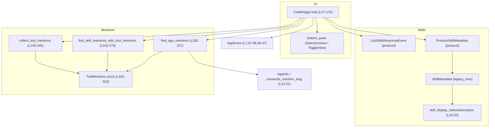
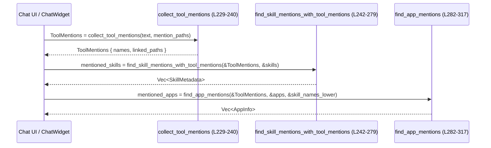

# tui/src/chatwidget/skills.rs コード解説

## 0. ざっくり一言

このファイルは、チャット画面の **スキル一覧・管理 UI**（メニュー／トグル画面）と、メッセージ中の **ツール／スキル／アプリのメンション解析ロジック** をまとめたモジュールです（根拠: `impl ChatWidget` と各種ユーティリティ関数, `tui/src/chatwidget/skills.rs:L27-170,229-477`）。

---

## 1. このモジュールの役割

### 1.1 概要

- チャット UI コンポーネント `ChatWidget` に対して、スキル関連の操作（スキル一覧表示、スキル有効化／無効化管理、スキル情報の注釈付け）を提供します（`open_skills_menu`, `open_manage_skills_popup` など, `L32-145`）。
- サーバーから取得した `ListSkillsResponseEvent` を `ChatWidget` の内部状態 `skills_all` に反映し、有効なスキルの一覧を ChatWidget にセットします（`set_skills_from_response`, `L141-145`）。
- チャットテキスト中の `$name` や `[[$name]](path)` といった **ツールメンション** を解析し、  
  - どのスキルが参照されているか（`find_skill_mentions_with_tool_mentions`, `L242-279`）  
  - どのアプリケーション（コネクタ）が参照されているか（`find_app_mentions`, `L282-317`）  
  を判定する補助関数を提供します。
- これらの処理は全て安全な Rust コードで実装されており、`unsafe` は使用していません（ファイル全体に `unsafe` キーワードなし, `L1-477`）。

### 1.2 アーキテクチャ内での位置づけ

このファイルは、UI レイヤの `ChatWidget` と、スキル・ツール・アプリのメタデータとの仲介役を担います。

主な依存関係は以下です（全てこのファイルで `use` されていることが根拠, `L6-25`）。

- UI:
  - `super::ChatWidget`（親モジュールで定義, `L6`）
  - `crate::bottom_pane::{SelectionItem, SelectionViewParams, SkillsToggleItem, SkillsToggleView}`（`L8-11`）
- イベント:
  - `crate::app_event::AppEvent`（スキルメニューのアクションを発火, `L7,37-38,46-47`）
- スキルメタデータ:
  - プロトコル層: `codex_protocol::protocol::{ListSkillsResponseEvent, SkillMetadata as ProtocolSkillMetadata, SkillsListEntry}`（`L23-25`）
  - コアモデル層: `crate::legacy_core::skills::model::{SkillMetadata, SkillInterface, SkillDependencies, SkillToolDependency}`（`L15-18`）
  - 表示用ヘルパー: `crate::skills_helpers::{skill_display_name, skill_description}`（`L19-20`）
- ツール／アプリ関連:
  - メンション記号 `TOOL_MENTION_SIGIL`（`L13`）
  - コネクタ情報 `codex_chatgpt::connectors::AppInfo` と `connector_mention_slug`（`L14,21`）

依存関係を簡略図で表すと次のようになります。



※ `ChatWidget` 自体の定義や `bottom_pane` 側の実装は、このチャンクには現れません。

### 1.3 設計上のポイント

- **UI とロジックの分離**  
  - `ChatWidget` のメソッド群は UI 操作・イベント送信に集中し（`L28-170`）、  
    テキスト解析やメタデータ変換はモジュール内の純関数に切り出されています（`L173-227,229-477`）。
- **状態管理**
  - スキルの有効／無効管理では、ポップアップ表示前後の状態を `skills_initial_state` に保存し（`open_manage_skills_popup`, `L69-73`）、閉じる際の差分から「何個有効／無効になったか」を算出しています（`handle_manage_skills_closed`, `L108-139`）。
- **パスの正規化**
  - スキル設定ファイルのパスは `normalize_skill_config_path` で正規化（`dunce::canonicalize`）してから Map のキーに使われます（`L69-72,98-103,112-115,225-227`）。  
    ファイルシステムエラーは無視して元のパスを用いるため、エラーでパニックすることはありません。
- **メンション解析ロジック**
  - テキストから `$name` や `[[$name]](path)` といったパターンを、生バイト列を走査する形でパースし（`extract_tool_mentions_from_text_with_sigil`, `L329-386`）、  
    「よくある環境変数名（PATH, HOME など）」はメンションとして扱わないフィルタリングをしています（`is_common_env_var`, `L445-460`）。
- **所有権と安全性**
  - すべての関数は `&self` / `&mut self` あるいは借用（`&[T]`, `&HashMap` など）でデータを扱い、大きな構造体は必要に応じて `clone()` して所有権を移動しています（例: `skills_for_cwd` の `entry.skills.clone()`, `L173-178`）。
  - `unsafe`、生ポインタ、マルチスレッド同期プリミティブは使用されていません（`L1-477`）。

---

## 2. 主要な機能一覧

このモジュールが提供する主な機能は次の通りです。

- スキル一覧のクイックオープン: チャット入力に `$` を挿入し、スキル一覧を直接開くトリガーを提供（`open_skills_list`, `L28-30`）。
- スキルメニューの表示: 「List skills」「Enable/Disable Skills」の 2 項目を持つメニューを表示し、対応する `AppEvent` を送信する UI を構成（`open_skills_menu`, `L32-61`）。
- スキル管理ポップアップの表示: 利用可能なスキル一覧をトグル式 UI に変換して表示し、初期有効状態を記録（`open_manage_skills_popup`, `L63-96`）。
- スキルの有効／無効状態更新: 個々のスキルの有効フラグを更新し、ChatWidget 全体に有効スキルリストを再適用（`update_skill_enabled`, `L98-106`）。
- スキル管理ポップアップ終了時の差分表示: 有効／無効の変更数を集計し、情報メッセージとして出力（`handle_manage_skills_closed`, `L108-139`）。
- サーバーレスポンスからのスキル一覧構築: `ListSkillsResponseEvent` とカレントディレクトリ `cwd` に基づき、自分に対応するスキル群を抽出して内部状態に設定（`set_skills_from_response`, `skills_for_cwd`, `L141-145,173-179`）。
- SKILL.md 読みコマンドへの注釈付け: `ParsedCommand::Read` で `SKILL.md` を読むコマンドに、対応するスキル名を付加（`annotate_skill_reads_in_parsed_cmd`, `L147-170`）。
- テキスト中のツールメンション抽出: `$name` / `[[$name]](path)` 形式からツール名集合とリンクパスを抽出して `ToolMentions` を構築（`collect_tool_mentions`, `extract_tool_mentions_from_text*`, `L229-240,325-386`）。
- ツールメンションからスキルの特定: メンションされたパス・名前と `SkillMetadata` リストの突き合わせにより、関係するスキル集合を返却（`find_skill_mentions_with_tool_mentions`, `L242-279`）。
- ツールメンションからアプリの特定: メンションされたパスやスラッグと `AppInfo` リストを突き合わせ、該当アプリ（コネクタ）集合を返却（`find_app_mentions`, `L282-317`）。

---

## 3. 公開 API と詳細解説

### 3.1 型一覧（構造体・列挙体など）

このファイル内で定義されている公開（crate 内）型は `ToolMentions` のみです。

| 名前 | 種別 | 可視性 | フィールド | 役割 / 用途 | 定義位置 |
|------|------|--------|-----------|-------------|-----------|
| `ToolMentions` | 構造体 | `pub(crate)` | `names: HashSet<String>` / `linked_paths: HashMap<String, String>` | テキスト中で検出したツール（スキルやアプリ）のメンション名と、リンク付きメンションから得たパスの対応表を保持するコンテナです。`collect_tool_mentions` や `find_*_mentions` で使用されます。 | `tui/src/chatwidget/skills.rs:L320-323` |

このモジュールが利用するが、定義が他ファイルにある主な型（参考）:

| 名前 | 所属 | 用途（このモジュール内） | 根拠 |
|------|------|--------------------------|------|
| `ChatWidget` | 親モジュール `super` | スキル UI とスキル関連状態（`skills_all`, `skills_initial_state`, `bottom_pane`, `app_event_tx`, `config.cwd` など）を保持するチャットウィジェット。 | `impl ChatWidget { ... }`, フィールド利用箇所 `L63-96,98-106,108-145` |
| `SkillMetadata` | `crate::legacy_core::skills::model` | コア層のスキルメタデータ。チャット側でのスキル表示・選択やメンション解決に利用。 | `use crate::legacy_core::skills::model::SkillMetadata;` `L17`; 引数・戻り値 `L181-187,242-279` |
| `ProtocolSkillMetadata` | `codex_protocol::protocol` | プロトコル層のスキルメタデータ。サーバーからのレスポンスで受け取り、`SkillMetadata` へ変換します。 | `L24,173-179,181-187,189-223` |
| `ListSkillsResponseEvent` | `codex_protocol::protocol` | スキル一覧レスポンスイベント。`set_skills_from_response` の入力。 | `L23,141-145` |
| `AppInfo` | `codex_chatgpt::connectors` | 外部アプリ／コネクタのメタ情報。ツールメンションからアプリを特定するために使用。 | `L21,282-317` |
| `ParsedCommand` | `codex_protocol::parse_command` | パース済みコマンド（特にファイル読みコマンド）を表す列挙体。`annotate_skill_reads_in_parsed_cmd` で `Read` バリアントに注釈を追加。 | `L22,147-170` |

### 3.2 関数詳細（重要な 7 件）

#### `open_manage_skills_popup(&mut self)`  

**定義位置**: `tui/src/chatwidget/skills.rs:L63-96`

**概要**

- 現在ロードされている全スキル `self.skills_all` をもとに、スキルの有効／無効を切り替えるトグル UI (`SkillsToggleView`) を生成し、`bottom_pane` に表示します。
- 初期の有効状態を `skills_initial_state` に保存し、後で差分集計に使えるようにします。

**引数**

| 引数名 | 型 | 説明 |
|--------|----|------|
| `&mut self` | `ChatWidget` への可変参照 | ChatWidget の内部状態（スキル一覧や `bottom_pane`、イベント送信用チャンネルなど）を更新するため、可変参照が渡されます。 |

**戻り値**

- なし（`()`）。UI を変更し、副作用として `skills_initial_state` と `bottom_pane` の状態を更新します。

**内部処理の流れ**

1. 利用可能なスキルが 1 件もない場合、情報メッセージ `"No skills available."` を表示して終了します（`self.skills_all.is_empty()` のチェック, `L63-67`）。
2. `skills_initial_state` 用の `HashMap<PathBuf, bool>` を構築します。
   - 各スキルの `path` を `normalize_skill_config_path` で正規化し、`enabled` フラグとともに Map に格納します（`L69-72`）。
   - この Map を `self.skills_initial_state = Some(initial_state)` に保存します（`L73`）。
3. UI 表示用の `SkillsToggleItem` のベクタを構築します（`L75-91`）。
   - 各 `ProtocolSkillMetadata` を `protocol_skill_to_core` で `SkillMetadata` に変換（`L79`）。
   - `skill_display_name` と `skill_description` で表示名と説明文を取得（`L80-81`）。
   - `SkillsToggleItem` に表示名、内部スキル名（`skill_name`）、説明、有効フラグ、パスを設定します（`L84-90`）。
4. `SkillsToggleView::new(items, self.app_event_tx.clone())` でビューを生成し（`L94`）、`bottom_pane.show_view(Box::new(view))` でポップアップとして表示します（`L95`）。

**Examples（使用例）**

`ChatWidget` 内またはイベントハンドラで、「スキル管理」アクションを受け取ったときに呼び出す例です。

```rust
// AppEvent を処理するどこかのメソッド内の一部という想定
fn handle_event(&mut self, event: AppEvent) {
    match event {
        AppEvent::OpenManageSkillsPopup => {
            // 現在の skills_all に基づいてトグルビューを表示する
            self.open_manage_skills_popup();
        }
        _ => { /* 他イベント */ }
    }
}
```

**Errors / Panics**

- `normalize_skill_config_path` 内で `dunce::canonicalize` がエラーになっても、`unwrap_or_else` で元のパスにフォールバックするためパニックしません（`L225-227`）。
- その他、明示的な `unwrap` や `panic!` は使用されていません。

**Edge cases（エッジケース）**

- `self.skills_all.is_empty()` の場合  
  - ポップアップは表示されず、情報メッセージ `"No skills available."` のみが表示されます（`L63-67`）。
- `protocol_skill_to_core` や表示名ヘルパーが `None` を含むフィールドを持っていても、そのまま `SkillMetadata` に詰めているだけなので、この関数の中では特別な扱いはありません（`L189-223`）。

**使用上の注意点**

- このメソッドを呼び出す前に、`self.skills_all` が `set_skills_from_response` などで適切にセットされている必要があります。空のままだと「No skills available」となり、ユーザーはスキルを変更できません。
- `skills_initial_state` はここで上書きされるため、同時に複数のスキル管理ポップアップを開く前提にはなっていません（UI 上も 1 つだけを想定している設計です）。

---

#### `update_skill_enabled(&mut self, path: PathBuf, enabled: bool)`

**定義位置**: `tui/src/chatwidget/skills.rs:L98-106`

**概要**

- スキル設定ファイルのパスに対応するスキルを探し、その `enabled` フラグを更新します。
- 更新後、ChatWidget に有効スキル一覧を再設定します。

**引数**

| 引数名 | 型 | 説明 |
|--------|----|------|
| `path` | `PathBuf` | 更新対象スキルの設定ファイルパス。ポップアップ側から渡されると考えられます。 |
| `enabled` | `bool` | 新しい有効状態（`true` で有効、`false` で無効）。 |

**戻り値**

- なし（副作用的に `self.skills_all` と `self.set_skills(...)` を更新）。

**内部処理の流れ**

1. 引数 `path` を `normalize_skill_config_path(&path)` で正規化し、比較用ターゲットパスを得ます（`L99`）。
2. `self.skills_all` の各スキルについて、`normalize_skill_config_path(&skill.path)` とターゲットを比較し、一致したスキルの `enabled` フラグを更新します（`L100-103`）。
3. ループ後、更新後の `self.skills_all` から `enabled_skills_for_mentions` を計算し（`enabled == true` のもののみ、`SkillMetadata` に変換）、ChatWidget にセットします（`self.set_skills(Some(...))`, `L105`）。

**Examples（使用例）**

```rust
// スキルトグルビュー側から、「あるスキルのトグルが変更された」というイベントを受けた例
fn on_skill_toggle(&mut self, skill_path: PathBuf, new_enabled: bool) {
    // ChatWidget 側に反映
    self.update_skill_enabled(skill_path, new_enabled);
    // これにより ChatWidget 内部の「有効スキル一覧」も更新される
}
```

**Errors / Panics**

- `normalize_skill_config_path` はエラー時に元のパスを返すだけなので、ここでもパニックは発生しません（`L225-227`）。
- マッチするスキルが存在しなくても、そのまま何も更新せずに `set_skills` だけが呼ばれます（`L100-104`）。それ自体はエラーにはなりません。

**Edge cases**

- 引数 `path` に対応するスキルが存在しない場合  
  - どのスキルも更新されませんが、そのまま `set_skills` が呼ばれます。結果として ChatWidget の有効スキル一覧は変わらないはずです。
- `self.skills_all` が空の場合  
  - `for skill in &mut self.skills_all` のループが 0 回で終了し、`set_skills` は空の有効スキルリストを設定すると考えられます（`enabled_skills_for_mentions` が空の `Vec` を返すため, `L181-187`）。

**使用上の注意点**

- パス比較は正規化済みパス同士で行っているため、同じスキルでもシンボリックリンクなど複数のパス表現を持つ場合の挙動は、`dunce::canonicalize` の結果に依存します。
- 頻繁に呼び出す場合、内部で `canonicalize` を複数回呼んでいるため、ファイルシステムアクセスコストが増える可能性があります（`L99-103,225-227`）。

---

#### `handle_manage_skills_closed(&mut self)`

**定義位置**: `tui/src/chatwidget/skills.rs:L108-139`

**概要**

- スキル管理ポップアップが閉じられた後に呼び出されることを想定した関数です。
- ポップアップ表示前に保存していた `skills_initial_state` と現在の `self.skills_all` を比較し、  
  何個のスキルが有効化／無効化されたかを集計して、情報メッセージとして表示します。

**引数**

| 引数名 | 型 | 説明 |
|--------|----|------|
| `&mut self` | `ChatWidget` | 内部状態とメッセージ表示機構 (`add_info_message`) を利用します。 |

**戻り値**

- なし。

**内部処理の流れ**

1. `self.skills_initial_state.take()` で、保存していた初期状態を取得します（`Option<HashMap<...>>` を `take` することで、以後 `None` になります, `L109`）。
   - `skills_initial_state` が `None` の場合（ポップアップを開いていないなど）は何もせず早期リターンします（`L109-111`）。
2. 現在の状態 `current_state` を `HashMap<PathBuf, bool>` として構築します（`L112-115`）。
3. 初期状態 `initial_state` を走査し、各パスについて「初期は `was_enabled`、現在は `is_enabled`」を比較します（`L119-129`）。
   - パスが現在の Map に存在しない場合はスキップ（`L120-122`）。
   - 状態が変化していれば、有効になった数／無効になった数をそれぞれカウントします（`L123-128`）。
4. 有効数・無効数が両方とも 0 の場合は何も表示せず終了（`L132-134`）。
5. そうでない場合は `"X skills enabled, Y skills disabled"` というメッセージを `add_info_message` で表示します（`L135-138`）。

**Examples（使用例）**

```rust
// スキル管理ポップアップを閉じるイベントの処理例
fn on_manage_skills_popup_closed(&mut self) {
    // 初期状態との比較と結果メッセージ表示を行う
    self.handle_manage_skills_closed();
}
```

**Errors / Panics**

- `skills_initial_state` が `None` の場合は何もせず戻るため、未初期化に起因するパニックはありません（`L109-111`）。
- マップ操作でも `unwrap` や強制的なインデックスアクセスは使わず、`Option` を通じて安全にアクセスしています（`current_state.get(&path)` と `let Some(...) = ... else` パターン, `L120-122`）。

**Edge cases**

- ポップアップを開かずにこの関数を呼んだ場合  
  - `skills_initial_state` が `None` と想定され、何も行われません（`L109-111`）。
- スキルの追加・削除がポップアップ表示中に発生した場合  
  - `initial_state` に存在し、`current_state` に存在しないスキルはスキップされます（`L120-122`）。
  - 逆に、新規追加されたスキルは `initial_state` に存在しないため、この集計には含まれません。

**使用上の注意点**

- `skills_initial_state` は `take()` によって `None` になるため、この関数は 1 回のポップアップ表示につき 1 回だけ意味を持ちます。  
  複数回呼ぶと 2 回目以降は何も行いません。
- 「何個変更されたか」だけをメッセージにする設計であるため、「どのスキルが変わったか」は別途 UI から把握する必要があります。

---

#### `set_skills_from_response(&mut self, response: &ListSkillsResponseEvent)`

**定義位置**: `tui/src/chatwidget/skills.rs:L141-145`

**概要**

- サーバーから受け取った `ListSkillsResponseEvent` をもとに、自分のカレントディレクトリ (`self.config.cwd`) に対応するスキル一覧を取り出し、`self.skills_all` と ChatWidget の有効スキル一覧を更新します。

**引数**

| 引数名 | 型 | 説明 |
|--------|----|------|
| `response` | `&ListSkillsResponseEvent` | サーバーから受信したスキル一覧イベント。複数の `SkillsListEntry` を含むと想定されます。 |

**戻り値**

- なし。

**内部処理の流れ**

1. `skills_for_cwd(&self.config.cwd, &response.skills)` を呼び出し、現在の `cwd` に一致するエントリのスキル一覧（`Vec<ProtocolSkillMetadata>`）を取得します（`L142,173-179`）。
2. それを `self.skills_all` に代入し、以後の UI・メンション解析のベースとなるスキル一覧とします（`L143`）。
3. `enabled_skills_for_mentions(&self.skills_all)` で、`enabled == true` のスキルだけを `SkillMetadata` に変換し、`self.set_skills(Some(...))` で ChatWidget 全体に反映します（`L144,181-187`）。

**Examples（使用例）**

```rust
fn on_list_skills_response(&mut self, response: ListSkillsResponseEvent) {
    // サーバーからのスキル一覧を内部状態と ChatWidget に反映
    self.set_skills_from_response(&response);
}
```

**Errors / Panics**

- `skills_for_cwd` は、対応する `cwd` のエントリが見つからない場合に単に空の `Vec` を返すだけです（`unwrap_or_default`, `L173-179`）。
- そのまま `self.skills_all` が空になり、有効スキル一覧も空になりますが、エラーやパニックは発生しません。

**Edge cases**

- `response.skills` に現在の `cwd` に対応するエントリが存在しない場合  
  → `self.skills_all` は空ベクタになり、以後の UI では「No skills available.」と表示される可能性があります（`open_manage_skills_popup`, `L63-67`）。
- `self.config.cwd` の値がこのファイルからは見えないため、ここでは「`Paths` の比較は `==` による完全一致」ということだけが分かります（`entry.cwd.as_path() == cwd`, `L176`）。

**使用上の注意点**

- `set_skills_from_response` は `self.skills_all` を上書きするため、別のソースからスキルを追加している場合は、その順序に注意が必要です。
- `cwd` が異なる複数ワークスペースを扱う場合、本関数の呼び出し前に `self.config.cwd` が正しく設定されていることが前提になります。

---

#### `collect_tool_mentions(text: &str, mention_paths: &HashMap<String, String>) -> ToolMentions`

**定義位置**: `tui/src/chatwidget/skills.rs:L229-240`

**概要**

- テキスト `text` から、`TOOL_MENTION_SIGIL`（おそらく `$`）を使ったツール名メンションおよび `[[$name]](path)` のようなリンク付きメンションを抽出し、`ToolMentions` 構造体にまとめます。
- 事前に与えられた `mention_paths`（名前 → パスのマップ）と突き合わせ、名前が一致する場合は `linked_paths` にそのパスを保存します。

**引数**

| 引数名 | 型 | 説明 |
|--------|----|------|
| `text` | `&str` | メンションを解析する対象テキスト（チャットメッセージなど）。 |
| `mention_paths` | `&HashMap<String, String>` | メンション名からパスへのマッピング。既知のツール／スキル／アプリのパス情報が入っていると想定されます。 |

**戻り値**

- `ToolMentions`  
  - `names`: テキスト中に現れたツール名メンションの集合（リンク付き／無し問わず、環境変数名は除外）。  
  - `linked_paths`: リンク付きメンションおよび `mention_paths` から確定した「名前 → パス」の対応表。

**内部処理の流れ**

1. `extract_tool_mentions_from_text(text)` を呼び出し、テキストからメンション名・リンク付きパスを一次的に抽出します（`L233,325-386`）。
2. `mention_paths` の各エントリについて、名前が `mentions.names` に含まれていれば、そのパスを `mentions.linked_paths` に追加します（`L234-237`）。
   - すでに `linked_paths` に同じ名前のキーがある場合は、`or_insert` により元の値が優先されます（`L346-347` の実装に準じます）。
3. 最終的な `ToolMentions` を返します（`L239`）。

**Examples（使用例）**

```rust
use std::collections::HashMap;

fn example_collect() {
    let text = "Use $editor or [[$browser]](app://browser), and maybe $PATH."; // テストテキスト

    // 既知のメンション名からパスへのマッピング
    let mut mention_paths = HashMap::new();
    mention_paths.insert("editor".to_string(), "skill://editor".to_string());
    mention_paths.insert("browser".to_string(), "app://browser".to_string());

    let mentions = collect_tool_mentions(text, &mention_paths);

    // ここで `mentions` は、環境変数 PATH を除いた "editor" と "browser" を含んでいることが期待されます。
    // `linked_paths` には "browser" -> "app://browser" と "editor" -> "skill://editor" が含まれます。
}
```

**Errors / Panics**

- 内部で使用される `extract_tool_mentions_from_text_with_sigil` はすべて `slice::get` を用いた境界チェック付きアクセスを行っており（`L335-380`）、  
  インデックス範囲外アクセスによるパニックは発生しないよう実装されています。
- 外部入力 `text` に対しても、UTF-8 文字列として `as_bytes` した後に `get` ベースの走査のみを行うため、無効なバイトシーケンスは登場しません（`&str` は常に有効な UTF-8 であるため）。

**Edge cases**

- テキストにメンションが全く含まれない場合  
  - `extract_tool_mentions_from_text` が空の `names` / `linked_paths` を返し、そのまま戻り値も空になります。
- `mention_paths` にキーはあるが、テキスト中ではその名前が一度もメンションされていない場合  
  - そのエントリは無視され、`linked_paths` にも追加されません（`L234-237`）。
- メンション名が既知の環境変数名（PATH, HOME など）の場合  
  - `is_common_env_var` によってフィルタされ、`names` には追加されません（`L341-347,376-378,445-460`）。

**使用上の注意点**

- `mention_paths` はあくまで「追加でリンクを補完するための情報」であり、`extract_tool_mentions_from_text` が抽出した `linked_paths` を上書きしないよう `or_insert` で追加しています（`L345-347`）。  
  既にリンク付きメンションがテキスト内にある場合、そのパスが優先されます。
- `ToolMentions` のフィールド `names` / `linked_paths` はこのモジュール内では private フィールドですが、同一モジュール内の他関数（`find_*_mentions`）から直接参照されています（`L246-251,289-293`）。

---

#### `find_skill_mentions_with_tool_mentions(mentions: &ToolMentions, skills: &[SkillMetadata]) -> Vec<SkillMetadata>`

**定義位置**: `tui/src/chatwidget/skills.rs:L242-279`

**概要**

- `collect_tool_mentions` などから得た `ToolMentions` と、既知のスキル一覧 `skills` から、「メッセージ中で参照されているスキル」を特定します。
- まずリンク付きパス（`linked_paths`）を優先し、次に名前マッチ（`names`）でスキルを追加します。

**引数**

| 引数名 | 型 | 説明 |
|--------|----|------|
| `mentions` | `&ToolMentions` | テキストから抽出されたメンション情報。 |
| `skills` | `&[SkillMetadata]` | 判定対象となるスキル一覧。 |

**戻り値**

- `Vec<SkillMetadata>`: メンションに対応すると判断されたスキルのリスト。  
  スキルは `clone()` されて返されるため、呼び出し側で所有権を持つことができます（`matches.push(skill.clone())`, `L265,275`）。

**内部処理の流れ**

1. `mentions.linked_paths.values()` から、`is_skill_path(path)` が `true` のものだけを対象とし、`normalize_skill_path(path)` で `"skill://"` プレフィックスを削除したパス集合 `mention_skill_paths` を作ります（`L246-251,467-472`）。
2. `seen_names` と `seen_paths` の `HashSet` を用意し、重複追加を防ぎます（`L253-255`）。
3. **第 1 パス（パスベースのマッチ）**（`L257-267`）
   - 各 `skill` について、`seen_paths` にまだ含まれないかを確認（`L258-260`）。
   - `skill.path_to_skills_md` を文字列化し（`to_string_lossy`）、`mention_skill_paths` に含まれていれば一致とみなします（`L261-262`）。
   - 一致した場合、`seen_paths` と `seen_names` に登録し、`matches` に `clone()` を追加します（`L263-266`）。
4. **第 2 パス（名前ベースのマッチ）**（`L269-276`）
   - 再度 `skills` を走査し、すでに `seen_paths` に含まれているものはスキップ。
   - `mentions.names` にスキル名が含まれており、かつ `seen_names` にまだない場合に `seen_names` に追加し、`matches` に `clone()` を追加します。

**Examples（使用例）**

```rust
fn example_find_skills(mentions: &ToolMentions, all_skills: &[SkillMetadata]) -> Vec<SkillMetadata> {
    // メッセージ中で言及されたスキルのみ抽出
    let mentioned_skills = find_skill_mentions_with_tool_mentions(mentions, all_skills);

    // ここで mentioned_skills を使って UI に「このメッセージは以下のスキルに関連します」と表示する、などが考えられます。
    mentioned_skills
}
```

**Errors / Panics**

- `SkillMetadata` の `path_to_skills_md` を `to_string_lossy` で文字列化しており、ここは常に安全です（無効な UTF-8 は置換文字になるだけ, `L261`）。
- `normalize_skill_path` は単に `"skill://"` プレフィックスを削除するだけで、パニックを引き起こす操作は行っていません（`L471-472`）。

**Edge cases**

- `mentions.linked_paths` が空の場合  
  → 第 1 パスでは何もマッチせず、第 2 パスの名前マッチのみが行われます。
- `mentions.names` にも該当名がない場合  
  → 戻り値は空の `Vec` になります（`matches` は初期値のまま, `L255,279`）。
- 同一パスを持つ複数スキルが存在する場合  
  → 第 1 パスで最初にヒットしたスキルのみ追加され、同じ `path_to_skills_md` を持つ後続スキルは `seen_paths` によりスキップされます（`L258-260,263`）。
- 同名スキルが複数ある場合  
  → 第 2 パスでは `seen_names.insert(...)` によって、最初の 1 件のみ追加されます（`L273-275`）。

**使用上の注意点**

- パスベースマッチを優先しているため、リンク付きメンションがある場合はそれに対応するスキルが優先されます。
- スキル名やパスは文字列比較に依存しており、大文字小文字の扱いはこの関数内では変更していません（`SkillMetadata` の `name` / `path_to_skills_md` の定義に依存します）。

---

#### `find_app_mentions(mentions: &ToolMentions, apps: &[AppInfo], skill_names_lower: &HashSet<String>) -> Vec<AppInfo>`

**定義位置**: `tui/src/chatwidget/skills.rs:L282-317`

**概要**

- `ToolMentions` と既知のアプリ（コネクタ）一覧 `apps` から、「メッセージ中で参照されているアプリ」を特定します。
- `app://id` 形式のパスによる明示的指定と、`connector_mention_slug(app)` によるスラッグ名マッチの両方をサポートします。

**引数**

| 引数名 | 型 | 説明 |
|--------|----|------|
| `mentions` | `&ToolMentions` | メッセージ中から抽出したメンション情報。 |
| `apps` | `&[AppInfo]` | 利用可能なアプリ（コネクタ）の一覧。 |
| `skill_names_lower` | `&HashSet<String>` | スキル名の小文字集合（と推測されます）。スラッグ名がスキル名と衝突する場合の除外に利用します（`L305-309`）。 |

**戻り値**

- `Vec<AppInfo>`: メンションに対応すると判断されたアプリのリスト。`clone()` されたオブジェクトが返ります（`L314-317`）。

**内部処理の流れ**

1. **明示的パスによる指定の処理**（`L287-294`）
   - `mentions.linked_paths` の各 `(name, path)` に対し、`app_id_from_path(path)` で `"app://"` プレフィックスを持つパスを抽出します（`L246-251,475-477`）。
   - 該当する場合、そのメンション名を `explicit_names` に、アプリ ID（プレフィックス除去後の文字列）を `selected_ids` に追加します（`L289-293`）。
2. **スラッグ名の出現回数を数える**（`L296-300`）
   - 有効なアプリ（`app.is_enabled`）に対して `connector_mention_slug(app)` を計算し、スラッグごとの出現回数 `slug_counts` を求めます。
3. **スラッグ名メンションの処理**（`L302-312`）
   - 再度有効なアプリを走査し、以下すべてを満たす場合、そのアプリを選択対象にします。
     - `mentions.names` にスラッグが含まれる（`L305`）。
     - そのスラッグが `explicit_names`（明示的パス指定）に含まれていない（`L306`）。
     - `slug_counts[slug] == 1`（スラッグが一意である, `L307`）。
     - `skill_names_lower` にスラッグが含まれない（スキル名との衝突を避ける, `L308`）。
   - 条件を満たす場合、`selected_ids` に `app.id.clone()` を追加します（`L310`）。
4. 最後に、`apps` から `is_enabled` かつ `selected_ids` に ID が含まれるものだけを `clone()` して返します（`L314-317`）。

**Examples（使用例）**

```rust
fn example_find_apps(mentions: &ToolMentions, apps: &[AppInfo], skill_names_lower: &HashSet<String>) -> Vec<AppInfo> {
    // メッセージ中のツールメンションから関連アプリを抽出
    find_app_mentions(mentions, apps, skill_names_lower)
}
```

**Errors / Panics**

- `app_id_from_path` は `"app://"` プレフィックスを持つパスのみを認識し、残りは `None` を返すだけです（`L475-477`）。  
  無効な形式のパスに対してもパニックすることはありません。
- `slug_counts.get(&slug).copied().unwrap_or(0)` は、マップに存在しない場合にデフォルト 0 を返すため、`unwrap` によるパニックもありません（`L304`）。

**Edge cases**

- `mentions.linked_paths` に `app://` プレフィックスのパスが全く含まれない場合  
  → 明示的指定は 0 件となり、スラッグ名メンションのみが対象になります。
- `connector_mention_slug` の結果が同じアプリが複数存在する場合  
  → `slug_counts[slug] > 1` となり、`slug_count == 1` 条件によりスラッグメンションからは選択されなくなります（あいまいなマッチを避けるため, `L307`）。
- アプリが無効化されている場合（`app.is_enabled == false`）  
  → どちらのパスでも候補から除外されます（`filter(|app| app.is_enabled)`, `L297,302,314-316`）。

**使用上の注意点**

- `skill_names_lower` に渡す集合は、この関数を呼ぶ側で「衝突させたくないスキル名（おそらく小文字化済み）」を準備する必要があります。このファイル内ではどのように生成されるか不明です（このチャンクには現れません）。
- スラッグ名は `connector_mention_slug(app)` の定義に依存するため、新しいアプリ種別を追加する際には、この関数の振る舞いも一緒に確認する必要があります。

---

#### `extract_tool_mentions_from_text_with_sigil(text: &str, sigil: char) -> ToolMentions`

**定義位置**: `tui/src/chatwidget/skills.rs:L329-386`

**概要**

- メンションのシンボル（`sigil`。通常は `TOOL_MENTION_SIGIL`）を指定して、テキストからメンション情報を抽出する低レベル関数です。
- `[[$name]](path)` 形式と、`$name` 形式の両方を解析し、環境変数名のような一般的な名前は除外します。

**引数**

| 引数名 | 型 | 説明 |
|--------|----|------|
| `text` | `&str` | 対象テキスト。任意の UTF-8 文字列。 |
| `sigil` | `char` | メンションの先頭文字（例: `$`）。`TOOL_MENTION_SIGIL` から渡されます（`L325-327`）。 |

**戻り値**

- `ToolMentions`: 抽出されたメンション名とリンク付きパスの集合。

**内部処理の流れ（アルゴリズム）**

1. `text.as_bytes()` でバイト列に変換し、`index` を 0 から走査します（`L330,334-335`）。
2. 先頭バイト `[` を見つけた場合、`parse_linked_tool_mention(text, text_bytes, index, sigil)` を試みます（`L336-339`）。
   - 解析に成功すると `(name, path, end_index)` を受け取り、
     - `is_common_env_var(name)` が `false` であれば、`is_skill_path(path)` なら `names` に `name` を追加（`L341-344`）。
     - `linked_paths.entry(name).or_insert(path)` でパスも保存（`L345-347`）。
     - `index` を `end_index` に進めてループを継続します（`L349-350`）。
3. `[` でもリンク付きメンションでもない場合、`byte != sigil` なら単に `index += 1` して続行（`L353-356`）。
4. `byte == sigil` の場合、単純な `$name` 形式を解析します（`L358-379`）。
   - `name_start = index + 1` のバイトが存在し、かつ `is_mention_name_char` なら、連続する有効文字を走査して `name_end` まで進めます（`L358-373`）。
   - 抽出した `name` が環境変数名でなければ `names` に追加し、`index` を `name_end` に更新します（`L375-379`）。
5. ループ終了後、`ToolMentions { names, linked_paths }` を返します（`L382-385`）。

**Examples（使用例）**

```rust
fn example_extract_raw(text: &str) -> ToolMentions {
    // 通常は TOOL_MENTION_SIGIL 経由で呼ばれる
    let sigil = TOOL_MENTION_SIGIL;
    extract_tool_mentions_from_text_with_sigil(text, sigil)
}
```

**Errors / Panics**

- すべてのインデックスアクセスに `text_bytes.get(...)` を使っており、範囲外アクセスが起きると `None` を返すだけで早期リターンするロジックになっています（`L359-362,369-373,400-403`など）。
- `parse_linked_tool_mention` も同様に `get` と `?` を用いた `Option` ベースのパースであり、無効なフォーマットに対してパニックしません（`L388-443`）。

**Edge cases**

- メンション名に許される文字は英数字・アンダースコア・ハイフンのみです（`is_mention_name_char`, `L463-464`）。  
  それ以外の文字（日本語など）が直後に来る場合、その位置はメンション開始とはみなされません。
- リンク付きメンションのパスが空文字列、または括弧が閉じられていない場合  
  → `parse_linked_tool_mention` が `None` を返し、その位置はメンションとして扱われません（`L422-433,436-439`）。

**使用上の注意点**

- 低レベル関数のため、通常は `extract_tool_mentions_from_text` 経由で `TOOL_MENTION_SIGIL` を指定して呼び出します（`L325-327`）。
- `ToolMentions` の `names` には、リンク付きメンションの名前のうち「スキルと判定されたパス」のみが追加される点に注意が必要です（`is_skill_path(path)` によるフィルタ, `L341-343`）。  
  スキル以外のパス（`app://`, `mcp://`, `plugin://`）については、名前は `names` に入らず、`linked_paths` のみ更新されます。

---

### 3.3 その他の関数一覧

ここでは、補助的または比較的単純な関数を一覧でまとめます。

| 関数名 | 役割（1 行） | 定義位置 |
|--------|--------------|----------|
| `open_skills_list(&mut self)` | チャット入力に `$` を挿入してスキル一覧呼び出しのトリガーを送るメソッドです。 | `L28-30` |
| `open_skills_menu(&mut self)` | 「List skills」「Enable/Disable Skills」からなる選択ビューを `bottom_pane` に表示します。 | `L32-61` |
| `annotate_skill_reads_in_parsed_cmd(&self, parsed_cmd: Vec<ParsedCommand>) -> Vec<ParsedCommand>` | `ParsedCommand::Read` で `SKILL.md` を読むコマンドにスキル名の注釈を付与します（ベストエフォート）。 | `L147-170` |
| `skills_for_cwd(cwd: &Path, skills_entries: &[SkillsListEntry]) -> Vec<ProtocolSkillMetadata>` | `cwd` に一致する `SkillsListEntry` を探して、その `skills` ベクタを返します。 | `L173-179` |
| `enabled_skills_for_mentions(skills: &[ProtocolSkillMetadata]) -> Vec<SkillMetadata>` | `enabled` なスキルのみ `protocol_skill_to_core` で変換して返します。 | `L181-187` |
| `protocol_skill_to_core(skill: &ProtocolSkillMetadata) -> SkillMetadata` | プロトコル層のスキルメタデータをコアモデル `SkillMetadata` に変換します（依存ツールも変換）。 | `L189-223` |
| `normalize_skill_config_path(path: &Path) -> PathBuf` | スキル設定ファイルパスを `dunce::canonicalize` で正規化し、エラー時は元のパスを返します。 | `L225-227` |
| `extract_tool_mentions_from_text(text: &str) -> ToolMentions` | デフォルトのシンボル（`TOOL_MENTION_SIGIL`）で `extract_tool_mentions_from_text_with_sigil` を呼び出すラッパーです。 | `L325-327` |
| `parse_linked_tool_mention<'a>(...) -> Option<(&'a str, &'a str, usize)>` | `text` 中の `[[$name]](path)` 形式をパースし、名前・パス・終了位置を返す低レベルパーサです。 | `L388-443` |
| `is_common_env_var(name: &str) -> bool` | `PATH` や `HOME` など、一般的な環境変数名かどうかを判定します。 | `L445-460` |
| `is_mention_name_char(byte: u8) -> bool` | メンション名として許容される文字種（英数字, `_`, `-`）かどうかを判定します。 | `L463-464` |
| `is_skill_path(path: &str) -> bool` | `app://`, `mcp://`, `plugin://` で始まらないパスをスキル用パスとみなします。 | `L467-468` |
| `normalize_skill_path(path: &str) -> &str` | `"skill://"` プレフィックスを削除したパスを返します。 | `L471-472` |
| `app_id_from_path(path: &str) -> Option<&str>` | `"app://"` プレフィックスを削除してアプリ ID を取得します（空文字列は無効）。 | `L475-477` |

---

## 4. データフロー

ここでは、代表的な処理シナリオとして **メッセージ中のツールメンションからスキル／アプリを特定する流れ** を説明します。

### 4.1 ツールメンション解析からスキル・アプリ特定まで

1. チャットメッセージ文字列から `collect_tool_mentions` を呼び出し、`ToolMentions` を構築します（`L229-240`）。
2. `ToolMentions` とスキル一覧 `&[SkillMetadata]` を使って `find_skill_mentions_with_tool_mentions` を呼び出し、関連スキルを特定します（`L242-279`）。
3. 同じ `ToolMentions` とアプリ一覧 `&[AppInfo]` を使って `find_app_mentions` を呼び出し、関連アプリを特定します（`L282-317`）。

この流れをシーケンス図で表すと次のようになります。



- この図は、このファイル内の関数呼び出し関係に基づいています（根拠: `tui/src/chatwidget/skills.rs:L229-240,242-279,282-317`）。
- 実際の UI からの呼び出しタイミング（メッセージ送信時か、入力中かなど）はこのチャンクには現れません。

---

## 5. 使い方（How to Use）

### 5.1 基本的な使用方法

#### スキル一覧とスキル管理 UI

1. サーバーから `ListSkillsResponseEvent` を受信したときに `set_skills_from_response` を呼び、`skills_all` と有効スキル一覧を更新します（`L141-145`）。
2. ユーザーがスキル関連操作を行いたいときに `open_skills_menu` や `open_manage_skills_popup` を呼び出します。

```rust
fn on_list_skills_response(&mut self, response: ListSkillsResponseEvent) {
    // スキル一覧を内部状態に反映
    self.set_skills_from_response(&response);
}

fn open_skills_ui(&mut self) {
    // メニュー経由でスキル一覧・管理 UI を開く
    self.open_skills_menu();

    // もしくは、直接トグルビューを開きたい場合
    // self.open_manage_skills_popup();
}
```

#### メッセージからスキル・アプリを抽出する

```rust
use std::collections::{HashMap, HashSet};

fn analyze_message(
    text: &str,
    mention_paths: &HashMap<String, String>,
    skills: &[SkillMetadata],
    apps: &[AppInfo],
    skill_names_lower: &HashSet<String>,
) -> (Vec<SkillMetadata>, Vec<AppInfo>) {
    // 1. テキストからツールメンションを抽出
    let mentions = collect_tool_mentions(text, mention_paths);

    // 2. メンションに基づき、関連するスキルを特定
    let mentioned_skills = find_skill_mentions_with_tool_mentions(&mentions, skills);

    // 3. メンションに基づき、関連するアプリを特定
    let mentioned_apps = find_app_mentions(&mentions, apps, skill_names_lower);

    (mentioned_skills, mentioned_apps)
}
```

### 5.2 よくある使用パターン

- **リンク付きメンションを優先するパターン**  
  `[[$skill_name]](skill://path/to/skill)` のような形式を UI などで生成しておくと、`find_skill_mentions_with_tool_mentions` はパスベースで確実にスキルを特定できます（`L246-251,257-267`）。
- **スラッグ名によるアプリ指定パターン**  
  ユーザーが `$github` のようなスラッグを入力し、`connector_mention_slug` も同じ文字列を返すようになっていれば、`find_app_mentions` が一意なスラッグとしてアプリを選択します（`L296-300,302-312`）。

### 5.3 よくある間違い

```rust
// 間違い例: skills_all を設定する前にスキル管理 UI を開く
fn wrong_usage(&mut self, response: ListSkillsResponseEvent) {
    self.open_manage_skills_popup();          // skills_all が空のままの可能性
    self.set_skills_from_response(&response); // 後から設定している
}

// 正しい例: 先にサーバーレスポンスからスキル一覧を反映してから UI を開く
fn correct_usage(&mut self, response: ListSkillsResponseEvent) {
    self.set_skills_from_response(&response); // skills_all を更新
    self.open_manage_skills_popup();          // スキル一覧が UI に反映される
}
```

- 理由: `open_manage_skills_popup` は `self.skills_all.is_empty()` の場合に「No skills available.」を表示して終了するため、先に `set_skills_from_response` を呼んでおくことが前提になっています（`L63-67,141-145`）。

### 5.4 使用上の注意点（まとめ）

- **スキル状態の一貫性**
  - `update_skill_enabled` と `handle_manage_skills_closed` は `open_manage_skills_popup` を前提としている設計です。  
    他の文脈から直接呼ぶ場合は、`skills_initial_state` の有無と `skills_all` の内容を十分に確認する必要があります（`L63-96,98-139`）。
- **メンション解析の前提**
  - メンション名に使える文字は英数字と `_`, `-` のみであり、それ以外の文字を含む名前はメンションとして認識されません（`is_mention_name_char`, `L463-464`）。
  - 環境変数名としてよく使われる `PATH`, `HOME` などはメンション候補から除外されます（`is_common_env_var`, `L445-460`）。
- **パス表現**
  - スキルパス vs アプリパスはプレフィックス（`skill://`, `app://`, `mcp://`, `plugin://`）で区別されます（`is_skill_path`, `normalize_skill_path`, `app_id_from_path`, `L467-472,475-477`）。
  - UI や他モジュールからパスを生成する際には、これらのプレフィックス規約に従う必要があります。

---

## 6. 変更の仕方（How to Modify）

### 6.1 新しい機能を追加する場合

- **新しいメンション種別をサポートしたい場合**
  1. パスプレフィックスや区別方法が異なる場合は、`is_skill_path`, `app_id_from_path`, `normalize_skill_path` と同様のヘルパー関数を追加します（`L467-472,475-477`）。
  2. その新しい種別に応じた検索ロジックを、`find_skill_mentions_with_tool_mentions` や `find_app_mentions` と同じパターンで別関数として追加すると、既存のロジックに影響を与えずに拡張できます。
  3. `collect_tool_mentions` 内で `mention_paths` をどのように構築するかは、このチャンクには現れないため、新たな種別に合わせて呼び出し側で Map を構築する必要があります。
- **スキル管理 UI に新たな情報を表示したい場合**
  1. `open_manage_skills_popup` 内で `SkillsToggleItem` を構築している部分（`L75-91`）にフィールドを追加するのが自然です。
  2. 追加情報が `SkillMetadata` 側に存在しない場合は、`protocol_skill_to_core`（`L189-223`）を拡張し、プロトコル層からコア層への変換を対応させる必要があります。

### 6.2 既存の機能を変更する場合

- **スキル有効化の条件やカウントロジックを変更する**
  - `handle_manage_skills_closed` のループ（`L119-129`）が唯一の差分集計箇所です。  
    ここを変更する際は、`skills_initial_state` と `current_state` の構造（正規化された `PathBuf` → `bool`）を前提としていることに注意します（`L69-72,112-115`）。
- **メンション名のルールを変更する**
  - 許可する文字種は `is_mention_name_char` の定義を更新することで変えられます（`L463-464`）。
  - 環境変数名の除外条件は `is_common_env_var` に集中しています（`L445-460`）。
- **`ToolMentions` の構造を変更する**
  - `ToolMentions` は `collect_tool_mentions`, `find_skill_mentions_with_tool_mentions`, `find_app_mentions`, `extract_tool_mentions_from_text_with_sigil` など複数の関数から参照されています（`L229-240,242-251,282-293,329-386`）。  
    フィールド名や型を変更する場合は、これら呼び出し元すべての修正が必要になります。

---

## 7. 関連ファイル

このモジュールと密接に関係するファイル・モジュール（定義はこのチャンクには現れませんが、`use` から読み取れるもの）を列挙します。

| パス / モジュール | 役割 / 関係 | 根拠 |
|-------------------|------------|------|
| `super::ChatWidget` | チャット UI コンポーネント。ここで実装されているスキル関連メソッドのレシーバーです。 | `impl ChatWidget { ... }`, `tui/src/chatwidget/skills.rs:L27-170` |
| `crate::bottom_pane::{SelectionItem, SelectionViewParams, SkillsToggleItem, SkillsToggleView}` | 下部ペインに表示する選択ビューおよびスキルトグルビューの UI コンポーネント群。 | `use crate::bottom_pane::...`, `L8-12`; 使用箇所 `L32-61,75-96` |
| `crate::app_event::AppEvent` | スキルメニューから発行されるイベント型（`OpenSkillsList`, `OpenManageSkillsPopup` など）。 | `L7,37-38,46-47` |
| `crate::legacy_core::skills::model::{SkillMetadata, SkillInterface, SkillDependencies, SkillToolDependency}` | スキルのコアメタデータおよび依存ツール定義。プロトコル層から変換され、UI やメンション解析で利用されます。 | `L15-18,189-223` |
| `codex_protocol::protocol::{ListSkillsResponseEvent, SkillMetadata as ProtocolSkillMetadata, SkillsListEntry}` | サーバーとやりとりするスキル関連プロトコル型。 | `L23-25,173-179,181-187` |
| `codex_chatgpt::connectors::{AppInfo}` および `crate::legacy_core::connectors::connector_mention_slug` | 外部アプリ／コネクタの情報と、そのメンション用スラッグを生成する関数。`find_app_mentions` で使用。 | `L14,21,282-317` |
| `crate::skills_helpers::{skill_display_name, skill_description}` | スキルの表示名と説明文を生成するヘルパー関数。スキル管理 UI の表示内容を決定します。 | `L19-20,79-82` |
| `crate::legacy_core::TOOL_MENTION_SIGIL` | ツールメンションの先頭記号（例: `$`）を表す定数。 | `L13,325-327` |

このチャンクにはテストコードや `#[cfg(test)]` ブロックは存在せず、テストに関する情報は不明です（`tui/src/chatwidget/skills.rs:L1-477`）。
