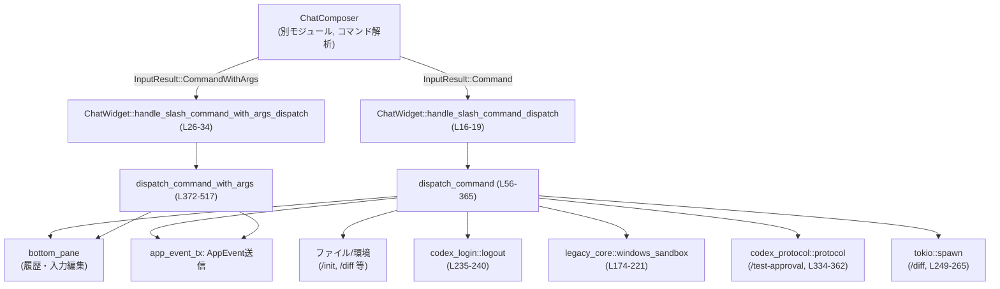
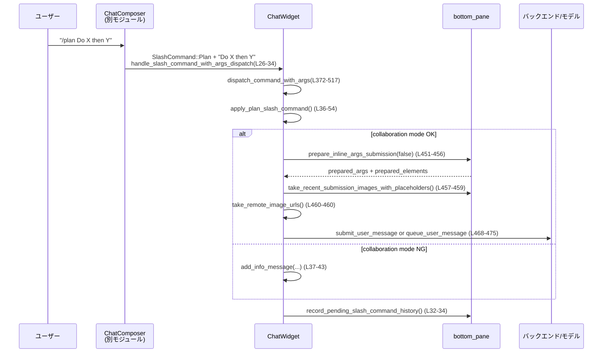

# tui/src/chatwidget/slash_dispatch.rs

## 0. ざっくり一言

`ChatWidget` に対するスラッシュコマンド（`/fast`, `/plan`, `/diff` など）の **ディスパッチと履歴記録** を行うモジュールです。  
素のスラッシュコマンドとインライン引数付きコマンドを受け取り、アプリ全体のイベント送信や UI 更新、ローカル履歴への登録をまとめて処理します（根拠: `slash_dispatch.rs:L1-6, L10-19, L26-34, L56-365, L372-517`）。

---

## 1. このモジュールの役割

### 1.1 概要

- `ChatComposer` が解析したスラッシュコマンドを受け取り、`ChatWidget` とアプリ全体に対して適切なアクションを起こす役割を持ちます（根拠: `slash_dispatch.rs:L1-6, L10-19, L26-34`）。
- 素のコマンド（引数なし）とインライン引数付きコマンドの **ディスパッチルールと履歴記録（Up-arrow でのローカルリコール）** を統一しています（根拠: `slash_dispatch.rs:L11-16, L21-26, L369-371`）。
- `/plan`, `/fast`, `/diff`, Windows サンドボックス関連など、多数のコマンドを `SlashCommand` 列挙体の分岐として扱い、それぞれ UI やバックエンドへのイベント送信を行います（根拠: `slash_dispatch.rs:L68-365, L392-517`）。

### 1.2 アーキテクチャ内での位置づけ

このファイルは `ChatWidget` の実装の一部として、スラッシュコマンドから他コンポーネントへの橋渡しをします。



- `ChatComposer` から「このコマンドが入力された」という結果を受け取り、このモジュール内の `handle_*` 系メソッドが入口になります（根拠: ドキュコメント `slash_dispatch.rs:L11-16, L21-25`）。
- 実際のビジネスロジックは `dispatch_command` / `dispatch_command_with_args` に集約され、そこから `bottom_pane`, `app_event_tx`, 各種ポップアップを開くメソッドなどへ処理が展開されます（根拠: `slash_dispatch.rs:L56-365, L372-517`）。

### 1.3 設計上のポイント

- **履歴記録の一元化**  
  - コマンド履歴は `handle_slash_command_dispatch` / `handle_slash_command_with_args_dispatch` のラッパーでのみ確定させることで、二重記録を防いでいます（根拠: `slash_dispatch.rs:L11-19, L21-34`）。
- **コマンド種別ごとの集中ディスパッチ**  
  - `SlashCommand` 列挙体を `match` し、コマンドごとの UI 操作やイベント送信を 1 か所に集約しています（根拠: `slash_dispatch.rs:L68-365, L392-517`）。
- **タスク中の使用制限**  
  - 長時間タスクと競合しうるコマンドについては `cmd.available_during_task()` と `bottom_pane.is_task_running()` によるガードを設け、エラーイベントを履歴に追加した上で処理を中断します（根拠: `slash_dispatch.rs:L57-66, L382-390`）。
- **非同期処理の分離**  
  - `/diff` コマンドでは `tokio::spawn` を用いて Git diff 計算をバックグラウンドで実行し、結果のみを `AppEvent::DiffResult` として UI 側へ返します（根拠: `slash_dispatch.rs:L249-265`）。
- **プラットフォーム依存のガード**  
  - `/elevate-sandbox` など Windows 専用機能は `#[cfg(target_os = "windows")]` で分岐し、想定外の環境ではコマンドが実行されても何もしないように防御的に実装されています（根拠: `slash_dispatch.rs:L173-221`）。

---

## 2. 主要な機能一覧（+ コンポーネントインベントリー）

### 2.1 機能一覧

- 素のスラッシュコマンドのディスパッチと履歴記録  
  - `handle_slash_command_dispatch` → `dispatch_command` → 履歴確定（根拠: `slash_dispatch.rs:L16-19, L56-365`）
- インライン引数付きスラッシュコマンドのディスパッチと履歴記録  
  - `handle_slash_command_with_args_dispatch` → `dispatch_command_with_args` → 履歴確定（根拠: `slash_dispatch.rs:L26-34, L372-517`）
- `/plan` 専用の事前チェックとモード切替  
  - `apply_plan_slash_command` によるコラボレーションモードの有効化とマスク設定（根拠: `slash_dispatch.rs:L36-54`）
- アプリケーションイベントの送信  
  - 新規セッション、クリア、フォーク、レビュー、モデル選択、ステータス取得など多様な `AppEvent` を送信（根拠: `slash_dispatch.rs:L82-93, L113-123, L164-166, L272-285, L492-501, L510-514`）
- UI ポップアップ・メニューの起動  
  - レビュー、モデル選択、コラボモード、スキル、テーマ、設定などのポップアップを開く（根拠: `slash_dispatch.rs:L113-115, L121-123, L148-153, L162-163, L228-230, L270-271, L287-299`）
- サービスモードやリアルタイム会話のトグル  
  - `/fast`, `/realtime`, `/settings` などで service tier やリアルタイム会話/オーディオ設定を切り替え（根拠: `slash_dispatch.rs:L124-131, L132-147, L393-428`）
- 外部システム連携  
  - Git diff（`/diff`）、ログアウト（`/logout`）、Windows サンドボックスやファイル変更承認テスト（`/sandbox-*`, `/test-approval`）との連携（根拠: `slash_dispatch.rs:L249-265, L235-241, L173-221, L333-362, L503-514`）

### 2.2 コンポーネントインベントリー（このファイル内）

| 名前 | 種別 | 概要 | 主な依存先 | 根拠 |
|------|------|------|------------|------|
| `ChatWidget` | 構造体（別定義） | チャット UI のメインウィジェット。このファイルではメソッドのみ実装。 | `bottom_pane`, `app_event_tx`, 設定, テレメトリなど | `slash_dispatch.rs:L10-519` |
| `handle_slash_command_dispatch` | メソッド | 素のスラッシュコマンドをディスパッチし、その後でスラッシュコマンド履歴を確定するラッパー。 | `dispatch_command`, `bottom_pane.record_pending_slash_command_history` | `slash_dispatch.rs:L16-19` |
| `handle_slash_command_with_args_dispatch` | メソッド | インライン引数付きのスラッシュコマンドをディスパッチし、その後で履歴を確定するラッパー。 | `dispatch_command_with_args`, `bottom_pane.record_pending_slash_command_history` | `slash_dispatch.rs:L26-34` |
| `apply_plan_slash_command` | メソッド（private） | `/plan` 実行時の前提チェックとモード切り替えを行い、成功/失敗を `bool` で返す。 | `collaboration_modes_enabled`, `collaboration_modes::plan_mask`, `set_collaboration_mask`, `add_info_message` | `slash_dispatch.rs:L36-54` |
| `dispatch_command` | メソッド | 引数なしスラッシュコマンドをすべて処理する中核ディスパッチ関数。UI 操作・イベント送信・非同期処理などを行う。 | `SlashCommand`, `bottom_pane`, `app_event_tx`, 各種ポップアップ, `tokio::spawn`, 外部クレート | `slash_dispatch.rs:L56-365` |
| `dispatch_command_with_args` | メソッド | インライン引数付きスラッシュコマンドを処理するディスパッチ関数。対応コマンドのみ特別な処理を行い、その他は `dispatch_command` に委譲。 | `SlashCommand`, `bottom_pane.prepare_inline_args_submission`, `UserMessage`, `AppEvent` など | `slash_dispatch.rs:L372-517` |

※ `SlashCommand`, `TextElement`, `UserMessage`, `AppEvent` などはこのファイル内では定義されていません（このチャンクには現れない）。

---

## 3. 公開 API と詳細解説

### 3.1 型一覧（このファイルで使用している主な型）

| 名前 | 種別 | 役割 / 用途 | 定義場所の有無 | 根拠 |
|------|------|-------------|----------------|------|
| `SlashCommand` | 列挙体（別モジュール） | `/fast`, `/plan`, `/diff` など、すべてのスラッシュコマンドを表す。`available_during_task`, `supports_inline_args`, `command` メソッドを持つ。 | このファイルでは未定義 | `slash_dispatch.rs:L16, L26, L56-365, L372-517` |
| `TextElement` | 型（別モジュール） | コマンド引数のテキスト要素。`handle_slash_command_with_args_dispatch` で受け取るが、このメソッド内では直接は使用していません。 | このファイルでは未定義 | `slash_dispatch.rs:L30-31` |
| `UserMessage` | 構造体（別モジュール） | ユーザーから送信されるメッセージ（テキスト・画像・メンションなど）を表す。`/plan` インライン時に生成されます。 | このファイルでは未定義 | `slash_dispatch.rs:L461-467` |
| `AppEvent` | 列挙体（別モジュール） | アプリケーション全体に通知するイベント（新規セッション、クリア、レビュー開始など）。`app_event_tx.send`/`set_thread_name` 等で利用。 | このファイルでは未定義 | `slash_dispatch.rs:L82-93, L164-166, L215-215, L272-281, L492-501, L510-514` |
| `ServiceTier` | 列挙体（別モジュール） | `/fast` モードなどのサービスレベルを表す。 | このファイルでは未定義 | `slash_dispatch.rs:L124-131, L411-417` |
| `WindowsSandboxLevel` | 列挙体（別モジュール） | Windows サンドボックスの制限レベル。`/elevate-sandbox` のガードに利用。 | このファイルでは未定義 | `slash_dispatch.rs:L176-178` |
| `ApplyPatchApprovalRequestEvent`, `FileChange` | 構造体・列挙体（`codex_protocol`） | `/test-approval` コマンドで送信する疑似ファイル変更リクエスト。 | このファイルでは未定義 | `slash_dispatch.rs:L336-362` |

### 3.2 関数詳細

#### `handle_slash_command_dispatch(&mut self, cmd: SlashCommand)`

**概要**

- 素のスラッシュコマンド（引数なし）をアプリにディスパッチし、その後でスラッシュコマンド履歴に記録を確定するラッパーです（根拠: `slash_dispatch.rs:L11-19`）。

**引数**

| 引数名 | 型 | 説明 |
|--------|----|------|
| `cmd` | `SlashCommand` | 実行するスラッシュコマンド。 |

**戻り値**

- なし。内部で UI 状態やイベント送信を行います。

**内部処理の流れ**

1. `dispatch_command(cmd)` を呼び出して、コマンド本体の処理を行う（根拠: `slash_dispatch.rs:L16-17`）。
2. コマンド処理完了後に、`bottom_pane.record_pending_slash_command_history()` を呼び出し、`ChatComposer` が事前にステージした履歴エントリを確定する（根拠: `slash_dispatch.rs:L17-19`）。

**Examples（使用例）**

```rust
// 例: `/fast` コマンドを素の形で実行する
chat_widget.handle_slash_command_dispatch(SlashCommand::Fast);
```

**Errors / Panics**

- エラーはすべて `dispatch_command` 側で処理され、履歴へのエラーイベント追加やメッセージ表示として扱われます。  
  このメソッド自体は `Result` を返さず、panic も書かれていません（根拠: `slash_dispatch.rs:L16-19, L56-66`）。

**Edge cases（エッジケース）**

- `SlashCommand` が実行中タスクでは利用できない場合、`dispatch_command` 内でエラーイベントを履歴に追加し、ここでは特別な処理は行いません（根拠: `slash_dispatch.rs:L57-66`）。

**使用上の注意点**

- コマンド履歴を正しく記録するため、`dispatch_command` を直接呼ぶのではなく、このラッパーを入力結果の入口として使う前提になっています（根拠: ドキュコメント `slash_dispatch.rs:L11-15`）。

---

#### `handle_slash_command_with_args_dispatch(&mut self, cmd: SlashCommand, args: String, text_elements: Vec<TextElement>)`

**概要**

- インライン引数付きスラッシュコマンドをディスパッチし、その後でスラッシュコマンド履歴のエントリを確定するラッパーです（根拠: `slash_dispatch.rs:L21-34`）。

**引数**

| 引数名 | 型 | 説明 |
|--------|----|------|
| `cmd` | `SlashCommand` | 実行するスラッシュコマンド。 |
| `args` | `String` | コマンドに続くインライン引数の文字列。 |
| `text_elements` | `Vec<TextElement>` | 引数の構造化されたテキスト要素。このメソッド内では `dispatch_command_with_args` にそのまま渡されます。 |

**戻り値**

- なし。

**内部処理の流れ**

1. `dispatch_command_with_args(cmd, args, text_elements)` を呼び出し、コマンド本体と引数の処理を行う（根拠: `slash_dispatch.rs:L26-33`）。
2. コマンド処理完了後、`bottom_pane.record_pending_slash_command_history()` でステージ済みのスラッシュコマンド履歴を確定する（根拠: `slash_dispatch.rs:L32-34`）。

**Examples（使用例）**

```rust
// 例: `/rename New name` のようなコマンドを処理する
chat_widget.handle_slash_command_with_args_dispatch(
    SlashCommand::Rename,
    "New thread title".to_string(),
    vec![], // TextElement は別モジュール定義
);
```

**Errors / Panics**

- エラーは `dispatch_command_with_args` 側で履歴やメッセージとして処理されます。  
  このメソッド自身はエラー型を返さず、panic を行うコードも記述されていません（根拠: `slash_dispatch.rs:L26-34, L372-517`）。

**Edge cases**

- コマンドがインライン引数をサポートしない場合でも、このメソッドは呼べますが、実際の処理は `dispatch_command_with_args` 内で `dispatch_command` にフォールバックされます（根拠: `slash_dispatch.rs:L378-381`）。

**使用上の注意点**

- コメントにある通り、履歴の二重記録を避けるため、インライン引数付きコマンドのエントリポイントとしてこのラッパーを一元利用する設計になっています（根拠: ドキュコメント `slash_dispatch.rs:L369-371`）。

---

#### `apply_plan_slash_command(&mut self) -> bool`

**概要**

- `/plan` コマンド実行時に、コラボレーションモードが有効かどうかチェックし、利用可能な場合はコラボレーションマスクを設定して `true` を返すヘルパー関数です（根拠: `slash_dispatch.rs:L36-54`）。

**引数**

- なし（`self` のみ）。

**戻り値**

- `bool`  
  - `true`: `/plan` モードに正常に移行した。  
  - `false`: モードが無効、あるいは利用可能なマスクが見つからないなどの理由で失敗した。

**内部処理の流れ**

1. `collaboration_modes_enabled()` が `false` の場合、情報メッセージとヒントを表示し、`false` を返す（根拠: `slash_dispatch.rs:L36-43`）。
2. `collaboration_modes::plan_mask(self.model_catalog.as_ref())` からマスクを取得し、`Some(mask)` の場合は `set_collaboration_mask(mask)` を呼び出して `true` を返す（根拠: `slash_dispatch.rs:L44-47`）。
3. `None` の場合、利用不能メッセージを表示し、`false` を返す（根拠: `slash_dispatch.rs:L48-53`）。

**Examples（使用例）**

```rust
// /plan コマンドの素のディスパッチから利用
match cmd {
    SlashCommand::Plan => {
        self.apply_plan_slash_command(); // 成否は bool で返る
    }
    _ => {}
}
```

**Errors / Panics**

- 戻り値の `bool` で成功/失敗を表現しており、panic を起こすコードはありません（根拠: `slash_dispatch.rs:L36-54`）。

**Edge cases**

- コラボレーションモードが完全に無効な場合と、モードは有効だが `plan_mask` が取得できない場合で、それぞれ異なるメッセージを表示します（根拠: `slash_dispatch.rs:L37-43, L48-53`）。

**使用上の注意点**

- `/plan` のインライン引数処理では、この関数の戻り値が `false` の場合はその後のメッセージ送信処理を行わずに早期リターンしています（根拠: `slash_dispatch.rs:L447-450`）。

---

#### `dispatch_command(&mut self, cmd: SlashCommand)`

**概要**

- 引数なしのすべてのスラッシュコマンドを処理する **中核ディスパッチ関数** です。  
  利用制限チェック、UI メッセージ表示、アプリイベント送信、バックグラウンドタスクの起動などを行います（根拠: `slash_dispatch.rs:L56-365`）。

**引数**

| 引数名 | 型 | 説明 |
|--------|----|------|
| `cmd` | `SlashCommand` | 素のスラッシュコマンド。 |

**戻り値**

- なし。

**内部処理の流れ（概要）**

1. **タスク中の禁止コマンドチェック**  
   - `cmd.available_during_task()` が `false` かつ `bottom_pane.is_task_running()` が `true` の場合、エラーイベントを履歴に追加し、ペンディング送信状態を破棄し、再描画を要求して終了します（根拠: `slash_dispatch.rs:L57-66`）。
2. **コマンド種別ごとの処理**（`match cmd`）  
   - フィードバック UI の起動（`/feedback`）、新規セッション（`/new`）、UI クリア（`/clear`）、セッションフォーク（`/fork`）などを `app_event_tx` 経由で実行（根拠: `slash_dispatch.rs:L68-93`）。
   - `/init`: プロジェクト doc ファイルの存在をチェックし、未存在時は埋め込み Markdown を初回プロンプトとして送信（根拠: `slash_dispatch.rs:L94-105`）。
   - `/compact`: トークン使用量のクリアとバックグラウンドコンパクションの開始（根拠: `slash_dispatch.rs:L106-112`）。
   - `/fast`: `ServiceTier::Fast` のトグル（根拠: `slash_dispatch.rs:L124-131`）。
   - `/realtime`, `/settings`: リアルタイム会話やオーディオデバイス選択 UI の制御（根拠: `slash_dispatch.rs:L132-147`）。
   - `/plan`, `/collab`: コラボレーションモード関連の警告・ポップアップ（根拠: `slash_dispatch.rs:L151-163`）。
   - `/elevate-sandbox`: Windows 限定のサンドボックス昇格セットアップ（根拠: `slash_dispatch.rs:L173-221`）。
   - `/diff`: 非同期に Git diff を取得し、その結果を `AppEvent::DiffResult` として送信（根拠: `slash_dispatch.rs:L249-265`）。
   - `/status`: レートリミットの事前取得とステータス出力（根拠: `slash_dispatch.rs:L272-285`）。
   - `/logout`: `codex_login::logout` を実行し、失敗時は `tracing::error!` ログのみ残してアプリ終了を続行（根拠: `slash_dispatch.rs:L234-241`）。
   - その他、タイトル・ステータスライン・テーマの設定、MCP/Apps/Plugins の情報表示など、多数の UI・ステータス系コマンドを処理（根拠: `slash_dispatch.rs:L287-331`）。
   - `/test-approval`: 簡易なファイル変更承認リクエストを生成して UI に流すテストコマンド（根拠: `slash_dispatch.rs:L333-362`）。

**Examples（使用例）**

```rust
// 例: 一般的な素のスラッシュコマンドの処理
match cmd {
    SlashCommand::Clear | SlashCommand::New => {
        chat_widget.handle_slash_command_dispatch(cmd); // ラッパー経由で呼ぶのが前提
    }
    _ => {}
}
```

**Errors / Panics**

- タスク中に禁止コマンドを実行した場合  
  - エラーメッセージを履歴に追加（`add_to_history(history_cell::new_error_event(message))`）し、ペンディング状態を破棄します（根拠: `slash_dispatch.rs:L57-64`）。
- `/elevate-sandbox` で `builtin_approval_presets` から `'auto'` プリセットが見つからない場合  
  - 「Internal error: missing the 'auto' approval preset.」というエラーメッセージを UI に表示し、panic は避けています（根拠: `slash_dispatch.rs:L187-197`）。
- `codex_login::logout` が失敗した場合  
  - `tracing::error!` でログ出力するのみで、UI にはエラーを表示していません（根拠: `slash_dispatch.rs:L235-240`）。
- `tokio::spawn` 内では `get_git_diff` のエラーを `"Failed to compute diff: {e}"` テキストとして AppEvent に載せ、UI で扱える形式に変換しています（根拠: `slash_dispatch.rs:L249-265`）。
- このファイル内に `panic!` や `unwrap`/`expect` は登場せず、全て recoverable なエラーハンドリングになっています。

**Edge cases**

- `/init` で対象ファイルが既に存在する場合  
  - 上書きを避けるために `/init` をスキップし、情報メッセージを表示します（根拠: `slash_dispatch.rs:L94-105`）。
- Windows 以外で `/elevate-sandbox` が呼ばれた場合  
  - `#[cfg(not(target_os = "windows"))]` 側で何も行わずに終了し、コメントで「到達しないはず」と明記されています（根拠: `slash_dispatch.rs:L217-221`）。
- `/sandbox-read-root` を素の形で呼び出した場合  
  - 使い方メッセージのみを表示し、実際の権限付与は行われません（根拠: `slash_dispatch.rs:L223-227`）。

**使用上の注意点**

- コマンドごとの UI/バックエンド連携がここに集約されているため、新コマンド追加や仕様変更時はこの `match` の分岐に手を入れる必要があります。
- `/diff` は非同期処理を起動するため、`tokio` ランタイム上でアプリが動作している前提があります（根拠: `slash_dispatch.rs:L249-265`）。
- Windows 関連コマンドでは、サンドボックスレベルや `ELEVATED_SANDBOX_NUX_ENABLED` の組合せで実行可否が決まるため、条件変更時は慎重なテストが必要です（根拠: `slash_dispatch.rs:L176-181`）。

---

#### `dispatch_command_with_args(&mut self, cmd: SlashCommand, args: String, _text_elements: Vec<TextElement>)`

**概要**

- インライン引数付きスラッシュコマンドを処理するディスパッチ関数です。コマンドがインライン引数をサポートしていない場合や引数が空の場合は、通常の `dispatch_command` にフォールバックします（根拠: `slash_dispatch.rs:L372-381, L392-429`）。

**引数**

| 引数名 | 型 | 説明 |
|--------|----|------|
| `cmd` | `SlashCommand` | 実行するスラッシュコマンド。 |
| `args` | `String` | コマンドのインライン引数部分。 |
| `_text_elements` | `Vec<TextElement>` | インライン引数の構造化情報。現状この関数内では未使用（プレフィックス `_` 付き）です。 |

**戻り値**

- なし。

**内部処理の流れ（概要）**

1. **インライン引数対応チェック**  
   - `cmd.supports_inline_args()` が `false` の場合、通常の `dispatch_command(cmd)` に委譲して終了（根拠: `slash_dispatch.rs:L378-381`）。
2. **タスク中の使用制限チェック**  
   - `dispatch_command` と同様に、`available_during_task` と `is_task_running` を使って禁止コマンドを弾き、エラーイベントを履歴に追加した上で終了（`drain_pending_submission_state` はここでは呼ばれません）（根拠: `slash_dispatch.rs:L382-390`）。
3. **引数のトリムとコマンド分岐**  
   - `trimmed = args.trim()` を用いて空文字かどうかを判断し、以下のようにコマンドごとの処理を行います（根拠: `slash_dispatch.rs:L392-393`）:
   - `/fast`  
     - 引数が空文字なら通常の `dispatch_command` へフォールバック。  
     - 引数がある場合、composer に入力中のテキストがあれば `prepare_inline_args_submission(false)` で事前処理し、それを元に `on`/`off`/`status` に応じて service tier を変更または状態を表示（根拠: `slash_dispatch.rs:L394-428`）。
   - `/rename`（引数非空時）  
     - 事前処理した引数を `normalize_thread_name` で正規化し、空名の場合はエラーメッセージ。OK なら `set_thread_name` を行い、ペンディング送信状態を破棄（根拠: `slash_dispatch.rs:L430-446`）。
   - `/plan`（引数非空時）  
     - まず `apply_plan_slash_command` が成功した場合のみ、事前処理されたテキスト・画像・メンションを `UserMessage` にまとめ、セッション設定状況に応じて `submit_user_message` または `queue_user_message` を呼び出す（根拠: `slash_dispatch.rs:L447-475`）。
   - `/review`（引数非空時）  
     - インラインの指示文を `ReviewRequest::Custom { instructions }` として `AppCommand::review` に渡し、`submit_op` を経由してバックエンドへ送信（根拠: `slash_dispatch.rs:L477-490`）。
   - `/resume`（引数非空時）  
     - 事前処理された文字列を `AppEvent::ResumeSessionByIdOrName` に載せて、セッション再開を要求（根拠: `slash_dispatch.rs:L492-501`）。
   - `/sandbox-read-root`（引数非空時）  
     - Windows サンドボックスの read root 付与イベントを `AppEvent::BeginWindowsSandboxGrantReadRoot { path }` として送信（根拠: `slash_dispatch.rs:L503-514`）。
   - 上記以外のコマンドまたは引数空文字のものについては、`dispatch_command(cmd)` にフォールバック（根拠: `slash_dispatch.rs:L495-501, L503-517`）。

**Examples（使用例）**

```rust
// 例: `/fast on` を処理する
chat_widget.handle_slash_command_with_args_dispatch(
    SlashCommand::Fast,
    "on".to_string(),
    vec![],
);

// 例: `/plan Do X then Y` を処理する
chat_widget.handle_slash_command_with_args_dispatch(
    SlashCommand::Plan,
    "Do X then Y".to_string(),
    vec![],
);
```

**Errors / Panics**

- インライン引数の事前処理 `prepare_inline_args_submission(false)` が `None` を返した場合  
  - その場で `return` し、それ以上の処理は行いません（根拠: `slash_dispatch.rs:L402-407, L451-456, L479-482, L494-497, L505-508`）。  
  - 返り値がないため、失敗は UI 側で別途取り扱われる前提です。
- `/rename` で `normalize_thread_name` が `None` を返した場合  
  - 「Thread name cannot be empty.」というエラーメッセージを表示するのみです（根拠: `slash_dispatch.rs:L439-442`）。
- panic を起こすコードは含まれていません。

**Edge cases**

- `/fast` で引数が空の場合は、単に素の `/fast` と同じ動作（service tier のトグル）になります（根拠: `slash_dispatch.rs:L395-398, L124-131`）。
- `/plan` インラインでセッションが未設定の場合は、`queue_user_message` によってメッセージがキューされ、後から送信されるようにしています（根拠: `slash_dispatch.rs:L468-475`）。

**使用上の注意点**

- インライン引数をサポートするコマンドを追加する際には、この関数の `match cmd` 部分に分岐を追加し、必要なら `supports_inline_args()` の実装も対応させる必要があります。
- `_text_elements` は現時点で未使用ですが、将来的な拡張のためのプレースホルダのように見えます。このチャンクからはそれ以上の意図は読み取れません。

---

### 3.3 その他の関数・外部呼び出し

このファイル内で定義されてはいませんが、重要な外部メソッド呼び出しを一覧にします。

| 呼び出し先 | 役割（1 行） | 根拠 |
|-----------|--------------|------|
| `bottom_pane.record_pending_slash_command_history()` | ステージ済みのスラッシュコマンドをローカル履歴に確定する。 | `slash_dispatch.rs:L18-19, L32-34` |
| `bottom_pane.prepare_inline_args_submission(false)` | インライン引数を送信可能な形に整形し、必要なら履歴を記録しない。 | `slash_dispatch.rs:L400-407, L451-456, L479-482, L494-497, L505-508` |
| `app_event_tx.send(...)` | アプリケーションイベント（セッション操作やステータス更新など）を送信する。 | `slash_dispatch.rs:L82-93, L164-166, L215-215, L272-281, L492-501, L510-514` |
| `tokio::spawn(async move { ... })` | `/diff` コマンド用に Git diff 計算を非同期タスクとして実行する。 | `slash_dispatch.rs:L249-265` |
| `codex_login::logout(...)` | CLI 認証情報のログアウトを実行し、失敗時はログに記録。 | `slash_dispatch.rs:L235-240` |

---

## 4. データフロー

ここでは、代表的なシナリオとして **`/plan` インラインコマンド** のデータフローを説明します。

1. ユーザーが `/plan Do X then Y` のような入力を行う。
2. `ChatComposer` がこれを解析し、`SlashCommand::Plan` と引数 `"Do X then Y"` に分解し `ChatWidget` に渡す（この処理は別チャンク）。
3. `ChatWidget::handle_slash_command_with_args_dispatch` が呼ばれ、`dispatch_command_with_args` へ委譲する（根拠: `slash_dispatch.rs:L26-34`）。
4. `dispatch_command_with_args` で `/plan` 分岐が選ばれ、`apply_plan_slash_command` によりコラボレーションモードが設定される（根拠: `slash_dispatch.rs:L447-450`）。
5. `bottom_pane.prepare_inline_args_submission(false)` によって引数テキストとテキスト要素が整形される（根拠: `slash_dispatch.rs:L451-456`）。
6. `bottom_pane` から取得した画像やメンション情報も含めて `UserMessage` が構築される（根拠: `slash_dispatch.rs:L457-467`）。
7. セッション設定済みなら `submit_user_message(user_message)`、未設定なら `queue_user_message(user_message)` を通じてバックエンドに送信される（根拠: `slash_dispatch.rs:L468-475`）。
8. `handle_slash_command_with_args_dispatch` の最後で、ステージ済みのスラッシュコマンド履歴が確定する（根拠: `slash_dispatch.rs:L32-34`）。



---

## 5. 使い方（How to Use）

### 5.1 基本的な使用方法

`ChatWidget` を用いてスラッシュコマンドを処理する典型的な流れは次の通りです。

```rust
// ChatWidget のインスタンスがあると仮定
let mut widget: ChatWidget = /* ... */;

// 例1: 素のスラッシュコマンド "/clear"
widget.handle_slash_command_dispatch(SlashCommand::Clear); // L16-19

// 例2: インライン引数付きスラッシュコマンド "/rename New Title"
widget.handle_slash_command_with_args_dispatch(
    SlashCommand::Rename,
    "New Title".to_string(),
    vec![], // TextElement は別途構築
); // L26-34, L430-446
```

- アプリ側では、**`handle_*_dispatch` を入口**として使うことで、コマンドの処理と履歴記録を一貫させる設計になっています（根拠: `slash_dispatch.rs:L11-19, L21-34`）。

### 5.2 よくある使用パターン

1. **トグル系コマンド（/fast, /realtime）**

   ```rust
   // /fast: service tier をトグル
   widget.handle_slash_command_dispatch(SlashCommand::Fast); // L124-131

   // /fast status: 状態を確認
   widget.handle_slash_command_with_args_dispatch(
       SlashCommand::Fast,
       "status".to_string(),
       vec![],
   ); // L393-428
   ```

2. **セッション操作系（/new, /resume, /fork）**

   ```rust
   // 新規セッション作成
   widget.handle_slash_command_dispatch(SlashCommand::New); // L82-84

   // 特定セッションの再開
   widget.handle_slash_command_with_args_dispatch(
       SlashCommand::Resume,
       "session-name-or-id".to_string(),
       vec![],
   ); // L492-501
   ```

3. **レビュー・プランニング系（/review, /plan）**

   ```rust
   // その時点の文脈でレビュー UI を開く
   widget.handle_slash_command_dispatch(SlashCommand::Review); // L113-115

   // /plan with inline instructions
   widget.handle_slash_command_with_args_dispatch(
       SlashCommand::Plan,
       "Do X then Y".to_string(),
       vec![],
   ); // L447-475
   ```

### 5.3 よくある間違い

```rust
// 間違い例: dispatch_command を直接呼び出して履歴を記録しない
// widget.dispatch_command(SlashCommand::Clear);

// 正しい例: ラッパー経由で呼び、履歴も更新
widget.handle_slash_command_dispatch(SlashCommand::Clear); // L16-19
```

```rust
// 間違い例: インライン引数をサポートしないコマンドを
// わざわざ dispatch_command_with_args に渡す
widget.handle_slash_command_with_args_dispatch(
    SlashCommand::Quit,
    "".to_string(),
    vec![],
);

// 正しい例: 素のコマンドとして扱う
widget.handle_slash_command_dispatch(SlashCommand::Quit); // L231-233
```

- もっとも、コード上は `supports_inline_args()` が `false` の場合に `dispatch_command` へフォールバックするため、誤用しても致命的エラーにはなりません（根拠: `slash_dispatch.rs:L378-381`）。

### 5.4 使用上の注意点（まとめ）

- **履歴記録の一貫性**  
  - スラッシュコマンドの履歴記録は `handle_*_dispatch` 内で行われるため、外部から直接 `dispatch_command*` を呼ぶと履歴に残らない可能性があります（根拠: `slash_dispatch.rs:L16-19, L26-34`）。
- **タスク中の使用制限**  
  - `available_during_task()` が `false` のコマンドをタスク実行中に呼ぶと、エラーイベントが履歴に残り、処理は行われません（根拠: `slash_dispatch.rs:L57-66, L382-390`）。
- **非同期処理**  
  - `/diff` のように `tokio::spawn` を用いてバックグラウンド処理を起動するコマンドがあるため、アプリ全体は `tokio` などの非同期ランタイム上で動いている前提です（根拠: `slash_dispatch.rs:L249-265`）。
- **プラットフォーム依存コマンド**  
  - `/elevate-sandbox` や `/sandbox-read-root` は Windows に依存する挙動を持ち、非 Windows 環境では何もしないか、使い方メッセージのみを表示します（根拠: `slash_dispatch.rs:L173-227`）。

---

## 6. 変更の仕方（How to Modify）

### 6.1 新しい機能を追加する場合（新スラッシュコマンド）

1. **`SlashCommand` 列挙体に新しいバリアントを追加**  
   - このファイルには `SlashCommand` の定義はありませんが、新コマンドを追加するには別モジュールにある列挙体へバリアントを追加する必要があります（このチャンクには定義が現れない）。
2. **`dispatch_command` の `match` に分岐を追加**  
   - 引数不要のコマンドなら、`match cmd` の中に `SlashCommand::NewCommand => { ... }` を追加します（根拠: `slash_dispatch.rs:L68-365`）。
3. **インライン引数対応が必要な場合**  
   - `dispatch_command_with_args` の `match cmd` に新しい分岐を追加します（根拠: `slash_dispatch.rs:L392-517`）。
   - 必要なら `supports_inline_args()` の実装も更新します（このチャンクには実装なし）。
4. **履歴記録との整合性**  
   - 入力結果の入口として `handle_slash_command_dispatch` / `handle_slash_command_with_args_dispatch` から呼ばれる前提で設計します（根拠: `slash_dispatch.rs:L11-19, L21-34`）。

### 6.2 既存の機能を変更する場合

- **タスク中の振る舞いの変更**
  - タスク中も許可したい/禁止したいコマンドが変わる場合は、`available_during_task()` の実装と本ファイルのガードロジック（`L57-66, L382-390`）の両方を確認する必要があります。
- **`/plan` やコラボレーションモード関連**
  - `apply_plan_slash_command` を中心に、`/plan` の素のコマンドとインラインコマンドの両方がこのヘルパーを利用しているため、挙動変更は両方に影響します（根拠: `slash_dispatch.rs:L36-54, L151-153, L447-450`）。
- **Windows サンドボックスや承認フロー**
  - `/elevate-sandbox` や `/test-approval` のようなコマンドは外部クレートや OS 機能に依存しているため、変更時には `codex_protocol`, `legacy_core::windows_sandbox` なども合わせて確認する必要があります（根拠: `slash_dispatch.rs:L173-221, L334-362`）。

---

## 7. 関連ファイル

このモジュールと密接に関係すると思われるコンポーネントを列挙します（いずれもこのチャンクでは定義のみ確認できません）。

| パス / モジュール名 | 役割 / 関係 | 根拠 |
|---------------------|------------|------|
| `super::*`（`ChatWidget` 定義モジュール） | `ChatWidget` 本体の定義や他のメソッドを提供するモジュール。 | `slash_dispatch.rs:L8-10` |
| `crate::bottom_pane` | フィードバック UI、ステータス表示、インライン引数の事前処理など、チャット入力下部の UI ロジックを提供。 | `slash_dispatch.rs:L71-72, L77-80, L250-251, L272-285, L400-407, L451-459, L466-467` |
| `crate::legacy_core::windows_sandbox` | Windows サンドボックスのレベルや機能フラグを定義するモジュール。`/elevate-sandbox` で使用。 | `slash_dispatch.rs:L176-181` |
| `codex_login` | CLI 認証情報のログアウト機能を提供。`/logout` で使用。 | `slash_dispatch.rs:L235-240` |
| `codex_protocol::protocol` | ファイル変更リクエストやパッチ適用のプロトコル型を提供。`/test-approval` で使用。 | `slash_dispatch.rs:L336-362` |
| `tokio` | 非同期タスク実行ランタイム。`/diff` でバックグラウンド diff 計算に利用。 | `slash_dispatch.rs:L249-265` |
| `include_str!("../../prompt_for_init_command.md")` | `/init` コマンドで利用する初期プロンプトテキストを埋め込むファイル。 | `slash_dispatch.rs:L103-104` |

---

### 付記: Bugs/Security 観点での注意（事実ベース）

- **`SandboxReadRoot` のパス検証**  
  - 本ファイル内ではパス文字列をそのまま `AppEvent::BeginWindowsSandboxGrantReadRoot { path }` に渡しており、パスの検証や正規化はここでは行われていません（根拠: `slash_dispatch.rs:L503-514`）。  
    実際の安全性はイベントを処理する側の実装に依存します（このチャンクには現れない）。
- **ログアウト失敗時のユーザー通知**  
  - `codex_login::logout` 失敗時に `tracing::error!` でログを残していますが、ユーザー向けの UI メッセージは表示していません（根拠: `slash_dispatch.rs:L235-240`）。  
    挙動としては「ログアウトに失敗してもアプリは終了する」という仕様になっています。
- **非同期タスクのエラーハンドリング**  
  - `/diff` の非同期タスクでは、エラー内容を文字列化して `AppEvent::DiffResult` 経由で UI に渡しており、panic は避けられています（根拠: `slash_dispatch.rs:L249-265`）。
