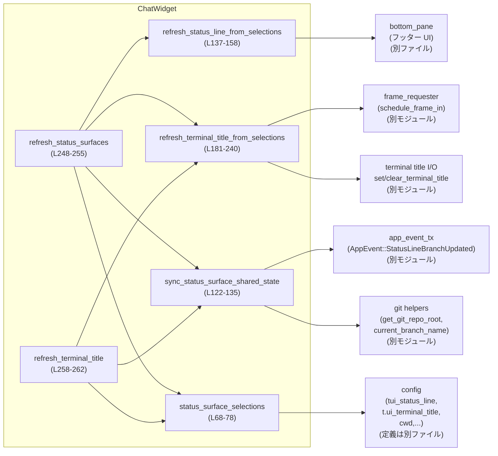
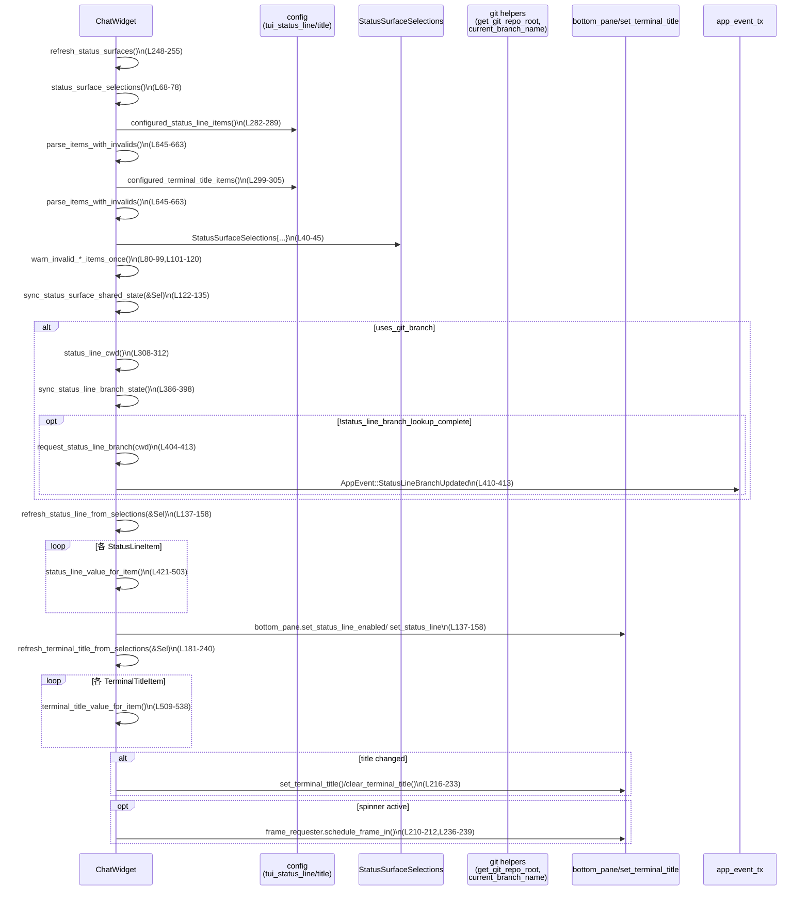

# tui/src/chatwidget/status_surfaces.rs コード解説

## 0. ざっくり一言

`ChatWidget` の **フッターのステータス行** と **ターミナルタイトル** を描画するためのヘルパーロジックをまとめたモジュールです（`status_surfaces.rs:L1-4`）。  
設定値とランタイム状態から一度だけスナップショットを作り、それをもとに両方の「ステータスサーフェス」を効率よく更新します。

---

## 1. このモジュールの役割

### 1.1 概要

- 解決する問題  
  - ステータス行とターミナルタイトルが、似た情報（git ブランチ・プロジェクト名・無効な設定 ID の警告など）を共有しており、毎回バラバラに計算すると非効率・複雑になる問題。
- 提供する機能  
  - 両方の表示に必要な情報を **1 回のパースと共有状態の同期** で済ませる仕組み（`StatusSurfaceSelections` スナップショット、`status_surfaces.rs:L40-45,68-78`）。
  - ステータス行とターミナルタイトルの **文字列構築・トリミング・アニメーション（スピナー）・git ブランチ非同期取得** を行うユーティリティ群（`status_surfaces.rs:L122-240,L382-413,L421-503,L505-538,L569-642`）。

### 1.2 アーキテクチャ内での位置づけ

このモジュールは `ChatWidget` の `impl` の一部として実装されており、以下のコンポーネントと連携します。

- `ChatWidget` 本体（このファイルの `impl ChatWidget`、`status_surfaces.rs:L67-643`）
- 設定 (`self.config`) とその中の  
  - `tui_status_line` / `tui_terminal_title`（ユーザ設定の ID リスト、`status_surfaces.rs:L282-289,L299-305`）
  - `cwd` と `config_layer_stack`（プロジェクトルート探索、`status_surfaces.rs:L308-337`）
- ステータス行 UI (`self.bottom_pane.set_status_line_enabled`, `self.set_status_line` など、`status_surfaces.rs:L137-158,L541-566` から参照)
- ターミナルタイトル I/O (`clear_terminal_title`, `set_terminal_title`, `SetTerminalTitleResult` など、`status_surfaces.rs:L165-172,L216-228` から参照)
- git 関連ヘルパ (`get_git_repo_root`, `current_branch_name`, `status_surfaces.rs:L319-321,L410-412`)
- イベント送信 (`self.app_event_tx.send(AppEvent::StatusLineBranchUpdated { .. })`, `status_surfaces.rs:L410-413`)
- アニメーション用フレームスケジューラ (`self.frame_requester.schedule_frame_in`, `status_surfaces.rs:L210-212,L237-239`)

依存関係の概要を Mermaid で表すと次のようになります（主な関数のみ、行番号付き）。



### 1.3 設計上のポイント

- **スナップショット方式**  
  - `StatusSurfaceSelections` に、ステータス行・ターミナルタイトルそれぞれの「有効な項目」と「無効 ID のリスト」を詰めて 1 回のパースで共有（`status_surfaces.rs:L40-45,L68-78`）。
- **git ブランチ・プロジェクト名のキャッシュ**  
  - git ブランチ名はカレントディレクトリ（cwd）単位でキャッシュし、cwd 変更時にのみリセット（`status_surfaces.rs:L382-398`）。
  - プロジェクトルート名も `CachedProjectRootName` でキャッシュし、同じ cwd なら再計算を避ける（`status_surfaces.rs:L347-362`）。
- **無効な設定 ID の警告の一度きり通知**  
  - `status_line_invalid_items_warned` / `terminal_title_invalid_items_warned` の `compare_exchange` を利用し、警告を 1 度だけ出す（`status_surfaces.rs:L80-99,L101-120`）。
- **非同期 git ブランチ取得**  
  - `tokio::spawn` で非同期に `current_branch_name` を呼び出し、結果は `AppEvent` 経由でメインループへ戻す（`status_surfaces.rs:L404-413`）。
- **アニメーション制御**  
  - スピナー用のフレーム間隔やフレーム配列を定数化し（`status_surfaces.rs:L12-17,L581-585`）、  
    スピナーが必要なときだけ `frame_requester.schedule_frame_in` を呼び出し、不要なフレーム要求を避ける（`status_surfaces.rs:L206-213,L236-239,L601-616`）。
- **安全なフォールバック**  
  - 情報がまだ揃っていない場合は `None` を返して **その項目だけを非表示** にし、全体を壊さない設計（`status_surfaces.rs:L416-421,L505-538`）。

---

## 2. 主要な機能一覧

- ステータスサーフェス設定スナップショット作成：`status_surface_selections`（`status_surfaces.rs:L68-78`）
- 無効なステータス行 / ターミナルタイトル ID の一度きり警告：`warn_invalid_*_items_once`（`status_surfaces.rs:L80-99,L101-120`）
- git ブランチ状態の同期と非同期リクエスト：  
  - `sync_status_surface_shared_state` / `sync_status_line_branch_state` / `request_status_line_branch_refresh` / `request_status_line_branch`（`status_surfaces.rs:L122-135,L382-398,L265-273,L404-413`）
- ステータス行の更新：`refresh_status_line_from_selections`（`status_surfaces.rs:L137-158`）
- ターミナルタイトルの更新・アニメーション：  
  - `refresh_terminal_title_from_selections` / `clear_managed_terminal_title` / `terminal_title_spinner_*` / `should_animate_terminal_title_spinner*`（`status_surfaces.rs:L160-172,L181-240,L569-616`）
- ステータス行・ターミナルタイトルの入口 API：  
  - `refresh_status_surfaces` / `refresh_terminal_title`（`status_surfaces.rs:L248-255,L258-262`）
- プロジェクトルート名の探索とキャッシュ：  
  - `status_line_project_root_for_cwd` / `status_line_project_root_name_for_cwd` / `status_line_project_root_name` / `terminal_title_project_name`（`status_surfaces.rs:L319-345,L347-380`）
- 各種項目から表示文字列への変換：  
  - `status_line_value_for_item` / `terminal_title_value_for_item` / `terminal_title_status_text` / `terminal_title_task_progress`（`status_surfaces.rs:L421-503,L509-538,L545-566,L619-625`）
- ID パースと無効 ID 収集：`parse_items_with_invalids`（`status_surfaces.rs:L645-663`）
- コンテキスト使用メーター描画：`format_context_used_meter`（`status_surfaces.rs:L665-682`）
- 文字列切り詰め（多バイト対応）：`truncate_terminal_title_part`（`status_surfaces.rs:L628-642`）

---

## 3. 公開 API と詳細解説

### 3.1 型一覧（構造体・列挙体など）

| 名前 | 種別 | 公開範囲 | 役割 / 用途 | 定義 |
|------|------|----------|-------------|------|
| `TerminalTitleStatusKind` | enum | `pub(super)` | ターミナルタイトルに表示する簡略化された状態（Working / Waiting / Undoing / Thinking）。`Thinking` がデフォルト（`status_surfaces.rs:L24-31`）。 | `status_surfaces.rs:L24-31` |
| `StatusSurfaceSelections` | struct | private | 一回のリフレッシュで使うステータス行・ターミナルタイトルの項目リストと、無効 ID の一覧を保持するスナップショット（`status_surfaces.rs:L40-45`）。 | `status_surfaces.rs:L40-45` |
| `CachedProjectRootName` | struct | `pub(super)` | 最後に計算したプロジェクトルート名と、その計算に使った cwd をキャッシュする（`status_surfaces.rs:L62-65`）。 | `status_surfaces.rs:L62-65` |

※ `StatusLineItem`, `TerminalTitleItem`, `ChatWidget`, `ConfigLayerSource` などはこのファイル外で定義されています（型名から存在が分かるのみで、パスは不明）。

---

### 3.2 関数詳細（重要な 7 件）

#### 1. `refresh_status_surfaces(&mut self)`  

**定義**: `status_surfaces.rs:L248-255`  
**公開範囲**: `pub(crate)`（crate 内部向けの API）

**概要**

- ステータス行とターミナルタイトルの両方を **一度の設定パースと状態同期** から再計算するメイン入口です。
- git ブランチなど共有される高コスト情報を 1 回だけ処理するようにします。

**引数**

| 引数名 | 型 | 説明 |
|--------|----|------|
| `self` | `&mut ChatWidget` | UI 状態全体。設定・git キャッシュ・タイトルキャッシュなどを内部で更新します。 |

**戻り値**

- なし（副作用として UI 状態とターミナルタイトルを更新）。

**内部処理の流れ**

1. `status_surface_selections` でステータス行 / タイトル両方の項目リストと無効 ID を構築（`status_surfaces.rs:L249,L68-78`）。
2. ステータス行側の無効 ID に対して `warn_invalid_status_line_items_once` を呼び、必要なら警告を一度だけ出す（`status_surfaces.rs:L250,L80-99`）。
3. タイトル側の無効 ID も同様に `warn_invalid_terminal_title_items_once` で警告（`status_surfaces.rs:L251,L101-120`）。
4. `sync_status_surface_shared_state` で、git ブランチキャッシュを更新し、必要なら非同期ブランチ取得を開始（`status_surfaces.rs:L252,L122-135`）。
5. `refresh_status_line_from_selections` でステータス行文字列を再構成（`status_surfaces.rs:L253,L137-158`）。
6. `refresh_terminal_title_from_selections` でターミナルタイトルを再構成し、スピナーを必要ならスケジューリング（`status_surfaces.rs:L254,L181-240`）。

**Examples（使用例）**

`ChatWidget` の内部から、状態が変化したタイミング（設定変更、モデル変更など）で呼ぶことが想定されます。

```rust
// ChatWidget 内のどこか
fn on_state_changed(&mut self) {
    // ステータス行とターミナルタイトルをまとめて更新する
    self.refresh_status_surfaces(); // status_surfaces.rs:L248-255
}
```

**Errors / Panics**

- この関数自体は `Result` を返さず、内部で発生した I/O エラー等は
  - `clear_managed_terminal_title` の `Result` は `refresh_terminal_title_from_selections` 内で捕捉し、`tracing::debug!` で記録（`status_surfaces.rs:L181-187,L221-227,230-232`）。
  - 非同期ブランチ取得内の `tx.send(...)` の戻り値は無視されています（`status_surfaces.rs:L410-413`）。
- パニックを起こす `unwrap` などは使用していません。

**Edge cases（エッジケース）**

- 設定 ID が全て無効で `status_line_items` が空になった場合、ステータス行は非表示になります（`status_surfaces.rs:L137-144`）。
- ターミナルタイトル設定が空の場合、既に管理中のタイトルがあればクリアされます（`status_surfaces.rs:L181-187`）。

**使用上の注意点**

- ステータスに関わる設定 (`config.tui_status_line` / `config.tui_terminal_title`) を更新した際には、この関数を通して両方を更新すると、無効 ID の警告や git ブランチ共有などの最適化が効く設計です。
- タイトルだけ更新したい場合は `refresh_terminal_title` を使うほうが意図がはっきりします（`status_surfaces.rs:L258-262`）。

---

#### 2. `refresh_terminal_title(&mut self)`  

**定義**: `status_surfaces.rs:L258-262`  
**公開範囲**: `pub(crate)`

**概要**

- ターミナルタイトルだけを再計算・適用する軽量な入口です。
- ステータス行を触らずにタイトルだけ反映したいケース向けです。

**引数**

| 引数名 | 型 | 説明 |
|--------|----|------|
| `self` | `&mut ChatWidget` | 状態全体。git ブランチ共有などはステータス行と同様に行います。 |

**戻り値**

- なし。

**内部処理の流れ**

1. `status_surface_selections` により選択項目と無効 ID を取得（`status_surfaces.rs:L259`）。
2. 無効なタイトル ID についてのみ `warn_invalid_terminal_title_items_once` を呼んで警告（`status_surfaces.rs:L260`）。
3. `sync_status_surface_shared_state` で git ブランチ関連状態を同期・必要なら非同期要求（`status_surfaces.rs:L261`）。
4. `refresh_terminal_title_from_selections` でタイトルの文字列、スピナー、OSC 書き込みを行う（`status_surfaces.rs:L262,L181-240`）。

**Examples**

```rust
// UI がフォーカスされた／スレッド名が変わったなど
self.refresh_terminal_title();
```

**Errors / Panics**

- `refresh_status_surfaces` と同じく、内部の I/O エラーは `refresh_terminal_title_from_selections` 内でログに記録されるのみです（`status_surfaces.rs:L181-187,L221-227,230-232`）。

**Edge cases**

- 設定により `terminal_title_items` が空の場合、既存タイトルがあればクリアされます（`status_surfaces.rs:L181-187`）。

**使用上の注意点**

- ステータス行に依存する情報（git ブランチなど）は共有状態として同期されますが、ステータス行の見た目自体は変わりません。
- フレームアニメーションのスケジューリングも `refresh_terminal_title_from_selections` 内で行われるため、スピナーの進行はこの関数または `refresh_status_surfaces` を定期的に呼ぶことを前提とします。

---

#### 3. `refresh_terminal_title_from_selections(&mut self, selections: &StatusSurfaceSelections)`  

**定義**: `status_surfaces.rs:L181-240`  
**公開範囲**: private（`impl ChatWidget` 内）

**概要**

- 解析済みの `StatusSurfaceSelections` からターミナルタイトル文字列を構築し、前回のタイトルと比較して必要に応じて OSC シーケンスを書き込みます。
- スピナーが含まれる場合、次のフレームをスケジューリングすることでアニメーションを継続します。

**引数**

| 引数名 | 型 | 説明 |
|--------|----|------|
| `self` | `&mut ChatWidget` | タイトルキャッシュ・アニメーション状態・フレームリクエスタを持つ。 |
| `selections` | `&StatusSurfaceSelections` | 事前にパース済みのターミナルタイトル項目と無効 ID（`status_surfaces.rs:L40-45,L68-78`）。 |

**戻り値**

- なし。

**内部処理の流れ**

1. `selections.terminal_title_items` が空なら、`clear_managed_terminal_title` で管理中タイトルを消去して終了（`status_surfaces.rs:L181-187,L165-172`）。
2. 現在時刻 `Instant::now()` を取得（`status_surfaces.rs:L189`）。
3. 各 `TerminalTitleItem` について `terminal_title_value_for_item(item, now)` を呼び、`Option<String>` が `Some` のものだけを採用（`status_surfaces.rs:L191-198,L509-538`）。
4. 各セグメント間に `item.separator_from_previous(previous)` を挿入しつつ、1 本のタイトル文字列に折りたたむ（`status_surfaces.rs:L191-204`）。`separator_from_previous` は `TerminalTitleItem` 側のメソッドで、ここでは外部実装です。
5. 空でなければ `Some(title)` に変換し、`should_animate_terminal_title_spinner_with_selections` でスピナーアニメーションの必要性を判定（`status_surfaces.rs:L205-207,L607-616`）。
6. 新タイトルが `self.last_terminal_title` と同じであれば、OSC 書き込みはスキップし、スピナーが必要ならフレームだけスケジューリングして終了（`status_surfaces.rs:L208-213`）。
7. 新タイトルが異なる場合、タイトルの有無で分岐：
   - `Some(title)` の場合：`set_terminal_title(&title)` を呼び、  
     - `Applied` なら `self.last_terminal_title` を更新（`status_surfaces.rs:L216-219`）。  
     - `NoVisibleContent` なら `clear_managed_terminal_title` を呼んでクリア（`status_surfaces.rs:L220-223`）。  
     - `Err` の場合は `tracing::debug!` でログ（`status_surfaces.rs:L225-227`）。
   - `None` の場合：`clear_managed_terminal_title` を呼び、エラーは `tracing::debug!` に記録（`status_surfaces.rs:L229-233`）。
8. 最後に、スピナーアニメーションが必要であれば `frame_requester.schedule_frame_in(TERMINAL_TITLE_SPINNER_INTERVAL)` を呼んで次のフレームを予約（`status_surfaces.rs:L236-239`）。

**Examples**

```rust
// selections を共有してタイトルだけ更新したいケース（実際には refresh_* 経由で呼ばれる）
let selections = self.status_surface_selections(); // L68-78
self.refresh_terminal_title_from_selections(&selections); // L181-240
```

**Errors / Panics**

- `clear_managed_terminal_title` / `set_terminal_title` からの I/O エラーはすべて捕捉され、`tracing::debug!` ログに記録されるだけで呼び出し元には伝播しません（`status_surfaces.rs:L183-185,L221-227,L230-232`）。
- パニックするようなインデックス操作等はありません。

**Edge cases**

- 構成されたタイトル文字列が空だった場合、`None` とみなしてタイトルをクリアします（`status_surfaces.rs:L205-206,215,229-233`）。
- `TerminalTitleItem::Spinner` が含まれていても、`config.animations == false` の場合は `terminal_title_spinner_text_at` が `None` を返し、結果としてスピナーセグメントは表示されません（`status_surfaces.rs:L569-572,515-518`）。

**使用上の注意点**

- 同じタイトル文字列を何度も OSC で書き込まないよう、`self.last_terminal_title` と比較する最適化が入っています（`status_surfaces.rs:L208-214`）。
- スピナーアニメーションを正しく動かすには、別途 `self.terminal_title_animation_origin` を初期化しておく必要があります（定義はこのファイル外）。

---

#### 4. `sync_status_surface_shared_state(&mut self, selections: &StatusSurfaceSelections)`  

**定義**: `status_surfaces.rs:L122-135`  
**公開範囲**: private

**概要**

- ステータス行・ターミナルタイトルの両方から git ブランチ表示が必要かどうかを判定し、必要に応じて git ブランチキャッシュ状態を更新し、非同期ブランチ取得を開始します。

**引数**

| 引数名 | 型 | 説明 |
|--------|----|------|
| `self` | `&mut ChatWidget` | git ブランチキャッシュフィールドを保持。 |
| `selections` | `&StatusSurfaceSelections` | `uses_git_branch` メソッドで、任意のサーフェスで git ブランチが必要か判定します（`status_surfaces.rs:L47-53`）。 |

**戻り値**

- なし。

**内部処理の流れ**

1. `selections.uses_git_branch()` を呼び、ステータス行またはタイトルのどちらかが `GitBranch` を含むか判定（`status_surfaces.rs:L122-124,L47-53`）。
2. 含まれない場合：
   - `self.status_line_branch = None` にしてブランチ名をクリア（`status_surfaces.rs:L124`）。
   - `status_line_branch_pending` と `status_line_branch_lookup_complete` を `false` に戻し、処理終了（`status_surfaces.rs:L125-127`）。
3. 含まれる場合：
   - `status_line_cwd()` から現在の cwd を取得し、`sync_status_line_branch_state(&cwd)` に渡して cwd の変化に応じてキャッシュをリセット（`status_surfaces.rs:L130-132,L308-312,L382-398`）。
   - `status_line_branch_lookup_complete` が `false` なら、新しい `cwd` を渡して `request_status_line_branch(cwd)` を呼び、非同期ブランチ取得を開始（`status_surfaces.rs:L132-134,L404-413`）。

**Errors / Panics**

- 自身はエラーを返さず、`request_status_line_branch` で起こりうる `tx.send` 失敗なども無視されます（`status_surfaces.rs:L410-413`）。

**Edge cases**

- `uses_git_branch` が `false` に変わったタイミングで、古い git ブランチ表示は確実にクリアされます（`status_surfaces.rs:L122-127`）。
- `status_line_branch_lookup_complete` の更新はこのファイル外（おそらく `AppEvent::StatusLineBranchUpdated` ハンドラ）で行われる設計です。このファイルだけを見ると、このフラグはここでしか読まれていません（`status_surfaces.rs:L132`）。

**使用上の注意点**

- git ブランチ表示を行うかどうかは **項目 ID** に依存するため、新しいサーフェス項目を追加する際は `StatusLineItem::GitBranch` / `TerminalTitleItem::GitBranch` を適切に設定する必要があります（`status_surfaces.rs:L49-53,L530-532,L443-444`）。

---

#### 5. `request_status_line_branch(&mut self, cwd: PathBuf)`  

**定義**: `status_surfaces.rs:L404-413`  
**公開範囲**: private

**概要**

- 現在の cwd に対する git ブランチ名を **非同期に** 取得するリクエストを開始します。
- すでに取得中なら二重起動を避けます。

**引数**

| 引数名 | 型 | 説明 |
|--------|----|------|
| `self` | `&mut ChatWidget` | `status_line_branch_pending` フラグと `app_event_tx` を保持。 |
| `cwd` | `PathBuf` | ブランチ取得の基準となる作業ディレクトリ。 |

**戻り値**

- なし。

**内部処理の流れ**

1. `status_line_branch_pending` が `true` の場合は、既にリクエスト中とみなして即 return（`status_surfaces.rs:L405-407`）。
2. それ以外の場合：
   - `status_line_branch_pending = true` に設定（`status_surfaces.rs:L408`）。
   - `self.app_event_tx.clone()` で送信チャンネルをクローン（`status_surfaces.rs:L409`）。
   - `tokio::spawn` で非同期タスクを立ち上げ、  
     - `current_branch_name(&cwd).await` でブランチ名を取得し、  
     - `tx.send(AppEvent::StatusLineBranchUpdated { cwd, branch });` でメイン側に結果を通知（`status_surfaces.rs:L410-413`）。

**並行性・安全性**

- `tokio::spawn` を使用するため、このコードは **Tokio ランタイム上で動作すること** が前提です（`status_surfaces.rs:L410`）。
- `tx.send` の戻り値は無視されているため、チャンネルが閉じていてもパニックはせず、そのままタスクが終了します（`status_surfaces.rs:L410-413`）。
- `status_line_branch_pending` のクリアはこのファイル外（`StatusLineBranchUpdated` を処理するコード）で行われる前提です。

**Errors / Panics**

- `tokio::spawn` 自体は失敗を返しません（ランタイムが動いている限り）。  
- `current_branch_name` や `tx.send` のエラーはこのファイルでは扱っていません（`branch` の型は `Option<String>` か `Result` など、ここからは分かりません）。

**Edge cases**

- `status_line_branch_pending` が `true` のまま戻されない状況になると、この関数は二度と新しいリクエストを起動しません。この前提は外部ハンドラに依存しています。

**使用上の注意点**

- CPU バウンドな処理ではなく、I/O（git コマンドやファイル読み込み）を扱う前提で、`tokio::spawn` が選ばれています。
- 呼び出し側では、通常直接呼ぶのではなく `request_status_line_branch_refresh` を通します（`status_surfaces.rs:L265-273`）。

---

#### 6. `status_line_value_for_item(&mut self, item: &StatusLineItem) -> Option<String>`  

**定義**: `status_surfaces.rs:L421-503`  
**公開範囲**: `pub(super)`

**概要**

- 1 つのステータス行項目（`StatusLineItem`）から、表示用の文字列を生成します。
- 値がまだ利用できない場合は `None` を返し、その項目だけを非表示にすることでステータス行全体の可読性を保ちます。

**引数**

| 引数名 | 型 | 説明 |
|--------|----|------|
| `self` | `&mut ChatWidget` | モデル名、トークン使用量、レート制限情報などを保持。 |
| `item` | `&StatusLineItem` | 表示対象の項目（列挙型はこのファイル外だが、分岐から各バリアントが読み取れる）。 |

**戻り値**

- `Option<String>`：  
  - `Some(s)`：表示すべき文字列。  
  - `None`：現在値が利用できないのでこの項目をスキップ。

**内部処理の流れ（主な分岐）**

- `StatusLineItem::ModelName`  
  - `self.model_display_name().to_string()`（`status_surfaces.rs:L423`）。
- `ModelWithReasoning`  
  - `self.effective_reasoning_effort()` からラベルを計算し、`should_show_fast_status` で Fast モードの補助ラベルを追加（`status_surfaces.rs:L425-434`）。
- `CurrentDir`  
  - `status_line_cwd()` を `format_directory_display` で文字列化（`status_surfaces.rs:L437-441`）。
- `ProjectRoot`  
  - `status_line_project_root_name()` キャッシュから取得（`status_surfaces.rs:L442-443,L347-362`）。
- `GitBranch`  
  - `self.status_line_branch.clone()`（`status_surfaces.rs:L443-444`）。非同期取得完了前は `None`。
- `UsedTokens`  
  - `status_line_total_usage().tokens_in_context_window()` が `> 0` の場合に `"NN used"` を返す（`status_surfaces.rs:L445-452`）。
- `ContextUsage`  
  - `status_line_context_used_percent()` が `Some` の場合に `format_context_used_meter` でメーター文字列を生成（`status_surfaces.rs:L453-455,L665-682`）。
- レート制限（FiveHourLimit / WeeklyLimit）  
  - レート制限スナップショットからウィンドウ長を抽出し、`status_line_limit_display` に委譲（`status_surfaces.rs:L457-477`）。
- その他（CodexVersion / ContextWindowSize / TotalInputTokens / TotalOutputTokens / SessionId / FastMode / ThreadTitle）  
  - 各種フィールドやカウンタから文字列を生成、空文字だけのスレッド名は `None`（`status_surfaces.rs:L478-501`）。

**Examples**

```rust
// ステータス行の組み立て（実際には refresh_status_line_from_selections 内）
let mut parts = Vec::new();
for item in &selections.status_line_items {
    if let Some(value) = self.status_line_value_for_item(item) { // L421-503
        parts.push(value);
    }
}
```

**Errors / Panics**

- ここではエラー型を使わず、取得できない状態は `None` で表現します。
- アクセスしている外部メソッド (`status_line_total_usage`, `status_line_limit_display` など) の安全性はこのファイルからは不明ですが、この関数自身は panic を起こす記述を含みません。

**Edge cases**

- `UsedTokens`：合計が 0 以下のとき `None` を返し、「0 used」のようなノイズの高い表示を避けます（`status_surfaces.rs:L445-452`）。
- `ThreadTitle`：トリム結果が空文字なら `None` とし、空のタイトルが表示されないようにします（`status_surfaces.rs:L498-501`）。
- `ContextUsage`：パーセンテージが取得できない場合（`None`）はメーター表示も出ません（`status_surfaces.rs:L453-455`）。

**使用上の注意点**

- 新しい `StatusLineItem` バリアントを追加する場合、ここに分岐を追加する必要があります（そうしないと `match` がコンパイルエラーになるはずです）。
- `None` を返すことは **設定エラーではなく「まだ値が揃っていない」状態** を意味します。そのため、呼び出し側では現状どおり `filter_map` 的に扱うのが前提です（`status_surfaces.rs:L145-150`）。

---

#### 7. `truncate_terminal_title_part(value: String, max_chars: usize) -> String`  

**定義**: `status_surfaces.rs:L628-642`  
**公開範囲**: `pub(super)`

**概要**

- 端末タイトルの各セグメント（プロジェクト名やスレッド名など）を **ユーザが読みやすい長さにトリミング** するためのヘルパです。
- Unicode の **グラフェムクラスター単位** で切り詰め、必要に応じて `...` を追加します。

**引数**

| 引数名 | 型 | 説明 |
|--------|----|------|
| `value` | `String` | 切り詰め対象の文字列。所有権ごと渡されます。 |
| `max_chars` | `usize` | 最大表示グラフェム数。 |

**戻り値**

- `String`：トリミング済み文字列。`max_chars == 0` の場合は空文字。

**内部処理の流れ**

1. `max_chars == 0` のときは即座に空の `String` を返す（`status_surfaces.rs:L629-631`）。
2. `value.graphemes(true)` でグラフェムイテレータを取得し、先頭 `max_chars` 個を `head` として収集（`status_surfaces.rs:L633-635`）。
3. まだグラフェムが残っていない（`graphemes.next().is_none()`）か、`max_chars <= 3` のときはそのまま `head` を返す（`status_surfaces.rs:L635-637`）。
4. それ以外の場合：
   - `head` の先頭 `max_chars - 3` グラフェムを再度取り出して `truncated` にし（`status_surfaces.rs:L639`）、  
   - `"..."` を付加して返す（`status_surfaces.rs:L640-641`）。

**Examples**

```rust
use unicode_segmentation::UnicodeSegmentation;

// 長いプロジェクト名も 24 文字に切り詰めてターミナルタイトルに使う例（実際の呼び出し）
let project = "非常に長いプロジェクト名_with_emoji🙂🙂🙂".to_string();
let short = ChatWidget::truncate_terminal_title_part(project, 24); // L628-642
println!("{short}");
```

**Errors / Panics**

- `unicode_segmentation::UnicodeSegmentation::graphemes` を使用している想定ですが、このファイル内に `use` は現れていないため、別のスコープでインポートされています。  
- グラフェムイテレータの使用はいずれも境界チェック付きで、配列インデックス操作はありません。

**Edge cases**

- `max_chars == 0` → 常に空文字（`status_surfaces.rs:L629-631`）。
- `max_chars <= 3` → 文字数がオーバーしても `"..."` は付かず、単に先頭 `max_chars` グラフェムを返します（`status_surfaces.rs:L635-637`）。
- 短い文字列（`head` を取り出ったあとに `graphemes.next().is_none()`） → 元の文字列長が `max_chars` 以下のため、そのまま返します（`status_surfaces.rs:L633-637`）。

**使用上の注意点**

- `value` の所有権を消費するため、呼び出し側は必要に応じて `clone` した上で渡す設計になっています（`status_surfaces.rs:L530-532,534-536` などで `branch.clone()` を渡しています）。
- 端末表示の幅（全角・半角）ではなく **グラフェム数** ベースなので、表示幅と完全には一致しない場合がありますが、結合文字や絵文字の途中で切れることは避けられます。

---

### 3.3 その他の関数・メソッド一覧

主要 API 以外の関数・メソッドの概要を一覧にします。

| 名前 | 種別 | 公開範囲 | 役割（1 行） | 定義 |
|------|------|----------|--------------|------|
| `StatusSurfaceSelections::uses_git_branch` | メソッド | private | ステータス行かタイトルに `GitBranch` が含まれるか判定（`status_surfaces.rs:L47-53`）。 | `status_surfaces.rs:L47-53` |
| `status_surface_selections` | メソッド | private | ステータス行・タイトル項目と無効 ID をまとめたスナップショットを構築（`status_surfaces.rs:L68-78`）。 | `status_surfaces.rs:L68-78` |
| `warn_invalid_status_line_items_once` | メソッド | private | ステータス行の無効 ID に対する警告を一度だけ出す（`status_surfaces.rs:L80-99`）。 | `status_surfaces.rs:L80-99` |
| `warn_invalid_terminal_title_items_once` | メソッド | private | タイトルの無効 ID に対する警告を一度だけ出す（`status_surfaces.rs:L101-120`）。 | `status_surfaces.rs:L101-120` |
| `refresh_status_line_from_selections` | メソッド | private | ステータス行の有効項目を結合し、Line として `bottom_pane` に設定（`status_surfaces.rs:L137-158`）。 | `status_surfaces.rs:L137-158` |
| `clear_managed_terminal_title` | メソッド | `pub(crate)` | Codex が最後に設定したタイトルがあればクリアする（`status_surfaces.rs:L160-172`）。 | `status_surfaces.rs:L160-172` |
| `request_status_line_branch_refresh` | メソッド | `pub(super)` | 現在の設定に git ブランチが必要な場合だけ、ブランチキャッシュ状態を同期し非同期取得を開始（`status_surfaces.rs:L265-273`）。 | `status_surfaces.rs:L265-273` |
| `status_line_items_with_invalids` | メソッド | private | ステータス行用 ID を `StatusLineItem` にパースし、無効 ID を収集（`status_surfaces.rs:L275-280`）。 | `status_surfaces.rs:L275-280` |
| `configured_status_line_items` | メソッド | `pub(super)` | `config.tui_status_line` または `DEFAULT_STATUS_LINE_ITEMS` から ID リストを返す（`status_surfaces.rs:L282-289`）。 | `status_surfaces.rs:L282-289` |
| `terminal_title_items_with_invalids` | メソッド | private | タイトル用 ID を `TerminalTitleItem` にパースし、無効 ID を収集（`status_surfaces.rs:L291-296`）。 | `status_surfaces.rs:L291-296` |
| `configured_terminal_title_items` | メソッド | `pub(super)` | `config.tui_terminal_title` または `DEFAULT_TERMINAL_TITLE_ITEMS` から ID リストを返す（`status_surfaces.rs:L299-305`）。 | `status_surfaces.rs:L299-305` |
| `status_line_cwd` | メソッド | private | `current_cwd` があればそれを、なければ設定上の `cwd` を返す（`status_surfaces.rs:L308-312`）。 | `status_surfaces.rs:L308-312` |
| `status_line_project_root_for_cwd` | メソッド | private | git repo ルートか、config レイヤの `Project` ソースからプロジェクトルートディレクトリを決定（`status_surfaces.rs:L319-337`）。 | `status_surfaces.rs:L319-337` |
| `status_line_project_root_name_for_cwd` | メソッド | private | プロジェクトルートのディレクトリ名を取得し、なければ `format_directory_display` でフォールバック（`status_surfaces.rs:L339-345`）。 | `status_surfaces.rs:L339-345` |
| `status_line_project_root_name` | メソッド | private | `CachedProjectRootName` を活用して、現在 cwd に対応するプロジェクト名をキャッシュ付きで返す（`status_surfaces.rs:L347-362`）。 | `status_surfaces.rs:L347-362` |
| `terminal_title_project_name` | メソッド | private | プロジェクトルート名または cwd 名を取得し、タイトル向けに 24 文字にトリミングして返す（`status_surfaces.rs:L368-380`）。 | `status_surfaces.rs:L368-380` |
| `sync_status_line_branch_state` | メソッド | private | cwd の変化を検知し、git ブランチキャッシュとフラグをリセット（`status_surfaces.rs:L386-398`）。 | `status_surfaces.rs:L386-398` |
| `terminal_title_value_for_item` | メソッド | private | `TerminalTitleItem` 1 つをタイトル用文字列に変換（スピナーやモデル名など）（`status_surfaces.rs:L509-538`）。 | `status_surfaces.rs:L509-538` |
| `terminal_title_status_text` | メソッド | `pub(super)` | MCP 起動状態と `terminal_title_status_kind` から `"Starting"`, `"Ready"`, `"Working"` などを決定（`status_surfaces.rs:L545-566`）。 | `status_surfaces.rs:L545-566` |
| `terminal_title_spinner_text_at` | メソッド | `pub(super)` | アニメーション設定と進行状態に応じてスピナー文字または `None` を返す（`status_surfaces.rs:L569-579`）。 | `status_surfaces.rs:L569-579` |
| `terminal_title_spinner_frame_at` | メソッド | private | アニメーション起点からの経過時間に基づきスピナーフレームを選択（`status_surfaces.rs:L581-585`）。 | `status_surfaces.rs:L581-585` |
| `terminal_title_uses_spinner` | メソッド | private | タイトル設定が未設定 (`None`) または `"spinner"` を含むかどうかでスピナー利用の有無を判定（`status_surfaces.rs:L588-593`）。 | `status_surfaces.rs:L588-593` |
| `terminal_title_has_active_progress` | メソッド | private | MCP 起動中・タスク実行中・Undoing 状態のいずれかなら進行中とみなす（`status_surfaces.rs:L595-599`）。 | `status_surfaces.rs:L595-599` |
| `should_animate_terminal_title_spinner` | メソッド | `pub(super)` | アニメーション設定とスピナー利用設定・進行状態を総合して、アニメーションすべきか判定（`status_surfaces.rs:L601-605`）。 | `status_surfaces.rs:L601-605` |
| `should_animate_terminal_title_spinner_with_selections` | メソッド | private | 具体的な `terminal_title_items` に `Spinner` が含まれているかを使って判定（`status_surfaces.rs:L607-616`）。 | `status_surfaces.rs:L607-616` |
| `terminal_title_task_progress` | メソッド | `pub(super)` | `last_plan_progress` から `"Tasks n/m"` 形式の進捗文字列を生成（`status_surfaces.rs:L619-625`）。 | `status_surfaces.rs:L619-625` |
| `parse_items_with_invalids` | 関数 | private | 汎用的に `String` ID を `FromStr` でパースし、失敗を無効 ID リストとして収集（`status_surfaces.rs:L645-663`）。 | `status_surfaces.rs:L645-663` |
| `format_context_used_meter` | 関数 | private | 使用率パーセントを 5 セルのブロックメーター `"Context [██▌  ]"` に変換（`status_surfaces.rs:L665-682`）。 | `status_surfaces.rs:L665-682` |
| `context_meter_uses_five_cells_with_partial_blocks` | テスト関数 | test | コンテキストメーターが 5 セル＋部分ブロックで期待どおりの文字列になるか検証（`status_surfaces.rs:L691-707`）。 | `status_surfaces.rs:L691-707` |
| `context_meter_clamps_out_of_range_values` | テスト関数 | test | コンテキスト使用率の範囲外値（負値や 100 超）をクランプすることを検証（`status_surfaces.rs:L711-719`）。 | `status_surfaces.rs:L711-719` |

---

## 4. データフロー

### 4.1 代表的な処理シナリオ：全ステータスサーフェスのリフレッシュ

ユーザー操作や内部状態の変化により `ChatWidget::refresh_status_surfaces` が呼ばれたときのデータフローを示します。

1. 設定 (`config.tui_status_line`, `config.tui_terminal_title`) を読み取り、ID リストを構築。
2. `parse_items_with_invalids` で ID 文字列を enum に変換し、無効 ID を収集。
3. `StatusSurfaceSelections` によって 1 つのスナップショットにまとめる。
4. 共有状態（git ブランチキャッシュなど）を同期し、必要に応じて非同期ブランチ取得を開始。
5. ステータス行の表示テキストを構築し、フッタ UI に設定。
6. ターミナルタイトルの文字列を構築し、端末に OSC で送信。スピナーが有効なら次フレームを予約。

Mermaid のシーケンス図（関数名に行番号を添付）:



---

## 5. 使い方（How to Use）

### 5.1 基本的な使用方法

このモジュールは `ChatWidget` の内部からのみ利用される想定です（外部への `pub` エクスポートはありません）。代表的には、状態更新時に以下のような流れになります。

```rust
impl ChatWidget {
    // 何らかの状態（モデル、スレッド、レート制限など）が変わったとき
    fn on_state_changed(&mut self) {
        // ステータス行とターミナルタイトルをまとめて更新する
        self.refresh_status_surfaces(); // status_surfaces.rs:L248-255
    }

    // ターミナルタイトルだけ更新したいケース（例: ウィンドウが前面に出た）
    fn on_focus_changed(&mut self) {
        self.refresh_terminal_title(); // status_surfaces.rs:L258-262
    }
}
```

設定側では、`config.tui_status_line` と `config.tui_terminal_title` に String ID のリストを持たせる設計になっており、それらが `StatusLineItem` / `TerminalTitleItem` に `FromStr` で変換されます（`status_surfaces.rs:L282-289,L299-305,L645-663`）。ID 文字列と enum バリアントの対応はこのチャンクには現れません。

### 5.2 よくある使用パターン

1. **git ブランチをステータス行・タイトルに表示するパターン**

   - 設定で `GitBranch` に対応する ID をステータス行かタイトルの項目に含める。
   - `refresh_status_surfaces` / `refresh_terminal_title` を呼ぶと、`sync_status_surface_shared_state` が自動的にブランチ状態を同期し、必要なら非同期取得を開始します（`status_surfaces.rs:L122-135,L404-413`）。

2. **コンテキスト使用率メーターの利用**

   - `StatusLineItem::ContextUsage` を設定項目に含めると、`status_line_context_used_percent()` の戻りが `Some` のとき `"Context [██▌  ]"` のようなメーターが表示されます（`status_surfaces.rs:L453-455,L665-682`）。

3. **スピナー付きターミナルタイトル**

   - `Spinner` に対応するタイトル項目 ID を含め、かつ `config.animations == true` のとき、進行中の状態（`terminal_title_has_active_progress`）に応じてスピナーがアニメーションします（`status_surfaces.rs:L569-579,L595-605,L607-616`）。

### 5.3 よくある間違い

```rust
// 間違い例: スピナーが動かない
self.config.animations = false;
self.refresh_terminal_title(); // Spinner を設定していても表示されない

// 正しい例: アニメーションを有効にする
self.config.animations = true;
self.refresh_terminal_title();
```

```rust
// 間違い例: ステータス行の設定を変えてもターミナルタイトルが更新されない
self.config.tui_status_line = Some(new_items);
// タイトル更新を呼んでいない
// self.refresh_terminal_title();

// 正しい例: 両方一括で更新する
self.config.tui_status_line = Some(new_items);
self.refresh_status_surfaces(); // ステータス行とタイトル両方を更新
```

### 5.4 使用上の注意点（まとめ）

- **前提条件**
  - `ChatWidget` が Tok io ランタイム上で動作していること（`tokio::spawn` を使用するため、`status_surfaces.rs:L410`）。
  - `status_line_branch_pending` や `status_line_branch_lookup_complete` などのフラグは、`StatusLineBranchUpdated` イベントを処理するコードが正しく管理する前提で設計されています。

- **禁止事項 / 推奨されない使い方**
  - `request_status_line_branch` を直接乱用する代わりに、`request_status_line_branch_refresh` や `sync_status_surface_shared_state` を通じて呼ぶほうが状態整合性が保たれます（`status_surfaces.rs:L265-273,L122-135`）。

- **エラー・パニック条件**
  - ターミナルタイトル I/O 失敗はすべてログに記録されるだけで、ユーザに伝播しません（`status_surfaces.rs:L183-185,L221-227,L230-232`）。
  - テキスト生成系は境界チェック付きで、明示的な panic 呼び出しはありません。

- **パフォーマンス上の注意**
  - git ブランチ取得は非同期化されており、UI スレッドをブロックしない設計です（`status_surfaces.rs:L404-413`）。
  - プロジェクトルート名やタイトルキャッシュなど、頻繁に呼ばれる処理にはキャッシュが導入されています（`status_surfaces.rs:L347-362,L208-214`）。

---

## 6. 変更の仕方（How to Modify）

### 6.1 新しい機能を追加する場合

例：ステータス行に新しい情報項目を追加したい場合

1. **列挙型の追加**  
   - `StatusLineItem`（別ファイル）に新しいバリアントを追加します（このファイルからは定義位置不明ですが、`status_line_value_for_item` の `match` に既存バリアントが現れます、`status_surfaces.rs:L421-503`）。

2. **文字列変換ロジックの追加**  
   - `status_line_value_for_item` の `match item` に新バリアント用の分岐を追加し、`Option<String>` を返すロジックを書く（`status_surfaces.rs:L421-503`）。

3. **設定文字列との対応**  
   - `StatusLineItem: FromStr` 実装（別ファイル）に新しい文字列 ID を対応付ける必要があります。  
     このチャンクには FromStr 実装が現れないため詳細は不明です。

4. **既定の項目に含めるかどうか**  
   - デフォルトのステータス行構成に含めたい場合は、`DEFAULT_STATUS_LINE_ITEMS` の定義を変更します（定義は別ファイルですが、本ファイルから参照されています、`status_surfaces.rs:L283-287`）。

5. **必要なら共有状態の同期を拡張**  
   - 新しい項目が高コストな情報に依存するなら、`StatusSurfaceSelections` に専用フィールドを追加し、`sync_status_surface_shared_state` で同期処理を追加することが考えられます（`status_surfaces.rs:L40-45,L122-135`）。

### 6.2 既存の機能を変更する場合

- **影響範囲の確認**
  - ステータス行文字列フォーマット変更 → `status_line_value_for_item` と `refresh_status_line_from_selections`（`status_surfaces.rs:L421-503,L137-158`）。
  - ターミナルタイトルの構造変更 → `terminal_title_value_for_item` と `refresh_terminal_title_from_selections`（`status_surfaces.rs:L509-538,L181-240`）。
  - git ブランチ取得ロジック → `sync_status_surface_shared_state`, `sync_status_line_branch_state`, `request_status_line_branch`（`status_surfaces.rs:L122-135,L382-398,L404-413`）。

- **契約（前提条件・返り値の意味）の注意**
  - `status_line_value_for_item` / `terminal_title_value_for_item` は、「利用不可」状態を `None` で表現する契約になっています。これを変えると、呼び出し側の `filter_map` 相当の前提が崩れます。
  - `TerminalTitleStatusKind` は `Thinking` をデフォルトにしています（`status_surfaces.rs:L24-31`）。別のデフォルトに変えると、起動直後のステータス表示が変わります。

- **関連するテストや使用箇所の確認**
  - コンテキストメーターのアルゴリズムを変える場合は、`tests` モジュールの 2 つのテストを更新する必要があります（`status_surfaces.rs:L691-707,L711-719`）。
  - git ブランチ関連の変更は、`AppEvent::StatusLineBranchUpdated` ハンドラや `status_line_branch_*` フィールドを使用している他ファイルも確認する必要があります（このチャンクには現れません）。

---

## 7. 関連ファイル

このモジュールと密接に関係するコンポーネント（パスはこのチャンクからは分からないものも含みます）。

| パス / 型名 | 役割 / 関係 |
|-------------|------------|
| `ChatWidget`（型） | 本ファイルのすべてのメソッドが属する型。ステータス行・ターミナルタイトル・設定・イベント送信などの状態を保持（`status_surfaces.rs:L67-643`）。 |
| `StatusLineItem`（enum） | ステータス行の各項目を表す列挙体。`status_line_value_for_item` でバリアントごとに文字列化（`status_surfaces.rs:L421-503`）。 |
| `TerminalTitleItem`（enum） | ターミナルタイトルの各セグメントを表す列挙体。`terminal_title_value_for_item` でバリアントごとに文字列化（`status_surfaces.rs:L509-538`）。 |
| `DEFAULT_STATUS_LINE_ITEMS`（定数） | ステータス行のデフォルト構成。`configured_status_line_items` から参照（`status_surfaces.rs:L283-287`）。 |
| `clear_terminal_title`, `set_terminal_title`, `SetTerminalTitleResult` | ターミナルタイトル OSC 制御を行うヘルパ。`clear_managed_terminal_title` と `refresh_terminal_title_from_selections` で使用（`status_surfaces.rs:L165-172,L216-227`）。 |
| `current_branch_name` | git リポジトリの現在ブランチ名を非同期に取得するヘルパ。`request_status_line_branch` から使用（`status_surfaces.rs:L410-412`）。 |
| `get_git_repo_root` | cwd から git リポジトリのルートディレクトリを取得するヘルパ。`status_line_project_root_for_cwd` で使用（`status_surfaces.rs:L319-321`）。 |
| `ConfigLayerSource::Project` | プロジェクト設定レイヤの情報を持つ列挙バリアント。git でないプロジェクトのルートを推定するために使用（`status_surfaces.rs:L331-336`）。 |
| `AppEvent::StatusLineBranchUpdated` | git ブランチ取得結果をメインスレッドに伝えるイベント型（`status_surfaces.rs:L410-413`）。 |
| `frame_requester`（フィールド） | GUI の再描画フレームをスケジューリングするコンポーネント。スピナーアニメーションに利用（`status_surfaces.rs:L210-212,L236-239`）。 |

---

## Bugs / Security / Contracts / Tests / Performance の要点

### Bugs / Security の観点

- **潜在的なハング状態（論理的）**  
  - `request_status_line_branch` は `status_line_branch_pending` を `true` にしたあと、エラー時のリセットをこのファイル内では行いません（`status_surfaces.rs:L404-413`）。  
    - `AppEvent::StatusLineBranchUpdated` がどこかで確実に処理され、そこで `status_line_branch_pending` と `status_line_branch_lookup_complete` をリセットする前提です。  
    - もしイベントループ側でこの処理を行わない場合、二度とブランチ取得が走らず、ブランチ表示が更新されない可能性があります。
- **セキュリティ**  
  - 外部コマンドやパス操作は `get_git_repo_root`, `current_branch_name`, `format_directory_display` に委譲されており、このファイルでは入力検証やパス正規化は行っていません。  
    ただし、それらの関数の実装はこのチャンクには現れず、評価はできません。

### Contracts / Edge Cases（まとめ）

- `StatusSurfaceSelections` は「1 回のリフレッシュでの選択状態」を表し、同じスナップショットからステータス行とタイトルを再利用可能という契約になっています（`status_surfaces.rs:L40-45,L68-78`）。
- `status_line_value_for_item` / `terminal_title_value_for_item` は **値なし＝非表示** という契約で、設定エラーとはみなされません（`status_surfaces.rs:L416-421,L505-509`）。
- 無効な ID は、重複を排除して `"Ignored invalid ...: "foo", "bar".` 形式の警告を「1 度だけ」出す契約（`status_surfaces.rs:L80-99,L101-120,L645-663`）。
- `format_context_used_meter` は入力 `%` を 0〜100 にクランプする契約であり、テストでも明示的に検証されています（`status_surfaces.rs:L670-682,L691-707,L711-719`）。

### Tests

- `format_context_used_meter` に対して 2 本のテストがあります。
  - 幅が常に 5 セルで、部分ブロックが期待どおりになること（`status_surfaces.rs:L691-707`）。
  - 使用率が 0 未満や 100 超の場合でも 0〜100 にクランプされること（`status_surfaces.rs:L711-719`）。

### Performance / Scalability

- ステータスサーフェスごとに設定をパースする代わりに、`StatusSurfaceSelections` にまとめることで **重複パースを削減**（`status_surfaces.rs:L40-45,L68-78`）。
- git ブランチやプロジェクトルート名取得は  
  - git ルート検出 → プロジェクト設定レイヤ → cwd 名 の順にフォールバック（`status_surfaces.rs:L319-337,L369-375`）。  
  - キャッシュにより頻繁なファイルシステムアクセスを回避（`status_surfaces.rs:L347-362`）。
- ターミナルタイトルは  
  - 内容が前回と同じ場合 OSC 書き込みをスキップ（`status_surfaces.rs:L208-214`）。  
  - スピナーも必要なときだけフレームを予約（`status_surfaces.rs:L206-213,L236-239,L601-616`）。
- コンテキストメーターは固定幅 5 セルで計算量も O(1) であり、大量更新時にも問題になりにくい実装です（`status_surfaces.rs:L665-682`）。

---

このチャンクに含まれる情報に基づき、以上が `tui/src/chatwidget/status_surfaces.rs` の構造と挙動の整理になります。
