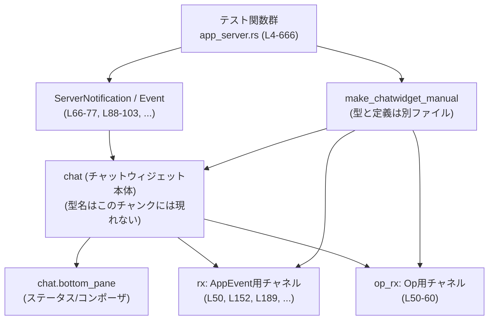
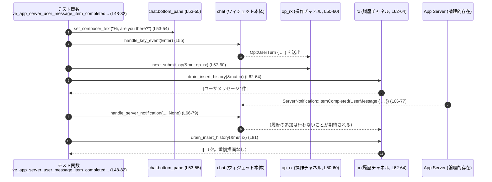

# tui/src/chatwidget/tests/app_server.rs コード解説

## 0. ざっくり一言

App Server からの各種通知（ターン開始／完了、エラー、ファイル変更、コマンド実行、コラボエージェント、スレッド名更新／クローズなど）を受け取ったときに、**チャットウィジェットがどう振る舞うべきか**をシナリオ別に検証する統合テスト群です。

---

## 1. このモジュールの役割

### 1.1 概要

- このテストモジュールは、チャットウィジェット（`chat`）が  
  - Codex 側のイベント (`handle_codex_event`)  
  - App Server 側の通知 (`handle_server_notification`)  
  を受け取ったときの **履歴レンダリング・状態管理・アプリイベント送出** の仕様を検証します。
- 具体的には次のようなケースを扱います：
  - ユーザメッセージ／エージェントメッセージの表示と重複防止
  - ターン開始・完了時の「Working」ステータスの更新
  - ファイルパッチ／コマンド実行／コラボエージェント呼び出しの履歴表示
  - エラー表示（失敗ターン、サーバ過負荷、ストリーム再接続）
  - スレッド名変更やスレッドクローズに伴う挙動

### 1.2 アーキテクチャ内での位置づけ

このファイルのテストは、テストハーネス経由でチャットウィジェットと App Server プロトコルを結びつける位置づけになっています。

- `make_chatwidget_manual` でチャットウィジェット本体と:
  - アプリイベントを受け取るチャネル `rx`
  - サーバに送る操作（`Op`）を受け取るチャネル `op_rx`
  を構築します（例: `live_app_server_user_message_item_completed_does_not_duplicate_rendered_prompt` 内, `L50-L60`）。

- テストは App Server から届く通知を模した `ServerNotification` / `Event` を手動で渡し、その結果として:
  - 履歴のレンダリング結果（`drain_insert_history`）
  - ボトムペインの状態（`bottom_pane.is_task_running()` など）
  - 送出された `AppEvent`（`rx.try_recv()`）
  を検証します。

アーキテクチャの概要を Mermaid で図示します（関係する関数名と行範囲を併記）:



### 1.3 設計上のポイント

このテストファイルから読み取れる設計上の特徴です。

- **シナリオ駆動のテスト設計**  
  各テスト関数が 1 つのユーザストーリー／エラーケースを表現しています（例: 重複表示防止 `L48-82`、ステータスクリア `L84-148` など）。

- **状態と表示の分離**
  - 内部状態は `chat` / `chat.bottom_pane` のフィールドやメソッドで検証（`is_task_running`, `status_widget` など, `L104-110`, `L146-147`）。
  - 表示は `drain_insert_history` と `lines_to_single_string` を通じて検証（`L35-40`, `L62-64` など）。

- **エラーハンドリングの明示的なテスト**
  - Turn エラー・サーバ過負荷・再接続中など、異常系を明示的にカバー（`L449-509`, `L568-607`, `L511-566`）。

- **ID ベースの整合性チェック**
  - `thread_id` / `turn_id` による一致・不一致で処理の有効性を分ける（スレッド名更新の無視・適用, `L610-628`, `L630-652`）。

- **非同期処理の逐次制御**
  - すべての非同期テストは `#[tokio::test]` で実行され、`await` によりイベントを順序通り適用しています（`L4`, `L48`, `L84` など）。

---

## 2. 主要な機能一覧

このファイルに「公開 API」はありませんが、テストとして検証している **チャットウィジェット + App Server 連携の振る舞い** を機能単位で整理します。

- コラボエージェント spawn 完了時のメタデータ表示（モデル名・推論強度）検証（`collab_spawn_end_shows_requested_model_and_effort`, `L4-46`）
- ユーザメッセージの `ItemCompleted` 通知で履歴が重複しないことの検証（`L48-82`）
- ターン完了で「Working」ステータスが解除されることの検証（`L84-148`）
- ターン開始時にフィードバック投稿用の `turn_id` が設定されることの検証（`L150-185`）
- ファイル変更アイテムでパッチ内容が履歴に反映されることの検証（`L187-215`）
- シェルラッパ付きコマンド実行結果の履歴表示からラッパが除去されることの検証（`L217-278`）
- App Server パッチ表現をコア用の `FileChange` マップに変換するヘルパの検証（`L280-297`）
- コラボエージェント Wait ツール呼び出しの履歴表示検証（`L299-384`）
- コラボエージェント Spawn ツール呼び出しの履歴表示検証（`L386-447`）
- 失敗ターンのエラー履歴が二重に表示されないことの検証（`L449-509`）
- ストリーム再接続後にタスクステータスが元に戻ることの検証（`L511-566`）
- サーバ過負荷エラーの際に警告メッセージを表示しタスクを停止することの検証（`L568-607`）
- 不正なスレッド ID のスレッド名更新通知が無視されることの検証（`L609-628`）
- 正常なスレッド名更新時に再開コマンドのヒントを表示することの検証（`L630-652`）
- スレッドクローズ通知で即時終了イベントが送られることの検証（`L654-666`）

---

## 3. 公開 API と詳細解説

### 3.1 型一覧（このテストが前提とする主な外部型）

このファイル内では型定義は行われていませんが、テストから見える主な外部型を整理します。

| 名前 | 種別 | 役割 / 用途 | 根拠 |
|------|------|-------------|------|
| `ThreadId` | 構造体（と推測） | スレッドを一意に識別する ID。`new()`・`from_string()` で生成される。 | `tui/src/chatwidget/tests/app_server.rs:L7-8`, `L302-307`, `L612-613`, `L633-634` |
| `Event`, `EventMsg` | 列挙体など | Codex 側のイベント（コラボエージェント spawn など）を表現。 | `L10-23` |
| `CollabAgentSpawnBeginEvent`, `CollabAgentSpawnEndEvent` | 構造体 | コラボエージェント生成処理の開始・終了イベント。モデル名や推論強度を含む。 | `L12-18`, `L22-31` |
| `ReasoningEffortConfig` | 列挙体 | 推論強度（例: `High`）の指定。 | `L17`, `L30`, `L406` |
| `AgentStatus` | 列挙体 | コラボエージェントの状態（`PendingInit` など）。 | `L31` |
| `ServerNotification` | 列挙体 | App Server からの各種通知（`TurnStarted`, `ItemCompleted`, `Error` など）を表現。 | `L66`, `L88`, `L111`, `L155`, `L191` ほか |
| `AppServerTurn`, `AppServerTurnStatus` | 構造体・列挙体 | App Server 上での 1 ターンの状態を表現（`InProgress`, `Completed`, `Failed`）。 | `L91-98`, `L133-140`, `L156-165`, `L457-464` |
| `ItemStartedNotification`, `ItemCompletedNotification` | 構造体 | ターン内のアイテム開始・完了通知。 | `L192-203`, `L67-77`, `L112-120`, `L225-241`, `L246-262` |
| `AppServerThreadItem` | 列挙体 | ターン内アイテムの種別（`UserMessage`, `AgentMessage`, `FileChange`, `CommandExecution`, `CollabAgentToolCall` など）。 | `L70-76`, `L115-120`, `L195-203`, `L228-241`, `L323-336`, `L345-373`, `L398-408`, `L417-433` |
| `AppServerUserInput` | 列挙体 | ユーザ入力の内容（`Text` など）。 | `L72-75` |
| `MessagePhase` | 列挙体 | エージェントメッセージのフェーズ（`FinalAnswer` など）。 | `L118` |
| `FileUpdateChange` | 構造体 | App Server から送られるファイル更新内容（パス・種別・diff）。 | `L197-201`, `L282-286` |
| `PatchChangeKind` | 列挙体 | ファイルパッチの種別（`Add` など）。 | `L199`, `L284` |
| `AppServerPatchApplyStatus` | 列挙体 | パッチ適用状態（`InProgress` など）。 | `L202` |
| `FileChange` | 列挙体 | コア側で扱うファイル変更（`Add { content }` など）。 | `L292-294` |
| `AppServerCommandExecutionStatus`, `AppServerCommandExecutionSource`, `AppServerCommandAction` | 列挙体 | コマンド実行アイテムの状態・起源・アクション表現。 | `L233-237`, `L255-258` |
| `AppServerCollabAgentTool`, `AppServerCollabAgentToolCallStatus` | 列挙体 | コラボエージェント用ツール（`Wait` や `SpawnAgent`）とその呼び出し状態。 | `L325-327`, `L400-402`, `L347-348`, `L419-420` |
| `AppServerCollabAgentState`, `AppServerCollabAgentStatus` | 構造体・列挙体 | コラボエージェントごとの状態（`Completed`, `Running`, `PendingInit` など）。 | `L357-372`, `L426-431` |
| `AppServerTurnError` | 構造体 | ターンエラーの内容（メッセージ、追加情報など）。 | `L471-475`, `L494-498`, `L591-595` |
| `CodexErrorInfo` | 列挙体か構造体 | Codex 側でのエラー種別（`ServerOverloaded`, `Other`など）。 | `L536`, `L593` |
| `AppEvent` | 列挙体 | UI からアプリ側に送られるイベント（`Exit`, `SubmitFeedback` など）。 | `L177-183`, `L665` |
| `ExitMode` | 列挙体 | 終了モード（`Immediate` など）。 | `L665` |

※ 型の正確な定義はこのファイルには現れません。上記はすべて「名前と利用のされ方」から読み取れる範囲の説明です。

### 3.2 関数詳細（代表 7 件）

#### `collab_spawn_end_shows_requested_model_and_effort()`

**概要**

Codex 側のコラボエージェント spawn 開始・終了イベントを `handle_codex_event` で渡したとき、履歴中に **エージェントのニックネーム・ロール・モデル名・推論強度** が含まれていることを確認するテストです（`L4-46`）。

**引数**

なし（`async fn` テスト関数）。

**戻り値**

- `()`（テストなので意味のある戻り値はありません）。

**内部処理の流れ**

1. `make_chatwidget_manual(None)` でチャットウィジェットと履歴チャネル `rx` を生成（`L6`）。
2. `ThreadId::new()` で sender / spawned スレッド ID を生成（`L7-8`）。
3. `CollabAgentSpawnBeginEvent` を含む `Event` を `handle_codex_event` に渡す（`L10-18`）。
4. 続いて `CollabAgentSpawnEndEvent` を渡し、ニックネームやロール、モデル名などを指定（`L20-33`）。
5. `drain_insert_history(&mut rx)` で履歴セル一覧を取得し、行単位の文字列に変換して結合（`L35-40`）。
6. 結果文字列に `"Spawned Robie [explorer] (gpt-5 high)"` が含まれることをアサート（`L42-45`）。

**Examples（使用例）**

このテストのパターンは、Codex 由来のイベントを UI に反映させるシナリオを表します。

```rust
// Codex イベントを UI に適用
chat.handle_codex_event(Event {
    id: "spawn-end".into(),
    msg: EventMsg::CollabAgentSpawnEnd(CollabAgentSpawnEndEvent {
        call_id: "call-spawn".to_string(),
        sender_thread_id,
        new_thread_id: Some(spawned_thread_id),
        new_agent_nickname: Some("Robie".to_string()),
        new_agent_role: Some("explorer".to_string()),
        prompt: "Explore the repo".to_string(),
        model: "gpt-5".to_string(),
        reasoning_effort: ReasoningEffortConfig::High,
        status: AgentStatus::PendingInit,
    }),
}); // L20-33 相当
```

**Errors / Panics**

- `drain_insert_history` や `lines_to_single_string` はこのファイルには定義がなく、エラー条件は不明です。
- 本テスト内で明示的に `panic!` を呼んでいる箇所はありません。

**Edge cases（エッジケース）**

- モデル名や推論強度が `None` の場合の挙動は、このテストからは分かりません（このケースは生成していない）。
- `new_agent_nickname`・`new_agent_role` が `None` の場合の表示も、このファイルには現れません。

**使用上の注意点**

- コラボエージェント spawn に関する UI 仕様を変更するときは、このテスト文言も更新が必要になります。
- 表示文字列のフォーマットを安易に変更するとスナップショットテストや `contains` ベースのテストが壊れる可能性があります。

---

#### `live_app_server_user_message_item_completed_does_not_duplicate_rendered_prompt()`

**概要**

ユーザがメッセージを送信した後に、App Server から同じ内容の `UserMessage` アイテムの `ItemCompleted` 通知が届いても、**履歴にメッセージが重複して表示されない**ことを検証します（`L48-82`）。

**引数**

なし。

**戻り値**

- `()`。

**内部処理の流れ**

1. チャットウィジェットと `rx`・`op_rx` を構築し、`chat.thread_id` をセット（`L50-52`）。
2. ボトムペインのコンポーザにテキスト `"Hi, are you there?"` を設定（`L53-55`）。
3. Enter キーイベントを送信し、送信をトリガー（`L55`）。
4. `next_submit_op(&mut op_rx)` で `Op::UserTurn` が送信されたことを確認（`L57-60`）。
5. `drain_insert_history(&mut rx)` で履歴に 1 セルだけが存在し、その中にメッセージ本文が含まれることを確認（`L62-64`）。
6. App Server から届いたことを想定した `ItemCompletedNotification` を `handle_server_notification` で適用（`L66-79`）。
7. 再度 `drain_insert_history` を呼び、以降の履歴追加がないことを確認（`L81`）。

**Examples（使用例）**

ユーザ送信フローとサーバ反映フローが二重にならないようにするためのテスト例として、そのまま参考になります。

```rust
// 送信操作をトリガー
chat.bottom_pane
    .set_composer_text("Hi, are you there?".to_string(), Vec::new(), Vec::new()); // L53-54
chat.handle_key_event(KeyEvent::new(KeyCode::Enter, KeyModifiers::NONE));         // L55

// サーバからの ItemCompleted 通知
chat.handle_server_notification(
    ServerNotification::ItemCompleted(ItemCompletedNotification {
        thread_id: "thread-1".to_string(),
        turn_id: "turn-1".to_string(),
        item: AppServerThreadItem::UserMessage { /* ... */ },
    }),
    None,
); // L66-79
```

**Errors / Panics**

- `next_submit_op` 内部の実装は不明ですが、想定と異なる `Op` が来た場合は `panic!` でテストを失敗させています（`L57-60`）。
- その他の操作はエラーを戻さない API を用いています。

**Edge cases**

- `thread_id` や `turn_id` が現在のスレッドと一致しない場合の挙動は、このテストではカバーしていません。
- サーバ側からの `UserMessage` が異なる内容だった場合の表示仕様も、このテストだけでは分かりません。

**使用上の注意点**

- UI 側でもサーバ側でも「ユーザメッセージの履歴エントリを生成する」処理があり得るため、「どちらが最初に書き込むか」「どちらを信頼するか」を決めておく必要があります。このテストは「UI 側で一度描画したものをサーバ通知で重複させない」という契約を前提にしています。

---

#### `live_app_server_turn_completed_clears_working_status_after_answer_item()`

**概要**

App Server のターンが開始されている間は「Working」ステータスが表示され、**最終回答アイテムを受け取ってもターンが `Completed` になるまでは「Working」が続き、その後に消える**ことを検証します（`L84-148`）。

**引数**

なし。

**戻り値**

- `()`。

**内部処理の流れ**

1. `TurnStarted` 通知を適用し、ターン `turn-1` を `InProgress` として開始（`L88-100`）。
2. `chat.bottom_pane.is_task_running()` が `true` であり、ステータスウィジェットのヘッダが `"Working"` であることを確認（`L104-110`）。
3. `ItemCompleted` 通知（`AgentMessage`、`phase: Some(MessagePhase::FinalAnswer)`）を適用し、回答テキストを履歴に描画（`L111-123`）。
4. この時点では `is_task_running()` がまだ `true` であることを確認（`L125-128`）。
5. 最後に `TurnCompleted` 通知（`status: Completed`）を適用し（`L130-143`）、タスクが停止しステータスウィジェットが非表示になることを確認（`L146-147`）。

**Examples（使用例）**

```rust
// ターン開始
chat.handle_server_notification(
    ServerNotification::TurnStarted(/* ... AppServerTurnStatus::InProgress ... */),
    None,
); // L88-101

// 最終回答アイテム
chat.handle_server_notification(
    ServerNotification::ItemCompleted(ItemCompletedNotification {
        item: AppServerThreadItem::AgentMessage {
            phase: Some(MessagePhase::FinalAnswer),
            /* ... */
        },
        /* ... */
    }),
    None,
); // L111-123

// ターン完了
chat.handle_server_notification(
    ServerNotification::TurnCompleted(TurnCompletedNotification {
        turn: AppServerTurn {
            status: AppServerTurnStatus::Completed,
            /* ... */
        },
        /* ... */
    }),
    None,
); // L130-143
```

**Errors / Panics**

- `status_widget().expect("status indicator should be visible")` が `None` を返した場合に panic します（`L105-108`）。

**Edge cases**

- `ItemCompleted` が `FinalAnswer` 以外のフェーズの場合にステータスがどう変化するかは、このテストでは分かりません。
- `TurnCompleted` の `status` が `Completed` 以外（`Failed` など）の場合の扱いは別テスト（`L449-509`）でカバーされています。

**使用上の注意点**

- UI で「処理中」の表示を消すタイミングは UX に直結します。このテストは「最終回答を受け取っても、ターン完了通知が来るまでは処理中を維持する」という仕様を前提にしている点に注意が必要です。

---

#### `live_app_server_command_execution_strips_shell_wrapper()`

**概要**

ユーザシェル由来のコマンド実行（`/bin/zsh -lc <script>` のようなラッパ付きコマンド）の履歴表示から、**シェルラッパ部分が適切に取り除かれる**ことをスナップショットで検証するテストです（`L217-278`）。

**引数**

なし。

**戻り値**

- `()`。

**内部処理の流れ**

1. `script` として `python3 -c 'print("Hello, world!")'` を用意（`L220`）。
2. `shlex::try_join(["/bin/zsh", "-lc", script])` によってシェルラッパ付きコマンド文字列 `command` を生成（`L221-222`）。
3. `ItemStarted` 通知で `CommandExecution` アイテム（`status: InProgress`）を送信（`L224-243`）。
4. 続いて `ItemCompleted` 通知（`status: Completed`, `aggregated_output: "Hello, world!\n"`）を適用（`L245-265`）。
5. `drain_insert_history` の結果が 1 セルのみであることを確認し（`L267-271`）、セル内容の文字列 `blob` を生成（`L273`）。
6. その文字列を `assert_chatwidget_snapshot!` でスナップショット比較（`L274-277`）。

**Examples（使用例）**

```rust
let script = r#"python3 -c 'print("Hello, world!")'"#; // L220
let command = shlex::try_join(["/bin/zsh", "-lc", script])?; // L221-222

chat.handle_server_notification(
    ServerNotification::ItemStarted(ItemStartedNotification {
        item: AppServerThreadItem::CommandExecution { command: command.clone(), /*...*/ },
        /* ... */
    }),
    None,
); // L224-243

chat.handle_server_notification(
    ServerNotification::ItemCompleted(ItemCompletedNotification {
        item: AppServerThreadItem::CommandExecution {
            command,
            aggregated_output: Some("Hello, world!\n".to_string()),
            /* ... */
        },
        /* ... */
    }),
    None,
); // L245-265
```

**Errors / Panics**

- `shlex::try_join` が失敗した場合は `expect("round-trippable shell wrapper")` により panic します（`L221-222`）。
- `cells.first().expect("command cell")` も履歴が空なら panic します（`L273`）。

**Edge cases**

- `AppServerCommandExecutionSource` が `UserShell` 以外のケースの挙動は、このテストからは読み取れません。
- 標準出力が巨大な場合やエラー出力のみの場合など、他の出力パターンはこのテストには現れません。

**使用上の注意点**

- シェルラッパの除去ロジックを変更した場合、スナップショット名 `"live_app_server_command_execution_strips_shell_wrapper"` に対応するスナップショットファイルの更新が必要になります。
- プラットフォームによってシェルコマンドの構造が変わる場合、テストが OS 固有にならないよう注意が必要です（ただし、その詳細はこのチャンクには現れません）。

---

#### `app_server_patch_changes_to_core_preserves_diffs()`

**概要**

App Server プロトコルの `FileUpdateChange` の配列を、コア側の `HashMap<PathBuf, FileChange>` に変換するヘルパ関数 `app_server_patch_changes_to_core` が、**diff 内容を改変せず保持する**ことを検証します（`L280-297`）。

**引数**

- テスト関数自体には引数はありませんが、`app_server_patch_changes_to_core` に対しては以下を渡します：
  - `Vec<FileUpdateChange>` — ここでは 1 要素（`path: "foo.txt"`, `kind: Add`, `diff: "hello\n"`）。

**戻り値**

- テスト関数の戻り値は `()`。
- `app_server_patch_changes_to_core` は `HashMap<PathBuf, FileChange>` を返します（`changes` 変数, `L282-286`, `L288-295`）。

**内部処理の流れ**

1. `FileUpdateChange` を 1 件含む `Vec` を生成（`L282-286`）。
2. `app_server_patch_changes_to_core` を呼び出し、変換結果を `changes` に格納（`L282-286`）。
3. 期待値として `HashMap::from([( PathBuf::from("foo.txt"), FileChange::Add { content: "hello\n".to_string() } )])` を組み立て、`assert_eq!` で比較（`L288-295`）。

**Examples（使用例）**

```rust
let changes = app_server_patch_changes_to_core(vec![FileUpdateChange {
    path: "foo.txt".to_string(),
    kind: PatchChangeKind::Add,
    diff: "hello\n".to_string(),
}]); // L282-286

assert_eq!(
    changes,
    HashMap::from([(
        PathBuf::from("foo.txt"),
        FileChange::Add { content: "hello\n".to_string() },
    )]) // L290-295
);
```

**Errors / Panics**

- `app_server_patch_changes_to_core` 自身のエラー条件はこのファイルには現れません（戻り値は `Result` ではなく直接 `HashMap` であるように見えます）。

**Edge cases**

- `PatchChangeKind::Add` 以外（例: `Modify`, `Delete`）の扱いはこのテストからは分かりません。
- 同じパスに複数の `FileUpdateChange` がある場合のマージ戦略も不明です。

**使用上の注意点**

- パッチの内容（特に `diff` 文字列）は、そのまま `FileChange::Add { content }` に入ることを前提としているため、変換時に改行やエンコードを変えるとテストが失敗します。

---

#### `live_app_server_collab_wait_items_render_history()`

**概要**

コラボエージェントの `Wait` ツール呼び出しが、**複数の受信スレッドの状態を含む履歴エントリ**としてレンダリングされることをスナップショットで検証します（`L299-384`）。

**引数**

なし。

**戻り値**

- `()`。

**内部処理の流れ**

1. 送信側・受信側 2 つの `ThreadId` を `from_string` で生成し（`L302-307`）、`chat.set_collab_agent_metadata` でニックネーム・ロールを登録（`L308-317`）。
2. `ItemStarted` 通知で `CollabAgentToolCall { tool: Wait, status: InProgress }` を適用（`L319-337`）。
3. 続いて `ItemCompleted` 通知で `agents_states` として:
   - 片方のエージェント: `status: Completed`, `message: Some("Done")`
   - もう片方: `status: Running`, `message: None`
   を渡す（`L341-373`）。
4. `drain_insert_history` の結果をすべて `lines_to_single_string` で変換し、改行区切りで連結（`L378-382`）。
5. 連結結果を `assert_chatwidget_snapshot!` で比較（`L383`）。

**Examples（使用例）**

```rust
chat.handle_server_notification(
    ServerNotification::ItemCompleted(ItemCompletedNotification {
        item: AppServerThreadItem::CollabAgentToolCall {
            tool: AppServerCollabAgentTool::Wait,
            agents_states: HashMap::from([
                (
                    receiver_thread_id.to_string(),
                    AppServerCollabAgentState {
                        status: AppServerCollabAgentStatus::Completed,
                        message: Some("Done".to_string()),
                    },
                ),
                (
                    other_receiver_thread_id.to_string(),
                    AppServerCollabAgentState {
                        status: AppServerCollabAgentStatus::Running,
                        message: None,
                    },
                ),
            ]),
            /* ... */
        },
        /* ... */
    }),
    None,
); // L341-373
```

**Errors / Panics**

- `ThreadId::from_string(...).expect("valid thread id")` は、ID 文字列フォーマットが不正な場合に panic します（`L302-307`）。
- スナップショット不整合時には `assert_chatwidget_snapshot!` でテストが失敗します（`L383`）。

**Edge cases**

- `agents_states` が空のときの表示仕様は、このテストからは不明です。
- 3 つ以上の受信スレッドがある場合の表示フォーマットも、このチャンクには現れません。

**使用上の注意点**

- コラボ機能の UI 表示を変更する場合、この Wait ツール用スナップショットや spawn 用スナップショット（`L443-446`）の更新が必要になります。

---

#### `live_app_server_failed_turn_does_not_duplicate_error_history()`

**概要**

App Server のターンが `Error` 通知を受けた後 `Failed` ステータスで `TurnCompleted` しても、**エラー履歴が二重に表示されない**こと、およびタスクステータスが停止することを検証します（`L449-509`）。

**引数**

なし。

**戻り値**

- `()`。

**内部処理の流れ**

1. `TurnStarted` 通知でターン `turn-1` を `InProgress` として開始（`L453-467`）。
2. `Error` 通知で `AppServerTurnError { message: "permission denied", ... }` を適用（`L469-480`）。
3. `drain_insert_history` の結果が 1 セルであり、その中に `"permission denied"` が含まれることを確認（`L483-485`）。
4. `TurnCompleted` 通知で同じエラーメッセージを含んだ `status: Failed` なターンを渡す（`L487-503`）。
5. その後の `drain_insert_history` が空であること（エラー履歴の二重表示がない）と、`is_task_running()` が `false` であることを確認（`L507-508`）。

**Examples（使用例）**

```rust
// エラー通知
chat.handle_server_notification(
    ServerNotification::Error(ErrorNotification {
        error: AppServerTurnError {
            message: "permission denied".to_string(),
            codex_error_info: None,
            additional_details: None,
        },
        will_retry: false,
        thread_id: "thread-1".to_string(),
        turn_id: "turn-1".to_string(),
    }),
    None,
); // L469-480

// 失敗ターン完了
chat.handle_server_notification(
    ServerNotification::TurnCompleted(TurnCompletedNotification {
        turn: AppServerTurn {
            status: AppServerTurnStatus::Failed,
            error: Some(AppServerTurnError { message: "permission denied".to_string(), /*...*/ }),
            /* ... */
        },
        /* ... */
    }),
    None,
); // L487-503
```

**Errors / Panics**

- 特に `expect` や明示的な `panic!` はありません。

**Edge cases**

- `will_retry: true` のエラーの場合の履歴表示仕様はこのテストからは分かりません（`will_retry: true` は別テスト `L532-545` で登場）。
- `TurnCompleted` に `error: None` だが `status: Failed` のような矛盾ケースの扱いは、このチャンクには現れません。

**使用上の注意点**

- エラー表示の責務を `Error` 通知と `TurnCompleted` のどちらが持つかを明確にしておく必要があります。このテストは「`Error` 通知で 1 回だけ履歴に書き、それを `TurnCompleted` で再度表示しない」という契約を前提にしています。

---

### 3.3 その他の関数（テスト）

全 15 個のテストのうち、上で詳述していないものを簡潔にまとめます。

| 関数名 | 役割（1 行） | 根拠 |
|--------|--------------|------|
| `live_app_server_turn_started_sets_feedback_turn_id` | `TurnStarted` 通知後に送信されたフィードバックイベントに `turn_id` が入ることを確認。 | `tui/src/chatwidget/tests/app_server.rs:L150-185` |
| `live_app_server_file_change_item_started_preserves_changes` | ファイル変更アイテム開始時に、対象ファイル（`foo.txt`）が履歴サマリに含まれることを確認。 | `L187-215` |
| `live_app_server_collab_spawn_completed_renders_requested_model_and_effort` | App Server 版のコラボエージェント Spawn ツール呼び出しが、モデル・推論強度を含めて履歴にレンダリングされることをスナップショットで確認。 | `L386-447` |
| `live_app_server_stream_recovery_restores_previous_status_header` | `will_retry: true` なエラーを挟んだ後、ストリーム復旧時にステータスヘッダが `"Working"` に戻ることを確認。 | `L511-566` |
| `live_app_server_server_overloaded_error_renders_warning` | サーバ過負荷エラー時に `"⚠ server overloaded\n"` の警告が表示され、タスクが停止することを確認。 | `L568-607` |
| `live_app_server_invalid_thread_name_update_is_ignored` | 現在の `thread_id` と異なる ID のスレッド名更新通知を無視し、ローカルの `thread_name` が変わらないことを確認。 | `L609-628` |
| `live_app_server_thread_name_update_shows_resume_hint` | 正しい `thread_id` に対するスレッド名更新通知で `thread_name` を更新し、履歴に再開コマンドのヒントを表示することを確認。 | `L630-652` |
| `live_app_server_thread_closed_requests_immediate_exit` | `ThreadClosed` 通知受信後に `AppEvent::Exit(ExitMode::Immediate)` が送られることを確認。 | `L654-666` |

---

## 4. データフロー

ここでは「ユーザメッセージの重複防止」テスト (`live_app_server_user_message_item_completed_does_not_duplicate_rendered_prompt`, `L48-82`) を例に、データフローを示します。

### 処理の要点

- ユーザ入力はボトムペインのコンポーザに設定され、Enter キー押下で送信されます。
- 送信により `Op::UserTurn` が `op_rx` チャネルで取得でき、同時に履歴にユーザメッセージが 1 つ描画されます。
- その後、App Server から「ユーザメッセージが完了した」ことを示す `ItemCompleted(UserMessage)` 通知が来ても、履歴には追加エントリを作らず、重複を防ぎます。

### シーケンス図



---

## 5. 使い方（How to Use）

このファイル自体はテスト用ですが、ここで用いられているパターンは「App Server 通知を UI に適用する」ための利用例にもなっています。

### 5.1 基本的な使用方法

1. **チャットウィジェットの初期化**

```rust
// テスト環境でチャットウィジェットとチャネルを構築する
let (mut chat, mut rx, mut op_rx) = make_chatwidget_manual(/*model_override*/ None).await; // L50, L86, L152 など
```

1. **サーバ通知の適用**

```rust
// ターン開始
chat.handle_server_notification(
    ServerNotification::TurnStarted(TurnStartedNotification {
        thread_id: "thread-1".to_string(),
        turn: AppServerTurn {
            id: "turn-1".to_string(),
            items: Vec::new(),
            status: AppServerTurnStatus::InProgress,
            error: None,
            started_at: Some(0),
            completed_at: None,
            duration_ms: None,
        },
    }),
    None,
); // L88-101
```

1. **履歴の取得と検査**

```rust
// UI 履歴の変化を収集
let cells = drain_insert_history(&mut rx); // L35, L62, L125 など
let rendered = cells
    .iter()
    .map(|lines| lines_to_single_string(lines))
    .collect::<Vec<_>>()
    .join("\n"); // L36-40

// 検証や表示に利用
println!("{rendered}");
```

### 5.2 よくある使用パターン

1. **ユーザ送信 + サーバ通知**

   - 送信側: `set_composer_text` + `handle_key_event(Enter)`（`L53-55`）
   - サーバ側: `ItemCompleted(UserMessage)` の `handle_server_notification` 呼び出し（`L66-79`）

2. **ステータス管理**

   - 「処理中」開始: `TurnStarted` 通知適用（`L88-101`, `L155-167`, `L516-528`, `L573-585`）
   - 「処理中」終了: `TurnCompleted`（`Completed` or `Failed`）通知適用（`L130-143`, `L487-503`）

3. **エラー処理**

   - 一度きりのエラー表示: `Error` 通知を受けて履歴にエラーメッセージを書き出し、`TurnCompleted` では重複を避けるパターン（`L469-485`, `L487-507`）。
   - 再接続エラー: `will_retry: true` の `Error` で一時的なステータスを表示し、後続の `AgentMessageDelta` で復元（`L532-545`, `L547-565`）。

### 5.3 よくある間違い

```rust
// 間違い例: サーバ通知を無条件に履歴に積んでしまい、重複表示を招く
// （このコードは実際には存在しませんが、L48-82 のテストから想定される誤用例です）
fn on_user_message_completed_always_append_history(chat: &mut Chat, msg: &str) {
    chat.append_history(msg); // 送信時と完了時の両方で追加してしまうイメージ
}

// 正しい例: 既に描画済みのユーザメッセージについては、ItemCompleted 通知では履歴を更新しない
// （L81: drain_insert_history が空であることを期待している）
```

### 5.4 使用上の注意点（まとめ）

- **ID 一致条件**
  - `ThreadNameUpdated` 等の通知は、現在の `thread_id` と一致する場合のみ状態を更新するべきであることが、`live_app_server_invalid_thread_name_update_is_ignored`（`L610-628`）から読み取れます。

- **エラー表示の一貫性**
  - エラーは `Error` 通知で 1 回だけ表示し、`TurnCompleted` 側では重複させない契約になっています（`L469-485`, `L487-507`）。

- **ステータスウィジェット**
  - `status_widget()` が `Some` のときのみヘッダや詳細を利用しており、非表示時には `None` になる前提です（`L105-110`, `L146-147`, `L559-565`）。

- **非同期前提**
  - すべての通知処理は `#[tokio::test]` 環境で `async` 関数から呼び出されています。実運用コードでも Tokio 等のランタイム上で動く前提で設計されていると考えられます（テストから読み取れる範囲）。

---

## 6. 変更の仕方（How to Modify）

### 6.1 新しい機能を追加する場合

このファイルに新しいテストを追加する流れの一例です。

1. **対象となる通知・イベントを決める**
   - 例: 新しい `AppServerThreadItem` のバリアントが追加された場合など。

2. **`make_chatwidget_manual` で環境を構築**
   - 既存テストと同様に `(chat, rx, op_rx)` を取得し、必要な初期状態（`thread_id`、`thread_name` など）をセットします（`L50-52`, `L612-614`）。

3. **通知シーケンスを構成**
   - `handle_server_notification` / `handle_codex_event` に渡す構造体を組み立て、シナリオ通りの順に呼び出します。

4. **履歴・状態・イベントの検証**
   - `drain_insert_history` や `rx.try_recv()`、`chat.bottom_pane.is_task_running()` などを利用し、期待される結果を `assert!` や `assert_eq!` で検証します。

### 6.2 既存の機能を変更する場合

- **影響範囲の確認**

  - コラボ関係の仕様変更 → `collab_spawn_*`・`collab_wait_*` 系テスト（`L4-46`, `L299-384`, `L386-447`）。
  - エラー表示やステータス変更 → `failed_turn_*`・`server_overloaded_*`・`stream_recovery_*` 系テスト（`L449-509`, `L568-607`, `L511-566`）。
  - スレッド名やスレッドクローズ → `live_app_server_invalid_thread_name_update_is_ignored`, `live_app_server_thread_name_update_shows_resume_hint`, `live_app_server_thread_closed_requests_immediate_exit`（`L609-666`）。

- **契約の保持**

  - 「重複表示しない」「エラーは 1 回だけ」「Working はターン完了まで残る」など、テストが明示している契約を理解した上で挙動を変える必要があります。

- **テストの更新**

  - UI 表示文字列の変更やスナップショットのフォーマット変更を行うと、`assert_chatwidget_snapshot!` や `contains` を使ったテストが失敗します。その場合は期待値・スナップショットの更新もセットで行う必要があります。

---

## 7. 関連ファイル

このテストと密接に関係するであろうファイル・モジュール（このチャンクから推測できる範囲）を列挙します。

| パス / モジュール | 役割 / 関係 |
|-------------------|------------|
| `tui/src/chatwidget/mod.rs` など | `make_chatwidget_manual`、`handle_server_notification`、`handle_codex_event`、`bottom_pane` などチャットウィジェット本体の実装を提供していると考えられます（具体的定義はこのチャンクには現れません）。 |
| `crate::app_event` | `AppEvent` 列挙体や `FeedbackCategory`、`ExitMode` など、UI からアプリへのイベント型を定義しています（`L170-183`, `L665`）。 |
| `codex_app_server_protocol` | App Server プロトコルの通知型（`AgentMessageDeltaNotification`, `ThreadNameUpdatedNotification` など）を定義しています（`L548-555`, `L617-621`, `L637-641`）。 |
| `tui/src/chatwidget/tests/common.rs` 等（推測） | `make_chatwidget_manual`, `drain_insert_history`, `lines_to_single_string`, `next_submit_op`, `assert_chatwidget_snapshot!` など、テスト用ユーティリティやマクロの定義が存在すると考えられます。 |

※ 上記の具体的なファイルパスや中身は、このチャンクには記載がないため詳細は不明です。「役割」は型名や関数名から推測した範囲にとどめています。
