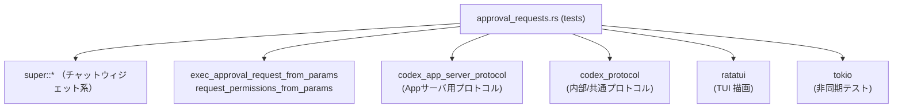
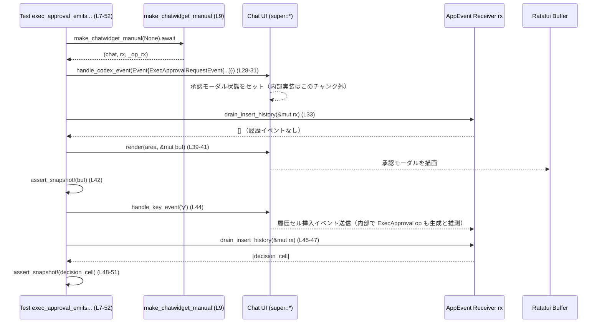

# tui\src\chatwidget\tests\approval_requests.rs コード解説

## 0. ざっくり一言

- チャットウィジェットの「コマンド実行承認（ExecApproval）」周りの挙動をテストするモジュールです。
- App サーバから渡される承認リクエストパラメータの変換と、TUI モーダル・履歴セル・送信されるスレッド操作（`Op::ExecApproval`）の振る舞いを検証しています。

---

## 1. このモジュールの役割

### 1.1 概要

- このモジュールは **コマンド実行の承認フロー** が期待通りに動くかを確認するためのテスト群を提供します。
- 具体的には、以下を検証しています（いずれもテストコードから読み取れる契約に基づきます）:
  - Exec 承認リクエストが **モーダルで表示され、ユーザが決定するまで履歴にセルを出さない** こと  
    （`exec_approval_emits_proposed_command_and_decision_history` など  
    `tui\src\chatwidget\tests\approval_requests.rs:L7-52, L221-310`）
  - App サーバ側のパラメータ型から、内部プロトコル型への **コマンド・ネットワーク・ファイルシステム権限の変換が正しく行われる** こと  
    （`tui\src\chatwidget\tests\approval_requests.rs:L54-85, L87-177`）
  - Exec 承認オペレーションが **`approval_id` を優先して使う** こと  
    （`tui\src\chatwidget\tests\approval_requests.rs:L179-219`）

### 1.2 アーキテクチャ内での位置づけ

このモジュール自体は「テスト用モジュール」であり、本体ロジックはすべて `super::*`（親モジュール）や外部クレートにあります。

主な依存関係は次の通りです（テストコードから読み取れる範囲）:



- `super::*` からは少なくとも以下が提供されていることがわかります:
  - `make_chatwidget_manual`（テスト用チャットウィジェット生成）  
    `tui\src\chatwidget\tests\approval_requests.rs:L9, L181, L223`
  - `drain_insert_history`, `lines_to_single_string`（イベントチャネルから履歴セルを取り出すヘルパ）  
    `tui\src\chatwidget\tests\approval_requests.rs:L33, L45, L245, L271, L298, L304`
  - `Event`, `EventMsg::ExecApprovalRequest`, `AppEvent`, `Op::ExecApproval`
- `codex_app_server_protocol` 型から `codex_protocol` 型への変換を  
  `exec_approval_request_from_params`, `request_permissions_from_params` が担っていることが  
  テストから分かります（`tui\src\chatwidget\tests\approval_requests.rs:L58-75, L93-119, L149-163`）。

### 1.3 設計上のポイント

テストコードから読み取れる特徴をまとめます。

- **モジュール分割**
  - コメントに「メインの chatwidget テストファイルを blob サイズ制限以下に保つために抽出」とあり、  
    approval 関連テストだけをこのファイルに切り出しています  
    （`//!` コメント `tui\src\chatwidget\tests\approval_requests.rs:L1-2`）。
- **UI とビジネスロジックの両面をテスト**
  - ratatui の `Buffer` をスナップショット検証して、モーダルの描画内容を確認  
    （`assert_snapshot!` `tui\src\chatwidget\tests\approval_requests.rs:L42, L48-51, L274-277, L307-309`）。
  - 同時に、`AppEvent::SubmitThreadOp { op: Op::ExecApproval { .. } }` が送出されることも検証  
    （`tui\src\chatwidget\tests\approval_requests.rs:L205-218`）。
- **承認リクエストの安全な表示**
  - 複数行コマンドや非常に長いコマンドは、履歴にそのまま出さず、モーダル表示・履歴の両方で  
    **先頭行／短縮版が使われる** ことをスナップショットで確認しています  
    （`tui\src\chatwidget\tests\approval_requests.rs:L225-268, L279-309`）。
- **非同期・チャネル利用**
  - テストは `#[tokio::test]` で非同期に実行され、`make_chatwidget_manual` から返るチャネル (`rx`) で  
    UI から送出される `AppEvent` を受信しています  
    （`tui\src\chatwidget\tests\approval_requests.rs:L7-9, L179-181, L221-223`）。

### 1.4 コンポーネントインベントリー（このチャンク）

#### このファイルで定義される関数（テスト）

| 関数名 | 種別 | 非同期 | 役割 / テスト対象 | 行範囲 |
|--------|------|--------|------------------|--------|
| `exec_approval_emits_proposed_command_and_decision_history` | テスト | はい (`#[tokio::test]`) | Exec 承認リクエスト受信時のモーダル表示と、承認決定後の履歴セル出力を検証 | L7-52 |
| `app_server_exec_approval_request_splits_shell_wrapped_command` | テスト | いいえ | shell ラッパー文字列を `Vec<String>` に分割する変換関数の挙動を検証 | L54-85 |
| `app_server_exec_approval_request_preserves_permissions_context` | テスト | いいえ | Exec 承認変換でネットワーク・ファイルシステム権限が保持されることを検証 | L87-140 |
| `app_server_request_permissions_preserves_file_system_permissions` | テスト | いいえ | Permissions リクエスト変換でファイルシステム権限が保持されることを検証 | L142-177 |
| `exec_approval_uses_approval_id_when_present` | テスト | はい (`#[tokio::test]`) | Exec 承認オペレーションが `approval_id` を ID として用いることを検証 | L179-219 |
| `exec_approval_decision_truncates_multiline_and_long_commands` | テスト | はい (`#[tokio::test]`) | 複数行/長大コマンドのモーダル表示および履歴の短縮表示を検証 | L221-310 |

#### このファイルから呼び出される主な外部関数・メソッド

| 名前 | 種別 | 役割 / 用途 | 行範囲 |
|------|------|-------------|--------|
| `make_chatwidget_manual` | 関数（親モジュール） | テスト用 Chat ウィジェットと `AppEvent` 受信用チャネルを生成 | L9, L181, L223 |
| `chat.handle_codex_event` | メソッド | Codex イベント（ここでは `ExecApprovalRequestEvent`）を UI に渡す | L28-31, L183-201, L241-244, L294-297 |
| `chat.render` | メソッド | ratatui バッファに現在の UI（モーダルなど）を描画 | L41, L253 |
| `chat.handle_key_event` | メソッド | キーボード入力（承認/拒否）を処理 | L44, L203, L270, L303 |
| `drain_insert_history` | 関数（ヘルパ） | `rx` から履歴関連のイベントをすべて読み出し、セルのリストとして返す | L33, L45-47, L245, L271-273, L298, L304-306 |
| `lines_to_single_string` | 関数（ヘルパ） | 履歴セルをスナップショット比較用の単一文字列に変換 | L50, L276, L309 |
| `exec_approval_request_from_params` | 関数 | App サーバの Exec 承認パラメータを内部リクエスト型に変換 | L58-75, L93-119 |
| `request_permissions_from_params` | 関数 | App サーバの Permissions 承認パラメータを内部リクエスト型に変換 | L149-163 |
| `test_path_display` | 関数（テストユーティリティ） | テスト用のパス表現を文字列に変換 | L89-92, L144-147 |

※ これらの関数・メソッドの定義はこのチャンクには含まれていません。

---

## 2. 主要な機能一覧（テストが検証すること）

- Exec 承認リクエストのモーダル表示と履歴セル:
  - `exec_approval_emits_proposed_command_and_decision_history`  
    短い 1 行コマンドの承認要求が、**モーダルで表示され、承認 (`'y'`) 後にのみ履歴セルが追加されること**を確認  
    `tui\src\chatwidget\tests\approval_requests.rs:L7-52`
- shell ラッパーコマンドの分解:
  - `app_server_exec_approval_request_splits_shell_wrapped_command`  
    `/bin/zsh -lc <script>` のようなコマンド文字列が `["/bin/zsh", "-lc", script]` に分割されることを確認  
    `tui\src\chatwidget\tests\approval_requests.rs:L54-85`
- Exec 承認リクエストへの権限コンテキストの移送:
  - `app_server_exec_approval_request_preserves_permissions_context`  
    App サーバ側の Network + FileSystem 権限が、内部プロトコル側にそのままコピーされることを確認  
    `tui\src\chatwidget\tests\approval_requests.rs:L87-140`
- Permissions リクエストへのファイルシステム権限の移送:
  - `app_server_request_permissions_preserves_file_system_permissions`  
    Permissions 承認リクエスト変換で、read/write パスが保持されることを確認  
    `tui\src\chatwidget\tests\approval_requests.rs:L142-177`
- Exec 承認 ID の決定ロジック:
  - `exec_approval_uses_approval_id_when_present`  
    Exec 承認オペレーション送信時に、`approval_id` が存在すればそれが `Op::ExecApproval { id, .. }` の `id` に使われることを確認  
    `tui\src\chatwidget\tests\approval_requests.rs:L179-219`
- 複数行・長大コマンドの短縮表示:
  - `exec_approval_decision_truncates_multiline_and_long_commands`  
    複数行・長大なコマンドは、モーダルでは少なくとも先頭行が表示され、履歴の決定セルは短縮版で表示されることをスナップショットで確認  
    `tui\src\chatwidget\tests\approval_requests.rs:L221-310`

---

## 3. 公開 API と詳細解説

このファイル自体はテストモジュールであり、外部に再利用される API は定義していません。  
ここでは「テストによって契約が確認されている外部 API」と「それを検証する代表的なテスト関数」を組み合わせて解説します。

### 3.1 型一覧（このファイルから見える範囲）

このファイル内で新たに定義される型はありませんが、利用している型から読み取れる役割をまとめます。

| 名前 | 種別 | 役割 / 用途 | 根拠 |
|------|------|-------------|------|
| `ExecApprovalRequestEvent` | 構造体（外部） | コマンド実行の承認を UI に依頼するイベント。`call_id`, `approval_id`, `turn_id`, `command`, `cwd`, `reason` などのフィールドを持つ | フィールド初期化 `tui\src\chatwidget\tests\approval_requests.rs:L12-27, L185-200, L225-239, L280-292` |
| `Event` | 構造体（外部） | Codex 側からチャットウィジェットに渡されるイベントラッパ。`id` と `msg` を持つ | `Event { id: ..., msg: EventMsg::ExecApprovalRequest(ev) }` `tui\src\chatwidget\tests\approval_requests.rs:L28-31, L183-201, L241-244, L294-297` |
| `EventMsg::ExecApprovalRequest` | 列挙体のバリアント（外部） | Exec 承認リクエストを表すメッセージ種別 | 同上 |
| `AppEvent::SubmitThreadOp` | 列挙体のバリアント（外部） | チャットウィジェットからアプリケーション側へ送るスレッド操作（`Op`）を表す | パターンマッチ `tui\src\chatwidget\tests\approval_requests.rs:L207-210` |
| `Op::ExecApproval` | 列挙体のバリアント（外部） | Exec 承認オペレーション。`id`, `decision` などのフィールドを持つ | 同上 |
| `AppServerCommandExecutionRequestApprovalParams` | 構造体（外部） | App サーバ側で Exec 承認に使われるパラメータ型 | 初期化 `tui\src\chatwidget\tests\approval_requests.rs:L58-75, L93-119` |
| `AppServerPermissionsRequestApprovalParams` | 構造体（外部） | App サーバ側で Permissions 承認に使われるパラメータ型 | 初期化 `tui\src\chatwidget\tests\approval_requests.rs:L149-163` |
| `AbsolutePathBuf` | 構造体（外部） | 絶対パスであることを型レベルで表す `PathBuf` ラッパと推測されますが、詳細定義はこのチャンクにはありません | 変換 `AbsolutePathBuf::try_from(PathBuf::from(...))` `tui\src\chatwidget\tests\approval_requests.rs:L89-92, L91-92, L144-147` |

※ 「推測」と書いた箇所は、型名と使われ方から考えられる一般的な意味を述べており、厳密な定義はこのチャンクからは分かりません。

### 3.2 重要な関数の詳細

ここでは、このファイルが主に検証している機能に関係する関数・テストを 5 件取り上げます。

---

#### `exec_approval_emits_proposed_command_and_decision_history()`

**概要**

- 短い単一行コマンドに対する Exec 承認リクエストが、  
  1) モーダルに表示され、  
  2) ユーザが承認した後にのみ履歴セルとして出力される  
  という挙動を確認する非同期テストです  
  （`tui\src\chatwidget\tests\approval_requests.rs:L7-52`）。

**引数**

- 引数なし（テスト関数として定義）。

**戻り値**

- 戻り値なし（`()`）。失敗時は `assert!` / `assert_snapshot!` でパニックします。

**内部処理の流れ**

1. `make_chatwidget_manual(None).await` でチャットウィジェットと受信用チャネル `rx` を構築  
   （`tui\src\chatwidget\tests\approval_requests.rs:L9`）。
2. `ExecApprovalRequestEvent` を構築し、`chat.handle_codex_event(Event { ... })` で渡す  
   （L12-31）。
3. `drain_insert_history(&mut rx)` で履歴セルを読み出し、**まだ何も出ていない** ことを確認  
   （L33-37）。
4. `Rect` と ratatui `Buffer` を用意し、`chat.render(area, &mut buf)` でモーダルを描画  
   （L39-41）。`assert_snapshot!` で描画結果をスナップショット比較  
   （L42）。
5. `chat.handle_key_event` に `'y'` を送って承認決定を行う  
   （L44）。
6. 再度 `drain_insert_history(&mut rx)` を呼び、1 件の履歴セルが来ていることを確認し、  
   その内容をスナップショット比較  
   （L45-51）。

**Examples（使用例 / パターン）**

テスト関数から抽出した最小パターンです。

```rust
#[tokio::test]
async fn example_exec_approval_short_command() {
    let (mut chat, mut rx, _op_rx) = make_chatwidget_manual(None).await;

    // 承認リクエストイベントを送信
    chat.handle_codex_event(Event {
        id: "sub-short".into(),
        msg: EventMsg::ExecApprovalRequest(ExecApprovalRequestEvent {
            call_id: "call-short".into(),
            approval_id: Some("call-short".into()),
            turn_id: "turn-short".into(),
            command: vec!["bash".into(), "-lc".into(), "echo hello world".into()],
            cwd: std::env::current_dir().unwrap_or_else(|_| PathBuf::from(".")),
            reason: None,
            network_approval_context: None,
            proposed_execpolicy_amendment: None,
            proposed_network_policy_amendments: None,
            additional_permissions: None,
            available_decisions: None,
            parsed_cmd: vec![],
        }),
    });

    // まだ履歴には何も出ていないことを確認
    assert!(drain_insert_history(&mut rx).is_empty());

    // ユーザが 'y' を押したと仮定
    chat.handle_key_event(KeyEvent::new(KeyCode::Char('y'), KeyModifiers::NONE));

    // 履歴に決定セルが 1 つ追加されている
    let decision_cell = drain_insert_history(&mut rx).pop().unwrap();
    println!("{}", lines_to_single_string(&decision_cell));
}
```

**Errors / Panics**

- `std::env::current_dir().unwrap_or_else(|_| PathBuf::from("."))` により、  
  カレントディレクトリ取得失敗時もパニックは起こりません（ `"."` にフォールバック）  
  （L17）。
- スナップショットが不一致の場合や履歴セルが見つからない場合は  
  `assert!` / `assert_snapshot!` / `expect` によりパニックします（L33-37, L42, L47-51）。

**Edge cases（エッジケース）**

- このテスト自体は「短い単一行コマンド」のケースのみを扱います。  
  複数行・長大コマンドは別テストで扱われます（後述）。
- `available_decisions: None`, `parsed_cmd: vec![]` など、補助フィールドが空の場合でも  
  正常にモーダル表示・履歴反映されることが前提になっています（L24-26）。

**使用上の注意点**

- `handle_codex_event` 呼び出し直後に `drain_insert_history` を行うことで、  
  「承認前には履歴に出さない」という契約を明示的にテストしています。  
  別のテストを書く際も、同様に **イベント送信 → チャネル drain** の順で挙動を確認すると  
  コントラクトを把握しやすくなります。

---

#### `app_server_exec_approval_request_splits_shell_wrapped_command()`

**概要**

- App サーバ側で `/bin/zsh -lc <script>` のように shell ラッパされたコマンド文字列が、  
  Exec 承認リクエスト変換関数 `exec_approval_request_from_params` によって  
  **元の引数ベクタに分割される** ことを検証するテストです  
  （L54-85）。

**引数**

- 引数なし（テスト関数）。

**戻り値**

- 戻り値なし（`()`）。失敗時は `assert_eq!` でパニック。

**内部処理の流れ**

1. `script` に `python3 -c 'print("Hello, world!")'` を設定（L56）。
2. `AppServerCommandExecutionRequestApprovalParams` の `command` フィールドに、  
   `shlex::try_join(["/bin/zsh", "-lc", script])` の結果を `Some(String)` として格納  
   （L58-68）。
3. そのパラメータを `exec_approval_request_from_params` に渡し、`request` を得る（L57-75）。
4. `request.command` が `vec!["/bin/zsh", "-lc", script]` であることを `assert_eq!` で確認  
   （L77-84）。

**このテストから読み取れる変換関数の契約**

- `exec_approval_request_from_params` は次のような振る舞いを持つと読み取れます:
  - 入力: `command: Some(String)` に `shlex::try_join` で生成した shell コマンド文字列が入る。
  - 出力: 戻り値の `command` フィールドは `Vec<String>` であり、  
    shell コマンド文字列を **再度トークナイズ** した結果になっている  
    （L77-84 の比較から）。

**Errors / Panics（テスト側）**

- `shlex::try_join([...]).expect("round-trippable shell wrapper")` によって、  
  join に失敗した場合はテストがパニックします（L66-67）。
- `assert_eq!` による不一致もパニックの原因となります（L77-84）。

**使用上の注意点**

- このテストは「`shlex::try_join` で生成したものは分解できる」という前提で書かれています。  
  任意のコマンド文字列に対する `exec_approval_request_from_params` の挙動は、  
  このチャンクだけからは分かりません。

---

#### `app_server_exec_approval_request_preserves_permissions_context()`

**概要**

- Exec 承認リクエスト変換関数 `exec_approval_request_from_params` が、  
  App サーバ側のネットワーク承認コンテキストと追加権限（特にファイルシステム read/write）が、  
  内部プロトコル側に正しくコピーされることを検証するテストです  
  （L87-140）。

**内部処理の流れ（テスト視点）**

1. `AbsolutePathBuf::try_from(PathBuf::from(test_path_display(...)))` で read/write 用の絶対パスを生成  
   （L89-92）。
2. `AppServerCommandExecutionRequestApprovalParams` を組み立て:
   - `network_approval_context` に App サーバプロトコル版 `NetworkApprovalContext` を設定  
     （L100-103）。
   - `additional_permissions` に `AppServerAdditionalPermissionProfile` を設定。  
     内部に `AppServerAdditionalNetworkPermissions` と  
     `AppServerAdditionalFileSystemPermissions { read: [read_path], write: [write_path] }` を持つ  
     （L107-115）。
3. `exec_approval_request_from_params` に渡して `request` を取得（L93-119）。
4. `request.network_approval_context` が codex プロトコル版 `NetworkApprovalContext` と一致することを検証  
   （L121-127）。
5. `request.additional_permissions` が `PermissionProfile` として期待値と一致することを検証  
   （L128-139）。

**このテストから読み取れる契約**

- `network_approval_context`:
  - App サーバプロトコルの `NetworkApprovalContext` → codex プロトコルの同名型に変換される  
    （ホストとプロトコル種別がそのまま保持される）L100-103, L121-127。
- `additional_permissions`:
  - App サーバ側の `AppServerAdditionalPermissionProfile` → 内部の `PermissionProfile` に変換される。
  - `network.enabled` フラグ、および file_system の read/write `AbsolutePathBuf` のリストが  
    そのまま保持される（L107-115, L129-139）。

**Errors / Panics（テスト側）**

- `AbsolutePathBuf::try_from(...).expect("absolute ... path")` による絶対パス変換失敗時のパニック  
  （L89-92）。
- `assert_eq!` による一致検証失敗時のパニック（L121-139）。

**使用上の注意点**

- このテストがカバーしているのは **`Some(...)` が設定されているケース** のみです。  
  フィールドが `None` の場合の変換挙動は、このチャンクには現れません。

---

#### `exec_approval_uses_approval_id_when_present()`

**概要**

- Exec 承認オペレーション送信時に、`approval_id` が存在する場合はそれが  
  `Op::ExecApproval { id, .. }` の `id` として使われることを検証する非同期テストです  
  （L179-219）。

**内部処理の流れ**

1. `make_chatwidget_manual` でチャットウィジェットと `rx` を取得（L181）。
2. `ExecApprovalRequestEvent` に `call_id = "call-parent"`, `approval_id = Some("approval-subcommand")` を設定し、  
   `chat.handle_codex_event` で渡す（L183-201）。
3. `chat.handle_key_event('y')` で承認操作を行う（L203）。
4. `while let Ok(app_ev) = rx.try_recv()` ループで `AppEvent` をポーリングし、  
   `AppEvent::SubmitThreadOp { op: Op::ExecApproval { id, decision, .. }, .. }` を探す（L205-210）。
5. 見つかった場合、`id == "approval-subcommand"` と  
   `decision` が `ReviewDecision::Approved` であることを検証し、`found = true` にする（L212-215）。
6. 最終的に `assert!(found, "expected ExecApproval op to be sent")` で  
   必ず Exec 承認オペレーションが送られたことを確認（L218）。

**このテストから読み取れる契約**

- `ExecApprovalRequestEvent` に `approval_id: Some(...)` が設定されている場合、  
  `chat.handle_key_event('y')` で承認すると、  
  `AppEvent::SubmitThreadOp` → `Op::ExecApproval { id, decision, .. }` が送出され、  
  その `id` は `approval_id` の値になる（L186-188, L207-213）。
- `decision` は `codex_protocol::protocol::ReviewDecision::Approved` になる（L213）。

**Errors / Panics（テスト側）**

- `rx.try_recv()` は `Err` のときにループを抜けるのみで、パニックはしません（L205-217）。
- 期待する `AppEvent` が見つからない場合は `assert!(found, ...)` でパニックします（L218）。

**使用上の注意点**

- `approval_id` が `None` のケースでどの ID が使われるか（おそらく `call_id`）は、  
  このチャンクではテストされていません。  
  その挙動が重要であれば、追加のテストが必要です。

---

#### `exec_approval_decision_truncates_multiline_and_long_commands()`

**概要**

- Exec 承認決定に伴って生成される履歴セルが、複数行コマンドや長大なコマンド文字列を  
  **短縮して表示する** ことを、モーダル描画およびスナップショットで検証する非同期テストです  
  （L221-310）。

**内部処理の流れ（マルチライン部分）**

1. `make_chatwidget_manual` でチャットウィジェットを構築（L223）。
2. `command` に `"echo line1\necho line2"` を含む `ExecApprovalRequestEvent` を送信（L225-244）。
3. `drain_insert_history(&mut rx)` が空であることを確認し、承認前に履歴セルが出ないことを検証（L245-249）。
4. `chat.render` によりモーダルを描画し、Buffer 全体を走査して `"echo line1"` が含まれる行を探す（L251-263）。
5. `"echo line1"` が見つかったこと（先頭行が表示されていること）を `assert!` で検証（L265-268）。
6. `chat.handle_key_event('n')` で拒否操作を行い、`drain_insert_history` の結果から 1 件の履歴セルを取得し、  
   スナップショット比較を行う（L270-277）。

**内部処理の流れ（長大コマンド部分）**

1. `long = format!("echo {}", "a".repeat(200));` で長いコマンド文字列を生成（L279）。
2. それを含む `ExecApprovalRequestEvent` を送信し、承認前に履歴セルが出ないことを確認（L280-302）。
3. `chat.handle_key_event('n')` で拒否操作を行い、履歴セルを取得してスナップショット比較（L303-309）。

**このテストから読み取れる契約**

- 複数行コマンド:
  - モーダルには **少なくとも 1 行目 `"echo line1"`** が表示される（L255-263）。
  - 履歴セルはスナップショットで検証されており、  
    中身は「短縮版」であることが想定されますが、具体的な短縮ルールは  
    スナップショットファイル側にあり、このチャンクだけからは断定できません。
- 長大コマンド:
  - 履歴セルは `long` の全体ではなく、短縮された形で表示されることが  
    スナップショットにより検証されていると解釈できます（L279-309）。

**Errors / Panics（テスト側）**

- Buffer 走査中の `buf[(x, y)].symbol().chars().next().unwrap_or(' ')` は、  
  `symbol()` から得られる文字列が空でも `unwrap_or(' ')` によってパニックしません（L257-259）。
- 先頭行が見つからなかった場合、`assert!(saw_first_line, ...)` でパニック（L265-268）。
- スナップショット不一致でもパニックです（L274-277, L307-309）。

**使用上の注意点**

- テストは UI の一部を **文字列検索（`row.contains("echo line1")`）で確認** しています（L260）。  
  新たなテストを追加する場合も、同様に「UI に特定のキーワードが含まれているか」を見る方法は  
  実装に強く依存し過ぎない検証手段になります。

---

### 3.3 その他の関数

このファイルでは、上記以外に補助的なテスト関数は定義されていません。

外部のヘルパ関数（`drain_insert_history`, `lines_to_single_string` など）は、  
前述のコンポーネントインベントリーに一覧として記載済みです。

---

## 4. データフロー

ここでは、最初のテスト  
`exec_approval_emits_proposed_command_and_decision_history`（L7-52）を例に、  
Exec 承認リクエストから履歴セル生成までのデータフローを示します。

### 4.1 処理の要点（テスト視点）

1. テストは `make_chatwidget_manual` でチャットウィジェットと `AppEvent` 受信用チャネル `rx` を取得します（L9）。
2. `ExecApprovalRequestEvent` を `EventMsg::ExecApprovalRequest` として `chat.handle_codex_event` に渡すと、  
   チャットウィジェット内部で **承認モーダル表示用の状態** がセットされます（L12-31）。
3. 即座に `drain_insert_history(&mut rx)` を実行しても、履歴関連イベントは何も流れてきません（L33-37）。
4. `chat.render` により ratatui バッファにモーダル UI が描画され、それをスナップショットで確認します（L39-42）。
5. `chat.handle_key_event('y')` によりユーザの承認操作をシミュレートすると、  
   チャットウィジェットは `AppEvent::SubmitThreadOp { op: Op::ExecApproval { .. } }` とともに  
   履歴セル挿入イベントを `rx` に送信し、`drain_insert_history(&mut rx)` 経由で取得されます（L44-51）。

### 4.2 シーケンス図



※ Chat UI 内部（`C-->>C`）の詳細なロジックはこのチャンクには現れず、不明です。

---

## 5. 使い方（How to Use）

このモジュールはテスト専用ですが、「承認系の新しい挙動をテストする」際のパターンとして有用です。

### 5.1 基本的な使用方法（新しい Exec 承認テストを追加する例）

Exec 承認に関する別のシナリオ（例えば新しいフィールドを追加した場合）をテストする基本形は、次のようになります。

```rust
#[tokio::test]
async fn my_new_exec_approval_scenario() {
    // 1. テスト用チャットウィジェットとイベント受信チャネルを用意
    let (mut chat, mut rx, _op_rx) = make_chatwidget_manual(None).await;

    // 2. Exec 承認リクエストイベントを構築して送信
    chat.handle_codex_event(Event {
        id: "sub-test".into(),
        msg: EventMsg::ExecApprovalRequest(ExecApprovalRequestEvent {
            call_id: "call-test".into(),
            approval_id: Some("approval-test".into()),
            turn_id: "turn-test".into(),
            command: vec!["bash".into(), "-lc".into(), "echo test".into()],
            cwd: std::env::current_dir().unwrap_or_else(|_| PathBuf::from(".")),
            reason: Some("test".into()),
            network_approval_context: None,
            proposed_execpolicy_amendment: None,
            proposed_network_policy_amendments: None,
            additional_permissions: None,
            available_decisions: None,
            parsed_cmd: vec![],
        }),
    });

    // 3. 必要なら承認前の状態を確認（履歴が空であることなど）
    assert!(drain_insert_history(&mut rx).is_empty());

    // 4. キーイベントでユーザの決定をシミュレート
    chat.handle_key_event(KeyEvent::new(KeyCode::Char('y'), KeyModifiers::NONE));

    // 5. 出力された履歴セルや AppEvent を検証
    let decision_cell = drain_insert_history(&mut rx).pop().unwrap();
    println!("{}", lines_to_single_string(&decision_cell));
}
```

### 5.2 よくある使用パターン

- **パラメータ変換の検証**
  - `exec_approval_request_from_params` / `request_permissions_from_params` に対して、  
    入力パラメータ構造体を組み立て、戻り値のフィールドを `assert_eq!` で検証するパターン  
    （L54-85, L87-140, L142-177）。
- **UI モーダルの検証**
  - `chat.render` でバッファを描画し、`assert_snapshot!` でスナップショット比較するパターン  
    （L39-42, L251-253, L274-277, L307-309）。
- **AppEvent の検証**
  - `rx.try_recv()` で `AppEvent::SubmitThreadOp` をポーリングし、`Op` の内容を検証するパターン  
    （L205-217）。

### 5.3 よくある誤用の可能性と正しいパターン

このチャンクから推測できる「間違えやすい点」と、その正しい扱い方です。

```rust
// 誤りの可能性: 承認前に履歴セルが出ることを前提にしてしまう
// （本モジュールのテストは、承認前は履歴に何も出ないことを期待している）
chat.handle_codex_event(...);
let cells = drain_insert_history(&mut rx);
// cells が空であることを期待するのが正しい（L33-37, L245-249）

// 正しいパターン: ユーザの決定（'y' or 'n'）後に履歴セルを検証
chat.handle_key_event(KeyEvent::new(KeyCode::Char('y'), KeyModifiers::NONE));
let cells = drain_insert_history(&mut rx);
assert!(!cells.is_empty());
```

### 5.4 使用上の注意点（まとめ）

- **非同期コンテキスト**
  - `make_chatwidget_manual` の呼び出しや `tokio::test` マクロにより、  
    テストは tokio ランタイム上で動きます（L7-9, L179-181, L221-223）。  
    非同期テストを追加する際は `#[tokio::test]` を付ける必要があります。
- **チャネルの drain**
  - `rx` は `AppEvent` を運ぶチャネルであり、`drain_insert_history` はその中から  
    履歴関連のイベントを抜き出すヘルパと考えられます（L33, L45, L245, L271, L298, L304）。  
    テスト内でイベントの有無を確認する際には、**適切なタイミングで drain** することが重要です。
- **スナップショットテスト**
  - `assert_snapshot!` に依存しているため、UI の文言やレイアウトを変更すると  
    スナップショットの更新が必要になります（L42, L48-51, L274-277, L307-309）。

---

## 6. 変更の仕方（How to Modify）

### 6.1 新しい機能を追加する場合（承認フロー拡張）

承認リクエストに新しいフィールドや決定種別を追加する場合、テスト観点では次のような手順が考えられます。

1. **パラメータ型の変更**
   - App サーバ側のパラメータ型（`AppServerCommandExecutionRequestApprovalParams` など）に  
     フィールドを追加したら、そのフィールドをセットするテストケースを新規に作成します  
     （`tui\src\chatwidget\tests\approval_requests.rs:L58-75, L93-119, L149-163` のパターンを参考）。
2. **変換関数のテスト追加**
   - `exec_approval_request_from_params` / `request_permissions_from_params` による  
     新フィールドのコピーを `assert_eq!` で検証するテストを追加します。
3. **UI・履歴のテスト追加**
   - 新フィールドがモーダルや履歴セルに表示される仕様であれば、  
     `render` + `assert_snapshot!` による確認を追加します（L39-42, L251-253, L274-277, L307-309）。

### 6.2 既存の機能を変更する場合（契約の維持と影響範囲）

- **履歴セルの出力タイミング**
  - 現在のテストは「承認前には履歴セルを出さない」という前提を持っています（L33-37, L245-249）。  
    この挙動を変える場合、関連するテストすべての期待値を見直す必要があります。
- **ID の選択ロジック**
  - `exec_approval_uses_approval_id_when_present` により、「`approval_id` がある場合はそれを使う」という契約が  
    テストで固定されています（L186-188, L207-213）。  
    仕様を変更する場合は、この契約をどのように変えるかを明示し、テストを更新する必要があります。
- **コマンド表示の短縮ルール**
  - 複数行・長大コマンドの短縮ルールはスナップショットで固定されているため、  
    表示形式を変えると `exec_approval_decision_truncates_multiline_and_long_commands` のスナップショットを  
    更新する必要があります（L225-268, L279-309）。

---

## 7. 関連ファイル・モジュール

このモジュールと密接に関係するコンポーネントを、コードから読み取れる範囲でまとめます。

| パス / モジュール | 役割 / 関係 |
|------------------|-------------|
| `super`（親モジュール。具体的なファイル名はこのチャンクからは不明） | チャットウィジェット本体、`make_chatwidget_manual`, `drain_insert_history`, `lines_to_single_string`, `Event`, `EventMsg`, `AppEvent`, `Op` などを提供 |
| `codex_app_server_protocol` クレート | `AppServerCommandExecutionRequestApprovalParams`, `AppServerPermissionsRequestApprovalParams`, `NetworkApprovalContext`, `RequestPermissionProfile` など、App サーバ側のプロトコル型を提供（L93-105, L149-162） |
| `codex_protocol::protocol` モジュール | `NetworkApprovalContext`, `NetworkApprovalProtocol`, `ReviewDecision`, `PermissionProfile`, `RequestPermissionProfile` など内部/共通プロトコル型を提供（L121-127, L129-139, L166-175, L213） |
| `ratatui` クレート | `Rect` と `Buffer` による TUI 描画を提供（L39-41, L251-253, L255-259） |
| `tokio` クレート | `#[tokio::test]` による非同期テストランタイムを提供（L7, L179, L221） |
| `shlex` クレート | shell 風トークンの join を行うユーティリティで、コマンド文字列の round-trip を検証するのに使用（L66-67） |

---

## 安全性・エラー・並行性のまとめ（このチャンクから読み取れる範囲）

- **安全性**
  - カレントディレクトリ取得は `unwrap_or_else(|_| PathBuf::from("."))` により失敗時も安全にフォールバック（L17, L190, L230, L285）。
  - `AbsolutePathBuf::try_from` の結果は `expect` で即座に検証されており、テスト時に非絶対パスが渡るとパニックして問題を顕在化させます（L89-92, L144-147）。
- **エラーハンドリング**
  - 変換関数自体（`exec_approval_request_from_params` など）が `Result` を返すかどうかは、このチャンクには現れません。  
    テストでは戻り値を直接 `let request = ...;` で受けており、エラーケースはカバーしていません（L57-75, L93-119, L149-163）。
- **並行性**
  - テストはすべて単一スレッドの tokio ランタイム上で実行されており、`rx.try_recv()` による非ブロッキングポーリングのみを使用しています（L205-217）。  
    並列なタスクやマルチスレッド共有はこのチャンクには登場しません。

この範囲で分かるのは、主に「承認フローの契約」と「変換処理の保持すべきフィールド」であり、内部実装やより細かい並行性の制御は、親モジュールや他ファイルのコードを確認する必要があります。
