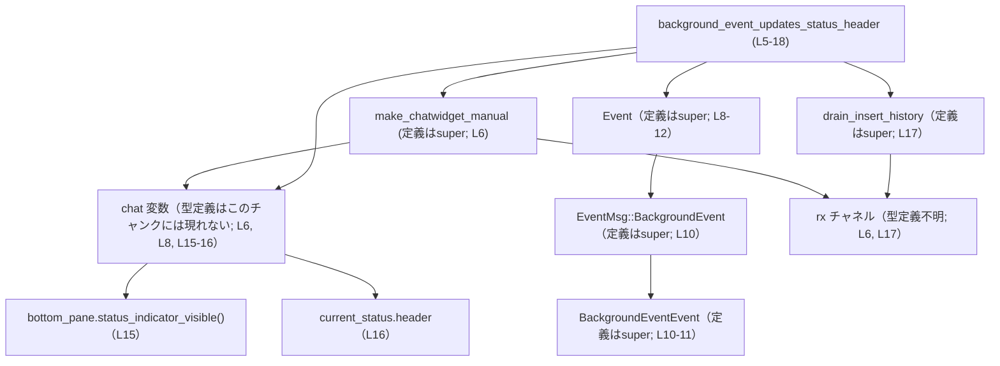

# tui/src/chatwidget/tests/background_events.rs

## 0. ざっくり一言

- Chat ウィジェットが **BackgroundEvent** を受信したときに、
  1) ステータスインジケータが表示されること、
  2) ステータスヘッダがメッセージ文字列に更新されること、
  3) 履歴用チャネルに挿入イベントが流れないこと  
  を検証する非同期テスト関数を 1 つだけ定義しているファイルです。  
  根拠: `background_event_updates_status_header` 内のアサーション [tui/src/chatwidget/tests/background_events.rs:L8-17]

---

## 1. このモジュールの役割

### 1.1 概要

- このモジュールは、Chat ウィジェット（`chat` 変数、型はこのチャンクには現れません）が **バックグラウンドイベント** を処理した際の振る舞いをテストします。  
  根拠: `chat.handle_codex_event(...)` 呼び出し [L8-13]
- 具体的には、`EventMsg::BackgroundEvent(BackgroundEventEvent { message })` を渡したときに、
  - 下部ペインのステータスインジケータが「表示状態」になること [L15]
  - 現在のステータスヘッダ文字列がメッセージ `"Waiting for \`vim\`"` に一致すること [L16]
  - 履歴用チャネル `rx` から読み出される「挿入履歴」が空であること [L17]  
  を確認します。

### 1.2 アーキテクチャ内での位置づけ

- このファイル自体は **テストモジュール**であり、本体ロジックは親モジュール（`use super::*;` でインポートされる側）にあります。  
  根拠: [L1]
- テストは以下のコンポーネントに依存しています。

  - `make_chatwidget_manual(...)`  
    Chat ウィジェットと関連チャネルを手動で組み立てる非公開ヘルパー関数（定義はこのチャンクには現れません） [L6]
  - `chat` 変数  
    `handle_codex_event` メソッドを持ち、`bottom_pane`・`current_status` フィールドにアクセスされます [L6, L8, L15-16]
  - イベント関連型 `Event`, `EventMsg::BackgroundEvent`, `BackgroundEventEvent` [L8-12]
  - 履歴チャネル `rx` とヘルパー `drain_insert_history(&mut rx)` [L6, L17]
  - Tokio の非同期テスト属性 `#[tokio::test]` [L4]
  - `pretty_assertions::assert_eq` によるアサーション [L2, L16]

以下の Mermaid 図は、このテストが関わる主なコンポーネントと依存関係を簡略的に表現したものです。



※ `chat` の具体的な型名や `make_chatwidget_manual` のモジュール階層などは、このチャンクには現れません。

### 1.3 設計上のポイント

- **非同期テストとしての設計**  
  - 関数に `#[tokio::test]` 属性が付与されており、Tokio ランタイム上で実行される非同期テストです [L4]。
  - テスト本体も `async fn` で定義されています [L5]。
- **セットアップの共通化**  
  - `make_chatwidget_manual(/*model_override*/ None).await` により、Chat ウィジェットとチャネル類を一括で準備します [L6]。
  - 戻り値は `(mut chat, mut rx, _op_rx)` という 3 要素タプルで、少なくとも Chat 本体と履歴用チャネル `rx` が含まれます [L6]。
- **型付きイベントによる検証**  
  - `Event { id, msg }` という構造体に、列挙体と思われる `EventMsg::BackgroundEvent(BackgroundEventEvent { ... })` を内包させて渡しています [L8-12]。
  - メッセージ本文は `String`（`.to_string()` を呼んでいるため）として扱われます [L11]。
- **状態と副作用の両方を検証**  
  - 内部状態として `chat.bottom_pane.status_indicator_visible()` [L15] と `chat.current_status.header` [L16] を検査しています。
  - 外部への副作用として、「挿入履歴チャネル」に新規イベントが流れていないことを `drain_insert_history(&mut rx).is_empty()` によって検証します [L17]。
- **アサーションの可読性**  
  - 文字列比較には `pretty_assertions::assert_eq` が使われており [L2, L16]、失敗時に差分が見やすくなる設計です。

---

## 2. 主要な機能一覧

このファイル内で **定義されている** 機能は 1 つだけです。

- `background_event_updates_status_header`:  
  BackgroundEvent を処理したときにステータスインジケータとステータスヘッダが更新され、履歴挿入イベントが発生しないことを検証する非同期テスト関数です [L4-5, L8-17]。

### 2.1 このファイル内で定義されている関数インベントリー

| 名前 | 種別 | 非同期 | テスト属性 | 定義位置 | 役割 |
|------|------|--------|------------|----------|------|
| `background_event_updates_status_header` | 関数 | はい (`async fn`) | `#[tokio::test]` | tui/src/chatwidget/tests/background_events.rs:L4-18 | BackgroundEvent 処理に伴うステータス更新と履歴副作用を検証する |

### 2.2 このファイルで利用している主な外部コンポーネント

※ これらはすべて `use super::*;` などでインポートされており、定義はこのチャンクには現れません。

| 名前 | 種別 (推定) | 使用位置 | 説明 |
|------|------------|----------|------|
| `make_chatwidget_manual` | 関数 | L6 | Chat ウィジェットと関連チャネルを手動セットアップするヘルパー。戻り値タプルから `chat`, `rx`, `_op_rx` を得ています。 |
| `Event` | 構造体 | L8-12 | `id` と `msg` フィールドを持つイベント型。`handle_codex_event` に渡されています。 |
| `EventMsg` | 列挙体 (推定) | L10 | バリアント `BackgroundEvent` がアクセスされています。 |
| `BackgroundEventEvent` | 構造体 (推定) | L10-11 | `message: String` フィールドを持つイベントペイロードと思われます。 |
| `handle_codex_event` | `chat` のメソッド | L8-12 | Chat にイベントを注入するメソッド。BackgroundEvent を処理させています。 |
| `bottom_pane.status_indicator_visible` | メソッド | L15 | 下部ペインのステータスインジケータの可視状態を返します。 |
| `current_status.header` | フィールド | L16 | 現在のステータスヘッダ文字列を表すフィールドです。 |
| `drain_insert_history` | 関数 | L17 | `&mut rx` を受け取り、履歴に挿入されたイベントをすべて取り出すヘルパー。戻り値は `is_empty()` を持つコレクション型です。 |
| `tokio::test` | 属性マクロ | L4 | 非同期テスト用の Tokio ランタイムを起動し、テスト関数を実行します。 |
| `pretty_assertions::assert_eq` | マクロ | L2, L16 | 通常の `assert_eq` を置き換えるマクロで、失敗時に差分を見やすく表示します。 |

---

## 3. 公開 API と詳細解説

このファイルはテスト専用であり、外部に再利用される公開 API は定義していません。ただし、テストケース自体は Chat ウィジェットの契約（contract）を記述する重要なドキュメントとなります。

### 3.1 型一覧（構造体・列挙体など）

このファイル内で **新しく定義されている型はありません**。

- `Event`, `EventMsg`, `BackgroundEventEvent` はすべて親モジュール（`super`）側の定義であり、このチャンクには構造の詳細は現れません [L1, L8-12]。
- ただし、使用方法から次の事実が読み取れます。

| 名前 | 種別 (推定) | 役割 / 用途 | 根拠 |
|------|------------|-------------|------|
| `Event` | 構造体 | 汎用イベントコンテナ。`id: String` と `msg: EventMsg` フィールドを持つことが分かります。 | フィールド初期化 `id: "bg-1".into(), msg: ...` [L8-10] |
| `EventMsg` | 列挙体 | イベントの種類を表す列挙体。少なくとも `BackgroundEvent(BackgroundEventEvent)` バリアントを持ちます。 | `EventMsg::BackgroundEvent(BackgroundEventEvent { ... })` [L10-11] |
| `BackgroundEventEvent` | 構造体 | バックグラウンドイベント用のペイロード。`message: String` フィールドを持ちます。 | フィールド初期化 `message: "...".to_string()` [L11] |

### 3.2 関数詳細

#### `background_event_updates_status_header()`

**概要**

- BackgroundEvent を `chat.handle_codex_event` に渡したときに、
  - ステータスインジケータが可視になること、
  - ステータスヘッダがイベントメッセージ文字列に更新されること、
  - 履歴挿入イベントが発生しないこと、  
  を検証する非同期テストです [L4-5, L8-17]。

**シグネチャ**

```rust
#[tokio::test]                                  // Tokio ランタイム上で実行される非同期テストであることを示す
async fn background_event_updates_status_header() {
    // 本文は後述
}
```

**引数**

- 引数はありません。

| 引数名 | 型 | 説明 |
|--------|----|------|
| なし | - | テストのセットアップと検証をすべて関数内で完結させています。 |

**戻り値**

- 明示的な戻り値型は指定されておらず、暗黙に `()` を返します。
- 失敗条件は `assert!` / `assert_eq!` によるパニックとして表現され、テストランナー側で検知されます [L15-17]。

**内部処理の流れ（アルゴリズム）**

1. **Chat ウィジェットとチャネルの作成**  
   - `make_chatwidget_manual(/*model_override*/ None).await` を呼び出して、Chat ウィジェットとチャネルをセットアップします。  
     戻り値の 3 要素タプルを `(mut chat, mut rx, _op_rx)` に束縛します [L6]。
2. **BackgroundEvent の生成と送信**  
   - `Event { ... }` を構築し、その `msg` フィールドに `EventMsg::BackgroundEvent(BackgroundEventEvent { message: "Waiting for \`vim\`".to_string() })` を設定します [L8-12]。
   - これを `chat.handle_codex_event(...)` に渡して処理させます [L8]。
3. **ステータスインジケータの可視状態の検証**  
   - `assert!(chat.bottom_pane.status_indicator_visible());` により、下部ペインのステータスインジケータが表示されていることを確認します [L15]。
4. **ステータスヘッダ文字列の検証**  
   - `assert_eq!(chat.current_status.header, "Waiting for`vim`");` により、現在のステータスヘッダがイベントで送ったメッセージ文字列と等しいことを確認します [L16]。
5. **履歴挿入イベントが発生していないことの検証**  
   - `assert!(drain_insert_history(&mut rx).is_empty());` により、履歴用チャネル `rx` から取り出した挿入イベントのコレクションが空であることを確認します [L17]。

テストの処理フローは次の簡易フローチャートのようになります。

```mermaid
flowchart TD
    A["開始<br/>background_event_updates_status_header (L5)"] --> B["make_chatwidget_manual(None).await<br/>(chat, rx, _op_rx) を取得 (L6)"]
    B --> C["chat.handle_codex_event(BackgroundEvent(message)) を呼ぶ (L8-13)"]
    C --> D["assert!(chat.bottom_pane.status_indicator_visible()) (L15)"]
    D --> E["assert_eq!(chat.current_status.header, \"Waiting for `vim`\") (L16)"]
    E --> F["assert!(drain_insert_history(&mut rx).is_empty()) (L17)"]
    F --> G["終了"]
```

**Examples（使用例）**

この関数自体はテストランナーから自動的に実行され、通常のアプリケーションコードから呼び出すことはありません。ただし、同様のパターンで別のイベントをテストする場合の雛形として利用できます。

```rust
use super::*;                                             // 親モジュールから Chat ウィジェット関連の型と関数をインポートする
use pretty_assertions::assert_eq;                         // 差分表示つき assert_eq を使用する

#[tokio::test]                                            // Tokio ランタイム上で実行する非同期テストであることを指定する
async fn background_event_sets_custom_message() {         // 新しいテスト関数を定義する
    let (mut chat, mut rx, _op_rx) =
        make_chatwidget_manual(/* model_override */ None).await; // Chat ウィジェットとチャネルを手動で構築する

    let message = "Custom background message".to_string(); // テスト用のメッセージ文字列を用意する

    chat.handle_codex_event(Event {                       // Chat に BackgroundEvent を送信する
        id: "bg-custom".into(),                           // 任意の ID を設定する
        msg: EventMsg::BackgroundEvent(BackgroundEventEvent {
            message: message.clone(),                     // ペイロードにメッセージを詰める
        }),
    });

    assert!(chat.bottom_pane.status_indicator_visible()); // ステータスインジケータが表示されていることを確認する
    assert_eq!(chat.current_status.header, message);      // ステータスヘッダがメッセージと一致することを確認する

    let history = drain_insert_history(&mut rx);          // 履歴挿入イベントをすべて取り出す
    assert!(history.is_empty());                          // BackgroundEvent では履歴が増えていないことを確認する
}
```

※ 上記は、このファイルのテスト関数と同じパターンを使った例です。実際にこのようなテストが存在するかどうかは、このチャンクからは分かりません。

**Errors / Panics**

- この関数内で `Result` を返す処理や `?` 演算子は使われていません [L5-17]。
- テスト失敗はすべて以下のアサーションによる **パニック** として表現されます。
  - `assert!(chat.bottom_pane.status_indicator_visible());` が `false` の場合 [L15]
  - `assert_eq!(chat.current_status.header, "Waiting for`vim`");` が不一致の場合 [L16]
  - `assert!(drain_insert_history(&mut rx).is_empty());` が `false` の場合 [L17]
- それ以外にも、以下のような場合にパニックする可能性がありますが、詳細はこのチャンクからは分かりません。
  - `make_chatwidget_manual(...).await` 内でパニックが発生した場合 [L6]
  - `handle_codex_event` の内部実装でパニックが発生した場合 [L8-13]

**Edge cases（エッジケース）**

このテスト関数自体はパラメータを持たないため、入力値による分岐はありませんが、間接的に次のようなケースが考えられます。

- **メッセージ文字列の内容**  
  - テストでは `"Waiting for \`vim\`"` というバッククォートを含む文字列を使用しています [L11, L16]。
  - これにより、少なくとも特殊文字（バッククォート）を含む文字列でもステータスヘッダとして扱えることが確認されています。
- **履歴挿入の有無**  
  - BackgroundEvent が「履歴には残らない種類のイベント」であることを前提としており、履歴チャネルが空であることを確認しています [L17]。
  - もし仕様変更で BackgroundEvent も履歴に残すようになった場合、このテストは意図的に失敗するようになります。
- **非同期処理のタイミング**  
  - テストは `chat.handle_codex_event(...)` 呼び出しの **直後** に状態と履歴を検査しています [L8-17]。
  - もし `handle_codex_event` が内部で非同期タスクを spawn して遅延処理を行う設計に変更されると、このテストはタイミング依存で不安定になる可能性があります（このチャンクからは、実際にそうなっているかどうかは分かりません）。

**使用上の注意点**

- **Tokio ランタイムが必須**  
  - `#[tokio::test]` により、テストは Tokio の非同期ランタイム上で実行されます [L4]。
  - 同様のテストを書く場合も、非同期 API（`make_chatwidget_manual(...).await` など）を使うならこの属性が必要です。
- **`handle_codex_event` の同期性への依存**  
  - テストは `handle_codex_event` 呼び出し後すぐに状態を検査しています [L8-17]。
  - もし将来、このメソッドが完全に非同期化され `async fn` となるなら、テスト側も `.await` を付けるなどの変更が必要になります（現状は `.await` がないため、同期メソッドであると読み取れます [L8]）。
- **履歴検査を忘れると仕様回帰を検出できない**  
  - このテストは「BackgroundEvent が履歴を汚染しない」ことを保証しますが、それは `drain_insert_history(&mut rx)` を呼び出して `is_empty()` を確認しているからです [L17]。
  - 同様の性質を持つイベントをテストする場合、履歴確認を省略すると、将来の仕様変更に気付きにくくなります。

### 3.3 その他の関数（このファイルから呼び出されるが定義がないもの）

| 関数名 | 役割（1 行） | 使用位置 | 備考 |
|--------|-------------|----------|------|
| `make_chatwidget_manual` | Chat ウィジェットと関連チャネルを手動で構築するヘルパー関数 | L6 | 戻り値タプル `(chat, rx, _op_rx)` の具体的な型はこのチャンクには現れません。 |
| `handle_codex_event` | Chat にイベントを処理させるメソッド | L8-13 | `chat` のメソッド。シグネチャや非同期性はこのチャンクでは不明ですが、`.await` がないため同期メソッドとして呼ばれています。 |
| `drain_insert_history` | 履歴挿入イベントをすべて取り出すヘルパー関数 | L17 | 戻り値は `is_empty()` メソッドを持つコレクション型です。 |

---

## 4. データフロー

このセクションでは、`background_event_updates_status_header` テスト関数内でのデータと呼び出しの流れをまとめます。

### 4.1 処理の要点

- セットアップ段階で `make_chatwidget_manual(None).await` から `chat` と `rx` を取得します [L6]。
- テスト内で `Event` インスタンスを作り、`chat.handle_codex_event(...)` に渡します [L8-12]。
- その結果として更新された `chat` の内部状態（`bottom_pane.status_indicator_visible()`, `current_status.header`）を読み出します [L15-16]。
- 最後に `rx` チャネルから履歴挿入イベントを `drain_insert_history(&mut rx)` でまとめて取り出し、そのコレクションが空であることを検証します [L17]。

### 4.2 シーケンス図

次の Mermaid シーケンス図は、`background_event_updates_status_header`（L5-18）実行時の呼び出しとデータの流れを示しています。

```mermaid
sequenceDiagram
    participant T as Test<br/>background_event_updates_status_header (L5-18)
    participant F as make_chatwidget_manual (L6, 定義はsuper)
    participant C as chat 変数（型不明; L6, L8, L15-16）
    participant RX as rx チャネル（型不明; L6, L17）
    participant E as Event / EventMsg / BackgroundEventEvent (L8-12)
    participant D as drain_insert_history (L17)

    T->>F: make_chatwidget_manual(None).await (L6)
    F-->>T: (mut chat, mut rx, _op_rx) (L6)

    T->>E: 構築 Event { id: "bg-1", msg: BackgroundEvent(message) } (L8-12)
    T->>C: handle_codex_event(Event) を呼び出し (L8-12)

    T->>C: bottom_pane.status_indicator_visible() を評価 (L15)
    T->>C: current_status.header を読み出し (L16)

    T->>D: drain_insert_history(&mut rx) を呼び出し (L17)
    D-->>T: 挿入履歴コレクション（is_empty() で検査）(L17)
```

- `handle_codex_event` の内部でどのような処理や非同期タスクが行われるかは、このチャンクには現れません。
- `rx` の具体的な型（たとえば `tokio::sync::mpsc::Receiver` など）も、このファイルからは分かりません。

---

## 5. 使い方（How to Use）

このモジュールはテスト専用ですが、Chat ウィジェットのイベント処理を検証する **パターンのサンプル** として役立ちます。

### 5.1 基本的な使用方法（同様のテストを追加する場合）

以下は、このファイルのテストパターンを踏襲して、別のメッセージを持つ BackgroundEvent を検証する例です。

```rust
use super::*;                                             // Chat ウィジェットとイベント型を親モジュールからインポートする
use pretty_assertions::assert_eq;                         // 差分表示つき assert_eq を利用する

#[tokio::test]                                            // 非同期テストであることを指定する
async fn background_event_shows_indicator_and_no_history() {
    // Chat ウィジェットと履歴チャネルを準備する
    let (mut chat, mut rx, _op_rx) =
        make_chatwidget_manual(/* model_override */ None).await;

    // テスト対象のメッセージを定義する
    let message = "Another background operation is running".to_string();

    // BackgroundEvent を構築して Chat に送信する
    chat.handle_codex_event(Event {
        id: "bg-2".into(),
        msg: EventMsg::BackgroundEvent(BackgroundEventEvent {
            message: message.clone(),
        }),
    });

    // ステータスインジケータが表示されていることを検証する
    assert!(chat.bottom_pane.status_indicator_visible());

    // ステータスヘッダがメッセージと一致することを検証する
    assert_eq!(chat.current_status.header, message);

    // 履歴に挿入イベントが流れていないことを検証する
    let history = drain_insert_history(&mut rx);
    assert!(history.is_empty());
}
```

- `make_chatwidget_manual` の具体的な挙動や引数（`model_override`）の意味は、このチャンクからは分かりませんが、`None` を渡すパターンが使われています [L6]。
- Chat の内部状態に関するアサーションは、`bottom_pane` や `current_status` といったフィールドにアクセスすることで行います [L15-16]。

### 5.2 よくある使用パターン

このファイルのテストから読み取れる、よくある使用パターンは次の通りです。

- **パターン A: イベントによるステータス更新の検証**
  1. `make_chatwidget_manual(None).await` で Chat とチャネルをセットアップする [L6]。
  2. 適切な `Event` を構築し、`chat.handle_codex_event(event)` を呼ぶ [L8-12]。
  3. `chat` の状態フィールド（`bottom_pane`, `current_status` など）に対してアサーションを行う [L15-16]。

- **パターン B: 履歴チャネルに対する副作用の検証**
  1. `make_chatwidget_manual` から取得した `rx` を `drain_insert_history(&mut rx)` に渡す [L6, L17]。
  2. 戻り値コレクションに対して `is_empty()` や要素数・内容をアサートし、副作用の有無・内容を検証する [L17]。

### 5.3 よくある間違い

このチャンクから推測できる範囲で、起こりそうな誤用例とその修正版を示します。

```rust
// 間違い例: 非同期関数なのに .await を忘れている
// let (mut chat, mut rx, _op_rx) = make_chatwidget_manual(None); // コンパイルエラーになる

// 正しい例: 非同期関数の結果を .await で待つ
let (mut chat, mut rx, _op_rx) = make_chatwidget_manual(None).await;
```

```rust
// 間違い例: 履歴チャネルの副作用を検証していない
chat.handle_codex_event(Event {
    id: "bg-1".into(),
    msg: EventMsg::BackgroundEvent(BackgroundEventEvent {
        message: "Waiting for `vim`".to_string(),
    }),
});

// インジケータとヘッダだけをチェックしている（履歴は未確認）
assert!(chat.bottom_pane.status_indicator_visible());
assert_eq!(chat.current_status.header, "Waiting for `vim`");

// 正しい例: 履歴チャネルも drain して検証する
let history = drain_insert_history(&mut rx);
assert!(history.is_empty());
```

- 2 つ目の例では、`drain_insert_history` を呼び忘れると、「BackgroundEvent が履歴を汚染しない」という仕様が将来破られても気付きにくくなります [L17]。

### 5.4 使用上の注意点（まとめ）

- 非同期 API を使うため、テスト関数には `#[tokio::test]` と `async fn` が必要です [L4-5]。
- `handle_codex_event` が同期処理である前提で、呼び出し直後に状態と履歴を検査しています [L8-17]。将来非同期化される場合はテストの書き換えが必要です。
- BackgroundEvent に関する仕様（ステータス更新あり・履歴なし）をテストで固定しているため、仕様変更時にはこのテストも変更が必要になります [L15-17]。

---

## 6. 変更の仕方（How to Modify）

### 6.1 新しい機能（別種のイベント）のテストを追加する場合

1. **イベントの種類を決める**  
   - たとえば `EventMsg::SomeOtherEvent(...)` のような新しいイベントタイプがある場合、そのペイロードを構築するコードを用意します。
   - このチャンクにはほかのバリアントは現れませんが、`EventMsg::BackgroundEvent` と同様のパターンで利用できると考えられます [L10]。

2. **新しいテスト関数を追加する**  
   - `#[tokio::test]` と `async fn` で新しいテストを定義します。
   - 冒頭で `make_chatwidget_manual(None).await` を呼び、`chat` と `rx` を用意します [L6]。

3. **イベントを送信し、期待される状態・履歴を検証する**  
   - `chat.handle_codex_event(Event { ... })` で新しいイベントを送信し [L8-12]、
   - 期待する UI 状態（例: ステータスヘッダ、フラグ、インジケータ）と
   - 履歴チャネルへの挿入有無（`drain_insert_history(&mut rx)`）を検証します [L15-17]。

4. **仕様に応じたアサーションを設計する**  
   - BackgroundEvent と同様に「履歴に残さない」べきイベントなら `is_empty()` を期待値とし [L17]、
   - 逆に履歴に追加されるべきなら、返ってきたコレクションの要素内容を検査する、など仕様に合わせます。

### 6.2 既存の機能（BackgroundEvent の仕様）を変更する場合

1. **影響範囲の確認**  
   - BackgroundEvent の仕様変更（たとえば「履歴に残すようにする」など）は、本テストを含む、BackgroundEvent を前提としたすべてのテストに影響します。
   - このファイルでは `drain_insert_history(&mut rx).is_empty()` によって「履歴が空」であることを期待しているため [L17]、仕様を変える場合はここが必ず変更対象になります。

2. **契約（contract）の見直し**  
   - 現状のテストから読み取れる契約:
     - BackgroundEvent を処理するとステータスインジケータが可視になる [L15]。
     - ステータスヘッダがメッセージ文字列に変わる [L16]。
     - 挿入履歴は増えない [L17]。
   - 仕様変更に合わせて、このうちどれを維持しどれを変更するかを明確にし、テストのアサーションを更新します。

3. **関連するテスト・使用箇所の再確認**  
   - このファイル以外にも BackgroundEvent に依存するテストがある可能性がありますが、このチャンクからは位置を特定できません。
   - 親モジュールの `EventMsg` や `handle_codex_event` の呼び出し箇所を探索し、挙動変更による影響を確認する必要があります。

---

## 7. 関連ファイル

このチャンクから直接参照が分かる関連コンポーネントを整理します。

| パス / クレート | 役割 / 関係 |
|-----------------|------------|
| `super`（親モジュール; 具体的なファイルパスは不明） | `make_chatwidget_manual`, `Event`, `EventMsg`, `BackgroundEventEvent`, `drain_insert_history`, および `chat` 型の定義元です [L1, L6, L8-12, L17]。 |
| クレート `tokio` | `#[tokio::test]` 属性を提供し、非同期テスト実行用のランタイムを起動します [L4]。 |
| クレート `pretty_assertions` | `assert_eq` を再定義し、テスト失敗時に見やすい差分を表示するために利用されています [L2, L16]。 |

このファイル単体では、Chat ウィジェット本体の実装やイベントハンドリングの詳細は分かりませんが、BackgroundEvent 処理に関する重要な振る舞いをテストとして固定化していることが読み取れます。
