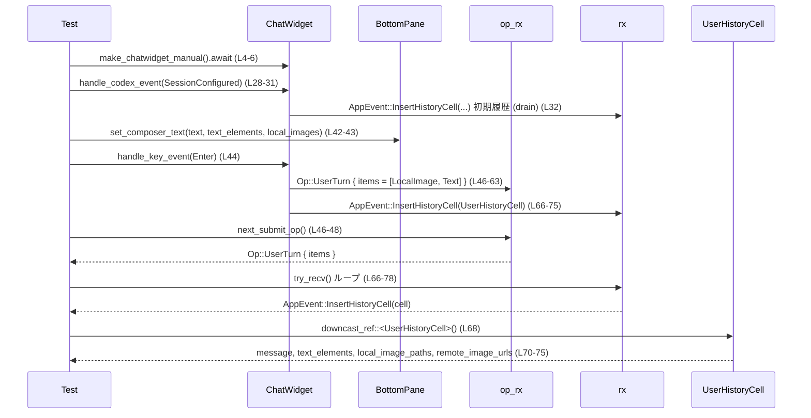

# tui/src/chatwidget/tests/composer_submission.rs

## 0. ざっくり一言

このファイルは、チャット UI コンポーネント `ChatWidget` の **入力コンポーザ（composer）と送信処理** まわりの振る舞いを検証するテスト群です。  
テキスト・ローカル画像・リモート画像・スキル・メンション・キューされたメッセージ・協調モード・端末依存のキー操作などが、送信時や割り込み時にどのように扱われるかを網羅的に確認しています。

---

## 1. このモジュールの役割

### 1.1 概要

- このモジュールは、**チャット入力の送信と復元の仕様** を確立・回帰テストするために存在します。
- 具体的には、`ChatWidget` が生成する `Op::UserTurn` と履歴セル `UserHistoryCell` の内容、および composer の状態変化が期待どおりになるかを検証します（例: 送信時にテキスト要素とローカル画像が保持されるか `L34-85`、リモート画像のみでも送信されるか `L183-246` など）。

### 1.2 アーキテクチャ内での位置づけ

テストの呼び出し関係は概ね次のようになっています。

```mermaid
flowchart TD
    subgraph Tests (composer_submission.rs L4-1102)
        T1[送信系テスト]
        T2[ブロック/復元系テスト]
        T3[キュー/割り込み系テスト]
        T4[キー割り当てテスト]
        T5[レンダリング整合性テスト]
    end

    T1 & T2 & T3 & T4 & T5 --> CW[ChatWidget (super::*)]
    CW --> BP[BottomPane (composer UI)]
    CW --> OP_CH[op_rx: Outbound Op Receiver]
    CW --> EV_CH[rx: AppEvent Receiver]
    CW --> CP[codex_protocol::Event/SessionConfigured/TurnAborted]
    CW --> CM[collaboration_modes::plan_mask]
    CW --> KH[crate::key_hint / queued_message_edit_binding_for_terminal]
    CW --> TI[TerminalInfo / TerminalName / Multiplexer]

    EV_CH --> HC[UserHistoryCell]
```

- テストは `make_chatwidget_manual` で `ChatWidget` と 2 本のチャネル (`rx`, `op_rx`) を取得し、イベントを送り込んだり受信したりします `L4-6`, `L185-186`, `L1027-1028`。
- 送信操作は `chat.handle_key_event(...)` 経由で行われ、結果の `Op::UserTurn` は `op_rx` から `next_submit_op` で取得します `L44-48`, `L134-137`, `L219-222`。
- UI 上の履歴は `rx` から `AppEvent::InsertHistoryCell` として受け取り、`UserHistoryCell` にダウンキャストして検証します `L66-75`, `L161-170`, `L233-237`。

### 1.3 設計上のポイント（テストから読み取れる範囲）

- **イベント駆動・非同期**  
  - すべての主要テストは `#[tokio::test]` で実行され、非同期に `ChatWidget` を操作します `L4`, `L88`, `L183` など。
  - 内部ではチャネルによるメッセージパッシングで UI イベント／アウトバウンド Op を扱っています。

- **入力モデルの分離**
  - ユーザ入力は `UserInput`（Text/Image/LocalImage/Skill/Mention）列として送信される `L46-63`, `L134-157`, `L219-228`, `L986-1008`。
  - 履歴用には `UserHistoryCell` にテキスト・テキスト要素・ローカル画像・リモート画像が保存されます `L70-75`, `L165-170`, `L237`。

- **画像プレースホルダの一貫性**
  - `TextElement` でテキスト中の `[Image #n]` 範囲とプレースホルダ文字列を保持し、`LocalImageAttachment` の `placeholder` と対応付けます `L34-40`, `L455-465`, `L661-670`。
  - `remap_placeholders_for_message` によりプレースホルダ番号の再割り当てを行い、テキスト・要素・添付画像を一貫して更新します `L645-711`, `L715-773`。

- **キューと割り込み**
  - タスク実行中（`task_running`）に送信された入力は `queued_user_messages: VecDeque<UserMessage>` にキューされます `L777-787`, `L827-832`, `L1032-1037`, `L1075-1078`。
  - `TurnAborted` イベント（理由 `Interrupted`）により、このキューが composer に復元されます `L616-624`, `L1039-1048`, `L1081-1088`。

- **端末依存のキー割り当て**
  - `TerminalInfo` / `TerminalName` / `Multiplexer` に基づき、キュー編集用のキー (`Alt+Up` / `Shift+Left`) を決定します `L850-871`, `L886-895`, `L898-949`。

---

## 2. 主要な機能一覧（テスト観点）

このテストファイルがカバーする主な機能は次のとおりです。

- 送信時の入力分解
  - テキスト・ローカル画像・リモート画像を `UserInput` 列に変換し、順序とメタデータを保持する `L34-63`, `L118-157`, `L219-228`。
- リモート画像のみの送信挙動
  - テキストが空でも、リモート画像があれば `Enter` で `UserTurn` が生成される `L213-230`。
  - `Shift+Enter` やモーダル表示中・入力無効時には送信されない `L248-369`。
- スキル・メンションの解決
  - 同名スキルが複数ある場合、メンションバインディングで選択されたパスが優先される `L401-448`。
  - ブロックされた画像送信の復元時に、メンションバインディングとテキスト要素が再構築される `L455-493`。
- 画像プレースホルダの再マッピング
  - `restore_blocked_image_submission` / `restore_user_message_to_composer` / `remap_placeholders_for_message` により、ローカル画像とテキスト中の `[Image #n]` の対応を維持・再番号付けする `L505-591`, `L645-773`。
- タスク中のキュー処理と割り込み
  - タスク中 `Enter` で空入力はキューされない `L777-787`。
  - キューされたメッセージの編集（Alt+Up / Shift+Left）と、割り込み時の composer への復元 `L817-848`, `L850-895`, `L1025-1102`。
- 入力状態の復元とスリープ制御
  - `restore_thread_input_state` による `task_running` / `agent_turn_running` と sleep inhibitor の同期 `L791-815`。
- 履歴からの再キュー安定性
  - 履歴から同じプロンプトを何度も呼び出しても、キューには同じテキストが入ることの保証 `L952-980`。
- レンダリング結果の整合性
  - 個々の `UserInput` から構成されるメッセージが、`rendered_user_message_event_from_parts` の構造と一致する `L983-1022`。

---

## 3. 公開 API と詳細解説

### 3.1 型一覧（構造体・列挙体など）

テストから見える主要な型の一覧です。型定義自体はこのチャンクには出てこないため、用途は使用箇所からの推測に基づきます。

| 名前 | 種別 | 役割 / 用途 | 根拠 |
|------|------|-------------|------|
| `ChatWidget` | 構造体 | チャット UI 全体。キー入力処理、送信、履歴へのイベント発行などを行う。`rendered_user_message_event_from_*` のようなユーティリティも提供。 | `composer_submission.rs:L4-6`, `L986-1008` |
| `BottomPane` | 構造体 | `chat.bottom_pane` として参照される入力欄 UI。composer のテキスト・画像・タスク状態・キーバインディングなどを管理。 | `L42-43`, `L129-132`, `L360-363`, `L781-782`, `L821-822` |
| `UserInput` | 列挙体 | 送信時にエンジンへ渡すユーザ入力要素。`Text` / `Image` / `LocalImage` / `Skill` / `Mention` などのバリアントを持つ。 | `L51-63`, `L139-157`, `L223-227`, `L986-1008` |
| `UserMessage` | 構造体 | キューや復元に使われるユーザメッセージの論理単位。テキスト、`TextElement` 群、ローカル・リモート画像、メンションバインディングを持つ。 | `L579-585`, `L607-613`, `L671-677`, `L737-743`, `L827-832` |
| `TextElement` | 構造体 | テキスト中の byte range と、任意のプレースホルダ文字列（例: `[Image #1]` やメンショントークン）を保持する。 | `L36-39`, `L123-126`, `L457-460`, `L513-521`, `L650-658`, `L719-724`, `L989-990`, `L1015-1018` |
| `LocalImageAttachment` | 構造体 | ローカル画像添付ファイルのプレースホルダとパスを表す。 | `L461-464`, `L523-532`, `L567-576`, `L661-670`, `L727-735` |
| `MentionBinding` | 構造体 | テキスト中のメンション文字列（例 `$figma`, `$file`）と、それに対応するパス（スキルやリソース）を紐づける。 | `L430-433`, `L465-468`, `L583-584` |
| `UserHistoryCell` | 構造体 | 履歴ビューに挿入されるユーザメッセージのセル。メッセージ本文・テキスト要素・ローカル/リモート画像 URL を持つ。 | `L66-75`, `L161-170`, `L233-237` |
| `Op` | 列挙体 | チャットエンジンへのアウトバウンド操作。ここでは `Op::UserTurn { items, summary, collaboration_mode, personality, .. }` バリアントが使われている。 | `L46-48`, `L134-137`, `L219-221`, `L632-640` |
| `ThreadInputState` | 構造体 | スレッドの入力状態（composer 内容、キュー、協調モード、タスク/エージェント状態など）をまとめて保持・復元する。 | `L795-804` |
| `Feature` | 列挙体 | 機能フラグ。ここでは `CollaborationModes` と `PreventIdleSleep` が使用される。 | `L597`, `L793` |
| `CollaborationMode` | 構造体 | 協調モード（例: プランニングモード）を表す。`mode` フィールドにモード種別を持つ。 | `L599-603`, `L633-637` |
| `TerminalInfo` | 構造体 | 使用中の端末・ターミナル・マルチプレクサ（tmux等）の情報。キーバインディング決定に用いられる。 | `L851-858`, `L864-871`, `L876-883`, `L888-895`, `L901-907` 他 |
| `TerminalName` | 列挙体 | 端末名。`AppleTerminal`, `WarpTerminal`, `VsCode`, `Iterm2` など。 | `L853`, `L865`, `L877`, `L889`, `L903`, `L913`, `L923`, `L932`, `L942` |
| `Multiplexer` | 列挙体 | 端末マルチプレクサ。ここでは `Multiplexer::Tmux { .. }` が使われる。 | `L893`, `L936` |
| `Event`, `EventMsg` | 列挙体等 | codex プロトコルのイベント。`SessionConfigured`・`TurnAborted` が `ChatWidget` に渡される。 | `L28-31`, `L112-115`, `L207-210`, `L272-275`, `L312-315`, `L352-355`, `L395-398`, `L616-624`, `L1040-1048`, `L1081-1088` |
| `TurnAbortReason` | 列挙体 | ターン中断理由。ここでは `Interrupted` を使用。 | `L620`, `L1044`, `L1085` |
| `ThreadId` | 構造体 | 会話スレッド ID。`SessionConfiguredEvent` に使われ、`chat.thread_id` にも設定される。 | `L8`, `L92`, `L187`, `L252`, `L292`, `L332`, `L375`, `L595-596`, `L957-958` |

※ 型のフィールドや実装詳細はこのチャンクには現れないため、「用途」は使用箇所からの解釈です。

---

### 3.2 関数詳細（主要 API の仕様：テストから読み取れる範囲）

ここでは実装ではなく、「テストによって保証されている振る舞い」を API 契約として整理します。

#### 1. `ChatWidget::handle_key_event(event: KeyEvent)`

**概要**

- キーボード入力（Enter, Shift+Enter, Alt+Up, Up, Tab など）を受け取り、composer の送信・キューへの追加・履歴呼び出し・キューの編集などを行います。

**引数**

| 引数名 | 型 | 説明 | 根拠 |
|--------|----|------|------|
| `event` | `KeyEvent` | `KeyCode` と `KeyModifiers` を持つキーイベント。`Enter`, `Up`, `Left`, `Tab` 等が使われる。 | `L44`, `L132`, `L217`, `L282`, `L322`, `L365`, `L435`, `L630`, `L784`, `L835`, `L870-871`, `L883`, `L895`, `L963`, `L970`, `L974` |

**戻り値**

- 戻り値型はこのチャンクには現れません（おそらく `bool` や `Result` など）。  
  テストでは戻り値を使用していないため、実際の型・意味は不明です。

**内部処理の流れ（テストから読み取れる最低限の仕様）**

- `Enter`（修飾なし）の場合:
  - composer テキスト・ローカル画像・リモート画像・スキル・メンションなどから `UserInput` 列を構成し、`Op::UserTurn` を `op_rx` に送る `L42-63`, `L129-157`, `L219-228`, `L435-448`。
  - 履歴セル `UserHistoryCell` を生成し、`rx` に `AppEvent::InsertHistoryCell` として送る `L66-75`, `L161-170`, `L233-237`。
  - リモート画像のみでテキストが空の場合も送信される（`items = [Image]`, `summary = None`）`L213-230`。
  - ただし、モーダルが開いている場合や `composer_input_enabled == false` の場合は送信しない `L321-326`, `L360-369`。
  - タスクが実行中 (`task_running == true`) かつ非空入力であれば、即送信ではなくキューに入るはずですが、空入力の場合には何もキューされない `L777-787`。

- `Shift+Enter` の場合:
  - リモート画像のみがある状態でも、送信は行われず、`Op::UserTurn` が生成されない `L278-286`。
  - 一般的には「改行」の意味を持たせていると推測されますが、改行挿入の確認はこのチャンクにはありません。

- `Alt+Up`（または端末による同等のバインディング）の場合:
  - タスク実行中かつ `queued_user_messages` にメッセージがあるとき、**もっとも最近の（末尾の）キュー項目** を composer にロードし、キューからは削除する `L817-848`。
  - composer のテキストは最後のキュー項目の `text` になり、キューには残りの古い項目だけが残る `L837-847`。

- `Up` 単独:
  - 履歴から直近のユーザメッセージを composer に呼び出す `L968-971`。
  - その直後に `Tab` を押すと、その内容がキューに追加される `L973-975`。この操作を繰り返しても、キューに入るテキストは常に同じであることが保証されています `L977-980`。

- `Tab`:
  - タスク実行中に composer の内容を `queued_user_messages` に追加するために使われている `L973-975`。

**Examples（使用例）**

リモート画像のみを Enter で送信する例（テスト `enter_with_only_remote_images_submits_user_turn` より）:

```rust
let (mut chat, mut rx, mut op_rx) = make_chatwidget_manual(None).await;   // L185-186
// セッション設定イベントを送る（省略）                               // L187-211

let remote_url = "https://example.com/remote-only.png".to_string();       // L213
chat.set_remote_image_urls(vec![remote_url.clone()]);                     // L214
assert_eq!(chat.bottom_pane.composer_text(), "");                         // L215

chat.handle_key_event(KeyEvent::new(KeyCode::Enter, KeyModifiers::NONE)); // L217

let (items, summary) = match next_submit_op(&mut op_rx) {                 // L219-222
    Op::UserTurn { items, summary, .. } => (items, summary),
    other => panic!("expected Op::UserTurn, got {other:?}"),
};
assert_eq!(
    items,
    vec![UserInput::Image { image_url: remote_url.clone() }],
);                                                                         // L223-228
assert_eq!(summary, None);                                                // L229
assert!(chat.remote_image_urls().is_empty());                             // L230
```

**Errors / Panics**

- この関数自体が `Result` を返すかどうかは不明です。
- テスト側では、期待しない `Op` が来た場合に `panic!` していますが、これはテスト用の挙動です `L46-48`, `L134-137`, `L219-222`, `L632-640`。

**Edge cases（エッジケース）**

- リモート画像のみ & 空テキスト + `Enter` → 送信される `L213-230`。
- 同条件で `Shift+Enter` → 送信されない、`remote_image_urls` は保持される `L278-286`。
- モーダル表示中 (`open_review_popup()`) では送信されない `L321-326`。
- 入力無効 (`set_composer_input_enabled(false, ...)`) のときも送信されない `L360-369`。
- タスク中 (`task_running == true`) に空の composer で `Enter` を押しても、キューは増えない `L777-787`。
- タスク中に複数回履歴プロンプトを呼び出してキューしても、キューに入る内容は安定している `L968-980`。

**使用上の注意点**

- 「送信するかどうか」は `task_running`、モーダル表示、入力有効フラグなど UI 状態に依存します。  
  新しいキー操作を追加する際は、これら状態との組み合わせに対する仕様を明確にする必要があります。
- リモート画像キューは、送信時にクリアされる（`remote_image_urls().is_empty()`）一方、送信に失敗する場合（シフト押下やモーダル中など）はクリアされません `L230`, `L285`, `L324`, `L367`。

---

#### 2. `ChatWidget::restore_blocked_image_submission(...)`

**概要**

- モデルが画像入力をサポートしていない場合に送信がブロックされ、ユーザが画像付きメッセージを再編集できるように、composer 状態を復元します `L455-476`, `L505-541`。

**引数**（テストから推定した構造）

| 引数名 | 型 | 説明 | 根拠 |
|--------|----|------|------|
| `text` | `String` | 復元するメッセージ本文。 | `L470-472`, `L535-537` |
| `text_elements` | `Vec<TextElement>` | テキスト内のプレースホルダやメンションを表す要素列。 | `L472`, `L537` |
| `local_images` | `Vec<LocalImageAttachment>` | ローカル画像添付のプレースホルダとファイルパス。 | `L473-474`, `L538-539` |
| `mention_bindings` | `Vec<MentionBinding>` | メンションとスキルパスの対応。 | `L474-475` |
| `remote_image_urls` | `Vec<String>` | リモート画像 URL の一覧。 | `L475-476`, `L539-541` |

**戻り値**

- 直接の戻り値はなく、副作用として composer と内部状態（`remote_image_urls` など）を更新する関数と考えられます。

**内部処理の流れ（テストから読み取れる仕様）**

- composer の状態復元:
  - `composer_text` は `text` そのものに戻される `L486`, `L543`。
  - `composer_text_elements` は、渡された `text_elements` を元に再構成される。  
    メンション付きのケースでは、メンション文字列 `$file` を表す `TextElement` が追加されていることが確認される `L478-485`, `L487`。
  - `composer_local_image_paths()` / `composer_local_images()` は、`local_images` のパスとプレースホルダが保持されている `L488-491`, `L545`。
  - `remote_image_urls()` も渡されたリストと一致する `L546`。

- メンションバインディング:
  - composer にセットされた後に `take_mention_bindings()` を呼ぶと、渡した `mention_bindings` がそのまま返ってくるため、メンション情報は失われていない `L492`。

- 警告メッセージの履歴挿入:
  - `drain_insert_history(&mut rx)` で最後のセルを取り出し、`"does not support image inputs"` を含む警告テキストが表示されていることを検証している `L494-502`。  
    これは「選択されたモデルが画像入力に対応していない」という警告であると解釈できます。

**Examples（使用例）**

```rust
let placeholder = "[Image #1]";                                         // L455
let text = format!("{placeholder} check $file");                         // L456
let text_elements = vec![TextElement::new(
    (0..placeholder.len()).into(),
    Some(placeholder.to_string()),
)];                                                                      // L457-460
let local_images = vec![LocalImageAttachment {
    placeholder: placeholder.to_string(),
    path: PathBuf::from("/tmp/blocked.png"),
}];                                                                      // L461-464
let mention_bindings = vec![MentionBinding {
    mention: "file".to_string(),
    path: "/tmp/skills/file/SKILL.md".to_string(),
}];                                                                      // L465-468

chat.restore_blocked_image_submission(
    text.clone(),
    text_elements,
    local_images.clone(),
    mention_bindings.clone(),
    Vec::new(),
);                                                                       // L470-476
// 以降、composer と履歴の検証（L478-502）
```

**Errors / Panics**

- テストでは `restore_blocked_image_submission` 自身からのエラーは扱われていません。  
  エラーが起きた場合の挙動はこのチャンクからは不明です。

**Edge cases**

- ローカル画像のみ（`remote_image_urls` 空）でも正しく復元される `L455-493`。
- リモート画像ありでも、ローカルプレースホルダとテキスト要素の対応が壊れない `L505-546`。

**使用上の注意点**

- `text_elements` と `local_images` のプレースホルダは一貫している必要があります。ずれていると、間違った画像がプレースホルダに対応づけられる可能性があります。
- モデル非対応時に必ずこの関数を通して復元することで、ユーザに対する警告文も履歴に自動で残ることが期待されます `L494-502`。

---

#### 3. `ChatWidget::restore_user_message_to_composer(message: UserMessage)`

**概要**

- キューや中断されたメッセージ（`UserMessage`）を composer に復元するための API です。  
  画像プレースホルダとリモート画像を含め、元の入力状態を再構築します `L579-590`。

**引数**

| 引数名 | 型 | 説明 | 根拠 |
|--------|----|------|------|
| `message` | `UserMessage` | 復元対象メッセージ。テキスト・要素・ローカル/リモート画像・メンションバインディングを含む。 | `L579-585` |

**戻り値**

- 戻り値は使われていません（おそらく `()`）。

**内部処理仕様（テストから）**

- composer への復元:
  - `composer_text()` が `message.text` と一致する `L587-588`。
  - `composer_text_elements()` が `message.text_elements` と一致する `L588`。
  - `composer_local_images()` が `message.local_images` と一致する `L589`。
  - `remote_image_urls()` が `message.remote_image_urls` と一致する `L590`。

**Examples（使用例）**

```rust
let message = UserMessage {
    text: text.clone(),
    local_images: local_images.clone(),
    remote_image_urls: remote_image_urls.clone(),
    text_elements: text_elements.clone(),
    mention_bindings: Vec::new(),
};                                                                       // L579-585

chat.restore_user_message_to_composer(message);                          // L579

assert_eq!(chat.bottom_pane.composer_text(), text);                      // L587
assert_eq!(chat.bottom_pane.composer_text_elements(), text_elements);    // L588
assert_eq!(chat.bottom_pane.composer_local_images(), local_images);      // L589
assert_eq!(chat.remote_image_urls(), remote_image_urls);                 // L590
```

**Edge cases**

- プレースホルダの番号が 2,3 から始まるケース（すでに他の画像が存在していた可能性）でも、テキスト要素とローカル画像の対応が保たれる `L553-576`。

**使用上の注意点**

- `UserMessage` のフィールドは、すでに整合が取れている前提で渡す必要があります。  
  ここではプレースホルダの再計算などは行わず、単純にコピーしているとみなすのが安全です（再マッピングは `remap_placeholders_for_message` の責務）。

---

#### 4. `remap_placeholders_for_message(message: UserMessage, next_label: &mut usize) -> UserMessage`

**概要**

- 既存のメッセージ中の画像プレースホルダを、`next_label` 以降の番号で再ラベル付けし、テキスト本文・`TextElement`・`LocalImageAttachment` を一貫して更新します `L645-711`, `L715-773`。

**引数**

| 引数名 | 型 | 説明 | 根拠 |
|--------|----|------|------|
| `message` | `UserMessage` | 再マッピング対象のメッセージ。 | `L671-677`, `L737-743` |
| `next_label` | `&mut usize` | 新しいプレースホルダ番号の開始値。ここでは `3` から始め、`[Image #3]`, `[Image #4]` が生成される。 | `L678-679`, `L744-745` |

**戻り値**

- プレースホルダが再マッピングされた新しい `UserMessage`。

**内部処理仕様（テストから）**

- 与えられたメッセージ:

  - 元のテキスト: `"[Image #2] before [Image #1]"` `L649`, `L718`。
  - 添付画像:
    - 1番目: `placeholder = "[Image #1]"`, path `/tmp/one.png`
    - 2番目: `placeholder = "[Image #2]"`, path `/tmp/two.png` `L661-669`, `L727-735`。

- `next_label = 3` のとき、処理結果:

  - テキストは `"[Image #4] before [Image #3]"` になる `L681`, `L747`。
  - `TextElement` の範囲は新しいラベルに合わせて更新される:
    - 先頭要素: `"[Image #4]"` の範囲とプレースホルダ `"[Image #4]"` `L685-688`, `L751-754`。
    - 2番目要素: `"before [Image #3]"` の部分に対応 `L689-692`, `L755-758`。
  - `local_images` は **元の添付順序** を保ったまま、新しいラベルに対応付けられる:
    - 元 `[Image #1]` → 新 `[Image #3]`、path `/tmp/one.png`
    - 元 `[Image #2]` → 新 `[Image #4]`、path `/tmp/two.png` `L695-705`, `L761-771`。

- `TextElement.placeholder` が `None` の場合でも、byte range とテキスト本文を用いて正しく新しいプレースホルダが推定される `L715-724`, `L747-760`。

**Examples（使用例）**

```rust
let message = UserMessage {
    text,
    text_elements: elements,
    local_images: attachments,
    remote_image_urls: vec!["https://example.com/a.png".to_string()],
    mention_bindings: Vec::new(),
};                                                                      // L671-677

let mut next_label = 3usize;                                           // L678
let remapped = remap_placeholders_for_message(message, &mut next_label); // L679

assert_eq!(remapped.text, "[Image #4] before [Image #3]");             // L681
// 以降、text_elements と local_images の検証（L682-707）
```

**Errors / Panics**

- テストではエラー発生ケースは扱われていません。  
  不整合な入力（添付画像数とプレースホルダ数の不一致など）に対する挙動は不明です。

**Edge cases**

- `TextElement` に `placeholder` が設定されていない場合でも、byte range に頼って再マッピングできる `L715-760`。
- リモート画像 URL は変更されず、そのまま保持される `L675-676`, `L709-710`。

**使用上の注意点**

- `next_label` は **呼び出し側で継続的に更新** する必要があります。  
  そうしないと、異なるメッセージ間でプレースホルダ番号が衝突する可能性があります。
- 添付の順序とテキスト中の出現順が異なる場合にも対応していますが、そのロジックは実装側に依存します。不変条件が変わる変更を加える場合は、このテストを参考に動作を確認する必要があります。

---

#### 5. `ChatWidget::restore_thread_input_state(state: Option<ThreadInputState>)`

**概要**

- スレッドごとに保存された入力状態を `ChatWidget` に復元し、タスク実行状態とスリープ抑止（sleep inhibitor）を同期します `L791-815`。

**引数**

| 引数名 | 型 | 説明 | 根拠 |
|--------|----|------|------|
| `state` | `Option<ThreadInputState>` | 復元すべき状態。`None` を渡すと、入力状態とタスク/エージェント状態をリセットする。 | `L795-804`, `L810` |

**戻り値**

- 戻り値は使われていません（`()` と推測）。

**内部処理仕様（テストから）**

- `Some(ThreadInputState { ... task_running: true, agent_turn_running: true })` を渡すと:
  - `chat.agent_turn_running` が `true` になる `L806-807`。
  - `chat.turn_sleep_inhibitor.is_turn_running()` が `true` になる `L807`。
  - `chat.bottom_pane.is_task_running()` が `true` になる `L808`。

- 次に `None` を渡すと:
  - `chat.agent_turn_running` が `false` になる `L812`。
  - `turn_sleep_inhibitor.is_turn_running()` も `false` になる `L813`。
  - `bottom_pane.is_task_running()` も `false` になる `L814`。

**Edge cases**

- `Feature::PreventIdleSleep` が有効である前提でテストされています `L793`。  
  この機能が無効な場合の挙動は、このチャンクからは分かりません。

**使用上の注意点**

- 入力状態だけでなく、**エージェントのターン状態とスリープ抑止のトグルも同期** されるため、状態不整合を避けるためには必ずこの API を経由して復元すべきです。

---

#### 6. `queued_message_edit_binding_for_terminal(info: TerminalInfo) -> KeyHint`

**概要**

- 端末ごとに、キューされたメッセージを編集するためのキーバインディング（例えば `Alt+Up` や `Shift+Left`）を決定します `L898-949`。

**引数**

| 引数名 | 型 | 説明 | 根拠 |
|--------|----|------|------|
| `info` | `TerminalInfo` | 端末名・マルチプレクサ情報を含む構造体。 | `L901-907`, `L911-917`, `L921-927`, `L931-937`, `L941-947` |

**戻り値**

- `KeyHint` のような型（`crate::key_hint::shift(KeyCode::Left)` など）と推測されますが、実際の型はこのチャンクには現れません。

**内部処理仕様（テストから）**

- 以下のマッピングが保証されています `L898-949`:

  - Apple Terminal (`TerminalName::AppleTerminal`) → `Shift+Left`
  - Warp Terminal (`TerminalName::WarpTerminal`) → `Shift+Left`
  - VS Code Terminal (`TerminalName::VsCode`) → `Shift+Left`
  - iTerm2 + tmux (`TerminalName::Iterm2`, `multiplexer: Some(Tmux)`) → `Shift+Left`
  - iTerm2 単体 (`TerminalName::Iterm2`, `multiplexer: None`) → `Alt+Up`

**Edge cases**

- `TerminalInfo` の `multiplexer` 有無で iTerm2 の挙動が変わる点が重要です `L931-948`。

**使用上の注意点**

- 実際のキー入力処理では、この関数の結果と `chat.queued_message_edit_binding` / `bottom_pane.set_queued_message_edit_binding` を一致させる必要があります `L817-822`。
- 新しい端末をサポートする場合は、この関数へのケース追加と、対応するテストケースの追加が必要です。

---

#### 7. `ChatWidget::rendered_user_message_event_from_inputs(inputs: &[UserInput]) -> RenderedEvent`

**概要**

- `UserInput` の列（テキスト・画像・スキル・メンションなど）から、レンダリング用のユーザメッセージイベントを構成します。  
  これは `rendered_user_message_event_from_parts` が期待する「フラット化された形」と一致しなければなりません `L983-1022`。

**引数**

| 引数名 | 型 | 説明 | 根拠 |
|--------|----|------|------|
| `inputs` | `&[UserInput]` | テキスト、画像、スキル、メンションなどを含む入力列。 | `L986-1008` |

**戻り値**

- 型名は不明ですが、`rendered_user_message_event_from_parts` と同じ型であり、`assert_eq!` で比較可能なイベント構造体です `L1011-1021`。

**内部処理仕様（テストから）**

以下の `inputs` を渡したときの挙動がテストされています `L986-1008`:

1. `"hello "` のテキスト + 要素 `[0..5]`（placeholder 無し）。
2. リモート画像 URL。
3. ローカル画像パス。
4. スキル（名前と `SKILL.md` パス）。
5. メンション（`"repo"` と `"app://repo"`）。
6. `"world"` のテキスト + 要素 `[0..5]`（placeholder `"planet"`）。

結果として生成されるイベントは、以下と一致します `L1011-1021`:

- テキスト: `"hello world"` （間にスペース 1 文字）
- `TextElement`:
  - `[0..5]` → placeholder `"hello"`
  - `[6..11]` → placeholder `"planet"`
- ローカル画像: 1件（`/tmp/local.png`）
- リモート画像 URL: 1件（`https://example.com/remote.png`）

このことから、

- テキスト入力は連結される。
- `TextElement` は入力側の情報と、添付要素の並びに応じて再構成される（先頭テキスト要素の placeholder は元テキスト `"hello"` に変換されている `L1015-1017`）。
- スキルやメンションはイベント内部で適切に統合されている（構造はこのチャンクからは見えませんが、少なくとも `assert_eq!` が通る必要があります）。

**使用上の注意点**

- `UserInput::Text` の `text_elements` における placeholder は、レンダリング時に意味のあるラベル（例: `"hello"`, `"planet"`) に変換され得ることに留意する必要があります。
- スキルやメンションの出現順・位置がどのように反映されるかについては、このテストでは詳細が検証されていません。

---

### 3.3 その他の関数・ヘルパー

このテストファイルで使用される補助関数です（実装は別モジュール）。

| 関数名 | 役割（1 行） | 根拠 |
|--------|--------------|------|
| `make_chatwidget_manual(model_override: Option<&str>)` | テスト用の `ChatWidget` とチャネル (`rx`, `op_rx`) を生成する。 | `L4-6`, `L90`, `L185`, `L250`, `L290`, `L330`, `L373`, `L453`, `L507`, `L551`, `L595`, `L778`, `L792`, `L819`, `L957`, `L1027`, `L1069` |
| `drain_insert_history(rx: &mut Receiver<AppEvent>)` | `rx` から `InsertHistoryCell` イベントをすべて読み出し、内容をテスト用に返す。 | `L32`, `L116`, `L211`, `L276`, `L316`, `L356`, `L399`, `L494`, `L1063-1064`, `L1101-1102` |
| `next_submit_op(op_rx: &mut Receiver<Op>) -> Op` | `op_rx` から次に送信された `Op` を待ち受けて取得する。 | `L46-48`, `L134-137`, `L219-222`, `L437-439`, `L632-640` |
| `assert_no_submit_op(op_rx: &mut Receiver<Op>)` | `op_rx` に新しい `Op` が送信されていないことをアサートする。 | `L284-285`, `L325-326`, `L368-369` |
| `assert_shift_left_edits_most_recent_queued_message_for_terminal(info: TerminalInfo)` | 指定端末で `Shift+Left` が「最後のキュー項目の編集」に使えることを検証する共通テストヘルパー。 | `L851-859`, `L863-871`, `L875-883`, `L887-895` |
| `lines_to_single_string(lines: &[String]) -> String` | 履歴セルの複数行テキストを単一文字列に連結する。 | `L495-498` |

---

## 4. データフロー

ここでは、**ローカル画像 + テキストを送信する基本的なシナリオ** を例に、データフローを整理します（`submission_preserves_text_elements_and_local_images` `L4-85`）。

### 処理の要点

1. テストが `make_chatwidget_manual` で `chat`, `rx`, `op_rx` を取得し、`SessionConfiguredEvent` を送る `L4-32`。
2. composer にテキストとローカル画像パス・`TextElement` をセットする `L34-43`。
3. `Enter` キーを送ると、`ChatWidget` が `Op::UserTurn` を構築し、`op_rx` に送信する `L44-48`。
4. 同時に、履歴セル `UserHistoryCell` が `rx` 経由で送信され、履歴ビューに追加される `L66-75`。

### シーケンス図



このフローは他のテストケース（リモート画像のみ、スキル付き、割り込み復元など）でも基本構造は同じで、入力・`UserInput` 列・履歴セルの内容がシナリオに応じて変化します。

---

## 5. 使い方（How to Use）

ここでは、テストコードを簡略化した形で `ChatWidget` の典型的な利用方法を示します。

### 5.1 基本的な使用方法

```rust
#[tokio::test]
async fn example_basic_submission() {
    // ChatWidget とチャネルを準備する                        // L4-6 と同様
    let (mut chat, mut rx, mut op_rx) = make_chatwidget_manual(None).await;

    // codex セッションを設定する                             // L8-27, L28-31 のパターン
    let conversation_id = ThreadId::new();
    let rollout_file = NamedTempFile::new().unwrap();
    let configured = codex_protocol::protocol::SessionConfiguredEvent {
        session_id: conversation_id,
        forked_from_id: None,
        thread_name: None,
        model: "test-model".to_string(),
        model_provider_id: "test-provider".to_string(),
        service_tier: None,
        approval_policy: AskForApproval::Never,
        approvals_reviewer: ApprovalsReviewer::User,
        sandbox_policy: SandboxPolicy::new_read_only_policy(),
        cwd: PathBuf::from("/home/user/project"),
        reasoning_effort: Some(ReasoningEffortConfig::default()),
        history_log_id: 0,
        history_entry_count: 0,
        initial_messages: None,
        network_proxy: None,
        rollout_path: Some(rollout_file.path().to_path_buf()),
    };
    chat.handle_codex_event(Event {
        id: "initial".into(),
        msg: EventMsg::SessionConfigured(configured),
    });
    drain_insert_history(&mut rx); // 初期履歴をクリア          // L32

    // composer にテキストとローカル画像をセット            // L34-43
    let placeholder = "[Image #1]";
    let text = format!("{placeholder} submit");
    let text_elements = vec![TextElement::new(
        (0..placeholder.len()).into(),
        Some(placeholder.to_string()),
    )];
    let local_images = vec![PathBuf::from("/tmp/submitted.png")];

    chat.bottom_pane
        .set_composer_text(text.clone(), text_elements.clone(), local_images.clone());

    // Enter で送信                                             // L44
    chat.handle_key_event(KeyEvent::new(KeyCode::Enter, KeyModifiers::NONE));

    // 送信された Op::UserTurn を検査                           // L46-63
    let items = match next_submit_op(&mut op_rx) {
        Op::UserTurn { items, .. } => items,
        other => panic!("expected Op::UserTurn, got {other:?}"),
    };

    // 履歴セルも検査                                           // L66-85
    // ...
}
```

### 5.2 よくある使用パターン

1. **リモート画像のみを送信する**

   - `set_remote_image_urls` で URL をセットし、composer が空でも `Enter` で送信される `L213-230`。
   - 送信後、`remote_image_urls()` は空になる `L230`。

2. **タスク中にメッセージをキューする**

   - `bottom_pane.set_task_running(true)` でタスク中に設定 `L781-782`。
   - `Tab` キーで composer の内容を `queued_user_messages` に追加する `L973-975`。
   - 割り込み（`TurnAborted` with `Interrupted`）を受けると、キューされたメッセージが composer に復元される `L1039-1054`, `L1081-1094`。

3. **キューされたメッセージを編集する**

   - 適切なキーバインディング（例: iTerm2 では `Alt+Up`）を設定し `L820-822`, `L941-948`。
   - タスク中に `Alt+Up` / `Shift+Left` を押すと、最後のキュー項目が composer にロードされる `L835-847`, `L851-871`。

### 5.3 よくある間違い

```rust
// 誤り例: モーダル表示中に Enter で送信されると期待する
chat.open_review_popup();
chat.handle_key_event(KeyEvent::new(KeyCode::Enter, KeyModifiers::NONE));
// 期待に反して何も送信されない（仕様どおり）               // L321-326

// 正しい捉え方:
 // モーダル表示中は Enter はモーダル側のアクションに割り当てられ、
 // ユーザターン送信には使われないため、送信は行われない。
```

```rust
// 誤り例: 入力無効状態でも Enter で送信されると想定してしまう
chat.bottom_pane.set_composer_input_enabled(false, Some("disabled".into())); // L360-363
chat.handle_key_event(KeyEvent::new(KeyCode::Enter, KeyModifiers::NONE));
// → 送信されず、remote_image_urls もそのまま残る             // L365-368
```

### 5.4 使用上の注意点（まとめ）

- `handle_key_event` の挙動は、`task_running`, モーダル表示の有無、入力有効フラグ、端末ごとのキーバインディングなど、多くの状態に依存します。
- 画像プレースホルダとテキスト要素の対応は壊れやすい部分であり、新しい処理を追加する際には `remap_placeholders_for_message` および関連テスト（`L645-773`）を参考にする必要があります。
- 入力状態の復元は `restore_thread_input_state` や `restore_user_message_to_composer` を通じて行うことで、sleep inhibitor やタスク状態との整合性が保たれます `L791-815`, `L579-590`。

---

## 6. 変更の仕方（How to Modify）

### 6.1 新しい機能を追加する場合

例: 新しい種類の `UserInput`（例: ファイル添付）を追加したい場合。

1. **ドメイン型の追加**
   - `UserInput` 列挙体に新しいバリアントを追加する（このファイルには定義はありませんが、`super::*` 側）  
   - 対応するデータ構造（パスやメタデータ）を定義する。

2. **ChatWidget の送信ロジック更新**
   - composer から新しい入力種別を抽出し、`Op::UserTurn.items` に含める処理を追加する。  
   - 履歴セル `UserHistoryCell` に保存する項目も必要であれば拡張する。

3. **レンダリング・復元ロジックの更新**
   - `rendered_user_message_event_from_inputs` / `_from_parts` で新しい入力種別を反映する（`L986-1022` を参考）。
   - `restore_user_message_to_composer` で新しいフィールドを composer に戻す処理を追加する `L579-590`。

4. **テストの追加**
   - このファイルに、新しいバリアントを含む入力の送信・復元・プレースホルダ処理（必要なら）を検証するテストを追加する。

### 6.2 既存の機能を変更する場合

- **仕様確認**
  - 変更したい振る舞いが、どのテストで検証されているかを確認する。  
    例: リモート画像のみ送信の仕様 → `enter_with_only_remote_images_*` 系 `L183-369`。
- **契約の把握**
  - テストが暗に定めている契約（例: 割り込み時はキューを composer の先頭 / 末尾にどう挿入するか `L1025-1102`）を破らないか検討する。

- **影響範囲**
  - 入力キュー関連を変更する場合は、以下のテスト群をすべて通す必要があります。
    - `empty_enter_during_task_does_not_queue` `L777-787`
    - `alt_up_edits_most_recent_queued_message` `L817-848`
    - `shift_left_*` 系 `L850-895`
    - `enqueueing_history_prompt_multiple_times_is_stable` `L955-980`
    - `interrupt_*` 系 `L1025-1102`

- **並行性・安全性**
  - `tokio` ベースの非同期環境でチャネルを使っているため、ブロッキング呼び出しや長時間ロックなどを追加しないよう注意が必要です（このチャンクにはロックや `unsafe` は登場しません）。

---

## 7. 関連ファイル

このモジュールと密接に関係するファイルは、命名や `use super::*` から次のように推測されます。

| パス | 役割 / 関係 |
|------|------------|
| `tui/src/chatwidget/mod.rs`（推定） | `ChatWidget` 本体や `BottomPane`、`UserMessage`、`LocalImageAttachment` などの定義があると考えられます。`use super::*;` で読み込まれています `L1`。 |
| `tui/src/chatwidget/composer.rs` 等（推定） | composer 入力欄の状態管理や `TextElement`、画像添付処理などを実装している可能性があります（型名からの推測であり、このチャンクには定義がありません）。 |
| `tui/src/chatwidget/tests/mod.rs`（推定） | `make_chatwidget_manual`, `next_submit_op`, `assert_no_submit_op`, `assert_shift_left_edits_most_recent_queued_message_for_terminal`, `drain_insert_history` などテスト共通ヘルパーの定義があると考えられます。 |
| `codex_protocol::protocol` | `SessionConfiguredEvent`, `TurnAbortedEvent`, `TurnAbortReason` の定義元。チャットバックエンドとのプロトコルを表現。 |
| `tui/src/key_hint.rs`（推定） | `crate::key_hint::alt`, `crate::key_hint::shift` などのキーバインディングユーティリティの定義があると考えられます `L820-822`, `L900-949`。 |
| `tui/src/collaboration_modes.rs`（推定） | `collaboration_modes::plan_mask` や `CollaborationMode` の定義。協調モード関連のロジックを提供 `L599-603`。 |

※ これらのファイル名は、このチャンクには直接現れないため、モジュール名・型名からの推測です。不正確である可能性があります。
