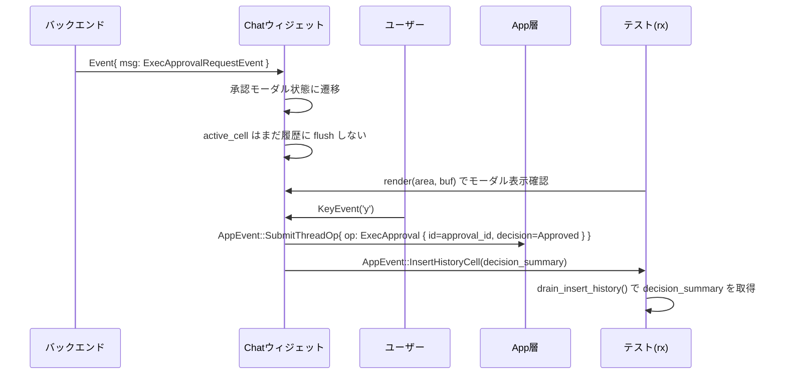
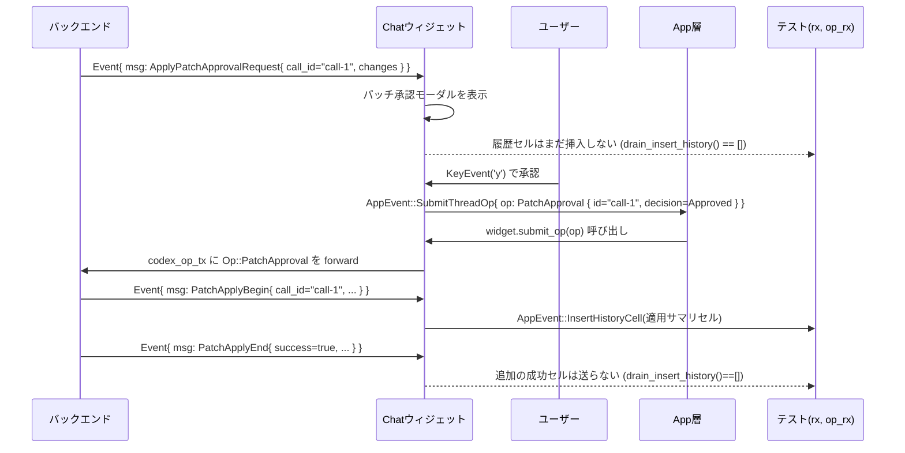

tui/src/chatwidget/tests/exec_flow.rs のコード解説です。

---

## 0. ざっくり一言

このファイルは、Chat ウィジェットが **コマンド実行（exec）・背景ターミナル（unified exec）・パッチ適用・画像ツール呼び出し** を扱う際の挙動を、エンドツーエンドに近い形で検証するテスト群です。  
バックエンドからのイベントとユーザー操作に応じて、**履歴セル・モーダル UI・ステータス行・App への Op 送信** が期待どおりになることを確認しています。

> 行番号情報はこのインターフェースからは取得できないため、要求形式 `ファイル名:L開始-終了` での厳密な行指定は行っていません。根拠は代わりに「どのテスト関数で確認できるか」を明示します。

---

## 1. このモジュールの役割

### 1.1 概要

このテストモジュールは、主に次のような問題を検証しています。

- **Exec 承認フロー**  
  - ExecApprovalRequestEvent を受けたときの承認モーダル表示、キーボード操作（`y` / `n`）による承認/拒否、履歴への決定行追加、ExecApproval Op 送信など。
- **Exec / Exploring / Unified Exec の履歴セル管理**  
  - コマンド開始 (`begin_exec` / unified exec startup) と終了 (`end_exec` / ExecCommandEndEvent) の組み合わせで、履歴セルがいつ・どのように flush されるか。
  - 「Exploring」グルーピングと「Ran …」サマリ行の表示内容。
- **パッチ適用フロー**  
  - ApplyPatchApprovalRequestEvent → モーダル表示 → キー入力で承認 → PatchApplyBegin/End イベントによる履歴の更新。
- **画像表示・画像生成ツールの履歴反映**
- **ユーザーシェルコマンド（`!echo hi`）やスラッシュコマンドの扱い**
- **タスク状態（preamble・Task started/complete/aborted）と unified exec 待ち状態の連携**

Chat ウィジェット本体の実装は別モジュールですが、このファイルだけで「外部からどう使うか」「どんな挙動が契約されているか」がかなり分かります。

### 1.2 アーキテクチャ内での位置づけ

このファイルは **テスト側から見た Chat ウィジェットの公開 API** を行使する立場にあり、以下のコンポーネントと関わります。

- `make_chatwidget_manual` で構築される **チャットウィジェット本体（`chat`）**
- バックエンドからの `Event { id, msg: EventMsg::... }`
- チャットウィジェットが外側に送る `AppEvent`（履歴セル挿入や `SubmitThreadOp`）
- App がさらにバックエンドへ送る `Op`（ExecApproval, PatchApproval, RunUserShellCommand など）
- 描画には ratatui ベースの `Terminal` / `Buffer` / `Rect`、VT100 backend などを使用

関係を簡略図で表すと次のようになります。

```mermaid
graph TD
    Backend["Codex バックエンド\n(Event, Exec/Patch/Image 等)"]
    User["ユーザー入力\n(キー操作 / コマンド)"]
    Tests["本ファイルのテスト\n(exec_flow.rs)"]
    Widget["Chat ウィジェット\n(super::* から取得)"]
    App["App 層\n(AppEvent, Op)"]
    TUI["TUI 表示\n(ratatui Terminal/Buffer)"]

    Tests -->|make_chatwidget_manual| Widget
    Backend -->|Event{ msg: EventMsg::... }| Widget
    User -->|handle_key_event / on_* / terminal_interaction| Widget

    Widget -->|AppEvent::InsertHistoryCell\nAppEvent::SubmitThreadOp| Tests
    Widget -->|Op を App 経由で\ncodex_op_tx に forward| App

    Tests -->|render()/Terminal| TUI
    Widget -->|render(area, buf)| TUI
```

- Chat ウィジェットの定義や `make_chatwidget_manual` の実装はこのファイルにはなく、親モジュール（`super::*`）からインポートされています。
- 本ファイルは **外部 API の使い方と期待される副作用を固定する契約テスト**のような位置づけです。

### 1.3 設計上のポイント（テストから読み取れる範囲）

- **イベント駆動**  
  - すべての状態変化は `handle_codex_event` / `on_task_started` / `on_task_complete` / `on_terminal_interaction` / `handle_key_event` などの呼び出しを通じて行われます。
  - コマンド開始・終了も `begin_exec` / `end_exec` ヘルパーを経由します。
- **履歴セルのバッファリング戦略**
  - `chat.active_cell` で「まだ flush されていないアクティブなセル」を持ち、`drain_insert_history` で `AppEvent` 経由の履歴挿入をテスト側が取得します。
  - `begin_exec` では履歴は flush されず、`end_exec` で、状況に応じてアクティブセルが履歴に移されることが確認できます。
- **Exec / Exploring / Unified Exec の区別**
  - `ExecCommandSource::Agent` / `UnifiedExecStartup` / `UserShell` の違いによって、履歴の見え方が変わります（例: Exploring グループ vs 単発のユーザーシェル出力）。
- **承認フローと「ID」の扱い**
  - Exec 承認では `approval_id` がある場合はそれを `Op::ExecApproval { id, ... }` に載せる（`exec_approval_uses_approval_id_when_present`）。
  - パッチ承認では `call_id` が `Op::PatchApproval { id, ... }` に使われる（`apply_patch_approval_sends_op_with_call_id`）。
- **タスク完了後のイベント抑制**
  - タスク完了・中断後に来た unified exec の end / interaction イベントは UI に反映されないことをテストで明示（安全側の挙動）。
- **非同期テストと並行性**
  - ほぼすべてのテストが `#[tokio::test] async fn` であり、内部で async API を直接呼び出しています。
  - チャネル読み出しは `try_recv` を使い、ブロックしない前提でテストされているため、デッドロックが起きない構造になっています。

---

## 2. 主要な機能一覧（テストがカバーする振る舞い）

このモジュールで検証している主な機能を列挙します。

- Exec 承認関連
  - ExecApprovalRequestEvent による **承認モーダル表示**（理由あり/なし・マルチラインコマンド・長いコマンドなど）。
  - `y` / `n` キーで承認／拒否した際の **決定履歴行のフォーマット**。
  - ExecApproval 用の `id` に `approval_id` を優先利用。
  - AppServer からのパラメータを ExecApprovalRequestEvent に変換する際の **shell ラッパーの分解**。
- Exec 履歴セル
  - `begin_exec` → `end_exec` の成功パスで `• Ran ...` サマリとコマンド文字列が記録される。
  - 失敗パスではエラー出力が含まれる（`Bloop` など）。
  - `ExecCommandEndEvent` だけが届いた「孤児 end」ケースで、イベント内の command を使ってサマリを作る。
  - Exploring セルとの相互作用（孤児 end が別セルとして扱われ、Exploring セルを破壊しない／必要に応じて flush する）。
- Unified Exec / 背景ターミナル
  - `begin_unified_exec_startup` による unified exec の開始と、`unified_exec_processes` への登録。
  - `terminal_interaction` / `TerminalInteractionEvent` による「Waiting for background terminal」ステータスの更新とコマンド表示。
  - Task 完了・中断後の unified exec イベントの抑制。
  - `/ps` 相当の `add_ps_output` による背景ターミナル一覧出力。
- パッチ適用フロー
  - ApplyPatchApprovalRequestEvent に対して **承認モーダル**を表示し、diff サマリを UI 内に描画。
  - ユーザー承認後の PatchApplyBeginEvent による **適用サマリセル**。
  - PatchApplyEndEvent の成功時には **追加の成功セルを出さない**契約。
  - 自動承認 / 手動承認時のヘッダ文言の違い。
- 画像ツール
  - ローカル画像表示ツール呼び出し (ViewImageToolCallEvent) により、履歴セルが 1 つ追加される。
  - 画像生成完了 (ImageGenerationEndEvent) による履歴セル追加。
- コマンド入力（ユーザー側）
  - `!echo hi` のような「bang shell」入力を `/model` などの slash コマンドとは別経路で解釈し、`Op::RunUserShellCommand` を App server に送る。
  - タスク実行中の `/model` など禁止スラッシュコマンド発行時には、エラーメッセージの履歴セルを追加。
- Preamble / ステータス行
  - preamble（最初の commentary 行）を書き込んだ後でも、作業中ステータスが正しく復元される。
  - unified exec 開始時にステータス行の表示状態が正しく復元される。

---

## 3. 公開 API と詳細解説

ここでは「このテストから見える外部 API/コンポーネント」と「代表的なテスト関数（シナリオ）」を整理します。

### 3.1 型一覧（構造体・列挙体など）

> 定義そのものはすべて別モジュールにあります。この表は「テストから読み取れる役割」をまとめたものです。

#### ドメインイベント / コマンドまわり

| 名前 | 種別 | 役割 / 用途 | 根拠となるテスト |
|------|------|-------------|------------------|
| `Event` | 構造体 | `id: String` と `msg: EventMsg` をまとめたバックエンド→UI イベントのコンテナ。`chat.handle_codex_event` の入力。 | 多数のテストで `Event { id, msg: EventMsg::... }` を構築 |
| `EventMsg` | 列挙体 | バックエンドから来るメッセージの種類。`ExecApprovalRequest`, `ExecCommandEnd`, `TerminalInteraction`, `ViewImageToolCall`, `ImageGenerationEnd`, `ApplyPatchApprovalRequest`, `PatchApplyBegin`, `PatchApplyEnd`, `TurnStarted`, `TurnComplete`, `TurnAborted`, `AgentMessageDelta`, `SessionConfigured` などのバリアントが使われる。 | 各テスト内の `EventMsg::...` |
| `ExecApprovalRequestEvent` | 構造体 | Exec コマンド実行についてユーザーに承認を求めるイベント。`call_id`, `approval_id`, `turn_id`, `command: Vec<String>`, `cwd: PathBuf`, `reason`, `proposed_execpolicy_amendment`, `additional_permissions` などを含む。 | `exec_approval_emits_proposed_command_and_decision_history`, `approval_modal_exec_snapshot` など |
| `AppServerCommandExecutionRequestApprovalParams` | 構造体 | App server が exec 承認を要求するときの入力パラメータ。`exec_approval_request_from_params` の引数。`command: Option<String>` など。 | `app_server_exec_approval_request_splits_shell_wrapped_command` |
| `ExecCommandEndEvent` | 構造体 | 1 つのコマンドの終了を表す。`call_id`, `process_id`, `turn_id`, `command: Vec<String>`, `cwd`, `parsed_cmd`, `source: ExecCommandSource`, `stdout`, `stderr`, `aggregated_output`, `exit_code`, `duration`, `formatted_output`, `status: CoreExecCommandStatus` など。 | `exec_end_without_begin_uses_event_command` |
| `ExecCommandSource` | 列挙体 | コマンドの出自を表す。`Agent`, `UnifiedExecStartup`, `UserShell` などが使われている。表示スタイルやグルーピングを変えるために使用。 | `exec_history_shows_unified_exec_startup_commands`, `user_shell_command_renders_output_not_exploring` |
| `TerminalInteractionEvent` | 構造体 | unified exec 背景ターミナルへの入力を表す。`call_id`, `process_id`, `stdin`。 | `unified_exec_interaction_after_task_complete_is_suppressed`, `unified_exec_waiting_multiple_empty_snapshots` |
| `ApplyPatchApprovalRequestEvent` | 構造体 | パッチ適用の承認要求。`call_id`, `turn_id`, `changes: HashMap<PathBuf, FileChange>`, `reason`, `grant_root`。 | `approval_modal_patch_snapshot`, `apply_patch_events_emit_history_cells` |
| `PatchApplyBeginEvent` | 構造体 | パッチ適用開始通知。`auto_approved`, `changes` など。 | `apply_patch_events_emit_history_cells` |
| `PatchApplyEndEvent` | 構造体 | パッチ適用終了通知。`stdout`, `stderr`, `success`, `changes`, `status: CorePatchApplyStatus`。 | 同上 |
| `FileChange` | 列挙体 | ファイルごとの変更内容（`Add { content }` など）。diff サマリ表示用。 | パッチ系テスト全般 |
| `CoreExecCommandStatus` | 列挙体 | Exec コマンドの状態（`Completed` など）。 | `exec_end_without_begin_uses_event_command` |
| `CorePatchApplyStatus` | 列挙体 | パッチ適用処理の状態（`Completed` など）。 | `apply_patch_events_emit_history_cells` |

#### App / Op / ウィジェット内部状態

| 名前 | 種別 | 役割 / 用途 | 根拠テスト |
|------|------|-------------|-----------|
| `AppEvent` | 列挙体 | Chat ウィジェット → App 層への通知。`SubmitThreadOp { op, .. }` や、履歴セル挿入イベント（日付付きセルの集合）などが含まれる。テストでは `rx.try_recv()` で取得。 | `exec_approval_uses_approval_id_when_present`, `apply_patch_approval_sends_op_with_call_id` |
| `Op` | 列挙体 | App 層 → Codex backend への操作。`ExecApproval { id, decision, .. }`, `PatchApproval { id, decision }`, `RunUserShellCommand { command }` など。 | `exec_approval_uses_approval_id_when_present`, `bang_shell_command_submits_run_user_shell_command_in_app_server_tui` |
| `UnifiedExecProcessSummary` | 構造体 | unified exec 背景プロセスの概要。`key`, `call_id`, `command_display`, `recent_chunks`。ステータス表示や `/ps` 出力で利用。 | `unified_exec_wait_status_header_updates_on_late_command_display` |
| `SlashCommand` | 列挙体 | `/model` などのスラッシュコマンド種別。`dispatch_command` の引数。 | `disabled_slash_command_while_task_running_snapshot` |
| `ThreadId` | 構造体 | 会話スレッド ID。セッション ID としても使われる。 | `preamble_keeps_working_status_snapshot`, `bang_shell_command_submits_run_user_shell_command_in_app_server_tui` |
| `AskForApproval` | 列挙体 | 承認ポリシー（`Never`, `OnRequest` など）。`chat.config.permissions.approval_policy.set(...)` で設定。 | 承認モーダル系テスト |
| `ExecPolicyAmendment` | 構造体 | Exec policy の追記内容。モーダルから「今後は聞かない」系オプションに使われる。マルチライン prefix では非表示にする挙動をテストしている。 | `approval_modal_exec_multiline_prefix_hides_execpolicy_option_snapshot` |

#### UI / テスト補助

| 名前 | 種別 | 役割 / 用途 |
|------|------|-------------|
| `Rect` | 構造体 | ratatui の描画領域矩形。`Rect::new(x, y, width, height)` |
| `ratatui::buffer::Buffer` / `Buffer` | 構造体 | 描画内容を保持するバッファ。`Buffer::empty(area)` で生成し、`chat.render(area, &mut buf)` でレンダリング。 |
| `ratatui::Terminal<B>` | 構造体 | ratatui のテスト用/VT100 backend 用ターミナル。`draw` クロージャ内で `chat.render` を呼ぶ。 |
| `VT100Backend` | 構造体 | VT100 互換のテスト backend。`screen().contents()` でテキストスナップショット取得。 |
| `NamedTempFile` | 構造体 | 一時ロールアウトファイルを作るために使用。セッション設定 (SessionConfiguredEvent) に渡される。 |
| `assert_chatwidget_snapshot!` | マクロ | 描画結果や履歴セルの文字列を snapshot テストと比較するカスタムマクロ。 |
| `drain_insert_history` | 関数 | AppEvent チャネルから履歴セル挿入イベントをすべて読み出し、`Vec<Vec<String>>` 相当を返すテストヘルパー（推測）。多くのテストで「履歴が出たかどうか」を検証するのに使用。 |
| `lines_to_single_string` | 関数 | 履歴セル（複数行）を 1 つの `String` に連結するヘルパー。snapshot 比較用。 |
| `make_chatwidget_manual` | 関数 | Chat ウィジェットと、AppEvent 受信用チャネル `rx`、Op 送信用チャネル `op_rx` を返すテスト用ファクトリ。 |

> `make_chatwidget_manual` や `drain_insert_history` などの実装はこのファイルにはなく、親モジュール `super` で定義されています。

### 3.2 関数詳細（代表的なシナリオテスト 7 件）

テスト関数自体は引数も戻り値も持たない（`async fn test_name()` または `fn test_name()`）ため、「どういうシナリオを検証しているか」を中心に説明します。

#### `exec_approval_emits_proposed_command_and_decision_history()`

**概要**

- ExecApprovalRequestEvent によるコマンド承認モーダル表示と、`y` キーによる承認後の **履歴セル生成**を検証するテストです。

**引数 / 戻り値**

- 引数なし、戻り値なし (`async fn`，Tokio テスト)。

**内部処理の流れ**

1. `make_chatwidget_manual(None).await` で `(chat, rx, _op_rx)` を作成。
2. `ExecApprovalRequestEvent` を構築し、`command` に単一行の `["bash", "-lc", "echo hello world"]` を設定。
3. `chat.handle_codex_event(Event { msg: EventMsg::ExecApprovalRequest(ev), .. })` を呼ぶ。
4. `drain_insert_history(&mut rx)` で履歴セルを読み出し、「0 件であること」を確認（モーダル表示のみで履歴出力はしない契約）。
5. `chat.render(area, &mut buf)` でモーダルを描画し、`assert_chatwidget_snapshot!` で UI をスナップショット比較。
6. `chat.handle_key_event(KeyEvent::new(KeyCode::Char('y'), ...))` で承認。
7. 再度 `drain_insert_history` し、1 件の決定履歴セルが出ていることと、その内容が snapshot と一致することを確認。

**Examples（使用例）**

このテスト自体が、「Exec 承認モーダルを出し、ユーザーが `y` を押して決定履歴を作る」という代表的な使用例になっています。

```rust
let (mut chat, mut rx, _op_rx) = make_chatwidget_manual(None).await;

chat.handle_codex_event(Event {
    id: "sub-short".into(),
    msg: EventMsg::ExecApprovalRequest(ev),
});

assert!(drain_insert_history(&mut rx).is_empty());

// ユーザー承認
chat.handle_key_event(KeyEvent::new(KeyCode::Char('y'), KeyModifiers::NONE));
let decision_cells = drain_insert_history(&mut rx);
```

**Errors / Panics**

- 条件不一致時に `assert!` や `expect` が panic しますが、これはテストとしての想定どおりです。
- 非同期エラーは使用していません（`anyhow::Result` も返さない）。

**Edge cases（エッジケース）**

- 単一行かつ短いコマンドを対象としており、マルチラインや長すぎる場合は別テスト（`exec_approval_decision_truncates_multiline_and_long_commands`）が担当します。
- `approval_id` が `Some` のケースですが、このテストでは id の選択ロジックは検証していません。

**使用上の注意点（本体コードを利用する側）**

- Exec 承認イベントを投げても、**ユーザーが決定するまで履歴セルは出ない**ことが前提です。UI 側でモーダル表示を行う必要があります。
- コマンド承認の結果（Approved / Rejected）は、履歴セルだけでなく `Op::ExecApproval` にも反映されることを別テストで確認しています。

---

#### `exec_approval_decision_truncates_multiline_and_long_commands()`

**概要**

- **マルチラインコマンド**および**非常に長い単一行コマンド**について、モーダルと履歴セルの表示がどのようにトリミングされるかを検証します。

**内部処理の流れ（要約）**

1. `command` に `"echo line1\necho line2"` を含む ExecApprovalRequestEvent を送る。
2. 履歴セルはまだ出ないことを確認した上で描画し、モーダルに `"echo line1"` が含まれるかを Buffer 走査で確認。
3. `n` キーで拒否し、履歴セルに適切なシングルラインの決定サマリが入っているかを snapshot で確認。
4. 200 文字以上の長さを持つ `echo aaaa...` コマンドについても ExecApprovalRequestEvent を送り、`n` で拒否。
5. 生成された履歴セルが **80 文字以内にトリミングされ、末尾に `...` が付く**ことを snapshot で検証。

**言語固有の観点**

- 長さ制限やマルチライン処理は UI ロジックであり、Rust 特有の所有権/並行性の問題はこのテストでは表面化していません。
- ただし、`String` が大きくても panic せず安全に扱われていることの確認の一助になります。

**Edge cases**

- マルチラインのとき：
  - モーダルは **先頭行を含む**が、履歴サマリは「単一行 & 省略付き」で記録される契約になっている。
- 長大なコマンド：
  - 履歴サマリは 80 文字以内 + `"..."` にトリミングされる。

---

#### `exec_end_without_begin_does_not_flush_unrelated_running_exploring_cell()`

**概要**

- 「Exploring」用の exec セルがアクティブな状態で、別の unified exec が始まり、さらにその end が「孤児 end」として扱われた場合の挙動を検証します。  
- 目的は、**孤児 end が既存の Exploring セルを壊さない（別の履歴セルとして flush される）**ことを確認することです。

**処理の流れ**

1. `chat.on_task_started()` でタスク開始。
2. `begin_exec(&mut chat, "call-exploring", "cat /dev/null")` で Exploring 用コマンドを開始。履歴はまだ flush されないことを確認。
3. `active_blob(&chat)` でアクティブセルのレンダリングを文字列取得し、「Read null」が含まれていることを確認。
4. `begin_unified_exec_startup(&mut chat, "call-orphan", "proc-1", "echo repro-marker")` で unified exec の別プロセスを開始。履歴はまだ flush されない。
5. `end_exec(&mut chat, orphan, "repro-marker\n", "", 0)` で orphan exec を終了。
6. `drain_insert_history` の結果が 1 件であり、それが `"• Ran echo repro-marker"` を含むことを確認。
7. その後の `active_blob(&chat)` を確認し、Exploring セルが `"• Exploring"` と `"Read null"` を含んだまま残っており、`"echo repro-marker"` が含まれていないことを検証。

**Edge cases / 契約**

- 「孤児 end」（開始情報のない ExecCommandEnd）は、既存の Exploring グループに紐づけず **独立した履歴セル**として扱われるべき。
- 進行中の Exploring セル（別 call_id）は、孤児 end によって flush されたり上書きされたりしない。

**安全性・並行性の観点**

- `begin_exec` が複数回呼ばれても、内部で call_id ごとにトラッキングされる契約です。
- テストでは直列に実行しているためレースはありませんが、設計として「call_id に基づくマッピング」があることが暗黙に示されています。

---

#### `unified_exec_wait_status_header_updates_on_late_command_display()`

**概要**

- unified exec のプロセス情報 (`unified_exec_processes`) が先に追加されていて、後から `on_terminal_interaction` が来た場合に、ステータス行ヘッダと詳細が正しく更新されるかを検証します。

**処理の流れ**

1. `chat.on_task_started()` でタスク開始。
2. `chat.unified_exec_processes.push(UnifiedExecProcessSummary { ... "sleep 5" ... })` で「sleep 5」プロセスを登録。
3. `chat.on_terminal_interaction(TerminalInteractionEvent { call_id: "call-1", process_id: "proc-1", stdin: "" })` を呼ぶ。
4. `chat.active_cell.is_none()` で、新しい履歴セルはまだ生成されていないことを確認。
5. `chat.current_status.header` と `status_widget().header()/details()` を確認し、ヘッダが `"Waiting for background terminal"`, details が `"sleep 5"` になっていることを検証。

**契約**

- unified exec の「待機中」状態では、履歴セルではなく **ステータスウィジェット**で状況を伝える。
- コマンド詳細は 1 行に収まる形で `details()` に出る（`unified_exec_wait_status_renders_command_in_single_details_row_snapshot` で UI snapshot も確認）。

---

#### `view_image_tool_call_adds_history_cell()`

**概要**

- ViewImageToolCallEvent を受け取ったときに、履歴セルが 1 つ追加されることを検証するテストです。

**処理の流れ**

1. `let image_path = chat.config.cwd.join("example.png");` で相対パスから絶対パスを生成。
2. `chat.handle_codex_event(Event { msg: EventMsg::ViewImageToolCall(ViewImageToolCallEvent { ... }) })` を呼ぶ。
3. `drain_insert_history(&mut rx)` の結果が 1 件であることを確認。
4. その 1 件を `lines_to_single_string` でまとめて snapshot 比較。

**契約**

- 画像表示系ツール呼び出しは「モーダル」ではなく **即座に履歴セル**を追加する。
- セルの内容（パス表現など）は snapshot によって固定されている。

---

#### `apply_patch_events_emit_history_cells()`

**概要**

- パッチ適用フローの中で、どの段階で履歴セルが出る/出ないかを細かく検証します。

**処理の流れ**

1. `ApplyPatchApprovalRequestEvent` を送る。
   - `drain_insert_history` が空であることを確認 → 承認モーダル表示のみで履歴は出さない。
   - 描画結果から `"foo.txt (+1 -0)"` のような diff サマリがモーダルに表示されていることを確認。
2. `PatchApplyBeginEvent { auto_approved: true, ... }` を送る。
   - `drain_insert_history` 結果から、`"Added foo.txt"` または `"Edited foo.txt"` を含む履歴セルが 1 つ以上出ていることを確認。
3. `PatchApplyEndEvent { success: true, status: Completed, ... }` を送る。
   - その後の `drain_insert_history` が空であることを確認 → 成功結果の専用セルは作らない契約。

**Edge cases**

- auto_approved と manual approval の違いでヘッダ文言が変わるが、成功時に「完了セル」を新たに追加しない点は共通です。

**安全性の観点**

- 成功/失敗ごとの振る舞いはここでは success=true のみを確認。失敗時の挙動は別テストまたは別モジュールで扱われている可能性があります（このファイルからは不明）。

---

#### `bang_shell_command_submits_run_user_shell_command_in_app_server_tui()`

**概要**

- 入力欄に `!echo hi` を打ち込んで Enter したとき、`Op::RunUserShellCommand { command: "echo hi" }` が App server に送られることを検証します。

**処理の流れ**

1. `make_chatwidget_manual` で `(chat, rx, op_rx)` を取得。
2. `SessionConfiguredEvent` を送り、チャットウィジェットを初期化。履歴と既存 Op を drain。
3. `chat.bottom_pane.set_composer_text("!echo hi".to_string(), ...)` で入力欄に文字列をセット。
4. `chat.handle_key_event(KeyEvent::new(KeyCode::Enter, ...))` で送信。
5. `op_rx.try_recv()` で受け取った `Op` が `Op::RunUserShellCommand { command }` であり、`command == "echo hi"` であることを確認。
6. 履歴チャネル `rx` に対して `try_recv` し、追加の履歴がない（Empty）ことを確認。

**契約**

- `!` で始まる入力は「通常の対話」ではなく **ユーザーシェルコマンド**として扱う。
- このとき AppEvent による履歴セルは直ちには追加されない（結果が返ってきたときに ExecCommandEndEvent で扱われる）。

**安全性・並行性の観点**

- `try_recv` を使っているため、Op が複数飛んでいないことを確認しつつ、ブロッキングを避けています。
- NamedTempFile などのリソースは test 終了時に OS がクリーンアップします。

---

### 3.3 その他の関数（テスト関数インベントリー）

以下は、残りのテスト関数を用途だけ簡単にまとめた一覧です（ファイル内に定義される `#[tokio::test]` / `#[test]` 関数）。

| 関数名 | 役割（1 行） |
|--------|--------------|
| `app_server_exec_approval_request_splits_shell_wrapped_command` | App server の exec 承認パラメータから `Vec<String>` コマンド列に正しく分解されることを検証。 |
| `exec_approval_uses_approval_id_when_present` | ExecApproval Op の `id` に `approval_id` が使われることを確認。 |
| `preamble_keeps_working_status_snapshot` | preamble 行が履歴にコミットされた後でも作業中ステータスが維持されることを snapshot で確認。 |
| `unified_exec_begin_restores_status_indicator_after_preamble` | unified exec 開始時にステータスインジケータの表示が復元されることを確認。 |
| `unified_exec_begin_restores_working_status_snapshot` | preamble + unified exec 開始後のステータス表示を snapshot で確認。 |
| `exec_history_cell_shows_working_then_completed` | `begin_exec`→`end_exec` 成功時の履歴セルが「• Ran ...」を含むことを確認。 |
| `exec_history_cell_shows_working_then_failed` | 失敗時（exit_code!=0）の履歴セルにエラー出力が含まれることを確認。 |
| `exec_end_without_begin_uses_event_command` | 孤児 ExecCommandEndEvent からコマンド文字列を取得してサマリを描画することを検証。 |
| `exec_end_without_begin_flushes_completed_unrelated_exploring_cell` | 完了済み Exploring セルが orphan end に先立って flush される契約を検証。 |
| `overlapping_exploring_exec_end_is_not_misclassified_as_orphan` | Exploring セル内で overlapping なコマンドが orphan 扱いされないことを検証。 |
| `exec_history_shows_unified_exec_startup_commands` | UnifiedExecStartup のコマンドが `• Ran ...` として履歴に残ることを確認。 |
| `exec_history_shows_unified_exec_tool_calls` | UnifiedExecStartup ソースの `ls` が Exploring 表示 (`• Explored` ... `List ls`) になることを確認。 |
| `unified_exec_unknown_end_with_active_exploring_cell_snapshot` | orphan end と active Exploring セルが同時存在するケースを snapshot で確認。 |
| `unified_exec_end_after_task_complete_is_suppressed` | タスク完了後の unified exec end が履歴に出ないことを確認。 |
| `unified_exec_interaction_after_task_complete_is_suppressed` | タスク完了後の TerminalInteraction イベントが履歴に出ないことを確認。 |
| `unified_exec_wait_after_final_agent_message_snapshot` | final agent message 後に unified exec wait 行がどう表示されるか snapshot で確認。 |
| `unified_exec_wait_before_streamed_agent_message_snapshot` | streaming agent message より前の unified exec wait の表示を snapshot で確認。 |
| `unified_exec_waiting_multiple_empty_snapshots` | 空 stdin での複数回の wait 状態と TurnComplete 後の表示を snapshot で確認。 |
| `unified_exec_wait_status_renders_command_in_single_details_row_snapshot` | 長いコマンドがステータス詳細 1 行にどのように折り返されるか snapshot で確認。 |
| `unified_exec_empty_then_non_empty_snapshot` | 空→非空の stdin の組み合わせで unified exec wait がどのように履歴に反映されるか確認。 |
| `unified_exec_non_empty_then_empty_snapshots` | 非空→空の stdin パターンの before/after を snapshot で確認。 |
| `image_generation_call_adds_history_cell` | ImageGenerationEndEvent による履歴セル追加を検証。 |
| `exec_history_extends_previous_when_consecutive` | 連続する Exploring コマンドが 1 つのアクティブセル内にまとまっていく様子をステップごと snapshot。 |
| `user_shell_command_renders_output_not_exploring` | UserShell ソースの exec 履歴が「Exploring」ではなく普通の出力として表示されることを確認。 |
| `disabled_slash_command_while_task_running_snapshot` | タスク実行中に `/model` を実行した場合のエラーメッセージ履歴を snapshot で確認。 |
| `approval_modal_exec_snapshot` | Exec 承認モーダル全文を VT100 backend 上で snapshot 取得。 |
| `approval_modal_exec_without_reason_snapshot` | reason 無しの Exec 承認モーダルの余白・レイアウトを snapshot で検証。 |
| `approval_modal_exec_multiline_prefix_hides_execpolicy_option_snapshot` | マルチライン prefix の ExecPolicyAmendment の場合に「don't ask again」オプションが出ないことを確認。 |
| `approval_modal_patch_snapshot` | パッチ承認モーダル全文を snapshot で確認。 |
| `interrupt_preserves_unified_exec_processes` | TurnAborted(Interrupted) 後も unified exec プロセス一覧が保持され `/ps` に出ることを確認。 |
| `interrupt_preserves_unified_exec_wait_streak_snapshot` | 中断後に unified exec wait streak がどう履歴に残るか snapshot。 |
| `turn_complete_keeps_unified_exec_processes` | TurnComplete 後も unified exec プロセス一覧が保持され `/ps` に出ることを確認。 |
| `apply_patch_manual_approval_adjusts_header` | manual approval の PatchApplyBeginEvent のヘッダ文言を確認。 |
| `apply_patch_manual_flow_snapshot` | manual approval のフロー全体を履歴 snapshot で確認。 |
| `apply_patch_approval_sends_op_with_call_id` | パッチ承認時に `Op::PatchApproval { id: call_id }` が送られることを検証。 |
| `apply_patch_full_flow_integration_like` | パッチ承認要求→キー入力→Op 送信→PatchApplyBegin/End の一連の統合的フローを検証（Op forwarding 含む）。 |
| `apply_patch_untrusted_shows_approval_modal` | OnRequest ポリシー時にパッチ承認モーダルのタイトルが表示されることを検証。 |
| `apply_patch_request_shows_diff_summary` | パッチ承認モーダル内部に diff ヘッダ＋各行サマリが表示されることを検証。 |

---

## 4. データフロー

ここでは代表的な 2 つのシナリオについて、データの流れを sequence diagram で示します。

### 4.1 Exec 承認フロー（短いコマンド）

対応テスト：`exec_approval_emits_proposed_command_and_decision_history` / `exec_approval_uses_approval_id_when_present`



要点：

- ExecApprovalRequestEvent を受けた時点では履歴セルは出ず、モーダルのみが表示されます。
- ユーザー操作により初めて履歴セルが挿入され、同時に `Op::ExecApproval` が App 層に送信されます。
- `approval_id` がある場合は `id` にそれが使われる契約です。

### 4.2 パッチ適用フロー（手動承認）

対応テスト：`apply_patch_manual_flow_snapshot` / `apply_patch_approval_sends_op_with_call_id` / `apply_patch_events_emit_history_cells`



要点：

- 承認要求段階ではモーダルのみが UI に出て、履歴には変化なし。
- 承認キー押下により `PatchApproval` が `call_id` を `id` として送られる。
- PatchApplyBeginEvent で初めて履歴セルが追加され、PatchApplyEndEvent は成功時には追加のセルを生成しない契約です。

---

## 5. 使い方（How to Use）

このファイルはテストコードですが、Chat ウィジェットを **外部からどう使うか**の典型例にもなっています。

### 5.1 基本的な使用方法（擬似コード）

以下は実際のテストパターンを簡略化した「Chat ウィジェットの基本フロー」です。

```rust
// 1. チャットウィジェットとチャネルを用意する
let (mut chat, mut app_event_rx, mut op_rx) = make_chatwidget_manual(/*model_override*/ None).await;

// 2. バックエンドのイベントをウィジェットに渡す
chat.handle_codex_event(Event {
    id: "turn-1".into(),
    msg: EventMsg::TurnStarted(TurnStartedEvent {
        turn_id: "turn-1".to_string(),
        started_at: None,
        model_context_window: None,
        collaboration_mode_kind: ModeKind::Default,
    }),
});

// 3. ユーザー入力（キーイベント）を渡す
chat.handle_key_event(KeyEvent::new(KeyCode::Char('y'), KeyModifiers::NONE));

// 4. ウィジェットの描画
let width: u16 = 80;
let height = chat.desired_height(width);
let area = Rect::new(0, 0, width, height);
let mut buf = ratatui::buffer::Buffer::empty(area);
chat.render(area, &mut buf);

// 5. AppEvent 経由で履歴セル・Op などを取得する
while let Ok(app_ev) = app_event_rx.try_recv() {
    match app_ev {
        AppEvent::InsertHistoryCell { lines, .. } => {
            // lines: Vec<String> として履歴表示用のセル
        }
        AppEvent::SubmitThreadOp { op, .. } => {
            // op_rx へ forward するなど
            chat.submit_op(op);
        }
        _ => {}
    }
}
```

### 5.2 よくある使用パターン

- **Exec コマンドの開始と終了**

```rust
let begin = begin_exec(&mut chat, "call-1", "ls -la");
// 中間で active_blob(&chat) などで進捗表示を確認
end_exec(&mut chat, begin, "stdout text", "stderr text", 0);
let cells = drain_insert_history(&mut app_event_rx); // 完了セルが 1 件 flush される
```

- **Unified exec（背景ターミナル）**

```rust
let begin = begin_unified_exec_startup(&mut chat, "call-1", "proc-1", "cargo test");

// ユーザーがターミナルに入力したら TerminalInteractionEvent を送る
terminal_interaction(&mut chat, "call-1-stdin", "proc-1", "ls\n");

// タスクが完了したら TurnCompleteEvent を送る
chat.handle_codex_event(Event {
    id: "turn-1".into(),
    msg: EventMsg::TurnComplete(TurnCompleteEvent { .. }),
});
```

- **パッチ承認**

```rust
chat.handle_codex_event(Event {
    id: "sub-apply".into(),
    msg: EventMsg::ApplyPatchApprovalRequest(ApplyPatchApprovalRequestEvent { .. }),
});

// ユーザー承認
chat.handle_key_event(KeyEvent::new(KeyCode::Char('y'), KeyModifiers::NONE));
```

### 5.3 よくある間違い（テストから読み取れるもの）

```rust
// 間違い例: ExecCommandEndEvent だけを送り、call_id/command が不整合
chat.handle_codex_event(Event {
    id: "call-orphan".into(),
    msg: EventMsg::ExecCommandEnd(ExecCommandEndEvent {
        call_id: "call-orphan".into(),
        command: vec![], // コマンド無し
        // ...
    }),
});
// → テストでは常に command を埋めており、「孤児 end でも command からサマリを作る」ことが前提。

// 正しい例: イベント側に command を含める
let command = vec!["bash".into(), "-lc".into(), "echo orphaned".into()];
chat.handle_codex_event(Event {
    id: "call-orphan".into(),
    msg: EventMsg::ExecCommandEnd(ExecCommandEndEvent { command, .. }),
});
```

```rust
// 間違い例: タスク完了後にも unified exec の end/interaction を流し続ける
chat.on_task_complete(None, false);
end_exec(&mut chat, begin, "", "", 0);
// → テストでは、このケースでは履歴が追加されないことを期待している。

// 正しい例: タスク完了後は背景ターミナル操作を抑制する
// （別の turn で改めて unified exec を開始する）
```

### 5.4 使用上の注意点（まとめ）

- **イベント順序が重要**  
  - Begin → End の順で Exec イベントを送ることが前提です。順序が逆だと孤児 end として扱われ、Exploring セルと紐付かなくなります。
- **タスク完了後の振る舞い**  
  - `on_task_complete` や TurnComplete/TurnAborted イベント後は unified exec の wait / end / interaction は基本的に UI に反映されません。新しい turn で改めて開始する必要があります。
- **承認ポリシー**  
  - `AskForApproval::OnRequest` の場合、Exec/パッチなどは必ずモーダル経由でユーザー承認を得る前提です。Never の場合は直接適用され、モーダルは表示されない可能性があります（このファイルでは OnRequest ケースのみ検証）。
- **安全性・セキュリティ**  
  - Exec/パッチ適用といった危険な操作には必ず「承認モーダル」や「diff サマリ」が存在することがテストで保証されています。新しい危険操作を追加する場合も同様の UX を踏襲するのが望ましいと考えられます（ただし詳細はこのファイルからは分かりません）。

---

## 6. 変更の仕方（How to Modify）

### 6.1 新しい機能を追加する場合（テスト観点）

1. **イベント定義の追加**
   - 新しい EventMsg バリアントや Op を追加した場合、その型定義は別モジュールに置かれます。
2. **Chat ウィジェットの実装を拡張**
   - `handle_codex_event` や `handle_key_event` に新しい分岐を追加し、履歴セル or モーダルを更新するロジックを実装します。
3. **本ファイルに統合テストを追加**
   - `make_chatwidget_manual` を使って chat を構築し、新イベントを送信。
   - `drain_insert_history` や `render` を使って期待される UI / 履歴セルを検証。
   - 必要に応じて `assert_chatwidget_snapshot!` を使い、レイアウト全体を snapshot で固定します。

### 6.2 既存の機能を変更する場合（契約の確認ポイント）

- **Exec / Exploring / Unified Exec**
  - 履歴セルの flush タイミングやヘッダ文字列（`• Ran`, `• Exploring`, `• Explored` など）を変える際は、該当する exec 関連テストすべてに影響します。
- **承認モーダル**
  - 文言や option（例: `don't ask again`）の表示条件を変えると、`approval_modal_*` 系 snapshot がすべて壊れます。
- **パッチ適用フロー**
  - PatchApplyEndEvent で成功セルを出さない契約を変更する場合、`apply_patch_events_emit_history_cells` などの期待をすべて見直す必要があります。
- **タスク状態と unified exec**
  - TurnComplete/TurnAborted 後のイベント抑制ロジックを変えると、安全性・UX の契約に関わるため、`unified_exec_*` 系テストを全て再確認する必要があります。

---

## 7. 関連ファイル

このモジュールと密接に関係する（とテストから推測できる）モジュール・コンポーネントをまとめます。正確なファイルパスはコードから直接は分からないため、モジュール名レベルで記載します。

| パス / モジュール | 役割 / 関係 |
|-------------------|------------|
| `tui::chatwidget`（親モジュール; `super::*`） | Chat ウィジェット本体・`make_chatwidget_manual`・`begin_exec`・`end_exec`・`begin_unified_exec_startup`・`terminal_interaction` などのテストヘルパーとメソッドを提供。 |
| `crate::custom_terminal` | VT100 backend とラップした `Terminal` 実装を提供し、承認モーダルなどの snapshot テストに使用。 |
| `codex_protocol::protocol`（と推測されるモジュール群） | ExecApprovalRequestEvent, ApplyPatchApprovalRequestEvent, TurnStartedEvent, TurnCompleteEvent, TurnAbortedEvent, ReviewDecision などのプロトコル型を定義。 |
| `codex_shell_command::parse_command` | `parse_command(&command)` で `Vec<String>` からコマンド構造を生成するユーティリティ。ExecCommandEndEvent で使用。 |
| `ratatui` | TUI 描画ライブラリ。`Rect`, `Buffer`, `Terminal`, TestBackend などを通じて UI 表示を snapshot するために使われる。 |
| `tokio` | `#[tokio::test]` を通じて async テストを実行するランタイム。Chat ウィジェットの非同期 API を直接テストするために必要。 |

---

このファイルは、Chat ウィジェットの exec / patch / unified exec まわりの **契約テスト集**として読むと理解しやすく、  
新たなツール呼び出しや承認フローを追加・変更する際の「振る舞い仕様書」の役割も果たしています。
