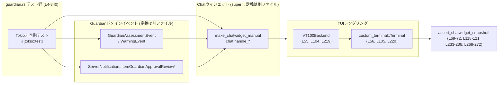
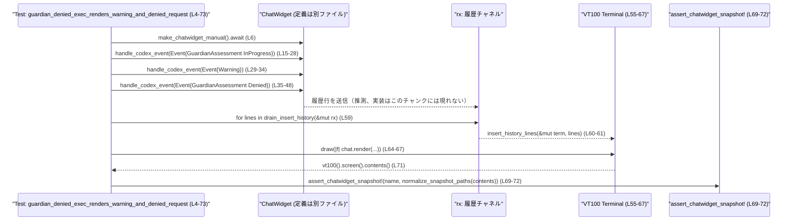

# tui/src/chatwidget/tests/guardian.rs コード解説

## 0. ざっくり一言

このファイルは、チャットウィジェットが「Guardian」（コマンド実行の安全性レビュー）関連のイベントやサーバ通知を受け取ったときに、TUI 上でどのように表示・状態管理されるかをスナップショットテストで検証するモジュールです。  
否認・承認・サーバ側レビュー・並列レビューといったシナリオごとに UI とステータス表示の挙動を確認します（`tui/src/chatwidget/tests/guardian.rs:L4-340`）。

---

## 1. このモジュールの役割

### 1.1 概要

- このモジュールは **Guardian によるコマンド実行レビュー機能**の UI 振る舞いを検証するための非同期テスト群を提供します。
  - Codex 側から届く `GuardianAssessmentEvent` / `WarningEvent` を処理した結果の画面表示をスナップショットで検証します（否認・承認など、`L4-122`）。
  - アプリケーションサーバ側の `ServerNotification::ItemGuardianApprovalReview*` を処理した結果としてのステータス表示・履歴レンダリングを検証します（`L124-237`）。
  - Guardian レビューが複数並行して進行する場合の、集約ステータスと個別ステータスの更新ロジックを検証します（`L239-340`）。

### 1.2 アーキテクチャ内での位置づけ

このテストモジュールは、「チャットウィジェット（`chat`）の公開 API」を外側から呼び出すことで、Guardian 関連の UI 振る舞いを検証しています。

- `super::*` からインポートされるチャットウィジェット関連 API（`make_chatwidget_manual`, `ChatWidget::handle_codex_event`, `ChatWidget::handle_server_notification`, `ChatWidget::render` など）を利用します（`L1, L6, L15, L80, L134, L175, L248, L280`）。
- Guardian ドメインイベントやサーバ通知として、
  - `GuardianAssessmentEvent`, `GuardianAssessmentStatus`, `GuardianAssessmentAction` などの Codex 側イベント（`L15-27, L35-47, L80-96, L248-264, L280-296, L298-314, L316-332`）
  - `ServerNotification::ItemGuardianApprovalReview*` および `GuardianApprovalReview`（`L134-151, L175-212`）
  を生成し、チャットウィジェットに渡します。
- TUI のレンダリングには `VT100Backend` と `custom_terminal::Terminal` が使われ、画面内容を VT100 スクリーンから取得してスナップショットと比較します（`L50-72, L99-121, L214-236`）。

これを簡略化した依存関係図は次のとおりです。



### 1.3 設計上のポイント

- **非同期テスト（Tokio ランタイム）**
  - すべてのテスト関数は `#[tokio::test]` + `async fn` で定義され、チャットウィジェットの非同期初期化や内部処理に対応しています（`L4, L75, L124, L164, L239, L275`）。
- **スナップショットテストによる UI 検証**
  - VT100 互換バックエンドを使って TUI の画面内容を文字列として取得し、`assert_chatwidget_snapshot!` マクロで期待値と比較する形になっています（`L55-72, L104-121, L219-236, L268-272`）。
- **Guardian イベントのフルパス駆動**
  - チャットウィジェット内部の状態を直接検査するのではなく、「Guardian イベント → チャットウィジェットのハンドラ → レンダリング結果 → スナップショット／ステータス」といったフロー全体を通して検証しています（`L15-47, L80-96, L134-151, L175-212, L248-265, L280-332`）。
- **安全性・セキュリティ面**
  - 危険なシェルコマンド（`rm -rf ...` など）は **すべて文字列リテラルとしてのみ扱われ、実行されることはありません**。テストでは UI 上の表示内容のみを検証しているため、このファイル単体ではコマンド実行に伴うセキュリティリスクはありません（`L8-13, L91-95, L168-173, L245-247, L291-295, L309-313, L327-331`）。
- **エラー処理**
  - 端末生成や履歴挿入、描画の失敗は `.expect(...)` やアサートでただちにテスト失敗（panic）扱いにしており、Result のエラー分岐を個別に処理してはいません（`L56-57, L60-61, L66-67, L105-106, L109-110, L115-116, L220-221, L224-225, L229-231`）。
- **並行レビューの UI 契約**
  - 複数の Guardian レビューが同時に進行する場合、否認済みレビューを除いた残りのレビューがステータス表示に残ることをテストで保証しています（`L239-273, L275-339`）。

---

## 2. 主要な機能・コンポーネント一覧（インベントリー）

### 2.1 テスト関数一覧

| 名前 | 種別 | 役割 / 用途 | 根拠 |
|------|------|------------|------|
| `guardian_denied_exec_renders_warning_and_denied_request` | Tokio 非同期テスト関数 | Codex からの Guardian 否認イベント＋警告を処理した結果、TUI に「警告メッセージ」と「否認されたリクエスト」が期待通りレンダリングされるかをスナップショットで検証します。 | `tui/src/chatwidget/tests/guardian.rs:L4-73` |
| `guardian_approved_exec_renders_approved_request` | Tokio 非同期テスト関数 | Codex からの Guardian 承認イベントを処理した結果、TUI に承認されたコマンドリクエストが正しく表示されるかをスナップショットで検証します。 | `L75-122` |
| `app_server_guardian_review_started_sets_review_status` | Tokio 非同期テスト関数 | サーバ通知 `ItemGuardianApprovalReviewStarted` を処理した際に、ステータスウィジェットのヘッダと詳細テキストが「Reviewing approval request」と対象コマンド文字列で更新されることを検証します。 | `L124-162` |
| `app_server_guardian_review_denied_renders_denied_request_snapshot` | Tokio 非同期テスト関数 | サーバ通知による Guardian レビュースタートと、その後の Denied 完了通知を処理した結果、否認されたリクエストが履歴にどのようにレンダリングされるかをスナップショットで検証します。 | `L164-237` |
| `guardian_parallel_reviews_render_aggregate_status_snapshot` | Tokio 非同期テスト関数 | Guardian レビューが 2 件並行で InProgress のとき、ボトムポップアップに集約ステータス（一括的な「レビュー中」表示）が期待通りレンダリングされるかをスナップショットで検証します。 | `L239-273` |
| `guardian_parallel_reviews_keep_remaining_review_visible_after_denial` | Tokio 非同期テスト関数 | 並行する 2 件のレビューのうち 1 件だけが Denied になったとき、残り 1 件の InProgress レビューに対応するコマンド詳細がステータスとして維持されることを検証します。 | `L275-339` |

### 2.2 主な外部コンポーネント一覧（このファイルから利用）

> 型や関数の定義そのものは別ファイルにあります。ここでは「どう使われているか」のみを整理します。

| 名前 | 種別 | 役割 / 用途 | 使用箇所（根拠） |
|------|------|------------|------------------|
| `make_chatwidget_manual` | 関数 | テスト用に初期化されたチャットウィジェットと関連チャネルを生成します。戻り値は `(chat, rx, op_rx)` タプルです。 | `L6, L77, L126, L166, L241, L277` |
| `chat: ...` | 構造体インスタンス | チャットウィジェット本体。Guardian イベントやサーバ通知のハンドラ、および描画機能を提供します。 | 生成 `L6, L77, L126, L166, L241, L277`／使用 `L7, L15, L29, L35, L51, L65, L80, L100, L114, L134, L153-161, L175, L195, L215, L229, L242, L248, L268, L280, L298, L316, L335-338` |
| `chat.handle_codex_event` | メソッド | Codex から届く `Event`（特に `GuardianAssessment` と `Warning`）を処理し、内部状態と表示キューを更新します。 | `L15-28, L29-34, L35-48, L80-97, L248-265, L280-297, L298-315, L316-333` |
| `chat.handle_server_notification` | メソッド | サーバからの `ServerNotification`（Guardian Approval Review 関連）を処理します。 | `L134-151, L175-192, L194-212` |
| `chat.desired_height` | メソッド | 指定された画面幅に対してチャットウィジェットが必要とする高さ（行数）を返します。TUI のビューポート計算に使用されています。 | `L51, L100, L215` |
| `chat.render` | メソッド | 与えられた矩形領域に対してチャット UI を描画します。 | `L65, L114, L229` |
| `chat.bottom_pane.status_widget()` | メソッドチェーン | ステータスインジケータウィジェットを取得します。Guardian レビュー中のステータス文言の検証に用いられています。 | `L153-161` |
| `chat.current_status` | フィールド | 現在のステータス（ヘッダと詳細文字列）を直接参照します。並行レビューシナリオでの状態検証に使われます。 | `L335-338` |
| `chat.on_task_started()` | メソッド | 何らかのタスク（ここでは Guardian レビュー）が開始されたことをチャットウィジェットに通知します。並列レビューのテストではこの呼び出しの後に Guardian イベントを送っています。 | `L242, L278` |
| `render_bottom_popup` | 関数 | チャットウィジェットのボトムポップアップ（ステータス領域）を文字列としてレンダリングします。スナップショット比較に使われます。 | `L268-272` |
| `GuardianAssessmentEvent` ほか Guardian 系型 | 構造体・列挙体 | Guardian によるコマンドレビューイベントを表現し、ID・対象アイテム・ステータス（InProgress/Approved/Denied）・リスクレベル・ユーザ承認レベル・根拠・意思決定元・実行アクションなどを含みます。 | 使用箇所 `L15-27, L35-47, L80-96, L248-264, L280-296, L298-314, L316-332` |
| `GuardianApprovalReview` および関連ステータス型 | 構造体・列挙体 | サーバ側での Guardian 承認レビューのステータス（InProgress/Denied など）、リスクレベル、ユーザ承認レベル、根拠を表現します。 | 使用箇所 `L141-146, L182-187, L202-207` |
| `ServerNotification::ItemGuardianApprovalReview*` | 列挙体バリアント | サーバから送られる「Guardian 承認レビュー開始」「Guardian 承認レビュー完了」通知を表すイベントです。 | 使用箇所 `L135-151, L195-212` |
| `VT100Backend` | 構造体 | テスト用 VT100 端末バックエンド。画面内容のキャプチャのために使われます。 | `L55, L104, L219` |
| `custom_terminal::Terminal` | 構造体 | VT100 バックエンドの上に構築された高レベルなターミナルラッパー。ビューポートを設定し、描画を行います。 | `L56-57, L105-107, L220-221` |
| `drain_insert_history` / `insert_history_lines` | 関数 | チャットウィジェットから送信された履歴行（`rx` チャネル経由）を VT100 ターミナルに挿入する補助関数です。 | `L59-62, L108-111, L223-226` |
| `assert_chatwidget_snapshot!` | マクロ | 与えられた名前と画面文字列に対し、事前に保存されたスナップショットとの差分を比較するテスト用マクロです。 | `L69-72, L118-121, L233-236, L269-272` |
| `normalize_snapshot_paths` | 関数 | スナップショット内に含まれるファイルパスなどを正規化（環境依存の差分を吸収）する関数と思われますが、定義はこのチャンクには現れません。 | 使用箇所 `L71, L120, L235, L271` |

---

## 3. 公開 API と詳細解説

このファイル自体はテストモジュールであり、新しい公開 API は定義していません。ただし、チャットウィジェットの公開 API の「使われ方」を示す点で重要です。

### 3.1 型一覧（構造体・列挙体など）

> ここでは、このファイルのテストから役割が読み取れる主要な外部型を整理します。定義そのものは別ファイルであり、このチャンクには現れません。

| 名前 | 種別 | 役割 / 用途 | 根拠 |
|------|------|-------------|------|
| `GuardianAssessmentEvent` | 構造体 | Codex が発行する Guardian 評価イベント。ID、対象アイテム ID、ターン ID、ステータス、リスクレベル、ユーザ承認レベル、根拠、決定ソース、実行アクションを保持することが、構造体リテラルから読み取れます。 | `L17-27, L37-47, L82-96, L250-264, L282-296, L300-314, L318-332` |
| `GuardianAssessmentStatus` | 列挙体 | Guardian 評価の状態を表し、少なくとも `InProgress`, `Approved`, `Denied` といった variants を持つことが使い方から分かります。 | `L21, L41, L86, L254, L286, L304, L322` |
| `GuardianAssessmentAction::Command` | 列挙体バリアント | Guardian の対象となるコマンド実行を表し、`source`（シェルなど）、`command`（文字列）、`cwd`（作業ディレクトリ）を持ちます。 | `L8-13, L91-95, L260-263, L291-295, L309-313, L327-331` |
| `WarningEvent` | 構造体 | Codex からの警告イベント。ここでは Guardian による自動承認否認の理由メッセージを保持します。 | `L31-33` |
| `GuardianApprovalReview` | 構造体 | サーバ側の Guardian 承認レビューの状態（ステータス、リスクレベル、ユーザ承認レベル、根拠）を表します。 | `L141-146, L182-187, L202-207` |
| `GuardianApprovalReviewStatus` | 列挙体 | サーバ側 Guardian 承認レビューのステータス。`InProgress` と `Denied` が使われています。 | `L142, L203` |
| `ServerNotification` | 列挙体 | サーバからの通知種別。ここでは `ItemGuardianApprovalReviewStarted`, `ItemGuardianApprovalReviewCompleted` バリアントが利用されています。 | `L135, L175, L195` |
| `Rect` | 構造体 | TUI 領域を表す矩形。`Rect::new(x, y, width, height)` で領域を生成します。ビューポート計算に利用されています。 | `L53, L102, L217` |

※ これらの型のフィールド・variants は、このファイルで構造体/enum リテラルとして指定されている範囲でのみ記述しています。それ以外のフィールドや variants の有無はこのチャンクには現れません。

### 3.2 関数詳細（テスト関数 6 件）

#### `guardian_denied_exec_renders_warning_and_denied_request()`

**概要**

- Codex から送られる Guardian 評価イベントと警告イベントを順に送信し、最終的な `Denied` 状態のコマンドレビューが、警告メッセージ付きで正しくレンダリングされているかをスナップショットで検証するテストです（根拠: `L4-72`）。

**引数**

- なし（`async fn` だが引数はとらないテスト関数です）。

**戻り値**

- 戻り値型は暗黙に `()` です。`#[tokio::test]` により、Tokio ランタイム上で Future が実行されます。

**内部処理の流れ（アルゴリズム）**

1. **チャットウィジェットの初期化**  
   `make_chatwidget_manual(None).await` で `(chat, rx, _op_rx)` を得て、ウェルカムバナーを非表示にします（`L6-7`）。
2. **Guardian コマンドアクションの定義**  
   `GuardianAssessmentAction::Command` として、外部にソースコードを POST する `curl` コマンド文字列と `cwd: "/tmp"` を設定します（`L8-13`）。
3. **Guardian InProgress イベントの送信**  
   `status: InProgress`、`risk_level: None` 等を持つ `GuardianAssessmentEvent` をラップした `Event` を `chat.handle_codex_event` に渡します（`L15-28`）。
4. **Warning イベントの送信**  
   自動承認否認の理由を説明する `WarningEvent` を送信します（`L29-34`）。
5. **Guardian Denied イベントの送信**  
   `status: Denied`、`risk_level: High`、`user_authorization: Low`、`rationale: "Would exfiltrate local source code."` といった情報を持つ `GuardianAssessmentEvent` を送信します（`L35-47`）。
6. **TUI ビューポートとターミナルのセットアップ**  
   - 幅 `width = 140` から `ui_height = chat.desired_height(width)` を計算し（`L50-52`）、
   - `Rect::new` でビューポート矩形を構築し（`L53`）、
   - `VT100Backend` と `Terminal::with_options` で VT100 端末を用意し、ビューポートを設定します（`L55-57`）。
7. **履歴の挿入と描画**  
   - `drain_insert_history(&mut rx)` で履歴行を取得し、`insert_history_lines` でターミナルに反映します（`L59-62`）。
   - `term.draw(|f| chat.render(f.area(), f.buffer_mut()))` でチャットウィジェットを描画します（`L64-67`）。
8. **スナップショット比較**  
   `term.backend().vt100().screen().contents()` から画面文字列を取り出し、`normalize_snapshot_paths` を通した上で、名前 `"guardian_denied_exec_renders_warning_and_denied_request"` のスナップショットと比較します（`L69-72`）。

**Examples（使用例）**

このテスト関数自体が、Codex の Guardian イベントをチャットウィジェットに流し込んで TUI 上で確認する際の典型的なコードパターンになっています。重要な部分だけを抜粋すると次のようになります。

```rust
// チャットウィジェットと履歴チャネルを取得する                            // make_chatwidget_manual でテスト用インスタンスを生成
let (mut chat, mut rx, _op_rx) = make_chatwidget_manual(None).await;        // L6
chat.show_welcome_banner = false;                                           // L7

// Guardian のコマンド実行アクションを定義                                  // コマンド文字列とカレントディレクトリを設定
let action = GuardianAssessmentAction::Command {                            // L8
    source: GuardianCommandSource::Shell,                                   // L9
    command: "curl -sS ...".to_string(),                                    // L10-11
    cwd: "/tmp".into(),                                                     // L12
};

// InProgress → Warning → Denied の順にイベントを送る                       // 各ステップで chat.handle_codex_event を呼ぶ
chat.handle_codex_event(Event { /* InProgress */ });                        // L15-28
chat.handle_codex_event(Event { /* Warning */ });                           // L29-34
chat.handle_codex_event(Event { /* Denied */ });                            // L35-48

// 必要な高さを計算し、VT100 端末上に描画                                  // desired_height + Rect + VT100Backend + Terminal
let width: u16 = 140;                                                       // L50
let ui_height: u16 = chat.desired_height(width);                            // L51
let vt_height: u16 = 20;                                                    // L52
let viewport = Rect::new(0, vt_height - ui_height - 1, width, ui_height);   // L53

let backend = VT100Backend::new(width, vt_height);                          // L55
let mut term = custom_terminal::Terminal::with_options(backend)?;          // L56
term.set_viewport_area(viewport);                                          // L57

for lines in drain_insert_history(&mut rx) {                                // L59
    insert_history_lines(&mut term, lines)?;                                // L60-61
}

term.draw(|f| chat.render(f.area(), f.buffer_mut()))?;                      // L64-67

assert_chatwidget_snapshot!(
    "guardian_denied_exec_renders_warning_and_denied_request",             // L69-71
    normalize_snapshot_paths(term.backend().vt100().screen().contents())
);
```

**Errors / Panics**

- `Terminal::with_options(backend).expect("terminal")` が失敗した場合、panic してテストが失敗します（`L56`）。
- `insert_history_lines(...).expect("Failed to insert history lines in test")` が失敗した場合も panic します（`L60-61`）。
- `term.draw(...).expect("draw guardian denial history")` が失敗した場合も同様です（`L66-67`）。
- `assert_chatwidget_snapshot!` は、スナップショットとの差分があると panic を起こすテスト用マクロであると考えられますが、実装はこのチャンクには現れません（`L69-72`）。

**Edge cases（エッジケース）**

- このテストは、Guardian による**高リスク / 低ユーザ権限**の否認ケースにフォーカスしており（`risk_level: High`, `user_authorization: Low`、`L42-43`）、その他のリスクレベル組み合わせの挙動はこのテストからは分かりません。
- `WarningEvent` を挟まずに InProgress → Denied と遷移した場合の UI は、このファイルには現れません。

**使用上の注意点**

- コマンド文字列はあくまで表示用であり、テスト内で実行はしていません。実運用コードで同様のコマンドを扱う際は、別途実行権限やサニタイズを検討する必要があります。
- `show_welcome_banner` を false にしてからスナップショットを取得しているため、新たなテストを書く場合も、不要なバナー表示がスナップショットに影響しないよう同様の設定が必要と考えられます（`L7`）。

---

#### `guardian_approved_exec_renders_approved_request()`

**概要**

- Guardian によって承認されたコマンド実行リクエストが、適切な形式で TUI に表示されるかをスナップショットで検証します（`L75-122`）。

**主な処理**

- `show_welcome_banner = false` にした上で、`status: Approved` の `GuardianAssessmentEvent` を 1 回だけ送信します（`L77-89`）。
- その後のビューポート計算と VT100 端末での描画・スナップショット比較は、前のテストとほぼ同じ構造です（`L99-121`）。

**Errors / Panics・注意点**

- `.expect(...)` と `assert_chatwidget_snapshot!` を通じて、端末取得・履歴挿入・描画・スナップショット不一致で panic します（`L105-106, L109-110, L115-116, L118-121`）。
- 否認ケースと対になる承認ケースのレンダリングをカバーしているため、Guardian UI の承認フローを扱う追加テストを書く場合、このパターンを参考にできます。

---

#### `app_server_guardian_review_started_sets_review_status()`

**概要**

- サーバ通知 `ItemGuardianApprovalReviewStarted` を処理した後、ステータスウィジェットのヘッダと詳細が期待通りに設定されるかを検証します（`L124-162`）。

**内部処理の流れ**

1. チャットウィジェットを生成（`L126`）。
2. `AppServerGuardianApprovalReviewAction::Command` として `curl` コマンド文字列を構築（`L127-132`）。
3. `ServerNotification::ItemGuardianApprovalReviewStarted` を `chat.handle_server_notification` に渡す（`L134-151`）。
4. `chat.bottom_pane.status_widget()` でステータスウィジェットを取得し、その `header()` と `details()` を検証（`L153-161`）。

**エラー・契約**

- `status_widget().expect("status indicator should be visible")` により、ステータスウィジェットが存在しない場合は panic します（`L153-156`）。
- ステータスヘッダは `"Reviewing approval request"` に、詳細はコマンド文字列と一致することがテストの契約になっています（`L157-161`）。

---

#### `app_server_guardian_review_denied_renders_denied_request_snapshot()`

**概要**

- サーバからの Guardian 承認レビュー開始通知と、その後の Denied 完了通知を処理した場合の TUI レンダリングをスナップショットで検証します（`L164-237`）。

**処理のポイント**

- Guardian アクションとして `curl ...` コマンドを構築し（`L168-173`）、`ItemGuardianApprovalReviewStarted` と `ItemGuardianApprovalReviewCompleted` を順に `handle_server_notification` に渡します（`L175-192, L194-212`）。
- 完了通知の `GuardianApprovalReview` では `status: Denied`、`risk_level: High`、`user_authorization: Low`、否認理由の `rationale` が設定されています（`L202-207`）。
- その後の TUI セットアップ・描画・スナップショット検証は、`guardian_denied_exec_renders_warning_and_denied_request` と同様のパターンです（`L214-236`）。

---

#### `guardian_parallel_reviews_render_aggregate_status_snapshot()`

**概要**

- Guardian レビューが 2 件同時に InProgress のとき、ボトムポップアップに表示される「集約ステータス」が期待通りかをスナップショットで検証します（`L239-273`）。

**処理の流れ**

1. `chat.on_task_started()` を呼び出し、タスク開始状態に遷移させます（`L242`）。
2. `for (id, command) in [("guardian-1", ...), ("guardian-2", ...)]` で 2 つの InProgress な `GuardianAssessmentEvent` を生成し、それぞれ `chat.handle_codex_event` に渡します（`L244-265`）。
3. `render_bottom_popup(&chat, 72)` でボトムポップアップ部分を文字列としてレンダリングし（`L268`）、それをスナップショットと比較します（`L269-272`）。

**注意点**

- ここでは履歴全体のレンダリングではなく、ポップアップ部分（ステータス表示）だけを切り出して比較しています。
- 非同期・並列処理自体をテストしているわけではなく、「2 件 InProgress 状態を持っているときの表示」をテストしています。テストコード内でスレッドやタスクを複数起動しているわけではありません。

---

#### `guardian_parallel_reviews_keep_remaining_review_visible_after_denial()`

**概要**

- 2 件の Guardian レビューのうち、1 件が Denied になったあとも、残り 1 件の InProgress レビューに対応するコマンドがステータスとして表示され続けることを検証します（`L275-339`）。

**処理の流れ**

1. `chat.on_task_started()` でタスク開始状態にする（`L278`）。
2. `guardian-1`, `guardian-2` の 2 件について、`status: InProgress` の `GuardianAssessmentEvent` を送る（`L280-297, L298-315`）。
3. `guardian-1` について `status: Denied` の `GuardianAssessmentEvent` を送る。ここでは High リスク・Low 権限・削除コマンドという否認理由が設定されています（`L316-332`）。
4. テストとして、`chat.current_status.header` が `"Reviewing approval request"` のままであること、`chat.current_status.details` が **まだ InProgress である guardian-2 のコマンド** `"rm -rf '/tmp/guardian target 2'"` であることを assert します（`L335-338`）。

**契約・エッジケース**

- 少なくとも 1 件のレビューが InProgress の間は、ステータスヘッダが「Reviewing approval request」のままであることが暗黙の契約になっています（`L335`）。
- 複数レビューのうちどのレビューの詳細が表示されるかについては、このテストからは「残っている guardian-2 のコマンド」が選択されることだけが読み取れますが、その選択アルゴリズム（ID順か、最新かなど）はこのチャンクには現れません。

---

### 3.3 その他の関数（補助関数の利用）

このファイルには補助関数の定義はありませんが、他モジュールの補助関数・マクロを多用しています。

| 関数 / マクロ名 | 役割（1 行） | 使用箇所（根拠） |
|-----------------|--------------|------------------|
| `drain_insert_history` | チャネル `rx` から履歴行を取り出すイテレータを返し、ターミナルに挿入するためのループに使われます。 | `L59-62, L108-111, L223-226` |
| `crate::insert_history::insert_history_lines` | 受け取った履歴行を `Terminal` に描画します。テストでは失敗時に panic するよう `expect` でラップしています。 | `L60-61, L109-110, L224-225` |
| `render_bottom_popup` | チャットウィジェットのボトムポップアップ（ステータス）部分だけを文字列としてレンダリングします。 | `L268-272` |
| `assert_chatwidget_snapshot!` | スナップショットテスト用マクロ。画面内容の文字列と既存スナップショットを比較します。 | `L69-72, L118-121, L233-236, L269-272` |
| `normalize_snapshot_paths` | スナップショット内のパスなどを正規化し、環境差分を抑えます。 | `L71, L120, L235, L271` |

---

## 4. データフロー

ここでは代表的なシナリオとして、`guardian_denied_exec_renders_warning_and_denied_request` の処理フローを整理します。

### 4.1 Codex Guardian 否認シナリオのデータフロー

このテストでは、**Codex → チャットウィジェット → TUI → スナップショット** という流れが一通り通ります。

1. テストコードが `GuardianAssessmentEvent`（InProgress → Denied）および `WarningEvent` を構築し、`chat.handle_codex_event` に渡します（`L15-28, L29-34, L35-47`）。
2. `chat.handle_codex_event` は内部状態を更新し、画面に表示すべき行を履歴チャネル `rx` に送ると考えられますが、その詳細実装はこのチャンクには現れません（`L15, L59`）。
3. テストコード側で `drain_insert_history(&mut rx)` を使って履歴行を取り出し、`insert_history_lines` によって VT100 ターミナルに書き込みます（`L59-62`）。
4. `term.draw(|f| chat.render(f.area(), f.buffer_mut()))` によって、現在のチャットウィジェットの表示がターミナル上のバッファに描画されます（`L64-67`）。
5. 最後に、VT100 スクリーンの `contents()` を取得し、`normalize_snapshot_paths` を通した上で、スナップショットと比較します（`L69-72`）。

これをシーケンス図で表すと次のようになります。



### 4.2 サーバ側 Guardian レビュー開始シナリオ

`app_server_guardian_review_started_sets_review_status` では、**サーバ通知 → ChatWidget → ステータスウィジェット** というフローを確認しています。

- `ServerNotification::ItemGuardianApprovalReviewStarted` を `handle_server_notification` に渡す（`L134-151`）。
- `chat.bottom_pane.status_widget()` で現在のステータスウィジェットを取得し、その `header()` と `details()` を検証（`L153-161`）。

内部でどのようにステータスが更新されるかはこのチャンクからは読み取れませんが、「開始通知を受けた時点でステータス表示が有効になり、ヘッダと詳細が設定される」という契約があることはテストから明らかです。

---

## 5. 使い方（How to Use）

このファイルはテストコードですが、チャットウィジェットの Guardian 関連 API を利用する際の具体的な呼び出し例になっています。

### 5.1 基本的な使用方法

Guardian の Codex イベントを受け取ってチャットウィジェットに反映し、TUI に描画する基本的なフローは次のようになります（`guardian_denied_exec_renders_warning_and_denied_request` を簡略化したものです）。

```rust
// 1. チャットウィジェットと履歴チャネルの初期化                       // 非同期コンテキスト（Tokioランタイム）内で実行
let (mut chat, mut rx, _op_rx) = make_chatwidget_manual(None).await;       // L6
chat.show_welcome_banner = false;                                          // L7

// 2. Guardian イベントの構築                                             // Codex 側の GuardianAssessmentEvent を組み立てる
let action = GuardianAssessmentAction::Command {                           // L8-13
    source: GuardianCommandSource::Shell,
    command: "rm -rf '/tmp/some target'".to_string(),
    cwd: "/tmp".into(),
};

let event = Event {
    id: "guardian-1".into(),
    msg: EventMsg::GuardianAssessment(GuardianAssessmentEvent {           // L17-27, L250-264 など参照
        id: "guardian-1".into(),
        target_item_id: Some("guardian-1-target".into()),
        turn_id: "turn-1".into(),
        status: GuardianAssessmentStatus::InProgress,
        risk_level: None,
        user_authorization: None,
        rationale: None,
        decision_source: None,
        action,
    }),
};

// 3. イベントをチャットウィジェットに渡す                               // handle_codex_event を呼ぶ
chat.handle_codex_event(event);

// 4. 必要に応じて TUI に描画                                            // desired_height → Rect → VT100 → Terminal → render の順
let width: u16 = 100;
let ui_height: u16 = chat.desired_height(width);                          // L51 など
let vt_height: u16 = 20;
let viewport = Rect::new(0, vt_height - ui_height - 1, width, ui_height); // L53

let backend = VT100Backend::new(width, vt_height);                        // L55
let mut term = custom_terminal::Terminal::with_options(backend)?;        // L56
term.set_viewport_area(viewport);                                        // L57

for lines in drain_insert_history(&mut rx) {                              // L59 など
    insert_history_lines(&mut term, lines)?;
}

term.draw(|f| {
    chat.render(f.area(), f.buffer_mut());                                // L65
})?;
```

### 5.2 よくある使用パターン

このテストファイルから読み取れる Guardian 関連の使用パターンは大きく 3 つあります。

1. **Codex 主導の Guardian 評価フロー（ローカルエージェント）**  
   - `chat.handle_codex_event(Event{GuardianAssessment...})` を使い、プランニングされたローカルコマンドの評価結果を UI に反映します（`L15-28, L35-47, L80-97, L248-265, L280-297, L298-315, L316-333`）。
2. **サーバ主導の Guardian 承認レビュー（App Server）**  
   - `chat.handle_server_notification(ServerNotification::ItemGuardianApprovalReview*)` を使い、サーバ側でのレビュー開始・完了の状況を UI に反映します（`L134-151, L175-212`）。
   - ステータスウィジェットを `chat.bottom_pane.status_widget()` または `chat.current_status` によって検査できます（`L153-161, L335-338`）。
3. **並行レビュー時の集約ステータス表示**  
   - `chat.on_task_started()` を呼び出した後、複数の `GuardianAssessmentEvent` を InProgress 状態で登録すると、ボトムポップアップに集約された「レビュー中」のステータスが表示されることを、`render_bottom_popup(&chat, width)` で確認できます（`L242-272`）。

### 5.3 よくある間違い（推測と注意を分けて記述）

コードから読み取れる範囲で、誤用になりうる点と、その根拠を述べます。

- **`on_task_started` を呼ばずに並行レビューイベントだけ送る**  
  - 並行レビューのテストでは、必ず `chat.on_task_started()` を先に呼んでから Guardian イベントを送信しています（`L242, L278`）。  
    これにより、チャットウィジェットが「何らかのタスク（ここでは Guardian レビュー）が進行中」であると認識していると考えられますが、内部実装はこのチャンクには現れません。  
  - したがって、実装を変更したり新しいテストを書く場合も、並行レビューの UI を期待するなら同様の呼び出し順序を守る必要がある可能性があります（推測であり、正確な契約は別ファイルを確認する必要があります）。
- **`show_welcome_banner` を無効化せずにスナップショットを取得する**  
  - 複数のテストで `chat.show_welcome_banner = false;` を明示的に設定しています（`L7, L78, L167`）。  
  - これは、初期表示のバナーがスナップショットに混ざるとテストの安定性を損なうためだと考えられますが、バナーの具体的な内容はこのチャンクには現れません。

### 5.4 使用上の注意点（まとめ）

- **非同期コンテキスト**  
  - 全テストは `#[tokio::test]` を使っており、`make_chatwidget_manual(...).await` を安全に呼び出せるようにしています（`L4, L6, L75-77, L124-126`）。  
    実コードからも、Guardian 関連処理は非同期 API 上で動作する可能性が高く、Tokio などのランタイム内で扱う必要があると推測できます。
- **エラー処理と panic**  
  - このファイルでは、端末生成・履歴挿入・描画・ステータス取得などに失敗した場合、すべて `expect` により即座に panic させる設計です（`L56-57, L60-61, L66-67, L105-106, L109-110, L115-116, L220-221, L224-225, L229-231`）。  
    テストコードとしては妥当ですが、実運用コードではエラー内容をユーザに通知するなど、より丁寧なエラーハンドリングが必要になります。
- **セキュリティ上の注意**  
  - テスト内の危険なコマンド（`rm -rf ...`, `curl ...`）はすべて「単なる文字列」として扱われており、どこでも実行されていません（`L8-13, L91-95, L168-173, L245-247, L291-295, L309-313, L327-331`）。  
    本番実装ではこれらが実行される可能性があるため、権限やパスの検証が必要ですが、本チャンクだけからは実行パスは分かりません。

---

## 6. 変更の仕方（How to Modify）

### 6.1 新しい Guardian 関連テストを追加する場合

1. **シナリオの選定**
   - 追加したい挙動（例: `Approved` → `InProgress` → `AutoApproved` のような特別な状態遷移）を決めます。
2. **テスト関数の追加**
   - `#[tokio::test]` + `async fn` で新しいテスト関数を定義します（既存テストをコピーして名前を変えるのが分かりやすいです）。
3. **チャットウィジェットの初期化**
   - `make_chatwidget_manual(None).await` で `(chat, rx, _op_rx)` を取得し、必要に応じて `chat.show_welcome_banner = false;` や `chat.on_task_started();` を設定します（`L6-7, L242, L278`）。
4. **イベントの構築と送信**
   - 既存の `GuardianAssessmentEvent` / `ServerNotification` のリテラルを参考に、目的のステータスやリスクレベルを持つイベントを構築し、`chat.handle_codex_event` または `chat.handle_server_notification` で送信します（`L15-47, L80-97, L134-151, L175-212`）。
5. **レンダリングと検証方法の選択**
   - 履歴全体を検証したい場合は VT100 端末を使ったスナップショットパターン（`L50-72, L99-121, L214-236`）を真似します。
   - ステータスだけを検証したい場合は `chat.bottom_pane.status_widget()` や `render_bottom_popup` のパターンを使います（`L153-161, L268-272, L335-338`）。

### 6.2 既存のテスト・機能を変更する場合

- **Guardian イベント構造の変更**
  - `GuardianAssessmentEvent` や `GuardianApprovalReview` にフィールド追加・変更があった場合、このファイルの構造体リテラルもすべて更新する必要があります（`L17-27, L37-47, L82-96, L141-146, L182-187, L202-207, L250-264, L282-296, L300-314, L318-332`）。
- **ステータス文言の変更**
  - ステータスヘッダ `"Reviewing approval request"` などの文言を変更する場合、該当テスト（`L157, L335`）を合わせて更新する必要があります。
- **レンダリング仕様の変更**
  - UI レイアウトやテキストフォーマットを変更すると、スナップショットがすべて差分として検出されます。  
    この場合は、意図した変更であることを確認した上で、スナップショットファイルの更新が必要になります。テスト自体のコードは変更しなくても、期待スナップショットを更新することで整合性を保つことができます。
- **並行レビューの扱いを変更する場合**
  - どのレビューの詳細をステータスとして表示するか（例: 最新のもののみ表示する等）を変えると、`guardian_parallel_reviews_keep_remaining_review_visible_after_denial` の期待値（`L335-338`）が変わる可能性があります。  
    このテストは「否認されたレビューを除外し、残っているレビューのコマンドを表示する」という振る舞いに依存しているためです。

---

## 7. 関連ファイル

このファイルからは、直接のパスまでは分からないものも多いですが、主に次のモジュール・ファイルと密接に関連していると考えられます。

| パス / モジュール | 役割 / 関係 |
|-------------------|------------|
| 親モジュール (`super::*` の参照先。おそらく `tui/src/chatwidget/*` のいずれか) | `make_chatwidget_manual`, `ChatWidget` 本体、`VT100Backend`、`render_bottom_popup`、`drain_insert_history` などの定義を提供していると考えられますが、具体的なファイル名はこのチャンクには現れません（`L1, L6, L55-57, L59-62, L104-107, L108-111, L219-221, L223-226, L268-272`）。 |
| Guardian ドメイン関連モジュール | `GuardianAssessmentEvent`, `GuardianAssessmentStatus`, `GuardianAssessmentAction`, `GuardianRiskLevel`, `GuardianUserAuthorization`, `GuardianAssessmentDecisionSource`, `WarningEvent` などの定義を持ちます。これらはチャットウィジェットの Guardian UI の入力データを構成します（`L8-27, L35-47, L80-96, L248-264, L280-296, L298-314, L316-332`）。 |
| サーバ通知関連モジュール | `ServerNotification::ItemGuardianApprovalReviewStarted`, `ItemGuardianApprovalReviewCompleted`, `GuardianApprovalReview`, `GuardianApprovalReviewStatus`, `AppServerGuardianRiskLevel`, `AppServerGuardianUserAuthorization`, `AppServerGuardianApprovalReviewDecisionSource` などの定義を持ちます（`L134-151, L175-212`）。 |
| `crate::custom_terminal` | `Terminal::with_options` や `Terminal::set_viewport_area`, `Terminal::draw` を提供するターミナル抽象化レイヤです（`L56-57, L105-107, L220-221, L228-231`）。 |
| `crate::insert_history` | `insert_history_lines` 関数を提供し、チャット履歴の行を VT100 ターミナルに描画するロジックを持ちます（`L60-61, L109-110, L224-225`）。 |
| スナップショットテスト用モジュール | `assert_chatwidget_snapshot!` マクロと `normalize_snapshot_paths` 関数を定義し、TUI の画面内容をスナップショットとして保存・比較する仕組みを提供します（`L69-72, L118-121, L233-236, L269-272`）。 |

※ 具体的なファイルパス（例: `tui/src/chatwidget/mod.rs` など）は、このチャンクには現れないため、ここでは「親モジュール」「Guardian ドメイン関連モジュール」などの抽象的な表現に留めています。
