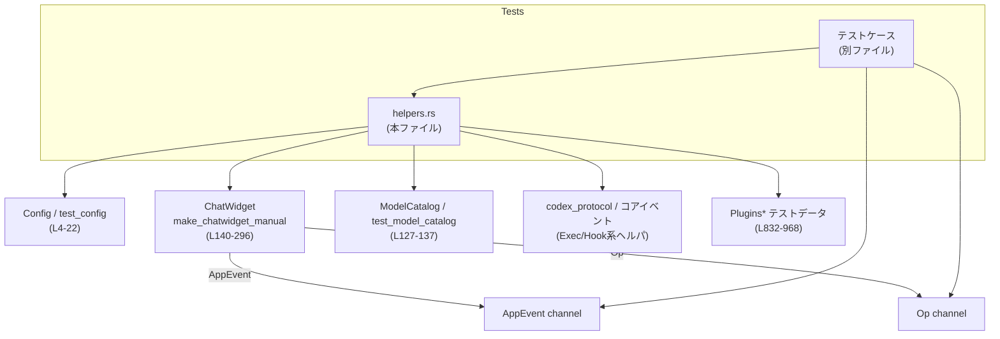
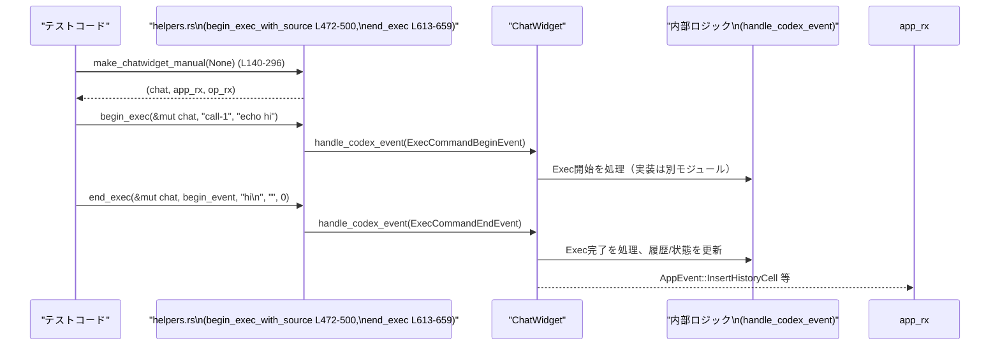
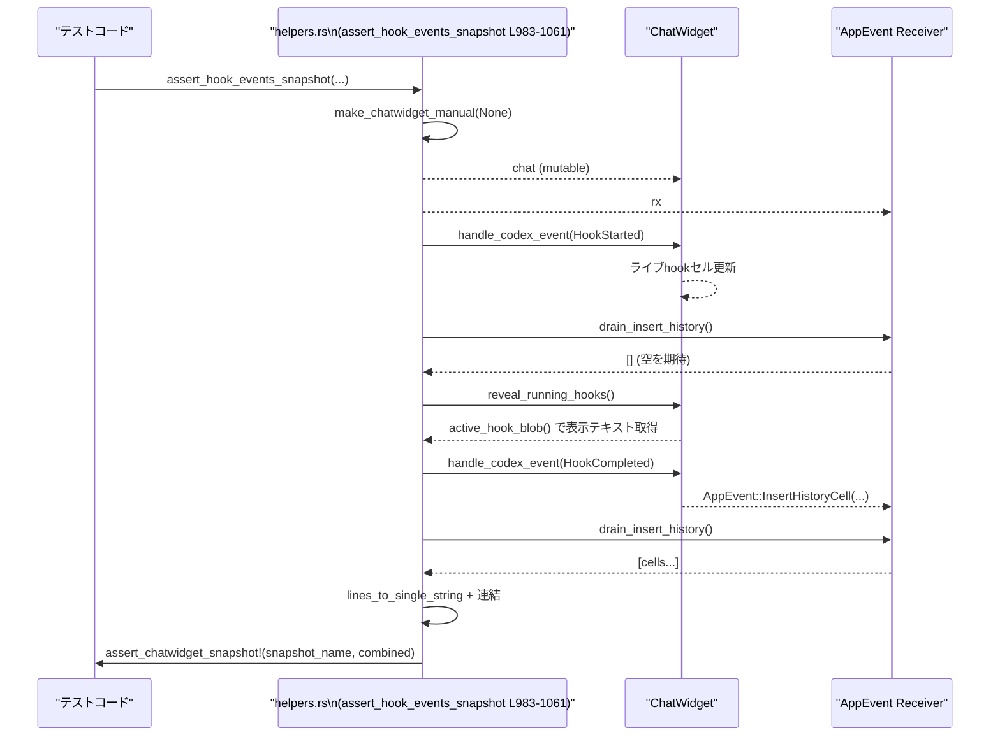

# tui/src/chatwidget/tests/helpers.rs

## 0. ざっくり一言

`ChatWidget` のテストから使う **共通ヘルパ関数集**です。  
設定や `ChatWidget` の組み立て、イベント送信、描画結果・スナップショットの正規化、プラグイン用テストデータ生成など、テストを簡潔に書くためのユーティリティをまとめています。

---

## 1. このモジュールの役割

### 1.1 概要

- このモジュールは **`ChatWidget` とその周辺機能の挙動をテストしやすくする**ために存在し、以下を提供します。
  - テスト専用の `Config` / `ModelCatalog` / `SessionTelemetry` の構築
  - `ChatWidget` インスタンスと関連チャネル（`AppEvent` / `Op`）の生成
  - コアから届く各種イベント（実行コマンド、フック、プラグイン等）の送信ヘルパ
  - TUI 描画結果やパスをスナップショットテスト向けに正規化するヘルパ
  - プラグイン・マーケットプレイスのテスト用ダミーデータ構築

### 1.2 アーキテクチャ内での位置づけ

`ChatWidget` テストコードを中心に、設定・モデル情報・コアイベント・描画を仲介する位置づけです。



※ 型やモジュールの実体は他ファイルにありますが、本ファイルからそれらを組み立て・呼び出す構造になっています。

### 1.3 設計上のポイント

- **完全にテスト専用**
  - すべて `pub(super)` / `pub(crate)` / `fn` で、プロダクションコードから直接は使われないヘルパです。
- **状態を持たないユーティリティ**
  - 構造体や enum を新規定義せず、すべて関数ベースです。
- **非同期＋チャネルを利用したテスト駆動**
  - `make_chatwidget_manual` が `tokio::sync::mpsc::UnboundedReceiver` を返し、テストが `AppEvent` / `Op` を直接取得できるようにしています（`helpers.rs:L140-296`）。
- **テストに適したエラーハンドリング**
  - 多くの関数が `expect!` / `unwrap_or_else(panic!)` / `assert!` を使用し、前提が崩れた場合は即座にテスト失敗になります（例: `next_submit_op` の `panic!`、`helpers.rs:L300-307`）。
- **スナップショット安定化の工夫**
  - パスの正規化（`normalize_snapshot_paths` `helpers.rs:L35-56`）、OSC8 ハイパーリンク除去（`strip_osc8_for_snapshot` `helpers.rs:L798-829`）など、環境依存の出力を安定化するロジックを持ちます。

---

## 2. 主要な機能一覧

- テスト用設定・モデル・テレメトリ生成
  - `test_config`：一時ディレクトリを使ったクリーンな `Config` 構築
  - `test_model_catalog` / `set_fast_mode_test_catalog`：テスト用 `ModelCatalog` 作成
  - `test_session_telemetry`：`SessionTelemetry` のテストインスタンス生成
- `ChatWidget` インスタンス生成とチャネル管理
  - `make_chatwidget_manual` / `make_chatwidget_manual_with_sender`：
    - `ChatWidget` と `AppEvent` / `Op` 受信用チャネルをまとめて生成
- コアイベント（Exec/Hook）駆動ヘルパ
  - `begin_exec_with_source` / `begin_exec` / `end_exec`：
    - 実行コマンドの begin/end イベントを `ChatWidget` に送る
  - `terminal_interaction`：コマンドへの標準入力イベント送信
  - `assert_hook_events_snapshot` / `hook_event_label`：
    - Hook 開始〜完了イベントを送り、出力をスナップショット検証
- `Op` / `AppEvent` キュー操作
  - `next_submit_op` / `next_interrupt_op` / `next_realtime_close_op` / `assert_no_submit_op`
  - `drain_insert_history`：`InsertHistoryCell` イベントをすべて取り出し、描画行に変換
- 描画・文字列処理関連
  - `render_bottom_first_row` / `render_bottom_popup`：
    - `ChatWidget` を描画し、特定行やポップアップ部分だけ文字列に抽出
  - `strip_osc8_for_snapshot`：OSC8 ハイパーリンクシーケンスを削除
  - `lines_to_single_string` / `active_blob` / `active_hook_blob`
- プラグイン／マーケットプレイス関連テストデータ生成
  - `plugins_test_*` 系（absolute_path / interface / summary / curated_marketplace / repo_marketplace / response / detail）
  - `render_loaded_plugins_popup`：プラグインロード結果を反映したポップアップ描画
- キー入力／キュー操作ヘルパ
  - `assert_shift_left_edits_most_recent_queued_message_for_terminal`
  - `type_plugins_search_query`
- レート制限／トークン情報
  - `snapshot`：`RateLimitSnapshot` の簡易構築
  - `make_token_info`：`TokenUsageInfo` 作成

---

## 3. 公開 API と詳細解説

### 3.1 型一覧（このファイルで新規定義される型）

このファイル内で **新しい構造体・列挙体は定義されていません**。  
既存の型（`ChatWidget`, `Config`, `ModelCatalog`, `AppEvent`, `Op`, 各種 Plugin 型 等）を組み立てたり操作したりするだけです。

参考として、頻出する外部型の役割を簡単に整理します（すべて別モジュール定義）:

| 型名 | 役割 / 用途 | 根拠 |
|------|-------------|------|
| `ChatWidget` | チャット UI 本体。イベントを処理し TUI を描画する。 | 使用箇所多数（例: make_chatwidget_manual `helpers.rs:L140-296`） |
| `Config` | アプリ全体の設定。テスト用には `test_config` で構築。 | `helpers.rs:L4-22` |
| `ModelCatalog` | 使用可能なモデル一覧カタログ。テスト用に差し替え可能。 | `helpers.rs:L127-137`, `L385-412` |
| `AppEvent` | UI 側に流れるイベント（履歴セル挿入など）。 | `unbounded_channel::<AppEvent>` 使用 `helpers.rs:L147` |
| `Op` | コア側への操作（ユーザーターン送信、割り込みなど）。 | `unbounded_channel::<Op>` 使用 `helpers.rs:L149` |
| `Plugin*` 系 | プラグインとマーケットプレイス周りのドメインモデル。 | `helpers.rs:L840-921`, `L934-968` |

### 3.2 関数詳細（主要 7 件）

#### `test_config() -> Config`  （async）

**概要**

- テスト用に安全な `Config` を構築します。
- ホスト環境の設定を使わず、毎回一時ディレクトリ配下のクリーンなホーム/cwd 等を設定します。

**引数**

- なし（`async fn` ですが引数はありません）。

**戻り値**

- `Config`：テスト専用の設定。`codex_home` / `sqlite_home` / `log_dir` / `cwd` などが一時ディレクトリ配下に設定済み。

**内部処理の流れ**

1. `tempfile::Builder` で `chatwidget-tests-` プレフィックスの一時ディレクトリを作成し、そのパスを取得します（`helpers.rs:L6-10`）。
2. `Config::load_default_with_cli_overrides_for_codex_home` を使い、ホスト環境ではなくこの `codex_home` を前提にしたデフォルト設定を読み込みます（`helpers.rs:L11-13`）。
3. その `Config` に対して:
   - `codex_home` / `sqlite_home` / `log_dir` を一時ディレクトリ配下に設定（`helpers.rs:L14-16`）。
   - `cwd` を `test_path_display("/tmp/project")` を元にした絶対パスに設定（`helpers.rs:L17`）。
   - `config_layer_stack` を `ConfigLayerStack::default()` に置き換え（`helpers.rs:L18`）。
   - `startup_warnings` をクリアし、`user_instructions` を `None` にする（`helpers.rs:L19-20`）。
4. 最終的な `Config` を返します（`helpers.rs:L21`）。

**Examples（使用例）**

```rust
// テスト内でのConfig初期化例
#[tokio::test]
async fn uses_isolated_config() {
    // テスト用Configを作成
    let config = test_config().await;

    // codex_homeが一時ディレクトリ配下であることを確認
    assert!(config.codex_home.to_string_lossy().contains("chatwidget-tests-"));
}
```

**Errors / Panics**

- 内部で `tempdir().expect("tempdir")` と `Config::load_default...().expect("config")` を使用しているため、
  - 一時ディレクトリ作成や Config ロードに失敗すると **panic** します（`helpers.rs:L8-10`, `L12-13`）。

**Edge cases（エッジケース）**

- 特別なエッジ入力はありません（引数なし）。
- `test_path_display("/tmp/project")` の振る舞いは他モジュールに依存します（このチャンクからは詳細不明）。

**使用上の注意点**

- `async fn` なので `#[tokio::test]` 等の非同期ランタイムから `await` する必要があります。
- テスト外での利用は想定されていません。永続設定を変更するわけではありませんが、ホームディレクトリ等をテスト専用に強制するため、実運用コードから呼び出すと意図と異なる動作になります。

---

#### `make_chatwidget_manual(model_override: Option<&str>) -> (ChatWidget, UnboundedReceiver<AppEvent>, UnboundedReceiver<Op>)` （async）

**概要**

- テストで `ChatWidget` を **直接構築**し、その `AppEvent` / `Op` 受信チャネルとセットで返すヘルパです（`helpers.rs:L140-296`）。
- UI のスタートアップフローを通さず、テスト用に初期状態を明示的に構成します。

**引数**

| 引数名 | 型 | 説明 |
|--------|----|------|
| `model_override` | `Option<&str>` | 使用するモデルスラッグ。`Some` の場合は `Config` の `model` を上書きします。`None` の場合は `get_model_offline` でデフォルトモデルを解決します。 |

**戻り値**

- `(ChatWidget, UnboundedReceiver<AppEvent>, UnboundedReceiver<Op>)`
  - `ChatWidget`：構築済みのウィジェット本体。
  - `UnboundedReceiver<AppEvent>`：UI イベントキューを読むための受信側。
  - `UnboundedReceiver<Op>`：コアへの操作（`Op`）を観測するための受信側。

**内部処理の流れ**

1. `AppEvent` 用と `Op` 用の `unbounded_channel` を生成（`helpers.rs:L147-149`）。
2. `test_config().await` でテスト用 `Config` を取得（`helpers.rs:L150`）。
3. モデルスラッグを決定：
   - `model_override` があればそれを使用。
   - なければ `get_model_offline(cfg.model.as_deref())` で解決（`helpers.rs:L151-153`）。
4. `model_override` が `Some` の場合は `cfg.model` を上書き（`helpers.rs:L154-156`）。
5. `prevent_idle_sleep` フラグを `cfg.features` から取得（`helpers.rs:L157`）。
6. `test_session_telemetry` で `SessionTelemetry` を構築（`helpers.rs:L158`）。
7. `BottomPane` を `BottomPaneParams` で構築し、コラボレーションモードを有効化（`helpers.rs:L159-170`）。
8. `test_model_catalog` から `ModelCatalog` を取得（`helpers.rs:L170`）。
9. `CollaborationMode` / `Settings` を構築し、`current_collaboration_mode` と `active_collaboration_mask` を決定（`helpers.rs:L171-181`）。
10. 大量のフィールドを持つ `ChatWidget` 構造体を初期化し、多くのフィールドにデフォルト値や空コンテナを設定（`helpers.rs:L182-293`）。
11. `widget.set_model(&resolved_model);` でウィジェット内部のモデル設定を完了（`helpers.rs:L294`）。
12. `(widget, rx, op_rx)` を返す（`helpers.rs:L295`）。

**Examples（使用例）**

```rust
#[tokio::test]
async fn can_construct_chatwidget_for_tests() {
    // ChatWidgetとチャネルを取得
    let (mut chat, mut app_rx, mut op_rx) = make_chatwidget_manual(None).await;

    // 何かキーイベントを送る
    chat.handle_key_event(KeyEvent::from(KeyCode::Enter));

    // Opチャネルからユーザーターン送信Opを取得（あれば）
    if let Ok(op) = op_rx.try_recv() {
        // Opの中身を検証
        println!("{op:?}");
    }

    // AppEvent側も同様に確認可能
    while let Ok(ev) = app_rx.try_recv() {
        println!("{ev:?}");
    }
}
```

**Errors / Panics**

- 内部で `test_config().await` を呼び、その中の `expect` により panic する可能性があります（`helpers.rs:L150` → `L8-13`）。
- `FrameRequester::test_dummy()` や `ModelCatalog::new` 等もテスト前提であり、実際には panic しない前提で使用されています（このチャンクではエラーパス詳細は不明）。

**Edge cases（エッジケース）**

- `model_override` に未知のスラッグを渡した場合の挙動は、内部で利用する `set_model` やモデルカタログに依存します（本チャンクからは詳細不明）。
- `Config.features` によって `PreventIdleSleep` が有効/無効になると `SleepInhibitor::new(prevent_idle_sleep)` の動作が変わります（`helpers.rs:L220`）。

**使用上の注意点**

- テスト専用の構築関数であり、実運用コードから直接呼び出すべきではありません。
- 返されるチャネルは **unbounded** です。テストで大量イベントを送る場合、メモリ使用量に注意する必要があります（ただし通常のテスト規模では問題になりづらいです）。
- `ChatWidget` の初期フィールド値はここで一括設定されているため、「初期状態を変えたい」場合はこの関数の該当フィールドを変更する必要があります。

---

#### `end_exec(chat: &mut ChatWidget, begin_event: ExecCommandBeginEvent, stdout: &str, stderr: &str, exit_code: i32)`

**概要**

- 事前に送信した `ExecCommandBeginEvent` に対応する **終了イベント** (`ExecCommandEndEvent`) を構築し、`ChatWidget` に送信するヘルパです（`helpers.rs:L613-659`）。
- テストから「コマンドが完了した」状況をシミュレートします。

**引数**

| 引数名 | 型 | 説明 |
|--------|----|------|
| `chat` | `&mut ChatWidget` | イベントを送る対象ウィジェット |
| `begin_event` | `ExecCommandBeginEvent` | `begin_exec*` で送信した開始イベント（構造体ごと受け取る） |
| `stdout` | `&str` | 実行コマンドの標準出力 |
| `stderr` | `&str` | 実行コマンドの標準エラー |
| `exit_code` | `i32` | プロセスの終了コード（0 なら成功と見なす） |

**戻り値**

- なし（`()`）。

**内部処理の流れ**

1. `stderr` が空かどうかで `aggregated` 文字列を決定（`helpers.rs:L620-624`）:
   - 空なら `stdout.to_string()`。
   - そうでないなら `stdout` と `stderr` をそのまま結合。
2. `begin_event` からフィールドをパターンマッチで取り出す（`helpers.rs:L625-634`）。
3. `ExecCommandEndEvent` を構築し、`aggregated_output` と `formatted_output` の両方に `aggregated` を設定、`duration` を固定 5ms にする（`helpers.rs:L635-651`）。
4. `exit_code == 0` なら `CoreExecCommandStatus::Completed`、それ以外なら `CoreExecCommandStatus::Failed` をセット（`helpers.rs:L652-656`）。
5. これを `EventMsg::ExecCommandEnd` として `chat.handle_codex_event` に送信（`helpers.rs:L635-658`）。

**Examples（使用例）**

```rust
// コマンド成功ケースのテスト例
let (mut chat, _rx, _op_rx) = make_chatwidget_manual(None).await;

// beginイベントを送る（ヘルパは別関数）
let begin = begin_exec(&mut chat, "call-1", "echo hello");

// endイベントで完了させる
end_exec(&mut chat, begin, "hello\n", "", 0);

// ここでChatWidget内部の状態（履歴など）を検証する
```

**Errors / Panics**

- 本関数自身は panic を起こしません。
- ただし、`chat.handle_codex_event` の内部でのエラーや panic の可能性は、このチャンクからは不明です。

**Edge cases（エッジケース）**

- `stderr` が空でない場合、`stdout` と `stderr` を単純連結しています。改行の有無もそのまま連結されるため、テキストのフォーマットは呼び出し側に依存します（`helpers.rs:L620-624`）。
- `exit_code` が 0 以外であっても、`stderr` が空なら `aggregated_output` には `stdout` のみが含まれます。

**使用上の注意点**

- 対応する `ExecCommandBeginEvent` は **必ず** `begin_exec*` ヘルパか、同じ構造/意味を持つイベントから得る必要があります。フィールドが欠けていると `ChatWidget` 側の期待を満たせない可能性があります。
- `exit_code` と `stdout` / `stderr` の整合性（例: エラー時に `stderr` を必ず埋めるかどうか）はテストシナリオに応じて設計する必要があります。

---

#### `assert_shift_left_edits_most_recent_queued_message_for_terminal(terminal_info: TerminalInfo)` （async）

**概要**

- 特定のターミナル設定で、`Shift+Left` が **キューされた最新のユーザーメッセージを編集対象にする**ことを検証するテストヘルパです（`helpers.rs:L711-742`）。
- キーバインディングとメッセージキューの連携をカバーしています。

**引数**

| 引数名 | 型 | 説明 |
|--------|----|------|
| `terminal_info` | `TerminalInfo` | ターミナル環境（拡張キーサポートなど）を表す情報。`queued_message_edit_binding_for_terminal` がこれに基づきキーを選択します。 |

**戻り値**

- なし（`()`）。内部で `assert_eq!` によりテストが失敗/成功します。

**内部処理の流れ**

1. `make_chatwidget_manual(None)` で `ChatWidget` を構築（`helpers.rs:L714`）。
2. `queued_message_edit_binding_for_terminal(terminal_info)` でターミナルに応じた編集キーを決め、`ChatWidget` および `BottomPane` に設定（`helpers.rs:L715-717`）。
3. `bottom_pane.set_task_running(true)` で「タスク実行中」にし、メッセージが即送信されずキューされる前提を作る（`helpers.rs:L719-720`）。
4. `queued_user_messages` に `"first queued"` と `"second queued"` を順に追加し、`refresh_pending_input_preview()` でキュー内容を UI に反映（`helpers.rs:L722-727`）。
5. `Shift+Left` に対応する `KeyEvent` を送信（`helpers.rs:L730`）。
6. その結果として:
   - コンポーザのテキストが `"second queued"` になっていること（`helpers.rs:L733-736`）。
   - キューには `"first queued"` のみが残ること（`helpers.rs:L738-742`）。
   を `assert_eq!` で検証。

**Examples（使用例）**

この関数自体が `#[tokio::test]` 等から直接呼ばれる想定です。

```rust
#[tokio::test]
async fn shift_left_edits_last_queued_message_for_xterm() {
    // TerminalInfoは他モジュールで構築
    let terminal_info = TerminalInfo::Xterm; // 仮の例

    // ヘルパが内部でassertする
    assert_shift_left_edits_most_recent_queued_message_for_terminal(terminal_info).await;
}
```

**Errors / Panics**

- 内部で `assert_eq!` を使用しているため、期待が満たされない場合は panic（テスト失敗）します（`helpers.rs:L733-742`）。
- 内部で使用する `make_chatwidget_manual` 起因の panic も起こりえます。

**Edge cases（エッジケース）**

- `terminal_info` によって `queued_message_edit_binding` が異なるため、「Shift+Left」が実際にどのキーに対応するかは外部ロジックによります（`queued_message_edit_binding_for_terminal` はこのチャンクにないため詳細不明）。
- キューが空、または 1 件しかない場合の挙動はここではテストされていません。

**使用上の注意点**

- 「仕様が変わって編集キーが `Shift+Left` ではなくなる」ような場合、このヘルパの挙動も合わせて更新する必要があります。
- 具体的なキー（`KeyCode::Left`, `KeyModifiers::SHIFT`）を直接送っているため、`queued_message_edit_binding` の計算ロジックとずれないようにする必要があります（`helpers.rs:L730`）。

---

#### `render_bottom_popup(chat: &ChatWidget, width: u16) -> String`

**概要**

- `ChatWidget` を指定幅で描画し、**ポップアップ部分**をテキストとして抽出して返すヘルパです（`helpers.rs:L767-795`）。
- プラグイン一覧などのポップアップのスナップショットテストで使用されます。

**引数**

| 引数名 | 型 | 説明 |
|--------|----|------|
| `chat` | `&ChatWidget` | 描画対象のウィジェット |
| `width` | `u16` | 描画領域の幅 |

**戻り値**

- `String`：ポップアップ領域の可視テキスト（先頭と末尾の空行はトリミング済み、行末の空白も削除）。

**内部処理の流れ**

1. `chat.desired_height(width)` で高さを求め、`Rect` を生成（`helpers.rs:L768-769`）。
2. `Buffer::empty(area)` を作成し、`chat.render(area, &mut buf)` で描画（`helpers.rs:L770-771`）。
3. 縦方向に `area.height` 行を走査し、各行ごとに `symbol()` を集めて文字列化（`helpers.rs:L773-785`）。
   - 空 `symbol` は `' '` に置き換える。
   - 行末の空白は `trim_end()` で削除。
4. 先頭から空行（`trim().is_empty()`）を削り、末尾からも空行を削る（`helpers.rs:L788-793`）。
5. 残った行を `\n` で結合し、返却（`helpers.rs:L795`）。

**Examples（使用例）**

```rust
#[tokio::test]
async fn plugin_popup_renders_expected_entries() {
    let (mut chat, _rx, _op_rx) = make_chatwidget_manual(None).await;

    // プラグイン一覧を読み込んでポップアップを出す（ヘルパ使用例）
    let response = plugins_test_response(vec![/* ... */]);
    let popup_text = render_loaded_plugins_popup(&mut chat, response);

    assert!(popup_text.contains("ChatGPT Marketplace"));
}
```

**Errors / Panics**

- 本関数自体は panic を起こしません。
- `chat.render` 内部での panic の可能性は別モジュールに依存し、このチャンクからは不明です。

**Edge cases（エッジケース）**

- ウィジェットが何も描画しない場合、すべての行が空行となり、結果は空文字列になります。
- `width` が小さすぎる場合、行折り返し等の影響でポップアップの見た目が変わり、スナップショットも異なる可能性があります。

**使用上の注意点**

- スナップショットテストで使用する場合、まず `strip_osc8_for_snapshot` などでエスケープシーケンスを除去してから比較するのが前提です。
- 高さは `desired_height(width)` に依存するため、`ChatWidget` 内部のレイアウトが変わると同じテストでも出力が変わる可能性があります。

---

#### `strip_osc8_for_snapshot(text: &str) -> String`

**概要**

- 文字列中の **OSC8 ハイパーリンクシーケンス**（`ESC ] 8 ;; ... ESC \` または BEL 終端）をすべて削除し、可視テキストだけを残す関数です（`helpers.rs:L798-829`）。
- ターミナルが URL などに埋め込む不可視のエスケープシーケンスをスナップショットから除外するために使われます。

**引数**

| 引数名 | 型 | 説明 |
|--------|----|------|
| `text` | `&str` | 対象となるテキスト（エスケープシーケンスを含む可能性あり） |

**戻り値**

- `String`：OSC8 シーケンスを除去したテキスト。

**内部処理の流れ**

1. `text.as_bytes()` によるバイト列と、結果用の `stripped` 文字列、インデックス `i` を初期化（`helpers.rs:L800-802`）。
2. バイトベースでループしながら処理（`helpers.rs:L804-827`）:
   - 残りバイト列が `b"\x1B]8;;"`（ESC ] 8 ;;）で始まる場合：
     1. `i += 5` でヘッダ部分をスキップ（`helpers.rs:L805-807`）。
     2. 続くループで終端を検出するまで進める（`helpers.rs:L807-817`）:
        - `\x07`（BEL）を見つけたら `i += 1` して終了。
        - `ESC \`（`0x1B 0x5C`）を見つけたら `i += 2` して終了。
   - そうでない場合：
     - `text[i..]` から次の `char` を取得し、`stripped` に追加、`i` を `ch.len_utf8()` 分進める（`helpers.rs:L821-826`）。
3. ループが終わったら `stripped` を返す（`helpers.rs:L829`）。

**Examples（使用例）**

```rust
// OSC8付き文字列をスナップショット用に処理する例
let raw = "\x1B]8;;https://example.test\x07link\x1B]8;;\x07";
let visible = strip_osc8_for_snapshot(raw);
assert_eq!(visible, "link");
```

**Errors / Panics**

- `text[i..].chars().next().expect(...)` を使用しているため、
  - `i` が `text.len()` を超えるような状態になれば panic しますが、
  - バイト操作は常に `i < bytes.len()` 条件下で行われているため、自己矛盾は起こりにくい構造です（`helpers.rs:L804`, `L821-825`）。

**Edge cases（エッジケース）**

- 不完全な OSC8 シーケンス（終端がないなど）の場合、ループは最後まで進みますが、終端検出に失敗しても一応処理は止まります（`i` が `bytes.len()` まで進む）。この場合エスケープシーケンスの一部がそのまま残る可能性があります。
- UTF-8 マルチバイト文字についても `chars()` ベースで 1 文字ずつ追加するため、安全に処理されます。

**使用上の注意点**

- 現状 OSC8 の開始パターンは `ESC ] 8 ;;` 固定と仮定しています。別形式のハイパーリンクシーケンスには対応していません。
- スナップショットテスト前に必ず通すことで、ターミナルの挙動やバージョン違いによる差分を抑制できます。

---

#### `assert_hook_events_snapshot(event_name, run_id, status_message, snapshot_name)` （async）

**概要**

- コアから届く Hook イベント（開始・完了）を `ChatWidget` に送信し、その表示内容をスナップショットと比較して検証するヘルパです（`helpers.rs:L983-1061`）。
- ライブな hook セルの表示と履歴セルへの書き込みの両方をチェックします。

**引数**

| 引数名 | 型 | 説明 |
|--------|----|------|
| `event_name` | `codex_protocol::protocol::HookEventName` | Hook の種類（`PreToolUse` など） |
| `run_id` | `&str` | Hook 実行の ID |
| `status_message` | `&str` | Hook の状態メッセージ（表示に使用） |
| `snapshot_name` | `&str` | `assert_chatwidget_snapshot!` 用のスナップショット識別子 |

**戻り値**

- なし（`()`）。内部で `assert!` を含みます。

**内部処理の流れ**

1. `make_chatwidget_manual(None)` でチャットと `AppEvent` 受信チャネルを用意（`helpers.rs:L989`）。
2. `EventMsg::HookStarted` を `chat.handle_codex_event` に送信（`helpers.rs:L991-1011`）。
   - `HookRunSummary` の `status` は `Running`、`entries` は空。
3. `drain_insert_history(&mut rx)` が空であることを `assert!`（`helpers.rs:L1012-1015`）。
   - Hook 開始時は履歴セルではなく「ライブ hook セル」を更新する仕様を確認。
4. `reveal_running_hooks(&mut chat)` を呼び、ライブ hook セルを可視状態にする（`helpers.rs:L1016`）。
5. `active_hook_blob(&chat)` が `"Running {label} hook: {status_message}"` を含むことを `assert!`（`helpers.rs:L1017-1023`）。
   - `label` は `hook_event_label(event_name)` から取得（`helpers.rs:L1064-1071`）。
6. 続いて `EventMsg::HookCompleted` を送信（`helpers.rs:L1025-1054`）。
   - 今度は `status` が `Completed`、`entries` に Warning と Context 2 行を含む。
7. 再度 `drain_insert_history` で履歴セルを書き出し、`lines_to_single_string` で結合して 1 つの文字列 `combined` を作成（`helpers.rs:L1056-1060`）。
8. `assert_chatwidget_snapshot!(snapshot_name, combined);` でスナップショット比較（`helpers.rs:L1061`）。

**Examples（使用例）**

```rust
#[tokio::test]
async fn hook_pretooluse_snapshot() {
    use codex_protocol::protocol::HookEventName;

    assert_hook_events_snapshot(
        HookEventName::PreToolUse,
        "run-1",
        "Preparing tools",
        "hook_pretooluse",
    ).await;
}
```

**Errors / Panics**

- 複数の `assert!` と `assert_chatwidget_snapshot!` により、期待が満たされないと panic します（`helpers.rs:L1012-1015`, `L1017-1023`, `L1061`）。
- `make_chatwidget_manual` や `hook_event_label` 内部の panic 可能性もありますが、ここからは詳細不明です。

**Edge cases（エッジケース）**

- `status_message` が長い／複数行などの場合、`active_hook_blob` や履歴の表示がどのように折り返されるかは `Hook` セル実装に依存します。
- `event_name` のバリエーション（`PreToolUse`, `PostToolUse`, `SessionStart`, `UserPromptSubmit`, `Stop`）ごとにラベルが異なりますが、列挙は `hook_event_label` に完全に網羅されています（`helpers.rs:L1065-1070`）。

**使用上の注意点**

- このヘルパは **Hook の UI 表示仕様が変わるとスナップショットが大きく変化**するため、UI の変更時には対応するスナップショットの更新が必要です。
- `status_message` や `entries` の内容は固定で埋め込まれており、テキストが変わるとスナップショットも更新が必要になります。

---

### 3.3 その他の関数インベントリー

代表的なヘルパを機能別に一覧化します（行番号は `tui/src/chatwidget/tests/helpers.rs:L開始-終了`）。

| 関数名 | 用途（1 行） | 行範囲 |
|--------|--------------|--------|
| `test_project_path()` | テスト用プロジェクトルート `/tmp/project` の `PathBuf` を返す。 | helpers.rs:L24-26 |
| `truncated_path_variants(path)` | 任意の部分長ごとのパス前方切り出し文字列列挙。パス正規化に利用。 | L28-33 |
| `normalize_snapshot_paths(text)` | プラットフォーム依存のパス表現を `/tmp/project` に正規化。 | L35-56 |
| `normalized_backend_snapshot(value)` | 値を文字列化し、行ごとに `normalize_snapshot_paths` を適用。 | L58-82 |
| `invalid_value(candidate, allowed)` | `ConstraintError::InvalidValue` を簡単に構築。 | L84-94 |
| `snapshot(percent)` | 単一 primary ウィンドウのみを持つ `RateLimitSnapshot` を作る。 | L96-109 |
| `test_session_telemetry(config, model)` | `SessionTelemetry::new` をテスト用パラメータで呼び出す。 | L111-125 |
| `test_model_catalog(config)` | `all_model_presets()` を使った `ModelCatalog` を構築。 | L127-137 |
| `next_submit_op(op_rx)` | `Op::UserTurn` が出るまで `try_recv` でループし、他の Op は捨てる。 | L300-309 |
| `next_interrupt_op(op_rx)` | `Op::Interrupt` を待つテスト用ヘルパ。 | L311-320 |
| `next_realtime_close_op(op_rx)` | `Op::RealtimeConversationClose` を待つヘルパ。 | L322-335 |
| `assert_no_submit_op(op_rx)` | キュー内に `Op::UserTurn` が存在しないことを `assert!`。 | L337-344 |
| `set_chatgpt_auth(chat)` | `ChatWidget` に ChatGPT アカウント有り状態とテストカタログを設定。 | L346-349 |
| `test_model_info(slug, priority, supports_fast_mode)` | JSON から `ModelInfo` を生成する内部ヘルパ。 | L351-383 |
| `set_fast_mode_test_catalog(chat)` | FAST モード対応/非対応モデル 2 つから `ModelCatalog` を差し替える。 | L385-412 |
| `make_chatwidget_manual_with_sender()` | `make_chatwidget_manual` に `AppEventSender` を添えて返すラッパー。 | L414-423 |
| `drain_insert_history(rx)` | `AppEvent::InsertHistoryCell` をすべて抜き出して `Line` のベクタに変換。 | L425-439 |
| `lines_to_single_string(lines)` | `ratatui::text::Line` 配列を改行区切りの `String` に変換。 | L441-449 |
| `status_line_text(chat)` | `ChatWidget::status_line_text()` の薄いラッパー。 | L452-454 |
| `make_token_info(total_tokens, context_window)` | `TokenUsageInfo` を簡単に構築する。 | L456-468 |
| `begin_exec_with_source(chat, call_id, raw_cmd, source)` | コマンド実行開始イベントを構築し `handle_codex_event` に送る。 | L472-500 |
| `begin_unified_exec_startup(chat, call_id, process_id, raw_cmd)` | Unified Exec 起動用の begin イベントを送る。 | L502-525 |
| `terminal_interaction(chat, call_id, process_id, stdin)` | `TerminalInteractionEvent` を送る。 | L527-541 |
| `complete_assistant_message(chat, item_id, text, phase)` | 完了したエージェントメッセージを表す `ItemCompletedEvent` を送信。 | L543-563 |
| `pending_steer(text)` | `PendingSteer` を構築。比較キーはテキストと画像枚数 0。 | L566-573 |
| `complete_user_message(chat, item_id, text)` | テキストのみのユーザーメッセージ完了イベントを送る。 | L576-585 |
| `complete_user_message_for_inputs(chat, item_id, content)` | 任意の `Vec<UserInput>` を持つユーザーメッセージ完了イベントを送る。 | L587-603 |
| `begin_exec(chat, call_id, raw_cmd)` | `source=ExecCommandSource::Agent` で `begin_exec_with_source` を呼ぶショートカット。 | L605-611 |
| `active_blob(chat)` | 現在のアクティブセル表示を 1 つの文字列にまとめて返す。 | L661-668 |
| `active_hook_blob(chat)` | アクティブ hook セルの表示を文字列化 (`None` のとき `<empty>\n`)。 | L670-675 |
| `expire_quiet_hook_linger(chat)` | Hook セルの quiet 表示猶予をすぐに切らし、再描画。 | L678-683 |
| `reveal_running_hooks(chat)` | 実行中 hook を即座に可視化し、`pre_draw_tick` を呼ぶ。 | L685-689 |
| `reveal_running_hooks_after_delayed_redraw(chat)` | 遅延描画後に実行中 hook を可視化し `pre_draw_tick`。 | L692-696 |
| `get_available_model(chat, model)` | `ModelCatalog` からスラッグ一致する `ModelPreset` を取得（なければ panic）。 | L699-709 |
| `render_bottom_first_row(chat, width)` | 描画結果から最初の非空行だけを返す。 | L745-764 |
| `plugins_test_absolute_path(path)` | テスト用プラグインパス（temp_dir/…）を生成。 | L832-837 |
| `plugins_test_interface(...)` | 空の `PluginInterface` をオプションの説明付きで構築。 | L839-859 |
| `plugins_test_summary(...)` | `PluginSummary` を組み立てる。 | L862-887 |
| `plugins_test_curated_marketplace(plugins)` | OpenAI curated marketplace エントリを生成。 | L889-899 |
| `plugins_test_repo_marketplace(plugins)` | "repo" マーケットプレイスエントリを生成。 | L902-910 |
| `plugins_test_response(marketplaces)` | `PluginListResponse` を生成。 | L913-921 |
| `render_loaded_plugins_popup(chat, response)` | プラグインロード完了を `ChatWidget` に伝え、ポップアップ描画文字列を返す。 | L924-931 |
| `plugins_test_detail(...)` | 詳細情報を含む `PluginDetail` を構築。 | L934-968 |
| `plugins_test_popup_row_position(popup, needle)` | ポップアップ文字列内で needle が現れる位置を返す（なければ panic）。 | L971-975 |
| `type_plugins_search_query(chat, query)` | クエリ文字列を 1 文字ずつ `KeyEvent::Char` として送る。 | L977-980 |
| `hook_event_label(event_name)` | Hook イベント名を表示用ラベルに変換する内部関数。 | L1064-1071 |

---

## 4. データフロー

ここでは代表的な処理シナリオとして **Exec 実行イベント** と **Hook イベント** のフローを示します。

### 4.1 Exec 実行イベントの流れ（begin〜end）

`begin_exec_with_source`（L472-500）と `end_exec`（L613-659）を使って、テストからコマンド実行をシミュレートする流れです。



### 4.2 Hook イベントの流れ（assert_hook_events_snapshot）

`assert_hook_events_snapshot`（L983-1061）を使った Hook 開始〜完了の UI 検証フローです。



---

## 5. 使い方（How to Use）

### 5.1 基本的な使用方法

典型的なテストコードの流れは次のようになります。

```rust
#[tokio::test]
async fn test_simple_exec_flow() {
    // 1. テスト用ChatWidgetとチャネルを構築
    let (mut chat, mut app_rx, mut op_rx) = make_chatwidget_manual(None).await;

    // 2. Exec開始イベントを送る（begin_execはAgentソースのショートカット）
    let begin = begin_exec(&mut chat, "call-1", "echo hello");

    // 3. Exec終了イベントを送る
    end_exec(&mut chat, begin, "hello\n", "", 0);

    // 4. AppEvent側から履歴セルをすべて取り出す
    let cells = drain_insert_history(&mut app_rx);
    let output = cells
        .iter()
        .map(|lines| lines_to_single_string(lines))
        .collect::<String>();

    // 5. スナップショット等で検証
    assert!(output.contains("hello"));
}
```

### 5.2 よくある使用パターン

1. **ステータスライン／ポップアップ描画の検証**

```rust
#[tokio::test]
async fn test_plugins_popup_layout() {
    let (mut chat, _rx, _op_rx) = make_chatwidget_manual(None).await;

    // プラグインレスポンスを構築
    let summary = plugins_test_summary(
        "id1",
        "plugin1",
        Some("Plugin One"),
        Some("A test plugin"),
        true,
        true,
        PluginInstallPolicy::User,
    );
    let marketplace = plugins_test_curated_marketplace(vec![summary]);
    let response = plugins_test_response(vec![marketplace]);

    // ポップアップ描画
    let raw_popup = render_loaded_plugins_popup(&mut chat, response);

    // OSC8除去＋スナップショット比較など
    let popup = strip_osc8_for_snapshot(&raw_popup);
    assert!(popup.contains("ChatGPT Marketplace"));
}
```

1. **レート制限・トークン情報の UI 挙動検証**

```rust
#[tokio::test]
async fn test_token_info_display() {
    let (mut chat, _rx, _op_rx) = make_chatwidget_manual(None).await;

    // TokenUsageInfoを設定
    chat.token_info = Some(make_token_info(1000, 4000));

    // 描画の最初の行を取得
    let first_row = render_bottom_first_row(&chat, 80);
    assert!(first_row.contains("1000")); // 仮の確認
}
```

### 5.3 よくある間違い

```rust
// 誤り例: make_chatwidget_manualをawaitせずに使用してしまう
// let (mut chat, rx, op_rx) = make_chatwidget_manual(None); // コンパイルエラー

// 正しい例: 非同期コンテキストでawaitする
let (mut chat, rx, op_rx) = make_chatwidget_manual(None).await;

// 誤り例: begin_exec無しでend_execに適当なイベントを渡す
// let fake_begin = ExecCommandBeginEvent { ...手作業で構築... };
// end_exec(&mut chat, fake_begin, "out", "err", 1); // ChatWidget側の期待と不整合の可能性

// 正しい例: begin_execかbegin_exec_with_sourceからの戻り値を使う
let begin = begin_exec(&mut chat, "call-1", "ls");
end_exec(&mut chat, begin, "out", "", 0);
```

### 5.4 使用上の注意点（まとめ）

- **前提条件**
  - すべてのヘルパは `ChatWidget` の存在を前提とします。`make_chatwidget_manual` / `make_chatwidget_manual_with_sender` などで得たインスタンスを使用するのが基本です。
- **エラー・panic**
  - 多くの関数が `expect` / `panic!` / `assert!` を含んでおり、「テストの前提が崩れたこと」を即座に検出する設計です。実運用コードからの利用は避けるべきです。
- **非同期**
  - `test_config`, `make_chatwidget_manual`, `assert_shift_left_*`, `assert_hook_events_snapshot` などは `async fn` です。`#[tokio::test]` などの非同期テスト環境が必要です。
- **チャネルの扱い**
  - `next_submit_op` や `next_interrupt_op` はキューが空／切断状態のときに panic します。テストでは「送られているはず」という前提があるときにのみ使うべきです（`helpers.rs:L300-307`, `L311-318`, `L322-333`）。

---

## 6. 変更の仕方（How to Modify）

### 6.1 新しい機能を追加する場合

- **新しいイベント種別をテストしたい場合**
  1. 既存の `complete_assistant_message` / `complete_user_message_for_inputs` / `begin_exec` などのパターンを参考に、対応する `EventMsg::...` を構築するヘルパ関数をこのファイルに追加します。
  2. `chat.handle_codex_event(Event { ... })` を呼び出す形に統一すると、既存テストとの一貫性が保てます（例: `helpers.rs:L495-498`, `L533-540`, `L549-563` を参照）。

- **新しいポップアップや UI 要素をスナップショットしたい場合**
  1. `render_bottom_first_row` / `render_bottom_popup` / `strip_osc8_for_snapshot` の組み合わせを再利用します。
  2. テキスト正規化の要件があれば、`normalize_snapshot_paths` と同じ場所に追加します。

### 6.2 既存の機能を変更する場合

- 影響範囲の確認
  - 各関数は多くのテストから呼ばれている可能性が高いため、`rg "function_name"` などで呼び出し元を洗い出してから変更する必要があります。
- 契約（前提条件）の維持
  - 例えば `assert_hook_events_snapshot` は「Hook開始時には履歴に何も書かれない」という仕様をテストしています（`helpers.rs:L1012-1015`）。この仕様自体を変えたい場合は、UI 実装とヘルパ、スナップショットのすべてを揃えて変更する必要があります。
- テストの更新
  - スナップショット系ヘルパ（`render_loaded_plugins_popup` 等）を変更すると、多数のスナップショットファイルが更新対象になります。

---

## 7. 関連ファイル

このモジュールと密接に関係すると思われるファイル・ディレクトリ（名前から推測できる範囲）です。実際の内容はこのチャンクには出てきません。

| パス | 役割 / 関係（推測の旨を明記） |
|------|------------------------------|
| `tui/src/chatwidget/mod.rs` など | `ChatWidget` 本体の定義と `handle_codex_event`, `render`, `status_line_text` などの実装が存在すると考えられます（このチャンクには定義無し）。 |
| `legacy_core::test_support` 配下 | `construct_model_info_offline`, `all_model_presets`, `get_model_offline` など、モデル関連テスト支援関数の定義があると考えられます（`helpers.rs:L112`, `L134`, `L152` 参照）。 |
| `codex_protocol` クレート | Exec コマンド・Hook イベント・Plugin などのプロトコル型 (`ExecCommandBeginEvent`, `Hook*Event`, `Plugin*`) を定義するクレートです（使用のみ、定義はこのチャンクにありません）。 |
| `codex_shell_command::parse_command` | シェルコマンド解析ロジック。`begin_exec_with_source` がテスト用に利用しています（`helpers.rs:L481-482`）。 |
| `tui/src/chatwidget/tests/*.rs` | このヘルパ群を実際に利用しているテストファイル群です（本チャンクからは具体名は不明）。 |

このファイルはあくまでテスト支援用のユーティリティ集であり、`ChatWidget` やコアロジックの仕様そのものを理解するには上記の関連ファイルの参照が必要になります。
