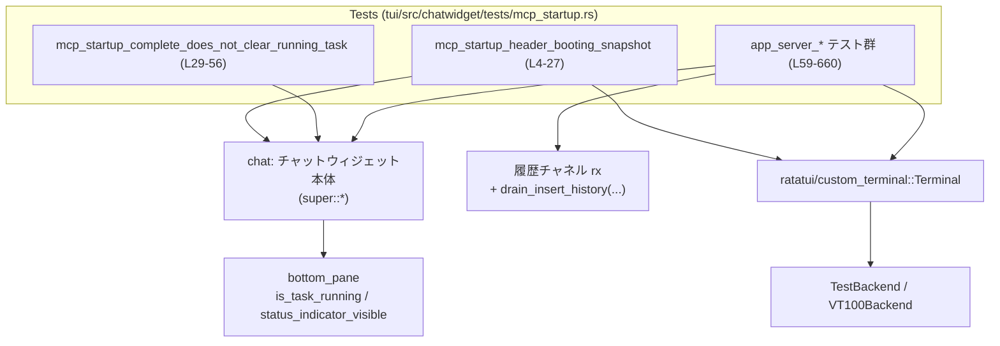
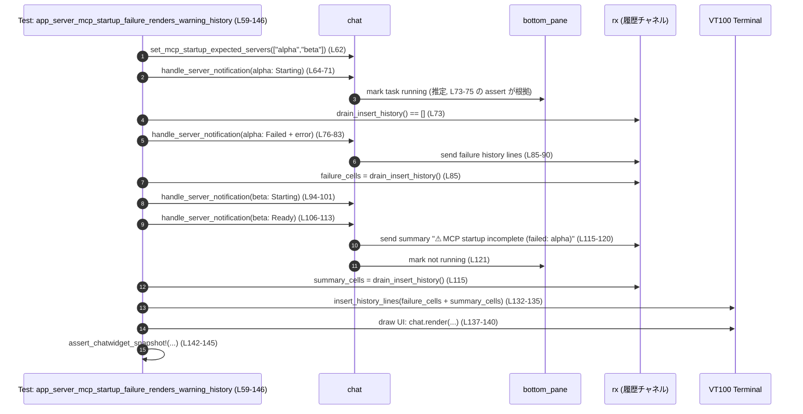
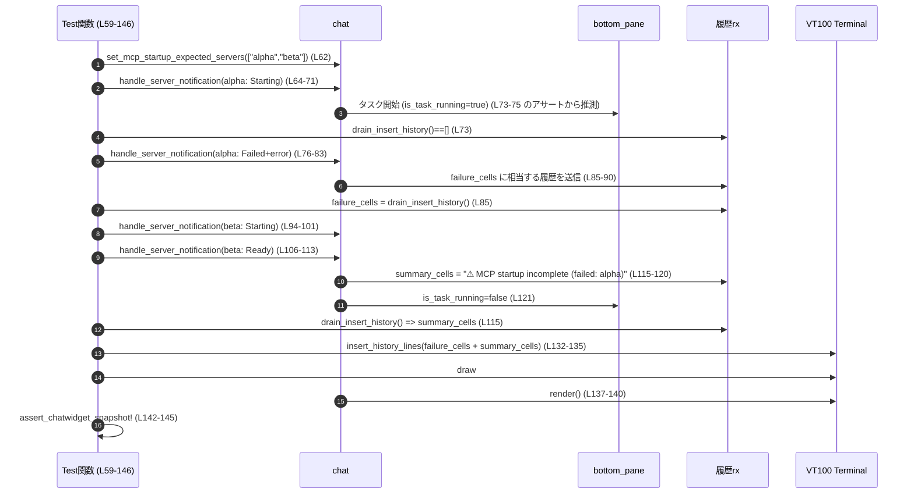

# tui/src/chatwidget/tests/mcp_startup.rs

## 0. ざっくり一言

MCP サーバーの起動シーケンスに関して、チャットウィジェットがどのように状態を表示し、履歴にどのようなメッセージを出すかを検証する非同期テスト群です（`tokio::test` を使用）。  
※ 以下の行番号は、提供されたチャンクに基づく概算です。

---

## 1. このモジュールの役割

### 1.1 概要

- このテストモジュールは、MCP（Model Context Protocol）サーバーの起動状態に応じた **チャットウィジェット（`chat`）の振る舞い** を検証します。  
- 主に次の点をテストしています。
  - MCP 起動中ヘッダの TUI スナップショット表示（起動中の見た目）  
    （`mcp_startup_header_booting_snapshot`、L4-27）
  - MCP 起動完了イベントが、すでに進行中のタスク表示を壊さないこと  
    （`mcp_startup_complete_does_not_clear_running_task`、L29-56）
  - アプリサーバーから送られる MCP サーバー状態更新（成功・失敗・遅延）に対して、
    - 履歴メッセージ（警告・サマリ）がどう出力されるか
    - ボトムペインの「タスク実行中」状態がどう変化するか  
    を詳細に検証します（L59-660 全体）。

### 1.2 アーキテクチャ内での位置づけ

- このファイルは `super::*` を `use` しているため、同階層のチャットウィジェット実装モジュール（例: `tui::chatwidget`）のテスト専用モジュールです。（根拠: L1）
- テストは次のコンポーネントと連携しています。
  - `chat`: チャットウィジェット本体（`make_chatwidget_manual` で生成、L6, L31, L60 など）
  - イベント系:
    - `Event`, `EventMsg::McpStartupUpdate`, `McpStartupUpdateEvent`, `McpStartupStatus`（L9-14, L517-524 など）
    - `EventMsg::McpStartupComplete`, `McpStartupCompleteEvent`（L46-51）
    - `EventMsg::TurnStarted`, `TurnStartedEvent`, `ModeKind`（L33-40）
  - サーバー通知系:
    - `ServerNotification::McpServerStatusUpdated`
    - `McpServerStatusUpdatedNotification`
    - `McpServerStartupState::{Starting, Failed, Ready}`（L64-69, L76-81 など）
  - UI/履歴:
    - `chat.bottom_pane`（`is_task_running`, `status_indicator_visible`、L43-44 ほか）
    - 履歴受信チャネル `rx` とユーティリティ `drain_insert_history`, `lines_to_single_string`（L60, L73, L85-89 など）
    - TUI レンダリング用: `ratatui::Terminal<TestBackend>`（L18-21）、`VT100Backend` と `custom_terminal::Terminal`（L123-140）

これを簡略図にすると次のようになります。



### 1.3 設計上のポイント（テストから読み取れる前提／契約）

- **状態マシン的な「起動ラウンド」概念**  
  - `set_mcp_startup_expected_servers` で「このラウンドで起動を期待するサーバー集合」を設定しています（L62, L152, L222, L263, L331, L418, L479, L515, L549, L583）。
  - `finish_mcp_startup_after_lag` や `finish_mcp_startup` の呼び出しにより、そのラウンドが「締め」られ、以降の通知の扱いが変わることを前提にしています（L182, L224, L291, L359, L420, L480, L535, L569, L611, L627）。
- **履歴出力の契約**  
  - サーバーの `Failed` 状態では個別の失敗メッセージが履歴に出力される（例: L80-90, L229-239 など）。
  - ラウンド終了時に、失敗したサーバーや未完了サーバーの概要（"MCP startup incomplete ...", "MCP startup interrupted ..."）がサマリとして出力される（L120, L184-191, L255, L322-323, L471, L505-507, L541, L575, L654-659）。
- **「遅延」や「古い通知」の扱い**  
  - `finish_mcp_startup_after_lag` 呼び出し後の古い／遅延した `McpServerStatusUpdated` は、履歴に表示されないことをテストで前提としています（例: L193-215, L363-383, L585-608, L615-626）。
- **ボトムペインのタスク状態**  
  - MCP 起動は「タスク実行中」のインジケータで表現され、ラウンドの開始・終了や失敗／成功によって `is_task_running` が切り替わることが多数のアサートで確認されています（L73-75, L92, L103-105, L121, L180-181, L191, L202-203, L214-215, L240-241, L293-294, L304-305, L361-362, L384-385, L395-396, L456-457, L472-473, L491-492, L533-534, L542-543, L567-568, L613-614, L642-643, L660-660）。

---

## 2. コンポーネントと主要な機能一覧

### 2.1 ローカルに定義されている関数（テストケース）

| 関数名 | 役割 / シナリオ | 行範囲 |
|--------|----------------|--------|
| `mcp_startup_header_booting_snapshot` | MCP 起動中ステータスがヘッダにどのように描画されるかをスナップショットで検証 | L4-27 |
| `mcp_startup_complete_does_not_clear_running_task` | MCP 起動完了イベントが、既に進行中のチャットタスクのステータス表示を消さないことを検証 | L29-56 |
| `app_server_mcp_startup_failure_renders_warning_history` | アプリサーバー経由の MCP 起動失敗が、履歴と UI スナップショットにどのように表示されるかを検証 | L59-146 |
| `app_server_mcp_startup_lag_settles_startup_and_ignores_late_updates` | 起動中にラグで打ち切った場合のサマリ表示と、その後の遅延通知の無視を検証 | L148-216 |
| `app_server_mcp_startup_after_lag_can_settle_without_starting_updates` | 起動開始通知がなくても、ラグ後の締めと失敗／成功サマリが正しく動作するかを検証 | L218-257 |
| `app_server_mcp_startup_after_lag_preserves_partial_terminal_only_round` | 途中で締めたラウンド後に再度失敗が届いた場合の履歴出力の扱いを検証 | L259-325 |
| `app_server_mcp_startup_next_round_discards_stale_terminal_updates` | 1 ラウンド目終了後に来る「古い」失敗通知を無視し、新しいラウンドの成功時にサマリを出さないことを検証 | L327-412 |
| `app_server_mcp_startup_next_round_keeps_terminal_statuses_after_starting` | ラグ締め後に新ラウンドを開始し、失敗と成功に応じてサマリとタスク状態が切り替わることを検証 | L414-473 |
| `app_server_mcp_startup_next_round_with_empty_expected_servers_reactivates` | 期待サーバー集合が空の状態からでも、新たなサーバー起動が新ラウンドとして扱われることを検証 | L475-509 |
| `app_server_mcp_startup_after_lag_with_empty_expected_servers_preserves_failures` | 期待サーバー集合が空で、`on_mcp_startup_update` ベースの失敗がラグ締め後もサマリに反映されることを検証 | L511-543 |
| `app_server_mcp_startup_after_lag_includes_runtime_servers_with_expected_set` | 期待サーバー集合にない「runtime」サーバーの失敗も、起動サマリ（失敗一覧）に含めることを検証 | L545-576 |
| `app_server_mcp_startup_next_round_after_lag_can_settle_without_starting_updates` | 一度ラグ締めした後、さらに締めを呼んでから失敗・成功が届く「ターミナルのみ」なラウンドが正しくサマリされることを検証 | L579-660 |

### 2.2 このファイルから見える主要コンポーネント（外部）

| コンポーネント | 種別 | このテストから見える役割 | 行範囲（使用例） |
|---------------|------|--------------------------|------------------|
| `make_chatwidget_manual` | 関数（async） | テスト用のチャットウィジェットと履歴チャネルを生成 | L6, L31, L60, L150 など |
| `chat` | 構造体（推定） | チャット UI 全体。イベント処理やレンダリング、MCP 起動状態管理を行う | L6-7, L9-17, L33-55, L61-62, L64-71 など |
| `chat.handle_codex_event` | メソッド | Codex 由来の高レベルイベント（MCP 起動更新、ターン開始など）を処理 | L9-15, L33-41, L46-52 |
| `chat.handle_server_notification` | メソッド | アプリサーバーからの MCP サーバー状態更新を処理 | L64-71, L76-83, L94-101 など多数 |
| `chat.on_mcp_startup_update` | メソッド | `McpStartupUpdateEvent` を直接処理（サーバー名＋状態列挙） | L517-526, L551-560 |
| `chat.set_mcp_startup_expected_servers` | メソッド | この起動ラウンドで期待する MCP サーバー名集合を設定 | L62, L152, L222, L263, L331, L418, L479, L515, L549, L583 |
| `chat.finish_mcp_startup_after_lag` | メソッド | 「ラグ後に起動を締める」操作。未完了サーバーや失敗サーバーのサマリを出し、タスク状態を終了させる | L182, L224, L291, L359, L420, L535, L569, L611, L627 |
| `chat.finish_mcp_startup` | メソッド | 期待サーバー集合と実際の起動結果を明示的に渡してラウンドを締める | L480 |
| `chat.desired_height` | メソッド | 現在の UI 状態に必要な高さを計算 | L17, L124 |
| `chat.render` | メソッド | 指定エリア・バッファにチャットウィジェットを描画 | L21, L138 |
| `chat.show_welcome_banner` | フィールド | 初期表示のウェルカムバナーの有無制御 | L7, L61, L151, L221 など |
| `chat.bottom_pane.is_task_running` | メソッド | ボトムペインで「タスク実行中」インジケータが点灯しているか | L43, L54, L74, L92, L103, L121 ほか多数 |
| `chat.bottom_pane.status_indicator_visible` | メソッド | ステータスインジケータが表示されているか | L44, L55 |
| `ServerNotification::McpServerStatusUpdated` | 列挙体のバリアント | アプリサーバーからの MCP サーバー状態更新通知 | L64, L76, L94 など多数 |
| `McpServerStatusUpdatedNotification` | 構造体 | サーバー名・状態・エラーメッセージを含む通知 | L65-69, L77-81 など |
| `McpServerStartupState` | 列挙体 | `Starting` / `Failed` / `Ready` などの MCP サーバー起動状態 | L67, L79, L97, L109 など |
| `McpStartupUpdateEvent` | 構造体 | `server` と `status`（`McpStartupStatus`）を持つイベント | L11-14, L517-524, L551-559 |
| `McpStartupStatus` | 列挙体 | `Starting` / `Ready` / `Failed { error }` などの高レベル起動状態 | L13, L519, L523-524, L553, L557-559 |
| `McpStartupCompleteEvent` | 構造体 | MCP 起動完了時の情報（`ready` サーバー名リストなど） | L48-51 |
| `drain_insert_history` | 関数 | 履歴チャネル `rx` からすべての「履歴行セル」を吸い出すユーティリティ | L73, L85, L115, L179, L184 など多数 |
| `lines_to_single_string` | 関数 | 「1 行を構成するセル列」を 1 本の `String` に連結（テスト用） | L88-89, L118-119, L236-238 など |
| `VT100Backend` | 構造体 | VT100 端末エミュレーション用の TUI バックエンド | L128 |
| `custom_terminal::Terminal` | 構造体 | カスタム TUI ターミナル。ビュー領域設定や描画を行う | L129-130, L137-140 |
| `insert_history::insert_history_lines` | 関数 | 履歴として得た行をターミナルに描画するユーティリティ | L132-135 |
| `assert_chatwidget_snapshot!` | マクロ | チャットウィジェットの TUI 出力をスナップショットと比較するテストマクロ | L23-26, L142-145 |
| `normalized_backend_snapshot` / `normalize_snapshot_paths` | 関数（推定） | バックエンド出力をスナップショット比較用に正規化 | L25, L144 |

---

## 3. 公開 API と詳細解説（テスト関数ベース）

このファイル自身はライブラリ API を公開していませんが、**MCP 起動処理の振る舞いを示す重要な契約**がテストケースに現れています。  
ここでは代表的なテスト関数 7 件を詳細に説明し、「どの入力に対してどのような状態／履歴になるべきか」を整理します。

### 3.1 型一覧（このテストで重要な外部型）

| 名前 | 種別 | 役割 / 用途 |
|------|------|-------------|
| `Event`, `EventMsg` | 列挙体など | Codex 系イベント（MCP 起動更新やターン開始）を `chat.handle_codex_event` に渡す（L9-15, L33-41, L46-52）。 |
| `McpStartupUpdateEvent` | 構造体 | `server` と `status: McpStartupStatus` を持つ起動状態イベント（L11-14, L517-524, L551-559）。 |
| `McpStartupStatus` | 列挙体 | MCP 起動状態（`Starting`, `Ready`, `Failed { error }` など）を表現（L13, L519, L523-524, L553, L557-559）。 |
| `McpStartupCompleteEvent` | 構造体 | MCP 起動完了時にどのサーバーが ready になったかを伝える（L48-51）。 |
| `ServerNotification` | 列挙体 | アプリサーバーから来る通知。ここでは `McpServerStatusUpdated` を使用（L64, L76, L94 など）。 |
| `McpServerStatusUpdatedNotification` | 構造体 | サーバー名 `name` / 状態 `status` / `error: Option<String>` を含む（L65-69, L77-81 など）。 |
| `McpServerStartupState` | 列挙体 | サーバー単位の起動状態（`Starting`, `Failed`, `Ready`）（L67, L79, L97, L109 など）。 |
| `Rect` | 構造体 | TUI ビューポート矩形（L126）。 |
| `Terminal`（`ratatui` / `custom_terminal`） | 構造体 | TUI の描画サーフェス（L18-21, L128-140）。 |

### 3.2 詳細解説するテスト関数

#### `mcp_startup_header_booting_snapshot() -> ()`（L4-27）

**概要**

- MCP 起動中（`McpStartupStatus::Starting`）のときに、チャットウィジェットヘッダが期待通りの見た目で描画されることを **スナップショットテスト** で検証します。（根拠: L4-26）

**引数**

- なし（`#[tokio::test]` により非同期テスト関数として実行）。

**戻り値**

- `()`（テスト関数）。失敗時は `assert_*` や `expect` マクロがパニックします。

**内部処理の流れ**

1. `make_chatwidget_manual(None).await` でテスト用 `chat` を生成し、履歴チャネル等も受け取ります（L6）。
2. ウェルカムバナーを無効化し、純粋に MCP 起動ヘッダのみが見える状態にします（L7）。
3. `chat.handle_codex_event` に `EventMsg::McpStartupUpdate(McpStartupUpdateEvent { server: "alpha", status: Starting })` を渡し、UI 状態を「alpha サーバー起動中」に更新します（L9-15）。
4. `chat.desired_height(80)` で必要高さを計算し、その高さで `TestBackend` の `Terminal` を生成します（L17-19）。
5. `terminal.draw(|f| chat.render(...))` で UI を描画します（L20-22）。
6. `assert_chatwidget_snapshot!` により、描画結果を正規化したスナップショットと比較します（L23-26）。

**Examples（使用例）**

このテストはそのまま「MCP 起動中ヘッダの典型的な状態」の使用例になっています。

```rust
// chat に MCP 起動中イベントを適用して描画
chat.handle_codex_event(Event {
    id: "mcp-1".into(),
    msg: EventMsg::McpStartupUpdate(McpStartupUpdateEvent {
        server: "alpha".into(),
        status: McpStartupStatus::Starting,
    }),
});

// desired_height と TestBackend を使って描画
let height = chat.desired_height(80);
let mut terminal = ratatui::Terminal::new(ratatui::backend::TestBackend::new(80, height))?;
terminal.draw(|f| chat.render(f.area(), f.buffer_mut()))?;
```

**Errors / Panics**

- `Terminal::new` / `draw` の `Result` に対して `.expect` を呼んでいるため、ターミナル生成や描画でエラーが起きるとテストはパニックします（L18-22）。
- `assert_chatwidget_snapshot!` の比較失敗もパニックとなります。

**Edge cases（エッジケース）**

- 幅 `80` 以外のケースはこのテストからは分かりません（L17）。
- `show_welcome_banner = true` の場合の見た目はこのファイルには現れません（L7）。

**使用上の注意点**

- TUI スナップショットテストは環境依存な変化（色テーマやパス表示など）に敏感なため、`normalized_backend_snapshot` で正規化している点に注意が必要です（L23-26）。

---

#### `mcp_startup_complete_does_not_clear_running_task() -> ()`（L29-56）

**概要**

- すでに「タスク実行中」の状態で MCP 起動完了イベントが来ても、ボトムペインのタスク表示が消えないこと（状態が維持されること）を保証します。（根拠: L33-55）

**内部処理の流れ**

1. `chat` を生成（L31）。
2. `EventMsg::TurnStarted(TurnStartedEvent { ... })` を `chat.handle_codex_event` に渡し、「ターン開始」を通知（L33-41）。
3. `chat.bottom_pane.is_task_running()` と `status_indicator_visible()` が `true` であることを確認（L43-44）。
4. 続いて `EventMsg::McpStartupComplete(McpStartupCompleteEvent { ready: ["schaltwerk"], ..Default::default() })` を送信（L46-51）。
5. その後も `is_task_running` / `status_indicator_visible` が変化していないことを確認（L54-55）。

**このテストが示す契約**

- MCP 起動完了は、既存の「推論タスク」などとは **別種の状態** として扱われるべきであり、`TurnStarted` によって開始されたタスク状態を消してはならない、という設計上の契約を示しています。

**Edge cases**

- `McpStartupCompleteEvent` の `ready` が空の場合の挙動や、`TurnStarted` が複数回発生した場合の挙動はこのファイルには現れません。

---

#### `app_server_mcp_startup_failure_renders_warning_history() -> ()`（L59-146）

**概要**

- アプリサーバーからの MCP サーバー状態更新を通じて、
  - 失敗したサーバー `alpha` の詳細なエラーメッセージが履歴に記録されること
  - 起動が一部成功 (`beta`) した際に、「MCP startup incomplete (failed: alpha)」というサマリが履歴に追加されること
  - それらの履歴を TUI ターミナルに反映したときの見た目がスナップショットと一致すること  
  を検証します。（根拠: L59-146）

**内部処理の流れ**

1. `chat`, `rx` を生成し、ウェルカムバナーを無効化、期待サーバーを `["alpha", "beta"]` に設定（L60-62）。
2. `alpha` の `Starting` 通知:  
   `handle_server_notification(McpServerStatusUpdated { name: "alpha", status: Starting, error: None })` を送信（L64-71）。  
   直後に履歴を drain して空であること、タスク実行中であることを確認（L73-75）。
3. `alpha` の `Failed` 通知（エラー文字列つき）を送信（L76-83）。
4. 履歴を drain し、エラーメッセージが含まれ「MCP startup incomplete」はまだ含まれないことを確認（L85-92）。
5. `beta` の `Starting` 通知、続いて `Ready` 通知を送信（L94-101, L106-113）。
6. 再度履歴を drain し、今度は `"⚠ MCP startup incomplete (failed: alpha)\n"` というサマリのみが入っていること、タスク実行中ではなくなっていることを検証（L115-121）。
7. それまでに取得した `failure_cells` と `summary_cells` をカスタム VT100 ターミナルに挿入し（L123-135）、`chat.render` で現在の UI を重ね描きし（L137-140）、スナップショットと比較（L142-145）。

**Mermaid シーケンス図（このテストのデータフロー）**



**Edge cases / 契約**

- **契約 1: 失敗時の詳細メッセージ**  
  - `McpServerStartupState::Failed` に `Some(error)` がセットされている場合、エラーメッセージ全文が履歴に含まれること（L80, L85-90）。
- **契約 2: サマリのタイミング**  
  - 全サーバーから `Ready` もしくは `Failed` が届いたタイミングでのみ、「MCP startup incomplete ...」サマリが履歴に追加される（L106-121）。
- **契約 3: ボトムペイン状態**  
  - 起動中はいずれのタイミングでも `is_task_running == true`（L73-75, L92, L103-105）。
  - サマリ出力後は `is_task_running == false`（L121）。

**使用上の注意点**

- テストは `drain_insert_history` をイベント送出直後に呼んでいるため、`handle_server_notification` は履歴書き込みが **同期的に完了している** ことを前提にしています。非同期で履歴が書かれる設計に変更する場合は、この前提も見直しが必要です。

---

#### `app_server_mcp_startup_lag_settles_startup_and_ignores_late_updates() -> ()`（L148-216）

**概要**

- MCP 起動ラウンドの途中で `finish_mcp_startup_after_lag` を呼び出し、「ラグで締める」ケースの挙動を確認します。
  - 未完了サーバー（ここでは `beta`）が「interrupted」としてサマリに含まれること
  - その後に届く遅延通知（`beta` の `Starting` / `Ready`）が履歴やボトムペインに影響しないこと  
    を検証します。（根拠: L148-216）

**内部処理の流れ**

1. 期待サーバー `["alpha", "beta"]` をセットし、`alpha` の `Starting` → `Failed` → `beta` の `Starting` を通知（L152-176）。
2. ここまでの履歴を drain し（主に `alpha` 失敗の警告が想定）、タスクがまだ実行中であることを確認（L179-181）。
3. `chat.finish_mcp_startup_after_lag()` を呼び、ラウンドを締める（L182）。
4. 履歴を再度 drain し、次を確認（L184-191）。
   - `"MCP startup interrupted"` が含まれている → ラグで中断されたことをサマリ表示。
   - `"beta"` が含まれている → 未完了サーバーとして名前が出る。
   - `"MCP startup incomplete (failed: alpha)"` が含まれている → 失敗サーバー一覧も含まれる。
   - タスク実行中ではなくなる。
5. その後 `beta` の `Starting` / `Ready` 通知を送っても、履歴は追加されず、タスク状態も変わらないことを確認（L193-215）。

**Edge cases / 契約**

- **契約 4: ラグ締めのサマリ内容**  
  - `finish_mcp_startup_after_lag` は次の 3 種類の情報をまとめて履歴に出すことが期待されます（L184-191）。
    - ラグ中断メッセージ `"MCP startup interrupted"`.
    - 未完了サーバー名一覧（ここでは `"beta"`）。
    - 失敗したサーバー名一覧 `"MCP startup incomplete (failed: alpha)"`.
- **契約 5: 遅延更新の無視**  
  - ラグ締め後に届く `McpServerStatusUpdated` は、履歴・タスク状態に影響しない（L193-215）。

---

#### `app_server_mcp_startup_after_lag_can_settle_without_starting_updates() -> ()`（L218-257）

**概要**

- MCP 起動ラウンドを開始する「Starting」状態の通知がなくても、ラグ締め後に失敗・成功通知だけでラウンドを正常に締められることをテストします。（根拠: L224-256）

**流れ**

1. 期待サーバー `["alpha", "beta"]` をセット（L222）。  
2. `finish_mcp_startup_after_lag` を先に呼び、ラグ締めされた状態からスタート（L224）。
3. その後 `alpha` の `Failed` を受信し、履歴に失敗メッセージが出てタスクが実行中になることを確認（L226-241）。
4. `beta` の `Ready` を受信後、履歴には `"⚠ MCP startup incomplete (failed: alpha)\n"` だけが追加され、タスク実行中ではなくなることを確認（L242-256）。

**契約**

- ラグ締め後でも、新たに届いた `Failed` / `Ready` をまとめたサマリが生成される。
- `Starting` がなくても、新ラウンドとして扱われ、`is_task_running` が `true` → `false` に遷移する（L240-241, L256）。

---

#### `app_server_mcp_startup_next_round_discards_stale_terminal_updates() -> ()`（L327-412）

**概要**

- 1 ラウンド目を `finish_mcp_startup_after_lag` で締めた後に届く「古い」失敗通知を無視し、
- 2 ラウンド目で `alpha` / `beta` が共に `Ready` になった場合、履歴にサマリが出ない（完全成功）ことを確認するテストです。（根拠: L327-412）

**ポイント**

1. 1 ラウンド目:
   - `alpha: Starting -> Failed`, `beta: Starting` を送信後、履歴を一旦捨てる（L333-357）。
   - `finish_mcp_startup_after_lag` で締め、サマリも捨てる（L359-360）。
   - この時点で `is_task_running == false`（L361）。
2. 1 ラウンド目に属する `alpha: Failed (stale handshake failed)` を送っても履歴が増えないことを確認（L363-373）。
3. 2 ラウンド目:
   - `beta: Starting` では履歴追加なし・タスクはまだ `false`（L375-385）。
   - `alpha: Ready` で履歴追加なしだがタスク実行中に遷移（L386-395）。
   - 続けて `beta: Ready` で履歴が空のまま、タスクも終了する（L397-411）。

**契約**

- ラウンド終了後に届く「古い」失敗通知は無視され、履歴もタスク状態も変わらない（L363-373）。
- 新ラウンドで全サーバーが `Ready` で終わった場合、サマリメッセージは生成されない（L406-411）。

---

#### `app_server_mcp_startup_after_lag_with_empty_expected_servers_preserves_failures() -> ()`（L511-543）

**概要**

- 期待サーバー集合が空 (`set_mcp_startup_expected_servers(empty)`) の場合でも、
  - `on_mcp_startup_update` ベースで受け取った失敗が履歴に記録され、
  - ラグ締め後に「MCP startup incomplete (failed: runtime)」というサマリとしても残る  
  ことを検証します。（根拠: L511-543）

**流れ**

1. 期待サーバー集合を空に設定（L515）。
2. `on_mcp_startup_update` で `runtime: Starting` → `runtime: Failed { error }` を通知（L517-526）。
3. 履歴を drain し、エラーメッセージ全文が含まれ、タスク実行中になっていることを確認（L528-533）。
4. `finish_mcp_startup_after_lag` で締め（L535）。
5. 再度履歴を drain し、"MCP startup incomplete (failed: runtime)" を含み、タスク実行中でないことを確認（L537-542）。

**契約**

- 期待サーバー集合が空であっても、`on_mcp_startup_update` によるランタイムサーバー (`runtime`) の失敗は、サマリに含まれる（L541）。
- `finish_mcp_startup_after_lag` は `handle_server_notification` だけでなく `on_mcp_startup_update` からの情報も集計対象とする設計が前提になっています。

---

#### `app_server_mcp_startup_next_round_after_lag_can_settle_without_starting_updates() -> ()`（L579-660）

**概要**

- 一度ラグ締めした後、再度ラグ締めを呼んでから `Failed` / `Ready` のみの通知が届くケースを扱います。
- この「ターミナル状態のみ」のラウンドにおいても、最終的にサマリに失敗と起動不完全メッセージが含まれることを確認します。（根拠: L579-660）

**流れ（簡略）**

1. 1 ラウンド目: `alpha: Starting -> Failed`, `beta: Starting` の後、履歴捨て → ラグ締め → サマリ捨て → `is_task_running == false`（L583-613）。
2. 1 ラウンド目の「古い」失敗 (`stale handshake failed`) を送っても履歴なし（L615-626）。
3. 再度 `finish_mcp_startup_after_lag` を呼ぶ（L627）。
4. 2 ラウンド目:
   - `alpha: Failed (handshake failed)` を送るが、その時点では履歴空・タスクも `false`（L629-643）。
   - `beta: Ready` を送った時点で、初めてサマリとして
     - 個別失敗メッセージ（`alpha failed to start: handshake failed`）
     - `"MCP startup incomplete (failed: alpha)"`  
     が履歴に現れることを確認（L645-659）。

**契約**

- サマリ生成は「ラウンド内の全サーバーが `Failed` または `Ready` になった時点」で行われると解釈できます（L654-659）。
- 中途の `Failed` のみでは即サマリを出さず、最後の `Ready` でサマリをまとめて出していることがテストから読み取れます。

---

### 3.3 その他のテスト関数（一覧）

| 関数名 | 役割（1 行） | 行範囲 |
|--------|--------------|--------|
| `app_server_mcp_startup_after_lag_preserves_partial_terminal_only_round` | ラグ締め後にも一部の失敗情報を次ラウンドに引き継ぎ、最終サマリに両方のメッセージが含まれることを検証 | L259-325 |
| `app_server_mcp_startup_next_round_keeps_terminal_statuses_after_starting` | ラグ締め済みの状態から再度起動状態を受け取り、失敗があればサマリとともにタスクが停止することを検証 | L414-473 |
| `app_server_mcp_startup_next_round_with_empty_expected_servers_reactivates` | 期待サーバー集合が空の状態から、新たな `runtime` サーバーが起動・失敗した際にサマリが生成されることを検証 | L475-509 |
| `app_server_mcp_startup_after_lag_includes_runtime_servers_with_expected_set` | `expected_servers = ["alpha"]` のときに `runtime` サーバーの失敗もサマリに含まれることを検証 | L545-576 |

---

## 4. データフロー

ここでは、最も複雑な `app_server_mcp_startup_failure_renders_warning_history` を例に、**サーバー状態通知 → chat → 履歴 → TUI** のデータフローを整理します。

### 4.1 処理の要点

- `ServerNotification::McpServerStatusUpdated` が `chat.handle_server_notification` に渡される（L64-71, L76-83, L94-101, L106-113）。
- `chat` は内部で起動状態を更新し、必要に応じて履歴用チャネル `rx` に「行セル」単位のメッセージを書き込みます（drain されることから推測、L73, L85, L115）。
- テストコード側は `drain_insert_history(&mut rx)` で履歴をまとめて取得し、文字列に連結してアサートします（L85-90, L115-120）。
- 一部の履歴は `VT100Backend` 上のターミナルに挿入され、`chat.render` により UI と一体として見た目をスナップショット検証します（L128-145）。

### 4.2 シーケンス図（ラウンド全体）

上で示したものと同じですが、ラウンド単位の流れとして再掲します。



---

## 5. 使い方（How to Use）

このファイルはテスト専用ですが、「MCP 起動処理を利用・拡張するとき、どの API をどう呼ぶと何が起きるか」を理解する材料になります。

### 5.1 基本的な使用方法（MCP 起動状態の反映）

チャットウィジェット側 API の典型的な呼び出しフローは以下のように整理できます（テストコードからの抽出）。

```rust
// 1. チャットウィジェットと履歴チャネルを用意する（テストでは make_chatwidget_manual）
let (mut chat, mut rx, _op_rx) = make_chatwidget_manual(/*model_override*/ None).await;

// 2. MCP 起動ラウンドの期待サーバーを設定する
chat.set_mcp_startup_expected_servers(["alpha".to_string(), "beta".to_string()]);

// 3. サーバー状態通知を chat に渡す
chat.handle_server_notification(
    ServerNotification::McpServerStatusUpdated(McpServerStatusUpdatedNotification {
        name: "alpha".to_string(),
        status: McpServerStartupState::Starting,
        error: None,
    }),
    /*replay_kind*/ None,
);

// 4. 必要に応じて履歴を drain して確認
let cells = drain_insert_history(&mut rx);
let text = cells
    .iter()
    .map(|lines| lines_to_single_string(lines))
    .collect::<String>();

// 5. 起動ラウンドを締める（ラグ後など）
chat.finish_mcp_startup_after_lag();

// 6. サマリ履歴を取得し UI に反映（レンダリング）
let summary_cells = drain_insert_history(&mut rx);
// ... summary_cells を TUI ターミナルに描画して chat.render() ...
```

### 5.2 よくある使用パターン

- **Codex イベントからの起動状態更新**  
  - `handle_codex_event(Event { msg: EventMsg::McpStartupUpdate(McpStartupUpdateEvent { ... }) })`  
    → ヘッダ表示など高レベル UI 更新（L9-15, L517-524, L551-559）。
- **アプリサーバー通知からの起動状態更新**  
  - `handle_server_notification(ServerNotification::McpServerStatusUpdated(...))`  
    → ボトムペインのタスク状態と履歴更新（L64-83 ほか多数）。
- **起動ラウンド締め**
  - `finish_mcp_startup_after_lag()`  
    → ラグ経過後に中断サマリを出し、タスクを終了（L182, L224, L291 など）。
  - `finish_mcp_startup(ready, failed)`  
    → 完全な結果を渡して明示的に締める（L480）。

### 5.3 よくある間違い（テストから推測できるもの）

```rust
// 誤りの可能性: ラウンドを締めずに次の起動ラウンドを始めてしまう
chat.set_mcp_startup_expected_servers(["alpha".into(), "beta".into()]);
// ... ここで別の expected_servers を設定してしまう ...

// 正しいパターン（テストで前提としている流れの一例）
chat.set_mcp_startup_expected_servers(["alpha".into(), "beta".into()]);
// 状態更新をいくつか受信
// ...
// ラウンドを finish_mcp_startup_after_lag または finish_mcp_startup で締める
chat.finish_mcp_startup_after_lag();
// その後、新しい expected_servers を設定して次ラウンドを開始
chat.set_mcp_startup_expected_servers(["gamma".into()]);
```

- テストは「ラウンドを締めた後」でなければ、新しいラウンドの状態として扱わない、という状態マシンを前提としていることに注意が必要です（L359-361, L420-421 など）。

### 5.4 使用上の注意点（まとめ）

- **非同期実行**  
  - すべてのテストは `#[tokio::test]` で実行されており、`chat` の API は `tokio` ランタイム内で利用されることが前提です（L4, L29, L59 など）。
- **履歴書き込みの同期性**  
  - テストは `handle_*` 呼び出し直後に `drain_insert_history` を行い、すべての履歴が取得できることを前提としています。実装を非同期パイプラインに変更する場合は、テスト設計の見直しが必要になります。
- **サマリの一貫性**  
  - 複数のテストで `"MCP startup incomplete (failed: X)"` や `"MCP startup interrupted"` といった文字列がハードコードされています（L120, L188-190, L255, L322-323, L471, L505-507, L541, L575, L654-659）。  
    文字列変更時には該当テストがすべて更新対象となります。

---

## 6. 変更の仕方（How to Modify）

このファイルはテストモジュールなので、「新しい MCP 起動パターンを実装したとき、どのようにテストを追加・変更するか」という観点で整理します。

### 6.1 新しい機能を追加する場合（例: 新たな `McpServerStartupState` ）

1. **仕様確認**
   - 新状態（例: `McpServerStartupState::Timeout`）が追加される場合、そのときの
     - 履歴出力（どんなメッセージを表示するか）
     - ボトムペイン状態（タスク継続か終了か）
     - サマリへの反映（`incomplete` に含めるか）  
     を決めます。
2. **テストシナリオの設計**
   - 既存テストに倣い、`handle_server_notification` に新状態を渡すシナリオを追加します。
   - 例として `app_server_mcp_startup_failure_renders_warning_history` に似たテストを新規に作成し、`Timeout` のときの履歴・サマリを検証します。
3. **履歴アサート**
   - `drain_insert_history` と `lines_to_single_string` を用いて、新しいメッセージが正しく出力されることを検証します（L85-90 などのパターンを流用）。
4. **スナップショットが必要なら追加**
   - UI の見た目が重要であれば、`assert_chatwidget_snapshot!` によるスナップショットテストを追加します（L23-26, L142-145 を参照）。

### 6.2 既存の機能を変更する場合

- **影響範囲の確認**
  - MCP 起動関連の API (`handle_server_notification`, `on_mcp_startup_update`, `finish_mcp_startup_after_lag`, `finish_mcp_startup`) に変更を加える場合、このファイルの **全テストが影響を受ける可能性** があります（L64-83, L517-526, L182, L224, L291, L359 など）。
- **注意すべき契約**
  - 失敗メッセージを必ず履歴に残すこと（L85-90, L235-239, L441-445 など）。
  - ラウンド締め後の遅延通知は履歴に影響しないこと（L193-215, L363-383, L615-626）。
  - 期待サーバー集合が空であっても、ランタイムサーバーの失敗・サマリを正しく扱うこと（L475-509, L511-543, L545-576）。
- **変更時のテスト確認**
  - 仕様変更に応じてアサート文字列・状態チェックを更新した後、`cargo test` でこのモジュールのテストがすべて通ることを確認します。

---

## 7. 関連ファイル

このファイルから参照されている他モジュール・ユーティリティを整理します（ファイルパスはこのチャンクには直接書かれていないため、モジュールパスのみを記載します）。

| モジュール / パス | 役割 / 関係 |
|-------------------|------------|
| `super::*` | チャットウィジェット本体とそのイベントハンドラ（`make_chatwidget_manual`, `chat`, `bottom_pane` など）を提供（L1）。 |
| `crate::custom_terminal` | `Terminal::with_options` と `set_viewport_area` を提供し、TUI テスト用のターミナル実装を扱う（L128-130, L137-140）。 |
| `crate::insert_history` | `insert_history_lines` を提供し、履歴行を TUI ターミナルに描画するユーティリティ（L132-135）。 |
| `VT100Backend` | VT100 端末エミュレーションのバックエンド。ここでは TUI スナップショット検証に使用（L128, L142-145）。 |
| `ratatui::backend::TestBackend` | テスト専用バックエンドで、`mcp_startup_header_booting_snapshot` の描画検証に使われる（L18-21）。 |
| `assert_chatwidget_snapshot!` マクロ | チャットウィジェットの TUI 出力をスナップショットと比較するためのマクロ（L23-26, L142-145）。 |
| `pretty_assertions::assert_eq` | 文字列比較の見やすい diff を提供し、サマリテキストの比較に使用（L2, L120, L255, L471 など）。 |

このモジュールは、**MCP 起動シーケンスの状態遷移とその UI 表現を定義する「事実上の仕様書」**として読むことができ、実装や将来の変更時に重要な参照ポイントになります。
