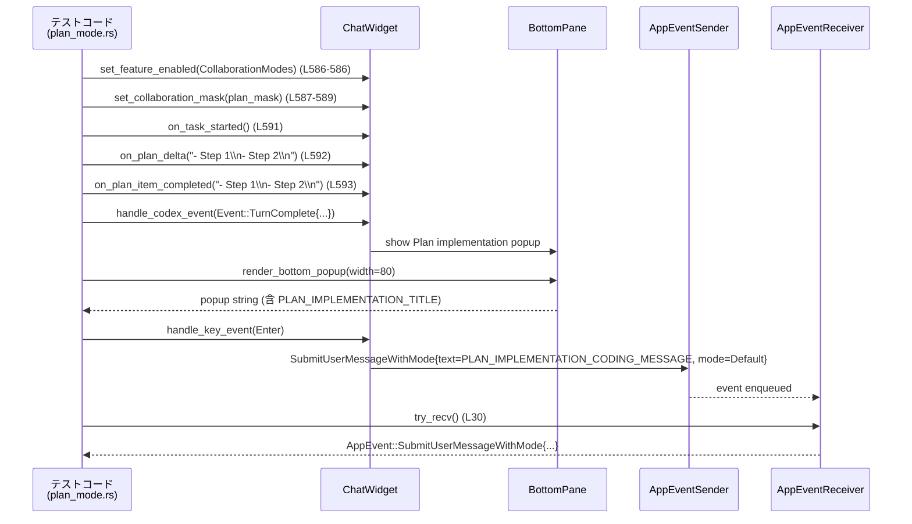

# tui/src/chatwidget/tests/plan_mode.rs コード解説

## 0. ざっくり一言

このファイルは、TUI の `ChatWidget` における **Plan モード／コラボレーションモード／推論強度（reasoning effort）／通知／メッセージ送信まわり** の挙動を、統合テストで検証するモジュールです。  
特に「Plan 実行促しポップアップ」「Plan 専用の推論スコープ選択」「モード切り替え時のモデル・推論変更通知」「スレッドモデル未設定時や compact turn 中の送信制御」などのコアロジックを対象としています。

---

## 1. このモジュールの役割

### 1.1 概要

- このモジュールは **ChatWidget の Plan モードとコラボレーションモード周辺の振る舞い** を回帰テストするために存在します。
- キーボード入力 (`KeyEvent`)・サーバーイベント (`codex_protocol::EventMsg`)・内部状態（plan ストリーム、queued メッセージ、通知キューなど）に対して、**どのタイミングでどの AppEvent / Op が出るか、どんなポップアップが表示されるか** を検証します。
- 並行性の観点では、`#[tokio::test]` や `#[tokio::test(flavor = "multi_thread")]` を用いて、**非同期イベント駆動＋チャネル経由のメッセージ送受信** の契約をテストしています（例: `rx.try_recv()`, `op_rx.try_recv()` の結果確認）。

### 1.2 アーキテクチャ内での位置づけ

このテストモジュールは、上位 TUI コンポーネントと Codex サーバ／モデル設定／通知設定などとの接点をモック／疑似環境で検証します。

```mermaid
graph TD
    T[plan_mode.rs<br/>テスト] --> CW[ChatWidget<br/>(super::* から)]
    T --> MC[model_catalog / collaboration_modes]
    T --> Conf[ConfigBuilder / ChatWidgetInit]
    CW --> BP[BottomPane<br/>(composer, status)]
    CW --> AE[AppEventSender<br/>(app_event_tx)]
    CW --> OP[Op 送信チャネル<br/>(op_rx)]
    CW --> Codex[Codex Event / ServerNotification]
    CW --> Notif[Notification / Notifications 設定]
```

- テストコードは `make_chatwidget_manual` や `ChatWidget::new_with_app_event` を通じて `ChatWidget` を初期化し、  
  `KeyEvent` や Codex 側の `Event` / `ServerNotification` を流し込みます（例: `plan_implementation_popup_shows_once_when_replay_precedes_live_turn_complete` の前半, `plan_mode.rs:L585-600`）。
- `ChatWidget` は内部で `AppEventSender` と `Op` チャネルに書き込み、テストは `rx.try_recv()` や `next_submit_op` で結果を検証します（例: `plan_implementation_popup_yes_emits_submit_message_event`, `plan_mode.rs:L30-39`）。
- `BottomPane` 経由で composer テキストやステータスインジケータ、ポップアップのレンダリング結果を検証します（例: `render_bottom_popup`, `plan_mode.rs:L9-10`, `L405-422`）。

### 1.3 設計上のポイント（テストから読み取れる契約）

コードから読み取れる特徴を列挙します。

- **イベント駆動＋状態マシン**
  - Plan モード中の状態（plan ストリームの有無・タスク実行中かどうか・queued メッセージの有無など）に応じて、  
    ポップアップ表示やメッセージ送信可否が変化します（例: `plan_implementation_popup_skips_when_messages_queued`, `plan_mode.rs:L646-663`）。
- **モード／モデル／推論強度の整合性**
  - コラボレーションモード切替や reasoning effort の変更が、現在の Plan モード用マスク・グローバル設定・Plan 専用上書きのどれに影響するかを細かくテストしています  
    （例: `set_reasoning_effort_does_not_override_active_plan_override`, `plan_mode.rs:L1293-1308`）。
- **安全な送信制御**
  - スレッドモデル未設定時は送信をブロックし、ユーザ向けエラーメッセージを履歴に挿入する（`submit_user_message_blocks_when_thread_model_is_unavailable`, `plan_mode.rs:L480-499`）。
  - Plan モード実行中にモードを変更しようとすると送信せずエラーを表示し、モードは変えない（`submit_user_message_with_mode_errors_when_mode_changes_during_running_turn`, `plan_mode.rs:L452-477`）。
  - compact turn 中に steer できないエラーが返った場合、メッセージを安全にキューへ移し、turn 完了後に再送する（`submit_user_message_queues_while_compaction_turn_is_running`, `plan_mode.rs:L852-928`）。
- **通知とポップアップの優先順位**
  - Plan 実行促しポップアップとレート制限ポップアップは排他的で、レート制限が優先される（`plan_implementation_popup_skips_when_rate_limit_prompt_pending`, `plan_mode.rs:L797-825`）。
  - `Notification::PlanModePrompt` と `Notification::UserInputRequested` が、お互いどう上書きするかを明示的にテストしています（`plan_mode.rs:L318-394`）。
- **非同期／並行性**
  - ほぼ全てが `#[tokio::test]` で、async な `ChatWidget` 実装を前提としています。
  - plugin mentions のテストは `#[tokio::test(flavor = "multi_thread")]` で実行されており、  
    プラグイン関連の状態や送信データが `Send + Sync` として扱えることを間接的に確認しています（`plan_mode.rs:L930-996`）。

---

## 2. 主要な機能一覧

### 2.1 機能テーマ

このテストファイルがカバーする主な機能テーマは次のとおりです。

- **Plan 実行促しポップアップ**
  - Plan のストリーム完了／再生／steer の有無／Rate limit ポップアップとの競合などに応じた表示／非表示ロジック。
- **Reasoning Effort / Plan 専用推論スコープ**
  - Plan モードで reasoning を変更したときに、Plan 専用スコープポップアップを開くかどうか。
  - Plan 専用の reasoning override とグローバル default の保存／復元。
- **通知システム**
  - `Notification::PlanModePrompt` / `Notification::UserInputRequested` の `allowed_for` と `display` 文字列。
  - pending notification の上書き優先順位。
- **メッセージ送信とコラボレーションモード**
  - Plan 実行中のモード変更の禁止／許可条件。
  - スレッドモデル未設定時の送信ブロック。
  - compact turn 中の steer キューイングと再送。
  - Plugin mentions 付きの `UserInput` 生成。
  - Personality の指定が `Op::UserTurn` に反映されること。
- **ショートカットとスラッシュコマンド**
  - `Shift+Tab (BackTab)` によるコラボモードのサイクル（アイドル時のみ）。
  - `/collab`, `/plan` コマンドのポップアップ・モード切り替え・即時送信。
- **初期状態と設定反映**
  - 起動直後に Default コラボモードで始まること。
  - `set_model` / `set_reasoning_effort` がアクティブなコラボマスクに正しく反映されること。
- **Plan 更新の履歴レンダリング**
  - `EventMsg::PlanUpdate` を受け取ったときに「Updated Plan」セルが履歴に挿入されること。

### 2.2 テスト関数インベントリ

テスト関数をすべて列挙します（行番号は本ファイル内で 1 始まりとしています）。

| # | 関数名 | 種別 | 役割 / シナリオ | 行範囲 |
|---|--------|------|-----------------|--------|
| 1 | `plan_implementation_popup_snapshot` | async test | Plan 実行促しポップアップの基本スナップショット | `plan_mode.rs:L4-11` |
| 2 | `plan_implementation_popup_no_selected_snapshot` | async test | ポップアップで何も選択されていない状態のスナップショット | `plan_mode.rs:L13-21` |
| 3 | `plan_implementation_popup_yes_emits_submit_message_event` | async test | ポップアップで Yes を選択したときに `SubmitUserMessageWithMode` が出ること | `plan_mode.rs:L23-40` |
| 4 | `submit_user_message_with_mode_sets_coding_collaboration_mode` | async test | `submit_user_message_with_mode` が Default モードで `Op::UserTurn` を送ること | `plan_mode.rs:L42-66` |
| 5 | `reasoning_selection_in_plan_mode_opens_scope_prompt_event` | async test | Plan モードで reasoning を変えるとスコープポップアップイベントを開く | `plan_mode.rs:L68-93` |
| 6 | `reasoning_selection_in_plan_mode_without_effort_change_does_not_open_scope_prompt_event` | async test | reasoning が変わらない場合はスコープポップアップを開かず、モデル／reasoning 更新イベントのみ送る | `plan_mode.rs:L95-127` |
| 7 | `reasoning_selection_in_plan_mode_matching_plan_effort_but_different_global_opens_scope_prompt` | async test | Plan 側は変わらないが global が異なる場合、スコープポップアップを開く | `plan_mode.rs:L129-158` |
| 8 | `plan_mode_reasoning_override_is_marked_current_in_reasoning_popup` | async test | Plan override が reasoning ポップアップの「current」ラベルを支配する | `plan_mode.rs:L160-181` |
| 9 | `reasoning_selection_in_plan_mode_model_switch_does_not_open_scope_prompt_event` | async test | モデル変更を伴う reasoning 選択ではスコープポップアップを開かない | `plan_mode.rs:L183-212` |
| 10 | `plan_reasoning_scope_popup_all_modes_persists_global_and_plan_override` | async test | スコープポップアップで「全モード」選択時、Plan override とグローバル設定両方を更新＆永続化する | `plan_mode.rs:L215-248` |
| 11 | `plan_mode_prompt_notification_uses_dedicated_type_name` | sync test | `Notification::PlanModePrompt` の type 名と display 文言を検証 | `plan_mode.rs:L250-266` |
| 12 | `user_input_requested_notification_uses_dedicated_type_name` | sync test | `Notification::UserInputRequested` の type 名と display 文言を検証 | `plan_mode.rs:L268-285` |
| 13 | `open_plan_implementation_prompt_sets_pending_notification` | async test | 設定上許可されている場合、Plan 実行促しの pending notification をセット | `plan_mode.rs:L287-299` |
| 14 | `open_plan_reasoning_scope_prompt_sets_pending_notification` | async test | Plan reasoning スコープポップアップでも PlanModePrompt 通知をセット | `plan_mode.rs:L301-316` |
| 15 | `agent_turn_complete_does_not_override_pending_plan_mode_prompt_notification` | async test | AgentTurnComplete 通知が既存の PlanModePrompt を上書きしない | `plan_mode.rs:L318-331` |
| 16 | `user_input_notification_overrides_pending_agent_turn_complete_notification` | async test | UserInputRequested 通知が AgentTurnComplete 通知を上書きする | `plan_mode.rs:L333-363` |
| 17 | `handle_request_user_input_sets_pending_notification` | async test | 設定で許可されている場合、UserInputRequested 通知を pending に設定 | `plan_mode.rs:L365-394` |
| 18 | `plan_reasoning_scope_popup_mentions_selected_reasoning` | async test | スコープポップアップ文言に選択された reasoning と Plan override が反映される | `plan_mode.rs:L396-411` |
| 19 | `plan_reasoning_scope_popup_mentions_built_in_plan_default_when_no_override` | async test | override がない場合、「built-in Plan default」文言を表示 | `plan_mode.rs:L413-423` |
| 20 | `plan_reasoning_scope_popup_plan_only_does_not_update_all_modes_reasoning` | async test | 「Plan のみ」選択時に global reasoning を変更しないこと | `plan_mode.rs:L425-449` |
| 21 | `submit_user_message_with_mode_errors_when_mode_changes_during_running_turn` | async test | Plan 実行中に他モードへ submit しようとするとエラー表示＆送信なし | `plan_mode.rs:L451-477` |
| 22 | `submit_user_message_blocks_when_thread_model_is_unavailable` | async test | thread model 空文字時に送信をブロックしエラー文言を履歴に出す | `plan_mode.rs:L479-499` |
| 23 | `submit_user_message_with_mode_allows_same_mode_during_running_turn` | async test | Plan 実行中に同一 Plan モードでの submit は許可される | `plan_mode.rs:L501-529` |
| 24 | `submit_user_message_with_mode_submits_when_plan_stream_is_not_active` | async test | Plan ストリームが非アクティブならデフォルトモードで送信する | `plan_mode.rs:L531-559` |
| 25 | `plan_implementation_popup_skips_replayed_turn_complete` | async test | replay された TurnComplete では Plan 実行促しポップアップを出さない | `plan_mode.rs:L561-581` |
| 26 | `plan_implementation_popup_shows_once_when_replay_precedes_live_turn_complete` | async test | replay 後の最初の live TurnComplete でのみポップアップを出し、以降は抑制 | `plan_mode.rs:L583-644` |
| 27 | `plan_implementation_popup_skips_when_messages_queued` | async test | queued メッセージがある場合 Plan 実行促しポップアップを出さない | `plan_mode.rs:L646-663` |
| 28 | `plan_implementation_popup_skips_without_proposed_plan` | async test | Plan の提案出力がない場合はポップアップを出さない | `plan_mode.rs:L665-687` |
| 29 | `plan_implementation_popup_shows_after_proposed_plan_output` | async test | Plan 出力（delta, completed）の後にタスク完了するとポップアップを出す | `plan_mode.rs:L689-707` |
| 30 | `plan_implementation_popup_skips_when_steer_follows_proposed_plan` | async test | Plan に従う steer が直後にある場合はポップアップを出さない | `plan_mode.rs:L709-749` |
| 31 | `plan_implementation_popup_shows_after_new_plan_follows_steer` | async test | steer 後に新しい Plan が提示された場合は再度ポップアップを出す | `plan_mode.rs:L751-793` |
| 32 | `plan_implementation_popup_skips_when_rate_limit_prompt_pending` | async test | Rate limit ポップアップが pending のとき Plan ポップアップは抑制 | `plan_mode.rs:L796-825` |
| 33 | `plan_completion_restores_status_indicator_after_streaming_plan_output` | async test | Plan ストリーム中に隠した status indicator を完了時に復元 | `plan_mode.rs:L828-849` |
| 34 | `submit_user_message_queues_while_compaction_turn_is_running` | async test | compact turn 中の steer → エラー → queued に移し、turn 完了後に送信 | `plan_mode.rs:L852-928` |
| 35 | `submit_user_message_emits_structured_plugin_mentions_from_bindings` | async test (multi_thread) | mention binding から構造化された `UserInput::Mention` を生成 | `plan_mode.rs:L930-996` |
| 36 | `enter_submits_when_plan_stream_is_not_active` | async test | Plan ストリームがアクティブでない状態で Enter で即送信されること | `plan_mode.rs:L998-1020` |
| 37 | `collab_mode_shift_tab_cycles_only_when_idle` | async test | BackTab によるモードサイクルがアイドル時のみ動作すること | `plan_mode.rs:L1022-1039` |
| 38 | `mode_switch_surfaces_model_change_notification_when_effective_model_changes` | async test | モード切替で実効モデルが変わると履歴に通知メッセージを挿入 | `plan_mode.rs:L1041-1078` |
| 39 | `mode_switch_surfaces_reasoning_change_notification_when_model_stays_same` | async test | モデルは同じだが reasoning が変わるケースでも通知を挿入 | `plan_mode.rs:L1080-1099` |
| 40 | `collab_slash_command_opens_picker_and_updates_mode` | async test | `/collab` でモードピッカーを開き、選択後の送信内容を確認 | `plan_mode.rs:L1101-1156` |
| 41 | `plan_slash_command_switches_to_plan_mode` | async test | `/plan` で Plan モードに切り替えつつ、非 history イベントを出さないこと | `plan_mode.rs:L1158-1174` |
| 42 | `plan_slash_command_with_args_submits_prompt_in_plan_mode` | async test | `/plan xxx` を composer に入力して Enter したとき、Plan モードでプロンプトを送信 | `plan_mode.rs:L1176-1221` |
| 43 | `collaboration_modes_defaults_to_code_on_startup` | async test | 起動時のコラボモードが Default かつ resolved_model を用いること | `plan_mode.rs:L1223-1259` |
| 44 | `set_model_updates_active_collaboration_mask` | async test | `set_model` で現在のコラボマスクにモデルが反映され、Plan モードが維持される | `plan_mode.rs:L1261-1273` |
| 45 | `set_reasoning_effort_updates_active_collaboration_mask` | async test | `set_reasoning_effort(None)` が Plan マスクに medium を設定する | `plan_mode.rs:L1275-1289` |
| 46 | `set_reasoning_effort_does_not_override_active_plan_override` | async test | Plan override が設定されているとき global reasoning の変更が上書きしない | `plan_mode.rs:L1293-1308` |
| 47 | `collab_mode_is_sent_after_enabling` | async test | コラボモード機能を有効化後、最初の送信から `collaboration_mode` が付く | `plan_mode.rs:L1310-1333` |
| 48 | `collab_mode_applies_default_preset` | async test | コラボモード機能を有効化していなくても default preset が適用される | `plan_mode.rs:L1335-1360` |
| 49 | `user_turn_includes_personality_from_config` | async test | Personality 機能有効時に `Op::UserTurn` に personality が含まれる | `plan_mode.rs:L1362-1379` |
| 50 | `plan_update_renders_history_cell` | async test | `EventMsg::PlanUpdate` で「Updated Plan」セルが履歴に追加される | `plan_mode.rs:L1382-1415` |

---

## 3. 公開 API と詳細解説

このファイル自身はテストモジュールであり公開 API を定義していませんが、  
**`ChatWidget` および関連型の公開 API をどのように利用しているか** が明確に現れています。  
ここでは、テストから読み取れる主要メソッド／型の役割と契約を整理します。

### 3.1 型一覧（このモジュールから見える主な型）

| 名前 | 種別 | 役割 / 用途 | 根拠 |
|------|------|-------------|------|
| `ChatWidget` | 構造体 | TUI チャット UI のメインコンポーネント。Plan モード／コラボモード／通知／メッセージ送信などを統括 | `make_chatwidget_manual` の戻り値など `plan_mode.rs:L6, L15` |
| `ChatWidgetInit` | 構造体 | `ChatWidget::new_with_app_event` に渡す初期化パラメータ一式 | `plan_mode.rs:L1237-1256` |
| `AppEvent` | 列挙体 | TUI → アプリケーションへの通知イベント（モデル更新、reasoning 更新、ポップアップオープンなど） | `SubmitUserMessageWithMode`, `OpenPlanReasoningScopePrompt`, `UpdateModel` 等のパターンマッチ, `plan_mode.rs:L31-39, L86-92, L115-125` |
| `Op` | 列挙体 | ChatWidget → Codex コアへの操作（`Op::UserTurn` など） | `plan_mode.rs:L52-65, L515-528, L549-557, 他多数` |
| `CollaborationMode` | 構造体 | コラボレーションモードの設定（`mode: ModeKind`, モデル、reasoning 等） | `plan_mode.rs:L55-57, L518-521` |
| `ModeKind` | 列挙体 | コラボモードの種類（`Default`, `Plan` など） | `plan_mode.rs:L39, L56, L519, L1028` |
| `Feature` | 列挙体 | 機能フラグ（`CollaborationModes`, `Personality`, `Plugins`） | `set_feature_enabled` の引数, `plan_mode.rs:L46, L365, L957, L1365` |
| `Notification` | 列挙体 | 各種通知（Plan モードプロンプト、ユーザ入力要求、Agent 完了など） | `plan_mode.rs:L250-265, L270-284, L322-325` |
| `Notifications` | 列挙体 or 構造体 | 通知のフィルタリング設定。`Custom(Vec<String>)` など | `plan_mode.rs:L256-261, L290-291` |
| `ReasoningEffortConfig` | 列挙体 or 構造体 | `Low` / `Medium` / `High` など推論強度の設定 | `plan_mode.rs:L78, L144, L217-220, L399-403` |
| `ThreadId` | 新タイプ | スレッド ID を表す識別子 | `ThreadId::new()`, `plan_mode.rs:L45, L855` |
| `UserMessage` | 構造体 | ユーザから送るメッセージ（テキスト、画像、mention バインドなど） | `plan_mode.rs:L872, L969-978` |
| `UserInput` | 列挙体 | Codex 側に渡す入力要素（`Text`, `Mention` 等） | `plan_mode.rs:L731-737, L878-881, L985-995` |
| `SlashCommand` | 列挙体 | `/collab`, `/plan` などのスラッシュコマンド | `plan_mode.rs:L1107, L1164` |
| `Event` / `EventMsg` | 列挙体 | Codex 側からのイベント（`SessionConfigured`, `TurnComplete`, `PlanUpdate`, `Error` など） | `plan_mode.rs:L607-615, L953-956, L1402-1404` |
| `ServerNotification` | 列挙体 | サーバ通知（`TurnStarted`, `TurnCompleted`） | `plan_mode.rs:L856-868, L902-915` |
| `UpdatePlanArgs`, `PlanItemArg`, `StepStatus` | 構造体 / 列挙体 | Plan の内容とステータスを表現する型 | `plan_mode.rs:L674-680, L805-812, L1385-1400` |
| `Personality` | 列挙体 | モデルの応答スタイル（`Pragmatic`, `Friendly` など） | `plan_mode.rs:L1015, L1326, L1375` |

> これらの型の定義本体は別ファイルにありますが、本テストから役割と典型的な使い方が読み取れます。

### 3.2 重要 API（ChatWidget メソッド）の詳細

ここでは、本ファイルを通じて **契約が特に明確な `ChatWidget` のメソッド** を 7 つ選び、テストコードを根拠に振る舞いをまとめます。

#### `ChatWidget::submit_user_message_with_mode(text, mask)`

**概要**

- コラボレーションモード付きでユーザメッセージを送信するメソッドです。
- Plan ストリームの実行状況とアクティブな `CollaborationMode` に応じて、**送信を許可／拒否し、必要なエラーメッセージを履歴に挿入** します。

**テストから見える契約**

1. **Plan 実行中に別モードへ切り替えようとした場合**

   - 前提: Plan モードマスクを `set_collaboration_mask` で設定し、`on_task_started()` 済み (`plan_mode.rs:L452-459`)。
   - その状態で `default_mask`（Default モード）を渡して呼び出すと、以下が確認できます（`plan_mode.rs:L461-476`）:
     - `active_collaboration_mode_kind()` は引き続き `ModeKind::Plan`。
     - `queued_user_messages` は空のまま。
     - `op_rx.try_recv()` は `TryRecvError::Empty`（つまり Codex 側への送信なし）。
     - 履歴には `"Cannot switch collaboration mode while a turn is running."` というメッセージが挿入されている。

   ⇒ **契約**: 「Plan タスク実行中は、他のコラボレーションモードへの切り替えを伴う送信を拒否し、ユーザに明示的なエラーを表示する」。

2. **Plan 実行中に同一 Plan モードで送信する場合**

   - Plan モードで `on_task_started()` 済みの状態で、同じ `plan_mask` を渡して呼び出すと（`plan_mode.rs:L503-511`）:
     - `active_collaboration_mode_kind()` は `ModeKind::Plan`。
     - `queued_user_messages` は空。
     - `Op::UserTurn` が 1 つ送信され、その `collaboration_mode.mode` が `ModeKind::Plan` であることが確認されています（`plan_mode.rs:L515-527`）。

   ⇒ **契約**: 「Plan 実行中に Plan モードのまま送信することは許可される」。

3. **Plan ストリームがアクティブでない場合**

   - Plan 用マスクをセットした上で、Plan ストリームを開始していない状態で `default_mask` を渡して呼び出すと（`plan_mode.rs:L532-545`）:
     - `active_collaboration_mode_kind()` は default mask が持つ `mode` に切り替わる（`expected_mode`）。
     - `Op::UserTurn` の `collaboration_mode.mode` も同じものになる（`plan_mode.rs:L547-557`）。

   ⇒ **契約**: 「Plan ストリームがアクティブでなければ、`submit_user_message_with_mode` と同時にアクティブモードを切り替え、そのモードで送信する」。

**エラー／安全性**

- Plan 実行中に異なるモードで送信しようとした場合に **送信されない** ことを `TryRecvError::Empty` を用いて明示的に確認しています（`plan_mode.rs:L467-472`）。
- これは、Rust の型システムよりも**状態マシンレベルの安全性**（不正状態での操作禁止）を表す契約です。

**Edge cases**

- Plan 実行中か否か（`on_task_started` 呼び出し有無）が挙動を分岐させる境界です。
- mask の `mode` が現在の `active_collaboration_mode_kind()` と同じかどうかが、許可／拒否の条件になります。

---

#### `ChatWidget::submit_user_message(message: UserMessage)`

**概要**

- コラボレーションモード指定なしでユーザメッセージを送信するメソッドです。
- compact turn（履歴圧縮中のターン）との整合性や Plugin mentions の展開など、複数のシナリオがテストされています。

**主なシナリオ**

1. **compact turn が InProgress のとき**

   - `ServerNotification::TurnStarted` で compact ターンが開始されている状態（`plan_mode.rs:L856-870`）で呼び出す。
   - 直後に `Op::UserTurn` が送信され、`items` に `Text("queued while compacting")` が入る（`plan_mode.rs:L872-882`）。
   - その後、Codex 側から `EventMsg::Error(CodexErrorInfo::ActiveTurnNotSteerable { turn_kind: Compact })` を受けると（`plan_mode.rs:L886-893`）:
     - `pending_steers` が空になり（`plan_mode.rs:L896`）、
     - `queued_user_message_texts()` に `"queued while compacting"` が残る（`plan_mode.rs:L897-900`）。
   - `ServerNotification::TurnCompleted` 後に、再度 `Op::UserTurn` が同じテキストで送信される（`plan_mode.rs:L902-927`）。

   ⇒ **契約**: 「compact turn に対する steer ができない場合、エラーを検知してメッセージを safe な follow-up としてキューに移し、ターン完了後に自動再送する」。

2. **プラグイン mentions の構造化**

   - Plugins 機能を有効化し（`plan_mode.rs:L957`）、`BottomPane` に plugin のサマリーを設定（`set_plugin_mentions`, `plan_mode.rs:L958-967`）。
   - `UserMessage` に `$sample` というテキストと `MentionBinding { mention: "sample", path: "plugin://sample@test" }` を含める（`plan_mode.rs:L969-978`）。
   - 送信される `Op::UserTurn` の `items` には（`plan_mode.rs:L980-995`）:
     - `UserInput::Text { text: "$sample" }`
     - `UserInput::Mention { name: "Sample Plugin", path: "plugin://sample@test" }`
     が順に入る。

   ⇒ **契約**: 「mention binding と BottomPane の plugin メタデータから、ユーザテキスト＋構造化 Mention の 2 要素を送信データとして組み立てる」。

---

#### `ChatWidget::open_plan_implementation_prompt()`

**概要**

- Plan モードのタスク完了後に、「この Plan を実装しますか？」とユーザに促すポップアップを開く操作を行います。
- また、通知設定に応じて `Notification::PlanModePrompt` を pending notification としてセットします。

**テストから読み取れる動作**

- ポップアップの内容は snapshot テストで検証されます（`plan_mode.rs:L4-21`）。
- 通知設定が `Notifications::Custom(vec!["plan-mode-prompt"])` の場合、呼び出し後に:

  ```rust
  assert_matches!(
      chat.pending_notification,
      Some(Notification::PlanModePrompt { ref title }) if title == PLAN_IMPLEMENTATION_TITLE
  );
  ```

  が成り立ちます（`plan_mode.rs:L287-299`）。

- Plan 実行のライフサイクルと組み合わせたテスト:

  - replay の `TurnComplete` イベントだけではポップアップを表示しない（`plan_mode.rs:L561-581`）。
  - replay 後の最初の live `TurnComplete` のみポップアップを表示し、Esc で閉じたあとは同じ `TurnComplete` が来ても再表示しない（`plan_mode.rs:L584-644`）。
  - queued メッセージがある／Plan 提案が無い／Rate limit ポップアップが pending などの場合は表示しない（`plan_mode.rs:L646-663, L665-687, L797-825`）。
  - Plan 提案が streaming で出力され、その完了後の `on_task_complete` では表示する（`plan_mode.rs:L691-707`）。
  - Plan に沿う steer がすぐ後にある場合はスキップし、新しい Plan がその後提示されると再度表示される（`plan_mode.rs:L711-793`）。

**契約（まとめ）**

- 「Plan の提案が出力されており／messages キューが空で／Rate limit ポップアップが優先されておらず／live turn 完了である」場合など、かなり制約された条件でのみ Plan 実装ポップアップを出す。
- replay と live イベントの区別や、「直後に Plan に沿う steer があったかどうか」も表示条件に影響する。

---

#### `ChatWidget::open_reasoning_popup(preset)`

**概要**

- モデルプリセットに対する reasoning 選択ポップアップを開くメソッドで、Plan モードの有無や現在の reasoning 設定に応じて挙動が変わります。

**主なシナリオ**

- Plan モードかつ、現在の global reasoning と Plan 効 effective reasoning が異なる／一致しているかに応じて:

  1. **Plan モードで reasoning を変更しようとした場合**
     - `set_reasoning_effort(Some(ReasoningEffortConfig::High))` の状態で Plan 用プリセットを開き Enter すると、  
       `AppEvent::OpenPlanReasoningScopePrompt { model: "gpt-5.1-codex-max", effort: Some(ReasoningEffortConfig::Medium) }` が出る（`plan_mode.rs:L144-157`）。
  2. **既に Plan 用 preset と global が一致している場合**
     - Enter で `AppEvent::UpdateModel` と `AppEvent::UpdateReasoningEffort(Some(_))` が出るが、スコープポップアップは開かない（`plan_mode.rs:L96-126`）。
  3. **モデル切替が絡む場合**
     - Plan プリセットから別モデル `"gpt-5"` を選ぶと、`UpdateModel("gpt-5")` と `UpdateReasoningEffort(Some(_))` が送られ、スコープポップアップは開かない（`plan_mode.rs:L184-212`）。

**契約**

- Plan モードで current Plan effective reasoning と新しい preset が一致しているかどうかで、「Plan 専用スコープポップアップを開くか／単にモデル・reasoning を更新するか」が分岐する。

---

#### `ChatWidget::open_plan_reasoning_scope_prompt(model: String, effort: Option<ReasoningEffortConfig>)`

**概要**

- Plan モードで reasoning を変更するとき、「Plan だけ上書きするか／global と Plan 両方を更新するか」を選ばせるポップアップを開きます。

**テストからのポイント**

- ポップアップの文言には、以下が含まれることが確認されています（`plan_mode.rs:L398-410, L414-423`）:
  - 「Choose where to apply medium reasoning.」
  - 「Always use medium reasoning in Plan mode.」
  - 「Apply to Plan mode override」
  - 「Apply to global default and Plan mode override」
  - 既存 override がある場合は「user-chosen Plan override (low)」、ない場合は「built-in Plan default (medium)」。

- 選択肢の挙動:

  1. **Enter（Plan のみ）**
     - デフォルト選択（Plan のみ）の状態で Enter すると、  
       `AppEvent::UpdatePlanModeReasoningEffort(Some(effort))` のみが送られ、`UpdateReasoningEffort` は送られない（`plan_mode.rs:L426-448`）。

  2. **Down → Enter（全モード）**
     - 下に移動してから Enter すると、以下の AppEvent が送られる（`plan_mode.rs:L215-247`）。
       - `UpdatePlanModeReasoningEffort(Some(effort))`
       - `PersistPlanModeReasoningEffort(Some(effort))`
       - `PersistModelSelection { model, effort: Some(effort) }`

**契約**

- 「Plan のみ」: Plan override を更新するだけで global default は触らない。
- 「全モード」: Plan override と global default の両方を更新し、それぞれを永続化する。

---

#### `ChatWidget::handle_key_event(KeyEvent)`

**概要**

- ユーザのキーボード入力（Enter, Esc, Down, BackTab など）に応じて、composer 送信やモード切替、ポップアップ操作を行います。

**主な契約**

1. **Enter による送信**

   - Plan ストリームがアクティブでない状態で composer にテキストがあると、即座に `Op::UserTurn` が送信される（`enter_submits_when_plan_stream_is_not_active`, `plan_mode.rs:L998-1020`）。
   - Plan 実装ポップアップが出ている状態で Enter を押すと、`SubmitUserMessageWithMode` イベントを発火させる（`plan_implementation_popup_yes_emits_submit_message_event`, `plan_mode.rs:L28-39`）。

2. **Esc によるポップアップ閉じ**

   - Plan 実行促しポップアップ表示中に `KeyCode::Esc` を送ると、ポップアップが閉じ、それ以降同じ live TurnComplete では再表示されない（`plan_mode.rs:L623-628, L639-643`）。

3. **BackTab によるコラボモードサイクル**

   - アイドル状態（タスク非実行）では BackTab ごとに `ModeKind::Default`↔`ModeKind::Plan` をトグルするが、  
     `current_collaboration_mode()` は変化しない（`plan_mode.rs:L1026-1033`）。
   - タスク実行中 (`on_task_started` 後) は BackTab を押しても `active_collaboration_mode_kind()` は変わらない（`plan_mode.rs:L1035-1038`）。

4. **ポップアップ内の選択**

   - Reasoning ポップアップや Plan reasoning scope ポップアップ内で `KeyCode::Down` や `KeyCode::Enter` による選択／決定を扱う（`plan_mode.rs:L82-83, L222-223, L433`）。

---

#### `ChatWidget::dispatch_command(SlashCommand)`

**概要**

- `/collab` や `/plan` などのスラッシュコマンドに応じて、モードピッカー／Plan モード切り替え／即時計画生成を行います。

**テスト上の契約**

1. **`SlashCommand::Collab`**

   - 実行すると「Select Collaboration Mode」というポップアップが `BottomPane` に表示される（`plan_mode.rs:L1107-1112`）。
   - Enter で選択すると `AppEvent::UpdateCollaborationMode(mask)` が発火し、  
     それを `set_collaboration_mask` に渡してから送信したメッセージでは、  
     `collaboration_mode.mode` が `ModeKind::Default` かつ `Personality::Pragmatic` が付く（`plan_mode.rs:L1114-1136`）。

2. **`SlashCommand::Plan`**

   - 実行すると Plan モードがアクティブになり、`active_collaboration_mode_kind()` は `ModeKind::Plan` になる（`plan_mode.rs:L1164-1173`）。
   - その過程で `AppEvent::InsertHistoryCell` 以外の AppEvent を出さないことが保証されている（`plan_mode.rs:L1166-1171`）。
   - `/plan build the plan` を composer に入れて Enter すると、  
     `/plan` プレフィックスを取り除いた `"build the plan"` だけが `UserInput::Text` として送信され、  
     `active_collaboration_mode_kind()` は `ModeKind::Plan` になっている（`plan_mode.rs:L1208-1220`）。

---

### 3.3 その他の関数／ヘルパ

本ファイルでは定義されていませんが、`super::*` 経由でインポートされている代表的なテストヘルパを挙げます（呼び出し箇所から推測できる範囲）。

| 関数名 | 役割（1 行） | 根拠 |
|--------|--------------|------|
| `make_chatwidget_manual(model_override: Option<&str>)` | `ChatWidget`・AppEvent 受信チャネル・Op 受信チャネルをセットアップするテスト用コンストラクタ | ほぼ全テストで使用, `plan_mode.rs:L6, L15, L25` 他 |
| `render_bottom_popup(&ChatWidget, width: u16) -> String` | 現在のポップアップ UI をテキストとしてレンダリング | snapshot・文字列検査, `plan_mode.rs:L9, L19, L175` 等 |
| `drain_insert_history(&mut rx)` | `AppEvent::InsertHistoryCell` をすべて読み出すユーティリティ | `plan_mode.rs:L76, L103, L225` 等 |
| `next_submit_op(&mut op_rx) -> Op` | `op_rx` から次の `Op` を受信し unwrap するヘルパ | 多数の送信テスト, `plan_mode.rs:L52, L515, L549` 等 |
| `assert_no_submit_op(&mut op_rx)` | `op_rx` に何も送られていないことを検証 | `plan_mode.rs:L489` |
| `set_chatgpt_auth(&mut ChatWidget)` | ChatGPT アカウント認証済フラグなどをテスト用にセット | `plan_mode.rs:L77, L104, L192` |
| `lines_to_single_string(&[String]) -> String` | 履歴セルの複数行を 1 つの文字列に結合 | `plan_mode.rs:L470-472, L1408-1411` |
| `snapshot(percent: f64)` | Rate limit スナップショットを生成するヘルパ | `plan_mode.rs:L813` |
| `test_model_catalog(&Config)` | モデルカタログをテスト用に組み立てる | `plan_mode.rs:L1244` |

定義はこのチャンクには存在しません。

---

## 4. データフロー

### 4.1 代表シナリオ: Plan 完了から実装ポップアップ → メッセージ送信

Plan モードで Plan ストリームが完了したあと、ユーザに実装を促すポップアップを出し、Enter で coding モードのメッセージ送信が行われるまでのデータフローです。



- Plan ストリーム出力 (`on_plan_delta`, `on_plan_item_completed`) があった後の live `TurnComplete` のみがポップアップ表示条件になることが  
  `plan_implementation_popup_shows_once_when_replay_precedes_live_turn_complete`（`plan_mode.rs:L584-644`）で確認されています。
- ポップアップで Enter を押すシナリオは `plan_implementation_popup_yes_emits_submit_message_event`（`plan_mode.rs:L24-40`）で検証され、  
  `SubmitUserMessageWithMode` イベントに `PLAN_IMPLEMENTATION_CODING_MESSAGE` と `ModeKind::Default` が入ることが保証されています。

---

## 5. 使い方（How to Use）

このファイルはテストコードですが、`ChatWidget` とコラボレーションモード／Plan モード機能をアプリケーションから利用する際の参考になります。

### 5.1 基本的な利用フロー（ChatWidget 初期化と送信）

`ChatWidgetInit` を使って `ChatWidget` を初期化し、Plan モードを有効化してメッセージを送るまでの典型例です（テストの `collaboration_modes_defaults_to_code_on_startup` と複数の送信テストを合成）。

```rust
// Config を構築する（plan_mode.rs:L1225-1234 相当）
let cfg = ConfigBuilder::default()
    .codex_home(codex_home.path().to_path_buf())
    .cli_overrides(vec![(
        "features.collaboration_modes".to_string(),
        TomlValue::Boolean(true),
    )])
    .build()
    .await?;

// モデルを解決し、テレメトリなどを組み立てる（L1235-1237）
let resolved_model = crate::legacy_core::test_support::get_model_offline(cfg.model.as_deref());
let session_telemetry = test_session_telemetry(&cfg, resolved_model.as_str());

// ChatWidgetInit を用意（L1237-1254）
let init = ChatWidgetInit {
    config: cfg.clone(),
    frame_requester: FrameRequester::test_dummy(),
    app_event_tx: AppEventSender::new(unbounded_channel::<AppEvent>().0),
    initial_user_message: None,
    enhanced_keys_supported: false,
    has_chatgpt_account: false,
    model_catalog: test_model_catalog(&cfg),
    feedback: codex_feedback::CodexFeedback::new(),
    is_first_run: true,
    status_account_display: None,
    initial_plan_type: None,
    model: Some(resolved_model.clone()),
    startup_tooltip_override: None,
    status_line_invalid_items_warned: Arc::new(AtomicBool::new(false)),
    terminal_title_invalid_items_warned: Arc::new(AtomicBool::new(false)),
    session_telemetry,
};

// ChatWidget を構築（L1256）
let mut chat = ChatWidget::new_with_app_event(init);

// コラボレーションモード機能を有効化（L1314）
chat.set_feature_enabled(Feature::CollaborationModes, true);

// スレッド ID を設定し（L1001）、Plan モード用マスクを適用（L1003-1005）
chat.thread_id = Some(ThreadId::new());
let plan_mask = collaboration_modes::mask_for_kind(chat.model_catalog.as_ref(), ModeKind::Plan)
    .expect("plan mask");
chat.set_collaboration_mask(plan_mask);

// composer にテキストを入れ Enter で送信（L1008-1010）
chat.bottom_pane
    .set_composer_text("Implement the plan.".to_string(), Vec::new(), Vec::new());
chat.handle_key_event(KeyEvent::new(KeyCode::Enter, KeyModifiers::NONE));
// ここで Op::UserTurn が送信される（L1012-1018）
```

### 5.2 よくある使用パターン

1. **Plan 実装ポップアップを手動で開く**

```rust
// Plan 実行後にユーザに実装を促したい場合（L6-7）
chat.open_plan_implementation_prompt();

// ポップアップをレンダリングして UI に反映する（L9）
let popup = render_bottom_popup(&chat, 80);
```

1. **Reasoning Effort を Plan 専用に設定する**

```rust
// グローバル reasoning を High に（L165）
chat.set_reasoning_effort(Some(ReasoningEffortConfig::High));
// Plan 専用 override を Low に（L166）
chat.set_plan_mode_reasoning_effort(Some(ReasoningEffortConfig::Low));

// Plan マスクを適用（L168-170）
let plan_mask = collaboration_modes::plan_mask(chat.model_catalog.as_ref())?;
chat.set_collaboration_mask(plan_mask);

// Reasoning ポップアップを開くと、「Low (current)」が current として表示される（L175-179）
let preset = get_available_model(&chat, "gpt-5.1-codex-max");
chat.open_reasoning_popup(preset);
```

1. **/plan コマンドで即座に Plan モードプロンプトを送る**

```rust
// セッションが configured 済みであること（L1181-1202）
chat.handle_codex_event(Event {
    id: "configured".into(),
    msg: EventMsg::SessionConfigured(configured),
});

// `/plan build the plan` を直接 composer に入力し Enter（L1204-1206）
chat.bottom_pane
    .set_composer_text("/plan build the plan".to_string(), Vec::new(), Vec::new());
chat.handle_key_event(KeyEvent::from(KeyCode::Enter));

// 送信された Op::UserTurn の items[0] は "build the plan"（L1208-1219）
```

### 5.3 よくある間違い（テストから読み取れる誤用パターン）

```rust
// 誤り例: Plan タスク実行中に別モードで送信しようとする
chat.on_task_started();
let default_mask = collaboration_modes::default_mask(chat.model_catalog.as_ref())?;
chat.submit_user_message_with_mode("Implement the plan.".to_string(), default_mask);
// → 送信されず、「Cannot switch collaboration mode while a turn is running.」というエラーが履歴に出る（L452-476）

// 正しい例: Plan 実行中は Plan モードのまま送信する
let plan_mask = collaboration_modes::mask_for_kind(chat.model_catalog.as_ref(), ModeKind::Plan)?;
chat.set_collaboration_mask(plan_mask.clone());
chat.on_task_started();
chat.submit_user_message_with_mode("Continue planning.".to_string(), plan_mask);
// → Plan モードのまま Op::UserTurn が送信される（L503-528）
```

```rust
// 誤り例: thread model が空の状態で Enter を押して送信しようとする
chat.thread_id = Some(ThreadId::new());
chat.set_model(""); // モデル未設定（L482-483）
chat.bottom_pane.set_composer_text("hello".to_string(), Vec::new(), Vec::new());
chat.handle_key_event(KeyEvent::from(KeyCode::Enter));
// → 送信されず、「Thread model is unavailable.」が履歴に出る（L489-497）
```

### 5.4 使用上の注意点（まとめ）

- **Plan 実行中のモード変更禁止**  
  - `on_task_started()` 後に Plan 以外のモードで `submit_user_message_with_mode` を呼ぶとエラーとなり、送信されません（`L452-477`）。
- **thread model の設定必須**  
  - `set_model("")` のように空モデルのまま Enter を押しても送信されず、ユーザ向けエラーメッセージのみが表示されます（`L480-499`）。
- **compact turn での steer**  
  - compact turn 中に `submit_user_message` すると、一度 steer を試みたのち、`ActiveTurnNotSteerable::Compact` エラーを検知し、メッセージを follow-up キューに移す設計です（`L886-900`）。
- **Rate limit ポップアップとの優先順位**  
  - Rate limit が 92% など高い場合、Plan 実装ポップアップよりも Rate limit ポップアップが優先されます（`L813-824`）。
- **BackTab によるモード切替はアイドル時のみ**  
  - タスク実行中に BackTab を押しても、アクティブモードは変わりません（`L1035-1038`）。

---

## 6. 変更の仕方（How to Modify）

### 6.1 新しい機能を追加する場合

1. **Plan／コラボモード関連の新機能を追加する場合**
   - `ChatWidget` 本体にメソッドや状態を追加したら、同様のシナリオテストをこのファイルに追加します。
   - 典型的には:
     - `make_chatwidget_manual` で widget を作成。
     - 必要な `Feature` フラグや `collaboration_modes` マスクを設定。
     - `handle_key_event` / `handle_codex_event` / `handle_server_notification` などで状態を進める。
     - `render_bottom_popup` や `drain_insert_history`、`next_submit_op` で期待する UI／イベント／Op を検証。

2. **新しい通知種別を追加する場合**
   - `Notification` にバリアントを追加したら、その `allowed_for` と `display` をチェックするテストを  
     `plan_mode_prompt_notification_uses_dedicated_type_name` と同様の形で追加するとよいでしょう（`plan_mode.rs:L250-266`）。

3. **新しいスラッシュコマンドを追加する場合**
   - `/collab` や `/plan` のテスト同様、`dispatch_command(SlashCommand::Xxx)` を呼び、  
     - ポップアップ表示
     - AppEvent の発火
     - その後の送信内容  
     を組み合わせて検証します（`plan_mode.rs:L1101-1156, L1176-1221`）。

### 6.2 既存の機能を変更する場合の注意点

- **Plan 実装ポップアップの条件を変える場合**
  - 以下のテスト群が影響を受けます（最低限すべて確認が必要です）:
    - `plan_implementation_popup_*` の名前を持つテスト（`plan_mode.rs:L4-11, L13-21, L561-581, L583-707, L709-793, L797-825` など）。
- **reasoning / Plan scope 関連を変える場合**
  - `reasoning_selection_in_plan_mode_*` 系と `plan_reasoning_scope_popup_*` 系のテスト（`plan_mode.rs:L68-158, L396-449`）が前提とする契約  
    （いつ scope prompt を開くか／どの AppEvent を送るか）を整理してから変更します。
- **送信制御ロジックを変更する場合**
  - 次のテストが挙動の「契約」として機能しています:
    - `submit_user_message_with_mode_errors_when_mode_changes_during_running_turn`（`L451-477`）
    - `submit_user_message_blocks_when_thread_model_is_unavailable`（`L479-499`）
    - `submit_user_message_queues_while_compaction_turn_is_running`（`L852-928`）
  - 状態 (`pending_steers`, `queued_user_messages`) やエラーメッセージの扱いが変わる場合は、これらのテストを更新する必要があります。
- **モデル／reasoning 切替通知の形式を変える場合**
  - 履歴に挿入されるメッセージ文言がテストで `contains` されているため、テキストを変更した際には `mode_switch_*` テスト（`L1041-1078, L1080-1099`）を更新します。

---

## 7. 関連ファイル

このテストモジュールと密接に関係するモジュール／型の所在（コードから読み取れる範囲）をまとめます。

| パス / モジュール | 役割 / 関係 |
|-------------------|------------|
| `super::*`（親モジュール） | `ChatWidget`, `make_chatwidget_manual`, `render_bottom_popup`, `next_submit_op` など、本テストで利用する API を公開している。具体的なファイルパスはこのチャンクからは不明。 |
| `collaboration_modes` モジュール | `default_mask`, `default_mode_mask`, `plan_mask`, `mask_for_kind` など、コラボレーションモードのプリセットやマスク計算を提供（`plan_mode.rs:L48-49, L73-75` 他）。 |
| `crate::legacy_core::plugins::PluginCapabilitySummary` | Plugin の config 名・表示名などを保持し、Plugin mentions のラベル解決に使用（`plan_mode.rs:L958-967`）。 |
| `codex_protocol::protocol` | `SessionConfiguredEvent`, `ReasoningEffortConfig` など、Codex セッション構成と推論設定の型を提供（`plan_mode.rs:L935-952, L1181-1198`）。 |
| `codex_protocol::events` 系（推定） | `Event`, `EventMsg`, `TurnCompleteEvent`, `PlanUpdate`, `ErrorEvent` などのサーバイベント型を提供（`plan_mode.rs:L595-600, L886-893, L1402-1404`）。 |
| `ServerNotification` 関連モジュール | `TurnStartedNotification`, `TurnCompletedNotification`, `AppServerTurn`, `AppServerTurnStatus` を定義し、サーバ通知を表現（`plan_mode.rs:L856-867, L902-913`）。 |
| `ConfigBuilder` | CLI オーバライドや codex_home から設定を構築し、`ChatWidgetInit` に渡す設定を生成（`plan_mode.rs:L1225-1234`）。 |
| `codex_feedback::CodexFeedback` | フィードバック機構。`ChatWidgetInit` で渡されるが、本テスト内では詳細不明（`plan_mode.rs:L1245`）。 |

> これらのモジュールの詳細実装はこのファイルには含まれていませんが、テストから利用されているインターフェースが本解説の根拠になっています。

---

### 言語固有の安全性・エラー・並行性についての補足

- **エラーハンドリング**
  - `rx.try_recv()` / `op_rx.try_recv()` に対して `TryRecvError::Empty` を明示的にマッチさせ、  
    「送信されていない」こと自体を契約としてテストしています（`plan_mode.rs:L467-472`）。
  - `assert_matches!` を多用し、`AppEvent` / `Op` のバリアントとフィールド値をコンパイル時に網羅的にチェックしています。

- **並行性**
  - ほとんどのテストは単一スレッド Tok io ランタイムですが、  
    Plugin mentions のテストは `#[tokio::test(flavor = "multi_thread")]` を使用し、  
    Plugin 関連の処理がマルチスレッド環境でも動作する前提になっています（`plan_mode.rs:L930`）。

- **所有権と状態管理**
  - `ChatWidget` は `mut` 参照で渡され、内部で状態（Plan ストリームの有無、pending_steers、queued メッセージ、pending_notification など）を持ちます。
  - Rust の所有権システムにより、チャネルや `ChatWidget` への同時可変参照はテスト内に存在せず、  
    状態遷移はシーケンシャルに追いやすくなっています。

このように、本ファイルは主に高レベルの挙動契約（Contract）をテストしており、  
Rust 固有の安全性（型と所有権）と非同期実行の上に、Plan モード／コラボレーションモードの複雑な状態マシンを構築していることが読み取れます。
