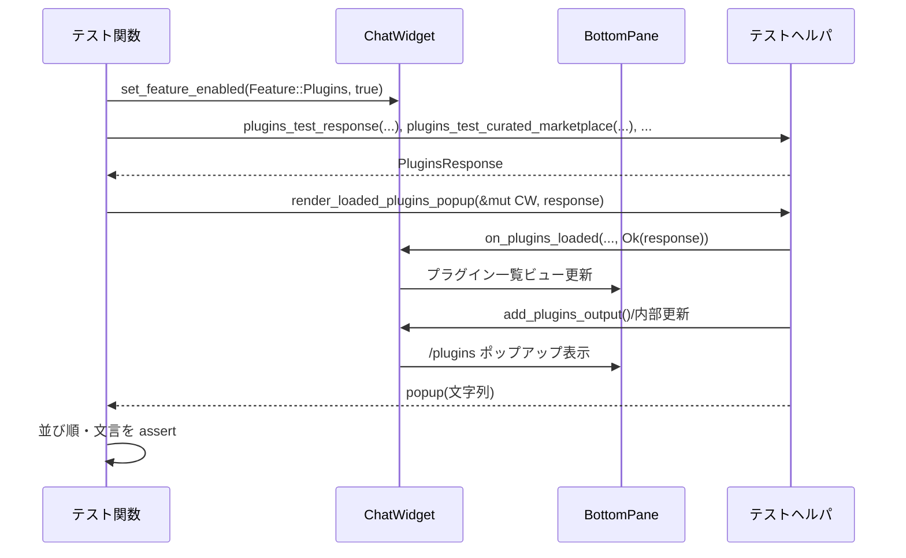
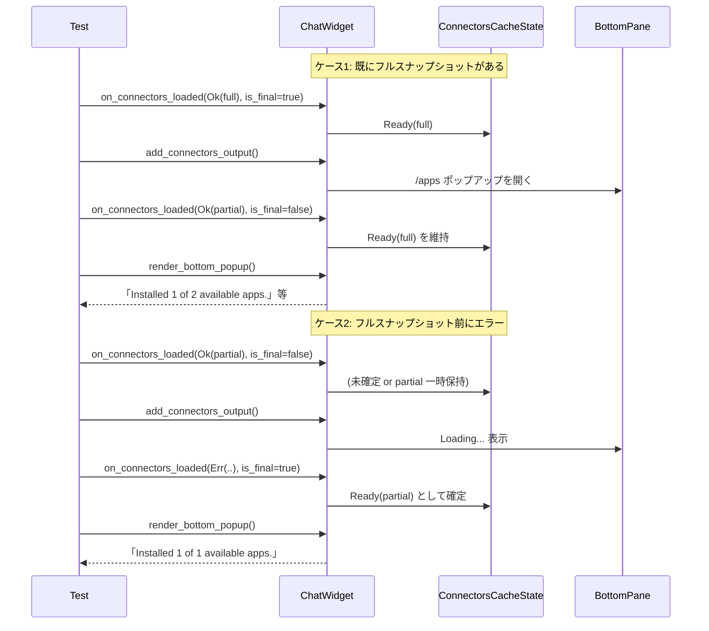

# tui/src/chatwidget/tests/popups_and_settings.rs コード解説

## 0. ざっくり一言

ChatWidget の各種ポップアップと設定まわり（プラグイン、アプリ連携、実験機能、モデル／推論レベル選択、フィードバック、リアルタイム音声など）の UI と状態遷移を、統合テスト形式で検証するモジュールです。

> 行番号について: 元ファイルの行番号情報は提供されていないため、根拠位置は「このファイル全体（`popups_and_settings.rs:L1-1645`）」の範囲として示します。

---

## 1. このモジュールの役割

### 1.1 概要

- このモジュールは **ChatWidget のポップアップ UI と設定状態の契約を固定する** ためのテスト群を提供します。
- UI テキストは `insta` や `assert_chatwidget_snapshot!` による **スナップショットテスト**で検証されます。
- また、アプリ連携（connectors）やプラグインの読み込みロジックについて、**キャッシュ・部分スナップショット・エラー時のフォールバック**などの振る舞いを検証します。

### 1.2 アーキテクチャ内での位置づけ

このテストモジュールは ChatWidget のパブリック API を経由して、下位コンポーネントの挙動を間接的に検証します。コードから読み取れる依存関係を簡略化すると、次のようになります。

```mermaid
graph TD
    subgraph Tests
        T[popups_and_settings.rs の各 #[tokio::test]]
    end

    T --> CW[ChatWidget]
    CW --> BP[BottomPane]
    CW --> CFG[Config / ConfigLayerStack]
    CW --> FEAT[Feature / FEATURES]
    CW --> CONN[ConnectorsCacheState<br/>ConnectorsSnapshot]
    CW --> APPCH[AppEvent TX/RX]
    CW --> OPCH[Op TX/RX]
    CW --> LEG[crate::legacy_core::test_support]

    T --> Helpers[テスト用ヘルパ関数群<br/>make_chatwidget_manual, render_bottom_popup など]
```

> ChatWidget 本体や BottomPane, Connectors 関連型の定義は別ファイルにあり、このチャンクには現れません。

### 1.3 設計上のポイント（テスト観点）

- **スナップショット重視**  
  - UI テキスト全体を `insta::assert_snapshot!` や `assert_chatwidget_snapshot!` で固定し、細かい文言や並び順を含めて回帰を検知します。
- **状態遷移の契約テスト**  
  - プラグインとアプリ連携について、`on_*_loaded` の部分スナップショット (`is_final: bool`) とエラー (`Err(...)`) の組合せに対し、キャッシュ (`ConnectorsCacheState`) とポップアップ表示がどう振る舞うかを詳細に検証しています。
- **設定レイヤーの反映**  
  - `ConfigLayerStack` + Requirements (`ConfigRequirementsToml`) + User config (TOML) の 3 レイヤーから、アプリの `is_enabled` がどのように決まるかをテストしています。
- **イベント駆動 UI**  
  - キーボード入力 (`handle_key_event`) や Slash コマンド (`dispatch_command`) → 内部状態更新 → AppEvent 発火 → UI スナップショット、という流れをテストしています。
- **非同期・チャネル利用**  
  - 各テストは `#[tokio::test] async` で実行され、`unbounded_channel` を通じて `AppEvent` と `Op` の送信を監視します。

---

## 2. 主要な機能一覧（テスト対象の機能）

このモジュールでカバーされている主な機能は次の通りです。

- リアルタイム会話
  - エラー発生時のクローズ処理と履歴へのエラーメッセージ挿入
  - 録音メータ削除時の共有停止パス
- プラグイン (/plugins)
  - ローディング状態の表示
  - キュレーテッド／リポジトリ両方のマーケットプレイス表示
  - インストール済み優先 + 名前順のソート
  - 詳細ポップアップでのインストールアクション・開示文言の表示ルール
  - リフレッシュ時の選択行リセット／インストール数の更新
  - 検索クエリによる行フィルタリング・「no matches」表示と復元
- アプリ連携 (/apps, connectors)
  - 初期読み込み時のローディング状態保持 (`is_final = false`)
  - 部分スナップショット＋エラー時のキャッシュ保持／フォールバック
  - 既存フルスナップショットの保持と部分更新の無視
  - リフレッシュ後も選択アプリを ID ベースで保持
  - `connectors_prefetch_in_flight` と `connectors_force_refetch_pending` フラグの更新規約
  - config / requirements / user override による `is_enabled` の最終決定
  - 手動トグル (`update_connector_enabled`) のリフレッシュ越しの保持
  - インストール済・未インストール・インストール済だが disabled の各状態での説明文
- 実験機能ポップアップ
  - 一覧表示スナップショット
  - トグル変更が Enter で閉じるまで永続化されないこと
  - JS REPL の Node バージョン要件の表示
  - Guardian Approval 機能の名前・説明文の表示
- マルチエージェント有効化プロンプト
  - ポップアップ表示スナップショット
  - 有効化時に `Feature::Collab` を更新し、履歴に通知セルを追加すること
- モデル・パーソナリティ・推論レベル
  - モデル選択ポップアップ
  - パーソナリティ選択ポップアップ
  - モデルピッカーで `show_in_picker = false` なモデルの非表示
  - サーバ過負荷エラー時にモデル切替・ターンコンテキスト上書きを行わないこと
  - 推論レベル選択ポップアップと Extra high 表記
  - 推論オプションが 1 つだけのときに自動適用し、ポップアップをスキップ
  - 推論ポップアップから Esc でモデル選択に戻る挙動
- リアルタイム音声
  - 音声設定ポップアップ（通常幅／狭い幅）
  - マイク・スピーカー選択ポップアップと選択結果の永続化イベント
- フィードバック
  - フィードバックカテゴリ選択ポップアップ（SlashCommand::Feedback）
  - アップロード同意ポップアップと診断情報の要約表示

---

## 3. 公開 API と詳細解説

### 3.1 型一覧（このファイルで「利用」している主な型）

このテストファイル自体には新しい型定義はありませんが、重要な外部型が多数利用されています。

| 名前 | 種別 | 定義場所（推定） | 役割 / 用途 |
|------|------|------------------|-------------|
| `ChatWidget` | 構造体 | crate 内 (`tui/src/chatwidget/...`) | チャット UI 全体の状態とロジック。ポップアップ表示・イベント処理・AppEvent 送信などの中心。 |
| `Feature` | 列挙体 | crate 内 | 機能フラグ（Plugins, Apps, GhostCommit, ShellTool, Collab, JsRepl, GuardianApproval など）を表す。 |
| `RealtimeConversationPhase` | 列挙体 | crate 内 | リアルタイム会話のフェーズ（Active, Stopping 等）。 |
| `RealtimeEvent` | 列挙体 | crate 内 | リアルタイム会話のイベント（Error など）。 |
| `ConnectorsSnapshot` | 構造体 | `codex_chatgpt::connectors` | `AppInfo` の一覧。/apps ポップアップの元データ。 |
| `ConnectorsCacheState` | 列挙体 | crate 内 | コネクタ一覧のキャッシュ状態（Ready など）。 |
| `AppInfo` | 構造体 | `codex_chatgpt::connectors` | 個々のアプリ（Notion, Linear 等）のメタデータ。`is_accessible`, `is_enabled` を含む。 |
| `ConfigBuilder` | 構造体 | crate 内 | テスト用設定オブジェクトを組み立てるビルダ。 |
| `ConfigLayerStack` | 構造体 | crate 内 | requirements と user config をマージする設定レイヤースタック。 |
| `ConfigRequirementsToml` / `AppsRequirementsToml` / `AppRequirementToml` | 構造体 | crate 内 | 要件 (requirements) TOML から読み込まれる構造。アプリごとの必須 enabled フラグ等。 |
| `AppEvent` | 列挙体 | crate 内 | ChatWidget → アプリ側へのイベント（UpdateFeatureFlags, InsertHistoryCell, PersistRealtimeAudioDeviceSelection など）。 |
| `Op` | 列挙体 | crate 内 | ChatWidget → バックエンド（Codex）への操作（OverrideTurnContext など）。 |
| `ModelPreset` / `ReasoningEffortPreset` / `ReasoningEffortConfig` | 構造体/列挙体 | crate 内 | モデル選択・推論レベル選択ポップアップの元データ。 |
| `ExperimentalFeatureItem` / `ExperimentalFeaturesView` | 構造体 | crate 内 | 実験機能ポップアップのビュー・項目データ。 |
| `ThreadId` | 構造体 | crate 内 | チャットスレッドの ID。モデル変更等で使用。 |

> これらの型定義そのものはこのファイルには現れず、挙動はあくまでテストから推測できる範囲に限られます。

---

### 3.2 関数詳細（代表的なテスト 7 件）

> すべて `#[tokio::test] async fn ...() -> ()` で、引数はなく、`assert!` 系マクロの失敗がテスト失敗になります。定義位置は `popups_and_settings.rs:L1-1645` のいずれかです（具体的行はこのチャンクからは特定不可）。

#### `realtime_error_closes_without_followup_closed_info()`

**概要**

- リアルタイム会話中に `RealtimeEvent::Error` が発生した場合、後続の `RealtimeConversationClosedEvent` が履歴に追加の情報を出さないこと（すでにエラーメッセージが表示されていること）を検証します。

**引数**

なし。

**戻り値**

- `()`（テスト。すべてのアサートが通れば成功）。

**内部処理の流れ**

1. `make_chatwidget_manual(None).await` でテスト用 ChatWidget と `AppEvent`/`Op` 受信用チャネルを作成。
2. `chat.realtime_conversation.phase = RealtimeConversationPhase::Active` にセットし、リアルタイム会話をアクティブにする。
3. `chat.on_realtime_conversation_realtime(...)` に `RealtimeEvent::Error("boom")` を渡して、エラー発生を通知。
4. `next_realtime_close_op(&mut op_rx)` で、リアルタイムセッション終了のための Op が送信されたことを確認。
5. `chat.on_realtime_conversation_closed(RealtimeConversationClosedEvent { reason: Some("error") })` を呼び、セッション終了イベントを通知。
6. `drain_insert_history(&mut rx)` で `AppEvent::InsertHistoryCell` をすべて取り出し、表示行を一つの文字列に結合。
7. `insta::assert_snapshot!` で、履歴が `"■ Realtime voice error: boom"` だけになっていることを検証。

**Examples（使用例）**

```rust
#[tokio::test]
async fn realtime_error_test_example() {
    let (mut chat, mut rx, mut op_rx) = make_chatwidget_manual(None).await;
    chat.realtime_conversation.phase = RealtimeConversationPhase::Active;

    // エラーイベントを注入
    chat.on_realtime_conversation_realtime(RealtimeConversationRealtimeEvent {
        payload: RealtimeEvent::Error("boom".to_string()),
    });
    next_realtime_close_op(&mut op_rx);

    // クローズイベントを通知
    chat.on_realtime_conversation_closed(RealtimeConversationClosedEvent {
        reason: Some("error".to_string()),
    });

    // 履歴を検証
    let rendered = drain_insert_history(&mut rx)
        .into_iter()
        .map(|lines| lines_to_single_string(&lines))
        .collect::<Vec<_>>();
    assert_eq!(rendered.join("\n\n"), "■ Realtime voice error: boom");
}
```

**Errors / Panics**

- エラー時の挙動は ChatWidget 内部に委ねられていますが、テストとしては:
  - エラーメッセージが履歴に 1 度だけ挿入されない場合や、余分なメッセージが含まれる場合、`assert_snapshot!` が panic します。

**Edge cases（エッジケース）**

- `RealtimeConversationClosedEvent.reason` があっても、追加のエラー行が増えないことが暗黙の契約になっています。
- `realtime_conversation.phase` を Active にしない場合の挙動はこのテストではカバーされていません。

**使用上の注意点**

- リアルタイムエラー処理を変更する場合は、このテストを更新しない限り、履歴に残すメッセージの内容・数を変えないことが前提になります。

---

#### `plugins_popup_snapshot_shows_all_marketplaces_and_sorts_installed_then_name()`

**概要**

- `/plugins` ポップアップが:
  - キュレーテッド・リポジトリ双方のマーケットプレイスを統合して表示し、
  - **インストール済みプラグインを先頭に、その後を名前順に並べる**
  ことを検証します。

**内部処理の流れ**

1. `make_chatwidget_manual(None)` で ChatWidget を作成し、`Feature::Plugins` を有効化。
2. テスト用のプラグインレスポンス (`plugins_test_response`) を構築:
   - キュレーテッド: Bravo（未インストール）、Alpha（インストール済み）、Starter（InstalledByDefault）など。
   - リポジトリ: Hidden Repo Plugin（非キュレーテッド）。
   - `remote_sync_error = Some("remote sync timed out")` をセット。
3. `render_loaded_plugins_popup(&mut chat, response)` でレスポンスを ChatWidget に適用しつつポップアップ文字列を取得。
4. `assert_chatwidget_snapshot!` で全体スナップショットを検証。
5. `"Hidden Repo Plugin"` が含まれることを `assert!` で確認（非キュレーテッドマーケットプレイスも表示される契約）。
6. `plugins_test_popup_row_position` を用いて、「Alpha Sync < Bravo Search < Hidden Repo Plugin < Starter」の順に行が並んでいることを `assert!` で確認。

**Examples（使用例）**

```rust
let (mut chat, _rx, _op_rx) = make_chatwidget_manual(None).await;
chat.set_feature_enabled(Feature::Plugins, true);

// 疑似マーケットプレイスレスポンス
let response = plugins_test_response(vec![
    plugins_test_curated_marketplace(vec![ /* ...snip... */ ]),
    plugins_test_repo_marketplace(vec![ /* ...snip... */ ]),
]);

let popup = render_loaded_plugins_popup(&mut chat, response);
assert!(popup.contains("Hidden Repo Plugin"));
```

**Errors / Panics**

- 並び順が変わったり、新しいプラグイン種別を追加してアルゴリズムを変えた場合、行位置のアサートで panic します。
- `"Hidden Repo Plugin"` がフィルタされてしまうような仕様変更でもテストが失敗します。

**Edge cases**

- `PluginInstallPolicy::InstalledByDefault` な Starter が最後に来ることが前提になっている可能性があります（テストでは Starter が一番下であることを要求）。
- `remote_sync_error` の内容は UI 上でどう扱われるか、このテスト単体からは分かりません（スナップショットの中身に含まれている可能性があります）。

**使用上の注意点**

- プラグインの並び順ルールを変更する場合は、このテストの `plugins_test_popup_row_position` による比較条件も合わせて更新する必要があります。

---

#### `apps_popup_keeps_existing_full_snapshot_while_partial_refresh_loads()`

**概要**

- `/apps` ポップアップについて、すでにフルスナップショットがキャッシュ済みの状態で部分スナップショット (`is_final = false`) が届いた場合、**キャッシュと表示は古いフルスナップショットのまま** に維持されることを検証します。

**内部処理の流れ**

1. ChatWidget をセットアップし、Apps 機能を有効化 (`Feature::Apps`) し、`bottom_pane.set_connectors_enabled(true)` を呼ぶ。
2. フルスナップショット `full_connectors`（Notion, Linear）を `on_connectors_loaded(Ok(...), is_final = true)` に渡す。
3. `add_connectors_output()` を呼び、/apps ポップアップを開く。
4. その後、部分スナップショット `Ok(ConnectorsSnapshot { connectors: [Notion, Hidden OpenAI] })` を `is_final = false` で渡す。
5. `connectors_cache` が依然として `Ready(full_connectors)` であることを `assert_matches!` で検証。
6. `render_bottom_popup` の結果が `"Installed 1 of 2 available apps."` を含み、`"Hidden OpenAI"` を含まないことをアサート。

**Examples**

```rust
// フルスナップショットをロード
chat.on_connectors_loaded(
    Ok(ConnectorsSnapshot { connectors: full_connectors.clone() }),
    /*is_final*/ true,
);
chat.add_connectors_output();

// 部分スナップショット（Hidden OpenAI 含む）をロード
chat.on_connectors_loaded(
    Ok(ConnectorsSnapshot { connectors: partial_connectors }),
    /*is_final*/ false,
);

// 依然として古いフルスナップショットを使用
let popup = render_bottom_popup(&chat, 80);
assert!(popup.contains("Installed 1 of 2 available apps."));
assert!(!popup.contains("Hidden OpenAI"));
```

**Errors / Panics**

- `ConnectorsCacheState` の実装を変更して、部分スナップショットでキャッシュを即座に上書きした場合、`assert_matches!` とポップアップの内容検証が失敗します。

**Edge cases**

- `is_final = false` のスナップショットにのみ存在するアプリ（例: Hidden OpenAI）は **ポップアップにもキャッシュにも現れない** 前提です。
- `is_final = false` のスナップショットが複数連続で到着するケースはこのテストでは扱っていません。

**使用上の注意点**

- `/apps` の UX として、「完全な一覧が揃うまで画面を変えない」契約がここで固定されています。ストリーミング的に行を追加したい場合はテストおよび仕様の見直しが必要です。

---

#### `apps_refresh_failure_without_full_snapshot_falls_back_to_installed_apps()`

**概要**

- フルスナップショットをまだ取得していない状態（`is_final=false` のみ）でリフレッシュが失敗した場合、**部分スナップショット（おそらく「インストール済みだけ」）を最終状態として採用**し、/apps ポップアップをそれに基づいて表示することを検証します。

**内部処理の流れ**

1. Apps 機能を有効化し、`set_connectors_enabled(true)`。
2. `on_connectors_loaded(Ok(snapshot_one_connector), is_final = false)` を呼ぶ。
3. `add_connectors_output()` と `render_bottom_popup` で、「Loading installed and available apps...」と表示されていることを確認。
4. `on_connectors_loaded(Err("failed to load apps"), is_final = true)` を呼ぶ。
5. `connectors_cache` が `Ready(snapshot)` で、`connectors.len() == 1` になっていることを `assert_matches!` で検証。
6. 再度 `render_bottom_popup` を呼び、「Installed 1 of 1 available apps.」と、「Installed. Press Enter to open the app page」が表示されることを確認。

**Examples**

```rust
// 部分スナップショットのみ受信
chat.on_connectors_loaded(Ok(ConnectorsSnapshot { connectors: vec![one_app] }), false);
chat.add_connectors_output();
assert!(render_bottom_popup(&chat, 80).contains("Loading installed and available apps..."));

// 最終的にエラー
chat.on_connectors_loaded(Err("failed to load apps".to_string()), true);

// 部分スナップショットを最終状態として採用
let popup = render_bottom_popup(&chat, 80);
assert!(popup.contains("Installed 1 of 1 available apps."));
```

**Errors / Panics**

- 最終エラーで `connectors_cache` を空にしたり、エラー状態にした場合、このテストが失敗します。

**Edge cases**

- `connectors` が 0 件の部分スナップショットのときの挙動はこのテストでは扱っていません。
- エラーメッセージ自体（"failed to load apps"）の UI 表示有無はスナップショットに含まれるかもしれませんが、このテストでは文字列検証していません。

**使用上の注意点**

- ネットワーク障害などでフルリストが取得できない場合にも、ユーザーには「インストール済みアプリだけは一覧できる」という UX 契約を示すテストになっています。

---

#### `apps_initial_load_applies_enabled_state_from_requirements_with_user_override()`

**概要**

- 要件設定ファイル (`ConfigRequirementsToml`) によって「アプリを無効化すべき」という指定がある場合、**ユーザー設定（user config）で `enabled = true` と上書きしても、最終的には無効のまま**になることを検証します。

**内部処理の流れ**

1. Apps 機能を有効化し、connectors を有効にする。
2. `ConfigRequirementsToml` を構築:
   - `apps.apps["connector_1"].enabled = Some(false)` を指定。
3. `ConfigLayerStack::new(..., requirements)` で requirements を含むスタックを生成。
4. さらに `.with_user_config(&config_toml_path, toml_value)` を呼び、ユーザー設定 `[apps.connector_1]\nenabled = true\ndisabled_reason = "user"\n` を追加。
5. `on_connectors_loaded(Ok(ConnectorsSnapshot { connectors: [AppInfo { id: "connector_1", is_enabled: true, ... }] }), is_final = true)` を呼ぶ。
6. `connectors_cache` が `Ready(snapshot)` であり、`connector_1.is_enabled == false` になっていることを `assert_matches!` で確認。
7. `/apps` ポップアップを表示し、「Installed · Disabled. ...」という説明が含まれることを別テストで確認。

**Examples**

```rust
let requirements = ConfigRequirementsToml {
    apps: Some(AppsRequirementsToml {
        apps: BTreeMap::from([(
            "connector_1".to_string(),
            AppRequirementToml { enabled: Some(false) },
        )]),
    }),
    ..Default::default()
};
chat.config.config_layer_stack =
    ConfigLayerStack::new(Vec::new(), ConfigRequirements::default(), requirements)?
        .with_user_config(&config_path, user_toml);

// サーバ側では enabled=true だが…
chat.on_connectors_loaded(
    Ok(ConnectorsSnapshot { connectors: vec![server_connector] }),
    true,
);

// …結果は is_enabled=false になる
assert_matches!(
    &chat.connectors_cache,
    ConnectorsCacheState::Ready(snapshot)
        if snapshot.connectors.iter()
            .find(|c| c.id == "connector_1")
            .is_some_and(|c| !c.is_enabled)
);
```

**Errors / Panics**

- requirements の適用順序を変えて user config を優先するように実装変更した場合、このテストが失敗します。

**Edge cases**

- `enabled` が `None` のときの優先順位や、複数レイヤーが重なった場合の詳細なマージロジックは、このテストだけでは分かりません。

**使用上の注意点**

- 「要件 (requirements) はユーザー設定より強い」という契約がここで固定されているため、運用上もその前提で設定が書かれている可能性があります。

---

#### `experimental_features_toggle_saves_on_exit()`

**概要**

- 実験機能ポップアップにおいて、**スペースキーでトグルを切り替えても、Enter でポップアップを確定・閉じるまで `AppEvent::UpdateFeatureFlags` が送信されない**ことを検証します。

**内部処理の流れ**

1. ChatWidget と `AppEvent` 受信用 `rx` を作成。
2. `ExperimentalFeatureItem` を 1 件（`Feature::GhostCommit`, enabled=false）含む `ExperimentalFeaturesView` を作成し、`bottom_pane.show_view(Box::new(view))` で表示。
3. `chat.handle_key_event(KeyEvent::new(KeyCode::Char(' '), KeyModifiers::NONE))` でトグルを切り替える。
4. 直後に `rx.try_recv()` を試し、イベントが一切流れていないことを `assert!(is_err())` で確認。
5. `chat.handle_key_event(KeyEvent::new(KeyCode::Enter, KeyModifiers::NONE))` でポップアップを確定。
6. `rx` をループで読み出し、`AppEvent::UpdateFeatureFlags { updates }` が送信されており `updates == vec![(Feature::GhostCommit, true)]` であることを検証。

**Examples**

```rust
let (mut chat, mut rx, _op_rx) = make_chatwidget_manual(None).await;

// 実験機能ビューを表示
let view = ExperimentalFeaturesView::new(
    vec![ExperimentalFeatureItem {
        feature: Feature::GhostCommit,
        name: "Ghost snapshots".to_string(),
        description: "...".to_string(),
        enabled: false,
    }],
    chat.app_event_tx.clone(),
);
chat.bottom_pane.show_view(Box::new(view));

// スペースで一旦トグル
chat.handle_key_event(KeyEvent::new(KeyCode::Char(' '), KeyModifiers::NONE));
assert!(rx.try_recv().is_err()); // まだイベントは出ない

// Enter で保存確定
chat.handle_key_event(KeyEvent::new(KeyCode::Enter, KeyModifiers::NONE));
let updates = collect_update_feature_flags(&mut rx);
assert_eq!(updates, vec![(Feature::GhostCommit, true)]);
```

**Errors / Panics**

- トグル時に即座に `UpdateFeatureFlags` を送る実装に変更すると、`rx.try_recv().is_err()` が失敗します。

**Edge cases**

- 複数の実験機能を同時に変更した場合に `updates` がどのようにまとめられるかは、このテストからは分かりません（1 件だけのケース）。

**使用上の注意点**

- UI 上で「キャンセル」したときに副作用が残らないことを保証するためのテストになっています。保存トリガーのキー（ここでは Enter）を変える場合は、テストも連動して変更する必要があります。

---

#### `single_reasoning_option_skips_selection()`

**概要**

- あるモデルに対してサポートされる推論レベルが 1 つだけのとき、**推論レベル選択ポップアップを表示せずに自動的にそのレベルを適用し、`AppEvent::UpdateReasoningEffort` を送信する**ことを検証します。

**内部処理の流れ**

1. ChatWidget と `AppEvent` 受信用 `rx` を作成。
2. `ReasoningEffortPreset` を 1 件だけ（`High`）含む `single_effort` を作成。
3. `ModelPreset` を構築し、`supported_reasoning_efforts = single_effort` に設定。
4. `chat.open_reasoning_popup(preset)` を呼ぶ。
5. `render_bottom_popup(&chat, 80)` を呼び、ポップアップ文字列に `"Select Reasoning Level"` が含まれないことを確認（→ポップアップがスキップされている）。
6. `rx` からすべてのイベントを収集し、`AppEvent::UpdateReasoningEffort(Some(ReasoningEffortConfig::High))` が含まれていることを `assert!` で確認。

**Examples**

```rust
let (mut chat, mut rx, _op_rx) = make_chatwidget_manual(None).await;

let single_effort = vec![ReasoningEffortPreset {
    effort: ReasoningEffortConfig::High,
    description: "Greater reasoning depth...".to_string(),
}];

let preset = ModelPreset {
    id: "model-with-single-reasoning".into(),
    model: "model-with-single-reasoning".into(),
    display_name: "model-with-single-reasoning".into(),
    description: "".into(),
    default_reasoning_effort: ReasoningEffortConfig::High,
    supported_reasoning_efforts: single_effort,
    supports_personality: false,
    additional_speed_tiers: Vec::new(),
    is_default: false,
    upgrade: None,
    show_in_picker: true,
    availability_nux: None,
    supported_in_api: true,
    input_modalities: default_input_modalities(),
};

// ポップアップを開こうとすると、自動適用される
chat.open_reasoning_popup(preset);
let popup = render_bottom_popup(&chat, 80);
assert!(!popup.contains("Select Reasoning Level"));

let events: Vec<_> = std::iter::from_fn(|| rx.try_recv().ok()).collect();
assert!(events.iter().any(|ev| matches!(
    ev,
    AppEvent::UpdateReasoningEffort(Some(ReasoningEffortConfig::High))
)));
```

**Errors / Panics**

- 推論オプションが 1 つでも、常に選択ポップアップを表示するように変更すると、このテストが失敗します。

**Edge cases**

- 推論オプションが 0 件のときの挙動はこのテストでは対象外です。
- デフォルト値 (`default_reasoning_effort`) と唯一のオプションが異なるケースは試していません。

**使用上の注意点**

- 「1 オプション → 自動適用」という UX はここで固定されています。将来、すべての推論変更をユーザー確認にしたい場合、テストも反映が必要です。

---

### 3.3 その他の関数（テスト）一覧

> いずれも `#[tokio::test] async fn ...()`。定義位置は `popups_and_settings.rs:L1-1645` 内にあります。

| 関数名 | 役割（1 行） |
|--------|--------------|
| `deleted_realtime_meter_uses_shared_stop_path` | 削除されたリアルタイム録音メータを見つけたときに、共通の停止パスを通ることを検証（Linux 以外）。 |
| `experimental_mode_plan_is_ignored_on_startup` | Config の `tui.experimental_mode = "plan"` が初回起動時には無視され、デフォルトモードとモデルが選択されることを検証。 |
| `plugins_popup_loading_state_snapshot` | `/plugins` を開いた直後は「Loading available plugins...」と表示されることをスナップショットで検証。 |
| `plugin_detail_popup_snapshot_shows_install_actions_and_capability_summaries` | プラグイン詳細ポップアップにインストールアクションや能力サマリが表示されることをスナップショットで確認。 |
| `plugin_detail_popup_hides_disclosure_for_installed_plugins` | すでにインストール済みのプラグイン詳細では開示文言（データ共有の注意）が非表示であることを確認。 |
| `plugins_popup_refresh_replaces_selection_with_first_row` | プラグイン一覧リフレッシュ時に、選択行が新しい一覧の先頭にリセットされることを検証。 |
| `plugins_popup_refreshes_installed_counts_after_install` | インストール状態が変わったあとのリフレッシュで、「Installed X of Y available plugins.」のカウントと選択行説明が更新されることを確認。 |
| `plugins_popup_search_filters_visible_rows_snapshot` | `/plugins` の検索クエリでマッチする行だけが表示されることをスナップショットと文字列検証で確認。 |
| `plugins_popup_search_no_matches_and_backspace_restores_results` | 検索でヒット 0 件時には「no matches」表示、Backspace で検索を消すと結果が復元されることを検証。 |
| `apps_popup_stays_loading_until_final_snapshot_updates` | `/apps` が `is_final=false` の間はローディング表示を維持し、`is_final=true` でインストール割合などが表示されることを確認。 |
| `apps_refresh_failure_keeps_existing_full_snapshot` | 既にフルスナップショットがある状態でリフレッシュ最終結果がエラーになっても、キャッシュとポップアップが前回のフルスナップショットを保持することを検証。 |
| `apps_popup_preserves_selected_app_across_refresh` | `/apps` の選択アプリがリフレッシュ後も ID ベースで保持されること（インデックスリセットされないこと）を検証。 |
| `apps_refresh_failure_with_cached_snapshot_triggers_pending_force_refetch` | キャッシュ済みかつ `connectors_force_refetch_pending = true` でエラーが返った場合、`connectors_prefetch_in_flight` が true のまま・pending が消えることを検証。 |
| `apps_popup_shows_disabled_status_for_installed_but_disabled_apps` | インストール済だが `is_enabled=false` のアプリについて、選択行説明に Disabled 状態と enable/disable の案内が含まれることを確認。 |
| `apps_initial_load_applies_enabled_state_from_config` | user config の `[apps.connector_1].enabled = false` が最初のスナップショットに反映されることを検証。 |
| `apps_initial_load_applies_enabled_state_from_requirements_without_user_entry` | requirements だけで connector を disabled にした場合も、その状態がキャッシュとポップアップに反映されることを検証。 |
| `apps_refresh_preserves_toggled_enabled_state` | `update_connector_enabled` による手動 disabled 状態が、サーバからの新スナップショットで上書きされず保持されることを検証。 |
| `apps_popup_for_not_installed_app_uses_install_only_selected_description` | 未インストール（`is_accessible=false`）のアプリでは、選択行説明が「インストールのみ」を案内し、enable/disable に触れないことを確認。 |
| `experimental_features_popup_snapshot` | 実験機能ポップアップ全体の UI スナップショットを検証。 |
| `experimental_popup_shows_js_repl_node_requirement` | JS REPL 実験機能の説明に Node バージョン要件が含まれることを検証。 |
| `experimental_popup_includes_guardian_approval` | Guardian Approval 機能の名前と説明文が実験機能ポップアップに含まれることを検証。 |
| `multi_agent_enable_prompt_snapshot` | マルチエージェント有効化プロンプトの UI スナップショットを検証。 |
| `multi_agent_enable_prompt_updates_feature_and_emits_notice` | マルチエージェントを有効化した際、`Feature::Collab` 更新と履歴への通知セル挿入が行われることを検証。 |
| `model_selection_popup_snapshot` | モデル選択ポップアップの UI スナップショット。 |
| `personality_selection_popup_snapshot` | パーソナリティ選択ポップアップの UI スナップショット。 |
| `realtime_audio_selection_popup_snapshot` | リアルタイム音声設定ポップアップの通常幅スナップショット（Linux 以外）。 |
| `realtime_audio_selection_popup_narrow_snapshot` | リアルタイム音声設定ポップアップの狭幅スナップショット（Linux 以外）。 |
| `realtime_microphone_picker_popup_snapshot` | マイク選択ポップアップの UI スナップショット（Linux 以外）。 |
| `realtime_audio_picker_emits_persist_event` | スピーカー選択ポップアップで Enter 決定時に `PersistRealtimeAudioDeviceSelection` イベントが送信されることを検証（Linux 以外）。 |
| `model_picker_hides_show_in_picker_false_models_from_cache` | `show_in_picker=false` な ModelPreset がモデルピッカーから非表示になることを検証。 |
| `server_overloaded_error_does_not_switch_models` | Codex の `ServerOverloaded` エラー時にモデル切替や `OverrideTurnContext.model` の更新を行わないことを検証。 |
| `model_reasoning_selection_popup_snapshot` | 推論レベル選択ポップアップの通常スナップショット（High 選択時）。 |
| `model_reasoning_selection_popup_extra_high_warning_snapshot` | 推論レベル Extra high 選択時の警告表示スナップショット。 |
| `reasoning_popup_shows_extra_high_with_space` | 推論レベル名が「Extrahigh」ではなく「Extra high」とスペース入りで表示されることを検証。 |
| `feedback_selection_popup_snapshot` | SlashCommand::Feedback によるフィードバックカテゴリ選択ポップアップのスナップショット。 |
| `feedback_upload_consent_popup_snapshot` | バグ報告用のアップロード同意ポップアップスナップショット。 |
| `feedback_good_result_consent_popup_includes_connectivity_diagnostics_filename` | GoodResult 用同意ポップアップに接続診断関連のファイル名等が含まれることをスナップショットで検証。 |
| `reasoning_popup_escape_returns_to_model_popup` | 推論ポップアップから Esc を押すとモデル選択ポップアップに戻ることを検証。 |

---

## 4. データフロー

### 4.1 プラグインポップアップのロードフロー

`plugins_popup_snapshot_shows_all_marketplaces_and_sorts_installed_then_name` 等から読み取れる、/plugins ポップアップのデータ流れです。



要点:

- データ（マーケットプレイス種別・インストール状態など）はテスト側で構築した `PluginsResponse` を通じて ChatWidget に注入されます。
- 表示は `BottomPane` 内のビューに集約され、`render_bottom_popup` ヘルパで文字列化されています。

### 4.2 /apps ポップアップの部分スナップショットとエラー処理

`apps_popup_keeps_existing_full_snapshot_while_partial_refresh_loads` と  
`apps_refresh_failure_without_full_snapshot_falls_back_to_installed_apps` から読み取れるフローです。



要点:

- `is_final` フラグを基に、キャッシュと表示の扱いが変わります。
- 既に成功しているフルスナップショットがある場合は、それが優先され、部分スナップショットとエラーは UI には反映されません。
- まだフルスナップショットがない場合は、部分スナップショット + エラー時に部分結果を最終状態として採用します。

---

## 5. 使い方（How to Use）

このファイルはテストですが、ChatWidget とその周辺 API の実用的な利用パターンを示しています。

### 5.1 基本的な使用方法の典型フロー

以下は「ある機能のポップアップを開き、キーボード操作をシミュレートし、イベントを検証する」流れのサンプルです。

```rust
#[tokio::test]
async fn example_use_chatwidget_popup() {
    // 1. ChatWidget とイベントチャネルを取得
    let (mut chat, mut app_rx, _op_rx) = make_chatwidget_manual(None).await;

    // 2. 必要な機能を有効化（例: Apps）
    set_chatgpt_auth(&mut chat); // 認証状態をテスト用にセット
    chat.config.features.enable(Feature::Apps).unwrap();
    chat.bottom_pane.set_connectors_enabled(true);

    // 3. 初期スナップショットを注入
    chat.on_connectors_loaded(
        Ok(ConnectorsSnapshot {
            connectors: vec![/* AppInfo ... */],
        }),
        /*is_final*/ true,
    );

    // 4. ポップアップを開く
    chat.add_connectors_output();

    // 5. キー入力をシミュレート（Down/Enter など）
    chat.handle_key_event(KeyEvent::from(KeyCode::Down));
    chat.handle_key_event(KeyEvent::from(KeyCode::Enter));

    // 6. AppEvent を検証
    while let Ok(event) = app_rx.try_recv() {
        match event {
            AppEvent::PersistRealtimeAudioDeviceSelection { .. } => { /* ... */ }
            AppEvent::UpdateFeatureFlags { updates } => { /* ... */ }
            _ => {}
        }
    }

    // 7. UI スナップショットを検証
    let popup = render_bottom_popup(&chat, 80);
    insta::assert_snapshot!("example_popup", popup);
}
```

### 5.2 よくある使用パターン

- **ポップアップのオープン手段**
  - モデル関連: `open_model_popup()`, `open_personality_popup()`, `open_reasoning_popup(preset)`
  - プラグイン: `set_feature_enabled(Feature::Plugins, true)` → `add_plugins_output()`
  - アプリ: Apps 機能を有効にして `add_connectors_output()`
  - 実験機能: `open_experimental_popup()`
  - マルチエージェント: `open_multi_agent_enable_prompt()`
  - フィードバック: `dispatch_command(SlashCommand::Feedback)`
- **イベント注入**
  - サーバ側からのレスポンスを模した API:
    - `on_plugins_loaded(cwd, Result<...>)`
    - `on_plugin_detail_loaded(cwd, Result<PluginReadResponse>)`
    - `on_connectors_loaded(Result<ConnectorsSnapshot>, is_final)`
    - `handle_codex_event(Event { msg: EventMsg::Error(...) })`
- **キー入力のシミュレーション**
  - ナビゲーション: `KeyCode::Up`, `KeyCode::Down`
  - 決定: `KeyCode::Enter`
  - キャンセル: `KeyCode::Esc`
  - トグル: `KeyCode::Char(' ')`
  - 文字入力: `KeyCode::Char('z')` など（検索欄入力に利用）

### 5.3 よくある間違い（テストを書くときの注意）

```rust
// 誤り例: 機能を有効化せずにポップアップを開こうとする
// chat.add_connectors_output(); // Apps 機能が disabled のままかもしれない

// 正しい例: まず機能を有効化し、必要なデータを読み込んでから開く
set_chatgpt_auth(&mut chat);
chat.config.features.enable(Feature::Apps).unwrap();
chat.bottom_pane.set_connectors_enabled(true);
chat.on_connectors_loaded(Ok(snapshot), true);
chat.add_connectors_output();
```

- Apps/Plugins など **機能フラグを有効化せずに** ポップアップ API を使うと、内部状態が想定通りにならない可能性があります（テストでは事前に必ず enable しています）。
- `on_connectors_loaded` などの API は `is_final` の値に応じて挙動が変わるため、**本番コードと同じ順序・フラグで呼ぶ**ことが重要です。

### 5.4 使用上の注意点（まとめ）

- **非同期環境**  
  - すべてのテストは `#[tokio::test]` 上で動いており、ChatWidget も非同期前提の設計になっています。実コードでも tokio ランタイム上で呼び出す必要があります。
- **イベントチャネルのドレイン**  
  - 特定のイベントが発火しないことを検証する場合、テスト内で `while rx.try_recv().is_ok() {}` のようにチャネルを一度空にしてから新しい操作を行っています。
- **スナップショットの安定性**  
  - UI テキスト（文言・句読点・改行）が変更されると `insta` スナップショットがすべて失敗します。文言変更は意図的かどうかを確認した上でスナップショット更新が必要です。

---

## 6. 変更の仕方（How to Modify）

### 6.1 新しい機能／ポップアップを追加する場合

1. **ChatWidget 側の API を確認**
   - 新しいポップアップ用のメソッド（例: `open_xyz_popup`）やイベントハンドラ（`on_xyz_loaded`）がどこに追加されているかを確認します。
2. **テスト用ヘルパが既にあるか確認**
   - `make_chatwidget_manual`, `render_bottom_popup`, `assert_chatwidget_snapshot!` など既存ヘルパを再利用できるかを確認します。
3. **このファイルに新しい `#[tokio::test]` を追加**
   - 他のテストを参考にして、セットアップ → イベント注入 → キー操作 → AppEvent 検証 → スナップショット、の流れを組み立てます。
4. **スナップショット名の一意性**
   - `assert_chatwidget_snapshot!("新しいスナップショット名", popup);` のように一意な名前をつけます（`insta` のスナップショットファイルと対応）。
5. **契約（Contract）を明文化**
   - 名前やアサートメッセージに「何を保証したいか」（例: `popup_shows_disabled_state_for_...`）を含めると、仕様として読みやすくなります。

### 6.2 既存の機能を変更する場合

- 影響範囲の確認:
  - プラグイン／アプリ関連の変更 → `apps_*/plugins_*` テスト群を検索。
  - 推論／モデル関連の変更 → `model_*`, `reasoning_*` テスト群。
  - 実験機能 → `experimental_*` テスト群。
- 契約の把握:
  - テスト名・メッセージ・アサート内容から「どの挙動が前提条件か」を読み取り、その挙動を変える場合はテストの期待値も一緒に更新します。
- エラー・部分結果の扱い:
  - 特に `/apps` の `is_final` 付き `on_connectors_loaded` は、多数のテストで微妙な条件分岐をチェックしているため、ロジック変更時にはすべての apps_* テストが通るかを確認する必要があります。

---

## 7. 関連ファイル

このテストモジュールから参照されている主な外部モジュール・ファイルは次の通りです（正確なパスはコードから読み取れる範囲で記載します）。

| パス / モジュール | 役割 / 関係 |
|-------------------|------------|
| `use super::*` | ChatWidget 本体、テストヘルパ (`make_chatwidget_manual`, `render_bottom_popup`, `render_loaded_plugins_popup`, `type_plugins_search_query` 等) を再輸入している上位モジュール。 |
| `crate::legacy_core::test_support::get_model_offline` | モデル名（例: `"gpt-5-codex"`）をテスト用に解決するヘルパ。`experimental_mode_plan_is_ignored_on_startup` で利用。 |
| `codex_chatgpt::connectors` | `/apps` 関連の `AppInfo`, `ConnectorsSnapshot` 型を定義するクレート。複数の apps_* テストで使用。 |
| `crate::config` 周辺 (`ConfigBuilder`, `ConfigLayerStack`, `ConfigRequirementsToml` など) | 設定値と requirements / user config のレイヤリングを提供し、Apps 初期状態の決定に影響。 |
| `crate::bottom_pane` | `BottomPane`, `feedback_upload_consent_params`, `show_view` など、ポップアップビューの構築に関わるモジュール。 |
| `crate::app_event` | `AppEvent`, `FeedbackCategory` など、ChatWidget からアプリへのイベントを定義するモジュール。 |
| `insta` / `assert_chatwidget_snapshot!` | UI スナップショットテストのためのライブラリとラッパマクロ。 |
| `tokio` | `#[tokio::test]` により非同期テストランタイムを提供。 |

> 具体的なファイル名（例: `tui/src/chatwidget/mod.rs` 等）はこのチャンクには明示されていないため、ここではモジュールパスレベルで紹介しています。

---

### Bugs / Security / Contracts についての補足

- **Bugs（潜在的なバグ）**  
  - このファイルはテストコードのみであり、直接的なバグというよりも「仕様がどこまでカバーされているか」を示しています。  
  - 特に `/apps` の `is_final` × エラー × キャッシュ状態の組合せが多数カバーされているため、この部分のリグレッション検知能力は高いと言えます。
- **Security**  
  - セキュリティ関連の明示的なテストは含まれていません。プラグイン／アプリの説明文や URL はテスト用のダミー値です。
- **Contracts / Edge Cases**  
  - モデル切替しないサーバ過負荷エラー (`server_overloaded_error_does_not_switch_models`) など、ユーザー体験・誤挙動防止の契約がテストとして明文化されています。
  - Apps の enabled 状態は「requirements > user config > サーバスナップショット」の優先順位がテストから読み取れます。

このファイル全体は、ChatWidget の UI 振る舞いと設定適用ロジックの「仕様書兼テスト」として読むことができます。
