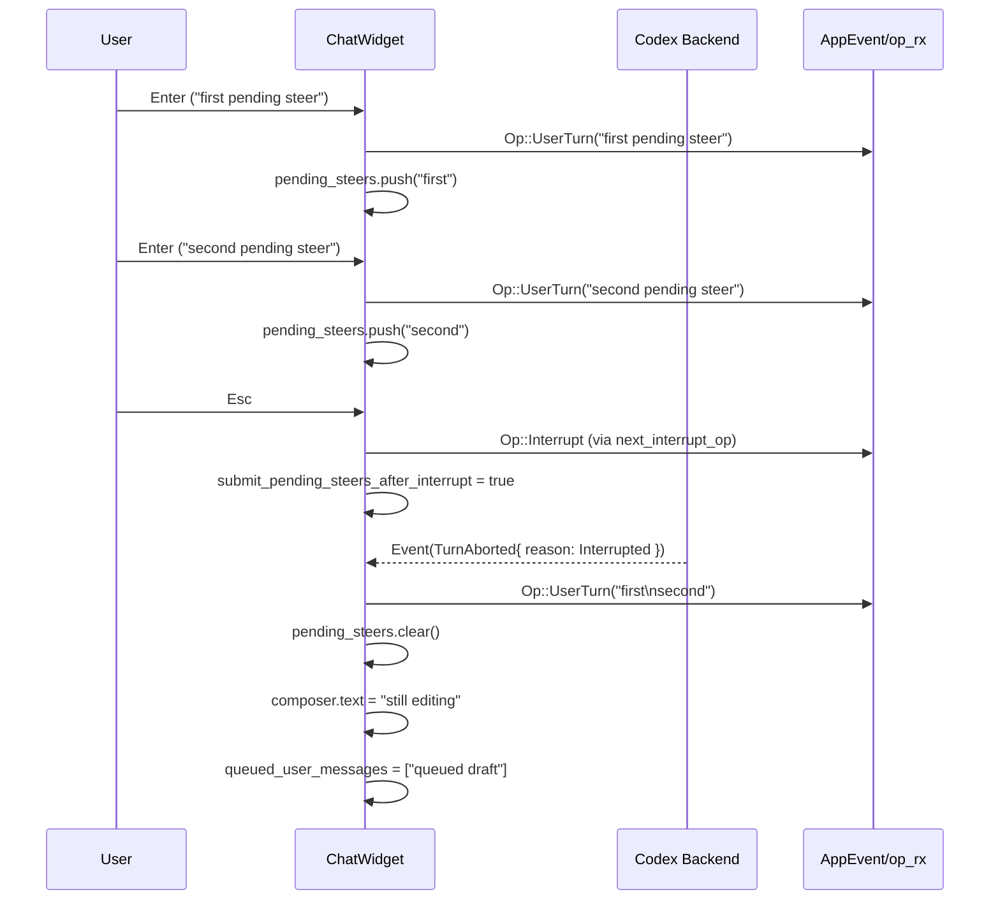

# tui/src/chatwidget/tests/review_mode.rs

## 0. ざっくり一言

ChatWidget の **レビューモード／ステア入力／割り込み操作** 周りの挙動を、Codex イベント・キーボード入力・UI ポップアップを通して総合的に検証する統合テスト群です。

> 行番号はこのチャンクでは提供されていないため、`review_mode.rs:L開始-終了` 形式での厳密な指定はできません。以下では「テスト関数名＋周辺コード」を根拠として参照します。

---

## 1. このモジュールの役割

### 1.1 概要

このテストモジュールは、ChatWidget が以下のような状況で **内部状態と UI を一貫して更新できるか** を検証します。

- `/review` の開始・終了に伴うバナーやレビュー対象表示
- レビュー中に送ったステア入力が拒否された場合の **pending_steers / queued_user_messages** の扱い
- 実行中ターンの **割り込み（interrupt）** と、ペンディングステア・キュー済みドラフト・コンポーザ内容の統合／復元
- `Enter` / `Esc` / `Ctrl-C` / 矢印キーなどに応じたキーイベント処理
- レビュー用ポップアップ（プリセット、カスタムプロンプト、コミット picker、ブランチ picker）の UI イベント
- unified exec プロセス一覧 (`/ps`) や割り込み時のスナップショットメッセージ

### 1.2 アーキテクチャ内での位置づけ

このテストは ChatWidget を「ブラックボックス」として扱い、次のコンポーネント間のやり取りを確認します。

- ChatWidget 本体（`chat`）
- 送信専用 Codex 操作チャネル（`op_rx` 側で受信）
- アプリ側イベントチャネル（`rx`）
- キーボード入力（`KeyEvent`）
- Codex からのイベント（`Event`, `EventMsg`）

依存関係イメージです。

```mermaid
flowchart LR
    subgraph App側
        UI["ChatWidget (chat)"]
        Bottom["BottomPane (composer, preview)"]
        Hist["HistoryView"]
    end

    subgraph Backend側
        Codex["Codex / Model backend"]
    end

    subgraph Tests
        T["このテストモジュール"]
        OpRx["op_rx (送信用チャネル受信側)"]
        Rx["rx (AppEvent 受信側)"]
    end

    T --> UI
    UI --> Bottom
    UI --> Hist

    UI -->|AppEvent::CodexOp(..)| Codex
    Codex -->|Event{ msg: EventMsg::... }| UI

    UI -->|AppEvent::*| Rx
    UI -->|Op::*| OpRx
```

> 上図の関係は、各テストで `make_chatwidget_manual` から得られる `(chat, rx, op_rx)` と `handle_codex_event`, `handle_key_event` などの呼び出しから読み取れます。

### 1.3 設計上のポイント（テストから読み取れる契約）

テストコードから見える ChatWidget の設計上の特徴は次の通りです。

- **入力キューの二層構造**
  - `pending_steers`: 「実行中ターンに対するステア（追い指示）」キュー
  - `queued_user_messages`: 「新しいユーザーターン用ドラフト」キュー  
    → レビュー中に失敗したステアは `queued_user_messages` 側に落とし込む、などのルールがある。

- **割り込み理由ごとのハンドリング**
  - `TurnAbortReason::Interrupted`（通常の割り込み）  
    → pending_steers や queued_user_messages を composer にマージする（`manual_interrupt_restores_*` 系テスト）。
  - `TurnAbortReason::Replaced`  
    → pending_steers は捨てるが、キュー済みドラフトはその後の新ターンとして送信する（`replaced_turn_clears_pending_steers_but_keeps_queued_drafts`）。
  - `TurnAbortReason::ReviewEnded`  
    → unified exec プロセスや `/ps` 出力は維持する（`review_ended_keeps_unified_exec_processes`）。

- **レビューターンの特例**
  - レビュー用ターンは `NonSteerableTurnKind::Review` としてステア不可。  
    ステアを送ろうとするとエラーイベントが来て、follow-up が `queued_user_messages` に積み直される（`steer_rejection_queues_review_follow_up_before_existing_queued_messages`, `review_queues_user_messages_snapshot`）。

- **キーイベントによるモード切り替え**
  - `Enter`: ステアまたはドラフト送信／キュー（状況により `pending_steers` or `queued_user_messages`）。
  - `Esc`:  
    - pending_steers がある場合は「ステア送信のための割り込み」を優先（`esc_interrupt_sends_all_pending_steers_immediately_and_keeps_existing_draft`、`esc_with_pending_steers_overrides_agent_command_interrupt_behavior`）。
    - レビュー用ポップアップでは「子ビュー → 親ビュー → 通常モード」の順に閉じる（`review_custom_prompt_escape_navigates_back_then_dismisses`, `review_branch_picker_escape_navigates_back_then_dismisses`）。
  - `Ctrl-C`:  
    - 起動中の realtime conversation があればまずそれを閉じる（`ctrl_c_closes_realtime_conversation_before_interrupt_or_quit`）。
    - それ以外の場合は shutdown 用 `AppEvent::Exit` を送る、もしくは composer をクリアし、履歴（↑キー）から復元可能にする（`ctrl_c_shutdown_works_with_caps_lock`, `ctrl_c_cleared_prompt_is_recoverable_via_history`）。

- **UI 一貫性**
  - composer のテキスト／テキスト要素／ローカル画像パス／mention_bindings が、割り込みや復元後も整合するようにテストされています（画像の placeholder 番号の振り直し、mention の復元など）。

---

## 2. 主要な機能・シナリオ一覧（コンポーネントインベントリー込み）

このファイル自体はテスト専用で公開関数はありませんが、テストがカバーしている **ChatWidget の機能コンポーネント** を一覧化します。

### 2.1 コンポーネント一覧

| コンポーネント | 役割（テストから読み取れるもの） |
|----------------|----------------------------------|
| `ChatWidget` (`chat`) | チャット UI の本体。Codex イベントとキー入力を受け取り、composer / history / review ポップアップなどを管理。 |
| `BottomPane` (`chat.bottom_pane`) | 入力欄（composer）、コンテキストウィンドウインジケータ、quit ショートカットヒントなどの表示と状態管理。 |
| `queued_user_messages: VecDeque<UserMessage>` | 「まだ送られていないユーザードラフト」のキュー。レビュー中に拒否された follow-up や、Plan モード中の Enter などで使用。 |
| `pending_steers: VecDeque<PendingSteer>` | 実行中ターンに対するステア（追い指示）のキュー。送信に成功したものは `complete_user_message` 系イベントで履歴に反映される。 |
| `ThreadInputState` | スレッドの入力状態スナップショット。pending_steers, rejected_steers_queue, queued_user_messages, composer などをまとめて復元するために使用。 |
| `Event`, `EventMsg::*` | Codex 側から ChatWidget に届くイベント（ターン開始・完了・中断、レビュー開始/終了、エラー、トークン数更新、エージェントメッセージ等）。 |
| `Op` / `Op::UserTurn` | ChatWidget から Codex へ送られる操作（ユーザーターン、レビューリクエスト、realtime close など）。テストでは `next_submit_op`, `next_realtime_close_op`, `next_interrupt_op` 経由で観測。 |
| `AppEvent` | ChatWidget からアプリ本体へ送るイベント。`Exit(ExitMode::ShutdownFirst)`, `CodexOp(Op::Review { .. })`, `OpenReviewCustomPrompt` 等。 |
| `RealtimeConversationPhase` | realtime 会話の状態。`Active` → `Stopping` への遷移が `Ctrl-C` で検証される。 |
| `unified_exec_processes` | バックグラウンド exec プロセス一覧。`/ps` 出力に使われ、`TurnAbortReason::ReviewEnded` ではクリアされないことがテストされる。 |

### 2.2 主なシナリオ一覧

機能別にテスト（シナリオ）をグルーピングします。

- **割り込みとキュー／ステアの扱い**
  - `interrupted_turn_restores_queued_messages_with_images_and_elements`  
    → 割り込み時に `queued_user_messages` が composer にマージされ、画像 placeholder が再番号付けされる。
  - `manual_interrupt_restores_pending_steers_to_composer`  
    → 手動割り込みで pending_steers が composer に戻り、履歴には残らない。
  - `manual_interrupt_restores_pending_steer_mention_bindings_to_composer`  
    → mention binding 付き pending steer の復元。
  - `manual_interrupt_restores_pending_steers_before_queued_messages`  
    → pending_steers と queued ドラフトのマージ順序（pending → queued）。
  - `replaced_turn_clears_pending_steers_but_keeps_queued_drafts`  
    → `TurnAbortReason::Replaced` の挙動。

- **レビューターン中のステア拒否と再キュー**
  - `steer_rejection_queues_review_follow_up_before_existing_queued_messages`
  - `enter_submits_steer_while_review_is_running`
  - `review_queues_user_messages_snapshot`  
    → Review ターン中の `ActiveTurnNotSteerable::Review` エラー時に、follow-up が queued_user_messages に積まれ、レビュー終了後にマージ送信される。

- **pending_steers のライフサイクル**
  - `steer_enter_uses_pending_steers_while_turn_is_running_without_streaming`
  - `steer_enter_uses_pending_steers_while_final_answer_stream_is_active`
  - `steer_enter_during_final_stream_preserves_follow_up_prompts_in_order`
  - `failed_pending_steer_submit_does_not_add_pending_preview`
  - `item_completed_only_pops_front_pending_steer`
  - `item_completed_pops_pending_steer_with_local_image_and_text_elements`  
    → ステア送信から、完了イベントでの履歴反映までの一連のフローを検証。

- **キーイベントによる制御**
  - `esc_interrupt_sends_all_pending_steers_immediately_and_keeps_existing_draft`
  - `esc_with_pending_steers_overrides_agent_command_interrupt_behavior`
  - `ctrl_c_shutdown_works_with_caps_lock`
  - `ctrl_c_closes_realtime_conversation_before_interrupt_or_quit`
  - `ctrl_c_cleared_prompt_is_recoverable_via_history`  

- **レビュー UI / ポップアップ**
  - `entered_review_mode_uses_request_hint`
  - `entered_review_mode_defaults_to_current_changes_banner`
  - `review_restores_context_window_indicator`
  - `review_popup_custom_prompt_action_sends_event`
  - `review_commit_picker_shows_subjects_without_timestamps`
  - `custom_prompt_submit_sends_review_op`
  - `custom_prompt_enter_empty_does_not_send`
  - `review_custom_prompt_escape_navigates_back_then_dismisses`
  - `review_branch_picker_escape_navigates_back_then_dismisses`

- **割り込み時のメッセージ／スナップショット**
  - `interrupt_exec_marks_failed_snapshot`
  - `interrupted_turn_error_message_snapshot`
  - `interrupted_turn_pending_steers_message_snapshot`
  - `review_ended_keeps_unified_exec_processes`

- **状態復元**
  - `restore_thread_input_state_restores_pending_steers_without_downgrading_them`
  - `steer_enter_queues_while_plan_stream_is_active`

---

## 3. 公開 API と詳細解説

このモジュールはテストのみですが、ここで使われている **ChatWidget の主要 API と関連型** を整理します。

### 3.1 型一覧（主要な構造体・列挙体）

> 型定義は別モジュールにあります。ここではテストで確認できる役割のみを記載します。

| 名前 | 種別 | 役割 / 用途（テストから読み取れる範囲） |
|------|------|----------------------------------------|
| `ChatWidget` | 構造体 | チャット UI 全体。`handle_codex_event`, `handle_key_event`, `submit_user_message`, `restore_thread_input_state` などのメソッドを持つ。 |
| `UserMessage` | 構造体 | ユーザーの 1 メッセージ。`text`, `local_images`, `remote_image_urls`, `text_elements`, `mention_bindings` を持つ。 |
| `LocalImageAttachment` | 構造体 | ローカル画像添付。`placeholder`（`[Image #1]` 等）とファイル `path`。 |
| `TextElement` | 構造体 | テキスト中のハイライトやプレースホルダの範囲・ラベルを表す要素。 |
| `MentionBinding` | 構造体 | `$figma` のようなメンション文字列と、そのスキルファイルパスの対応。 |
| `ThreadInputState` | 構造体 | スレッド単位の入力状態スナップショット。composer、pending_steers、rejected_steers_queue、queued_user_messages、コラボモード・マスク、タスク状態などを持つ。 |
| `Event` | 構造体 | Codex からのイベント。`id` と `msg: EventMsg` を持つ。 |
| `EventMsg` | 列挙体 | Codex イベントの中身。`TurnStarted`, `TurnComplete`, `TurnAborted`, `EnteredReviewMode`, `ExitedReviewMode`, `AgentMessage`, `TokenCount`, `Error` 等。 |
| `TurnAbortReason` | 列挙体 | ターン中断理由。`Interrupted`, `Replaced`, `ReviewEnded` など。 |
| `ReviewRequest` | 構造体 | レビューリクエスト。`target: ReviewTarget` と `user_facing_hint: Option<String>`。 |
| `ReviewTarget` | 列挙体 | レビュー対象。`BaseBranch { branch }`, `UncommittedChanges`, `Custom { instructions }` など。 |
| `TokenCountEvent` | 構造体 | トークン数とコンテキストウィンドウ情報。`info` に `make_token_info(..)` の結果が入る。 |
| `CodexErrorInfo` | 列挙体 | Codex エラー詳細。ここでは `ActiveTurnNotSteerable { turn_kind: NonSteerableTurnKind }` を使用。 |
| `NonSteerableTurnKind` | 列挙体 | ステア不可なターンの種類。ここでは `Review` を使用。 |
| `Op` | 列挙体 | ChatWidget → Codex の操作。ここでは `Op::UserTurn` とレビュー関連の `Op::Review`、realtime close 用などを使用。 |
| `UserInput` | 列挙体 | `Op::UserTurn` 内で使用する入力アイテム。`Text { text, text_elements }`, `Image { image_url }` など。 |
| `AppEvent` | 列挙体 | ChatWidget → アプリへのイベント。`InsertHistoryCell`, `CodexOp(Op::Review { .. })`, `OpenReviewCustomPrompt`, `Exit(ExitMode::ShutdownFirst)` 等。 |
| `RealtimeConversationPhase` | 列挙体 | realtime 会話フェーズ。`Active`, `Stopping` など。 |
| `CommitLogEntry` | 構造体 | コミット picker 用エントリ。`sha`, `timestamp`, `subject`。 |
| `UserHistoryCell` | 構造体 | 履歴に表示されるユーザーメッセージセル。メッセージ本文、text_elements、ローカル画像パス、remote_image_urls を持つ。 |

### 3.2 重要な API / 関数の詳細

ここではテストから見える **ChatWidget のメイン API** を 7 つ取り上げます。  
型や戻り値はテストから観測できる範囲のみ記載します。

#### 1. `ChatWidget::handle_codex_event(event: Event)`

**概要**

Codex 側からのイベント（ターン開始・完了・中断、レビュー状態の変化、エラー、agentメッセージ、トークン情報など）を受け取り、内部状態と UI（履歴・composer・レビュー状態）を更新します。

**引数**

| 引数名 | 型 | 説明 |
|--------|----|------|
| `event` | `Event` | `id` と `msg: EventMsg` を持つ Codex イベント。 |

**戻り値**

- テストからは戻り値は使用されておらず、おそらく `()`（副作用のみ）。

**内部処理の主な分岐（テストから確認できるもの）**

- `EventMsg::EnteredReviewMode(ReviewRequest { target, user_facing_hint })`
  - レビュー開始バナーを履歴に挿入し、`chat.is_review_mode = true` にする。  
    - hint あり: `"feature branch"` → `"Code review started: feature branch"` バナー（`entered_review_mode_uses_request_hint`）。
    - hint なし + `ReviewTarget::UncommittedChanges`: `"current changes"` バナー（`entered_review_mode_defaults_to_current_changes_banner`）。
- `EventMsg::ExitedReviewMode(ExitedReviewModeEvent { review_output: _ })`
  - レビュー終了バナー／メッセージを履歴に挿入し、`is_review_mode` を false に戻す。
  - トークンインジケータはレビュー前の値に戻される（`review_restores_context_window_indicator`）。
- `EventMsg::TurnStarted(TurnStartedEvent { .. })`
  - `on_task_started` と同等の「ターン開始状態」に遷移し、ステア送信用の前提を整える（多くのテストで最初に送られる）。
- `EventMsg::TurnComplete(TurnCompleteEvent { turn_id, .. })`
  - pending_steers や queued_user_messages に応じて、次の `Op::UserTurn` を送信するトリガーになる  
    （例: `steer_rejection_queues_review_follow_up_before_existing_queued_messages` で、レビュー終了後に follow-up をまとめて送信）。
- `EventMsg::TurnAborted(TurnAbortedEvent { reason, .. })`
  - `reason` ごとに挙動が異なる（割り込み系テスト参照）。
    - `Interrupted`: pending_steers / queued_user_messages を composer に戻す、エラーメッセージや info メッセージを履歴に挿入（`interrupted_turn_error_message_snapshot`, `interrupted_turn_pending_steers_message_snapshot`）。
    - `Replaced`: pending_steers をクリアし、queued ドラフトは次の新ターンとして送信（`replaced_turn_clears_pending_steers_but_keeps_queued_drafts`）。
    - `ReviewEnded`: unified exec プロセスは残したまま（`review_ended_keeps_unified_exec_processes`）。
- `EventMsg::AgentMessage(AgentMessageEvent { message, .. })`
  - レビュー中の進捗メッセージなどを履歴に挿入（`live_agent_message_renders_during_review_mode`）。
- `EventMsg::TokenCount(TokenCountEvent { info, .. })`
  - `bottom_pane.context_window_percent()` を更新（`review_restores_context_window_indicator`）。
- `EventMsg::Error(ErrorEvent { codex_error_info: Some(ActiveTurnNotSteerable::Review), .. })`
  - レビューモード中に送られたステアが拒否された場合、`pending_steers` から `queued_user_messages` に並び替え、order を保証（`steer_rejection_queues_review_follow_up_before_existing_queued_messages`）。

**Examples（使用例, 抜粋）**

```rust
// レビュー開始（BaseBranch / hint あり）
chat.handle_codex_event(Event {
    id: "review-start".into(),
    msg: EventMsg::EnteredReviewMode(ReviewRequest {
        target: ReviewTarget::BaseBranch { branch: "feature".to_string() },
        user_facing_hint: Some("feature branch".to_string()),
    }),
});

// ターン中断（割り込み）
chat.handle_codex_event(Event {
    id: "task-1".into(),
    msg: EventMsg::TurnAborted(TurnAbortedEvent {
        turn_id: Some("turn-1".to_string()),
        reason: TurnAbortReason::Interrupted,
        completed_at: None,
        duration_ms: None,
    }),
});
```

**Edge cases**

- レビュー中 (`is_review_mode == true`) のステアは `ActiveTurnNotSteerable::Review` エラーで拒否される。
- `TurnAborted` の `reason` によって、pending_steers／queued_user_messages／composer の扱いが大きく変わる。

**使用上の注意点**

- `EventMsg::TurnStarted` / `TurnComplete` / `TurnAborted` のシーケンス前提で内部状態が遷移するため、テストのように一貫した順序で届ける必要があると考えられます。
- レビューターンに対してステアを送ると「レビュー専用のキューイング振る舞い（follow-up を後でまとめて送る）」が働くため、通常ターンとは挙動が異なります。

---

#### 2. `ChatWidget::handle_key_event(event: KeyEvent)`

**概要**

ユーザーのキーボード入力を処理し、composer の送信・キュー・クリア、割り込み、履歴からの復元、ポップアップのナビゲーションなどを行います。

**引数**

| 引数名 | 型 | 説明 |
|--------|----|------|
| `event` | `KeyEvent` | `KeyCode` (`Enter`, `Esc`, `Char`, `Up` 等) と `KeyModifiers` (`CONTROL` 等)。 |

**戻り値**

- テストからは戻り値は利用されておらず、おそらく `()`（副作用のみ）。

**主な挙動（テストから確認できるもの）**

- `Enter`:
  - 通常モードで composer にテキストがある場合:  
    - ターンが実行中 (`on_task_started` 済) → `pending_steers` に入れ、`Op::UserTurn` を即送信（`steer_enter_uses_pending_steers_while_turn_is_running_without_streaming`）。
    - Plan モードでプランのストリーム中 → `queued_user_messages` にドラフトを積み、まだ送信しない（`steer_enter_queues_while_plan_stream_is_active`）。
    - レビューターン中 → ステアとして送信を試みるが、後でエラーにより queued される（`enter_submits_steer_while_review_is_running`）。
  - レビューカスタムプロンプトビューがアクティブな場合:
    - 非空の入力時: `AppEvent::CodexOp(Op::Review { .. })` を送る（`custom_prompt_submit_sends_review_op`）。
    - 空入力時: 何も送らない（`custom_prompt_enter_empty_does_not_send`）。

- `Esc`:
  - pending_steers がある場合:  
    → pending_steers を送信するための `Op::Interrupt` を出し、後続の `TurnAborted` で pending をまとめて送るモードに入る（`esc_interrupt_sends_all_pending_steers_immediately_and_keeps_existing_draft`）。
  - `/agent` のようなコマンド行にいる場合でも、pending_steers 優先で割り込みを送る（`esc_with_pending_steers_overrides_agent_command_interrupt_behavior`）。
  - レビューポップアップ／子ビューが開いている場合:  
    → 子ビューを閉じ、再度 Esc で親ビューも閉じて通常モードに戻る（`review_custom_prompt_escape_navigates_back_then_dismisses`, `review_branch_picker_escape_navigates_back_then_dismisses`）。

- `Ctrl-C` (`KeyCode::Char('c' or 'C')` + `CONTROL`):
  - realtime conversation が Active の場合:  
    → `Op` で realtime close を送信し、`RealtimeConversationPhase::Stopping` に遷移。composer のテキストは保持（`ctrl_c_closes_realtime_conversation_before_interrupt_or_quit`）。
  - それ以外:  
    → composer テキストと添付画像を「送信候補として保存」しつつ見た目上クリアし、直後の ↑ キーで復元可能にする（`ctrl_c_cleared_prompt_is_recoverable_via_history`）。
  - 特定のコンテキストでは `AppEvent::Exit(ExitMode::ShutdownFirst)` を送る（`ctrl_c_shutdown_works_with_caps_lock`）。

- `Up`:
  - `Ctrl-C` でクリアした直後に押すと、直前のドラフト（テキスト＋画像 placeholder）を composer に復元（`ctrl_c_cleared_prompt_is_recoverable_via_history`）。

**使用例（抜粋）**

```rust
// Enter でステア送信
chat.bottom_pane
    .set_composer_text("queued while running".to_string(), Vec::new(), Vec::new());
chat.handle_key_event(KeyEvent::new(KeyCode::Enter, KeyModifiers::NONE));

// Ctrl-C でドラフトクリア（履歴復元可能）
chat.handle_key_event(KeyEvent::new(KeyCode::Char('c'), KeyModifiers::CONTROL));
chat.handle_key_event(KeyEvent::new(KeyCode::Up, KeyModifiers::NONE));
```

**Edge cases**

- pending_steers がある状態で Esc を押すと、通常の「/agent 中断ロジック」より pending_steers 優先になる。
- レビューポップアップが多段（親 → 子）になっている場合、Esc の回数で戻り先が変わる。

**使用上の注意点**

- テストから、キーイベントの結果は **Op チャネル** と **AppEvent チャネル** の両方に影響することが分かるため、呼び出し側はそれらのチャネルが有効であることを前提としていると考えられます。
- `Ctrl-C` の解釈はコンテキスト依存（realtime vs 通常）であり、一律に「終了」と見なさない設計です。

---

#### 3. `ChatWidget::submit_user_message(msg: UserMessage)`

**概要**

`UserMessage` を ChatWidget に渡し、状況に応じて **新しいユーザーターン** として送信するか、レビュー中の follow-up としてキューに積むかを行います。

**引数**

| 引数名 | 型 | 説明 |
|--------|----|------|
| `msg` | `UserMessage` | 送信したいユーザーメッセージ。テキスト、テキスト要素、ローカル画像添付、mention などを含む。 |

**戻り値**

- テストからは戻り値は観測されず、おそらく `()`。

**主な挙動（テストから確認できるもの）**

- 通常の実行中ターンで、ステアとして利用する場合:
  - `submit_user_message` を呼ぶと、即座に `Op::UserTurn` が出力され、`pending_steers` に 1 件追加される（`item_completed_pops_pending_steer_with_local_image_and_text_elements` の前半）。
- レビューモード中:
  - `submit_user_message` で follow-up を送ると、後続のエラーイベント `ActiveTurnNotSteerable::Review` を受けて `queued_user_messages` に移される（`review_queues_user_messages_snapshot`, `steer_rejection_queues_review_follow_up_before_existing_queued_messages`）。
- 完了イベントで成功すると:
  - 対応する pending_steer が `pending_steers` から取り除かれ、履歴に `UserHistoryCell` として挿入される。
  - テキスト・テキスト要素・ローカル画像パス・リモート画像 URL が正しく結合される（`item_completed_pops_pending_steer_with_local_image_and_text_elements`）。

**Examples**

```rust
// シンプルな follow-up 送信
chat.submit_user_message(UserMessage::from("review follow-up one"));

// 画像と text_elements 付き
chat.submit_user_message(UserMessage {
    text: "note".to_string(),
    local_images: vec![LocalImageAttachment {
        placeholder: "[Image #1]".to_string(),
        path: image_path,
    }],
    remote_image_urls: Vec::new(),
    text_elements: vec![TextElement::new((0..4).into(), Some("note".to_string()))],
    mention_bindings: Vec::new(),
});
```

**Errors / Edge cases**

- レビューターン中に送ったメッセージはステア不可エラーで拒否され、pending_steers には残らず queued_user_messages に再配置される。
- `failed_pending_steer_submit_does_not_add_pending_preview` から、送信先チャネルが閉じているなどで `Op::UserTurn` を送信できない場合は pending_steers にも queued_user_messages にも残さず、プレビューも追加しないことが分かります。

**使用上の注意点**

- 送信チャネルが閉じている可能性がある場合、呼び出し後の状態（pending_steers が空のままかなど）をテストのように検証する必要があります。

---

#### 4. `ChatWidget::restore_thread_input_state(state: Option<ThreadInputState>)`

**概要**

保存しておいたスレッドの入力状態スナップショットから、composer／pending_steers／queued_user_messages などを復元します。

**引数**

| 引数名 | 型 | 説明 |
|--------|----|------|
| `state` | `Option<ThreadInputState>` | 復元する状態。`None` の場合は何もしないと推測される。 |

**戻り値**

- テストからは戻り値は観測されず、おそらく `()`。

**観測される挙動**

- テスト `restore_thread_input_state_restores_pending_steers_without_downgrading_them` から:
  - `pending_steers` は「pending のまま」復元され、queued に降格しない。
  - `rejected_steers_queue` は `queued_user_messages` の先頭に移されて順番が保たれる（`["already rejected", "queued draft"]`）。
  - `queued_user_messages` はそのまま後ろに続く。
- `current_collaboration_mode`, `active_collaboration_mask`, `task_running`, `agent_turn_running` も引き継がれる（テストでは値を chat からコピーして渡している）。

**使用例（テストより）**

```rust
let mut pending_steers = VecDeque::new();
pending_steers.push_back(UserMessage::from("pending steer"));
let mut rejected_steers_queue = VecDeque::new();
rejected_steers_queue.push_back(UserMessage::from("already rejected"));
let mut queued_user_messages = VecDeque::new();
queued_user_messages.push_back(UserMessage::from("queued draft"));

chat.restore_thread_input_state(Some(ThreadInputState {
    composer: None,
    pending_steers,
    rejected_steers_queue,
    queued_user_messages,
    current_collaboration_mode: chat.current_collaboration_mode.clone(),
    active_collaboration_mask: chat.active_collaboration_mask.clone(),
    task_running: false,
    agent_turn_running: false,
}));
```

**使用上の注意点**

- `rejected_steers_queue` が復元時に `queued_user_messages` 側に統合されるという前提がテストで固定されているため、挙動を変える場合はこのテストを更新する必要があります。
- pending_steers は必ず pending のまま復元されることが前提になっているため、「復元時に自動送信」などの仕様変更は互換性に影響します。

---

#### 5. `ChatWidget::on_interrupted_turn(reason: TurnAbortReason)`

※ メソッド定義はこのファイルにありませんが、テストから挙動が観察できるので記述します。

**概要**

ユーザー操作（Esc など）による **手動割り込み** 後に呼び出され、pending_steers や queued_user_messages を composer に戻したり、pending_steers をまとめて送信するモードを制御します。

**引数**

| 引数名 | 型 | 説明 |
|--------|----|------|
| `reason` | `TurnAbortReason` | 通常は `TurnAbortReason::Interrupted`。 |

**観測される挙動**

- `manual_interrupt_restores_pending_steers_to_composer`:
  - 割り込み前に 1 件 pending_steer があり、`submit_pending_steers_after_interrupt` が false の場合:
    - `on_interrupted_turn(Interrupted)` 後に `pending_steers` は空になり、
    - composer テキストには pending_steer のテキストが戻される。
    - history にはそのテキストを含むセルは入らない。
- `esc_interrupt_sends_all_pending_steers_immediately_and_keeps_existing_draft`:
  - Esc による割り込みで `submit_pending_steers_after_interrupt = true` になっている場合:
    - `on_interrupted_turn(Interrupted)` 後に、pending_steers を結合したテキスト（`\n` 区切り）で `Op::UserTurn` が送信される。
    - composer テキストは Esc 前のドラフト（`"still editing"`）を維持。
    - queued_user_messages も維持される。

**使用例（テストより）**

```rust
// 手動割り込みによる復元
chat.on_interrupted_turn(TurnAbortReason::Interrupted);
assert_eq!(chat.bottom_pane.composer_text(), "queued while streaming");
```

**使用上の注意点**

- `on_interrupted_turn` の前に `submit_pending_steers_after_interrupt` フラグがどう設定されているかで挙動が変わるため、キーイベント処理 (`handle_key_event`) との組み合わせで仕様を考える必要があります。

---

#### 6. `ChatWidget::open_review_popup()` / `show_review_custom_prompt()` / `show_review_branch_picker(&Path)`

これらはレビュー用ポップアップ UI のエントリポイントです。まとめて扱います。

**概要**

- `open_review_popup`: レビュープリセットの親ポップアップを開く。
- `show_review_custom_prompt`: 「Custom review instructions」ビューを開く。
- `show_review_branch_picker(&cwd)`: ベースブランチ選択ビューを開く。

**観測される挙動**

- `open_review_popup`:
  - `review_popup_custom_prompt_action_sends_event`, `review_commit_picker_shows_subjects_without_timestamps` 等で、親ポップアップが開いた状態から子ビューを操作していることが分かる。
- `show_review_custom_prompt`:
  - 呼び出し後に描画したヘッダに `"Custom review instructions"` が含まれる（`review_custom_prompt_escape_navigates_back_then_dismisses`）。
  - `Enter` で非空入力があると、`AppEvent::CodexOp(Op::Review { review_request })` を送る（`custom_prompt_submit_sends_review_op`）。
- `show_review_branch_picker`:
  - `show_review_branch_picker(&cwd).await` のように `async`。temp ディレクトリのように git repo でなくてもよい（`review_branch_picker_escape_navigates_back_then_dismisses`）。
  - 描画ヘッダに `"Select a base branch"` が表示される。

**Esc ハンドリング（共通）**

- 子ビュー（custom prompt / branch picker）表示中に Esc:
  - 子ビューが閉じて親「Select a review preset」に戻る。
- 親ビュー表示中に Esc:
  - ポップアップ全体が閉じて通常モードに戻る。

**使用上の注意点**

- これらのビューを開いた後は `handle_key_event` の挙動が変わり、Enter / Esc がポップアップに対して解釈されることがテストで固定されています。

---

#### 7. `ChatWidget::add_ps_output()`

**概要**

unified exec プロセス一覧（`/ps` に相当）を履歴として出力します。

**観測される挙動**

- `review_ended_keeps_unified_exec_processes`:
  - `begin_unified_exec_startup` で 2 つのプロセス (`sleep 5`, `sleep 6`) を登録した後、`TurnAbortReason::ReviewEnded` の `TurnAborted` を受けても `unified_exec_processes.len() == 2` のまま。
  - その後 `chat.add_ps_output()` を呼ぶと、履歴に `/ps` 相当の出力が挿入される。
  - 文字列中に `"Background terminals"` と、それぞれ `"sleep 5"`, `"sleep 6"` が含まれる。

**使用例（テストより）**

```rust
begin_unified_exec_startup(&mut chat, "call-1", "process-1", "sleep 5");
begin_unified_exec_startup(&mut chat, "call-2", "process-2", "sleep 6");

chat.handle_codex_event(Event {
    id: "turn-1".into(),
    msg: EventMsg::TurnAborted(TurnAbortedEvent {
        turn_id: Some("turn-1".to_string()),
        reason: TurnAbortReason::ReviewEnded,
        completed_at: None,
        duration_ms: None,
    }),
});

// /ps 出力を履歴に追加
chat.add_ps_output();
```

**使用上の注意点**

- Review 終了による abort (`ReviewEnded`) では unified exec プロセスがクリアされないという前提がテストで固定されているため、挙動を変更する際は `/ps` の意味付けも含めて検討が必要です。

---

### 3.3 その他のテスト関数一覧（抜粋）

| 関数名 | 役割（1 行） |
|--------|--------------|
| `interrupted_turn_restores_queued_messages_with_images_and_elements` | 割り込み時に queued メッセージの画像 placeholder 番号と text_elements が正しく再構成されることを検証。 |
| `entered_review_mode_uses_request_hint` | レビュー開始時に `ReviewRequest.user_facing_hint` がバナーに反映されることを検証。 |
| `entered_review_mode_defaults_to_current_changes_banner` | hint がない場合に “current changes” バナーが表示されることを検証。 |
| `live_agent_message_renders_during_review_mode` | レビューモード中でも agent メッセージが履歴に表示されることを検証。 |
| `review_commit_picker_shows_subjects_without_timestamps` | コミット picker が subject のみ表示し、相対時間表現を含まないことを検証。 |
| `interrupt_exec_marks_failed_snapshot` | 実行中 exec が割り込まれた際に、スピナーが赤 ✗ 付きの失敗スナップショットに変わることを snapshot テスト。 |
| `interrupted_turn_error_message_snapshot` | 通常の割り込みメッセージが期待どおりの文言で表示されることを snapshot テスト。 |

---

## 4. データフロー（代表シナリオ）

### 4.1 シナリオ: Esc で pending steers をまとめて送信し、ドラフトは維持

テスト `esc_interrupt_sends_all_pending_steers_immediately_and_keeps_existing_draft` から読み取れるデータフローです。

1. ユーザーが 2 つの follow-up を Enter で送信 → `pending_steers` に 2 件積まれ、それぞれ `Op::UserTurn` が送信される。
2. 別途、`queued_user_messages` に `"queued draft"` が追加され、composer には `"still editing"` が入っている。
3. ユーザーが `Esc` を押す。
   - ChatWidget は「pending steers を後でまとめて送るための割り込み」を送る（`next_interrupt_op`）。
   - `submit_pending_steers_after_interrupt = true` になる。
4. Codex 側から `TurnAborted(Interrupted)` が返ると、`handle_codex_event` → `on_interrupted_turn` の流れで:
   - 2 つの pending steer テキストを `"\n"` で結合した 1 つの `Op::UserTurn` を送信。
   - `pending_steers` をクリア。
   - composer テキストは `"still editing"` のまま。
   - `queued_user_messages` の `"queued draft"` はまだキュー内に残る。
5. 履歴には元の pending steer のテキストが info メッセージなどの形で残る。

この流れを sequence diagram で表すと次のようになります。



---

## 5. 使い方（How to Use）

このファイルはテストですが、ここで使われている API から、ChatWidget の典型的な使い方をイメージできます。

### 5.1 基本的な使用方法（概念的な例）

```rust
// ChatWidget とイベントチャネルを初期化する
let (mut chat, mut app_rx, mut op_rx) = make_chatwidget_manual(/*model_override*/ None).await;

// Codex 側から「ターン開始」イベントが届く
chat.handle_codex_event(Event {
    id: "turn-1".into(),
    msg: EventMsg::TurnStarted(TurnStartedEvent { /* ... */ }),
});

// ユーザー入力を composer に設定
chat.bottom_pane
    .set_composer_text("first follow-up".to_string(), Vec::new(), Vec::new());

// Enter キーでステア送信
chat.handle_key_event(KeyEvent::new(KeyCode::Enter, KeyModifiers::NONE));

// op_rx から Codex へ送るべき Op を取り出す
if let Op::UserTurn { items, .. } = next_submit_op(&mut op_rx) {
    // items を Codex へ送信
}

// Codex からメッセージ delta/完了イベントが届いたら handle_codex_event で渡す
chat.handle_codex_event(/* TurnComplete or TurnAborted, etc. */);

// App 側は app_rx から InsertHistoryCell などの AppEvent を受け取り、画面を更新する
while let Ok(ev) = app_rx.try_recv() {
    match ev {
        AppEvent::InsertHistoryCell(cell) => { /* 描画へ反映 */ }
        AppEvent::CodexOp(op) => { /* Codex へ転送 */ }
        _ => {}
    }
}
```

### 5.2 よくある使用パターン（テストから）

- **レビュー開始 → follow-up を queue → レビュー終了後にまとめて送信**
  - レビューリクエストは `AppEvent::CodexOp(Op::Review { review_request })` として送信。
  - レビューターン中は follow-up ステアを `submit_user_message` で送ると、`ActiveTurnNotSteerable::Review` エラーを通じて queued_user_messages に溜まる。
  - レビュー終了後の `TurnComplete` で、queued follow-up を 1 つの `Op::UserTurn` としてまとめて送信。

- **final answer streaming 中に Enter でステア送信**
  - `on_task_started` → `on_agent_message_delta` 後に Enter を押すと、`pending_steers` として即 `Op::UserTurn` が送信される（`steer_enter_uses_pending_steers_while_final_answer_stream_is_active`）。
  - 完了イベントで pending_steers の先頭だけを pop することが、`item_completed_only_pops_front_pending_steer` で検証されている。

- **Ctrl-C でドラフトを一時的にクリア & 履歴から復元**
  - `Ctrl-C` → composer を空にするが、直後に `Up` キーを押すことで同じテキストと画像 placeholder 付きで composer に戻る。

### 5.3 よくある間違い（テストから推測されるもの）

```rust
// 間違い例: レビューターン中にステアを送った後、そのまま pending_steers に残ると思う
chat.submit_user_message(UserMessage::from("review follow-up"));
/* ... ActiveTurnNotSteerable::Review ... */
assert!(!chat.pending_steers.is_empty()); // ← これは成り立たない

// 正しい理解: レビューターン中の follow-up は queued_user_messages 側に積まれる
assert!(chat.pending_steers.is_empty());
assert_eq!(chat.queued_user_message_texts(), vec!["review follow-up"]);
```

```rust
// 間違い例: Esc を押すと常に /agent の入力をキャンセルすると期待する
chat.bottom_pane.set_composer_text("/agent ".to_string(), Vec::new(), Vec::new());
chat.handle_key_event(KeyEvent::new(KeyCode::Esc, KeyModifiers::NONE));
// pending_steers があると、/agent ではなく pending_steers 優先で interrupt される
```

### 5.4 使用上の注意点（まとめ）

- **ステア vs 新ターン**:  
  実行中ターンがあるときの Enter はステア（pending_steers）として扱われます。Plan モードやレビュー中など、モードに応じて queued_user_messages に入るケースもあります。
- **割り込み理由**:  
  `Interrupted` / `Replaced` / `ReviewEnded` で pending_steers や queued_user_messages の扱いが違うため、バックエンド側が理由を正しく設定する必要があります。
- **非同期性**:  
  このファイルのテストはすべて `#[tokio::test]`（一部 `flavor="multi_thread"`）で実行され、`rx.try_recv()` など非ブロッキング受信を使っています。実際のアプリでもチャネルのクローズと戻り値 (`Err`) をきちんと扱う設計になっていると考えられます。

---

## 6. 変更の仕方（How to Modify）

### 6.1 新しい機能を追加する場合

- **レビュー関連 UI の拡張**
  - Review presets に新しい項目やサブビューを追加する場合:
    - ChatWidget 実装側で `open_review_popup` / `show_...` に分岐を追加。
    - 本テストファイルに、キー操作（Up/Down/Enter/Esc）と `AppEvent` / `Op` を検証する新しいテストを追加するのが自然です。

- **割り込みハンドリングの拡張**
  - 新しい `TurnAbortReason` を増やす場合:
    - `handle_codex_event(EventMsg::TurnAborted)` の分岐を追加。
    - 期待する pending_steers / queued_user_messages / composer 挙動をテストに書く。

### 6.2 既存の機能を変更する場合

- **pending_steers / queued_user_messages の扱いを変える**
  - 影響範囲:
    - ほぼ全ての `steer_*` / `manual_interrupt_*` / `review_*` 系テストが対象になります。
  - 前提条件:
    - pending_steers が FIFO キューであること
    - 一部のケースでは「先頭だけ pop」などの挙動が固定されている（`item_completed_only_pops_front_pending_steer`）。

- **キーイベントの挙動を変える**
  - Enter/Esc/Ctrl-C の意味を変えると、多数のテストが失敗する可能性があります。
  - 変更前に「どのモードで何を優先するか」を整理し、テスト名（シナリオ名）がそのまま仕様書になっているので、仕様との整合性を確認すると理解しやすくなります。

---

## 7. 関連ファイル

このテストが依存している他ファイル・モジュール（コードから読み取れる範囲）です。

| パス / モジュール | 役割 / 関係 |
|-------------------|------------|
| `super::*`（同じモジュール階層の ChatWidget 実装一式） | `make_chatwidget_manual`, `begin_exec`, `begin_unified_exec_startup`, `pending_steer`, `complete_user_message` などのテスト用ヘルパーと、ChatWidget 本体を提供。 |
| `crate::custom_terminal::Terminal` | `review_queues_user_messages_snapshot` でスナップショット取得用に使用されるカスタムターミナル。 |
| `VT100Backend` | ターミナル描画内容を VT100 バッファとして保持し、スナップショット用に文字列化するためのバックエンド。 |
| `codex_protocol::protocol::*` | `TurnStartedEvent`, `TurnCompleteEvent`, `TurnAbortedEvent` など Codex 側イベント型の定義。 |
| `ratatui` | TUI 描画ライブラリ。`Rect`, `Buffer` を通じて ChatWidget の描画結果を検証。 |
| テスト用 snapshot マクロ群（`assert_chatwidget_snapshot!` 等） | 履歴セル／画面全体の snapshot をファイルと比較する仕組みを提供。 |

このファイルは「レビュー／ステア／割り込み」に関する仕様のかなりの部分を **テスト名とアサーション** として定着させているため、ChatWidget の挙動を理解・変更する際の重要な参照ポイントになります。
