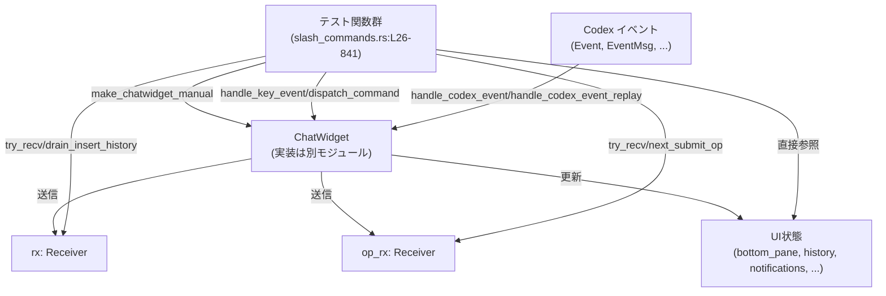
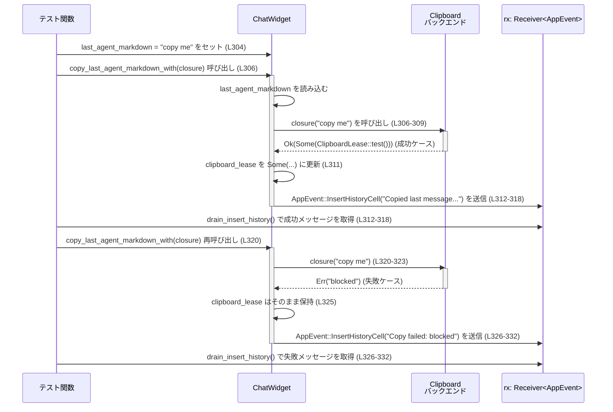

# tui/src/chatwidget/tests/slash_commands.rs コード解説

## 0. ざっくり一言

- このファイルは **`ChatWidget` のスラッシュコマンドやキーボードショートカットの振る舞いを統合テストするモジュール** です。
- `/init` や `/fast` などのコマンドが、UI 状態や `AppEvent` / `Op` の送信を通じて正しく動作するかを、非同期 (`#[tokio::test]`) テストで検証しています。

---

## 1. このモジュールの役割

### 1.1 概要

- このモジュールは **TUI 版チャット UI (`ChatWidget`) のコマンド処理ロジック** を検証するために存在し、以下のような点をテストします。
  - スラッシュコマンド（`/init`, `/compact`, `/fast`, `/copy`, `/clear`, `/resume`, `/rollout` など）の **有効・無効判定** と **送出するイベント**（`AppEvent`, `Op`）。
  - `/copy` や `Ctrl+O` による **エージェント応答のコピー機能とクリップボード lease の保持**。
  - Undo 関連イベントや `/fast` トグルなど、**Codex イベントハンドリングの UI 反映**。
  - ローカル履歴（Up キー）における **スラッシュコマンドの記録／非記録の挙動**。

### 1.2 アーキテクチャ内での位置づけ

このテストモジュールは、本体の `ChatWidget` 実装に対して **ブラックボックス的な統合テスト** を行います。

- `make_chatwidget_manual(...)` で **テスト用の `ChatWidget` とイベントチャネル (`rx`, `op_rx`)** を生成します（`slash_commands.rs:L28`, `L56` など）。
- テストは `ChatWidget` のメソッド
  - `dispatch_command`, `dispatch_command_with_args`（スラッシュコマンド API）
  - `handle_key_event`（キーボード入力）
  - `handle_codex_event`, `handle_codex_event_replay`（Codex からのイベント）
  - `copy_last_agent_markdown_with`（クリップボード連携）
  などを呼び、結果として流れる `AppEvent` / `Op` / UI 状態を検証します。

依存関係の概要を Mermaid で表すと次のようになります（このファイル全体 `L4-841` に対応）。



### 1.3 設計上のポイント（テストコードとしての特徴）

コードから読み取れる範囲の特徴を列挙します。

- **ヘルパー関数による入力の抽象化**
  - `submit_composer_text` が「コンポーザに文字列をセット → Esc → Enter」をまとめて行い、ユーザ入力のシミュレーションを簡潔にしています（`slash_commands.rs:L12-17`）。
  - `recall_latest_after_clearing` が「コンポーザを空にする → Up キー → 現在のテキストを取得」をまとめています（`L19-24`）。

- **非同期テストとチャネルの利用**
  - 全てのテストは `#[tokio::test]` で `async fn` として定義されており（例: `L26-52`）、`make_chatwidget_manual(...).await` で非同期にセットアップされています。
  - `rx: Receiver<AppEvent>` と `op_rx: Receiver<Op>` に対して `try_recv` を使い、**ブロックせずに送信結果を検証**しています（例: `L33-36`, `L51`, `L82-85`）。

- **明示的なエラーメッセージと状態検証**
  - `assert_matches!`, `assert_eq!`, `assert!` を多用し、**失敗時のメッセージ**が分かりやすいようになっています（例: `L35-36`, `L88-97`）。
  - UI 状態（`bottom_pane.is_task_running`, `status_indicator_visible`, `pending_notification` など）を直接検査し、**イベント送信だけでなく UI の挙動**も確認しています（例: `L32`, `L639-641`, `L265-267`）。

- **エッジケース志向のテスト設計**
  - 既存ファイルがある状態で `/init` を送る（`L72-103`）、タスク実行中に `/clear` や `/model` を送る（`L169-187`, `L485-503`）など、**コマンドが利用できない・無視される条件**を重点的にテストしています。
  - `/copy` コマンドについては、「エージェント応答が無い」「古い turn の応答」「Undo やタスク中」など複数の状態を網羅的にカバーしています（`L218-354`, `L356-384`）。

---

## 2. 主要な機能一覧（コンポーネントインベントリー）

このファイルでテストされている主な機能を、カテゴリごとに列挙します。

- **ヘルパー関数**
  - `turn_complete_event`: テスト用の `TurnCompleteEvent` JSON を簡易に生成（`slash_commands.rs:L4-10`）。
  - `submit_composer_text`: コンポーザにテキストを入力し Enter を押すまでをまとめる（`L12-17`）。
  - `recall_latest_after_clearing`: コンポーザを空にして Up キーでローカル履歴を取得（`L19-24`）。

- **/compact 関連**
  - `slash_compact_eagerly_queues_follow_up_before_turn_start`: `/compact` 実行時に `Op::Compact` が送られ、ターン開始前に入力されたメッセージがキューされることを確認（`L26-52`）。
  - `compact_queues_user_messages_snapshot`: `/compact` 中の steer 失敗メッセージを含めた UI スナップショットを検証（`L800-841`）。

- **終了操作**
  - `ctrl_d_quits_without_prompt`: `Ctrl+D` で即座に `AppEvent::Exit` が送信される（`L54-60`）。
  - `ctrl_d_with_modal_open_does_not_quit`: モーダル表示中は `Ctrl+D` で終了しない（`L62-70`）。
  - `slash_quit_requests_exit`, `slash_exit_requests_exit`: `/quit` と `/exit` が `AppEvent::Exit` を送信することを確認（`L208-215`, `L450-457`）。

- **/init とプロジェクトドキュメント**
  - `slash_init_skips_when_project_doc_exists`: プロジェクトドキュメントが既に存在する場合、`/init` は Codex op を送らず、スキップメッセージを表示する（`L72-103`）。

- **スラッシュコマンドのローカル履歴（Up キー）**
  - `bare_slash_command_is_available_from_local_recall_after_dispatch`: `/diff` が履歴から再呼び出し可能（`L105-114`）。
  - `inline_slash_command_is_available_from_local_recall_after_dispatch`: `/rename Better title` のような引数付きコマンドも履歴から取得可能（`L116-125`）。
  - `usage_error_slash_command_is_available_from_local_recall`: 使い方エラーになった `/fast maybe` も履歴に残る（`L127-147`）。
  - `unrecognized_slash_command_is_not_added_to_local_recall`: 未定義コマンド `/does-not-exist` は履歴に残らない（`L149-167`）。
  - `unavailable_slash_command_is_available_from_local_recall`: タスク中で無効な `/model` は履歴に残る（`L169-187`）。
  - `no_op_stub_slash_command_is_available_from_local_recall`: スタブ `/debug-m-drop` も履歴に残る（`L189-205`）。

- **コピー機能（/copy, Ctrl+O, clipboard）**
  - `slash_copy_state_tracks_turn_complete_final_reply`: `TurnCompleteEvent.last_agent_message` からコピー対象テキストを更新（`L217-235`）。
  - `slash_copy_state_tracks_plan_item_completion`: Plan アイテム完了時のテキストをコピー対象として扱い、通知も出す（`L237-268`）。
  - `slash_copy_reports_when_no_agent_response_exists` / `ctrl_o_copy_reports_when_no_agent_response_exists`: 応答がない状態で Copy を呼ぶと、情報メッセージを表示（`L270-284`, `L286-299`）。
  - `slash_copy_stores_clipboard_lease_and_preserves_it_on_failure`: コピー成功時に `clipboard_lease` を保持し、以降の失敗でも lease を消さない（`L301-333`）。
  - `slash_copy_state_is_preserved_during_running_task`: タスク開始後も最後の完了応答を保持（`L335-354`）。
  - `slash_copy_tracks_replayed_legacy_agent_message_when_turn_complete_omits_text`: レガシーな `AgentMessage` の再生からコピー対象テキストを復元（`L356-384`）。
  - `slash_copy_uses_agent_message_item_when_turn_complete_omits_final_text`: `TurnItem::Plan` 経由のメッセージを最終応答として扱い、通知にも使う（`L386-425`）。
  - `agent_turn_complete_notification_does_not_reuse_stale_copy_source`: 新 turn でテキストが無い場合、以前のテキストを使い回さず空文字で通知（`L427-448`）。

- **タスク制御・UI 操作系コマンド**
  - `/stop`: `slash_stop_submits_background_terminal_cleanup` — `Op::CleanBackgroundTerminals` を送信し、履歴に確認メッセージ（`L459-473`）。
  - `/clear`: `slash_clear_requests_ui_clear_when_idle`, `slash_clear_is_disabled_while_task_running` — アイドル時は `AppEvent::ClearUi` を送信し、タスク中はエラーメッセージを表示（`L475-482`, `L484-503`）。
  - `/memory-drop`, `/memory-update`: いずれも「TUI では未対応」である旨のメッセージを表示し、メモリ関連の op は送信しない（`L505-522`, `L536-553`）。
  - `/mcp`: MCP インベントリ取得のために `AppEvent::FetchMcpInventory` を送信し、UI 上には「Loading MCP inventory」を表示（`L525-534`）。
  - `/resume`: 引数なしで picker を開く、引数ありで `AppEvent::ResumeSessionByIdOrName` を送信（`L556-563`, `L565-581`）。
  - `/fork`: `AppEvent::ForkCurrentSession` を送信（`L583-590`）。
  - `/rollout`: 現在パスがある場合はそのパスを表示、無い場合は「利用不可」である旨のメッセージを表示（`L592-607`, `L609-626`）。

- **Undo 関連**
  - `undo_success_events_render_info_messages`: Undo の開始・成功イベントでステータス表示し、成功後に隠す（`L628-663`）。
  - `undo_failure_events_render_error_message`: Undo 失敗時にエラーメッセージを履歴に表示し、ステータスを隠す（`L665-697`）。
  - `undo_started_hides_interrupt_hint`: Undo 開始時は割り込みヒントを隠す（キャンセル不能であるため）（`L699-717`）。

- **Fast モード（サービス tier）**
  - `fast_slash_command_updates_and_persists_local_service_tier`: `/fast` が `Op::OverrideTurnContext` および `AppEvent::PersistServiceTierSelection` を通じて `ServiceTier::Fast` を設定・保存することを確認（`L719-748`）。
  - `user_turn_carries_service_tier_after_fast_toggle`: `/fast` 実行後のユーザターンに `service_tier: Some(Some(ServiceTier::Fast))` が載ることを検証（`L750-772`）。
  - `user_turn_clears_service_tier_after_fast_is_turned_off`: `/fast off` 実行後のユーザターンで `service_tier: Some(None)` にクリアされることを検証（`L774-798`）。

---

## 3. 公開 API と詳細解説

このファイル自体には公開 API（構造体・列挙体）の定義はありませんが、**テスト対象として利用している主な型・関数**を整理します。

### 3.1 主に登場する型一覧

| 名前 | 種別 | 役割 / 用途 | 根拠 |
|------|------|-------------|------|
| `ChatWidget` | 構造体（外部定義） | TUI チャット UI 本体。`dispatch_command`, `handle_key_event`, `handle_codex_event` などがテストから呼ばれます。 | `tui/src/chatwidget/tests/slash_commands.rs:L12-24, L28-52 など` |
| `SlashCommand` | 列挙体（外部定義） | `/compact`, `/quit`, `/fast` などのスラッシュコマンド種別を表現します。 | `slash_commands.rs:L30, L212, L274, L454, L463, L479, L509, L529, L540, L560, L587, L598 など` |
| `AppEvent` | 列挙体（外部定義） | `ChatWidget` からアプリケーション側に送られるイベントを表現します（`Exit`, `ClearUi`, `InsertHistoryCell`, `FetchMcpInventory`, など）。 | `slash_commands.rs:L33-35, L59, L214, L479-481, L491-501, L511-518, L531-533, L542-549, L560-563, L576-579, L589 など` |
| `Op` | 列挙体（外部定義） | Codex コアへの操作（`Compact`, `CleanBackgroundTerminals`, `OverrideTurnContext`, `UserTurn` など）を表現します。 | `slash_commands.rs:L34, L465, L730-733, L766-771, L792-797` |
| `Notification` | 列挙体（外部定義） | エージェントターン完了など UI 通知イベントを表現します。 | `slash_commands.rs:L265-267, L445-447` |
| `ServiceTier` | 列挙体（外部定義） | 通信のサービスレベル（`Fast` など）を表します。`/fast` テストで使用。 | `slash_commands.rs:L731-732, L741-742, L767-768, L793-794` |
| `TurnCompleteEvent`, `ItemCompletedEvent`, `UndoStartedEvent`, `UndoCompletedEvent` など | 構造体（外部定義） | Codex からの各種イベントペイロード。`handle_codex_event` に渡され、UI 状態更新のきっかけになります。 | `slash_commands.rs:L221-228, L244-251, L633-637, L645-648, L670-672, L680-683 など` |
| `KeyEvent`, `KeyCode`, `KeyModifiers` | 構造体・列挙体（外部定義） | キーボード入力表現。`handle_key_event` の引数として使われます。 | `slash_commands.rs:L15-16, L22, L58, L67, L112-113, L290, L574, L763 など` |

> これらの型の定義は別モジュールにあり、このチャンクには現れません。そのため、フィールド構造などの詳細は不明です。

### 3.2 重要な関数（テスト）詳細（7件）

ここでは、挙動の理解に重要と思われるテスト（およびヘルパー）を 7 件選び、詳しく説明します。

#### `submit_composer_text(chat: &mut ChatWidget, text: &str)`  

**概要**

- `ChatWidget` 下部ペインのコンポーザにテキストを設定し、Esc キー押下 → Enter キー押下までを一度に行うヘルパー関数です（`slash_commands.rs:L12-17`）。
- ほとんどのスラッシュコマンドテストで、ユーザーがコマンドを入力して送信する操作をシミュレートするために使用されています（例: `L80`, `L109`, `L120`, `L132`, `L153`, `L174`, `L193`）。

**引数**

| 引数名 | 型 | 説明 |
|--------|----|------|
| `chat` | `&mut ChatWidget` | 操作対象のチャットウィジェット。内部状態やイベント送信がこのオブジェクトに集約されています。 |
| `text` | `&str` | コンポーザに入力するテキスト（スラッシュコマンドや通常メッセージ）。 |

**戻り値**

- 戻り値はありません。副作用として `chat` の内部状態を更新し、必要に応じて `AppEvent` / `Op` が送信されます。

**内部処理の流れ**

1. `chat.bottom_pane.set_composer_text(text.to_string(), Vec::new(), Vec::new())` でテキストをセット（`L13-14`）。
2. `KeyCode::Esc` を送ることで、補助 UI（補完など）が開いていた場合に閉じる意図と推測されます（`L15`）。  
   - ただし Esc の具体的効果はこのチャンクには現れません。
3. `KeyCode::Enter` を送ることで、現在のコンポーザ内容を送信します（`L16`）。

**Errors / Panics**

- この関数自体は `expect` などを呼ばず、パニック要因はありません。
- ただし、呼び出しによりトリガーされる `ChatWidget` 側の処理で panic や `Result::Err` が発生した場合、その挙動はこのファイルからは分かりません。

**Edge cases**

- `text` が空文字の場合でも、Enter が押されます。挙動は各テストによって確認されます（例: `recall_latest_after_clearing` は空文字で Up キーを試すために利用、`L19-24`）。  

**使用上の注意点**

- `ChatWidget` のイベントループはテスト側で直接駆動していないため、このヘルパーは「**同期的に処理されることが前提**」になっています。非同期処理を挟む場合は、追加の待機が必要になる可能性があります。
- 追加のモディファイアキーや複合入力が必要な場合、このヘルパーを使わずに `handle_key_event` を直接呼び出す方が明確です。

---

#### `slash_compact_eagerly_queues_follow_up_before_turn_start()`  

**概要**

- `/compact` コマンドの実行が
  1. 直ちに `Op::Compact` を送信し、
  2. `bottom_pane` のタスク状態を「実行中」にし（`is_task_running`）、
  3. **ターン開始前に入力されたユーザメッセージをキューに蓄積する**
  
  という挙動を確認するテストです（`slash_commands.rs:L26-52`）。

**引数**

- テスト関数であり、引数はありません。

**戻り値**

- `Result` などは返さず、失敗時はアサーションにより panic します。

**内部処理の流れ**

1. `make_chatwidget_manual(None).await` でテスト用の `chat`, `rx`, `op_rx` を生成（`L28`）。
2. `chat.dispatch_command(SlashCommand::Compact)` を呼び `/compact` を実行（`L30`）。
3. 直後に `chat.bottom_pane.is_task_running()` が `true` であることを確認（`L32`）。
4. `rx.try_recv()` で `AppEvent::CodexOp(Op::Compact)` が 1 件送られていることを確認（`L33-36`）。
5. コンポーザに `"queued before compact turn start"` をセットして Enter を押し（`L38-43`）、ユーザメッセージ送信をシミュレート。
6. `pending_steers` が空であること（`L45`）、`queued_user_messages` が 1 件で、先頭の `text` が入力内容と一致することを確認（`L46-50`）。
7. `op_rx.try_recv()` が `Err(TryRecvError::Empty)` であることを確認し、追加の core op が送られていないことを検証（`L51`）。

**Errors / Panics**

- 想定されたイベントが届かない場合、`assert!` や `panic!` によりテストは失敗します。
- 例えば `rx.try_recv()` で `Ok(AppEvent::CodexOp(Op::Compact))` 以外が返ると panic します（`L33-36`）。

**Edge cases**

- このテストは、ターン開始イベント（`TurnStartedEvent`）が来る前にユーザメッセージを送ったケースにフォーカスしています。
- `/compact` 実行後にターンが開始される通常フローや、ターン開始後にメッセージを送るケースは別のコード／テストが担っていると考えられますが、このチャンクには現れません。

**使用上の注意点**

- `/compact` コマンドを扱う実装では、「**ターン開始前のメッセージは queued_user_messages に積む**」という契約があることを示しています。実装変更時は、このテストを参考に同じ振る舞いを維持する必要があります。

---

#### `slash_init_skips_when_project_doc_exists()`

**概要**

- プロジェクトディレクトリに既定のドキュメントファイル（`DEFAULT_PROJECT_DOC_FILENAME`）が既に存在する場合に、`/init` コマンドが **Codex op を送らずにスキップし、理由をメッセージで説明する** ことを確認するテストです（`slash_commands.rs:L72-103`）。

**内部処理の流れ**

1. `tempdir()` で一時ディレクトリを作成し（`L75`）、そこに `DEFAULT_PROJECT_DOC_FILENAME` でファイルを作成（`L76-77`）。
2. `chat.config.cwd` をこのディレクトリに設定（`L78`）。
3. `submit_composer_text(&mut chat, "/init")` で `/init` を送信（`L80`）。
4. `op_rx.try_recv()` が `Err(TryRecvError::Empty)` であることを確認し、Codex 側への op が発行されていないことを検証（`L82-85`）。
5. `drain_insert_history(&mut rx)` で履歴メッセージを取得し、1 件だけであることを確認（`L87-88`）。
6. メッセージ本文が `DEFAULT_PROJECT_DOC_FILENAME` を含み（既存ファイル名が表示される）、かつ `"Skipping /init"` を含むことを確認（`L89-97`）。
7. 実際のファイル内容が `"existing instructions"` のままであることをチェックし、既存ファイルが上書きされていないことを保証（`L98-101`）。
8. ローカル履歴から `/init` が再呼び出し可能であることを `recall_latest_after_clearing` で確認（`L102`）。

**契約・Edge cases**

- `/init` は以下の契約を持つと読み取れます。
  - `cwd` に既定のプロジェクトドキュメントが存在する場合、**ファイルは変更せず**、Codex op を送らない。
  - その旨を 1 行の情報メッセージとして履歴に表示する。
  - 入力した `/init` 自体はローカル履歴に残る。
- ファイルが存在しないケースの挙動はこのファイルには現れません。

**使用上の注意点**

- 実装変更で `/init` がファイルを上書きするようにしてしまうと、このテストが失敗します。既存プロジェクトを壊さない仕様を維持することが前提です。

---

#### `usage_error_slash_command_is_available_from_local_recall()`

**概要**

- `/fast` コマンドの **使い方エラー**（不正な引数）時の挙動として、
  - エラーが履歴に記録され、
  - 間違ったコマンド `/fast maybe` はローカル履歴から再呼び出し可能
  であることを確認するテストです（`slash_commands.rs:L127-147`）。

**内部処理の流れ**

1. `make_chatwidget_manual(Some("gpt-5.3-codex")).await` で ChatWidget を生成し、FastMode 機能を有効化（`L129-130`）。
2. `submit_composer_text(&mut chat, "/fast maybe")` で誤ったコマンドを送信（`L132`）。
3. 送信後のコンポーザが空であることを確認（`L134`）。  
   → エラー時にコンポーザ内容がクリアされる仕様を示唆。
4. `drain_insert_history` で履歴メッセージを取得し、結合したテキストに `"Usage: /fast [on|off|status]"` を含むことを確認（`L136-145`）。
5. `recall_latest_after_clearing(&mut chat)` によって、ローカル履歴から `/fast maybe` が取得できることを確認（`L146`）。

**契約・Edge cases**

- `/fast` の実装は「使い方エラー時でも、ユーザが再編集しやすいようにコマンド履歴には保存する」という方針であると解釈できます。
- 一方で未定義コマンド `/does-not-exist` は履歴に残らないため（`L149-167`）、**「認識したが使用方法が間違っているコマンド」と「そもそも認識できないコマンド」**で扱いを分けていることが分かります。

---

#### `slash_copy_stores_clipboard_lease_and_preserves_it_on_failure()`

**概要**

- `/copy` に対応する内部関数 `copy_last_agent_markdown_with` が、
  - 成功時にクリップボード lease を保存し、
  - その後コピーが失敗しても lease を保持し続ける、
  
  という **クリップボードリソースのライフサイクル管理**を検証するテストです（`slash_commands.rs:L301-333`）。

**内部処理の流れ**

1. `chat.last_agent_markdown = Some("copy me".to_string());` でコピー元テキストを設定（`L304`）。
2. `chat.copy_last_agent_markdown_with(|markdown| { ... })` を呼び、クロージャ内で
   - `markdown == "copy me"` であることを確認し（`L307`）、
   - `Ok(Some(ClipboardLease::test()))` を返すことで、コピー成功と lease 取得をシミュレート（`L308-309`）。
3. `chat.clipboard_lease.is_some()` で lease が保存されたことを確認（`L311`）。
4. `drain_insert_history` により成功メッセージ `"Copied last message to clipboard"` が表示されたか確認（`L312-318`）。
5. 再度 `copy_last_agent_markdown_with` を呼び、今度は `Err("blocked".into())` を返してコピー失敗をシミュレート（`L320-323`）。
6. 失敗後も `chat.clipboard_lease.is_some()` で lease が残っていることを確認（`L325`）。
7. 履歴メッセージが `"Copy failed: blocked"` を含むことを確認し、ユーザ向けエラーメッセージも正しいことを検証（`L326-332`）。

**Errors / Panics**

- `last_agent_markdown` が `None` の場合の挙動はこのテストでは扱っていませんが、別の `/copy` テストが「応答がない場合」の挙動をカバーしています（`L270-299`）。
- クリップボード処理自体はクロージャ内の `Result` でモデリングされ、`Err` は UI メッセージに変換されるだけで panic にはなりません。

**契約・Edge cases**

- `copy_last_agent_markdown_with` の契約として、
  - **コピー操作が失敗しても、既存のクリップボード lease を破棄しない** という前提があることが分かります。
- これは、OS 側のクリップボード権限などとの整合性のためと推測できますが、詳細はこのチャンクからは分かりません。

---

#### `fast_slash_command_updates_and_persists_local_service_tier()`

**概要**

- `/fast` コマンドが **サービス tier を `Fast` に設定し、その設定をローカルに永続化するためのイベントを送る** ことを確認するテストです（`slash_commands.rs:L719-748`）。

**内部処理の流れ**

1. Codex モデルを `"gpt-5.3-codex"` に上書きして ChatWidget を生成し（`L721`）、`Feature::FastMode` を有効化（`L722`）。
2. `chat.dispatch_command(SlashCommand::Fast);` を実行（`L724`）。
3. `rx` から `try_recv` で全イベントを回収し、`Vec<AppEvent>` に格納（`L726`）。
4. その中に以下 2 種類のイベントが存在することをチェック（`L727-745`）。
   - `AppEvent::CodexOp(Op::OverrideTurnContext { service_tier: Some(Some(ServiceTier::Fast)), .. })`  
     → **現在の turn コンテキストの service_tier を Fast に設定**。
   - `AppEvent::PersistServiceTierSelection { service_tier: Some(ServiceTier::Fast) }`  
     → **ユーザ選択を永続化する指示**。
5. `op_rx.try_recv()` が `Err(TryRecvError::Empty)` であることを確認し、core 側への追加 op が送られていない（上記 override は `AppEvent` 経由）ことを検証（`L747`）。

**契約・並行性**

- `/fast` コマンドは
  - **即座に AppEvent で service_tier を変更・保存する** ものの、
  - core の `op_rx` には何も送らない  
 という非同期設計になっています。
- テストでは `try_recv` を用いており、これらのイベントが同期的に発生することを前提にしています。将来、内部実装が完全に非同期になる場合には、テストに待機処理を追加する必要が出る可能性があります。

---

#### `compact_queues_user_messages_snapshot()`

**概要**

- `/compact` 実行中に steer メッセージがエラーで拒否されたケースを含めた **UI レイアウト全体のスナップショット** を検証するテストです（`slash_commands.rs:L800-841`）。
- `VT100Backend` とカスタム `Terminal` を用いて、レンダリングされた画面をテキストとして取得し、スナップショットマクロで比較しています。

**内部処理の流れ**

1. `make_chatwidget_manual` で ChatWidget を生成し、`thread_id` を設定（`L802-803`）。
2. `TurnStartedEvent` を `handle_codex_event` に送り、コンパクトターンの開始をシミュレート（`L804-812`）。
3. `chat.submit_user_message` で steer メッセージ `"Steer submitted while /compact was running."` を送信（`L814-816`）。
4. `EventMsg::Error`（`CodexErrorInfo::ActiveTurnNotSteerable::Compact`）を送信し、「コンパクトターンは steer 不可」であるエラーをシミュレート（`L817-825`）。
5. `VT100Backend` と `Terminal` をセットアップし、`chat.render(...)` で UI を描画（`L827-835`）。
6. `normalize_snapshot_paths(...)` でスクリーン内容を正規化しつつ `assert_chatwidget_snapshot!` でスナップショット比較を実施（`L837-840`）。

**使用上の注意点**

- UI スナップショットテストは、**細かい UI 変更にも敏感** なため、レイアウトやメッセージ変更時には意図的な更新が必要です。
- `normalize_snapshot_paths` を通している点から、絶対パスなどの環境依存情報は扱いやすい形に整形してから比較する設計であることが分かります。

---

### 3.3 その他の関数（テスト）一覧

ヘルパー 2 件とその他のテスト関数を簡潔に整理します。

| 関数名 | 役割（1 行） | 根拠行 |
|--------|--------------|--------|
| `turn_complete_event` | JSON を通じて `TurnCompleteEvent` を生成するテスト用ヘルパー。 | `slash_commands.rs:L4-10` |
| `recall_latest_after_clearing` | コンポーザを空にし Up キーでローカル履歴の最新エントリを取得するヘルパー。 | `slash_commands.rs:L19-24` |
| `ctrl_d_quits_without_prompt` | `Ctrl+D` が即座に `AppEvent::Exit(ShutdownFirst)` を送ることを検証。 | `slash_commands.rs:L54-60` |
| `ctrl_d_with_modal_open_does_not_quit` | モーダル表示中は `Ctrl+D` による終了が抑止されることを検証。 | `slash_commands.rs:L62-70` |
| `bare_slash_command_is_available_from_local_recall_after_dispatch` | 単純な `/diff` コマンドが履歴から再利用できることを検証。 | `slash_commands.rs:L105-114` |
| `inline_slash_command_is_available_from_local_recall_after_dispatch` | 引数付き `/rename Better title` も履歴から再利用できることを検証。 | `slash_commands.rs:L116-125` |
| `unrecognized_slash_command_is_not_added_to_local_recall` | 未定義コマンドは履歴に追加されないことを検証。 | `slash_commands.rs:L149-167` |
| `unavailable_slash_command_is_available_from_local_recall` | タスク中で無効な `/model` コマンドは履歴に残ることを検証。 | `slash_commands.rs:L169-187` |
| `no_op_stub_slash_command_is_available_from_local_recall` | スタブコマンド `/debug-m-drop` が履歴から再利用できることを検証。 | `slash_commands.rs:L189-205` |
| `slash_quit_requests_exit` | `/quit` が `Exit` イベントを送ることを検証。 | `slash_commands.rs:L208-215` |
| `slash_copy_state_tracks_turn_complete_final_reply` | 完了イベントの `last_agent_message` をコピー対象に反映することを検証。 | `slash_commands.rs:L217-235` |
| `slash_copy_state_tracks_plan_item_completion` | Plan アイテム完了時のテキストと通知設定を検証。 | `slash_commands.rs:L237-268` |
| `slash_copy_reports_when_no_agent_response_exists` | `/copy` 実行時にコピー対象応答がない場合のメッセージを検証。 | `slash_commands.rs:L270-284` |
| `ctrl_o_copy_reports_when_no_agent_response_exists` | `Ctrl+O` によるコピーも、応答がない場合に同様のメッセージを表示することを検証。 | `slash_commands.rs:L286-299` |
| `slash_copy_state_is_preserved_during_running_task` | タスク開始後も最後の完了応答テキストが保持されることを検証。 | `slash_commands.rs:L335-354` |
| `slash_copy_tracks_replayed_legacy_agent_message_when_turn_complete_omits_text` | レガシーメッセージの再生からコピー対象テキストを復元する挙動を検証。 | `slash_commands.rs:L356-384` |
| `slash_copy_uses_agent_message_item_when_turn_complete_omits_final_text` | TurnItem 経由の最終メッセージをコピー対象として利用する挙動と通知を検証。 | `slash_commands.rs:L386-425` |
| `agent_turn_complete_notification_does_not_reuse_stale_copy_source` | 新 turn でテキストが無い場合に、古いテキストを通知に使わないことを検証。 | `slash_commands.rs:L427-448` |
| `slash_exit_requests_exit` | `/exit` が `Exit` イベントを送ることを検証。 | `slash_commands.rs:L450-457` |
| `slash_stop_submits_background_terminal_cleanup` | `/stop` による背景ターミナルクリーンアップ op と確認メッセージを検証。 | `slash_commands.rs:L459-473` |
| `slash_clear_requests_ui_clear_when_idle` | アイドル状態で `/clear` が `ClearUi` イベントを送ることを検証。 | `slash_commands.rs:L475-482` |
| `slash_clear_is_disabled_while_task_running` | タスク中の `/clear` がエラーメッセージを表示し、他のイベントを送らないことを検証。 | `slash_commands.rs:L484-503` |
| `slash_memory_drop_reports_stubbed_feature` | `/memory-drop` が「未サポート」メッセージを表示するだけであることを検証。 | `slash_commands.rs:L505-522` |
| `slash_mcp_requests_inventory_via_app_server` | `/mcp` が MCP インベントリ取得イベントを送り、UI にローディング表示を出すことを検証。 | `slash_commands.rs:L525-534` |
| `slash_memory_update_reports_stubbed_feature` | `/memory-update` の未サポートメッセージのみを検証。 | `slash_commands.rs:L536-553` |
| `slash_resume_opens_picker` | `/resume`（引数なし）が Resume picker を開くイベントを送ることを検証。 | `slash_commands.rs:L556-563` |
| `slash_resume_with_arg_requests_named_session` | `/resume my-saved-thread` が指定名の session を再開するイベントを送ることを検証。 | `slash_commands.rs:L565-581` |
| `slash_fork_requests_current_fork` | `/fork` が現セッションの fork イベントを送ることを検証。 | `slash_commands.rs:L583-590` |
| `slash_rollout_displays_current_path` | `/rollout` が現在の rollout パスを履歴メッセージとして表示することを検証。 | `slash_commands.rs:L592-607` |
| `slash_rollout_handles_missing_path` | rollout パス未設定時の「利用不可」メッセージを検証。 | `slash_commands.rs:L609-626` |
| `undo_success_events_render_info_messages` | Undo 成功時のステータス表示とステータス非表示化を検証。 | `slash_commands.rs:L628-663` |
| `undo_failure_events_render_error_message` | Undo 失敗時のエラーメッセージとステータス非表示化を検証。 | `slash_commands.rs:L665-697` |
| `undo_started_hides_interrupt_hint` | Undo 中は割り込みヒントが非表示になることを検証。 | `slash_commands.rs:L699-717` |
| `user_turn_carries_service_tier_after_fast_toggle` | `/fast` 実行後のユーザターンに Fast tier が引き継がれることを検証。 | `slash_commands.rs:L750-772` |
| `user_turn_clears_service_tier_after_fast_is_turned_off` | `/fast off` 後のユーザターンで tier がクリアされることを検証。 | `slash_commands.rs:L774-798` |

---

## 4. データフロー

### 4.1 `/copy` 実行時のデータフロー（クリップボード lease）  

`slash_copy_stores_clipboard_lease_and_preserves_it_on_failure`（`slash_commands.rs:L301-333`）を例に、データフローを整理します。

1. テストが `chat.last_agent_markdown = Some("copy me".to_string())` をセット（コピー元テキスト）（`L304`）。
2. テストが `chat.copy_last_agent_markdown_with` を呼び、クロージャでコピー処理をシミュレート（`L306-309`）。
3. `ChatWidget` は内部で `last_agent_markdown` を読み、クロージャに渡す。
4. クロージャは成功結果 `Ok(Some(ClipboardLease))` を返し、`ChatWidget` は `clipboard_lease` を更新し成功メッセージ用 `AppEvent::InsertHistoryCell` を `rx` に送信（`L311-318`）。
5. テストは `drain_insert_history(&mut rx)` でメッセージを取得し、内容を検証。
6. 2 回目の呼び出しではクロージャが `Err("blocked")` を返し、`ChatWidget` は `clipboard_lease` を保持したまま、失敗メッセージ用の `AppEvent::InsertHistoryCell` を送信（`L320-332`）。

この流れをシーケンス図で表します。



**要点**

- `ChatWidget` は「コピー元テキスト」と「クリップボード lease」を内部状態として分離管理しており、`Result` に応じて lease を更新または保持します。
- アプリケーション側への通知はすべて `AppEvent::InsertHistoryCell` で行われ、テキスト UI 上に表示されます。

---

## 5. 使い方（How to Use）

ここでは、「新しいスラッシュコマンドやイベントのテストを追加する」という観点で、このモジュールの使い方をまとめます。

### 5.1 基本的な使用方法（テストの雛形）

多くのテストは、以下のパターンに従って書かれています。

```rust
#[tokio::test] // 非同期テスト
async fn new_command_behaves_as_expected() {
    // 1. ChatWidget とチャネルをセットアップする
    let (mut chat, mut rx, mut op_rx) =
        make_chatwidget_manual(/*model_override*/ None).await; // slash_commands.rs:L28 など

    // 2. 必要なら事前状態を構築する（例: thread_id, feature flag）
    chat.thread_id = Some(ThreadId::new());                     // L753, L777
    chat.set_feature_enabled(Feature::FastMode, true);          // L130, L722

    // 3. コマンドを投入する
    submit_composer_text(&mut chat, "/your-command arg1 arg2"); // L80, L109 など

    // 4. rx / op_rx / UI 状態を検証する
    // AppEvent を確認
    let events: Vec<AppEvent> = std::iter::from_fn(|| rx.try_recv().ok()).collect();
    // Op を確認
    assert_matches!(op_rx.try_recv(), Err(TryRecvError::Empty));
    // UI 状態を確認
    assert_eq!(chat.bottom_pane.composer_text(), "");           // L134 など
}
```

このパターンに従うことで、**ユーザ入力 → ChatWidget → イベント送信・UI 更新** の一連の流れをテストできます。

### 5.2 よくある使用パターン

1. **ローカル履歴（Up キー）の確認**

```rust
// コマンドを送信
submit_composer_text(&mut chat, "/diff");                        // L109

// 履歴による再呼び出しを確認
let _ = drain_insert_history(&mut rx);                           // L111
chat.handle_key_event(KeyEvent::new(KeyCode::Up, KeyModifiers::NONE)); // L112
assert_eq!(chat.bottom_pane.composer_text(), "/diff");           // L113
```

1. **タスク実行中に無効なコマンドを送る**

```rust
chat.bottom_pane.set_task_running(true);                         // L172, L487
submit_composer_text(&mut chat, "/model");                       // L174

let cells = drain_insert_history(&mut rx);                       // L176
let rendered = cells.iter()
    .map(|cell| lines_to_single_string(cell))
    .collect::<Vec<_>>()
    .join("\n");
assert!(rendered.contains("'/model' is disabled while a task is in progress.")); // L183-185
```

1. **Codex イベントをシミュレート**

```rust
chat.handle_codex_event(Event {
    id: "turn-1".into(),
    msg: EventMsg::UndoStarted(UndoStartedEvent { message: None }), // L670-672
});
// UI 状態を確認
assert!(chat.bottom_pane.status_indicator_visible());                // L673-676
```

### 5.3 よくある誤用と正しい使い方

**例: ローカル履歴を検証したい場合**

- 誤りやすい書き方（推測される例）

```rust
// コンポーザの内容をそのままにして Up キーを押す
chat.handle_key_event(KeyEvent::new(KeyCode::Up, KeyModifiers::NONE));
let text = chat.bottom_pane.composer_text();
```

- 正しいパターン（このモジュールで採用されている）

```rust
// 一度コンポーザを空にしてから Up キーを押す
let recalled = recall_latest_after_clearing(&mut chat); // L19-24
assert_eq!(recalled, "/init");                          // L102 など
```

**ポイント**

- `recall_latest_after_clearing` は「**現在のコンポーザ内容をクリアしてから履歴を辿る**」ことを前提としており、既存テキストの影響を排除したテストが書けます。

### 5.4 使用上の注意点（まとめ）

- **非同期性**
  - テストは `#[tokio::test]` ですが、`ChatWidget` の操作自体は同期的に行われ、`try_recv` を多用しています。  
    将来、内部処理が完全に非同期になった場合、適切な `sleep` や `notify` を使った同期が必要になる可能性があります。
- **エラー検証**
  - 多くのテストで `TryRecvError::Empty` を用いて「イベントが送られていない」ことを確認しています（例: `L51`, `L82-85`, `L523`, `L533`, `L580`）。  
    これは「**余計な side effect が無いことを保証する**」ための重要なパターンです。
- **スナップショットテスト**
  - `assert_chatwidget_snapshot!` を使うテスト（`L279`, `L837-840`）は UI 変更に敏感です。仕様変更に伴い UI が変わる場合は、スナップショット更新のコストを考慮する必要があります。

---

## 6. 変更の仕方（How to Modify）

### 6.1 新しいスラッシュコマンドを追加する場合

1. **ChatWidget 実装側での追加**
   - `SlashCommand` 列挙体に新しいバリアントを追加し（このファイルには定義がないため別ファイル参照）、`ChatWidget::dispatch_command` 内で処理を実装します（定義位置はこのチャンクには現れません）。

2. **このテストモジュールへの追加**
   - `slash_new_command_behavior()` のようなテスト関数を追加し、以下を確認するとよいです。
     - コマンド専用の `AppEvent` / `Op` が正しく送られるか。
     - タスク実行中の有効・無効判定。
     - ローカル履歴（Up キー）に残す／残さないポリシー。
   - 既存の `/model`, `/clear`, `/fast` などのテスト（`L169-187`, `L484-503`, `L719-798`）を参考にすると、仕様の一貫性を保ちやすくなります。

3. **UI メッセージの検証**
   - 新コマンドにエラーメッセージや情報メッセージがある場合は、`drain_insert_history` + `lines_to_single_string` を使って文字列レベルで確認します（例: `L87-97`, `L176-185`）。

### 6.2 既存機能を変更する場合の注意点

- **契約の保持**
  - `/init` が既存ファイルを上書きしない（`L72-103`）、`/clear` がタスク中に無効である（`L484-503`）、`/copy` が応答なし時にメッセージを出す（`L270-299`）、`/fast` が service_tier の override と永続化を行う（`L719-748`）といった契約が多数存在します。
  - 実装変更時には、対応するテストの意図を読み取ったうえで、仕様を変えるならテストも合わせて更新する必要があります。

- **影響範囲の把握**
  - スラッシュコマンド名でテストが関数名に含まれているため（例: `slash_fast...`, `slash_clear...`）、`rg "/clear"` 等で検索すると該当テストを簡単に特定できます。
  - Undo や `/copy` のように **複数のケースでテストされている機能** については、すべての関連テストを確認する必要があります（`L628-697`, `L217-354`, `L356-425`, `L427-448`）。

- **エッジケースの追加**
  - 新たなエッジケース（例: `/fast` の別サブコマンド）を実装した場合、既存のテストパターンをコピーして追加ケースを作成するだけで、多くの検証が自動で行われます。

---

## 7. 関連ファイル

このモジュールと密接に関係するであろうファイル・モジュールを、コード中の参照から推測できる範囲で列挙します。

| パス / モジュール | 役割 / 関係 | 根拠 |
|-------------------|------------|------|
| `tui/src/chatwidget/mod.rs`（推定） | `ChatWidget` の本体実装。`dispatch_command`, `handle_key_event`, `handle_codex_event` など、このテストが直接呼び出すメソッドの定義があると考えられます。 | `slash_commands.rs` 全体で `ChatWidget` メソッドが使用されていること（例: `L30`, `L58`, `L221`, `L339`） |
| `tui/src/chatwidget/tests/mod.rs`（推定） | `make_chatwidget_manual`, `drain_insert_history`, `lines_to_single_string`, `complete_assistant_message`, `next_submit_op`, `set_chatgpt_auth` など、このテストで利用されるテスト用ユーティリティ群を提供している可能性があります。 | 関数呼び出しのみが現れ、定義はこのチャンクにない（例: `L28`, `L87`, `L399`, `L765`） |
| `crate::clipboard_copy` | `ClipboardLease` 型を提供し、クリップボードとの連携テストに利用されています。 | `slash_commands.rs:L308` |
| `crate::custom_terminal` | `Terminal` 実装を提供し、UI スナップショットテストに利用されています。 | `slash_commands.rs:L830` |
| `VT100Backend` | VT100 互換バックエンド。画面内容をテキストとして取得するために使用。 | `slash_commands.rs:L827-831` |
| Codex 関連モジュール（`Event`, `EventMsg`, `TurnCompleteEvent`, `ErrorEvent`, など） | Codex サーバーからのイベント構造体。`ChatWidget` のイベントハンドラテストで使用。 | `slash_commands.rs:L221-228`, `L243-251`, `L633-637`, `L670-672`, `L817-825` など |

> これらのモジュール／ファイルの正確なパスや実装内容は、このチャンクからは分かりませんが、型名とモジュールパスから上記のような役割が推測できます。

---

## Bugs / セキュリティ観点（簡単なまとめ）

- このファイルには `unsafe` ブロックや外部からの入力処理はなく、すべて **テスト用に構築したデータ** を扱っています。
- テスト内容から見る限り、以下のようなセーフティ契約が確認されます。
  - ユーザーデータ（プロジェクトドキュメント）を勝手に上書きしない（`/init`, `slash_commands.rs:L72-103`）。
  - タスク中に実行できないコマンドを明示的なメッセージで拒否する（`/model`, `/clear`, `L169-187`, `L484-503`）。
  - クリップボードへのコピーは `Result` による失敗通知を行い、既存 lease を無意味に破棄しない（`L301-333`）。
- テストから明白なバグやセキュリティ上の問題点は読み取れませんが、実際のリスクは `ChatWidget` や Codex クライアント実装側に依存します（このチャンクには現れません）。
