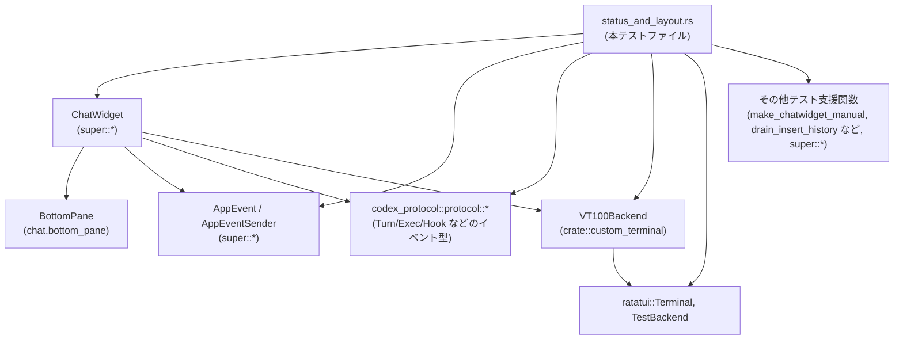
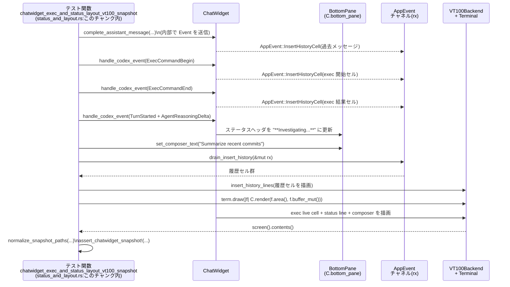

# tui/src/chatwidget/tests/status_and_layout.rs

## 0. ざっくり一言

ChatWidget の **ステータス行・ステータスインジケータ・レイアウト・フック表示まわり** を、イベント駆動で検証する **非公開テスト（統合テスト＋スナップショットテスト）群**です。  
プロダクションコードは含まず、`ChatWidget` や関連コンポーネントの期待される振る舞いを固定化する役割を持ちます。

> 行番号について  
> 要求仕様では `ファイル名:L開始-終了` 形式の行番号が求められていますが、現在のインターフェイスからは実際の行番号を正確に取得できません。  
> そのため、本解説では **「このチャンク内」** という形で根拠の所在を示し、具体的な数値行番号は記載できないことを明示します。

---

## 1. このモジュールの役割

### 1.1 概要

このテストモジュールは、次のような問題を検証しています。

- **ステータス・コンテキスト表示の整合性**
  - トークン使用量／コンテキストウィンドウの表示・リセット
  - レートリミット警告やプラン情報の表示
  - Fast モード・推論強度などのステータス行表示
- **ランタイムイベントに応じた UI の状態遷移**
  - タスク開始／完了、ストリーミングエラー、Hook 実行などのイベントによる
    ステータスインジケータ・フック行の表示/非表示
- **レイアウト・レンダリング**
  - 非常に小さい高さでのレイアウト（1〜3 行）
  - VT100 バックエンドを使った実際の画面スナップショット
  - Markdown（特にコードブロック）のレンダリング
- **App Server Hook / codex hook の表示と履歴への反映**
  - Hook の開始・完了・ブロック・失敗時のメッセージ表示順序とライフサイクル

すべて `#[tokio::test]` な async テストであり、**ChatWidget がイベントをどのように処理して UI 状態と履歴を更新するか**を外側から検査しています。

### 1.2 アーキテクチャ内での位置づけ

このテストファイルは、ChatWidget とその周辺コンポーネントの「振る舞い仕様」を確立する立場にあります。主な依存関係は次のようになります。



- `use super::*;` により、ChatWidget のテスト用コンストラクタ (`make_chatwidget_manual`) や、
  `drain_insert_history`, `active_hook_blob` などのテスト支援ユーティリティをインポートしています（定義はこのチャンクには現れません）。
- `codex_protocol::protocol::*` 系のイベント型を使って、実際のプロトコルに近い形で ChatWidget にイベントを注入しています。
- `VT100Backend` と `ratatui::backend::TestBackend` を用いて、**履歴 + 現在の UI を合成した実際の端末画面イメージ**をスナップショットとして固定しています。

### 1.3 設計上のポイント

コードから読み取れる設計上の特徴は以下の通りです（いずれもこのチャンク内）。

- **イベント駆動の UI テスト**
  - すべての UI 状態変化は `chat.handle_codex_event(...)` や `chat.handle_server_notification(...)` 等のイベント処理を通じて行われます。
  - 状態は `AppEvent` 経由で履歴（history cell）として流れ出し、`drain_insert_history(&mut rx)` でテスト側に回収されます。

- **非同期だが単一タスク内で直列実行**
  - すべて `#[tokio::test] async fn ...` ですが、`tokio::spawn` などによる並列タスクはこのファイルには現れません。
  - `unbounded_channel::<AppEvent>()` の consumer (`rx`) に対する操作も単一タスク内からのみ行われ、レースコンディションはテストコード上は発生しません。

- **状態の可視化用ユーティリティの活用**
  - `status_line_text(&chat)`、`active_blob(&chat)`、`active_hook_blob(&chat)`、
    `hook_live_and_history_snapshot(...)` などを用いて、内部状態を文字列で把握しスナップショット化しています。

- **「静かなフック (quiet hook)」のライフサイクル**
  - Hook が履歴を生成しない / 既に完了している場合でも、UI 上で一時的に残すための
    「linger」メカニズムがあり、`expire_quiet_hook_linger(&mut chat)` でその完了を明示的にシミュレートしています。

- **エッジケースに対する詳細な検証**
  - トークンカウントの `info: None` によるコンテキストメータのリセット、
    長いコンテキストウィンドウの単位（K）表示、レートリミットの閾値 25/5%、
    Hook 出力なしの場合の履歴非挿入など、仕様の細部がテストで固定されています。

---

## 2. 主要な機能一覧とコンポーネントインベントリー

### 2.1 機能グループ一覧

このファイルのテストがカバーする主な機能グループは以下の通りです（すべてこのチャンク内）。

- **コンテキストウィンドウ・トークン表示**
  - `token_count_none_resets_context_indicator`
  - `context_indicator_shows_used_tokens_when_window_unknown`
  - `turn_started_uses_runtime_context_window_before_first_token_count`

- **ChatWidget の基本初期化**
  - `helpers_are_available_and_do_not_panic`

- **レートリミット関連**
  - 警告文のしきい値: `rate_limit_warnings_emit_thresholds`,  
    `test_rate_limit_warnings_monthly`
  - RateLimitSnapshot のマージ/保持:  
    `rate_limit_snapshot_keeps_prior_credits_when_missing_from_headers`,  
    `rate_limit_snapshot_updates_and_retains_plan_type`,  
    `rate_limit_snapshots_keep_separate_entries_per_limit_id`
  - 事前フェッチ許可判定: `prefetch_rate_limits_is_gated_on_chatgpt_auth_provider`
  - レートリミット切替プロンプト:  
    `rate_limit_switch_prompt_*` 系テスト（5 件）

- **タスク時間・ステータスインジケータ**
  - 経過時間リセット: `worked_elapsed_from_resets_when_timer_restarts`
  - タスク実行中フラグとステータスインジケータの挙動:  
    `streaming_final_answer_keeps_task_running_state`,  
    `idle_commit_ticks_do_not_restore_status_without_commentary_completion`,  
    `commentary_completion_restores_status_indicator_before_exec_begin`
  - ストリームエラーの表示:  
    `stream_error_updates_status_indicator`,  
    `stream_error_restores_hidden_status_indicator`

- **Fast モード/モデル選択 UI**
  - `fast_status_indicator_requires_chatgpt_auth`
  - `fast_status_indicator_is_hidden_for_models_without_fast_support`
  - `fast_status_indicator_is_hidden_when_fast_mode_is_off`
  - `status_line_fast_mode_renders_on_and_off`
  - `status_line_fast_mode_footer_snapshot`
  - `status_line_model_with_reasoning_includes_fast_for_fast_capable_models`
  - `status_line_model_with_reasoning_fast_footer_snapshot`

- **ステータス行（status line）とターミナルタイトル**
  - 無効な item の警告: `status_line_invalid_items_warn_once`
  - レガシー context-used / context-remaining:  
    `status_line_legacy_context_used_renders_context_meter`,  
    `status_line_legacy_context_remaining_renders_context_meter`
  - Git ブランチ表示の状態管理:  
    `status_line_branch_state_resets_when_git_branch_disabled`,  
    `status_line_branch_refreshes_after_turn_complete`,  
    `status_line_branch_refreshes_after_interrupt`
  - モデル＋推論強度＋コラボレーションモード:  
    `status_line_model_with_reasoning_updates_on_mode_switch_without_manual_refresh`,  
    `status_line_model_with_reasoning_plan_mode_footer_snapshot`
  - スレッドタイトル: `renamed_thread_footer_title_snapshot`
  - ターミナルタイトルの自動更新:  
    `terminal_title_model_updates_on_model_change_without_manual_refresh`

- **UI レイアウト・スナップショット**
  - 極小高さ（1〜3 行）でのレイアウト:  
    `ui_snapshots_small_heights_idle`,  
    `ui_snapshots_small_heights_task_running`
  - ステータスウィジェット単体:  
    `status_widget_active_snapshot`
  - ステータス＋承認モーダル:  
    `status_widget_and_approval_modal_snapshot`
  - Exec + ステータス + 履歴の VT100 スナップショット:  
    `chatwidget_exec_and_status_layout_vt100_snapshot`
  - Markdown 複雑コードブロックの VT100 スナップショット:  
    `chatwidget_markdown_code_blocks_vt100_snapshot`
  - 長いキュー（多くのメッセージ）がある場合の高さ:  
    `chatwidget_tall`

- **Runtime Metrics**
  - WebSocket TTFT/TBT のログと最終セパレータ:  
    `runtime_metrics_websocket_timing_logs_and_final_separator_sums_totals`

- **メッセージストリーミング・レンダリング順序**
  - 1ターン内で複数のエージェントメッセージ:  
    `multiple_agent_messages_in_single_turn_emit_multiple_headers`
  - 最終 Reasoning → 最終メッセージのみ:  
    `final_reasoning_then_message_without_deltas_are_rendered`
  - Delta の後に同一最終メッセージ:  
    `deltas_then_same_final_message_are_rendered_snapshot`

- **Hook / App Server Hook 関連**
  - App サーバー Hook 通知（ユーザープロンプト送信時）:  
    `user_prompt_submit_app_server_hook_notifications_render_snapshot`
  - codex hook (PreToolUse / PostToolUse / SessionStart / Stop など) の開始・完了:
    - `pre_tool_use_hook_events_render_snapshot`
    - `post_tool_use_hook_events_render_snapshot`
    - `completed_hook_with_no_entries_stays_out_of_history`
    - `quiet_hook_linger_starts_when_delayed_redraw_reveals_hook`
    - `blocked_and_failed_hooks_render_feedback_and_errors`
    - `completed_hook_with_output_flushes_immediately`
    - `completed_hook_output_precedes_following_assistant_message`
    - `completed_same_id_hook_output_survives_restart`
    - `identical_parallel_running_hooks_collapse_to_count`
    - `overlapping_hook_live_cell_tracks_parallel_quiet_hooks`
    - `running_hook_does_not_displace_active_exec_cell`
    - `hidden_active_hook_does_not_add_transcript_separator`
    - `hook_completed_before_reveal_renders_completed_without_running_flash`
    - `session_start_hook_events_render_snapshot`

- **警告・その他のイベント**
  - StreamError によるステータス更新（前述）
  - WarningEvent の履歴セル: `warning_event_adds_warning_history_cell`

### 2.2 関数インベントリー（テスト・ヘルパ）

このファイルで定義されている関数（テスト＋ヘルパ）の一覧です。  

> 行番号は取得できないため、すべて「status_and_layout.rs:このチャンク内」としています。

| 名前 | 種別 | 役割 / 用途 | 定義位置（概略） |
|------|------|-------------|------------------|
| `token_count_none_resets_context_indicator` | `#[tokio::test] async fn` | TokenCount イベントで `info: None` を受け取ったときにコンテキストインジケータがリセットされることを検証 | `status_and_layout.rs:このチャンク内` |
| `context_indicator_shows_used_tokens_when_window_unknown` | async test | モデルコンテキストウィンドウ不明時に、使用トークン数表示にフォールバックすることを検証 | 同上 |
| `turn_started_uses_runtime_context_window_before_first_token_count` | async test | TurnStarted で渡された `model_context_window` が最初の TokenCount 前の表示に使われることを検証 | 同上 |
| `helpers_are_available_and_do_not_panic` | async test | ChatWidget のテスト用コンストラクタやセッションテレメトリ初期化がパニックせず動作することを確認 | 同上 |
| `prefetch_rate_limits_is_gated_on_chatgpt_auth_provider` | async test | レートリミット事前フェッチが OpenAI 認証設定に依存することを検証 | 同上 |
| `worked_elapsed_from_resets_when_timer_restarts` | async test | `chat.worked_elapsed_from` がタイマーリスタートを検出し、基準をリセットすることを検証 | 同上 |
| `rate_limit_warnings_emit_thresholds` | async test | 5h/週レートリミットの 25% / 5% を下回った時に警告文を 1 回ずつ発火することを検証 | 同上 |
| `test_rate_limit_warnings_monthly` | async test | 月次レートリミットに対する 25% 警告の発火を検証 | 同上 |
| `rate_limit_snapshot_keeps_prior_credits_when_missing_from_headers` | async test | 後続スナップショットで `credits` が欠落していても、以前のクレジット情報が保持されることを検証 | 同上 |
| `rate_limit_snapshot_updates_and_retains_plan_type` | async test | PlanType (Plus/Pro) の更新と、その後 `plan_type: None` が来ても最後のプラン種別が保持されることを検証 | 同上 |
| `rate_limit_snapshots_keep_separate_entries_per_limit_id` | async test | `limit_id` ごとに独立したスナップショットが保持されることを検証 | 同上 |
| `rate_limit_switch_prompt_skips_when_on_lower_cost_model` | async test | NUDGE モデル使用時にレートリミット切替プロンプトが出ないことを検証 | 同上 |
| `rate_limit_switch_prompt_skips_non_codex_limit` | async test | codex 以外の limit_id のスナップショットでは切替プロンプトが Idle のままであることを検証 | 同上 |
| `rate_limit_switch_prompt_shows_once_per_session` | async test | 一度表示された切替プロンプトが同一セッション中に繰り返し表示されないことを検証 | 同上 |
| `rate_limit_switch_prompt_respects_hidden_notice` | async test | コンフィグで notice を隠す設定がある場合、切替プロンプトが出ないことを検証 | 同上 |
| `rate_limit_switch_prompt_defers_until_task_complete` | async test | タスク実行中は Prompt を Pending に留め、完了後に表示する挙動を検証 | 同上 |
| `rate_limit_switch_prompt_popup_snapshot` | async test | レートリミット切替ポップアップの描画スナップショットを検証 | 同上 |
| `streaming_final_answer_keeps_task_running_state` | async test | 最終回答ストリーミング中にタスク実行状態が保持され、キュー送信や `Op::Interrupt` が期待通り動くことを検証 | 同上 |
| `idle_commit_ticks_do_not_restore_status_without_commentary_completion` | async test | コメントリー完了前の idle commit tick がステータス行を再表示しないことを検証 | 同上 |
| `commentary_completion_restores_status_indicator_before_exec_begin` | async test | Commentary フェーズ完了でステータスインジケータが復活し、その後の exec 開始でも維持されることを検証 | 同上 |
| `fast_status_indicator_requires_chatgpt_auth` | async test | Fast モードステータス表示には ChatGPT アカウント認証が必要なことを検証 | 同上 |
| `fast_status_indicator_is_hidden_for_models_without_fast_support` | async test | Fast 非対応モデルでは Fast ステータスが表示されないことを検証 | 同上 |
| `fast_status_indicator_is_hidden_when_fast_mode_is_off` | async test | Fast モード無効時に Fast ステータスが表示されないことを検証 | 同上 |
| `ui_snapshots_small_heights_idle` | async test | 高さ 1〜3 行のアイドル状態でレイアウトが破綻しないことをスナップショットで検証 | 同上 |
| `ui_snapshots_small_heights_task_running` | async test | タスク実行中 + reasoning 表示時の高さ 1〜3 行レイアウトをスナップショットで検証 | 同上 |
| `status_widget_and_approval_modal_snapshot` | async test | ステータスウィジェットと承認モーダルが同時に表示されるレイアウトのスナップショット検証 | 同上 |
| `status_widget_active_snapshot` | async test | StatusIndicatorView がアクティブな際の VT100 レンダリングをスナップショットで検証 | 同上 |
| `stream_error_updates_status_indicator` | async test | StreamError イベントでステータスヘッダ・詳細が更新され、履歴には書き込まれないことを検証 | 同上 |
| `stream_error_restores_hidden_status_indicator` | async test | 一度非表示になったステータスインジケータが StreamError で再表示されることを検証 | 同上 |
| `warning_event_adds_warning_history_cell` | async test | WarningEvent によって 1 つの履歴セルが追加されることを検証 | 同上 |
| `status_line_invalid_items_warn_once` | async test | 無効なステータスライン item がある場合に一度だけ警告履歴を出すことを検証 | 同上 |
| `status_line_legacy_context_used_renders_context_meter` | async test | `context-used` item が Context メータを描画し続けること（互換性）を検証 | 同上 |
| `status_line_legacy_context_remaining_renders_context_meter` | async test | `context-remaining` item が同様に有効であることを検証 | 同上 |
| `status_line_branch_state_resets_when_git_branch_disabled` | async test | Git ブランチ item を無効化すると内部状態がリセットされることを検証 | 同上 |
| `status_line_branch_refreshes_after_turn_complete` | async test | TurnComplete イベントで Git ブランチ再取得が pending になることを検証 | 同上 |
| `status_line_branch_refreshes_after_interrupt` | async test | TurnAborted(Interrupted) イベントでも同様に pending になることを検証 | 同上 |
| `status_line_fast_mode_renders_on_and_off` | async test | `fast-mode` item が Fast on/off を正しく表示することを検証 | 同上 |
| `status_line_fast_mode_footer_snapshot` | async test | Fast モード footer の実際の描画スナップショットを検証 | 同上 |
| `status_line_model_with_reasoning_includes_fast_for_fast_capable_models` | async test | Fast 対応モデルで `model-with-reasoning` が `fast` 表示を含むことを検証 | 同上 |
| `terminal_title_model_updates_on_model_change_without_manual_refresh` | async test | モデル切り替えでターミナルタイトルが自動更新されることを検証 | 同上 |
| `status_line_model_with_reasoning_updates_on_mode_switch_without_manual_refresh` | async test | コラボレーションモード切替で推論強度表示が自動更新されることを検証 | 同上 |
| `status_line_model_with_reasoning_plan_mode_footer_snapshot` | async test | Plan モード有効時の footer 表示スナップショットを検証 | 同上 |
| `renamed_thread_footer_title_snapshot` | async test | ThreadNameUpdated イベント受信後の footer タイトル表示をスナップショットで検証 | 同上 |
| `status_line_model_with_reasoning_fast_footer_snapshot` | async test | Fast モード + model-with-reasoning + current-dir を含む footer のスナップショット | 同上 |
| `runtime_metrics_websocket_timing_logs_and_final_separator_sums_totals` | async test | RuntimeMetrics の ttft/tbt ログが累積され、最終セパレータに集約されることを検証 | 同上 |
| `multiple_agent_messages_in_single_turn_emit_multiple_headers` | async test | 1 ターン内で複数の最終メッセージが順序通りにレンダリングされることを検証 | 同上 |
| `final_reasoning_then_message_without_deltas_are_rendered` | async test | Reasoning→メッセージが delta なしで来た場合のレンダリングをスナップショットで検証 | 同上 |
| `deltas_then_same_final_message_are_rendered_snapshot` | async test | delta + 同一最終メッセージの組み合わせで重複なく期待どおり表示されることを検証 | 同上 |
| `user_prompt_submit_app_server_hook_notifications_render_snapshot` | async test | AppServerHook (UserPromptSubmit) の Started/Completed 通知の履歴・UIをスナップショットで検証 | 同上 |
| `pre_tool_use_hook_events_render_snapshot` | async test | PreToolUse Hook の Started/Completed の表示をスナップショットで検証（共通ヘルパ使用） | 同上 |
| `post_tool_use_hook_events_render_snapshot` | async test | PostToolUse Hook について同様の検証 | 同上 |
| `completed_hook_with_no_entries_stays_out_of_history` | async test | エントリなし Completed Hook が履歴に出ないこと、および linger の挙動を検証 | 同上 |
| `quiet_hook_linger_starts_when_delayed_redraw_reveals_hook` | async test | 遅延再描画で Hook 行を初めて可視化したタイミングから linger が始まることを検証 | 同上 |
| `blocked_and_failed_hooks_render_feedback_and_errors` | async test | Blocked/Failed Hook の feedback/error メッセージが履歴に表示されることを検証 | 同上 |
| `completed_hook_with_output_flushes_immediately` | async test | Completed Hook に出力がある場合、即座に履歴へ flush されることを検証 | 同上 |
| `completed_hook_output_precedes_following_assistant_message` | async test | Hook 出力が後続のアシスタントメッセージより前に履歴に現れることを検証 | 同上 |
| `completed_same_id_hook_output_survives_restart` | async test | 同一 ID の Stop Hook 再開始後も、前回の出力が履歴から失われないことを検証 | 同上 |
| `identical_parallel_running_hooks_collapse_to_count` | async test | 複数の同一 Hook が並行実行されると UI 上で件数表示に集約されることを検証 | 同上 |
| `overlapping_hook_live_cell_tracks_parallel_quiet_hooks` | async test | 複数 quiet Hook の lifecyle をまたいでもステータスヘッダが保持されることを検証 | 同上 |
| `running_hook_does_not_displace_active_exec_cell` | async test | 実行中 exec セルが Hook の live cell によって押し出されないことを検証 | 同上 |
| `hidden_active_hook_does_not_add_transcript_separator` | async test | 非表示状態の Hook がアクティブでも transcript に余分な区切り行を追加しないことを検証 | 同上 |
| `hook_completed_before_reveal_renders_completed_without_running_flash` | async test | Reveal 前に Completed した Hook が「Running の一瞬の表示」を伴わず履歴に出ることを検証 | 同上 |
| `session_start_hook_events_render_snapshot` | async test | SessionStart Hook の Started/Completed 表示をスナップショットで検証 | 同上 |
| `chatwidget_exec_and_status_layout_vt100_snapshot` | async test | 履歴 + exec + ステータス + コンポーザを含む VT100 画面全体のスナップショット | 同上 |
| `chatwidget_markdown_code_blocks_vt100_snapshot` | async test | 複雑な Markdown + 入れ子コードブロックのストリーミングレンダリングを VT100 で検証 | 同上 |
| `chatwidget_tall` | async test | 多数のキュー済みメッセージを持つ高いチャットビューのレイアウトを VT100 スナップショットで検証 | 同上 |
| `hook_started_event` | 通常関数 | HookStarted イベントを組み立てるテストヘルパ | 同上 |
| `hook_completed_event` | 通常関数 | HookCompleted イベントを組み立てるテストヘルパ | 同上 |
| `hook_run_summary` | 通常関数 | `HookRunSummary` 構造体を共通フォーマットで構築するヘルパ | 同上 |
| `hook_live_and_history_snapshot` | 通常関数 | live hooks の文字列表現と history を合成したスナップショット文字列を生成 | 同上 |

---

## 3. 公開 API と詳細解説

### 3.1 型一覧（構造体・列挙体など）

このファイル内で **新たに定義されている型（構造体・列挙体など）はありません。**

使用している主な外部型（定義は他ファイルで、このチャンクには現れません）は参考として以下の通りです。

| 名前 | 種別 | 役割 / 用途 | 定義の所在（推測可能な範囲） |
|------|------|-------------|------------------------------|
| `ChatWidget` | 構造体 | TUI チャットウィジェットの本体。status line, bottom pane, hook 表示などを持つ | `super::*`（chatwidget モジュール内） |
| `BottomPane` | 構造体 | `chat.bottom_pane` 経由でアクセスされるフッタ部（ステータス・コンポーザなど） | 定義はこのチャンクには現れません |
| `RateLimitWarningState` | 構造体 | レートリミット警告の閾値管理と「一度だけ出す」ロジックを持つ状態 | 同上 |
| `RateLimitSnapshot`, `RateLimitWindow`, `CreditsSnapshot`, `PlanType` | 構造体/列挙体 | レートリミット情報とクレジット残高、プラン種別の表現 | `codex_protocol::protocol` など（名称からの推測） |
| `Event`, `EventMsg` | 列挙体等 | Codex プロトコル側から ChatWidget へ届くイベント種別 | 同上 |
| `AppEvent`, `AppEventSender` | 列挙体/構造体 | ChatWidget からアプリケーション側へ送られるイベント（履歴セル挿入など） | `super::*` |
| `VT100Backend` | 構造体 | VT100 端末を模したテスト用バックエンド | `crate::custom_terminal` |
| `RuntimeMetricsSummary` | 構造体 | WebSocket TTFT/TBT 等のランタイムメトリクスを保持 | `super::*` または関連モジュール |

これらの型の内部構造・メソッドは、**このチャンクには定義がないため詳細は不明**です。  
ただし、テストでどのフィールドが使われているかは関数詳細の中で触れます。

---

### 3.2 重要関数の詳細

ここでは、このファイル内で特に意味のある 7 関数を取り上げます。  
テスト関数も、ChatWidget の仕様を表現する「契約」とみなして解説します。

#### 1. `token_count_none_resets_context_indicator()`

**概要**

- TokenCount イベントで `info: Some(...)` によりコンテキストインジケータが設定された後、
  `info: None` を受け取るとインジケータがクリアされることを検証する async テストです（このチャンク内）。

**引数**

- なし（`#[tokio::test] async fn` であり、テストフレームワークから直接呼ばれます）

**戻り値**

- `()`（成功時は何も返さず、失敗時は panic）

**内部処理の流れ（アルゴリズム）**

1. `make_chatwidget_manual(None).await` で ChatWidget と `rx` チャネルなどを初期化。
2. `context_window = 13_000`, `pre_compact_tokens = 12_700` を設定し、
   `make_token_info(pre_compact_tokens, context_window)` から `TokenUsageInfo` を構築。
3. `EventMsg::TokenCount` イベントを `chat.handle_codex_event(...)` で送信。
   - これにより `chat.bottom_pane.context_window_percent()` が `Some(30)` になることを `assert_eq!` で検証。
     （計算式の詳細はこのチャンクには現れませんが、30% という期待値が仕様になります）
4. 続いて `info: None` を持つ `TokenCountEvent` を送信。
5. 最後に `chat.bottom_pane.context_window_percent()` が `None` になることを `assert_eq!`。

**Examples（使用例）**

このテストの本体が、そのまま ChatWidget の使い方の例になっています。

```rust
#[tokio::test]
async fn token_count_none_resets_context_indicator() {
    let (mut chat, _rx, _ops) = make_chatwidget_manual(None).await;

    let context_window = 13_000;
    let pre_compact_tokens = 12_700;

    // 初回: info あり（インジケータ設定）
    chat.handle_codex_event(Event {
        id: "token-before".into(),
        msg: EventMsg::TokenCount(TokenCountEvent {
            info: Some(make_token_info(pre_compact_tokens, context_window)),
            rate_limits: None,
        }),
    });
    assert_eq!(chat.bottom_pane.context_window_percent(), Some(30));

    // 2回目: info なし（インジケータリセット）
    chat.handle_codex_event(Event {
        id: "token-cleared".into(),
        msg: EventMsg::TokenCount(TokenCountEvent {
            info: None,
            rate_limits: None,
        }),
    });
    assert_eq!(chat.bottom_pane.context_window_percent(), None);
}
```

**Errors / Panics**

- `assert_eq!` が失敗した場合に panic します。
- `make_chatwidget_manual().await` が内部で panic する可能性があるかどうかは、このチャンクからは分かりません。

**Edge cases（エッジケース）**

- `info: Some` → `info: None` の順に送った場合のみ検証しています。
  - 逆順や、連続 `None` のケースはこのテストではカバーされていません。
- `rate_limits` は常に `None` でテストされており、レートリミット情報との組み合わせ挙動はこのテスト単体からは分かりません。

**使用上の注意点**

- Context インジケータをリセットしたい場合は、**明示的に `info: None` の TokenCountEvent を送る必要がある**ことを示しています。
- `bottom_pane.context_window_percent()` は `Option<i32>` のような型（正確な型はこのチャンクには現れません）であり、`None` が「表示なし」を意味することが分かります。

---

#### 2. `rate_limit_warnings_emit_thresholds()`

**概要**

- `RateLimitWarningState::take_warnings` が 5h/週レートリミットの残り割合に応じて、
  各 limit について最も高い閾値（25% / 5%）に対して一度だけ警告を返すことを検証するテストです。

**引数**

- なし（async テスト）

**戻り値**

- `()`（成功時）

**内部処理の流れ**

1. `RateLimitWarningState::default()` で状態を初期化。
2. `warnings: Vec<String>` を用意し、いくつかの組み合わせで `state.take_warnings(...)` を呼び出し、
   その結果を `warnings` に `extend` で連結。
   - 例：`take_warnings(Some(10.0), Some(10079), Some(55.0), Some(299))` など。
   - 引数は `primary_used_percent`, `primary_window_minutes`, `secondary_used_percent`, `secondary_window_minutes` と推測されますが、このチャンクには定義がないため断定はしません。
3. 最後に `warnings` ベクタが期待される 4 個のメッセージと **完全一致**することを `assert_eq!` します。

**期待されるメッセージの例**

- `"Heads up, you have less than 25% of your 5h limit left. Run /status for a breakdown."`
- `"Heads up, you have less than 25% of your weekly limit left. Run /status for a breakdown."`
- `"Heads up, you have less than 5% of your 5h limit left. Run /status for a breakdown."`
- `"Heads up, you have less than 5% of your weekly limit left. Run /status for a breakdown."`

**Errors / Panics**

- 文字列完全一致の `assert_eq!` が失敗すると panic します。
- `RateLimitWarningState::default()` は `Default` 実装によりますが、このチャンクからは panic しないかどうかは判断できません。

**Edge cases**

- 同じ limit に対して複数回閾値をまたいで警告が発生しうるケースについて、
  「最も高い（厳しい）閾値に対して一度だけ」の挙動を確認しています。
- `None` を渡しているパラメータもあり、該当 limit の警告を抑制する効果があると推測されますが、詳細ロジックはこのチャンクには現れません。

**使用上の注意点**

- このテストにより、**文言レベル**まで仕様として固定されます。
  レートリミット警告メッセージを変更する場合は、本テストを更新する必要があります。

---

#### 3. `rate_limit_snapshot_keeps_prior_credits_when_missing_from_headers()`

**概要**

- `chat.on_rate_limit_snapshot(Some(snapshot))` が、後続スナップショットで `credits` フィールドが `None` の場合でも、
  以前に受け取った `credits` 情報（`balance` など）を保持することを検証する async テストです。

**引数**

- なし（async テスト）

**戻り値**

- `()`（成功時）

**内部処理の流れ**

1. `make_chatwidget_manual(None).await` で ChatWidget を生成。
2. `credits: Some(CreditsSnapshot { has_credits: true, unlimited: false, balance: Some("17.5") })` を含む `RateLimitSnapshot` を `on_rate_limit_snapshot(Some(...))` で渡す。
3. 内部の `chat.rate_limit_snapshots_by_limit_id` から `"codex"` キーでスナップショットを取得し、`balance` が `"17.5"` であることを確認。
4. 続いて、`credits: None` だが `primary: Some(RateLimitWindow { used_percent: 80.0, ... })` を含む新しいスナップショットを送る。
5. 再度 `"codex"` スナップショットを取得し、
   - `credits.balance` が `"17.5"` のままであること
   - `primary.used_percent` が `80.0` に更新されていること
   を `assert_eq!` で検証。

**Errors / Panics**

- `"codex"` エントリが存在しない場合や `credits` が `Some` でない場合に `expect(...)` が panic します。
- いずれかの `assert_eq!` が失敗すると panic します。

**Edge cases**

- `limit_id: None` を渡している点から、実装側で `None` の場合 `"codex"` をデフォルトキーとして扱っていると推測できますが、
  そのロジック自体はこのチャンクには現れません。
- `credits.unlimited` が `false` であることも再確認しています。unlimited プランの扱いはこのテストではカバーされていません。

**使用上の注意点**

- **ヘッダから `credits` が省略されるケース**が現実に存在する前提のテストです。
  実装側では、そのようなケースで過去のクレジット残高を消さないようにする必要があります。

---

#### 4. `quiet_hook_linger_starts_when_delayed_redraw_reveals_hook()`

**概要**

- Hook が開始されたがまだ UI 上に表示されていない状態から、
  遅延再描画 (`reveal_running_hooks_after_delayed_redraw`) で初めて可視化されたときに
  「quiet hook の linger（短時間残る状態）」が開始されることを検証します。

**引数**

- なし（async テスト）

**戻り値**

- `()`（成功時）

**内部処理の流れ**

1. ChatWidget を作成し、HookStarted イベントを `hook_started_event(...)` ヘルパで構築して `handle_codex_event` に送る。
   - この時点では `drain_insert_history(&mut rx)` は空であることを `assert!(is_empty)` で確認（履歴にはまだ何も出てこない）。
2. `reveal_running_hooks_after_delayed_redraw(&mut chat)` を呼び出し、Hook 行を UI 上で可視化させる。
3. 続いて、同じ Hook ID について Completed イベントを `hook_completed_event(...)` で構築して送る。
4. なお、この Completed でも履歴は空であることを確認（quiet hook の挙動）。
5. `active_hook_blob(&chat)` の文字列表現が `"Running PostToolUse hook"` を含むことを確認。
   - Completed 直後でもまだ「Running ...」が表示されている＝linger 中であることを意味します。
6. `expire_quiet_hook_linger(&mut chat)` を呼び出し、
   `active_hook_blob(&chat)` が `<empty>\n` になることを確認（linger 期間終了）。

**Errors / Panics**

- `drain_insert_history` の結果が期待と異なれば `assert!` や `assert_eq!` により panic。
- `active_hook_blob` の実装が返す文字列フォーマットが変わるとテストが失敗します。

**Edge cases**

- Hook の種類として `PostToolUse` を使っていますが、他の HookEventName についてはこのテストではカバーされません。
- entries が空 (`Vec::new()`) の場合の挙動に特化しており、出力を伴う Hook の linger とは別の振る舞いがある可能性があります（他テストがカバー）。

**使用上の注意点**

- Hook を UI に表示した瞬間から linger カウンタが始まる、という仕様がこのテストで固定されます。
  - 逆に、表示されないまま Completed した Hook については、
    別テスト `hook_completed_before_reveal_renders_completed_without_running_flash` が検証している通り、Running 状態が一瞬表示されないよう配慮が必要です。

---

#### 5. `chatwidget_exec_and_status_layout_vt100_snapshot()`

**概要**

- ChatWidget が
  1. 既存のチャット履歴（履歴セル）
  2. Exec コマンドブロック
  3. ステータスインジケータ
  4. コンポーザ（入力欄）
  を含む状態で VT100 画面全体としてどのように見えるかを E2E でスナップショット検証するテストです。

**引数**

- なし（async テスト）

**戻り値**

- `()`（成功時）

**内部処理の流れ**

1. `make_chatwidget_manual(None).await` で ChatWidget を準備。
2. `complete_assistant_message(...)` を使い、直近のアシスタントメッセージを履歴に追加。
3. ExecCommandBegin / ExecCommandEnd イベントを `handle_codex_event` 経由で送信し、Exec ブロックが履歴とアクティブセルに反映される状態を作る。
4. さらに TurnStarted / AgentReasoningDelta を送り、ステータスインジケータに太字の Reasoning ヘッダを設定。
5. コンポーザに `"Summarize recent commits"` をセット。
6. VT100Backend + custom Terminal を幅 80、高さ 40 で作成。
   - 上部に履歴、下部に UI を表示するため、viewport を `Rect::new(0, vt_height - ui_height - 1, width, ui_height)` に設定。
7. `drain_insert_history(&mut rx)` で履歴セルを取得し、`insert_history_lines` で VT100 バックエンドに反映。
8. `term.draw(|f| chat.render(f.area(), f.buffer_mut()))` により、ChatWidget の UI を履歴の下に重ねて描画。
9. 最後に VT100 の画面内容を `normalize_snapshot_paths(...)` で正規化し、`assert_chatwidget_snapshot!` でスナップショットと比較。

**Errors / Panics**

- 途中の `expect("...")` や `unwrap()` によって panic する可能性があります（Terminal 作成や current_dir の取得など）。
- Snapshot の差異があると `assert_chatwidget_snapshot!` 内部でテスト失敗（パニック）になります。

**Edge cases**

- Exec コマンドの stdout/stderr は空文字列でテストされており、実際の長い出力の折り返しなどはこのテスト単体ではカバーされません。
- `duration: 16_000ms` のような長時間 Exec でも UI 的には同一であることを暗黙に前提としていると解釈できます。

**使用上の注意点**

- 履歴 → UI の順に VT100 に書き込むことで、実際の端末のスクロールと同じ見え方を再現しています。
  - 新しいテストを書く際も、履歴セルは `insert_history_lines` を通して VT100 に流す必要があります。
- 幅・高さと viewport 設定が重要であり、変更するとスナップショットが大きく変わるため注意が必要です。

---

#### 6. `chatwidget_markdown_code_blocks_vt100_snapshot()`

**概要**

- AgentMessageDelta のストリーミングのみ（最終 AgentMessage なし）で、
  複雑な Markdown（インデントされたコードブロック、ネストされた fenced code、jsonc 等）がどのようにレンダリングされるかを VT100 上で検証するテストです。

**引数**

- なし（async テスト）

**戻り値**

- `()`（成功時）

**内部処理の流れ**

1. ChatWidget を作成し、TurnStarted イベントを送信。
2. 幅 80、高さ 50 の VT100Backend を作成し、viewport を最下行（高さ - 1 行）に設定。
   - これにより、新しい履歴が上方向に積み重なる形で表示されます。
3. 複雑な Markdown ソース文字列 `source` を 2 文字ずつに分割し、`AgentMessageDeltaEvent { delta }` として順次 `handle_codex_event` で送信。
4. 各 delta ごとに:
   - `chat.on_commit_tick()` を呼び、内部バッファから履歴セルを生成。
   - `rx.try_recv()` で `AppEvent::InsertHistoryCell` を取り出し、`display_lines(width)` の結果を VT100 に `insert_history_lines` で書き込む。
   - 履歴が出てこなくなるまで繰り返し。
5. 最後に TurnComplete イベントを送り、残りの履歴を同様に VT100 に挿入。
6. VT100 画面内容を `normalize_snapshot_paths(...)` で正規化し、スナップショットと比較。

**Errors / Panics**

- 端末生成、挿入処理での `expect` による panic の可能性があります。
- スナップショットとの差異により `assert_chatwidget_snapshot!` でテスト失敗。

**Edge cases**

- 「最終 AgentMessage を送らずに TurnComplete を送る」ケースを明示的に検証しています。
  - これは、ストリーミング delta だけでメッセージが完結するプロトコルパターンを想定しているように見えます。
- Markdown 中の 「インデントによるコードブロック」と 「fenced code block の入れ子」などの表現が含まれ、
  そのレンダリングが安定していることを保証しています。

**使用上の注意点**

- ストリーミングレンダリングテストを書く際は、**delta → commit_tick → drain history → VT100 反映**というループを組む必要があります。
- TurnComplete で取りこぼし分が flush されるため、その前後での見え方も含めてスナップショットが固定されます。

---

#### 7. `hook_started_event(...)` / `hook_completed_event(...)` / `hook_run_summary(...)`

テストで頻用される Hook イベント生成ヘルパです。3 関数をセットで説明します。

##### `hook_started_event(id, event_name, status_message) -> Event`

**概要**

- 指定 ID・イベント名・ステータスメッセージを持つ `EventMsg::HookStarted` を生成するヘルパです。

**引数**

| 引数名 | 型 | 説明 |
|--------|----|------|
| `id` | `&str` | Hook の ID（`"pre-tool-use:0:/tmp/hooks.json"` など） |
| `event_name` | `codex_protocol::protocol::HookEventName` | Hook の種類（PreToolUse, PostToolUse, SessionStart, Stop など） |
| `status_message` | `Option<&str>` | Running 状態のメッセージ（例: `"checking command"`） |

**戻り値**

- `Event`  
  - `Event { id: id.to_string(), msg: EventMsg::HookStarted(HookStartedEvent { ... }) }` という形の値。

**内部処理**

- 共通ヘルパ `hook_run_summary` を呼び出し、`status = HookRunStatus::Running`、`entries = Vec::new()` を渡して `HookRunSummary` を構築し、それを `HookStartedEvent` に埋め込みます。

##### `hook_completed_event(id, event_name, status, entries) -> Event`

**概要**

- 指定 ID の `EventMsg::HookCompleted` イベントを生成するヘルパです。

**引数**

| 引数名 | 型 | 説明 |
|--------|----|------|
| `id` | `&str` | Hook の ID |
| `event_name` | `HookEventName` | Hook 種別 |
| `status` | `HookRunStatus` | 完了ステータス（Completed, Blocked, Failed, Stopped など） |
| `entries` | `Vec<HookOutputEntry>` | Hook の出力（feedback, error, stop, context など） |

**戻り値**

- `Event` (`EventMsg::HookCompleted` を含む)

**内部処理**

- 同様に `hook_run_summary(...)` を呼び出し、`status_message: None` で `HookRunSummary` を構築して `HookCompletedEvent` に埋め込みます。

##### `hook_run_summary(...) -> HookRunSummary`

**概要**

- Hook の共通属性を埋めた `HookRunSummary` を構築するヘルパです。

**引数**

| 引数名 | 型 | 説明 |
|--------|----|------|
| `id` | `&str` | Hook ID |
| `event_name` | `HookEventName` | Hook 種別 |
| `status` | `HookRunStatus` | 現在ステータス |
| `status_message` | `Option<&str>` | ステータスメッセージ |
| `entries` | `Vec<HookOutputEntry>` | 出力エントリ |

**戻り値**

- `HookRunSummary` 構造体

**内部処理の要点**

- 固定的なフィールド値を設定します（このチャンク内のコードから分かる範囲）。
  - `handler_type: Command`
  - `execution_mode: Sync`
  - `scope: Turn`
  - `source_path: "/tmp/hooks.json".into()`
  - `display_order: 0`
  - `started_at: 1`
  - `completed_at`, `duration_ms`: `status != Running` の場合だけ `Some(2)`, `Some(1)` を設定、それ以外は `None`

**Errors / Panics**

- これらの関数内には `unwrap` や `expect` はなく、panic 要因はありません。

**Edge cases**

- `status != Running` であれば必ず `completed_at` と `duration_ms` を埋める仕様になっています。
  - 実際の実装が別のタイムスタンプを使う場合、本テストヘルパは「簡略化された時間」を使うことになります（テスト用と割り切っている設計と解釈できます）。

**使用上の注意点**

- ID フォーマット（`"pre-tool-use:0:/tmp/hooks.json:tool-call-1"` など）はテストで多用されています。
  - 新しいテストを追加する場合も同じフォーマットを使うことで、既存の UI 表示ロジックとの整合性を保てます。
- `source_path` が常に `"/tmp/hooks.json"` である点から、ファイルパス自体はテスト上のダミーであり、実ファイルアクセスは行われていないと考えられます（このチャンク内には I/O はありません）。

---

### 3.3 その他の関数（簡易一覧）

上記で詳細説明した関数以外は、すべて「特定のイベントシナリオに対する挙動を検証する個別テスト」です。  
主な役割は 2.1 で挙げた機能グループに属します。  

ここでは代表的なもののみ用途を補足します（いずれも `status_and_layout.rs:このチャンク内`）。

| 関数名 | 役割（1行） |
|--------|------------|
| `helpers_are_available_and_do_not_panic` | ChatWidget の初期化に必要なテスト支援関数群が問題なく利用できることのサニティチェック |
| `prefetch_rate_limits_is_gated_on_chatgpt_auth_provider` | `chat.should_prefetch_rate_limits()` の条件分岐を検証 |
| `worked_elapsed_from_resets_when_timer_restarts` | 内部の「最初に呼ばれた elapsed 値」を基準に差分を取る挙動を検証 |
| `rate_limit_switch_prompt_*` 系 | レートリミット切替プロンプトの表示条件（モデル種別、limit_id, notice 設定、タスク実行中かどうか）を検証 |
| `streaming_final_answer_keeps_task_running_state` | 最終回答ストリーム中のステータス行非表示・タスク実行中・キュー送信と中断操作の組み合わせを検証 |
| `status_line_invalid_items_warn_once` | 無効なステータスライン item に対する一度きりの警告履歴挿入を検証 |
| `status_line_*` 系 | 様々な status line 構成要素（model name, context usage, git-branch, fast-mode, thread-titleなど）の表示と状態遷移を検証 |
| `runtime_metrics_websocket_timing_logs_and_final_separator_sums_totals` | RuntimeMetrics が与えられたときのログフォーマットと累積値の表示を検証 |
| `multiple_agent_messages_in_single_turn_emit_multiple_headers` | 同一ターン内に複数最終メッセージが存在する場合の履歴順序を検証 |
| `final_reasoning_then_message_without_deltas_are_rendered` | Reasoning → 最終メッセージのみ（delta なし）のケースのレンダリングを検証 |
| `deltas_then_same_final_message_are_rendered_snapshot` | delta で構築されたテキストと同一の final message が届くケースでの重複回避を検証 |
| `*_hook_events_render_snapshot` 系 | Hook イベントの Started/Completed と履歴出力のスナップショットを検証 |
| `completed_*_hook_*` 系 | Hook の Completed 後の履歴反映タイミング・順序・ linger 挙動を検証 |
| `identical_parallel_running_hooks_collapse_to_count` | 複数並行 Hook の集約表示（「×3」など）を検証 |
| `overlapping_hook_live_cell_tracks_parallel_quiet_hooks` | quiet hook の重なりとステータスインジケータの共存を検証 |
| `running_hook_does_not_displace_active_exec_cell` | Hook live cell と active exec cell のレイアウト共存を検証 |
| `hidden_active_hook_does_not_add_transcript_separator` | 非表示 Hook が transcript 行数に影響しないことを検証 |
| `chatwidget_tall` | 多数のキュー済みメッセージがある長い画面の VT100 スナップショットを検証 |

---

## 4. データフロー

ここでは、代表的なシナリオとして  
**`chatwidget_exec_and_status_layout_vt100_snapshot`** のデータフローを説明します。

### 4.1 処理の要点

- ChatWidget は codex イベント（ExecCommandBegin/End, TurnStarted, AgentReasoningDelta）を受けて内部状態を更新します。
- 状態変化のうち「履歴として残すべきもの」は `AppEvent::InsertHistoryCell` として `rx` チャネルに送られます。
- テスト側では `drain_insert_history(&mut rx)` でそれらを取り出し、VT100 バックエンドに「文字セル列」として挿入します。
- 最後に ChatWidget の `render` メソッドで **現在の UI（exec ブロック、ステータス行、コンポーザ）** を VT100 バッファの下部に重ねて描画します。

### 4.2 シーケンス図



このシナリオから確認できるポイント：

- ChatWidget は **イベントを受けて状態を変える役**であり、描画自体は `render` 呼び出し時まで遅延されています。
- 履歴は `AppEvent` 経由でテスト側に明示的に流れ、テストが VT100 に適用してから UI を重ねる二段階構造です。
- Exec とステータス行・コンポーザは VT100 上で近接して描画され、全体の高さは `chat.desired_height(width)` を使って決定されます。

---

## 5. 使い方（How to Use）

ここでは、このテストファイルに倣って ChatWidget の新しいテストを書く場合の基本パターンをまとめます。

### 5.1 基本的な使用方法（テスト側からの呼び出しフロー）

ChatWidget を初期化してステータス行の新しい項目をテストする場合の雛形は次のようになります（このチャンク内のテストから抽出）。

```rust
#[tokio::test]
async fn status_line_shows_custom_item() {
    // 1. ChatWidget をテスト用に初期化する
    let (mut chat, mut rx, _op_rx) = make_chatwidget_manual(/*model_override*/ None).await;

    // 2. 必要なら thread_id や feature を設定する
    chat.thread_id = Some(ThreadId::new());
    chat.config.tui_status_line = Some(vec!["custom-item".to_string()]);

    // 3. ステータスラインを更新させる
    chat.refresh_status_line();

    // 4. 必要に応じて履歴を drain する
    let _cells = drain_insert_history(&mut rx);

    // 5. status_line_text(&chat) などで文字列を取得して検証する
    assert_eq!(status_line_text(&chat), Some("expected text".to_string()));
}
```

ポイント:

- **初期化**: `make_chatwidget_manual` はこのチャンクには定義がありませんが、テスト向けに ChatWidget とイベントチャネルをセットアップする関数です。
- **thread_id**: 多くのステータスライン関連テストでは `chat.thread_id = Some(ThreadId::new())` をセットした上で `refresh_status_line()` を呼んでおり、スレッド ID がないと status line が期待通り更新されない前提があると考えられます。
- **履歴の drain**: ステータス行の更新だけでなく、警告や Hook 出力などが履歴に流れてくるため、`drain_insert_history` を忘れると **前のテストの履歴が残る** といった混乱を招く可能性があります。

### 5.2 よくある使用パターン

#### パターン1: レートリミットスナップショットを検証する

```rust
#[tokio::test]
async fn example_rate_limit_snapshot_test() {
    let (mut chat, _rx, _op_rx) = make_chatwidget_manual(None).await;

    // 最初のスナップショット（credits あり）
    chat.on_rate_limit_snapshot(Some(RateLimitSnapshot {
        limit_id: None,
        limit_name: None,
        primary: None,
        secondary: None,
        credits: Some(CreditsSnapshot {
            has_credits: true,
            unlimited: false,
            balance: Some("10.0".to_string()),
        }),
        plan_type: None,
    }));

    // 2回目（credits 欠落、primary 更新）
    chat.on_rate_limit_snapshot(Some(RateLimitSnapshot {
        limit_id: None,
        limit_name: None,
        primary: Some(RateLimitWindow {
            used_percent: 50.0,
            window_minutes: Some(60),
            resets_at: None,
        }),
        secondary: None,
        credits: None,
        plan_type: None,
    }));

    // 結果検証（内部 map から取り出し）
    let snapshot = chat
        .rate_limit_snapshots_by_limit_id
        .get("codex")
        .expect("snapshot should be cached");
    assert_eq!(
        snapshot
            .credits
            .as_ref()
            .and_then(|c| c.balance.as_deref()),
        Some("10.0"),
    );
    assert_eq!(
        snapshot.primary.as_ref().map(|w| w.used_percent),
        Some(50.0),
    );
}
```

#### パターン2: Hook イベントのシナリオを検証する

```rust
#[tokio::test]
async fn example_hook_feedback_order() {
    let (mut chat, mut rx, _op_rx) = make_chatwidget_manual(None).await;

    // Hook の開始
    chat.handle_codex_event(hook_started_event(
        "pre-tool-use:0:/tmp/hooks.json:tool-call-1",
        codex_protocol::protocol::HookEventName::PreToolUse,
        Some("checking command"),
    ));
    reveal_running_hooks(&mut chat);

    // Hook の完了（feedback 付き）
    chat.handle_codex_event(hook_completed_event(
        "pre-tool-use:0:/tmp/hooks.json:tool-call-1",
        codex_protocol::protocol::HookEventName::PreToolUse,
        codex_protocol::protocol::HookRunStatus::Blocked,
        vec![codex_protocol::protocol::HookOutputEntry {
            kind: codex_protocol::protocol::HookOutputEntryKind::Feedback,
            text: "command blocked".to_string(),
        }],
    ));

    // 後続のアシスタントメッセージ
    complete_assistant_message(
        &mut chat,
        "msg-after-hook",
        "The hook feedback was applied.",
        None,
    );

    // 履歴順序を検証
    let history = drain_insert_history(&mut rx)
        .iter()
        .map(|lines| lines_to_single_string(lines))
        .collect::<String>();

    let hook_index = history.find("PreToolUse hook (blocked)").unwrap();
    let assistant_index = history.find("The hook feedback was applied.").unwrap();
    assert!(hook_index < assistant_index);
}
```

### 5.3 よくある間違い

このファイルのテストパターンから推測できる「避けるべき使い方」は次のようなものです。

```rust
// 間違い例: commit_tick を呼ばずに delta を送るだけ
chat.handle_codex_event(Event {
    id: "t1".into(),
    msg: EventMsg::AgentMessageDelta(AgentMessageDeltaEvent {
        delta: "partial".into(),
    }),
});
// これだけでは履歴セルが生成されない可能性がある（このチャンクの複数テストでは、
// delta を送った後に必ず on_commit_tick と drain_insert_history を組み合わせている）

// 正しい例:
chat.handle_codex_event(...AgentMessageDelta...);
loop {
    chat.on_commit_tick();
    let mut inserted = false;
    while let Ok(app_ev) = rx.try_recv() {
        if let AppEvent::InsertHistoryCell(cell) = app_ev {
            // 履歴に反映
            inserted = true;
        }
    }
    if !inserted {
        break;
    }
}
```

他にも：

- `thread_id` を設定せずに `refresh_status_line()` を呼ぶと、テストが意図するステータス行にならない可能性があります（このチャンク内のステータス行関連テストの多くが事前に `thread_id` を設定）。
- Hook のテストで `reveal_running_hooks` や `reveal_running_hooks_after_delayed_redraw` を呼び忘れると、
  **UI 上で Hook 行が一度も表示されない** 状態のままになり、quiet hook の挙動を正しく検証できません。

### 5.4 使用上の注意点（まとめ）

- **非同期テスト**: すべて `#[tokio::test]` であるため、`make_chatwidget_manual(...).await` の呼び出しを忘れるとコンパイルエラーになります。
- **履歴と UI の二層構造**: 履歴は `AppEvent` チャネル経由、UI は `render` 経由と分かれている点がテストから読み取れます。
- **文字列スナップショットに依存**: 多くのテストは文字列完全一致（`assert_eq!` や `assert_chatwidget_snapshot!`）に依存しており、
  文言変更やレイアウト変更はテスト更新が必須になります。
- **言語固有の安全性**: このファイル内には `unsafe` ブロックやスレッドを跨ぐ共有状態は登場せず、
  Rust の所有権・借用規則に従った安全なテストコードのみが記述されています。
- **panic を前提としたテスト**: `assert!`, `assert_eq!`, `expect(...)` などで意図的に panic を発生させることで失敗を検知するスタイルです。
  例外（`Result` でのエラー）を返す API はこのファイルには登場しません。

---

## 6. 変更の仕方（How to Modify）

### 6.1 新しい機能（表示仕様）をテストに追加する場合

1. **対象機能のイベントを特定する**
   - 例: 新しい status line item であれば `chat.refresh_status_line`、新しい Hook 種別であれば `EventMsg::HookStarted/Completed` 等。
2. **既存のテストパターンをベースにする**
   - status line 系であれば `status_line_*` テスト、
   - Hook 系であれば `*_hook_*` テスト、
   - VT100 スナップショットであれば `chatwidget_exec_and_status_layout_vt100_snapshot` などを参考にします。
3. **適切な支援関数を使う**
   - Hook であれば `hook_started_event`, `hook_completed_event`, `hook_run_summary`。
   - 履歴検証であれば `drain_insert_history`, `lines_to_single_string`, `active_blob`, `active_hook_blob`。
4. **期待される文字列／レイアウトを決める**
   - 文言まで仕様として固定したい場合は `assert_eq!` や `assert_chatwidget_snapshot!` を使います。
5. **非同期フローを忘れない**
   - delta ベースのストリームをテストする場合は `on_commit_tick` と `rx` の drain のループを組む必要があります。

### 6.2 既存の機能を変更する場合（テスト側の注意点）

- **仕様（契約）の確認**
  - このファイルのテストは文字列・状態の細部まで固定しているため、UI 文言やコンテキストメータの表示ロジックを変えると多くのテストが落ちる可能性があります。
- **影響範囲の把握**
  - 例えばレートリミット関連を変更する場合は、`rate_limit_*` と名の付くテスト群をすべて確認する必要があります。
  - Hook 関連の変更は `*_hook_*` で始まるテストが多いため、グルーピングしやすいです。
- **テスト更新時の注意**
  - 文言だけでなく、「ログを出す/出さない」「履歴セルを挿入する/しない」という仕様もテストで固定されています。
    - 例: `completed_hook_with_no_entries_stays_out_of_history` は「entries が空なら履歴になにも出さない」という重要な契約を表しています。
- **Bugs / Security 観点での注意**
  - このファイル自体には外部 I/O やネットワークアクセスはなく、セキュリティ上の懸念は見当たりません。
  - ただし、テストで使っている文言（例: レートリミット警告文）がユーザー向け UI に直接露出している場合、変更時にユーザー体験への影響も含めて検討が必要です。

---

## 7. 関連ファイル

このテストモジュールと密接に関係する（このチャンク内から参照されている）モジュール・ファイルは以下の通りです。  
パスはコードに現れる範囲でのみ記載します。

| パス / モジュール | 役割 / 関係 |
|------------------|------------|
| `super::*` | ChatWidget 本体およびテスト用支援関数（`make_chatwidget_manual`, `drain_insert_history`, `status_line_text`, `active_blob`, `active_hook_blob`, `reveal_running_hooks`, `expire_quiet_hook_linger`, `assert_chatwidget_snapshot!` など）の定義を提供すると考えられます。定義はこのチャンクには現れません。 |
| `crate::legacy_core::test_support::get_model_offline` | モデル名からオフライン用のモデル識別子を解決するテスト支援関数として使用されています。 |
| `codex_protocol::protocol::*` | `ExecApprovalRequestEvent`, `HookEventName`, `HookRunStatus`, `HookRunSummary`, `HookOutputEntry` など、Codex プロトコル上のイベント／Hook 型を提供し、ChatWidget への入力イベントとして利用されています。 |
| `crate::custom_terminal::Terminal` および `VT100Backend` | VT100 ベースのテスト専用端末実装。履歴 + UI の合成レンダリングに使われます。 |
| `ratatui::Terminal`, `ratatui::backend::TestBackend`, `ratatui::prelude::Rect` | UI のレンダリングとレイアウト検証用に使用される TUI ライブラリコンポーネントです。 |
| `crate::insert_history` | `insert_history_lines` 関数を通じて、履歴セルの `display_lines` を Terminal に描き込むユーティリティを提供します。 |
| `collaboration_modes`（モジュール名） | `plan_mask`, `default_mask` を通じてコラボレーションモードのマスク値を取得し、`set_collaboration_mask` の挙動をテストするために用いられています。 |

これらの関連モジュールの具体的な実装はこのチャンクには含まれていないため、  
本解説では「名前と利用方法」以上の詳細については述べていません。
