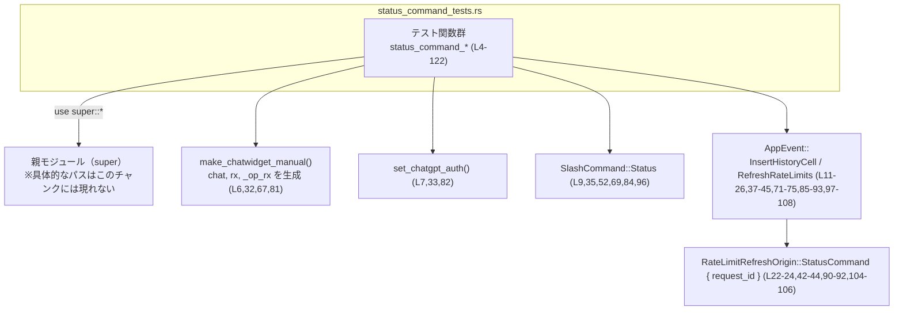
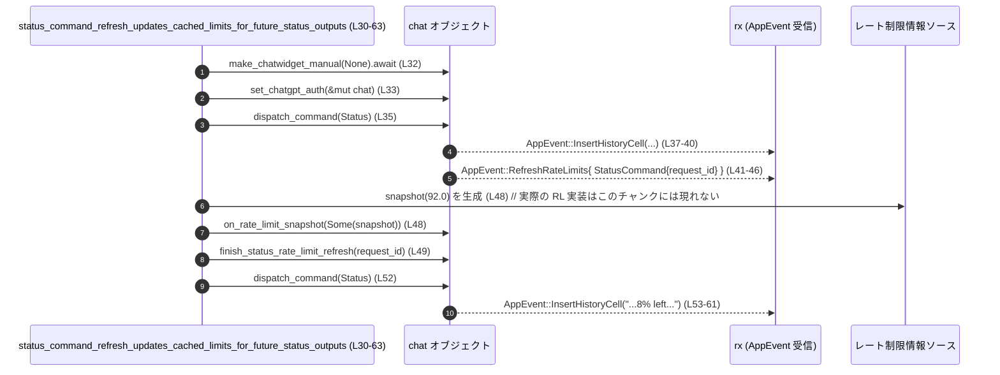

# tui/src/chatwidget/tests/status_command_tests.rs コード解説

## 0. ざっくり一言

Chat ウィジェットの `/status` コマンドについて、

- ChatGPT 認証の有無に応じたレート制限更新の振る舞い
- 画面表示テキストとレート制限リフレッシュの順序・紐付け

を検証する非同期統合テストを集めたファイルです。  
（すべて `#[tokio::test]` による async テストです。`status_command_tests.rs:L4-122`）

---

## 1. このモジュールの役割

### 1.1 概要

このテストモジュールは、Chat ウィジェットの `/status` コマンドが次を満たすことを検証します。

- ChatGPT 認証セッションでは、**即座にステータスが描画され、その後でレート制限リフレッシュ要求が送られる**（`status_command_tests.rs:L4-27`）
- リフレッシュ後に `/status` を再実行したとき、**キャッシュされたレート制限情報を用いて表示される**（`status_command_tests.rs:L30-62`）
- 非 ChatGPT セッションでは、**レート制限リフレッシュ要求を送らない**（`status_command_tests.rs:L65-76`）
- 複数の `/status` リフレッシュが重なっても、**request_id で対応づけられた出力だけが更新される**（`status_command_tests.rs:L79-121`）

### 1.2 アーキテクチャ内での位置づけ

このファイル内のテストは、親モジュール（`use super::*;`）から以下の API を利用します（定義はこのチャンクにはありません）。

- `make_chatwidget_manual`: テスト用の chat ウィジェットとイベント受信チャネル `rx` を生成（`status_command_tests.rs:L6,L32,L67,L81`）
- `set_chatgpt_auth`: chat に「ChatGPT 認証あり」の状態を設定（`status_command_tests.rs:L7,L33,L82`）
- `chat.dispatch_command(SlashCommand::Status)`: `/status` コマンドを実行（`status_command_tests.rs:L9,L35,L69,L84,L96`）
- イベント受信側 `rx.try_recv()` から `AppEvent` を取得して検証

依存関係のイメージを Mermaid で表すと次のようになります。



> 親モジュールや `make_chatwidget_manual` などの実装詳細は、このチャンクには現れません。

### 1.3 設計上のポイント

コードから読み取れる設計上の特徴は次のとおりです。

- **非同期テスト**  
  - すべての関数は `#[tokio::test] async fn` で定義され、Tokio ランタイム上で実行されます（`status_command_tests.rs:L4,L30,L65,L79`）。
- **イベント駆動 + 非ブロッキング受信**  
  - `rx.try_recv()` により非ブロッキングで `AppEvent` を取得し、`dispatch_command` 直後に必要なイベントがすでに発生していることを前提としたテストになっています（`status_command_tests.rs:L11,L21,L37,L41,L53,L71,L73,L85,L89,L97,L103`）。
- **request_id によるリフレッシュ追跡**  
  - `RateLimitRefreshOrigin::StatusCommand { request_id }` を通じて `/status` 実行ごとのレート制限リフレッシュを識別しています（`status_command_tests.rs:L22-24,L42-44,L90-92,L104-106`）。
- **内部状態の検証**  
  - `chat.refreshing_status_outputs.len()` と `is_empty()` を直接検査し、リフレッシュ完了時の内部追跡状態が期待通りクリアされることを確認しています（`status_command_tests.rs:L117,L121`）。
- **エラーハンドリング**  
  - 想定外のイベントやイベント欠如はすべて `panic!`（テスト失敗）により明示的に検出されます（`status_command_tests.rs:L15,L25,L39,L45,L57,L75,L87,L93,L101,L107`）。

---

## 2. 主要な機能一覧（コンポーネントインベントリー含む）

### 2.1 このファイル内のテスト関数一覧

| 関数名 | 役割 / テスト内容 | 行範囲 |
|--------|------------------|--------|
| `status_command_renders_immediately_and_refreshes_rate_limits_for_chatgpt_auth` | ChatGPT 認証セッションで `/status` が即時描画され、その後にレート制限リフレッシュ要求が送られること、かつ初回の `request_id` が 0 であることを確認 | `status_command_tests.rs:L4-28` |
| `status_command_refresh_updates_cached_limits_for_future_status_outputs` | `/status` 実行後に得たレート制限スナップショットがキャッシュされ、次回の `/status` 表示に反映されることを確認（例: `"8% left"` 表示） | `status_command_tests.rs:L30-63` |
| `status_command_renders_immediately_without_rate_limit_refresh` | 非 ChatGPT セッションで `/status` を実行した場合、ステータス表示は行われるがレート制限リフレッシュ要求は一切発生しないことを確認 | `status_command_tests.rs:L65-77` |
| `status_command_overlapping_refreshes_update_matching_cells_only` | `/status` を連続実行して複数のリフレッシュを並行させたとき、`request_id` の異なるリフレッシュが別々に追跡され、完了ごとに対応する出力だけが更新・解放されることを確認 | `status_command_tests.rs:L79-121` |

### 2.2 このファイルが前提とする主な機能（外部）

このファイル内には定義がありませんが、テストから読み取れる外部コンポーネントの役割です。

- `make_chatwidget_manual(/*model_override*/ None).await`  
  - chat オブジェクト・イベント受信チャネル `rx`・追加の `_op_rx` を返すテスト用ファクトリ（`status_command_tests.rs:L6,L32,L67,L81`）。
- `set_chatgpt_auth(&mut chat)`  
  - ChatGPT 認証付きセッションとして `chat` の状態を変更（`status_command_tests.rs:L7,L33,L82`）。
- `chat.dispatch_command(SlashCommand::Status)`  
  - `/status` コマンドを実行し、`AppEvent::InsertHistoryCell` および必要に応じて `AppEvent::RefreshRateLimits` を `rx` に送信することが期待されている（`status_command_tests.rs:L9,L35,L52,L69,L84,L96`）。
- `chat.on_rate_limit_snapshot(Some(snapshot(percent)))`  
  - 外部から受け取ったレート制限スナップショット（例: 92% 使用済み）を chat に通知（`status_command_tests.rs:L48,L119`）。
- `chat.finish_status_rate_limit_refresh(request_id)`  
  - 指定された `request_id` に対応する `/status` リフレッシュ完了処理（表示更新など）を行う（`status_command_tests.rs:L49,L116,L120`）。
- `drain_insert_history(&mut rx)`  
  - 残っている `AppEvent::InsertHistoryCell` を受信チャネルからすべて drain するテスト用ヘルパー（`status_command_tests.rs:L50`）。
- `lines_to_single_string(&cell.display_lines(width))`  
  - 履歴セルの表示内容を行単位のベクタから 1 つの文字列に変換（`status_command_tests.rs:L12-13,L54-55,L98-99`）。

---

## 3. 公開 API と詳細解説

このファイル自体はテストモジュールであり、新たな公開 API（ライブラリ利用者が直接使う関数や型）は定義していません。  
ただし、テストから読み取れる **外部 API の契約** が重要です。

### 3.1 型一覧（このファイルで利用している主な型）

| 名前 | 種別 | 役割 / 用途 | 定義場所 |
|------|------|-------------|----------|
| `SlashCommand` | 列挙体（推測） | チャットウィジェットのスラッシュコマンド種別。ここでは `/status` を表す `SlashCommand::Status` のみ使用 | `use super::*` 経由。具体的定義はこのチャンクには現れない（`status_command_tests.rs:L9,L35,L52,L69,L84,L96`） |
| `AppEvent` | 列挙体（推測） | TUI 側へ通知されるアプリケーションイベント。`InsertHistoryCell` と `RefreshRateLimits` バリアントを持つことが分かる | 定義はこのチャンクには現れないが、パターンマッチから読み取れる（`status_command_tests.rs:L11-15,L21-25,L37-40,L41-45,L53-57,L71-75,L85-88,L89-93,L97-101,L103-107`） |
| `RateLimitRefreshOrigin` | 列挙体（推測） | レート制限リフレッシュの起点を表す。ここでは `StatusCommand { request_id }` バリアントのみ使用 | 定義はこのチャンクには現れない。`RefreshRateLimits{ origin: StatusCommand { request_id } }` の形で利用（`status_command_tests.rs:L22-24,L42-44,L90-92,L104-106`） |
| `request_id` | 整数型（おそらく `u64` または `usize`） | `/status` 実行ごとに付与されるリフレッシュ要求 ID。重複しないことが期待される | 変数として使用（`status_command_tests.rs:L21-27,L41-46,L89-94,L103-108,L116,L120`） |
| `chat` | 型名不明 | Chat ウィジェット本体。`dispatch_command`・`on_rate_limit_snapshot`・`finish_status_rate_limit_refresh`・`refreshing_status_outputs` フィールドを持つ | `make_chatwidget_manual` の戻り値の 1 要素として得られる（`status_command_tests.rs:L6,L32,L67,L81`） |
| `rx` | 型名不明（おそらくチャネル受信側） | `AppEvent` を受信するためのチャネル。`try_recv()` メソッドを実装している | `make_chatwidget_manual` の戻り値の 1 要素として得られる（`status_command_tests.rs:L6,L32,L67,L81`） |
| `refreshing_status_outputs` | コレクション型（推測） | `/status` 実行に紐づく一時的な表示（リフレッシュ待ち）の集合。長さと空状態がテストされている | `chat` のフィールドとして参照（`status_command_tests.rs:L117,L121`） |

> 型の具体的な定義（フィールドや実装詳細）は、このチャンクには含まれていません。

### 3.2 関数詳細（テスト 4 件）

#### `status_command_renders_immediately_and_refreshes_rate_limits_for_chatgpt_auth()`

**概要**

- ChatGPT 認証済みセッションで `/status` を実行したとき、
  - まず履歴セルへの出力が発生し、
  - その後にレート制限リフレッシュ要求が送られること、
  - 初回の `request_id` が 0 であること
  を検証するテストです（`status_command_tests.rs:L4-27`）。

**引数**

なし（`#[tokio::test]` によりテストランナーから呼び出される）。

**戻り値**

- 戻り値型は `()` です。  
  すべてのアサーションが通過すればテスト成功、失敗時は `panic!` となります。

**内部処理の流れ**

1. `make_chatwidget_manual(None).await` で `chat`, `rx`, `_op_rx` を作成（`status_command_tests.rs:L6`）。
2. `set_chatgpt_auth(&mut chat)` で `chat` を ChatGPT 認証済みに設定（`status_command_tests.rs:L7`）。
3. `chat.dispatch_command(SlashCommand::Status)` で `/status` コマンドを実行（`status_command_tests.rs:L9`）。
4. `rx.try_recv()` の最初のイベントが `AppEvent::InsertHistoryCell(cell)` であることを確認し、`cell.display_lines(80)` からテキストを組み立てる（`status_command_tests.rs:L11-16`）。
5. そのテキストに `"refreshing limits"` が含まれていないことをアサート（`status_command_tests.rs:L17-20`）。
6. `rx.try_recv()` の次のイベントが `AppEvent::RefreshRateLimits { origin: RateLimitRefreshOrigin::StatusCommand { request_id } }` であることを確認し、`request_id` を取得（`status_command_tests.rs:L21-25`）。
7. その `request_id` が `0` と等しいことをアサート（`status_command_tests.rs:L27`）。

**Examples（使用例）**

このテストは `cargo test` で自動実行されます。単体で実行する場合は次のようになります。

```bash
# このファイル内の特定テストのみを実行する例（シェルコマンド）
cargo test status_command_renders_immediately_and_refreshes_rate_limits_for_chatgpt_auth
```

**Errors / Panics**

- `rx.try_recv()` が期待した種類の `AppEvent` を返さない場合、`panic!("expected ...")` によりテストが失敗します（`status_command_tests.rs:L15,L25`）。
- 最初の表示テキストに `"refreshing limits"` が含まれる場合、`assert!` が失敗しテスト失敗となります（`status_command_tests.rs:L17-20`）。
- `request_id != 0` の場合、`pretty_assertions::assert_eq!(request_id, 0)` によりテスト失敗となります（`status_command_tests.rs:L27`）。

**Edge cases（エッジケース）**

- ChatGPT 認証済みでない場合はこのテストの前提を満たさず、そもそも `set_chatgpt_auth` を呼んでいるため検査対象外です（`status_command_tests.rs:L7`）。
- `dispatch_command` が非同期にイベントを送信する設計になっていて、呼び出し直後にイベントが `rx` に届かない場合、`try_recv` が `Err` を返しテストは失敗します。  
  このテストは「`/status` のイベント送信が同期的である」という契約を前提としていると言えます。

**使用上の注意点**

- 実装側で `/status` 出力に一時的なメッセージ（例: `"refreshing limits..."`）を含めると、このテストが失敗します。  
  テストは「履歴（過去ログ）には確定した情報のみを残す」という振る舞いを固定化しています。
- `request_id` の初期値を 0 以外に変更する場合、このテストも更新する必要があります。

---

#### `status_command_refresh_updates_cached_limits_for_future_status_outputs()`

**概要**

- ChatGPT 認証済みセッションで `/status` を実行し、
  - レート制限リフレッシュ要求を送った後でスナップショットを受け取り、
  - リフレッシュ完了処理を行ったあと、
  - 再度 `/status` を実行すると、更新されたキャッシュ（例: 残り 8%）に基づいた表示になる
 ことを検証するテストです（`status_command_tests.rs:L30-62`）。

**引数 / 戻り値**

- 引数はなく、戻り値は `()` です。アサーションに失敗すると `panic!` します。

**内部処理の流れ**

1. テスト用 `chat`, `rx`, `_op_rx` を生成し、ChatGPT 認証を設定（`status_command_tests.rs:L32-33`）。
2. `/status` を 1 回実行（`status_command_tests.rs:L35`）。
3. 最初のイベントが `InsertHistoryCell` であることを確認（`status_command_tests.rs:L37-40`）。
4. 次のイベントから `first_request_id` を取得（`AppEvent::RefreshRateLimits{ origin: StatusCommand{ request_id } }`）（`status_command_tests.rs:L41-46`）。
5. `chat.on_rate_limit_snapshot(Some(snapshot(92.0)))` で「92% 使用済み」のスナップショットを通知（`status_command_tests.rs:L48`）。
6. `chat.finish_status_rate_limit_refresh(first_request_id)` で対応するリフレッシュ完了処理を行う（`status_command_tests.rs:L49`）。
7. `drain_insert_history(&mut rx)` で残っている履歴セル挿入イベントを捨てる（`status_command_tests.rs:L50`）。
8. 再度 `/status` 実行（`status_command_tests.rs:L52`）。
9. 直後の `InsertHistoryCell` イベントのテキストを取り出し、`"8% left"` を含むことを確認（`status_command_tests.rs:L53-61`）。

**Examples（使用例）**

このテストが示す典型パターンは、アプリケーション側で次のような一連の操作を行うケースです。

```rust
// ChatGPT 認証済み chat と rx（イベント受信チャネル）がある前提
chat.dispatch_command(SlashCommand::Status); // /status 実行

// ... AppEvent::RefreshRateLimits{ StatusCommand{ request_id } } を受信した後 ...

// どこか別のコンポーネントからレート制限情報を取得して通知
chat.on_rate_limit_snapshot(Some(snapshot(92.0)));

// 対応する request_id のリフレッシュ完了を通知
chat.finish_status_rate_limit_refresh(request_id);

// 以降の /status では "8% left" のような更新済み情報を表示
```

**Errors / Panics**

- 期待した `AppEvent` が来ない場合、`panic!` によるテスト失敗（`status_command_tests.rs:L39,L45,L57`）。
- 2 回目の `/status` 表示に `"8% left"` が含まれない場合、`assert!` が失敗（`status_command_tests.rs:L59-61`）。

**Edge cases（エッジケース）**

- `on_rate_limit_snapshot(None)` のようにスナップショットが得られないケースは、このテストではカバーしていません（`status_command_tests.rs:L48` は常に `Some(...)`）。
- `finish_status_rate_limit_refresh` を呼び忘れると、キャッシュ更新が表示に反映されない可能性がありますが、その振る舞いはこのチャンクだけでは断定できません。

**使用上の注意点**

- 実装側は、`request_id` ごとにレート制限情報をキャッシュし、次回 `/status` 表示で利用する設計であることが前提になります。
- 「92% 使用済み → 8% left」のようなテキストは、テストにハードコードされているため、文言フォーマットを変更する場合にはテストも更新する必要があります。

---

#### `status_command_renders_immediately_without_rate_limit_refresh()`

**概要**

- ChatGPT 認証を設定していないセッションで `/status` を実行した場合、
  - ステータス表示は行われるが、
  - `AppEvent::RefreshRateLimits` が一切発生しない
 ことを検証するテストです（`status_command_tests.rs:L65-76`）。

**内部処理の流れ**

1. `make_chatwidget_manual(None).await` で `chat`, `rx`, `_op_rx` を生成（`status_command_tests.rs:L67`）。
   - **ここでは `set_chatgpt_auth` を呼ばない点が他テストと異なります。**
2. `/status` コマンドを実行（`status_command_tests.rs:L69`）。
3. 最初の `rx.try_recv()` が `Ok(AppEvent::InsertHistoryCell(_))` であることを `assert_matches!` で確認（`status_command_tests.rs:L71`）。
4. その後 `std::iter::from_fn(|| rx.try_recv().ok())` で残りのイベントをすべて列挙し、その中に `AppEvent::RefreshRateLimits { .. }` が一つも含まれないことを `assert!` でチェック（`status_command_tests.rs:L72-75`）。

**Errors / Panics**

- 最初のイベントが `InsertHistoryCell` でない場合、`assert_matches!` によりテスト失敗（`status_command_tests.rs:L71`）。
- 以降のイベント列に `RefreshRateLimits` が含まれている場合、`assert!` が失敗（`status_command_tests.rs:L72-75`）。

**Edge cases（エッジケース）**

- イベントが 1 つだけ（`InsertHistoryCell` のみ）でも、`from_fn` のループは空のイテレータとして問題なく動作します。
- `rx.try_recv()` がエラーを返した時点でイテレーションが終了するため、「後から遅延して `RefreshRateLimits` が届く」ような非同期設計ではこのテストに合致しません。

**使用上の注意点**

- 実装側の契約として、「非 ChatGPT セッションでは `/status` によるレート制限リフレッシュを発行しない」ことが固定化されています。  
  将来仕様で挙動を変える場合、このテストも同時に更新する必要があります。

---

#### `status_command_overlapping_refreshes_update_matching_cells_only()`

**概要**

- ChatGPT 認証済みの状態で `/status` を 2 回連続で実行し、
  - それぞれ異なる `request_id` の `RefreshRateLimits` が発行されること
  - 途中で 1 つ目だけを完了させると、`refreshing_status_outputs` の長さが 1 になること
  - スナップショットと共に 2 つ目を完了すると、`refreshing_status_outputs` が空になること
  を検証するテストです（`status_command_tests.rs:L79-121`）。

**内部処理の流れ（アルゴリズム）**

1. `chat`, `rx`, `_op_rx` を生成し、ChatGPT 認証を設定（`status_command_tests.rs:L81-82`）。
2. 1 回目の `/status` 実行 → `InsertHistoryCell` を消費 → 1 つ目の `first_request_id` を取得（`status_command_tests.rs:L84-93`）。
3. 2 回目の `/status` 実行 → `InsertHistoryCell` をテキストに変換し、`"refreshing limits"` を含まないことを確認 → 2 つ目の `second_request_id` を取得（`status_command_tests.rs:L96-108`）。
4. `assert_ne!(first_request_id, second_request_id)` で 2 つの ID が異なることを確認（`status_command_tests.rs:L110`）。
5. `chat.finish_status_rate_limit_refresh(first_request_id)` を呼び、リフレッシュ中のステータス出力が 1 つだけ残っていることを `chat.refreshing_status_outputs.len() == 1` で確認（`status_command_tests.rs:L116-117`）。
6. `chat.on_rate_limit_snapshot(Some(snapshot(92.0)))` でスナップショットを設定（`status_command_tests.rs:L119`）。
7. `chat.finish_status_rate_limit_refresh(second_request_id)` を呼び、すべてのリフレッシュ済み出力が処理されて `refreshing_status_outputs.is_empty()` であることを確認（`status_command_tests.rs:L120-121`）。

**Examples（使用例）**

テストが想定している典型的なデータフローは次のようなものです。

```rust
// 2回連続で /status を投げる
chat.dispatch_command(SlashCommand::Status); // → request_id = r1
chat.dispatch_command(SlashCommand::Status); // → request_id = r2

// まず r1 のリフレッシュだけ完了させる
chat.finish_status_rate_limit_refresh(r1);
// この時点で refreshing_status_outputs.len() == 1 が期待されている

// レート制限スナップショットを設定して r2 を完了させる
chat.on_rate_limit_snapshot(Some(snapshot(92.0)));
chat.finish_status_rate_limit_refresh(r2);
// ここで refreshing_status_outputs.is_empty() が期待されている
```

**Errors / Panics**

- 1 回目または 2 回目の `/status` で期待した `AppEvent` パターンを受け取れない場合、`panic!`（`status_command_tests.rs:L87,L93,L101,L107`）。
- 2 回の `request_id` が等しい場合、`assert_ne!` によるテスト失敗（`status_command_tests.rs:L110`）。
- 1 回目完了後の `refreshing_status_outputs.len()` が 1 でない場合、`pretty_assertions::assert_eq!` によるテスト失敗（`status_command_tests.rs:L116-117`）。
- 2 回目完了後に `refreshing_status_outputs.is_empty()` が `false` の場合、`assert!` によるテスト失敗（`status_command_tests.rs:L121`）。

**Edge cases（エッジケース）**

- スナップショット通知（`on_rate_limit_snapshot`）を 1 回だけ呼んでいる点から、「スナップショットは共有状態として保持され、複数 request_id にまたがって参照される」ことが推測されますが、実装はこのチャンクにはありません。
- もし `finish_status_rate_limit_refresh` が request_id に対応しない出力を誤って削除する実装だった場合、このテストは `refreshing_status_outputs.len()` / `is_empty()` のアサーションで検出します。

**使用上の注意点**

- 実装側は、`request_id` によるリフレッシュ追跡が「1 回の `/status` 実行 = 1 request_id」であり、相互に干渉しないことを保証する必要があります。
- `refreshing_status_outputs` はテストから直接アクセスされているため、フィールド名や構造を変更する場合はテストも更新する必要があります。

---

### 3.3 その他の関数

このファイル内には、テスト関数以外の関数定義はありません。  
ただし、前述のとおり外部のヘルパー関数・メソッドが使われています。

| 関数名 | 役割（1 行） | 備考 |
|--------|--------------|------|
| `make_chatwidget_manual` | テスト用 chat ウィジェットとイベントチャネルを生成する | 定義はこのチャンクには現れない（`status_command_tests.rs:L6,L32,L67,L81`） |
| `set_chatgpt_auth` | chat を ChatGPT 認証済み状態に設定する | `status_command_tests.rs:L7,L33,L82` |
| `lines_to_single_string` | 履歴セルの表示行を 1 つの文字列に結合する | `status_command_tests.rs:L12-13,L54-55,L98-99` |
| `snapshot` | 指定パーセンテージを持つレート制限スナップショットを生成するヘルパー | `status_command_tests.rs:L48,L119` |
| `drain_insert_history` | 受信チャネルから `InsertHistoryCell` イベントをすべて捨てる | `status_command_tests.rs:L50` |

---

## 4. データフロー

代表的なシナリオとして、**ChatGPT 認証済みセッションにおける `/status` 実行 → レート制限リフレッシュ → 再度 `/status`** の流れを説明します（`status_command_refresh_updates_cached_limits_for_future_status_outputs (L30-63)` に基づく）。

1. テストが `make_chatwidget_manual` で `chat` と `rx` を取得する（`status_command_tests.rs:L32`）。
2. `set_chatgpt_auth(&mut chat)` で ChatGPT 認証を有効にする（`status_command_tests.rs:L33`）。
3. テストが `chat.dispatch_command(SlashCommand::Status)` を呼ぶと、chat は
   - `AppEvent::InsertHistoryCell`（現在のステータス表示）
   - `AppEvent::RefreshRateLimits { origin: StatusCommand { request_id } }`
   を `rx` に送信することが期待される（`status_command_tests.rs:L35-46`）。
4. その後、chat が外部のレート制限情報ソースからスナップショットを取得したと仮定し、テストが `chat.on_rate_limit_snapshot(Some(snapshot(92.0)))` を呼ぶ（`status_command_tests.rs:L48`）。
5. テストが `chat.finish_status_rate_limit_refresh(first_request_id)` を呼ぶと、chat は内部状態（キャッシュなど）を更新し、対応する `/status` 出力のリフレッシュを完了する（`status_command_tests.rs:L49`）。
6. 再度 `/status` を実行すると、chat は更新済みキャッシュに基づく新しいステータス表示（例: `"8% left"`）を `InsertHistoryCell` として生成し、`rx` から取得される（`status_command_tests.rs:L52-61`）。

### データフローのシーケンス図



> RL（レート制限情報ソース）の具体的な構造・取得方法は、このチャンクには現れません。

---

## 5. 使い方（How to Use）

ここでは、このテストファイルから読み取れる `/status` コマンドとレート制限関連 API の典型的な使い方をまとめます。

### 5.1 基本的な使用方法（ChatGPT 認証セッション）

ChatGPT 認証済みセッションで `/status` を実行し、レート制限情報の更新を反映させるまでの基本フローは次のようになります。

```rust
// 前提: make_chatwidget_manual などで chat と rx を取得済み
let (mut chat, mut rx, _op_rx) = make_chatwidget_manual(/*model_override*/ None).await; // L32 等
set_chatgpt_auth(&mut chat);                                                            // L33 等

// 1. /status を実行する
chat.dispatch_command(SlashCommand::Status);                                            // L35 等

// 2. 即座に履歴セルへの出力を受信する
let first_cell_text = match rx.try_recv() {                                             // L37 等
    Ok(AppEvent::InsertHistoryCell(cell)) => {
        lines_to_single_string(&cell.display_lines(80))                                 // L54-55 等
    }
    _ => /* エラー処理（ここではテストでは panic!） */
    _ => panic!("expected status output"),
};

// 3. 次に、レート制限リフレッシュ要求を受信する
let request_id = match rx.try_recv() {                                                  // L41 等
    Ok(AppEvent::RefreshRateLimits {
        origin: RateLimitRefreshOrigin::StatusCommand { request_id },
    }) => request_id,
    _ => panic!("expected rate-limit refresh request"),
};

// 4. 外部からレート制限スナップショットを取得し、chat に通知する
let snapshot = snapshot(92.0); // 定義はこのチャンクには現れない                      // L48
chat.on_rate_limit_snapshot(Some(snapshot));                                             // L48

// 5. 指定した request_id のリフレッシュ完了を通知
chat.finish_status_rate_limit_refresh(request_id);                                      // L49
```

このフローにより、次回 `/status` 実行時に更新済みのレート制限情報が表示されることが期待されます（`status_command_tests.rs:L52-61`）。

### 5.2 よくある使用パターン

#### パターン A: 非 ChatGPT セッションでの `/status`

非 ChatGPT セッションの場合、レート制限リフレッシュは発生しません（`status_command_tests.rs:L65-76`）。

```rust
let (mut chat, mut rx, _op_rx) = make_chatwidget_manual(None).await; // L67

// set_chatgpt_auth を呼ばないことがポイント

chat.dispatch_command(SlashCommand::Status);                          // L69

// 履歴セルは 1 つ来る
assert_matches!(rx.try_recv(), Ok(AppEvent::InsertHistoryCell(_)));  // L71

// 以降、RefreshRateLimits イベントは発生しないことが期待される
assert!(
    !std::iter::from_fn(|| rx.try_recv().ok())
        .any(|event| matches!(event, AppEvent::RefreshRateLimits { .. })), // L72-75
);
```

#### パターン B: 複数の `/status` リフレッシュを並行させる

`request_id` ごとにリフレッシュを分離する場合は、テスト 4 のように扱います（`status_command_tests.rs:L79-121`）。

```rust
let (mut chat, mut rx, _op_rx) = make_chatwidget_manual(None).await;
set_chatgpt_auth(&mut chat);

// 1回目
chat.dispatch_command(SlashCommand::Status);
let first_request_id = /* rx から RefreshRateLimits を取り出して取得 */;

// 2回目
chat.dispatch_command(SlashCommand::Status);
let second_request_id = /* 同様に取得 */;
assert_ne!(first_request_id, second_request_id); // L110

// 1回目だけ先に完了
chat.finish_status_rate_limit_refresh(first_request_id);
// refreshing_status_outputs.len() == 1 が期待される（L116-117）

// スナップショットを設定して 2回目を完了
chat.on_rate_limit_snapshot(Some(snapshot(92.0)));
chat.finish_status_rate_limit_refresh(second_request_id);
// refreshing_status_outputs.is_empty() が期待される（L119-121）
```

### 5.3 よくある間違い

このテストから推測される、起こりやすそうな誤用例と正しいパターンです。

```rust
// 間違い例: 非 ChatGPT セッションでも RefreshRateLimits が飛ぶことを期待している
let (mut chat, mut rx, _op_rx) = make_chatwidget_manual(None).await;
chat.dispatch_command(SlashCommand::Status);

// これは status_command_renders_immediately_without_rate_limit_refresh に反します（L65-76）
let _req_id = match rx.try_recv() {
    Ok(AppEvent::RefreshRateLimits { .. }) => { /* ... */ }
    _ => panic!("expected refresh request"), // 実際には panic! になる
};

// 正しい例: 非 ChatGPT セッションでは RefreshRateLimits を期待しない
let (mut chat, mut rx, _op_rx) = make_chatwidget_manual(None).await;
chat.dispatch_command(SlashCommand::Status);
assert_matches!(rx.try_recv(), Ok(AppEvent::InsertHistoryCell(_)));       // L71
assert!(
    !std::iter::from_fn(|| rx.try_recv().ok())
        .any(|event| matches!(event, AppEvent::RefreshRateLimits { .. })), // L72-75
);
```

```rust
// 間違い例: finish_status_rate_limit_refresh を呼ばずに放置する
chat.dispatch_command(SlashCommand::Status);
// ... request_id を取得したが ...
// chat.finish_status_rate_limit_refresh(request_id); を呼ばない
// → refreshing_status_outputs にエントリが残り続ける可能性がある

// 正しい例: request_id ごとに確実に完了させる
let request_id = /* RefreshRateLimits の request_id */;
chat.on_rate_limit_snapshot(Some(snapshot(92.0)));
chat.finish_status_rate_limit_refresh(request_id);
```

### 5.4 使用上の注意点（まとめ）

- **同期性の前提**  
  - テストは `dispatch_command` 呼び出し直後の `try_recv` で期待イベントが受信できることを前提としています。  
    実装を非同期キューに変更し、イベントが遅延して届くようにする場合は、テストと契約の見直しが必要です。
- **ChatGPT 認証フラグの重要性**  
  - ChatGPT 認証の有無により、`RefreshRateLimits` イベントの有無が変わります（`status_command_tests.rs:L7,L33,L82` 対 `L67`）。  
    認証状態の管理が正しくないと、ステータス表示やリフレッシュ挙動に影響します。
- **request_id の一意性**  
  - `assert_ne!(first_request_id, second_request_id)` により、連続 `/status` 実行で request_id が異なることが契約化されています（`status_command_tests.rs:L110`）。
- **内部フィールドへの依存**  
  - テストが `chat.refreshing_status_outputs` フィールドに直接アクセスしているため、型やフィールド名の変更はテスト更新を伴います（`status_command_tests.rs:L117,L121`）。

---

## 6. 変更の仕方（How to Modify）

### 6.1 新しい機能を追加する場合（例: /status の追加情報）

`/status` コマンドに新しい情報（例: モデル名や接続状態）を追加したい場合、次のようなステップが考えられます。

1. **実装側の変更**
   - 親モジュール（`use super::*;` の側）で `/status` の表示ロジックを拡張し、新しい情報を `InsertHistoryCell` の表示テキストに含めます。
   - レート制限や request_id の扱いは現行契約に従って維持します。

2. **テスト追加**
   - 本ファイルと同様に `#[tokio::test]` のテストを新規追加し、
     - `dispatch_command(SlashCommand::Status)` 実行
     - `AppEvent::InsertHistoryCell` のテキスト取得
     - 新しい情報（例: `"model: gpt-4"`）が含まれているかを `assert!(text.contains("..."))` で検証
   - 必要に応じて、ChatGPT 認証の有無それぞれについてテストを追加します。

3. **既存テストとの整合性確認**
   - 既存のテキストに `"8% left"`・`"refreshing limits"` が含まれる/含まれないなどの条件があるため、新しい情報追加によってこれらの条件が変化しないことを確認します。

### 6.2 既存の機能を変更する場合

例えば、「非 ChatGPT セッションでもレート制限リフレッシュを行う」よう仕様変更する場合:

- **影響範囲の確認**
  - テスト `status_command_renders_immediately_without_rate_limit_refresh`（`status_command_tests.rs:L65-76`）が直接影響を受けます。
  - 他のテスト（特に 1, 2, 4）の前提（ChatGPT セッションのみリフレッシュ）とも整合性を確認します。

- **契約の更新**
  - `AppEvent::RefreshRateLimits` がどの条件で送られるか、仕様として再定義し、テストの期待値を変更します。
  - 必要ならば `RateLimitRefreshOrigin` に新しいバリアント（例: `ManualCommand`）を追加しテスト側も更新します（ただし、これはこのチャンクでは確認できないため、実装側を参照する必要があります）。

- **テスト実行と回帰確認**
  - `cargo test` を実行して、関連テストが新しい仕様どおりに動作することを確認します。

---

## 7. 関連ファイル

このモジュールと密接に関係するファイル・ディレクトリは、コードから次のように推測できます。

| パス | 役割 / 関係 |
|------|------------|
| （不明: `use super::*` の親モジュール） | Chat ウィジェット本体・`SlashCommand`・`AppEvent`・`RateLimitRefreshOrigin`・`make_chatwidget_manual` などの定義を提供するモジュール。具体的なファイルパスはこのチャンクには現れません（`status_command_tests.rs:L1`）。 |
| tui/src/chatwidget/tests/status_command_tests.rs | 本ファイル。Chat ウィジェットの `/status` コマンドとレート制限リフレッシュの振る舞いを検証する async テストを集めたモジュールです。 |

> 具体的な親モジュールのパスや構造（例: `tui/src/chatwidget/mod.rs` など）は、このチャンクだけでは判断できないため「不明」としています。

---

## Bugs / Security / Contracts / Edge Cases / Performance まとめ

- **Bugs（潜在的な問題）**
  - テストは `rx.try_recv()` に依存しているため、`dispatch_command` の実装が将来「イベントを非同期に遅延送信する」形に変わると、実装として問題がなくてもテストが失敗する可能性があります。この点は設計変更時に注意が必要です。
- **Security**
  - 本ファイルはテストコードであり、直接的なセキュリティ上の副作用はありません。
- **Contracts**
  - ChatGPT 認証セッションでは `/status` 実行時に必ず `InsertHistoryCell` → `RefreshRateLimits(StatusCommand{request_id})` の順にイベントが出る（`status_command_tests.rs:L11-27,L37-46,L84-93,L97-108`）。
  - 非 ChatGPT セッションでは `/status` 実行時に `RefreshRateLimits` は一切出ない（`status_command_tests.rs:L65-76`）。
  - `request_id` は実行ごとに異なり、追跡と完了処理は `request_id` ベースで行う（`status_command_tests.rs:L89-94,L103-108,L110,L116,L120`）。
- **Edge Cases**
  - レート制限スナップショットが `None` の場合や、外部エラーが発生した場合の挙動はこのファイルではカバーされていません。
- **Performance / Scalability**
  - テストコード自体は小規模で、パフォーマンス問題は特にありません。  
    実装側では `/status` のたびにレート制限リフレッシュを要求する設計であり、高頻度に `/status` を呼ぶ場合のコストは別途考慮が必要ですが、その詳細はこのチャンクからは分かりません。
