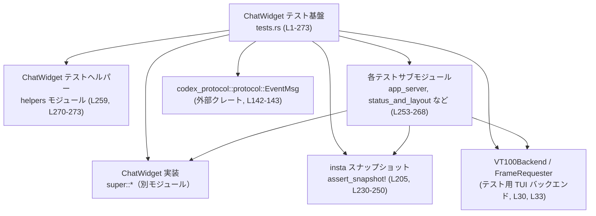
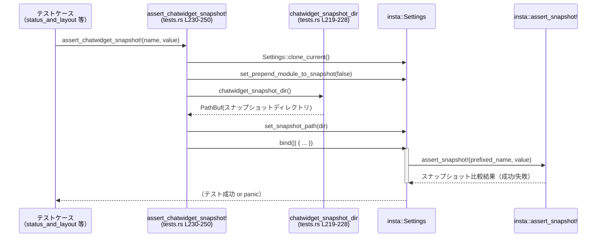

# tui/src/chatwidget/tests.rs

## 0. ざっくり一言

`ChatWidget` のテスト用に、**共通インポートとスナップショット検証マクロ**をまとめたハブモジュールです。  
個々のテストケースはサブモジュール（`app_server`, `status_and_layout` など）に分割され、このファイルの再エクスポートとマクロを通じて共通のスタイルで `ChatWidget` の描画とイベント処理を検証します（tui/src/chatwidget/tests.rs:L1-5, L253-268）。

---

## 1. このモジュールの役割

### 1.1 概要

- このモジュールは **`ChatWidget` の TUI 表示とイベント処理のテスト**を行うための共通基盤を提供します（L1-5）。
- 具体的には次の機能を担います。
  - テストで頻繁に使う型・関数・定数の **再エクスポート**（`pub(super) use ...`）による便利な名前空間の提供（L7-217）。
  - `insta` クレートを用いた **スナップショットテストのためのディレクトリ解決とマクロラッパ**（`chatwidget_snapshot_dir`, `assert_chatwidget_snapshot!`）（L219-251）。
  - テスト群を **関心ごとごとのサブモジュール**に分割したエントリポイント（L253-268）。
  - 共通ヘルパー関数の再エクスポート（L270-273）。

### 1.2 アーキテクチャ内での位置づけ

このファイルは `ChatWidget` テスト用の「ルートモジュール」であり、実装側の `ChatWidget` や `codex_protocol::protocol::EventMsg`、`insta` などとテストコードの間に位置します。



- サブモジュール（`mod app_server;` 等）は、このルートモジュールの直下に定義されており、このファイルの再エクスポートを前提に実際のテストケースを実装します（L253-268）。
- `super::*` により、`ChatWidget` 本体とその周辺 API へアクセスします（L7）。
- `insta` の設定をカプセル化するマクロにより、**テスト全体でスナップショットの保存先と命名規約を統一**しています（L230-250）。

### 1.3 設計上のポイント

コードから読み取れる特徴を整理します。

- **テスト用名前空間の集約**  
  - 多数の `pub(super) use` により、テストでよく使う型（`EventMsg`, `AppEvent`, `VT100Backend` など）を一箇所にまとめています（L7-217）。
  - サブモジュールからは `crate::chatwidget::tests::*` を import するだけで、多くの依存型にアクセスできます。

- **スナップショットテストの一貫性**  
  - `chatwidget_snapshot_dir` でテスト用スナップショットディレクトリを一意に決定し（L219-228）、
  - `assert_chatwidget_snapshot!` マクロ内で `insta::Settings` を構成してから `insta::assert_snapshot!` を呼ぶ形に統一しています（L230-250）。
  - スナップショット名も `"codex_tui__chatwidget__tests__{name}"` に統一されます（L236, L245）。

- **パニックを用いたテスト失敗の表現**  
  - スナップショットリソースが見つからない場合の `.expect("snapshot file")`（L220-223）、
  - 親ディレクトリが無い場合の `unwrap_or_else(|| panic!(...))`（L225-227）により、前提が崩れた場合はテスト自体をパニックで明示的に失敗させます。

- **並行性の前提の準備のみ**  
  - `tokio::sync::mpsc::unbounded_channel` や `TryRecvError` を再エクスポートしており（L215-216）、チャットウィジェットのテストで非同期メッセージングを扱う準備がされていますが、このファイル内で直接チャネル操作は行っていません。

---

## 2. 主要な機能一覧（コンポーネントインベントリー）

このファイル自身が定義・宣言している主なコンポーネントは次のとおりです。

- **テスト用共通インポート**
  - `pub(super) use super::*;` を含む多数の `pub(super) use` により、テストで必要な型を集約（L7-217）。
- **関数**
  - `chatwidget_snapshot_dir() -> PathBuf`  
    - スナップショットファイル群の格納ディレクトリを特定するヘルパー（L219-228）。
- **マクロ**
  - `assert_chatwidget_snapshot!`  
    - `insta` の設定（パス・名前）を固定した `assert_snapshot!` ラッパーマクロ（L230-250）。
- **テストサブモジュール**
  - `mod app_server;`（L253）
  - `mod approval_requests;`（L254）
  - `mod background_events;`（L255）
  - `mod composer_submission;`（L256）
  - `mod exec_flow;`（L257）
  - `mod guardian;`（L258）
  - `mod helpers;`（L259）
  - `mod history_replay;`（L260）
  - `mod mcp_startup;`（L261）
  - `mod permissions;`（L262）
  - `mod plan_mode;`（L263）
  - `mod popups_and_settings;`（L264）
  - `mod review_mode;`（L265）
  - `mod slash_commands;`（L266）
  - `mod status_and_layout;`（L267）
  - `mod status_command_tests;`（L268）
- **ヘルパー再エクスポート**
  - `pub(crate) use helpers::make_chatwidget_manual_with_sender;`（L270）
  - `pub(crate) use helpers::set_chatgpt_auth;`（L271）
  - `pub(crate) use helpers::set_fast_mode_test_catalog;`（L272）
  - `pub(super) use helpers::*;`（L273）

> `helpers` 内の各関数の具体的な実装は、このチャンクには含まれていません。

---

## 3. 公開 API と詳細解説

### 3.1 型一覧（構造体・列挙体など）

このファイル内で**新たに定義されている構造体・列挙体はありません**。  
大量の `pub(super) use` は、他モジュール・外部クレートの型を再エクスポートしているだけです（L7-217）。

このファイルで定義される主な要素は関数・マクロ・モジュールです。

| 名前 | 種別 | 役割 / 用途 | 根拠 |
|------|------|-------------|------|
| `chatwidget_snapshot_dir` | 関数 | `ChatWidget` テスト用スナップショットディレクトリの `PathBuf` を返す | L219-228 |
| `assert_chatwidget_snapshot!` | マクロ | `insta` スナップショットアサーションの設定を共通化するラッパー | L230-250 |
| `app_server` 〜 `status_command_tests` | サブモジュール | `ChatWidget` のさまざまな側面をテストするモジュール群 | L253-268 |
| `make_chatwidget_manual_with_sender` | 関数（再エクスポート） | `ChatWidget` と関連オブジェクトを構築するテストヘルパー（詳細は不明） | L270 |
| `set_chatgpt_auth` | 関数（再エクスポート） | 認証設定関連のテストヘルパー（詳細は不明） | L271 |
| `set_fast_mode_test_catalog` | 関数（再エクスポート） | モデルカタログ設定関連のテストヘルパー（詳細は不明） | L272 |

> 再エクスポートされているヘルパーの具体的なシグネチャや挙動は、このファイルからは分かりません。

---

### 3.2 関数・マクロ詳細

#### `chatwidget_snapshot_dir() -> PathBuf`

**概要**

- `ChatWidget` テスト用に、スナップショットファイルが保存されているディレクトリを返します（L219-228）。
- `insta` のスナップショット機能のために使用されます（`assert_chatwidget_snapshot!` 内で利用, L234, L242）。

**シグネチャ**

```rust
pub(super) fn chatwidget_snapshot_dir() -> PathBuf
```

（tui/src/chatwidget/tests.rs:L219）

**戻り値**

- `PathBuf`: `"src/chatwidget/snapshots/codex_tui__chatwidget__tests__chatwidget_tall.snap"` というリソースファイルの親ディレクトリ（L220-222, L224-227）。

**内部処理の流れ**

1. `codex_utils_cargo_bin::find_resource!` マクロを使って、指定されたスナップショットファイルを探索します（L220-222）。
2. 見つからなかった場合は `.expect("snapshot file")` によりパニックを起こします（L220-223）。
3. 見つかったパスから `.parent()` で親ディレクトリを取得します（L224-225）。
4. 親ディレクトリが無い場合は `unwrap_or_else` 内で `panic!` を呼びます（L225-227）。
5. 親ディレクトリを `to_path_buf()` で `PathBuf` に変換し、返却します（L227）。

**使用例**

`assert_chatwidget_snapshot!` マクロ内での利用例（簡略化）:

```rust
let mut settings = insta::Settings::clone_current();
settings.set_snapshot_path(crate::chatwidget::tests::chatwidget_snapshot_dir());
```

（実コード: L231-235, L240-242）

**Errors / Panics**

- `codex_utils_cargo_bin::find_resource!` がファイルを見つけられない場合、`.expect("snapshot file")` によりパニックが発生します（L220-223）。
- `snapshot_file.parent()` が `None` を返した場合（パスがルート等の場合）、`unwrap_or_else` により `panic!("snapshot file has no parent: ...")` が発生します（L225-227）。
- これらのパニックは **テスト環境の前提条件が満たされていないことを示すためのもの**であり、正常ケースでは発生しない想定です。

**Edge cases（エッジケース）**

- **指定ファイルが存在しない**  
  - テスト用リソースの配置やビルド設定が壊れている場合に該当します。  
  - この場合テストプロセスがパニックし、問題に気付きやすくなっています（L220-223）。
- **パスに親ディレクトリがない**  
  - 通常のファイルパスでは起こりにくいケースですが、安全策としてチェックし、パニックします（L225-227）。

**使用上の注意点**

- この関数は **テスト用にのみ想定**されており、`pub(super)` 可視性からも分かるように、`chatwidget` モジュール内のテストコード以外からの利用は想定されていません（L219）。
- 前提として、ビルド時に指定されたスナップショットファイルがリソースとしてバンドルされている必要があります（L220-222）。
- パニックを伴うため、プロダクションコードから呼び出すべきではありません。

---

#### `assert_chatwidget_snapshot!`

**概要**

- `insta::assert_snapshot!` をラップし、`ChatWidget` テスト専用の設定（スナップショットパスとスナップショット名のプレフィックス）を自動付与するマクロです（L230-250）。
- 2 つのオーバーロードを持ちます。
  - `($name:expr, $value:expr)` 形式
  - `($name:expr, $value:expr, @$snapshot:literal)` 形式（インラインスナップショット）

**定義（抜粋）**

```rust
macro_rules! assert_chatwidget_snapshot {
    ($name:expr, $value:expr $(,)?) => {{
        let mut settings = insta::Settings::clone_current();
        settings.set_prepend_module_to_snapshot(false);
        settings.set_snapshot_path(crate::chatwidget::tests::chatwidget_snapshot_dir());
        settings.bind(|| {
            insta::assert_snapshot!(format!("codex_tui__chatwidget__tests__{}", $name), $value);
        });
    }};
    ($name:expr, $value:expr, @$snapshot:literal $(,)?) => {{
        let mut settings = insta::Settings::clone_current();
        settings.set_prepend_module_to_snapshot(false);
        settings.set_snapshot_path(crate::chatwidget::tests::chatwidget_snapshot_dir());
        settings.bind(|| {
            insta::assert_snapshot!(
                format!("codex_tui__chatwidget__tests__{}", $name),
                &($value),
                @$snapshot
            );
        });
    }};
}
```

（L230-250）

**引数**

| 引数名 | 型 | 説明 |
|--------|----|------|
| `$name` | 任意の式（通常は `&str` や `String`） | スナップショットの論理名。`"codex_tui__chatwidget__tests__"` が前置されます（L236, L245）。 |
| `$value` | 任意の式 | スナップショットの対象となる値。`insta` が `Debug` 等を用いてシリアライズします（L236-237, L245-247）。 |
| `$snapshot` | 文字列リテラル | インラインスナップショットの内容（2 番目のパターンのみ, L239-248）。 |

**内部処理の流れ**

1. `insta::Settings::clone_current()` で現在の設定をコピーします（L232, L240）。
2. `set_prepend_module_to_snapshot(false)` により、`insta` が自動でモジュール名をスナップショット名に付けないようにします（L233, L241）。
3. `set_snapshot_path(chatwidget_snapshot_dir())` でスナップショットディレクトリを `chatwidget_snapshot_dir` に固定します（L234, L242）。
4. `settings.bind(|| { ... })` で、この設定を有効にしたスコープ内で `insta::assert_snapshot!` を実行します（L235, L243）。
5. `format!("codex_tui__chatwidget__tests__{}", $name)` で実際のスナップショット名を生成し（L236, L245）、`$value` とともに `insta::assert_snapshot!` に渡します（L236-237, L245-247, L248）。

**使用例**

基本形（外部ファイルスナップショット）:

```rust
#[test]
fn renders_initial_view() {
    let rendered = "some rendered output"; // 実際には ChatWidget 描画結果など
    assert_chatwidget_snapshot!("initial_view", rendered);
}
```

- このとき、`insta` は `chatwidget_snapshot_dir()` が返すディレクトリ配下に  
  `"codex_tui__chatwidget__tests__initial_view.snap"` のようなファイルを作成・比較します（L234-237）。

インラインスナップショット形:

```rust
#[test]
fn small_value_inline_snapshot() {
    let value = "short";
    assert_chatwidget_snapshot!("inline_example", value, @"short");
}
```

- この形式では、期待値がソースコード内に直接埋め込まれます（L239-248）。

**Errors / Panics**

- 内部で使用する `chatwidget_snapshot_dir()` が前提条件を満たさない場合（リソースファイルがないなど）、その段階でパニックします（L219-227）。
- `insta::assert_snapshot!` 自体は、スナップショットとの差異がある場合に **テスト失敗（panic）** を引き起こします（`insta` の標準仕様、L236-237, L245-248 の呼び出し）。
- マクロ展開・コンパイル自体は通常の Rust マクロと同じ扱いで、型ミスマッチなどがあればコンパイルエラーになります。

**Edge cases（エッジケース）**

- **`$name` にスラッシュなどファイル名に不適切な文字を含める場合**  
  - `format!` による単純な文字列結合しか行っていないため、`$name` の内容がそのままファイル名に影響します（L236, L245）。  
  - 実際にどこまで許容されるかは OS や `insta` 側の処理に依存しますが、テスト側で安全な名前を選ぶ必要があります。
- **`$value` が `Debug` 実装を持たない型の場合**  
  - `insta::assert_snapshot!` でのシリアライズに失敗し、コンパイルエラー/実行時エラーとなる可能性があります。  
  - このファイルからは `insta` の内部仕様までは分かりませんが、一般に `insta` は `Debug` 出力等を利用します。

**使用上の注意点**

- **`insta` 以外のスナップショットスタイルと混在させない**方が、テストの一貫性が保てます（このマクロが `snapshot_path` と名前付けを統一しているため, L232-237, L240-248）。
- 複数のスナップショットを同じ `$name` で保存すると、ファイルが上書きされるため、各テストケースで `$name` を一意にする必要があります。
- 並行実行されるテストにおいても、`insta` のスナップショットファイル書き込みは同一ファイルに対して競合しうるため、同名スナップショットを複数のテストで共有しないことが重要です（このファイル自体は並行性制御を行っていません）。

---

### 3.3 その他の関数・再エクスポート

このファイルでは、多くのヘルパーや型を再エクスポートしていますが、実装は他のモジュールにあります。

| 名前 | 種別 | 役割（このファイルから分かる範囲） | 根拠 |
|------|------|--------------------------------------|------|
| `make_chatwidget_manual_with_sender` | 関数（helpers から再エクスポート, `pub(crate)`） | `helpers` モジュール内で定義された、`ChatWidget` と送信チャネルなどを構築するヘルパーと推測されるが、実装はこのチャンクにはない | L270 |
| `set_chatgpt_auth` | 関数（helpers から再エクスポート, `pub(crate)`） | 認証設定に関するテストヘルパーと推測されるが、実装は不明 | L271 |
| `set_fast_mode_test_catalog` | 関数（helpers から再エクスポート, `pub(crate)`） | モデルや設定カタログの「fast mode」向け設定を行うヘルパーと推測されるが、実装は不明 | L272 |
| `helpers::*` | 再エクスポート（`pub(super)`） | `helpers` サブモジュールに定義されたテストユーティリティ群を、`chatwidget::tests` 内全体で利用可能にする | L273 |

> 上記 3 関数については、**名称からの推測は可能ですが、実際の引数や戻り値、詳細な挙動はコードから確認できないため断定できません**。

---

## 4. データフロー

ここでは、このファイルが関与する代表的な処理シナリオとして  
**「`ChatWidget` を描画し、その結果をスナップショット検証するテスト」**のデータフローを説明します。

1. テストサブモジュール（例: `status_and_layout`）内で、`ChatWidget` を構築し、イベントを流して画面を描画します（実装は別ファイル）。
2. 描画結果（文字列・構造体など）をテストコードが取得します。
3. テストコードは `assert_chatwidget_snapshot!("some_name", rendered_value)` を呼びます（L230-238）。
4. `assert_chatwidget_snapshot!` は `insta::Settings` を構築し、スナップショットパスを `chatwidget_snapshot_dir()` に設定します（L232-235, L240-243）。
5. 設定されたスコープの中で `insta::assert_snapshot!` が呼ばれ、スナップショットファイルとの比較・更新を行います（L236-237, L245-248）。



このシーケンス図は **tests.rs (L219-250)** 内で完結する処理の流れを表しています。  
実際の `ChatWidget` 描画やイベント処理は `super::*` や `helpers`、各サブモジュール側で行われます（L7, L259-273）。

---

## 5. 使い方（How to Use）

### 5.1 基本的な使用方法

`ChatWidget` の描画結果などをスナップショットで検証するテストは、次のような流れになります。

```rust
// テストモジュールの先頭で tests モジュールをインポートする（例）
use crate::chatwidget::tests::*;

// 例: シンプルなスナップショットテスト
#[test]
fn example_snapshot_test() {
    // 実際には ChatWidget を構築し、描画した結果などをここで得る
    let rendered_output = "some rendered output";

    // スナップショット検証を行う
    assert_chatwidget_snapshot!("example_snapshot", rendered_output);
}
```

- 実際の `ChatWidget` 構築やイベント送信は `helpers::make_chatwidget_manual_with_sender` 等のヘルパーと組み合わせて行われますが、その詳細は別モジュールになります（L259-273）。

### 5.2 よくある使用パターン

1. **外部ファイルスナップショットによるレイアウト検証**

   - レンダリング結果が大きい場合、ファイルベースのスナップショットが適しています。

   ```rust
   #[test]
   fn layout_snapshot() {
       let rendered = "..."; // 大きな TUI レイアウト
       assert_chatwidget_snapshot!("layout_initial", rendered);
   }
   ```

2. **インラインスナップショットによる小さな値の検証**

   - 小さな文字列などを検証する場合は、インラインスナップショットが便利です。

   ```rust
   #[test]
   fn inline_small_value() {
       let value = "short";
       assert_chatwidget_snapshot!("small_inline", value, @"short");
   }
   ```

### 5.3 よくある間違い

このファイルの設計から推測される、起こりそうな誤用パターンを挙げます。

```rust
// 誤り例: insta::assert_snapshot! を直接呼んでしまう
// これだと snapshot_path や名前付けの規約が tests.rs と揃わない
#[test]
fn wrong_usage() {
    let rendered = "output";
    insta::assert_snapshot!("my_snapshot", rendered); // パスが標準のままになる
}

// 正しい例: assert_chatwidget_snapshot! を経由する
#[test]
fn correct_usage() {
    let rendered = "output";
    assert_chatwidget_snapshot!("my_snapshot", rendered); // パスと名前付けが統一される
}
```

### 5.4 使用上の注意点（まとめ）

- スナップショット名（`$name`）は **テスト全体で一意**になるように付ける必要があります（L236, L245）。
- スナップショットファイルが格納されるディレクトリは `chatwidget_snapshot_dir()` によって決まり、  
  ハードコードされたベースファイル `"codex_tui__chatwidget__tests__chatwidget_tall.snap"` の位置に依存します（L220-222）。
- テストファイルからは、`use crate::chatwidget::tests::*;` のようにこのモジュールをインポートすると、多くの型・ヘルパーが一度に利用可能になりますが、**名前の衝突には注意**が必要です（L7-217, L270-273）。
- 並行テスト実行時に同じスナップショット名を複数テストが共有すると、ファイルを書き換え合う可能性があります。

---

## 6. 変更の仕方（How to Modify）

### 6.1 新しい機能（テストサブモジュール）を追加する場合

新しいカテゴリのテストを追加したい場合、一般的には次のステップになります。

1. **新しいサブモジュールのファイルを作成**  
   - 例: `tui/src/chatwidget/tests/new_feature.rs` を作成。
2. **tests.rs に `mod new_feature;` を追加**  
   - 既存の `mod` 群（L253-268）の末尾などに追記します。
3. **新サブモジュール内で `ChatWidget` のテストを書く**  
   - 冒頭で `use crate::chatwidget::tests::*;` を書き、`assert_chatwidget_snapshot!` やヘルパーを利用します（L230-250, L270-273）。

### 6.2 既存の機能を変更する場合

- **スナップショットディレクトリを変更する場合**
  - `chatwidget_snapshot_dir` 内のリソースパス文字列（L220-222）と、それに対応する実際のファイル配置を変更する必要があります。
  - テストで参照する既存スナップショットファイルの位置も変わるため、影響範囲は大きくなります。
- **スナップショット名のプレフィックスを変更したい場合**
  - `assert_chatwidget_snapshot!` 内の `format!("codex_tui__chatwidget__tests__{}", $name)` を変更します（L236, L245）。
  - 既存スナップショットのファイル名も合わせて変更する必要があります。
- **ヘルパー関数の追加・変更**
  - 新しいヘルパーを `helpers` モジュールに追加し、それを `pub(crate) use helpers::...;` で再エクスポートすれば、他のテストから簡単に利用できるようになります（L259, L270-273）。

---

## 7. 関連ファイル

このモジュールと密接に関係するファイル・ディレクトリは次のとおりです。

| パス | 役割 / 関係 |
|------|------------|
| `tui/src/chatwidget/mod.rs` など | `super::*` でインポートされる `ChatWidget` 本体や関連型を定義するモジュール（L7）。 |
| `tui/src/chatwidget/tests/helpers.rs` | `mod helpers;` で参照されるテスト用ヘルパー群。`make_chatwidget_manual_with_sender` などを定義（L259, L270-273）。 |
| `tui/src/chatwidget/tests/app_server.rs` | `mod app_server;`。アプリサーバ関連の `ChatWidget` テスト（L253）。 |
| `tui/src/chatwidget/tests/status_and_layout.rs` | `mod status_and_layout;`。ステータス表示やレイアウトに関するテスト（L267）。 |
| `tui/src/chatwidget/tests/status_command_tests.rs` | `mod status_command_tests;`。ステータスコマンド関連のテスト（L268）。 |
| `src/chatwidget/snapshots/codex_tui__chatwidget__tests__chatwidget_tall.snap` | `chatwidget_snapshot_dir` が基準とするスナップショットファイル。親ディレクトリがスナップショットディレクトリとして利用されます（L220-227）。 |
| 外部クレート `insta` | スナップショットテストを提供するクレート。`assert_chatwidget_snapshot!` から利用（L205, L230-250）。 |
| 外部クレート `tokio::sync::mpsc` | 非同期メッセージング用のチャネル。テストサブモジュール内で `ChatWidget` の非同期イベント処理検証に使用される可能性があります（L215-216）。 |

このファイルは、これら関連モジュール・ファイルの「結節点」として機能し、`ChatWidget` テスト全体の一貫性と共通設定を担っています。
