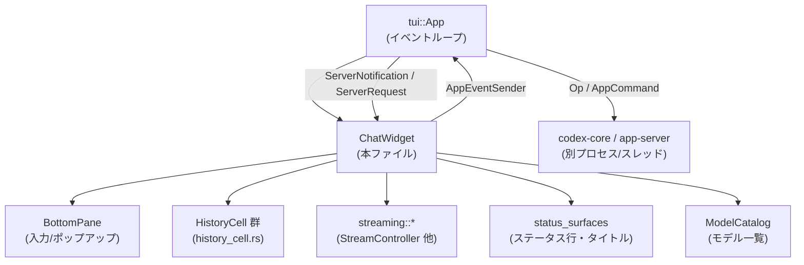
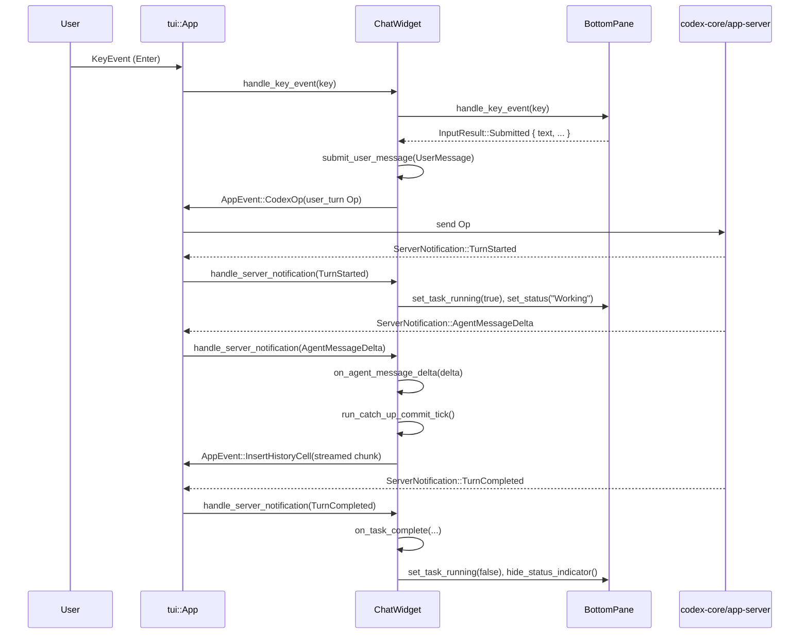

tui/src/chatwidget.rs

---

## 0. ざっくり一言

このファイルは、Codex TUI のチャット画面全体の UI 状態とインタラクションを管理する「中枢コンポーネント `ChatWidget`」を定義し、  
ユーザー入力（キーボード）と codex-core / app-server からのイベントを受けて、履歴セル・ボトムペイン・ステータスライン・ターミナルタイトルなどを更新する役割を持ちます。

※ 行番号情報はチャンクに含まれていないため、以降の「根拠行番号」はファイル名のみを記載し、`Lxx-yy` は「不明」とします。

---

## 1. このモジュールの役割

### 1.1 概要

このモジュールは **TUI チャット画面のセッション単位 UI 状態** を保持し、以下を行います。

- ユーザーからのキー入力 → 送信テキスト・画像添付・スラッシュコマンドなどに変換
- codex-core / app-server からの **プロトコルイベント** を受け取り、履歴セル・ステータス・ボトムペインを更新
- ストリーミング出力（通常回答・プラン・ツール実行）の **チャンクバッファリングとコミットタイミング制御**
- タスク実行中スピナー、割り込み（Ctrl+C/Esc）、マルチエージェント（コラボ）や MCP 起動状態、レートリミット警告などの **派生 UI 状態管理**

### 1.2 アーキテクチャ内での位置づけ

主な依存関係（呼び出し方向）を簡略化すると次のようになります。



- `App` から見ると、`ChatWidget` は「チャット画面の 1 セッション分の UI 状態」をカプセル化したコンポーネントです。
- 入力系 (`BottomPane`) と履歴描画 (`HistoryCell` 群) の上に、プロトコルイベント処理・ストリーム制御・補助 UI（ステータス・タイトルなど）が載っている構造になっています。

### 1.3 設計上のポイント

コードから読み取れる設計上の特徴は以下の通りです（すべて `tui/src/chatwidget.rs`）。

- **状態フルな UI オーケストレータ**
  - `ChatWidget` は 100 以上のフィールドを持ち、タスク状態、MCP 起動状態、レートリミット、ストリーム状態、コラボモード、リアルタイム会話などを一括管理します。
- **イベント駆動 + 逐次処理**
  - ユーザー入力ハンドラ `handle_key_event` とサーバ通知ハンドラ `handle_server_notification` が主要な入口です。
  - いずれも `&mut self` で同期的に実行され、内部ミューテックスや `unsafe` は使用していません。
- **ストリーミングと割り込みの調停**
  - `StreamController` / `PlanStreamController` により出力チャンクをバッファし、`run_commit_tick/run_catch_up_commit_tick` でコミットタイミングを制御。
  - ストリーム中は割り込み系イベントを `InterruptManager` に積み、ストリーム完了時に順序を保ったままフラッシュします。
- **エラー／レートリミット処理の集中**
  - `handle_non_retry_error`, `on_server_overloaded_error`, `on_rate_limit_snapshot` などで、RateLimit 種別やステータスに応じた UI 表示を統一管理しています。
- **Rust 安全性の利用**
  - 共有状態は `Arc` と `AtomicBool` を用いたラッチ（「このセッションで一度だけ warn」）程度に限定され、主な状態は `ChatWidget` の所有下にあります。
  - 非同期処理は `tokio::spawn` によるバックグラウンドタスクで行い、UI スレッドとはチャネル (`AppEventSender`) を介して連携します。

---

## 2. 主要な機能一覧

このモジュールが提供する主な機能は以下です。

- 入力処理
  - キー入力ハンドリング (`handle_key_event`)
  - スラッシュコマンド受理・ディスパッチ
  - 外部エディタ／ペーストバースト／画像添付のサポート
- 出力 / 履歴管理
  - `HistoryCell` による履歴セル構築（ユーザメッセージ・エージェント応答・exec/MCP/WebSearch/Hook/レビューなど）
  - ストリーミング出力の一時バッファリングとコミット
  - 実行コマンドや MCP ツール、コラボエージェントの進捗表示
- ステータス・インジケータ
  - タスク中スピナー／「Working」「Thinking」等のヘッダ、詳細行の更新 (`set_status`)
  - MCP サーバ起動状態の集約と完了検出
  - Guardian レビュー中のフッタ表示（複数レビューの要約）
- レートリミットとモデル選択
  - RateLimit スナップショットの保持・警告メッセージ生成 (`RateLimitWarningState`)
  - レートリミット悪化時の「低コストモデル」切り替えプロンプト
  - モデル／推論レベル／コラボレーションモードのポップアップ UI
- 入力キューとステア（steer）処理
  - ターン中に送られた「追記指示」（steer）のキュー管理
  - ターン終了後の自動再送／インタラプト後のドラフト復元
- リアルタイム会話・オーディオ
  - RealtimeConversation UI 状態の持ち方と、音声デバイス選択ポップアップ
- Windows サンドボックス・権限設定
  - Approvals preset, SandboxPolicy, Guardian reviewer の組合わせを選ぶ UI
  - Windows 特有のサンドボックスセットアップフローと警告ダイアログ（world-writable, full-access）

---

## 3. 公開 API と詳細解説

### 3.1 型一覧（主要構造体・列挙体）

※ 行番号はチャンクに含まれていないため、`L?` と記載します。

| 名前 | 種別 | 役割 / 用途 | 定義位置（概略） |
|------|------|-------------|------------------|
| `ChatWidgetInit` | 構造体 | `ChatWidget` を生成する際の共通初期化パラメータ（`Config`, `FrameRequester`, `AppEventSender` など）をまとめる | `tui/src/chatwidget.rs:L?` |
| `ChatWidget` | 構造体 | チャット画面 1 セッション分の UI 状態と状態遷移を保持し、キー入力・サーバイベントを処理する中枢 | 同上 |
| `CodexOpTarget` | enum | `ChatWidget` が codex-core へ `Op` を直接送るか、`AppEvent` 経由で送るかを表す | 同上 |
| `ActiveCellTranscriptKey` | 構造体 | トランスクリプトオーバーレイの「アクティブセルライブテイル」キャッシュキー（改訂番号・ストリーム継続フラグ・アニメーション tick） | 同上 |
| `UserMessage` | 構造体 | 送信キューやステアで使われるユーザ入力（テキスト・ローカル画像・リモート画像 URL・TextElement・mention） | 同上 |
| `ThreadComposerState` | 構造体 | コンポーザ（入力欄）の復元用スナップショット | 同上 |
| `ThreadInputState` | 構造体 | スレッド切替時の入力状態（コンポーザ＋ pending steer + queued messages + モード）スナップショット | 同上 |
| `ReplayKind` | enum | スナップショット再生の種類（初期 resume / thread snapshot） | 同上 |
| `ThreadItemRenderSource` | enum | `ThreadItem` がライブかリプレイかを区別 | 同上 |
| `RateLimitWarningState` | 構造体 | レートリミットのしきい値到達を記録し、1 回だけ警告メッセージを生成するための状態 | 同上 |
| `ExternalEditorState` | enum | 外部エディタの状態（Closed / Requested / Active）を表す | 同上 |
| `StatusIndicatorState` | 構造体 | フッタのステータスインジケータに表示するヘッダと詳細テキスト、行数制限 | 同上 |
| `PendingGuardianReviewStatus` | 構造体 | 複数の Guardian レビュー進行中エントリから、まとめて表示するフッタ状態を導出する | 同上 |
| `RunningCommand` | 構造体 | 実行中の exec コマンドのコマンド文字列・解析済みコマンド・ソース種別を追跡 | 同上 |
| `UnifiedExecProcessSummary` | 構造体 | 統合 exec（バックグラウンド端末等）のプロセス表示用サマリ（command_display, 最近の出力） | 同上 |
| `UnifiedExecWaitState` / `UnifiedExecWaitStreak` | 構造体 | Unified exec「待ち状態」をまとめて 1 履歴セルに coalesce するための状態 | 同上 |
| `ConnectorsCacheState` | enum | コネクタ（外部アプリ連携）のロード状態（未初期化 / ロード中 / Ready / Failed） | 同上 |
| `PluginListFetchState` / `PluginsCacheState` | 構造体/enum | プラグインリストのキャッシュ状態と fetch 進捗 | 同上 |
| `RealtimeConversationUiState` | 構造体 | リアルタイム会話 UI の状態（詳細は `mod realtime` 内） | 同上 |
| `CollabAgentMetadata` | 構造体 | コラボエージェントスレッドのニックネーム・役割（human readable ラベル） | 同上 |
| `InterruptManager` | 構造体 | ストリーム中に defer される「中断的 UI イベント」キュー。exec/MCP/hook の begin/end などを順序維持で処理 | `mod interrupts` |

この他、多数の小さなヘルパー関数・変換関数（app-server → core プロトコル）が定義されています。

---

### 3.2 重要関数の詳細

ここでは、実際の利用頻度とモジュール全体の振る舞いに影響が大きい 7 関数を取り上げます。

#### `ChatWidget::new_with_app_event(common: ChatWidgetInit) -> ChatWidget`

**概要**

- `ChatWidget` の主要なコンストラクタで、`CodexOpTarget::AppEvent` を用いるモードでインスタンスを構築します。
- 初期モデル／コラボレーションモード／プレースホルダー文言／ボトムペイン設定など、多数のフィールドの初期化を行います。

**引数**

| 引数名 | 型 | 説明 |
|--------|----|------|
| `common` | `ChatWidgetInit` | コンフィグ、イベント送信ハンドラ、初期ユーザメッセージ、モデルカタログなどの束 |

**戻り値**

- 新しく構築された `ChatWidget`。内部状態は「セッション未構成」で、プレースホルダー用 `SessionHeaderHistoryCell` が `active_cell` に置かれます。

**内部処理の流れ（要約）**

1. `ChatWidgetInit` から `config` をコピーし、`config.model` を初期モデルで上書き。
2. `Feature::PreventIdleSleep` を読むことで `SleepInhibitor` の初期状態を決定。
3. ランダムな入力プレースホルダー文字列を選び、`BottomPane::new` に渡す。
4. モデルと `ModelCatalog` から初期コラボレーションモード・マスク (`CollaborationMode`, `CollaborationModeMask`) を決定。
5. `active_cell` として「セッションヘッダのプレースホルダセル」をセット。
6. ボトムペインに以下を反映：
   - リアルタイム会話が有効かどうか
   - ステータスライン有効/無効
   - コラボレーションモード有効/無効
   - キーバインド（queued message edit） など
7. Windows の場合、サンドボックス状態に応じてフッタ用フラグを設定。
8. ステータスライン・ターミナルタイトルを初期描画状態にリフレッシュ。

**Examples（使用例）**

この関数は通常、`App` 側で TUI 初期化時に呼ばれます（擬似コード）:

```rust
let common = ChatWidgetInit {
    config,
    frame_requester,
    app_event_tx,
    initial_user_message: None,
    enhanced_keys_supported: true,
    has_chatgpt_account,
    model_catalog: Arc::new(model_catalog),
    feedback,
    is_first_run,
    status_account_display,
    initial_plan_type: None,
    model: None,
    startup_tooltip_override: None,
    status_line_invalid_items_warned: Arc::new(AtomicBool::new(false)),
    terminal_title_invalid_items_warned: Arc::new(AtomicBool::new(false)),
    session_telemetry,
};
let mut chat = ChatWidget::new_with_app_event(common);
```

**Errors / Panics**

- 明示的な `panic!` は含まれません。
- Windows 環境でのサンドボックス設定などで `ConstraintResult` が使われる箇所はありますが、コンストラクタ内では `Result` を返さず、ログ (`tracing::warn!`) にとどめています。

**Edge cases**

- モデル文字列が空の場合でも `DEFAULT_MODEL_DISPLAY_NAME` を用いてヘッダ表示を行うため、起動直後でも UI は一貫した状態になります。
- `config.tui_terminal_title` が `None` の場合はデフォルト構成でターミナルタイトルを描画します。

**使用上の注意点**

- `ChatWidgetInit.config` は関数内で所有され、内部で書き換えられるため、呼び出し側では再利用しない前提で渡す必要があります（所有権が移動します）。
- codex-core との接続やセッション確立は `on_session_configured` 経由で後から行われます。

---

#### `ChatWidget::handle_key_event(&mut self, key_event: KeyEvent)`

**概要**

- すべてのキーボード入力を受け取り、ショートカット処理・割り込み・画像ペースト・ボトムペインへの委譲を行い、必要に応じて `AppEvent` / `Op` を送信します。
- Ctrl+C / Ctrl+D の二度押しによる終了、キュー編集ショートカット、Esc による turn interrupt などのグローバルな挙動もここに集中しています。

**引数**

| 引数名 | 型 | 説明 |
|--------|----|------|
| `key_event` | `crossterm::event::KeyEvent` | 押下されたキーと修飾キー・種別（Press/Repeat） |

**戻り値**

- なし。`self` や外部チャネルに副作用を及ぼします。

**内部処理の流れ（簡約版）**

1. 特定ショートカットのハンドリング（早期 return）
   - Ctrl+O: `copy_last_agent_markdown` 呼び出し。
   - Ctrl+C: `on_ctrl_c()`（割り込み/終了ショートカット）へ。
   - Ctrl+D: `on_ctrl_d()` で終了確認／ショートカット表示。
   - Ctrl/Alt+V: `paste_image_to_temp_png` で画像ペーストの試行 → `attach_image`。
2. その他のキー押下では、quit ショートカット状態をリセット。
3. 「直近のキューを編集」ショートカット（Alt+Up など、`queued_message_edit_binding`）の場合:
   - `has_queued_follow_up_messages` を確認し、あれば `pop_latest_queued_user_message` でドラフト再構成 → コンポーザに復元。
4. Esc で、turn 中に pending steer が存在し、モーダルが開いていない場合:
   - `submit_pending_steers_after_interrupt = true` にして `AppCommand::interrupt` を送信（中断とステア送信の連携）。
5. 上記以外は `bottom_pane.handle_key_event` に委譲し、返り値 `InputResult` で分岐:
   - `Submitted` / `Queued`: テキスト・画像・mention を `UserMessage` にまとめ、必要ならリアルタイム会話用の defer を行ったうえで、`submit_user_message` または `queue_user_message` を呼ぶ。
   - `Command` / `CommandWithArgs`: スラッシュコマンドディスパッチへ。
   - `None`: 何もしない。

**Examples**

送信キー（Enter）が押されたときの典型的な流れ:

```rust
// App 側のイベントループ
if let Event::Key(key_event) = crossterm::event::read()? {
    chat_widget.handle_key_event(key_event);
}
```

内部では、自動的に `BottomPane` のコンポーザからテキストを取り出し、必要なら `submit_user_message` が呼ばれます。

**Errors / Panics**

- 画像ペースト処理 `paste_image_to_temp_png` が失敗した場合は、`history_cell::new_error_event` を履歴に追加します。
- その他は `Result` を返さず、ユーザ向けには履歴セルでエラー表示を行います。

**Edge cases**

- タスク中（turn running）かつ pending steer がある状態で Esc が押されると、`submit_pending_steers_after_interrupt` がセットされ、`interrupt` 後の処理で pending steer を即座に再送信します。
- キュー編集ショートカットは、プラットフォームごとに異なるバインディング（`queued_message_edit_binding_for_terminal`）が使われます。

**使用上の注意点**

- キーイベントから直接非同期処理（`tokio::spawn`）は行っておらず、必要な非同期は `AppEvent`/`Op` 経由で上位に任せています。
- Ctrl+C / Ctrl+D の終了ショートカットはここに集中しているため、追加のグローバルショートカットを実装する場合は、この関数内のハンドリング順序に注意が必要です。

---

#### `ChatWidget::submit_user_message(&mut self, user_message: UserMessage)`

**概要**

- コンポーザから完成した 1 件のユーザメッセージを、codex-core に送る `UserInput` シーケンスに変換し、`Op::user_turn`（`AppCommand::user_turn` 経由）を送信します。
- モデルが画像入力に対応していない場合などの制約チェックや、スキル／プラグイン／アプリ mention の解決と添付もここで行います。

**引数**

| 引数名 | 型 | 説明 |
|--------|----|------|
| `user_message` | `UserMessage` | テキスト、ローカル画像、リモート画像 URL、テキスト要素、mention バインディングを含む構造体 |

**戻り値**

- なし。成功時は `Op` をチャネル経由で上位へ送出し、履歴セルを挿入します。

**内部処理（主要ステップ）**

1. セッションが未構成なら、`queued_user_messages` に積んで早期 return。
2. 中身が完全に空（テキスト・ローカル画像・リモート画像とも無）の場合は何もせず return。
3. 画像付きだが、現在のモデルが画像入力非対応の場合:
   - `restore_blocked_image_submission` でコンポーザへドラフトを戻し、警告履歴セルを挿入して return。
4. 特例: 先頭が `'!'` の場合はローカルシェルコマンドとして扱い、`AppCommand::run_user_shell_command` を送信して return。
5. `UserInput` ベクタを構築:
   - `UserInput::Image` / `LocalImage` / `Text` を順に詰める。
   - mention バインディングとテキストをもとに、`UserInput::Skill` / `Mention` を追加（skills, plugins, connectors のメタデータに依存）。
6. コラボレーションモード・マスクから **effective モデル／reasoning effort** を決定。モデルが空ならエラー履歴セルを追加して return。
7. `AppCommand::user_turn` を構築し、`submit_op` で送信。ステア用に `PendingSteer` を必要に応じてキューへ追加。
8. テキスト部分があれば、`Op::AddToHistory` を送信し、mention をエンコードしたテキストを履歴ログに保存。
9. 画面上の履歴には `history_cell::new_user_prompt` でユーザメッセージセルを挿入し、`needs_final_message_separator` を false にリセット。

**Examples**

```rust
let msg = UserMessage::from("Explain this file.");
chat_widget.submit_user_message(msg);
```

**Errors / Panics**

- モデルが未設定の場合は、`"Thread model is unavailable..."` のエラー履歴セルを追加し、`Op` は送信しません。
- 画像 + 非対応モデル時も `Op` は送信されず、ドラフトをコンポーザに残します。

**Edge cases**

- `!` コマンド（`!ls` など）は、通常のユーザターンではなくローカルシェル起動として扱われます。
- mention（`@skill`, `@app` 等）がバインド済みの場合は、その情報から `UserInput::Skill` / `Mention` を生成するため、単純な文字列パターンだけでは再現できません。そのため、`restore_blocked_image_submission` では mention バインディングも含めて復元しています。

**使用上の注意点**

- `submit_user_message` はタスク中でも呼ばれ得ますが、その場合は「steer」として扱われ、`pending_steers` キューに積まれます。turn が終了するか interrupt されるまで履歴には出ません。
- スナップショットリプレイ中には呼ばれず、ライブイベントのみを対象としています。

---

#### `ChatWidget::queue_user_message(&mut self, user_message: UserMessage)`

**概要**

- セッション未構成、またはタスク実行中の場合にユーザメッセージをキューに積み、後で送信できるようにする補助関数です。
- 送信可能な状態（セッション構成済み・非タスク中）で呼ばれた場合は即時 `submit_user_message` を呼び出します。

**引数**

| 引数名 | 型 | 説明 |
|--------|----|------|
| `user_message` | `UserMessage` | キューまたは即時送信対象のユーザメッセージ |

**戻り値**

- なし。

**内部処理**

1. `!is_session_configured() || bottom_pane.is_task_running()` なら `queued_user_messages.push_back` し、`refresh_pending_input_preview` でボトムペインの「キュー済み一覧」を更新。
2. そうでなければ `submit_user_message(user_message)` を呼ぶ。

**使用上の注意点**

- Esc による interrupt 後には `maybe_send_next_queued_input` が呼ばれ、ここでキューされたメッセージが 1 件ずつ送信されます。
- キュー内容をユーザが編集できるよう、`queued_message_edit_binding` による復元機能と連携しています。

---

#### `ChatWidget::maybe_send_next_queued_input(&mut self)`

**概要**

- タスクが終わったタイミングなどで「もしキューに入力があれば 1 件だけ送る」という制御を行います。
- 自動フォローアップ送信の中核です。

**引数 / 戻り値**

- 引数なし、戻り値なし。

**内部処理**

1. `suppress_queue_autosend` が true なら何もしない。
2. `bottom_pane.is_task_running()` が true の場合も何もしない。
3. `pop_next_queued_user_message` で `rejected_steers_queue` も含めた次のメッセージを取り出し、あれば `submit_user_message` を呼ぶ。
4. 最後に `refresh_pending_input_preview` で残りキューの状態をボトムペインに反映。

**Edge cases**

- interrupt 後に `submit_pending_steers_after_interrupt` が有効な場合は、`on_interrupted_turn` 内で優先的にステアをまとめて送信するため、ここで送る対象は「その後のキュー」に限られます。

**使用上の注意点**

- 自動送信を完全に抑止したい制御フロー（例: 特定の UI 状態保持中）がある場合は `set_queue_autosend_suppressed(true)` を併用します。

---

#### `ChatWidget::handle_server_notification(&mut self, notification: ServerNotification, replay_kind: Option<ReplayKind>)`

**概要**

- app-server からのすべての `ServerNotification` を受け取り、UI 状態更新や履歴セル挿入を行うハブ関数です。
- turn の開始/終了、各種 `ThreadItem` の進捗、エラー／レートリミット／MCP 状態／Guardian レビュー／リアルタイム会話など、多数の分岐を持ちます。

**引数**

| 引数名 | 型 | 説明 |
|--------|----|------|
| `notification` | `ServerNotification` | app-server から届いた 1 通知 |
| `replay_kind` | `Option<ReplayKind>` | スナップショットリプレイ中かどうか（`None` ならライブ） |

**戻り値**

- なし。

**内部処理（代表的な分岐）**

- `ThreadTokenUsageUpdated` → `set_token_info(token_usage_info_from_app_server(...))`
- `ThreadNameUpdated` → thread ID をパースし、現在の thread なら `on_thread_name_updated`
- `TurnStarted` → `on_task_started`（resume 初期リプレイの場合はスキップ）
- `TurnCompleted` → `handle_turn_completed_notification`
- `ItemStarted` / `ItemCompleted` → `handle_item_started_notification` / `handle_item_completed_notification` に委譲（内部で `ThreadItem` 種類ごとに `on_exec_command_begin` などを呼ぶ）
- `AgentMessageDelta` / `PlanDelta` / Reasoning 系 → `on_agent_message_delta` / `on_plan_delta` / `on_agent_reasoning_delta`
- `Error`:
  - `will_retry = true` → `on_stream_error` でステータス行のみ更新
  - `will_retry = false` → `handle_non_retry_error` で RateLimit 種別等に応じた履歴セル挿入と turn 終了処理
- `McpServerStatusUpdated` → `on_mcp_server_status_updated` 経由で MCP スタートアップ状態更新
- Guardian 関連 → `on_guardian_review_notification` → `on_guardian_assessment`
- Realtime 関連 (`ThreadRealtimeStarted` など) → `on_realtime_conversation_*` に委譲

**Errors / Panics**

- 無効な thread ID（パース失敗）はログに `warn!` を出し、その通知を無視します。
- エラー通知は `handle_non_retry_error` 経由で RateLimit 種別ごとに扱いが分かれますが、どれも `panic` には至りません。

**Edge cases**

- `ReplayKind::ResumeInitialMessages` のときは、多くの UI 更新（特にステータスインジケータ関連）が抑制され、ログだけを更新するようになっています。
- `ErrorNotification` のうち `will_retry=true` は「ストリーム中断・再試行中の一時的エラー」として扱われ、turn 完了には直結しません。

**使用上の注意点**

- `handle_server_notification` 自体は同期であり、内部で `tokio::spawn` されるのは限定された場所（例: `/status` の補助情報計算）だけです。
- Replay 用の呼び出しでは `replay_kind` を必ず指定しないと、ライブ用の副作用（通知・ステータス表示など）が誤って発火します。

---

#### `ChatWidget::handle_server_request(&mut self, request: ServerRequest, replay_kind: Option<ReplayKind>)`

**概要**

- app-server からの「ユーザアクション要求」（Exec/パッチ/MCP permissions/ユーザ入力など）を受け取り、対応するボトムペイン UI（承認ダイアログやフォーム）を開く関数です。

**引数**

| 引数名 | 型 | 説明 |
|--------|----|------|
| `request` | `ServerRequest` | app-server からの 1 要求 |
| `replay_kind` | `Option<ReplayKind>` | リプレイ中かどうか |

**内部処理（主要分岐）**

- `CommandExecutionRequestApproval` → `exec_approval_request_from_params` で `ExecApprovalRequestEvent` に変換 → `on_exec_approval_request`
- `FileChangeRequestApproval` → `patch_approval_request_from_params` → `on_apply_patch_approval_request`
- `McpServerElicitationRequest` → `on_mcp_server_elicitation_request` → `on_elicitation_request`
- `PermissionsRequestApproval` → `request_permissions_from_params` → `on_request_permissions`
- `ToolRequestUserInput` → `request_user_input_from_params` → `on_request_user_input`
- `DynamicToolCall` など未対応のもの + リプレイでのみ現れるもの → live の場合は `TUI_STUB_MESSAGE`（「Not available in TUI yet」）のエラーセルを出す。

**Errors / Panics**

- 未対応の `ServerRequest` 種類をライブで受けたときに、ユーザ向けエラーメッセージを 1 行出す以外の副作用はありません。

**使用上の注意点**

- TUI 未実装のリクエスト種別を追加する場合は、この関数のマッチ分岐を必ず拡張する必要があります。それを忘れると、`TUI_STUB_MESSAGE` に流れてしまいます。

---

#### `ChatWidget::pre_draw_tick(&mut self)`

**概要**

- 描画前の 1 tick ごとに呼ばれ、hook セルのアニメーション・ボトムペインの内部タイマ・ターミナルタイトルスピナーの更新などを行います。

**引数 / 戻り値**

- 引数なし、戻り値なし。

**内部処理**

1. `update_due_hook_visibility` → hook 実行セルのタイムアウト・進行表示更新
2. `schedule_hook_timer_if_needed` → hook の次の期限に合わせて `FrameRequester` にフレーム予約
3. `bottom_pane.pre_draw_tick()` → ペーストバーストやアニメーション等の更新
4. `should_animate_terminal_title_spinner()` が true なら `refresh_terminal_title()` を呼び、ターミナルタイトルのスピナーを進める

**使用上の注意点**

- この関数は描画ループのたびに呼ばれる前提で設計されているため、処理は軽量（オブジェクト更新 + 既存の `FrameRequester` 利用）にとどまっています。
- 実際の描画は別モジュール（tui.rs 側）で行われ、ここでは状態の更新のみです。

---

### 3.3 その他の関数（カテゴリ別）

関数数が非常に多いため、役割ごとに代表的な名前をまとめます。

| カテゴリ | 関数例 | 役割（1 行） |
|----------|--------|--------------|
| ストリーミング制御 | `handle_streaming_delta`, `run_commit_tick`, `run_catch_up_commit_tick`, `flush_answer_stream_with_separator` | エージェント出力・プラン出力のチャンクをバッファし、タイマに応じて `HistoryCell` に確定させる |
| turn ライフサイクル | `on_task_started`, `on_task_complete`, `finalize_turn`, `on_interrupted_turn` | Turn 開始・終了・中断時のフラグ更新／ステータス更新／キュー再送を行う |
| exec / MCP / WebSearch | `on_exec_command_begin`, `handle_exec_end_now`, `on_mcp_tool_call_begin`, `on_mcp_tool_call_end`, `on_web_search_begin`, `on_web_search_end` | 各ツール呼び出しの開始・終了イベントに応じてアクティブセルを作成・更新・フラッシュする |
| Guardian / approvals | `on_guardian_assessment`, `handle_exec_approval_now`, `handle_apply_patch_approval_now`, `on_request_permissions`, `open_permissions_popup`, `open_full_access_confirmation` | Guardian とユーザ承認の状態を UI に反映し、承認ビューを開く |
| レートリミット・モデル | `on_rate_limit_snapshot`, `maybe_show_pending_rate_limit_prompt`, `open_model_popup`, `open_all_models_popup`, `open_reasoning_popup`, `open_plan_reasoning_scope_prompt` | RateLimit 残量に応じた警告と、モデル・推論レベル選択 UI のオーケストレーション |
| コラボレーションモード | `open_collaboration_modes_popup`, `update_collaboration_mode_indicator`, `maybe_prompt_plan_implementation` | コラボモードの選択 UI と、Plan モードにおける実行プロンプト表示 |
| 入力状態スナップショット | `capture_thread_input_state`, `restore_thread_input_state`, `drain_pending_messages_for_restore` | スレッド切替や interrupt 後に入力状態を復元するためのスナップショット管理 |
| ステータスライン / タイトル | `refresh_status_line`, `refresh_terminal_title`, `status_line_context_remaining_percent`, `set_status` | コンフィグと最新状態からステータス行・ターミナルタイトルの値を再構成する |
| リアルタイム会話 | `realtime_conversation_enabled`, `open_realtime_audio_popup`, `open_realtime_audio_device_selection`, `open_realtime_audio_restart_prompt` | Realtime 音声設定の UI 制御と、`RealtimeConversationUiState` の更新入口 |
| Windows サンドボックス | `open_windows_sandbox_enable_prompt`, `open_world_writable_warning_confirmation`, `show_windows_sandbox_setup_status` など | Windows 専用のサンドボックスセットアップ・警告ダイアログを表示し、設定を更新する |

---

## 4. データフロー

ここでは、**ユーザがメッセージを送信し、エージェント応答がストリーミングされる** 一連のフローを整理します。

### 概要

1. ユーザが Enter で送信 → `handle_key_event` → `BottomPane` から入力抽出 → `submit_user_message`。
2. `submit_user_message` が `AppCommand::user_turn` を発行 → `App` 経由で codex-core へ。
3. codex-core / app-server が turn 開始・delta・完了を `ServerNotification` として `App` → `ChatWidget` に送る。
4. `handle_server_notification` から `on_agent_message_delta` / `run_commit_tick` 経由で表示が更新される。

### シーケンス図



### 要点

- ストリーミング中は `stream_controller` が内部に delta をバッファし、「コミット tick」で `HistoryCell` として断片を挿入します。
- turn 完了通知で `flush_answer_stream_with_separator` が呼ばれ、残りのストリームが確定されます。
- ユーザのフォローアップ入力は turn 中は `pending_steers` / `queued_user_messages` に残り、turn 完了後に `maybe_send_next_queued_input` で 1 件ずつ送信されます。

---

## 5. 使い方（How to Use）

### 5.1 基本的な使用方法

`ChatWidget` は通常、上位の `tui::App` によって所有されます。高レベルな利用イメージは次の通りです。

```rust
use tui::chatwidget::{ChatWidget, ChatWidgetInit};
use tui::tui::FrameRequester;

fn init_chat_widget(app_event_tx: AppEventSender,
                    frame_requester: FrameRequester,
                    config: Config,
                    model_catalog: Arc<ModelCatalog>,
                    feedback: codex_feedback::CodexFeedback,
                    status_account_display: Option<StatusAccountDisplay>,
                    session_telemetry: SessionTelemetry) -> ChatWidget {
    let init = ChatWidgetInit {
        config,
        frame_requester,
        app_event_tx,
        initial_user_message: None,
        enhanced_keys_supported: true,
        has_chatgpt_account: true,
        model_catalog,
        feedback,
        is_first_run: false,
        status_account_display,
        initial_plan_type: None,
        model: None,
        startup_tooltip_override: None,
        status_line_invalid_items_warned: Arc::new(AtomicBool::new(false)),
        terminal_title_invalid_items_warned: Arc::new(AtomicBool::new(false)),
        session_telemetry,
    };
    ChatWidget::new_with_app_event(init)
}

// イベントループのイメージ
fn run_loop(mut chat: ChatWidget) -> crossterm::Result<()> {
    loop {
        // 1. 入力
        if crossterm::event::poll(std::time::Duration::from_millis(50))? {
            if let crossterm::event::Event::Key(key) = crossterm::event::read()? {
                chat.handle_key_event(key);
            }
        }

        // 2. サーバからの通知を App が受け取り、ChatWidget へ
        if let Some(notif) = recv_server_notification() {
            chat.handle_server_notification(notif, None);
        }

        // 3. 描画前 tick
        chat.pre_draw_tick();

        // 4. 実際の描画は別の描画モジュールが ChatWidget＋BottomPane の状態を見て行う
    }
}
```

### 5.2 よくある使用パターン

- **スレッド切替**  
  `capture_thread_input_state` で現在の入力状態を保存し、新しいスレッドに切り替えたら `restore_thread_input_state` で戻す、というパターンが `App` で利用されます。
- **スナップショット・履歴再生**  
  `replay_thread_turns` / `handle_server_request` / `handle_server_notification` に `ReplayKind` を渡して、既存スレッドの履歴を UI に復元します。

### 5.3 よくある間違い

```rust
// 間違い例: セッション構成前に直接 submit_user_message を呼ぶ
let msg = UserMessage::from("Hi");
chat.submit_user_message(msg); // セッション未構成なら内部キューに積まれてしまう

// 正しい例: SessionConfigured イベントを受け取ってから送信
chat.handle_server_notification(ServerNotification::ThreadStarted(...), None);
chat.handle_server_notification(ServerNotification::TurnStarted(...), None);
// ...
chat.submit_user_message(UserMessage::from("Hi"));
```

```rust
// 間違い例: 画像付きメッセージを、画像非対応モデルでそのまま送ろうとする
chat.submit_user_message(UserMessage {
    text: "See this".to_string(),
    local_images: vec![LocalImageAttachment { placeholder: "[Image #1]".to_string(), path }],
    remote_image_urls: vec![],
    text_elements: vec![],
    mention_bindings: vec![],
});
// → 画像非対応なら警告セルが出て送信されない

// 正しい例: 先に /model で画像対応モデルを選ぶか,
// attach_image が警告を出したら画像を削除して再送する
```

### 5.4 使用上の注意点（まとめ）

- すべての状態更新は `&mut self` 経由で行われる前提で設計されており、マルチスレッドから同時に `ChatWidget` を触る想定はありません（外部とはチャネルでのみ通信）。
- ストリーミング中の UI 更新順序を保証するため、exec/MCP/hook の begin/end など割り込み的イベントは `InterruptManager` を介して順序制御されています。新しい種類の「割り込み的イベント」を追加する場合は、このキューの扱いに注意する必要があります。
- Windows サンドボックス関連の API（`open_windows_sandbox_enable_prompt` 等）は Windows 前提で、他 OS ではダミー実装や `cfg` 付きです。

---

## 6. 変更の仕方（How to Modify）

### 6.1 新しい機能を追加する場合

例: 新しい `ThreadItem` 種類を UI に反映したい場合の手順です。

1. **プロトコル側の型確認**
   - `codex_app_server_protocol::ThreadItem` に新 variant が追加されていることを前提とします。
2. **通知ハンドラの拡張**
   - `handle_thread_item` と `handle_item_started_notification` / `handle_item_completed_notification` の `match` に新 variant を追加。
   - 必要なら `history_cell::new_xxx` のような新しい `HistoryCell` ビルダを `history_cell` モジュールに追加。
3. **リプレイ対応**
   - `replay_thread_turns` / `replay_thread_item` で適切に再生できるように、同じロジックを呼ぶようにします（`ThreadItemRenderSource::Replay` を渡すなど）。
4. **ステータスや separator との連携**
   - 「実作業」扱いにしたい場合は、終了時処理で `had_work_activity = true` をセットするかどうか検討します。

### 6.2 既存の機能を変更する場合

- **影響範囲の確認**
  - 該当メソッドが他のどのメソッドから呼ばれているかを確認します（例: `submit_user_message` は `handle_key_event` や `maybe_send_next_queued_input` から呼ばれる）。
- **契約（前提／後続処理）の把握**
  - 例えば `on_task_complete` は「turn の最後に必ず streaming flush と branch refresh を行う」など、暗黙契約があります。戻り値が `()` でも、副作用の順序が重要です。
- **テスト・リプレイ**
  - `#[cfg(test)]` 付きのハンドラ（`handle_codex_event`, `dispatch_event_msg` 等）は単体テストから使われ、プロトコルイベントを再現するために利用されています。変更時にはテストコード側も確認する必要があります。

---

## 7. 関連ファイル

| パス | 役割 / 関係 |
|------|------------|
| `tui/src/bottom_pane.rs` | 入力欄・ステータスライン・ポップアップビューの描画と入力ルーティングを担当。`ChatWidget` からは `BottomPane` として利用される。 |
| `tui/src/history_cell.rs` | さまざまな種別の履歴セル（ユーザメッセージ・エージェント応答・exec/MCP/WebSearch/Hook/レビューなど）を定義。`ChatWidget` はここで用意されたコンストラクタを呼び出す。 |
| `tui/src/status_surfaces.rs` | ステータスライン・ターミナルタイトルの構成要素とレンダリング補助。`ChatWidget::refresh_status_surfaces` などで使用。 |
| `tui/src/streaming/*` | `StreamController`, `PlanStreamController`, `AdaptiveChunkingPolicy`, `run_commit_tick` などのストリーミング制御ロジック。`ChatWidget` はここにストリーム制御を委譲する。 |
| `tui/src/app_event.rs` / `tui/src/app_event_sender.rs` | `AppEvent` とその送信ラッパー。`ChatWidget` は UI から `App` への通知にこれを利用する。 |
| `legacy_core/*` | `Config`, `PluginsManager`, skills, review 関連、Windows サンドボックスなど、設定とドメインロジック。`ChatWidget` は UI 経由の設定変更やヒント表示に利用する。 |
| `codex_app_server_protocol/*`, `codex_protocol/*` | app-server と core のプロトコル定義。`ChatWidget` は通知／リクエストをこれらに従って変換・処理する。 |

---

以上が `tui/src/chatwidget.rs` の構造と挙動の整理です。  
特定の関数や状態遷移について、さらに詳細な説明が必要であれば、その箇所を指定して質問すると掘り下げがしやすくなります。
