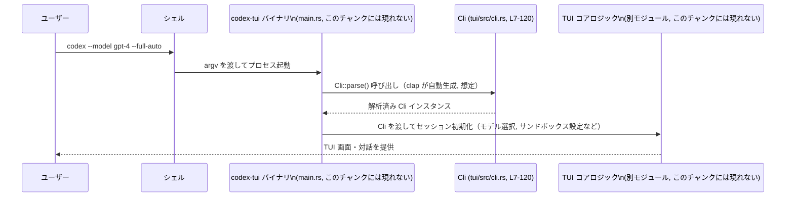

# tui/src/cli.rs コード解説

## 0. ざっくり一言

`tui/src/cli.rs` は、TUI 版 `codex` のコマンドライン引数を定義する `Cli` 構造体と、そのための clap 設定（属性）をまとめたモジュールです（`tui/src/cli.rs:L1-5, L7-120`）。

---

## 1. このモジュールの役割

### 1.1 概要

- このモジュールは **TUI アプリケーションのコマンドラインインターフェース（CLI）を定義** するために存在し、clap の `Parser` 派生を通じて **コマンドライン引数を `Cli` 構造体にマッピングする機能** を提供します（`tui/src/cli.rs:L1-5, L7-9`）。
- ユーザー入力（プロンプト・画像・モデル指定など）に加えて、`codex resume` / `codex fork` ラッパー用の **内部制御フラグ** や、**サンドボックス／承認ポリシー**・**作業ディレクトリ**・**Web 検索有効化** などの実行時設定をひとまとめに持ちます（`tui/src/cli.rs:L10-19, L39-40, L56-81, L97-108`）。

### 1.2 アーキテクチャ内での位置づけ

依存関係（このチャンクから分かる範囲）:

- 外部クレート:
  - `clap::{Parser, ValueHint}` … CLI パースとヘルプ生成（`tui/src/cli.rs:L1-2`）
  - `codex_utils_cli::{ApprovalModeCliArg, CliConfigOverrides}` … Codex 共通の CLI 型（`tui/src/cli.rs:L3-4, L79-81, L118-119`）
  - `codex_utils_cli::SandboxModeCliArg` … サンドボックスモードの CLI 表現（`tui/src/cli.rs:L74-77`）
- 標準ライブラリ:
  - `std::path::PathBuf` … 各種パス引数の型（`tui/src/cli.rs:L5, L15-16, L99-100, L107-108`）

`Cli` 自体はどこから呼ばれるかこのチャンクには現れませんが、`#[derive(Parser)]` が付与されているため、通常はバイナリのエントリポイント（例: `main.rs`）から `Cli::parse()` などを通じて利用される構造になっていると考えられます（これは clap の仕様に基づく一般的な利用イメージであり、呼び出し元コードはこのチャンクには現れません）。

```mermaid
graph TD
  subgraph "tui/src/cli.rs (L1-120)"
    Cli["Cli 構造体\n(コマンドライン引数定義)"]
  end

  Clap["clap::Parser / ValueHint\n(外部クレート)"]
  CodexUtils["codex_utils_cli\nApprovalModeCliArg\nSandboxModeCliArg\nCliConfigOverrides"]
  StdPath["std::path::PathBuf"]
  App["TUI エントリポイント\n(例: main.rs, このチャンクには現れない)"]

  App -->|コマンドライン解析に利用 (想定)| Cli
  Cli --> Clap
  Cli --> CodexUtils
  Cli --> StdPath
```

※「App → Cli」の矢印は clap の一般的な使い方に基づく想定であり、呼び出しコード自体はこのチャンクには現れません。

### 1.3 設計上のポイント

- **データ専用構造体**  
  - `Cli` はフィールドのみを持つ構造体であり、メソッドやロジックは定義されていません（`tui/src/cli.rs:L7-9, L10-119`）。
  - 実際のパース処理は `#[derive(Parser)]` により生成される clap のコードが担当します（`tui/src/cli.rs:L7-8`）。
- **ユーザー向け引数と内部制御フラグの明確な分離**  
  - `resume_*` / `fork_*` / `config_overrides` などは `#[clap(skip)]` により **コマンドラインフラグとしては公開せず**、上位のラッパー（`codex resume` / `codex fork`）などからプログラム的に設定される前提になっています（`tui/src/cli.rs:L18-21, L23-24, L26-29, L31-33, L35-37, L39-42, L44-45, L47-50, L52-54, L118-119`）。
- **安全性を意識したフラグ設計**  
  - 危険なモードをまとめた `dangerously_bypass_approvals_and_sandbox` は、`approval_policy` / `full_auto` と `conflicts_with_all` で明示的に同時指定禁止にしてあります（`tui/src/cli.rs:L79-81, L83-85, L87-94`）。
  - コメントでも「EXTREMELY DANGEROUS」と明記されており、意図的な利用を促す設計になっています（`tui/src/cli.rs:L87-88`）。
- **ユーザビリティの考慮**  
  - パス系引数に `ValueHint::DirPath` を付けるなど、シェル補完などでの使いやすさを高める設定が入っています（`tui/src/cli.rs:L107-108`）。
  - `value_delimiter = ','` と `num_args = 1..` により、`--image a.png,b.png` のような使い方を許容します（`tui/src/cli.rs:L15-16`）。

---

## 2. 主要な機能一覧

`Cli` 構造体のフィールドごとに、どのような機能を表しているかを整理します。

- **セッション開始入力**
  - `prompt: Option<String>` … 起動時に渡す初期プロンプト（任意）（`tui/src/cli.rs:L10-12`）。
  - `images: Vec<PathBuf>` … 初期プロンプトに添付する画像ファイルのパス（複数可）（`tui/src/cli.rs:L14-16`）。
- **セッションの再開 / フォーク制御（内部用）**
  - `resume_picker: bool` / `resume_last: bool` … `codex resume` サブコマンド用の内部フラグ（`tui/src/cli.rs:L18-21, L23-24`）。
  - `resume_session_id: Option<String>` … 再開対象セッション ID（UUID）（`tui/src/cli.rs:L26-29`）。
  - `resume_show_all: bool` / `resume_include_non_interactive: bool` … 再開時の一覧表示制御（`tui/src/cli.rs:L31-33, L35-37`）。
  - `fork_picker: bool` / `fork_last: bool` … `codex fork` サブコマンド用内部フラグ（`tui/src/cli.rs:L39-42, L44-45`）。
  - `fork_session_id: Option<String>` / `fork_show_all: bool` … フォーク対象セッション ID と一覧表示制御（`tui/src/cli.rs:L47-50, L52-54`）。
- **モデル／プロバイダ選択**
  - `model: Option<String>` … 使用するモデル名を直接指定（`tui/src/cli.rs:L56-58`）。
  - `oss: bool` … ローカル OSS モデル利用のショートカット（`tui/src/cli.rs:L60-63`）。
  - `oss_provider: Option<String>` … ローカルプロバイダ（`lmstudio` / `ollama` など）指定（`tui/src/cli.rs:L65-68`）。
  - `config_profile: Option<String>` … `config.toml` 内のプロファイルを指定（`tui/src/cli.rs:L70-72`）。
- **サンドボックス／承認ポリシー**
  - `sandbox_mode: Option<SandboxModeCliArg>` … シェルコマンド実行時のサンドボックスポリシー（`tui/src/cli.rs:L74-77`）。
  - `approval_policy: Option<ApprovalModeCliArg>` … 実行前にユーザー承認を求める条件（`tui/src/cli.rs:L79-81`）。
  - `full_auto: bool` … サンドボックス付きの自動実行を簡単に有効化するフラグ（`tui/src/cli.rs:L83-85`）。
  - `dangerously_bypass_approvals_and_sandbox: bool` … 承認・サンドボックスを完全バイパスする危険モード（`tui/src/cli.rs:L87-95`）。
- **実行コンテキスト**
  - `cwd: Option<PathBuf>` … 作業ディレクトリとして扱うパス（リモートモードではサーバ側で解決）（`tui/src/cli.rs:L97-100`）。
  - `add_dir: Vec<PathBuf>` … ワークスペースと同等に書き込み可能とする追加ディレクトリ（`tui/src/cli.rs:L106-108`）。
  - `no_alt_screen: bool` … 代替スクリーンモードを無効化し、スクロールバックを保持する TUI モード（`tui/src/cli.rs:L110-116`）。
- **補助機能**
  - `web_search: bool` … モデルにライブ Web 検索ツールを提供するかどうか（`tui/src/cli.rs:L102-104`）。
  - `config_overrides: CliConfigOverrides` … 設定ファイルに対する CLI からの上書き指定（内部用）（`tui/src/cli.rs:L118-119`）。

---

## 3. 公開 API と詳細解説

### 3.1 型一覧（構造体・列挙体など）

このチャンクに現れる主な型のインベントリーです。

| 名前 | 種別 | 定義/参照 | 役割 / 用途 | 根拠 |
|------|------|-----------|-------------|------|
| `Cli` | 構造体 | 定義 | TUI の全コマンドライン引数をまとめた設定オブジェクト | `tui/src/cli.rs:L7-9, L10-119` |
| `Parser` | トレイト（clap） | 参照 | `Cli` に CLI パーサー実装を自動付与するための derive 対象 | `tui/src/cli.rs:L1, L7-8` |
| `ValueHint` | 列挙体（clap） | 参照 | パス引数に対する補完ヒント（特に `DirPath`） | `tui/src/cli.rs:L2, L107-108` |
| `ApprovalModeCliArg` | 型（codex_utils_cli） | 参照 | コマンド実行前の承認モードを CLI 上で表現 | `tui/src/cli.rs:L3, L79-81` |
| `CliConfigOverrides` | 構造体（codex_utils_cli） | 参照 | 設定ファイルに対する CLI 上書き指定を保持 | `tui/src/cli.rs:L4, L118-119` |
| `SandboxModeCliArg` | 型（codex_utils_cli） | 参照 | サンドボックスポリシーの CLI 表現 | `tui/src/cli.rs:L74-77` |
| `PathBuf` | 構造体（標準ライブラリ） | 参照 | ファイル・ディレクトリパスの所有型 | `tui/src/cli.rs:L5, L15-16, L99-100, L107-108` |

### 3.2 関数詳細（自動生成される `Cli::parse()` について）

このファイルには手書きの関数定義はありません（`functions=0`）。  
ただし `#[derive(Parser)]` により、clap の `Parser` トレイト実装が自動生成され、その一環として `Cli::parse()` などのメソッドが利用可能になります（本体コードはこのチャンクには現れません）。

#### `Cli::parse() -> Cli`  （clap による自動生成）

**概要**

- 現在のプロセスのコマンドライン引数（`std::env::args()` 相当）を解析し、このファイルで定義されたフィールド・属性に基づいて `Cli` 構造体の値を構築します。
- 解析に失敗した場合は、エラーメッセージとヘルプを標準エラーに出力し、プロセスを終了する挙動が clap のデフォルトです（clap の仕様に基づく）。

**引数**

- なし（環境から暗黙的に `argv` を取得します）。

**戻り値**

- `Cli`  
  - すべてのフィールドが、ユーザー指定またはデフォルト値に基づいて埋められた構造体です。

**内部処理の流れ（概念）**

（実装はこのファイルには現れませんが、clap の一般的な挙動に基づく説明です）

1. `std::env::args_os()` から引数列を取得。
2. `#[arg]` / `#[clap]` 属性に従い、短いフラグ（`-m` など）・長いフラグ（`--model` など）・位置引数（`PROMPT`）を認識。
3. 各フィールド型（`Option<T>` / `bool` / `Vec<T>` / `PathBuf` など）に合わせて文字列から変換。
4. `conflicts_with_all` などの制約を検証し、違反があればエラー。
5. エラーなしの場合、すべてのフィールドを含む `Cli` を返す。

**Examples（使用例）**

この例は、TUI バイナリの `main` から `Cli` を利用する典型的なパターンです。  
ファイルパスやモジュール階層はあくまで例であり、このチャンクには現れません。

```rust
use clap::Parser;                    // #[derive(Parser)] を使うための import
mod cli;                             // tui/src/cli.rs をモジュールとして参照
use crate::cli::Cli;                 // Cli 構造体を取り込む

fn main() {
    // コマンドライン引数を解析して Cli を構築する
    let cli = Cli::parse();          // clap が自動生成した関数を呼び出す

    // 例: プロンプトが指定されていれば利用する
    if let Some(prompt) = &cli.prompt {
        println!("Prompt: {}", prompt);
    }

    // 例: 代替スクリーンを無効化するかどうかで TUI 初期化を切り分ける
    if cli.no_alt_screen {
        // インラインモードで TUI を起動する処理（このファイルには現れない）
    } else {
        // 通常の代替スクリーンモードで TUI を起動する処理（このファイルには現れない）
    }
}
```

**Errors / Panics**

- `Cli::parse()`  
  - 不正な引数や、`conflicts_with_all = ["approval_policy", "full_auto"]` に違反する組み合わせ（例: `--full-auto --dangerously-bypass-...`）などが存在する場合、エラー内容とヘルプを表示して **プロセスを終了** します。
  - パースエラーを `Result` で受けたい場合は、clap が提供する `Cli::try_parse()` を使うことになりますが、その定義はこのファイルには現れません（clap の一般仕様）。

**Edge cases（エッジケース）**

- `PROMPT` を指定しない場合  
  - `prompt: Option<String>` は `None` になり、アプリ側で「空のプロンプトとして扱う」などのロジックが必要です（実際の扱い方はこのチャンクには現れません）。
- `--image` の扱い  
  - `num_args = 1..` と `value_delimiter = ','` により、`--image a.png,b.png` や `--image a.png --image b.png` のような指定が `images: Vec<PathBuf>` にまとめられます（`tui/src/cli.rs:L15-16`）。
- 危険フラグとの競合  
  - `--dangerously-bypass-approvals-and-sandbox` と `--full-auto` / `--ask-for-approval` を同時指定すると clap がエラーとし、実行前に終了します（`tui/src/cli.rs:L87-95`）。

**使用上の注意点**

- `Cli::parse()` は **一度呼び出せば十分** な性質の関数であり、通常はプログラム起動直後に 1 回だけ使います。
- パース失敗でプロセスが終了するため、ユニットテストやライブラリ的利用では `try_parse` 系 API を用いて、`Result` としてエラーを扱う必要があります（これらは clap の API で、このファイルには現れません）。
- 並行性について  
  - `Cli` 自体はデータ構造のみを持ち、`&Cli` の不変参照を複数スレッドで共有することは一般的に安全ですが、実際に `Send` / `Sync` かどうかは外部型（`ApprovalModeCliArg` など）の実装に依存するため、このチャンクだけでは断定できません。

### 3.3 その他の関数

- このファイル内には手書きの補助関数やメソッド定義はありません。

---

## 4. データフロー

このファイルには処理ロジックはありませんが、`Cli` を用いた **典型的なデータフロー** を概念図として示します。  
呼び出し元やコアロジックは別ファイルに存在すると想定されますが、このチャンクには現れません。



このフローにおける各フィールドの利用例（あくまで一般的な使い方の例で、実装はこのチャンクには現れません）:

- `model`, `oss`, `oss_provider`, `config_profile`, `config_overrides`  
  → モデル・プロバイダ・プロファイルの決定に使用。
- `sandbox_mode`, `approval_policy`, `full_auto`, `dangerously_bypass_approvals_and_sandbox`  
  → シェルコマンド実行ポリシーとユーザー承認の戦略決定に使用。
- `cwd`, `add_dir`  
  → ファイルアクセスのルートディレクトリや追加書き込み可能領域の設定に使用。
- `web_search`  
  → モデルに Web 検索ツールを解放するかどうかのフラグ。
- `no_alt_screen`  
  → TUI の画面モード（代替スクリーン vs インライン）の選択。

---

## 5. 使い方（How to Use）

### 5.1 基本的な使用方法

`tui/src/cli.rs` の `Cli` を利用して、コマンドライン引数を解析する基本パターンの例です。

```rust
// main.rs （例）                                         // エントリポイントの例（このチャンクには現れない）
use clap::Parser;                                         // #[derive(Parser)] を有効にするための import
mod cli;                                                  // tui/src/cli.rs をモジュールとして取り込む
use crate::cli::Cli;                                      // Cli 構造体をスコープに入れる

fn main() {
    // コマンドライン引数を解析して Cli を構築する         // ユーザー入力を一括で表すオブジェクトを得る
    let mut cli = Cli::parse();                           // clap の自動生成メソッドを呼び出す

    // 内部フラグを上位サブコマンドから調整する例        // resume/fork 系フラグは #[clap(skip)] なので手動で設定する
    // cli.resume_picker = true;

    // プロンプトが指定されている場合の処理              // Option<String> をパターンマッチで取り出す
    if let Some(prompt) = cli.prompt.as_deref() {         // as_deref() で &str として扱う例
        println!("Starting with prompt: {}", prompt);
    }

    // 画像ファイルパスの列挙                              
    for image_path in &cli.images {                       // Vec<PathBuf> を &PathBuf として借用
        println!("Image: {}", image_path.display());
    }

    // 危険フラグのチェック                               // 安全性のため、アプリ側でも再確認できる
    if cli.dangerously_bypass_approvals_and_sandbox {     
        eprintln!("WARNING: running without approvals or sandbox!");
    }

    // ここで TUI のコアロジックに cli を渡して初期化     // 実際の TUI 初期化は別モジュール（このチャンクには現れない）
}
```

### 5.2 よくある使用パターン

1. **新しいセッションを開始する**

   ```bash
   codex "explain this code" \
     --image screenshot.png \
     --model gpt-4 \
     --sandbox workspace-write \
     --ask-for-approval on-request
   ```

   - `PROMPT` → `prompt`（`Some("explain this code")`）
   - `--image` → `images = [PathBuf::from("screenshot.png")]`
   - `--model` → `model = Some("gpt-4".to_string())`
   - `--sandbox` → `sandbox_mode = Some(SandboxModeCliArg::WorkspaceWrite)`（具体的な variant 名はこのチャンクには現れません）
   - `--ask-for-approval` → `approval_policy = Some(…)`

2. **ローカル OSS モデルを使う**

   ```bash
   codex --oss --local-provider lmstudio
   ```

   - `oss = true`
   - `oss_provider = Some("lmstudio".to_string())`
   - コメントにある通り、`--oss` を付けずに `--local-provider` だけ指定した場合でも、「設定のデフォルトを使うか、選択 UI を出す」と説明されていますが、その挙動はこのチャンクには現れません（`tui/src/cli.rs:L65-68`）。

3. **スクロールバックを保持したインライン TUI**

   ```bash
   codex --no-alt-screen
   ```

   - `no_alt_screen = true` となり、TUI が代替スクリーンではなく通常の画面上に描画されるモードになる想定です（実際の描画ロジックはこのチャンクには現れません）。

### 5.3 よくある間違い

1. **危険フラグと他フラグの競合**

```bash
# 誤り例: 危険モードと full-auto を同時指定している
codex --full-auto --dangerously-bypass-approvals-and-sandbox
```

- `dangerously_bypass_approvals_and_sandbox` に  
  `conflicts_with_all = ["approval_policy", "full_auto"]` が付いているため、clap がエラーを返し、ヘルプを表示して終了します（`tui/src/cli.rs:L87-95`）。

1. **画像の複数指定の勘違い**

```bash
# 誤り例（期待通りにパースされない可能性）
codex --image "a.png b.png"
```

- スペース区切りでは 1 引数として扱われるため、`PathBuf` へのパースに失敗する可能性があります。

```bash
# 正しい例1: カンマ区切り（value_delimiter=','）
codex --image a.png,b.png

# 正しい例2: --image を複数回指定
codex --image a.png --image b.png
```

- `#[arg(value_delimiter = ',', num_args = 1..)]` によりどちらも `images = [a.png, b.png]` となります（`tui/src/cli.rs:L15-16`）。

1. **内部フラグを CLI 引数だと誤解する**

- `resume_picker` や `fork_last` などは `#[clap(skip)]` なので、`--resume-picker` のようなフラグとしては指定できません（`tui/src/cli.rs:L18-21, L39-42`）。
- これらは、上位の `codex resume` / `codex fork` サブコマンド実装からプログラム的に設定される前提です（コード自体はこのチャンクには現れません）。

### 5.4 使用上の注意点（まとめ）

- **エラー処理**  
  - 不正な組み合わせや型変換に失敗した引数がある場合、`Cli::parse()` はエラーメッセージを表示してプロセスを終了します。  
    アプリ内でエラーを捕捉したい場合は、clap の `try_parse()` 系 API を検討する必要があります。
- **安全性（セキュリティ）**  
  - `dangerously_bypass_approvals_and_sandbox` はコメントにもある通り **「EXTREMELY DANGEROUS」** と明記されており、外部で十分にサンドボックスされた環境以外では使うべきではありません（`tui/src/cli.rs:L87-88`）。
  - このフラグを使うと、モデル生成コマンドがユーザー確認なし・サンドボックスなしで実行される可能性があり、ファイル破壊や任意コマンド実行のリスクが高まります。
- **パス引数の検証**  
  - このファイルではパス文字列を `PathBuf` にパースするだけで、存在確認やアクセス権限の検証は行っていません。実際の検証は別モジュール側で行われる必要があります。
- **並行性**  
  - このファイル内ではスレッドや async を扱っておらず、並行性に関するロジックは存在しません。  
    `Cli` をスレッド間で共有する場合の安全性は、フィールドに含まれる外部型（`ApprovalModeCliArg` など）の実装に依存し、このチャンクだけでは判断できません。
- **テスト**  
  - このファイルにはテストコードは含まれていません。CLI の仕様変更時には、別途統合テストやスナップショットテストで引数組み合わせを検証する必要があります（テストファイルの場所はこのチャンクには現れません）。

---

## 6. 変更の仕方（How to Modify）

### 6.1 新しい機能を追加する場合

新しい CLI オプションを追加したい場合の一般的な手順です。

1. **フィールドの追加**
   - `Cli` 構造体に新しいフィールドを追加します（`tui/src/cli.rs:L10-119` の既存パターンを参照）。
   - 例: フラグであれば `bool`、任意の文字列なら `Option<String>`、複数値なら `Vec<T>` など。

2. **clap 属性の設定**
   - `#[arg(long = "flag-name", short = 'x', default_value_t = false)]` などの属性を付けて、  
     - ロング／ショート名
     - デフォルト値
     - `value_hint`（パスなど）
     - `conflicts_with` / `requires` などの制約  
     を指定します。
   - 内部用でユーザーに直接公開したくない場合は `#[clap(skip)]` を使います（`tui/src/cli.rs:L18-21, L39-42, L118-119` の例）。

3. **コアロジックでの利用**
   - 新しいフィールドを実際に利用するコードを TUI のコアモジュール側に追加します。  
     このチャンクにはコアロジックがないため、どのファイルを修正すべきかは不明ですが、通常はエントリポイント付近で `Cli` を受け取っているコードになります。

4. **仕様の整合性チェック**
   - 既存のフラグとの関係（競合するか、依存関係があるか）を整理し、必要に応じて `conflicts_with_*` などを設定します。
   - 危険な挙動を持つフラグであれば、コメントで明示し、名前も慎重に選びます（`dangerously_bypass_...` の例を参照）。

### 6.2 既存の機能を変更する場合

- **フラグ名の変更**
  - `long` / `short` を変更すると、既存のスクリプトやユーザー習慣が壊れる可能性があります。互換性を保つ場合は `alias` を活用する方法もあります（`dangerously_bypass_...` が `alias = "yolo"` を持つ例: `tui/src/cli.rs:L90-91`）。
- **デフォルト値の変更**
  - `default_value_t = false` などを変更すると、明示的に指定していないユーザーの挙動が変わるため、リリースノートなどでの告知が重要になります。
- **安全性に関する契約（Contract）の変更**
  - 特に `sandbox_mode` / `approval_policy` / `full_auto` / `dangerously_bypass_...` 周りは、安全性・セキュリティポリシーそのものに関わるため、変更時には:
    - 競合関係 (`conflicts_with_all`) の再検証
    - ドキュメントやヘルプメッセージの更新
    - テスト（特に危険パス）の追加  
    が必要です。
- **外部型の変更の影響**
  - `ApprovalModeCliArg` や `SandboxModeCliArg` の定義変更（別クレート側）は、この `Cli` の意味論にも直接影響します。  
    このチャンクからはその定義内容は分からないため、該当クレートのドキュメント・コードを確認する必要があります。

---

## 7. 関連ファイル

このチャンクから推測できる、密接に関連しそうなファイル・モジュールです（実際のパスは一部不明です）。

| パス / クレート | 役割 / 関係 |
|-----------------|------------|
| `tui/src/cli.rs` | 本ファイル。TUI 用の `Cli` 構造体と clap 属性を定義する。 |
| `codex_utils_cli` クレート | `ApprovalModeCliArg` / `SandboxModeCliArg` / `CliConfigOverrides` を提供し、CLI 全体で共通の表現を担う（`tui/src/cli.rs:L3-4, L74-77, L79-81, L118-119`）。 |
| TUI エントリポイント（例: `tui/src/main.rs`）※このチャンクには現れない | `Cli::parse()` を呼び出し、得られた設定を TUI の初期化に渡す役割を持つと想定される。 |
| サンドボックス／承認ポリシー関連モジュール（パス不明） | `SandboxModeCliArg` / `ApprovalModeCliArg` を解釈し、実際のシェルコマンド実行ポリシー・ユーザー承認ロジックを実装していると考えられるが、このチャンクには現れません。 |

このファイルはあくまで **CLI の定義と型の入り口** を提供する役割に特化しており、実際の処理ロジック・並行性制御・エラー処理の詳細は別モジュール側に委ねられています。
