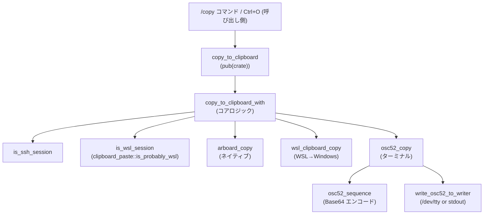
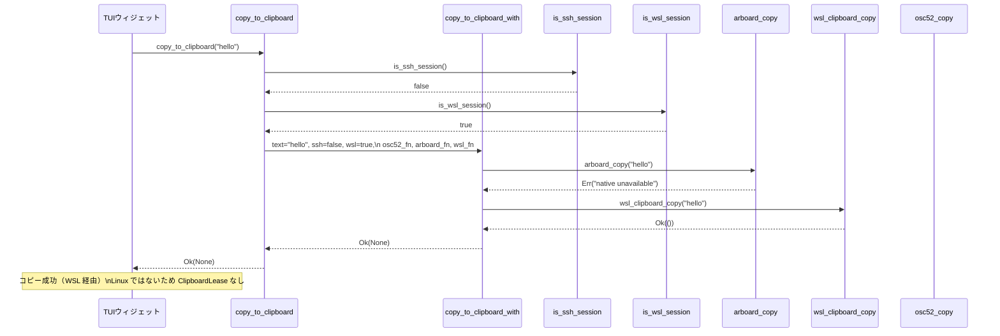

tui/src/clipboard_copy.rs

---

## 0. ざっくり一言

このモジュールは、TUI の `/copy` コマンドや `Ctrl+O` ホットキーからの「テキストコピー」を、環境に応じて適切なクリップボード（OSC 52 / ネイティブ / WSL）へ送るバックエンド実装です。  
SSH / ローカル / WSL を判定しながら、フォールバック順序やエラーメッセージ生成までを一手に担います。

※ このチャンクには行番号情報が含まれていないため、以下の「根拠」欄では行番号を `tui/src/clipboard_copy.rs:L?-?` のように表記します。

---

## 1. このモジュールの役割

### 1.1 概要

- このモジュールは **「テキストをどのクリップボードに、どの方法でコピーするか」** を決定するために存在し、以下の機能を提供します。
  - SSH セッションでは OSC 52 経由でローカル端末のクリップボードへコピーする（ネイティブクリップボードはリモート側なので使わない）【ヘッダコメント, tui/src/clipboard_copy.rs:L?-?】
  - ローカル環境では `arboard` によるネイティブクリップボードを優先し、Linux/WSL では PowerShell 経由の Windows クリップボードや OSC 52 にフォールバックする【`copy_to_clipboard_with`, L?-?】
  - Linux/X11 など「所有プロセスが生きている間だけクリップボードが有効」な環境向けに、`ClipboardLease` で `arboard::Clipboard` のライフタイムを保持する【`ClipboardLease`, L?-?】

### 1.2 アーキテクチャ内での位置づけ

このモジュールは、TUI のコマンド/UI 層と、実際の OS / ターミナルのクリップボード機構の間にある「環境依存の分岐ポイント」です。

- 上位からの呼び出し: `/copy` コマンドや `Ctrl+O` が `copy_to_clipboard` を呼び出す（ヘッダコメントより）
- 内部での分岐:
  - `is_ssh_session` により SSH 判定【`is_ssh_session`, L?-?】
  - `is_wsl_session` により WSL 判定（`crate::clipboard_paste::is_probably_wsl()` に依存）【`is_wsl_session`, L?-?】
- 下位バックエンド:
  - `arboard_copy`（ネイティブクリップボード）
  - `wsl_clipboard_copy`（PowerShell の `Set-Clipboard`）
  - `osc52_copy` → `osc52_sequence` / `write_osc52_to_writer`（端末エスケープシーケンス）

概略の依存関係は次の通りです。



### 1.3 設計上のポイント

コードから読み取れる設計上の特徴は次の通りです。

- **責務の分割**
  - 高レベル API: `copy_to_clipboard` は環境検出とバックエンド選択をまとめた入口【L?-?】
  - コア制御: `copy_to_clipboard_with` が **SSH / ローカル / WSL**・成功/失敗ごとのフォールバック制御を一手に担う【L?-?】
  - バックエンド: `arboard_copy` / `wsl_clipboard_copy` / `osc52_copy` はそれぞれ 1 つの手段に集中【L?-?】
- **環境依存コードの `cfg` 分離**
  - Linux / macOS / Android / その他で `arboard_copy` 実装を切り替え【`#[cfg(...)]` 付き定義, L?-?】
  - WSL 用コピーは Linux のみ（`wsl_clipboard_copy` の `#[cfg(target_os = "linux")]`）【L?-?】
  - stderr リダイレクト RAII (`SuppressStderr`) は macOS とその他で別実装【L?-?】
- **ライフタイムと所有権**
  - Linux では `ClipboardLease` が `arboard::Clipboard` を所有し続けることで、「プロセス存続中のみ有効なクリップボード」という X11 / Wayland の制約に対応【`ClipboardLease`, `arboard_copy`(linux), L?-?】
  - 他プラットフォームでは lease は常に `None`（所有不要）【`arboard_copy`(non-linux), L?-?】
- **エラーハンドリング方針**
  - すべての公開関数は `Result<_, String>` で失敗を文字列化したユーザー向けメッセージとして返す【`copy_to_clipboard` など, L?-?】
  - フォールバック時は、どの経路で何が失敗したかを 1 つの文字列に連結して返す【`copy_to_clipboard_with` の `Err` 組み立て, L?-?】
  - ログには `tracing::warn!` / `tracing::debug!` を使用し、ユーザー表示とは別に詳細を残す【L?-?】
- **並行性の配慮**
  - macOS では stderr の一時リダイレクトを `SuppressStderr` + `STDERR_SUPPRESSION_MUTEX`（`OnceLock<Mutex<()>>`）で排他制御し、複数スレッドから同時にクリップボード初期化しないようにしている【L?-?】
  - RAII により、panic などで早期帰還しても stderr は確実に元に戻る設計【`Drop for SuppressStderr`, L?-?】

---

## 2. コンポーネント一覧と主要な機能

### 2.1 コンポーネント（型・定数・関数）インベントリー

| 名前 | 種別 | 役割 / 用途 | 根拠 |
|------|------|-------------|------|
| `OSC52_MAX_RAW_BYTES` | `const usize` | OSC 52 で送る前の **最大生バイト数 (100,000)** を制限する。大きすぎるペイロードを拒否【コメントより】 | tui/src/clipboard_copy.rs:L?-? |
| `STDERR_SUPPRESSION_MUTEX` | `static OnceLock<Mutex<()>>` (macOS) | macOS 上で `arboard::Clipboard::new()` 呼び出し中に stderr を `/dev/null` へリダイレクトする処理を、スレッド間で排他制御する【ヘッダコメントと使用箇所】 | tui/src/clipboard_copy.rs:L?-? |
| `ClipboardLease` | 構造体 | Linux で `arboard::Clipboard` を保持し続け、プロセス存続中のクリップボード所有を維持するための「リース」【フィールド・doc コメント】 | tui/src/clipboard_copy.rs:L?-? |
| `ClipboardLease::native_linux` | 関数 (非公開メソッド) | Linux 用: `ClipboardLease` に `arboard::Clipboard` を取り込むコンストラクタ【L?-?】 | tui/src/clipboard_copy.rs:L?-? |
| `ClipboardLease::test` | 関数 (テスト用) | テスト用のダミー `ClipboardLease` を作成する【`#[cfg(test)]`】 | tui/src/clipboard_copy.rs:L?-? |
| `copy_to_clipboard` | 関数 (pub(crate)) | TUI から呼び出される高レベル API。環境判定を行い、`copy_to_clipboard_with` に委譲する【L?-?】 | tui/src/clipboard_copy.rs:L?-? |
| `copy_to_clipboard_with` | 関数 (非公開) | SSH / ローカル / WSL の条件と、バックエンド関数を引数で受け取り、フォールバック制御とエラーメッセージ構築を行うコアロジック【L?-?】 | tui/src/clipboard_copy.rs:L?-? |
| `is_ssh_session` | 関数 | `SSH_TTY` / `SSH_CONNECTION` 環境変数から SSH セッションかどうかを判定する【L?-?】 | tui/src/clipboard_copy.rs:L?-? |
| `is_wsl_session` | 関数 | Linux の場合、`crate::clipboard_paste::is_probably_wsl()` に委譲して WSL らしいかどうかを判定。その他 OS では常に `false`【`#[cfg]` と実装】 | tui/src/clipboard_copy.rs:L?-? |
| `arboard_copy` | 関数 | `arboard` クレート経由でネイティブクリップボードに文字列をコピーする。OS によって戻り値や stderr 抑制の有無が異なる【複数の `#[cfg]` 実装】 | tui/src/clipboard_copy.rs:L?-? |
| `wsl_clipboard_copy` | 関数 | Linux 上（WSL 想定）で `powershell.exe` と `Set-Clipboard` を使って Windows のクリップボードにコピー【L?-?】。その他 OS では「利用不可」エラーを返す【L?-?】 | tui/src/clipboard_copy.rs:L?-? |
| `SuppressStderr` | 構造体 | RAII で stderr (fd 2) を `/dev/null` に退避し、スコープ終了時に元に戻す (macOS)。その他 OS では no-op ガード【`struct` 定義と `Drop` 実装】 | tui/src/clipboard_copy.rs:L?-? |
| `osc52_copy` | 関数 | OSC 52 エスケープシーケンスを生成し、`/dev/tty` または stdout に書き出してクリップボードコピーする【L?-?】 | tui/src/clipboard_copy.rs:L?-? |
| `write_osc52_to_writer` | 関数 | 任意の `Write` 実装に OSC 52 シーケンス文字列を書き込み flush するヘルパー【L?-?】 | tui/src/clipboard_copy.rs:L?-? |
| `osc52_sequence` | 関数 | テキストの長さチェックと Base64 エンコードを行い、tmux 有無に応じた OSC 52 シーケンス文字列を組み立てる【L?-?】 | tui/src/clipboard_copy.rs:L?-? |
| `tests` モジュール | テストモジュール | OSC 52 シーケンス生成・サイズ制限・tmux ラップ・バックエンド選択ロジックの単体テストを提供【`mod tests` 以下】 | tui/src/clipboard_copy.rs:L?-? |

### 2.2 主要な機能一覧

- SSH 判定: `is_ssh_session` で SSH セッションかどうかを判定し、SSH 中は OSC 52 のみを使用する。
- 環境別クリップボード選択:
  - ローカル + ネイティブクリップボード（`arboard_copy`）
  - ローカル + WSL 環境での PowerShell 経由コピー（`wsl_clipboard_copy`）
  - ターミナル経由の OSC 52 コピー（`osc52_copy`）
- クリップボード所有のリース管理: Linux 上で `ClipboardLease` によって `arboard::Clipboard` を保持する。
- OSC 52 シーケンス生成と安全なサイズ制限: `osc52_sequence` が最大 100,000 バイト制限と Base64 エンコードを行う。
- stderr 汚染の防止: `SuppressStderr` が macOS で `arboard` 利用時の `NSLog` 等の出力を抑制する。

---

## 3. 公開 API と詳細解説

### 3.1 型一覧（構造体など）

| 名前 | 種別 | 役割 / 用途 | 主なフィールド |
|------|------|-------------|----------------|
| `ClipboardLease` | 構造体 (pub(crate)) | クリップボード所有を保持するためのリース。Linux では `arboard::Clipboard` を所有し、X11/Wayland の仕様に対応する。【doc コメント】 | Linux: `_clipboard: Option<arboard::Clipboard>`、他 OS: フィールドなし |
| `SuppressStderr` | 構造体 (非公開) | stderr を `/dev/null` に退避・復元する RAII ガード (macOS)。他 OS では空のダミー型。【`struct` + `Drop`】 | macOS: `saved_fd: Option<libc::c_int>` |

---

### 3.2 関数詳細（主要 7 件）

#### `copy_to_clipboard(text: &str) -> Result<Option<ClipboardLease>, String>`

**概要**

- TUI から利用される高レベルのコピー API です。
- 内部で SSH / WSL を自動判定し、`copy_to_clipboard_with` に処理を委譲します【L?-?】。

**引数**

| 引数名 | 型 | 説明 |
|--------|----|------|
| `text` | `&str` | コピーしたい UTF-8 文字列。OSC 52 ではバイト列として Base64 エンコードされます。 |

**戻り値**

- `Ok(Some(ClipboardLease))`:
  - Linux のネイティブクリップボード経由でコピーされた場合。返された `ClipboardLease` を保持しておくことで、プロセス終了までクリップボード内容を維持できます【`arboard_copy`(linux), L?-?】。
- `Ok(None)`:
  - それ以外（OSC 52, WSL PowerShell, Linux 以外の `arboard`）で成功した場合。追加で保持すべきリースはありません【L?-?】。
- `Err(String)`:
  - すべてのバックエンドが失敗した場合。失敗した経路と理由を連結したメッセージが含まれます【`copy_to_clipboard_with`, L?-?】。

**内部処理の流れ**

1. `is_ssh_session()` と `is_wsl_session()` で環境を判定【`copy_to_clipboard`, L?-?】。
2. `copy_to_clipboard_with` に以下を渡して呼び出す：
   - コピー対象文字列 `text`
   - SSH/WSL フラグ
   - バックエンド関数: `osc52_copy`, `arboard_copy`, `wsl_clipboard_copy`【L?-?】。
3. 結果をそのまま呼び出し元に返す。

**Examples（使用例）**

TUI 内でコピーを行い、Linux の場合は `ClipboardLease` を保持する例です。

```rust
// TUI の状態保持用構造体の一部
struct AppState {
    clipboard_lease: Option<tui::clipboard_copy::ClipboardLease>, // Linux 用リース
    // ...
}

impl AppState {
    fn copy_selection(&mut self, text: &str) -> Result<(), String> {
        // 文字列をクリップボードにコピー
        let lease = crate::clipboard_copy::copy_to_clipboard(text)?; // 失敗時は Err(String)

        // Linux では Some(lease) が来るので保持しておく
        self.clipboard_lease = lease;

        Ok(())
    }
}
```

**Errors / Panics**

- パニックは使用していません（`unwrap`/`expect` はテストコードのみ）。
- `Err(String)` は内部バックエンドからのエラー文字列をまとめたものです。たとえば WSL で全経路が失敗した場合は  
  `"native clipboard: ...; WSL fallback: ...; OSC 52 fallback: ..."` の形式になります【テスト `local_wsl_reports_native_powershell_and_osc52_errors_when_all_fail`, L?-?】。

**Edge cases（エッジケース）**

- `text` が空文字列の場合:
  - コード上特別扱いはなく、そのまま各バックエンドに渡されます。
- Android 環境:
  - `arboard_copy` が即座にエラーを返し、WSL ではないため最終的に OSC 52 経由のコピーを試みます【`arboard_copy`(android) と `copy_to_clipboard_with`, L?-?】。
- 非 Unix 環境（例: Windows ネイティブ）:
  - `osc52_copy` は `/dev/tty` を使わず stdout に書き出します【`osc52_copy` の `#[cfg(unix)]` ブロック以降, L?-?】。

**使用上の注意点**

- Linux でネイティブクリップボードを使う場合、返された `ClipboardLease` を **TUI が動作している間は保持** することが前提です。ドロップするとクリップボード内容が消える環境があります【モジュールコメント, `ClipboardLease` 説明, L?-?】。
- 呼び出しはブロッキングで、`arboard` / PowerShell / ファイル I/O (`/dev/tty`) に依存するため、高頻度・高スループットな呼び出しには向きません。

---

#### `copy_to_clipboard_with(

    text: &str,
    ssh_session: bool,
    wsl_session: bool,
    osc52_copy_fn: impl Fn(&str) -> Result<(), String>,
    arboard_copy_fn: impl Fn(&str) -> Result<Option<ClipboardLease>, String>,
    wsl_copy_fn: impl Fn(&str) -> Result<(), String>,
) -> Result<Option<ClipboardLease>, String>`

**概要**

- 環境フラグとバックエンド関数を「依存性注入」する形で受け取り、フォールバック順序とエラーメッセージの構築を行うコアロジックです【doc コメントと実装, L?-?】。
- ユニットテストから、任意のダミー関数を渡すことで挙動を完全に制御できます【tests, L?-?】。

**引数**

| 引数名 | 型 | 説明 |
|--------|----|------|
| `text` | `&str` | コピー対象文字列 |
| `ssh_session` | `bool` | SSH セッションとして処理するかどうか (`is_ssh_session()` の結果を渡す想定) |
| `wsl_session` | `bool` | WSL 環境として処理するかどうか (`is_wsl_session()` の結果) |
| `osc52_copy_fn` | `impl Fn(&str) -> Result<(), String>` | OSC 52 経由コピー関数（テスト用に差し替え可能） |
| `arboard_copy_fn` | `impl Fn(&str) -> Result<Option<ClipboardLease>, String>` | ネイティブクリップボードコピー関数 |
| `wsl_copy_fn` | `impl Fn(&str) -> Result<(), String>` | WSL PowerShell コピー関数 |

**戻り値**

- `copy_to_clipboard` と同じく `Result<Option<ClipboardLease>, String>` です。
- `ssh_session == true` の場合、成功しても常に `Ok(None)`（OSC 52 しか使わないため）【L?-?】。

**内部処理の流れ**

1. **SSH セッションの場合**（`ssh_session == true`）【L?-?】
   - `osc52_copy_fn(text)` を呼び出す。
   - `Ok(())` の場合は `Ok(None)` を返す。
   - `Err(osc_err)` の場合は `tracing::warn!` ログを出し、  
     `"OSC 52 clipboard copy failed over SSH: {osc_err}"` を `Err` として返す。
   - ネイティブ / WSL バックエンドは **一切呼ばない**（テストで確認）【`ssh_uses_osc52_and_skips_native_on_success` など, L?-?】。
2. **それ以外（ローカルセッション）**【`match arboard_copy_fn(text)`, L?-?】
   - `arboard_copy_fn(text)` を呼び出し、結果をマッチする。
   - `Ok(lease)` → そのまま `Ok(lease)` を返す（フォールバックせず終了）。
   - `Err(native_err)` → ネイティブ失敗としてフォールバックへ。
3. **WSL セッション（`wsl_session == true`）でネイティブ失敗時**【L?-?】
   - `tracing::warn!` でネイティブ失敗ログを出力。
   - `wsl_copy_fn(text)` を呼び出す。
     - `Ok(())` → `Ok(None)` を返す（OSC 52 には進まない）【`local_wsl_native_failure_uses_powershell_and_skips_osc52_on_success`, L?-?】。
     - `Err(wsl_err)` → WSL 失敗としてログを出した上で OSC 52 フォールバックへ。
   - OSC 52 フォールバック:
     - 成功 → `Ok(None)`
     - 失敗 →  
       `"native clipboard: {native_err}; WSL fallback: {wsl_err}; OSC 52 fallback: {osc_err}"` を `Err` として返す【テストが期待値を確認, L?-?】。
4. **非 WSL セッションでネイティブ失敗時**【L?-?】
   - `tracing::warn!` ログを出し、`osc52_copy_fn(text)` の成否で
     - 成功 → `Ok(None)`
     - 失敗 → `"native clipboard: {native_err}; OSC 52 fallback: {osc_err}"` を返す。

**Examples（使用例）**

テストと同様に、ダミーのバックエンドを注入するパターンです。

```rust
use std::cell::Cell;

fn test_copy_logic() {
    let osc_calls    = Cell::new(0_u8);
    let native_calls = Cell::new(0_u8);
    let wsl_calls    = Cell::new(0_u8);

    let result = crate::clipboard_copy::copy_to_clipboard_with(
        "hello",
        /* ssh_session */ false,
        /* wsl_session */ true,
        |_| { // osc52_copy_fn
            osc_calls.set(osc_calls.get() + 1);
            Ok(())
        },
        |_| { // arboard_copy_fn
            native_calls.set(native_calls.get() + 1);
            Err("native unavailable".into())
        },
        |_| { // wsl_copy_fn
            wsl_calls.set(wsl_calls.get() + 1);
            Ok(())
        },
    );

    assert!(matches!(result, Ok(None)));
    assert_eq!(osc_calls.get(), 0);
    assert_eq!(native_calls.get(), 1);
    assert_eq!(wsl_calls.get(), 1);
}
```

**Errors / Panics**

- パニックはありません。
- すべてのエラーは `Err(String)` として返り、内容は **各バックエンドからのエラー文字列を連結** したものです。
- SSH 時のエラー文言などはテストで固定化されています（例: `"OSC 52 clipboard copy failed over SSH: blocked"`）【`ssh_returns_osc52_error_and_skips_native`, L?-?】。

**Edge cases**

- `ssh_session` と `wsl_session` が両方 `true` の場合
  - SSH 分岐が優先され、WSL 用バックエンドは一切呼ばれません【テストで `wsl_calls == 0` を確認, L?-?】。
- `arboard_copy_fn` / `wsl_copy_fn` / `osc52_copy_fn` がそれぞれ即座に `Err` を返すケースはテストで網羅されており、エラーメッセージの組み合わせが意図通りであることが確認されています【各種テスト, L?-?】。

**使用上の注意点**

- 本関数はテスト専用というわけではなく、設計上 **依存注入可能なコアロジック** になっていますが、公開範囲はクレート内 (`pub(crate)` ではない) に留まっています。
- 新たなバックエンドを追加したい場合、この関数に条件とクロージャを追加する形が拡張ポイントになります。

---

#### `arboard_copy(text: &str) -> Result<Option<ClipboardLease>, String>`

> 実装は OS ごとに `#[cfg]` で分岐しています。ここでは共通の振る舞いをまとめます。

**概要**

- `arboard::Clipboard` を使って、OS のネイティブクリップボードへ文字列をコピーします【すべての分岐で `Clipboard::new` と `set_text` を呼んでいる, L?-?】。
- Linux では `ClipboardLease` を返してクリップボードを保持し続けます。その他では `None` です【linux / non-linux 実装比較, L?-?】。
- Android では「利用不可」として必ずエラーを返します【`#[cfg(target_os = "android")]` 実装, L?-?】。

**引数**

| 引数名 | 型 | 説明 |
|--------|----|------|
| `text` | `&str` | コピー対象文字列 |

**戻り値**

- macOS / Windows / ほか非 Linux（Android 除く）:
  - 成功 → `Ok(None)`
- Linux:
  - 成功 → `Ok(Some(ClipboardLease::native_linux(clipboard)))`
- Android:
  - 常に `Err("native clipboard unavailable on Android")`

**内部処理の流れ**

- 非 Linux / 非 Android（例: macOS, Windows）【`#[cfg(all(not(target_os = "android"), not(target_os = "linux")))]`, L?-?】
  1. macOS の場合のみ、`STDERR_SUPPRESSION_MUTEX` でロックを取得しつつ stderr 抑制を行う【`#[cfg(target_os = "macos")]`, L?-?】。
  2. `SuppressStderr::new()` を作成し、スコープ内で stderr を `/dev/null` に向ける（macOS のみ実際の効果あり）。
  3. `arboard::Clipboard::new()` を呼び出し、失敗したら `"clipboard unavailable: {e}"` でエラーにする。
  4. `clipboard.set_text(text)` を呼び、失敗したら `"failed to set clipboard text: {e}"` でエラー。
  5. 成功したら `Ok(None)` を返す。
- Linux【`#[cfg(target_os = "linux")]`, L?-?】
  1. `SuppressStderr::new()` を呼ぶ（Linux では no-op）。
  2. `arboard::Clipboard::new()` → `set_text(text)` の流れは同じ。
  3. 成功したら `ClipboardLease::native_linux(clipboard)` を `Some` で返す。
- Android【`#[cfg(target_os = "android")]`, L?-?】
  - 即座に `Err("native clipboard unavailable on Android")` を返す。

**Errors / Panics**

- I/O / OS 由来のエラーはすべて `Err(String)` に変換されています。
- パニックはありません。
- macOS での stderr 抑制ロック取得に失敗した場合  
  `"stderr suppression lock poisoned"` を返します【`map_err` の文字列, L?-?】。

**Edge cases**

- `text` が大きくても、ここではサイズ制限は行っていません（サイズ制限は OSC 52 経由のみ）。
- Linux で `Clipboard::new()` が成功した後 `set_text` が失敗した場合、`ClipboardLease` は返されず、その旨がエラー文字列として返ります。

**使用上の注意点**

- 戻り値が `Option<ClipboardLease>` である点が重要です。
  - Linux: `Some(lease)` を TUI 側で保存しておく必要があります。
  - その他 OS: `None` のため、そのまま破棄して構いません。
- Android では常に失敗するため、`copy_to_clipboard_with` のフォールバックに依存する設計になっています。

---

#### `wsl_clipboard_copy(text: &str) -> Result<(), String>`

**概要**

- Linux 上（WSL 想定）から `powershell.exe` を起動し、`Set-Clipboard` を用いて Windows のクリップボードにコピーします【`#[cfg(target_os = "linux")]` 実装, L?-?】。
- WSL 以外の OS では「利用不可」エラーを返すだけです【`#[cfg(not(target_os = "linux"))]`, L?-?】。

**引数**

| 引数名 | 型 | 説明 |
|--------|----|------|
| `text` | `&str` | Windows クリップボードにコピーする文字列 |

**戻り値**

- 成功時: `Ok(())`
- 失敗時: `Err(String)` に理由が入ります  
  例: `"failed to spawn powershell.exe: {e}"`、`"powershell.exe failed: {stderr}"` 等。

**内部処理の流れ（Linux 版）**

1. `std::process::Command::new("powershell.exe")` で子プロセスを組み立て、stdin をパイプ、stdout を破棄、stderr をパイプに設定【L?-?】。
2. `-NoProfile` と PowerShell コマンドを引数として渡す。コマンド内では
   - 入力エンコーディングを UTF-8 に設定
   - `$text = [Console]::In.ReadToEnd()` で標準入力をすべて読み取り
   - `Set-Clipboard -Value $text` でクリップボードに設定【L?-?】。
3. プロセスを `spawn()` し、失敗したら `"failed to spawn powershell.exe: {e}"` を返す。
4. `child.stdin.take()` で標準入力ハンドルを取得。失敗した場合は `kill` + `wait` を呼んでから `"failed to open powershell.exe stdin"` を返す【L?-?】。
5. `stdin.write_all(text.as_bytes())` で文字列を書き込む。失敗したら同様に `kill` + `wait` のうえ `"failed to write to powershell.exe: {err}"` を返す【L?-?】。
6. stdin を drop して EOF を送る。
7. `child.wait_with_output()` で終了まで待ち、失敗したら `"failed to wait for powershell.exe: {e}"` を返す【L?-?】。
8. 正常終了なら `Ok(())`。異常終了なら stderr を UTF-8 として取り出し
   - stderr 非空 → `"powershell.exe failed: {stderr}"`
   - stderr 空 → `"powershell.exe exited with status {status}"`【L?-?】。

**Errors / Panics**

- すべてのエラーは `Err(String)` で返されます。
- いずれのパスでも `unwrap/expect` は使っていないため、パニックはありません。
- `kill` / `wait` の戻り値は無視しています。失敗してもさらなるエラーにはしない設計です【`let _ = child.kill();`, L?-?】。

**Edge cases**

- `powershell.exe` が PATH に存在しない場合、`spawn` が失敗し `"failed to spawn powershell.exe: ..."` になります。
- PowerShell コマンド内で例外が投げられた場合は `$ErrorActionPreference = 'Stop'` によってプロセスは非ゼロ終了し、stderr にメッセージが出力されます。
- 終了コードは `output.status` から取得し、stderr が空であればそのコードを使ってエラーメッセージを作ります。

**使用上の注意点**

- この関数は Linux（WSL）向けの実装であり、直接呼ぶ場合は **必ず実行環境が WSL である前提** が必要です。
- 外部コマンド起動のため、遅延や失敗の可能性があります。`copy_to_clipboard_with` は OSC 52 へのフォールバックでこれを補っています。

---

#### `osc52_copy(text: &str) -> Result<(), String>`

**概要**

- テキストを OSC 52 エスケープシーケンスに変換し、ターミナル（あるいは stdout）に書き出してクリップボードコピーを行う関数です【L?-?】。
- Unix では `/dev/tty` に書き込み、失敗した場合のみ stdout にフォールバックします【`#[cfg(unix)]` ブロック, L?-?】。

**引数**

| 引数名 | 型 | 説明 |
|--------|----|------|
| `text` | `&str` | クリップボードへ送りたい文字列 |

**戻り値**

- 成功: `Ok(())`
- 失敗: `Err(String)`。`osc52_sequence` 生成失敗（サイズ超過）や、`write_osc52_to_writer` での I/O 失敗が含まれます。

**内部処理の流れ**

1. `std::env::var_os("TMUX").is_some()` で tmux の有無を判定【L?-?】。
2. `osc52_sequence(text, tmux)` によりエスケープシーケンス文字列を生成【L?-?】。
3. Unix の場合:
   - `/dev/tty` を `OpenOptions::new().write(true)` で開き、成功すれば `write_osc52_to_writer(tty, &sequence)` を試行【L?-?】。
   - `/dev/tty` のオープンまたは書き込みが失敗した場合は `tracing::debug!` でログを出し、stdout へのフォールバックに移る。
4. 最後に `write_osc52_to_writer(std::io::stdout().lock(), &sequence)` を実行し、その結果を返す【L?-?】。

**Errors / Panics**

- サイズ超過 (`OSC52_MAX_RAW_BYTES`) の場合、`osc52_sequence` が `"OSC 52 payload too large (...)"` を返します【テスト `osc52_rejects_payload_larger_than_limit`, L?-?】。
- 書き込みや flush は `write_osc52_to_writer` 内で `Err(String)` に変換されます。

**Edge cases**

- 非 Unix 環境では `/dev/tty` 分岐がコンパイルされないため、最初から stdout に書き込むだけになります。
- tmux 下では、tmux のパススルー用ラップを行うため、エスケープシーケンスの構造が変わります（後述の `osc52_sequence` 参照）。

**使用上の注意点**

- OSC 52 をサポートしないターミナルでは何も起こらない可能性があります。ただしコード内からは判定していません（モジュールコメントで対応ターミナルが列挙されています）。

---

#### `osc52_sequence(text: &str, tmux: bool) -> Result<String, String>`

**概要**

- テキストを Base64 でエンコードし、OSC 52 (`ESC ] 52; c; ... BEL`) 形式のエスケープシーケンス文字列を生成します【L?-?】。
- tmux 経由の場合は tmux のパススルー形式 (`ESC P tmux; ESC ESC ] 52; ... BEL ESC \`) でラップします【L?-?】。

**引数**

| 引数名 | 型 | 説明 |
|--------|----|------|
| `text` | `&str` | エンコード対象文字列 |
| `tmux` | `bool` | tmux 経由の場合 `true` |

**戻り値**

- 成功時: `Ok(sequence)`（OSC 52 エスケープシーケンス）
- 失敗時: `Err("OSC 52 payload too large (... bytes; max ...")`（サイズ超過のみ）

**内部処理の流れ**

1. `let raw_bytes = text.len();` で UTF-8 のバイト長を求める【L?-?】。
2. `raw_bytes > OSC52_MAX_RAW_BYTES` ならエラーを返す【L?-?】。
3. `base64::engine::general_purpose::STANDARD.encode(text.as_bytes())` で Base64 エンコード【L?-?】。
4. `tmux` が `true` なら  
   `"\x1bPtmux;\x1b\x1b]52;c;{encoded}\x07\x1b\\"` を、  
   `false` なら `"\x1b]52;c;{encoded}\x07"` を `Ok` で返す【L?-?】。

**Examples（使用例）**

```rust
let seq = osc52_sequence("hello", /*tmux*/ false).unwrap();
assert_eq!(seq, "\u{1b}]52;c;aGVsbG8=\u{7}");

let tmux_seq = osc52_sequence("hello", /*tmux*/ true).unwrap();
assert_eq!(tmux_seq, "\u{1b}Ptmux;\u{1b}\u{1b}]52;c;aGVsbG8=\u{7}\u{1b}\\");
```

（上記はテストコードで確認されている期待値です【`osc52_wraps_tmux_passthrough`, L?-?】。）

**Errors / Panics**

- サイズ超過以外のエラーは発生しません（Base64 エンコードは失敗しない前提）。

**Edge cases**

- `text` が空文字列の場合、Base64 エンコード結果も空になり、最小限の OSC 52 シーケンスが返ります。
- `text.len()` はバイト長であり、文字数ではありません。マルチバイト文字でも正しく制限されます。

**使用上の注意点**

- `OSC52_MAX_RAW_BYTES` 制限は **エンコード前のバイト長** 基準である点に注意が必要です。Base64 のサイズではありません。
- tmux 判定は呼び出し側（`osc52_copy`）で行うため、本関数には環境依存ロジックはありません。

---

#### `write_osc52_to_writer(mut writer: impl Write, sequence: &str) -> Result<(), String>`

**概要**

- 任意の `Write` 実装（`/dev/tty` ファイルハンドルや `StdoutLock`、`Vec<u8>` など）に、OSC 52 シーケンス文字列を書き込むヘルパー関数です【L?-?】。
- テストでは `Vec<u8>` を渡して出力がそのまま書き込まれることが確認されています【`write_osc52_to_writer_emits_sequence_verbatim`, L?-?】。

**引数**

| 引数名 | 型 | 説明 |
|--------|----|------|
| `writer` | `impl Write` | 書き込み先。ファイルや標準出力ロックなど。 |
| `sequence` | `&str` | 書き込む OSC 52 シーケンス文字列。 |

**戻り値**

- 成功: `Ok(())`
- 失敗: `Err(String)`  
  - 書き込み失敗 → `"failed to write OSC 52: {e}"`
  - flush 失敗 → `"failed to flush OSC 52: {e}"`【L?-?】。

**内部処理の流れ**

1. `writer.write_all(sequence.as_bytes())` を実行し、失敗したら `"failed to write OSC 52: {e}"` を返す。
2. `writer.flush()` を実行し、失敗したら `"failed to flush OSC 52: {e}"` を返す。
3. 両方成功したら `Ok(())`。

**Examples（使用例）**

```rust
let sequence = "\u{1b}]52;c;aGVsbG8=\u{7}";
let mut buf = Vec::new();

write_osc52_to_writer(&mut buf, sequence).unwrap();
assert_eq!(buf, sequence.as_bytes());
```

**使用上の注意点**

- この関数は単純なラッパーですが、例外やパニックを起こさず `Result<String>` ベースでエラーを伝播させるため、上位の `osc52_copy` からそのままユーザー向けエラー文字列として利用できます。

---

### 3.3 その他の関数

| 関数名 | 役割（1 行） | 根拠 |
|--------|--------------|------|
| `is_ssh_session() -> bool` | `SSH_TTY` または `SSH_CONNECTION` 環境変数が設定されているかで SSH セッションを判定する。 | tui/src/clipboard_copy.rs:L?-? |
| `is_wsl_session() -> bool` | Linux では `crate::clipboard_paste::is_probably_wsl()` を呼び WSL らしさを判定。その他 OS では常に `false`。 | tui/src/clipboard_copy.rs:L?-? |
| `SuppressStderr::new() -> Self` | macOS では stderr を `/dev/null` にリダイレクトし、元の fd を保存する。その他 OS では no-op。 | tui/src/clipboard_copy.rs:L?-? |
| `Drop for SuppressStderr` | macOS で保存した stderr fd を戻し、リソースをクローズする。 | tui/src/clipboard_copy.rs:L?-? |

---

## 4. データフロー

ここでは、**「ローカル WSL セッションでネイティブが失敗し、PowerShell が成功する」** ケースを例に、処理の流れを示します。

### 4.1 処理の要点

1. 呼び出し側（TUI）は `copy_to_clipboard("hello")` を呼ぶ。
2. `is_ssh_session` は `false`、`is_wsl_session` は `true`（WSL）と判定される。
3. `copy_to_clipboard_with` がネイティブ → WSL → （成功したので OSC 52 には行かない）というフォールバックを実行する。
4. `arboard_copy` がエラーを返し、`wsl_clipboard_copy` が成功した時点で `Ok(None)` として TUI に戻る。

### 4.2 シーケンス図



---

## 5. 使い方（How to Use）

### 5.1 基本的な使用方法

TUI 側からの典型的な利用パターンです。Linux では `ClipboardLease` を保持する必要があります。

```rust
// 状態を持つ TUI 構造体
struct AppState {
    clipboard_lease: Option<tui::clipboard_copy::ClipboardLease>, // Linux のためのリース
    // 他のフィールド...
}

impl AppState {
    fn handle_copy(&mut self, text: &str) -> Result<(), String> {
        // 文字列をコピー
        let lease = crate::clipboard_copy::copy_to_clipboard(text)?;

        // Linux の場合 Some(lease)、その他では None
        self.clipboard_lease = lease;

        Ok(())
    }
}
```

### 5.2 よくある使用パターン

1. **テストでのバックエンド差し替え**

   `copy_to_clipboard_with` を直接呼び出し、ダミー関数でバックエンドの呼び出し回数やエラー文言を検証するパターンは、テストモジュールで多数使用されています【`ssh_uses_osc52_and_skips_native_on_success` など, L?-?】。

2. **OSC 52 を直接利用したい場合**

   外部ツールから OSC 52 シーケンスだけが必要な場合は、`osc52_sequence` を直接呼び出してシーケンス文字列を得て、自前で書き込みを行うこともできます。

   ```rust
   let seq = crate::clipboard_copy::osc52_sequence("hello", /*tmux*/ false)?;
   std::io::stdout().write_all(seq.as_bytes())?;
   ```

### 5.3 よくある間違い

```rust
// 間違い例: Linux で ClipboardLease を無視してしまう
fn copy_without_lease(text: &str) -> Result<(), String> {
    let _ = crate::clipboard_copy::copy_to_clipboard(text)?; // Linux では Some(lease) を捨てている
    Ok(())
}

// 正しい例: Linux では lease を保持し続ける
struct AppState {
    clipboard_lease: Option<tui::clipboard_copy::ClipboardLease>,
}

impl AppState {
    fn copy_with_lease(&mut self, text: &str) -> Result<(), String> {
        let lease = crate::clipboard_copy::copy_to_clipboard(text)?;
        self.clipboard_lease = lease; // Linux でクリップボードを維持
        Ok(())
    }
}
```

- Linux/X11 では、所有プロセスが死ぬとクリップボード内容も消えることがあり、`ClipboardLease` を破棄するとユーザーが貼り付ける前に内容が消える可能性があります【モジュールコメント, L?-?】。

### 5.4 使用上の注意点（まとめ）

- **前提条件**
  - `copy_to_clipboard` は TUI メインスレッドなど、標準入出力を占有しているコンテキストでの呼び出しを想定しています。
  - WSL 判定は `crate::clipboard_paste::is_probably_wsl()` に依存しており、その実装が WSL 以外の Linux でも `true` を返す可能性があるかどうかは、このチャンクからは分かりません。
- **エラー処理**
  - すべてのエラーは `String` で返されるため、上位で `match` してユーザーに見せるか、ログだけに残すかを判断する必要があります。
  - テストでエラー文字列が厳密に比較されているため、メッセージ変更はテスト更新も伴います。
- **並行性**
  - macOS では stderr のリダイレクトを `Mutex` によってシリアライズしており、多数スレッドから同時に `arboard_copy` を呼ぶと、順番待ちが発生します【`STDERR_SUPPRESSION_MUTEX`, L?-?】。
  - クリップボード操作や外部プロセス実行はブロッキングなので、高頻度の同時呼び出しは避けるのが安全です。
- **セキュリティ/プライバシー**
  - OSC 52 はターミナルエミュレータにテキストを渡す仕組みであり、ターミナル側の設定によってはクリップボード操作を無効化したり、ログに残したりする場合があります。コード側ではその制御は行っていません。
  - WSL 経由では `powershell.exe` / `Set-Clipboard` を実行するため、PowerShell 側のポリシー・設定に影響を受けます。

---

## 6. 変更の仕方（How to Modify）

### 6.1 新しい機能（バックエンド）を追加する場合

たとえば「macOS 専用の別バックエンド」を追加する場合の大まかなステップです。

1. **新バックエンド関数を定義**
   - `tui/src/clipboard_copy.rs` に `fn macos_special_copy(text: &str) -> Result<Option<ClipboardLease>, String>` のような関数を追加し、その OS の API に従ってコピー処理を書く。
2. **`copy_to_clipboard` / `copy_to_clipboard_with` への統合**
   - 条件（OS 判定や環境変数）を元に、`copy_to_clipboard` から `copy_to_clipboard_with` に渡す関数を差し替えるか、
   - もしくは `copy_to_clipboard_with` 内に新しい分岐を追加する。
3. **テスト**
   - `tests` モジュールを参考に、ダミーのバックエンド関数を使ったユニットテストを追加し、呼び出し順序やエラーメッセージを検証する。

### 6.2 既存の機能を変更する場合

- **影響範囲の確認**
  - `copy_to_clipboard_with` は多くのテストが依存しているため、分岐条件やエラーメッセージ形式を変えるとテストが壊れます【各種テスト, L?-?】。
- **契約（前提条件・返り値）**
  - `copy_to_clipboard` の戻り値 `Option<ClipboardLease>` の意味（Linux では Some, その他では None）は TUI 側のコードが前提としているはずなので、この意味を変える変更は慎重に行う必要があります。
  - `OSC52_MAX_RAW_BYTES` の値を変更すると、既存のテスト（サイズ超過テスト）が失敗するため、テストも合わせて更新する必要があります。
- **テストと使用箇所の再確認**
  - クリップボード機能はユーザー体験に直結するため、/copy コマンドや Ctrl+O の動作が期待通りであるか、E2E テストや手動確認も必要です。

---

## 7. 関連ファイル

| パス | 役割 / 関係 |
|------|------------|
| `tui/src/clipboard_paste.rs` | 本モジュールのコメントで「Image paste lives in `clipboard_paste`」とされており、貼り付け機能を担当していると考えられます。また、このファイルから `is_probably_wsl()` が参照され、WSL 判定に使用されています【`is_wsl_session`, L?-?】。 |
| `/copy` コマンド実装ファイル（具体的パスはこのチャンクには現れない） | 本モジュールの先頭コメントに「Clipboard copy backend for the TUI's `/copy` command and `Ctrl+O` hotkey」とあり、そこから `copy_to_clipboard` が呼び出されていると考えられますが、正確な場所はこのチャンクからは分かりません。 |

---

### テストについて（補足）

- `mod tests` 以下で、以下の観点がテストされています【L?-?】。
  - OSC 52 シーケンスのエンコード/デコードが正しいこと (`osc52_encoding_roundtrips`)。
  - サイズ制限 (`OSC52_MAX_RAW_BYTES`) 超過時にエラーになること。
  - tmux ラップ形式が期待通りであること。
  - `write_osc52_to_writer` がシーケンスをそのまま書き出すこと。
  - `copy_to_clipboard_with` のフォールバック順序とエラーメッセージ構成が、SSH/ローカル/WSL の各パターンで期待通りであること。

これらのテストがあるため、**エラーメッセージ文言やフォールバック順序を変更する場合は、必ずテストも併せて更新する必要があります。**
