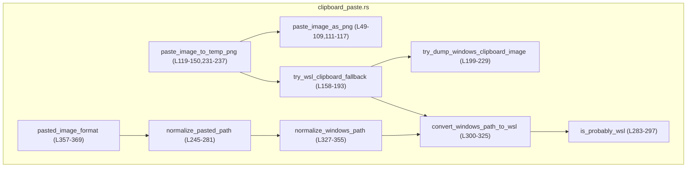
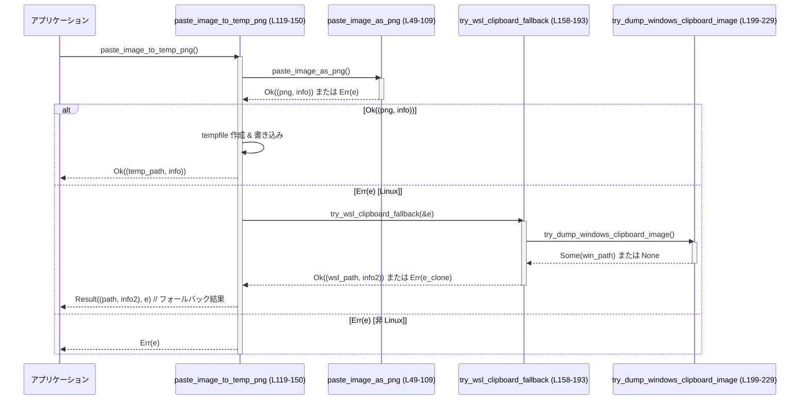

tui/src/clipboard_paste.rs

---

## 0. ざっくり一言

システムのクリップボードから画像やパス文字列を取り出し、  
PNG バイト列・一時ファイル・正規化されたファイルパスとして扱うためのユーティリティ群です  
（WSL/Windows/Unix/Android など OS ごとの差異を吸収します）。

---

## 1. このモジュールの役割

### 1.1 概要

- 画像コピー（クリップボードにある画像）を PNG 形式のバイト列として取得し、そのメタ情報（幅・高さ・形式）を返します（`paste_image_as_png`、clipboard_paste.rs:L49-109, L111-117）。
- PNG を一時ファイルに書き出し、そのパスとメタ情報を返します（`paste_image_to_temp_png`、clipboard_paste.rs:L119-150, L231-237）。
- 貼り付けられたテキストを「パス」として解釈できる形に正規化します（`normalize_pasted_path`、clipboard_paste.rs:L245-281）。
- パスから画像拡張子（PNG/JPEG/その他）を推定します（`pasted_image_format`、clipboard_paste.rs:L357-369）。
- Linux+WSL 環境では、Windows 側の PowerShell を叩いてクリップボード画像を一時 PNG として取得するフォールバックを提供します（`try_wsl_clipboard_fallback` など、clipboard_paste.rs:L158-229, L283-325）。

### 1.2 アーキテクチャ内での位置づけ

このモジュールは TUI 層から呼び出され、外部ライブラリと OS 機能をまとめてラップする「境界層」の役割を持ちます。

- 画像系:
  - `paste_image_as_png` → `arboard::Clipboard` 経由で画像を取得 → `image` クレートで PNG にエンコード（clipboard_paste.rs:L49-109）。
  - `paste_image_to_temp_png` → 上記を呼び出し → `tempfile::Builder` で一時ファイル作成（clipboard_paste.rs:L119-150）。
  - Linux かつ失敗時 → `try_wsl_clipboard_fallback` → `try_dump_windows_clipboard_image` + PowerShell → `convert_windows_path_to_wsl`（clipboard_paste.rs:L158-229, L283-325）。

- パス系:
  - `normalize_pasted_path` → `url::Url` で file:// を処理 → Windows/UNC パス検出 → `shlex::Shlex` でシェルエスケープ解除（clipboard_paste.rs:L245-281）。
  - Windows パス正規化の内部で `normalize_windows_path` / `convert_windows_path_to_wsl` / `is_probably_wsl` を利用（clipboard_paste.rs:L283-355）。

Mermaid 図（主要コンポーネントと依存関係・このファイル内のみ）:



※ 外部クレート（`arboard`, `image`, `url`, `shlex`, `tempfile`, `tracing`）はこの図では省略していますが、いずれもこのモジュールから直接利用されています（例: clipboard_paste.rs:L54, L95, L203, L271, L126, L52）。

### 1.3 設計上のポイント

- **エラーモデル**  
  - 独自エラー型 `PasteImageError` にクリップボード・エンコード・I/O などの失敗を集約しています（clipboard_paste.rs:L5-23）。
  - パス正規化系は、失敗を「None」で表す `Option` を返します（clipboard_paste.rs:L245-281）。
- **プラットフォームごとの分岐**  
  - `#[cfg(target_os = "...")]` により Android / Linux / その他をコンパイル時に分岐しています（例: clipboard_paste.rs:L50, L112, L120, L158, L231, L283, L299, L371, L375）。
- **フォールバック戦略**  
  - 画像コピー取得は、まずネイティブな arboard を試し、Linux+WSL では PowerShell 経由の Windows クリップボードにフォールバックします（clipboard_paste.rs:L119-150, L158-193）。
  - Windows パスも、WSL 上では `/mnt/<drive>` 形式に変換するフォールバックがあります（clipboard_paste.rs:L327-355, L300-325, L283-297）。
- **Rust の安全性**  
  - 全体を通して `unsafe` は使用していません。
  - 失敗は `Result` / `Option` で表現され、`unwrap` や `expect` によるパニックはテストコード以外にありません。

---

## 2. 主要な機能一覧

- クリップボード画像の取得: `paste_image_as_png` で PNG バイト列と画像情報を返す（clipboard_paste.rs:L49-109, L111-117）。
- クリップボード画像を一時 PNG ファイルとして保存: `paste_image_to_temp_png`（clipboard_paste.rs:L119-150, L231-237）。
- WSL での Windows クリップボード画像フォールバック取得: `try_wsl_clipboard_fallback` + `try_dump_windows_clipboard_image`（clipboard_paste.rs:L158-229）。
- クリップボードなどから貼り付けられた文字列をファイルパスへ正規化: `normalize_pasted_path`（clipboard_paste.rs:L245-281）。
- Windows / UNC パスの検出と WSL パスへの変換: `normalize_windows_path`, `convert_windows_path_to_wsl`, `is_probably_wsl`（clipboard_paste.rs:L327-355, L300-325, L283-297）。
- パス拡張子から画像形式を推定: `pasted_image_format`（clipboard_paste.rs:L357-369）。

---

## 3. 公開 API と詳細解説

### 3.1 型一覧（構造体・列挙体など）

| 名前 | 種別 | 公開範囲 | 役割 / 用途 | 根拠 |
|------|------|----------|-------------|------|
| `PasteImageError` | enum | `pub` | クリップボード取得失敗・画像なし・エンコード失敗・I/O エラーを表すエラー型 | clipboard_paste.rs:L5-23 |
| `EncodedImageFormat` | enum | `pub` | PNG/JPEG/その他の 3 種類の画像形式を表す。ラベル表示用メソッド `label` を持つ | clipboard_paste.rs:L25-40 |
| `PastedImageInfo` | struct | `pub` | 貼り付けられた画像の幅・高さ・エンコード形式（現状常に PNG）を保持 | clipboard_paste.rs:L42-47 |

### 3.2 関数詳細（7 件）

#### `paste_image_as_png() -> Result<(Vec<u8>, PastedImageInfo), PasteImageError>` （非 Android 版）

- 範囲: clipboard_paste.rs:L49-109

**概要**

- システムのクリップボードから画像を取得し、PNG にエンコードして `Vec<u8>` と `PastedImageInfo` を返します。
- 画像がファイルとして存在する場合と画像データとして存在する場合の両方に対応し、ファイルがあればそちらを優先します（clipboard_paste.rs:L56-67）。

**引数**

- なし。

**戻り値**

- `Ok((png_bytes, info))`:
  - `png_bytes: Vec<u8>`: PNG 形式にエンコードされた画像バイト列。
  - `info: PastedImageInfo`: 幅・高さ・エンコード形式（常に `Png`）。
- `Err(PasteImageError)`:
  - 後述の「Errors / Panics」参照。

**内部処理の流れ**

1. `tracing::debug_span` でスパンを開始し、デバッグログを記録（clipboard_paste.rs:L52-53）。
2. `arboard::Clipboard::new()` でクリップボードを開く。失敗した場合は `ClipboardUnavailable` を返す（clipboard_paste.rs:L54-55）。
3. `cb.get().file_list()` でクリップボード上のファイルリストを取得しようとする（clipboard_paste.rs:L59-62）。  
   - ここではエラーを `ClipboardUnavailable` に変換していますが（`map_err`）、その後 `unwrap_or_default()` で失敗時は空リストにフォールバックするため、エラーは表面化しません（clipboard_paste.rs:L63-64）。
4. ファイルリストから `image::open(f)` で画像として開ける最初のファイルを探します（clipboard_paste.rs:L63-67）。  
   - 見つかった場合、その `DynamicImage` を利用します（clipboard_paste.rs:L68-73）。
5. ファイルが見つからなければ、`cb.get_image()` で生画像データを取得します（clipboard_paste.rs:L75-78）。  
   - 失敗した場合は `NoImage` エラー。
6. 幅・高さを `u32` に変換しログ出力（clipboard_paste.rs:L79-81）。
7. `image::RgbaImage::from_raw(w, h, img.bytes.into_owned())` で RGBA バッファから `RgbaImage` を生成し、`DynamicImage::ImageRgba8` に包む（clipboard_paste.rs:L83-87）。  
   - 不正なバッファなら `EncodeFailed("invalid RGBA buffer")` を返す。
8. `dynamic_img.write_to(cursor, ImageFormat::Png)` で PNG 形式にエンコードして `png` バイト列に書き込み、バイト数を `tracing` で記録（clipboard_paste.rs:L90-99）。
9. PNG バイト列と `PastedImageInfo { width, height, encoded_format: Png }` を `Ok` で返す（clipboard_paste.rs:L101-108）。

**Examples（使用例）**

```rust
// クリップボードから画像を PNG として取得し、ファイルに保存する例
fn save_clipboard_png() -> Result<(), tui::clipboard_paste::PasteImageError> {
    // PNG バイト列と画像情報を取得
    let (png_bytes, info) = tui::clipboard_paste::paste_image_as_png()?; // 失敗時は PasteImageError

    // 情報をログ出力
    println!("幅: {}, 高さ: {}", info.width, info.height);

    // 任意の場所に保存
    std::fs::write("clipboard.png", &png_bytes)
        .map_err(|e| tui::clipboard_paste::PasteImageError::IoError(e.to_string()))?;
    Ok(())
}
```

**Errors / Panics**

- `Err(PasteImageError::ClipboardUnavailable(msg))`  
  - `arboard::Clipboard::new()` が失敗した場合（clipboard_paste.rs:L54-55）。
  - `file_list` の失敗は握りつぶされるため、ここからは返りません。
- `Err(PasteImageError::NoImage(msg))`  
  - `cb.get_image()` が失敗した場合（クリップボードに画像がないなど、clipboard_paste.rs:L76-78）。
- `Err(PasteImageError::EncodeFailed(msg))`  
  - RGBA バッファが不正で `RgbaImage::from_raw` が `None` を返した場合（clipboard_paste.rs:L83-85）。
  - PNG エンコード `dyn_img.write_to` が失敗した場合（clipboard_paste.rs:L95-97）。
- `Err(PasteImageError::IoError(_))`  
  - この関数内では発生しません（I/O は行っていない）。

- パニック要因:
  - 本体コード中には `unwrap` / `expect` はなく、`?` も使っていないため、ロジック上のパニック要因は見当たりません（clipboard_paste.rs:L49-109）。

**Edge cases（エッジケース）**

- クリップボードにファイルと画像データ両方がある場合:  
  - ファイルリストから最初に開ける画像ファイルを優先します（clipboard_paste.rs:L63-73）。
- `file_list` がエラーになる場合:  
  - `unwrap_or_default()` により空リストとして扱われ、画像データ経路にフォールバックします（clipboard_paste.rs:L63-64）。
- サイズが 0 の画像や異常なバッファ:  
  - `RgbaImage::from_raw` が `None` を返すと `EncodeFailed` になります（clipboard_paste.rs:L83-85）。

**使用上の注意点**

- 処理は同期かつブロッキングです。  
  - クリップボードアクセス・PNG エンコードは時間がかかる可能性があるため、UI スレッドから頻繁に呼び出すとフリーズ感が出る可能性があります。
- OS 依存:
  - このバージョンは Android ではコンパイルされず、Android では別実装が常にエラーを返します（clipboard_paste.rs:L111-117）。
- マルチスレッド:
  - 内部でグローバルなクリップボードにアクセスするため、他スレッドから同時に `arboard` を使う場合はライブラリ側のスレッドセーフティに従う必要があります。このコード自体には共有状態はありません。

---

#### `paste_image_as_png() -> Result<(Vec<u8>, PastedImageInfo), PasteImageError>` （Android 版）

- 範囲: clipboard_paste.rs:L111-117

**概要**

- Android/Termux 環境では `arboard` がサポートされないため、常に `ClipboardUnavailable` エラーを返して「未対応」であることを明示します。

**戻り値**

- 常に `Err(PasteImageError::ClipboardUnavailable("clipboard image paste is unsupported on Android".into()))`（clipboard_paste.rs:L113-116）。

**使用上の注意点**

- Android ターゲットではこの関数を使った画像ペーストはサポートされていない前提になります。

---

#### `paste_image_to_temp_png() -> Result<(PathBuf, PastedImageInfo), PasteImageError>`（非 Android 版）

- 範囲: clipboard_paste.rs:L119-150

**概要**

- `paste_image_as_png` で取得した PNG バイト列を一時ファイルに書き出し、そのファイルパスと画像情報を返す高レベル API です。
- Linux かつ WSL 環境で `paste_image_as_png` が失敗した場合、PowerShell を用いた Windows クリップボードフォールバックを試みます（clipboard_paste.rs:L140-147, L158-193）。

**引数**

- なし。

**戻り値**

- `Ok((path, info))`:
  - `path: PathBuf`: `.png` 拡張子を持つ一時ファイルのパス。
  - `info: PastedImageInfo`: 画像の幅・高さ・エンコード形式（PNG）。
- `Err(PasteImageError)`:  
  - `paste_image_as_png` または WSL フォールバックが失敗した場合の元エラーなど。

**内部処理の流れ**

1. `paste_image_as_png()` を呼び、PNG バイト列と `PastedImageInfo` を取得（clipboard_paste.rs:L123-124）。
2. 成功時:
   - `tempfile::Builder::new().prefix("codex-clipboard-").suffix(".png").tempfile()` で一時ファイルを作成（clipboard_paste.rs:L126-130）。
   - `std::fs::write(tmp.path(), &png)` で PNG バイト列を書き込み（clipboard_paste.rs:L131-132）。
   - `tmp.keep()` で一時ファイルを永続化し、`(file, path)` のうち `path` を取得（clipboard_paste.rs:L134-136）。
   - `Ok((path, info))` を返す（clipboard_paste.rs:L137-137）。
3. `paste_image_as_png` が `Err(e)` を返した場合:
   - Linux ターゲットなら `try_wsl_clipboard_fallback(&e).or(Err(e))` を実行し、WSL フォールバックに成功すればその結果を返す（clipboard_paste.rs:L140-143）。
   - それ以外の OS ではそのまま `Err(e)` を返す（clipboard_paste.rs:L144-147）。

**Examples（使用例）**

```rust
// 一時 PNG ファイルとしてクリップボード画像を取得し、そのパスを表示する例
fn print_temp_png_path() -> Result<(), tui::clipboard_paste::PasteImageError> {
    let (path, info) = tui::clipboard_paste::paste_image_to_temp_png()?; // 画像がなければエラー

    println!("一時ファイル: {}", path.display());
    println!("サイズ: {}x{}", info.width, info.height);
    Ok(())
}
```

**Errors / Panics**

- `PasteImageError::ClipboardUnavailable` / `NoImage` / `EncodeFailed`  
  - `paste_image_as_png` 側のエラーをそのまま返すか、WSL フォールバックが適用されなかった場合に返されます。
- `PasteImageError::IoError`  
  - 一時ファイル作成・書き込み・`keep` の各ステップで I/O エラーが発生した場合（clipboard_paste.rs:L126-136）。
- パニック:
  - 本体に `unwrap` 等はなく、エラーは全て `Result` 経由で返されます。

**Edge cases（エッジケース）**

- WSL 環境で Linux 側クリップボード（`arboard`）から取得できない場合:
  - `try_wsl_clipboard_fallback` を試み、Windows クリップボード側から画像取得を試します（clipboard_paste.rs:L140-143）。
- 一時ファイルは `keep()` により明示的に残されます:
  - `tempfile::TempPath` のライフタイム終了時に消えないようにしている点に注意（clipboard_paste.rs:L134-137）。

**使用上の注意点**

- 戻り値の `PathBuf` はファイルを削除しません。  
  - 利用者側で不要になったら削除する必要があります。
- 処理はファイル I/O を含むため、頻繁な呼び出しや大きな画像では性能への影響があります。
- Linux/WSL で PowerShell を呼び出すため、環境に `powershell.exe` などがインストールされている前提です（clipboard_paste.rs:L205-227）。

---

#### `try_wsl_clipboard_fallback(error: &PasteImageError) -> Result<(PathBuf, PastedImageInfo), PasteImageError>`  

- 範囲: clipboard_paste.rs:L158-193  
- `#[cfg(target_os = "linux")]` のみで有効。

**概要**

- Linux（特に WSL）環境で `paste_image_as_png` が `ClipboardUnavailable` または `NoImage` を返した場合に、Windows 側のクリップボード画像を PowerShell で一時ファイルとして保存し、その WSL パスを返すフォールバック処理です。

**引数**

| 引数名 | 型 | 説明 |
|--------|----|------|
| `error` | `&PasteImageError` | 元のエラー。フォールバックの対象となるエラー種別かどうか判断するために使用します。 |

**戻り値**

- `Ok((path, info))`:
  - `path`: WSL からアクセス可能な PNG ファイルのパス。
  - `info`: 画像の幅・高さ・PNG 形式であることを示す `PastedImageInfo`。
- `Err(PasteImageError)`:
  - フォールバック対象外の場合や、PowerShell 経由で画像取得に失敗した場合は、元の `error` のクローンを返します（clipboard_paste.rs:L165-167, L171-172, L176-177, L180-181）。

**内部処理の流れ**

1. `is_probably_wsl()` で WSL 環境と思われるかをチェックし、かつ `error` が `ClipboardUnavailable` または `NoImage` の場合のみ続行します（clipboard_paste.rs:L162-166）。
2. WSL でない、またはエラー種別が対象外なら `Err(error.clone())` を返して終了（clipboard_paste.rs:L165-167）。
3. デバッグログを出力し、`try_dump_windows_clipboard_image()` を呼び出して Windows 側でクリップボード画像を一時 PNG ファイルとして保存し、その Windows パスを取得します（clipboard_paste.rs:L169-172）。
4. Windows パスが取得できなければ `Err(error.clone())` を返します（clipboard_paste.rs:L170-172）。
5. `convert_windows_path_to_wsl(&win_path)` で WSL 上のパスに変換します。失敗した場合も `Err(error.clone())` を返します（clipboard_paste.rs:L174-177）。
6. `image::image_dimensions(&mapped_path)` で画像の幅・高さを取得し、失敗すれば `Err(error.clone())` を返します（clipboard_paste.rs:L179-181）。
7. `PastedImageInfo { width: w, height: h, encoded_format: Png }` を作り、`Ok((mapped_path, info))` を返します（clipboard_paste.rs:L183-192）。

**Examples（使用例）**

通常は `paste_image_to_temp_png` 内部からのみ呼ばれる想定で、外部から直接呼ぶケースは少ないですが、擬似コードとしては以下のようになります（Linux+WSL 前提）:

```rust
fn try_clipboard_with_wsl_fallback()
    -> Result<(std::path::PathBuf, tui::clipboard_paste::PastedImageInfo),
              tui::clipboard_paste::PasteImageError>
{
    use tui::clipboard_paste::{paste_image_as_png, PasteImageError};

    match paste_image_as_png() {
        Ok((png, info)) => {
            // ここでは png を自前で保存するなどの処理を行う
            let path = std::path::PathBuf::from("clipboard.png");
            std::fs::write(&path, &png).unwrap();
            Ok((path, info))
        }
        Err(e) => {
            // Linux + WSL ならフォールバックを試す
            #[cfg(target_os = "linux")]
            {
                tui::clipboard_paste::try_wsl_clipboard_fallback(&e)
            }
            #[cfg(not(target_os = "linux"))]
            {
                Err(e)
            }
        }
    }
}
```

**Errors / Panics**

- いずれの失敗ケースでも、新しいエラーではなく **元の `error` を clone して返す** ことがポイントです（clipboard_paste.rs:L165-167, L171-172, L176-177, L180-181）。
  - これにより呼び出し元側では「フォールバックを試したかどうか」にかかわらず、同じエラー種別で扱えます。
- パニック要因はありません。

**Edge cases（エッジケース）**

- 実際は WSL だが `is_probably_wsl()` が false を返す場合:
  - フォールバックは実行されず、元のエラーを返します（clipboard_paste.rs:L165-167）。
- PowerShell が見つからない、実行に失敗する、画像がクリップボードにない場合:
  - `try_dump_windows_clipboard_image` が `None` を返し、元のエラーを返します（clipboard_paste.rs:L170-172, L199-229）。
- Windows パスが UNC パス（`\\server\share`）の場合:
  - `convert_windows_path_to_wsl` は `None` を返すため、フォールバックも失敗扱いになります（clipboard_paste.rs:L300-303）。

**使用上の注意点**

- この関数自体が `#[cfg(target_os = "linux")]` で隠蔽されているため、クロスプラットフォームコードでは `paste_image_to_temp_png` を通して利用するのが自然です。
- PowerShell 実行はブロッキングであり、かつ外部プロセス起動のオーバーヘッドがあります。UI スレッドからの多用には注意が必要です（clipboard_paste.rs:L205-227）。

---

#### `try_dump_windows_clipboard_image() -> Option<String>`

- 範囲: clipboard_paste.rs:L199-229  
- `#[cfg(target_os = "linux")]` のみで有効。

**概要**

- WSL 環境から Windows 側の PowerShell を実行し、クリップボードの画像を一時 PNG ファイルとして保存させ、その Windows パスを標準出力から取得します。

**引数**

- なし。

**戻り値**

- `Some(win_path)`: クリップボード画像を一時 PNG ファイルに保存でき、そのファイルパスが取得できた場合。
- `None`: PowerShell が見つからない・実行に失敗した・画像がないなど、いずれかの理由で取得できなかった場合。

**内部処理の流れ**

1. PowerShell スクリプト `script` を定義（clipboard_paste.rs:L203-203）。
   - クリップボードから画像を取得 (`Get-Clipboard -Format Image`)。
   - 一時ファイルを作成し `.png` に拡張子変更。
   - 画像を PNG で保存し、パスを標準出力に書き出す。
   - 画像がなければ `exit 1`。
2. `["powershell.exe", "pwsh", "powershell"]` の順に、コマンドを試す（clipboard_paste.rs:L205-205）。
3. 各コマンドについて `std::process::Command::new(cmd).args(["-NoProfile", "-Command", script]).output()` を実行（clipboard_paste.rs:L206-208）。
4. `Ok(output)` で返ってきた場合:
   - ステータスが成功なら `output.stdout` を UTF-8 としてデコードし、トリムして非空ならそれをパスとして `Some(win_path)` を返す（clipboard_paste.rs:L211-218）。
   - 失敗ステータスならデバッグログのみ（clipboard_paste.rs:L219-221）。
5. コマンド実行自体が `Err(err)` なら、デバッグログを出し次のコマンドを試す（clipboard_paste.rs:L223-225）。
6. すべて失敗した場合は `None`（clipboard_paste.rs:L228-228）。

**Examples（使用例）**

通常は `try_wsl_clipboard_fallback` 内部でしか使いませんが、単体利用イメージ:

```rust
#[cfg(target_os = "linux")]
fn debug_win_clipboard_path() {
    if let Some(win_path) = tui::clipboard_paste::try_dump_windows_clipboard_image() {
        println!("Windows 側一時ファイル: {}", win_path);
    } else {
        println!("クリップボード画像なし、または PowerShell 実行に失敗");
    }
}
```

**Errors / Panics**

- エラーはすべて `None` という形で吸収されます。  
  - 成功/失敗は `output.status.success()` と `Result` の分岐で判定しており、パニックはありません（clipboard_paste.rs:L210-227）。

**Edge cases（エッジケース）**

- PowerShell がインストールされていない:
  - すべての `Command::new(cmd)` が `Err` となり、`None` を返します（clipboard_paste.rs:L205-227）。
- クリップボードに画像がない:
  - スクリプト内で `exit 1` が呼ばれ、`status.success()` が false になり、`None` になります（clipboard_paste.rs:L211-221）。
- パスの出力に改行が含まれる:
  - `trim()` により前後の空白や改行が除去されます（clipboard_paste.rs:L214-215）。

**使用上の注意点**

- コマンド名配列は固定であり、ユーザー入力を介さないためコマンドインジェクションのリスクは低いです。
- ただし外部プロセス起動自体がコストを伴い、また実行環境に依存するため、失敗ケースは想定に入れておく必要があります。

---

#### `normalize_pasted_path(pasted: &str) -> Option<PathBuf>`

- 範囲: clipboard_paste.rs:L245-281

**概要**

- クリップボードから貼り付けられたテキストがファイルパスを表している可能性を考慮し、  
  - `file://` URL  
  - Windows/UNC パス  
  - シェルエスケープ済み文字列や引用符で囲まれたパス  
  を、`PathBuf` として扱いやすい形に正規化します。

**引数**

| 引数名 | 型 | 説明 |
|--------|----|------|
| `pasted` | `&str` | ユーザーから貼り付けられたテキスト。前後の空白や引用符を含んでいてもよい。 |

**戻り値**

- `Some(path)`: パスとして妥当と解釈できた場合。
- `None`: 複数のトークンが含まれているなど、単一のパスとみなせない場合。

**内部処理の流れ**

1. 入力文字列を `trim` して前後の空白を削除（clipboard_paste.rs:L246）。
2. 先頭と末尾が同じ引用符（`"` または `'`）で囲まれていれば取り除き、`unquoted` に格納（clipboard_paste.rs:L247-251）。
3. `unquoted` を `url::Url::parse` に渡し、`file://` URL なら `url.to_file_path()` でローカルパスに変換（clipboard_paste.rs:L253-257）。
4. `normalize_windows_path(unquoted)` を呼び、Windows/UNC パスであればそれを `Some(PathBuf)` として返す（clipboard_paste.rs:L266-268）。
5. それ以外の場合、`shlex::Shlex::new(pasted).collect()` でシェル風トークナイズを行う（clipboard_paste.rs:L271-271）。
6. トークン数が 1 の場合のみ続行し、それ以外は `None` を返す（clipboard_paste.rs:L272-273, L279-280）。
7. 単一トークンを `part` とし、再度 `normalize_windows_path(&part)` を試す（clipboard_paste.rs:L274-276）。
8. Windows として扱えなければ、そのまま `PathBuf::from(part)` を返す（clipboard_paste.rs:L277-277）。

**Examples（使用例）**

```rust
// さまざまな貼り付け文字列をパスに正規化する例
fn handle_paste(input: &str) {
    match tui::clipboard_paste::normalize_pasted_path(input) {
        Some(path) => println!("パスとして解釈: {}", path.display()),
        None => println!("単一のパスとは判断できません: {}", input),
    }
}

fn main() {
    handle_paste("file:///tmp/example.png");            // Unix file URL
    handle_paste(r"'C:\\Users\\Alice\\My File.png'");   // Windows パス + 単一引用符
    handle_paste("/home/user/a\\ b.png /home/user/c"); // 複数トークン → None
}
```

**Errors / Panics**

- `url::Url::parse` のエラーは `if let Ok(url)` で吸収されます（clipboard_paste.rs:L253-256）。
- `shlex::Shlex::new(...).collect()` はエラーを返さないため、この関数内に `Result` は登場しません。
- パニック要因は見当たりません（`unwrap` 等なし）。

**Edge cases（エッジケース）**

テストコードが詳細にカバーしています（clipboard_paste.rs:L371-548）。

- `file://` URL
  - Unix 環境: `"file:///tmp/example.png"` → `/tmp/example.png`（normalize_file_url, clipboard_paste.rs:L375-381）。
- Windows ドライブレター付きパス
  - `C:\Temp\example.png` →  
    - Linux + WSL で変換可能なら `/mnt/c/Temp/example.png`、そうでなければ `C:\Temp\example.png`（clipboard_paste.rs:L383-398）。
- シェルエスケープされた Unix パス
  - `"/home/user/My\ File.png"` → `/home/user/My File.png`（clipboard_paste.rs:L400-405）。
- 単一/二重引用符で囲まれたパス
  - `"\"/home/user/My File.png\""` や `"'...'"` などを両対応（clipboard_paste.rs:L407-419）。
- 複数トークンを含む入力
  - `/home/user/a\ b.png /home/user/c.png` → `None`（clipboard_paste.rs:L421-427）。
- Windows パス + 引用符/スペース/UNC など
  - テスト `normalize_single_quoted_windows_path` ほか多数でカバー（clipboard_paste.rs:L453-505, L509-515, L519-531, L535-547）。

**使用上の注意点**

- 戻り値が `Option<PathBuf>` であるため、「パスでない」ケースを必ず処理する必要があります。
- Windows パスの WSL 変換は Linux+WSL 環境でのみ行われ、それ以外の OS では文字列そのままの `PathBuf` が返ります（clipboard_paste.rs:L327-355）。
- UNC パス（`\\server\share\...`）は WSL 変換の対象外で、そのまま PathBuf として返されます（clipboard_paste.rs:L339-343, L300-303, L509-515）。

---

#### `is_probably_wsl() -> bool`

- 範囲: clipboard_paste.rs:L283-297  
- `#[cfg(target_os = "linux")]` のみで有効。

**概要**

- 実行環境が WSL（Windows Subsystem for Linux）である「可能性が高いか」をヒューリスティックに判定します。

**引数**

- なし。

**戻り値**

- `true`: `WSL` と判断される要素が見つかった場合。
- `false`: そうでない場合。

**内部処理の流れ**

1. `/proc/version` を読み、その内容を小文字化して `"microsoft"` または `"wsl"` を含んでいれば `true`（clipboard_paste.rs:L285-290）。
2. 読み込みに失敗した、または上記文字列を含まない場合:
   - 環境変数 `WSL_DISTRO_NAME` または `WSL_INTEROP` が存在すれば `true`（clipboard_paste.rs:L293-296）。
3. どれにも当てはまらなければ `false`。

**Examples（使用例）**

```rust
#[cfg(target_os = "linux")]
fn log_if_wsl() {
    if tui::clipboard_paste::is_probably_wsl() {
        println!("WSL 環境と推定されました");
    } else {
        println!("WSL ではない可能性が高いです");
    }
}
```

**使用上の注意点**

- あくまで「推定」であり、100% 正確ではありませんとコードコメントで示されています（環境変数を補助的に参照している、clipboard_paste.rs:L293-296）。
- この判定は WSL フォールバックのトリガーとしてのみ使われています（`try_wsl_clipboard_fallback`, `normalize_windows_path` など）。

---

#### `convert_windows_path_to_wsl(input: &str) -> Option<PathBuf>`

- 範囲: clipboard_paste.rs:L299-325  
- `#[cfg(target_os = "linux")]` のみで有効。

**概要**

- Windows のローカルドライブパス（例: `C:\Users\Alice\file.png`）を WSL 上の `/mnt/<drive>/...` 形式に変換します。
- UNC パス（`\\server\share\...`）は変換対象外です。

**引数**

| 引数名 | 型 | 説明 |
|--------|----|------|
| `input` | `&str` | Windows 形式のパス文字列 |

**戻り値**

- `Some(wsl_path)`: 変換に成功した場合。
- `None`: UNC パスやドライブレター形式でないなど、変換できない場合。

**内部処理の流れ**

1. UNC パス (`\\` で始まる）なら即座に `None`（clipboard_paste.rs:L300-303）。
2. 最初の文字をドライブレター候補として取得し、小文字化（clipboard_paste.rs:L305-306）。
3. それが ASCII 英字でない場合や、次の文字が `:` でない場合は `None`（clipboard_paste.rs:L306-312）。
4. `/mnt/<drive_letter>` をベースとする `PathBuf` を作成し、それ以降の部分を `\` または `/` で分割して順次 `push`（clipboard_paste.rs:L314-321）。
5. 最後に `Some(result)` を返す（clipboard_paste.rs:L324-324）。

**Examples（使用例）**

```rust
#[cfg(target_os = "linux")]
fn demo_convert_windows_to_wsl() {
    let input = r"C:\Users\Alice\Pictures\example image.png";
    if let Some(wsl_path) = tui::clipboard_paste::convert_windows_path_to_wsl(input) {
        println!("WSL パス: {}", wsl_path.display()); // /mnt/c/Users/Alice/Pictures/example image.png
    }
}
```

**使用上の注意点**

- UNC パスはサポートされません（`None` を返します）。
- Linux 環境以外ではこの関数はコンパイルされません。

---

#### `normalize_windows_path(input: &str) -> Option<PathBuf>`

- 範囲: clipboard_paste.rs:L327-355

**概要**

- 入力文字列が Windows ドライブレター付きパスまたは UNC パスであるかを検出し、Linux+WSL の場合には可能なら WSL パスに変換します。そうでない場合はそのまま Windows 形式の `PathBuf` を返します。

**引数**

| 引数名 | 型 | 説明 |
|--------|----|------|
| `input` | `&str` | パス候補文字列 |

**戻り値**

- `Some(path)`: Windows/UNC パスと認識された場合。
- `None`: Windows パスではないと判断された場合。

**内部処理の流れ**

1. ドライブレター形式かどうかを判定（clipboard_paste.rs:L329-338）。
   - 先頭が英字で、次が `:`, その次が `\` または `/` であるか。
2. UNC 形式かどうかを判定（`input.starts_with("\\\\")`）（clipboard_paste.rs:L339-340）。
3. どちらでもなければ `None` を返す（clipboard_paste.rs:L341-343）。
4. Linux ターゲットの場合:
   - `is_probably_wsl()` が true かつ `convert_windows_path_to_wsl(input)` が `Some` を返した場合、それを返す（clipboard_paste.rs:L345-351）。
5. 上記以外の場合は `PathBuf::from(input)` を `Some` で返す（clipboard_paste.rs:L354-354）。

**Examples（使用例）**

```rust
fn handle_maybe_windows_path(input: &str) {
    match tui::clipboard_paste::normalize_windows_path(input) {
        Some(path) => println!("Windows 系パスとして扱う: {}", path.display()),
        None => println!("Windows パスではありません: {}", input),
    }
}
```

**Edge cases（エッジケース）**

- WSL で `C:\Users\Alice\...` を渡した場合:
  - `is_probably_wsl()` が true で、`convert_windows_path_to_wsl` が成功すれば `/mnt/c/...` に変換されます（clipboard_paste.rs:L345-351, L300-325）。
- UNC パス (`\\server\share`):
  - Windows パスとして `Some(PathBuf)` を返し、WSL 変換は行われません（clipboard_paste.rs:L339-343, L300-303）。

**使用上の注意点**

- この関数は `normalize_pasted_path` の内部で使用され、直接外部に公開されていません。
- Windows ネイティブ環境では WSL 判定・変換に関連する `cfg` ブロックがコンパイルされないため、Windows 形式のパスがそのまま `PathBuf` として返ります。

---

### 3.3 その他の関数

| 関数名 | シグネチャ | 公開範囲 | 役割（1 行） | 根拠 |
|--------|-----------|----------|--------------|------|
| `paste_image_to_temp_png` (Android) | `pub fn paste_image_to_temp_png() -> Result<(PathBuf, PastedImageInfo), PasteImageError>` | `pub`, `#[cfg(target_os = "android")]` | Android では常に `ClipboardUnavailable` エラーを返して未サポートを示す | clipboard_paste.rs:L231-237 |
| `pasted_image_format` | `pub fn pasted_image_format(path: &Path) -> EncodedImageFormat` | `pub` | パスの拡張子から PNG/JPEG/その他を推定する単純なユーティリティ | clipboard_paste.rs:L357-369 |
| `EncodedImageFormat::label` | `pub fn label(self) -> &'static str` | `pub` メソッド | 形式に応じて `"PNG"`, `"JPEG"`, `"IMG"` のラベルを返す | clipboard_paste.rs:L32-39 |

---

## 4. データフロー

ここでは、最も代表的なシナリオである **クリップボード画像を一時ファイルとして保存する** 流れを示します（非 Android 環境）。

### 処理の要点

1. アプリケーションコードが `paste_image_to_temp_png()` を呼び出す（clipboard_paste.rs:L121-150）。
2. 内部で `paste_image_as_png()` を呼び出し、PNG バイト列と画像情報を取得（clipboard_paste.rs:L123-124）。
3. 取得に失敗した場合、Linux+WSL なら `try_wsl_clipboard_fallback()` で Windows クリップボードを試す（clipboard_paste.rs:L140-143, L158-193）。
4. 成功した PNG データを一時ファイルに書き込み、`PathBuf` と `PastedImageInfo` を返す（clipboard_paste.rs:L126-137）。

### シーケンス図



---

## 5. 使い方（How to Use）

### 5.1 基本的な使用方法

#### クリップボード画像を一時 PNG として扱う

```rust
use std::error::Error;
use tui::clipboard_paste::{paste_image_to_temp_png, pasted_image_format};

fn main() -> Result<(), Box<dyn Error>> {
    // クリップボードから画像を取得し、一時 PNG ファイルとして保存
    let (path, info) = paste_image_to_temp_png()?; // 画像が無い／クリップボード未対応なら PasteImageError

    println!("一時ファイル: {}", path.display());
    println!("サイズ: {}x{}", info.width, info.height);

    // ファイルの拡張子から画像形式を推定（念のため）
    let fmt = pasted_image_format(&path);
    println!("推定形式: {}", fmt.label());

    // 利用後に削除する場合
    std::fs::remove_file(&path)?;

    Ok(())
}
```

ポイント:

- `PasteImageError` は `std::error::Error` を実装しているため、`Box<dyn Error>` によるエラーハンドリングが可能です（clipboard_paste.rs:L13-23）。
- 一時ファイルは自動削除されないため、自前で削除する必要があります（clipboard_paste.rs:L134-137）。

### 5.2 よくある使用パターン

#### 貼り付け文字列からパスを取得して開く

```rust
use std::fs::File;
use tui::clipboard_paste::normalize_pasted_path;

fn open_pasted_path(pasted: &str) {
    match normalize_pasted_path(pasted) {
        Some(path) => {
            println!("開こうとしているパス: {}", path.display());
            match File::open(&path) {
                Ok(_f) => println!("ファイルを開きました"),
                Err(e) => eprintln!("ファイルを開けませんでした: {}", e),
            }
        }
        None => {
            eprintln!("単一のパスとして解釈できません: {}", pasted);
        }
    }
}
```

- `file://` URL や Windows/UNC パス、シェルエスケープされたパスなどを一括で扱えるため、ペースト操作の UX 向上に利用できます。

#### WSL 環境での Windows パス処理

```rust
#[cfg(target_os = "linux")]
fn handle_windows_path_in_wsl(raw: &str) {
    if let Some(path) = tui::clipboard_paste::normalize_windows_path(raw) {
        println!("正規化パス: {}", path.display());
    } else {
        println!("Windows パスではありません: {}", raw);
    }
}
```

- Windows のクリップボードからコピーされたパス（`C:\...`）を WSL 側の `/mnt/c/...` に変換する用途です。

### 5.3 よくある間違い

```rust
// 間違い例: normalize_pasted_path の None を無視してそのまま PathBuf にする
fn wrong_use(pasted: &str) {
    // 「パスっぽいから」と決め打ちで使ってしまう
    let path = std::path::PathBuf::from(pasted);
    // 実際にはスペース区切りで複数パスが含まれていたり、URL 文字列のままかもしれない
}

// 正しい例: normalize_pasted_path を使い、None を扱う
fn correct_use(pasted: &str) {
    if let Some(path) = tui::clipboard_paste::normalize_pasted_path(pasted) {
        println!("正規化パス: {}", path.display());
    } else {
        println!("単一のパスとしては扱えません: {}", pasted);
    }
}
```

```rust
// 間違い例: paste_image_to_temp_png のエラー内容を無視する
fn wrong_clipboard_use() {
    let _ = tui::clipboard_paste::paste_image_to_temp_png();
    // エラー時に何も表示しないと、ユーザーには何が起こったか分からない
}

// 正しい例: エラー種別に応じてメッセージを切り替える
fn correct_clipboard_use() {
    use tui::clipboard_paste::{paste_image_to_temp_png, PasteImageError};

    match paste_image_to_temp_png() {
        Ok((path, _info)) => println!("画像パス: {}", path.display()),
        Err(PasteImageError::NoImage(msg)) => eprintln!("クリップボードに画像がありません: {}", msg),
        Err(PasteImageError::ClipboardUnavailable(msg)) => eprintln!("クリップボード未対応: {}", msg),
        Err(other) => eprintln!("画像ペーストに失敗しました: {}", other),
    }
}
```

### 5.4 使用上の注意点（まとめ）

- **エラー処理**
  - 画像系 API は `Result` を返し、`PasteImageError` で詳細種別を分類します。  
    必ず `match` や `?` で処理してください。
- **None の扱い**
  - `normalize_pasted_path` は複雑な文字列（複数トークンなど）で `None` を返します。  
    入力が「パスとは限らない」前提で呼び出す方が安全です。
- **プラットフォーム差**
  - Android では画像ペーストが常に未対応エラーになります（clipboard_paste.rs:L111-117, L231-237）。
  - Linux+WSL では PowerShell に依存したフォールバックが行われるため、PowerShell 不在環境では失敗が増えます（clipboard_paste.rs:L199-229）。
- **ブロッキング処理**
  - クリップボードアクセス、ファイル I/O、PowerShell 実行はいずれもブロッキングです。  
    高頻度・低レイテンシが求められる箇所では別スレッドやジョブキューでの実行を検討する必要があります。
- **セキュリティ**
  - PowerShell スクリプトはハードコードされておりユーザー入力は含みませんが、外部プロセス実行そのものは環境制約の影響を受けます（制限付き環境やサンドボックスでは失敗しうる点に注意）。

---

## 6. 変更の仕方（How to Modify）

### 6.1 新しい機能を追加する場合

- **別形式の画像サポート（例: WebP）を追加したい場合**
  1. `EncodedImageFormat` に新しいバリアント（例: `Webp`）を追加し、`label` も更新（clipboard_paste.rs:L25-40）。
  2. `pasted_image_format` に `.webp` の判定を追加（clipboard_paste.rs:L357-369）。
  3. 画像エンコード部分（`paste_image_as_png`）を拡張する場合は、`image` クレートの対応形式を確認し、`write_to` の第 2 引数を切り替えるロジックを追加（clipboard_paste.rs:L95-97）。
  4. 既存テストに加え、新形式をカバーするテストを `mod pasted_paths_tests` に追加（clipboard_paste.rs:L371-548）。

- **追加のクリップボードフォーマット（例えばテキスト->画像変換）を扱いたい場合**
  - `paste_image_as_png` 内で `arboard::Clipboard` の他の API を使うコードを挿入する位置として、  
    画像ファイル→画像データの分岐（clipboard_paste.rs:L63-88）の直後が候補です。

### 6.2 既存の機能を変更する場合

- **影響範囲の確認**
  - `normalize_pasted_path` を変更する場合:
    - テストモジュール `pasted_paths_tests` で多数のケースがカバーされているため（clipboard_paste.rs:L371-548）、変更前後でこれらがどう変わるか確認する必要があります。
  - 画像系 API (`paste_image_as_png`, `paste_image_to_temp_png`) を変更する場合:
    - エラー種別 `PasteImageError` との整合性を保つこと（clipboard_paste.rs:L5-23）。
    - WSL フォールバック (`try_wsl_clipboard_fallback`) との契約（対象エラー種別は `ClipboardUnavailable` と `NoImage` のみ）を維持すること（clipboard_paste.rs:L162-166）。

- **契約（前提条件・返り値の意味）**
  - `normalize_pasted_path`:
    - 複数トークンを含む文字列は `None` を返す契約です（clipboard_paste.rs:L271-280, L421-427）。
  - `paste_image_to_temp_png`:
    - 一時ファイルは削除されない契約であり、呼び出し側が責任を持って管理します（clipboard_paste.rs:L134-137）。

- **テストと検証**
  - 既存のユニットテスト（`pasted_paths_tests`）は主にパス正規化と画像形式推定をカバーしています（clipboard_paste.rs:L371-548）。  
    画像クリップボード系の挙動はテストされていないため、変更する場合は必要に応じて別ファイルに統合テストを追加する必要があります。

---

## 7. 関連ファイル

このチャンクには、他の自前モジュールとの直接的な関係を示すコードは現れません（呼び出し元は不明） 。

一方で、外部クレートとの関連は明確です:

| パス / クレート | 役割 / 関係 | 根拠 |
|-----------------|------------|------|
| `arboard::Clipboard` | システムクリップボードから画像データやファイルリストを取得するために使用 | clipboard_paste.rs:L54-62, L76-78 |
| `image` クレート (`image::open`, `image::RgbaImage`, `image::DynamicImage`, `image::ImageFormat`, `image::image_dimensions`) | 画像ファイルの読み込み・RGBA 画像生成・PNG エンコード・画像サイズ取得に使用 | clipboard_paste.rs:L63-87, L95-97, L179-181 |
| `tempfile::Builder` | 一時 PNG ファイルを生成・永続化するために使用 | clipboard_paste.rs:L3, L126-137 |
| `url::Url` | `file://` URL をローカルファイルパスに変換するために使用 | clipboard_paste.rs:L253-257 |
| `shlex::Shlex` | シェル風にエスケープされた文字列から単一パスを抽出するために使用 | clipboard_paste.rs:L271-273 |
| `tracing` | クリップボード処理や PowerShell フォールバックのデバッグログとスパン計測に使用 | clipboard_paste.rs:L52-53, L68-82, L92-99, L169-175, L216-221 |

このファイルは、これら外部依存を隠蔽しつつ、アプリケーション側からはシンプルな API（パス/画像取得関数）として利用できるよう設計されています。
