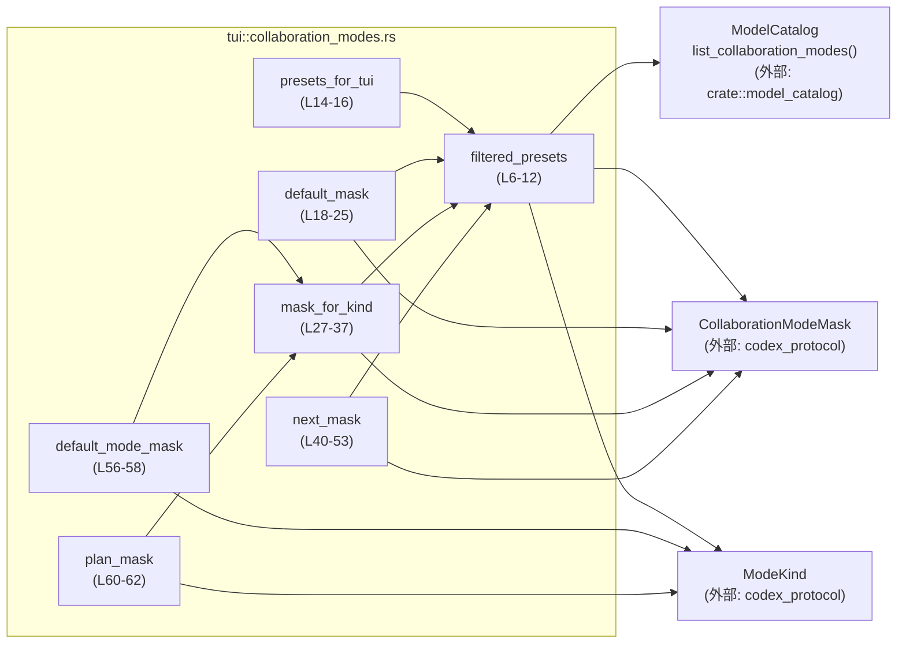
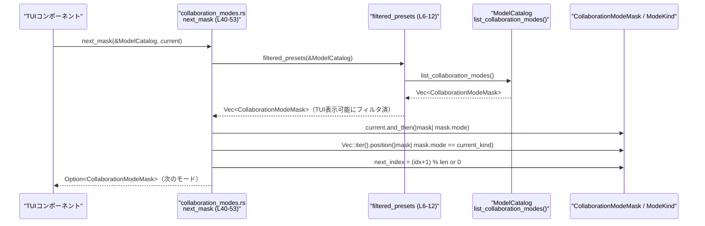

# tui/src/collaboration_modes.rs コード解説

## 0. ざっくり一言

`tui/src/collaboration_modes.rs` は、`ModelCatalog` に登録された協調モード (`CollaborationModeMask`) のうち、TUI で表示すべきものだけを抽出し、  
「プリセット一覧」「デフォルト」「指定種別」「次のモード」を取得するユーティリティ関数群を提供するモジュールです。

---

## 1. このモジュールの役割

### 1.1 概要

- このモジュールは **TUI 用に表示・選択可能な協調モードの管理** を行います。
- `ModelCatalog` から取得した一覧を `ModeKind::is_tui_visible` でフィルタし、TUI で利用するプリセット集合を作成します。
- その集合から
  - デフォルトモード
  - 任意の `ModeKind` に対応するモード
  - 現在モードから次のモード（循環）
  を選択する関数を提供します。

### 1.2 アーキテクチャ内での位置づけ

主な依存関係と呼び出し関係は次のとおりです。



※ 呼び出し元（TUI ウィジェットなど）はこのチャンクには現れません。

### 1.3 設計上のポイント

コードから読み取れる設計上の特徴は次のとおりです。

- **責務の分割**
  - `filtered_presets`（L6-12）で「TUI から見えるモード」のフィルタロジックを一箇所に集約し、他の関数はそれを前提として選択ロジックだけを担当しています。
- **状態を持たない**
  - すべての関数は `&ModelCatalog` を引数に取り、内部に状態を保持しません。純粋なヘルパー関数群として設計されています。
- **エラーハンドリング**
  - エラーは `Result` ではなく `Option` で表現されています。
    - 対象モードが存在しない／プリセットが空の場合は `None` を返します（例: `default_mask`, `mask_for_kind`, `next_mask`）。
- **TUI 表示可否の明示**
  - `ModeKind::is_tui_visible` / `kind.is_tui_visible()`（L10, L31）により、TUI に表示すべきモードのみを対象にする前提が明確になっています。
- **安全性**
  - `unsafe` ブロックやインデックスアクセス `vec[idx]` は使用しておらず、`Vec::get`（L53）により境界チェック付きで要素にアクセスしています。

---

## 2. 主要な機能一覧（コンポーネントインベントリー）

このファイル内で定義されている関数とその位置の一覧です。

| 名称 | 種別 | 定義位置 | 役割 / 一言説明 |
|------|------|----------|-----------------|
| `filtered_presets` | 関数（非公開） | `tui/src/collaboration_modes.rs:L6-12` | `ModelCatalog` から TUI で表示可能な `CollaborationModeMask` のみを抽出して `Vec` で返す |
| `presets_for_tui` | 関数（crate 内公開） | L14-16 | TUI 用プリセット一覧をそのまま返すラッパー |
| `default_mask` | 関数（crate 内公開） | L18-25 | TUI 用プリセットの中からデフォルトモードを優先的に、なければ先頭要素を返す |
| `mask_for_kind` | 関数（crate 内公開） | L27-37 | 指定した `ModeKind` に対応する TUI 表示可能なマスクを返す |
| `next_mask` | 関数（crate 内公開） | L40-53 | 現在のマスクから、TUI 用プリセット内で次のマスクを循環的に返す |
| `default_mode_mask` | 関数（crate 内公開） | L56-58 | `ModeKind::Default` に対応するマスクを返すショートカット |
| `plan_mask` | 関数（crate 内公開） | L60-62 | `ModeKind::Plan` に対応するマスクを返すショートカット |

このファイル内に新たな構造体・列挙体の定義はありません。

---

## 3. 公開 API と詳細解説

### 3.1 型一覧（構造体・列挙体など）

このモジュールで利用される主な型（いずれも外部定義）をまとめます。

| 名前 | 種別 | 定義場所（外部） | 役割 / 用途（このモジュール内で観測できる範囲） | 根拠 |
|------|------|------------------|--------------------------------------------------|------|
| `ModelCatalog` | 構造体と推定 | `crate::model_catalog` | `list_collaboration_modes()` を通じて、`CollaborationModeMask` の一覧を提供するカタログ | 利用: L4, L7-8, L14, L18-19, L27-28, L40-41, L56-57, L60-61 |
| `CollaborationModeMask` | 構造体と推定 | `codex_protocol::config_types` | `mode` フィールドを持ち、`Option<ModeKind>` としてモード種別を保持していると読み取れます | 利用: L1, L6, L14, L18, L27, L40, L42, L56, L60, フィールド `mask.mode`: L10, L22, L34, L36, L48, L51 |
| `ModeKind` | 列挙体と推定 | `codex_protocol::config_types` | 協調モードの種別。`Default` や `Plan` などのバリアントがあり、`is_tui_visible` で TUI 表示可否が判定される | 利用: L2, L10, L22, L29, L31, L34-36, L56-57, L60-61 |

> `CollaborationModeMask` が少なくとも `mode: Option<ModeKind>` フィールドを持つことは、`mask.mode.is_some_and(...)`（L10）および `mask.mode == Some(...)`（L22, L36, L51）から読み取れます。

### 3.2 関数詳細

#### `filtered_presets(model_catalog: &ModelCatalog) -> Vec<CollaborationModeMask>`（L6-12）

**概要**

- `ModelCatalog` から取得した協調モード一覧のうち、`ModeKind::is_tui_visible` が `true` のものだけを残した `Vec<CollaborationModeMask>` を返す非公開ヘルパー関数です。

**引数**

| 引数名 | 型 | 説明 |
|--------|----|------|
| `model_catalog` | `&ModelCatalog` | 協調モード一覧を提供するカタログへの参照（不変借用） |

**戻り値**

- `Vec<CollaborationModeMask>`  
  TUI で表示可能な協調モードマスクの一覧です。順序は `list_collaboration_modes()` の結果をフィルタしたもの（＝元の順序を保持）と読み取れます（L7-11）。

**内部処理の流れ**

1. `model_catalog.list_collaboration_modes()` でカタログから全ての協調モードマスクを取り出します（L7-8）。
2. `into_iter()` で所有権をイテレータに移します（L9）。
3. `filter(|mask| mask.mode.is_some_and(ModeKind::is_tui_visible))` により、`mask.mode` が `Some(kind)` かつ `kind.is_tui_visible()` が `true` の要素だけに絞り込みます（L10）。
4. `.collect()` でフィルタ済みの要素を新しい `Vec<CollaborationModeMask>` に収集して返します（L11）。

**Examples（使用例）**

```rust
// ModelCatalog の取得方法はこのチャンクには現れないため、仮の例です。
fn list_tui_presets(model_catalog: &ModelCatalog) {
    // TUI 表示可能な協調モード一覧を取得する
    let presets = crate::tui::collaboration_modes::presets_for_tui(model_catalog); // 内部で filtered_presets を使用

    // 取得したプリセットを列挙する（Debug 表示できるかどうかは外部定義に依存）
    for mask in presets {
        // mask.mode などのフィールドを使って表示することが想定されます
        // 具体的なフィールド構造はこのチャンクには現れません。
    }
}
```

**Errors / Panics**

- この関数自身は `Result` を返さず、エラーを `Option` などで表現していません。
- `Vec::collect` や `filter` によるパニック要因はありません。
- 潜在的なパニックは `ModelCatalog::list_collaboration_modes` の実装に依存しますが、このチャンクには現れません。

**Edge cases（エッジケース）**

- `ModelCatalog::list_collaboration_modes()` が空の `Vec` を返した場合（全くモードが登録されていない）  
  → フィルタ後も空であり、結果は空 `Vec` になります（L7-11）。
- すべての `mask.mode` が `None` または `!is_tui_visible()` の場合  
  → フィルタ条件に一致しないため、結果は空 `Vec` になります。
- `mask.mode` が `Some(kind)` でも `is_tui_visible()` が `false` の `ModeKind`  
  → TUI には表示しない前提として除外されます。

**使用上の注意点**

- TUI に表示したくないモード（`is_tui_visible() == false`）がある場合、それらはここで完全に除外されます。  
  そのため、「非表示だが選択可能」といった振る舞いはこの関数だけでは実現できません。
- この関数は非公開 (`fn`、L6) であり、モジュール外からは `presets_for_tui` などの公開関数を経由して利用されます。

---

#### `presets_for_tui(model_catalog: &ModelCatalog) -> Vec<CollaborationModeMask>`（L14-16）

**概要**

- TUI で利用可能な協調モードプリセット一覧を返す公開（crate 内）関数です。実質的には `filtered_presets` のラッパーです。

**引数**

| 引数名 | 型 | 説明 |
|--------|----|------|
| `model_catalog` | `&ModelCatalog` | 協調モード一覧を提供するカタログへの参照 |

**戻り値**

- `Vec<CollaborationModeMask>`  
  `filtered_presets(model_catalog)` の結果と同じです（L15）。

**内部処理の流れ**

1. `filtered_presets(model_catalog)` をそのまま呼び出し（L15）。
2. 結果の `Vec<CollaborationModeMask>` を返します。

**Examples（使用例）**

```rust
fn show_all_tui_modes(model_catalog: &ModelCatalog) {
    // TUI 表示対象のモードを全て取得
    let presets = crate::tui::collaboration_modes::presets_for_tui(model_catalog);

    // UI 上にリスト表示するなどの用途が考えられます
    // 具体的な UI 実装はこのファイルには含まれていません。
}
```

**Errors / Panics**

- `filtered_presets` と同様に、この関数自体にパニック要因はありません。

**Edge cases**

- `filtered_presets` が空の `Vec` を返した場合、そのまま空の `Vec` を返します。

**使用上の注意点**

- 戻り値の `Vec` は新しく生成されます。頻繁に呼び出す場合は、パフォーマンス上、結果の再利用を検討する余地があります（ただし、`ModelCatalog` の更新頻度によっては都度再取得が必要です）。

---

#### `default_mask(model_catalog: &ModelCatalog) -> Option<CollaborationModeMask>`（L18-25）

**概要**

- TUI 表示可能なプリセットの中から、`ModeKind::Default` に対応するマスクを優先的に返し、  
  見つからない場合はプリセット一覧の先頭要素を返します。プリセットが存在しなければ `None` を返します。

**引数**

| 引数名 | 型 | 説明 |
|--------|----|------|
| `model_catalog` | `&ModelCatalog` | 協調モード一覧を提供するカタログへの参照 |

**戻り値**

- `Option<CollaborationModeMask>`  
  - `Some(mask)`:
    - `ModeKind::Default` に対応するマスクがあればそれ（L22-23）。
    - なければフィルタ済みプリセットの先頭要素（L24）。
  - `None`: フィルタ済みプリセットが空（TUI 表示可能なモードが存在しない）場合（L24）。

**内部処理の流れ**

1. `filtered_presets(model_catalog)` で TUI 表示可能なプリセット一覧を取得（L19）。
2. `presets.iter().find(|mask| mask.mode == Some(ModeKind::Default))` で `mode` が `Some(ModeKind::Default)` の要素を検索（L21-22）。
3. 見つかった場合は `cloned()` で `CollaborationModeMask` を複製し `Some(...)` を返す（L23）。
4. 見つからなかった場合は `or_else(|| presets.into_iter().next())` で、  
   `presets` の所有権を取得し、`into_iter().next()` により最初の要素（あれば）を返す（L24）。
   - 先頭要素が存在しない場合は `None` になります。

**Examples（使用例）**

```rust
fn select_initial_mode(model_catalog: &ModelCatalog) -> Option<CollaborationModeMask> {
    // TUI で初期表示する協調モードを取得する
    crate::tui::collaboration_modes::default_mask(model_catalog)
}
```

**Errors / Panics**

- ベクタの先頭要素取得は `into_iter().next()` を使っており、インデックスアクセスではないため、パニックは発生しません（L24）。

**Edge cases**

- `ModeKind::Default` に対応するマスクが存在しないが、他のプリセットは存在する場合  
  → 先頭要素が「疑似デフォルト」として返ります（L24）。
- フィルタ済みプリセットが空（`filtered_presets` が空のベクタを返す場合）  
  → `into_iter().next()` が `None` を返すため、結果も `None` になります（L24）。

**使用上の注意点**

- 「本当の意味でのデフォルト」が必ずしも `ModeKind::Default` に存在しない場合、  
  先頭要素をフォールバックとして扱う仕様が適切かどうかは設計上の前提に依存します。
- 呼び出し側で `unwrap()` する場合、`None` の可能性（TUI 表示可能なモードがゼロ件）の考慮が必要です。

---

#### `mask_for_kind(model_catalog: &ModelCatalog, kind: ModeKind) -> Option<CollaborationModeMask>`（L27-37）

**概要**

- 指定した `kind: ModeKind` に対応する TUI 表示用マスクを返します。  
  `kind` 自体が TUI 非表示の種別である場合は、即座に `None` を返します。

**引数**

| 引数名 | 型 | 説明 |
|--------|----|------|
| `model_catalog` | `&ModelCatalog` | 協調モード一覧を提供するカタログへの参照 |
| `kind` | `ModeKind` | 取得したいモード種別 |

**戻り値**

- `Option<CollaborationModeMask>`  
  - `Some(mask)`: `mask.mode == Some(kind)` を満たす TUI 表示可能なマスクが存在する場合（L34-36）。
  - `None`:
    - `kind.is_tui_visible()` が `false` の場合（L31-32）。
    - TUI 表示可能なプリセットの中に `mode == Some(kind)` の要素が存在しない場合（L34-36）。

**内部処理の流れ**

1. `if !kind.is_tui_visible() { return None; }` で `kind` が TUI 非表示の場合を早期リターン（L31-32）。
2. `filtered_presets(model_catalog)` で TUI 表示可能なプリセット一覧を取得（L34）。
3. その中から `find(|mask| mask.mode == Some(kind))` で一致するものを検索し、見つかれば `Some(mask)` を返します（L35-36）。

**Examples（使用例）**

```rust
fn get_plan_mode(model_catalog: &ModelCatalog) -> Option<CollaborationModeMask> {
    use codex_protocol::config_types::ModeKind;

    // Plan モード用のマスクを取得
    crate::tui::collaboration_modes::mask_for_kind(model_catalog, ModeKind::Plan)
}
```

**Errors / Panics**

- 早期リターンと検索のみで構成されており、パニック要因はありません。

**Edge cases**

- `kind` が `is_tui_visible() == false` の種別  
  → TUI では利用しない前提として `None` を返します（L31-32）。
- `kind` は TUI 表示対象だが、その `ModeKind` に対応する `CollaborationModeMask` が登録されていない場合  
  → `find` が何も見つけられず `None` を返します（L34-36）。

**使用上の注意点**

- TUI で利用したい `ModeKind` は、必ず `is_tui_visible()` が `true` を返すように設計されている前提です。  
  そうでない場合、`default_mode_mask` / `plan_mask` などのラッパーも常に `None` を返す可能性があります。

---

#### `next_mask(model_catalog: &ModelCatalog, current: Option<&CollaborationModeMask>) -> Option<CollaborationModeMask>`（L40-53）

**概要**

- TUI 表示可能なプリセット一覧において、`current` の次のマスクを循環的に返します。  
  - `current` が `None` または一覧に存在しない場合は、先頭要素を返します。
  - プリセットが空の場合は `None` を返します。

**引数**

| 引数名 | 型 | 説明 |
|--------|----|------|
| `model_catalog` | `&ModelCatalog` | 協調モード一覧を提供するカタログへの参照 |
| `current` | `Option<&CollaborationModeMask>` | 現在選択中のマスク（参照）。未選択の場合は `None` |

**戻り値**

- `Option<CollaborationModeMask>`  
  - `Some(next)`: 次に選択すべきマスク。プリセットが 1 件以上存在する場合は必ず `Some` になります（L45-53）。
  - `None`: TUI 表示可能なプリセットが 1 件も存在しない場合（L44-47）。

**内部処理の流れ**

1. `filtered_presets(model_catalog)` で現時点の TUI 表示可能なプリセット一覧を取得（L44）。
2. 一覧が空なら `None` を返す（L45-46）。
3. `current.and_then(|mask| mask.mode)` で、現在のマスクがあればその `ModeKind` を取り出し、なければ `None` を得る（L48）。
4. `presets.iter().position(|mask| mask.mode == current_kind)` で、一覧中のどの位置に現在の `ModeKind` があるかを検索（L49-51）。
5. 見つかった場合は `(idx + 1) % presets.len()` を計算し、次のインデックス（末尾なら先頭に戻る）を求める（L52）。
6. 見つからなかった場合は `map_or(0, ...)` により `0`（先頭のインデックス）を採用する（L52）。
7. `presets.get(next_index).cloned()` で対象要素を取得してクローンし、`Some(mask)` を返す（L53）。
   - `presets.is_empty()` が `false` の場合のみここに到達するため、`presets.get(next_index)` は必ず `Some` になります。

**Examples（使用例）**

```rust
fn cycle_mode(model_catalog: &ModelCatalog, current: Option<CollaborationModeMask>)
    -> Option<CollaborationModeMask>
{
    // next_mask は参照を取るので、呼び出し側で参照を渡す
    let next = crate::tui::collaboration_modes::next_mask(
        model_catalog,
        current.as_ref(), // Option<&CollaborationModeMask> に変換
    );

    next
}
```

**Errors / Panics**

- `presets.get(next_index)` を使用しているため、インデックス範囲外アクセスによるパニックは防がれています（L49-53）。
- `presets.is_empty()` のチェックによって `map_or(0, ...)` が `0` を返しても、空ベクタで `get(0)` が呼ばれるケースは防止されています（L44-47）。

**Edge cases**

- プリセットが空 (`filtered_presets` の結果が空)  
  → 即座に `None` を返します（L45-46）。
- `current == None`  
  → `current_kind == None` となり、`position` は常に `None` を返すため、`next_index == 0` となり、先頭要素が返ります（L48-52）。
- `current` がプリセット一覧に存在しない `mode` を持つ場合  
  → 同様に `position` が `None` となり、先頭要素が返ります（L51-52）。
- プリセットが 1 件だけの場合  
  → `position` は `Some(0)` となり `(0 + 1) % 1 == 0` となるため、常に同じ要素が返ります（L49-52）。

**使用上の注意点**

- `current` に渡すマスクは、同じ `ModelCatalog` から取得された TUI 表示可能なプリセットであることが前提です。  
  そうでない場合でも先頭要素にフォールバックしますが、ユーザー体験として意図した振る舞いか確認が必要です。
- この関数は **TUI の操作（次のモードへ進む）に密接に紐づいた振る舞い** を実現しているため、  
  「前へ戻る」などの別方向のナビゲーションが必要な場合は別関数の追加が自然です。

---

#### `default_mode_mask(model_catalog: &ModelCatalog) -> Option<CollaborationModeMask>`（L56-58）

**概要**

- `mask_for_kind(model_catalog, ModeKind::Default)` を呼び出すショートカット関数です。  
  `ModeKind::Default` が TUI 表示対象であり、対応するマスクが存在する場合に `Some(mask)` を返します。

**引数**

| 引数名 | 型 | 説明 |
|--------|----|------|
| `model_catalog` | `&ModelCatalog` | 協調モード一覧を提供するカタログへの参照 |

**戻り値**

- `Option<CollaborationModeMask>`  
  `mask_for_kind(model_catalog, ModeKind::Default)` の結果と同じです（L57）。

**内部処理の流れ**

1. `mask_for_kind(model_catalog, ModeKind::Default)` を呼び出し、そのまま返します（L57）。

**Examples（使用例）**

```rust
fn tui_default_mode(model_catalog: &ModelCatalog) -> Option<CollaborationModeMask> {
    crate::tui::collaboration_modes::default_mode_mask(model_catalog)
}
```

**Errors / Panics**

- `mask_for_kind` に準じます。

**Edge cases**

- `ModeKind::Default` が `is_tui_visible() == false` の場合  
  → `mask_for_kind` 内で早期リターンにより `None` になります（L31-32）。
- TUI 表示可能なプリセットに `mode == Some(ModeKind::Default)` が存在しない場合  
  → `None` になります（L34-36）。

**使用上の注意点**

- `default_mask` との違いに注意が必要です。
  - `default_mode_mask`: `ModeKind::Default` のみに対応。存在しなければ必ず `None`。
  - `default_mask`: `ModeKind::Default` が存在しなければ先頭要素にフォールバック。

---

#### `plan_mask(model_catalog: &ModelCatalog) -> Option<CollaborationModeMask>`（L60-62）

**概要**

- `mask_for_kind(model_catalog, ModeKind::Plan)` を呼び出すショートカット関数です。  
  `ModeKind::Plan` が TUI 表示対象であり、対応するマスクが存在する場合に `Some(mask)` を返します。

**引数**

| 引数名 | 型 | 説明 |
|--------|----|------|
| `model_catalog` | `&ModelCatalog` | 協調モード一覧を提供するカタログへの参照 |

**戻り値**

- `Option<CollaborationModeMask>`  
  `mask_for_kind(model_catalog, ModeKind::Plan)` の結果と同じです（L61）。

**内部処理の流れ**

1. `mask_for_kind(model_catalog, ModeKind::Plan)` を呼び出し、そのまま返します（L61）。

**Examples（使用例）**

```rust
fn tui_plan_mode(model_catalog: &ModelCatalog) -> Option<CollaborationModeMask> {
    crate::tui::collaboration_modes::plan_mask(model_catalog)
}
```

**Errors / Panics**

- `mask_for_kind` に準じます。

**Edge cases**

- `ModeKind::Plan` が `is_tui_visible() == false` の場合  
  → `None` になります（L31-32 を経由）。
- TUI 表示可能なプリセットに `mode == Some(ModeKind::Plan)` が存在しない場合  
  → `None` になります（L34-36）。

**使用上の注意点**

- 新しいモード種別が増えた場合も、同様のショートカット関数を追加するパターンが自然です（例えば `review_mask` など）。  
  実装は単に `mask_for_kind(model_catalog, ModeKind::Xxx)` を呼ぶだけで十分です。

---

### 3.3 その他の関数

- このファイルには 7 つの関数がありますが、すべて上記で詳細解説したため、ここに追加で整理すべき補助関数はありません。

---

## 4. データフロー

ここでは、TUI で「次のモード」に切り替えるシナリオ（`next_mask`）を例にデータフローを示します。

1. TUI 側のコンポーネントが現在のモード（`Option<CollaborationModeMask>`）と `&ModelCatalog` を持っているとします。
2. TUI は `next_mask(model_catalog, current.as_ref())` を呼び出します。
3. `next_mask` は `filtered_presets` を通じて TUI 表示可能なプリセット一覧を取得します。
4. 現在のモードの `ModeKind` を一覧中で検索し、次のインデックス（循環）を計算します。
5. 計算されたインデックスのマスクを `Some(mask)` として返し、TUI はそれを次のモードとして表示します。



この図は、本チャンク（`tui/src/collaboration_modes.rs`）の L6-12 と L40-53 を中心にした処理の流れを表しています。

---

## 5. 使い方（How to Use）

### 5.1 基本的な使用方法

代表的な利用方法として、「初期モードの決定」と「次のモードへの遷移」の流れを示します。

```rust
use codex_protocol::config_types::CollaborationModeMask;
use crate::model_catalog::ModelCatalog;

fn run_tui(model_catalog: &ModelCatalog) {
    // 1. 初期モードを決定する
    let mut current: Option<CollaborationModeMask> =
        crate::tui::collaboration_modes::default_mask(model_catalog);
        // default_mask は TUI 表示可能なプリセットから
        // ModeKind::Default を優先し、なければ先頭要素を選びます

    // 2. ユーザー操作に応じて次のモードに切り替える例
    // （実際のイベントループなどはこのチャンクには現れません）
    loop {
        // 例えば "n" キーが押されたら次のモードへ
        // if user_pressed_next() { ... } のような条件を想定

        // Option<CollaborationModeMask> を Option<&CollaborationModeMask> に変換
        let next = crate::tui::collaboration_modes::next_mask(
            model_catalog,
            current.as_ref(), // & を取って参照として渡す
        );

        // 次のモードが存在しない（プリセットが空）場合はループ終了
        if next.is_none() {
            break;
        }

        // 現在のモードを更新
        current = next;

        // current を使って TUI を更新する処理がここに来ると想定されます
    }
}
```

### 5.2 よくある使用パターン

#### パターン1: TUI で利用可能なモードの一覧を表示する

```rust
fn show_mode_list(model_catalog: &ModelCatalog) {
    // すべての TUI 表示可能なモードプリセットを取得
    let presets = crate::tui::collaboration_modes::presets_for_tui(model_catalog);

    // 取得したプリセットに対して何らかの表示を行う
    for preset in presets {
        // preset.mode や他のフィールドを使ってラベルなどを表示すると想定されます
    }
}
```

#### パターン2: 特定モード種別に対応するプリセットの取得

```rust
use codex_protocol::config_types::ModeKind;

fn jump_to_plan_mode(model_catalog: &ModelCatalog) -> Option<CollaborationModeMask> {
    // Plan モードに直接ジャンプする（TUI 表示対象でない／存在しない場合は None）
    crate::tui::collaboration_modes::plan_mask(model_catalog)
}

fn jump_to_specific_mode(
    model_catalog: &ModelCatalog,
    kind: ModeKind,
) -> Option<CollaborationModeMask> {
    // 任意の ModeKind に対応するマスクを取得
    crate::tui::collaboration_modes::mask_for_kind(model_catalog, kind)
}
```

### 5.3 よくある間違い

このモジュールの API の性質上、以下のような誤用が起こりうると考えられます（あくまで呼び出し側に関する一般的な注意です）。

```rust
use crate::tui::collaboration_modes;
use crate::model_catalog::ModelCatalog;

// 間違い例: Option を考慮せずに unwrap してしまう
fn bad_use_default_mask(model_catalog: &ModelCatalog) {
    let mask = collaboration_modes::default_mask(model_catalog).unwrap();
    // TUI 表示可能なモードが 1 つも存在しない場合、ここで panic します
}

// 正しい例: None の可能性を考慮したハンドリング
fn good_use_default_mask(model_catalog: &ModelCatalog) {
    if let Some(mask) = collaboration_modes::default_mask(model_catalog) {
        // mask を使用する
    } else {
        // モードが 1 つも利用できない場合のフォールバック処理
    }
}
```

### 5.4 使用上の注意点（まとめ）

- すべての公開関数は `Option<CollaborationModeMask>` や `Vec<CollaborationModeMask>` を返します。  
  - Option の `None` は「TUI 表示可能なモードが存在しない」または「指定の種別が存在しない／非表示である」を意味します。
- `ModeKind::is_tui_visible` の実装に依存して「TUI に現れるモード」が決まります。  
  - この前提が変わると、ここでのフィルタ結果も変わります。
- 並行性について:
  - このモジュールの関数はすべて `&ModelCatalog` への不変参照しか受け取らず、内部で共有状態を変更していません。  
    ただし `ModelCatalog` 自体が内部可変性／スレッド安全性をどのように扱っているかは、このチャンクからは分かりません。

---

## 6. 変更の仕方（How to Modify）

### 6.1 新しい機能を追加する場合

例として、「Review モード」に対応するショートカット関数を追加する場合のステップです。

1. `codex_protocol::config_types::ModeKind` に `Review` などのバリアントが既に存在することを確認します。  
   （このチャンクには `Default` と `Plan` しか現れません。）
2. `tui/src/collaboration_modes.rs` に次のような関数を追加します。

   ```rust
   pub(crate) fn review_mask(model_catalog: &ModelCatalog) -> Option<CollaborationModeMask> {
       mask_for_kind(model_catalog, ModeKind::Review)
   }
   ```

3. 呼び出し側（TUI コンポーネント）から新関数を利用するように変更します。

TUI に新しいフィルタ基準（例えばユーザー権限による表示制御）を追加したい場合は、  
`filtered_presets` の中に条件を追加するのが自然です（L6-12）。

### 6.2 既存の機能を変更する場合

- `filtered_presets` を変更する場合の注意点
  - この関数は **すべての他の関数の前提** になっています（L14, L19, L34, L44）。  
    フィルタ条件や順序の意味を変えると、`default_mask` や `next_mask` などの挙動も一括して変わります。
- `default_mask` と `default_mode_mask` の契約
  - 現状では「デフォルト」の意味が二重にあります（`ModeKind::Default` と、プリセットの先頭要素）。  
    この仕様を変更する場合は、両者の関数の役割を明確に文書化しなおす必要があります。
- インタフェース変更時の影響範囲
  - 引数や戻り値の型（特に `Option` → `Result` など）を変更すると、  
    このモジュールを呼び出しているすべての箇所の修正が必要になります。
- テスト
  - このチャンクにはテストコードが存在しません。  
    動作変更時には、少なくとも次のケースを網羅するテスト追加が有用です（提案レベル）:
    - プリセットが空の場合
    - 1 件のみ存在する場合
    - `ModeKind::Default` / `ModeKind::Plan` が存在する／しない場合
    - `next_mask` で循環する挙動

---

## 7. 関連ファイル

このモジュールと密接に関係する外部ファイル／モジュールは次のとおりです。

| パス / モジュール | 役割 / 関係 | 根拠 |
|-------------------|------------|------|
| `crate::model_catalog::ModelCatalog` | 協調モード一覧を提供するカタログ。`list_collaboration_modes()` を通じて `Vec<CollaborationModeMask>` を返すと読み取れます。 | `use crate::model_catalog::ModelCatalog;`（L4）、`list_collaboration_modes()` 呼び出し（L7-8） |
| `codex_protocol::config_types::CollaborationModeMask` | 協調モードのマスク情報を表す型。`mode: Option<ModeKind>` フィールドを持つと読み取れます。TUI でのモード選択の単位となります。 | `use codex_protocol::config_types::CollaborationModeMask;`（L1）、`mask.mode` アクセス（L10, L22, L36, L48, L51） |
| `codex_protocol::config_types::ModeKind` | 協調モードの種別。`Default` や `Plan` バリアントおよび `is_tui_visible` メソッド（あるいは関連関数）を持ちます。 | `use codex_protocol::config_types::ModeKind;`（L2）、`ModeKind::Default` / `ModeKind::Plan`（L22, L56-57, L60-61）、`is_tui_visible` 利用（L10, L31） |

---

### Bugs / Security（補足メモ）

- このチャンク内のロジックには、明示的なパニックや未定義動作につながる可能性は見当たりません。
  - インデックスアクセスは `Vec::get` のみ（L53）であり、安全です。
- セキュリティ上特有の処理（認可チェックや入力検証など）はこのファイルには存在せず、  
  ここでは単に `ModelCatalog` の内容をフィルタ・選択しているだけです。
- 実際のセキュリティ特性は、`ModelCatalog` や `CollaborationModeMask` の設計に依存します。このチャンクだけからは判断できません。
