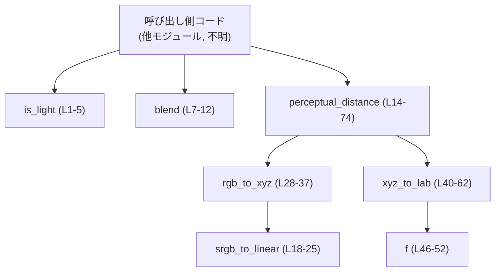
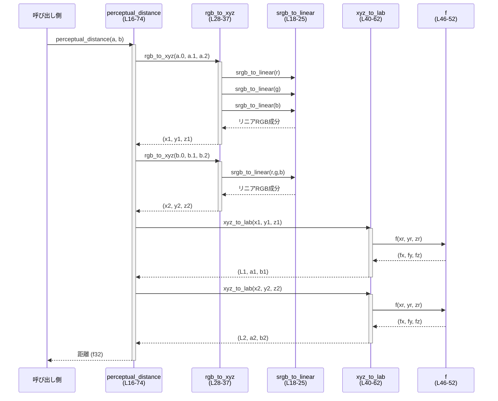

tui/src/color.rs

---

## 0. ざっくり一言

- TUI 内で使用する RGB カラー値について、
  - 明るさ判定
  - αブレンド
  - 知覚的な色差（CIE76）
  
  を計算するための数値ユーティリティ関数を提供するモジュールです（color.rs:L1-75）。

---

## 1. このモジュールの役割

### 1.1 概要

- このモジュールは **RGB 色（0–255 の 3 成分）に対する基本的な色処理** を行うために存在し、
  次の機能を提供します。

  - 背景色の「明るさ」を簡易的に判定する（`is_light`）（L1-5）
  - 前景色と背景色を指定された α 値で線形補間する（`blend`）（L7-12）
  - 2 つの RGB 色の間の **知覚色差（perceptual distance）** を CIE76 近似で求める（`perceptual_distance`）（L14-74）

### 1.2 アーキテクチャ内での位置づけ

- すべての関数は `pub(crate)` であり、**クレート内の他のモジュールから利用される内部ユーティリティ**です（L1, L7, L16）。
- このチャンクには、このモジュールを呼び出している具体的な他ファイルは現れません。そのため、どのモジュールから使われているかは不明です。
- ファイル内の依存関係（関数間の呼び出し）は以下のとおりです。



- `is_light` と `blend` は他の関数を呼ばない単独の計算関数です（L1-12）。
- `perceptual_distance` は内部に 3 つのヘルパー関数 `srgb_to_linear`, `rgb_to_xyz`, `xyz_to_lab` をネスト定義し、それらを通じて計算を行います（L18-37, L40-62）。

### 1.3 設計上のポイント

- **ステートレスな純粋関数**
  - すべての関数は引数のみを入力とし、外部状態に依存せず、副作用（I/O、グローバル変数変更など）を持ちません（L1-74）。
- **単純なデータ型のみを使用**
  - 入力は `(u8, u8, u8)` のタプル（RGB）と `f32`（α）で表現され、戻り値も `bool`, `(u8, u8, u8)`, `f32` といったプリミティブ型のみです（L1, L7, L16）。
- **内部実装のカプセル化**
  - より複雑な色差計算は、ネストしたヘルパー関数群に分割され、外部からは `perceptual_distance` だけを意識すればよい構造になっています（L18-37, L40-62）。
- **エラーハンドリング**
  - すべての演算は通常の算術とキャストのみで、`Result` や `Option` は使われていません（L1-74）。
  - 入力範囲が通常の RGB（0–255）および実用的な α（0.0–1.0）である限り、パニックを起こす可能性は見られません。
- **並行性**
  - 共有状態や可変参照を扱わず、純粋な計算であるため、複数スレッドから同時に呼び出してもデータ競合は発生しません（コード全体に `mut` やグローバル変数が存在しないことから判断: L1-75）。

---

## 2. 主要な機能一覧

- **明るさ判定**: `is_light` — RGB 背景色が「明るい」か「暗い」かを簡易的な加重平均で判定します（L1-5）。
- **αブレンド**: `blend` — 前景色と背景色を α 値で線形補間して合成色を返します（L7-12）。
- **知覚色差の計算**: `perceptual_distance` — 2 つの RGB 色の間の距離を CIE76 近似（Lab 空間のユークリッド距離）で計算します（L14-74）。

### コンポーネントインベントリー（関数一覧）

| 名前 | 種別 | 可視性 | 役割 / 用途 | 定義位置 |
|------|------|--------|-------------|----------|
| `is_light` | 関数 | `pub(crate)` | RGB 背景色が「明るい」かどうかを判定する | color.rs:L1-5 |
| `blend` | 関数 | `pub(crate)` | 前景色と背景色を α 値でブレンドして合成色を返す | color.rs:L7-12 |
| `perceptual_distance` | 関数 | `pub(crate)` | 2 つの RGB 色の知覚色差（CIE76）を計算する | color.rs:L14-74 |
| `srgb_to_linear` | 関数（ネスト） | ローカル | sRGB（0–255）をリニア RGB（0–1 の f32）に変換する | color.rs:L18-25 |
| `rgb_to_xyz` | 関数（ネスト） | ローカル | リニア RGB を CIE XYZ 色空間に変換する | color.rs:L28-37 |
| `xyz_to_lab` | 関数（ネスト） | ローカル | XYZ を CIE Lab 色空間に変換する | color.rs:L40-62 |
| `f` | 関数（ネスト） | ローカル | Lab 変換用の補助関数（XYZ 正規化値に対する非線形変換） | color.rs:L46-52 |

---

## 3. 公開 API と詳細解説

このファイルには構造体・列挙体などの型定義はありません（すべて関数ベース: color.rs:L1-75）。

### 3.1 型一覧

- 該当なし（構造体・列挙体・型エイリアスはこのチャンクには現れません）。

### 3.2 関数詳細（主要 3 関数）

#### `is_light(bg: (u8, u8, u8)) -> bool`

**概要**

- 背景色 `bg` が「明るい色かどうか」を、RGB 各成分の加重平均に基づいて判定する関数です（color.rs:L1-4）。
- テキスト色（黒/白）の選択などに利用できる設計です。

**引数**

| 引数名 | 型 | 説明 |
|--------|----|------|
| `bg` | `(u8, u8, u8)` | 背景色の RGB 値（0–255）。タプルの順序は `(r, g, b)` です（L1-2）。 |

**戻り値**

- `bool`:
  - `true`: 明るいと判定された場合（L3-4）
  - `false`: それ以外（暗いと判定）

**内部処理の流れ**

1. タプル `bg` を分解し、`r`, `g`, `b` に代入します（L2）。
2. 次の式で明度に相当する値 `y` を計算します（L3）。

   ```rust
   let y = 0.299 * r as f32 + 0.587 * g as f32 + 0.114 * b as f32;
   ```

   - これは人間の視覚に対する感度を近似した加重平均（輝度の簡易モデル）です。
3. `y > 128.0` かどうかを判定し、その真偽を返します（L4）。
   - 閾値 128.0 は固定値として埋め込まれています。

**Examples（使用例）**

明るい背景に対してテキスト色を決める例です。

```rust
// 背景色を RGB で定義する（例: 薄いグレー）
let bg = (220u8, 220u8, 220u8);                     // 明るめのグレー

// 明るさを判定する
let light = tui::color::is_light(bg);               // color.rs の is_light を呼び出す

// 判定結果に基づいてテキスト色を決める
let text_color = if light {                         // 明るければ
    (0u8, 0u8, 0u8)                                 // 黒文字
} else {
    (255u8, 255u8, 255u8)                           // 暗ければ白文字
};
```

※ 実際の名前空間（`tui::color` など）はプロジェクト構成によります。このチャンクからは正確なモジュールパスは分かりません。

**Errors / Panics**

- この関数は `Result` などを返さず、パニックになるような操作も含んでいません。
  - 加減乗算と `as f32` キャストのみを行っています（L2-4）。

**Edge cases（エッジケース）**

- 極端に暗い色: `(0, 0, 0)` → `y = 0` となり、`false`（暗い）になります（式から明らか: L3-4）。
- 極端に明るい色: `(255, 255, 255)` → `y` は最大で `> 128.0` となり、`true`（明るい）です。
- グレーの中間値 `(128, 128, 128)`:
  - 加重平均の係数が 1.0 になるため、`y = 128.0` ちょうどになり、条件 `y > 128.0` は偽です（L3-4）。
  - したがってこの色は「暗い」と判定されます。

**使用上の注意点**

- この明度モデルは簡易モデルであり、厳密な視覚特性やガンマ補正を考慮したものではありません（L3 の単純な線形式から分かります）。
- 閾値 128.0 は固定であり、ユーザーの環境（ディスプレイ、周囲の明るさ）による調整はできません。
  - 閾値を調整したい場合は、この関数を直接変更するか、呼び出し側で `y` 計算ロジックを複製してカスタム判定を行う必要があります。

---

#### `blend(fg: (u8, u8, u8), bg: (u8, u8, u8), alpha: f32) -> (u8, u8, u8)`

**概要**

- 前景色 `fg` と背景色 `bg` を、α 値 `alpha` で線形補間して合成色を返す関数です（color.rs:L7-11）。
- αブレンド（透過合成）の基本形に相当します。

**引数**

| 引数名 | 型 | 説明 |
|--------|----|------|
| `fg` | `(u8, u8, u8)` | 前景色（フォアグラウンド）の RGB 値（0–255）（L7-8）。 |
| `bg` | `(u8, u8, u8)` | 背景色（バックグラウンド）の RGB 値（0–255）（L7-10）。 |
| `alpha` | `f32` | 前景色の不透明度。通常は `0.0`（完全透明）〜`1.0`（完全不透明）で扱う想定です（L7-10）。 |

**戻り値**

- `(u8, u8, u8)`:
  - 前景色と背景色を `alpha` に基づいて線形補間した RGB 値です（L8-11）。

**内部処理の流れ**

各チャンネルごとに以下の式で合成を行います（L8-10）。

1. 赤チャンネル:

   ```rust
   let r = (fg.0 as f32 * alpha + bg.0 as f32 * (1.0 - alpha)) as u8;
   ```

2. 緑チャンネル:

   ```rust
   let g = (fg.1 as f32 * alpha + bg.1 as f32 * (1.0 - alpha)) as u8;
   ```

3. 青チャンネル:

   ```rust
   let b = (fg.2 as f32 * alpha + bg.2 as f32 * (1.0 - alpha)) as u8;
   ```

4. 合成結果 `(r, g, b)` を返します（L11）。

- ここで、Rust の `as` キャストにより、`f32` → `u8` の変換時には丸めと端値への飽和が行われます（範囲外の値は 0～255 に収まるよう処理されます）。

**Examples（使用例）**

前景アイコンを半透明で背景に重ねる例です。

```rust
// 前景色（例: 赤）
let fg = (255u8, 0u8, 0u8);                           // 完全な赤

// 背景色（例: 青）
let bg = (0u8, 0u8, 255u8);                           // 完全な青

// 半透明（50%）でブレンド
let alpha = 0.5f32;                                   // 0.0〜1.0 の範囲を想定

let blended = tui::color::blend(fg, bg, alpha);       // 合成色を取得
// blended はおおよそ紫系の色になります
```

**Errors / Panics**

- この関数も `Result` や `Option` を返しておらず、パニックを引き起こすような操作は含んでいません（L7-12）。
- `alpha` が任意の `f32` であっても、演算自体は正常に実行されます。ただし意味的に想定外の結果になり得ます（後述のエッジケース参照）。

**Edge cases（エッジケース）**

- `alpha = 0.0`:
  - `fg` の寄与は 0 になり、結果は完全に `bg` と一致します（式から明らか: L8-10）。
- `alpha = 1.0`:
  - `(1.0 - alpha)` が 0 になり、結果は完全に `fg` と一致します。
- `alpha < 0.0` や `alpha > 1.0`:
  - この関数は値域チェックを行っていません。
  - 負の値や 1 を超える値を渡すと、`fg` と `bg` の重みが想定外になり、出力が 0〜255 の範囲に飽和・丸めされた値になります。
  - 仕様上は安全ですが、意図した色にならない可能性があります。
- `alpha` が `NaN`:
  - 浮動小数演算の結果が `NaN` となり、`as u8` キャストにより 0 か端値に変換されます（Rust の float→int キャスト仕様に従います）。
  - 実用上は避けるべき入力です。

**使用上の注意点**

- **前提条件**:
  - 呼び出し側で `0.0 <= alpha <= 1.0` を保証することが前提と考えられます（コード内にチェックはありません: L7-12）。
- αブレンドの式は「前景色優先」の形式です（`fg * alpha + bg * (1 - alpha)`）。他のライブラリと組み合わせる場合は同じ定義かどうか確認が必要です。
- `u8` への変換時に小数部は切り捨て／丸められているため、連続してブレンドを繰り返すとわずかな誤差が蓄積する可能性があります。
- 高頻度で大量のピクセルに対して呼び出す場合、`f32` 演算のコストが蓄積する点に留意が必要です（ただし、このモジュール単体では特別な最適化は行っていません）。

---

#### `perceptual_distance(a: (u8, u8, u8), b: (u8, u8, u8)) -> f32`

**概要**

- 2 つの RGB 色 `a`, `b` の間の **知覚的な色距離** を計算する関数です（L14-16）。
- ドキュコメントにあるとおり、**CIE76**（Lab 空間でのユークリッド距離）に基づく近似を用いています（L14-15）。

**引数**

| 引数名 | 型 | 説明 |
|--------|----|------|
| `a` | `(u8, u8, u8)` | 比較対象の 1 つ目の RGB 色（0–255）（L16, L64-65）。 |
| `b` | `(u8, u8, u8)` | 比較対象の 2 つ目の RGB 色（0–255）（L16, L64-65）。 |

**戻り値**

- `f32`:
  - 2 色の色差（distance）を表す非負の実数です（L70-74）。
  - 0 のときは完全に同じ色です。
  - 値が大きいほど、人間の目にとって色の違いが大きいとみなされます（CIE76 の性質）。

**内部処理の流れ（アルゴリズム）**

1. **sRGB → リニア RGB への変換** (`srgb_to_linear`)（L18-25）
   - 入力 c（0–255）を 0–1 の範囲の `f32` に正規化します（L19）。
   - ガンマ補正をほどくために、次の分岐を行います（L20-24）。

     ```rust
     if c <= 0.04045 {
         c / 12.92
     } else {
         ((c + 0.055) / 1.055).powf(2.4)
     }
     ```

2. **リニア RGB → XYZ 変換** (`rgb_to_xyz`)（L28-37）
   - 各成分 `r`, `g`, `b` に `srgb_to_linear` を適用（L29-31）。
   - 変換行列に基づいて XYZ を計算します（L33-35）。

     ```rust
     let x = r * 0.4124 + g * 0.3576 + b * 0.1805;
     let y = r * 0.2126 + g * 0.7152 + b * 0.0722;
     let z = r * 0.0193 + g * 0.1192 + b * 0.9505;
     ```

3. **XYZ → Lab 変換** (`xyz_to_lab`)（L40-62）
   - D65 白色点で正規化した `xr`, `yr`, `zr` を計算します（L42-44）。
   - 内部関数 `f` を使って非線形変換を行います（L46-52）。

     ```rust
     if t > 0.008856 {
         t.powf(1.0 / 3.0)
     } else {
         7.787 * t + 16.0 / 116.0
     }
     ```

   - `fx`, `fy`, `fz` を求め（L54-56）、それらから Lab を計算します（L58-60）。

     ```rust
     let l = 116.0 * fy - 16.0;
     let a = 500.0 * (fx - fy);
     let b = 200.0 * (fy - fz);
     ```

4. **2 色の Lab 値を計算**（L64-68）

   ```rust
   let (x1, y1, z1) = rgb_to_xyz(a.0, a.1, a.2);
   let (x2, y2, z2) = rgb_to_xyz(b.0, b.1, b.2);

   let (l1, a1, b1) = xyz_to_lab(x1, y1, z1);
   let (l2, a2, b2) = xyz_to_lab(x2, y2, z2);
   ```

5. **ユークリッド距離を計算**（L70-74）

   ```rust
   let dl = l1 - l2;
   let da = a1 - a2;
   let db = b1 - b2;

   (dl * dl + da * da + db * db).sqrt()
   ```

   - これが CIE76 色差 ΔE\*ab に相当します。

**Examples（使用例）**

2 色の距離を計算し、一定以上離れているか判定する例です。

```rust
// 例: 赤と緑の距離を測定
let red   = (255u8, 0u8, 0u8);                        // 純粋な赤
let green = (0u8, 255u8, 0u8);                        // 純粋な緑

let dist = tui::color::perceptual_distance(red, green); // CIE76 近似の距離

// ある閾値以上なら「かなり違う色」とみなす
let threshold = 20.0f32;                              // 閾値の値は用途に応じて決める
let clearly_different = dist > threshold;
```

**Errors / Panics**

- 入力が通常の RGB 範囲（0–255）である限り、
  - 0 除算
  - ルートの負値
  - 定義域外のべき乗
  
  といったパニック要因は発生しません（係数・条件から判断: L18-25, L46-52, L70-74）。
- `f32::sqrt` や `powf` は不正な入力であってもパニックではなく `NaN` を返す仕様であり、コード内ではそれをそのまま伝播します。

**Edge cases（エッジケース）**

- `a == b` の場合:
  - Lab 値も完全に一致し、`dl = da = db = 0.0` となるため、戻り値は `0.0` です（L70-74）。
- 非常に近い色:
  - 数値的には `> 0` ですが、用途によっては「同じとみなす」閾値を呼び出し側で設ける必要があります。
- RGB の境界値（0 または 255）:
  - いずれも線形変換と行列演算で安全に処理されます（L18-25, L28-37）。
- 極端に異なる色（例: 黒と白）:
  - 戻り値は比較的大きな値になり、その他の組み合わせの基準として使うことができます。

**使用上の注意点**

- **前提条件**:
  - 入力の RGB は sRGB 空間で表現されていることが前提です（`srgb_to_linear` という名前と実装から判断: L18-25）。
- これは CIE76（もっとも単純な Lab 距離）であり、CIEDE2000 などのより高度な色差式と比べると、
  人間の感覚との一致度はやや劣る可能性があります（ドキュコメントの説明: L14-15）。
- 小数演算と `sqrt` を多用するため、非常に大量のピクセルに対して頻繁に呼ぶ場合は計算量がそれなりに大きくなります。
  - ただし、この関数自体にはループはなく、1 回の呼び出しは固定コストです（L18-74）。
- 並行呼び出しは安全です。共有状態がなく、関数内でミューテックスやスレッドローカルなどは使用していません。

---

### 3.3 その他の関数（ネストしたヘルパー）

| 関数名 | 役割（1 行） | 呼び出し元 | 定義位置 |
|--------|--------------|------------|----------|
| `srgb_to_linear(c: u8) -> f32` | sRGB（ガンマ付き）をリニア RGB に変換する（L18-25）。 | `rgb_to_xyz`（L29-31） | color.rs:L18-25 |
| `rgb_to_xyz(r: u8, g: u8, b: u8) -> (f32, f32, f32)` | リニア RGB を XYZ 色空間に変換する（L28-37）。 | `perceptual_distance`（L64-65） | color.rs:L28-37 |
| `xyz_to_lab(x: f32, y: f32, z: f32) -> (f32, f32, f32)` | XYZ を Lab 色空間に変換する（L40-62）。 | `perceptual_distance`（L67-68） | color.rs:L40-62 |
| `f(t: f32) -> f32` | Lab 変換用の非線形補助関数（L46-52）。 | `xyz_to_lab`（L54-56） | color.rs:L46-52 |

これらはすべて `perceptual_distance` 内部に定義され、**外部モジュールから直接呼び出すことはできません**（ネスト関数であるため: L18-25, L28-37, L40-62）。

---

## 4. データフロー

ここでは `perceptual_distance` を呼び出した場合の処理の流れを示します。

### 処理の要点

- 呼び出し側は 2 つの RGB タプルを渡します（L16, L64-65）。
- 関数内部でそれぞれに対して `rgb_to_xyz` → `xyz_to_lab` の変換を行い、Lab 空間での差分を求めます（L64-74）。
- 最後にユークリッド距離を計算し、スカラー値として返却します（L70-74）。

### シーケンス図（perceptual_distance のデータフロー）



---

## 5. 使い方（How to Use）

### 5.1 基本的な使用方法

典型的な利用シナリオとして、「背景色に応じてテキスト色を決め、必要に応じてブレンドした色差を評価する」例です。

```rust
// 背景色と前景色の定義
let bg = (30u8, 30u8, 30u8);                          // 暗い背景色
let fg = (200u8, 200u8, 200u8);                       // 明るいテキスト色候補

// 背景が明るいかどうかを判定
let bg_is_light = tui::color::is_light(bg);           // 明るさ判定（L1-5）

// 判定に応じてテキスト色を選択
let text_color = if bg_is_light {
    (0u8, 0u8, 0u8)                                   // 明るい背景には黒文字
} else {
    (255u8, 255u8, 255u8)                             // 暗い背景には白文字
};

// テキスト色を半透明でブレンドして見た目を確認
let alpha = 0.8f32;                                   // 80% 不透明
let blended = tui::color::blend(text_color, bg, alpha); // ブレンド（L7-12）

// 背景とテキストの色差を計測
let distance = tui::color::perceptual_distance(blended, bg); // 色差（L14-74）
println!("distance = {distance}");
```

### 5.2 よくある使用パターン

1. **コントラストの高いテキスト色を選ぶ**

   ```rust
   let bg = /* UI の背景色 */;

// 黒と白のどちらが背景とより離れているかを見る
   let dist_black = tui::color::perceptual_distance(bg, (0, 0, 0));
   let dist_white = tui::color::perceptual_distance(bg, (255, 255, 255));

   let text = if dist_black > dist_white {
       (0u8, 0u8, 0u8)                                // 背景から遠い方を採用
   } else {
       (255u8, 255u8, 255u8)
   };

   ```

2. **ホバー時の背景色を α ブレンドで生成する**

   ```rust
   let base_bg = (40u8, 40u8, 40u8);                  // 通常時の背景
   let highlight = (100u8, 100u8, 200u8);             // ハイライト色

   // ホバー時は 30% ハイライトを混ぜる
   let hover_bg = tui::color::blend(highlight, base_bg, 0.3);
   ```

### 5.3 よくある間違い

```rust
// 間違い例: alpha の値域を考慮しない
let alpha = 3.0f32;                                   // 1.0 を大きく超えている
let result = tui::color::blend(fg, bg, alpha);        // 数学的には実行できるが、色として不自然

// 正しい例: 0.0〜1.0 にクランプしてから渡す
let raw_alpha = 3.0f32;
let alpha = raw_alpha.clamp(0.0, 1.0);               // 値域を制限
let result = tui::color::blend(fg, bg, alpha);
```

```rust
// 間違い例: sRGB 以外の色空間の値をそのまま perceptual_distance に渡す
let linear_rgb_a = ( /* リニア空間の値を 0–255 にスケールしたもの */ );
let linear_rgb_b = ( /* 同上 */ );
let dist = tui::color::perceptual_distance(linear_rgb_a, linear_rgb_b);
// sRGB 前提の srgb_to_linear が二重に適用されてしまう（L18-25）

// 正しい例: sRGB 空間の値だけを渡す
let srgb_a = (r_srgb, g_srgb, b_srgb);
let srgb_b = (r2_srgb, g2_srgb, b2_srgb);
let dist = tui::color::perceptual_distance(srgb_a, srgb_b);
```

### 5.4 使用上の注意点（まとめ）

- `blend` の `alpha` は **0.0〜1.0 に収まる値**を渡すことが前提と考えられます（L7-10）。
- `perceptual_distance` は **sRGB 前提**で設計されています。別の色空間の値を直接渡すと期待通りの距離になりません（L18-25）。
- すべての関数は計算コストが一定ですが、`perceptual_distance` は `sqrt` や `powf` を含むため、他の 2 関数よりも重いです（L18-25, L46-52, L70-74）。
- 副作用がなくスレッドセーフであるため、並列処理（スレッドや並列イテレータ）から安全に利用できます。

---

## 6. 変更の仕方（How to Modify）

### 6.1 新しい機能を追加する場合

新しい色処理ユーティリティ関数（例: HSV 変換、CIEDE2000 色差）を追加する場合の一般的な手順です。

1. **関数の追加場所**
   - このファイル内に新しい `pub(crate)` 関数として追加するのが自然です（L1, L7, L16 に倣う）。
2. **既存ロジックの再利用**
   - 新機能が RGB→XYZ→Lab を利用する場合は、`perceptual_distance` 内部の処理を参考にします（L28-37, L40-62）。
   - ただし `srgb_to_linear` などは現在ネスト関数で外から見えないため、
     再利用したい場合は **トップレベル関数に引き上げる**変更も検討できます。
3. **呼び出し元への組み込み**
   - どのモジュールから呼び出すかは、このチャンクからは分かりません。
   - プロジェクト全体の構成を確認し、`tui` 関連の表示ロジックから新関数を呼び出す形になります。

### 6.2 既存の機能を変更する場合

変更時の影響範囲や注意点を整理します。

- `is_light` の閾値や係数を変更する場合:
  - 他モジュールで「明るさ判定」の結果に依存したロジック（例えばテキスト色選択）が存在する可能性があります。
  - 閾値を変更すると UI の見た目や可読性が大きく変わるため、影響を確認する必要があります。
- `blend` の式を変更する場合:
  - α の定義（前景色の寄与か背景色の寄与か）が変わると、既存の UI でブレンドされる色がすべて変化します。
  - 仕様変更なのかバグ修正なのかを整理し、テストや視覚的確認が重要です。
- `perceptual_distance` を別の色差式に変更する場合:
  - 閾値を使って「十分に違う色か」を判定しているコードがあれば、閾値自体の見直しが必要になります。
  - CIEDE2000 などへの変更はアルゴリズムが複雑になるため、コメントやドキュメントの更新も行うべきです。

---

## 7. 関連ファイル

このチャンクからは、`tui/src/color.rs` をどのファイルが利用しているかは分かりません。

| パス | 役割 / 関係 |
|------|------------|
| （不明） | 本モジュールの関数 `is_light`, `blend`, `perceptual_distance` を呼び出す側のコードは、このチャンクには現れません。 |

- 一般的には、TUI コンポーネントの描画やテーマ設定を行うモジュールから、本モジュールの関数が利用されると考えられますが、実際の構成はリポジトリ全体を確認する必要があります。
