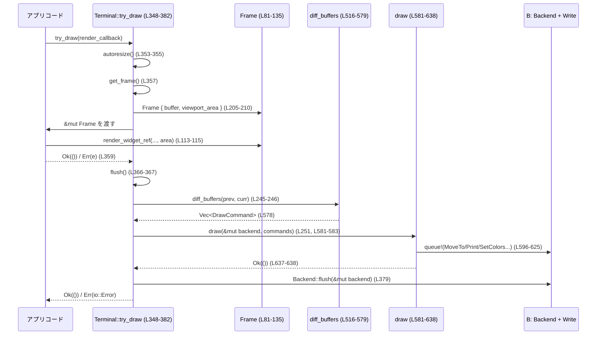

# tui/src/custom_terminal.rs コード解説

---

## 0. ざっくり一言

端末バックエンド（`ratatui::backend::Backend`）の上に、**ダブルバッファ＋差分描画**を行う `Terminal` 実装と、**OSC 8 などを考慮した幅計算・スタイル差分適用ロジック**を提供するモジュールです（`Terminal` 本体: `tui/src/custom_terminal.rs:L137-505`、差分描画: `L516-638`）。

---

## 1. このモジュールの役割

### 1.1 概要

- このモジュールは、**端末画面の効率的な再描画**という問題を解決するために存在し、  
  `Terminal<B>` 型を通して以下を提供します（`L137-160`, `L178-505`）:
  - ダブルバッファ方式での画面状態管理
  - 前フレームとの差分計算と最小限のエスケープシーケンス送出
  - カーソル表示 / 非表示と位置管理
  - スクロールバックや画面全体のクリア機能
- さらに、マルチバイト（全角）文字や OSC 8 ハイパーリンクを考慮したセル幅計算（`display_width`: `L56-79`）、  
  `Modifier` の差分適用（`ModifierDiff`: `L643-704`）を内部ユーティリティとして持ちます。

### 1.2 アーキテクチャ内での位置づけ

このファイル内だけで見ると、おおまかな依存関係は次の通りです。

```mermaid
graph LR
  App["アプリケーション\n(描画クロージャ)"]
  Frame["Frame<'_>\n(L81-135)"]
  Terminal["Terminal<B>\n(L137-505)"]
  Diff["diff_buffers\n(L516-579)"]
  DrawFn["draw\n(L581-638)"]
  Backend["B: Backend + Write\n(外部 crate)"]

  App -->|draw / try_draw 呼び出し| Terminal
  Terminal -->|get_frame| Frame
  App -->|Frame を使って描画| Frame
  Terminal -->|flush()| Diff
  Diff -->|Vec<DrawCommand>| DrawFn
  DrawFn -->|queue!(MoveTo/Print/SetColors..)| Backend
  Terminal -->|Backend::flush()| Backend
```

- `Terminal::draw` / `Terminal::try_draw` がアプリケーションコードのエントリポイントです（`L280-311`, `L313-382`）。
- 描画クロージャには `Frame` が渡され、`Frame::render_widget_ref` を通じて ratatui の `WidgetRef` が描画されます（`L96-115`）。
- `Terminal::flush` は `diff_buffers` → `draw` を呼び出し、バックエンドへの書き込みを行います（`L243-252`, `L516-579`, `L581-638`）。
- 端末固有の I/O はすべて `Backend + Write` に閉じ込められています（`L24-25`, `L37-38`, `L581-583`）。

### 1.3 設計上のポイント

コードから読み取れる設計上の特徴は次の通りです。

- **ダブルバッファ**  
  - `buffers: [Buffer; 2]` と `current: usize` で現在と前回のフレームを保持します（`L142-148`）。
  - `swap_buffers` で非アクティブ側をリセットしつつ入れ替えます（`L496-500`）。
- **差分描画最適化**
  - 行ごとに「右端で意味のあるセル」を計算し、それ以降を `ClearToEnd` 1回でクリア（`L520-549`）。
  - マルチ幅グリフと `Cell::skip` を考慮し、影響範囲を `invalidated` / `to_skip` で管理（`L552-577`）。
  - これにより無駄な `Put` を減らし、出力量を削減します。
- **スタイル差分適用**
  - `ModifierDiff` により、前回と今回の `Modifier` の差分だけを crossterm の `Attribute` として送出します（`L643-704`）。
  - 前景色・背景色も直前値と比較して必要な場合だけ `SetColors` を送出します（`L585-587`, `L609-616`）。
- **カーソル管理**
  - `Frame` 内で論理カーソル位置を指定し（`L127-129`）、`try_draw` 終了時にまとめて反映（`L361-375`）。
  - `hidden_cursor` フラグと `Drop` 実装で「終了時にカーソルを見える状態に戻す」処理を行います（`L149-150`, `L162-175`）。
- **安全性とエラーハンドリング**
  - すべて安全な Rust で実装されており `unsafe` はありません。
  - 端末 I/O は `io::Result` で伝播し、失敗時は即座にエラーとして返されます（例: `with_options`: `L184-201`, `try_draw`: `L348-382`）。
  - 一部ログには `tracing::warn!` や `eprintln!` を使用しています（`L186-191`, `L168-175`）。
- **並行性**
  - すべてのメソッドが `&mut self` を要求するため、同じ `Terminal` インスタンスを複数スレッドから同時に使用することは想定されていません（`L178-182` の境界を含むすべてのメソッドシグネチャ）。

---

## 2. 主要な機能一覧

- 画面描画ループのエントリポイント (`Terminal::draw`, `Terminal::try_draw`)  
  - `draw`: `tui/src/custom_terminal.rs:L280-311`  
  - `try_draw`: `tui/src/custom_terminal.rs:L313-382`
- ダブルバッファによる画面状態管理 (`Terminal::buffers`, `swap_buffers`)  
  - フィールド: `L142-148`、メソッド: `L496-500`
- 差分計算と描画コマンド生成 (`diff_buffers`, `DrawCommand`)  
  - `DrawCommand`: `L510-514`、`diff_buffers`: `L516-579`
- コマンド列から実際の端末出力を生成 (`draw` 関数)  
  - `tui/src/custom_terminal.rs:L581-638`
- カーソルとビュー ポートの管理  
  - カーソル位置・表示/非表示: `Terminal::hide_cursor`, `show_cursor`, `set_cursor_position`（`L384-395`, `L406-411`）  
  - ビューポート領域と自動リサイズ: `viewport_area`, `set_viewport_area`, `autoresize`（`L151-152`, `L263-269`, `L271-277`）
- スクロールバック・画面クリア機能  
  - `clear`, `invalidate_viewport`, `clear_scrollback`, `clear_visible_screen`, `clear_scrollback_and_visible_screen_ansi`（`L414-424`, `L427-432`, `L435-448`, `L451-463`, `L466-482`）
- マルチバイト・OSC 対応の幅計算 (`display_width`)  
  - `tui/src/custom_terminal.rs:L56-79`

---

## 3. 公開 API と詳細解説

### 3.1 型一覧（構造体・列挙体など）

| 名前 | 種別 | 公開性 | 役割 / 用途 | 定義位置 |
|------|------|--------|------------|----------|
| `Frame<'a>` | 構造体 | `pub` | 1フレーム分の描画対象バッファとカーソル情報をまとめたビュー。描画クロージャに渡される。 | `tui/src/custom_terminal.rs:L81-94` |
| `Terminal<B>` | 構造体 | `pub` | `Backend + Write` をラップし、ダブルバッファ＋差分描画＋カーソル管理を提供するメインの端末抽象。 | `tui/src/custom_terminal.rs:L137-160` |
| `DrawCommand` | 列挙体 | 非公開 | `diff_buffers` が生成する低レベル描画コマンド（セル描画 or 行末までクリア）。 | `tui/src/custom_terminal.rs:L510-514` |
| `ModifierDiff` | 構造体 | 非公開 | 直前の `Modifier` と現在の `Modifier` の差分を計算し、必要な crossterm 属性のみを出力するユーティリティ。 | `tui/src/custom_terminal.rs:L643-646` |

### 3.2 関数詳細（主要 7 件）

#### `display_width(s: &str) -> usize`

**概要**

OSC 8 などの OSC エスケープシーケンスを無視して、**実際の表示幅（列数）**を計算します。`UnicodeWidthStr::width` が OSC のペイロード文字まで数えてしまう問題を回避するためのヘルパです（`tui/src/custom_terminal.rs:L48-55`, `L56-79`）。

**引数**

| 引数名 | 型 | 説明 |
|--------|----|------|
| `s` | `&str` | セルのシンボル文字列。OSC シーケンスを含む場合があります。 |

**戻り値**

- `usize` — 端末上で実際に消費する列数。OSC シーケンスは 0 幅として扱われます。

**内部処理の流れ**

1. 文字列に ESC (`'\x1B'`) が含まれない場合は、そのまま `s.width()` の結果を返します（`L57-60`）。
2. ESC が含まれる場合、`visible` という新しい `String` を作り、`s.chars()` を手動で走査します（`L62-65`）。
3. `'\x1B'` に続いて `']'` が現れたら OSC シーケンスとみなし、次に BEL (`'\x07'`) が出るまでの文字をスキップします（`L66-73`）。
4. それ以外の文字はそのまま `visible` に push します（`L75-76`）。
5. 最後に `visible.width()` を返します（`L78`）。

**Examples（使用例）**

```rust
// "中" は全角1文字で幅2、かつ OSC ハイパーリンクでラップされていると仮定する
let s = "\x1B]8;;http://example.com\x07中\x1B]8;;\x07"; // ハイパーリンク付き
let w = display_width(s); // OSC 部分は0幅として無視される
assert_eq!(w, 2); // 「中」1文字の幅だけが計算される
```

※ 上記は本関数の想定ユースケースを示す擬似例であり、実際の呼び出しはこのファイル内からのみ行われます（`diff_buffers`: `L537`, `L570-575`）。

**Errors / Panics**

- この関数はエラーも panic も発生させません。

**Edge cases**

- ESC から始まるが `']'` が続かないシーケンスは **通常の文字として扱われます**（`L66` の条件より）。
- OSC の終端に BEL (`'\x07'`) が現れない場合、ループの終端までスキップし続けるため、その部分はすべて 0 幅扱いになります（`L69-73`）。
- 空文字列 `""` に対しては `UnicodeWidthStr::width` の挙動と同じく `0` を返します。

**使用上の注意点**

- OSC 以外の CSI（`ESC[` から始まるシーケンス）などは特別扱いしていないため、それらを含む文字列に対しては、「表示幅」ではなく `UnicodeWidthStr::width` とほぼ同等の扱いになります。
- 本ファイル内では `diff_buffers` のみから利用されています。外部から直接使う前提の API ではありません。

---

#### `Terminal::try_draw<F, E>(&mut self, render_callback: F) -> io::Result<()>`

**概要**

1フレーム分の描画を行うメイン関数です。**自動リサイズ → フレーム生成 → ユーザ描画クロージャ呼び出し → 差分フラッシュ → カーソル反映 → バッファ入れ替え → バックエンド flush** という一連の処理をまとめています（`tui/src/custom_terminal.rs:L313-347`, `L348-382`）。

**シグネチャ**

```rust
pub fn try_draw<F, E>(&mut self, render_callback: F) -> io::Result<()>
where
    F: FnOnce(&mut Frame) -> Result<(), E>,
    E: Into<io::Error>,
```

**引数**

| 引数名 | 型 | 説明 |
|--------|----|------|
| `render_callback` | `F: FnOnce(&mut Frame) -> Result<(), E>` | 描画処理を行うクロージャ。`Frame` に対してウィジェットを描画し、必要なら任意のエラー型 `E` を返せます。 |

**戻り値**

- `io::Result<()>` — すべてのステップが成功すれば `Ok(())`、途中で I/O やコールバックエラーが起きれば `Err(io::Error)`。

**内部処理の流れ**

1. `autoresize` を呼び出して、実際の端末サイズ変化に追従します（`L353-355`）。
2. 現在のビューポートに対応する `Frame` を `get_frame` で取得します（`L357`）。
3. `render_callback(&mut frame)` を呼び出し、アプリ側に描画させます。エラーは `Into<io::Error>` で変換されて伝播します（`L359`）。
4. `frame.cursor_position` をローカル変数に取り出してから、`frame` をドロップします（`L361-364`）。
5. `flush` でダブルバッファの差分をバックエンドに書き出します（`L366-367`）。
6. 取り出した `cursor_position` に基づき、カーソルの表示/非表示と位置を更新します（`L369-375`）。
7. `swap_buffers` で前後バッファを入れ替え、古いバッファをリセットします（`L377-378`, `L496-500`）。
8. `Backend::flush(&mut self.backend)` を呼び、実際に OS へ書き込みをフラッシュします（`L379`）。
9. 以上が成功すれば `Ok(())` を返します（`L381`）。

**Examples（使用例）**

典型的な描画ループの例です（バックエンド実装名は仮のものです）。

```rust
use std::io::Result;                                      // io::Result をインポート
// use ratatui::backend::CrosstermBackend;                // 具体的な Backend 実装（例）
// use std::io::stdout;

fn main() -> Result<()> {
    // Backend + Write を満たすバックエンド値を作成する
    let backend = /* 例: CrosstermBackend::new(stdout()) */;

    // Terminal を初期化する
    let mut terminal = Terminal::with_options(backend)?;   // L184-201

    loop {
        // try_draw で 1 フレーム分を描画する
        terminal.try_draw(|frame| {
            let area = frame.area();                       // 現在のビューポート領域を取得（L104-106）
            // ここで area を使ってウィジェットを配置・描画する
            // widget.render_ref(area, frame.buffer_mut()); // L113-115, L131-134
            Ok(())                                        // 描画に失敗したら Err(...) を返せる
        })?;
    }
}
```

**Errors / Panics**

- エラーになるケース:
  - `autoresize` 内での `Backend::size()` が失敗した場合（`L272-277`）。
  - ユーザの `render_callback` が `Err` を返した場合（`L359`）。
  - `flush` 内での描画 I/O（`draw` 関数内の `queue!` など）が失敗した場合（`L245-252`, `L596`, `L606`, `L610-613`, `L618`, `L621`, `L623`, `L625`, `L631-635`）。
  - `hide_cursor`, `show_cursor`, `set_cursor_position`, `Backend::flush` のいずれかが失敗した場合（`L369-375`, `L379`）。
- panic:
  - この関数自体は panic を発生させません。panic しうるのは、ユーザ描画クロージャ内部のコードのみです。

**Edge cases**

- 描画クロージャがビューポートの一部しか更新しない場合  
  - 差分は前フレームに基づいて計算されるため、**前フレームの内容が意図せず残る**可能性があります。
  - これは doc コメントで「フレーム全体を毎回描画すること」と明示されています（`L298-302`, `L343-347`）。
- `Frame::set_cursor_position` を呼ばなかった場合  
  - `cursor_position` は `None` のままで、`try_draw` は `hide_cursor` を呼び出し、カーソルを非表示にします（`L369-370`）。

**使用上の注意点**

- 描画クロージャでは **毎回フレーム全体を再描画**することが前提です。部分描画はサポートされていません（`L298-302`, `L343-347`）。
- `try_draw` は同期 I/O を行うため、高頻度に呼び出す場合は I/O 負荷に注意が必要です。
- 並行実行は前提としておらず、複数スレッドから同時に呼び出さないことが前提条件です（`&mut self`）。

---

#### `Terminal::flush(&mut self) -> io::Result<()>`

**概要**

現在バッファと前回バッファの差分を計算し、**必要最小限のターミナル更新コマンド**をバックエンドに送出します（`tui/src/custom_terminal.rs:L243-252`）。

**引数・戻り値**

- 引数: `&mut self`
- 戻り値: `io::Result<()>` — 端末出力がすべて成功すれば `Ok(())`。

**内部処理**

1. `diff_buffers(self.previous_buffer(), self.current_buffer())` で差分コマンド列を生成（`L245-246`）。
2. `updates.iter().rfind(|command| command.is_put())` で最後の `Put` コマンドを探し、その位置を `last_known_cursor_pos` に保持（`L247-250`）。  
   ※ `is_put` は `derive_more::IsVariant` による自動生成メソッドです（`L36`, `L510`）。
3. `draw(&mut self.backend, updates.into_iter())` を呼び、実際の I/O を実行（`L251`）。

**Errors / Panics**

- `draw` 内部の crossterm `queue!` 呼び出しが失敗した場合、`Err(io::Error)` が返ります（`L581-638`）。
- panic しません。

**Edge cases**

- `updates` が空の場合  
  - `last_put_command` は `None` となり、`last_known_cursor_pos` は更新されません（`L247-250`）。
- 最後の `Put` がマルチ幅文字の場合  
  - `x` はセルの左端のカラムです。カーソル位置も左端になりますが、これが正しいかどうかはアプリ側の期待次第です。この挙動はコードから読み取れる事実です（`L248-250`）。

**使用上の注意点**

- 通常は `try_draw` 内からのみ呼ばれます（`L366-367`）。  
  外部から直接呼んだ場合でも動作はしますが、カーソル制御や `swap_buffers` との整合性は自分で保つ必要があります。

---

#### `diff_buffers(a: &Buffer, b: &Buffer) -> Vec<DrawCommand>`

**概要**

2つの `Buffer` の内容を比較し、**端末更新に必要な最小限の `DrawCommand` 列**を生成します（`tui/src/custom_terminal.rs:L516-579`）。  
マルチ幅文字やセルの `skip` フラグを考慮しつつ、行末の不要な部分は `ClearToEnd` 1 回でクリアします。

**引数**

| 引数名 | 型 | 説明 |
|--------|----|------|
| `a` | `&Buffer` | 前フレームのバッファ（previous） |
| `b` | `&Buffer` | 現フレームのバッファ（next） |

**戻り値**

- `Vec<DrawCommand>` — 実際に `draw` 関数へ渡すコマンド列（`Put` / `ClearToEnd`）。

**内部処理の流れ**

1. `previous_buffer = &a.content`, `next_buffer = &b.content`（`L517-518`）。
2. 行ごとに走査し、各行の「意味のある最後の列」を計算:
   - 背景色 `bg` を行末セルの `bg` から取得（`L525-526`）。
   - 各セルについて `display_width(cell.symbol())` を使いながら走査し、  
     「非スペース・背景色が行末と異なる・modifier あり」のいずれかで `last_nonblank_column` を更新（`L528-541`）。
   - 右端側の不要部分が存在する場合、その開始位置に `ClearToEnd { x, y, bg }` を追加（`L544-547`）。
3. 各行ごとの `last_nonblank_columns` を保存（`L521`, `L549`）。
4. 2つのバッファをインデックス順に同時に走査し、セル差分を評価（`L552-577`）:
   - `invalidated` カウンタで「前のマルチ幅文字により影響を受けるセル数」を追跡（`L552`, `L572-577`）。
   - `to_skip` で「マルチ幅文字の続きセル」や `skip` が立っているセルをスキップ（`L555-556`, `L570`）。
   - 条件を満たすセルに対して `DrawCommand::Put { x, y, cell: clone }` を追加。ただし `x` がその行の `last_nonblank_columns[row]` 以下のときのみ（`L557-567`）。
5. 最後に `updates` を返します（`L578`）。

**Examples（使用例）**

テストで検証されている振る舞いをそのまま説明します。

- **行幅ぴったりに最後のセルが描画されている場合は `ClearToEnd` を出さない**（`L715-739`）。
- **全角文字の後ろの不要部分は、全角文字の右側から `ClearToEnd` を出す**（`L742-757`）。

```rust
// テストと同様のシナリオ（全角文字と ClearToEnd の位置）
let area = Rect::new(0, 0, 10, 1);
let mut previous = Buffer::empty(area);
let mut next = Buffer::empty(area);

// 前フレーム: "中文"（幅2+2=4）
previous.set_string(0, 0, "中文", Style::default());
// 現フレーム: "中"（残りは空白に）
next.set_string(0, 0, "中", Style::default());

let commands = diff_buffers(&previous, &next);

assert!(
    commands.iter().any(|c|
        matches!(c, DrawCommand::ClearToEnd { x: 2, y: 0, .. }) // L744-755
    )
);
```

**Errors / Panics**

- この関数自体はエラーも panic も発生させません。
- `a` と `b` の `area` と `content` 長さが一致していることを前提としており、それが崩れると `row_start..row_end` や `zip` の前提が壊れますが、本ファイル内では Terminal 管理下のバッファ同士のみ渡されているため、この前提は守られています（`L142-147`, `L264-267`）。

**Edge cases**

- ビューポートが高さ 0 の場合、`for y in 0..a.area.height` が実行されず、`updates` は空のまま返されます（`L522`, `L578`）。
- すべてスペースで背景色・modifier も同じ場合、行ごとに `ClearToEnd` 1個だけになるか、1個も出ない可能性があります。これは `last_nonblank_column` の初期値と条件（`L533`, `L538-541`, `L544-547`）から読み取れます。
- `Cell.skip` が真のセルは、たとえ内容が変わっていても `to_skip` と条件により描画されません（`L557-558`）。

**使用上の注意点**

- 外部から呼び出す前提の API ではなく、`Terminal::flush` 専用です（`L245-246`）。
- 端末依存の字幅（East Asian Width）などは `unicode_width::UnicodeWidthStr` の挙動に依存します（`L46`, `L59`, `L78`）。

---

#### `fn draw<I>(writer: &mut impl Write, commands: I) -> io::Result<()>`

**概要**

`diff_buffers` から渡された `DrawCommand` 列を、**実際の crossterm キュー呼び出し列に変換**し、端末へ送出する関数です（`tui/src/custom_terminal.rs:L581-638`）。

**引数**

| 引数名 | 型 | 説明 |
|--------|----|------|
| `writer` | `&mut impl Write` | crossterm の `queue!` で書き込み対象となるライター。通常は `Backend` です。 |
| `commands` | `I: Iterator<Item = DrawCommand>` | 差分描画コマンド列。 |

**戻り値**

- `io::Result<()>` — すべてのキュー操作が成功すれば `Ok(())`。

**内部処理の流れ**

1. 現在の前景色/背景色/修飾子をローカル変数で保持（`fg`, `bg`, `modifier`）（`L585-587`）。
2. `last_pos` で直前に move したカーソル位置を記録し、連続したセルの場合は `MoveTo` を省略します（`L588-598`）。
3. 各 `command` について:
   - まず `MoveTo(x, y)` を必要ならキュー（`L589-597`）。
   - `DrawCommand::Put` の場合:
     - `ModifierDiff` で修飾子差分を計算してキュー（`L600-607`）。
     - 前景色・背景色が変わっていれば `SetColors` をキュー（`L609-616`）。
     - `Print(cell.symbol())` をキュー（`L618`）。
   - `DrawCommand::ClearToEnd` の場合:
     - `Attribute::Reset` で修飾子をリセット（`L620-622`）。
     - 背景色を `SetBackgroundColor` で設定し（`L623-624`）、`Clear(UntilNewLine)` をキュー（`L625`）。
4. 最後に、前景色・背景色・属性をデフォルトにリセットするシーケンスをキュー（`L630-635`）。

**Errors / Panics**

- いずれかの `queue!` マクロの呼び出し（`MoveTo`, `SetColors`, `SetAttribute`, `SetBackgroundColor`, `Clear`, `Print`）が失敗すると `Err(io::Error)` を返します（`L596`, `L606`, `L610-613`, `L618`, `L621`, `L623`, `L625`, `L631-635`）。
- panic は発生させません。

**Edge cases**

- `commands` が空の場合、`MoveTo` / `Print` 等は一切出ず、最後のリセットシーケンスのみが送出されます（`L581-638` 全体の構造）。
- `ClearToEnd` 連発のようなケースでも、毎回 `Attribute::Reset` と `SetBackgroundColor` が送られるため、色状態は常に明示的に管理されます（`L620-625`）。

**使用上の注意点**

- `writer` は crossterm の `queue!` と互換なストリームである必要があります（このファイルでは `Backend` がそれを満たしている前提です: `L245-252`）。
- `DrawCommand` 列の順序はこの関数の外側（`diff_buffers`）で決まるので、ここでは順序を変更しません。

---

#### `Frame::render_widget_ref<W: WidgetRef>(&mut self, widget: W, area: Rect)`

**概要**

ratatui の `WidgetRef` トレイトを実装したウィジェットを、現在のバッファに描画します（`tui/src/custom_terminal.rs:L108-115`）。

**引数**

| 引数名 | 型 | 説明 |
|--------|----|------|
| `widget` | `W: WidgetRef` | 描画するウィジェット。 |
| `area` | `Rect` | ウィジェットを描画する領域。通常 `Frame::area()` またはそのサブ領域です。 |

**戻り値**

- なし（`()`）。描画結果は `Frame` 内部の `buffer: &mut Buffer` に書き込まれます（`L93`, `L113-115`）。

**内部処理の流れ**

1. 単に `widget.render_ref(area, self.buffer);` を呼ぶラッパです（`L113-115`）。
2. `WidgetRef` の実装側が、`Buffer` にセルを書き込みます。

**Examples（使用例）**

```rust
fn render_ui(frame: &mut Frame) {
    let area = frame.area();                              // フレーム全体の Rect（L104-106）
    // 仮のウィジェット型 MyWidget（WidgetRef 実装済み）を描画する
    // let widget = MyWidget::new(...);
    // frame.render_widget_ref(widget, area);             // L113-115
}
```

**Errors / Panics**

- このメソッド自体は `Result` を返さず、エラー処理は `WidgetRef::render_ref` の実装に委ねられます。
- panic の有無もウィジェット実装依存です。

**Edge cases**

- `area` が `Rect::ZERO` など空の場合、通常はウィジェット側で何もしない実装が期待されますが、このファイルからは挙動を断定できません。

**使用上の注意点**

- `Frame` は `get_frame` から毎フレーム新しく取得されるため、`buffer_mut` と組み合わせて **同じフレーム内でのみ**使用します（`L204-211`, `L131-134`）。
- `Frame` が生きている間は `Terminal` の `&mut self` を別途借用できないため、描画処理はクロージャ内で完結させる設計になっています（`L348-359`）。

---

#### `Terminal::clear_scrollback_and_visible_screen_ansi(&mut self) -> io::Result<()>`

**概要**

スクロールバックと可視画面の両方を **1つの ANSI シーケンス列**でハードリセットし、内部状態（カーソル位置・履歴行数・バックバッファ）をリセットします（`tui/src/custom_terminal.rs:L466-482`）。

**引数・戻り値**

- 引数: `&mut self`
- 戻り値: `io::Result<()>`

**内部処理の流れ**

1. `viewport_area.is_empty()` の場合は何もせず `Ok(())` を返す（`L470-473`）。
2. 「スクロール領域リセット・スタイルリセット・カーソルホーム・画面クリア・スクロールバックパージ」をまとめた ANSI 文字列を `write!` で送出（`L475-477`）。
3. `Write::flush(&mut self.backend)` でフラッシュ（`L478`）。
4. `last_known_cursor_pos` を (0,0) に、`visible_history_rows` を 0 にリセット（`L479-480`）。
5. `previous_buffer_mut().reset()` で差分バッファを無効化（`L481`）。

**使用例（概念的）**

```rust
// 端末のスクロールバックを完全に捨てたいタイミングで呼ぶ
terminal.clear_scrollback_and_visible_screen_ansi()?;     // L470-482
// 次の draw 呼び出しで、画面全体を再描画する必要がある
```

**Errors / Panics**

- `write!` や `flush` が失敗した場合、`Err(io::Error)` を返します（`L475-478`）。
- panic は発生させません。

**Edge cases**

- `viewport_area` が空の場合は何も行わないため、**スクロールバックがクリアされない**ことになります（`L470-473`）。
- 使用ターミナルが ANSI シーケンス `\x1b[r`, `\x1b[2J`, `\x1b[3J` 等をサポートしていない場合の挙動は、このコードからは分かりません。

**使用上の注意点**

- crossterm の `ClearType::Purge` と `ClearType::All` を組み合わせたメソッド（`clear_scrollback`, `clear_visible_screen`）と異なり、**生の ANSI を送る**ため、一部の端末で互換性が異なる可能性があります（コメント: `L466-469`, シーケンス: `L475-477`）。
- 呼び出し後は `previous_buffer` をリセットしているため、次の描画前に `Viewport` 全体の再描画が必要です（`L481`）。

---

#### `Terminal::draw<F>(&mut self, render_callback: F) -> io::Result<()>`

**概要**

`try_draw` のシンプル版です。描画クロージャが `Result` を返さない場合に使いやすいラッパで、内部で `try_draw` に包み直します（`tui/src/custom_terminal.rs:L280-311`）。

**内部処理（簡略）**

- `try_draw` にクロージャを渡し、`render_callback(frame); Ok(())` という形に変換して呼び出すだけです（`L303-310`）。

**使用上の注意点**

- `render_callback` 内でエラー処理をしたい場合は、このメソッドではなく `try_draw` を使う必要があります。

---

### 3.3 その他の関数・メソッド一覧

主要以外の関数・メソッドを役割と位置だけ一覧にします。

#### 構造体 `Frame<'a>` メソッド

| 関数名 | 公開性 | 役割 | 定義位置 |
|--------|--------|------|----------|
| `area(&self) -> Rect` | `pub const` | 現在のフレームのビューポート領域を返す。リサイズイベントではなくこの値を使うことが推奨されている。 | `tui/src/custom_terminal.rs:L104-106` |
| `set_cursor_position<P: Into<Position>>(&mut self, position: P)` | `pub` | 描画後に表示したいカーソル位置を論理的に指定する。 | `tui/src/custom_terminal.rs:L127-129` |
| `buffer_mut(&mut self) -> &mut Buffer` | `pub` | 描画対象 `Buffer` への `&mut` 参照を取得する。 | `tui/src/custom_terminal.rs:L131-134` |

#### 構造体 `Terminal<B>` メソッド（公開）

| 関数名 | 役割 | 定義位置 |
|--------|------|----------|
| `with_options(backend: B) -> io::Result<Self>` | バックエンドから初期スクリーンサイズとカーソル位置を取得して `Terminal` を構築。CPR が失敗した場合は (0,0) をデフォルトにする。 | `L183-201` |
| `get_frame(&mut self) -> Frame<'_>` | 現在バッファに書き込むための `Frame` を生成。 | `L204-211` |
| `backend(&self) -> &B` | バックエンドへの参照を返す。 | `L233-236` |
| `backend_mut(&mut self) -> &mut B` | バックエンドへの可変参照を返す。 | `L238-241` |
| `resize(&mut self, screen_size: Size) -> io::Result<()>` | 画面サイズの記録だけを更新する。内部バッファのリサイズは行わない。 | `L258-260` |
| `set_viewport_area(&mut self, area: Rect)` | 内部バッファを新しいビューポートサイズにリサイズし、履歴行数を調整する。 | `L263-269` |
| `autoresize(&mut self) -> io::Result<()>` | `size()` で取得した実スクリーンサイズが変わっていれば `resize` を呼ぶ。 | `L271-277` |
| `hide_cursor(&mut self) -> io::Result<()>` | カーソルを非表示にし、`hidden_cursor` フラグを立てる。 | `L384-388` |
| `show_cursor(&mut self) -> io::Result<()>` | カーソルを表示し、`hidden_cursor` フラグを下ろす。 | `L391-395` |
| `get_cursor_position(&mut self) -> io::Result<Position>` | バックエンドから現在のカーソル位置を取得（`#[allow(dead_code)]`）。 | `L401-403` |
| `set_cursor_position<P: Into<Position>>(&mut self, position: P) -> io::Result<()>` | バックエンドのカーソル位置を設定し、`last_known_cursor_pos` を更新。 | `L406-411` |
| `clear(&mut self) -> io::Result<()>` | ビューポート先頭から画面末尾までをクリアし、差分バッファをリセット。 | `L414-424` |
| `invalidate_viewport(&mut self)` | 差分バッファのみリセットし、次回描画でビューポート全体を再描画させる。 | `L427-433` |
| `clear_scrollback(&mut self) -> io::Result<()>` | crossterm の `ClearType::Purge` を用いてスクロールバックをパージし、差分バッファをリセット。 | `L435-448` |
| `clear_visible_screen(&mut self) -> io::Result<()>` | 可視画面全体をクリアし、内部履歴と差分バッファをリセット。 | `L451-463` |
| `visible_history_rows(&self) -> u16` | ビューポート上部に存在する可視履歴行数を返す。 | `L485-486` |
| `swap_buffers(&mut self)` | 前フレームバッファをリセットして、現在バッファと入れ替える。 | `L496-500` |
| `size(&self) -> io::Result<Size>` | バックエンドの実際のスクリーンサイズを問い合わせる。 | `L502-505` |

#### 構造体 `Terminal<B>` メソッド（内部・非公開）

| 関数名 | 公開性 | 役割 | 定義位置 |
|--------|--------|------|----------|
| `current_buffer(&self) -> &Buffer` | `fn` | 現在バッファへの参照取得。 | `L213-216` |
| `current_buffer_mut(&mut self) -> &mut Buffer` | `fn` | 現在バッファへの可変参照取得。 | `L218-221` |
| `previous_buffer(&self) -> &Buffer` | `fn` | 前フレームバッファへの参照取得。 | `L223-226` |
| `previous_buffer_mut(&mut self) -> &mut Buffer` | `fn` | 前フレームバッファへの可変参照取得。 | `L228-231` |
| `note_history_rows_inserted(&mut self, inserted_rows: u16)` | `pub(crate)` | ビューポートの上に可視履歴行が挿入されたことを記録。`visible_history_rows` を saturating 加算＋上限クリップ。 | `L489-493` |

#### その他

| 関数名 / 実装 | 種別 | 役割 | 定義位置 |
|---------------|------|------|----------|
| `impl Drop for Terminal<B>::drop(&mut self)` | Drop 実装 | `hidden_cursor` が真なら `show_cursor` を試み、失敗したら `stderr` にログを出す。 | `L162-175` |
| `ModifierDiff::queue<W: io::Write>(self, w: &mut W)` | メソッド | `Modifier` の差分に応じて crossterm 属性をキュー。 | `L648-704` |

---

## 4. データフロー

ここでは `Terminal::try_draw` を起点にした、1フレーム描画時のデータフローを示します。

### 処理の要点

1. アプリコードは `Terminal::draw` または `try_draw` を呼び出します（`L280-311`, `L348-382`）。
2. `Terminal` は `autoresize` と `get_frame` により、現在のビューポートに対応する `Frame` を作成します（`L353-357`）。
3. アプリ側描画クロージャが `Frame` 上にウィジェットを描画します（`Frame::render_widget_ref`: `L108-115`）。
4. `Terminal::flush` → `diff_buffers` → `draw` の順に差分コマンドを計算・適用し、バックエンドに書き込みます（`L245-252`, `L516-579`, `L581-638`）。
5. 最後にカーソル位置を反映し、ダブルバッファを入れ替えてフレームを完了します（`L369-379`, `L496-500`）。

### シーケンス図



---

## 5. 使い方（How to Use）

### 5.1 基本的な使用方法

典型的な同期描画ループの構成は次のようになります。

```rust
use std::io::Result;                                      // I/O 結果型
// use ratatui::backend::CrosstermBackend;                // 具体的 Backend 実装（例）
// use std::io::stdout;

fn main() -> Result<()> {
    // Backend + Write を実装する値を用意する
    let backend = /* 例: CrosstermBackend::new(stdout()) */;

    // 端末を初期化する（画面サイズと初期カーソル位置を取得）          // L183-201
    let mut terminal = Terminal::with_options(backend)?;

    loop {
        // フレーム単位で描画する                                    // L280-311 or L348-382
        terminal.draw(|frame| {
            let area = frame.area();                               // 現在のビューポート領域（L104-106）

            // 必要であればレイアウトを分割し、WidgetRef を描画      // L108-115
            // let areas = Layout::default().split(area);
            // frame.render_widget_ref(widget, areas[0]);

            // 低レベルにセルを書き込みたい場合:
            // let buf = frame.buffer_mut();                       // L131-134
            // buf.get_mut(x, y).set_symbol("X");

        })?;                                                       // I/O エラーがあればここで Err
    }
}
```

### 5.2 よくある使用パターン

1. **エラー伝播付き描画（`try_draw`）**

```rust
fn draw_frame(terminal: &mut Terminal<impl Backend + Write>) -> std::io::Result<()> {
    terminal.try_draw(|frame| {
        // ここでアプリ固有の Result 型を使い、? でエラー伝播できる
        // do_something_that_may_fail()?;
        Ok(())
    }) // E: Into<io::Error> 制約により、自動的に io::Error に変換される（L348-352, L359）
}
```

1. **画面を完全にクリアしてから描画したい**

```rust
fn reset_and_draw(terminal: &mut Terminal<impl Backend + Write>) -> std::io::Result<()> {
    terminal.clear_visible_screen()?;                             // 可視画面全体クリア（L451-463）
    terminal.draw(|frame| {
        // クリアされた状態を前提に描画
    })
}
```

1. **スクロールバックを含めて完全リセットしたい**

```rust
fn hard_reset(terminal: &mut Terminal<impl Backend + Write>) -> std::io::Result<()> {
    terminal.clear_scrollback_and_visible_screen_ansi()?;         // L466-482
    // 次の draw で全画面を再描画することが前提
    Ok(())
}
```

### 5.3 よくある間違い

```rust
// 間違い例: フレームの一部だけを更新している
terminal.draw(|frame| {
    // 以前の描画内容に依存して、一部だけ上書き
    // -> 前フレームの内容が残り、画面が壊れる可能性がある           // L298-302, L343-347
});

// 正しい例: 毎フレーム、表示したい内容をフレーム全体に描く
terminal.draw(|frame| {
    let area = frame.area();
    // area 全体に対して現在の状態を完全に描画する
});

// 間違い例: 外部で端末に直接書き込み、invalidate_viewport を呼ばない
// println!("直接端末に書く..."); // diff_buffers はこれを知らない

// 正しい例: 端末外書き込みを行ったら、次のフレーム前に invalidate_viewport を呼ぶ
terminal.invalidate_viewport();                                   // L427-433
```

### 5.4 使用上の注意点（まとめ）

- **フレーム全体を毎回再描画することが必須**です。部分更新だけに頼ると、ダブルバッファの差分計算と齟齬が生じます（`L298-302`, `L343-347`）。
- 端末に対して `println!` など **Terminal を介さない書き込み**を行う場合は、  
  `invalidate_viewport` や `clear*` 系メソッドを併用し、差分バッファの前提をリセットする必要があります（`L427-433`）。
- すべてのメソッドが同期 I/O を行い、`&mut self` を要求するため、非同期処理やマルチスレッドからの同時アクセスはこの層では扱っていません。
- `clear_scrollback_and_visible_screen_ansi` は生の ANSI シーケンスを送るため、端末依存性が高くなります（`L466-482`）。

---

## 6. 変更の仕方（How to Modify）

### 6.1 新しい機能を追加する場合

例: 新しいクリアモードや描画モードを追加したい場合。

1. **API を決める**
   - `Terminal<B>` に新しい `pub fn` を追加するのが自然です（既存の `clear_*` 群: `L414-424`, `L435-448`, `L451-463`, `L470-482` を参考）。
2. **内部状態の更新**
   - スクロールバックや履歴行数に影響する場合は、`visible_history_rows` や `last_known_cursor_pos` をどのように更新すべきか検討します（`L151-160`, `L479-480`）。
3. **差分バッファとの整合**
   - 端末内容を外部コマンドで大きく変更した場合は、`previous_buffer_mut().reset()` を呼び、次回描画で全再描画させる必要があります（`L423`, `L431-432`, `L447`, `L462`, `L481`）。
4. **テストの追加**
   - `diff_buffers` と `DrawCommand` を変更する場合は、既存テスト（`L715-739`, `L742-757`）にならって、新しいケースを追加するのが安全です。

### 6.2 既存の機能を変更する場合

- **`diff_buffers` のロジック変更**
  - 影響範囲: 差分描画のすべて。`Terminal::flush` → `draw` のパイプラインにも影響します（`L245-252`, `L516-579`, `L581-638`）。
  - 注意点:
    - マルチ幅文字・`Cell.skip` の扱いが変わると、既存テストの前提が崩れます（`L552-577`, `L715-739`, `L742-757`）。
    - 行末の `ClearToEnd` 発行条件を変えると、パフォーマンスと視覚的な残像に影響します。
- **カーソル制御 (`hide_cursor` / `show_cursor` / `Frame::set_cursor_position`) を変更する場合**
  - `Drop` 実装による後片付け（`L162-175`）や、`try_draw` のカーソル更新処理（`L369-375`）との整合性を確認する必要があります。
- **リサイズ関連 (`autoresize` / `set_viewport_area` / `resize`)**
  - `resize` はスクリーンサイズの記録だけでバッファを変えない点に注意し、ビューポートの扱いを変えたい場合は `set_viewport_area` との役割分担を再検討する必要があります（`L258-260`, `L263-269`, `L271-277`）。

---

## 7. 関連ファイル

このチャンクにはファイルパス情報は含まれていませんが、型やトレイトの由来から、次のような外部コンポーネントとの関係が読み取れます。

| パス / クレート | 役割 / 関係 |
|-----------------|------------|
| `ratatui::backend::Backend` | このモジュールのジェネリック引数 `B` のトレイト境界。`Terminal<B>` は任意の `Backend + Write` 実装上に構築されます（`L37`, `L137-141`）。 |
| `ratatui::buffer::Buffer` / `Cell` | ダブルバッファとして使われる画面バッファ型。セル単位の描画内容を格納します（`L39`, `L142-147`, `L508`）。 |
| `ratatui::layout::{Rect, Size, Position}` | ビューポート領域とサイズ・座標の表現。（`L40-42`, `L151-157`）。 |
| `ratatui::style::{Color, Modifier}` | 前景色・背景色・修飾子を表す型。差分描画や `ModifierDiff` で使用されます（`L43-44`, `L585-587`, `L643-646`）。 |
| `crossterm` | 低レベルの端末制御を行うためのクレート。カーソル移動・属性設定・画面クリアなどのコマンドを `queue!` マクロでキューします（`L27-35`, `L595-597`, `L610-613`, `L621`, `L623`, `L625`, `L631-635`）。 |
| `unicode_width::UnicodeWidthStr` | 文字列の表示幅を計算するヘルパ。`display_width` で利用されます（`L46`, `L59`, `L78`）。 |
| `tracing` | 初期カーソル位置取得失敗時の警告ログに使用（`L186-191`）。 |

---

## Bugs / Security / Contracts / Tests / Performance（補足）

### Bugs / Security 観点

- コード上、明白なメモリ安全性の問題は見当たりません（`unsafe` が存在しない）。
- `clear_scrollback_and_visible_screen_ansi` は raw ANSI を直接送るため、  
  端末環境によっては予期しない挙動をする可能性がありますが、これは互換性・ポータビリティの問題であり、  
  セキュリティ上の直接的な問題はコードからは読み取れません（`L466-482`）。
- `resize` が内部バッファをリサイズしないことに注意が必要です。  
  ただし、ビューポートの実際のサイズ調整は `set_viewport_area` で行う設計に見えます（`L258-260`, `L263-269`）。

### Contracts / Edge Cases（契約）

主な契約条件は、doc コメントとコードから次のように読み取れます。

- **描画クロージャはフレーム全体を毎回描画すること**  
  - 根拠: `draw` / `try_draw` の doc コメント（`L293-302`, `L343-347`）。
- **`Buffer` の面積 (`area`) が前バッファと後バッファで一致していること**  
  - 根拠: `diff_buffers` で `a.content` と `b.content` を同じインデックスで `zip` している（`L517-518`, `L557`）。
- **端末に対する外部書き込みを行った場合は `invalidate_viewport` や `clear*` を呼ぶこと**  
  - 根拠: `invalidate_viewport` の doc コメント（`L427-430`）。

### Tests

`#[cfg(test)] mod tests` で `diff_buffers` 関連のテストが2件定義されています（`L707-759`）。

1. `diff_buffers_does_not_emit_clear_to_end_for_full_width_row`（`L714-739`）
   - 行幅ぴったりまで描画されている場合に、`ClearToEnd` が発行されないことを検証。
2. `diff_buffers_clear_to_end_starts_after_wide_char`（`L742-757`）
   - 全角文字を消した場合に、残る全角文字の右側から `ClearToEnd` が始まることを検証。

これらは `diff_buffers` のマルチ幅文字と `ClearToEnd` 発行位置の仕様を保証しています。

### Performance / Scalability

- `diff_buffers` はバッファサイズ N に対して O(N) で動作します（行方向走査＋全セル走査: `L522-549`, `L557-577`）。
- 行末の `ClearToEnd` を使うことで、**右側の長い空白部分を一括クリア**し、コマンド数を削減しています（`L528-533`, `L544-547`）。
- `draw` はセルごとに状態をキャッシュしているため、色や属性が変わらない限り追加の `SetColors` / `SetAttribute` を発行しません（`L585-587`, `L600-608`, `L609-616`）。

以上が、このファイルに基づいて読み取れる客観的な仕様とデータフロー、および使用上の注意点です。
