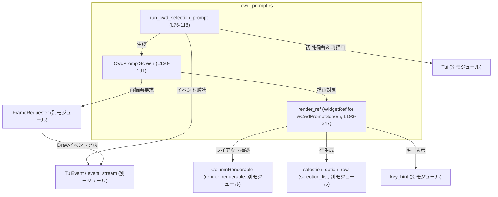
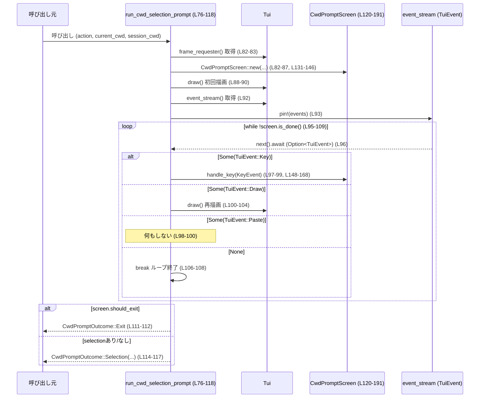

# tui/src/cwd_prompt.rs

## 0. ざっくり一言

このファイルは、TUI アプリケーション上で「このセッションの作業ディレクトリをどれにするか」をユーザに選択させるモーダルプロンプト（cwd プロンプト）の表示・イベント処理・結果返却を行うモジュールです（tui/src/cwd_prompt.rs:L26-58, L76-118, L193-247）。

---

## 1. このモジュールの役割

### 1.1 概要

- このモジュールは、**セッション再開／フォーク時に使用する作業ディレクトリ（カレントディレクトリ）をユーザに選ばせる問題**を解決するために存在し、  
  TUI 上のダイアログ表示とキーボード入力による選択処理を提供します（tui/src/cwd_prompt.rs:L26-58, L193-247）。
- ユーザは「セッションで記録されている cwd（Session）」か「現在の cwd（Current）」のどちらかを選択し、その結果が `CwdPromptOutcome` として呼び出し元に返されます（tui/src/cwd_prompt.rs:L48-58, L111-117）。

### 1.2 アーキテクチャ内での位置づけ

このモジュールは、TUI フレームワーク層（`Tui`, `FrameRequester`）とレンダリングユーティリティ（`ColumnRenderable`, `selection_option_row`, `key_hint`）を利用して、モーダル UI とそのイベントループを構成しています（tui/src/cwd_prompt.rs:L3-11, L82-88, L193-247）。



- 呼び出し元は `run_cwd_selection_prompt` を `await` し、`CwdPromptOutcome` を受け取ります（tui/src/cwd_prompt.rs:L76-81, L111-117）。
- `run_cwd_selection_prompt` 内部で `CwdPromptScreen` が状態（ハイライト位置・選択済みか・終了フラグなど）を保持します（tui/src/cwd_prompt.rs:L120-128, L130-190）。
- イベントストリーム (`tui.event_stream()`) を非同期に処理しながら、必要に応じて再描画を行う構造になっています（tui/src/cwd_prompt.rs:L92-105）。

### 1.3 設計上のポイント

- **状態を持つ UI モデル**  
  - `CwdPromptScreen` がハイライト位置・決定済み選択・終了フラグを保持します（tui/src/cwd_prompt.rs:L120-128, L184-190）。
- **非同期のイベントループ**  
  - `run_cwd_selection_prompt` は `async fn` であり、`Tui` のイベントストリームを `tokio_stream::StreamExt::next` で `await` しながら処理します（tui/src/cwd_prompt.rs:L76-81, L92-105）。
- **描画とイベントの分離**  
  - UI の描画は `WidgetRef for &CwdPromptScreen` の `render_ref` 実装に集約され、イベント処理は `handle_key` に集約されています（tui/src/cwd_prompt.rs:L148-168, L193-247）。
- **再描画要求の明示**  
  - 状態変更後は必ず `FrameRequester::schedule_frame()` を呼び出し、TUI に再描画を依頼します（tui/src/cwd_prompt.rs:L157, L174, L181）。
- **安全性**  
  - このファイルには `unsafe` ブロックは存在せず、すべて安全な Rust のみで実装されています（tui/src/cwd_prompt.rs:全体）。

---

## 2. 主要な機能一覧

- **cwd 選択プロンプト実行**: `run_cwd_selection_prompt` で TUI 上にプロンプトを表示し、ユーザ入力に応じて `CwdPromptOutcome` を返す（tui/src/cwd_prompt.rs:L76-118）。
- **アクション種別の表示文言生成**: `CwdPromptAction::verb` / `past_participle` で「resume/fork」などの表示用文字列を提供する（tui/src/cwd_prompt.rs:L26-46, L198-199）。
- **選択肢（Session/Current）の巡回**: `CwdSelection::next` / `prev` でハイライト移動（上下キー・j/k）を実装する（tui/src/cwd_prompt.rs:L48-52, L60-74, L161-162）。
- **キー入力処理**: `CwdPromptScreen::handle_key` で Enter, Esc, 数字キー, 矢印キー, j/k, Ctrl-C / Ctrl-D などを解釈して状態を更新する（tui/src/cwd_prompt.rs:L148-168）。
- **選択状態の描画**: `render_ref` 実装で説明文・2 つの選択肢・キーガイドをテキスト行として描画する（tui/src/cwd_prompt.rs:L193-247）。
- **結果の集約**: `CwdPromptOutcome` に「Selection（どちらを選んだか）」または「Exit（キャンセル）」をまとめる（tui/src/cwd_prompt.rs:L54-58, L111-117）。

---

## 3. 公開 API と詳細解説

### 3.1 型一覧（構造体・列挙体など）

| 名前 | 種別 | 役割 / 用途 | 定義位置 |
|------|------|-------------|----------|
| `CwdPromptAction` | 列挙体 | プロンプトを開いた理由（`Resume` / `Fork`）を表し、文言生成にも使われます。 | tui/src/cwd_prompt.rs:L26-30, L32-46 |
| `CwdSelection` | 列挙体 | ユーザがどの cwd を選ぶかを表す（`Current` / `Session`）。ハイライトや決定結果に使用されます。 | tui/src/cwd_prompt.rs:L48-52, L60-74 |
| `CwdPromptOutcome` | 列挙体 | プロンプトの結果を表す。`Selection(CwdSelection)` または `Exit`（キャンセルや Ctrl-C 等）になります。 | tui/src/cwd_prompt.rs:L54-58 |
| `CwdPromptScreen` | 構造体 | プロンプト画面の内部状態（cwd 文字列、ハイライト位置、選択済みか、終了フラグ、`FrameRequester`）を保持する非公開 UI モデルです。 | tui/src/cwd_prompt.rs:L120-128, L130-190, L193-247 |

※ いずれも `pub(crate)` なので、同一クレート内から利用できます（tui/src/cwd_prompt.rs:L26, L48, L54, L76）。

---

### 3.2 関数詳細

#### `run_cwd_selection_prompt(tui: &mut Tui, action: CwdPromptAction, current_cwd: &Path, session_cwd: &Path) -> Result<CwdPromptOutcome>`  

*(tui/src/cwd_prompt.rs:L76-118)*

**概要**

- TUI 上に cwd 選択プロンプトを表示し、ユーザが「Session」か「Current」を選ぶまでキーボード入力を待ち、その結果を `CwdPromptOutcome` として返します。
- 非同期関数であり、Tokio ランタイムなどの上で `await` されることを前提としています（`tokio::pin!` の使用から分かります: tui/src/cwd_prompt.rs:L93）。

**引数**

| 引数名 | 型 | 説明 |
|--------|----|------|
| `tui` | `&mut Tui` | 描画とイベントストリーム取得を行う TUI コンテキスト。可変参照なので、同時に他からは触れられません。 |
| `action` | `CwdPromptAction` | プロンプトの文言に使うアクション種別（`Resume` or `Fork`）。 |
| `current_cwd` | `&Path` | 現在の作業ディレクトリ。画面上の「Current」行に表示されます。 |
| `session_cwd` | `&Path` | セッションに記録されている作業ディレクトリ。画面上の「Session」行に表示されます。 |

**戻り値**

- `Result<CwdPromptOutcome>`  
  - `Ok(CwdPromptOutcome::Selection(sel))` : ユーザが `Session` または `Current` を選択して Enter / 数字キー / Esc で確定した場合（tui/src/cwd_prompt.rs:L111-117）。
  - `Ok(CwdPromptOutcome::Exit)` : Ctrl-C / Ctrl-D などで終了した場合（tui/src/cwd_prompt.rs:L111-112, L152-157）。
  - `Err(_)` : `tui.draw` 呼び出し中にエラーが発生した場合（`?` 演算子経由、tui/src/cwd_prompt.rs:L88-90, L101-103）。

**内部処理の流れ**

1. `CwdPromptScreen::new` で内部状態オブジェクト `screen` を生成し、`current_cwd` / `session_cwd` を文字列化して保持させます（tui/src/cwd_prompt.rs:L82-87, L131-146）。
2. `tui.draw` で初回描画を行い、モーダルを表示します（tui/src/cwd_prompt.rs:L88-90）。
3. `tui.event_stream()` で TUI イベントストリームを取得し、`tokio::pin!` でピン留めします（tui/src/cwd_prompt.rs:L92-93）。
4. `while !screen.is_done()` のループで、`events.next().await` により 1 つずつイベントを取り出します（tui/src/cwd_prompt.rs:L95-97, L184-186）。
5. 受け取った `TuiEvent` に応じて分岐します（tui/src/cwd_prompt.rs:L97-105）。
   - `Key` イベント: `screen.handle_key(key_event)` で内部状態を更新。
   - `Paste` イベント: 無視。
   - `Draw` イベント: `tui.draw` 再描画を実行。
6. イベントストリームが `None` を返した場合（イベント源終了）、ループを `break` します（tui/src/cwd_prompt.rs:L106-108）。
7. ループ終了後、`screen.should_exit` が真なら `CwdPromptOutcome::Exit` を返し、そうでなければ `screen.selection().unwrap_or(CwdSelection::Session)` を `Selection` として返します（tui/src/cwd_prompt.rs:L111-117）。

**Examples（使用例）**

```rust
use std::path::Path;
use color_eyre::Result;
use crate::tui::Tui;
use crate::cwd_prompt::{run_cwd_selection_prompt, CwdPromptAction, CwdSelection, CwdPromptOutcome};

async fn choose_cwd_for_resume(tui: &mut Tui) -> Result<()> {
    let current = Path::new("/home/user/current");    // 現在の作業ディレクトリ
    let session = Path::new("/home/user/project");    // セッションに記録されているディレクトリ

    let outcome = run_cwd_selection_prompt(
        tui,
        CwdPromptAction::Resume,
        current,
        session,
    ).await?;                                         // エラー時はここでErrが返る

    match outcome {
        CwdPromptOutcome::Selection(CwdSelection::Session) => {
            // セッションディレクトリを採用
        }
        CwdPromptOutcome::Selection(CwdSelection::Current) => {
            // 現在のディレクトリを採用
        }
        CwdPromptOutcome::Exit => {
            // ユーザがCtrl-Cなどでキャンセル
        }
    }

    Ok(())
}
```

**Errors / Panics**

- `tui.draw` が `Err` を返した場合、本関数も同じエラー型（`color_eyre::Result` のエイリアス）で `Err` を返します（`?` 演算子、tui/src/cwd_prompt.rs:L88-90, L101-103）。
- この関数内部に `panic!` 呼び出しや `unwrap` / `expect` は存在せず、エラーは `Result` で伝播されます（tui/src/cwd_prompt.rs:L76-118）。

**Edge cases（エッジケース）**

- イベントストリームがすぐに終了した場合  
  - `screen.should_exit == false` かつ `selection == None` のままループが終わるため、`Selection(Session)` が返されます（tui/src/cwd_prompt.rs:L95-108, L111-117）。つまり、入力が一切なくても「Session」がデフォルトになります。
- `CwdPromptScreen` が `should_exit = true` かつ `selection = None` の場合  
  - `Exit` が返されます。これは Ctrl-C / Ctrl-D に対応します（tui/src/cwd_prompt.rs:L152-157, L111-113）。
- `Paste` イベントは完全に無視され、UI 状態には影響しません（tui/src/cwd_prompt.rs:L98-100）。

**使用上の注意点**

- 非同期関数なので、Tokio などのランタイムの中で `await` する必要があります（`tokio::pin!` 使用からの前提, tui/src/cwd_prompt.rs:L93）。
- `tui` は `&mut Tui` で受けているため、この関数の実行中は他のタスクから同じ `Tui` インスタンスを触れない設計になっています。これにより UI 状態への同時アクセスが防がれています（tui/src/cwd_prompt.rs:L76-81）。
- 呼び出し側は `CwdPromptOutcome::Exit` を明示的に扱う必要があります。そうしないと、ユーザがキャンセルしたケースを見落とします。

---

#### `CwdPromptScreen::handle_key(&mut self, key_event: KeyEvent)`  

*(tui/src/cwd_prompt.rs:L148-168)*

**概要**

- 1 つのキーイベントを解釈し、ハイライト移動・選択確定・終了フラグ設定などの内部状態更新を行います。
- UI の再描画が必要な場合は `FrameRequester::schedule_frame` を呼び出します（tui/src/cwd_prompt.rs:L157, L174, L181）。

**引数**

| 引数名 | 型 | 説明 |
|--------|----|------|
| `key_event` | `KeyEvent` | crossterm のキーイベント。キーコードと修飾キー（Ctrl 等）、押下／リリース種別を含みます。 |

**戻り値**

- ありません。`self` のフィールドを更新することで状態を変更します（tui/src/cwd_prompt.rs:L155-157, L171-182）。

**内部処理の流れ**

1. `KeyEventKind::Release` のイベントは無視し、即 return します（tui/src/cwd_prompt.rs:L149-151）。
2. Ctrl 修飾キーが含まれており、かつ `Char('c')` または `Char('d')` の場合はキャンセル動作として扱います（tui/src/cwd_prompt.rs:L152-157）。
   - `self.selection = None`
   - `self.should_exit = true`
   - `schedule_frame()` で再描画要求
3. それ以外の場合、`key_event.code` に応じてマッチングします（tui/src/cwd_prompt.rs:L160-167）。
   - `Up` / `'k'`: `self.highlighted.prev()` を計算し、`set_highlight` でハイライト移動。
   - `Down` / `'j'`: `self.highlighted.next()` を計算し、`set_highlight`。
   - `'1'`: `select(CwdSelection::Session)` でセッションディレクトリを即選択。
   - `'2'`: `select(CwdSelection::Current)` で現在ディレクトリを即選択。
   - `Enter`: 現在の `highlighted` を選択として確定。
   - `Esc`: `CwdSelection::Session` を選択として確定。
   - その他のキーは無視。

**Examples（使用例）**

テストコードが典型的な使用例になっています（tui/src/cwd_prompt.rs:L295-307, L310-315）。

```rust
use crossterm::event::{KeyEvent, KeyCode, KeyModifiers};

let mut screen = new_prompt(); // テスト用ヘルパ（tui/src/cwd_prompt.rs:L259-266）

// Enter を押すとデフォルトの Session が選択される
screen.handle_key(KeyEvent::new(KeyCode::Enter, KeyModifiers::NONE));
assert_eq!(screen.selection(), Some(CwdSelection::Session));

// Down → Enter で Current を選択
let mut screen = new_prompt();
screen.handle_key(KeyEvent::new(KeyCode::Down, KeyModifiers::NONE));
screen.handle_key(KeyEvent::new(KeyCode::Enter, KeyModifiers::NONE));
assert_eq!(screen.selection(), Some(CwdSelection::Current));
```

**Errors / Panics**

- この関数内では `Result` 型を返さず、`panic!` や `unwrap` も使用していません（tui/src/cwd_prompt.rs:L148-168）。
- エラーの可能性はなく、「キー入力によってどのように状態が変わるか」のみに関与します。

**Edge cases（エッジケース）**

- `KeyEventKind::Release` は無視  
  → キーを押しっぱなしにしたときに「押下」と「リリース」の両方でハンドラを実行しないようになっています（tui/src/cwd_prompt.rs:L149-151）。
- Ctrl 修飾＋`j` / `k` など  
  → Ctrl 修飾のチェックは `Char('c')` / `Char('d')` に限定されているため、Ctrl+j などは通常の `Down` / `Up` として扱われます（tui/src/cwd_prompt.rs:L152-154, L160-163）。
- `Esc` は「キャンセル」ではなく「Session を選択」として扱われます（tui/src/cwd_prompt.rs:L166）。  
  そのまま `select` によって `selection` がセットされ、プロンプトは終了します（tui/src/cwd_prompt.rs:L178-186）。

**使用上の注意点**

- `handle_key` を呼び出しても、その場で描画は行われません。`set_highlight` / `select` / Ctrl-C 処理の中で `schedule_frame` が呼ばれ、外部の `Tui` イベントループで `Draw` イベントを受けたときに描画が行われる設計です（tui/src/cwd_prompt.rs:L157, L174, L181, L97-105）。
- 数字キー `'1'` / `'2'` で即選択されるため、ユーザにとってはショートカットキーとして動作します。説明文中にこれを案内する UI がない点には注意が必要です（説明文は Enter のみ案内、tui/src/cwd_prompt.rs:L237-241）。

---

#### `CwdPromptScreen::is_done(&self) -> bool`  

*(tui/src/cwd_prompt.rs:L184-186)*

**概要**

- プロンプトのイベントループを継続するかどうかを判定するための関数です。
- `should_exit` または `selection.is_some()` のどちらかが真ならば `true` を返します。

**引数**

- なし（`&self` のみ）。

**戻り値**

- `bool`  
  - `true` : ユーザの選択が確定したか、キャンセル操作が行われたため、プロンプトを終了すべき状態。
  - `false` : まだ入力待ちを継続すべき状態。

**内部処理の流れ**

- 単純に `self.should_exit || self.selection.is_some()` を返しています（tui/src/cwd_prompt.rs:L185）。

**使用例**

```rust
while !screen.is_done() {
    // イベント処理...
}
```

これは `run_cwd_selection_prompt` 内でそのまま使用されています（tui/src/cwd_prompt.rs:L95）。

**使用上の注意点**

- `selection` が `Some` になった瞬間に `is_done` は `true` を返すようになるため、「選択後にさらにキー入力を受け付ける」という挙動はありません（tui/src/cwd_prompt.rs:L178-186, L95-109）。

---

#### `impl WidgetRef for &CwdPromptScreen { fn render_ref(&self, area: Rect, buf: &mut Buffer) }`  

*(tui/src/cwd_prompt.rs:L193-247)*

**概要**

- `CwdPromptScreen` の現在の状態をもとに、説明テキスト・選択肢・キーガイドをターミナルバッファに描画します。
- `WidgetRef` トレイトの実装として提供され、`frame.render_widget_ref(&screen, area)` から呼び出されます（tui/src/cwd_prompt.rs:L88-90, L100-103, L274-275, L290-291）。

**引数**

| 引数名 | 型 | 説明 |
|--------|----|------|
| `area` | `Rect` | 描画領域を表す矩形。 |
| `buf` | `&mut Buffer` | Ratatui の描画バッファ。テキストやスタイルを書き込みます。 |

**戻り値**

- なし。`buf` に直接描画結果を書き込みます。

**内部処理の流れ**

1. `Clear.render(area, buf)` で、描画領域をクリアします（tui/src/cwd_prompt.rs:L195）。
2. `ColumnRenderable::new()` で縦方向の行集合を構築するためのヘルパを用意します（tui/src/cwd_prompt.rs:L196）。
3. `self.action.verb()` / `past_participle()` でアクションの文言（"resume"/"fork"）を取得し、ヘッダ行と説明文に埋め込みます（tui/src/cwd_prompt.rs:L198-199, L204-208, L211-213）。
4. 以下のような行を順に `column.push` していきます（tui/src/cwd_prompt.rs:L203-245）。
   - 空行
   - タイトル行: `"Choose working directory to <verb> this session"`（`verb` は太字）
   - 説明行: Session/Current の意味（インデント付き・`dim()` スタイル）
   - 空行
   - 選択肢行（2 行）:  
     `"Use session directory ({session_cwd})"` と  
     `"Use current directory ({current_cwd})"`  
     それぞれ `selection_option_row` により、ハイライト状態が反映されます。
   - キーガイド行: `"Press <Enter> to continue"`（`key_hint::plain(KeyCode::Enter)` を利用）
5. `column.render(area, buf)` で、蓄積した行を実際にバッファへ描画します（tui/src/cwd_prompt.rs:L246）。

**Examples（使用例）**

テスト用に `Terminal` と `VT100Backend` を使ったスナップショットテストが用意されています（tui/src/cwd_prompt.rs:L268-277, L279-292）。

```rust
let screen = new_prompt(); // CwdPromptScreen を作成
let mut terminal =
    Terminal::new(VT100Backend::new(80, 14)).expect("terminal");

// 1 フレーム分描画してスナップショットを取得
terminal
    .draw(|frame| frame.render_widget_ref(&screen, frame.area()))
    .expect("render cwd prompt");
insta::assert_snapshot!("cwd_prompt_modal", terminal.backend());
```

**Errors / Panics**

- この関数自身はエラーを返さず、内部で `panic!` も使用していません（tui/src/cwd_prompt.rs:L193-247）。
- ただし、描画結果の正しさは `ColumnRenderable`, `selection_option_row`, `key_hint` の実装に依存します。これらの内部挙動はこのチャンクからは分かりません。

**Edge cases（エッジケース）**

- `current_cwd` や `session_cwd` に非常に長いパスや改行文字などが含まれている場合、レイアウトの崩れや複数行表示になる可能性があります（tui/src/cwd_prompt.rs:L200-201, L227-233）。  
  パス文字列の整形・切り詰めについては、このモジュールでは行っていません。
- 選択肢のハイライトは `self.highlighted` に完全に依存しており、`selection` の内容とは独立しています（tui/src/cwd_prompt.rs:L225-234）。  
  `select` 呼び出し時に `highlighted` も選択値に更新しているため、通常は同期しています（tui/src/cwd_prompt.rs:L178-180）。

**使用上の注意点**

- `render_ref` は `&CwdPromptScreen` に対する実装であり、`screen` 自体は `Copy` ではないため、レンダリング中に状態を書き換えることはありません（tui/src/cwd_prompt.rs:L193）。
- 描画は `Clear` で領域全体を毎回クリアするため、別のウィジェットとの重ね合わせが必要な場合は、外側のレイアウトで調整する必要があります（tui/src/cwd_prompt.rs:L195）。

---

### 3.3 その他の関数（補助的なもの）

| 関数名 | 役割（1 行） | 定義位置 |
|--------|--------------|----------|
| `CwdPromptAction::verb` | `Resume`/`Fork` に応じて `"resume"` / `"fork"` を返す表示用ヘルパ。 | tui/src/cwd_prompt.rs:L33-38 |
| `CwdPromptAction::past_participle` | `"resumed"` / `"forked"` を返す表示用ヘルパ。 | tui/src/cwd_prompt.rs:L40-45 |
| `CwdSelection::next` | `Session` ↔ `Current` をトグルして次の選択肢を返す。 | tui/src/cwd_prompt.rs:L61-66 |
| `CwdSelection::prev` | `next` と同じく 2 値間をトグルする（実装は `next` と対称）。 | tui/src/cwd_prompt.rs:L68-73 |
| `CwdPromptScreen::new` | `CwdPromptScreen` の初期状態（ハイライトは `Session`）を構築するコンストラクタ。 | tui/src/cwd_prompt.rs:L131-146 |
| `CwdPromptScreen::set_highlight` | ハイライト対象を変更し、変更があれば再描画を要求する。 | tui/src/cwd_prompt.rs:L171-176 |
| `CwdPromptScreen::select` | 選択値を確定し、`selection` と `highlighted` を更新して再描画を要求する。 | tui/src/cwd_prompt.rs:L178-182 |
| `CwdPromptScreen::selection` | 内部の `selection: Option<CwdSelection>` を取得する getter。 | tui/src/cwd_prompt.rs:L188-190 |
| `tests::new_prompt` | テスト用に `CwdPromptScreen` を一貫した設定で生成するヘルパ。 | tui/src/cwd_prompt.rs:L259-266 |
| `tests::cwd_prompt_snapshot` | `Resume` アクション版プロンプトのスナップショットテスト。 | tui/src/cwd_prompt.rs:L268-277 |
| `tests::cwd_prompt_fork_snapshot` | `Fork` アクション版プロンプトのスナップショットテスト。 | tui/src/cwd_prompt.rs:L279-292 |
| `tests::cwd_prompt_selects_session_by_default` | Enter のみで `Session` が選択されることを確認するテスト。 | tui/src/cwd_prompt.rs:L295-300 |
| `tests::cwd_prompt_can_select_current` | Down → Enter で `Current` を選択できることを確認するテスト。 | tui/src/cwd_prompt.rs:L303-307 |
| `tests::cwd_prompt_ctrl_c_exits_instead_of_selecting` | Ctrl-C が Exit を引き起こすことを確認するテスト。 | tui/src/cwd_prompt.rs:L310-315 |

---

## 4. データフロー

典型的なフローとして、「呼び出し元が `run_cwd_selection_prompt` を呼び出し、ユーザ入力を経て `CwdPromptOutcome` が返るまで」の流れを示します。



- データの流れは `Screen` の内部状態（`highlighted`, `selection`, `should_exit`）を中心としており、  
  それが `render_ref` による描画と `is_done` によるループ継続判定に反映されます（tui/src/cwd_prompt.rs:L120-128, L148-190, L193-247）。
- 並行性の観点では、`Tui` と `CwdPromptScreen` はいずれも `&mut` / `&` を通じて一つの async タスク内からのみアクセスされており、共有可変状態を複数タスクから同時に操作するような構造にはなっていません（tui/src/cwd_prompt.rs:L76-81, L95-109, L148-190）。

---

## 5. 使い方（How to Use）

### 5.1 基本的な使用方法

クレート内の任意の場所から、Tui コンテキストと cwd を渡して `run_cwd_selection_prompt` を呼び出します。

```rust
use std::path::Path;
use color_eyre::Result;
use crate::tui::Tui;
use crate::cwd_prompt::{run_cwd_selection_prompt, CwdPromptAction, CwdPromptOutcome, CwdSelection};

async fn run_session(tui: &mut Tui) -> Result<()> {
    let current_cwd = Path::new("/path/to/current");  // 現在の cwd
    let session_cwd = Path::new("/path/to/session");  // セッション保存時の cwd

    let outcome = run_cwd_selection_prompt(
        tui,
        CwdPromptAction::Resume,
        current_cwd,
        session_cwd,
    ).await?;                                         // 描画失敗時などはここで Err

    match outcome {
        CwdPromptOutcome::Selection(CwdSelection::Session) => {
            // session_cwd を実際の cwd として使用
        }
        CwdPromptOutcome::Selection(CwdSelection::Current) => {
            // current_cwd を使用
        }
        CwdPromptOutcome::Exit => {
            // ユーザがキャンセルしたので、処理全体を中断する等の対応
        }
    }

    Ok(())
}
```

### 5.2 よくある使用パターン

- **セッション再開（Resume）**  
  - `CwdPromptAction::Resume` を指定して呼び出します。ヘッダ文言が `"Choose working directory to resume this session"` になります（tui/src/cwd_prompt.rs:L204-208, L198）。
- **セッションのフォーク（Fork）**  
  - `CwdPromptAction::Fork` を指定して呼び出すことで、「フォークするセッションの cwd を選ぶ」文脈のプロンプトとして利用できます（tui/src/cwd_prompt.rs:L26-30, L198-199, L281-286）。

### 5.3 よくある間違い

```rust
// 間違い例: 結果の Exit ケースを無視している
let outcome = run_cwd_selection_prompt(tui, action, current, session).await?;
if let CwdPromptOutcome::Selection(sel) = outcome {
    // キャンセル（Exit）の場合はここに来ないが、無視されてしまう
}

// より安全な例: Exit を明示的に扱う
match outcome {
    CwdPromptOutcome::Selection(sel) => {
        // Session / Current を元に処理
    }
    CwdPromptOutcome::Exit => {
        // ユーザがキャンセルしたので、処理中断や元の画面への戻りなど
    }
}
```

- `Exit` を無視すると、ユーザがキャンセルしたのか、どちらかの cwd を選んだのか区別できなくなります（tui/src/cwd_prompt.rs:L111-117）。

### 5.4 使用上の注意点（まとめ）

- **非同期実行の前提**:  
  - `run_cwd_selection_prompt` は `async fn` であり、Tokio ランタイムなどで実行する必要があります（tui/src/cwd_prompt.rs:L76, L93）。
- **スレッド安全性**:  
  - このファイル単体では `Send` / `Sync` の実装は見えませんが、`Tui` を `&mut` で受け取っているため、少なくとも呼び出し単位では 1 つのタスクからのみ UI を操作する前提になっています（tui/src/cwd_prompt.rs:L76-81）。
- **パフォーマンス**:  
  - イベントループ内では重い処理は行っておらず、キー入力と状態更新、必要なときの描画のみです（tui/src/cwd_prompt.rs:L95-105, L148-182）。  
    ただし、`tui.draw` 自体のコストは TUI 全体の規模に依存します。
- **表示パスの長さ**:  
  - 非常に長いパスや特殊文字を含むパスは、そのまま描画されるため、端末幅を超えた場合の見え方は `ColumnRenderable` などに依存します（tui/src/cwd_prompt.rs:L200-201, L227-233）。  

---

## 6. 変更の仕方（How to Modify）

### 6.1 新しい機能を追加する場合

例: 3 つ目の選択肢（例えば「カスタムディレクトリ」）を追加したい場合。

1. **選択肢の定義拡張**  
   - `CwdSelection` に新しいバリアントを追加します（tui/src/cwd_prompt.rs:L48-52）。
   - `next` / `prev` のマッチ分岐を新しい状態を含む形に拡張します（tui/src/cwd_prompt.rs:L61-74）。
2. **内部状態と描画の対応**  
   - `CwdPromptScreen` に必要な追加情報（例えばカスタムパス）があればフィールドを追加します（tui/src/cwd_prompt.rs:L120-128）。
   - `render_ref` 内で新しい行を `column.push` し、`selection_option_row` の引数とハイライト判定を追加します（tui/src/cwd_prompt.rs:L225-234）。
3. **キー入力処理**  
   - `handle_key` の `match key_event.code` に、新しい選択肢を選ぶためのキー（例えば `'3'`）を追加します（tui/src/cwd_prompt.rs:L160-167）。
4. **結果の扱い**  
   - `CwdPromptOutcome::Selection` に新バリアントはそのまま入るため、呼び出し側の `match` パターンも更新する必要があります（tui/src/cwd_prompt.rs:L54-58）。
5. **テストの追加**  
   - テストモジュールにスナップショットやキー入力テストを追加し、既存のテストがすべて通ることを確認します（tui/src/cwd_prompt.rs:L268-315）。

### 6.2 既存の機能を変更する場合

- **Enter キーのデフォルトを変えたい場合**  
  - 初期ハイライト値を決めているのは `CwdPromptScreen::new` です（tui/src/cwd_prompt.rs:L142）。  
    ここを `CwdSelection::Current` に変更すると、「何も操作せず Enter」を押したときの選択が変わります。
  - 併せて、`cwd_prompt_selects_session_by_default` テストも期待値を変更する必要があります（tui/src/cwd_prompt.rs:L295-300）。
- **Esc の意味を「キャンセル」に変えたい場合**  
  - `handle_key` の `KeyCode::Esc` 分岐を `select` ではなく `should_exit = true` 等に変更することになります（tui/src/cwd_prompt.rs:L166）。  
    その場合、`Exit` を返す条件にも影響するため、テスト追加／更新が必要です。
- **エラー契約の変更**  
  - `run_cwd_selection_prompt` は現在 `tui.draw` の失敗のみを `Err` として返しています（tui/src/cwd_prompt.rs:L88-90, L101-103）。  
    ここに新しいエラー条件を追加する場合は、返り値のドキュメントや呼び出し側のエラーハンドリングも合わせて整理する必要があります。

---

## 7. 関連ファイル

| パス | 役割 / 関係 |
|------|------------|
| `crate::tui`（`Tui`, `TuiEvent`, `FrameRequester`） | イベントストリームと描画 API、および再描画要求 (`schedule_frame`) を提供し、本モジュールのイベントループと強く結合しています（tui/src/cwd_prompt.rs:L9-11, L82-83, L148-182）。 |
| `crate::render::renderable`（`ColumnRenderable`, `Renderable`, `RenderableExt`） | 縦方向に行を積み上げるレンダリングヘルパで、プロンプト画面のレイアウト構築に使用されています（tui/src/cwd_prompt.rs:L5-7, L196, L246）。 |
| `crate::selection_list::selection_option_row` | 選択肢 1 行を生成するヘルパ関数。ハイライト状態の表示などを担当します（tui/src/cwd_prompt.rs:L8, L225-234）。 |
| `crate::key_hint` | キーガイド表示用のユーティリティ。ここでは Enter キーのヒント表示に使われています（tui/src/cwd_prompt.rs:L3, L237-240）。 |
| `crate::test_backend::VT100Backend` | スナップショットテスト用のバックエンドで、`Terminal` と組み合わせて描画結果の回帰テストに使用されています（tui/src/cwd_prompt.rs:L253, L268-292）。 |

---

## Bugs / Security / Contracts / Tests などのまとめ

- **契約（Contracts）**  
  - `run_cwd_selection_prompt` は「ユーザが明示的にキャンセルしない限り、何らかの `CwdSelection` を返す」契約になっています。入力がなくても `Session` が選ばれます（tui/src/cwd_prompt.rs:L95-108, L111-117）。
  - Ctrl-C / Ctrl-D のみが `Exit` に対応し、Esc は `Session` 選択として扱われる点が設計上の重要な前提です（tui/src/cwd_prompt.rs:L152-157, L166）。
- **エッジケース**  
  - イベントストリーム終了時の挙動、特殊なキー修飾（Ctrl+j/k 等）、長いパス表示については前述の通りです（tui/src/cwd_prompt.rs:L95-108, L152-163, L200-201, L227-233）。
- **テスト**  
  - スナップショットテスト 2 件（Resume/Fork）と、キーハンドリングのユニットテスト 3 件があり、レンダリングと基本的なキー操作（Enter / Down+Enter / Ctrl-C）がカバーされています（tui/src/cwd_prompt.rs:L268-315）。
- **潜在的なセキュリティ上の懸念**  
  - このモジュールはローカル TUI の画面構築のみを行い、外部とのネットワーク通信やファイル操作は行いません（tui/src/cwd_prompt.rs:L1-247）。  
    パス文字列がそのまま端末に表示されるため、パスに制御文字が含まれると表示が乱れる可能性がありますが、これは UI 上の問題であり、このチャンクからはより深いセキュリティ影響は読み取れません。
- **観測性（Observability）**  
  - ロギングやメトリクス出力はこのファイルには存在せず、挙動の確認は主にテストと画面描画のスナップショットに依存しています（tui/src/cwd_prompt.rs:L250-317）。

このモジュールは、TUI アプリケーション内で cwd 選択を行うための局所的な UI コンポーネントとして設計されており、非同期イベントループと安全な状態管理を組み合わせて、シンプルかつ明確な振る舞いを提供しています。
