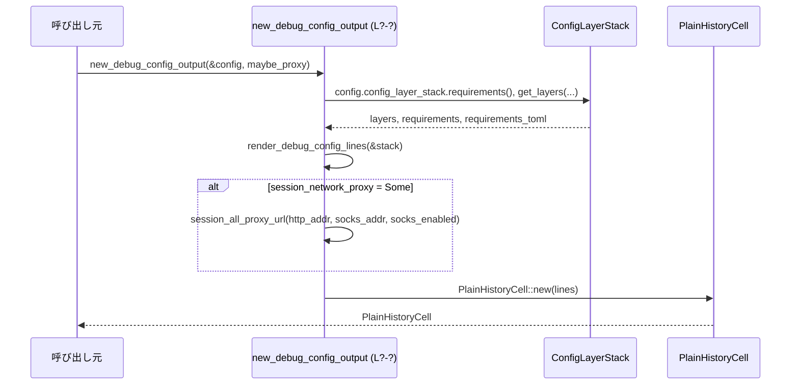

tui/src/debug_config.rs

---

## 0. ざっくり一言

このモジュールは、`ConfigLayerStack` と各種 requirement 情報を読み取り、`/debug-config` 用のデバッグ表示テキスト（`ratatui::text::Line` の一覧）および `PlainHistoryCell` を生成するユーティリティです。  
必要に応じてセッションのネットワークプロキシ情報も併せて表示します。

※ このチャンクには正確な行番号情報が含まれていないため、根拠としての行番号は `debug_config.rs:L?` のように「不明」で表記します。

---

## 1. このモジュールの役割

### 1.1 概要

- このモジュールは **現在有効/無効な設定レイヤーや requirement の状態を、人間が読めるテキストとして整形する** ために存在します。
- 主な機能は:
  - 設定レイヤースタック (`ConfigLayerStack`) の一覧表示（ソースと enabled/disabled 状態、無効理由含む）。
  - 各種 requirement（承認ポリシー、sandbox mode, web search mode, features, MCP サーバー, residency, network など）の値と、その **ソース（`RequirementSource`）** の表示。
  - セッションランタイムのネットワークプロキシ設定 (`SessionNetworkProxyRuntime`) の表示。

### 1.2 アーキテクチャ内での位置づけ

このモジュールは TUI 層 (`PlainHistoryCell` ベースの UI) と、コア設定 (`Config`, `ConfigLayerStack`, `ConfigRequirements*`) の間の **プレゼンテーション層** に位置します。

依存関係（このファイルから見える範囲）は次の通りです。

```mermaid
graph TD
    subgraph "tui/src/debug_config.rs (L?-?)"
        A[new_debug_config_output]
        B[render_debug_config_lines]
        C[render_non_file_layer_details]
        D[render_session_flag_details]
        E[render_mdm_layer_details]
        F[format_network_constraints]
    end

    caller[呼び出し元(不明)] --> A
    A -->|&Config| CoreConfig[legacy_core::config::Config]
    A -->|&SessionNetworkProxyRuntime| SessRT[codex_protocol::SessionNetworkProxyRuntime]
    A --> PlainCell[history_cell::PlainHistoryCell]

    A --> B
    B --> Stack[ConfigLayerStack]
    B -->|uses| Req[ConfigRequirements / ConfigRequirementsToml]

    B --> C
    C -->|SessionFlags| D
    C -->|MDM系| E

    B --> F
    F --> NetConstraints[NetworkConstraints]
```

- 呼び出し元（どこから `new_debug_config_output` が呼ばれるか）はこのチャンクには現れません。
- ファイルは **外部状態を変更せず、引数から受け取ったデータを整形して返すだけ** です。

### 1.3 設計上のポイント

コードから読み取れる特徴を整理します（いずれも `debug_config.rs:L?` からの読み取りです）。

- **純粋な整形ロジック**
  - すべての関数は引数からテキストを生成するだけで、副作用（I/O やグローバル状態の変更）はありません。
- **TUI に最適化された出力**
  - `ratatui::text::Line` と `.bold()`, `.magenta()`, `.dim()` などのスタイル API で、色や強調を含んだ TUI 表示を構築します。
- **構造化された設定の展開**
  - `flatten_toml_key_values` により、ネストした TOML 構造を `foo.bar.baz = value` のような "フラット" なキーに展開して表示します。
- **ソース情報の明示**
  - `requirement_line` で `(... source: {RequirementSource})` を一貫して付与し、「どこ由来の設定か」を常に見えるようにしています。
- **安定した順序**
  - `ConfigLayerStack::get_layers` の順序（引数で指定）に従い、かつ TOML テーブルや `BTreeMap` をソート/順序付きで列挙するので、出力は基本的に **安定した順序** になります。
- **安全性・並行性**
  - `unsafe` は使用されておらず、共有可変状態もないため、スレッドから同時に呼び出してもデータ競合は生じません（外部依存を含まない計算のみ）。

---

## 2. 主要な機能一覧

このモジュール内の主な機能を一覧にします。

- `new_debug_config_output`: `Config` と任意の `SessionNetworkProxyRuntime` から、デバッグ用の `PlainHistoryCell` を生成する。
- `render_debug_config_lines`: `ConfigLayerStack` から `/debug-config` 用の行 (`Vec<Line<'static>>`) を構築する。
- `render_non_file_layer_details`: セッションフラグ・MDM など、ファイル以外の設定レイヤーの詳細表示を生成する。
- `render_session_flag_details`: セッションフラグの TOML をフラットな `key = value` の一覧に変換する。
- `render_mdm_layer_details`: MDM 由来レイヤーの TOML 値を整形して表示する。
- `flatten_toml_key_values`: 任意の `toml::Value` から `("a.b.c", "value")` 形式のキー・値ペアを再帰的に抽出する。
- `normalize_allowed_web_search_modes`: `allowed_web_search_modes` の値リストを正規化し、`Disabled` を必ず含む形にする。
- `format_network_constraints`: `NetworkConstraints` を1行の文字列に整形する。
- 各種 `format_*` 関数: sandbox mode, residency, network permissions 等を文字列に変換するユーティリティ。
- `join_or_empty`: 文字列リストをカンマ区切りに結合し、空なら `"<empty>"` を返す。

---

## 3. 公開 API と詳細解説

### 3.1 型一覧（構造体・列挙体など）

このファイル自体は新しい型を定義していませんが、主要な外部型依存を整理します。

| 名前 | 種別 | 役割 / 用途 | 根拠 |
|------|------|-------------|------|
| `PlainHistoryCell` | 構造体（他モジュール定義） | `Vec<Line<'static>>` を受け取り、履歴表示用のセルを表す。`PlainHistoryCell::new(lines)` を呼び出している。 | `debug_config.rs:L?` |
| `Config` | 構造体（他モジュール定義） | アプリケーション全体の設定。ここでは `config_layer_stack` と `permissions.network` を利用している。 | `debug_config.rs:L?` |
| `ConfigLayerStack` | 構造体 | 設定レイヤー（system/user/project/session flags/MDM 等）のスタックと requirement を保持し、`get_layers`, `requirements`, `requirements_toml` を提供する。 | `debug_config.rs:L?` |
| `ConfigLayerEntry` | 構造体 | 個々の設定レイヤーのエントリ。`name`, `is_disabled()`, `disabled_reason`, `config`, `raw_toml()` などを持つ。 | `debug_config.rs:L?` |
| `ConfigRequirements` / `ConfigRequirementsToml` | 構造体 | requirement の現在値と TOML 由来の許可リストを保持。 | `debug_config.rs:L?` |
| `NetworkConstraints` | 構造体 | network 関連の制約（ポート、ドメイン許可、UNIX ソケット許可など）を表現。 | `debug_config.rs:L?` |
| `SessionNetworkProxyRuntime` | 構造体 | セッションランタイムの HTTP/SOCKS プロキシアドレスを保持。`{ http_addr, socks_addr }` を分解して使用。 | `debug_config.rs:L?` |

### 3.2 関数詳細（重要なもの 7 件）

#### `new_debug_config_output(config: &Config, session_network_proxy: Option<&SessionNetworkProxyRuntime>) -> PlainHistoryCell`

**概要**

- `/debug-config` 画面（またはコマンド）向けの出力として、設定レイヤーと requirement、セッションプロキシ情報をまとめた `PlainHistoryCell` を生成します。

**引数**

| 引数名 | 型 | 説明 |
|--------|----|------|
| `config` | `&Config` | 現在のアプリケーション設定。`config_layer_stack` と `permissions.network` を参照します。 |
| `session_network_proxy` | `Option<&SessionNetworkProxyRuntime>` | セッションランタイムのネットワークプロキシ情報。存在する場合のみ「Session runtime」セクションを追加します。 |

**戻り値**

- `PlainHistoryCell`: 構築した `Vec<Line<'static>>` を内包する履歴セル。

**内部処理の流れ**

1. `render_debug_config_lines(&config.config_layer_stack)` を呼び出し、設定レイヤーと requirement に関する行ベクタを生成する。
2. `session_network_proxy` が `Some(proxy)` のとき:
   - 空行と `"Session runtime:"` の見出しを追加。
   - `SessionNetworkProxyRuntime { http_addr, socks_addr }` を分解。
   - `config.permissions.network.as_ref().is_some_and(NetworkProxySpec::socks_enabled)` で、SOCKS プロキシが有効かを判定。
   - `session_all_proxy_url(http_addr, socks_addr, socks_enabled)` で ALL_PROXY 用 URL を生成。
   - `HTTP_PROXY` と `ALL_PROXY` の行を追加。
3. 最後に `PlainHistoryCell::new(lines)` で `PlainHistoryCell` を生成して返す。

**Examples（使用例）**

```rust
use crate::tui::debug_config::new_debug_config_output;
use crate::legacy_core::config::Config;
use codex_protocol::protocol::SessionNetworkProxyRuntime;

// Config と SessionNetworkProxyRuntime がどこかで構築されていると仮定
fn show_debug_config(config: &Config, maybe_proxy: Option<&SessionNetworkProxyRuntime>) {
    // /debug-config 表示用のセルを作成する
    let cell = new_debug_config_output(config, maybe_proxy);

    // ここで cell を履歴ビューに追加したり画面に描画したりする（実装は別モジュール）
    // history.add(cell);
}
```

**Errors / Panics**

- 明示的な `Result` や `panic!` は使用されていません。
- 内部でのベクタ確保や `format!` 以外、例外的なエラー条件は見当たりません。

**Edge cases（エッジケース）**

- `session_network_proxy == None` の場合:
  - 「Session runtime」セクションは追加されず、設定レイヤーと requirement のみが表示されます。
- `config.permissions.network` が `None` の場合:
  - `is_some_and(...)` により `socks_enabled` は `false` になり、`ALL_PROXY` は HTTP プロキシ URL になります。

**使用上の注意点**

- `Config` 内で `config_layer_stack` が適切に初期化されている前提です。
- セッションプロキシ情報はオプションなので、呼び出し側で `Some(&proxy)` を渡すかどうかを明示的に制御できます。

---

#### `render_debug_config_lines(stack: &ConfigLayerStack) -> Vec<Line<'static>>`

**概要**

- `ConfigLayerStack` に含まれる設定レイヤーと requirement をテキスト行として整形し、`Vec<Line<'static>>` を返します。  
- `/debug-config` の **本文テキスト** を生成するコア関数です。

**引数**

| 引数名 | 型 | 説明 |
|--------|----|------|
| `stack` | `&ConfigLayerStack` | 設定レイヤースタックと requirement 情報を持つオブジェクト。 |

**戻り値**

- `Vec<Line<'static>>`: `ratatui` の `Line` オブジェクトのベクタ。先頭に `"/debug-config"` の見出し行を含みます。

**内部処理の流れ**

1. `"/debug-config"`（マゼンタ）と空行を追加。
2. `"Config layer stack (lowest precedence first):"` の見出しを太字で追加。
3. `stack.get_layers(ConfigLayerStackOrdering::LowestPrecedenceFirst, true)` で、無効レイヤーを含む全レイヤーを取得。
   - レイヤーが空なら `"  <none>"`（dim スタイル）を出力。
   - 各レイヤーについて:
     1. `format_config_layer_source(&layer.name)` でソースを文字列化。
     2. `layer.is_disabled()` により `"enabled"` / `"disabled"` を決定。
     3. `"  {index}. {source} ({status})"` を追加。
     4. `render_non_file_layer_details(layer)` を呼び出し、必要に応じて追加情報を行として挿入。
     5. `layer.disabled_reason` があれば `"     reason: ..."`（dim）を追加。
4. `let requirements = stack.requirements();` と `let requirements_toml = stack.requirements_toml();` を取得。
5. `"Requirements:"` 見出しを太字で追加。
6. `requirements_toml` の各フィールドを順に確認し、存在するものに応じて `requirement_lines` を構築：
   - `allowed_approval_policies`
   - `allowed_approvals_reviewers`
   - `allowed_sandbox_modes`（`format_sandbox_mode_requirement` で整形）
   - `allowed_web_search_modes`（`normalize_allowed_web_search_modes` で正規化した後、文字列化）
   - `feature_requirements`
   - `mcp_servers`
   - `rules`（存在する場合 `"rules: configured"` として `requirements.exec_policy_source()` をソースに使用）
   - `enforce_residency`（`format_residency_requirement` で整形）
   - `network`（`requirements.network` から `format_network_constraints` で整形）
   - 各行は `requirement_line(name, value, source)` で作成。
7. `requirement_lines` が空であれば `"  <none>"` を追加し、そうでなければそれらを `lines` に追加。
8. 最終的な `lines` を返す。

**Examples（使用例）**

テストで使われている `render_to_text` ヘルパーを簡略化した例:

```rust
use crate::tui::debug_config::render_debug_config_lines;
use crate::legacy_core::config_loader::ConfigLayerStack;
use ratatui::text::Line;

// stack はどこかで構築済みとする
fn dump_debug_config(stack: &ConfigLayerStack) -> String {
    let lines: Vec<Line<'static>> = render_debug_config_lines(stack);

    // テキスト化（スタイルは無視して content だけ連結）
    lines
        .iter()
        .map(|line| line.spans.iter().map(|s| s.content.as_ref()).collect::<String>())
        .collect::<Vec<_>>()
        .join("\n")
}
```

**Errors / Panics**

- `Result` を返さず、`unwrap` や `expect` も使用していません（テストコード内は別）。
- 前提条件を満たしていれば、通常の利用で panic する経路は見当たりません。

**Edge cases（エッジケース）**

- レイヤーが 1 つもない場合:
  - `"Config layer stack..."` の直後に `"  <none>"` が出力されます（テスト `debug_config_output_lists_all_layers_including_disabled` がこれを検証）。
- `requirements_toml` に何も設定されていない場合:
  - `"Requirements:"` の直後に `"  <none>"` が出力されます（同テストより）。
- `rules` が `Some` の場合:
  - 詳細なルール内容ではなく、`"rules: configured"` とだけ出力されます（TODO コメントあり）。

**使用上の注意点**

- requirement を追加 or 表示項目を増やしたい場合は、この関数の `requirements_toml` 周辺を拡張する必要があります。
- テスト (`debug_config_output_lists_requirement_sources` など) がこの出力の具体的な文言に依存しているため、文言変更はテスト修正を伴います。

---

#### `render_non_file_layer_details(layer: &ConfigLayerEntry) -> Vec<Line<'static>>`

**概要**

- `ConfigLayerEntry` のうち、ファイル以外のソース（セッションフラグ・MDM）について、追加の詳細情報を行として生成します。

**引数**

| 引数名 | 型 | 説明 |
|--------|----|------|
| `layer` | `&ConfigLayerEntry` | 対象の設定レイヤー。`layer.name` からソース種別を判定します。 |

**戻り値**

- `Vec<Line<'static>>`: 詳細表示用の行リスト。該当しない場合は空ベクタ。

**内部処理の流れ**

1. `match &layer.name` で分岐:
   - `ConfigLayerSource::SessionFlags`:
     - `render_session_flag_details(&layer.config)` を呼び出し、その結果を返す。
   - `ConfigLayerSource::Mdm { .. }` または `LegacyManagedConfigTomlFromMdm`:
     - `render_mdm_layer_details(layer)` を呼び出す。
   - `System`, `User`, `Project`, `LegacyManagedConfigTomlFromFile`:
     - 追加情報は持たないため、空の `Vec::new()` を返す。

**使用上の注意点**

- ロジック追加（例: 新しい `ConfigLayerSource` variant の詳細表示）が必要になった場合は、この `match` にブランチを追加するのが自然な変更ポイントです。

---

#### `render_session_flag_details(config: &TomlValue) -> Vec<Line<'static>>`

**概要**

- セッションフラグの設定（TOML 値）をフラットな `key = value` 行の一覧に変換します。

**引数**

| 引数名 | 型 | 説明 |
|--------|----|------|
| `config` | `&TomlValue` | セッションフラグ全体の TOML 値。テーブルであることが多いですが、そうでなくても動作します。 |

**戻り値**

- `Vec<Line<'static>>`: `"     - key = value"` 形式の行を返します。何もなければ `"     - <none>"`（dim）を 1 行だけ返します。

**内部処理の流れ**

1. 空の `pairs: Vec<(String, String)>` を用意。
2. `flatten_toml_key_values(config, None, &mut pairs)` を呼び、キー・値ペアを収集。
3. `pairs` が空なら `"     - <none>"` 行を返す。
4. そうでなければ `pairs.into_iter().map(|(key, value)| format!("     - {key} = {value}").into())` で行を生成して返す。

**Edge cases**

- `config` が空テーブル（`{}`）の場合:
  - `"     - <none>"` が出力されます。
- ネストしたテーブルや配列を含む場合:
  - `flatten_toml_key_values` によって `a.b.c = value` 形式のキーが生成されます。
  - テスト `debug_config_output_lists_session_flag_key_value_pairs` で、配列 `[ "/tmp" ]` を含む例が確認されています（`sandbox_workspace_write.writable_roots` に対して配列の文字列表現が含まれる）。

**使用上の注意点**

- キーのソート: `flatten_toml_key_values` 内でテーブルキーをソートしているため、出力順はキー名の辞書順になります。

---

#### `normalize_allowed_web_search_modes(modes: &[WebSearchModeRequirement]) -> Vec<WebSearchModeRequirement>`

**概要**

- `allowed_web_search_modes` のリストを正規化し、空リストの場合は `Disabled` のみのリストに変換し、非空でも `Disabled` が含まれていなければ追加します。

**引数**

| 引数名 | 型 | 説明 |
|--------|----|------|
| `modes` | `&[WebSearchModeRequirement]` | TOML から読み込まれた `allowed_web_search_modes` の生のリスト。 |

**戻り値**

- `Vec<WebSearchModeRequirement>`: 正規化したモード一覧。

**内部処理の流れ**

1. `modes.is_empty()` なら `vec![WebSearchModeRequirement::Disabled]` を返す。
2. そうでなければ `modes.to_vec()` でコピーを作成。
3. コピーに `Disabled` が含まれていなければ `push(Disabled)` する。
4. 結果ベクタを返す。

**Edge cases**

- 空入力 (`[]`) の場合:
  - `vec![Disabled]` が返され、テキストとしては `"allowed_web_search_modes: disabled (...)"`
  - テスト `debug_config_output_normalizes_empty_web_search_mode_list` がこれを検証。
- `Disabled` が既に含まれている場合:
  - 重複追加はせず、そのまま返します。

**使用上の注意点**

- 出力側 (`render_debug_config_lines`) では `ToString::to_string` でモードを文字列化しているため、`WebSearchModeRequirement` の `Display` 実装に依存した表記になります。

---

#### `format_network_constraints(network: &NetworkConstraints) -> String`

**概要**

- `NetworkConstraints` 構造体のオプションフィールドを読み取り、`key=value` をカンマ区切りで並べた 1 行の文字列に整形します。

**引数**

| 引数名 | 型 | 説明 |
|--------|----|------|
| `network` | `&NetworkConstraints` | `enabled`, `http_port`, `socks_port`, `domains`, `unix_sockets` 等の制約を持つ構造体。 |

**戻り値**

- `String`: 例 `"enabled=true, domains={example.com=allow}, danger_full_access_denylist_only=true"` など。

**内部処理の流れ**

1. パターンマッチで `NetworkConstraints` を一括してローカル変数に束縛。
2. 各フィールドが `Some` のときのみ `parts.push(format!(...))` する。
   - `enabled`, `http_port`, `socks_port`, `allow_upstream_proxy`, `dangerously_allow_non_loopback_proxy`, `dangerously_allow_all_unix_sockets`, `managed_allowed_domains_only`, `danger_full_access_denylist_only`, `allow_local_binding` は、`key=value` の形式。
   - `domains` / `unix_sockets` は `format_network_permission_entries` に委譲し、`{host=allow, ...}` や `{path=none, ...}` の形式。
3. 最後に `join_or_empty(parts)` で連結。`parts` が空なら `"<empty>"` を返す。

**Edge cases**

- すべてのフィールドが `None` の場合:
  - `parts` は空になり `"<empty>"` が返ります。
- `domains` や `unix_sockets` のエントリは `BTreeMap` によるキー順に列挙されます。
  - テスト `debug_config_output_formats_unix_socket_permissions` により、`/tmp/blocked.sock` → `/tmp/codex.sock` の順（辞書順）で出力されていることが確認されます。

**使用上の注意点**

- この関数の出力は `debug_config_output_lists_requirement_sources` テストにより具体的な文言が検証されているため、フォーマット変更は慎重に行う必要があります。

---

#### `flatten_toml_key_values(value: &TomlValue, prefix: Option<&str>, out: &mut Vec<(String, String)>)`

**概要**

- ネストした `TomlValue`（テーブル・配列など）から、`"a.b.c"` のようなフラットなキーとその値の文字列表現を抽出するヘルパーです。

**引数**

| 引数名 | 型 | 説明 |
|--------|----|------|
| `value` | `&TomlValue` | 処理対象の TOML 値。テーブルの場合は再帰的に展開。 |
| `prefix` | `Option<&str>` | 親キーのプレフィックス。最初は `None`。 |
| `out` | `&mut Vec<(String, String)>` | 結果を格納するベクタ（キー・値ペア）。 |

**戻り値**

- なし（`out` に書き込み）。

**内部処理の流れ**

1. `match value`:
   - `TomlValue::Table(table)` の場合:
     1. `table.iter().collect::<Vec<_>>()` で `(key, child)` のベクタを作成。
     2. `entries.sort_by_key(|(key, _)| key.as_str())` でキー名でソート（安定した順序のため）。
     3. 各 `(key, child)` について:
        - `next_prefix` を `"{prefix}.{key}"` もしくは `key.to_string()` として作成。
        - `flatten_toml_key_values(child, Some(&next_prefix), out)` を再帰呼び出し。
   - それ以外 (`String`, `Integer`, `Array`, など):
     1. `let key = prefix.unwrap_or("<value>").to_string();`
     2. `out.push((key, format_toml_value(value)));`
2. `format_toml_value` は `value.to_string()` で TOML らしい文字列表現を返します。

**Edge cases**

- ルートがテーブルでない場合（例: 文字列や配列のみ）:
  - キー名として `<value>` が使われます。
- 配列や boolean なども `to_string()` による表現となるため、`writable_roots = ["/tmp"]` のような出力が得られます（テストから確認可能）。

---

#### `format_network_permission_entries<T: Copy>(entries: &BTreeMap<String, T>, format_value: impl Fn(T) -> &'static str) -> String`

**概要**

- `BTreeMap<String, T>` に格納されたパーミッション情報を `{key=value, ...}` の 1 行文字列に整形します。

**引数**

| 引数名 | 型 | 説明 |
|--------|----|------|
| `entries` | `&BTreeMap<String, T>` | ドメイン名や UNIX ソケットパスをキーとしたマップ。 |
| `format_value` | `impl Fn(T) -> &'static str` | 値を `"allow"` や `"deny"` などの文字列表現に変換する関数。 |

**戻り値**

- `String`: 例 `"{example.com=allow, foo.com=deny}"` のような形式。

**内部処理の流れ**

1. `entries.iter()` を `map` し、`"{key}={format_value(*value)}"` という文字列の `Vec<String>` を作る。
2. `format!("{{{}}}", parts.join(", "))` で `{...}` 形式にラップして返す。

**Edge cases**

- `entries` が空マップの場合:
  - `"{}"` を返します（これは `format_network_constraints` 側の `if let Some(domains)` ブロック内で使用されるため、`domains={}` のような形になります）。

---

### 3.3 その他の関数一覧

詳細説明を省略した補助関数の一覧です。

| 関数名 | 役割（1 行） | 根拠 |
|--------|--------------|------|
| `session_all_proxy_url(http_addr, socks_addr, socks_enabled)` | `socks_enabled` に応じて `socks5h://...` または `http://...` の URL を返す。 | `debug_config.rs:L?` |
| `render_mdm_layer_details(layer)` | MDM/legacy MDM レイヤーの TOML 値を `MDM value: ...` 形式で整形する。 | `debug_config.rs:L?` |
| `format_toml_value(value)` | `TomlValue::to_string()` を呼ぶ単純なラッパー。 | `debug_config.rs:L?` |
| `requirement_line(name, value, source)` | `"  - {name}: {value} (source: {source})"` 形式の `Line` を作る。 | `debug_config.rs:L?` |
| `join_or_empty(values)` | 文字列リストを `", "` で結合し、空なら `"<empty>"` を返す。 | `debug_config.rs:L?` |
| `format_config_layer_source(source)` | `ConfigLayerSource` を `system (/path)`, `user (/path)` 等の人間可読な文字列に変換。 | `debug_config.rs:L?` |
| `format_sandbox_mode_requirement(mode)` | `SandboxModeRequirement` を `"read-only"`, `"workspace-write"` 等に変換。 | `debug_config.rs:L?` |
| `format_residency_requirement(requirement)` | `ResidencyRequirement::Us` を `"us"` に変換。 | `debug_config.rs:L?` |
| `format_network_domain_permission(permission)` | Domain permission を `"allow"` / `"deny"` に変換。 | `debug_config.rs:L?` |
| `format_network_unix_socket_permission(permission)` | UNIX ソケット permission を `"allow"` / `"none"` に変換。 | `debug_config.rs:L?` |

---

## 4. データフロー

### 4.1 代表的な処理シナリオ

**シナリオ**: 「呼び出し元が `/debug-config` を表示するために `PlainHistoryCell` を取得する」

1. 呼び出し元が `Config` と（あれば）`SessionNetworkProxyRuntime` を保持している。
2. `new_debug_config_output(&config, maybe_proxy)` を呼ぶ。
3. `new_debug_config_output` が `render_debug_config_lines(&config.config_layer_stack)` を呼び、設定レイヤーと requirement に関する行を取得。
4. `new_debug_config_output` が `SessionNetworkProxyRuntime` をもとにプロキシ情報の行を追加。
5. `PlainHistoryCell::new(lines)` が呼ばれ、履歴セルが返る。
6. 呼び出し元が `PlainHistoryCell` を TUI に描画する。

これをシーケンス図で表すと次のようになります。



- このモジュール内では I/O やネットワーク呼び出しは行っていません。
- すべてのデータは引数として渡された `ConfigLayerStack` や requirement から取得しています。

---

## 5. 使い方（How to Use）

### 5.1 基本的な使用方法

`new_debug_config_output` を用いて、デバッグ設定出力用のセルを作る想定的なコード例です。

```rust
use crate::tui::debug_config::new_debug_config_output;
use crate::legacy_core::config::Config;
use codex_protocol::protocol::SessionNetworkProxyRuntime;

// どこかで Config と SessionNetworkProxyRuntime が用意されていると仮定
fn show_debug_config_view(config: &Config, session_proxy: Option<&SessionNetworkProxyRuntime>) {
    // /debug-config の内容を生成する
    let debug_cell = new_debug_config_output(config, session_proxy);

    // 生成したセルを TUI の履歴ビューに登録するなど（実装は別）
    // app_state.history.push(debug_cell);
}
```

- `session_proxy` を `None` にすると、Session runtime セクションのない出力になります。
- `Config` 内の `config_layer_stack` と requirements がすでに構築済みである必要があります（このファイルでは構築処理は行っていません）。

### 5.2 よくある使用パターン

1. **プロキシなしでのデバッグ**
   - オフラインやプロキシ未設定の環境で、設定レイヤーと requirement だけ確認したい場合:

   ```rust
   let cell = new_debug_config_output(&config, None);
   ```

2. **セッションプロキシを含めたデバッグ**
   - セッション毎に異なるプロキシ設定を確認したい場合:

   ```rust
   let proxy = SessionNetworkProxyRuntime {
       http_addr: "127.0.0.1:3128".to_string(),
       socks_addr: "127.0.0.1:8081".to_string(),
   };
   let cell = new_debug_config_output(&config, Some(&proxy));
   ```

3. **テキストとしての検査（テストと同様）**
   - 出力内容を文字列として確認したい場合、テスト内の `render_to_text` のようなヘルパーを用いる:

   ```rust
   use ratatui::text::Line;

   fn lines_to_plain_text(lines: &[Line<'static>]) -> String {
       lines
           .iter()
           .map(|line| {
               line.spans
                   .iter()
                   .map(|s| s.content.as_ref())
                   .collect::<String>()
           })
           .collect::<Vec<_>>()
           .join("\n")
   }
   ```

### 5.3 よくある間違い（想定される誤用）

コードから推測される「ハマりやすい」点を挙げます。

```rust
// 誤りの例: ConfigLayerStack が未初期化の Config を渡す
let config = Config::default(); // 仮に config_layer_stack が空だとする
let cell = new_debug_config_output(&config, None);
// => "Config layer stack ...\n  <none>" と表示され、
//    実際に読み込まれているはずの設定が表示されないように見える。
```

- **正しい例**: `Config`/`ConfigLayerStack` を実際の設定から構築してから渡す。

```rust
// 正しい例（概念的なコード）
let stack = ConfigLayerStack::new(...)?; // 実際の設定レイヤーを構築
let config = Config {
    config_layer_stack: stack,
    // ...
};
let cell = new_debug_config_output(&config, None);
```

また、`render_session_flag_details` を単独で利用する場合は、TOML がテーブルではないケースでキーが `<value>` になることに注意が必要です。

### 5.4 使用上の注意点（まとめ）

- このモジュールは **表示専用** であり、設定の変更や検証ロジックは含みません。
- 出力のフォーマットはテストで厳密に検証されているため、文言の変更はテストの更新が前提になります。
- セキュリティ上、デバッグ出力には config/MDM 情報がそのまま含まれるため、**どのユーザーにこの画面を見せるか** はアプリケーション側で制御される必要があります（このファイルはアクセス制御を行いません）。

---

## 6. 変更の仕方（How to Modify）

### 6.1 新しい機能を追加する場合

例: 新しい requirement フィールド `foo_requirement` を `/debug-config` に表示したい場合。

1. **Config サイドの確認**
   - `ConfigRequirements` / `ConfigRequirementsToml` に `foo_requirement` が追加されていることを確認する（このファイル外）。
2. **render_debug_config_lines の拡張**
   - `render_debug_config_lines` 内の requirement セクションで、他の項目と同様に `if let Some(...)` ブロックを追加する。
   - 値の整形が複雑な場合は専用の `format_foo_requirement(...) -> String` を本ファイル内に追加。
3. **テストの追加**
   - `#[cfg(test)]` セクションに新しいテストを追加し、期待される文字列が出力されることを確認する。
   - 既存テストとの整合性（順序や文言）も確認する。

### 6.2 既存の機能を変更する場合

- **影響範囲の確認**
  - 変更したい関数 (`render_debug_config_lines`, `format_network_constraints` など) がどのテストで使われているかを確認する（同ファイルのテスト群）。
- **注意すべき契約（前提・返り値の意味）**
  - 表示フォーマットは外部ツールやスクリプトがパースしている可能性もあるため、形式の互換性（例えば `key=value` の形）は可能な限り維持した方が安全です。
  - `normalize_allowed_web_search_modes` のような補助関数は、テストにより返り値の重要な性質（`Disabled` を必ず含む）が保証されているので、変更時もその性質を保つ必要があります。
- **テストの更新**
  - 文字列に対する `contains` で検証しているテストが多いため、文言変更や順序変更に応じてテストも更新する必要があります。

---

## 7. 関連ファイル

このモジュールと密接に関係するファイル・ディレクトリ（インポートから分かる範囲）をまとめます。

| パス | 役割 / 関係 |
|------|------------|
| `tui/src/history_cell.rs` | `PlainHistoryCell` を定義していると推測されます。`PlainHistoryCell::new(lines)` を通じて本モジュールの出力を TUI に載せるコンテナとして利用。 |
| `legacy_core/config.rs` | `Config` や `NetworkProxySpec` 等、アプリケーション設定のコア定義を提供。`new_debug_config_output` が `config.config_layer_stack` および `permissions.network` を参照。 |
| `legacy_core/config_loader.rs` もしくは関連モジュール群 | `ConfigLayerStack`, `ConfigLayerEntry`, `ConfigRequirements`, `ConfigRequirementsToml`, `NetworkConstraints`, 各種 `Requirement*` 型を定義。本モジュールの入力データの大部分を提供。 |
| `codex_app_server_protocol::ConfigLayerSource` | 設定レイヤーのソース種別（system/user/project/MDM/SessionFlags/legacy managed_config.toml）を表す列挙体。`format_config_layer_source` で利用。 |
| `codex_protocol::protocol` | `SessionNetworkProxyRuntime`, `AskForApproval`, `SandboxPolicy` など、プロトコル関連の型を提供。テストや整形ロジックで利用。 |
| `codex_protocol::config_types` | `ApprovalsReviewer`, `WebSearchMode` などの設定関連型。テストに現れます。 |
| `codex_utils_absolute_path::AbsolutePathBuf` | テストで絶対パス (`/etc/codex/config.toml` など) を安全に扱うためのユーティリティ。 |

---

## Bugs / Security / Contracts / Edge Cases / Tests / Performance（まとめ）

最後に、要求されている観点を簡潔に総括します。

- **Bugs（バグ）**
  - このチャンクから明確なバグは読み取れません。  
    すべての `Option` / `Vec` は存在チェックを行った上で処理されており、panic につながる明確なパスは見当たりません。
- **Security（セキュリティ）**
  - 出力内容には MDM による管理設定やネットワーク許可ドメインなど、センシティブになり得る情報が含まれます。  
    アクセスコントロールは別モジュール側の責務であり、このファイルは制御しません。
- **Contracts / Edge Cases**
  - `normalize_allowed_web_search_modes` が空リストを `Disabled` 1 件に正規化する契約は、テストで保証されています。
  - `format_network_constraints` は `BTreeMap` とソートにより、出力順が決定的である契約になっています。
  - `render_debug_config_lines` が layer / requirements が空の場合に `<none>` を出力する挙動もテストで固定されています。
- **Tests**
  - `#[cfg(test)] mod tests` で 8 つ以上のテストが定義されており、主に:
    - レイヤーの enabled/disabled 表示
    - requirement とその source の表示
    - web search modes 正規化
    - network constraints / UNIX ソケット permission の表示
    - セッションフラグ / MDM レイヤー詳細表示
    - `session_all_proxy_url` の分岐
    をカバーしています。
- **Performance / Scalability**
  - すべての処理は文字列操作と小〜中規模のベクタ/マップ走査のみであり、設定ファイルサイズに比例した O(n) 時間で動作します。
  - `BTreeMap` とソートにより、非常に大量のエントリがある場合はややコストがかさみますが、一般的な設定サイズでは問題になりにくい構造です。
