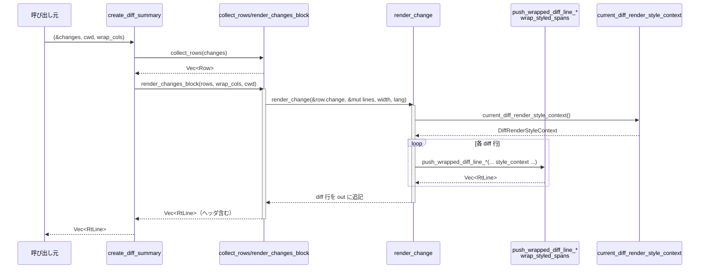

# tui/src/diff_render.rs コード解説

## 0. ざっくり一言

- 統一フォーマットの diff（`FileChange`）を、**行番号・+/- 記号付きのカラー差分ビュー**として ratatui 上に描画するモジュールです。
- 端末テーマ（明/暗）とカラーレベル（TrueColor / 256 / 16色）に応じて、**行背景・桁番号のガター・シンタックスハイライト**を組み合わせた表示を行います。

> ※ 行番号はソース上で正確に取得できないため、このレポートでは関数名・ブロック名を根拠として示します。

---

## 1. このモジュールの役割

### 1.1 概要

- このモジュールは **`codex_protocol::FileChange`（Add/Delete/Update）を TUI に表示可能な diff 表現へ変換する**役割を持ちます。
- 具体的には以下を行います：
  - `HashMap<PathBuf, FileChange>` → `Vec<RtLine<'static>>` への整形（`create_diff_summary`）
  - `FileChange` の `Renderable` 実装による ratatui 上への直接描画
  - 端末の背景色・カラーレベルから **挿入/削除行の背景色・ガター色を決定**するスタイルコンテキストの構築
  - 長い行の **折返し（wrap）**と、折返し後も崩れないガター・記号の整列

### 1.2 アーキテクチャ内での位置づけ

全体の依存関係（主要コンポーネントの関係）は次のようになります。

```mermaid
graph TD
  subgraph Protocol
    FC[FileChange]
  end

  subgraph TUI_diff (tui/src/diff_render.rs)
    DS[DiffSummary]
    RChange[render_change]
    Cds[create_diff_summary]
    Wrap[push_wrapped_diff_line_* / wrap_styled_spans]
    StyleCtx[DiffRenderStyleContext<br/>current_diff_render_style_context]
    StyleHelpers[style_* / resolve_diff_backgrounds_*]
  end

  subgraph Render_framework
    RendTrait[trait Renderable]
    Col[ColumnRenderable]
    Inset[InsetRenderable]
  end

  subgraph SyntaxHighlight
    HL[highlight_code_to_styled_spans<br/>exceeds_highlight_limits]
  end

  subgraph TermEnv
    TPal[terminal_palette<br/>(default_bg, stdout_color_level, XTERM_COLORS...)]
    TDetect[terminal_info (TerminalName)]
  end

  FC -->|input| DS
  FC -->|Renderable impl| RChange
  DS -->|From<DiffSummary>| Col
  Col --> Inset
  DS --> Cds
  Cds --> RChange
  RChange --> Wrap
  RChange --> HL
  Wrap --> StyleHelpers
  StyleCtx --> Wrap
  StyleHelpers --> StyleCtx
  StyleCtx --> TPal
  StyleCtx --> TDetect
```

※ この図は本ファイル内の関数・型のみを対象にした概略です。

### 1.3 設計上のポイント

- **責務分割**
  - 「どの行をどう並べるか」（diff ロジック）と「どう色を付けるか」（スタイルロジック）、「どう折り返すか」（wrapロジック）が明確に分かれています。
  - diff 内容を `Vec<RtLine>` に整形する部分 (`render_change`, `render_changes_block`) と、1行分をスタイル付きで構築する低レベル API (`push_wrapped_diff_line_*`, `wrap_styled_spans`) が分離されています。
- **状態管理**
  - 描画ごとの共有状態は **`DiffRenderStyleContext`** にまとめ、1フレーム内で再利用します（端末テーマとカラーレベルを一度だけ解決する）。
  - グローバルな可変状態は持たず、環境変数・端末情報を読み出すだけの**副作用限定**な設計です。
- **エラーハンドリング**
  - diff パーサー `diffy::Patch::from_str` が失敗した場合は **カウント 0/0 や表示スキップ**とし、panic しません。
  - 端末情報や Git root 取得の失敗も、`Option`/`Result` を利用して安全にフォールバックします。
- **パフォーマンス配慮**
  - 大きな diff では `exceeds_highlight_limits` を用いて **シンタックスハイライトをスキップ**し、レンダリング遅延を避けています。
  - Windows Terminal 固有の挙動を考慮したカラーレベル昇格（ANSI-16 → TrueColor）で、**過度な保守性による画質低下を回避**しています。
- **テスト性**
  - スタイル決定ロジック（`diff_theme_for_bg`, `diff_color_level_for_terminal`, `resolve_diff_backgrounds_for` 等）は **純粋関数化**しており、テストモジュールから直接検証されています。
  - `wrap_styled_spans` など、アルゴリズム的にやや複雑な箇所には詳細なユニットテストとスナップショットテストが用意されています。

---

## 2. 主要な機能一覧

- diff サマリー生成: `create_diff_summary`
  - `HashMap<PathBuf, FileChange>` から、ファイルヘッダ付きの diff テキスト行群（`Vec<RtLine<'static>>`）を作る。
- diff ウィジェット化: `DiffSummary` + `From<DiffSummary> for Box<dyn Renderable>`
  - 複数ファイルの diff を一つの `Renderable` としてレイアウト可能にする。
- 個別 `FileChange` の描画: `impl Renderable for FileChange`
  - 1 ファイル分の diff を、そのまま TUI に描画できる。
- 行番号付き diff 行レンダリング:
  - `render_change`
  - `push_wrapped_diff_line_with_style_context`
  - `push_wrapped_diff_line_with_syntax_and_style_context`
- スタイルコンテキスト決定:
  - `DiffRenderStyleContext` / `current_diff_render_style_context`
  - `diff_theme_for_bg`, `diff_color_level_for_terminal`, `resolve_diff_backgrounds_for`
- テキスト折返し処理:
  - `wrap_styled_spans`
  - 幅制限に応じて `RtSpan` を分割し、スタイルを維持したまま複数行へ分配。
- パス整形:
  - `display_path_for`
  - CWD や Git リポジトリ root、ホームディレクトリへ相対化して、**安定した・短いパス表示**を行う。
- diff 行数集計:
  - `calculate_add_remove_from_diff`
  - Unified diff から追加/削除行数を数える。

---

## 3. 公開 API と詳細解説

### 3.1 型一覧（構造体・列挙体など）

| 名前 | 種別 | 公開範囲 | 役割 / 用途 |
|------|------|----------|-------------|
| `DiffLineType` | enum | `pub(crate)` | diff 行の種別（挿入 / 削除 / コンテキスト）を表現し、色付け・ガター記号選択に使う。 |
| `DiffTheme` | enum | private | 端末の背景に応じたテーマ種別（Dark / Light）。背景色から自動判定。 |
| `DiffColorLevel` | enum | private | diff 用のカラーレベル（TrueColor / 256 / 16）。端末能力と Windows Terminal の特殊処理から決定。 |
| `RichDiffColorLevel` | enum | private | 背景色が扱えるカラーレベル（TrueColor / 256）だけを表現。16 色の場合は `None` として扱うための補助型。 |
| `ResolvedDiffBackgrounds` | struct | private | 挿入・削除行の背景色を保持する小さなコンテキスト。テーマスコープ背景やフォールバックパレットから構築。 |
| `DiffRenderStyleContext` | struct | `pub(crate)` | diff レンダリングに必要なテーマ・カラーレベル・背景情報を1つにまとめたスタイルコンテキスト。線形レンダリング中に再利用される。 |
| `DiffSummary` | struct | `pub` | ファイルパス → `FileChange` のマップと CWD を保持し、複数ファイル diff のサマリー表示を行うエントリポイント。 |
| `Row` | struct | private | 1 ファイル分の中間表現（パス・移動先パス・追加/削除行数・`FileChange`）を保持する内部用構造体。 |

### 3.2 関数詳細（代表 7 件）

#### `create_diff_summary(changes: &HashMap<PathBuf, FileChange>, cwd: &Path, wrap_cols: usize) -> Vec<RtLine<'static>>`

**概要**

- 複数ファイルの変更セット `changes` を、**ヘッダ付きのテキスト diff ブロック**に変換します（`render_changes_block` を内部で使用）。

**引数**

| 引数名 | 型 | 説明 |
|--------|----|------|
| `changes` | `&HashMap<PathBuf, FileChange>` | パスをキーとするファイル変更マップ。Add/Delete/Update すべてを含む。 |
| `cwd` | `&Path` | 表示上の基準ディレクトリ。`display_path_for` で相対化するために使用。 |
| `wrap_cols` | `usize` | diff 本文を手動で折り返す最大カラム数。ガター幅等を考慮して行内のテキスト幅が決まる。 |

**戻り値**

- `Vec<RtLine<'static>>`  
  各要素が 1 行に相当する ratatui 用テキスト行（行頭の「• Edited 〜」ヘッダから、各ファイルの diff ブロックまで）。

**内部処理の流れ**

1. `collect_rows(changes)` で `Row` のベクタに変換し、パスでソートした配列を得る。
2. `render_changes_block(rows, wrap_cols, cwd)` を呼び出し、ヘッダ行やファイルごとのヘッダ + 本文 diff を `Vec<RtLine>` に描画する。
3. 生成した `Vec<RtLine>` をそのまま返す。

**Examples（使用例）**

```rust
use std::collections::HashMap;
use std::path::PathBuf;
use codex_protocol::protocol::FileChange;
use ratatui::widgets::Paragraph;
use ratatui::text::Text;

// diff セットの用意
let mut changes = HashMap::new();
changes.insert(
    PathBuf::from("src/lib.rs"),
    FileChange::Add {
        content: "pub fn greet() {}\n".to_string(),
    },
);

let cwd = std::env::current_dir().unwrap();
let lines = create_diff_summary(&changes, &cwd.as_path(), /*wrap_cols*/ 80);

// ratatui の Paragraph に変換して表示
let paragraph = Paragraph::new(Text::from(lines));
```

**Errors / Panics**

- `create_diff_summary` 自体は `Result` を返さず、内部で panic を発生させるコードはありません。
- 渡された `changes` の中の diff テキストが壊れている場合でも、`render_change` 内で `diffy::Patch::from_str` の失敗を検出し、**表示を簡略化 (0 行扱い) するだけで panic しません。**

**Edge cases（エッジケース）**

- `changes` が空の場合  
  - ヘッダ行をどうするかについての分岐はコード上にないため、空の `Vec<RtLine>` になるか（コードからは推測できません）、または別のレイヤーで呼ばれない前提かもしれません。この点は呼び出し元仕様に依存します。
- 単一ファイルのみの場合  
  - ヘッダ行にファイル名と行数サマリが含まれ、ファイル別ヘッダ行（`"  └ "` で始まる）はスキップされます。
- 複数ファイルの場合  
  - 先頭に「Edited N files (+X -Y)」ヘッダ、その後にファイル別ヘッダ + 本文が並びます。

**使用上の注意点**

- `wrap_cols` は **ガターを含む全幅**です。コンテンツ部分は内部で `prefix_cols` を引いた残りになるため、「本文を何列で折り返したいか」より少し大きめの値を渡す必要があります。
- diff テキストが非常に大きい場合（数万行）は、内部でハイライトを制限する処理が働きますが、行数自体はそのまま出力されるため、呼び出し側で高さ制限を考慮する必要があります。

---

#### `render_change(change: &FileChange, out: &mut Vec<RtLine<'static>>, width: usize, lang: Option<&str>)`

**概要**

- 1 つの `FileChange` を diff 表現にレンダリングし、`out` へ `RtLine` を追記します。
- Add / Delete / Update の各ケースを実装しており、更新（Update）の場合は **unified diff 形式**を解釈します。

**引数**

| 引数名 | 型 | 説明 |
|--------|----|------|
| `change` | `&FileChange` | 対象のファイル変更。Add / Delete / Update を持つ enum。 |
| `out` | `&mut Vec<RtLine<'static>>` | 出力先。既存の内容の末尾に diff 行が追加される。 |
| `width` | `usize` | diff 行全体の最大列数。行番号ガター + 記号 + 本文を含む。 |
| `lang` | `Option<&str>` | シンタックスハイライトに使う言語識別子（拡張子など）。`None` ならハイライトなし。 |

**内部処理の流れ（要約）**

1. `current_diff_render_style_context()` を呼び、端末テーマ・カラーレベル・背景色を含むスタイルコンテキストを取得。
2. `match change` で分岐：
   - `FileChange::Add { content }` / `Delete { content }`:
     - `highlight_code_to_styled_spans(content, lang)` によりファイル全体を 1 ブロックとしてハイライト。
     - 行数から `line_number_width` を計算。
     - 各行ごとに `push_wrapped_diff_line_inner_with_theme_and_color_level` を呼び、挿入/削除として描画。
   - `FileChange::Update { unified_diff, .. }`:
     - `diffy::Patch::from_str(unified_diff)` で unified diff をパース（失敗したら何もしない）。
     - 全 hunk を一度走査して:
       - 最大行番号 (`max_line_number`)
       - diff テキスト総バイト数 (`total_diff_bytes`)
       - diff 行数 (`total_diff_lines`)
       を算出し、ハイライト制限（`exceeds_highlight_limits`）に使う。
     - 制限を超える場合は `diff_lang = None` としてハイライトを無効化。
     - 各 hunk ごとに:
       - 必要なら hunk 全体を 1 ブロックとして `highlight_code_to_styled_spans` に通し、**hunk 内でパーサ状態を共有**する。
       - `old_ln`, `new_ln` を hunk のレンジ開始から進めつつ、挿入/削除/コンテキスト行に応じて行番号と `DiffLineType` を決定し、`push_wrapped_diff_line_inner_with_theme_and_color_level` を呼ぶ。
       - hunk 間には行番号ガター＋「⋮」を表示するスペーサ行を挿入。

**Examples（使用例）**

通常は直接呼び出すのではなく、`create_diff_summary` や `Renderable` 実装経由で使われますが、単体利用の例は以下のようになります。

```rust
use codex_protocol::protocol::FileChange;
use ratatui::text::Line as RtLine;

// 単一ファイルの更新 diff
let original = "line1\nline2\n";
let modified = "line1\nline2 changed\n";
let patch = diffy::create_patch(original, modified).to_string();

let change = FileChange::Update {
    unified_diff: patch,
    move_path: None,
};

let mut lines = Vec::<RtLine<'static>>::new();
render_change(&change, &mut lines, /*width*/ 80, /*lang*/ Some("rust"));
// lines を Paragraph などで描画
```

**Errors / Panics**

- diff パース失敗時は `if let Ok(patch)` の分岐で回避し、表示されないだけになります（エラーは上位に伝搬しません）。
- シンタックスハイライト関数 `highlight_code_to_styled_spans` が `None` を返した場合も、ハイライトなしのプレーン表示にフォールバックします。
- `panic!`・`unwrap` を使ったコードは本関数内にはありません。

**Edge cases（エッジケース）**

- `Update` で `unified_diff` が空文字や不正フォーマットの場合：
  - `Patch::from_str` が `Err` となり、そのファイルの diff は出力されません（行数サマリは別途 `calculate_add_remove_from_diff` に依存）。
- 幅が非常に狭い場合 (`width` がガター + 記号 + 1 に満たないなど)：
  - `push_wrapped_diff_line_inner_with_theme_and_color_level` 内で `saturating_sub(...).max(1)` を使って、少なくとも 1 カラムを確保し、無限ループを防いでいます。
- 極端に大きな diff の場合：
  - `exceeds_highlight_limits` により `diff_lang = None` となり、**シンタックスハイライトは行われませんが、diff 自体は出力**されます。

**使用上の注意点**

- `lang` はシンタックステーマ側の言語識別子（たとえば `"rs"` ではなく `"rust"`）と一致している必要があります。ここでは `detect_lang_for_path` から渡される拡張子文字列を前提としています。
- `out` には追記される設計のため、**再利用するベクタを毎回 `clear` するか、新しく作る**必要があります。

---

#### `push_wrapped_diff_line_with_style_context(...) -> Vec<RtLine<'static>>`

```rust
pub(crate) fn push_wrapped_diff_line_with_style_context(
    line_number: usize,
    kind: DiffLineType,
    text: &str,
    width: usize,
    line_number_width: usize,
    style_context: DiffRenderStyleContext,
) -> Vec<RtLine<'static>>
```

**概要**

- **シンタックスハイライトなし**の一行 diff（挿入/削除/コンテキスト）を、行番号ガター・記号付きで指定幅に収まるように折り返し、`RtLine` のリストとして返します。
- 内部では `push_wrapped_diff_line_inner_with_theme_and_color_level` を呼ぶだけの薄いラッパーです。

**引数**

| 引数名 | 型 | 説明 |
|--------|----|------|
| `line_number` | `usize` | 表示する行番号。ガターに右寄せで表示される。 |
| `kind` | `DiffLineType` | 行の種類（Insert / Delete / Context）。記号と色付けに使用。 |
| `text` | `&str` | 行の本文テキスト（1行分）。 |
| `width` | `usize` | 行全体の最大列数。 |
| `line_number_width` | `usize` | 最大行番号から算出されたガター幅。`line_number_width(max_line_number)` を使う想定。 |
| `style_context` | `DiffRenderStyleContext` | 端末テーマ・カラーレベル・背景色を含むスタイルコンテキスト。 |

**戻り値**

- 折り返した行を表す `Vec<RtLine<'static>>`。  
  1 要素目が最初の行で、それ以降は折り返された継続行です。

**内部処理の流れ**

1. `push_wrapped_diff_line_inner_with_theme_and_color_level` に引数を渡し、`syntax_spans` を `None` として呼び出す。
2. 戻り値 `Vec<RtLine>` をそのまま返す。

**Examples（使用例）**

シンプルなテーマプレビューなどで、単独行を描画したいときに使えます。

```rust
let style_ctx = current_diff_render_style_context();
let max_ln = 10;
let lines = push_wrapped_diff_line_with_style_context(
    /*line_number*/ 3,
    DiffLineType::Insert,
    "a very long inserted line ...",
    /*width*/ 80,
    line_number_width(max_ln),
    style_ctx,
);
// lines を Paragraph で描画
```

**Errors / Panics**

- 本関数自体はエラーを返さず、内部で panic も行いません。
- 幅計算は `saturating_sub` / `max(1)` で処理されているため、極端な数値でも安全に扱われます。

**Edge cases**

- `text` が空文字列でも、ガターと記号だけの行が生成されます。
- `width` が非常に小さい場合、ほぼ記号だけの非常に短い行になりますが、ループが止まらないといった問題はありません。

**使用上の注意点**

- `line_number_width` は、**diff ブロック全体の最大行番号**から計算した値を渡す前提です。行ごとに変化させるとガターがズレます。

---

#### `push_wrapped_diff_line_with_syntax_and_style_context(...) -> Vec<RtLine<'static>>`

```rust
pub(crate) fn push_wrapped_diff_line_with_syntax_and_style_context(
    line_number: usize,
    kind: DiffLineType,
    text: &str,
    width: usize,
    line_number_width: usize,
    syntax_spans: &[RtSpan<'static>],
    style_context: DiffRenderStyleContext,
) -> Vec<RtLine<'static>>
```

**概要**

- `push_wrapped_diff_line_with_style_context` のシンタックスハイライト付き版です。
- `highlight_code_to_styled_spans` などから得た `syntax_spans` を diff 用のスタイルと合成し、折り返し処理を行います。

**引数**

| 引数名 | 型 | 説明 |
|--------|----|------|
| `syntax_spans` | `&[RtSpan<'static>]` | 1行分のシンタックスハイライト済みスパン列。`text` の内容と一致している必要がある。 |

他の引数は前関数と同様です。

**戻り値**

- 折り返されたシンタックス付き diff 行 (`Vec<RtLine<'static>>`)。

**内部処理のポイント**

- `syntax_spans` の各 `RtSpan` からテキストとスタイルを取得し、削除行 (`DiffLineType::Delete`) の場合は `Modifier::DIM` を追加して、「削除行であること」がシンタックス色より強く認識されるようにしています。
- その後、`wrap_styled_spans` で幅制限にしたがって分割し、ガター・記号を付与します。

**Examples**

テストコードに近い例：

```rust
let code = "fn example(x: i32) -> i32 { x + 1 }";
let syntax_lines = highlight_code_to_styled_spans(code, "rust").unwrap();
let spans_for_first_line = &syntax_lines[0];

let style_ctx = current_diff_render_style_context();
let lines = push_wrapped_diff_line_with_syntax_and_style_context(
    1,
    DiffLineType::Insert,
    code,
    80,
    line_number_width(1),
    spans_for_first_line,
    style_ctx,
);
```

**Edge cases**

- `syntax_spans` のテキスト内容と `text` が一致していない場合（例えば `text` をトリミングしたのに `syntax_spans` は元のまま）でも、実行時エラーにはなりませんが、色付きテキストと raw テキストの整合性が崩れます。
- 削除行で DIM 修飾が加わるため、**元のシンタックススタイルが DIM を前提としていない**場合、色がややくすんで見えることがあります。

**使用上の注意点**

- `syntax_spans` は、**同じ行テキスト（改行なし）を前提**としたスパン列である必要があります。複数行に渡るスパンを渡すと、wrap やガター位置が期待とずれる可能性があります。

---

#### `wrap_styled_spans(spans: &[RtSpan<'static>], max_cols: usize) -> Vec<Vec<RtSpan<'static>>>`

**概要**

- シンタックスハイライトされた `RtSpan` の列を、**表示幅 `max_cols` を超えないように複数行に分割**する低レベル関数です。
- Unicode の表示幅（`UnicodeWidthChar`）とタブ幅（`TAB_WIDTH`）を考慮して、各行のテキストを切り出します。

**引数**

| 引数名 | 型 | 説明 |
|--------|----|------|
| `spans` | `&[RtSpan<'static>]` | 同じ行上に連続して表示するスタイル付きスパン列。 |
| `max_cols` | `usize` | 1 行あたりの最大表示幅（列数）。 |

**戻り値**

- `Vec<Vec<RtSpan<'static>>>`  
  - 外側の `Vec` の要素 = 出力行
  - 内側の `Vec<RtSpan>` の要素 = その行に詰め込まれたスパン列  
  各スパンのスタイルは分割時に**コピーされ、保持されます**。

**内部処理の流れ（アルゴリズム）**

1. `spans` を順に処理し、各 `span.content` を `chars()` で走査。
2. 各文字について `UnicodeWidthChar::width()` を使い、表示幅を取得。
   - 幅を加えた結果が `max_cols` を超える場合、そこで一旦区切ります。
3. `byte_end == 0`（残りの先頭文字だけでオーバーフローする）場合は：
   - すでにバッファにある `current_line` を結果に追加し、新しい行を開始。
   - この文字を最低 1 文字分として強制的に行に追加（進捗が止まらないようにする）。
4. ちょうど `max_cols` に達した場合も、**次の span/文字は新しい行から始める**ように現在行を結果へ flush します。
5. 最後に `current_line` が空でない、または結果が空の場合、`current_line` を結果に追加して終了。

**Examples**

```rust
let style = Style::default().fg(Color::Green);
let spans = vec![
    RtSpan::styled("abcd", style),
    RtSpan::styled("efgh", style),
];
let lines = wrap_styled_spans(&spans, /*max_cols*/ 5);
// 例: ["abcd", "e"] + ["fgh"] のように分割される（正確な分割は文字幅に依存）
```

**Errors / Panics**

- 入力が空でも panic は発生せず、`vec![vec![]]` のように「空行 1 つ」が返ります（テストでカバー）。

**Edge cases**

- **タブ (`'\t'`) と CJK 文字**:
  - コメント上はタブを `TAB_WIDTH` 列として扱う意図が記載されています。
  - 実装では `ch.width().unwrap_or(if ch == '\t' { TAB_WIDTH } else { 0 })` となっており、`UnicodeWidthChar::width('\t')` の戻り値仕様によっては、タブが 0 幅と解釈され続ける可能性があります。この点は `unicode-width` クレートの挙動に依存します。
  - テスト (`wrap_styled_spans_tabs_have_visible_width` など) はタブを可視幅として扱う前提で書かれています。
- 最大幅が極端に小さい場合 (`max_cols = 1` など)：
  - 各文字ごとに行が分割されることがありますが、無限ループにはなりません。

**使用上の注意点**

- 入力 `spans` は **単一行を想定**しています。複数行をまとめて渡すと、改行位置を無視した分割が行われます。
- diff 用ガターや記号を含めず、「本文だけの幅制限」を行うための関数です。ガター分は呼び出し側で `max_cols` を調整します。

---

#### `display_path_for(path: &Path, cwd: &Path) -> String`

**概要**

- 絶対パス・相対パス・Git リポジトリ内/外のパスを、**表示用にできるだけ短く・安定的な形式**に変換します。

**引数**

| 引数名 | 型 | 説明 |
|--------|----|------|
| `path` | `&Path` | 対象ファイルのパス（絶対 or 相対）。 |
| `cwd` | `&Path` | 現在の作業ディレクトリ。 |

**戻り値**

- `String` : 表示用のパス文字列。

**内部処理の流れ**

1. `path` が相対パスなら、そのまま `display().to_string()` して返す。
2. `path.strip_prefix(cwd)` に成功すれば、`cwd` からの相対パスとして表示。
3. Git リポジトリ root を `get_git_repo_root(cwd)` と `get_git_repo_root(path)` で取得。
   - 同一リポジトリ内なら `pathdiff::diff_paths(path, cwd)` で相対パス表示を試みる。
   - 失敗したら `path` をそのまま使う。
4. リポジトリが別の場合は `relativize_to_home(path)` を試み、`~` を先頭につけてホームディレクトリ相対パスとする。失敗時は元の `path` を使用。

**Examples**

```rust
let cwd = PathBuf::from("/workspace/project");
let file = PathBuf::from("/workspace/project/src/main.rs");
let displayed = display_path_for(&file, &cwd);
// -> "src/main.rs"
```

**Errors / Panics**

- `strip_prefix`, `diff_paths`, `relativize_to_home` の失敗はすべて `Result` / `Option` 経由で処理され、panic にはなりません。

**Edge cases**

- `cwd` が `path` の祖先でない場合：
  - Git root 判定とホーム相対化で処理されます。
- Git ワークスペースでない場合：
  - `get_git_repo_root` が `None` を返し、`cwd` ベース or ホーム経由の相対化だけが使われます（テスト `display_path_prefers_cwd_without_git_repo` 参照）。
- Windows / Unix 両対応：
  - テストでは `cfg!(windows)` を使って両 OS でのパス挙動をチェックしています。

**使用上の注意点**

- この関数は**表示専用**であり、戻り値の文字列を再び `Path` として扱うと元の絶対パスに戻せない場合があります（特に `~` を含む場合）。

---

#### `calculate_add_remove_from_diff(diff: &str) -> (usize, usize)`

**概要**

- unified diff 文字列から、追加行 (`+`) と削除行 (`-`) の数をカウントします。

**引数**

| 引数名 | 型 | 説明 |
|--------|----|------|
| `diff` | `&str` | unified diff 形式の文字列。`diffy::Patch::from_str` が理解できるフォーマットであることが前提。 |

**戻り値**

- `(usize, usize)` : `(added_lines, deleted_lines)` のタプル。

**内部処理の流れ**

1. `diffy::Patch::from_str(diff)` を試行。
2. 成功した場合:
   - すべての hunk に対して `Hunk::lines()` をフラットに走査。
   - 各 `diffy::Line` を `match` し、`Insert` なら `a + 1`、`Delete` なら `d + 1`、`Context` はカウントしない、という形で `(a, d)` を畳み込む。
3. 失敗した場合:
   - `(0, 0)` を返す（不正 diff とみなして数えない）。

**Examples**

```rust
let original = "a\nb\n";
let modified = "a\nb changed\n";
let patch = diffy::create_patch(original, modified).to_string();

let (added, removed) = calculate_add_remove_from_diff(&patch);
// added == 1, removed == 1
```

**Errors / Panics**

- diff パース失敗時にも panic は発生しません。

**Edge cases**

- パッチが空文字列 or diff でない文字列の場合:
  - `(0, 0)` が返るため、呼び出し側は「カウントできなかった」ケースを他の情報と組み合わせて解釈する必要があります。

**使用上の注意点**

- 数え方は **diffy の `Line::Insert/Delete` の粒度に依存**します。1 行の中で細かく編集しても、1 行単位での追加/削除として数えられます。

---

#### `DiffRenderStyleContext` と `current_diff_render_style_context()`

```rust
#[derive(Clone, Copy, Debug)]
pub(crate) struct DiffRenderStyleContext {
    theme: DiffTheme,
    color_level: DiffColorLevel,
    diff_backgrounds: ResolvedDiffBackgrounds,
}

pub(crate) fn current_diff_render_style_context() -> DiffRenderStyleContext
```

**概要**

- diff レンダリングに必要なスタイル情報（背景テーマ、カラーレベル、挿入/削除行の背景色）をまとめた構造体と、**「現在の端末環境からこれを構築する」**関数です。

**内部処理の流れ（`current_diff_render_style_context`）**

1. `diff_theme()` を呼び出し、端末背景色 (`default_bg()`) から `DiffTheme` を決定。
2. `diff_color_level()` を呼び出し、`stdout_color_level()`, `terminal_info().name`, 環境変数 `WT_SESSION`, `FORCE_COLOR` から `DiffColorLevel` を決定。
3. `resolve_diff_backgrounds(theme, color_level)` で挿入/削除行の背景色を決定。
4. これらを `DiffRenderStyleContext` に詰めて返す。

**Rust 特有の安全性**

- 環境変数読み取り (`std::env::var_os`) は `Option` を返し、失敗しても panic しないようにしています。
- 端末名 (`TerminalName`) やカラーレベル (`StdoutColorLevel`) を純粋関数 `diff_color_level_for_terminal` に渡すことで、**環境依存のロジックをテスト可能な形で分離**しています。

**使用上の注意点**

- コメントにもある通り、**1 フレームに 1 回程度呼び出して結果を使い回す**ことを前提にしています。行ごとに呼び出しても致命的な問題はありませんが、不要な環境問い合わせが増えます。

---

### 3.3 その他の関数（主なグループ一覧）

| 関数名 | 役割（1 行） |
|--------|--------------|
| `collect_rows` | `HashMap<PathBuf, FileChange>` を `Row` ベクタに変換し、パスでソートする内部ヘルパ。 |
| `render_line_count_summary` | `(+N -M)` のような行数サマリのスパン列を生成。 |
| `render_changes_block` | `Row` の列をヘッダ行 + ファイル別 diff ブロックに組み立てる。 |
| `detect_lang_for_path` | `Path` の拡張子から言語識別子文字列を推定する。 |
| `line_number_width` | diff 中の最大行番号からガター幅（桁数）を決定する。 |
| `diff_theme_for_bg` | 背景色 RGB から `DiffTheme`（Light / Dark）を判断する純粋関数。 |
| `diff_theme` | `default_bg()` から背景色を取得し、`diff_theme_for_bg` 経由でテーマを決定。 |
| `diff_color_level` | 実行環境のカラーレベルを `DiffColorLevel` に変換。 |
| `has_force_color_override` | 環境変数 `FORCE_COLOR` の有無をチェック。 |
| `diff_color_level_for_terminal` | `StdoutColorLevel` と端末名/WT_SESSION/FORCE_COLOR から diff 用カラーレベルを決定する純粋関数。 |
| `style_line_bg_for` | 行種別＋背景色コンテキストから、行全体に適用する背景スタイルを作成。 |
| `style_gutter_for` | テーマ＋カラーレベル＋行種別から、ガター（行番号部）のスタイルを決定。 |
| `style_sign_add` / `style_sign_del` | `+` / `-` 記号のスタイル。Light/Dark で挙動が異なる。 |
| `style_add` / `style_del` | 挿入/削除行本文のスタイル（背景色 + 前景色の組み合わせ）を決定。 |
| `add_line_bg` / `del_line_bg` | テーマ&カラーレベル別のハードコードされた背景色パレット。 |
| `light_gutter_fg` / `light_add_num_bg` / `light_del_num_bg` | Light テーマのガター前景色・背景色の決定に使用。 |
| `style_gutter_dim` | Dark テーマなどで使う、DIM 修飾だけを付与したガタースタイル。 |

テストモジュール (`#[cfg(test)] mod tests`) 内のヘルパー・テスト関数は、主に以下を検証しています。

- ANSI-16 / 256 / TrueColor 各モードでの背景色・ガター色の決定。
- diff 行の折り返しレイアウト（行番号の揃い方、タブや CJK を含むケース）。
- 大きな diff でシンタックスハイライトが正しく無効化されること。
- rename 時に「新しいパスの拡張子」でシンタックスハイライトされること。
- hunk 内での multi-line string におけるシンタックスハイライトの状態維持。

---

## 4. データフロー

### 4.1 `create_diff_summary` → `render_change` → 行レンダリング

複数ファイルの diff を TUI へ表示する際の典型的なデータフローは次の通りです。



このフローの要点：

- `create_diff_summary` は **diff 内容の解釈と描画位置の管理**を `render_changes_block` に委譲します。
- `render_change` が **`FileChange` の内容を差分行へ展開**し、各行は `push_wrapped_diff_line_*` によってスタイル付きの `RtLine` へ変換されます。
- 端末のテーマ・カラーレベルは `current_diff_render_style_context` で 1 回だけ取得され、hunk 内の全行で共有されます。

---

## 5. 使い方（How to Use）

### 5.1 基本的な使用方法（ウィジェットとしての diff 表示）

`DiffSummary` を使って、複数ファイルの diff を TUI ウィジェットとして扱う例です。

```rust
use std::collections::HashMap;
use std::path::PathBuf;
use codex_protocol::protocol::FileChange;
use tui::render::renderable::Renderable; // 実際のパス名は crate 構成に依存
use tui::diff_render::DiffSummary;       // 本モジュール

// 1. FileChange マップを構築
let mut changes = HashMap::new();
changes.insert(
    PathBuf::from("src/lib.rs"),
    FileChange::Add {
        content: "pub fn greet() {}\n".to_string(),
    },
);

// 2. DiffSummary を作成
let cwd = std::env::current_dir().unwrap();
let summary = DiffSummary::new(changes, cwd);

// 3. Renderable としてラップ（From 実装）
let widget: Box<dyn Renderable> = summary.into();

// 4. ratatui フレーム内で描画
fn draw_frame(area: ratatui::layout::Rect, buf: &mut ratatui::buffer::Buffer, widget: &dyn Renderable) {
    widget.render(area, buf);
}
```

`DiffSummary` → `Box<dyn Renderable>` の `From` 実装により、既存のレイアウトコンポーネント (`ColumnRenderable` や `InsetRenderable`) に簡単に組み込めます。

### 5.2 テキストブロックとして利用 (`create_diff_summary`)

`render` ではなく `Paragraph` などで自前描画したい場合は、`create_diff_summary` を使います。

```rust
use ratatui::widgets::Paragraph;
use ratatui::widgets::Wrap;
use ratatui::text::Text;

let lines = create_diff_summary(&changes, &cwd, /*wrap_cols*/ 80);

let paragraph = Paragraph::new(Text::from(lines))
    .wrap(Wrap { trim: false });
// 以降、通常の ratatui ウィジェットとして扱える
```

### 5.3 低レベル API の使用（テーマプレビューなど）

テーマピッカーのプレビューなど、「任意の 1 行を diff 風に表示したい」場合は `push_wrapped_diff_line_with_style_context` が便利です。

```rust
let style_ctx = current_diff_render_style_context();
let max_ln = 1; // このブロック内の最大行番号
let lines = push_wrapped_diff_line_with_style_context(
    1,
    DiffLineType::Insert,
    "preview of inserted line",
    /*width*/ 60,
    line_number_width(max_ln),
    style_ctx,
);
// lines を Paragraph などで描画してプレビュー
```

### 5.4 よくある間違いと正しい使い方

```rust
// ❌ よくある間違い: ガター幅を毎行バラバラに計算してしまう
let lines = vec![
    push_wrapped_diff_line_with_style_context(1, DiffLineType::Insert, "short", 80, line_number_width(1), ctx),
    push_wrapped_diff_line_with_style_context(10, DiffLineType::Insert, "longer", 80, line_number_width(10), ctx),
];
// => ガターの桁数が行ごとに変わり、"+" 記号の列が揃わない

// ✅ 正しい例: diff ブロック全体の最大行番号から一度だけ計算
let max_ln = 10;
let gutter_width = line_number_width(max_ln);
let lines = vec![
    push_wrapped_diff_line_with_style_context(1, DiffLineType::Insert, "short", 80, gutter_width, ctx),
    push_wrapped_diff_line_with_style_context(10, DiffLineType::Insert, "longer", 80, gutter_width, ctx),
];
```

```rust
// ❌ よくある間違い: 非 UTF-8 / 改行入りの text に対して syntax_spans を 1 行だけ渡す
let text = "line 1\nline 2";
let syntax_spans = highlight_code_to_styled_spans(text, "rust").unwrap();
// spans[0] は "line 1\n" 全体のスパン列
let lines = push_wrapped_diff_line_with_syntax_and_style_context(
    1,
    DiffLineType::Insert,
    text,
    80,
    line_number_width(1),
    &syntax_spans[0], // <= この時点で text と内容の対応が崩れる
    ctx,
);

// ✅ 正しい例: 1 行ごとに text と syntax_spans を合わせる
let syntax_lines = highlight_code_to_styled_spans(text, "rust").unwrap();
for (i, raw_line) in text.lines().enumerate() {
    let spans = &syntax_lines[i];
    let lines = push_wrapped_diff_line_with_syntax_and_style_context(
        i + 1,
        DiffLineType::Insert,
        raw_line,
        80,
        line_number_width(2),
        spans,
        ctx,
    );
}
```

### 5.5 使用上の注意点（まとめ）

- **前提条件**
  - `FileChange::Update` の `unified_diff` は、`diffy::Patch::from_str` が理解できる unified diff 形式である必要があります。
  - `highlight_code_to_styled_spans` の言語識別子とファイル拡張子の対応は、別モジュールの責務です（ここでは `detect_lang_for_path` が単に拡張子をコピーします）。
- **禁止事項 / 推奨しない使い方**
  - diff ごとに `DiffRenderStyleContext` を毎行再取得すること（動作はしますが不要な環境アクセスが増えます）。
  - `display_path_for` の戻り値を再び `Path` としてロジックに使うこと（`~` や相対パスを含むため、実際のパスと一致しません）。
- **パフォーマンス上の注意**
  - diff が **1万行クラス**になると、シンタックスハイライトをスキップする制限が働きますが、行数自体はレンダリングされます。その場合、呼び出し側で高さやページングを考慮する必要があります。
- **並行性**
  - 本モジュール内の関数はすべて **&・コピーのみ**で動作し、グローバル可変状態を変更しません。
  - ただし `std::env::var_os` や `terminal_info()` など、プロセスグローバルな状態を参照する関数が含まれるため、環境変数を頻繁に変更するような並行処理とは組み合わせに注意が必要です（表示結果の一貫性が揺らぐ可能性はありますが、安全性には影響しません）。

---

## 6. 変更の仕方（How to Modify）

### 6.1 新しい機能を追加する場合

例: diff 行の右端に「インラインコメントマーカー」を表示したい。

1. **入口の特定**
   - 1 行分を構成しているのは `push_wrapped_diff_line_inner_with_theme_and_color_level` です。
   - 折返し済み `RtLine` をさらに加工したい場合は、その戻り値を別関数でラップするのが安全です。
2. **必要な情報の通し方**
   - コメント有無など行単位の情報を扱う場合、`DiffLineType` を拡張するか、別のメタデータ構造を `render_change` → `push_wrapped_diff_line_*` に渡す必要があります。
3. **描画ロジックの拡張**
   - `wrap_styled_spans` は「本文」だけを扱っているため、右端マーカーをつけるなら、`RtLine` 生成段階（`row_spans` を構築している部分）で `Span` を追加する形が自然です。
4. **テストの追加**
   - 既存の snapshot テスト (`ui_snapshot_*`) に新しい表示要素が反映されるよう、スナップショットを更新 or 追加します。

### 6.2 既存の機能を変更する場合

- **影響範囲の確認**
  - diff のレイアウトに関する変更（ガター幅、折返し方、背景色）は、ほぼすべて `tests` モジュールの snapshot テストに影響します。
  - パス表示の仕様を変える場合は、`display_path_prefers_cwd_without_git_repo` や `ui_snapshot_apply_update_block_relativizes_path` などのテストが影響します。
- **契約の確認（Contracts / Edge Cases）**
  - `diff_color_level_for_terminal` は Windows Terminal + `WT_SESSION` + `FORCE_COLOR` の組み合わせに関する詳細なテストがあるため、仕様変更時は各ケースの期待値を明確にする必要があります。
  - `wrap_styled_spans` はタブ・CJK・境界ギリギリの分割など、多くのエッジケーステストを持ちます。アルゴリズム変更時はこれらとの整合性を最優先します。
- **テスト・スナップショットの更新**
  - レイアウトや色の仕様変更は、`insta` スナップショットが多数更新されることになります。変更意図をコミットメッセージなどで明確に説明することが推奨されます。

---

## 7. 関連ファイル

| パス | 役割 / 関係 |
|------|------------|
| `crate::render::highlight` | `highlight_code_to_styled_spans`, `exceeds_highlight_limits`, `diff_scope_background_rgbs` を提供し、シンタックスハイライトとテーマスコープ背景色の取得を行う。 |
| `crate::render::renderable` | `Renderable`, `ColumnRenderable`, `InsetRenderable` などの描画インターフェースとコンポーネントを定義しており、本モジュールの `Renderable for FileChange` や `From<DiffSummary> for Box<dyn Renderable>` と連携する。 |
| `crate::render::line_utils::prefix_lines` | `render_changes_block` でファイル別 diff にインデントを付加するために使用。 |
| `crate::terminal_palette` | `StdoutColorLevel`, `default_bg`, `stdout_color_level`, `rgb_color`, `indexed_color`, `XTERM_COLORS` などを提供し、端末のカラーレベル判定と RGB → 端末色マッピングに利用される。 |
| `crate::color` | `is_light`, `perceptual_distance` を提供し、背景色の Light/Dark 判定や RGB の近似距離計算に使用。 |
| `codex_protocol::protocol::FileChange` | Add/Delete/Update などの diff 元データを表現するドメイン型。本モジュールの中心入力。 |
| `codex_git_utils::get_git_repo_root` | `display_path_for` で Git リポジトリルートを検出するために使用。 |
| `codex_terminal_detection::terminal_info` | `TerminalName` を取得し、Windows Terminal など特定端末向けのカラーレベル昇格ロジックに利用。 |

---

## 補足: 潜在的なバグ・安全性・パフォーマンスまわりの要点

- **潜在的なバグ候補（タブ幅）**
  - コメントでは「タブを `TAB_WIDTH` 列として扱う」旨が書かれていますが、実装は `ch.width().unwrap_or(if ch == '\t' { TAB_WIDTH } else { 0 })` のように **`width()` が `None` の場合だけ TAB_WIDTH を適用**しています。
  - 実際の `unicode-width` の仕様によっては、タブが 0 幅として扱われ続ける可能性があります。これはテストの期待値（タブを含むと折返しが増える）と矛盾するので、利用ライブラリの仕様と照らし合わせた確認が必要です。
- **セキュリティ上の観点**
  - `display_path_for` は、絶対パスをそのまま表示するのではなく、可能であればプロジェクト root やホームディレクトリ基準の相対パスに変換します。これにより、CI ログや共有スクリーンショットで**ユーザのディレクトリ構造やユーザ名が露出しにくく**なっています。
  - 環境変数 `FORCE_COLOR` による挙動変更も、ユーザの明示的な指定を尊重する形で実装されており、予期しないカラーレベル昇格を避けています。
- **パフォーマンス / スケーラビリティ上の工夫**
  - 大量の diff 行（テストコメント上は 1 万行超）で `exceeds_highlight_limits` が true になると、**行ごとのシンタックスパーサ初期化を避ける**ようになっています（`large_update_diff_skips_highlighting` テスト参照）。
  - Windows Terminal で `StdoutColorLevel::Ansi16` と認識される場合でも、実際には TrueColor を扱えることが多いため、`diff_color_level_for_terminal` で賢く昇格させることで、**無駄な制限による画質劣化を避けつつ、処理コストを抑えています。**
- **オブザーバビリティ**
  - このモジュール単体ではログ出力やメトリクス送信を行っていません。
  - diff 表示の不具合やカラーテーマの問題を診断する際は、`insta` スナップショットテストが重要な観測手段なる設計です（テスト名が用途別に細かく分かれています）。
