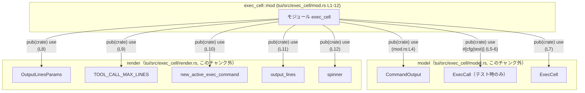
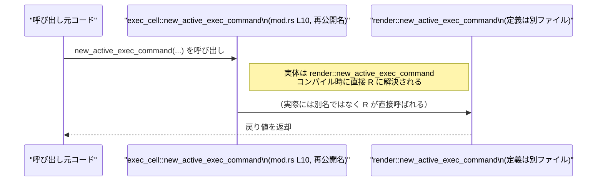

# tui/src/exec_cell/mod.rs コード解説

## 0. ざっくり一言

`exec_cell` モジュールは、内部サブモジュール `model` と `render` をまとめ、その中の型・関数・定数を `pub(crate) use` で再公開する **ハブ（窓口）モジュール** です（`mod.rs:L1-2, L4-12`）。

---

## 1. このモジュールの役割

### 1.1 概要

- このモジュールは、実際のロジックを持つ `model`・`render` サブモジュールを宣言し（`mod.rs:L1-2`）、そこからいくつかのシンボルを `pub(crate) use` で再公開します（`mod.rs:L4-12`）。
- これにより、クレート内の他コードは `exec_cell` モジュール経由で `CommandOutput` や `ExecCell` などの型、`output_lines` や `spinner` などの関数を利用できます。
- このファイル自身には **関数・構造体・列挙体などの定義は一切なく**、純粋にモジュール宣言と再公開のみが記述されています。

### 1.2 アーキテクチャ内での位置づけ

`exec_cell` モジュールと、その配下の `model`・`render` サブモジュール、および再公開されるシンボルとの関係を図示します。



この図が表すのは次の点です。

- `exec_cell` は `model` と `render` をサブモジュールとして持ちます（`mod.rs:L1-2`）。
- `exec_cell` はそれらサブモジュールの中のシンボルをクレート内公開（`pub(crate)`）の形でまとめて提供しています（`mod.rs:L4-12`）。
- `ExecCall` だけは `#[cfg(test)]` が付いており、**テストビルドのときだけ** 再公開されます（`mod.rs:L5-6`）。

### 1.3 設計上のポイント

コードから読み取れる設計上の特徴は次のとおりです。

- **責務の分割**
  - 実データやロジックは `model`・`render` に置き、この `mod.rs` はそれらをまとめて再公開する役割に限定されています（`mod.rs:L1-2, L4-12`）。
- **公開範囲の制御**
  - すべての `use` が `pub(crate)` であり、**クレート内限定の公開** になっています（`mod.rs:L4, L6-12`）。
  - これにより、クレート外への API 露出を防ぎつつ、クレート内では `exec_cell::X` 経由でまとまった API を利用できるようにしていると解釈できます。
- **テスト専用の API**
  - `ExecCall` の再公開には `#[cfg(test)]` が付与されており（`mod.rs:L5-6`）、テストコードでのみ利用できる API を明示的に切り出しています。
- **エラー処理・並行性**
  - このファイル内にはロジックが存在せず、関数定義・スレッド生成・非同期処理などは一切含まれていません。
  - したがって、このファイル単体からは **エラー処理や並行性に関する方針は読み取れません**。それらは `model`・`render` 側の実装に依存します。

---

## 2. 主要な機能一覧

このファイルに現れるシンボル（サブモジュール・再公開シンボル）の役割は、コード上は名前と公開形態のみが分かります。機能名から一般的に想定される役割を **推測であると明示したうえで** 記載します。

- `model` サブモジュール（`mod.rs:L1`）
  - 実行セルに関連する **データモデル** やロジックを持つモジュールと推測されますが、定義はこのチャンクには現れません。
- `render` サブモジュール（`mod.rs:L2`）
  - 実行結果を表示用に整形・レンダリングするロジックを持つモジュールと推測されますが、同じく詳細は不明です。
- `CommandOutput`（`mod.rs:L4`）
  - 名称から、コマンド実行の出力を表す型と推測されます（定義は `model` 側で、このチャンクにはありません）。
- `ExecCall`（テスト時のみ, `mod.rs:L5-6`）
  - 名称から、実行セルに対する呼び出しを表現するテスト用型と推測されます。
- `ExecCell`（`mod.rs:L7`）
  - 名称から、「実行セル」そのものを表す型（構造体など）と推測されます。
- `OutputLinesParams`（`mod.rs:L8`）
  - 名称から、出力行の描画に関するパラメータを保持する型と推測されます。
- `TOOL_CALL_MAX_LINES`（`mod.rs:L9`）
  - 名称から、ツール呼び出し時の最大表示行数などを表す定数と推測されます。
- `new_active_exec_command`（`mod.rs:L10`）
  - 名称から、「アクティブな実行コマンド」を生成する関数と推測されます。
- `output_lines`（`mod.rs:L11`）
  - 名称から、何らかの出力を行単位の表示用データに変換する関数と推測されます。
- `spinner`（`mod.rs:L12`）
  - 名称から、処理中表示（スピナー）に関する関数または値と推測されます。

> これらの役割はすべて **命名規則に基づく推測** であり、実装は `model.rs` / `render.rs` にあり、このチャンクだけでは断定できません。

### 2.1 コンポーネントインベントリー（一覧）

本チャンクに現れるコンポーネントと、その根拠行をまとめます。

| 名称 | 種別（推定を含む） | 公開範囲 | 定義元モジュール | このファイルでの扱い | 根拠 |
|------|--------------------|----------|------------------|----------------------|------|
| `model` | サブモジュール | `pub(crate)` 以上かは不明（外側の宣言による） | `tui/src/exec_cell/model.rs` | `mod model;` で宣言 | `mod.rs:L1` |
| `render` | サブモジュール | 同上 | `tui/src/exec_cell/render.rs` | `mod render;` で宣言 | `mod.rs:L2` |
| `CommandOutput` | 型（推定: 構造体または列挙体） | `pub(crate)` | `model` | `pub(crate) use model::CommandOutput;` で再公開 | `mod.rs:L4` |
| `ExecCall` | 型（推定） | `pub(crate)` かつ **テスト時のみ** | `model` | `#[cfg(test)] pub(crate) use model::ExecCall;` で再公開 | `mod.rs:L5-6` |
| `ExecCell` | 型（推定） | `pub(crate)` | `model` | `pub(crate) use model::ExecCell;` で再公開 | `mod.rs:L7` |
| `OutputLinesParams` | 型（推定） | `pub(crate)` | `render` | `pub(crate) use render::OutputLinesParams;` で再公開 | `mod.rs:L8` |
| `TOOL_CALL_MAX_LINES` | 定数（推定） | `pub(crate)` | `render` | `pub(crate) use render::TOOL_CALL_MAX_LINES;` で再公開 | `mod.rs:L9` |
| `new_active_exec_command` | 関数（推定） | `pub(crate)` | `render` | `pub(crate) use render::new_active_exec_command;` で再公開 | `mod.rs:L10` |
| `output_lines` | 関数（推定） | `pub(crate)` | `render` | `pub(crate) use render::output_lines;` で再公開 | `mod.rs:L11` |
| `spinner` | 関数または値（推定） | `pub(crate)` | `render` | `pub(crate) use render::spinner;` で再公開 | `mod.rs:L12` |

---

## 3. 公開 API と詳細解説

このファイルは API の **窓口** ですが、実体定義はすべて別ファイルにあります。そのため、本セクションでは「このモジュール経由で見える API」の構造を整理しつつ、詳細が分からない部分はその旨を明記します。

### 3.1 型一覧（構造体・列挙体など）

Rust の命名慣例（型は `UpperCamelCase`）に基づく推測を含みます。

| 名前 | 種別（推定） | 役割 / 用途（推定） | 定義場所（推定） | 根拠 |
|------|--------------|----------------------|------------------|------|
| `CommandOutput` | 構造体または列挙体 | コマンドの実行結果を表すモデル | `model` モジュール | 再公開されている型名（`mod.rs:L4`） |
| `ExecCall` | 構造体または列挙体 | 実行セルへの呼び出し内容を表すテスト用モデル | `model` モジュール | `#[cfg(test)] pub(crate) use model::ExecCall;`（`mod.rs:L5-6`） |
| `ExecCell` | 構造体または列挙体 | 「実行セル」そのものを表すモデル | `model` モジュール | `pub(crate) use model::ExecCell;`（`mod.rs:L7`） |
| `OutputLinesParams` | 構造体または列挙体 | 出力行のレンダリング設定を保持するパラメータ | `render` モジュール | `pub(crate) use render::OutputLinesParams;`（`mod.rs:L8`） |

> 上記の型の具体的なフィールド構成やメソッドは、このチャンクには一切現れません。

### 3.2 関数詳細（最大 7 件）

`mod.rs` 自体には関数定義がないため、ここでは **再公開されている関数らしきシンボル** について、テンプレート形式で「分かること / 分からないこと」を整理します。

#### `new_active_exec_command(...)`（シグネチャ不明）

**概要**

- `render::new_active_exec_command` を `pub(crate)` で再公開したものです（`mod.rs:L10`）。
- 名称からは「アクティブな実行コマンドを生成するファクトリ関数」であることが推測されますが、実装は `render` モジュール側にありこのチャンクには現れません。

**引数**

- このチャンクからは **一切不明** です。
- 型名や個数、所有権（`&T` / `T`）などは `render.rs` を参照する必要があります。

**戻り値**

- 戻り値の型や意味も、このチャンクからは不明です。

**内部処理の流れ（アルゴリズム）**

- `mod.rs` には本関数の本体は存在せず、内部処理についても一切読み取れません。
- 実際のアルゴリズムやエラー処理は `render::new_active_exec_command` の定義に依存します。

**Examples（使用例）**

- 正確なシグネチャが不明なため、ここでは擬似コードとしての例のみ示します。

```rust
use crate::exec_cell::new_active_exec_command;

// 実際の引数・戻り値の型はこのチャンクからは不明です。
// そのため、ここでは「関数を呼ぶことができる」というレベルの擬似コードに留めます。
fn create_command_example() {
    let cmd = new_active_exec_command(/* 必要な引数をここに渡す */);
    // cmd の型や、その後どう使うかは render::new_active_exec_command の定義に依存します。
}
```

**Errors / Panics**

- `Result` 型や `Option` 型を返しているかどうかも含め、エラー発生条件は不明です。

**Edge cases（エッジケース）**

- 空文字列・大きな入力などに対する挙動は、実装がないためこのチャンクからは判断できません。

**使用上の注意点**

- この関数を安全に利用するためには、`render::new_active_exec_command` のドキュメントまたは実装を確認する必要があります。
- 本ファイルは再公開のみを行っているため、**言語レベルの安全性・並行性への影響は追加していません**。

---

#### `output_lines(...)`（シグネチャ不明）

**概要**

- `render::output_lines` を `pub(crate)` で再公開しています（`mod.rs:L11`）。
- 名称からは「出力を行単位に分割し、描画用の構造に変換する」関数であることが推測されます。

**引数 / 戻り値 / 処理 / エラー / エッジケース**

- すべて `render::output_lines` の実装に依存し、このチャンクには情報がありません。

**使用上の注意点**

- 実際の使用方法やエラー処理は `render` モジュール側の定義を参照する必要があります。

---

#### `spinner(...)`（シグネチャ不明）

**概要**

- `render::spinner` を `pub(crate)` で再公開しています（`mod.rs:L12`）。
- 名称からは「処理中インジケータ（スピナー）を表示・制御する」機能であることが推測されます。

**その他の項目**

- `output_lines` と同様、詳細はすべて `render::spinner` の定義に依存し、このチャンクからは不明です。

---

### 3.3 その他の関数

- このファイル内には **関数定義そのものが存在しない** ため、「その他の関数」はありません。
- 再公開されている関数らしきシンボルは上記 3.2 に列挙したとおりです（`mod.rs:L10-12`）。

---

## 4. データフロー

このファイルは実際のデータ処理を行わず、**コンパイル時の名前解決に関与するだけ** です。そのため、「ランタイムでデータがどのように流れるか」という意味での詳細なデータフローは、このチャンクからは把握できません。

ただし、「呼び出しコードがどのシンボルに解決されるか」という **静的なフロー** は次のように整理できます。



説明:

- 呼び出し側は `crate::exec_cell::new_active_exec_command` のように `exec_cell` 経由で呼び出します。
- `pub(crate) use render::new_active_exec_command;`（`mod.rs:L10`）により、**実際には `render` 内の関数が直接呼ばれます**。
- これは再公開（`use`）による名前の別名付けであり、ランタイムでのラップ処理ではなく **コンパイル時の解決** です。
- `output_lines` や `spinner` も同様に、`exec_cell::output_lines` → `render::output_lines` という形で解決されます（`mod.rs:L11-12`）。

このため、**実際のデータ変換や I/O、エラー処理などのフローはすべて `model`・`render` 側に存在し、このチャンクからは不明** です。

---

## 5. 使い方（How to Use）

### 5.1 基本的な使用方法

このモジュールは、クレート内部から `exec_cell` にまとめてアクセスするための窓口です。一般的な利用イメージを、**シグネチャ不明を前提とした擬似コード** で示します。

```rust
// exec_cell モジュールから、必要な型や関数をインポートする
use crate::exec_cell::{
    CommandOutput,        // 型（推定）
    ExecCell,             // 型（推定）
    OutputLinesParams,    // 型（推定）
    TOOL_CALL_MAX_LINES,  // 定数（推定）
    new_active_exec_command,
    output_lines,
    spinner,
};

// 引数・戻り値・メソッド名などはこのチャンクからは不明なので、
// 以下はあくまで「どの名前空間から参照できるか」を示す擬似コードです。
fn use_exec_cell_example(cell: ExecCell) {
    // アクティブなコマンドを作成（引数は不明）
    let cmd = new_active_exec_command(/* ... */);

    // セルで何らかの処理を実行し、結果を得ると想定
    // let output: CommandOutput = cell.execute(cmd); 
    // ↑ このようなメソッドが存在するかどうかは不明なため、コメントアウトの擬似コードとします。

    // 出力表示のためのパラメータを作成（構造は不明）
    // let params = OutputLinesParams { /* ... */ };

    // 表示用の行を生成すると想定
    // let lines = output_lines(output, params);

    // 処理中にスピナーを表示すると想定
    // spinner(/* ... */);

    // TOOL_CALL_MAX_LINES は描画時の行数制限などに用いられると推測されます。
    let _max_lines = TOOL_CALL_MAX_LINES;
}
```

ポイント:

- `exec_cell` モジュールにアクセスできる範囲（クレート内）であれば、**すべてこのモジュール経由でシンボルにアクセスできます**（`mod.rs:L4-12`）。
- 具体的なメソッド名やパラメータ構造が分からないため、メソッド呼び出し部分はコメントアウトした擬似コードに留めています。

### 5.2 よくある使用パターン（推定）

実際のパターンは不明ですが、名前から想定されるパターンを列挙します（推測であり、確認には実装ファイルが必要です）。

- `ExecCell` と `new_active_exec_command` を組み合わせた「コマンド実行」フロー。
- `CommandOutput` と `output_lines` を組み合わせた「出力整形・表示」フロー。
- 長時間処理に対して `spinner` を用いた「処理中インジケータ」表示。

### 5.3 よくある間違い（このファイルから推定できる範囲）

このファイルから読み取れる範囲で想定される誤用は限定的ですが、次の点が挙げられます。

```rust
// 誤り例（推定）: テスト専用の ExecCall を本番コードで使おうとする
#[allow(dead_code)]
fn use_exec_call_in_production() {
    // use crate::exec_cell::ExecCall;
    // ↑ ExecCall は #[cfg(test)] 付きで再公開されているため（mod.rs:L5-6）、
    //   本番ビルドではこの行はコンパイルエラーになる可能性があります。
}

// 正しい扱い（推定）: ExecCall は tests/ や #[cfg(test)] モジュール内でのみ利用する
#[cfg(test)]
mod tests {
    use crate::exec_cell::ExecCall; // テストビルドでは利用可能（mod.rs:L5-6）

    #[test]
    fn test_something() {
        // ExecCall を用いたテストをここに書く（実際の構造は不明）
    }
}
```

### 5.4 使用上の注意点（まとめ）

- `ExecCall` は `#[cfg(test)]` によって **テストビルド時にしか存在しない API** になっています（`mod.rs:L5-6`）。本番コードから参照しないことが前提条件となります。
- すべての再公開が `pub(crate)` であるため（`mod.rs:L4, L6-12`）、クレート外からこれらのシンボルに直接アクセスできるかは、クレートルートでの `pub mod exec_cell;` の有無に依存します。
- このファイルにはスレッド・非同期・I/O などの処理は一切なく、**並行性やエラー処理に関する安全性は中立**です。実際の安全性は `model`/`render` の実装によって決まります。

---

## 6. 変更の仕方（How to Modify）

### 6.1 新しい機能を追加する場合

このモジュールは API の窓口であり、実装は別モジュールに置かれています。新しい機能を追加する際の基本方針は次のとおりです。

1. **実装を追加する場所**
   - 新しいデータモデルやロジックは `tui/src/exec_cell/model.rs` または `render.rs` に追加するのが自然です（`mod.rs:L1-2`）。
     - モデル・状態管理 → `model.rs`
     - 表示・レンダリング → `render.rs`
2. **窓口モジュールで再公開する**
   - クレート内の他モジュールからも利用したい場合は、この `mod.rs` に `pub(crate) use` を追加します。
   - 例（擬似コード）:

     ```rust
     // model.rs で新しい型 NewType を定義した場合
     // mod.rs に以下を追加することで、crate 内から exec_cell::NewType でアクセス可能になる
     pub(crate) use model::NewType;
     ```

3. **公開範囲の検討**
   - このファイルでは一貫して `pub(crate)` を使っているため（`mod.rs:L4, L6-12`）、新しいエントリもそれに合わせると API ポリシーが揃います。
   - テスト専用としたい場合は `ExecCall` のように `#[cfg(test)]` を付けます（`mod.rs:L5-6`）。

### 6.2 既存の機能を変更する場合

既存 API の変更を行うときに注意すべき点です。

- **再公開名の変更**
  - 例えば `pub(crate) use model::ExecCell;`（`mod.rs:L7`）の名前を別名で再公開したり削除すると、`exec_cell::ExecCell` を利用しているすべての箇所に影響します。
- **`pub(crate)` の変更**
  - `pub(crate)` を `pub` に変えると、クレート外からもアクセス可能な API に変わります。
  - 公開範囲の変更はライブラリの外部契約（API）を変えるため、慎重な検討が必要です。
- **`#[cfg(test)]` の付け外し**
  - `ExecCall` のようなテスト専用 API から `#[cfg(test)]` を外すと、本番コードからも利用可能になり、テスト前提の実装が本番に露出する可能性があります（`mod.rs:L5-6`）。
- **実装ファイル側の変更**
  - 真のロジックやデータ構造は `model.rs` / `render.rs` にあります。この `mod.rs` を変更しても、そこにある実装の前提（引数・戻り値・ライフタイムなど）が変わるわけではないため、実装側と一貫性を保つことが重要です。

---

## 7. 関連ファイル

このモジュールと密接に関係するファイルは、`mod` 宣言から次の 2 つが確認できます。

| パス | 役割 / 関係 |
|------|------------|
| `tui/src/exec_cell/model.rs` | `mod model;`（`mod.rs:L1`）で宣言されるサブモジュール。`ExecCell`・`CommandOutput`・`ExecCall` などのモデルやロジックが定義されていると推測されますが、このチャンクには実装が現れません。 |
| `tui/src/exec_cell/render.rs` | `mod render;`（`mod.rs:L2`）で宣言されるサブモジュール。`OutputLinesParams`・`TOOL_CALL_MAX_LINES`・`new_active_exec_command`・`output_lines`・`spinner` などの実装が置かれていると推測されます。 |

テストコード（`tests/` ディレクトリや `#[cfg(test)] mod tests`）も存在すると考えられますが、このチャンクには具体的なパスは現れず、「`ExecCall` がテスト専用に再公開されている」という事実だけが確認できます（`mod.rs:L5-6`）。

---

## Bugs / Security / Contracts / Edge Cases / Tests に関する補足（このファイルから分かる範囲）

最後に、ユーザー指定の観点について、このファイル単体から読み取れる事実だけを整理します。

- **Bugs**
  - このファイルは宣言と再公開のみであり、制御フローを持たないため、典型的なバグ（ロジックミス、パニックなど）は存在しません。
- **Security**
  - `pub(crate)` で公開範囲をクレート内に限定している点は、API 露出を控えめにする保守的な方針といえます（`mod.rs:L4, L6-12`）。
  - ただし、実際の安全性（入力検証、権限チェックなど）は `model`・`render` 側の実装に依存し、このチャンクからは判断できません。
- **Contracts / Edge Cases**
  - 型・関数の「契約」（前提条件や返り値の意味）やエッジケースへの対応は、ここには記述がなく不明です。
- **Tests**
  - `ExecCall` が `#[cfg(test)]` 付きで再公開されていることから（`mod.rs:L5-6`）、テスト用 API を明示的に切り出していることがわかります。
  - それ以外のテスト戦略（ユニットテスト・統合テストの有無など）は、このチャンクには現れません。
- **Performance / Observability**
  - 性能に影響する処理やロギング・メトリクスといった観測性関連のコードは、このファイルには存在しません。

このように、`tui/src/exec_cell/mod.rs` は **構造上の結節点（API ハブ）** であり、コアロジックや安全性・並行性の詳細は、すべて `model.rs` と `render.rs` の実装側に委ねられている構造になっています。
