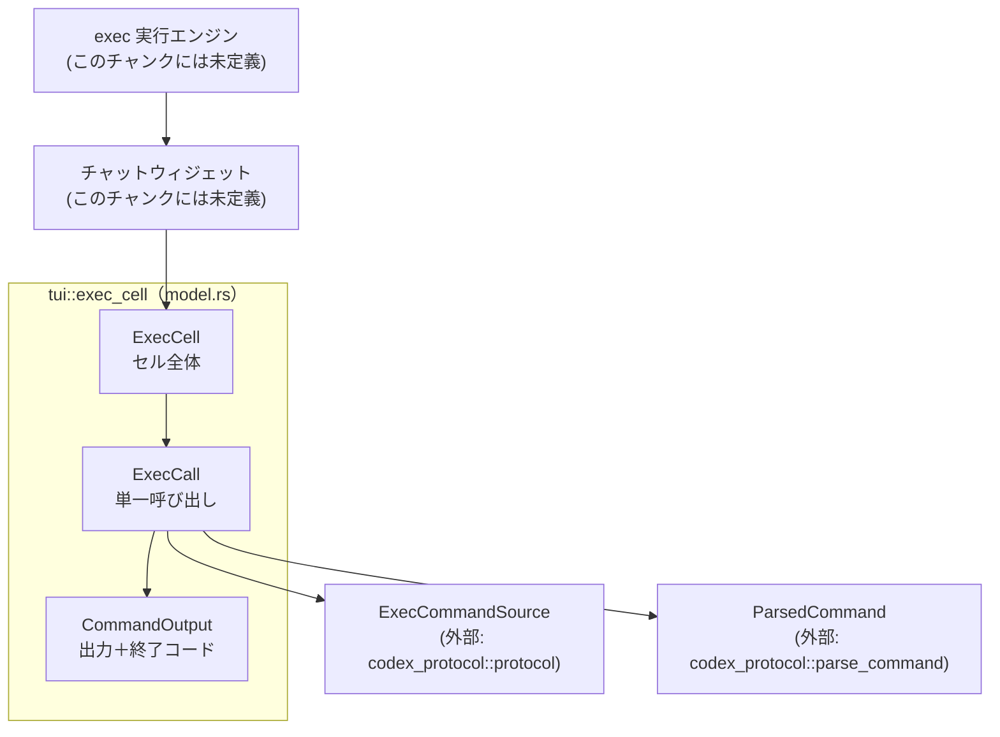
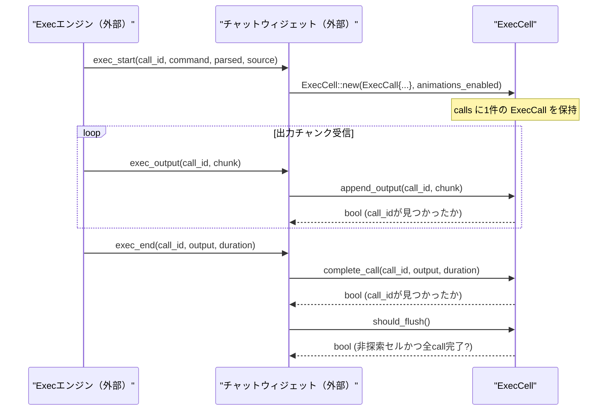

# tui/src/exec_cell/model.rs

## 0. ざっくり一言

TUI のトランスクリプト上で、1 つまたは複数の `exec` 呼び出し（探索系コマンドのグループを含む）を 1 セルとして表現するデータモデルです。  
`call_id` による進捗・終了イベントのルーティングと、「見つからなかった」という事実を明示的なシグナルとして扱うことが主な役割です（`model.rs:L1-6, 77-81`）。

---

## 1. このモジュールの役割

### 1.1 概要

- このモジュールは **TUI の exec 呼び出し履歴セルを表現し、イベントを正しいセルにひもづける** ために存在します（`model.rs:L1-6`）。
- 1 セルは `ExecCall` のベクタであり、単一コマンドセルまたは「探索系」コマンド群をまとめたセル（exploring cell）になり得ます（`model.rs:L3-4, 35-39`）。
- チャットウィジェット側は `call_id` でセル内の `ExecCall` を検索し、  
  - 出力チャンクの追記
  - 実行完了（成功・失敗）のマーク  
 などを行う際に、このモデルを経由します（`model.rs:L77-81, 142-151`）。

### 1.2 アーキテクチャ内での位置づけ

このファイル内で分かる主な依存関係を示します。



- `ExecCell` はチャットウィジェットから呼ばれる内部モデルとして振る舞います（`model.rs:L1-6, 41-47`）。
- `ExecCall` は 1 回の exec 呼び出しのメタデータ・パース結果・出力・時間情報を持ちます（`model.rs:L23-33`）。
- 「探索セル（exploring cell）」の判定には、外部型 `ParsedCommand` と `ExecCommandSource` が用いられます（`model.rs:L24-32, 154-165`）。

### 1.3 設計上のポイント

コードから読み取れる設計上の特徴です。

- **不変なグルーピングルール**
  - `ExecCell::is_exploring_cell` はセル内すべての `ExecCall` が探索系かどうかを `all(Self::is_exploring_call)` で判定します（`model.rs:L119-121`）。
  - `with_added_call` で新しい `ExecCall` を追加できるのは、「既存セルが探索セル」かつ「新コールも探索系」の場合だけです（`model.rs:L49-75`）。
- **イベントルーティングの明示的な結果**
  - `complete_call` と `append_output` は対象の `call_id` が見つかったかどうかを `bool` で返し、`false` はルーティングミスマッチとして扱うことがコメントで明示されています（`model.rs:L77-81, 82-95, 142-151`）。
- **状態管理は Option で明示**
  - 実行中／完了済みは `output: Option<CommandOutput>` で表現されます（`model.rs:L27-32`）。
  - 時間情報も `start_time: Option<Instant>` と `duration: Option<Duration>` の組で管理され、失敗処理時には経過時間から `duration` を埋めて `start_time` を `None` にします（`model.rs:L30-31, 101-117`）。
- **Rust の安全性**
  - `unsafe` は一切使用されていません。
  - すべての変更操作は `&mut self` を要求し、内部可変性（`RefCell` 等）は使っていないため、同時に複数から変更されることをコンパイル時に防いでいます（`model.rs:L41-152`）。
- **探索コマンドの厳格な分類**
  - 探索系とみなす条件は、`source != UserShell` かつ `parsed` 非空かつ、すべての `ParsedCommand` が `Read / ListFiles / Search` であること、と明示的に定義されています（`model.rs:L154-165`）。

---

## 2. 主要な機能一覧

このモジュールが提供する主な機能です。

- **`ExecCell` の生成**: 単一 `ExecCall` からセルを作成し、アニメーションの有効/無効を保持する（`model.rs:L41-47`）。
- **探索セルへのコール追加**: 探索セルに対して、新しい探索系 `ExecCall` を追加した新セルを返す（`model.rs:L49-75`）。
- **コール完了処理**: `call_id` に対応する最新の `ExecCall` を完了状態にし、出力と所要時間をセットする（`model.rs:L77-95`）。
- **出力チャンクの追記**: 進捗イベントに応じて `aggregated_output` に文字列を追記する（`model.rs:L142-151`）。
- **セルのフラッシュ判定**: 非探索セルで全コール完了済みかどうかを判定し、履歴への確定（flush）を行うかどうかのシグナルを出す（`model.rs:L97-99`）。
- **失敗マークの一括付与**: 未完了のコールに対して、経過時間を算出して失敗（exit code = 1）としてマークする（`model.rs:L101-117`）。
- **セル状態のクエリ**: 「探索セルか」「アクティブ（未完了コールを含む）か」「先頭のアクティブ開始時刻」などを問い合わせる（`model.rs:L119-132`）。
- **`ExecCall` の種別判定**: ユーザーシェル起点か、統合 exec インタラクション起点かを判定する（`model.rs:L168-175`）。

---

## 3. 公開 API と詳細解説

### 3.1 型一覧（構造体・列挙体など）

| 名前            | 種別     | 役割 / 用途                                                                 | 定義箇所 |
|-----------------|----------|-----------------------------------------------------------------------------|----------|
| `CommandOutput` | 構造体   | 終了コードと、集約された出力（stderr + stdout）および整形済み出力を保持する。 | `tui/src/exec_cell/model.rs:L14-21` |
| `ExecCall`      | 構造体   | 1 回の exec 呼び出しのメタデータ（`call_id`・コマンド列）、パース結果、出力、時間情報を保持する。 | `tui/src/exec_cell/model.rs:L23-33` |
| `ExecCell`      | 構造体   | 複数の `ExecCall` をまとめた 1 つの履歴セルと、アニメーション設定を表す。    | `tui/src/exec_cell/model.rs:L35-39` |

### 3.2 関数詳細（主要 7 件）

#### `ExecCell::new(call: ExecCall, animations_enabled: bool) -> Self`

**概要**

- 単一の `ExecCall` から新しい `ExecCell` を生成します（`model.rs:L41-47`）。
- セルが探索セルかどうかは `call` の内容によって決まり、ここでは判定しません。

**引数**

| 引数名              | 型           | 説明 |
|---------------------|--------------|------|
| `call`              | `ExecCall`   | セルに含める最初の呼び出し。所有権が `ExecCell` に移動します。 |
| `animations_enabled`| `bool`       | このセルのアニメーション表示を有効にするかどうか。 |

**戻り値**

- `Self` (`ExecCell`): `calls` に 1 件だけ `call` を含み、`animations_enabled` を指定値としたセル。

**内部処理の流れ**

1. フィールド初期化式を持つ `Self` リテラルで `ExecCell` を生成（`model.rs:L42-46`）。
2. `calls` に `vec![call]` をセットし、`animations_enabled` をそのままコピー。

**Examples（使用例）**

```rust
use codex_protocol::protocol::ExecCommandSource;
use tui::exec_cell::model::{ExecCall, ExecCell, CommandOutput}; // パスは仮

fn create_user_shell_cell() -> ExecCell {
    let call = ExecCall {
        call_id: "call-1".to_string(),
        command: vec!["ls".to_string(), "-la".to_string()],
        parsed: Vec::new(),                       // ParsedCommand の詳細はこのファイルからは不明
        output: None,                             // まだ実行前
        source: ExecCommandSource::UserShell,
        start_time: None,
        duration: None,
        interaction_input: None,
    };

    ExecCell::new(call, /*animations_enabled=*/ true)
}
```

※ 実際のモジュールパスはこのチャンクからは分からないため仮です。

**Errors / Panics**

- エラー戻り値や `panic!` はありません。単に構造体を構築するだけです。

**Edge cases（エッジケース）**

- `call` の `start_time` や `output` が `Some` であっても、`new` はそれをそのまま引き継ぎます。  
  「開始時刻を必ず `now` にする」などの正規化は行いません。

**使用上の注意点**

- `ExecCell` の探索セル判定は `is_exploring_cell()` で行われるため、`call` の内容と `ExecCell` の扱いが矛盾しないようにする必要があります（例: 探索セルとして扱いたいなら `ExecCall` も探索系条件を満たすこと）。

---

#### `ExecCell::with_added_call(&self, call_id: String, command: Vec<String>, parsed: Vec<ParsedCommand>, source: ExecCommandSource, interaction_input: Option<String>) -> Option<Self>`

**概要**

- 既存の探索セル (`self`) に、新しい探索系 `ExecCall` を末尾に追加した **新しい** `ExecCell` を返します（`model.rs:L49-75`）。
- 既存セルが探索セルでない、または追加しようとしているコールが探索系でない場合は `None` を返します。

**引数**

| 引数名              | 型                      | 説明 |
|---------------------|-------------------------|------|
| `&self`             | `&ExecCell`             | 既存セル。変更はされません（イミュータブル参照）。 |
| `call_id`           | `String`                | 新しい呼び出しの ID。 |
| `command`           | `Vec<String>`           | コマンドとその引数をトークン化したもの。 |
| `parsed`            | `Vec<ParsedCommand>`    | コマンドのパース結果。探索系判定に利用されます。 |
| `source`            | `ExecCommandSource`     | 呼び出しの起点となるソース。 |
| `interaction_input` | `Option<String>`        | 対話入力など、追加のコンテキスト。 |

**戻り値**

- `Option<Self>`:
  - `Some(new_cell)`: `self` が探索セルであり、新しいコールも探索系と判定された場合に返されます。
  - `None`: それ以外の場合。呼び出し元は「このセルには追加すべきではない」というシグナルとして扱うべきです。

**内部処理の流れ**

1. 新しい `ExecCall` を作成し、`start_time` に `Some(Instant::now())`、`output` と `duration` に `None` をセットします（`model.rs:L57-65`）。
2. `self.is_exploring_cell()` で既存セルが探索セルか判定します（`model.rs:L67`）。
3. `Self::is_exploring_call(&call)` で新コールが探索系か判定します（`model.rs:L67`）。
4. 両方 true の場合:
   - `self.calls.clone()` と `vec![call]` を `[ ... ].concat()` で連結し、新しい `calls` ベクタを生成します（`model.rs:L68-69`）。
   - `animations_enabled` は元の値をコピーします（`model.rs:L70`）。
   - それらから新しい `ExecCell` を作り `Some(...)` で返します。
5. いずれかが false の場合:
   - `None` を返します（`model.rs:L72-74`）。

**Examples（使用例）**

```rust
// NOTE: ParsedCommand の具体的な構築方法はこのファイルからは分からないため、
//       unimplemented!() を使ってコンパイルだけ通す例です。
fn add_exploring_call(cell: &ExecCell) -> Option<ExecCell> {
    use codex_protocol::protocol::ExecCommandSource;
    use codex_protocol::parse_command::ParsedCommand;

    let parsed: Vec<ParsedCommand> = vec![unimplemented!()]; // 実際は Read/ListFiles/Search を構築する

    cell.with_added_call(
        "call-2".to_string(),
        vec!["grep".to_string(), "foo".to_string()],
        parsed,
        ExecCommandSource::UnifiedExecInteraction,
        None,
    )
}
```

**Errors / Panics**

- エラー型は返しません。
- `panic!` を起こしうる操作（インデックスなど）はしていません。

**Edge cases（エッジケース）**

- `self.calls` が空でも `is_exploring_cell()` は論理的には `true` になりますが、`ExecCell::new` は必ず 1 件入れて作るため、通常は空にはなりません（このファイルからは、空にする API は提供されていません）。
- `parsed` が空の場合は探索系とはみなされず、必ず `None` が返されます（`model.rs:L155-157`）。

**使用上の注意点**

- `self` は変更されず、新しい `ExecCell` が返るため、呼び出し側の状態管理（差し替え）を忘れると、追加が反映されません。
- `None` を無視すると、意図しないセルに exec 呼び出しが追加されないままになる可能性があります。呼び出し側で必ず分岐処理を行うのが前提です。

---

#### `ExecCell::complete_call(&mut self, call_id: &str, output: CommandOutput, duration: Duration) -> bool`

**概要**

- 指定された `call_id` に対応する **最新の** `ExecCall` を完了状態にし、出力と総実行時間をセットします（`model.rs:L77-95`）。
- 見つからなかった場合は `false` を返し、それは「ルーティングミスマッチ」のシグナルとして扱うべきとコメントされています（`model.rs:L79-81`）。

**引数**

| 引数名    | 型                | 説明 |
|-----------|-------------------|------|
| `&mut self` | `&mut ExecCell`  | セル全体を変更するための排他的参照。 |
| `call_id` | `&str`            | 完了させたい呼び出しの ID。 |
| `output`  | `CommandOutput`   | 終了コードと出力内容。所有権が対象 `ExecCall` に移動します。 |
| `duration`| `Duration`        | 実行に要した時間。 |

**戻り値**

- `bool`:
  - `true`: 対応する `ExecCall` が見つかり、完了処理を行った。
  - `false`: 該当する `call_id` がセル内に存在しなかった。

**内部処理の流れ**

1. `self.calls.iter_mut().rev().find(|c| c.call_id == call_id)` で、  
   ベクタの末尾から前向きに検索し、一番新しい `call_id` 一致の `ExecCall` を探します（`model.rs:L88`）。
2. 見つからなければ `false` を返します（`model.rs:L88-90`）。
3. 見つかった場合:
   - `call.output = Some(output);` で出力をセット（`model.rs:L91`）。
   - `call.duration = Some(duration);` で所要時間をセット（`model.rs:L92`）。
   - `call.start_time = None;` で開始時刻をクリア（実行中→完了済み状態への遷移）（`model.rs:L93`）。
   - `true` を返します（`model.rs:L94`）。

**Examples（使用例）**

```rust
fn on_exec_end(cell: &mut ExecCell, call_id: &str, raw_output: String, duration: Duration) {
    let output = CommandOutput {
        exit_code: 0,
        aggregated_output: raw_output.clone(),
        formatted_output: raw_output, // 実際には整形処理が入る想定
    };

    let found = cell.complete_call(call_id, output, duration);

    if !found {
        // ここで「孤立した exec_end」を別エントリとして扱うなどの処理を行う想定
    }
}
```

**Errors / Panics**

- `Option::None` チェックを行っているため、`panic!` の可能性はありません。
- 見つからなかったケースは `false` で表現され、例外は使っていません。

**Edge cases（エッジケース）**

- 同じ `call_id` を持つ `ExecCall` が複数存在する場合（想定は不明ですが）、**末尾のものだけ** が更新されます（`model.rs:L88`）。
- 既に `output` が `Some` の `ExecCall` に対して再度呼び出すと、上書きされます。この挙動はコード上は許されています。

**使用上の注意点**

- 戻り値の `bool` を必ず確認し、`false` の場合は「イベントがどこにもマッピングされていない」ことをロジック上明示的に扱う必要があります。
- 外部から渡される `duration` が `start_time` と整合しているかどうかはこの関数では検証しません。

---

#### `ExecCell::append_output(&mut self, call_id: &str, chunk: &str) -> bool`

**概要**

- 指定された `call_id` に対応する **最新の** `ExecCall` の `aggregated_output` に文字列チャンクを追記します（`model.rs:L142-151`）。
- `chunk` が空、または該当 `call_id` が見つからない場合は何もせず `false` を返します。

**引数**

| 引数名   | 型        | 説明 |
|----------|-----------|------|
| `&mut self` | `&mut ExecCell` | セル全体を変更するための排他的参照。 |
| `call_id`| `&str`    | 出力を追記したい呼び出しの ID。 |
| `chunk`  | `&str`    | 追記する出力チャンク。 |

**戻り値**

- `bool`:
  - `true`: 追記に成功した（`chunk` 非空かつ対応する `call_id` が見つかった）。
  - `false`: `chunk` が空、もしくは該当 `call_id` が見つからなかった。

**内部処理の流れ**

1. `chunk.is_empty()` なら即座に `false` を返す（`model.rs:L143-145`）。
2. `self.calls.iter_mut().rev().find(|c| c.call_id == call_id)` で末尾から検索（`model.rs:L146`）。
3. 見つからなければ `false` を返す（`model.rs:L146-147`）。
4. 見つかった場合:
   - `call.output.get_or_insert_with(CommandOutput::default)` で、  
     `output` が `None` なら `CommandOutput::default()` を生成してセットし、その参照を取得（`model.rs:L149`）。
   - `aggregated_output.push_str(chunk)` で文字列を追記（`model.rs:L150`）。
   - `true` を返す（`model.rs:L151`）。

**Examples（使用例）**

```rust
fn on_exec_output(cell: &mut ExecCell, call_id: &str, chunk: &str) {
    if !cell.append_output(call_id, chunk) {
        // ルーティングミスマッチや空文字列の場合の処理
    }
}
```

**Errors / Panics**

- 空文字列チェックと `Option` の取り扱いにより、`panic!` の可能性はありません。

**Edge cases（エッジケース）**

- まだ `CommandOutput` が存在しない（`output` が `None`）場合でも、`default()` で自動的に生成されます。
  - `CommandOutput` の `Default` 実装は `#[derive(Default)]` に基づき、`exit_code = 0`、文字列は空になります（`model.rs:L14-20`）。
- 同じ `call_id` の `ExecCall` が複数ある場合、末尾のものにだけ追記されます（`model.rs:L146`）。

**使用上の注意点**

- `chunk` が空だと `false` になるため、呼び出し側で意図的に空チャンクを送る場合はこの仕様を踏まえる必要があります。
- 完了済み（`output` が `Some` で `duration` も埋まっている）コールに対しても追記できてしまいます。  
  完了後に出力を増やしたくない場合は、呼び出し側で制御する必要があります。

---

#### `ExecCell::mark_failed(&mut self)`

**概要**

- セル内の **未完了** の `ExecCall` を、経過時間を計算したうえで「失敗」としてマークします（`model.rs:L101-117`）。
- エラー時やキャンセル時に、残っているコールを一括で終端させる目的で使われる設計と解釈できますが、用途はコード外です。

**引数**

| 引数名       | 型              | 説明 |
|--------------|-----------------|------|
| `&mut self`  | `&mut ExecCell` | セル全体を変更するための排他的参照。 |

**戻り値**

- なし（`()`）。

**内部処理の流れ**

1. `for call in self.calls.iter_mut()` で全コールを走査（`model.rs:L101-102`）。
2. `call.output.is_none()` のものだけ処理対象とする（`model.rs:L103`）。
3. `call.start_time` から経過時間を計算:
   - `Some(st)` の場合は `st.elapsed()` を利用（`model.rs:L104-106`）。
   - `None` の場合は `Duration::from_millis(0)` を利用（`model.rs:L107`）。
4. `call.start_time = None;` にし、`call.duration = Some(elapsed);` をセット（`model.rs:L108-109`）。
5. `call.output = Some(CommandOutput { exit_code: 1, formatted_output: String::new(), aggregated_output: String::new() });` で失敗としてマーク（`model.rs:L110-114`）。

**Examples（使用例）**

```rust
fn on_engine_disconnected(cell: &mut ExecCell) {
    // 実行エンジンが途切れた場合などに、未完了のコールを失敗扱いにする
    cell.mark_failed();
}
```

**Errors / Panics**

- `elapsed()` はシステム時間の後退などで `panic!` することは通常ありません（`Instant` は単調増加です）。
- 他に `panic!` を起こす操作はありません。

**Edge cases（エッジケース）**

- `start_time` が `None` のコールは「0ms で失敗した」として扱われます（`model.rs:L104-107`）。
- 既に `output` が `Some` のコールは対象外です。  
  したがって、部分的に完了済みのセルでも未完了の分だけが失敗として埋まります。

**使用上の注意点**

- 既に `exit_code` を持つコールには影響しないため、「全てのコールを強制的に exit code 1 にしたい」という用途には向きません。
- 実際の失敗理由や元の `exit_code` は保持されないため、エラー内容を区別したい場合は別途管理が必要になります。

---

#### `ExecCell::should_flush(&self) -> bool`

**概要**

- セルが履歴に「確定」されるべきかどうかを判定するヘルパーです（`model.rs:L97-99`）。
- **非探索セル** かつ **全コール完了済み** の場合だけ `true` になります。

**引数**

| 引数名 | 型         | 説明 |
|--------|------------|------|
| `&self`| `&ExecCell`| セルの状態を参照するためのイミュータブル参照。 |

**戻り値**

- `bool`:
  - `true`: 非探索セルで、かつ `calls` 内のすべての `ExecCall` に `output` がある。
  - `false`: 上記条件を満たしていない。

**内部処理の流れ**

1. `!self.is_exploring_cell()` で、非探索セルであることを確認（`model.rs:L98`）。
2. `self.calls.iter().all(|c| c.output.is_some())` で、全コールが完了済みか確認（`model.rs:L98`）。
3. 両方 true の場合のみ true を返す。

**Examples（使用例）**

```rust
fn maybe_flush_cell(cell: &ExecCell) {
    if cell.should_flush() {
        // 履歴への追加や描画更新などの処理を行う
    }
}
```

**Errors / Panics**

- エラーや `panic!` の可能性はありません。

**Edge cases（エッジケース）**

- 探索セル (`is_exploring_cell() == true`) は **決して `true` になりません**。  
  探索セルのフラッシュ条件は別途（このチャンク外で）管理されていると解釈できます。
- `calls` が空の場合、`all` は論理的に `true` を返しますが、前述の通りこのモジュールでは空セルを生成する API は存在しません。

**使用上の注意点**

- 戻り値が `false` であっても、呼び出し側のロジックでセルをフラッシュすることは可能です。  
  あくまで「典型的な条件」をカプセル化したヘルパーです。

---

#### `ExecCell::is_exploring_call(call: &ExecCall) -> bool`

**概要**

- 単一の `ExecCall` が「探索系コマンド」とみなせるかどうかを判定する静的メソッドです（`model.rs:L154-165`）。
- 探索セルかどうかの判定や、新規コールを探索セルに追加できるかどうかの判断に利用されます（`model.rs:L67, 119-121`）。

**引数**

| 引数名 | 型          | 説明 |
|--------|-------------|------|
| `call` | `&ExecCall` | 判定対象の呼び出し。 |

**戻り値**

- `bool`:
  - `true`: 探索系コマンドと判定された場合。
  - `false`: それ以外。

**内部処理の流れ**

1. `!matches!(call.source, ExecCommandSource::UserShell)`  
   - 呼び出しのソースがユーザーシェルでないこと（`model.rs:L155`）。
2. `&& !call.parsed.is_empty()`  
   - パース済みコマンドが 1 件以上あること（`model.rs:L156`）。
3. `&& call.parsed.iter().all(|p| matches!(p, ParsedCommand::Read { .. } | ParsedCommand::ListFiles { .. } | ParsedCommand::Search { .. }))`  
   - すべての `ParsedCommand` が `Read` / `ListFiles` / `Search` のいずれかであること（`model.rs:L157-163`）。

**Examples（使用例）**

```rust
fn is_cell_exploring_like(call: &ExecCall) -> bool {
    ExecCell::is_exploring_call(call)
}
```

※ `ParsedCommand` の具体的値は外部モジュール依存のため、この例では構築していません。

**Errors / Panics**

- マッチングとイテレーションのみであり、`panic!` を起こしうる操作はありません。

**Edge cases（エッジケース）**

- `parsed` が空だと必ず `false` になります（`model.rs:L156`）。
- `ParsedCommand` に `Read` / `ListFiles` / `Search` 以外のバリアントが混じると `false` になります。
- `source` が `UserShell` の場合は、`parsed` の内容に関わらず `false` です（`model.rs:L155`）。

**使用上の注意点**

- 探索条件に新しいコマンド種別を含めたい場合は、この関数の `matches!` を更新する必要があります。
- この判定ロジックは `ExecCell::is_exploring_cell` と `with_added_call` に直接影響するため、変更時にはそれらの挙動も再確認する必要があります。

---

### 3.3 その他の関数

主要な関数以外の、補助的な関数一覧です。

| 関数名 | シグネチャ | 役割（1 行） | 定義箇所 |
|--------|------------|--------------|----------|
| `ExecCell::is_exploring_cell` | `fn is_exploring_cell(&self) -> bool` | セル内のすべての `ExecCall` が探索系かどうかを判定する。 | `tui/src/exec_cell/model.rs:L119-121` |
| `ExecCell::is_active` | `fn is_active(&self) -> bool` | `output` が `None` の `ExecCall` が 1 つでも存在するかを判定する。 | `tui/src/exec_cell/model.rs:L123-125` |
| `ExecCell::active_start_time` | `fn active_start_time(&self) -> Option<Instant>` | 最初の未完了コールの `start_time` を返す。 | `tui/src/exec_cell/model.rs:L127-132` |
| `ExecCell::animations_enabled` | `fn animations_enabled(&self) -> bool` | セルに対してアニメーションが有効かどうかを返す。 | `tui/src/exec_cell/model.rs:L134-136` |
| `ExecCell::iter_calls` | `fn iter_calls(&self) -> impl Iterator<Item = &ExecCall>` | セル内のコールをイミュータブルに列挙するイテレータを返す。 | `tui/src/exec_cell/model.rs:L138-140` |
| `ExecCall::is_user_shell_command` | `fn is_user_shell_command(&self) -> bool` | `source` が `ExecCommandSource::UserShell` かどうかを判定する。 | `tui/src/exec_cell/model.rs:L168-171` |
| `ExecCall::is_unified_exec_interaction` | `fn is_unified_exec_interaction(&self) -> bool` | `source` が `ExecCommandSource::UnifiedExecInteraction` かどうかを判定する。 | `tui/src/exec_cell/model.rs:L173-175` |

---

## 4. データフロー

典型的な「exec 呼び出し 1 回」のデータフローを示します。  
実行エンジンとチャットウィジェットはこのチャンクには定義されていませんが、コメントから想定される役割として示します（`model.rs:L1-6, 77-81`）。



このフローの要点:

- `call_id` で `ExecCell` 内の `ExecCall` を検索し、  
  進捗 (`append_output`) と完了 (`complete_call`) を紐づけます。
- 両メソッドとも `bool` を返し、`false` は「ルーティングミスマッチ」として扱われます（`model.rs:L79-81, 142-151`）。
- 非探索セルにおいてすべてのコールが完了すると `should_flush()` が `true` となり、履歴への確定などのトリガに使えます（`model.rs:L97-99`）。

---

## 5. 使い方（How to Use）

### 5.1 基本的な使用方法

簡略化した基本フローの例です。外部型の詳細が不明なため、一部は疑似コードです。

```rust
use std::time::{Duration, Instant};
use codex_protocol::protocol::ExecCommandSource;
use codex_protocol::parse_command::ParsedCommand;
// use tui::exec_cell::model::{ExecCell, ExecCall, CommandOutput}; // 実際のパスはこのチャンクには現れません

fn basic_flow() {
    // 1. 最初の ExecCall を構築する
    let call = ExecCall {
        call_id: "call-1".to_string(),
        command: vec!["ls".into(), "-la".into()],
        parsed: Vec::<ParsedCommand>::new(),        // ParsedCommand の詳細は不明
        output: None,
        source: ExecCommandSource::UserShell,
        start_time: Some(Instant::now()),
        duration: None,
        interaction_input: None,
    };

    // 2. セルを生成する
    let mut cell = ExecCell::new(call, /*animations_enabled=*/ true);

    // 3. 出力チャンクを受信するたびに append_output を呼ぶ
    let ok = cell.append_output("call-1", "output chunk\n");
    if !ok {
        // call_id が一致しなかった場合の処理
    }

    // 4. 完了イベントで complete_call を呼ぶ
    let output = CommandOutput {
        exit_code: 0,
        aggregated_output: "output chunk\n".into(),
        formatted_output: "output chunk\n".into(),
    };
    let duration = Duration::from_millis(120);

    let found = cell.complete_call("call-1", output, duration);
    if !found {
        // 孤立した exec_end として扱うなどの処理
    }

    // 5. フラッシュ判定
    if cell.should_flush() {
        // 履歴への追加など
    }
}
```

### 5.2 よくある使用パターン

1. **非探索セル（単独コマンド）のライフサイクル管理**

   - `ExecCell::new` で作成。
   - 進捗時に `append_output`。
   - 完了時に `complete_call`。
   - 最後に `should_flush` で確定条件を判定。

2. **探索セルへのコール追加**

   - 先に探索系 `ExecCall` で `ExecCell` を作り、探索セルとなるようにする。
   - 追加の探索系コマンドを受け取るたび、`with_added_call` で新セルを生成し差し替える。
   - 探索セルのフラッシュタイミングは、呼び出し側ロジックで管理（`should_flush` は常に `false`）。

3. **エラー／キャンセル時の一括失敗処理**

   - 接続断などで、セル内に未完了のコールが残っている場合に `mark_failed` を呼ぶ。
   - これにより、すべての未完了コールが exit code 1 の失敗として終了状態になる。

### 5.3 よくある間違い

```rust
// 間違い例: with_added_call の戻り値を無視している
fn wrong_add(cell: &ExecCell) {
    cell.with_added_call(
        "call-2".into(),
        vec!["cat".into(), "file.txt".into()],
        Vec::new(),                        // parsed が空なので探索系と判定されない
        ExecCommandSource::UnifiedExecInteraction,
        None,
    );
    // 戻り値を無視すると、セルは追加されないまま
}

// 正しい例: Option をチェックしてセルを差し替える
fn correct_add(cell: ExecCell) -> ExecCell {
    let parsed: Vec<ParsedCommand> = vec![unimplemented!()]; // 実際は Read/ListFiles/Search などを入れる
    if let Some(new_cell) = cell.with_added_call(
        "call-2".into(),
        vec!["cat".into(), "file.txt".into()],
        parsed,
        ExecCommandSource::UnifiedExecInteraction,
        None,
    ) {
        new_cell
    } else {
        cell
    }
}
```

```rust
// 間違い例: complete_call / append_output の戻り値を無視
fn wrong_route(cell: &mut ExecCell) {
    let _ = cell.append_output("unknown-id", "chunk"); // 失敗を無視
    let _ = cell.complete_call("unknown-id", CommandOutput::default(), Duration::ZERO);
}

// 正しい例: false をルーティングミスマッチとして扱う
fn correct_route(cell: &mut ExecCell) {
    if !cell.append_output("unknown-id", "chunk") {
        // 別セルに追加する、あるいは孤立イベントとして記録するなど
    }
}
```

### 5.4 使用上の注意点（まとめ）

- **戻り値の `bool` の扱い**
  - `append_output` / `complete_call` の戻り値 `false` は、単なる「失敗」ではなく「対象セルが違うかもしれない」というインジケータです（`model.rs:L79-81, 142-151`）。
- **探索セルのフラッシュ**
  - `should_flush` は探索セルを `true` にしないため、探索セルの完了条件は呼び出し側で別途定義する必要があります（`model.rs:L97-99, 119-121`）。
- **時間情報の整合性**
  - `start_time` と `duration` の関係はこのモジュールでは検証していません。実際の計測ロジックは外部にあります。
- **並行性**
  - 変更系メソッドはすべて `&mut self` を要求するため、複数スレッドから同一 `ExecCell` を同時に更新するには、外側で `Mutex` などを使って同期する前提になります（このファイルでは何も行っていません）。

---

## 6. 変更の仕方（How to Modify）

### 6.1 新しい機能を追加する場合

1. **新しいコマンド種別を探索系に含めたい場合**

   - `ExecCell::is_exploring_call` の `matches!` に新しい `ParsedCommand` バリアントを追加します（`model.rs:L154-165`）。
   - 影響を受ける箇所:
     - `ExecCell::is_exploring_cell`（探索セルの判定）（`model.rs:L119-121`）
     - `ExecCell::with_added_call`（追加可否の判定）（`model.rs:L67`）

2. **探索セルの定義を変更したい場合**

   - `ExecCommandSource` の条件（現在は `UserShell` 以外）を変更するには、`is_exploring_call` の先頭条件を変えます（`model.rs:L155`）。
   - 変更後は、ユーザーシェル由来でも探索セルに含まれ得るなど、UI 上の挙動が変わります。

3. **セル単位でのメタデータを追加したい場合**

   - `ExecCell` 構造体にフィールドを追加し（`model.rs:L35-39`）、`ExecCell::new` と `with_added_call` で初期化ロジックを追加します（`model.rs:L41-47, 68-71`）。

### 6.2 既存の機能を変更する場合

- **`complete_call` の契約を変更する場合**

  - 例: 「既に完了済みのコールに対して再度 `complete_call` を呼んだら `false` を返す」ようにしたい場合、
    - `call.output.is_some()` をチェックし、必要なら早期リターンするロジックを挿入します（`model.rs:L91-94` 付近）。
  - 影響範囲:
    - 既存呼び出し側が「再度完了イベントが来る」前提で動作している場合、挙動が変わります。

- **失敗マークの exit code を変更したい場合**

  - `mark_failed` 内の `exit_code: 1` を他の値に変更します（`model.rs:L110-113`）。
  - それに依存している UI 表示やログ解析処理があれば、合わせて変更する必要があります。

- **テストや使用箇所の確認**

  - このチャンクにはテストコードは現れません。  
    実際のリポジトリでは、`ExecCell` や `ExecCall` を利用している TUI 周辺モジュールやテストコードを検索し、  
    - `call_id` の扱い
    - 探索セル／非探索セルの区別
    - exit code や duration の利用箇所  
    を確認する必要があります。

---

## 7. 関連ファイル

このモジュールと密接に関係する外部型・モジュールです。

| パス / モジュール | 役割 / 関係 |
|-------------------|------------|
| `codex_protocol::parse_command::ParsedCommand` | exec コマンドのパース結果を表す型です。`ExecCall.parsed` と `ExecCell::is_exploring_call` で用いられ、探索系コマンドかどうかの判定に使われます（`model.rs:L11, 27, 154-165`）。 |
| `codex_protocol::protocol::ExecCommandSource`  | exec 呼び出しの起点（ユーザーシェル / 統合インタラクションなど）を表す型です。探索セル判定や `ExecCall` の種別判定で利用されます（`model.rs:L12, 29, 155, 168-175`）。 |
| 「チャットウィジェット関連モジュール」（パス不明） | ファイル先頭コメントより、`ExecCell` を利用して TUI トランスクリプトを構築するコンポーネントが存在しますが、このチャンクにはパスや実装は現れません（`model.rs:L1-6, 79-81`）。 |

このファイルは、exec 呼び出し履歴セルの **データモデルと基本的な状態遷移のロジック** を提供しており、  
実際の描画やイベント受信は他モジュールが担っている構造になっています。
