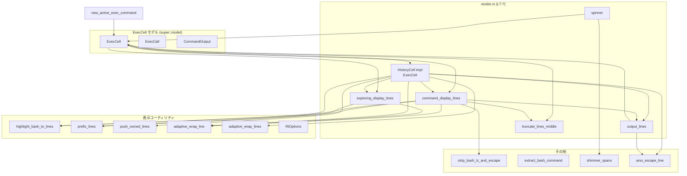
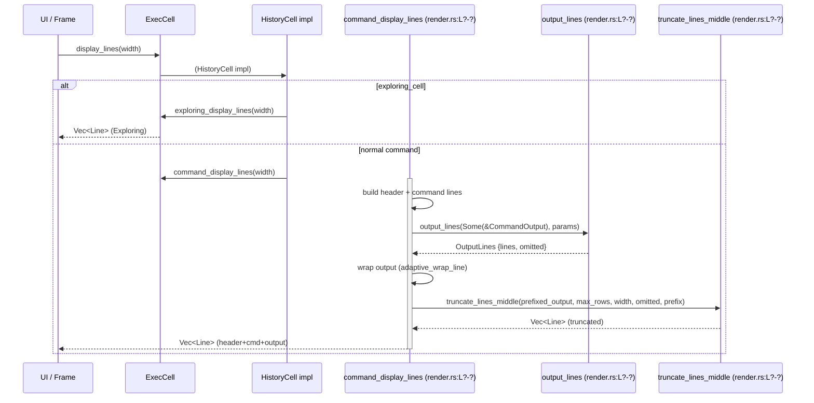
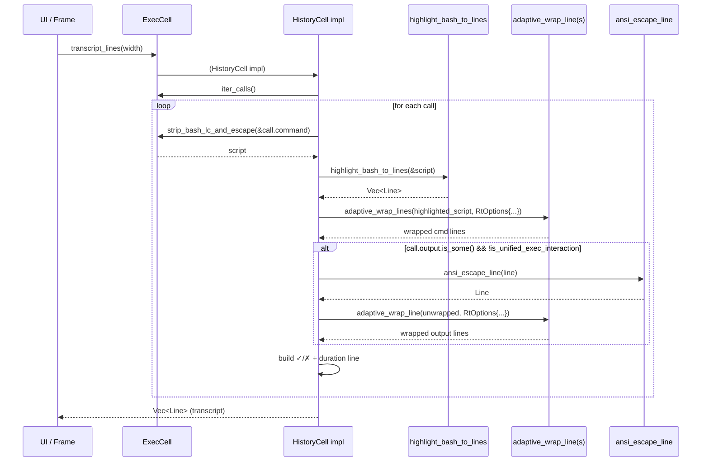

tui/src/exec_cell/render.rs

---

## 0. ざっくり一言

ExecCell（コマンド実行セル）の内容を **ratatui の `Line`/`Span` に変換して表示するためのレンダラ**です。  
コマンド・探索（exploring）・出力・スピナー・省略（ellipsis）・トランスクリプト表示のレイアウトと折り返し・行数制限ロジックを実装しています。

> 注: 提供されたコードには行番号が含まれていないため、本レポートでは位置は `render.rs:L?-?` のように「不明」を明示します。

---

## 1. このモジュールの役割

### 1.1 概要

- このモジュールは ExecCell の内容を **ターミナル UI 上にどう見せるか** を制御するために存在し、次の機能を提供します。
  - 実行中・実行済みコマンド／探索セルの **ヘッダ行＋コマンド行＋出力行** の組み立て
  - 出力の **折り返し（wrap）と論理行／画面行単位のトランケーション（省略）**
  - 出力が省略されたときの **「… +N lines」表示とトランスクリプト（全文）への誘導**
  - トランスクリプトビュー用の **詳細な行リスト生成**

### 1.2 アーキテクチャ内での位置づけ

このファイルは「見た目・レイアウト」層であり、モデル層や解析ロジックを利用しつつ、ratatui のウィジェットに渡せる `Line<'static>` の列を構築します。

主な依存関係の関係を示すと次のようになります。



### 1.3 設計上のポイント

- **責務の分割**
  - コマンドのヘッダ・出力・探索表示などを **専用メソッド** に分割  
    （`command_display_lines`, `exploring_display_lines`, `transcript_lines`, `output_lines` など）。
  - 出力の論理トランケーションと画面行ベースのトランケーションを分離  
    （`output_lines` と `truncate_lines_middle`）。
- **状態の扱い**
  - このファイル自体はほぼ **ステートレス**で、`&ExecCell` から `Vec<Line<'static>>` を生成する関数群です。
  - 時間的な状態は `Instant` として ExecCall/ExecCell に保持され、`spinner` でのみ参照されます。
- **エラーハンドリング**
  - 返り値に `Result` は使わず、前提が崩れた場合に `panic!` を使う箇所があります
    （`command_display_lines` で `calls` が 1 件であることを仮定）。
  - その他の分岐は Option や bool を用いた **早期 return** で処理しています（`output_lines` など）。
- **安全性（Rust 言語特性）**
  - すべての公開 API は `&self` または値の所有権を受け取るだけで、**共有可変状態やスレッド操作は行いません**。
  - 文字列操作・ベクタ操作が中心で、未初期化メモリや `unsafe` は登場しません。
- **表示性能**
  - 折り返し後の **「画面行数」ベースで出力を制限**するため、極端に長い URL や長大な出力でも viewport を埋め尽くさないようになっています（`truncate_lines_middle`、テストで検証）。

---

## 2. 主要な機能一覧

- ExecCell の新規作成: `new_active_exec_command` – 実行中セルのモデルを構築します。
- 出力行の論理トランケーション: `output_lines` – コマンド出力を論理行ベースで間引きつつエリプシス行を挿入します。
- 実行中インジケータ（スピナー）描画: `spinner` – 経過時間とカラー対応に応じたスピナー `Span` を返します。
- HistoryCell 実装: `display_lines` / `transcript_lines` – 通常表示用とトランスクリプト用の行列を構築します。
- コマンド表示レイアウト: `ExecCell::command_display_lines` – ヘッダ・コマンド本体・出力を組み合わせて表示行を生成します。
- Exploring 表示レイアウト: `ExecCell::exploring_display_lines` – 解析中（Read/List/Search）コマンドの要約表示を生成します。
- 画面行ベースのトランケーション: `ExecCell::truncate_lines_middle` – 折り返し後の行数を基準に中央を省略してヘッドとテイルを残します。
- 行数制限ユーティリティ: `ExecCell::limit_lines_from_start`, `ExecCell::ellipsis_line` – 先頭 N 行だけ残し、残りはエリプシスにまとめます。
- レイアウト定義: `PrefixedBlock`, `ExecDisplayLayout`, `EXEC_DISPLAY_LAYOUT` – コマンド継続行と出力ブロックのプレフィクスや行数上限を定義します。
- 省略行テキスト生成: `ExecCell::output_ellipsis_text` など – `… +N lines (ctrl + t to view transcript)` の生成と行数算出。

---

## 3. 公開 API と詳細解説

### 3.1 型一覧（構造体・列挙体など）

| 名前 | 種別 | 役割 / 用途 | 定義位置 |
|------|------|-------------|----------|
| `OutputLinesParams` | 構造体 | `output_lines` の挙動を制御するパラメータ（行数制限・エラー出力のみ・プレフィクス有無など） | `render.rs:L?-?` |
| `OutputLines` | 構造体 | 論理的にトランケートされた出力行と省略行数（省略済み論理行数）を保持します | `render.rs:L?-?` |
| `PrefixedBlock` | 構造体 | ブロック（コマンド継続／出力）の先頭行・継続行に付与する文字列プレフィクスと、その見かけ幅に応じた折り返し幅を計算します | `render.rs:L?-?` |
| `ExecDisplayLayout` | 構造体 | コマンドの継続ブロック・出力ブロックの `PrefixedBlock` と、それぞれの最大表示行数をまとめたレイアウト定義 | `render.rs:L?-?` |
| `EXEC_DISPLAY_LAYOUT` | 定数 | `ExecDisplayLayout` のデフォルト設定（継続行プレフィクス `"  │ "`, 出力プレフィクス `"  └ "` など） | `render.rs:L?-?` |
| `TOOL_CALL_MAX_LINES` | 定数 | ツール呼び出し出力の最大論理行数 (5) | `render.rs:L?-?` |
| `USER_SHELL_TOOL_CALL_MAX_LINES` | 定数 | ユーザーシェル呼び出し出力の最大画面行数 (50) | `render.rs:L?-?` |
| `TRANSCRIPT_HINT` | 定数 | トランスクリプトへのショートカット表示 `"ctrl + t to view transcript"` | `render.rs:L?-?` |

※ `ExecCell`, `ExecCall`, `CommandOutput`, `HistoryCell` などは他ファイルで定義されています（`super::model`, `crate::history_cell`）。

---

### 3.2 関数詳細（主要 7 件）

#### `new_active_exec_command(call_id, command, parsed, source, interaction_input, animations_enabled) -> ExecCell`

**概要**  
新たな ExecCall を作成し、それを含む `ExecCell` を「実行中セル」として構築します。開始時刻を現在時刻で初期化し、出力は未設定にします。  
根拠: `ExecCell::new(ExecCall { ... start_time: Some(Instant::now()), ... }, animations_enabled)`（`render.rs:L?-?`）

**引数**

| 引数名 | 型 | 説明 |
|--------|----|------|
| `call_id` | `String` | 呼び出し ID。履歴識別などに使用。 |
| `command` | `Vec<String>` | 実際に実行されるコマンドと引数のリスト。 |
| `parsed` | `Vec<ParsedCommand>` | コマンド解析結果（Read/List/Search など）。 |
| `source` | `ExecCommandSource` | 実行元（エージェント・ユーザーシェル等）。 |
| `interaction_input` | `Option<String>` | 統合インタラクション時に送信した入力（任意）。 |
| `animations_enabled` | `bool` | スピナーなどのアニメーション表示を有効にするかどうか。 |

**戻り値**

- `ExecCell` – 1 つの `ExecCall` を含むセル。`output` は `None`、`start_time` は `Some(Instant::now())` になっています。

**内部処理の流れ**

1. 引数から `ExecCall` 構造体を構築する（`output: None`, `duration: None`, `start_time: Some(Instant::now())`）。
2. その `ExecCall` を渡して `ExecCell::new` を呼び出す。
3. `ExecCell` インスタンスを返す。

**Examples（使用例）**

```rust
use codex_protocol::protocol::ExecCommandSource;
use tui::exec_cell::model::ExecCell;

// 新しいユーザーシェルコマンドセルを作成する例
let cell = new_active_exec_command(
    "call-1".to_string(),                     // 呼び出し ID
    vec!["bash".into(), "-lc".into(), "ls".into()], // 実行コマンド
    Vec::new(),                               // 解析情報（未使用）
    ExecCommandSource::UserShell,             // 実行元
    None,                                     // 統合インタラクション入力なし
    true,                                     // アニメーション有効
);
```

**Errors / Panics**

- この関数自身は panic しません。
- `ExecCell::new` の内部で panic するかどうかは、このチャンクには現れません。

**Edge cases（エッジケース）**

- `parsed` が空でも問題なく動作します。
- `interaction_input` を `Some("")`（空文字列）にしても、そのまま保持されます（表示側で空判定されるのは `format_unified_exec_interaction`）。

**使用上の注意点**

- `ExecCell` を「コマンド表示セル」として使う場合、後述の `command_display_lines` は `calls` が 1 件であることを仮定しており、`new_active_exec_command` で作ったセルはこの前提を満たします。

---

#### `output_lines(output: Option<&CommandOutput>, params: OutputLinesParams) -> OutputLines`

**概要**  
`CommandOutput.aggregated_output` の各論理行を、指定した上限までヘッドとテイルを残し、中間を `… +N lines (ctrl + t to view transcript)` で省略した `Line<'static>` の列に変換します。  
根拠: `let lines: Vec<&str> = src.lines().collect();` 以下の処理（`render.rs:L?-?`）

**引数**

| 引数名 | 型 | 説明 |
|--------|----|------|
| `output` | `Option<&CommandOutput>` | コマンドの出力。`None` の場合は空。 |
| `params.line_limit` | `usize` | ヘッド／テイルに残す最大行数。 |
| `params.only_err` | `bool` | `true` の場合、終了コードが 0（成功）なら一切出力しません。 |
| `params.include_angle_pipe` | `bool` | 先頭行のプレフィクスを `"  └ "` にするかどうか。 |
| `params.include_prefix` | `bool` | 各行にインデントプレフィクス（空白など）を付与するか。 |

**戻り値**

- `OutputLines { lines, omitted }`
  - `lines`: `Line<'static>` の列。各行は dim スタイルが付与された `Span` 群。
  - `omitted`: `Some(n)` の場合、中間で省略された **論理行数 n** を表します。

**内部処理の流れ**

1. `output` が `None` の場合、または `only_err == true` かつ `exit_code == 0` の場合は、空の `OutputLines` を返す。
2. `aggregated_output.lines()` で改行ごとのスライスに分割。
3. `head_end = min(total, line_limit)` を計算し、先頭 `head_end` 行を処理:
   - 各行に `ansi_escape_line` を適用して ANSI エスケープをパース。
   - インデントプレフィクス（`include_prefix`/`include_angle_pipe`）を先頭 Span に挿入。
   - すべての Span に dim スタイルを付与。
4. `total > 2 * line_limit` のとき、中間部を省略するため:
   - `omitted = total - 2 * line_limit` と計算し、`ExecCell::output_ellipsis_line(omitted)` を挿入。
5. 残りのテイル部分（末尾 `line_limit` 行など）を同様に処理。
6. `OutputLines { lines: out, omitted }` を返す。

**Examples（使用例）**

```rust
// 簡単な CommandOutput から省略付き行リストを作る例
let output = CommandOutput {
    exit_code: 1,
    aggregated_output: (1..=10).map(|n| n.to_string()).collect::<Vec<_>>().join("\n"),
    formatted_output: String::new(),
};

let rendered = output_lines(
    Some(&output),
    OutputLinesParams {
        line_limit: 2,          // 先頭 2 行＋末尾 2 行を残す
        only_err: false,
        include_angle_pipe: false,
        include_prefix: false,
    },
);

// rendered.lines は 1,2, … +6 lines (ctrl + t ...), 9,10 という構成になる
```

**Errors / Panics**

- この関数内に `panic!` はありません。
- `ExecCell::output_ellipsis_line` の内部も `format!` ベースで panic しない前提です。

**Edge cases（エッジケース）**

- `line_limit == 0` の場合  
  - `head_end` は 0 になり、中間省略ロジックにより **すべての行が省略**として扱われ、エリプシス行だけが返されます。
- `aggregated_output` が空文字の場合  
  - `lines.len() == 0` となり、`show_ellipsis` も `false` のため、空の `OutputLines` を返します。
- 非 ASCII や幅 2 の文字を含む場合  
  - 各行は `ansi_escape_line` 経由で `Span` に分解されますが、幅計算そのものは行っておらず、`Paragraph::line_count` を使う後段処理（`truncate_lines_middle`）側で幅を考慮します。

**使用上の注意点**

- `omitted` は **画面行数ではなく論理行数**です。折り返しによる画面行の増加はカウントしません。
- 実際に viewport で見える行数を制限するには、`output_lines` の後で `truncate_lines_middle` を使う必要があります（`command_display_lines` がその役割を担っています）。

---

#### `spinner(start_time: Option<Instant>, animations_enabled: bool) -> Span<'static>`

**概要**  
ExecCell の左に表示するスピナー（• または ◦、もしくはカラーシマー）を生成します。アニメーション有効時は経過時間によって点滅／シマーを行います。  
根拠: `if !animations_enabled { return "•".dim(); } ...` 以下（`render.rs:L?-?`）

**引数**

| 引数名 | 型 | 説明 |
|--------|----|------|
| `start_time` | `Option<Instant>` | コマンド開始時刻。`None` の場合は経過時間 0 として扱う。 |
| `animations_enabled` | `bool` | アニメーションを有効にするかどうか。 |

**戻り値**

- `Span<'static>` – スピナー用文字列（"•" または "◦" など）を含む Span。

**内部処理の流れ**

1. `animations_enabled == false` の場合は、常に `"•".dim()` を返す。
2. `elapsed = start_time.map(|st| st.elapsed()).unwrap_or_default()` で経過時間を算出。
3. `supports_color::on_cached(Stdout)` で 16M カラー対応かどうかを判定。
   - 16M カラー対応なら `shimmer_spans("•")[0].clone()` でカラーシマーの最初の Span を使用。
   - 非対応なら、`(elapsed.as_millis() / 600).is_multiple_of(2)` によって 600ms ごとに "•" と "◦.dim()" を切り替える。

**Examples（使用例）**

```rust
let started = Some(std::time::Instant::now());
let s1 = spinner(started, true);   // アニメーション有効
let s2 = spinner(started, false);  // 常に dim な "•"
```

**Errors / Panics**

- この関数自身は panic しません。
- `supports_color::on_cached` や `shimmer_spans` が panic するかどうかは、このチャンクには現れません。

**Edge cases（エッジケース）**

- `start_time == None` の場合  
  - `elapsed` は 0 として扱われ、最初の点滅状態（"•" 側）になります。
- 高速に連続呼び出した場合  
  - `Instant::elapsed()` の値に応じて点滅が変わるだけで、副作用はありません。

**使用上の注意点**

- 描画ループ内で何度も呼ばれることを前提に設計されています。外部状態を持たないため、並行スレッドから読んでも安全です。

---

#### `impl HistoryCell for ExecCell::display_lines(&self, width: u16) -> Vec<Line<'static>>`

**概要**  
ExecCell を通常表示する際の行リストを構築します。セルが「探索モード」かどうかに応じて、`exploring_display_lines` または `command_display_lines` を呼び分けます。  
根拠: `if self.is_exploring_cell() { ... } else { ... }`（`render.rs:L?-?`）

**引数**

| 引数名 | 型 | 説明 |
|--------|----|------|
| `self` | `&ExecCell` | 対象セル。 |
| `width` | `u16` | 描画領域の幅（カラム数）。 |

**戻り値**

- `Vec<Line<'static>>` – ratatui `Paragraph` などに渡せる行列。

**内部処理の流れ**

1. `self.is_exploring_cell()` を呼び出し、セルが探索モードかどうかを判定。
2. 探索モードのとき: `self.exploring_display_lines(width)` を呼び出し、その結果を返す。
3. それ以外のとき: `self.command_display_lines(width)` を呼び出し、その結果を返す。

**Examples（使用例）**

```rust
fn render_cell<B: ratatui::backend::Backend>(
    f: &mut ratatui::Frame<B>,
    area: ratatui::layout::Rect,
    cell: &ExecCell,
) {
    let lines = cell.display_lines(area.width);
    let paragraph = ratatui::widgets::Paragraph::new(ratatui::text::Text::from(lines));
    f.render_widget(paragraph, area);
}
```

**Errors / Panics**

- `command_display_lines` 内で `self.calls` が 1 件であることを前提に `panic!` する箇所があります（詳細は後述）。
- `display_lines` 自体は単純な分岐のみです。

**Edge cases（エッジケース）**

- `width == 0` の場合  
  - `exploring_display_lines` では `RtOptions::new(width as usize)` に 0 が渡されます。`RtOptions` の実装によりますが、意図された挙動は「幅 0 のレイアウトは想定しない」と考えられます。
  - 実際のアプリケーションでは、ratatui のレイアウトで幅 0 を渡さない前提と見なすのが自然です。

**使用上の注意点**

- ExecCell の「探索モード」判定ロジック（`is_exploring_cell`）はこのファイル外にあり、この関数はその結果にだけ依存します。

---

#### `impl HistoryCell for ExecCell::transcript_lines(&self, width: u16) -> Vec<Line<'static>>`

**概要**  
セル内の全ての `ExecCall` の **コマンド＋完全な出力＋終了マーク＋経過時間** を含むトランスクリプト行列を生成します。  
根拠: `for (i, call) in self.iter_calls().enumerate() { ... }` 以下（`render.rs:L?-?`）

**引数**

| 引数名 | 型 | 説明 |
|--------|----|------|
| `self` | `&ExecCell` | 対象セル（複数 call を持つこともある）。 |
| `width` | `u16` | 折り返しに用いる幅。 |

**戻り値**

- `Vec<Line<'static>>` – トランスクリプト用の全行（空行を含む）。

**内部処理の流れ（要点）**

1. `self.iter_calls()` で各 `ExecCall` を列挙。call 間には空行を挿入。
2. コマンド部分:
   - `strip_bash_lc_and_escape(&call.command)` でスクリプト部分を抽出・エスケープ。
   - `highlight_bash_to_lines(&script)` で構文ハイライト済み行に変換。
   - `adaptive_wrap_lines` + `RtOptions::new(width)` で `$` / インデント付きに折り返し。
3. 出力部分:
   - `call.output` がある場合、かつ `call.is_unified_exec_interaction()` でない場合のみ:
     - `output.formatted_output.lines()` を `ansi_escape_line` で `Line` に変換。
     - 各行を `adaptive_wrap_line` + `push_owned_lines` で折り返し＆結合。
4. 結果行:
   - `exit_code == 0` なら `"✓".green().bold()`、それ以外なら `"✗".red().bold()` と `" (exit_code)"` を追加。
   - `duration` が `Some` の場合 `format_duration`、`None` の場合 `"unknown"` を使用し、 `" • {duration}"` を dim で付加。

**Examples（使用例）**

```rust
let lines = cell.transcript_lines(80);
// ratatuiの別ペインに全文トランスクリプトとして表示したり、
// desired_transcript_height(width) で必要高さを見積もるときの基礎データとして利用されます。
```

**Errors / Panics**

- このメソッド内に `panic!` はありません。
- `strip_bash_lc_and_escape`, `highlight_bash_to_lines` などのライブラリ関数は、ここからは panic しない前提で使用されています。

**Edge cases（エッジケース）**

- 出力が `None` の call  
  - コマンド行と結果行（✓/✗ + duration）のみが表示されます。
- `duration == None` の call  
  - `"unknown"` として表示されます。
- 幅が非常に狭い場合  
  - `adaptive_wrap_lines` により多くの行に折り返されますが、論理行数自体は変わりません。

**使用上の注意点**

- `formatted_output` を使用しているため、**色やフォーマット付きの出力**をトランスクリプトに含める前提です。
- `is_unified_exec_interaction` の場合は出力本文をスキップし、別種の表示ロジックに任せています。

---

#### `ExecCell::command_display_lines(&self, width: u16) -> Vec<Line<'static>>`

**概要**  
通常の「1 コマンド実行セル」をターミナル上に表示するためのヘッダ・コマンド表示・出力表示を構築します。  
成功／失敗／実行中に応じてバレットの色やタイトル（`Running` / `You ran` / `Ran`）などを切り替え、出力を画面行数ベースでトランケートします。  
根拠: `let [call] = &self.calls.as_slice() else { panic!(...) };` から関数末尾まで（`render.rs:L?-?`）

**引数**

| 引数名 | 型 | 説明 |
|--------|----|------|
| `self` | `&ExecCell` | `calls` に **ちょうど 1 件の ExecCall** を持つセル。 |
| `width` | `u16` | 表示幅。 |

**戻り値**

- `Vec<Line<'static>>` – 1 セル分のヘッダ＋コマンド＋出力行。

**内部処理の流れ（要点）**

1. **前提チェック**: `let [call] = &self.calls.as_slice() else { panic!("Expected exactly one call ...") };`
   - ここで `calls.len() != 1` の場合 panic します（契約条件）。
2. 成功／失敗／実行中を判定してバレット（• の色）を決定。
3. **タイトル**:
   - 統合インタラクション (`is_unified_exec_interaction()`) の場合はタイトル文字列を表示しない。
   - 実行中: `"Running"`, ユーザーシェル: `"You ran"`, それ以外: `"Ran"`。
   - これらを太字にしてヘッダ行の先頭に配置。
4. **コマンド文字列の整形**:
   - 統合インタラクションなら `format_unified_exec_interaction` を使用。
   - それ以外は `strip_bash_lc_and_escape(&call.command)` を使用。
   - `highlight_bash_to_lines` でハイライト済み `Line` の列に変換。
5. **コマンドの折り返し**:
   - 最初の論理行はヘッダ行の右側に連結するため、`width - header_prefix_width` を使用して折り返す。
   - 2 行目以降と 1 行目の残りは `EXEC_DISPLAY_LAYOUT.command_continuation`（`"  │ "`）を使って折り返す。
   - 長いトークンをハイフネーションせずに扱うため、`WordSplitter::NoHyphenation` を使用。
6. **コマンド継続行の論理トランケーション**:
   - `limit_lines_from_start` で継続行数を `command_continuation_max_lines`（デフォルト 2 行）に制限。
   - 溢れた場合は `… +N lines` のエリプシス行を最後に追加（TRANSCRIPT_HINT は付けない）。
7. **出力部分**（`call.output` が `Some` の場合）:
   - 行数上限 `line_limit` をツール or ユーザーシェルで切り替え。
   - `output_lines` でヘッド／テイルとエリプシスを含む論理行列を生成。
   - 描画幅に応じて `adaptive_wrap_line` で折り返した後、`prefix_lines` で `"  └ "` / `"    "` プレフィクスを付加。
   - `truncate_lines_middle` で **画面行数** を `display_limit` に収まるよう中央を省略。
   - 省略された場合のエリプシスには `TRANSCRIPT_HINT` を含める（`output_ellipsis_text` 経由）。
   - 出力が空の場合は `(no output)` を 1 行表示（統合インタラクションでない場合のみ）。

**Examples（使用例）**

```rust
// ExecCell をコマンド表示セルとして描画用行列に変換する
let width: u16 = 80;
let lines = cell.command_display_lines(width);
// ratatui::Paragraph::new(Text::from(lines)) で描画可能
```

**Errors / Panics**

- `self.calls.len() != 1` の場合に `panic!("Expected exactly one call in a command display cell")`。  
  → このメソッドは **「1 call セル」専用**であることが契約です。
- その他の内部処理（wrap, highlight など）で panic は定義されていません。

**Edge cases（エッジケース）**

- 出力なし (`call.output == None`) の場合  
  - コマンドのみ表示され、出力ブロックは表示されません。
- 出力はあるが `aggregated_output` が空文字列のとき  
  - `(no output)` という 1 行のブロックが表示されます（統合インタラクション時は除く）。
- 非常に長い URL やトークン  
  - `WordSplitter::NoHyphenation` により **トークン途中で改行しない**ため、一つの URL は一つの表示行に収まることがテストで検証されています  
    （`command_display_does_not_split_long_url_token` テスト、`render.rs:L?-?`）。

**使用上の注意点**

- `ExecCell` を「探索セル」として利用している場合、このメソッドを直接使うと `panic` の可能性があります。通常は `HistoryCell::display_lines` 経由で呼び出し、探索モードのときは `exploring_display_lines` にフォールバックさせる設計です。
- 出力の表示上限は **画面行数で制限**されるため、`USER_SHELL_TOOL_CALL_MAX_LINES` を増やすときはテスト (`user_shell_output_is_limited_by_screen_lines`) の更新が必要です。

---

#### `ExecCell::truncate_lines_middle(lines, max_rows, width, omitted_hint, ellipsis_prefix) -> Vec<Line<'static>>`

**概要**  
折り返し後の「画面行数」が `max_rows` を超えないよう、ヘッド／テイル部分だけを残して中央をエリプシスで省略します。  
エリプシスは `… +N lines (ctrl + t to view transcript)` 形式で、`N` は **論理行数ベース**で計算されます。  
根拠: コメントと関数本体（`render.rs:L?-?`）

**引数**

| 引数名 | 型 | 説明 |
|--------|----|------|
| `lines` | `&[Line<'static>]` | 対象の論理行リスト（すでにプレフィクス付き）。 |
| `max_rows` | `usize` | 画面上の最大行数（折り返し後の行数）。 |
| `width` | `u16` | 折り返し幅。 |
| `omitted_hint` | `Option<usize>` | すでに上流で省略済みの論理行数。 |
| `ellipsis_prefix` | `Option<Line<'static>>` | エリプシス行の先頭に付けるプレフィクス（出力ガターの揃え用）。 |

**戻り値**

- `Vec<Line<'static>>` – ヘッド部分＋エリプシス行＋テイル部分からなる行列。

**内部処理の流れ（要点）**

1. `max_rows == 0` の場合は空ベクタを返す。
2. 各行の「画面行数」を計算し `line_rows` に格納:
   - 行が空白のみの場合:
     - `line.width().div_ceil(width.max(1))` で概算し、最低 1 行とみなす（空白プレフィクスの出力行を落とさないため）。
   - それ以外:
     - `Paragraph::new(Text::from(vec![line.clone()]))` に `wrap(Wrap { trim: false })` を適用し、`line_count(width)` を取得。
3. `total_rows = sum(line_rows)` が `max_rows` 以下なら、そのまま `lines.to_vec()` を返す。
4. 省略行（エリプシス）の行数を見積もる:
   - `estimated_omitted = omitted_hint.unwrap_or(0) + lines.len().saturating_sub(usize::from(omitted_hint.is_some()))`。
   - `ellipsis_rows = output_ellipsis_row_count(estimated_omitted, width, ellipsis_prefix.as_ref())`。
   - `ellipsis_rows >= max_rows` なら、エリプシス行だけ返す。
5. 使用可能行数 `available_rows = max_rows - ellipsis_rows` をヘッド／テイルに分割:
   - `head_budget = available_rows / 2`, `tail_budget = available_rows - head_budget`。
   - 先頭から `head_budget` を超えない範囲で行を追加。
   - 末尾から `tail_budget` を超えない範囲で行を追加（逆順→あとで反転）。
6. `base = omitted_hint.unwrap_or(0)` とし、新たに隠れる論理行数を `additional` として計算。
7. 最終的なエリプシス行は `base + additional` 行を省略したものとして生成し、ヘッドとテイルに挟んで返す。

**Examples（使用例）**

```rust
// すでに prefix_lines 済みの出力行を 10 画面行以内に収める例
let truncated = ExecCell::truncate_lines_middle(
    &prefixed_output_lines,
    10,        // max_rows
    width,     // viewport 幅
    raw_output.omitted,        // output_lines からの省略ヒント
    Some(Line::from("    ".dim())), // 出力ガターを揃える prefix
);
```

**Errors / Panics**

- 関数内に `panic!` はありません。
- `Paragraph::line_count` が内部で panic するかは ratatui の実装に依存しますが、通常の使用では安全です。

**Edge cases（エッジケース）**

- `max_rows` が非常に小さい（1〜2）の場合:
  - エリプシス行の行数だけで `max_rows` を超えると、エリプシス行のみが返されます。
- `lines` にほぼ空白だけの行が多い場合:
  - 特別扱い (`is_whitespace_only`) によって「行が丸ごと消える」ことを防いでいます。  
    これは `truncate_lines_middle_does_not_truncate_blank_prefixed_output_lines` テストで検証されています。
- `omitted_hint` が `Some(n)` の場合:
  - 新たに隠れた行数と合わせて **論理行数として `n + additional`** を表示します。  
    `truncate_lines_middle_keeps_omitted_count_in_line_units` テストは、このカウントが折り返し行数ではなく論理行数であることを確認しています。

**使用上の注意点**

- この関数は **すでに折り返しを適用した後の `Line` 列に対して適用する**ことを前提としています。  
  これにより「長大な URL が 1 論理行であっても、画面行に換算したときのコスト」を正しく評価できます。
- `width` が 0 の場合、`width.max(1)` を使っているため実質的に幅 1 として扱われますが、そのような使用は想定されていません。

---

### 3.3 その他の関数・メソッド一覧

| 関数名 / メソッド名 | 役割（1 行） | 定義位置 |
|---------------------|--------------|----------|
| `format_unified_exec_interaction` | 統合インタラクション（待機 or 入力送信）の要約テキストを生成します。 | `render.rs:L?-?` |
| `summarize_interaction_input` | 入力文字列を 1 行に整形し、最大文字数までトリムして `...` を付加します。 | `render.rs:L?-?` |
| `spinner` | 前述の通り、スピナー Span を生成します。 | `render.rs:L?-?` |
| `ExecCell::exploring_display_lines` | Read/List/Search/Unknown コマンドを要約して「Exploring/Explored」ビューを構築します。 | `render.rs:L?-?` |
| `ExecCell::output_ellipsis_text` | `… +N lines (ctrl + t to view transcript)` のメッセージ文字列を生成します。 | `render.rs:L?-?` |
| `ExecCell::output_ellipsis_line` | 上記メッセージを dim な `Line` として生成します。 | `render.rs:L?-?` |
| `ExecCell::ellipsis_line` | コマンド継続などで用いる単純な `… +N lines` 行を生成します（TRANSCRIPT_HINT なし）。 | `render.rs:L?-?` |
| `ExecCell::output_ellipsis_row_count` | エリプシス行そのものが何画面行を占めるかを `Paragraph::line_count` で推定します。 | `render.rs:L?-?` |
| `ExecCell::output_ellipsis_line_with_prefix` | プレフィクス付きのエリプシス行を生成します。 | `render.rs:L?-?` |
| `ExecCell::limit_lines_from_start` | 先頭から最大 `keep` 行だけ残し、残りの行数を `… +N lines` で表現します。 | `render.rs:L?-?` |
| `PrefixedBlock::wrap_width` | プレフィクスの表示幅を差し引いた折り返し幅（カラム数）を計算します。 | `render.rs:L?-?` |
| `ExecDisplayLayout::new` | レイアウト構造体のコンストラクタ。 | `render.rs:L?-?` |

---

## 4. データフロー

ここでは代表的なシナリオとして、「ユーザーシェルコマンドの出力を画面に表示する場合」のデータフローを説明します。

### 4.1 処理の要点（コマンド表示）

1. `new_active_exec_command` で `ExecCell` を作成し、実行が完了すると `CommandOutput` が埋められます。
2. 描画ループで `cell.display_lines(width)` が呼ばれます。
3. `display_lines` は探索モードかどうかを判定し、通常コマンドなら `command_display_lines` を呼びます。
4. `command_display_lines` は
   - ヘッダ（スピナー／バレット＋タイトル）
   - コマンド本体（`highlight_bash_to_lines`＋折り返し＋継続行プレフィクス）
   - 出力本体（`output_lines` → 折り返し → `truncate_lines_middle`）
   を組み合わせ、`Vec<Line<'static>>` を返します。
5. 上記行列を ratatui の `Paragraph` などに渡して描画します。

### 4.2 コマンド表示処理のシーケンス図



### 4.3 トランスクリプト処理のシーケンス図



---

## 5. 使い方（How to Use）

### 5.1 基本的な使用方法

ExecCell を作成し、標準ビューとトランスクリプトビューを描画する最小例です。

```rust
use codex_protocol::protocol::ExecCommandSource;
use ratatui::widgets::Paragraph;
use ratatui::text::Text;
use tui::exec_cell::model::ExecCell;
use tui::exec_cell::render::{new_active_exec_command}; // パスは実際のcrate構成に合わせる

fn make_cell() -> ExecCell {
    // 1. 実行中セルを作成
    let cell = new_active_exec_command(
        "call-1".to_string(),
        vec!["bash".into(), "-lc".into(), "echo hello".into()],
        Vec::new(),
        ExecCommandSource::UserShell,
        None,
        true, // animations_enabled
    );
    cell
}

fn render_cell<B: ratatui::backend::Backend>(
    f: &mut ratatui::Frame<B>,
    area: ratatui::layout::Rect,
    cell: &ExecCell,
) {
    // 2. 通常表示用行列を取得
    let lines = cell.display_lines(area.width);
    let para = Paragraph::new(Text::from(lines));
    f.render_widget(para, area);
}

fn render_transcript<B: ratatui::backend::Backend>(
    f: &mut ratatui::Frame<B>,
    area: ratatui::layout::Rect,
    cell: &ExecCell,
) {
    // 3. トランスクリプト用行列を取得
    let lines = cell.transcript_lines(area.width);
    let para = Paragraph::new(Text::from(lines));
    f.render_widget(para, area);
}
```

### 5.2 よくある使用パターン

1. **ユーザーシェルコマンドのヒストリ表示**
   - `ExecCommandSource::UserShell` を指定して `ExecCell` を構築。
   - `command_display_lines` が `USER_SHELL_TOOL_CALL_MAX_LINES` に基づいて出力画面行数を制限します。
2. **ツール呼び出し（Agent）出力のコンパクト表示**
   - `ExecCommandSource::Agent` の場合、`TOOL_CALL_MAX_LINES`（論理行）と `EXEC_DISPLAY_LAYOUT.output_max_lines`（画面行）でより厳しく制限。
3. **探索モード（Exploring）**
   - 複数の `ParsedCommand::Read` や `Search` を含む ExecCell に対して `is_exploring_cell()` が `true` を返すような設計にし、`display_lines` 経由で `exploring_display_lines` を利用します。
   - Read 系コマンドが連続する場合はまとめて 1 行に圧縮されます。

### 5.3 よくある間違い

```rust
// 間違い例: 複数 call を持つセルに対して command_display_lines を直接呼ぶ
let lines = cell.command_display_lines(width); // calls.len() != 1 なら panic!

// 正しい例: HistoryCell::display_lines 経由で呼び分ける
let lines = cell.display_lines(width);
```

```rust
// 間違い例: output_lines の後にそのまま Paragraph に渡し、画面行数を制限したいと思う
let raw = output_lines(Some(&output), params);
let para = Paragraph::new(Text::from(raw.lines)); // 論理行数のみ制限され、
// 長い URL などで画面行数は無制限になりうる。

// 正しい例: 折り返し＋truncate_lines_middle を挟む
let mut wrapped = Vec::new();
for line in &raw.lines {
    push_owned_lines(
        &adaptive_wrap_line(line, RtOptions::new(width as usize)),
        &mut wrapped,
    );
}
let prefixed = prefix_lines(wrapped, "  └ ".dim(), "    ".into());
let trimmed = ExecCell::truncate_lines_middle(
    &prefixed,
    EXEC_DISPLAY_LAYOUT.output_max_lines,
    width,
    raw.omitted,
    Some(Line::from("    ".dim())),
);
let para = Paragraph::new(Text::from(trimmed));
```

### 5.4 使用上の注意点（まとめ）

- **契約条件**
  - `ExecCell::command_display_lines` は `self.calls.len() == 1` を前提としており、違反すると `panic!` します。
  - 探索セルや複数 call セルには `display_lines` を使うのが前提です。
- **出力の制限単位**
  - `output_lines` は **論理行数**ベース、`truncate_lines_middle` は **画面行数**ベースで制限します。
  - ユーザーシェル用の `USER_SHELL_TOOL_CALL_MAX_LINES` は画面行数に対する上限です（テストで保証）。
- **幅 0 の扱い**
  - 一部ロジックでは `width.max(1)` で幅 0 を避けていますが、`exploring_display_lines` などは幅 0 を想定していません。  
    実際の UI レイアウトでは、幅 0 の領域にセルを描画しない設計が必要です。
- **パフォーマンス**
  - 折り返しと `Paragraph::line_count` 計算は出力行数に比例してコストがかかります。
  - 長大な出力に対しては `output_lines` と `truncate_lines_middle` による制限がかかるため、viewport を著しく圧迫しないように配慮されています。
- **並行性**
  - ここで扱う関数はすべて `&self` または所有権を受け取る純粋処理であり、共有可変状態や `unsafe` は登場しません。
  - マルチスレッド環境で使う場合も、このファイルに関する限りはデータ競合の懸念はありません（ExecCell 自体の Send/Sync は別途の型定義に依存します）。

---

## 6. 変更の仕方（How to Modify）

### 6.1 新しい機能を追加する場合

例: 「出力エリプシスに ‘N more lines’ のような追加情報を載せたい」

1. **エリプシス文字列の生成を確認**
   - `ExecCell::output_ellipsis_text` が `… +{omitted} lines ({TRANSCRIPT_HINT})` を生成しています。
2. **変更ポイント**
   - 文言を変更する場合は `output_ellipsis_text` のみを変更すれば、  
     - `output_lines` のエリプシス
     - `truncate_lines_middle` 経由のエリプシス  
     の両方に反映されます。
3. **テストの更新**
   - `output_lines_ellipsis_includes_transcript_hint` と  
     `truncate_lines_middle_keeps_omitted_count_in_line_units` など、エリプシス文言に依存しているテストを更新する必要があります。

別例: 「探索表示に新しい ParsedCommand バリアントを追加したい」

1. `ParsedCommand` の新バリアント定義を確認（`codex_protocol::parse_command` 側）。
2. `ExecCell::exploring_display_lines` の `match parsed` 部分に新バリアントの表示ロジックを追加。
3. 可能なら新しいテスト（URL・長いトークンが 1 行に収まるかなど）を追加。

### 6.2 既存の機能を変更する場合

- **影響範囲の確認**
  - `output_lines`, `truncate_lines_middle`, `command_display_lines` は互いに強く結合しているため、どれかを変更すると全体の出力レイアウトに影響します。
  - テストモジュールにはレイアウト・行数・エリプシス文言に依存したテストが多数あるので、変更後は必ず全テストの実行が必要です。
- **契約の保持**
  - `truncate_lines_middle` のコメントにある通り、`omitted` カウンタは「論理行単位」であることが契約です。画面行数に変えないよう注意が必要です。
  - `command_truncation_ellipsis_does_not_include_transcript_hint` テストが示すように、  
    コマンド継続のエリプシス（`ellipsis_line`）には TRANSCRIPT_HINT を含めてはいけません。
- **テストと使用箇所の再確認**
  - 出力行数上限やプレフィクス文字列を変えた場合、  
    - テストケースの期待文字列
    - 他モジュールでのレイアウト前提（例: 他ペインとの整列）  
    に影響する可能性があります。

---

## 7. 関連ファイル

| パス | 役割 / 関係 |
|------|------------|
| `tui/src/exec_cell/model.rs`（推定） | `ExecCell`, `ExecCall`, `CommandOutput` の定義と `ExecCell::new`、`is_active`, `is_exploring_cell`, `iter_calls` などのメソッドを提供します。 |
| `tui/src/history_cell.rs` | `HistoryCell` トレイトを定義し、本モジュールで `impl HistoryCell for ExecCell` を提供しています。 |
| `tui/src/render/highlight.rs` | `highlight_bash_to_lines` による bash コマンドの構文ハイライト行生成を提供します。 |
| `tui/src/render/line_utils.rs` | `prefix_lines`, `push_owned_lines` など、`Line` 列のプレフィクス付与・所有権移動ユーティリティを提供します。 |
| `tui/src/wrapping.rs` | `RtOptions`, `adaptive_wrap_line`, `adaptive_wrap_lines` による折り返し設定と実装を提供します。 |
| `tui/src/exec_command.rs` | `strip_bash_lc_and_escape` により、`bash -lc` ラッパーの除去とエスケープ処理を行います。 |
| `tui/src/shimmer.rs` | `shimmer_spans` で 16M カラー環境用のシマー（虹色）スピナーを生成します。 |
| `codex_protocol::parse_command` | `ParsedCommand` 型を定義し、Read/List/Search/Unknown などの解析結果バリアントを提供します。 |
| `codex_protocol::protocol` | `ExecCommandSource`（UserShell/Agentなど）の定義を提供します。 |

---

### テストのカバレッジ（補足）

`#[cfg(test)] mod tests` では主に次の性質が検証されています（いずれも `render.rs:L?-?`）:

- 出力の画面行数制限とエリプシス挿入挙動  
  (`user_shell_output_is_limited_by_screen_lines`)
- `truncate_lines_middle` における省略行数カウントが論理行単位であること  
  (`truncate_lines_middle_keeps_omitted_count_in_line_units`)
- 論理トランケーションのエリプシスに TRANSCRIPT_HINT が含まれること  
  (`output_lines_ellipsis_includes_transcript_hint`)
- コマンド継続エリプシスに TRANSCRIPT_HINT が含まれないこと  
  (`command_truncation_ellipsis_does_not_include_transcript_hint`)
- プレフィクスのみの空白行がトランケーションで失われないこと  
  (`truncate_lines_middle_does_not_truncate_blank_prefixed_output_lines`)
- コマンド／探索／出力の URL/URL 風トークンが 1 行に収まること  
  (`command_display_does_not_split_long_url_token` など複数)
- `desired_transcript_height` が折り返し後の行数を考慮すること  
  (`desired_transcript_height_accounts_for_wrapped_url_like_rows`)

これらのテストは、レイアウトや省略ロジックの契約を壊していないかを確認する上で重要な指標になります。
