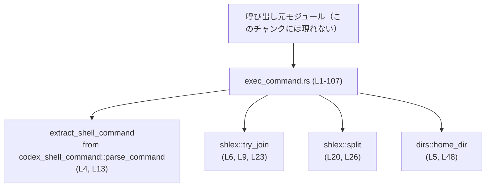
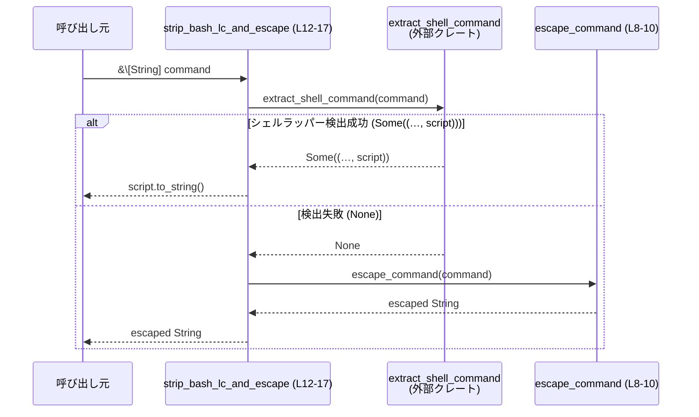

# tui/src/exec_command.rs コード解説

## 0. ざっくり一言

シェルコマンドとファイルパスを、人間に読みやすくかつ安全に扱うためのユーティリティ関数群です。  
コマンド配列（`Vec<String>`）のエスケープ付き文字列化／逆変換と、絶対パスのホームディレクトリ相対化を行います（`tui/src/exec_command.rs:L8-51`）。

---

## 1. このモジュールの役割

### 1.1 概要

- このモジュールは **シェルコマンドの表示・解析** と **ホームディレクトリ相対パスの計算** を行うユーティリティ関数を提供します（`tui/src/exec_command.rs:L8-51`）。
- 主な機能は以下です。
  - `escape_command`: `&[String]` からシェルエスケープ済みの 1 行文字列を生成。
  - `strip_bash_lc_and_escape`: `bash -lc ...` や `zsh -lc ...` のようなラッパーを剥がして中身だけ取り出し、必要ならエスケープ。
  - `split_command_string`: シェル風の 1 行コマンド文字列を `Vec<String>` に分解し、ラウンドトリップできない場合は安全側に倒す。
  - `relativize_to_home`: 絶対パスがホーム以下ならホーム相対に変換。

これらの関数がどのモジュールから呼ばれているかは、このチャンクからは分かりません。

### 1.2 アーキテクチャ内での位置づけ

外部クレートとの依存関係を示す簡易図です。



- 呼び出し元（例えば TUI の表示ロジックやコマンド実行ロジック）は、このファイルには現れていません。
- このモジュールは、**外部クレートに依存する純粋なヘルパー群**として位置づけられています。

### 1.3 設計上のポイント

コードから読み取れる設計上の特徴は次のとおりです。

- **ステートレスな関数群**
  - すべての関数は入力引数のみを受け取り、戻り値を返すだけで、内部で状態を保持しません（`tui/src/exec_command.rs:L8-51`）。
  - グローバル可変状態やスレッドローカルは使っておらず、関数自体は複数スレッドから同時に呼び出してもレースコンディションを起こさない構造になっています。

- **エラーはできるだけ「安全なデフォルト」にフォールバック**
  - `escape_command` は `shlex::try_join` のエラーを検出した場合、パニックせずに単純な `" "` 連結にフォールバックします（`tui/src/exec_command.rs:L8-10`）。
  - `split_command_string` は **分割した結果が元の文字列と整合しない場合** は分割を諦めて「元の文字列 1 要素のベクタ」を返します（`tui/src/exec_command.rs:L20-32`）。
  - `relativize_to_home` は判定できない場合（相対パス／ホーム不明／ホーム外）は `None` を返します（`tui/src/exec_command.rs:L42-50`）。

- **UNIX / Windows を意識したヒューリスティクス**
  - `split_command_string` は `:\` を含むコマンド（例: `C:\...`）を特別扱いし、Windows パスの誤パースを避けるロジックになっています（`tui/src/exec_command.rs:L26-27`）。
  - テストにも Windows 風コマンドのケースが含まれています（`tui/src/exec_command.rs:L103-105`）。

- **ドキュメントコメントと実装の差異**
  - `relativize_to_home` の doc コメントは「ホーム外ならパスをそのまま返す」と書かれていますが（`tui/src/exec_command.rs:L35-37`）、実装はホーム外のパスでは `None` を返します（`tui/src/exec_command.rs:L48-50`）。
  - コメントと実装の契約が一致していない点は注意が必要です。

---

## 2. 主要な機能一覧

### 2.1 コンポーネント一覧（関数・テスト）

| 名前 | 種別 | 公開範囲 | 役割 / 用途 | 定義位置 |
|------|------|-----------|-------------|----------|
| `escape_command` | 関数 | `pub(crate)` | `&[String]` をシェルエスケープ済み 1 行文字列に変換 | `tui/src/exec_command.rs:L8-10` |
| `strip_bash_lc_and_escape` | 関数 | `pub(crate)` | `bash -lc` / `zsh -lc` などのシェルラッパーを剥がして中身のスクリプト文字列を返す。該当しなければ `escape_command` にフォールバック | `tui/src/exec_command.rs:L12-17` |
| `split_command_string` | 関数 | `pub(crate)` | シェル風コマンド文字列を `Vec<String>` に分割。ラウンドトリップ検証に失敗した場合は `vec![command]` を返す | `tui/src/exec_command.rs:L19-33` |
| `relativize_to_home` | 関数 | `pub(crate)` | 絶対パスがホームディレクトリ以下であればホーム相対パスを返す | `tui/src/exec_command.rs:L38-50` |
| `tests` | モジュール | `cfg(test)` | 本モジュールの単体テストを格納 | `tui/src/exec_command.rs:L53-107` |
| `test_escape_command` | テスト関数 | `#[test]` | `escape_command` の基本的なエスケープ挙動を検証 | `tui/src/exec_command.rs:L57-62` |
| `test_strip_bash_lc_and_escape` | テスト関数 | `#[test]` | `strip_bash_lc_and_escape` の bash / zsh / 絶対パス版に対する動作を検証 | `tui/src/exec_command.rs:L64-85` |
| `split_command_string_round_trips_shell_wrappers` | テスト関数 | `#[test]` | `split_command_string` が `shlex::try_join` からのラウンドトリップに成功するケースを検証 | `tui/src/exec_command.rs:L87-100` |
| `split_command_string_preserves_non_roundtrippable_windows_commands` | テスト関数 | `#[test]` | Windows 風コマンド文字列を分割せずに 1 要素として保持することを検証 | `tui/src/exec_command.rs:L102-105` |

### 2.2 機能の箇条書き一覧

- コマンド引数配列のシェルエスケープ文字列化（`escape_command`）。
- bash / zsh の `-lc` ラッパー検出と中身のスクリプト抽出（`strip_bash_lc_and_escape`）。
- 文字列コマンドの安全な分割とラウンドトリップ検証（`split_command_string`）。
- 絶対パスのホームディレクトリ相対化（`relativize_to_home`）。

---

## 3. 公開 API と詳細解説

### 3.1 型一覧（構造体・列挙体など）

このファイル内で新たに定義される構造体・列挙体はありません。  
標準ライブラリや外部クレートの型を利用しています。

- `Path`, `PathBuf`（`std::path`）: ファイルパス表現（`tui/src/exec_command.rs:L1-2, L38-50`）。
- `Option<T>`: 値の存在／非存在を表す型。`relativize_to_home` の戻り値で使用（`tui/src/exec_command.rs:L38-50`）。

### 3.2 主要関数の詳細

#### `escape_command(command: &[String]) -> String`

**概要**

- コマンド引数のリスト（`&[String]`）から、シェルエスケープ済みの 1 行コマンド文字列を生成します（`tui/src/exec_command.rs:L8-10`）。
- `shlex::try_join` による POSIX 風クオーティングを試み、失敗時には `" "` で単純結合した文字列にフォールバックします。

**引数**

| 引数名 | 型 | 説明 |
|--------|----|------|
| `command` | `&[String]` | コマンド名とその引数を格納した文字列スライス。各要素は 1 引数単位です（`tui/src/exec_command.rs:L8`）。 |

**戻り値**

- `String`: シェルに渡せる 1 行のコマンド文字列。  
  - 可能な限り `shlex::try_join` により安全にエスケープされています（`tui/src/exec_command.rs:L9`）。
  - `try_join` がエラーになった場合は、各要素を `" "` で連結した文字列になります（`tui/src/exec_command.rs:L9`）。

**内部処理の流れ**

1. `command.iter().map(String::as_str)` で `&String` のイテレータを `&str` のイテレータに変換します（`tui/src/exec_command.rs:L9`）。
2. `shlex::try_join` にそのイテレータを渡し、シェルエスケープ済みのコマンド文字列生成を試みます（`tui/src/exec_command.rs:L6, L9`）。
3. `try_join` が `Ok` の場合はその文字列を返します。
4. `try_join` が `Err` の場合は `unwrap_or_else` のクロージャが実行され、`command.join(" ")` で `" "` 区切りに単純結合した文字列を返します（`tui/src/exec_command.rs:L9`）。

**使用例**

テストコードに基づく具体例です（`tui/src/exec_command.rs:L57-62`）。

```rust
// コマンド引数の配列を用意する
let args = vec!["foo".to_string(),
                "bar baz".to_string(),      // スペースを含む引数
                "weird&stuff".to_string()]; // 特殊文字を含む引数

// escape_command でシェルエスケープ付き文字列へ変換する
let cmdline = escape_command(&args);

// cmdline は "foo 'bar baz' 'weird&stuff'" になる（テストより）
assert_eq!(cmdline, "foo 'bar baz' 'weird&stuff'");
```

**Errors / Panics**

- `shlex::try_join` がエラーを返しても `unwrap_or_else` で補足されるため、このパスでパニックは発生しません（`tui/src/exec_command.rs:L9`）。
- 理論上はメモリ不足などにより `String` の生成時にパニックする可能性はありますが、それは Rust 全般に共通する挙動であり、この関数固有のものではありません。

**Edge cases（エッジケース）**

- `command` が空（`&[]`）の場合:
  - `try_join` の挙動は `shlex` の実装に依存しますが、少なくともパニックせず、`Ok` または `Err` のどちらかとして処理されます。
  - `Err` の場合は `command.join(" ")` により空文字列が返ると考えられます（`join` は空スライスで空文字列を返す仕様）。
- 各要素に改行や制御文字を含む場合:
  - `try_join` がエラーになる可能性があります。その場合はフォールバックとして `" "` で連結しただけの文字列になります（`tui/src/exec_command.rs:L9`）。

**使用上の注意点**

- 出力は **あくまで POSIX シェル用のクオーティングに基づく** ため、Windows の `cmd.exe` などでは期待どおりに解釈されない可能性があります。  
  （`shlex` が POSIX 風のシンタックスを想定しているため。根拠: 使用しているのが `shlex` であること `tui/src/exec_command.rs:L6`）
- `try_join` 失敗時は単純連結になるため、「必ずクオートされる」とは限りません。この前提でセキュリティ上の判断（完全に安全なエスケープ前提等）を行うのは避けるべきです。

---

#### `strip_bash_lc_and_escape(command: &[String]) -> String`

**概要**

- `["bash", "-lc", "echo hello"]` や `["/bin/zsh", "-lc", "script"]` のような **bash / zsh の `-lc` ラッパー付きコマンド**から、中身のスクリプト部分を取り出して文字列として返します（`tui/src/exec_command.rs:L12-17, L65-84`）。
- ラッパーでない場合は `escape_command` を用いて通常のエスケープ済み文字列を返します（`tui/src/exec_command.rs:L16`）。

**引数**

| 引数名 | 型 | 説明 |
|--------|----|------|
| `command` | `&[String]` | bash / zsh などのシェル呼び出しを含むコマンド引数列。 |

**戻り値**

- `String`:
  - シェルラッパーが認識された場合: スクリプト部分（例: `"echo hello"`）をそのまま `String` にしたもの（`tui/src/exec_command.rs:L13-15, L65-84`）。
  - 認識されなかった場合: `escape_command(command)` の結果（`tui/src/exec_command.rs:L16`）。

**内部処理の流れ**

1. `extract_shell_command(command)` を呼び出し、シェルラッパー構造（例: `bash -lc SCRIPT`）を解析します（`tui/src/exec_command.rs:L4, L13`）。
2. `extract_shell_command` が `Some((_, script))` を返した場合、その `script` を `to_string()` で `String` に変換して即座に返します（`tui/src/exec_command.rs:L13-15`）。
3. `extract_shell_command` が `None` の場合は、ラッパーでないとみなし、`escape_command(command)` を呼び出してその結果を返します（`tui/src/exec_command.rs:L16`）。

**使用例**

テストが示す動作例です（`tui/src/exec_command.rs:L64-85`）。

```rust
// bash -lc の例
let args = vec!["bash".into(), "-lc".into(), "echo hello".into()];
let cmdline = strip_bash_lc_and_escape(&args);
assert_eq!(cmdline, "echo hello");

// zsh -lc の例
let args = vec!["/usr/bin/zsh".into(), "-lc".into(), "echo hello".into()];
let cmdline = strip_bash_lc_and_escape(&args);
assert_eq!(cmdline, "echo hello");
```

**Errors / Panics**

- `extract_shell_command` の戻り値が `Option` であり、`unwrap` などは使用していないため、この関数内でパニックを起こす可能性は低いです（`tui/src/exec_command.rs:L13, L16`）。
- `escape_command` 同様、メモリ確保失敗などの一般的な例外を除き、想定される panics はありません。

**Edge cases**

- `command` が空、あるいはシェルラッパー構造でない場合:
  - `extract_shell_command` が `None` を返し、`escape_command` の結果が返ります（`tui/src/exec_command.rs:L16`）。
- `extract_shell_command` がどのような条件で `Some` を返すかは、このファイルからは分かりません（外部クレートの実装に依存）。

**使用上の注意点**

- **bash / zsh 以外のシェルラッパー**（例: `fish`）がサポートされているかどうかは `extract_shell_command` の実装依存であり、このチャンクからは判断できません。
- この関数の戻り値は「ラッパーを含まないスクリプト部分」になるため、それをそのまま `split_command_string` に渡すと、元の引数列とは異なる分解になる可能性があります（例: `"echo hello"` → `["echo", "hello"]`）。  
  呼び出し側では「表示用」か「再実行用」かの用途を区別して使う必要があります。

---

#### `split_command_string(command: &str) -> Vec<String>`

**概要**

- シェル風コマンド文字列を `Vec<String>` に分解します（`tui/src/exec_command.rs:L19-33`）。
- ただし、**分解後に再度 `shlex::try_join` した文字列が元と整合しない場合**は、安全側として分解を諦め、元の `command` を 1 要素とするベクタを返します。
- Windows 風パス（`C:\...`）を含む場合の誤パースを避けるヒューリスティクスが入っています（`tui/src/exec_command.rs:L26-27`）。

**引数**

| 引数名 | 型 | 説明 |
|--------|----|------|
| `command` | `&str` | シェル風の 1 行コマンド文字列。 |

**戻り値**

- `Vec<String>`:
  - 安全にラウンドトリップできると判断できた場合: 分解された引数列。
  - それ以外の場合（パース失敗・非ラウンドトリップ・Windows パスを含み検証不可など）: `vec![command.to_string()]`。

**内部処理の流れ**

1. `shlex::split(command)` を呼び、文字列をトークン列に分解しようとする（`tui/src/exec_command.rs:L20`）。
   - 失敗した場合（`None`）は `vec![command.to_string()]` を返す（`tui/src/exec_command.rs:L21`）。
2. 分解に成功した場合（`Some(parts)`）は `shlex::try_join(parts.iter().map(String::as_str))` を実行して、トークン列から再度 1 行文字列を生成する（`tui/src/exec_command.rs:L23`）。
3. 次の条件を満たすときにのみ分解結果 `parts` を採用する（`tui/src/exec_command.rs:L24-29`）。
   - `round_trip == command`（1 回の join で完全一致）、または
   - `!command.contains(":\\")` かつ `shlex::split(&round_trip).as_ref() == Some(&parts)`  
     （Windows パスを含まない & 再 split しても同じ `parts` になる）
4. 上記条件に一致しない場合は `_` パターンにマッチし、`vec![command.to_string()]` を返す（`tui/src/exec_command.rs:L31`）。

**使用例**

テストを基にした例です（`tui/src/exec_command.rs:L87-100`）。

```rust
// まず shlex::try_join でコマンド文字列を作る（テストと同じパターン）
let command = shlex::try_join([
    "/bin/zsh",
    "-lc",
    r#"python3 -c 'print("Hello, world!")'"#,
]).expect("round-trippable command");

// split_command_string で分解すると元の 3 要素に戻る
let args = split_command_string(&command);
assert_eq!(
    args,
    vec![
        "/bin/zsh".to_string(),
        "-lc".to_string(),
        r#"python3 -c 'print("Hello, world!")'"#.to_string(),
    ]
);
```

Windows 風コマンドの例（`tui/src/exec_command.rs:L102-105`）。

```rust
let command = r#"C:\Program Files\Git\bin\bash.exe -lc "echo hi""#;
// Windows パスを含むため、誤パースを避けるため 1 要素のまま返る
let args = split_command_string(command);
assert_eq!(args, vec![command.to_string()]);
```

**Errors / Panics**

- `shlex::split` の結果が `None` でも `Vec` にフォールバックするため、この関数内で `unwrap` によるパニックはありません（`tui/src/exec_command.rs:L20-22, L31`）。
- `shlex::try_join` も `match` の `_` アームに送られるだけでエラーが表面化しないため、ここでもパニックはしません（`tui/src/exec_command.rs:L23-32`）。

**Edge cases**

- コマンド文字列が複雑で `shlex::split` が失敗した場合:
  - 分解せず `vec![command.to_string()]` を返します（`tui/src/exec_command.rs:L20-22`）。
- Windows パス（`C:\` を含む）のとき:
  - `command.contains(":\\")` が `true` になり、`round_trip` 文字列に対して 2 回目の `split` による検証を行いません（`tui/src/exec_command.rs:L26-27`）。
  - ラウンドトリップ条件によっては、あえて分解結果を採用しない可能性があります。
- 空文字列のとき:
  - `shlex::split("")` の挙動は `shlex` の実装依存です。このチャンクからは、`Some(vec![])` なのか `None` なのかは分かりません。
  - `None` の場合は `vec!["".to_string()]` になります（`tui/src/exec_command.rs:L20-22`）。

**使用上の注意点**

- この関数は「**安全にラウンドトリップできる場合だけ分解結果を採用する**」というポリシーを持っています。
  - そのため、常に「見た目どおりに分解される」とは限らず、状況によっては元の文字列を 1 要素として返すことがあります。
- `escape_command` → `split_command_string` の往復が **必ずしも恒等変換ではない** 点に注意が必要です。  
  Windows 風コマンドや特殊なクォートを含む場合、`split_command_string` はあえて分解しない選択をするためです。

---

#### `relativize_to_home<P>(path: P) -> Option<PathBuf> where P: AsRef<Path>`

**概要**

- 絶対パスがホームディレクトリ以下にあれば、ホームディレクトリを起点とした相対パスに変換します（`tui/src/exec_command.rs:L38-50`）。
- 相対パス・ホーム外のパス・ホームディレクトリ不明の場合は `None` を返します。

**引数**

| 引数名 | 型 | 説明 |
|--------|----|------|
| `path` | `P`（`AsRef<Path>` を実装） | チェック対象のパス。`&Path`, `PathBuf`, `&str` などが渡せます（`tui/src/exec_command.rs:L38-40, L42`）。 |

**戻り値**

- `Option<PathBuf>`:
  - `Some(rel)`:
    - `path` が絶対パスかつホーム以下である場合、そのホームからの相対パス（`tui/src/exec_command.rs:L48-50`）。
    - `path == HOME` の場合は「空のパス」（`PathBuf::new()`）を返します。これは doc コメントにも明記されています（`tui/src/exec_command.rs:L35-37, L49-50`）。
  - `None`:
    - `path` が絶対パスでない（`tui/src/exec_command.rs:L43-45`）。
    - `dirs::home_dir()` が `None` を返した（ホームディレクトリ不明）（`tui/src/exec_command.rs:L48`）。
    - `path` がホームディレクトリの外であり、`strip_prefix` に失敗した（`tui/src/exec_command.rs:L49`）。

**内部処理の流れ**

1. `path.as_ref()` で `&Path` に変換します（`tui/src/exec_command.rs:L42`）。
2. `path.is_absolute()` が `false` であれば `None` を返します（`tui/src/exec_command.rs:L43-45`）。
3. `home_dir = dirs::home_dir()?` でホームディレクトリパスを取得します。  
   - `home_dir` が取得できなければ `None` が返ります（`tui/src/exec_command.rs:L48`）。
4. `path.strip_prefix(&home_dir).ok()?` で `path` からホームディレクトリ部分を削除し、相対パス部分を取得します（`tui/src/exec_command.rs:L49`）。
   - `strip_prefix` が `Err` を返した場合（ホーム外）は `None` を返します。
5. `rel.to_path_buf()` で所有権を持つ `PathBuf` に変換し、`Some(rel_path)` として返します（`tui/src/exec_command.rs:L49-50`）。

**使用例**

```rust
use std::path::PathBuf;

// 例: ホームディレクトリが /home/alice だとする
let abs = PathBuf::from("/home/alice/projects/myapp");

// ホーム以下なので Some("projects/myapp") が返る想定
if let Some(rel) = relativize_to_home(&abs) {
    println!("相対パス: {}", rel.display());
}

// 相対パスの場合は None
let rel_input = PathBuf::from("projects/myapp");
assert!(relativize_to_home(&rel_input).is_none());
```

（ホームディレクトリの実際の値は `dirs::home_dir` の実装と環境変数に依存します。）

**Errors / Panics**

- `?` 演算子を用いて `Option` を伝播しているだけであり、`unwrap` 等を使っていないため、想定される panics はありません（`tui/src/exec_command.rs:L48-49`）。
- メモリ関連の一般的なパニックのみが考えられます。

**Edge cases**

- `path` が相対パス:
  - 早期に `None` が返されます（`tui/src/exec_command.rs:L43-45`）。
- ホームディレクトリが取得できない（コンテナ内の特殊環境など）:
  - `home_dir()` が `None` の場合、`None` を返します（`tui/src/exec_command.rs:L48`）。
- `path` がホームディレクトリそのもの:
  - `strip_prefix` 結果は空パスとなり、`Some(PathBuf::new())` が返ります（`tui/src/exec_command.rs:L49-50`）。
- `path` がホーム外（例: `/etc/passwd`）:
  - `strip_prefix` が `Err` になり `None` が返ります（`tui/src/exec_command.rs:L49`）。

**使用上の注意点**

- doc コメントには「ホーム外なら元のパスを返す」と読める記述がありますが（`tui/src/exec_command.rs:L35-37`）、実装はホーム外パスで `None` を返します（`tui/src/exec_command.rs:L48-50`）。  
  呼び出し側で `None` を「ホーム外」と解釈している可能性があります。
- `Some` が返ってくるのは「絶対パスでかつホーム以下」の場合に限定されるため、呼び出し側は `None` を扱うロジック（ホスト上の絶対パスをそのまま表示する等）を用意する必要があります。

---

### 3.3 その他の関数

公開 API ではありませんが、テスト関数について簡単にまとめます。

| 関数名 | 役割（1 行） | 根拠 |
|--------|--------------|------|
| `test_escape_command` | `escape_command` がスペース・特殊文字を正しくクォートすることを検証 | `tui/src/exec_command.rs:L57-62` |
| `test_strip_bash_lc_and_escape` | bash / zsh / 絶対パス付きのラッパーが正しくスクリプト部分 `"echo hello"` のみに変換されることを検証 | `tui/src/exec_command.rs:L64-85` |
| `split_command_string_round_trips_shell_wrappers` | `shlex::try_join` されたコマンド文字列から元の 3 要素の引数列に戻ることを検証 | `tui/src/exec_command.rs:L87-100` |
| `split_command_string_preserves_non_roundtrippable_windows_commands` | Windows 風コマンド文字列を分解せず 1 要素として返すことを検証 | `tui/src/exec_command.rs:L102-105` |

---

## 4. データフロー

ここでは代表的なシナリオとして、「シェルラッパー付きコマンドの表示文字列生成」のデータフローを示します。

- 入力: `Vec<String>` 形式のコマンド列（例: `["bash", "-lc", "echo hello"]`）（`tui/src/exec_command.rs:L65-69`）。
- 処理:
  1. `strip_bash_lc_and_escape` で `extract_shell_command` によるラッパー検出。
  2. 検出成功時はスクリプト部分 `"echo hello"` をそのまま返す。
  3. 検出失敗時は `escape_command` を通じてエスケープ済み文字列を生成。
- 出力: 表示用のコマンド文字列。



同様に、文字列から引数列への変換は次のようなフローになります。

- `Caller -> split_command_string (L19-33)` → `shlex::split` → `shlex::try_join` → ラウンドトリップ検証 → 成功なら `Vec<String>`、失敗なら `vec![command]`。

---

## 5. 使い方（How to Use）

### 5.1 基本的な使用方法

ここでは、本ファイルが `crate::exec_command` モジュールとして利用可能であると仮定した例を示します（実際のモジュールパスはこのチャンクからは確定できません）。

```rust
use std::path::PathBuf;
// 仮のモジュールパス。実際にはプロジェクト構成に合わせて変更が必要です。
use crate::exec_command::{
    escape_command,
    strip_bash_lc_and_escape,
    split_command_string,
    relativize_to_home,
};

fn main() {
    // 1. コマンド引数の配列から表示用文字列を作る -----------------------
    let args = vec!["bash".into(), "-lc".into(), "echo hello".into()]; // シェルラッパー付きコマンド

    // ラッパーが検出されれば "echo hello" だけが返る
    let display = strip_bash_lc_and_escape(&args);
    println!("表示用コマンド: {}", display);

    // 2. 表示用文字列から Vec<String> に戻す -------------------------
    let parsed = split_command_string(&display);
    println!("分解結果: {:?}", parsed);

    // 3. パスをホームディレクトリ相対にする ---------------------------
    let abs = PathBuf::from("/home/alice/projects/myapp");
    if let Some(rel) = relativize_to_home(&abs) {
        println!("ホーム相対: {}", rel.display());
    } else {
        println!("ホーム以下ではない、またはホーム不明");
    }
}
```

### 5.2 よくある使用パターン

1. **単純なコマンド配列の表示**

```rust
let args = vec!["git".into(), "commit".into(), "-m".into(), "Initial commit".into()];

// bash ラッパーではないので escape_command が使われる
let cmdline = strip_bash_lc_and_escape(&args);
println!("{}", cmdline);
// 例: "git commit -m 'Initial commit'" のような形式になる（shlex の仕様次第）
```

1. **ユーザーが編集した文字列からの再構築**

```rust
// TUI 上でユーザーが入力した 1 行コマンド
let user_input = "rg --glob '*.rs' todo src";

// 分解して実行用の Vec<String> にする
let argv = split_command_string(user_input);

// ここで実際のコマンド実行ロジックに渡すなど
```

1. **パス表示の短縮**

```rust
use std::path::PathBuf;

let abs = PathBuf::from("/home/alice/very/long/path/to/file.txt");
let display_path = relativize_to_home(&abs)
    .unwrap_or_else(|| abs.clone()); // ホーム外やホーム不明なら絶対パスを使用

println!("{}", display_path.display());
// 例: "very/long/path/to/file.txt" または "/other/path/..." など
```

### 5.3 よくある間違い

```rust
// 間違い例: split_command_string が必ず escape_command の逆関数だと仮定している
let args = vec!["C:\\Program Files\\Git\\bin\\bash.exe".into(), "-lc".into(), "echo hi".into()];
let line = escape_command(&args);
let parsed = split_command_string(&line);

// Windows 風パスを含む場合、split_command_string は vec![line] を返す可能性がある
// parsed == args であるとは限らない
```

```rust
// 正しい例: split_command_string が安全側に倒れる可能性を考慮する
let line = /* 何らかの 1 行コマンド */;
let parsed = split_command_string(&line);

if parsed.len() == 1 && parsed[0] == line {
    // 分解に失敗した、または安全側の判断が行われたとみなす
} else {
    // 分解された引数列として扱う
}
```

### 5.4 使用上の注意点（まとめ）

- **エスケープの完全性に依存しない**
  - `escape_command` は `shlex::try_join` の失敗時に単純連結へフォールバックするため、「必ず安全にエスケープされている」と想定したセキュリティ判断は避ける必要があります（`tui/src/exec_command.rs:L8-10`）。
- **split_command_string は「ベストエフォート」**
  - 常に「人間の期待通り」に分解されるわけではありません。ラウンドトリップ検証に失敗した場合や Windows パスを含む場合には、あえて分解しない設計です（`tui/src/exec_command.rs:L20-32, L103-105`）。
- **relativize_to_home の `None` の意味**
  - `None` は「ホーム以下でない／ホーム不明／相対パス」のいずれかを意味します。呼び出し側でこれらを区別する方法はなく、「ホーム相対化できなかった」として扱うのが前提と考えられます（`tui/src/exec_command.rs:L42-50`）。
- **並行性**
  - すべての関数は入力引数のみを読み取り、グローバル可変状態を持たないため、同じ引数に対しては常に同じ結果を返し、スレッドセーフな純粋関数として扱えます（`tui/src/exec_command.rs:L8-51`）。  
    ただし、`dirs::home_dir` のスレッド安全性や環境依存性は外部クレート側の実装に依存します（`tui/src/exec_command.rs:L5, L48`）。

---

## 6. 変更の仕方（How to Modify）

### 6.1 新しい機能を追加する場合

例として、「他のシェルラッパー（`fish` など）に対応したい」ケースを想定します。

1. **どこに追加するか**
   - ラッパー判定ロジックが `extract_shell_command` にカプセル化されているため、基本的にはこの外部クレート側の機能拡張が第一候補です（`tui/src/exec_command.rs:L4, L13`）。
   - もしローカルで追加判定を行う場合は、`strip_bash_lc_and_escape` 内に条件分岐を追加することになります（`tui/src/exec_command.rs:L12-17`）。

2. **既存関数・型への依存**
   - 新しいラッパーも「最終的にスクリプト部分 `&str` が取り出せる」形に整理し、それを `String::from` して返す形に合わせると、既存の `strip_bash_lc_and_escape` のインターフェースを維持できます。

3. **呼び出し元との接続**
   - 呼び出し元は現在の関数群に依存していると考えられるため、新関数を追加する場合も、既存の API（関数名・引数・戻り値）を変えずに内部ロジックを拡張する方が影響範囲を小さくできます。

### 6.2 既存の機能を変更する場合

- **影響範囲の確認**
  - `escape_command`, `strip_bash_lc_and_escape`, `split_command_string`, `relativize_to_home` はすべて `pub(crate)` であり、同一クレート内の他モジュールから呼ばれている可能性があります（`tui/src/exec_command.rs:L8, L12, L19, L38`）。
  - 署名（引数・戻り値）を変える場合は、呼び出し箇所の一括検索が必要です。

- **契約（前提条件・返り値の意味）**
  - `split_command_string` の「ラウンドトリップできない場合は `vec![command]` を返す」という契約（`tui/src/exec_command.rs:L20-32`）。
  - `relativize_to_home` の「絶対パスかつホーム以下のみ `Some`」という契約（`tui/src/exec_command.rs:L42-50`）。
  - これらを変える場合は、呼び出し側の「`len() == 1` のときの扱い」や「`None` の扱い」が破壊される可能性に注意が必要です。

- **テストの更新**
  - 既存テストは現在の契約を前提に書かれています（`tui/src/exec_command.rs:L57-62, L64-85, L87-105`）。
  - 挙動を変える場合は、テストを先に更新し、テストが意図する新しい契約を明文化してから実装を変更するのが安全です。

- **バグ／セキュリティ上の観点**
  - `escape_command`／`split_command_string` はシェルコマンドの構築・分解に関わるため、変更によりコマンドインジェクションを防げなくなる可能性があります。
  - 特に「フォールバック時にどのような文字列を生成するか」は慎重に扱う必要があります（`tui/src/exec_command.rs:L9, L20-22, L31`）。

- **観測性**
  - このモジュールにはログ出力やトレースはなく、デバッグは主にテストと呼び出し元でのログに依存します。  
    挙動が複雑化する場合は、将来的にロギングを追加する余地があります。

---

## 7. 関連ファイル

このチャンクから直接参照される関連ファイル・モジュールは以下のとおりです。

| パス / シンボル | 役割 / 関係 | 根拠 |
|----------------|------------|------|
| `codex_shell_command::parse_command::extract_shell_command` | シェルラッパー付きコマンドからスクリプト部分を抽出する関数。`strip_bash_lc_and_escape` で利用 | `tui/src/exec_command.rs:L4, L13` |
| `dirs::home_dir` | 現在のユーザーのホームディレクトリを取得する関数。`relativize_to_home` で利用 | `tui/src/exec_command.rs:L5, L48` |
| `shlex::try_join` | `&[&str]` からシェルエスケープ済み文字列を生成する関数。`escape_command` / `split_command_string` で利用 | `tui/src/exec_command.rs:L6, L9, L23` |
| `shlex::split` | シェル風文字列をトークン列に分割する関数。`split_command_string` で利用 | `tui/src/exec_command.rs:L20, L26` |
| `mod tests`（本ファイル内） | `escape_command`, `strip_bash_lc_and_escape`, `split_command_string` の単体テストを提供 | `tui/src/exec_command.rs:L53-107` |

このファイルを呼び出している他のモジュール（例えば TUI の UI ロジックやコマンド実行ロジック）は、このチャンクには現れないため不明です。
